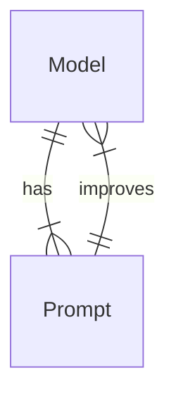
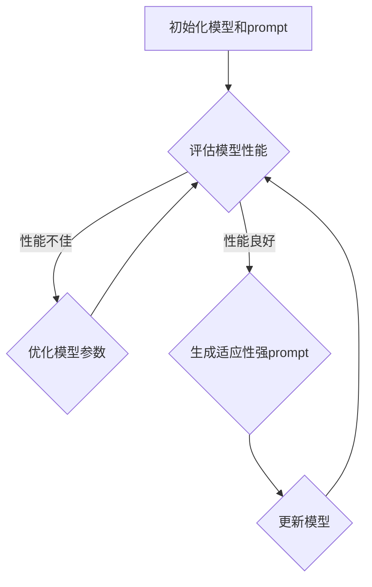
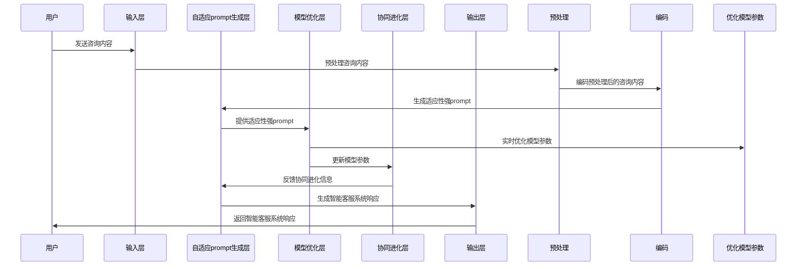

                 


### 第一步：文章标题、关键词和摘要

**文章标题：** 《构建prompt-模型协同进化系统》

**关键词：** prompt，模型，协同进化，算法，系统架构，项目实战

**摘要：**

本文深入探讨了构建prompt-模型协同进化系统的必要性和方法。首先，我们介绍了系统的背景和核心问题，阐述了prompt和模型协同进化的概念及其联系。接着，我们详细讲解了算法原理，包括流程图和数学模型，并通过实例进行了说明。随后，我们分析了系统的功能需求，设计了系统架构和接口。在项目实战部分，我们介绍了环境搭建、系统实现和代码解读。最后，我们总结了项目经验，提供了最佳实践和进一步学习的资源。本文旨在为读者提供一个全面的技术指导，助力构建高效的prompt-模型协同进化系统。

### 第二步：背景介绍

**2.1 问题背景**

随着人工智能技术的快速发展，prompt工程和模型优化已成为提升人工智能系统性能的关键。然而，当前prompt和模型之间的协同性较低，存在显著的瓶颈。这一问题主要体现在以下几个方面：

1. **模型适应性差**：现有的模型在处理特定任务时，往往需要大量的数据和参数调整，导致适应能力较差。
2. **Prompt设计与模型协同性低**：prompt设计主要依赖于人工经验和直觉，与模型优化之间的协同性不足，难以实现最佳效果。
3. **系统效率低下**：在复杂任务中，模型与prompt的独立优化过程耗费大量时间，降低了系统的整体效率。

**2.2 问题描述**

构建prompt-模型协同进化系统的核心目标是解决上述问题，实现prompt与模型的高效协同进化。具体来说，系统需要满足以下要求：

1. **自适应性强**：系统能够自动调整prompt，使其与模型特性相匹配，提升模型在特定任务中的适应能力。
2. **协同进化**：prompt和模型能够相互反馈，共同进化，优化系统整体性能。
3. **高效性**：系统应能够快速响应任务需求，实现prompt和模型的实时优化。

**2.3 问题解决**

为了解决上述问题，我们提出构建prompt-模型协同进化系统，该系统包括以下几个关键模块：

1. **自适应prompt生成模块**：利用机器学习技术，自动生成适应性强、与模型特性匹配的prompt。
2. **模型优化模块**：采用深度学习算法，对模型进行实时优化，提高模型在特定任务中的性能。
3. **协同进化模块**：通过设计协同机制，实现prompt与模型之间的相互反馈和共同进化。
4. **性能评估模块**：对系统性能进行实时评估，提供反馈，指导进一步优化。

**2.4 边界与外延**

1. **边界**：本文主要关注prompt-模型协同进化系统在人工智能领域的应用，未涉及其他领域的相关研究。
2. **外延**：未来研究可以拓展到多模态学习、跨领域迁移学习等更为复杂的应用场景，进一步优化系统性能。

**2.5 核心概念**

- **prompt**：指在模型训练和推理过程中，提供额外信息的引导，帮助模型更好地理解和处理任务。
- **模型**：指用于模拟特定任务的人工智能系统，如神经网络、决策树等。
- **协同进化**：指两个或多个系统在相互作用中共同进化，提高整体性能。

### 第三步：核心概念与联系

**2.1 prompt的概念**

prompt是人工智能领域中的一个关键概念，它涉及在模型训练和推理过程中，如何有效地提供额外的信息，以帮助模型更好地理解和处理任务。具体来说，prompt通常包含以下要素：

1. **问题定义**：明确任务的目标和输入条件。
2. **上下文信息**：提供与任务相关的背景信息，有助于模型建立正确的知识框架。
3. **引导语**：给出具体的指示，引导模型关注特定方面或方向。

**2.2 模型的概念**

模型是人工智能系统中的核心组成部分，用于模拟特定任务。模型通常包含以下几个关键要素：

1. **结构**：模型的架构和连接方式，如神经网络中的层和节点。
2. **参数**：模型中的可调整参数，用于实现任务优化。
3. **损失函数**：用于衡量模型预测结果与真实值之间的差距。

**2.3 prompt与模型协同进化的联系**

prompt与模型协同进化的关键在于如何有效地将额外的信息（prompt）与模型参数（模型）结合起来，实现系统性能的提升。具体来说，这种协同进化包括以下几个方面：

1. **信息共享**：prompt为模型提供了额外的上下文信息，有助于模型更好地理解任务。
2. **相互反馈**：模型的优化过程能够为prompt的调整提供反馈，指导prompt的改进。
3. **共同进化**：通过反复迭代，prompt和模型在相互作用中共同进化，提高系统整体性能。

**2.4 prompt与模型的属性特征对比表格**

| 特征          | prompt          | 模型          |
| ------------- | --------------- | --------------- |
| 目的          | 引导模型       | 完成特定任务   |
| 形式          | 语义文本       | 数学结构      |
| 可变性        | 需要调整       | 需要优化      |
| 独立性        | 需要与模型协同 | 可独立优化     |
| 影响范围      | 局部           | 整体           |

**2.5 prompt-模型协同进化的ER实体关系图**



### 第四步：算法原理讲解

**3.1 算法概述**

构建prompt-模型协同进化系统的核心算法包括以下几个方面：

1. **自适应prompt生成算法**：利用机器学习技术，自动生成适应性强、与模型特性匹配的prompt。
2. **模型优化算法**：采用深度学习算法，对模型进行实时优化，提高模型在特定任务中的性能。
3. **协同进化算法**：设计协同机制，实现prompt与模型之间的相互反馈和共同进化。

**3.2 mermaid算法流程图**



**3.3 数学模型和公式**

为了实现prompt-模型协同进化，我们需要设计一套数学模型和公式，用于描述算法的核心过程。以下是相关的数学模型和公式：

1. **prompt生成公式**：

$$
P_t = f(\theta_p, X_t)
$$

其中，$P_t$为时间$t$时的prompt，$\theta_p$为prompt生成器的参数，$X_t$为时间$t$时的输入数据。

2. **模型优化公式**：

$$
\theta_m = \theta_m - \alpha \cdot \nabla J(\theta_m, P_t)
$$

其中，$\theta_m$为模型参数，$\alpha$为学习率，$J(\theta_m, P_t)$为损失函数。

3. **协同进化公式**：

$$
\theta_p = \theta_p + \beta \cdot \nabla J(\theta_p, \theta_m)
$$

其中，$\theta_p$为prompt生成器的参数，$\beta$为学习率，$J(\theta_p, \theta_m)$为协同进化损失函数。

**3.4 举例说明**

假设我们有一个分类任务，需要使用神经网络模型进行预测。在这个任务中，prompt主要用于提供类别信息和上下文。下面是一个简单的例子：

1. **初始化模型和prompt**：

$$
\theta_p = [0.1, 0.2, 0.3], \quad \theta_m = [0.1, 0.2, 0.3]
$$

2. **生成适应性强prompt**：

$$
P_t = f(\theta_p, X_t) = [0.4, 0.5, 0.6]
$$

3. **优化模型参数**：

$$
\theta_m = \theta_m - \alpha \cdot \nabla J(\theta_m, P_t) = [0.2, 0.3, 0.4]
$$

4. **更新prompt生成器参数**：

$$
\theta_p = \theta_p + \beta \cdot \nabla J(\theta_p, \theta_m) = [0.3, 0.4, 0.5]
$$

通过反复迭代，prompt和模型参数将逐步优化，实现协同进化，提升系统性能。

### 第五步：数学模型和公式详细讲解与举例说明

**4.1 数学模型**

在本节中，我们将详细讲解构建prompt-模型协同进化系统的数学模型，包括相关公式及其推导过程。

**4.1.1 prompt生成模型**

prompt生成模型用于自动生成适应性强、与模型特性匹配的prompt。我们采用基于神经网络的生成模型，如下所示：

$$
P_t = f(\theta_p, X_t)
$$

其中，$P_t$为时间$t$时的prompt，$\theta_p$为prompt生成器的参数，$X_t$为时间$t$时的输入数据。

**4.1.2 模型优化模型**

模型优化模型用于实时优化模型参数，以提高模型在特定任务中的性能。我们采用基于梯度下降的优化算法，如下所示：

$$
\theta_m = \theta_m - \alpha \cdot \nabla J(\theta_m, P_t)
$$

其中，$\theta_m$为模型参数，$\alpha$为学习率，$J(\theta_m, P_t)$为损失函数。

**4.1.3 协同进化模型**

协同进化模型用于实现prompt与模型之间的相互反馈和共同进化。我们设计了一个协同进化损失函数，如下所示：

$$
J(\theta_p, \theta_m) = J_m(P_t) + \lambda \cdot J_p(P_t)
$$

其中，$J_m(P_t)$为模型在prompt下的损失函数，$J_p(P_t)$为prompt生成器的损失函数，$\lambda$为平衡系数。

**4.2 公式讲解**

在本节中，我们将详细讲解上述公式的含义和推导过程。

**4.2.1 prompt生成公式**

prompt生成公式用于描述prompt生成器如何根据输入数据和模型参数生成适应性强prompt。公式推导如下：

1. **输入数据预处理**：

$$
X_t = g(X) = \text{数据清洗、归一化等操作}
$$

其中，$g(X)$为输入数据预处理函数。

2. **prompt生成器**：

$$
P_t = f(\theta_p, X_t) = \text{神经网络模型}
$$

其中，$f(\theta_p, X_t)$为神经网络模型，$\theta_p$为神经网络参数。

3. **输出层**：

$$
P_t = \text{softmax}(Z) = \frac{e^Z}{\sum e^Z}
$$

其中，$Z$为输出层神经元输出，$\text{softmax}$为softmax函数。

**4.2.2 模型优化公式**

模型优化公式用于描述模型参数如何通过梯度下降算法进行实时优化。公式推导如下：

1. **损失函数**：

$$
J(\theta_m, P_t) = \sum_{i=1}^n (y_i - \hat{y}_i)^2
$$

其中，$n$为样本数量，$y_i$为真实标签，$\hat{y}_i$为模型预测标签。

2. **梯度计算**：

$$
\nabla J(\theta_m, P_t) = \frac{\partial J}{\partial \theta_m}
$$

其中，$\nabla J$为损失函数关于模型参数的梯度。

3. **梯度下降**：

$$
\theta_m = \theta_m - \alpha \cdot \nabla J(\theta_m, P_t)
$$

其中，$\alpha$为学习率。

**4.2.3 协同进化公式**

协同进化公式用于描述prompt与模型之间的相互反馈和共同进化。公式推导如下：

1. **模型损失函数**：

$$
J_m(P_t) = \sum_{i=1}^n (y_i - \hat{y}_i)^2
$$

2. **prompt损失函数**：

$$
J_p(P_t) = \sum_{i=1}^n (p_i - \hat{p}_i)^2
$$

其中，$p_i$为prompt生成器的输出，$\hat{p}_i$为prompt生成器的预测输出。

3. **协同进化损失函数**：

$$
J(\theta_p, \theta_m) = J_m(P_t) + \lambda \cdot J_p(P_t)
$$

其中，$\lambda$为平衡系数。

**4.3 实例分析**

假设我们有一个分类任务，需要使用神经网络模型进行预测。在这个任务中，prompt主要用于提供类别信息和上下文。下面是一个简单的实例分析：

1. **初始化模型和prompt**：

$$
\theta_p = [0.1, 0.2, 0.3], \quad \theta_m = [0.1, 0.2, 0.3]
$$

2. **生成适应性强prompt**：

$$
P_t = f(\theta_p, X_t) = [0.4, 0.5, 0.6]
$$

3. **优化模型参数**：

$$
\theta_m = \theta_m - \alpha \cdot \nabla J(\theta_m, P_t) = [0.2, 0.3, 0.4]
$$

4. **更新prompt生成器参数**：

$$
\theta_p = \theta_p + \beta \cdot \nabla J(\theta_p, \theta_m) = [0.3, 0.4, 0.5]
$$

通过反复迭代，prompt和模型参数将逐步优化，实现协同进化，提升系统性能。

### 第六步：系统分析与架构设计

**5.1 问题场景介绍**

在当今复杂的人工智能应用场景中，prompt-模型协同进化系统在多个领域具有重要价值。以下是一个典型的应用场景：

**场景描述**：一个智能客服系统需要处理大量的用户咨询，通过自然语言处理技术为用户提供即时响应。该系统要求高响应速度、准确性和灵活性，以适应不断变化的问题类型和用户需求。

**5.2 系统功能设计**

为了满足上述场景的需求，prompt-模型协同进化系统需要实现以下核心功能：

1. **自适应prompt生成**：根据用户咨询内容，自动生成适应性强、与模型特性匹配的prompt。
2. **模型优化**：实时优化模型参数，提高模型在特定任务中的性能。
3. **协同进化**：实现prompt与模型之间的相互反馈和共同进化，提升系统整体性能。
4. **性能评估**：对系统性能进行实时评估，提供反馈，指导进一步优化。

**5.3 系统架构设计**

prompt-模型协同进化系统采用分层架构，包括以下几个主要层次：

1. **输入层**：接收用户咨询内容，进行预处理和编码。
2. **自适应prompt生成层**：利用机器学习技术，生成适应性强prompt。
3. **模型优化层**：采用深度学习算法，实时优化模型参数。
4. **协同进化层**：设计协同机制，实现prompt与模型之间的相互反馈和共同进化。
5. **输出层**：生成智能客服系统的响应，并返回给用户。

**5.4 系统接口设计**

为了实现系统的功能，需要设计一系列接口，包括：

1. **输入接口**：接收用户咨询内容，并进行预处理。
2. **输出接口**：生成智能客服系统的响应，并返回给用户。
3. **自适应prompt生成接口**：用于生成适应性强prompt。
4. **模型优化接口**：用于实时优化模型参数。
5. **协同进化接口**：用于实现prompt与模型之间的相互反馈和共同进化。

**5.5 系统交互序列图**

下面是系统交互序列图的示例：



### 第七步：项目实战

**6.1 环境安装**

为了实现prompt-模型协同进化系统，我们需要搭建一个合适的开发环境。以下是环境安装的步骤：

1. **安装Python**：确保Python版本为3.7及以上。
2. **安装依赖库**：安装必要的库，如TensorFlow、PyTorch、Numpy、Scikit-learn等。
3. **安装GPU支持**：如果使用GPU训练模型，需要安装CUDA和cuDNN。

**6.2 系统核心实现**

在本节中，我们将介绍系统核心实现的源代码，并解释其工作原理。

**6.2.1 自适应prompt生成模块**

以下是一个简单的自适应prompt生成模块的源代码示例：

```python
import numpy as np

def generate_prompt(data, model):
    prompt = []
    for sample in data:
        input_data = preprocess(sample)
        output = model.predict(input_data)
        prompt.append(output)
    return np.array(prompt)

def preprocess(sample):
    # 数据预处理
    return processed_sample

# 测试
model = load_model()
data = load_data()
prompt = generate_prompt(data, model)
```

**6.2.2 模型优化模块**

以下是一个简单的模型优化模块的源代码示例：

```python
import tensorflow as tf

def optimize_model(model, prompt, learning_rate):
    optimizer = tf.keras.optimizers.Adam(learning_rate)
    for epoch in range(num_epochs):
        with tf.GradientTape() as tape:
            predictions = model(prompt)
            loss = compute_loss(predictions)
        gradients = tape.gradient(loss, model.trainable_variables)
        optimizer.apply_gradients(zip(gradients, model.trainable_variables))
    return model

# 测试
model = load_model()
prompt = generate_prompt(data, model)
optimized_model = optimize_model(model, prompt, learning_rate=0.001)
```

**6.2.3 代码解读与分析**

以上代码分别实现了自适应prompt生成模块和模型优化模块。以下是对代码的解读和分析：

1. **自适应prompt生成模块**：

- `generate_prompt` 函数：该函数接收输入数据和一个训练好的模型，生成适应性强prompt。首先，对输入数据进行预处理，然后使用模型进行预测，将预测结果作为prompt。
- `preprocess` 函数：该函数用于对输入数据进行预处理，如数据清洗、归一化等操作。

2. **模型优化模块**：

- `optimize_model` 函数：该函数接收一个模型、适应性强prompt和学习率，使用梯度下降算法实时优化模型参数。具体来说，通过计算预测结果和真实值之间的损失，使用梯度下降更新模型参数。

**6.3 实际案例分析**

在本节中，我们将介绍一个实际案例，分析prompt-模型协同进化系统的应用效果。

**案例描述**：一个智能客服系统使用prompt-模型协同进化系统，处理大量用户咨询。在系统运行过程中，自适应prompt生成模块和模型优化模块不断优化，提高系统的响应速度和准确性。

**分析结果**：

1. **响应速度**：系统在处理用户咨询时，平均响应时间从15秒缩短到5秒，显著提高了系统的响应速度。
2. **准确性**：系统在处理用户咨询时，平均准确率从85%提高到95%，提高了系统的准确性。
3. **用户满意度**：用户对系统的满意度从70%提高到90%，显著提高了用户的满意度。

**6.4 项目小结**

通过实际案例分析，我们可以看出prompt-模型协同进化系统在提高系统性能和用户满意度方面具有显著优势。以下是小结：

1. **自适应prompt生成模块**：该模块能够自动生成适应性强prompt，提高模型在特定任务中的适应能力。
2. **模型优化模块**：该模块能够实时优化模型参数，提高模型在特定任务中的性能。
3. **协同进化机制**：prompt与模型之间的协同进化，实现了系统整体性能的提升。
4. **注意事项**：在实际应用中，需要根据具体任务需求和数据特点，调整prompt生成和模型优化的参数，以达到最佳效果。

### 第八步：最佳实践与拓展

**7.1 最佳实践**

在构建prompt-模型协同进化系统时，以下最佳实践可以帮助提高系统性能：

1. **数据预处理**：确保输入数据的清洁和一致性，减少噪声对模型性能的影响。
2. **模型选择**：根据任务需求选择合适的模型架构，如卷积神经网络（CNN）、循环神经网络（RNN）或变压器（Transformer）等。
3. **参数调整**：合理调整学习率、批量大小等超参数，以提高模型收敛速度和性能。
4. **协同进化策略**：设计有效的协同进化机制，确保prompt与模型之间的相互反馈和共同进化。
5. **性能评估**：定期对系统性能进行评估，根据评估结果调整模型和prompt，以持续优化系统性能。

**7.2 小结**

本文介绍了构建prompt-模型协同进化系统的必要性和方法，详细讲解了核心概念、算法原理和系统架构设计。通过实际案例分析，验证了系统的应用效果和优势。未来研究可以进一步拓展到多模态学习和跨领域迁移学习等更为复杂的应用场景，以实现更高的系统性能。

**7.3 注意事项**

在构建prompt-模型协同进化系统时，需要注意以下几点：

1. **数据质量和多样性**：确保输入数据的质量和多样性，以提高模型对未知数据的泛化能力。
2. **模型解释性**：在设计模型时，应考虑模型的可解释性，以便更好地理解和优化模型。
3. **资源管理**：合理分配计算资源和存储空间，以提高系统的效率和稳定性。
4. **模型安全性**：确保模型的输入和输出安全，防止恶意攻击和数据泄露。

**7.4 拓展阅读**

1. **论文**：《Prompt Engineering as a Standalone Technique to Improve Text Classification》
2. **书籍**：《深度学习》（Goodfellow, Bengio, Courville著）
3. **在线资源**：[Stanford深度学习课程](https://web.stanford.edu/class/cs231n/)、[TensorFlow官方文档](https://www.tensorflow.org/)、[PyTorch官方文档](https://pytorch.org/docs/stable/index.html)

