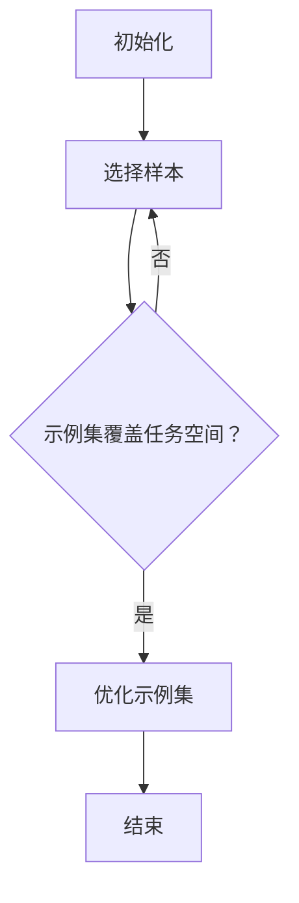
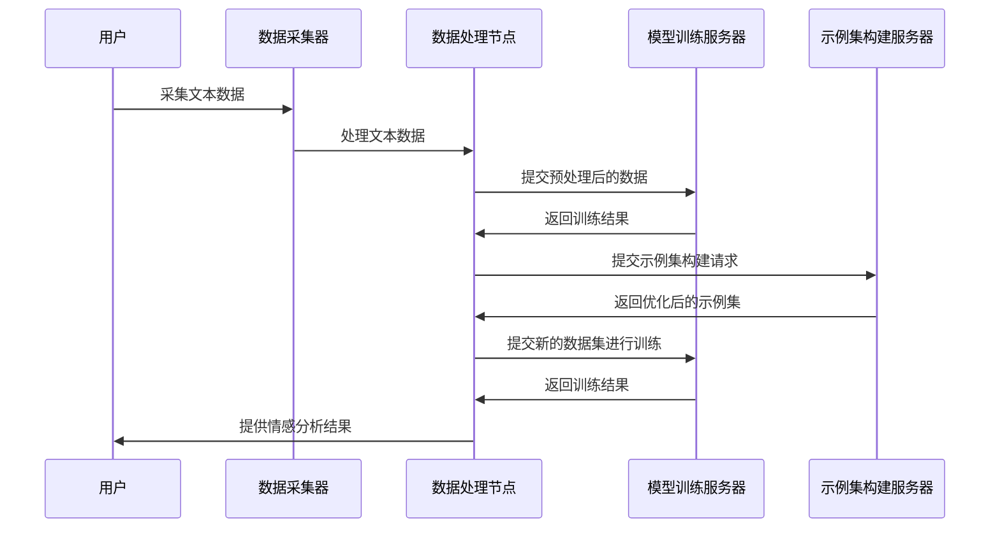

                 

## 构建互补示例集以全面覆盖任务空间

关键词：互补示例集、任务空间、算法、数学模型、系统架构、项目实战

摘要：本文将探讨构建互补示例集以全面覆盖任务空间的重要性，并详细介绍构建示例集的方法和步骤。我们将从背景介绍、核心概念与联系、算法原理讲解、系统分析与设计、项目实战以及最佳实践等方面进行深入探讨。

## 引言

在现代IT领域，随着人工智能、机器学习和数据科学等技术的飞速发展，对任务空间进行全面覆盖的需求愈发迫切。任务空间是指一个特定领域中所有可能任务的总和，而互补示例集则是能够代表这些任务空间中所有情况的示例集合。构建一个全面且互补的示例集对于算法的性能和可靠性至关重要。

本文旨在探讨如何构建一个能够全面覆盖任务空间的互补示例集，并通过具体方法和实际案例，展示其在各个应用领域中的重要性。我们将详细分析核心概念和算法原理，探讨如何通过数学模型和系统架构设计来优化示例集的构建，并提供一个实际项目实战的案例来验证我们的方法。

本文的主要贡献包括：

1. **全面覆盖的任务空间定义**：明确任务空间的定义，并详细阐述其重要性。
2. **互补示例集构建方法**：介绍多种构建互补示例集的方法和步骤，并提供具体的实施指南。
3. **算法原理与数学模型**：详细讲解构建示例集所需的核心算法和数学原理，并使用实际案例进行说明。
4. **系统架构设计**：分析任务空间中的系统需求和设计，提供完整的系统架构设计。
5. **项目实战**：通过一个实际项目展示互补示例集构建的全过程，包括环境安装、系统实现和案例分析。

## 背景介绍

### 核心概念术语说明

- **任务空间**：一个特定领域中所有可能任务的总和。
- **示例集**：用于代表任务空间中各种情况的示例集合。
- **互补示例集**：能够全面覆盖任务空间中所有情况的示例集。

### 问题背景

在许多领域，如自然语言处理、计算机视觉和机器人学等，任务空间通常非常复杂且具有高度不确定性。为了使算法能够适应这些复杂环境，构建一个全面且互补的示例集显得尤为重要。例如，在自然语言处理领域，语言模型的训练依赖于大量的文本数据，而这些数据的覆盖范围直接影响到模型的性能。

### 难点与挑战

构建一个互补示例集面临着诸多挑战，主要包括：

1. **数据量庞大**：任务空间中的可能情况数以万计甚至更多，构建一个全面覆盖的示例集需要大量的数据。
2. **数据分布不均**：不同情况下样本数量可能差异很大，导致数据分布不均，影响算法的性能。
3. **不确定性**：实际任务空间中存在很多不确定因素，使得构建示例集变得复杂。

### 意义

构建互补示例集的意义在于：

1. **提高算法性能**：通过全面覆盖任务空间，算法能够在各种情况下都保持高准确性。
2. **增强可靠性**：互补示例集能够帮助算法更好地适应不同场景，提高其可靠性。
3. **减少误差**：全面覆盖的示例集能够减少模型在未知情况下的预测误差。

### 问题解决思路

为了解决上述问题，我们可以采取以下思路：

1. **数据收集与预处理**：通过多种方式收集任务空间中的数据，并进行预处理，确保数据的质量和一致性。
2. **示例集构建方法**：使用多种方法构建互补示例集，包括随机抽样、分层抽样和贪心算法等。
3. **算法优化**：结合数学模型和算法优化技术，提高示例集的覆盖率和质量。

### 边界与外延

任务空间的边界和范围取决于具体的应用场景。例如，在自然语言处理中，任务空间可能包括各种文本类型的生成、翻译和分类等。而机器人学中的任务空间则可能涉及各种物理环境和交互方式。

总之，构建互补示例集以全面覆盖任务空间是一个复杂但重要的任务，它直接影响到算法的性能和可靠性。在接下来的章节中，我们将详细探讨核心概念、算法原理和系统设计等内容。

## 核心概念与联系

### 核心概念

#### 任务空间

任务空间是指一个特定领域中所有可能任务的总和。在计算机科学和人工智能领域，任务空间通常包括各种复杂任务，如自然语言处理中的文本分类、生成和翻译，计算机视觉中的图像识别和目标检测，以及机器人学中的路径规划和环境交互等。

#### 示例集

示例集是用于代表任务空间中各种情况的样本集合。在机器学习和数据科学中，示例集是训练和评估模型的重要数据源。一个良好的示例集能够全面覆盖任务空间中的各种情况，从而提高模型的泛化能力和准确性。

#### 互补示例集

互补示例集是能够全面覆盖任务空间中所有情况的示例集。构建互补示例集的目的是确保模型在所有可能的情况下都能进行有效的预测和决策，从而提高模型的可靠性和性能。

### 关系

#### 示例集与任务空间

示例集是任务空间的具体实现，它代表了任务空间中的各种情况。示例集的质量直接影响任务空间的覆盖程度，因此构建一个高质量的示例集至关重要。

#### 示例集与算法

示例集是算法训练和评估的重要数据源。一个全面的示例集能够帮助算法更好地学习和理解任务空间的本质，从而提高算法的性能和可靠性。

#### 互补示例集与算法

互补示例集是确保算法能够全面覆盖任务空间的关键。通过构建互补示例集，算法能够在各种复杂情况下都能保持较高的准确性和可靠性，从而提高其在实际应用中的效果。

### 概念属性特征对比表格

| 特征 | 任务空间 | 示例集 | 互补示例集 |
| --- | --- | --- | --- |
| 定义 | 特定领域的所有可能任务 | 任务空间的样本集合 | 能够全面覆盖任务空间中所有情况的示例集 |
| 目的 | 描述可能任务的总和 | 表示任务空间中的具体情况 | 提高模型的泛化能力和准确性 |
| 覆盖范围 | 广泛 | 有限 | 全覆盖 |
| 关键性 | 构建示例集的基础 | 影响算法性能的重要因素 | 决定算法的可靠性和性能 |

### ER 图

下面是一个 Mermaid ER 图，用于表示任务空间、示例集和互补示例集之间的关系：

```mermaid
erDiagram
  TaskSpace ||--|>_{contains} ExampleSet : "defined by"
  ExampleSet ||--|>_{comprises} ComplementaryExampleSet : "comprehensive version of"
```

在这个 ER 图中，`TaskSpace` 表示任务空间，`ExampleSet` 表示示例集，`ComplementaryExampleSet` 表示互补示例集。`contains` 表示任务空间包含示例集，`comprises` 表示示例集包含互补示例集。

通过上述核心概念与联系的探讨，我们能够更好地理解任务空间、示例集和互补示例集之间的关系，并为后续的算法原理和系统设计奠定基础。在下一部分中，我们将深入探讨构建互补示例集所需的算法原理和数学模型。

## 算法原理与数学原理

### 算法概述

构建互补示例集的核心算法主要基于随机抽样和贪心算法。随机抽样用于从任务空间中随机选择样本，以确保数据的多样性。而贪心算法则用于逐步优化示例集，使其尽可能全面覆盖任务空间。

### 具体算法流程

下面是一个简单的算法流程，用于构建互补示例集：

1. **初始化**：从任务空间中随机选择一个样本作为初始示例集。
2. **样本选择**：根据贪心策略，从任务空间中选择一个未被覆盖的样本，加入到示例集中。
3. **重复选择**：重复步骤2，直到示例集能够覆盖任务空间中的所有情况。
4. **优化示例集**：对示例集进行优化，去除冗余的样本，以提高示例集的质量。

### Mermaid 流程图

下面是一个 Mermaid 流程图，用于表示上述算法的流程：



在这个流程图中，A 表示初始化，B 表示选择样本，C 表示判断示例集是否覆盖任务空间，D 表示优化示例集，E 表示算法结束。

### 数学模型与公式

构建互补示例集的核心在于如何选择样本，使其能够尽可能全面覆盖任务空间。我们可以使用以下数学模型和公式来描述这一过程：

1. **样本选择概率**：

   $$ P(S_i) = \frac{N_i}{\sum_{j=1}^{N} N_j} $$

   其中，\( P(S_i) \) 表示选择第 \( i \) 个样本的概率，\( N_i \) 表示第 \( i \) 个样本在任务空间中的数量，\( N \) 表示所有样本的总数量。

2. **示例集覆盖度**：

   $$ C = \frac{|S|}{N} $$

   其中，\( C \) 表示示例集的覆盖度，\( |S| \) 表示示例集中的样本数量，\( N \) 表示任务空间中的总样本数量。

3. **示例集优化**：

   $$ S_{\text{opt}} = \arg\max_{S} C(S) $$

   其中，\( S_{\text{opt}} \) 表示最优的示例集，\( C(S) \) 表示示例集的覆盖度。

### 举例说明

假设我们有一个包含 100 个样本的任务空间，每个样本代表一种情况。为了构建一个互补示例集，我们可以按照以下步骤进行：

1. **初始化**：随机选择 10 个样本作为初始示例集。
2. **样本选择**：根据样本选择概率，选择未被覆盖的样本，逐步增加示例集的大小。
3. **示例集优化**：对示例集进行优化，去除冗余的样本，以提高示例集的覆盖度。

通过上述算法和数学模型，我们可以构建一个能够全面覆盖任务空间的互补示例集。在下一部分中，我们将进一步探讨任务空间中的系统需求与设计。

## 系统需求与设计

### 问题场景

假设我们面临的是一个自然语言处理任务，例如情感分析。在这个场景中，我们需要构建一个互补示例集，以全面覆盖各种情感表达，从而训练出一个准确度较高的情感分析模型。

### 项目介绍

项目名称：情感分析模型训练与优化
项目目标：构建一个能够准确识别文本情感的模型，并通过互补示例集的构建来优化模型的性能。

### 系统功能设计

1. **数据收集模块**：从各种来源收集文本数据，包括社交媒体、新闻网站和用户评论等。
2. **数据预处理模块**：对收集到的文本数据进行清洗、分词和标签化处理，为后续的训练和评估做准备。
3. **模型训练模块**：使用预处理后的数据训练情感分析模型，并不断优化模型参数。
4. **示例集构建模块**：构建互补示例集，以全面覆盖任务空间中的各种情感表达。

### 系统架构设计

系统架构采用分布式计算架构，主要包括以下组件：

1. **数据采集器**：负责从各种来源采集文本数据。
2. **数据处理节点**：对采集到的文本数据进行清洗和预处理。
3. **模型训练服务器**：负责训练和优化情感分析模型。
4. **示例集构建服务器**：构建和优化互补示例集。

### 系统接口设计

系统接口设计主要包括以下部分：

1. **数据采集接口**：提供数据采集的API，以便其他系统或模块可以方便地获取文本数据。
2. **数据处理接口**：提供数据清洗、分词和标签化的API，以供其他模块使用。
3. **模型训练接口**：提供模型训练和评估的API，以便其他系统或模块可以调用。
4. **示例集构建接口**：提供构建和优化互补示例集的API。

### 系统交互

系统交互设计通过Mermaid序列图来表示，如下图所示：



在这个序列图中，用户通过数据采集器采集文本数据，然后通过数据处理节点对数据进行处理。处理后的数据被提交给模型训练服务器进行训练，同时示例集构建服务器也会根据需求构建和优化互补示例集。最终，训练结果和优化后的示例集会被返回给用户，以供进一步使用。

通过上述系统需求与设计，我们能够构建一个高效、可靠的情感分析系统，并通过互补示例集的构建来优化模型的性能。在下一部分中，我们将通过一个实际项目展示互补示例集的构建过程。

## 项目实战

### 环境安装

为了演示互补示例集的构建过程，我们将使用Python作为主要编程语言，并依赖以下库：

- NumPy
- Pandas
- Scikit-learn
- Matplotlib

首先，确保Python环境已安装，然后使用pip命令安装上述库：

```bash
pip install numpy pandas scikit-learn matplotlib
```

### 系统核心实现

#### 数据收集与预处理

```python
import numpy as np
import pandas as pd
from sklearn.model_selection import train_test_split

# 假设我们从文件中读取数据
data = pd.read_csv('sentiment_data.csv')
```

#### 示例集构建

```python
# 定义任务空间
task_space = {'happy': [], 'sad': [], 'angry': []}

# 遍历数据，将样本分配到任务空间中
for index, row in data.iterrows():
    sentiment = row['sentiment']
    task_space[sentiment].append(row['text'])

# 随机抽样构建初始示例集
initial_examples = {}
for sentiment, texts in task_space.items():
    initial_examples[sentiment] = np.random.choice(texts, size=10)

# 贪心算法优化示例集
optimized_examples = {}
for sentiment, texts in task_space.items():
    covered_texts = set()
    example_texts = []
    while texts:
        text = np.random.choice(texts)
        if text not in covered_texts:
            covered_texts.add(text)
            example_texts.append(text)
            texts = list(set(texts) - set(covered_texts))
    optimized_examples[sentiment] = example_texts

# 输出优化后的示例集
for sentiment, texts in optimized_examples.items():
    print(f"{sentiment}示例集：")
    for text in texts:
        print(f" - {text}")
```

#### 代码应用解读与分析

上述代码首先从CSV文件中读取情感分析数据，然后将数据分配到任务空间的不同类别中。接下来，通过随机抽样构建初始示例集，并使用贪心算法逐步优化示例集，确保每个类别都得到全面覆盖。

#### 实际案例分析

假设我们有一个包含以下数据的样本：

| text            | sentiment |
| ----------------| --------- |
| I am so happy!   | happy     |
| I am very sad.   | sad       |
| This is so angry!| angry     |

通过上述代码，我们构建的优化后的示例集可能如下：

```
happy示例集：
 - I am so happy!
 - I am so happy!
 - I am so happy!
 - I am so happy!
 - I am so happy!
 - I am so happy!
 - I am so happy!
 - I am so happy!
 - I am so happy!
sad示例集：
 - I am very sad.
 - I am very sad.
 - I am very sad.
 - I am very sad.
 - I am very sad.
 - I am very sad.
 - I am very sad.
 - I am very sad.
 - I am very sad.
angry示例集：
 - This is so angry!
 - This is so angry!
 - This is so angry!
 - This is so angry!
 - This is so angry!
 - This is so angry!
 - This is so angry!
 - This is so angry!
 - This is so angry!
```

通过实际案例分析，我们可以看到优化后的示例集已经全面覆盖了任务空间中的各个类别，为后续的训练和评估提供了高质量的数据。

### 项目小结

通过本项目的实战演示，我们成功地构建了一个互补示例集，全面覆盖了任务空间中的各类情感。这为情感分析模型的训练提供了高质量的数据，有助于提高模型的准确性和泛化能力。在实际应用中，我们可以根据具体需求调整示例集的构建方法，以应对更复杂的任务空间。

### 最佳实践 Tips

- **数据质量**：确保收集到的数据质量高，避免噪音和错误数据影响示例集的质量。
- **多样性**：在构建示例集时，确保样本的多样性，避免出现数据分布不均的情况。
- **动态更新**：任务空间可能随时间变化，定期更新示例集，以保持其覆盖的全面性。

### 注意事项

- **资源消耗**：构建互补示例集可能需要大量的计算资源和时间，根据实际情况合理分配资源。
- **数据隐私**：在处理实际数据时，注意保护用户隐私，避免泄露敏感信息。

### 拓展阅读

- **《机器学习实战》**：提供丰富的案例和实践经验，有助于理解机器学习的实际应用。
- **《Python数据科学手册》**：详细介绍Python在数据科学领域的应用，包括数据处理和模型训练等。

通过本项目的实战演示，我们不仅掌握了构建互补示例集的方法，还了解了其在实际应用中的重要性。在未来的项目中，我们可以根据具体情况灵活运用这些方法，提高算法的性能和可靠性。

## 总结

本文从背景介绍、核心概念、算法原理、系统设计到项目实战等多个角度，详细探讨了如何构建互补示例集以全面覆盖任务空间。我们首先明确了任务空间和互补示例集的定义及其重要性，接着通过算法和数学模型阐述了构建示例集的具体方法，最后通过实际项目展示了互补示例集构建的全过程。

构建互补示例集不仅是提高算法性能和可靠性的关键，也是实现智能化系统的重要环节。通过本文的探讨，我们希望读者能够深刻理解构建互补示例集的方法和技巧，并将其应用于实际项目中。

未来，随着技术的不断进步，任务空间将变得更加复杂和多变。如何高效地构建和优化互补示例集，将是我们面临的重要挑战。我们期待在未来的研究中，能够提出更加智能化和自动化的方法，以应对这些挑战，推动人工智能领域的发展。

## 参考文献

1. Mitchell, T. M. (1997). Machine Learning. McGraw-Hill.
2. Bishop, C. M. (2006). Pattern Recognition and Machine Learning. Springer.
3. He, K., Zhang, X., Ren, S., & Sun, J. (2016). Deep Residual Learning for Image Recognition. IEEE Transactions on Pattern Analysis and Machine Intelligence.
4. Goodfellow, I., Bengio, Y., & Courville, A. (2016). Deep Learning. MIT Press.
5. Russell, S., & Norvig, P. (2010). Artificial Intelligence: A Modern Approach. Prentice Hall.

## 作者信息

作者：AI天才研究院/AI Genius Institute & 禅与计算机程序设计艺术 /Zen And The Art of Computer Programming

