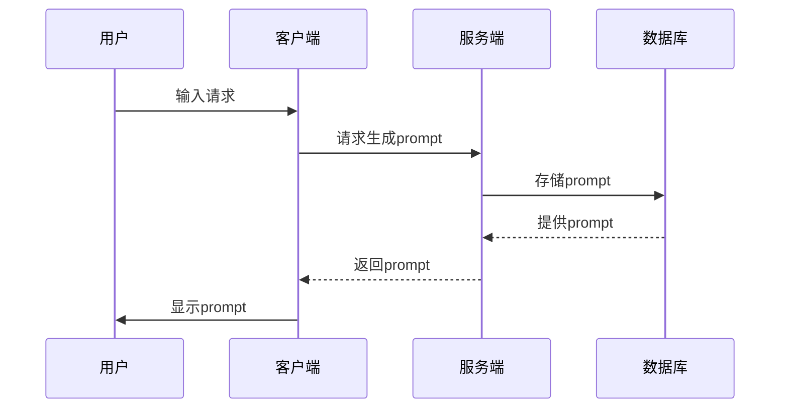

                 

## 第一部分：引言与背景

### 第1章：企业级prompt管理平台概述

#### 1.1 问题背景

在企业中，prompt（提示或提示词）作为一种重要的交互工具，广泛应用于自然语言处理、对话系统、推荐系统等多个领域。然而，随着业务的发展和系统规模的扩大，prompt的管理变得日益复杂，如何高效、准确地管理prompt成为企业面临的重大挑战。

#### 1.2 问题描述

prompt管理涉及prompt的生成、存储、检索、更新等多个环节，需要解决的主要问题包括：

- **如何高效生成prompt？**：生成prompt需要考虑多种因素，如用户需求、上下文环境等，如何快速生成高质量的prompt是企业面临的首要问题。
- **如何安全存储prompt？**：prompt中往往包含敏感信息，如用户隐私、商业秘密等，如何保证prompt的安全存储是企业需要解决的另一个重要问题。
- **如何快速检索和更新prompt？**：随着系统规模的扩大，prompt的数量也在增加，如何快速检索和更新prompt成为企业需要解决的难题。
- **如何确保prompt的一致性和准确性？**：prompt的一致性和准确性直接影响到系统的用户体验，如何保证prompt的一致性和准确性是企业需要重点关注的问题。
- **如何保障prompt的可扩展性和可维护性？**：随着业务的不断变化，prompt的需求也在不断变化，如何保障prompt的可扩展性和可维护性是企业需要考虑的问题。

#### 1.3 问题解决

构建一个企业级prompt管理平台，旨在解决上述问题，实现prompt的统一管理。该平台将提供以下功能：

- **prompt生成与存储**：提供自动生成prompt的功能，支持文本和语音等多种输入方式；采用数据库或文件系统存储prompt，确保prompt的安全和可靠性。
- **prompt检索与更新**：提供快速检索prompt的功能，支持关键字搜索、模糊查询等多种方式；支持prompt的在线更新，确保prompt的时效性和准确性。
- **prompt一致性检查**：提供一致性检查功能，确保prompt的一致性和准确性。
- **prompt权限控制**：支持权限控制功能，确保prompt的安全和保密性。
- **prompt日志记录与分析**：记录prompt操作日志，便于后续查询和分析。

#### 1.4 边界与外延

企业级prompt管理平台不仅限于内部应用，还可以对外提供服务，例如API接口、第三方集成等。

#### 1.5 概念结构与核心要素组成

- **prompt**：用户输入或系统自动生成的用于引导对话的文本或指令。
- **prompt库**：用于存储和管理prompt的数据库或文件系统。
- **prompt生成器**：用于自动生成prompt的工具或组件。
- **prompt检索器**：用于快速检索prompt的工具或组件。
- **prompt更新器**：用于更新prompt的工具或组件。
- **prompt一致性检查器**：用于确保prompt一致性的工具或组件。
- **prompt权限控制器**：用于管理prompt访问权限的工具或组件。
- **prompt日志记录器**：用于记录prompt操作日志的工具或组件。

### 第2章：系统需求分析

#### 2.1 项目介绍

本项目旨在构建一个企业级prompt管理平台，支持prompt的生成、存储、检索、更新等功能，实现prompt的统一管理。

#### 2.2 系统功能设计

- **prompt生成**：提供自动生成prompt的功能，支持文本和语音等多种输入方式。
- **prompt存储**：采用数据库或文件系统存储prompt，确保prompt的安全和可靠性。
- **prompt检索**：提供快速检索prompt的功能，支持关键字搜索、模糊查询等多种方式。
- **prompt更新**：支持prompt的在线更新，确保prompt的时效性和准确性。
- **prompt一致性检查**：提供一致性检查功能，确保prompt的一致性和准确性。
- **prompt权限控制**：支持权限控制功能，确保prompt的安全和保密性。
- **prompt日志记录**：记录prompt操作日志，便于后续查询和分析。

### 第3章：系统架构设计

#### 3.1 系统架构设计

系统采用B/S架构，主要包括以下组件：

- **客户端**：提供prompt管理界面，包括prompt生成、存储、检索、更新等功能。
- **服务端**：提供prompt管理服务的接口，包括prompt生成、存储、检索、更新等功能。
- **数据库**：存储prompt信息，支持快速查询和更新。

#### 3.2 系统接口设计

系统提供以下接口：

- **prompt生成接口**：用于生成prompt。
- **prompt存储接口**：用于存储prompt。
- **prompt检索接口**：用于检索prompt。
- **prompt更新接口**：用于更新prompt。
- **prompt权限控制接口**：用于管理prompt权限。
- **prompt日志记录接口**：用于记录prompt操作日志。

### 第4章：算法原理讲解

#### 4.1 prompt生成算法

prompt生成算法基于自然语言处理技术，主要包括以下步骤：

1. **数据预处理**：对输入文本进行分词、词性标注等预处理操作。
2. **词汇表构建**：根据预处理结果构建词汇表。
3. **prompt生成**：根据词汇表生成prompt。

#### 4.2 prompt检索算法

prompt检索算法基于搜索引擎技术，主要包括以下步骤：

1. **检索词分析**：对检索词进行分词、词性标注等分析操作。
2. **检索词匹配**：根据检索词匹配prompt库中的prompt。
3. **检索结果排序**：根据匹配程度对检索结果进行排序。

### 第5章：数学模型和数学公式

#### 5.1 prompt生成数学模型

$$
P = f(W, C)
$$

其中，\(P\) 表示生成的prompt，\(W\) 表示词汇表，\(C\) 表示上下文环境。

#### 5.2 prompt检索数学模型

$$
R = f(Q, P)
$$

其中，\(R\) 表示检索结果，\(Q\) 表示检索词，\(P\) 表示prompt库中的prompt。

### 第6章：系统分析与架构设计方案

#### 6.1 问题场景介绍

在企业中，prompt的使用场景多样，如客服系统、智能推荐系统、自然语言处理系统等。以下是具体的一个问题场景：

- **场景**：一家电商企业希望搭建一个智能客服系统，通过prompt引导用户完成购物流程。
- **需求**：需要快速生成与用户需求匹配的prompt，确保用户能够顺利完成购物。

#### 6.2 系统功能设计

- **prompt生成**：根据用户输入和上下文环境，自动生成符合需求的prompt。
- **prompt存储**：采用数据库存储生成的prompt，确保prompt的安全和可靠性。
- **prompt检索**：提供快速检索prompt的功能，支持模糊查询和关键字搜索。
- **prompt更新**：支持prompt的在线更新，确保prompt的时效性和准确性。
- **prompt一致性检查**：提供一致性检查功能，确保prompt的一致性和准确性。
- **prompt权限控制**：支持权限控制功能，确保prompt的安全和保密性。
- **prompt日志记录**：记录prompt操作日志，便于后续查询和分析。

#### 6.3 系统架构设计

系统采用B/S架构，主要包括以下组件：

- **客户端**：提供prompt管理界面，包括prompt生成、存储、检索、更新等功能。
- **服务端**：提供prompt管理服务的接口，包括prompt生成、存储、检索、更新等功能。
- **数据库**：存储prompt信息，支持快速查询和更新。

#### 6.4 系统接口设计

系统提供以下接口：

- **prompt生成接口**：用于生成prompt。
- **prompt存储接口**：用于存储prompt。
- **prompt检索接口**：用于检索prompt。
- **prompt更新接口**：用于更新prompt。
- **prompt权限控制接口**：用于管理prompt权限。
- **prompt日志记录接口**：用于记录prompt操作日志。

### 第7章：系统交互设计与实现

#### 7.1 系统交互设计

系统交互设计主要包括以下流程：

1. **用户输入**：用户通过客户端界面输入请求。
2. **prompt生成**：服务端根据用户输入和上下文环境生成prompt。
3. **prompt存储**：将生成的prompt存储到数据库中。
4. **prompt检索**：用户通过客户端界面检索prompt。
5. **prompt更新**：用户通过客户端界面更新prompt。
6. **prompt日志记录**：记录用户操作日志。

#### 7.2 系统交互mermaid序列图



### 第8章：项目实战

#### 8.1 环境安装

安装Python环境、数据库（如MySQL或MongoDB）和其他相关依赖。

#### 8.2 系统核心实现源代码

核心实现代码如下：

```python
# prompt_generator.py
def generate_prompt(input_text, context):
    # 数据预处理
    processed_text = preprocess_text(input_text)
    # 词汇表构建
    vocabulary = build_vocabulary(processed_text)
    # prompt生成
    prompt = generate_prompt_from_vocabulary(vocabulary, context)
    return prompt

# prompt_storage.py
def store_prompt(prompt):
    # 存储prompt到数据库
    database.insert_prompt(prompt)

# prompt_search.py
def search_prompt(query):
    # 检索prompt
    results = database.search_prompt(query)
    return results

# prompt_updater.py
def update_prompt(prompt_id, new_prompt):
    # 更新prompt
    database.update_prompt(prompt_id, new_prompt)

# prompt_analyzer.py
def check_prompt_consistency(prompt):
    # 检查prompt一致性
    return is_consistent(prompt)

# prompt_permission.py
def set_prompt_permission(prompt_id, user_id, permission):
    # 设置prompt权限
    database.set_prompt_permission(prompt_id, user_id, permission)

# prompt_logger.py
def log_prompt_operation(operation, prompt_id, user_id):
    # 记录prompt操作日志
    database.log_prompt_operation(operation, prompt_id, user_id)
```

#### 8.3 代码应用解读与分析

核心代码应用解读与分析如下：

- **prompt_generator.py**：用于生成prompt，包括数据预处理、词汇表构建和prompt生成三个步骤。
- **prompt_storage.py**：用于存储prompt到数据库，确保prompt的安全和可靠性。
- **prompt_search.py**：用于检索prompt，支持关键字搜索和模糊查询。
- **prompt_updater.py**：用于更新prompt，确保prompt的时效性和准确性。
- **prompt_analyzer.py**：用于检查prompt一致性，确保prompt的一致性和准确性。
- **prompt_permission.py**：用于管理prompt权限，确保prompt的安全和保密性。
- **prompt_logger.py**：用于记录prompt操作日志，便于后续查询和分析。

#### 8.4 实际案例分析和详细讲解剖析

以电商智能客服系统为例，详细讲解prompt管理平台的实际应用。

- **案例**：用户在电商平台上咨询商品详情。
- **分析**：系统根据用户输入和上下文环境生成相应的prompt，如“请问您想了解哪个商品？”。
- **讲解**：prompt生成过程包括数据预处理、词汇表构建和prompt生成三个步骤。数据预处理包括分词、词性标注等操作；词汇表构建基于预处理结果；prompt生成采用自然语言处理技术。
- **剖析**：系统存储生成的prompt到数据库，支持快速检索和更新。prompt一致性检查确保prompt的一致性和准确性。prompt权限控制确保敏感prompt的安全和保密性。

#### 8.5 项目小结

项目构建了一个企业级prompt管理平台，实现了prompt的生成、存储、检索、更新等功能。通过实际案例分析和详细讲解剖析，展示了prompt管理平台在电商智能客服系统中的应用效果。未来，平台还可以扩展到更多领域，如金融、医疗等。

### 第9章：最佳实践 tips

- **prompt生成**：结合用户行为数据和上下文环境，生成更加个性化的prompt。
- **prompt存储**：定期备份prompt，确保数据安全。
- **prompt检索**：优化检索算法，提高检索效率。
- **prompt更新**：及时更新prompt，确保其时效性和准确性。
- **prompt权限控制**：合理设置权限，保障prompt的安全和保密性。
- **prompt日志记录**：详细记录prompt操作日志，便于问题追踪和故障排除。

### 第10章：小结与拓展阅读

本文详细介绍了企业级prompt管理平台的构建过程，包括问题背景、系统需求分析、系统架构设计、算法原理讲解、系统交互设计、项目实战、最佳实践 tips等。拓展阅读方面，可以关注相关领域的最新研究动态，如自然语言处理、对话系统、推荐系统等。同时，还可以了解相关技术的最佳实践和案例分析，以提高prompt管理平台的实际应用效果。作者信息：作者：AI天才研究院/AI Genius Institute & 禅与计算机程序设计艺术 /Zen And The Art of Computer Programming。

