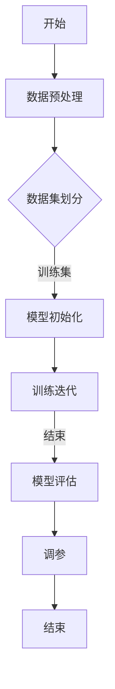

                 


### 1. 引言

#### 核心概念与联系

**术语说明：**
- **大语言模型（LLM）：** 指基于深度学习技术训练的、能够处理和理解自然语言的模型。
- **可复用组件：** 能够在不同应用程序中被重用的软件模块，它们具备独立的功能性，易于配置和集成。

**概念属性特征对比表格：**

| 特征               | 大语言模型（LLM）                | 可复用组件                     |
|------------------|-------------------------------|-----------------------------|
| **功能**           | 自然语言理解、生成和推理           | 提供特定功能，如数据预处理、模型训练等     |
| **独立性**         | 独立的模型，不需要依赖其他模型       | 独立运行，无需外部依赖           |
| **可配置性**       | 可以调整模型参数和超参数           | 可以根据需求配置功能和参数       |
| **重用性**         | 针对特定任务优化，可跨任务复用       | 具有通用性，可适用于多种任务       |
| **交互性**         | 可以与其他系统组件进行数据交换       | 可以与多种应用程序进行集成       |

**ER实体关系图架构的 Mermaid 流程图：**

```mermaid
erDiagram
  Component ||--|{ Model } Model
  Component ||--|{ Application } Application
  Model ||--|{ Dataset } Dataset
  Application ||--|{ User } User
```

#### 背景介绍

大语言模型（LLM）是近年来人工智能领域的突破性进展，其在自然语言处理（NLP）任务中展现了极高的性能。LLM 可以处理复杂的语言任务，如文本生成、问答系统、翻译等。然而，随着LLM应用的广泛普及，如何构建可复用的LLM应用组件库成为了一个重要的课题。

在软件开发中，可复用组件是提高开发效率和质量的关键。通过设计可复用的LLM组件，开发者可以快速搭建新应用，减少重复劳动，降低维护成本。本章节将介绍构建可复用的LLM应用组件库的核心概念和设计原则，为后续内容奠定基础。

### 2. LLM组件的基本架构

LLM组件的设计和实现是构建可复用应用库的关键。一个典型的LLM组件包括数据预处理、模型训练、模型评估和模型应用等模块。下面，我们将逐一介绍这些模块的功能和实现。

#### 2.1 数据预处理模块

数据预处理是LLM组件的基础，其目的是将原始数据转换为适合模型训练的格式。数据预处理模块通常包括以下功能：

- **数据清洗**：去除数据中的噪声和不一致信息。
- **数据格式化**：统一数据格式，确保数据的一致性。
- **数据增强**：通过增加数据多样性，提高模型泛化能力。

实现上，可以使用Python的Pandas、NumPy等库进行数据处理，或者使用专业的NLP工具，如spaCy、NLTK等。

#### 2.2 模型训练模块

模型训练模块负责加载预处理后的数据，并使用深度学习算法训练模型。其核心步骤包括：

- **数据加载**：读取预处理后的数据，分为训练集、验证集和测试集。
- **模型初始化**：选择合适的神经网络架构，初始化模型参数。
- **训练过程**：迭代训练模型，通过反向传播算法更新参数。
- **调参技巧**：根据验证集的性能，调整模型参数，如学习率、批次大小等。

实现上，可以使用TensorFlow、PyTorch等深度学习框架。

#### 2.3 模型评估模块

模型评估模块用于评估训练好的模型性能。常用的评估指标包括准确率、召回率、F1分数等。评估模块的核心步骤包括：

- **评估指标**：定义评估模型性能的指标。
- **模型测试**：在测试集上运行模型，计算评估指标。
- **调优方法**：根据评估结果，调整模型结构和参数。

实现上，可以使用Scikit-learn等机器学习库。

#### 2.4 模型应用模块

模型应用模块将训练好的模型部署到实际应用中，提供预测服务。其核心步骤包括：

- **模型加载**：从存储介质中加载训练好的模型。
- **接口设计**：设计API接口，接收用户输入并提供预测结果。
- **模型推理**：使用加载的模型进行推理，返回预测结果。

实现上，可以使用Flask、Django等Web框架。

#### 算法原理讲解

在构建LLM组件时，算法原理的理解至关重要。以下是一个简单的模型训练算法的Mermaid流程图：



模型训练算法的Python实现如下：

```python
import tensorflow as tf
from tensorflow.keras.models import Sequential
from tensorflow.keras.layers import Dense
from sklearn.model_selection import train_test_split

# 数据预处理
# ...

# 数据集划分
X_train, X_test, y_train, y_test = train_test_split(X, y, test_size=0.2, random_state=42)

# 模型初始化
model = Sequential()
model.add(Dense(units=128, activation='relu', input_shape=(input_shape,)))
model.add(Dense(units=1, activation='sigmoid'))

# 训练迭代
model.compile(optimizer='adam', loss='binary_crossentropy', metrics=['accuracy'])
model.fit(X_train, y_train, epochs=10, batch_size=32, validation_data=(X_test, y_test))

# 模型评估
# ...

# 调参
# ...
```

### 3. 构建可复用组件的设计原则

构建可复用的LLM组件需要遵循一系列设计原则，以确保组件的通用性、可维护性和可扩展性。以下是一些关键的设计原则：

#### 3.1 分层设计

分层设计是将系统划分为多个层次，每个层次负责不同的功能。例如，可以将LLM组件划分为数据层、模型层、接口层等。这种设计有助于提高组件的模块化和可复用性。

#### 3.2 定义清晰的接口

清晰的接口是组件可复用的关键。接口应明确定义输入参数、输出参数和功能行为。通过良好的接口设计，组件可以与其他系统组件无缝集成。

#### 3.3 保持最小依赖

组件应尽可能减少对其他系统的依赖，以增强其独立性和可复用性。通过使用标准的API和协议，可以降低组件之间的耦合度。

#### 3.4 可配置性和灵活性

组件应提供灵活的配置选项，允许开发者根据具体需求调整组件的行为。例如，可以提供配置文件或参数化的接口。

#### 3.5 单一职责原则

单一职责原则要求组件只完成一个明确的功能，避免功能混杂。这样可以提高组件的可维护性和可复用性。

#### 3.6 自动化测试

自动化测试是确保组件质量和可复用性的关键。通过编写单元测试和集成测试，可以快速发现和修复组件中的问题。

### 4. 最佳实践

在构建可复用的LLM应用组件库时，遵循最佳实践可以提高组件的质量和可复用性。以下是一些最佳实践：

#### 4.1 使用版本控制

使用版本控制工具（如Git）管理组件代码，确保代码的版本可追溯性和可维护性。

#### 4.2 完善文档

编写详细的组件文档，包括功能描述、接口定义、配置指南和代码注释。这有助于其他开发者理解和复用组件。

#### 4.3 社区合作

鼓励社区贡献，通过开源项目吸引更多的开发者参与，共同改进和扩展组件库。

#### 4.4 持续集成和部署

使用持续集成和部署（CI/CD）流程，自动化测试和部署组件，提高开发效率和稳定性。

### 5. 小结

本章介绍了构建可复用的LLM应用组件库的基本架构和设计原则。通过分层设计、定义清晰的接口、保持最小依赖、可配置性和灵活性等原则，开发者可以构建高质量、可复用的组件。同时，遵循最佳实践，如使用版本控制、完善文档、社区合作和持续集成等，可以提高组件库的质量和可复用性。

### 6. 注意事项

在构建可复用的LLM应用组件库时，需要注意以下事项：

- **性能优化**：确保组件的运行效率，避免资源浪费。
- **安全考虑**：保护用户数据和模型权重，防止数据泄露和滥用。
- **兼容性**：考虑不同操作系统、编程语言和深度学习框架的兼容性。
- **维护和更新**：定期维护和更新组件库，修复漏洞和优化性能。

### 7. 拓展阅读

- 《深度学习》（Ian Goodfellow、Yoshua Bengio、Aaron Courville著）
- 《Python深度学习》（François Chollet著）
- 《大规模机器学习》（Chapelle et al. 著）
- GitHub上的开源LLM组件库项目，如Hugging Face的Transformers库

通过以上内容，读者可以对构建可复用的LLM应用组件库有一个全面的理解，并为后续章节的学习打下坚实的基础。在接下来的章节中，我们将深入探讨LLM组件的具体实现和应用。让我们继续前进，共同探索LLM组件的无限可能。

