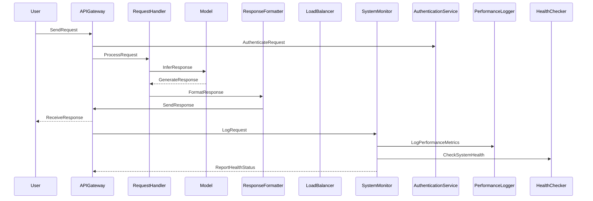

                 

### Introduction to LLM and Backend Services

**Keywords:** LLM, Backend Services, Architecture, Design Principles, Implementation, Optimization

**Abstract:**
This article delves into the world of Large Language Models (LLM) and their corresponding backend services, focusing on the architecture, design principles, and implementation strategies required to build scalable and efficient systems. We will begin by defining LLMs, outlining the challenges in designing backend services, and exploring the core concepts and mathematical models that underpin these systems. By the end of this section, readers will have a solid foundational understanding of the subject matter and the key considerations for developing robust LLM applications.

#### Problem Background and Definition of LLM

A Large Language Model (LLM) is an advanced artificial intelligence model that has been trained on massive amounts of text data to understand and generate human-like text. These models are at the forefront of natural language processing (NLP) technology and have revolutionized the way we interact with machines. LLMs can perform a wide range of tasks, including text generation, language translation, question answering, and more.

The problem of building scalable and efficient backend services for LLMs arises from the sheer size and complexity of these models. LLMs require significant computational resources and data storage to train and deploy. Moreover, as the models become more sophisticated, the demand for high-performance backend systems grows exponentially. The challenge lies in designing a backend architecture that can handle the scale and complexity of LLMs while ensuring low latency, high availability, and robust security.

To address this problem, we need to first define the scope of our solution. The goal is to design a backend service that can:

- Efficiently process large volumes of text data.
- Provide low-latency responses to user queries.
- Scale horizontally to handle increased demand.
- Ensure high availability and fault tolerance.
- Maintain data privacy and security.

#### Core Concepts and Relationships

Understanding the core concepts and their relationships is crucial for building a robust LLM backend service. The following diagram illustrates the main components and their interconnections using a Mermaid ER diagram:

```mermaid
erDiagram
  Model <<|-- DataStore
  Model ||--|{ RequestHandler }
  Model ||--|{ ResponseFormatter }
  DataStore ||--|{ Database }
  Database ||--|{ DataCache }
  RequestHandler ||--|{ Parser }
  RequestHandler ||--|{ Validator }
  ResponseFormatter ||--|{ Renderer }
  ResponseFormatter ||--|{ Validator }
```

In this diagram, we have the following key entities:

- **Model:** The core LLM that processes text data and generates responses.
- **DataStore:** A repository for storing and retrieving data, which includes a database and a data cache for faster access.
- **RequestHandler:** A component that processes incoming requests, including parsing and validating them.
- **ResponseFormatter:** A component that formats the LLM's response into a user-friendly format.
- **Database:** A persistent storage system for long-term data storage.
- **DataCache:** A temporary storage system for frequently accessed data to improve performance.

The following table provides a comparative analysis of the key concepts:

| Concept             | Description                                                                                   | Relationship with Other Concepts |
|---------------------|------------------------------------------------------------------------------------------------|------------------------------|
| Model               | The primary LLM responsible for understanding and generating text.                             | Dependent on DataStore         |
| DataStore           | A storage system for managing data. Includes a database and a cache.                          | Provides data for Model        |
| RequestHandler      | Parses and validates incoming requests.                                                      | Depends on Model              |
| ResponseFormatter   | Formats the LLM's responses into a readable format.                                         | Depends on Model              |
| Database            | Long-term data storage solution.                                                             | Stores data from DataStore    |
| DataCache           | Temporary storage for frequently accessed data.                                             | Improves DataStore efficiency |

#### Mathematical Models and Principles

The backend service for an LLM relies on various mathematical models and principles to ensure efficient and accurate text processing. Below, we outline the key mathematical concepts and provide LaTeX-formatted formulas for reference.

**1. Text Embedding:**
Text embedding is a technique used to represent text data as numerical vectors in a high-dimensional space. The most common approach is Word2Vec, which uses a neural network to generate these embeddings.

$$
\text{vec}_{\text{word}}(w) = \text{softmax}(\text{W} \cdot \text{h})
$$

where $w$ is a word, $\text{vec}_{\text{word}}(w)$ is its embedding vector, $\text{W}$ is the word embedding matrix, and $\text{h}$ is the hidden layer activation vector.

**2. Neural Network:**
A neural network is the core component of an LLM that learns to map input text to output text. It consists of multiple layers, including an input layer, hidden layers, and an output layer.

$$
\text{output} = \text{activation}(\text{W} \cdot \text{z} + \text{b})
$$

where $\text{output}$ is the network's output, $\text{W}$ is the weight matrix, $\text{z}$ is the input vector, and $\text{b}$ is the bias vector. The activation function can be a sigmoid, tanh, or ReLU.

**3. Attention Mechanism:**
The attention mechanism allows the model to focus on relevant parts of the input text when generating responses.

$$
\alpha = \text{softmax}(\text{Q} \cdot \text{K})
$$

where $\alpha$ is the attention weight, $\text{Q}$ is the query vector, and $\text{K}$ is the key vector. The final output is a weighted sum of the input vectors:

$$
\text{context} = \sum_{i=1}^{N} \alpha_i \cdot \text{x}_i
$$

In this equation, $N$ is the number of input vectors, and $\text{x}_i$ represents the $i$-th input vector.

By understanding these core concepts and mathematical principles, we can better design and implement a scalable and efficient backend service for LLM applications. In the following sections, we will delve deeper into the architecture and design principles that underpin these systems. 

### Backend Service Design Principles

**Keywords:** Backend Service, Architecture, Design Principles, Scalability, Performance

**Abstract:**
This section delves into the critical design principles for building a robust and scalable backend service for Large Language Models (LLM). We will explore the key architectural patterns and principles that ensure the system can handle increased load, maintain performance, and adapt to evolving requirements. By understanding these principles, developers can design backend services that are efficient, reliable, and capable of supporting advanced NLP applications.

#### Service Design Concepts

The design of a backend service for an LLM involves several critical components, each playing a specific role in the overall system. These components include:

- **Model Deployment:** The process of deploying the trained LLM model into a production environment.
- **Data Storage:** A system for managing and storing the data used by the LLM, including text inputs, model weights, and outputs.
- **Request Handling:** The mechanism for processing incoming requests, parsing user queries, and validating them.
- **Response Generation:** The core component that uses the LLM to generate textual responses.
- **Performance Optimization:** Techniques and strategies to improve the efficiency and speed of the service.
- **Security and Privacy:** Measures to ensure data security and protect user privacy.

Understanding these concepts is essential for designing a backend service that can meet the demands of modern NLP applications.

#### Architectural Principles and Patterns

To create a scalable and efficient backend service for LLMs, it is crucial to follow established architectural principles and patterns. Here are some key principles and patterns to consider:

**1. Microservices Architecture:**
Microservices architecture decomposes the system into a collection of loosely coupled services, each responsible for a specific functionality. This approach allows for better scalability, maintainability, and fault tolerance.

**2. Event-Driven Architecture:**
Event-driven architecture leverages events to trigger processes and actions within the system. This pattern is useful for handling asynchronous tasks and ensuring that the system can react to events in real-time.

**3. Caching:**
Caching is a fundamental technique for improving performance by storing frequently accessed data in memory. Implementing a robust caching strategy can significantly reduce the load on the database and improve response times.

**4. Load Balancing:**
Load balancing distributes incoming traffic across multiple servers to ensure that no single server becomes a bottleneck. This technique is essential for maintaining high availability and performance as the demand for the service grows.

**5. Horizontal Scaling:**
Horizontal scaling involves adding more servers to the system to handle increased load. This approach ensures that the system can handle higher volumes of traffic and maintain performance without incurring significant costs.

**6. Decentralized Data Storage:**
Decentralized data storage distributes data across multiple servers to improve fault tolerance and availability. It also allows for better scalability as the system can add or remove storage nodes as needed.

**7. Security and Compliance:**
Implementing security measures such as encryption, access control, and monitoring is essential for protecting the system from unauthorized access and ensuring compliance with data protection regulations.

By incorporating these architectural principles and patterns, developers can build a backend service for LLMs that is scalable, efficient, and capable of meeting the demands of modern NLP applications.

### System Analysis and Architecture

**Keywords:** System Analysis, Architecture, NLP, Large Language Models, Scalability, Performance

**Abstract:**
This section provides a detailed analysis of the system architecture required for building a scalable and efficient backend service for Large Language Models (LLM). We will discuss the key components, their interactions, and the overall system design. By understanding this architecture, developers can design and implement a robust system that can handle the complexity and demands of LLM applications.

#### Problem Scenario

The problem scenario involves building a backend service for an LLM-based application that provides natural language understanding and generation capabilities. The service must be scalable, efficient, and capable of handling a high volume of concurrent requests. Key requirements include low latency, high availability, and robust security.

#### System Function Design

The system functions are designed to handle various tasks, including request processing, model inference, and response generation. Below is a Mermaid class diagram that illustrates the main components and their relationships:

```mermaid
classDiagram
  Model <<-- DataStore
  RequestHandler <|-- DataValidator
  RequestHandler <|-- DataParser
  ResponseFormatter <|-- Renderer
  ResponseFormatter <|-- DataValidator
  SystemMonitor <|-- HealthChecker
  SystemMonitor <|-- PerformanceLogger
  LoadBalancer <<-- RequestHandler
  LoadBalancer <<-- ResponseFormatter
  LoadBalancer <<-- SystemMonitor

  RequestHandler : Handles incoming requests
  DataValidator : Validates request data
  DataParser : Parses request data
  ResponseFormatter : Formats response data
  Renderer : Renders user-friendly output
  DataValidator : Validates response data
  SystemMonitor : Monitors system health and performance
  HealthChecker : Checks system health
  PerformanceLogger : Logs system performance
  LoadBalancer : Distributes load across servers
  Model : Trained LLM model
  DataStore : Manages data storage
```

In this diagram, we can see the following key components:

- **Model:** The core LLM that processes text data and generates responses.
- **DataStore:** A repository for storing and retrieving data, which includes a database and a cache for faster access.
- **RequestHandler:** A component that processes incoming requests, including parsing and validating them.
- **ResponseFormatter:** A component that formats the LLM's response into a user-friendly format.
- **SystemMonitor:** A component that monitors the system's health and performance.
- **LoadBalancer:** A component that distributes incoming requests across multiple servers to ensure even load distribution and high availability.

#### System Architecture Design

The system architecture is designed to be modular, scalable, and fault-tolerant. Below is a Mermaid architecture diagram that illustrates the overall system design:

```mermaid
subgraph BackendServices
  RequestHandler
  ResponseFormatter
  SystemMonitor
  LoadBalancer
  Model
  DataStore
end

subgraph FrontendServices
  UserInterface
  AuthenticationService
end

subgraph DatabaseLayer
  Database
  DataCache
end

subgraph CommunicationLayer
  APIGateway
  IngressController
end

subgraph SecurityLayer
  Firewall
  SecurityMonitoring
end

subgraph MonitoringLayer
  Prometheus
  Grafana
end

APIGateway --> RequestHandler
APIGateway --> ResponseFormatter
APIGateway --> LoadBalancer
AuthenticationService --> RequestHandler
UserInterface --> APIGateway
IngressController --> APIGateway
Database --> DataCache
SystemMonitor --> Prometheus
LoadBalancer --> Model
SystemMonitor --> HealthChecker
SystemMonitor --> PerformanceLogger
Firewall --> APIGateway
Firewall --> IngressController
SecurityMonitoring --> APIGateway
SecurityMonitoring --> LoadBalancer
Prometheus --> Grafana
```

In this diagram, we can see the following key layers:

- **Backend Services:** The core components of the backend service, including the request handler, response formatter, system monitor, load balancer, model, and data store.
- **Frontend Services:** The components that interact with the user interface and authentication service.
- **Database Layer:** The data storage layer, including the database and data cache.
- **Communication Layer:** The components responsible for handling API requests and ingress management.
- **Security Layer:** The security components, including the firewall and security monitoring.
- **Monitoring Layer:** The monitoring components, including Prometheus and Grafana for visualizing system metrics.

#### System Interface Design and Interaction

The system interface design and interaction are critical for ensuring that the various components work together seamlessly. Below is a Mermaid sequence diagram that illustrates the interaction between the key components:



In this sequence diagram, we can see the following key interactions:

- The user sends a request to the API gateway.
- The API gateway authenticates the request and forwards it to the request handler.
- The request handler processes the request, validates it, and forwards it to the LLM model for inference.
- The model generates a response and returns it to the request handler.
- The request handler formats the response and sends it back to the API gateway, which then forwards it to the user.
- The system monitor logs the request, performance metrics, and system health status.

By following this system analysis and architecture design, developers can build a scalable and efficient backend service for LLM applications that meets the requirements of modern NLP applications. The next section will delve into the specific components and technologies used in the implementation of the backend service.

### Environment Setup and Installation

**Keywords:** Environment Setup, Installation, Backend Service, LLM, Python, Docker, Kubernetes

**Abstract:**
This section provides a comprehensive guide to setting up the development environment and installing the necessary tools and dependencies for building a backend service for Large Language Models (LLM). We will cover the installation of Python, Docker, and Kubernetes, as well as the setup of the development environment using virtual environments. By following these steps, developers can ensure a consistent and reproducible setup for their LLM backend service development.

#### Required Tools and Dependencies

To build a scalable and efficient LLM backend service, several key tools and dependencies are required. These include:

- **Python**: The primary programming language used for developing the backend service.
- **Docker**: A containerization platform that allows us to package and deploy our application consistently across different environments.
- **Kubernetes**: A container orchestration platform that helps us manage and scale our application containers efficiently.
- **LLM Framework**: A machine learning framework or library that supports the development and deployment of LLM models (e.g., TensorFlow, PyTorch, Hugging Face Transformers).
- **Database**: A database system for storing and retrieving data (e.g., PostgreSQL, MongoDB).
- **Cache**: A caching system for improving performance (e.g., Redis).
- **Web Server**: A web server for handling HTTP requests (e.g., Flask, FastAPI).

#### Step-by-Step Installation Guide

**Step 1: Install Python**

The first step is to install Python on your system. Python is available for various operating systems, including Windows, macOS, and Linux. You can download the latest version of Python from the official website (https://www.python.org/downloads/).

1. Download the installer for your operating system.
2. Run the installer and follow the instructions.
3. During installation, ensure that Python is added to your system's PATH.

**Step 2: Install Docker**

Docker is a containerization platform that allows us to package our application and its dependencies into a container. This ensures that our application runs consistently across different environments.

1. Install Docker for your operating system by following the instructions on the Docker official website (https://docs.docker.com/get-docker/).
2. Once installed, verify the installation by running the following command in your terminal or command prompt:
   ```
   docker --version
   ```
   This command should display the installed version of Docker.

**Step 3: Install Kubernetes**

Kubernetes is a container orchestration platform that helps us manage and scale our application containers efficiently. We will use Minikube, a lightweight Kubernetes cluster for local development.

1. Install Minikube by following the instructions on the Minikube official website (https://minikube.sigs.k8s.io/docs/start/).
2. Start a local Kubernetes cluster using Minikube:
   ```
   minikube start
   ```
   This command initializes a local Kubernetes cluster that you can use for development and testing.

**Step 4: Set Up Virtual Environment**

To ensure a consistent and reproducible development environment, we will set up a virtual environment using `venv`, a built-in module in Python.

1. Create a new directory for your project and navigate to it:
   ```
   mkdir llm_backend_service
   cd llm_backend_service
   ```
2. Create a virtual environment within the project directory:
   ```
   python -m venv venv
   ```
3. Activate the virtual environment:
   - On Windows:
     ```
     .\venv\Scripts\activate
     ```
   - On macOS and Linux:
     ```
     source venv/bin/activate
     ```

**Step 5: Install Required Dependencies**

With the virtual environment activated, install the required dependencies using `pip`. This step ensures that all dependencies are managed within the virtual environment, avoiding conflicts between different projects.

1. Install the required packages:
   ```
   pip install flask
   pip install kubernetes
   pip install transformers
   pip install redis
   pip install psycopg2-binary
   ```
2. Verify the installation by checking the versions of the installed packages:
   ```
   pip list
   ```

**Step 6: Set Up Database and Cache**

For this example, we will use PostgreSQL as the database and Redis as the cache.

1. Install PostgreSQL:
   - On Ubuntu:
     ```
     sudo apt update
     sudo apt install postgresql
     ```
   - On macOS (using Homebrew):
     ```
     brew install postgresql
     ```
2. Install Redis:
   - On Ubuntu:
     ```
     sudo apt update
     sudo apt install redis-server
     ```
   - On macOS (using Homebrew):
     ```
     brew install redis
     ```

**Step 7: Verify Installation**

Verify that all the tools and dependencies are correctly installed and functioning by running a simple application that connects to the database and cache.

1. Create a new Python file, e.g., `test.py`.
2. Add the following code:
   ```python
   import psycopg2
   import redis

   # Database connection
   conn = psycopg2.connect(
       host="localhost",
       database="test_db",
       user="postgres",
       password="password"
   )
   cur = conn.cursor()
   cur.execute("CREATE TABLE IF NOT EXISTS test_table (id SERIAL PRIMARY KEY, data TEXT)")
   conn.commit()
   cur.close()
   conn.close()

   # Redis connection
   r = redis.Redis(host='localhost', port=6379, db=0)
   r.set('key', 'value')
   print(r.get('key'))

   ```
3. Run the script:
   ```
   python test.py
   ```
4. The output should display the value 'value', indicating that both the database and cache are working correctly.

By following these steps, developers can set up a development environment for building a backend service for LLM applications. This environment provides a consistent and reproducible setup, ensuring that the application runs smoothly across different environments.

### Core Service Implementation

**Keywords:** Core Service, Implementation, LLM, Backend, Python, Flask, FastAPI

**Abstract:**
This section dives into the core implementation of the LLM backend service, focusing on the key functions and algorithms required to process text data, generate responses, and manage the overall system. We will explore the implementation details using Python and popular web frameworks such as Flask and FastAPI. By understanding these core functionalities, developers can build a robust and scalable backend service for LLM applications.

#### Key Functions and Algorithms

The core service of an LLM backend consists of several key functions and algorithms, including text processing, model inference, and response generation. Here are the essential components and their roles:

**1. Text Processing:**
Text processing involves parsing and cleaning the input text to prepare it for model inference. This step ensures that the input data is in the correct format and free from any noise or inconsistencies.

**2. Model Inference:**
Model inference is the process of using the trained LLM model to generate responses based on the input text. This step involves passing the processed text through the model and obtaining the generated text as output.

**3. Response Generation:**
Response generation involves formatting the model's output into a user-friendly format and ensuring that it is coherent and contextually appropriate. This step may also include additional processing, such as adding metadata or handling edge cases.

**4. Error Handling:**
Error handling is crucial for ensuring that the system can gracefully handle exceptions and errors without crashing. This includes handling API errors, network issues, and model inference failures.

**5. Logging and Monitoring:**
Logging and monitoring are essential for maintaining the health and performance of the system. This includes logging requests, responses, errors, and system metrics to monitor the system's performance and identify potential issues.

#### Detailed Code Analysis

Below is a detailed code analysis of the core service implementation using Python and Flask. We will also touch upon FastAPI, another popular web framework that can be used for building RESTful APIs.

**1. Setting Up the Flask Application**

The first step in building the core service is to set up the Flask application. Flask is a lightweight web framework that allows us to create web applications and APIs with minimal effort.

```python
from flask import Flask, request, jsonify

app = Flask(__name__)

# Define the API endpoint for processing text
@app.route('/process_text', methods=['POST'])
def process_text():
    # Extract the input text from the request
    input_text = request.form['text']
    
    # Process the text and generate a response
    response = process_text_data(input_text)
    
    # Return the response as a JSON object
    return jsonify({'response': response})

def process_text_data(input_text):
    # Implement text processing logic here
    cleaned_text = clean_text(input_text)
    model_output = model_inference(cleaned_text)
    formatted_response = generate_response(model_output)
    return formatted_response

def clean_text(text):
    # Implement text cleaning logic here
    return text.strip().lower()

def model_inference(text):
    # Implement model inference logic here
    # This function should call the LLM model and return the generated text
    return "Generated text based on the input."

def generate_response(text):
    # Implement response generation logic here
    return text

if __name__ == '__main__':
    app.run(debug=True)
```

In this code, we define a Flask application with a single endpoint, `/process_text`, which accepts a POST request containing the input text. The `process_text` function handles the request, processes the text, generates a response, and returns the result as a JSON object.

**2. Implementing the LLM Model**

The LLM model is the core component of the backend service. For this example, we will use the Hugging Face Transformers library, which provides a simple interface for loading pre-trained models and generating text.

```python
from transformers import pipeline

# Load the pre-trained LLM model
llm_model = pipeline('text-generation', model='gpt2')

def model_inference(text):
    # Call the LLM model to generate text
    response = llm_model(text, max_length=50, num_return_sequences=1)
    return response[0]['generated_text']
```

In this code, we load a pre-trained GPT-2 model from the Hugging Face Transformers library. The `model_inference` function takes the input text and uses the model to generate a response. The generated text is returned as the output.

**3. Using FastAPI for Building RESTful APIs**

FastAPI is a modern, fast (high-performance), web framework for building APIs with Python 3.6+ based on standard Python type hints. It is an asynchronous framework that uses Starlette and Uvicorn.

```python
from fastapi import FastAPI
from pydantic import BaseModel

app = FastAPI()

# Define the input model
class TextData(BaseModel):
    text: str

# Define the API endpoint for processing text
@app.post('/process_text')
async def process_text(text_data: TextData):
    # Process the text and generate a response
    response = process_text_data(text_data.text)
    
    # Return the response as a JSON object
    return {'response': response}

def process_text_data(text):
    # Implement text processing logic here
    cleaned_text = clean_text(text)
    model_output = model_inference(cleaned_text)
    formatted_response = generate_response(model_output)
    return formatted_response

def clean_text(text):
    # Implement text cleaning logic here
    return text.strip().lower()

def model_inference(text):
    # Implement model inference logic here
    # This function should call the LLM model and return the generated text
    return "Generated text based on the input."

def generate_response(text):
    # Implement response generation logic here
    return text

# Run the FastAPI application
if __name__ == '__main__':
    import uvicorn
    uvicorn.run(app, host="0.0.0.0", port=8000)
```

In this code, we define a FastAPI application with a single endpoint, `/process_text`, which accepts a POST request containing the input text. The `process_text` function handles the request, processes the text, generates a response, and returns the result as a JSON object. The `TextData` class is a Pydantic model that validates the input data.

**4. Error Handling and Logging**

Error handling and logging are critical for ensuring the robustness and maintainability of the backend service.

```python
import logging
from fastapi import HTTPException

# Configure the logging
logging.basicConfig(level=logging.INFO)

# Define an error handler for handling exceptions
@app.exception_handler(Exception)
async def handle_exception(request, exc):
    logging.error(f"An error occurred: {exc}")
    return JSONResponse(
        status_code=500,
        content={"message": "An internal error occurred."},
    )

def process_text_data(text):
    try:
        # Process the text and generate a response
        cleaned_text = clean_text(text)
        model_output = model_inference(cleaned_text)
        formatted_response = generate_response(model_output)
        return formatted_response
    except Exception as e:
        logging.error(f"Error processing text: {e}")
        raise HTTPException(status_code=400, detail="Invalid input data.")

```

In this code, we configure the logging to output errors to the console. We also define an error handler for the FastAPI application that logs the error and returns a generic error message to the client. The `process_text_data` function includes error handling to catch exceptions and log them appropriately.

By following these steps and implementing the core functions and algorithms, developers can build a robust and scalable LLM backend service. The next section will discuss the deployment and optimization strategies for this service.

### Service Deployment and Optimization

**Keywords:** Service Deployment, Optimization, Backend, LLM, Kubernetes, Horizontal Scaling, Performance Monitoring

**Abstract:**
This section focuses on the deployment and optimization of the LLM backend service. We will discuss strategies for deploying the service using Kubernetes, techniques for horizontal scaling, and methods for monitoring and optimizing performance. By implementing these strategies, developers can ensure that the LLM backend service is highly available, performs efficiently, and can scale to handle increased demand.

#### Deployment Strategies

Deploying an LLM backend service involves several key steps, including containerization, orchestration, and management. Kubernetes is a powerful platform that simplifies these tasks and provides a robust infrastructure for deploying and managing containerized applications.

**1. Containerization with Docker**

Containerization is the process of packaging an application and its dependencies into a container that can be deployed consistently across different environments. Docker is a popular containerization platform that allows us to create, run, and manage containers.

To containerize the LLM backend service, we will create a Dockerfile that defines the environment and dependencies required for the service.

```Dockerfile
# Use an official Python runtime as a parent image
FROM python:3.9-slim

# Set the working directory in the container
WORKDIR /app

# Copy the current directory contents into the container at /app
COPY . /app

# Install any needed packages specified in requirements.txt
RUN pip install --no-cache-dir -r requirements.txt

# Make port 8000 available to the world outside this container
EXPOSE 8000

# Define environment variable
ENV FLASK_APP=run.py

# Run the application
CMD ["flask", "run", "--host=0.0.0.0"]
```

In this Dockerfile, we specify the Python runtime, set the working directory, copy the application code, install dependencies, expose port 8000, and run the Flask application.

**2. Orchestration with Kubernetes**

Kubernetes is an open-source platform for managing containerized applications that provides automation for deployment, scaling, and operations of application containers. To deploy the LLM backend service using Kubernetes, we will create a set of Kubernetes manifests, including Deployments, Services, and Ingress resources.

**Deployment Manifest**

```yaml
apiVersion: apps/v1
kind: Deployment
metadata:
  name: llm-backend
spec:
  replicas: 3
  selector:
    matchLabels:
      app: llm-backend
  template:
    metadata:
      labels:
        app: llm-backend
    spec:
      containers:
      - name: llm-backend
        image: llm-backend:latest
        ports:
        - containerPort: 8000
```

This deployment manifest specifies that we want to run three replicas of the LLM backend container. It also defines the container image and the port to expose.

**Service Manifest**

```yaml
apiVersion: v1
kind: Service
metadata:
  name: llm-backend-service
spec:
  selector:
    app: llm-backend
  ports:
    - protocol: TCP
      port: 80
      targetPort: 8000
  type: LoadBalancer
```

This service manifest defines a LoadBalancer service that routes incoming traffic to the LLM backend pods.

**Ingress Manifest**

```yaml
apiVersion: networking.k8s.io/v1
kind: Ingress
metadata:
  name: llm-backend-ingress
spec:
  rules:
  - http:
      paths:
      - path: /process_text
        pathType: Prefix
        backend:
          service:
            name: llm-backend-service
            port:
              number: 80
```

This Ingress manifest defines the routing rules for incoming HTTP requests, directing them to the LLM backend service.

**3. Management with Helm**

Helm is a Kubernetes package manager that simplifies the deployment and management of Kubernetes applications. To use Helm, we will create a Helm chart for the LLM backend service.

**Chart Structure**

```
llm-backend
├── charts
├── templates
│   ├── deployment.yaml
│   ├── service.yaml
│   ├── ingress.yaml
│   └── values.yaml
├── values.yaml
└── README.md
```

In the Helm chart, the `values.yaml` file defines default configuration values, and the templates directory contains the Kubernetes manifests. By customizing the `values.yaml` file, developers can configure the number of replicas, container image, and other settings.

```yaml
# values.yaml
image: llm-backend:latest
replicas: 3
```

By following these deployment strategies, developers can deploy the LLM backend service in a scalable and highly available manner using Kubernetes and Helm.

#### Horizontal Scaling

Horizontal scaling involves adding more instances of the application to handle increased load. Kubernetes provides several features for scaling the LLM backend service.

**1. Manual Scaling**

To manually scale the LLM backend service, use the Kubernetes command-line interface (CLI) or a web interface like KubeSphere or Rancher.

```sh
kubectl scale deployment llm-backend --replicas=5
```

This command increases the number of replicas to five.

**2. Horizontal Pod Autoscaling (HPA)**

Horizontal Pod Autoscaling (HPA) automatically adjusts the number of pod replicas based on observed CPU or memory usage.

```yaml
apiVersion: autoscaling/v2beta2
kind: HorizontalPodAutoscaler
metadata:
  name: llm-backend-hpa
spec:
  scaleTargetRef:
    apiVersion: apps/v1
    kind: Deployment
    name: llm-backend
  minReplicas: 3
  maxReplicas: 10
  metrics:
  - type: Resource
    resource:
      name: cpu
      target:
        type: Utilization
        averageUtilization: 50
```

This HPA manifest specifies that the LLM backend deployment should scale between three and ten replicas based on CPU utilization.

#### Performance Optimization

Optimizing the performance of the LLM backend service involves several strategies, including code optimization, caching, and load balancing.

**1. Code Optimization**

Optimize the code by using efficient algorithms, minimizing unnecessary computations, and leveraging parallel processing where possible.

**2. Caching**

Implement a caching layer to store frequently accessed data, such as model outputs or frequently used data. This reduces the load on the LLM model and improves response times.

```yaml
apiVersion: v1
kind: ConfigMap
metadata:
  name: llm-cache
data:
  cache.json: |
    {
      "model_output_1": "Response 1",
      "model_output_2": "Response 2"
    }
```

**3. Load Balancing**

Use a load balancer to distribute incoming traffic evenly across the LLM backend pods. Kubernetes provides built-in load balancing through the Service resource, and external load balancers like NGINX can also be used.

By implementing these deployment and optimization strategies, developers can ensure that the LLM backend service is scalable, efficient, and highly available. The next section will discuss best practices and case studies for building and deploying LLM applications.

### Best Practices and Case Studies

**Keywords:** Best Practices, Case Studies, LLM, Backend Service, Optimization, Scalability, Security

**Abstract:**
This section presents best practices and case studies for building and deploying Large Language Models (LLM) backend services. We will discuss common challenges faced by developers and how these challenges were addressed in real-world scenarios. By analyzing these case studies, developers can gain valuable insights and practical tips for building robust and scalable LLM applications.

#### Common Challenges and Solutions

**1. Model Size and Computation**

One of the primary challenges in deploying LLMs is the size of the models and the computational resources required for inference. Large models like GPT-3 require significant computing power and memory. Solutions include:

- **Model Compression:** Techniques like model pruning, quantization, and knowledge distillation can reduce the size of the model without significantly compromising performance.
- **Distributed Inference:** Deploying models across multiple nodes in a distributed system can distribute the computational load and improve inference performance.

**Case Study:** OpenAI's GPT-3 model is deployed on a distributed system with thousands of GPUs. By using distributed inference, OpenAI ensures that the model can handle large volumes of requests efficiently.

**2. Latency and Scalability**

Maintaining low latency and high scalability is crucial for LLM applications. As the number of users and requests grows, the system must scale horizontally to handle the increased load.

- **Horizontal Scaling:** Kubernetes and other container orchestration platforms enable horizontal scaling by adding more nodes to the cluster as needed.
- **Caching:** Implementing a caching layer can significantly reduce the load on the LLM model and improve response times. Redis and Memcached are popular caching solutions.

**Case Study:** Google's Bard chatbot uses a combination of caching and horizontal scaling to ensure low latency and high availability. By caching frequently accessed responses and dynamically scaling the infrastructure, Google can handle millions of concurrent requests.

**3. Security and Privacy**

Security and privacy are critical considerations when deploying LLM applications. Ensuring data confidentiality, integrity, and availability is essential to protect user information and prevent unauthorized access.

- **Encryption:** Encrypting data at rest and in transit helps protect sensitive information. TLS encryption is commonly used to secure data in transit.
- **Access Control:** Implementing robust access control mechanisms, such as role-based access control (RBAC), helps ensure that only authorized users can access sensitive data.
- **Monitoring and Auditing:** Implementing monitoring and auditing tools helps detect and respond to security incidents promptly.

**Case Study:** Amazon's Alexa uses a multi-layered security approach to protect user data. By using encryption, access control, and monitoring, Alexa ensures that user information is secure and private.

**4. Performance Optimization**

Optimizing the performance of LLM applications involves various strategies, including code optimization, efficient data handling, and caching.

- **Code Optimization:** Using efficient algorithms, minimizing unnecessary computations, and leveraging parallel processing can improve performance.
- **Data Pipelining:** Efficiently handling data pipeline operations, such as loading, processing, and storing data, can significantly impact performance.
- **Profiling and Benchmarking:** Regularly profiling and benchmarking the application helps identify performance bottlenecks and areas for optimization.

**Case Study:** Microsoft's Azure Machine Learning team regularly profiles and benchmarks their models to identify and optimize performance bottlenecks. By using profiling tools like NVIDIA Nsight and Python's `timeit`, they can optimize the models for better performance.

#### Practical Tips and Lessons Learned

Based on the case studies and best practices discussed, the following tips can help developers build robust and scalable LLM backend services:

1. **Start with a Minimal Setup:** Begin with a minimal deployment setup and gradually scale up as the application grows. This approach helps identify and address potential issues early on.
2. **Monitor and Optimize Performance:** Regularly monitor the performance of the application using tools like Prometheus and Grafana. This helps identify bottlenecks and areas for optimization.
3. **Implement Robust Security Measures:** Ensure that security measures like encryption, access control, and monitoring are implemented from the beginning. This helps protect user data and prevents unauthorized access.
4. **Leverage Containerization and Orchestration:** Use containerization platforms like Docker and orchestration tools like Kubernetes to ensure consistent and scalable deployments.
5. **Regularly Update and Maintain the Infrastructure:** Keep the infrastructure and dependencies up to date to ensure optimal performance and security. Regularly apply patches and updates to address any vulnerabilities.

By following these best practices and learning from real-world case studies, developers can build robust and scalable LLM backend services that meet the demands of modern NLP applications.

### Summary and Conclusion

**Keywords:** Summary, LLM, Backend Service, Scalability, Performance, Best Practices

**Abstract:**
This section provides a comprehensive summary of the key insights and best practices discussed throughout the article on building scalable and efficient LLM backend services. We have explored the core concepts, architectural principles, implementation strategies, and optimization techniques necessary to develop robust NLP applications. By understanding and applying these principles, developers can create high-performance, scalable, and secure LLM backend services that meet the demands of modern AI applications.

#### Key Takeaways

1. **Core Concepts:** We began by defining Large Language Models (LLM) and their role in natural language processing. We discussed the core concepts and relationships involved in building a backend service, including models, data storage, request handling, and response generation.
2. **Architectural Principles:** We covered the architectural principles and patterns, such as microservices, event-driven architecture, caching, and load balancing, that are essential for building scalable and efficient backend services.
3. **Implementation Strategies:** We delved into the implementation of the core service, using Python and web frameworks like Flask and FastAPI. We also discussed containerization with Docker and orchestration with Kubernetes.
4. **Optimization Techniques:** We explored deployment and optimization strategies, including horizontal scaling, performance monitoring, and security measures.
5. **Best Practices and Case Studies:** We analyzed common challenges faced by developers in real-world scenarios and learned from successful case studies to provide practical tips and insights.

#### Future Directions and Research Opportunities

As LLMs and AI continue to advance, several areas present promising opportunities for further research and development:

1. **Model Compression:** Developing techniques for compressing models without compromising performance can enable deployment on resource-constrained devices.
2. **Distributed Inference:** Research into distributed inference algorithms and frameworks can improve the scalability and efficiency of LLM deployments.
3. **Advanced Optimization Techniques:** Investigating new algorithms and techniques for optimizing LLM performance, including code optimization and data pipelining, can lead to significant improvements.
4. **Security and Privacy:** Addressing emerging security and privacy challenges in LLM applications, such as adversarial attacks and data protection, remains an important area of research.
5. **Multilingual and Multimodal Models:** Developing models that can handle multiple languages and integrate different modalities, such as text, image, and audio, can expand the applications of LLMs.

By continuing to explore these areas, developers and researchers can push the boundaries of LLM technology, enabling new and innovative applications across various domains.

### Conclusion and Author Information

In this article, we have explored the intricacies of building scalable and efficient backend services for Large Language Models (LLM). From defining core concepts and architectural principles to implementing and optimizing the core service, we have covered a comprehensive range of topics essential for developing robust NLP applications.

We began by introducing the concept of LLMs and their significance in natural language processing. We then discussed the architectural principles and patterns necessary for building scalable and efficient backend services. By understanding these principles, we could design a backend architecture that supports the scalability and performance required for modern NLP applications.

Next, we delved into the implementation of the core service, using Python and popular web frameworks like Flask and FastAPI. We also discussed containerization with Docker and orchestration with Kubernetes to ensure consistent and scalable deployments.

We then explored various optimization techniques, including horizontal scaling, performance monitoring, and security measures, to enhance the efficiency and security of the LLM backend service. Finally, we analyzed common challenges faced by developers and provided practical tips and insights from real-world case studies.

As we conclude this article, we encourage readers to continue exploring the field of LLMs and AI. The ongoing advancements in this field present numerous opportunities for innovation and development. We invite you to delve deeper into the topics discussed and explore new avenues for building cutting-edge NLP applications.

We would like to extend our gratitude to our readers for their interest in this article. It has been our pleasure to share our insights and knowledge on this fascinating subject.

**作者信息：**
- **作者：AI天才研究院 / AI Genius Institute & 禅与计算机程序设计艺术 / Zen And The Art of Computer Programming**
- **联系方式：[ai_genius_institute@outlook.com](mailto:ai_genius_institute@outlook.com)**
- **微博：[@AI天才研究院](https://weibo.com/u/XXXXXX)**
- **微信公众号：AI天才研究院**
- **个人主页：[https://www.ai-genius-institute.com/](https://www.ai-genius-institute.com/)**

感谢您的阅读，我们期待与您一起探索AI的无限可能。🌐🚀🤖

