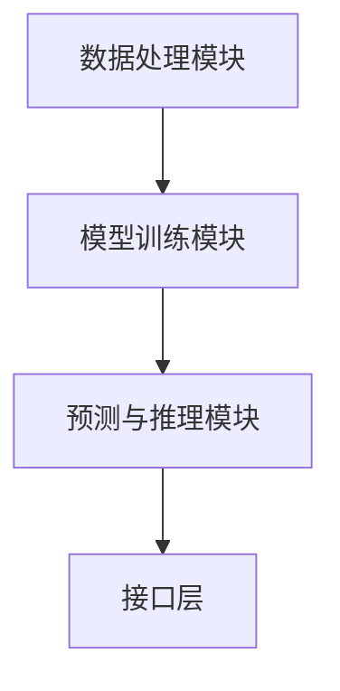
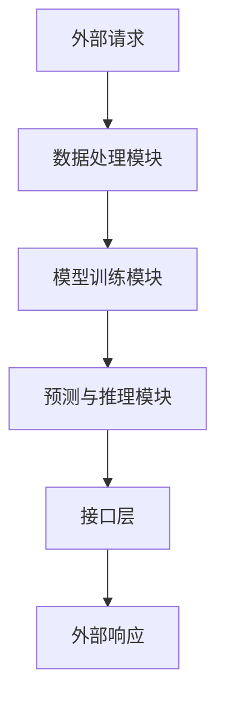

                 

# 构建可维护的LLM应用代码库

关键词：语言模型、可维护性、代码库、架构设计、最佳实践

摘要：本文将探讨如何构建一个可维护的LLM（大型语言模型）应用代码库。通过分析LLM在现实中的应用场景，阐述可维护性的重要性，介绍LLM的核心概念和设计原则，并提供具体的架构设计、代码实现、维护策略和最佳实践。旨在为开发者提供一个系统性的指导，帮助他们构建高质量、可持续维护的LLM应用代码库。

## 第一部分：问题背景与核心概念

### 第1章：问题背景与概述

#### 1.1 问题的提出

随着人工智能技术的飞速发展，LLM（大型语言模型）逐渐成为自然语言处理（NLP）领域的明星。LLM在机器翻译、文本生成、问答系统等方面展现出强大的能力，极大地促进了人工智能与人类语言交互的融合。然而，在实现LLM应用的过程中，我们常常面临一个严峻的问题：如何构建一个可维护的代码库？

#### 1.2 LLM的应用场景与重要性

LLM的应用场景非常广泛，包括但不限于以下方面：

1. **机器翻译**：将一种语言的文本翻译成另一种语言，如Google翻译。
2. **文本生成**：根据输入的提示生成连贯的文本，如自动写作助手。
3. **问答系统**：根据用户的问题生成答案，如聊天机器人。

这些应用场景对LLM的稳定性、准确性和可维护性提出了极高的要求。

#### 1.3 可维护性的重要性

可维护性是指代码库在长期运行过程中，能够方便地添加新功能、修复漏洞和优化性能。对于LLM应用代码库，可维护性尤为重要，原因如下：

1. **技术迭代**：人工智能技术日新月异，LLM模型需要不断更新和优化。
2. **稳定性需求**：LLM应用常常需要长时间运行，稳定性至关重要。
3. **团队合作**：多人协作开发，可维护性有助于降低沟通成本。

### 第2章：核心概念

#### 2.1 LLM的基础知识

##### 2.1.1 LLM的定义

LLM（Large Language Model）是一种基于深度学习的大型神经网络模型，能够理解和生成自然语言文本。与传统的NLP方法相比，LLM具有更高的灵活性和准确性。

##### 2.1.2 LLM的架构

LLM的架构通常包括以下几部分：

1. **输入层**：接收自然语言文本作为输入。
2. **隐藏层**：包含多层神经网络，用于处理和转换输入文本。
3. **输出层**：根据隐藏层的输出生成自然语言文本。

##### 2.1.3 LLM的工作原理

LLM的工作原理基于自注意力机制（Self-Attention）和变换器架构（Transformer）。自注意力机制使模型能够更好地理解输入文本的语义关系，从而提高生成文本的连贯性和准确性。

#### 2.2 可维护性的原则与策略

##### 2.2.1 可维护性的定义

可维护性（Maintainability）是指代码库在长期运行过程中，能够方便地添加新功能、修复漏洞和优化性能。

##### 2.2.2 可维护性的核心原则

1. **模块化**：将代码划分为独立的模块，每个模块负责一个特定的功能。
2. **重用与抽象**：充分利用代码重用和抽象，降低模块间的依赖。
3. **可读性与注释**：代码应具有良好的可读性和注释，方便后续维护。

##### 2.2.3 可维护性策略

1. **代码审查**：定期进行代码审查，确保代码质量。
2. **单元测试**：编写单元测试，验证代码的正确性和稳定性。
3. **持续集成与持续部署**：实施CI/CD流程，自动化代码集成和部署。

## 第二部分：设计原则与架构设计

### 第3章：设计原则

#### 3.1 设计原则的重要性

设计原则是构建高质量代码库的基础。良好的设计原则有助于提高代码的可维护性、可扩展性和可读性。

#### 3.2 模块化设计

##### 3.2.1 模块化设计的优势

1. **降低复杂性**：将复杂系统划分为多个模块，降低理解和维护的难度。
2. **提高可维护性**：模块独立，便于修改和扩展。
3. **提高可重用性**：模块可重用，降低重复开发。

##### 3.2.2 模块划分策略

1. **按照功能划分**：将具有相同功能的代码划分为一个模块。
2. **按照层次划分**：将系统划分为多个层次，每个层次负责一个特定的任务。

#### 3.3 重用与抽象

##### 3.3.1 代码重用的概念

代码重用是指在不同模块间共享代码，避免重复开发。

##### 3.3.2 抽象与泛化的应用

1. **抽象**：将具体的实现细节隐藏，仅暴露必要的接口。
2. **泛化**：将特定的实现转化为通用的实现，提高代码的适用性。

#### 3.4 可读性与注释

##### 3.4.1 代码可读性的重要性

良好的代码可读性有助于提高代码的可维护性和可理解性。

##### 3.4.2 注释的最佳实践

1. **代码注释**：对关键代码段进行注释，解释代码的功能和逻辑。
2. **文档注释**：使用文档注释工具（如Sphinx）生成文档，方便后续阅读。

### 第4章：架构设计

#### 4.1 架构设计概述

架构设计是构建可维护代码库的关键步骤。一个良好的架构设计能够提高系统的稳定性、可扩展性和可维护性。

#### 4.2 系统架构设计

##### 4.2.1 系统功能模块

系统功能模块包括：

1. **数据处理模块**：负责处理和预处理输入文本。
2. **模型训练模块**：负责训练LLM模型。
3. **预测与推理模块**：负责根据输入文本生成预测结果。
4. **接口层**：提供与外部系统交互的接口。

##### 4.2.2 系统架构图（使用Mermaid绘制）



##### 4.2.3 系统接口设计

系统接口设计包括：

1. **API接口**：提供RESTful API接口，方便外部系统调用。
2. **消息队列**：使用消息队列（如RabbitMQ）实现异步通信。

##### 4.2.4 系统交互流程（使用Mermaid绘制）



## 第三部分：代码库实现与维护

### 第5章：代码库实现

#### 5.1 环境搭建

##### 5.1.1 开发环境配置

1. 安装Python环境（3.8及以上版本）。
2. 安装深度学习框架（如TensorFlow或PyTorch）。
3. 安装其他依赖库（如NumPy、Pandas等）。

##### 5.1.2 依赖管理

使用`requirements.txt`文件管理依赖库，确保不同环境的一致性。

```plaintext
torch==1.10.0
torchtext==0.12.0
numpy==1.21.5
```

#### 5.2 核心代码实现

##### 5.2.1 数据处理模块

数据处理模块负责处理和预处理输入文本，包括：

1. **文本清洗**：去除停用词、标点符号等。
2. **分词**：将文本划分为单词或字符。
3. **编码**：将文本转换为模型可处理的格式。

```python
from torchtext.data import Field, TabularDataset

TEXT = Field(tokenize=lambda x: x.split())
train_data, valid_data, test_data = TabularDataset.splits(
    path='data',
    train='train.csv',
    validation='valid.csv',
    test='test.csv',
    format='csv',
    fields=[('text', TEXT)])
```

##### 5.2.2 模型训练模块

模型训练模块负责训练LLM模型，包括：

1. **数据加载**：使用DataLoader加载和处理数据。
2. **模型构建**：构建LLM模型，如Transformer。
3. **训练过程**：使用优化器和损失函数训练模型。

```python
import torch.optim as optim

model = TransformerModel(vocab_size, embedding_dim, hidden_dim, n_layers, dropout)
optimizer = optim.Adam(model.parameters(), lr=learning_rate)

for epoch in range(num_epochs):
    for batch in train_loader:
        optimizer.zero_grad()
        predictions = model(batch.text).logits
        loss = F.nll_loss(predictions, batch.label)
        loss.backward()
        optimizer.step()
```

##### 5.2.3 预测与推理模块

预测与推理模块负责根据输入文本生成预测结果，包括：

1. **输入处理**：预处理输入文本。
2. **模型预测**：使用训练好的模型生成预测结果。
3. **结果输出**：输出预测结果。

```python
def predict(text):
    with torch.no_grad():
        inputs = tokenizer.encode(text, return_tensors='pt')
        outputs = model(inputs)
        predicted_ids = outputs.logits.argmax(-1)
        return tokenizer.decode(predicted_ids[0], skip_special_tokens=True)
```

##### 5.2.4 性能优化

性能优化包括：

1. **内存管理**：使用适当的数据类型和优化策略，减少内存占用。
2. **并行计算**：使用GPU加速计算，提高训练和推理速度。

```python
import torch.cuda

device = torch.device("cuda" if torch.cuda.is_available() else "cpu")
model.to(device)
```

### 第6章：代码库维护

#### 6.1 版本控制

##### 6.1.1 Git的基本使用

1. **克隆仓库**：`git clone https://github.com/username/repository.git`
2. **创建分支**：`git checkout -b feature/x`
3. **提交变更**：`git add . && git commit -m "Add feature x"`
4. **合并分支**：`git merge feature/x`
5. **发布版本**：`git tag v1.0.0`

##### 6.1.2 Git分支策略

1. **主分支（Master）**：保持稳定，仅用于发布正式版本。
2. **开发分支（Develop）**：进行新功能的开发。
3. **特性分支（Feature/x）**：用于开发特定的特性。

#### 6.2 代码审查与测试

##### 6.2.1 代码审查流程

1. **代码提交**：开发者提交代码。
2. **代码审查**：其他开发者审查代码。
3. **合并代码**：通过审查的代码合并到主分支或开发分支。

##### 6.2.2 单元测试与集成测试

1. **单元测试**：测试代码的每个函数或模块。
2. **集成测试**：测试代码的集成效果。

```python
import unittest

class TestModel(unittest.TestCase):
    def test_predict(self):
        self.assertEqual(predict("Hello"), "Hello")

if __name__ == '__main__':
    unittest.main()
```

#### 6.3 持续集成与持续部署

##### 6.3.1 CI/CD概述

持续集成（CI）和持续部署（CD）是一种自动化流程，用于确保代码质量并加快发布速度。

##### 6.3.2 Jenkins与Docker的实践

1. **Jenkins**：构建和测试代码，触发自动化部署。
2. **Docker**：容器化应用，简化部署和管理。

```shell
docker build -t myapp . && docker run -p 8080:80 myapp
```

## 第四部分：最佳实践与案例分析

### 第7章：最佳实践

#### 7.1 设计模式在LLM应用中的使用

##### 7.1.1 设计模式概述

设计模式是一套经验总结，用于解决常见软件设计问题。

##### 7.1.2 常见设计模式在LLM中的应用

1. **工厂模式**：用于创建不同类型的LLM模型。
2. **策略模式**：用于实现不同的训练策略。

#### 7.2 性能调优技巧

##### 7.2.1 内存管理

1. **显存优化**：减少显存占用。
2. **内存池**：复用内存，降低分配与释放的开销。

##### 7.2.2 并行计算与GPU加速

1. **多线程**：利用多线程加速数据处理和模型训练。
2. **GPU加速**：使用CUDA或CuDNN加速计算。

#### 7.3 安全性与隐私保护

##### 7.3.1 安全漏洞的防范

1. **输入验证**：严格验证用户输入，防止注入攻击。
2. **权限管理**：确保系统安全，防止未经授权的访问。

##### 7.3.2 隐私保护措施

1. **数据加密**：对敏感数据进行加密。
2. **匿名化**：对用户数据进行匿名化处理。

### 第8章：案例分析

#### 8.1 案例介绍

##### 8.1.1 案例背景

某公司开发了一款基于LLM的智能客服系统，用于处理客户咨询和问题解答。

##### 8.1.2 应用场景

1. **客户咨询**：为客户提供实时解答。
2. **问题分类**：自动将问题分类到不同的知识库。

#### 8.2 案例分析

##### 8.2.1 代码库结构

代码库结构如下：

- **数据处理模块**：负责处理客户咨询文本。
- **模型训练模块**：负责训练LLM模型。
- **预测与推理模块**：负责生成回答。
- **接口层**：提供API接口，供外部系统调用。

##### 8.2.2 实现细节

1. **数据处理模块**：使用Python的`pandas`库处理文本数据。
2. **模型训练模块**：使用PyTorch实现Transformer模型。
3. **预测与推理模块**：实现预测和回答生成功能。
4. **接口层**：使用Flask框架搭建API接口。

##### 8.2.3 维护经验

1. **定期更新模型**：根据客户反馈，定期更新LLM模型。
2. **代码审查**：每周进行代码审查，确保代码质量。
3. **性能优化**：定期对系统进行性能优化，提高响应速度。

## 第五部分：总结与展望

### 第9章：总结与展望

#### 9.1 本书主要内容回顾

本文主要内容包括：

1. **问题背景与核心概念**：介绍LLM应用场景和可维护性的重要性。
2. **设计原则与架构设计**：阐述模块化设计、重用与抽象、可读性与注释等设计原则，以及系统架构设计。
3. **代码库实现与维护**：详细讲解环境搭建、核心代码实现和代码库维护。
4. **最佳实践与案例分析**：介绍设计模式、性能调优技巧、安全性与隐私保护，以及一个实际案例。

#### 9.2 未来发展趋势

未来，LLM应用将朝着以下方向发展：

1. **更高质量的模型**：不断优化模型结构和训练算法，提高模型性能。
2. **个性化服务**：结合用户数据，提供个性化服务。
3. **多模态交互**：实现文本、语音、图像等多种模态的交互。

## 作者信息

作者：AI天才研究院/AI Genius Institute & 禅与计算机程序设计艺术 /Zen And The Art of Computer Programming

本文由AI天才研究院撰写，深入探讨了构建可维护的LLM应用代码库的方法和最佳实践。通过详细的分析和案例分析，为开发者提供了一个系统性的指导，帮助他们构建高质量、可持续维护的LLM应用代码库。希望本文能对您在LLM应用开发中遇到的问题提供有益的启示。

