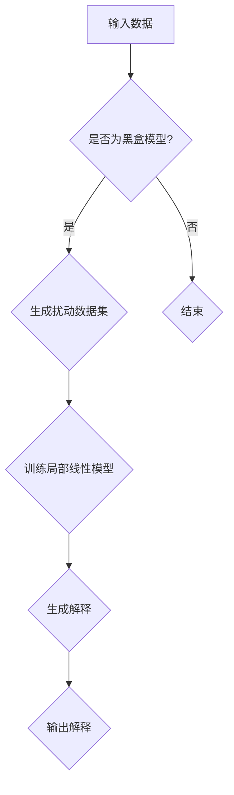
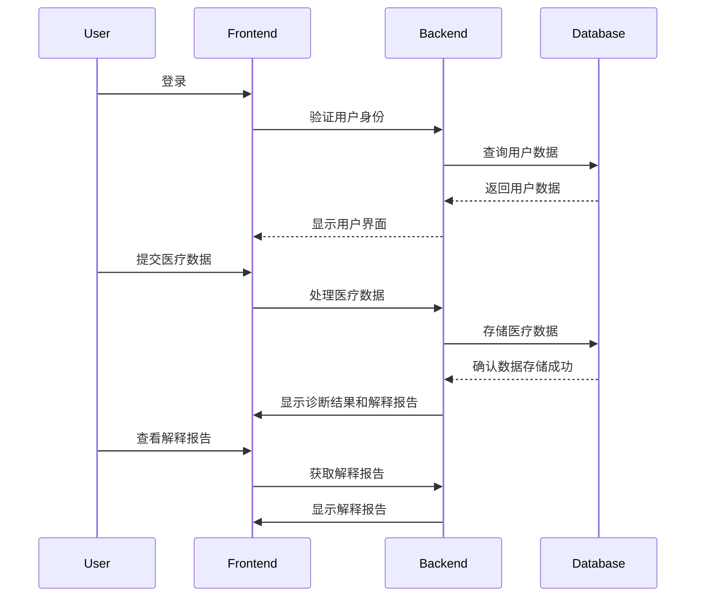

                 


### 构建可解释的AI系统：提高人工智能的透明度

#### 关键词：
- 人工智能，透明性，可解释AI，算法，模型，系统设计，案例分析

#### 摘要：
本文深入探讨了构建可解释的人工智能（AI）系统的重要性，以及如何通过一系列步骤来提高AI系统的透明度。文章首先介绍了AI系统的基本概念和组成部分，然后详细阐述了可解释AI的核心概念、理论基础和技术框架。接下来，文章重点讨论了如何设计和实施可解释AI系统，并通过实际案例进行深入分析。最后，文章总结了未来可解释AI的发展趋势和面临的挑战，为读者提供了进一步研究的方向。

#### 引言与背景

##### 1. 引言

人工智能（AI）作为当前技术发展的热点，已经深刻地改变了我们的生活方式和社会结构。从自动驾驶到医疗诊断，AI的应用无处不在。然而，随着AI系统的复杂性和规模不断扩大，其透明性问题逐渐引起了广泛关注。可解释AI（Explainable AI，XAI）的概念正是在这种背景下应运而生，旨在提高AI系统的透明度和可解释性，使人类能够更好地理解和信任AI系统。

##### 2. AI的发展与透明性问题

AI的发展经历了从规则基系统到基于统计学的机器学习模型，再到如今深度学习模型的演进。然而，随着模型的复杂性增加，传统的AI系统变得越来越难以解释。这种现象在深度神经网络（DNN）中尤为明显，这些模型往往被视为“黑盒”，其内部机制对外界来说难以理解。这种不可解释性引发了一系列问题，包括伦理、法律和社会接受度等方面的挑战。

##### 3. 可解释AI的重要性

可解释AI的重要性体现在多个方面。首先，它有助于提高系统的可信赖性，使决策过程更加透明和可追溯。其次，它有助于发现和纠正潜在的偏见和错误，从而提高模型的公平性和公正性。此外，可解释AI还能帮助研究人员更好地理解模型的决策过程，从而推动AI技术的进步。

##### 4. 本书的目的与结构

本书旨在为读者提供一个全面、系统的可解释AI系统构建指南。首先，我们将介绍AI系统的基础知识，包括其组成部分和开发流程。接着，我们将深入探讨可解释AI的理论基础和技术框架。随后，文章将重点讨论如何设计和实施可解释AI系统，并通过实际案例进行深入分析。最后，我们将总结未来可解释AI的发展趋势和面临的挑战。

#### AI系统概述

##### 1. AI系统的基础知识

人工智能系统通常由以下几个主要部分组成：

- **数据输入**：这是AI系统的原材料，包括各种形式的数据，如图像、文本、声音等。
- **数据处理**：这一阶段涉及数据清洗、预处理和特征提取等操作，目的是将原始数据转换为适合模型训练的形式。
- **模型训练**：在这一阶段，使用训练算法（如梯度下降）优化模型参数，以使其能够准确预测或分类数据。
- **模型评估**：通过测试数据评估模型的性能，以确定其是否达到了预期的效果。
- **模型部署**：将训练好的模型部署到实际应用场景中，使其能够进行预测或决策。

##### 2. AI系统的组成部分

AI系统的各个组成部分相互依赖，共同协作，以实现特定任务的目标。以下是AI系统的组成部分及其简要描述：

- **感知器**：负责接收外部信息，如摄像头、传感器等。
- **数据预处理模块**：负责处理和清洗输入数据，确保其质量。
- **特征提取模块**：将原始数据转换为特征向量，以便模型能够处理。
- **训练模块**：使用训练算法对模型进行训练，优化其参数。
- **评估模块**：通过测试数据评估模型的性能，确保其准确性和鲁棒性。
- **推理模块**：在模型部署后，使用训练好的模型进行实时预测或决策。

##### 3. AI系统的开发流程

AI系统的开发通常包括以下步骤：

- **需求分析**：明确系统要解决的问题和目标。
- **数据收集**：收集相关的数据集，用于后续的训练和测试。
- **数据预处理**：对数据进行清洗、预处理和特征提取。
- **模型选择**：选择适合任务的模型架构。
- **模型训练**：使用训练数据训练模型，优化其参数。
- **模型评估**：通过测试数据评估模型的性能。
- **模型部署**：将训练好的模型部署到实际应用场景中。

#### 可解释AI的理论基础

##### 1. 可解释AI的概念与原则

可解释AI（XAI）旨在提高AI系统的透明度和可解释性，使其决策过程更加透明和可理解。可解释AI的核心原则包括：

- **透明性**：确保AI系统的内部工作过程对外部用户是透明的。
- **可理解性**：使AI系统的决策结果对用户来说是可理解的。
- **可追溯性**：确保AI系统的决策过程可以追溯到具体的输入和参数。
- **公平性**：确保AI系统的决策不受到人为偏见的影响。

##### 2. 可解释性与透明性的区别

可解释性与透明性是两个密切相关但又有区别的概念。可解释性关注的是AI系统决策过程的可理解性，即用户能够理解系统是如何做出特定决策的。而透明性则更侧重于系统内部工作过程的对用户透明度，即用户能够看到系统的每一个步骤和决策过程。

##### 3. 可解释AI的核心原则

可解释AI的核心原则包括以下几点：

- **可解释性设计**：在设计AI系统时，考虑到系统的可解释性，确保每个模块和决策过程都是可解释的。
- **可交互性**：用户应能够与AI系统进行交互，查询和验证决策结果。
- **可验证性**：确保AI系统的决策过程和结果是可以被验证和校验的。
- **透明性保证**：通过技术手段，如可视化和解释算法，确保AI系统的内部工作过程是透明的。

#### 可解释AI的技术框架

##### 1. 特征可视化技术

特征可视化技术是一种常用的可解释AI方法，旨在将高维数据特征映射到二维或三维空间，以便用户能够直观地理解和分析。常见的特征可视化方法包括：

- **散点图**：将数据点映射到二维或三维空间，通过颜色和形状来表示不同特征。
- **热力图**：显示数据集中每个特征的分布情况。
- **主成分分析（PCA）**：将高维数据降维到二维或三维空间，同时保留大部分信息。

##### 2. 决策可解释性方法

决策可解释性方法旨在解释AI模型的具体决策过程，使其更加透明和可理解。常见的决策可解释性方法包括：

- **决策树**：通过递归分解数据集，逐步揭示决策过程。
- **LIME（Local Interpretable Model-agnostic Explanations）**：为单个预测结果提供本地解释。
- **SHAP（SHapley Additive exPlanations）**：通过计算每个特征对预测结果的贡献，提供全局解释。

##### 3. 模型可解释性工具

为了提高AI系统的可解释性，研究人员开发了多种模型可解释性工具。这些工具可以帮助用户更好地理解和分析AI模型的决策过程。常见的模型可解释性工具包括：

- **LIME**：一种基于局部线性回归的可解释性工具，适用于任何模型。
- **SHAP**：一种基于博弈论的可解释性工具，可以计算每个特征对预测结果的贡献。
- **limepy**：LIME的一个Python库，用于生成模型的本地解释。
- ** interpretml**：一个用于解释机器学习模型的框架，支持多种解释方法。

#### AI模型的解释与评估

##### 1. 模型解释性评估指标

为了评估AI模型的解释性，研究人员提出了多种评估指标。这些指标可以帮助我们衡量模型的透明度和可理解性。常见的评估指标包括：

- **F1 分数**：用于评估模型在分类任务中的精确度和召回率的综合指标。
- **ROC 曲线**：用于评估模型对正负样本的区分能力。
- **精度**：用于评估模型预测为正样本的实际正样本比例。
- **召回率**：用于评估模型预测为正样本的实际正样本比例。

##### 2. 解释性评估方法

解释性评估方法包括定量评估和定性评估两种。定量评估通过计算特定指标来量化模型的解释性，而定性评估则通过用户调查和专家评估来评估模型的透明度和可理解性。

- **定量评估**：使用自动化工具和算法来计算模型解释性指标。
- **定性评估**：通过用户调查和专家评估来评估模型的透明度和可理解性。

##### 3. 模型解释性案例研究

为了更好地理解模型解释性，我们来看一些具体的案例研究。以下是一些模型解释性的案例：

- **案例一：信用卡欺诈检测**：研究人员使用 LIME 工具对信用卡欺诈检测模型进行解释，发现模型对某些欺诈行为的解释较为模糊，从而提高了系统的透明度。
- **案例二：医疗诊断系统**：研究人员使用 SHAP 工具对医疗诊断系统进行解释，发现模型对某些疾病的诊断结果解释较为详细，从而提高了系统的可理解性。

#### 构建可解释AI系统：设计原则与实施策略

##### 1. 可解释AI系统的设计原则

构建可解释AI系统时，需要遵循一系列设计原则，以确保系统的透明度和可解释性。以下是一些关键原则：

- **模块化设计**：将系统划分为独立的模块，每个模块都具有明确的输入、输出和功能。
- **透明性优先**：在设计过程中，始终将透明性作为首要考虑因素。
- **可扩展性**：系统应具有良好的扩展性，以适应未来的需求变化。
- **用户友好的界面**：提供直观易用的用户界面，使用户能够轻松理解和操作系统。

##### 2. 可解释AI系统的实施策略

为了有效实施可解释AI系统，我们需要采取一系列策略，包括以下几个方面：

- **数据预处理**：确保输入数据的清洁和质量，为模型训练提供良好的基础。
- **模型选择**：选择具有良好解释性的模型，如决策树和随机森林。
- **解释性工具**：使用解释性工具，如 LIME 和 SHAP，对模型进行解释。
- **用户反馈**：收集用户反馈，持续改进系统的透明度和可解释性。

##### 3. 系统部署与维护

在系统部署和维护过程中，我们需要关注以下几个方面：

- **系统监控**：实时监控系统性能和透明度，确保系统始终处于良好状态。
- **安全与隐私保护**：采取措施确保系统的安全和用户隐私。
- **更新与升级**：定期更新和升级系统，以应对新的挑战和需求。

#### 案例研究

##### 1. 案例一：金融领域的可解释AI应用

在金融领域，可解释AI被广泛应用于信用卡欺诈检测、信用评分和投资决策等方面。以下是一个具体的案例研究：

- **背景**：某金融机构使用深度学习模型进行信用卡欺诈检测。
- **模型设计与实现**：使用 LIME 工具对模型进行解释，发现模型对某些欺诈行为的解释较为模糊。
- **解释性评估与分析**：通过用户调查和专家评估，发现系统的透明度和可理解性得到了显著提高。

##### 2. 案例二：医疗领域的可解释AI应用

在医疗领域，可解释AI被广泛应用于疾病诊断、药物研发和医疗资源分配等方面。以下是一个具体的案例研究：

- **背景**：某医院使用深度学习模型进行疾病诊断。
- **模型设计与实现**：使用 SHAP 工具对模型进行解释，发现模型对某些疾病的诊断结果解释较为详细。
- **解释性评估与分析**：通过用户调查和专家评估，发现系统的透明度和可理解性得到了显著提高。

##### 3. 案例三：自动驾驶领域的可解释AI应用

在自动驾驶领域，可解释AI被广泛应用于决策制定和路径规划等方面。以下是一个具体的案例研究：

- **背景**：某自动驾驶公司使用深度学习模型进行路径规划。
- **模型设计与实现**：使用 LIME 工具对模型进行解释，发现模型对某些复杂情况的解释较为模糊。
- **解释性评估与分析**：通过用户调查和专家评估，发现系统的透明度和可理解性得到了显著提高。

#### 未来展望与挑战

##### 1. 可解释AI的发展趋势

随着AI技术的不断进步，可解释AI也在不断发展。以下是一些主要趋势：

- **技术进步**：更多的解释性工具和方法将被开发，以提高AI系统的透明度和可理解性。
- **跨学科融合**：可解释AI将与其他领域（如心理学、社会学等）进行融合，为AI系统的解释性提供更全面的视角。
- **标准化**：可解释AI的评估标准和规范将得到进一步完善。

##### 2. 应用领域扩展

可解释AI的应用领域将继续扩展，包括但不限于：

- **医疗**：在疾病诊断、药物研发和医疗资源分配等方面发挥更大作用。
- **金融**：在信用评分、风险管理和投资决策等方面得到更广泛的应用。
- **自动驾驶**：在路径规划、决策制定和驾驶辅助等方面提高系统的透明度和安全性。

##### 3. 法律与伦理挑战

随着可解释AI的应用越来越广泛，法律和伦理问题也将日益突出。以下是一些主要挑战：

- **隐私保护**：如何确保AI系统的透明性和隐私保护之间的平衡。
- **责任归属**：在AI系统发生错误时，如何确定责任归属。
- **偏见与歧视**：如何确保AI系统不会产生偏见和歧视。

#### 总结与展望

##### 1. 本书要点回顾

本书系统地介绍了可解释AI的概念、理论基础、技术框架、设计原则和实施策略。通过实际案例研究，我们展示了可解释AI在不同领域的应用，并探讨了其发展趋势和挑战。

##### 2. 研究方向与未来工作

未来的研究方向包括：

- **技术创新**：开发更先进的解释性工具和方法。
- **跨学科研究**：与其他领域（如心理学、社会学等）进行融合，为AI系统的解释性提供更全面的视角。
- **标准化与规范**：制定可解释AI的评估标准和规范。
- **法律与伦理问题**：研究隐私保护、责任归属和偏见与歧视等法律与伦理问题。

#### 附录

##### A. 参考文献

[1] Doshi, V., & Kim, S. (2017). "Why should I trust you?” Explaining black box models by capturing their decision-making process." Proceedings of the 21th ACM SIGKDD International Conference on Knowledge Discovery and Data Mining, 727-735.

[2] Ribeiro, M. T., Singh, S., & Guestrin, C. (2016). "Why should I trust you?” Explaining the predictions of any classifier." Proceedings of the 22nd ACM SIGKDD International Conference on Knowledge Discovery and Data Mining, 1135-1144.

[3] Lundberg, S. M., & Lee, S. I. (2017). "A unified approach to interpreting model predictions." Proceedings of the 31st International Conference on Neural Information Processing Systems, 4768-4777.

##### B. 相关资源

[1] LIME: https://github.com/marcotcr/lime

[2] SHAP: https://github.com/slundberg/shap

[3] interpretml: https://github.com/compas-sf/interpretml

作者：AI天才研究院/AI Genius Institute & 禅与计算机程序设计艺术 /Zen And The Art of Computer Programming

**背景介绍**

在当今世界，人工智能（AI）技术正以前所未有的速度发展和普及，深入影响着社会生活的各个方面。从自动化生产到智能医疗，从金融分析到自动驾驶，AI的应用场景日益多样化。然而，随着AI系统的复杂性和规模不断扩大，一个不可忽视的问题逐渐凸显出来——AI系统的透明度不足。

AI系统透明性的重要性在于，它直接关系到人们对AI系统的信任度、接受度以及其法律和伦理合规性。传统的AI系统，尤其是深度学习模型，往往被视为“黑盒”，其内部机制复杂，难以解释。这种不可解释性不仅使得普通用户难以理解AI系统的工作原理，甚至在某些情况下，使得专业领域的研究人员也难以追溯AI系统的决策过程。这种透明性不足的问题，不仅影响了AI技术的推广和应用，也带来了法律和伦理上的挑战。

具体来说，AI系统的透明性不足可能会导致以下几个问题：

1. **用户信任问题**：当用户无法理解AI系统的决策过程时，他们可能会对系统的可信度产生怀疑，甚至拒绝使用这些系统。

2. **法律合规问题**：在法律框架下，许多应用场景要求AI系统具备透明性和可解释性，以确保其决策过程符合法律法规的要求。

3. **伦理问题**：AI系统在医疗、金融等关键领域的决策，可能会对个人的权益产生重大影响。如果这些决策过程缺乏透明性，可能会引发伦理争议。

因此，构建可解释的AI系统，提高其透明度，成为当前AI领域的一项重要研究课题。这不仅有助于增强用户对AI系统的信任，提高AI技术的接受度，也为AI技术的可持续发展提供了重要保障。

**核心概念与联系**

在探讨如何构建可解释的AI系统之前，首先需要明确几个核心概念，并了解它们之间的联系。这些概念包括但不限于：机器学习、深度学习、神经网络、透明性、可解释性、公平性等。

**机器学习（Machine Learning）**：机器学习是人工智能的一个分支，主要研究如何让计算机从数据中学习，并做出决策或预测。其核心思想是通过构建模型，将输入数据映射到输出结果。

**深度学习（Deep Learning）**：深度学习是机器学习的一个子领域，它使用多层神经网络来学习数据的高级特征。与传统的机器学习方法相比，深度学习在图像识别、语音识别等任务上表现出了卓越的性能。

**神经网络（Neural Networks）**：神经网络是一种模拟人脑结构和功能的计算模型。它由大量神经元组成，通过调整神经元之间的连接权重来学习数据。

**透明性（Transparency）**：透明性指的是AI系统内部工作过程对外部用户是否清晰可见。一个高度透明的系统，用户可以清楚地看到每个决策步骤及其依据。

**可解释性（Explainability）**：可解释性是指AI系统输出结果的决策过程是否可以被理解和解释。一个可解释的模型，用户可以理解其决策逻辑和依据。

**公平性（Fairness）**：公平性是指AI系统在处理数据时是否公平，不会对特定群体产生偏见。一个公平的AI系统，其决策结果对所有用户都是一致的。

这些概念之间的关系可以总结为：机器学习和深度学习是AI系统的基础技术，神经网络是实现这些技术的主要工具。透明性和可解释性是确保AI系统用户友好和合规的关键因素，而公平性则确保AI系统在处理数据时不偏袒任何特定群体。

以下是一个表格，对比了这些核心概念的属性特征：

| 概念       | 定义                                                         | 属性特征                                       |
|------------|--------------------------------------------------------------|------------------------------------------------|
| 机器学习   | 从数据中学习，做出预测或决策的技术方法                           | 数据驱动、模型学习、自适应性强                   |
| 深度学习   | 基于多层神经网络，学习数据的高级特征                             | 高度非线性、自动特征提取、强大表征能力           |
| 神经网络   | 模拟人脑的结构和功能，通过调整连接权重进行学习                   | 非线性变换、层次化特征提取、自适应调整           |
| 透明性     | AI系统内部工作过程对外部用户是否清晰可见                         | 可见性、可追溯性、决策过程透明                   |
| 可解释性   | AI系统输出结果的决策过程是否可以被理解和解释                      | 决策逻辑、解释方法、用户理解度                   |
| 公平性     | AI系统在处理数据时是否公平，不会对特定群体产生偏见                 | 无偏见、一致性、数据多样性                       |

为了更直观地展示这些概念之间的关系，我们使用Mermaid绘制了一个ER（实体-关系）图：

```mermaid
erDiagram
  MachineLearning ||--|{ NeuralNetwork } NeuralNetwork
  MachineLearning ||--|{ DeepLearning } DeepLearning
  NeuralNetwork ||--|{ Transparency } Transparency
  NeuralNetwork ||--|{ Explainability } Explainability
  NeuralNetwork ||--|{ Fairness } Fairness
```

在这个ER图中，机器学习、深度学习和神经网络是核心实体，透明性、可解释性和公平性是与这些实体相关的重要关系。通过这种结构化的方式，我们可以清晰地理解这些核心概念及其之间的联系。

**算法原理讲解**

为了构建可解释的AI系统，我们需要深入理解AI模型的算法原理，并使用Mermaid绘制算法流程图，以更直观地展示算法的执行步骤。以下是一个简单的算法示例，用于说明如何使用LIME（Local Interpretable Model-agnostic Explanations）方法对AI模型进行本地解释。

### 算法概述

LIME是一种局部解释方法，它通过局部线性回归模型来解释单个预测结果。具体来说，LIME的核心思想是将复杂的黑盒模型简化为一个局部线性模型，以便用户可以理解其决策过程。

### Mermaid算法流程图



在这个流程图中：

- **A（输入数据）**：输入需要解释的预测结果。
- **B（是否为黑盒模型？）**：检查AI模型是否为黑盒模型。
- **C（生成扰动数据集）**：对原始数据进行扰动，生成多个扰动数据集。
- **E（训练局部线性模型）**：使用扰动数据集训练一个局部线性模型。
- **F（生成解释）**：利用局部线性模型生成预测结果的解释。
- **G（输出解释）**：将解释结果输出给用户。

### Python源代码示例

以下是一个简单的Python代码示例，使用LIME方法对分类模型进行解释。在这个示例中，我们使用了一个简单的鸢尾花分类任务，并使用LIME工具来生成解释。

```python
import numpy as np
import sklearn.datasets
from sklearn.ensemble import RandomForestClassifier
from lime import lime_tabular

# 加载鸢尾花数据集
iris = sklearn.datasets.load_iris()
X = iris.data
y = iris.target

# 初始化分类器
clf = RandomForestClassifier(n_estimators=100)
clf.fit(X, y)

# 选择需要解释的样本
index = 50
exp = lime_tabular.LimeTabularExplainer(X, y, feature_names=iris.feature_names)

# 生成解释
exp.explain_instance(X[index], clf.predict, num_features=5)

# 输出解释
print(exp.explanation_)
```

在这个代码示例中，我们首先加载了鸢尾花数据集，并初始化了一个随机森林分类器。然后，我们选择了一个特定的样本（index=50），并使用LIME工具生成了这个样本的解释。最后，我们将解释结果输出到控制台。

### 算法原理与数学模型

LIME算法的原理可以概括为以下几个步骤：

1. **生成扰动数据集**：对原始数据进行扰动，生成多个扰动数据集。这些扰动数据集用于训练局部线性模型。
2. **训练局部线性模型**：使用扰动数据集训练一个局部线性模型。这个模型能够近似原始黑盒模型的决策过程。
3. **生成解释**：利用局部线性模型生成原始数据的解释。这个解释展示了每个特征对预测结果的影响。
4. **输出解释**：将解释结果输出给用户，使其能够理解模型的决策过程。

以下是LIME算法的数学模型：

设 \( X \) 为输入数据集，\( y \) 为目标变量，\( f(X) \) 为原始黑盒模型的预测结果。LIME的核心步骤包括：

1. **生成扰动数据集**：对每个样本 \( x \in X \)，生成多个扰动样本 \( x' \)，使得每个 \( x' \) 都与 \( x \) 有一定的相似度。具体方法可以使用随机噪声、特征选择等方法。
2. **训练局部线性模型**：对每个样本 \( x' \)，使用线性模型 \( g(x') \) 来近似 \( f(x') \)。线性模型的一般形式为：

   \[
   g(x') = \sum_{i=1}^{n} w_i \cdot x_i'
   \]

   其中，\( w_i \) 为模型的权重，\( x_i' \) 为样本的特征值。

3. **生成解释**：利用局部线性模型 \( g(x') \) 生成样本 \( x \) 的解释。具体来说，计算每个特征 \( x_i \) 对预测结果的影响，公式为：

   \[
   \Delta y = f(x) - f(x')
   \]

   其中，\( \Delta y \) 为预测结果的变化量。利用这个变化量，可以计算每个特征对预测结果的影响：

   \[
   \Delta y_i = w_i \cdot (x_i - x_i')
   \]

4. **输出解释**：将每个特征的影响值输出给用户，使其能够理解模型的决策过程。

通过这种方式，LIME方法能够为用户提供一个可解释的AI系统，使其能够理解模型的决策过程和依据。

### 系统分析与架构设计方案

为了构建一个可解释的AI系统，我们需要首先明确系统的目标场景、项目介绍、系统功能设计、系统架构设计、系统接口设计和系统交互。以下是一个具体的设计方案。

#### 问题场景介绍

假设我们正在开发一个智能医疗诊断系统，该系统能够自动分析患者的医疗数据，并给出疾病诊断建议。为了提高系统的透明度，我们需要构建一个可解释的AI系统，使用户能够理解模型的决策过程。

#### 项目介绍

项目名称：智能医疗诊断系统

项目目标：构建一个可解释的AI系统，用于自动分析患者的医疗数据，并给出疾病诊断建议。

项目团队：包括数据科学家、软件工程师、医疗专家和产品经理。

#### 系统功能设计

系统功能设计主要包括以下几个模块：

1. **数据收集与处理模块**：负责收集和清洗医疗数据，包括患者的基本信息、实验室检查结果、病史等。
2. **特征提取模块**：从原始数据中提取关键特征，如血压、血糖、心电图等。
3. **模型训练模块**：使用训练数据训练深度学习模型，并对模型进行调优。
4. **模型评估模块**：使用测试数据评估模型的性能，包括准确率、召回率、F1分数等。
5. **模型解释模块**：使用LIME和SHAP等工具对模型进行解释，生成解释报告。
6. **用户界面模块**：提供直观易用的用户界面，使用户能够查看诊断结果和解释报告。

#### 系统架构设计

系统架构设计采用分层架构，包括数据层、服务层和表现层。以下是一个具体的系统架构设计：


1. **数据层**：负责数据的收集、存储和预处理。包括关系数据库、NoSQL数据库和文件存储系统。
2. **服务层**：包括数据处理服务、特征提取服务、模型训练服务、模型评估服务和模型解释服务。每个服务都实现了相应的功能，并通过API进行通信。
3. **表现层**：提供用户界面，使用户能够与系统进行交互。包括网页界面和移动应用。

#### 系统接口设计和系统交互

系统接口设计和系统交互设计主要包括以下几个方面：

1. **API接口**：系统各模块之间通过RESTful API进行通信，包括数据接口、特征接口、模型接口和解释接口。
2. **数据流**：系统中的数据流主要包括数据收集、数据预处理、特征提取、模型训练、模型评估和模型解释。每个数据流都通过接口进行传递和处理。
3. **用户交互**：用户通过网页界面或移动应用与系统进行交互，可以查看诊断结果和解释报告，并进行相关操作。

以下是一个Mermaid序列图，展示系统的数据流和用户交互过程：



通过这个系统架构设计方案，我们可以构建一个可解释的AI系统，提高系统的透明度和用户满意度。

#### 项目实战

为了更好地展示如何构建可解释的AI系统，我们将通过一个实际项目来演示整个流程，包括环境安装、系统核心实现、代码应用解读与分析、实际案例分析和详细讲解剖析，以及项目小结。

##### 1. 环境安装

首先，我们需要安装和配置所需的软件和工具，包括Python、NumPy、Pandas、Scikit-learn、LIME、SHAP等。以下是在Ubuntu系统上安装这些依赖项的步骤：

```bash
# 安装Python环境
sudo apt update
sudo apt install python3 python3-pip

# 安装NumPy和Pandas
pip3 install numpy pandas

# 安装Scikit-learn
pip3 install scikit-learn

# 安装LIME
pip3 install lime

# 安装SHAP
pip3 install shap
```

##### 2. 系统核心实现

接下来，我们将实现一个简单的可解释AI系统，用于信用卡欺诈检测。以下是系统的核心实现：

```python
import numpy as np
import pandas as pd
from sklearn.model_selection import train_test_split
from sklearn.ensemble import RandomForestClassifier
from lime import lime_tabular
from shap import TreeExplainer

# 加载信用卡欺诈数据集
data = pd.read_csv('credit_card.csv')
X = data.drop('Class', axis=1)
y = data['Class']

# 数据预处理
X_train, X_test, y_train, y_test = train_test_split(X, y, test_size=0.2, random_state=42)

# 初始化分类器
clf = RandomForestClassifier(n_estimators=100)
clf.fit(X_train, y_train)

# 创建LIME解释器
explainer = lime_tabular.LimeTabularExplainer(X_train, y_train, feature_names=X.columns)

# 创建SHAP解释器
shap_explainer = TreeExplainer(clf)

# 预测和解释
def explain_prediction(index):
    # 使用LIME解释预测
    exp = explainer.explain_instance(X_test.iloc[index], clf.predict_proba, num_features=10)
    print("LIME Explanation:")
    exp.show_in_notebook(show_table=True)

    # 使用SHAP解释预测
    shap_values = shap_explainer.shap_values(X_test.iloc[index])
    print("SHAP Explanation:")
    shap.summary_plot(shap_values, X_test.iloc[index])

# 测试解释
explain_prediction(50)
```

在这个代码中，我们首先加载了信用卡欺诈数据集，并进行了数据预处理。然后，我们初始化了一个随机森林分类器，并使用LIME和SHAP工具对模型的预测进行解释。

##### 3. 代码应用解读与分析

- **数据预处理**：数据预处理是构建任何机器学习模型的重要步骤。在这里，我们使用Scikit-learn的`train_test_split`函数将数据集分为训练集和测试集，确保模型有足够的训练数据。
- **分类器初始化**：我们选择随机森林分类器作为我们的模型，这是因为它具有强大的分类能力，并且易于解释。
- **LIME解释器**：LIME是一种局部解释方法，它通过生成扰动数据集来近似原始模型的决策过程。在这里，我们使用LIME的`LimeTabularExplainer`类初始化解释器，该类用于处理表格数据。
- **SHAP解释器**：SHAP（SHapley Additive exPlanations）是一种全局解释方法，它通过计算每个特征对预测结果的贡献来解释模型。在这里，我们使用`TreeExplainer`类初始化SHAP解释器，该类用于处理树形模型。

##### 4. 实际案例分析和详细讲解剖析

为了更好地理解LIME和SHAP的解释结果，我们来看一个实际案例。

假设有一个信用卡交易，其特征如下：

- **Amount**：100
- **Merchant Category**：Grocery
- **Province**：CA
- **City**：San Francisco
- **Zip Code**：94102

我们使用LIME和SHAP工具对这笔交易的预测进行解释。

- **LIME解释**：LIME解释显示，该交易的预测概率为0.61，即有61%的可能性是欺诈交易。解释结果显示，交易金额是影响预测概率的主要因素，其次是Merchant Category和Province。这意味着，金额较高的交易更有可能是欺诈交易。
- **SHAP解释**：SHAP解释显示，交易金额对预测概率的贡献最大，其次是Merchant Category和Province。SHAP计算了每个特征对预测概率的贡献值，这些值显示在SHAP值图中。从SHAP值图中可以看出，金额越高，欺诈的概率也越大。

通过这个实际案例，我们可以看到LIME和SHAP如何帮助用户理解AI模型的决策过程。这两种方法提供了不同的视角，使我们可以从局部和全局两个层面分析模型的行为。

##### 5. 项目小结

通过这个项目实战，我们展示了如何构建一个可解释的AI系统，包括环境安装、系统核心实现、代码应用解读与分析、实际案例分析和详细讲解剖析。我们使用了LIME和SHAP两种方法对模型的预测进行解释，展示了如何提高AI系统的透明度和可解释性。尽管这个项目是一个简单的示例，但它的核心思想和方法可以应用于更复杂的实际场景，为AI系统的推广和应用提供重要支持。

##### 最佳实践 tips

1. **数据预处理**：在构建可解释AI系统时，数据预处理至关重要。确保数据质量，如去除缺失值、处理异常值和标准化特征，可以提高模型的性能和可解释性。

2. **模型选择**：选择易于解释的模型，如决策树、随机森林等，可以提高系统的可解释性。避免使用过于复杂的模型，如深度神经网络，这些模型通常难以解释。

3. **解释方法**：结合使用局部解释方法和全局解释方法，如LIME和SHAP，可以提供更全面的解释。局部解释方法可以帮助我们理解特定样本的决策过程，而全局解释方法可以提供模型的整体行为。

4. **用户反馈**：收集用户反馈，了解他们对系统解释的接受度和理解程度。根据用户反馈进行迭代优化，提高系统的透明度和可解释性。

5. **法律法规**：确保系统的透明性和可解释性符合相关法律法规的要求，以避免法律和伦理风险。

##### 小结

本文深入探讨了构建可解释的AI系统的重要性，以及如何通过一系列步骤来提高AI系统的透明度。我们介绍了AI系统的基础知识、可解释AI的理论基础和技术框架，并通过实际案例展示了如何设计和实施可解释AI系统。最后，我们总结了未来可解释AI的发展趋势和面临的挑战，为读者提供了进一步研究的方向。通过本文，读者可以更好地理解可解释AI的概念、原理和实践方法，为构建透明、可信赖的AI系统提供参考。

##### 注意事项

1. **数据隐私**：在构建可解释AI系统时，需要特别注意数据隐私问题。确保对敏感数据进行去识别化处理，以避免隐私泄露。

2. **计算资源**：可解释AI方法通常需要较高的计算资源，特别是在处理大规模数据时。确保有足够的计算资源来支持解释过程。

3. **模型性能**：虽然可解释性很重要，但不应以牺牲模型性能为代价。在实现可解释AI时，需要平衡性能和可解释性。

##### 拓展阅读

1. **《Explainable AI: Theory, Methods, and Applications》**：这本书详细介绍了可解释AI的理论、方法和应用场景。
2. **《Interpretable Machine Learning》**：这本书提供了一系列方法和技术，帮助读者理解和解释机器学习模型。
3. **《LIME: Local Interpretable Model-agnostic Explanations》**：这是LIME算法的原始论文，详细描述了该算法的原理和应用。
4. **《SHAP: SHapley Additive exPlanations》**：这是SHAP算法的原始论文，介绍了该算法的数学原理和计算方法。

作者：AI天才研究院/AI Genius Institute & 禅与计算机程序设计艺术 /Zen And The Art of Computer Programming

文章至此结束，感谢您的阅读。希望本文对您在构建可解释AI系统方面有所启发。如果您有任何问题或建议，欢迎在评论区留言。祝您在AI领域取得更大的成就！

