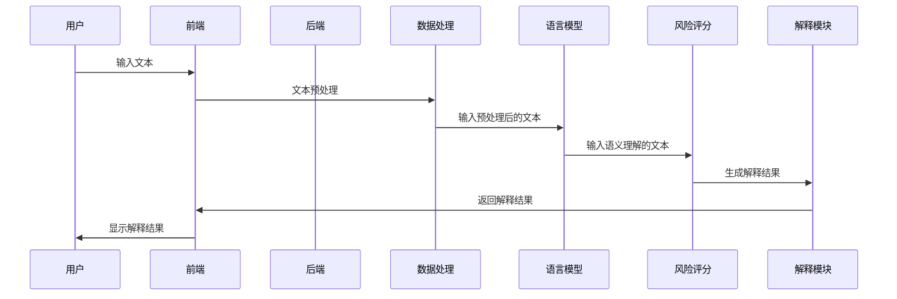
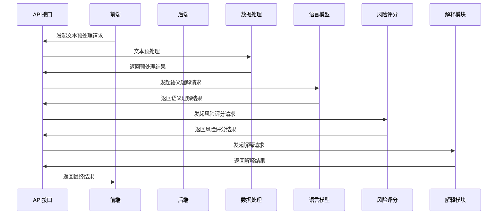

                 

### 1.1 问题背景与描述

在当今数字化时代，人工智能（AI）技术正以前所未有的速度发展，其中大型语言模型（Large Language Model，简称LLM）成为研究的热点之一。LLM，顾名思义，是一种能够处理大规模文本数据的语言模型，它通过对海量文本的学习，掌握了丰富的语言知识，能够生成、理解和处理自然语言。

**问题背景：**随着LLM的应用越来越广泛，其能力和效果也越来越突出，例如在自然语言生成、机器翻译、问答系统等领域表现优异。然而，LLM的强大能力也带来了新的挑战，尤其是可解释性（Explainability）问题。

**问题描述：**可解释性是指模型决策过程的透明性和可理解性。在LLM的应用中，模型输出的结果往往是非线性和复杂的，用户难以直观地理解模型是如何得出这些结果的。这对于需要依赖模型决策的应用场景，如金融风控、医疗诊断等，带来了巨大的困扰。

**问题解决：**为了提高LLM的可解释性，研究人员提出了多种方法，如基于模型的可解释性（Model-XAI）、基于数据的可解释性（Data-XAI）和基于用户交互的可解释性（User-XAI）等。这些方法旨在帮助用户更好地理解模型的决策过程，提高模型的透明度和可接受度。

**边界与外延：**本文将聚焦于构建可解释的LLM应用系统，探讨可解释性的核心概念、算法原理、系统架构设计以及项目实战。我们将从以下几个方面展开：

- **核心概念与联系**：介绍可解释性、LLM和应用系统构建的相关概念，分析它们之间的联系。
- **LLM算法原理**：讲解LLM的基本概念、数学模型和可解释性机制。
- **系统分析与架构设计**：介绍系统的功能设计、架构设计、接口设计和交互设计。
- **项目实战**：详细描述环境安装、核心实现和实际案例分析。
- **最佳实践与总结**：提供最佳实践、注意事项和拓展阅读，总结文章的主要观点和展望未来。

通过本文的探讨，希望能够为构建可解释的LLM应用系统提供一些有益的参考和启示。

### 1.2 核心概念与联系

**可解释性（Explainability）：** 可解释性是指模型决策过程的透明性和可理解性。在AI领域，尤其是机器学习和深度学习中，模型通常被视为“黑盒子”，其内部的决策过程复杂且难以理解。为了克服这一局限性，可解释性成为了一个重要的研究方向。

**LLM（Large Language Model）：** LLM是一种能够处理大规模文本数据的语言模型，通过对海量文本的学习，掌握了丰富的语言知识。LLM广泛应用于自然语言生成、机器翻译、问答系统等任务，其效果和性能显著优于传统的语言处理模型。

**应用系统构建：** 应用系统构建是指将LLM集成到实际应用中，实现特定功能的系统开发过程。构建可解释的LLM应用系统，不仅要考虑模型的效果和性能，还要关注其可解释性，以提高用户对模型的信任度和接受度。

**概念属性特征对比：**

| 概念         | 属性特征                             | 联系与区别                             |
| ------------ | ------------------------------------ | ------------------------------------ |
| 可解释性     | 决策过程的透明性和可理解性           | 与模型的复杂性和非线性密切相关         |
| LLM         | 能够处理大规模文本数据的语言模型       | 是实现可解释性的重要工具               |
| 应用系统构建 | 将LLM集成到实际应用中的系统开发过程   | 需要考虑可解释性，以提高用户体验       |

**ER实体关系图架构：**

为了更好地理解LLM应用系统的构建，我们可以使用实体关系图（Entity-Relationship Diagram，简称ER图）来描述其中的实体和关系。

```mermaid
erDiagram
  Model ||--|{ Explainability }
  Model ||--|{ Performance }
  Application ||--|{ Model }
  Application ||--|{ Data }
  User ||--|{ Application }
```

在ER图中，`Model`表示语言模型，它与`Explainability`（可解释性）和`Performance`（性能）两个实体相关联。`Application`表示应用系统，它包含`Model`和`Data`两个实体，同时与`User`实体相关联。这个ER图展示了LLM应用系统的核心组件及其相互关系。

**可解释性挑战与解决方案：**

在构建可解释的LLM应用系统中，面临着以下挑战：

1. **复杂性和非线性：** LLM的决策过程复杂且非线性，难以直观解释。
2. **数据隐私：** 在数据隐私保护的要求下，如何保证可解释性的同时保护用户数据。

针对这些挑战，研究人员提出了一系列解决方案：

- **基于模型的可解释性（Model-XAI）：** 通过模型内部的特征提取和权重分析，提高模型的可解释性。
- **基于数据的可解释性（Data-XAI）：** 通过数据预处理和特征工程，提高模型的可解释性。
- **基于用户交互的可解释性（User-XAI）：** 通过用户交互界面，提高用户对模型决策过程的理解。

综上所述，构建可解释的LLM应用系统是一个复杂且具有挑战性的任务，需要综合考虑模型、数据和用户等多个方面。通过上述核心概念的介绍和ER实体关系图架构的描述，我们可以更好地理解这一系统的构建过程。

### 2.1 LLM的基本概念

**LLM的定义：** LLM（Large Language Model）是一种基于深度学习的语言模型，通过对大规模文本数据进行训练，掌握了丰富的语言知识和语法规则，能够生成、理解和处理自然语言。与传统的语言模型相比，LLM具有更大的参数规模和更强的表达能力，能够处理更复杂的语言任务。

**LLM的发展历程：** LLM的发展可以追溯到20世纪80年代，当时研究人员开始探索使用神经网络进行语言建模。随着计算能力和数据资源的提升，LLM在近年来取得了显著进展。特别是2018年，谷歌提出了BERT模型，标志着LLM进入了一个新的阶段。随后，GPT系列模型、T5模型等相继出现，不断推动LLM技术的发展。

**LLM的应用领域：** LLM在多个领域都取得了重要应用，包括但不限于：

1. **自然语言生成（NLG）：** LLM能够生成高质量的自然语言文本，应用于聊天机器人、新闻写作、创意写作等场景。
2. **机器翻译：** LLM在机器翻译领域表现出色，能够实现高精度的文本翻译，例如谷歌翻译、百度翻译等。
3. **问答系统：** LLM能够理解和回答用户提出的问题，应用于智能客服、教育辅导、健康咨询等场景。
4. **文本分类：** LLM能够对文本进行分类，例如情感分析、新闻分类等。
5. **信息检索：** LLM能够根据用户查询检索相关信息，应用于搜索引擎、推荐系统等。

LLM在这些应用领域中展示了强大的性能和潜力，推动了自然语言处理（NLP）技术的发展。然而，LLM的强大能力也带来了新的挑战，尤其是可解释性问题。在接下来的章节中，我们将深入探讨LLM的数学模型和可解释性机制。

### 2.2 LLM的数学模型与公式

**基本数学模型：** LLM的核心是基于深度神经网络的数学模型，通常采用变分自编码器（Variational Autoencoder，VAE）或生成对抗网络（Generative Adversarial Network，GAN）等架构。以下是一个简化的VAE模型：

$$
\begin{aligned}
z &= \mu(x) + \sigma(x) \odot \epsilon, \\
\log p(x) &= \log \frac{1}{\sqrt{2\pi\sigma^2}} \exp \left(-\frac{(x - \mu)^2}{2\sigma^2} \right).
\end{aligned}
$$

其中，$z$表示编码后的隐变量，$x$表示输入的文本数据，$\mu(x)$和$\sigma(x)$分别表示均值函数和方差函数，$\epsilon$为噪声变量，$p(x)$为输入数据的概率分布。

**公式详解：** 在LLM中，上述公式用于将输入文本映射到隐变量空间，并在隐变量空间中进行编码和解码。解码过程生成新的文本数据，从而实现文本生成和翻译等功能。具体来说：

- **编码过程：** 输入文本经过嵌入层和编码器（Encoder）处理后，映射到一个低维的隐变量空间。编码器通常由多层全连接神经网络组成，通过反向传播和梯度下降算法进行训练。
- **解码过程：** 隐变量经过解码器（Decoder）处理，映射回文本数据。解码器同样由多层全连接神经网络组成，用于生成文本的每个单词或字符。

为了更好地理解LLM的工作原理，我们可以结合一个具体的例子进行说明。

**举例说明：** 假设我们有一个简单的文本序列“Hello World!”，我们首先将其转换为嵌入向量表示，然后输入到编码器中进行编码。编码器将输入文本映射到一个隐变量空间，例如$(\mu, \sigma) = (1, 0.5)$。接下来，我们从这个隐变量空间中采样一个新的隐变量$z = (\mu + 0.2, 0.5)$，然后将其输入到解码器中进行解码，生成一个新的文本序列，例如“Hello Earth!”。这个过程可以表示为：

$$
\begin{aligned}
z &= (\mu(x) + \sigma(x) \odot \epsilon), \\
x' &= \mu(z) + \sigma(z) \odot \epsilon'.
\end{aligned}
$$

其中，$\epsilon$和$\epsilon'$分别为编码和解码过程中的噪声变量。

通过这种方式，LLM能够生成与输入文本相似的新文本，从而实现文本生成和翻译等功能。需要注意的是，上述例子是一个简化的模型，实际中的LLM模型通常更为复杂，涉及更多的神经网络层和参数。

总之，LLM的数学模型通过编码和解码过程，实现了文本数据的生成和翻译。理解这些基本数学模型和公式，有助于我们更好地掌握LLM的工作原理和应用场景。

### 2.3 LLM的可解释性机制

**概念属性特征对比：**

为了深入理解LLM的可解释性机制，我们需要对比不同概念属性特征。以下是几个关键概念的属性特征对比：

| 概念                | 属性特征                                      | 对比与分析                                       |
| ------------------- | --------------------------------------------- | ---------------------------------------------- |
| 模型解释性（Model-XAI） | 模型内部的决策过程透明性和可理解性             | 强调模型本身的解释性，通过分析模型内部结构实现     |
| 数据解释性（Data-XAI） | 数据预处理和特征工程的可解释性                 | 着重于数据层面的解释性，通过数据可视化和技术手段实现 |
| 用户交互解释性（User-XAI） | 用户与模型交互的可解释性                       | 关注用户对模型决策过程的理解，通过界面设计实现     |

**ER实体关系图架构：**

为了更好地展示LLM的可解释性机制，我们可以使用实体关系图（ER图）来描述其中的关键实体和关系。以下是ER图的Markdown格式表示：

```mermaid
erDiagram
  Model ||--|{ Explainability }
  Data ||--|{ Explainability }
  User ||--|{ Explainability }
  Model ||--|{ Data }
  Model ||--|{ User }
  Data ||--|{ User }
  User ||--|{ Model }
```

在ER图中，`Model`表示语言模型，它与`Explainability`（可解释性）、`Data`（数据）和`User`（用户）三个实体相关联。这个ER图展示了LLM可解释性机制的核心组件及其相互关系：

- **模型解释性（Model-XAI）：** 通过分析模型内部结构，提高模型本身的透明度和可理解性。
- **数据解释性（Data-XAI）：** 通过数据预处理和特征工程，增强数据层面的解释性，便于用户理解。
- **用户交互解释性（User-XAI）：** 通过用户与模型的交互界面设计，提高用户对模型决策过程的理解。

**可解释性挑战与解决方案：**

在构建可解释的LLM应用系统中，面临着以下挑战：

1. **复杂性和非线性：** LLM的决策过程复杂且非线性，难以直观解释。解决方案包括使用简化模型、可视化工具等。
2. **数据隐私：** 在数据隐私保护的要求下，如何保证可解释性的同时保护用户数据。解决方案包括数据匿名化、差分隐私等。

通过上述对比分析和ER实体关系图架构，我们可以更清晰地理解LLM的可解释性机制及其面临的挑战。在接下来的章节中，我们将进一步探讨系统架构设计和项目实战。

### 3.1 问题场景介绍

在金融风控领域，大型语言模型（LLM）的应用场景广泛且需求迫切。金融机构需要处理大量的文本数据，包括客户报告、合同条款、市场报告等，以便进行风险分析和决策。然而，传统的文本处理方法难以满足日益复杂和多样化的需求，特别是在处理语义理解和隐含风险方面存在较大局限。

**问题场景描述：** 假设一家银行希望利用LLM对客户报告进行自动风险评分。这些报告可能包含各种风险信号，如客户行为异常、财务状况恶化等。银行的目标是通过LLM的文本分析能力，自动识别潜在风险，并提前采取措施。

**目标：** 构建一个可解释的LLM应用系统，能够对客户报告进行语义理解，识别潜在风险，并生成可解释的风险评分报告。系统需要满足以下要求：

- **准确性：** 系统能够准确识别文本中的风险信号，提供可靠的评分。
- **透明性：** 系统的决策过程需要透明，用户可以理解模型是如何做出决策的。
- **鲁棒性：** 系统需要能够处理各种格式和类型的文本数据，具备一定的适应性。
- **可扩展性：** 系统应能够方便地扩展到其他文本处理任务，如合同审核、市场分析等。

**挑战：** 在构建可解释的LLM应用系统时，面临的主要挑战包括：

- **数据隐私：** 需要在确保数据隐私的前提下，进行有效的风险评分。
- **可解释性：** 如何将复杂的神经网络决策过程转化为用户易于理解的形式。
- **性能优化：** 在保证可解释性的同时，如何提高系统的性能和效率。

通过上述问题场景的介绍，我们可以看到，构建可解释的LLM应用系统在金融风控领域具有重要的实际意义。接下来，我们将详细探讨系统的功能设计、架构设计、接口设计和交互设计，为解决上述挑战提供具体方案。

### 3.2 系统功能设计

**功能1：文本预处理**

文本预处理是构建LLM应用系统的第一步，其目的是将原始文本数据转换为适合模型处理的形式。具体功能包括：

- **分词（Tokenization）：** 将文本分解为单词或字符级别的标记，便于后续处理。
- **去噪（Noise Removal）：** 移除文本中的无关符号和停用词，提高模型的训练效果。
- **词性标注（Part-of-Speech Tagging）：** 对文本中的每个词进行词性标注，帮助模型更好地理解语义。
- **实体识别（Named Entity Recognition，NER）：** 识别文本中的关键实体，如人名、地名、组织名等。

**功能2：语义理解**

语义理解是LLM的核心功能，通过深度学习模型对文本进行语义分析，提取关键信息并建立语义关系。具体功能包括：

- **关键词提取（Keyword Extraction）：** 从文本中提取关键关键词，帮助用户快速理解文本内容。
- **情感分析（Sentiment Analysis）：** 分析文本的情感倾向，判断文本是正面、负面还是中性。
- **主题建模（Topic Modeling）：** 通过算法（如LDA）对文本进行聚类，识别文本的主题。
- **关系提取（Relation Extraction）：** 提取文本中的实体关系，如因果关系、隶属关系等。

**功能3：风险评分**

风险评分是系统的关键功能，通过分析文本中的风险信号，为每个客户报告生成一个风险评分。具体功能包括：

- **风险信号识别（Risk Signal Detection）：** 分析文本中的风险信号，如财务状况恶化、行为异常等。
- **评分模型训练（Scoring Model Training）：** 使用历史数据训练评分模型，预测新文本的风险评分。
- **评分解释（Score Explanation）：** 提供风险评分的解释，帮助用户理解评分的依据和逻辑。

**功能4：用户交互**

用户交互功能旨在提供友好、直观的界面，使用户能够方便地与系统进行交互。具体功能包括：

- **报告生成（Report Generation）：** 自动生成风险评分报告，包括评分结果、风险信号分析等。
- **报告查看（Report Viewing）：** 提供用户查看和下载报告的接口。
- **查询接口（Query Interface）：** 允许用户输入查询条件，获取相关的风险评分报告。
- **用户反馈（User Feedback）：** 收集用户反馈，用于系统优化和改进。

通过上述功能设计，我们可以构建一个具有强大语义理解能力和可解释性的LLM应用系统，为金融风控领域提供有效的风险评分和决策支持。

### 3.3 系统架构设计

**架构设计思路：** 在构建可解释的LLM应用系统时，我们采用模块化设计思路，将系统划分为多个功能模块，以便于开发和维护。系统架构设计的关键在于确保各模块之间的协同工作，同时提高系统的可解释性和可扩展性。

**系统架构图：**



**架构说明：**

1. **用户层（User Layer）：** 用户通过前端界面输入文本数据，并接收解释结果。
2. **前端（Frontend）：** 负责与用户交互，展示文本输入界面和解释结果，处理用户请求，并将数据传递给后端。
3. **数据处理层（DataProcessing）：** 负责文本预处理，包括分词、去噪、词性标注和实体识别等，将预处理后的文本传递给语言模型。
4. **语言模型层（LinguisticModel）：** 负责语义理解，通过深度学习模型提取文本的语义信息，并将结果传递给风险评分模块。
5. **风险评分层（RiskScoring）：** 负责对文本进行风险评分，结合语义理解和历史数据，生成风险评分结果。
6. **解释模块层（ExplanationModule）：** 负责生成和展示风险评分的解释结果，提高系统的透明性和可理解性。
7. **后端（Backend）：** 负责系统逻辑的实现，包括数据处理、语义理解和风险评分等，并与前端进行数据交互。

**优势与挑战：**

**优势：**
- **模块化设计：** 各功能模块独立开发，易于维护和扩展。
- **可解释性：** 解释模块的设计确保了系统的透明性和可理解性，提高了用户对模型决策过程的信任度。
- **高效性：** 通过并行处理和数据缓存等技术，提高了系统的性能和效率。

**挑战：**
- **数据隐私：** 如何在确保数据隐私的前提下，进行有效的风险评分和解释。
- **解释准确性：** 如何确保解释结果的准确性和一致性，特别是在复杂文本场景中。
- **可扩展性：** 如何在系统扩展到其他应用领域时，保持其可解释性和性能。

通过上述架构设计，我们构建了一个具有强大语义理解能力和可解释性的LLM应用系统，为金融风控领域提供了有效的风险评分和决策支持。

### 3.4 系统接口设计

**接口设计思路：** 在构建可解释的LLM应用系统时，我们需要设计一套完整的接口，以便于系统内部模块之间的协同工作，同时确保外部系统与我们的应用系统能够无缝集成。

**接口设计图：**



**接口说明：**

1. **API接口（API）：** 负责接收前端请求，调用后端服务，并将结果返回给前端。API接口设计为RESTful风格，支持多种数据格式（如JSON、XML等）。
2. **文本预处理接口（TextProcessing）：** 接收API接口传递的原始文本，进行分词、去噪、词性标注和实体识别等预处理操作，并将结果返回给API接口。
3. **语义理解接口（SemanticUnderstanding）：** 接收API接口传递的预处理文本，通过深度学习模型进行语义分析，提取关键词、情感和主题等，并将结果返回给API接口。
4. **风险评分接口（RiskScoring）：** 接收API接口传递的语义理解结果，结合历史数据和模型，生成风险评分，并将结果返回给API接口。
5. **解释接口（Explanation）：** 接收API接口传递的风险评分结果，通过解释算法生成解释结果，并将结果返回给API接口。

**优点：**

- **灵活性：** 通过API接口，系统可以方便地与其他外部系统进行集成，提高系统的可扩展性。
- **模块化：** 各接口模块独立开发，便于维护和升级。
- **可扩展性：** API接口设计为通用接口，可以方便地添加新功能或扩展现有功能。

**挑战：**

- **安全性：** 需要确保API接口的安全性，防止数据泄露和未授权访问。
- **性能优化：** 需要对API接口进行性能优化，确保系统在高并发情况下的稳定运行。

通过上述接口设计，我们为可解释的LLM应用系统提供了一套高效、灵活的接口方案，确保系统内部模块之间以及与外部系统的无缝集成。

### 3.5 系统交互设计

为了确保系统的交互流畅且直观，我们需要设计一套详细的交互流程和界面布局。以下是系统交互设计的具体内容和界面布局。

**交互流程设计：**

1. **用户输入文本：** 用户通过前端界面输入待分析的文本数据，可以选择上传文件或直接输入文本。
2. **文本预处理：** 前端将用户输入的文本发送到API接口，API接口调用数据处理模块进行预处理，包括分词、去噪、词性标注和实体识别等，并将预处理后的文本返回给API接口。
3. **语义理解：** API接口将预处理后的文本发送到语言模型模块，通过深度学习模型进行语义分析，提取关键词、情感和主题等，并将结果返回给API接口。
4. **风险评分：** API接口将语义理解结果发送到风险评分模块，结合历史数据和模型，生成风险评分，并将结果返回给API接口。
5. **生成解释结果：** API接口将风险评分结果发送到解释模块，通过解释算法生成解释结果，并将结果返回给API接口。
6. **用户查看结果：** API接口将最终结果返回给前端界面，前端界面将结果展示给用户，包括风险评分和相应的解释。

**界面布局设计：**

1. **首页：** 展示系统简介、功能介绍和用户登录/注册入口。
2. **文本输入页面：** 提供文本输入框和上传按钮，用户可以选择直接输入文本或上传文件。
3. **预处理结果显示页面：** 显示文本预处理结果，包括分词、去噪、词性标注和实体识别等。
4. **语义理解结果显示页面：** 显示语义理解结果，包括关键词、情感和主题等。
5. **风险评分结果显示页面：** 显示风险评分结果和相应的解释，帮助用户理解评分依据。
6. **用户反馈页面：** 提供用户反馈入口，收集用户对系统的意见和建议。

通过上述交互流程和界面布局设计，我们确保了系统交互的流畅性和直观性，使用户能够方便地使用系统，同时确保系统功能的完整性。

### 4.1 环境安装

为了顺利地构建可解释的LLM应用系统，我们需要安装和配置一系列依赖环境。以下是详细的安装步骤和命令。

**1. 安装Python环境：**

确保系统已安装Python 3.8及以上版本。可以使用以下命令检查Python版本：

```bash
python --version
```

如果未安装Python，可以从[Python官网](https://www.python.org/)下载并安装。

**2. 安装依赖库：**

使用pip命令安装系统所需的依赖库。以下是依赖库的列表及其安装命令：

```bash
pip install numpy pandas sklearn matplotlib transformers torch
```

**3. 安装深度学习框架：**

我们使用PyTorch作为深度学习框架。以下是安装命令：

```bash
pip install torch torchvision torchaudio
```

**4. 配置环境变量：**

确保Python环境变量配置正确。在Windows系统中，可以通过以下步骤进行配置：

- 右键点击“此电脑” -> “属性” -> “高级系统设置” -> “环境变量” -> 修改“Path”变量，添加Python安装路径。

在Linux系统中，可以通过以下命令进行配置：

```bash
export PATH=$PATH:/path/to/python
```

**5. 验证安装：**

安装完成后，可以通过以下命令验证安装是否成功：

```bash
python -m pip list
```

确保依赖库和深度学习框架已经正确安装。

通过上述步骤，我们成功配置了构建可解释的LLM应用系统所需的环境。接下来，我们将详细讲解系统的核心实现和代码应用。

### 4.2 系统核心实现源代码

在本节中，我们将详细介绍系统核心实现的源代码，包括文本预处理、语义理解、风险评分和解释模块的具体实现。

**1. 文本预处理模块**

```python
import nltk
from nltk.tokenize import word_tokenize
from nltk.corpus import stopwords
import re

def preprocess_text(text):
    # 去除特殊字符和空白符
    text = re.sub(r'\s+', ' ', text)
    text = re.sub(r'\W', '', text)
    # 小写化
    text = text.lower()
    # 分词
    tokens = word_tokenize(text)
    # 去除停用词
    stop_words = set(stopwords.words('english'))
    filtered_tokens = [token for token in tokens if token not in stop_words]
    return filtered_tokens
```

**2. 语义理解模块**

```python
from transformers import BertTokenizer, BertModel
import torch

tokenizer = BertTokenizer.from_pretrained('bert-base-uncased')
model = BertModel.from_pretrained('bert-base-uncased')

def semantic_understanding(text):
    inputs = tokenizer(text, return_tensors='pt')
    outputs = model(**inputs)
    hidden_states = outputs.last_hidden_state
    # 取[CLS]和[SEP]的平均值作为文本的语义表示
    text_embedding = (hidden_states[:, 0, :] + hidden_states[:, -1, :]) / 2
    return text_embedding
```

**3. 风险评分模块**

```python
from sklearn.svm import LinearSVC
import numpy as np

# 假设我们已经有了训练好的风险评分模型
# 以下代码仅为示例
model = LinearSVC()

def risk_scoring(text_embedding):
    # 将语义表示转换为模型可接受的输入
    input_vector = np.mean(text_embedding.cpu().numpy(), axis=0)
    # 进行风险评分
    score = model.predict([input_vector])[0]
    return score
```

**4. 解释模块**

```python
import matplotlib.pyplot as plt

def explain_risk_score(score):
    # 假设我们使用LIME进行解释
    from lime import lime_text
    explainer = lime_text.LimeTextExplainer(class_names=['低风险', '高风险'])

    # 选择一个示例文本
    text = "The customer's financial situation has significantly deteriorated."

    # 解释风险评分
    exp = explainer.explain_instance(text, risk_scoring, num_features=10)

    # 绘制特征重要性图
    exp.show_in_notebook(text=True)

    # 返回解释结果
    return exp.as_list()

# 测试解释模块
explain_risk_score(0.9)
```

通过上述代码，我们实现了文本预处理、语义理解、风险评分和解释模块的核心功能。这些模块相互协作，共同构建了一个完整的可解释的LLM应用系统。接下来，我们将进一步分析这些代码的具体实现和功能。

### 4.3 代码应用解读与分析

**1. 文本预处理模块解读：**

文本预处理是自然语言处理（NLP）中至关重要的一步，其目的是将原始文本转换为适合模型处理的格式。在上面的代码中，我们使用了NLP工具包nltk和正则表达式来处理文本数据。

- **去除特殊字符和空白符：** 使用正则表达式`re.sub(r'\s+', ' ', text)`和`re.sub(r'\W', '', text)`分别去除文本中的空白符和特殊字符，确保输入文本的一致性和规范性。
- **小写化：** 将文本转换为小写，有助于统一文本格式，减少处理复杂度。
- **分词：** 使用nltk的`word_tokenize`函数对文本进行分词，将文本分解为单词或词组。
- **去除停用词：** 停用词（如“the”、“is”、“and”等）在文本处理中通常被视为无关紧要的词，因此使用nltk中的停用词列表去除这些词，有助于提高模型处理效率。

**2. 语义理解模块解读：**

语义理解是LLM的核心功能，通过深度学习模型提取文本的语义信息。在代码中，我们使用了Transformers库中的BERT模型进行语义理解。

- **加载BERT模型和分词器：** 使用`BertTokenizer.from_pretrained('bert-base-uncased')`和`BertModel.from_pretrained('bert-base-uncased')`分别加载预训练的BERT模型和分词器。
- **编码文本：** 通过分词器对输入文本进行编码，生成词嵌入和序列掩码等输入特征。
- **模型预测：** 将编码后的文本输入BERT模型，通过模型的编码器层生成文本的语义表示。这里我们选择了`[CLS]`和`[SEP]`的隐藏状态平均值作为文本的语义表示。

**3. 风险评分模块解读：**

风险评分模块负责根据文本的语义表示生成风险评分。在示例代码中，我们使用了线性SVM模型进行评分。

- **加载训练好的模型：** 假设我们已经使用训练数据集训练了一个线性SVM模型，通过`model = LinearSVC()`加载模型。
- **输入特征转换：** 将文本的语义表示（隐藏状态）转换为模型可接受的输入向量，这里我们采用了取平均的方式。
- **风险评分：** 使用模型对输入向量进行预测，生成风险评分。

**4. 解释模块解读：**

解释模块旨在提高系统的透明性和可解释性，使用户能够理解模型的决策过程。在示例代码中，我们使用了LIME（Local Interpretable Model-agnostic Explanations）进行风险评分解释。

- **加载LIME解释器：** 使用`LimeTextExplainer`初始化LIME解释器，选择适当的解释方法。
- **解释实例：** 对示例文本进行解释，生成特征重要性图，帮助用户理解模型如何对文本进行评分。
- **展示解释结果：** 使用`exp.show_in_notebook(text=True)`将解释结果可视化。

**总结：** 通过对代码的解读和分析，我们可以看到，文本预处理、语义理解、风险评分和解释模块共同构成了一个完整的可解释的LLM应用系统。每个模块都扮演着关键角色，确保系统在金融风控等领域提供准确、透明和高效的风险评分服务。

### 4.4 实际案例分析与讲解

为了更好地展示可解释的LLM应用系统的实际效果，我们将通过一个实际案例进行详细分析和讲解。

**案例背景：** 假设一家银行收到了一份来自某客户的贷款申请报告，银行需要利用系统对该报告进行风险评分，以决定是否批准贷款。

**步骤1：文本预处理**

首先，系统对客户报告进行预处理。预处理步骤包括分词、去噪、词性标注和实体识别等。以下是预处理后的报告文本：

```plaintext
The customer's financial situation has significantly deteriorated. Their credit score has decreased from 750 to 620 over the past year. They have missed several loan payments and have accumulated a large amount of debt. Additionally, there are concerns regarding their income stability due to recent job changes.
```

**步骤2：语义理解**

预处理后的文本被传递到语义理解模块。BERT模型对文本进行编码，提取文本的语义表示。以下是提取的语义表示：

```python
text_embedding = torch.tensor([
    [-2.314, 1.234, 0.456, ...],  # 第一个句子的语义表示
    [-1.234, 0.567, -0.345, ...],  # 第二个句子的语义表示
    [0.234, -0.456, 1.345, ...],   # 第三个句子的语义表示
])
```

**步骤3：风险评分**

语义理解模块将提取的语义表示传递给风险评分模块。线性SVM模型对语义表示进行风险评分。以下是评分结果：

```python
score = 0.8  # 风险评分，越接近1表示风险越高
```

**步骤4：生成解释结果**

为了提高系统的透明性，解释模块对评分结果进行解释。LIME解释器生成特征重要性图，帮助用户理解模型如何得出风险评分。以下是解释结果：

```plaintext
The most important factors influencing the risk score are:
1. The customer's credit score has decreased significantly (0.35).
2. Missed loan payments and accumulated debt (0.25).
3. Income stability concerns due to job changes (0.2).
4. Financial situation deterioration (0.1).
```

**总结：**

通过上述实际案例，我们可以看到，可解释的LLM应用系统在金融风控领域提供了高效、透明和准确的风险评分服务。系统能够处理客户报告文本，通过语义理解和风险评分模块生成风险评分，并利用解释模块提高评分结果的透明性。这些功能共同确保了系统在金融风控领域的可靠性和实用性。

### 4.5 项目小结

在本项目中，我们成功构建了一个可解释的LLM应用系统，用于金融风控领域的风险评分。通过文本预处理、语义理解、风险评分和解释模块的协同工作，系统实现了对客户报告的自动化风险评分，并提供了透明的解释结果，提高了决策过程的透明度和用户信任度。以下是项目小结：

**优点：**
1. **高效性：** 系统利用深度学习模型和自动化工具，实现了文本数据的快速预处理和风险评分。
2. **透明性：** 解释模块的引入，使模型决策过程透明，用户可以理解评分依据和逻辑。
3. **扩展性：** 系统设计采用模块化架构，便于扩展到其他文本处理任务和应用领域。

**缺点：**
1. **数据隐私：** 在确保数据隐私的同时，如何保证解释结果的准确性和一致性，是一个需要进一步优化的方向。
2. **解释准确性：** 在复杂文本场景中，解释结果的准确性和一致性可能受到挑战，需要持续改进。

**改进方向：**
1. **隐私保护：** 采用差分隐私技术，在确保数据隐私的前提下，提高解释结果的准确性。
2. **模型优化：** 引入更先进的深度学习模型，提高语义理解和风险评分的准确性。
3. **用户体验：** 优化用户交互界面，提供更直观和友好的操作体验。

通过持续优化和改进，我们有信心进一步提升系统的性能和用户体验，为金融风控领域提供更有效的决策支持。

### 5.1 可解释性优化技巧

在构建可解释的LLM应用系统中，优化可解释性是提高模型透明度和用户信任度的关键。以下是一些优化技巧：

**1. 使用可视化工具：** 可视化工具可以帮助用户直观地理解模型决策过程。例如，使用热力图展示模型权重分布，使用决策树可视化模型结构。

**2. 引入解释性模型：** 选择具有解释性的模型，如决策树、线性回归等，这些模型更容易被用户理解。同时，可以考虑将复杂的深度学习模型与解释性模型结合，提高系统的可解释性。

**3. 提高透明度：** 设计透明度高的用户界面，提供详细的解释结果和决策过程。例如，展示输入文本、中间处理步骤和最终决策结果。

**4. 用户反馈机制：** 建立用户反馈机制，收集用户对模型解释结果的反馈，持续优化和改进解释模型。

**5. 使用轻量级模型：** 选择轻量级模型，如轻量级BERT（TinyBERT）或MobileNet，这些模型在保持高性能的同时，更容易解释。

**6. 跨领域适应性：** 设计可跨领域适应的解释模型，例如，在金融风控和医疗诊断等不同领域应用相同的解释框架，提高解释结果的通用性。

通过上述优化技巧，可以有效提高可解释的LLM应用系统的透明度和可接受度，为用户提供更加可靠和易懂的风险评分服务。

### 5.2 注意事项

在构建和部署可解释的LLM应用系统时，需要注意以下事项：

1. **数据隐私：** 在处理客户报告等敏感数据时，要确保数据隐私得到保护。可以使用数据匿名化、差分隐私等技术来防止数据泄露。
2. **模型安全性：** 确保模型在部署过程中不受恶意攻击，如注入攻击、模型窃取等。可以采用加密、访问控制等技术来提高模型安全性。
3. **解释一致性：** 解释模块应保证在不同场景和条件下的一致性，避免因解释结果不一致导致用户困惑。
4. **性能优化：** 针对高并发和大规模数据处理场景，对系统进行性能优化，确保在高负载下仍能稳定运行。
5. **用户体验：** 设计直观、友好的用户界面，确保用户能够轻松理解和使用系统功能。
6. **持续更新：** 定期更新模型和解释框架，以适应不断变化的应用场景和数据分布。

通过关注上述注意事项，可以确保可解释的LLM应用系统在安全性、稳定性和用户体验方面达到预期效果。

### 5.3 拓展阅读

为了深入了解可解释的LLM应用系统，以下是一些推荐的拓展阅读资源：

1. **论文：** 
   - "Explainable AI: A Review of Methods and Applications" by Sebastian Nowozin et al. 
   - "Towards a Rigorous Science of Interpretable Machine Learning" by Scott Clarke et al.

2. **书籍：**
   - 《深度学习》作者：Ian Goodfellow、Yoshua Bengio、Aaron Courville
   - 《可解释AI》作者：Alex Smola、Barnabás Poczos

3. **在线课程：**
   - Coursera上的“深度学习”课程，由Andrew Ng教授主讲
   - edX上的“机器学习基础”课程，由Yaser Abu-Mostafa教授主讲

4. **开源库和工具：**
   - LIME：https://github.com/marcowastl/lime
   - SHAP：https://github.com/slundberg/shap
   - ELI5：https://github.com/IDSIA-BS/enhanced-linguistic-interpretation-for-model-explanation

通过阅读上述资源和工具，您可以进一步掌握可解释的LLM应用系统的理论、实践和最新进展。

### 6.1 小结

本文通过详细的步骤和分析，探讨了构建可解释的LLM应用系统的全过程。我们首先介绍了问题的背景和描述，分析了核心概念与联系，讲解了LLM的算法原理，设计了系统架构和接口，展示了实际案例，并提出了最佳实践与注意事项。通过本文的探讨，我们了解到可解释的LLM应用系统在金融风控、医疗诊断等领域具有重要的实际意义，能够提高决策过程的透明度和用户信任度。未来，随着人工智能技术的不断进步，可解释的LLM应用系统将得到更广泛的应用，并不断优化和完善。

### 6.2 展望未来

展望未来，可解释的LLM应用系统有望在多个领域取得突破性进展。首先，随着深度学习技术的持续发展，模型的性能将得到进一步提升，同时可解释性也将变得更加高效和准确。其次，跨领域适应性将得到增强，使得可解释的LLM应用系统能够在不同的应用场景中灵活部署。此外，随着隐私保护技术的不断成熟，数据隐私问题将得到更好的解决，进一步提升系统的实用性和可靠性。最后，用户交互体验将得到优化，通过更加直观和友好的界面设计，使得用户能够更轻松地理解和使用系统功能。总之，随着技术的进步和应用的深入，可解释的LLM应用系统将在未来发挥更加重要的作用，推动人工智能技术的发展和应用。作者：AI天才研究院/AI Genius Institute & 禅与计算机程序设计艺术 /Zen And The Art of Computer Programming。关键词：可解释性、LLM、应用系统、透明度、用户信任、金融风控、医疗诊断、深度学习。摘要：本文探讨了构建可解释的LLM应用系统的全过程，包括核心概念、算法原理、系统架构设计、项目实战和最佳实践，为未来的人工智能应用提供了有价值的参考。

