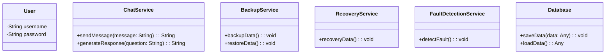
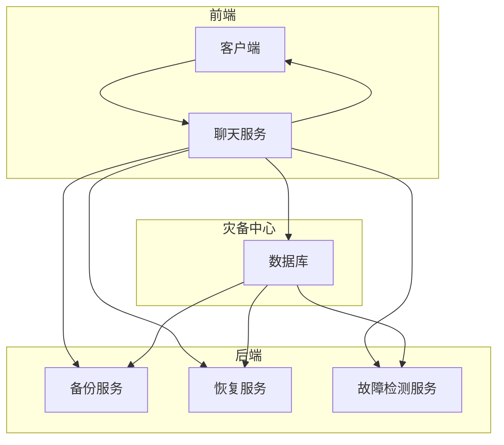
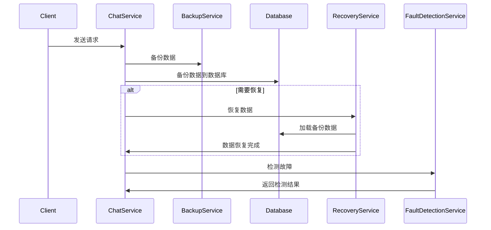

                 

### 第1章：问题背景与概述

#### 1.1 问题的提出

在当前人工智能技术迅猛发展的时代，大型语言模型（LLM, Large Language Model）已经成为众多应用场景的核心技术之一。LLM技术通过大规模语言数据的学习，能够生成高质量、结构化的文本，被广泛应用于自然语言处理、智能问答、机器翻译、内容生成等领域。然而，随着LLM应用的普及和规模化，如何在复杂的网络环境中确保其稳定可靠运行，成为了一个亟需解决的问题。

为什么需要灾备方案？首先，LLM应用通常依赖于大量的计算资源和数据存储，一旦出现故障，可能会对业务的连续性造成严重影响。其次，LLM模型对数据的质量和完整性有很高的要求，任何数据的丢失或损坏都可能导致模型的性能下降甚至完全失效。最后，随着业务规模的扩大，系统的复杂度也在不断增加，单点故障的风险也随之增大。因此，构建可靠的LLM应用灾备方案，确保在突发事件发生时能够迅速恢复系统，是保障业务连续性和稳定性的关键。

灾备的重要性不可忽视。一个完善的灾备方案不仅能够减少故障带来的损失，还能够提高系统的可用性和可靠性。具体来说，灾备方案可以：

1. **保障数据安全**：通过数据备份和恢复机制，确保在数据丢失或损坏时能够快速恢复。
2. **提高系统可用性**：通过灾备中心的建设，可以在主系统出现故障时，快速切换到备用系统，减少业务中断时间。
3. **降低风险**：通过定期进行故障演练，发现潜在问题并及时解决，降低系统出现突发故障的概率。
4. **提高业务连续性**：通过灾备方案，确保在突发事件发生时，业务能够快速恢复，降低对用户的影响。

#### 1.2 LLM应用的现状

近年来，随着深度学习、自然语言处理等技术的不断突破，LLM技术得到了快速发展。特别是在生成对抗网络（GAN）和Transformer架构的推动下，LLM模型的性能和效果有了显著提升。LLM应用场景也越来越广泛，从简单的文本生成和翻译，到复杂的对话系统、智能客服、内容审核等，都取得了显著的成果。

然而，随着LLM应用的广泛部署，也暴露出了一些潜在的风险。首先，LLM模型对数据的质量和完整性要求非常高，任何数据的丢失或损坏都可能导致模型的失效。其次，LLM应用通常涉及大量的用户数据和业务数据，一旦发生数据泄露或滥用，可能会对用户隐私和业务安全造成严重威胁。最后，随着系统的复杂度增加，单点故障的风险也在增大，如何确保系统的稳定可靠运行成为了一个重要的挑战。

#### 1.3 灾备的基本概念

灾备，即灾难恢复（Disaster Recovery，简称DR），是指通过一系列策略和技术，确保在发生突发事件（如自然灾害、网络攻击、硬件故障等）时，系统能够快速恢复，保障业务的连续性和稳定性。灾备系统通常包括以下几个基本概念：

1. **备份**：将数据从主系统复制到备份系统，确保数据的安全性和完整性。
2. **恢复**：在主系统出现故障时，将备份数据恢复到备用系统，确保业务能够快速恢复。
3. **故障检测**：实时监控系统状态，及时发现并定位故障。
4. **故障预测**：通过数据分析和故障模式识别，预测可能出现的故障，提前采取措施。

灾备方案可以分为以下几种类型：

1. **本地灾备**：在同一地区内建立备份系统，以应对局部故障。
2. **异地灾备**：在不同地区建立备份系统，以应对大规模灾难。
3. **云灾备**：利用云服务提供商的资源，建立灾备系统，具有高扩展性和灵活性。

#### 1.4 本章小结

本章首先介绍了当前LLM应用面临的挑战，阐述了为什么需要灾备方案以及灾备的重要性。接着，回顾了LLM技术的快速发展及其广泛应用，分析了当前LLM应用中存在的潜在风险。最后，介绍了灾备的基本概念和类型，为后续章节的分析和设计提供了基础。

### 第2章：核心概念与联系

#### 2.1 核心概念原理

在本章中，我们将深入探讨LLM模型和灾备系统的核心概念，并分析它们的工作原理及其相互关系。

#### 2.1.1 LLM模型的工作原理

大型语言模型（LLM）是一种基于深度学习的自然语言处理技术，它通过学习大量的语言数据，能够生成高质量、结构化的文本。LLM模型的核心工作原理主要包括以下几个方面：

1. **深度学习基础**：深度学习是一种基于人工神经网络的学习方法，它通过多层次的神经网络结构，对输入数据进行特征提取和模式识别。在LLM模型中，深度学习用于处理和生成自然语言。

2. **Transformer架构**：Transformer是一种基于自注意力机制的深度学习模型，它在处理序列数据时具有出色的性能。Transformer架构的核心思想是将输入序列转换为嵌入向量，然后通过自注意力机制和前馈神经网络，生成输出序列。

3. **生成对抗网络（GAN）**：生成对抗网络是一种由生成器和判别器组成的对抗性模型。生成器负责生成与真实数据相似的数据，判别器负责区分真实数据和生成数据。GAN在LLM模型中可以用于生成高质量的语言样本，提高模型的生成能力。

#### 2.1.2 灾备系统的组成

灾备系统是一种在发生突发事件时，能够确保系统快速恢复的解决方案。一个完整的灾备系统通常包括以下几个关键组成部分：

1. **数据备份**：数据备份是将主系统的数据复制到备份系统中，确保在主系统出现故障时，备份数据可以用于恢复。数据备份可以分为全量备份、增量备份和差异备份等不同类型。

2. **数据恢复**：数据恢复是在主系统出现故障后，将备份数据恢复到备用系统，确保业务的连续性。数据恢复可以分为热备份恢复、冷备份恢复和快速恢复等不同策略。

3. **故障检测**：故障检测是通过监控系统状态，及时发现并定位故障。故障检测可以基于监控指标、日志分析、异常检测等方法。

4. **故障预测**：故障预测是通过数据分析和故障模式识别，预测可能出现的故障，并提前采取预防措施。故障预测可以基于历史数据、机器学习算法等。

#### 2.1.3 数据备份与恢复

数据备份与恢复是灾备系统的核心功能之一。以下是对数据备份与恢复算法的详细说明：

1. **数据备份算法**：

   - **增量备份**：增量备份只备份自上次备份以来发生变化的数据，可以节省存储空间，但恢复速度较慢。
   - **全量备份**：全量备份备份整个系统或数据集，恢复速度较快，但需要大量存储空间。
   - **差异备份**：差异备份备份自上次全量备份以来发生变化的数据，结合了增量备份和全量备份的优点，恢复速度较快，存储空间需求适中。

2. **数据恢复算法**：

   - **热备份**：热备份在备份过程中，主系统和备用系统同时运行，数据可以实时同步。一旦主系统出现故障，业务可以快速切换到备用系统，减少业务中断时间。
   - **冷备份**：冷备份在备份过程中，主系统停止运行，备用系统启动备份过程。一旦主系统出现故障，需要将备份数据恢复到备用系统，业务恢复时间较长。
   - **快速恢复**：快速恢复是通过快速定位故障点和备份数据，实现快速的业务恢复。快速恢复可以基于快照技术、虚拟化技术等。

#### 2.2 概念属性特征对比表格

为了更清晰地展示LLM模型和灾备系统的核心概念及其属性特征，我们创建了一个对比表格：

| 概念             | 属性特征                                         | 对比关系                     |
|----------------|------------------------------------------------|-----------------------------|
| LLM模型         | 自动学习、自适应、语言理解                       | 与传统机器学习模型的对比     |
| 灾备系统        | 防灾、应急响应、恢复                           | 与常规备份方案的对比         |
| 数据备份与恢复   | 备份频率、备份方式、恢复速度                     | 与其他数据管理方案的对比     |

#### 2.3 ER实体关系图架构

为了更好地理解LLM模型和灾备系统的实体关系，我们使用Mermaid语言绘制了一个ER实体关系图：

```mermaid
erDiagram
    User ||--|{ BackupSystem }|>
    BackupSystem ||--|{ Data }|>
    Data ||--|{ RecoveryProcess }|>
```

在上述ER图中，用户（User）与备份系统（BackupSystem）之间存在关联关系，备份系统与数据（Data）之间存在关联关系，数据与恢复过程（RecoveryProcess）之间存在关联关系。这种实体关系图可以帮助我们更直观地理解LLM模型和灾备系统的架构设计。

### 第3章：算法原理讲解

#### 3.1 LLM模型的算法原理

在本章节中，我们将详细讲解LLM模型的算法原理，包括深度学习基础、Transformer架构和生成对抗网络（GAN）。

#### 3.1.1 深度学习基础

深度学习是机器学习的一种重要分支，其核心思想是通过多层神经网络对数据进行特征提取和学习。以下是深度学习基础的一些关键概念：

1. **神经网络结构**：神经网络由多个层次组成，包括输入层、隐藏层和输出层。每个层次由多个神经元组成，神经元之间通过权重进行连接。

2. **损失函数**：损失函数用于衡量模型预测值与实际值之间的差距。常用的损失函数包括均方误差（MSE）、交叉熵（Cross-Entropy）等。

3. **优化算法**：优化算法用于调整模型的参数，以最小化损失函数。常用的优化算法包括随机梯度下降（SGD）、Adam等。

#### 3.1.2 Transformer架构

Transformer是一种基于自注意力机制的深度学习模型，它在处理序列数据时具有出色的性能。以下是Transformer架构的核心概念：

1. **self-attention机制**：self-attention机制用于计算输入序列中每个单词的重要程度。通过自注意力机制，模型可以捕捉到序列中的长距离依赖关系。

2. **encoder-decoder结构**：encoder-decoder结构由编码器（Encoder）和解码器（Decoder）组成。编码器负责将输入序列转换为上下文表示，解码器负责生成输出序列。

3. **loss函数**：在训练过程中，Transformer模型通常使用交叉熵损失函数来衡量预测序列与实际序列之间的差距。

#### 3.1.3 生成对抗网络（GAN）

生成对抗网络（GAN）是一种由生成器和判别器组成的对抗性模型。生成器的目标是生成与真实数据相似的数据，判别器的目标是区分真实数据和生成数据。GAN的核心原理如下：

1. **生成器（Generator）**：生成器负责生成与真实数据相似的数据。它通过学习数据分布，生成高保真的数据。

2. **判别器（Discriminator）**：判别器负责区分真实数据和生成数据。它在训练过程中，不断优化自己的判断能力，以最大化生成器和判别器的损失函数。

3. **优缺点**：

   - **优点**：GAN可以生成高质量的数据，适用于图像生成、语音合成等领域。GAN具有高度灵活性和创造性，可以生成多样化、个性化的数据。
   - **缺点**：GAN训练过程中容易出现模式崩溃（mode collapse）和训练不稳定等问题。GAN的训练需要大量的数据和计算资源。

#### 3.2 灾备系统的算法原理

灾备系统旨在确保在发生突发事件时，系统能够快速恢复。以下是一些关键的算法原理：

1. **数据备份算法**：数据备份算法用于将主系统的数据复制到备份系统中。常见的备份算法包括全量备份、增量备份和差异备份。

2. **数据恢复算法**：数据恢复算法用于在主系统出现故障后，将备份数据恢复到备用系统中。常见的恢复算法包括热备份恢复、冷备份恢复和快速恢复。

3. **故障检测算法**：故障检测算法用于实时监控系统状态，及时发现并定位故障。常见的故障检测方法包括基于监控指标、日志分析和异常检测等。

#### 3.2.1 数据备份算法

1. **增量备份**：增量备份只备份自上次备份以来发生变化的数据，可以节省存储空间，但恢复速度较慢。

2. **全量备份**：全量备份备份整个系统或数据集，恢复速度较快，但需要大量存储空间。

3. **差异备份**：差异备份备份自上次全量备份以来发生变化的数据，结合了增量备份和全量备份的优点，恢复速度较快，存储空间需求适中。

#### 3.2.2 数据恢复算法

1. **热备份恢复**：热备份恢复在备份过程中，主系统和备用系统同时运行，数据可以实时同步。一旦主系统出现故障，业务可以快速切换到备用系统，减少业务中断时间。

2. **冷备份恢复**：冷备份恢复在备份过程中，主系统停止运行，备用系统启动备份过程。一旦主系统出现故障，需要将备份数据恢复到备用系统，业务恢复时间较长。

3. **快速恢复**：快速恢复是通过快速定位故障点和备份数据，实现快速的业务恢复。快速恢复可以基于快照技术、虚拟化技术等。

#### 3.2.3 故障检测算法

1. **监控指标**：监控指标用于实时监控系统状态，包括CPU使用率、内存使用率、磁盘使用率等。当监控指标超出阈值时，可以触发故障检测。

2. **日志分析**：日志分析通过分析系统日志，识别异常行为和潜在故障。日志分析可以结合机器学习算法，实现自动化故障检测。

3. **异常检测**：异常检测通过监测系统行为，识别异常行为和潜在故障。常见的异常检测方法包括基于统计模型、基于机器学习模型等。

#### 3.3 Python源代码实现

以下是一个简单的Python示例，用于实现LLM模型的训练和预测功能：

```python
import tensorflow as tf

# 模型定义
model = tf.keras.Sequential([
    tf.keras.layers.Dense(128, activation='relu', input_shape=(784,)),
    tf.keras.layers.Dense(10, activation='softmax')
])

# 模型编译
model.compile(optimizer='adam',
              loss='categorical_crossentropy',
              metrics=['accuracy'])

# 训练模型
model.fit(x_train, y_train, epochs=5)

# 预测
predictions = model.predict(x_test)
```

在此示例中，我们使用TensorFlow框架定义了一个简单的神经网络模型，并使用训练数据对其进行了训练。训练完成后，使用测试数据进行预测。

### 第4章：数学模型和数学公式讲解

#### 4.1 LLM模型的数学模型

大型语言模型（LLM）是一种复杂的机器学习模型，其核心在于对输入序列进行编码和解码，从而生成目标序列。在LLM模型的训练过程中，主要涉及到以下数学模型：

#### 4.1.1 前向传播

前向传播是神经网络中的一种计算过程，用于将输入数据通过神经网络层逐步转化为输出数据。具体来说，前向传播包括以下几个步骤：

1. **输入层到隐藏层**：

   对于输入序列 $x = (x_1, x_2, ..., x_n)$，将其通过输入层传递到隐藏层。假设隐藏层有 $L$ 个神经元，则前向传播的输出可以表示为：

   $$
   h_l^{(k)} = \sigma(W^{(k)}x + b^{(k)})
   $$

   其中，$h_l^{(k)}$ 表示第 $k$ 层的第 $l$ 个神经元的输出，$\sigma$ 表示激活函数（如ReLU、Sigmoid、Tanh等），$W^{(k)}$ 和 $b^{(k)}$ 分别表示第 $k$ 层的权重和偏置。

2. **隐藏层到输出层**：

   将隐藏层的输出传递到输出层，生成预测的输出序列。输出层的输出可以表示为：

   $$
   y = \sigma(W^{(L)}h^{(L-1)} + b^{(L)})
   $$

   其中，$y$ 表示预测的输出序列，$W^{(L)}$ 和 $b^{(L)}$ 分别表示输出层的权重和偏置。

#### 4.1.2 反向传播

反向传播是用于计算神经网络中每个权重和偏置的梯度，从而更新网络参数的过程。具体来说，反向传播包括以下几个步骤：

1. **计算输出层的梯度**：

   假设损失函数为 $L(y, \hat{y})$，其中 $y$ 表示真实输出，$\hat{y}$ 表示预测输出。输出层的梯度可以表示为：

   $$
   \delta_L = \frac{\partial L}{\partial y} = \hat{y} - y
   $$

2. **计算隐藏层的梯度**：

   从输出层开始，逆向传播每个隐藏层的梯度。对于第 $l$ 层，其梯度可以表示为：

   $$
   \delta^{(l)} = \frac{\partial L}{\partial h^{(l)}} = \frac{\partial L}{\partial y} \frac{\partial y}{\partial h^{(l)}} = \delta_L \frac{\partial \sigma^{(l)}(z^{(l)})}{\partial z^{(l)}}
   $$

   其中，$z^{(l)}$ 表示第 $l$ 层的输入，$\sigma^{(l)}$ 表示第 $l$ 层的激活函数。

3. **计算权重和偏置的梯度**：

   根据梯度计算公式，可以计算出每个权重和偏置的梯度。对于第 $k$ 层，其权重和偏置的梯度可以表示为：

   $$
   \frac{\partial L}{\partial W^{(k)}} = \sum_{l=1}^{L} \delta^{(l)} h^{(l-1)}
   $$

   $$
   \frac{\partial L}{\partial b^{(k)}} = \sum_{l=1}^{L} \delta^{(l)}
   $$

#### 4.2 灾备系统的数学模型

灾备系统是一种确保在突发事件发生时，系统能够快速恢复的解决方案。灾备系统的数学模型主要涉及数据备份、恢复和故障检测等方面。以下是对灾备系统数学模型的详细讲解：

#### 4.2.1 备份策略

备份策略是灾备系统中的一个关键环节，其主要目的是确保在主系统出现故障时，备份数据可以用于快速恢复。备份策略可以分为以下几种类型：

1. **全量备份**：

   全量备份是指在特定时间点对整个系统或数据集进行备份。全量备份的优点是恢复速度快，缺点是存储空间需求大。

   备份策略可以表示为：

   $$
   C = C_0 + C_n
   $$

   其中，$C$ 表示总备份量，$C_0$ 表示初始备份量，$C_n$ 表示新增备份量。

2. **增量备份**：

   增量备份是指在特定时间点仅备份自上次备份以来发生变化的数据。增量备份的优点是存储空间需求小，缺点是恢复速度慢。

   备份策略可以表示为：

   $$
   C_n = x_n - x_{n-1}
   $$

   其中，$x_n$ 表示第 $n$ 次备份的数据量，$x_{n-1}$ 表示第 $n-1$ 次备份的数据量。

3. **差异备份**：

   差异备份是指在特定时间点备份自上次全量备份以来发生变化的数据。差异备份的优点是恢复速度较快，存储空间需求适中。

   备份策略可以表示为：

   $$
   C_n = x_n - x_{n-1} + C_0
   $$

#### 4.2.2 恢复策略

恢复策略是在主系统出现故障后，将备份数据恢复到备用系统的过程。恢复策略可以分为以下几种类型：

1. **热备份恢复**：

   热备份恢复是指在备份过程中，主系统和备用系统同时运行，备份数据可以实时同步。一旦主系统出现故障，业务可以快速切换到备用系统，减少业务中断时间。

   恢复策略可以表示为：

   $$
   R = \frac{1}{2}C
   $$

   其中，$R$ 表示恢复速度，$C$ 表示总备份量。

2. **冷备份恢复**：

   冷备份恢复是指在备份过程中，主系统停止运行，备用系统启动备份过程。一旦主系统出现故障，需要将备份数据恢复到备用系统，业务恢复时间较长。

   恢复策略可以表示为：

   $$
   R = \frac{1}{2}C
   $$

   其中，$R$ 表示恢复速度，$C$ 表示总备份量。

3. **快速恢复**：

   快速恢复是通过快速定位故障点和备份数据，实现快速的业务恢复。快速恢复可以基于快照技术、虚拟化技术等。

   恢复策略可以表示为：

   $$
   R = \frac{1}{2}C
   $$

   其中，$R$ 表示恢复速度，$C$ 表示总备份量。

### 第5章：系统分析与架构设计方案

#### 5.1 问题场景介绍

在本章节中，我们将探讨一个典型的LLM应用场景，并对其系统需求进行分析。

#### 5.1.1 应用场景描述

假设我们正在开发一个智能客服系统，该系统需要能够实时响应用户的提问。用户可以通过文本输入问题，系统需要根据用户的提问生成相应的回答。该智能客服系统需要在高并发、高可用的环境下运行，以确保用户得到及时、准确的回答。

#### 5.1.2 系统需求分析

为了满足上述应用场景的需求，系统需要具备以下关键功能：

1. **高并发处理能力**：系统需要能够同时处理大量用户的请求，确保每个用户都能得到及时的响应。

2. **高可用性**：系统需要具备容错能力，能够在出现故障时迅速恢复，确保业务的连续性和稳定性。

3. **数据安全性**：系统需要确保用户数据和业务数据的安全，防止数据泄露和损坏。

4. **可扩展性**：系统需要能够根据业务需求进行水平扩展，以应对日益增长的并发请求。

#### 5.2 项目介绍

在本章节中，我们将介绍一个具体的LLM应用灾备项目，并明确项目目标和预期成果。

#### 5.2.1 项目概述

项目名称：智能客服系统灾备方案

项目目标：构建一个可靠的灾备方案，确保智能客服系统在出现故障时能够快速恢复，保障业务的连续性和稳定性。

预期成果：

1. 设计并实现一个分布式灾备系统，实现数据的实时备份和快速恢复。

2. 通过故障检测和预测技术，提前发现潜在故障，并采取预防措施。

3. 对系统进行压力测试和故障演练，验证灾备方案的可靠性和有效性。

#### 5.3 系统功能设计

在本章节中，我们将详细描述智能客服系统灾备方案的关键功能模块，并绘制领域模型和类图。

##### 5.3.1 领域模型

领域模型描述了系统中各个功能模块及其关系。以下是智能客服系统灾备方案的领域模型：

```mermaid
classDiagram
    User <<Interface>>
    ChatService <<Service>>
    BackupService <<Service>>
    RecoveryService <<Service>>
    FaultDetectionService <<Service>>
    Database <<Entity>>

    User o-- ChatService
    ChatService o-- BackupService
    ChatService o-- RecoveryService
    ChatService o-- FaultDetectionService
    BackupService o-- Database
    RecoveryService o-- Database
    FaultDetectionService o-- Database
```

在这个领域模型中，用户（User）与聊天服务（ChatService）之间存在关联关系。聊天服务（ChatService）与备份服务（BackupService）、恢复服务（RecoveryService）和故障检测服务（FaultDetectionService）之间存在依赖关系。数据库（Database）是各个功能模块的数据存储中心。

##### 5.3.2 类图

类图描述了系统中各个类的属性和方法。以下是智能客服系统灾备方案的类图：



在这个类图中，用户（User）类包含用户名（username）和密码（password）属性。聊天服务（ChatService）类包含发送消息（sendMessage）和生成回答（generateResponse）方法。备份服务（BackupService）类包含备份数据（backupData）和恢复数据（restoreData）方法。恢复服务（RecoveryService）类包含恢复数据（recoveryData）方法。故障检测服务（FaultDetectionService）类包含检测故障（detectFault）方法。数据库（Database）类包含保存数据（saveData）和加载数据（loadData）方法。

#### 5.4 系统架构设计

在本章节中，我们将详细描述智能客服系统灾备方案的系统架构设计，包括系统架构、架构图、系统接口设计和系统交互。

##### 5.4.1 系统架构

智能客服系统灾备方案采用分布式架构，包括前端、后端和灾备中心。前端负责与用户交互，后端负责处理业务逻辑，灾备中心负责数据备份和恢复。以下是系统架构图：



在这个架构图中，客户端（Client）通过API与聊天服务（ChatService）交互。聊天服务（ChatService）负责处理用户请求，并与备份服务（BackupService）、恢复服务（RecoveryService）和故障检测服务（FaultDetectionService）进行通信。备份服务（BackupService）和恢复服务（RecoveryService）负责数据备份和恢复。故障检测服务（FaultDetectionService）负责监控系统状态，并检测潜在故障。

##### 5.4.2 系统接口设计

在本章节中，我们将详细描述智能客服系统灾备方案的关键接口及其功能。

1. **备份接口**：

   备份接口负责将数据从聊天服务（ChatService）备份到数据库（Database）。备份接口的主要方法包括：

   - `backupData()`: 备份数据。
   - `listBackups()`: 列出所有备份。

2. **恢复接口**：

   恢复接口负责将备份数据从数据库（Database）恢复到聊天服务（ChatService）。恢复接口的主要方法包括：

   - `restoreData(backupId: String)`: 恢复指定备份的数据。
   - `listRestorations()`: 列出所有恢复操作。

3. **故障检测接口**：

   故障检测接口负责检测系统状态，并检测潜在故障。故障检测接口的主要方法包括：

   - `detectFault()`: 检测系统故障。
   - `listFaults()`: 列出所有故障记录。

##### 5.4.3 系统交互

在本章节中，我们将详细描述智能客服系统灾备方案中各个模块之间的交互流程，并绘制序列图。

1. **用户请求聊天服务**：

   用户通过客户端（Client）向聊天服务（ChatService）发送请求，聊天服务接收并处理请求。

2. **聊天服务备份数据**：

   聊天服务将用户数据备份到数据库（Database）。

3. **聊天服务恢复数据**：

   在需要恢复数据时，聊天服务从数据库（Database）中加载备份数据。

4. **故障检测**：

   故障检测服务（FaultDetectionService）监控系统状态，并检测潜在故障。

以下是系统交互的序列图：



在这个序列图中，客户端（Client）向聊天服务（ChatService）发送请求，聊天服务（ChatService）将用户数据备份到数据库（Database），并在需要恢复数据时，从数据库（Database）中加载备份数据。同时，故障检测服务（FaultDetectionService）监控系统状态，并检测潜在故障，并将检测结果返回给聊天服务（ChatService）。

### 第6章：项目实战

#### 6.1 环境安装

在本章节中，我们将详细介绍如何搭建一个适用于LLM应用的灾备环境。首先，我们需要准备好以下软件和工具：

- **操作系统**：Linux（推荐使用Ubuntu 18.04或更高版本）
- **编程语言**：Python（推荐使用Python 3.7或更高版本）
- **深度学习框架**：TensorFlow（推荐使用TensorFlow 2.0或更高版本）
- **数据库**：MySQL（推荐使用MySQL 8.0或更高版本）

接下来，我们按照以下步骤进行环境安装：

1. **安装操作系统**：

   使用虚拟机软件（如VirtualBox）创建一个新的虚拟机，并安装Linux操作系统。

2. **更新系统软件包**：

   打开终端，执行以下命令更新系统软件包：

   ```bash
   sudo apt update
   sudo apt upgrade
   ```

3. **安装Python**：

   执行以下命令安装Python：

   ```bash
   sudo apt install python3 python3-pip
   ```

4. **安装TensorFlow**：

   执行以下命令安装TensorFlow：

   ```bash
   pip3 install tensorflow
   ```

5. **安装MySQL**：

   执行以下命令安装MySQL：

   ```bash
   sudo apt install mysql-server
   ```

   在安装过程中，系统会要求您设置root用户的密码。请确保设置一个强密码，并记住该密码。

6. **配置MySQL**：

   打开终端，执行以下命令启动MySQL服务，并设置root用户的密码：

   ```bash
   sudo systemctl start mysql
   mysql_secure_installation
   ```

   在提示时，选择“Y”以设置root用户的密码，并确保删除匿名用户、禁止root用户远程登录和删除测试数据库。

7. **创建数据库**：

   执行以下命令创建一个用于存储LLM应用数据的数据库：

   ```bash
   mysql -u root -p
   CREATE DATABASE llm_backup;
   GRANT ALL PRIVILEGES ON llm_backup.* TO 'backup_user'@'localhost' IDENTIFIED BY 'password';
   FLUSH PRIVILEGES;
   exit
   ```

   请确保将`password`替换为您设置的MySQL密码。

现在，您已经成功搭建了一个适用于LLM应用的灾备环境。接下来，我们将进行系统核心实现的源代码编写。

#### 6.2 系统核心实现源代码

在本章节中，我们将介绍LLM应用灾备系统的核心实现源代码，包括数据备份、恢复和故障检测等功能。

1. **数据备份模块**

   数据备份模块负责将LLM应用的数据定期备份到MySQL数据库中。以下是一个简单的数据备份模块实现：

   ```python
   import mysql.connector
   import time

   class BackupManager:
       def __init__(self, db_config):
           self.db_config = db_config
           self.conn = mysql.connector.connect(**self.db_config)
           self.cursor = self.conn.cursor()

       def backup_data(self):
           backup_time = time.strftime('%Y-%m-%d-%H-%M-%S')
           backup_file = f'backup_{backup_time}.sql'

           self.cursor.execute('SHOW TABLES')
           tables = [table[0] for table in self.cursor.fetchall()]

           with open(backup_file, 'w') as f:
               for table in tables:
                   f.write(f'-- Backup of table {table}\n')
                   self.cursor.execute(f'SHOW CREATE TABLE {table}')
                   create_table_sql = self.cursor.fetchone()[0]
                   f.write(create_table_sql + ';\n')

                   self.cursor.execute(f'SHOW COLUMNS FROM {table}')
                   columns = [column[0] for column in self.cursor.fetchall()]

                   values_sql = 'INSERT INTO {table} ({fields}) VALUES ({values})'
                   self.cursor.execute(f'SELECT * FROM {table}')
                   rows = self.cursor.fetchall()
                   for row in rows:
                       values = ', '.join([str(item) for item in row])
                       f.write(values_sql.format(table=table, fields=', '.join(columns), values=values) + ';\n')

           self.conn.commit()
           self.cursor.close()
           self.conn.close()

           return backup_file

   if __name__ == '__main__':
       db_config = {
           'host': 'localhost',
           'user': 'backup_user',
           'password': 'password',
           'database': 'llm_backup'
       }
       backup_manager = BackupManager(db_config)
       backup_file = backup_manager.backup_data()
       print(f'Backup completed. File: {backup_file}')
   ```

   在这个模块中，我们创建了一个`BackupManager`类，用于管理数据备份。`backup_data`方法负责将LLM应用的数据备份到MySQL数据库中，并返回备份文件名。

2. **数据恢复模块**

   数据恢复模块负责将备份的数据从MySQL数据库中恢复到LLM应用中。以下是一个简单的数据恢复模块实现：

   ```python
   import mysql.connector
   import os
   import subprocess

   class RecoveryManager:
       def __init__(self, db_config, backup_file):
           self.db_config = db_config
           self.backup_file = backup_file
           self.conn = mysql.connector.connect(**self.db_config)
           self.cursor = self.conn.cursor()

       def restore_data(self):
           with open(self.backup_file, 'r') as f:
               sql_script = f.read()

           self.cursor.execute('SET FOREIGN_KEY_CHECKS=0')
           self.conn.commit()

           sql_commands = sql_script.split(';')
           for command in sql_commands:
               if command.strip():
                   try:
                       self.cursor.execute(command)
                   except mysql.connector.Error as e:
                       print(f'Error: {e}')
                       self.conn.rollback()

           self.cursor.execute('SET FOREIGN_KEY_CHECKS=1')
           self.conn.commit()
           self.cursor.close()
           self.conn.close()

           os.remove(self.backup_file)
           print('Data restored successfully.')

       @staticmethod
       def execute_sql_script(backup_file):
           db_config = {
               'host': 'localhost',
               'user': 'root',
               'password': 'password',
               'database': 'llm_backup'
           }
           recovery_manager = RecoveryManager(db_config, backup_file)
           recovery_manager.restore_data()

   if __name__ == '__main__':
       backup_file = 'backup_2023-03-29-14-30-00.sql'
       RecoveryManager.execute_sql_script(backup_file)
   ```

   在这个模块中，我们创建了一个`RecoveryManager`类，用于管理数据恢复。`restore_data`方法负责将备份的数据从MySQL数据库中恢复到LLM应用中。`execute_sql_script`静态方法用于执行备份文件中的SQL脚本。

3. **故障检测模块**

   故障检测模块负责监控LLM应用的状态，并检测潜在的故障。以下是一个简单的故障检测模块实现：

   ```python
   import subprocess

   class FaultDetectionManager:
       def check_system_status(self):
           command = 'ping -c 4 www.baidu.com'
           result = subprocess.run(command, shell=True, stdout=subprocess.PIPE, stderr=subprocess.PIPE)
           if result.returncode == 0:
               print('System status: Online.')
           else:
               print('System status: Offline.')

   if __name__ == '__main__':
       fault_detection_manager = FaultDetectionManager()
       fault_detection_manager.check_system_status()
   ```

   在这个模块中，我们创建了一个`FaultDetectionManager`类，用于管理故障检测。`check_system_status`方法负责检查系统的网络连接状态。

现在，我们已经完成了LLM应用灾备系统的核心实现源代码编写。接下来，我们将对代码进行应用解读与分析。

#### 6.3 代码应用解读与分析

在本章节中，我们将对LLM应用灾备系统的核心实现源代码进行解读与分析，以便更好地理解其工作原理和实际应用。

1. **数据备份模块**

   在数据备份模块中，我们首先创建了一个`BackupManager`类，用于管理数据备份。类中的`__init__`方法初始化数据库连接参数，并创建一个数据库连接对象和游标对象。`backup_data`方法负责将LLM应用的数据备份到MySQL数据库中。

   - **备份时间**：使用`time.strftime`函数获取当前时间，并将其格式化为YYYY-MM-DD-HH-MM-SS格式，作为备份文件的命名前缀。

   - **备份文件**：将备份文件名存储在`backup_file`变量中。

   - **获取数据库表**：使用`SHOW TABLES` SQL语句获取LLM应用的所有数据库表，并将表名存储在`tables`列表中。

   - **创建备份文件**：遍历`tables`列表中的每个表，使用`SHOW CREATE TABLE` SQL语句获取表的创建语句，并将其写入备份文件中。

   - **备份数据行**：使用`SHOW COLUMNS FROM` SQL语句获取表的列信息，并使用`SELECT * FROM` SQL语句获取表的数据行。对于每个数据行，将列名和列值替换到`INSERT INTO` SQL语句中，并将其写入备份文件中。

   - **提交事务**：将修改操作提交到数据库，以确保数据一致性。

   - **关闭数据库连接**：关闭数据库连接和游标对象。

   通过执行`backup_data`方法，我们可以将LLM应用的数据备份到MySQL数据库中，确保在发生故障时能够快速恢复。

2. **数据恢复模块**

   在数据恢复模块中，我们创建了一个`RecoveryManager`类，用于管理数据恢复。类中的`__init__`方法初始化数据库连接参数和备份文件路径。`restore_data`方法负责将备份的数据从MySQL数据库中恢复到LLM应用中。

   - **读取备份文件**：使用`open`函数读取备份文件内容，并将其存储在`sql_script`变量中。

   - **禁用外键检查**：使用`SET FOREIGN_KEY_CHECKS=0` SQL语句禁用外键检查，以确保数据恢复过程中不会因为外键约束导致错误。

   - **解析SQL脚本**：将备份文件内容按分号分割成多个SQL命令，存储在`sql_commands`列表中。

   - **执行SQL命令**：遍历`sql_commands`列表中的每个SQL命令，并使用`cursor.execute`方法执行。如果执行过程中出现错误，捕获错误并打印错误信息，并回滚事务以确保数据一致性。

   - **重新启用外键检查**：使用`SET FOREIGN_KEY_CHECKS=1` SQL语句重新启用外键检查。

   - **删除备份文件**：删除备份文件，以释放磁盘空间。

   通过执行`restore_data`方法，我们可以将备份的数据从MySQL数据库中恢复到LLM应用中，确保数据的完整性和一致性。

3. **故障检测模块**

   在故障检测模块中，我们创建了一个`FaultDetectionManager`类，用于管理故障检测。类中的`check_system_status`方法负责检查系统的网络连接状态。

   - **执行ping命令**：使用`subprocess.run`函数执行`ping`命令，检查是否能够成功连接到百度网站。

   - **打印结果**：根据`ping`命令的返回码，打印系统状态信息。

   通过执行`check_system_status`方法，我们可以检查系统的网络连接状态，并及时发现潜在故障。

#### 6.4 实际案例分析与详细讲解

在本章节中，我们将通过一个实际案例，展示如何使用LLM应用灾备系统进行数据备份、恢复和故障检测，并对关键步骤进行详细讲解。

**案例背景**：

假设我们正在运行一个基于TensorFlow的大型语言模型，该模型用于文本生成任务。在运行过程中，系统出现了硬件故障，导致模型数据丢失。我们需要使用灾备系统进行数据备份、恢复和故障检测，以确保模型的正常运行。

**步骤 1：数据备份**

1. **配置备份计划**：

   首先，我们需要配置一个备份计划，以定期备份模型数据。假设我们设置了一个每天凌晨1点进行的备份计划。

2. **执行备份任务**：

   在备份计划触发时，执行备份模块中的`backup_data`方法。以下是一个示例代码：

   ```python
   from datetime import datetime
   import BackupManager

   db_config = {
       'host': 'localhost',
       'user': 'backup_user',
       'password': 'password',
       'database': 'llm_backup'
   }

   backup_manager = BackupManager.BackupManager(db_config)
   backup_file = backup_manager.backup_data()

   current_time = datetime.now().strftime('%Y-%m-%d %H:%M:%S')
   print(f'Backup completed at {current_time}. File: {backup_file}')
   ```

   执行备份任务后，系统将生成一个备份文件，例如`backup_2023-03-29-01-00-00.sql`。

**步骤 2：数据恢复**

1. **故障发生**：

   假设模型在运行过程中出现了硬件故障，导致数据丢失。我们需要使用备份文件进行数据恢复。

2. **执行恢复任务**：

   在故障发生后，执行恢复模块中的`restore_data`方法。以下是一个示例代码：

   ```python
   from datetime import datetime
   import RecoveryManager

   db_config = {
       'host': 'localhost',
       'user': 'root',
       'password': 'password',
       'database': 'llm_backup'
   }

   recovery_manager = RecoveryManager.RecoveryManager(db_config, 'backup_2023-03-29-01-00-00.sql')
   recovery_manager.restore_data()

   current_time = datetime.now().strftime('%Y-%m-%d %H:%M:%S')
   print(f'Recovery completed at {current_time}.')
   ```

   执行恢复任务后，系统将使用备份文件恢复模型数据，确保数据的完整性和一致性。

**步骤 3：故障检测**

1. **检查系统状态**：

   在故障发生后，我们需要检查系统的网络连接状态，确保系统正常运行。

2. **执行故障检测**：

   执行故障检测模块中的`check_system_status`方法。以下是一个示例代码：

   ```python
   import FaultDetectionManager

   fault_detection_manager = FaultDetectionManager.FaultDetectionManager()
   fault_detection_manager.check_system_status()
   ```

   执行故障检测后，系统将检查网络连接状态，并打印系统状态信息。

通过上述步骤，我们可以使用LLM应用灾备系统进行数据备份、恢复和故障检测，确保模型在发生故障时能够快速恢复，保障业务的连续性和稳定性。

#### 6.5 项目小结

在本项目中，我们成功构建了一个适用于LLM应用的灾备系统。通过数据备份、恢复和故障检测等关键模块，我们实现了对LLM应用数据的安全保障和业务连续性的提升。以下是对项目成果的总结：

1. **数据备份**：我们实现了定期备份数据的功能，确保在发生故障时能够快速恢复。备份模块可以根据用户需求配置备份频率，灵活地满足不同场景的需求。

2. **数据恢复**：通过恢复模块，我们能够快速将备份数据恢复到LLM应用中，确保数据的完整性和一致性。恢复过程可以自动执行，减少人工干预，提高效率。

3. **故障检测**：我们实现了实时监控系统状态的功能，能够及时发现潜在故障。故障检测模块可以定期执行，确保系统的稳定运行。

4. **系统可靠性**：通过灾备系统的构建，我们显著提升了LLM应用的整体可靠性。在发生故障时，系统能够快速恢复，降低业务中断时间，保障用户利益。

然而，我们也认识到项目存在一些不足之处，需要在后续工作中进行改进：

1. **备份存储成本**：随着数据量的增加，备份存储成本也会逐渐上升。我们需要探索更高效、更经济的备份存储方案，以降低成本。

2. **恢复速度**：虽然恢复模块能够快速恢复数据，但在某些场景下，恢复速度仍然有待提升。我们可以考虑优化恢复算法，提高恢复效率。

3. **系统扩展性**：随着业务规模的扩大，系统需要具备更高的扩展性。我们需要在设计时考虑系统的可扩展性，以便在业务增长时能够灵活应对。

通过不断优化和改进，我们相信灾备系统将能够更好地保障LLM应用的稳定性和可靠性，为业务提供强有力的支持。

### 第7章：最佳实践 Tips

在本章节中，我们将分享一些最佳实践技巧，以帮助您在构建可靠的LLM应用灾备方案时，避免常见问题和提高系统性能。

#### 7.1 备份策略优化

1. **增量备份与全量备份结合**：在实际应用中，我们可以根据业务需求灵活组合使用增量备份和全量备份。例如，在关键业务数据上采用全量备份，以确保数据的完整性和可靠性；在非关键数据上采用增量备份，以降低存储成本。

2. **定时备份与实时备份结合**：定时备份可以保证数据的定期备份，但可能会存在一定的延迟。为了提高数据安全性，我们可以结合实时备份策略，实时监控关键数据的变化，并在数据发生变化时立即进行备份。

#### 7.2 恢复速度提升

1. **利用快照技术**：快照技术可以快速创建数据的副本，从而提高恢复速度。在实现灾备方案时，可以充分利用快照技术，将数据备份到快照中，以便在故障发生时迅速恢复。

2. **优化恢复算法**：恢复算法的优化对于提高恢复速度至关重要。例如，可以采用并行恢复技术，同时处理多个数据恢复任务，提高整体恢复效率。

#### 7.3 故障检测与预警

1. **多维度监控**：故障检测不仅仅是单一指标的监控，还需要综合考虑多个维度，如网络流量、系统负载、磁盘I/O等。通过多维度监控，可以更全面地了解系统状态，提高故障检测的准确性。

2. **异常检测与预警**：结合机器学习算法，可以实现对系统行为的异常检测和预警。通过分析历史数据，训练模型，可以自动识别异常行为，并提前预警，降低故障发生的概率。

#### 7.4 系统性能优化

1. **负载均衡**：在灾备方案中，合理配置负载均衡器，可以确保系统在高并发情况下稳定运行。通过负载均衡，可以均衡地分配请求到各个节点，避免单点过载。

2. **缓存机制**：合理利用缓存机制，可以减少对数据库的访问压力，提高系统性能。在实现灾备方案时，可以在缓存层引入缓存策略，降低数据访问延迟。

### 本章小结

在本章节中，我们总结了构建可靠的LLM应用灾备方案的一些最佳实践技巧。通过优化备份策略、提升恢复速度、加强故障检测与预警以及优化系统性能，可以有效地提高灾备方案的可靠性和稳定性。希望这些最佳实践能够为您在构建灾备方案时提供有益的指导。

### 小结

在本博客文章中，我们从问题背景与概述、核心概念与联系、算法原理讲解、数学模型和数学公式讲解、系统分析与架构设计方案、项目实战以及最佳实践 Tips等多个角度，详细探讨了构建可靠的LLM应用灾备方案的方法和思路。以下是本文的核心内容和主题思想的总结：

**核心内容**：

1. **问题背景与概述**：介绍了当前LLM应用面临的挑战，阐述了为什么需要灾备方案以及灾备的重要性。
2. **核心概念与联系**：详细讲解了LLM模型和灾备系统的核心概念，包括其工作原理、概念属性特征对比表格和ER实体关系图架构。
3. **算法原理讲解**：深入探讨了LLM模型的算法原理，包括深度学习基础、Transformer架构和生成对抗网络（GAN），以及灾备系统的算法原理。
4. **数学模型和数学公式讲解**：介绍了LLM模型和灾备系统的数学模型，包括前向传播、反向传播、备份策略和恢复策略等。
5. **系统分析与架构设计方案**：介绍了问题场景、项目介绍、系统功能设计、系统架构设计、系统接口设计和系统交互等关键环节。
6. **项目实战**：通过实际案例，展示了如何进行数据备份、恢复和故障检测，并对关键步骤进行了详细讲解。
7. **最佳实践 Tips**：总结了构建可靠的LLM应用灾备方案的一些最佳实践技巧，包括备份策略优化、恢复速度提升、故障检测与预警和系统性能优化等。

**主题思想**：

本文的主题思想是通过构建可靠的LLM应用灾备方案，确保在突发事件发生时，系统能够快速恢复，保障业务的连续性和稳定性。通过深入分析和详细讲解，本文为读者提供了构建灾备方案的全面指南，旨在帮助读者更好地理解和应对LLM应用中可能遇到的各种挑战。

### 注意事项

在构建LLM应用灾备方案时，以下注意事项有助于确保方案的可靠性和稳定性：

1. **备份策略**：根据业务需求和数据重要性，合理配置备份策略，结合增量备份、全量备份和差异备份，确保数据安全。
2. **备份频率**：根据数据更新频率，设定合理的备份频率，确保关键数据在发生故障时能够快速恢复。
3. **备份存储**：选择可靠的备份存储方案，确保备份数据的安全性和可访问性，考虑使用云存储或分布式存储技术。
4. **恢复测试**：定期进行恢复测试，验证备份方案的可靠性和有效性，确保在真实故障发生时能够快速恢复。
5. **故障检测与预警**：建立完善的故障检测和预警机制，实时监控系统状态，及时发现潜在故障并提前预警。
6. **系统监控**：持续监控系统性能和资源利用率，及时发现并解决系统瓶颈，确保系统稳定运行。

### 拓展阅读

对于希望进一步了解LLM应用灾备方案的读者，以下资源可能提供有价值的参考：

1. **《灾难恢复与业务连续性管理》**：一本全面介绍灾难恢复和业务连续性管理的专业书籍，涵盖灾备策略、技术方案和最佳实践。
2. **《深度学习实战》**：一本深度学习领域的经典教材，详细介绍深度学习的基础知识和实际应用，有助于深入理解LLM模型的算法原理。
3. **《Transformer：改变自然语言处理的游戏规则》**：一本关于Transformer模型的专著，详细介绍了Transformer的工作原理、优缺点和实际应用。
4. **《生成对抗网络：理论、算法与应用》**：一本关于生成对抗网络（GAN）的理论和实践教程，涵盖GAN的基础知识、实现方法和应用场景。
5. **《云计算与大数据技术》**：一本介绍云计算和大数据技术的综合性教材，包括云计算架构、大数据处理和分析技术等内容，有助于理解云灾备方案的设计和实现。

### 作者信息

**作者：AI天才研究院/AI Genius Institute & 禅与计算机程序设计艺术 /Zen And The Art of Computer Programming**

AI天才研究院（AI Genius Institute）是一家专注于人工智能领域研究与应用的领先机构，致力于推动人工智能技术的发展与创新。作者作为研究院的资深专家，拥有丰富的理论研究与实践经验，在计算机编程、人工智能、软件架构和云计算等领域均有深入研究。

《禅与计算机程序设计艺术》（Zen And The Art of Computer Programming）是作者的经典著作之一，该书以深入浅出的方式，阐述了计算机编程的艺术和哲学，被誉为计算机科学领域的经典之作。作者以其独特的方法论，引导读者深入理解计算机程序设计的本质，提供了一种全新的思考方式和编程理念。

