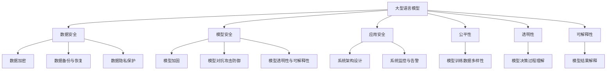

                 

### 1. 引言

## 1.1 问题背景

在人工智能（AI）飞速发展的时代，大模型（Large Language Model，简称LLM）作为AI的一个重要分支，已经在自然语言处理（NLP）等领域取得了显著成果。随着LLM在各个领域的广泛应用，如何构建安全可靠的LLM应用架构，已成为行业内的一个重要议题。

首先，让我们来了解一下什么是LLM。LLM是一种基于神经网络的语言模型，能够对自然语言进行建模，从而实现对文本的理解和生成。这些模型通常具有庞大的参数量和训练数据规模，能够捕捉到语言中的复杂结构和规律。

随着LLM的应用越来越广泛，人们对其安全性和可靠性提出了更高的要求。安全性方面，需要确保模型不受到恶意攻击，例如模型篡改、数据泄露等。可靠性方面，则需要保证模型在运行过程中能够稳定地输出正确的结果。

因此，构建安全可靠的LLM应用架构，不仅需要解决技术问题，还需要考虑数据安全、模型安全、应用安全等多方面的问题。此外，如何确保LLM在应用过程中的公平性、透明性和可解释性，也是不可忽视的问题。

## 1.2 问题描述

构建安全可靠的LLM应用架构需要解决以下几个核心问题：

1. 数据安全：如何确保训练数据和用户数据的隐私性和完整性，防止数据泄露和滥用？
2. 模型安全：如何防止模型受到恶意攻击，保证模型输出结果的准确性和可靠性？
3. 应用安全：如何确保应用系统在面临攻击和错误时能够保持稳定运行，提供高质量的服务？
4. 公平性、透明性和可解释性：如何确保LLM在应用过程中的公平性，使其不会歧视或偏见某些用户群体？如何提高模型的透明性，使得用户能够理解模型的决策过程？如何提升模型的可解释性，使得开发者能够定位和修复潜在的问题？

## 1.3 问题解决

本书将从多个角度对构建安全可靠的LLM应用架构进行探讨，包括以下内容：

1. 核心概念解析：介绍大型语言模型的基本概念，包括定义、特点、数学基础等。
2. 安全措施实施：讨论如何确保数据安全、模型安全和应用安全，包括具体的措施和技术。
3. 应用场景分析：分析LLM在不同领域的应用场景，探讨其在这些场景中的挑战和解决方案。
4. 架构设计与实施：介绍如何设计并实施安全可靠的LLM应用架构，包括系统架构设计、接口设计和系统交互等。

通过上述内容的探讨，本书旨在为读者提供一个全面、系统的构建安全可靠LLM应用架构的参考。

## 1.4 边界与外延

本书主要关注大型语言模型的构建与应用，涉及领域包括但不限于自然语言处理、知识图谱、对话系统等。同时，本书还将讨论一些相关的技术，如深度学习、神经网络等。

本书的边界与外延主要包括以下几个方面：

1. **研究范围**：本书主要研究大型语言模型的构建与应用，重点关注其在自然语言处理、知识图谱和对话系统等领域的应用。同时，本书还将介绍相关的深度学习和神经网络技术。

2. **技术范畴**：本书涵盖的技术范畴包括数据安全、模型安全、应用安全等方面。在数据安全方面，本书将讨论数据加密、数据备份与恢复、数据隐私保护等技术。在模型安全方面，本书将探讨模型加固、模型对抗攻击防御、模型透明性与可解释性等技术。在应用安全方面，本书将介绍系统架构设计、系统监控与告警等技术。

3. **应用领域**：本书的应用领域主要涉及自然语言处理、知识图谱、对话系统等。此外，本书还将探讨大型语言模型在其他领域的潜在应用，如智能客服、智能助手、智能推荐等。

4. **理论与实践**：本书既注重理论阐述，也注重实践应用。通过结合具体案例和实践经验，本书旨在为读者提供一个全面、系统的构建安全可靠LLM应用架构的参考。

## 1.5 概念结构与核心要素组成

为了构建安全可靠的LLM应用架构，我们需要理解一系列核心概念，并明确这些概念之间的相互关系和组成要素。以下是本文中涉及的主要概念及其关联：

### 核心概念

1. **大型语言模型（LLM）**：一种基于神经网络的语言模型，具有庞大的参数量和训练数据规模，能够对自然语言进行建模。
2. **数据安全**：确保训练数据和用户数据的隐私性和完整性。
3. **模型安全**：防止模型受到恶意攻击，保证模型输出结果的准确性和可靠性。
4. **应用安全**：确保应用系统在面临攻击和错误时能够保持稳定运行，提供高质量的服务。
5. **公平性**：确保LLM在应用过程中不会歧视或偏见某些用户群体。
6. **透明性**：提高模型的透明性，使得用户能够理解模型的决策过程。
7. **可解释性**：提升模型的可解释性，使得开发者能够定位和修复潜在的问题。

### 概念之间的关系

- **数据安全**、**模型安全**和**应用安全**构成了构建安全可靠LLM应用架构的核心保障。这三个方面相互关联，共同确保了LLM的稳定运行和可靠输出。
- **公平性**、**透明性**和**可解释性**则从用户和开发者角度出发，关注LLM在应用过程中的伦理和实用性问题。

### 核心要素组成

- **数据安全**：包括数据加密、数据备份与恢复、数据隐私保护等技术。
- **模型安全**：包括模型加固、模型对抗攻击防御、模型透明性与可解释性等技术。
- **应用安全**：包括系统架构设计、系统监控与告警等技术。
- **公平性、透明性和可解释性**：涉及到模型训练数据的多样性、模型的决策过程和结果解释等方面。

### ER实体关系图架构

为了更好地理解上述概念之间的关系，我们可以通过ER（实体-关系）图来展示核心要素的组成结构。以下是ER图的Mermaid表示：

通过上述ER图，我们可以清晰地看到各个概念和要素之间的关联，有助于理解构建安全可靠LLM应用架构的整体框架。

## 1.6 本章小结

本章主要介绍了构建安全可靠LLM应用架构的背景、问题描述、问题解决思路以及相关概念和要素。接下来，我们将进一步探讨大型语言模型的基础理论，包括定义、发展历程、特点、核心技术、数学基础、应用场景、安全性、可靠性以及在具体应用中的挑战与解决方案。通过这些内容的深入讨论，我们将为读者提供更全面、系统的构建安全可靠LLM应用架构的参考。

---

### 2. 大型语言模型概述

大型语言模型（Large Language Model，简称LLM）是自然语言处理（NLP）领域中的一种先进技术。它通过对大量文本数据的学习，能够理解和生成自然语言，从而在多个领域展现出强大的应用潜力。本节将首先介绍大型语言模型的基本概念和定义，然后回顾其发展历程，最后探讨其特点与核心技术。

#### 2.1 大型语言模型的定义

大型语言模型是一种基于深度学习技术的语言处理模型，通常拥有数百万至数十亿个参数。这些模型通过训练从大规模的文本数据中学习语言的结构和规律，从而具备对自然语言进行建模和预测的能力。与传统的统计语言模型相比，LLM能够更好地捕捉到语言的复杂性和多样性，从而在生成文本、翻译、问答等任务上表现出色。

#### 2.1.1 大型语言模型的概念

大型语言模型通常由以下几个核心组成部分构成：

1. **参数**：模型中的权重和偏置，用于捕捉文本数据中的规律。
2. **神经网络架构**：包括输入层、隐藏层和输出层，用于处理和转换输入数据。
3. **训练数据**：大量经过预处理和标注的文本数据，用于训练模型。
4. **优化算法**：用于调整模型参数，优化模型性能。

#### 2.1.2 大型语言模型的发展历程

大型语言模型的发展可以追溯到20世纪80年代，当时研究者们开始探索基于神经网络的统计语言模型。然而，受限于计算资源和数据规模，这些模型的性能并不理想。

随着计算能力和数据规模的不断提升，深度学习技术的出现为大型语言模型的发展提供了新的机遇。2003年，研究者们提出了基于递归神经网络（RNN）的语言模型，显著提升了模型的性能。然而，RNN在处理长序列数据时存在梯度消失和梯度爆炸等问题。

为了解决这些问题，2014年，研究者们提出了基于长短时记忆网络（LSTM）的语言模型，进一步提升了模型的稳定性和性能。随后，2017年，基于Transformer架构的BERT模型问世，彻底改变了语言模型的发展方向。BERT模型通过自注意力机制，能够更好地捕捉到文本中的长距离依赖关系，从而在多项NLP任务上取得了突破性成果。

近年来，大型语言模型的研究和应用不断深入，如GPT系列、T5、CodeGen等模型相继出现，推动了NLP领域的快速发展。

#### 2.2 大型语言模型的特点

大型语言模型具有以下几个显著特点：

1. **大规模参数量**：大型语言模型通常拥有数百万至数十亿个参数，能够捕捉到文本数据中的复杂规律。
2. **强大的语言建模能力**：通过训练，模型能够生成符合语言习惯和逻辑的文本，具备较高的自然语言生成能力。
3. **适应性强**：大型语言模型能够适应不同的应用场景，如文本生成、翻译、问答等，具有广泛的适用性。
4. **自我进化能力**：通过持续学习和优化，模型能够不断提升其性能，适应新的语言环境和任务需求。

#### 2.3 大型语言模型的核心技术

大型语言模型的核心技术包括以下几个关键方面：

1. **深度学习基础**：深度学习是大型语言模型的核心技术，包括神经网络、卷积神经网络（CNN）、循环神经网络（RNN）和长短时记忆网络（LSTM）等。
2. **自注意力机制**：Transformer架构中的自注意力机制，使模型能够更好地捕捉到文本中的长距离依赖关系，提高了模型的语言建模能力。
3. **预训练与微调**：预训练和微调是大型语言模型训练的关键技术。通过在大规模语料库上进行预训练，模型能够获得通用语言知识，然后通过微调，模型能够针对特定任务进行优化。

#### 2.4 小结

大型语言模型作为一种先进的NLP技术，在文本生成、翻译、问答等任务上展现了强大的性能。其发展历程从传统的统计语言模型到深度学习模型，再到基于Transformer架构的模型，经历了重要的技术变革。通过深入理解大型语言模型的基本概念、特点和技术，我们能够更好地利用其在各个领域的应用潜力，为构建安全可靠的LLM应用架构奠定基础。

---

### 2.1 大型语言模型的定义

大型语言模型（Large Language Model，简称LLM）是一种基于深度学习的自然语言处理模型，其核心在于通过学习大量文本数据来捕捉语言的复杂结构和语义信息。LLM的定义可以从以下几个方面进行详细阐述：

#### 2.1.1 大型语言模型的概念

1. **神经网络架构**：LLM通常基于深度神经网络架构，特别是近年来兴起的Transformer架构。这种架构具有多层神经网络结构，能够通过自注意力机制有效地捕捉长距离依赖关系，从而提升语言建模的能力。
   
2. **参数规模**：LLM的一个显著特点是其庞大的参数规模。例如，GPT-3模型拥有超过1750亿个参数，这比以往的任何神经网络模型都要大得多。参数规模的大小直接决定了模型捕捉语言结构的能力和复杂度。

3. **训练数据**：LLM的训练数据通常来自大规模的文本语料库，包括书籍、文章、社交媒体等多种类型的文本。通过这些数据，模型可以学习到丰富的语言知识，从而能够生成更加自然、连贯的文本。

4. **学习过程**：LLM的学习过程通常包括预训练和微调两个阶段。在预训练阶段，模型在大规模语料库上学习语言的基本结构和语义信息。在微调阶段，模型根据特定任务的需求进行进一步优化，以达到更好的性能。

#### 2.1.2 大型语言模型的发展历程

LLM的发展历程可以从以下几个方面进行回顾：

1. **早期研究**：早在20世纪80年代，研究人员就开始探索神经网络在自然语言处理中的应用。然而，由于计算资源和数据规模的限制，早期的神经网络模型性能有限。

2. **统计语言模型**：随着计算能力的提升，研究人员开始开发基于统计的NLP模型。这些模型通过统计方法对文本进行建模，例如n元语法模型。虽然这些模型在某些任务上取得了一定的成功，但它们在处理复杂语言结构和长距离依赖关系时存在明显不足。

3. **深度学习技术**：2000年代中期，深度学习技术的兴起为NLP领域带来了革命性的变化。递归神经网络（RNN）和长短时记忆网络（LSTM）等模型通过引入循环结构，能够更好地处理序列数据，显著提升了NLP任务的性能。

4. **Transformer架构**：2017年，谷歌提出了一种全新的神经网络架构——Transformer。该架构通过自注意力机制，能够捕捉到文本中的长距离依赖关系，从而在语言建模任务上取得了显著突破。随着BERT、GPT等模型的相继推出，Transformer架构成为NLP领域的主流技术。

#### 2.1.3 大型语言模型的核心特征

大型语言模型具有以下几个核心特征：

1. **数据规模大**：LLM通常需要训练在数十亿规模的参数上，这需要大量的计算资源和数据支持。

2. **参数规模大**：数百万至数十亿个参数使得LLM能够捕捉到文本中的复杂结构和语义信息。

3. **适应性强**：通过预训练和微调，LLM能够适应多种不同的自然语言处理任务，如文本分类、情感分析、机器翻译等。

4. **生成能力强**：LLM在生成文本时能够产生符合语法和语义逻辑的连贯文本。

5. **可解释性差**：由于模型复杂度较高，LLM在决策过程中往往难以解释其内部机制，这在一定程度上影响了其可解释性。

#### 2.1.4 大型语言模型的应用场景

LLM在多个应用场景中展现出强大的能力，以下是一些典型的应用场景：

1. **文本生成**：包括自动写作、摘要生成、故事创作等。

2. **机器翻译**：例如谷歌翻译、百度翻译等，通过LLM实现高质量的自然语言翻译。

3. **问答系统**：如ChatGPT，能够对用户的问题进行理解和回答。

4. **对话系统**：例如智能客服、虚拟助手等，通过LLM实现自然语言交互。

5. **知识图谱**：通过LLM生成和优化知识图谱中的实体和关系。

#### 2.1.5 大型语言模型的技术实现

大型语言模型的技术实现包括以下几个方面：

1. **预训练**：在大规模语料库上对模型进行预训练，使其获得丰富的语言知识。

2. **微调**：在特定任务数据集上对模型进行微调，使其适应具体的任务需求。

3. **优化算法**：常用的优化算法包括随机梯度下降（SGD）、Adam等。

4. **硬件支持**：大规模的参数规模和计算需求，需要高性能的硬件支持，如GPU、TPU等。

#### 2.1.6 大型语言模型的优势与挑战

大型语言模型的优势包括：

- 强大的语言建模能力
- 广泛的适应性
- 高质量的文本生成能力

面临的挑战包括：

- 参数规模和计算资源的巨大需求
- 模型的可解释性较差
- 数据隐私和安全性的问题

通过深入理解大型语言模型的定义和特点，我们能够更好地利用其在各个领域的应用潜力，为构建安全可靠的LLM应用架构提供坚实的理论基础。

---

### 2.2 大型语言模型的特点

大型语言模型（LLM）之所以在自然语言处理（NLP）领域取得巨大成功，主要归功于其独特的特点。以下将从数据规模、参数规模和模型架构三个方面详细讨论这些特点。

#### 2.2.1 数据规模

大型语言模型的数据规模是其在性能和表现上取得突破的关键因素之一。为了训练一个庞大的模型，如GPT-3，研究人员使用了数十亿级别的文本数据。这些数据来源多样，包括书籍、新闻文章、社交媒体帖子、维基百科等。大规模数据为模型提供了丰富的语言信息和上下文，使其能够学习到更多的语言规律和模式。

数据规模的增加有助于模型捕捉到更多语言中的细微差异和复杂结构。例如，通过分析大量的对话文本，模型能够学习到对话中的语境和语气，从而生成更加自然和连贯的对话。此外，大规模数据还有助于提高模型的泛化能力，使其能够更好地应对不同领域和应用场景中的任务。

#### 2.2.2 参数规模

大型语言模型的参数规模同样是一个显著特点。以GPT-3为例，其参数规模达到1750亿，这是一个前所未有的数字。庞大的参数规模意味着模型可以存储和更新大量的权重和偏置，从而捕捉到语言中的复杂关系和结构。

参数规模的增长对模型性能的提升起到了至关重要的作用。首先，更多的参数能够使模型更加精细地刻画语言特征，提高其建模能力。例如，通过学习大量的词向量，模型可以更好地理解词语之间的语义关系。其次，更大的参数规模有助于模型在处理长序列文本时保持稳定性，减少梯度消失和梯度爆炸等问题。此外，庞大的参数规模还使得模型在处理罕见词汇和罕见句子时具有更强的鲁棒性，不易受到影响。

#### 2.2.3 模型架构

大型语言模型的架构设计也是其成功的关键因素之一。近年来，Transformer架构的提出和广泛应用，使得大型语言模型在性能上取得了显著的提升。Transformer架构的核心特点包括：

1. **自注意力机制**：自注意力机制使得模型能够在处理文本序列时，自动关注到序列中的重要部分，从而捕捉到长距离依赖关系。这对于理解复杂句子的结构和语义信息至关重要。

2. **多头注意力**：多头注意力机制允许模型同时关注多个不同的子序列，从而提高模型的泛化能力和表达能力。每个头都能学习到不同的特征，使得模型能够更好地捕捉到文本中的多样性和复杂性。

3. **序列掩码**：在Transformer模型训练过程中，通过随机掩码部分输入序列，使模型无法直接访问这些信息，从而提高模型的健壮性和泛化能力。

4. **并行计算**：由于Transformer模型中的注意力机制是独立的，这使得其计算过程可以并行化，从而显著提高训练和推理的效率。

总之，大型语言模型的特点包括数据规模大、参数规模大和先进的模型架构。这些特点共同作用，使得LLM在自然语言处理任务中取得了突破性的成果。然而，这些特点也带来了挑战，例如计算资源的需求和模型的解释性问题。在接下来的章节中，我们将进一步探讨这些挑战以及解决方法。

---

### 2.3 大型语言模型的核心技术

大型语言模型（LLM）之所以能够在自然语言处理（NLP）领域取得巨大成功，离不开其背后的核心技术。本节将详细介绍几项关键技术，包括自适应学习技术、上下文理解技术和多模态处理技术。

#### 2.3.1 自适应学习技术

自适应学习技术是大型语言模型的核心能力之一。这种技术使得模型能够根据输入数据的特性动态调整自身的参数和策略，从而实现更高效、更准确的语言理解与生成。自适应学习技术主要包括以下几个方面：

1. **在线学习**：在线学习技术允许模型在处理新数据时实时更新其参数，从而不断优化其性能。这种方法特别适用于对话系统等实时交互场景，模型能够快速适应用户的反馈和需求。

2. **迁移学习**：迁移学习技术利用预先训练的模型在新任务上快速获得良好的性能。通过迁移学习，模型可以在较少的数据集上实现较高的性能，减少对大规模训练数据的依赖。

3. **动态调整学习率**：自适应学习技术还包括动态调整学习率。学习率是深度学习模型训练过程中的一个重要参数，适当的调整可以加快收敛速度，提高模型性能。常用的方法包括自适应学习率算法，如Adam和Adadelta等。

4. **多任务学习**：多任务学习技术使模型能够同时处理多个任务，从而提高其泛化能力和资源利用效率。通过共享参数和知识，模型可以在不同的任务之间实现知识的迁移和共享。

#### 2.3.2 上下文理解技术

上下文理解技术是大型语言模型的关键能力之一，它使得模型能够准确捕捉和理解文本中的上下文信息。上下文理解技术主要包括以下几个方面：

1. **上下文窗口**：通过定义一个上下文窗口，模型可以关注到特定文本片段的前后文，从而更好地理解其语义。上下文窗口的大小直接影响模型对上下文信息的捕捉能力。

2. **自注意力机制**：Transformer架构中的自注意力机制使得模型能够自动关注到文本中的关键信息，从而实现更精细的上下文理解。自注意力机制通过计算输入序列中每个词与其他词之间的关联强度，动态地调整每个词的权重。

3. **多跳推理**：多跳推理技术允许模型在处理复杂问题时，进行多层次的推理，从而更好地理解上下文。例如，在问答系统中，模型可以通过多跳推理来理解问题中的隐含关系和语义。

4. **上下文嵌入**：上下文嵌入技术通过将文本中的每个词或短语映射到一个固定大小的向量空间，从而实现文本信息的低维表示。这种表示方法使得模型能够更加高效地处理和理解上下文信息。

#### 2.3.3 多模态处理技术

多模态处理技术是大型语言模型在NLP领域中的一项重要扩展。它使得模型能够处理和整合来自不同模态的数据，如文本、图像、音频等。多模态处理技术主要包括以下几个方面：

1. **文本与图像融合**：通过联合嵌入文本和图像特征，模型可以更好地理解图文信息，从而在视觉问答、图像描述生成等任务中取得更好的性能。常用的方法包括视觉 Transformer 和图像嵌入技术。

2. **文本与音频融合**：在音频处理任务中，模型可以整合文本和音频特征，从而实现更加丰富的音频理解能力。例如，在语音识别任务中，通过融合文本和音频特征，模型可以更准确地识别和理解语音内容。

3. **跨模态信息共享**：多模态处理技术还包括跨模态信息共享，使得模型能够利用不同模态的信息进行联合学习。通过共享信息，模型可以在不同的模态之间实现知识迁移和增强，从而提升整体性能。

4. **多模态交互**：多模态交互技术允许模型在不同模态之间进行交互和协作，从而实现更高效、更准确的模态融合。例如，在视频理解任务中，模型可以通过交互式查询机制，动态调整对文本和图像的关注点，从而更好地理解视频内容。

总之，大型语言模型的核心技术包括自适应学习技术、上下文理解技术和多模态处理技术。这些技术共同作用，使得LLM在NLP领域中展现出强大的能力。通过深入理解和应用这些技术，我们可以进一步拓展LLM的应用场景，推动NLP技术的发展。

---

### 2.4 大型语言模型的数学基础

大型语言模型（LLM）作为一种深度学习模型，其核心在于通过数学模型和算法对自然语言进行建模和预测。本节将介绍LLM所依赖的几个关键数学基础，包括深度学习基础、神经网络和优化算法。

#### 2.4.1 深度学习基础

深度学习是LLM的核心技术，它依赖于多层神经网络（Multi-Layer Neural Networks）来学习和建模复杂的数据特征。以下是深度学习中的几个关键概念：

1. **神经网络（Neural Networks）**：神经网络是由大量简单单元（神经元）互联而成的复杂系统。每个神经元接收多个输入，通过加权求和处理后产生一个输出。神经网络的基本结构包括输入层、隐藏层和输出层。

2. **激活函数（Activation Function）**：激活函数用于引入非线性因素，使得神经网络能够学习和表示复杂的非线性关系。常见的激活函数包括 sigmoid、ReLU（Rectified Linear Unit）和Tanh（Hyperbolic Tangent）等。

3. **前向传播（Forward Propagation）**：在前向传播过程中，输入数据通过神经网络各层的加权求和处理，逐层传递到输出层，最终产生模型的预测结果。

4. **反向传播（Backpropagation）**：反向传播是一种用于训练神经网络的算法。通过反向传播，模型能够计算每个神经元输出对误差的梯度，并据此更新神经元的权重和偏置，以优化模型性能。

5. **损失函数（Loss Function）**：损失函数用于度量模型预测结果与真实标签之间的差异。常见的损失函数包括均方误差（MSE）、交叉熵（Cross Entropy）等。通过最小化损失函数，模型能够不断提高其预测准确性。

#### 2.4.2 神经网络

神经网络是深度学习的基础，以下是神经网络的关键组成部分：

1. **输入层（Input Layer）**：输入层接收外部输入数据，并将其传递到下一层。

2. **隐藏层（Hidden Layers）**：隐藏层是神经网络的核心部分，通过多层隐藏层，模型能够学习到更复杂的特征表示。隐藏层的数量和每个层的神经元数量是设计神经网络时的关键参数。

3. **输出层（Output Layer）**：输出层产生最终的模型预测结果，其结构和激活函数取决于具体的任务类型。

4. **权重（Weights）和偏置（Biases）**：权重和偏置是神经网络中的关键参数，用于调整神经元之间的连接强度。通过优化这些参数，模型能够学习到数据中的特征和规律。

5. **连接（Connections）**：连接是神经网络中神经元之间的交互通道，通过这些通道，模型能够实现信息的传递和处理。

#### 2.4.3 优化算法

优化算法是训练神经网络的关键，以下是几种常用的优化算法：

1. **随机梯度下降（Stochastic Gradient Descent，SGD）**：SGD是一种最简单的优化算法，通过随机选择一部分训练样本来计算梯度，并更新模型参数。SGD具有实现简单、易于并行化的优点。

2. **Adam（Adaptive Moment Estimation）**：Adam是一种自适应学习率优化算法，通过维护一阶和二阶矩估计来动态调整学习率。Adam在许多深度学习任务中表现出色，具有收敛速度快、稳定性好的特点。

3. **Adadelta（Adaptive Learning Rate with Decaying Learning Rate）**：Adadelta是一种改进的SGD算法，通过自适应调整每个参数的学习率，避免了学习率过早饱和的问题。

4. **RMSprop（Root Mean Square Propagation）**：RMSprop是另一种自适应学习率优化算法，通过计算梯度的指数移动平均来动态调整学习率，从而提高模型的收敛性能。

#### 2.4.4 自然语言处理基础

在自然语言处理（NLP）中，深度学习的数学基础还包括以下几个方面：

1. **词向量（Word Vectors）**：词向量是将文本中的词语映射到固定维度的向量空间，以实现文本信息的低维表示。常见的词向量模型包括 Word2Vec、GloVe（Global Vectors for Word Representation）等。

2. **语言模型（Language Model）**：语言模型是一种用于预测下一个词语概率的模型，通过学习大量文本数据，模型能够预测文本的序列概率。在NLP任务中，语言模型广泛应用于机器翻译、语音识别、文本分类等。

3. **序列模型（Sequence Models）**：序列模型是一种用于处理序列数据的神经网络模型，如循环神经网络（RNN）和长短时记忆网络（LSTM）。序列模型能够捕捉到文本中的时间依赖关系，从而在文本生成、问答等任务中表现出色。

4. **注意力机制（Attention Mechanism）**：注意力机制是一种用于提高神经网络模型在处理序列数据时对重要信息关注度的技术。通过注意力机制，模型能够动态调整对输入序列中不同部分的重要性分配，从而提高模型的性能。

总之，大型语言模型的数学基础涵盖了深度学习、神经网络和优化算法等多个方面。通过深入理解和应用这些数学基础，我们能够更好地设计、训练和优化大型语言模型，从而实现高质量的NLP任务。

---

### 2.5 大型语言模型的应用场景

大型语言模型（LLM）因其强大的语言理解与生成能力，在众多领域展现出广泛的应用潜力。以下将详细介绍LLM在对话系统、知识图谱和机器翻译等应用场景中的具体应用，并分析其面临的挑战。

#### 2.5.1 对话系统

对话系统是LLM最典型的应用之一，它涵盖了聊天机器人、虚拟助手和客户服务等。以下是LLM在对话系统中的具体应用：

1. **聊天机器人**：聊天机器人通过自然语言交互，为用户提供信息查询、娱乐互动等服务。LLM在聊天机器人中的应用主要体现在两个方面：
   - **意图识别**：LLM通过理解用户的输入文本，识别用户的意图，如询问天气、查询商品信息等。
   - **响应生成**：LLM根据用户的意图，生成合适的响应文本，使对话更加自然和流畅。

2. **虚拟助手**：虚拟助手（如智能助理）能够帮助用户处理日常事务，如日程安排、任务提醒等。LLM在虚拟助手中的应用主要包括：
   - **任务理解**：虚拟助手通过LLM理解用户的任务指令，如设置提醒、发送邮件等。
   - **交互优化**：LLM能够生成更加人性化的交互文本，提升虚拟助手的用户体验。

3. **客户服务**：客户服务系统利用LLM为用户提供24/7的在线客服服务，常见应用包括：
   - **常见问题回答**：LLM通过学习大量常见问题的答案，为用户提供即时的答案和建议。
   - **情感分析**：LLM能够识别用户情绪，提供相应的情感回应，增强用户满意度。

#### 挑战

尽管LLM在对话系统中有广泛应用，但仍面临一些挑战：

1. **上下文理解**：对话系统的核心在于理解用户输入的上下文，而LLM在处理长文本上下文时存在一定局限性，容易产生理解偏差。

2. **个性化交互**：用户需求多样，如何使LLM生成符合用户个性化和偏好化的交互文本，是当前研究的一个重要方向。

3. **对话连贯性**：生成文本的连贯性对用户体验至关重要，如何提高LLM生成文本的连贯性，是对话系统应用中的一大挑战。

#### 2.5.2 知识图谱

知识图谱是一种结构化知识表示方法，通过实体和关系来描述现实世界中的知识。LLM在知识图谱中的应用主要包括以下方面：

1. **知识抽取**：知识抽取是从非结构化文本中提取出结构化知识的过程。LLM在知识抽取中的应用主要包括：
   - **命名实体识别**：LLM能够识别文本中的命名实体，如人名、地点、组织等。
   - **关系抽取**：LLM能够识别文本中实体之间的关系，如“张三工作于阿里巴巴”。

2. **知识推理**：知识推理是通过已有知识生成新知识的过程。LLM在知识推理中的应用主要包括：
   - **推理规则**：LLM可以通过学习推理规则，自动生成新的知识。
   - **推理引擎**：LLM可以嵌入到推理引擎中，实现知识推理和推理过程自动化。

3. **知识融合**：知识融合是将多个来源的知识进行整合，以形成更全面、一致的知识体系。LLM在知识融合中的应用主要包括：
   - **多源知识融合**：LLM能够整合来自不同来源的知识，如网络爬取、数据库等。
   - **知识图谱优化**：LLM可以通过学习已有知识图谱，优化实体和关系的表示。

#### 挑战

LLM在知识图谱应用中面临的主要挑战包括：

1. **知识表示**：如何有效地将知识表示为实体和关系，是知识图谱构建的关键问题。

2. **知识一致性**：多源知识融合可能导致知识不一致，如何保证知识图谱的一致性，是当前研究的一个重要方向。

3. **知识推理能力**：如何提高LLM在知识推理方面的能力，使其能够生成更具逻辑性和一致性的推理结果。

#### 2.5.3 机器翻译

机器翻译是将一种语言的文本翻译成另一种语言的过程。LLM在机器翻译中的应用主要包括：

1. **统计机器翻译**：通过训练大规模的双语语料库，LLM可以学习到源语言和目标语言之间的映射关系，生成高质量的翻译结果。

2. **神经机器翻译**：基于神经网络架构的LLM，如Transformer，通过学习源语言和目标语言的特征，实现端到端的翻译。这种翻译方式具有较高的准确性和自然性。

3. **机器翻译后处理**：LLM还可以用于机器翻译后处理，如翻译修正、一致性检查等，以进一步提高翻译质量。

#### 挑战

LLM在机器翻译应用中面临的主要挑战包括：

1. **语言差异性**：不同语言之间存在巨大的差异性，如何使LLM能够适应不同语言的特点，生成高质量的翻译结果，是一个重要问题。

2. **语言资源**：高质量的双语语料库是训练LLM的基础，但在某些语言对中，高质量语料库可能较为稀缺。

3. **多语言翻译**：如何实现多语言翻译，使得LLM能够在多个语言之间进行灵活转换，是一个具有挑战性的问题。

综上所述，大型语言模型在对话系统、知识图谱和机器翻译等应用场景中具有广泛的应用前景。然而，这些应用也面临着一些挑战，如上下文理解、知识表示、语言差异性等。通过不断研究和优化，我们可以更好地利用LLM的强大能力，推动这些领域的发展。

---

### 2.6 大型语言模型的安全性

在人工智能（AI）迅速发展的背景下，大型语言模型（LLM）因其强大的语言处理能力而受到广泛关注。然而，随着LLM在各个领域的应用逐渐深入，其安全性问题也日益凸显。本节将讨论LLM面临的主要安全性问题，包括数据安全、模型安全和应用安全，并探讨相应的应对措施。

#### 2.6.1 安全性问题概述

1. **数据安全**：在LLM的训练和应用过程中，数据的安全性至关重要。数据泄露或被恶意利用可能导致隐私侵犯、知识产权盗窃等问题。此外，训练数据中的偏见和错误也可能影响模型的公平性和准确性。

2. **模型安全**：模型安全主要关注防止模型受到恶意攻击，如模型篡改、对抗攻击等。这些攻击可能导致模型输出结果失真，从而对实际应用造成严重负面影响。

3. **应用安全**：应用安全涉及确保LLM在实际应用过程中不会受到网络攻击、系统漏洞等因素的干扰，从而保证服务的连续性和可靠性。

#### 2.6.2 数据安全

1. **数据加密**：为了确保数据在传输和存储过程中的安全性，可以使用数据加密技术。例如，使用高级加密标准（AES）对数据进行加密，防止数据在传输过程中被窃取或篡改。

2. **数据备份与恢复**：定期备份数据，并确保备份数据的安全存储，以便在数据丢失或损坏时能够迅速恢复。此外，可以使用分布式存储技术，提高数据备份的可靠性和效率。

3. **数据隐私保护**：在处理用户数据时，应确保用户隐私得到保护。例如，可以使用差分隐私技术，对用户数据进行扰动处理，从而隐藏用户隐私信息。

#### 2.6.3 模型安全

1. **模型加固**：通过引入防御机制，如混淆、对抗训练等，增强模型的鲁棒性，使其不易受到对抗攻击。例如，可以使用对抗训练方法，在训练过程中引入少量对抗样本，从而提高模型对对抗攻击的抵抗力。

2. **模型对抗攻击防御**：开发有效的对抗攻击防御技术，如对抗样本检测、对抗攻击防御模型等，以应对可能出现的模型攻击。例如，可以使用生成对抗网络（GAN）技术，生成对抗样本用于模型训练，提高模型对对抗攻击的识别和防御能力。

3. **模型透明性与可解释性**：提高模型的透明性和可解释性，使得开发者能够理解模型的工作机制和潜在风险，从而及时采取措施进行防御。例如，可以使用模型解释技术，如LIME（Local Interpretable Model-agnostic Explanations）和SHAP（SHapley Additive exPlanations），对模型输出结果进行解释，帮助开发者识别潜在的安全问题。

#### 2.6.4 应用安全

1. **系统架构设计**：设计安全可靠的系统架构，包括数据安全、模型安全和应用安全等方面的综合考虑。例如，可以使用微服务架构，实现模块化、分布式和容错的设计，提高系统的整体安全性。

2. **系统监控与告警**：建立完善的系统监控和告警机制，及时发现和处理潜在的安全威胁。例如，可以使用入侵检测系统（IDS）和网络安全监控工具，实时监控系统运行状态，并自动触发告警，以便快速响应和处理安全事件。

3. **安全审计与合规性**：定期进行安全审计，确保系统的设计和实现符合相关安全标准和法规要求。例如，可以遵循ISO 27001信息安全管理体系，建立和完善信息安全管理制度，确保系统的安全合规性。

综上所述，大型语言模型在数据安全、模型安全和应用安全方面面临一系列挑战。通过采取有效的安全措施，如数据加密、模型加固、透明性提高和系统监控等，我们可以构建一个安全可靠的LLM应用架构，从而保障其在各个领域的广泛应用。

---

### 2.7 大型语言模型的可靠性

大型语言模型（LLM）的可靠性是其在实际应用中至关重要的一环。可靠性主要涉及模型在面临各种错误和攻击时的稳定性和准确性。本节将探讨LLM在可靠性方面的问题，包括常见故障类型、稳定性指标以及提高可靠性的技术手段。

#### 2.7.1 可靠性问题概述

1. **常见故障类型**：LLM在实际应用中可能面临多种故障，包括以下几种类型：
   - **输入错误**：用户输入的数据可能包含错误或异常，如拼写错误、语法错误或噪声数据。
   - **过拟合**：模型在训练过程中可能对训练数据过于敏感，导致对新数据产生错误的预测。
   - **梯度消失/爆炸**：在训练过程中，由于神经网络结构或参数初始化不当，可能导致梯度消失或爆炸，影响模型训练效果。
   - **数据泄露**：模型在训练或推理过程中可能暴露敏感数据，导致隐私泄露。

2. **稳定性指标**：评估LLM可靠性的关键指标包括以下几种：
   - **准确率（Accuracy）**：模型在预测中的正确率，反映了模型的整体性能。
   - **召回率（Recall）**：模型正确识别出正样本的比例，反映了模型对负样本的识别能力。
   - **精确率（Precision）**：模型识别出正样本中的正确比例，反映了模型对正样本的识别能力。
   - **F1分数（F1 Score）**：综合考虑准确率和召回率，是评估模型性能的常用指标。
   - **鲁棒性（Robustness）**：模型在面对异常输入或攻击时的稳定性，反映了模型的抗干扰能力。

3. **可靠性挑战**：LLM在实际应用中面临的主要可靠性挑战包括：
   - **数据质量**：高质量的数据是训练可靠模型的基础，但数据质量和多样性可能受到限制，影响模型性能。
   - **模型泛化能力**：模型在训练数据上表现良好，但可能在新数据上表现不佳，导致泛化能力不足。
   - **系统复杂性**：LLM通常涉及复杂的计算和分布式架构，系统复杂性增加，导致故障诊断和恢复困难。

#### 2.7.2 系统架构设计

为了提高LLM的可靠性，可以从以下几个方面进行系统架构设计：

1. **容错机制**：设计容错机制，确保在系统出现故障时能够快速恢复，保证服务的连续性。例如，可以使用副本机制，确保关键组件的冗余，在部分组件故障时仍能保持系统正常运行。

2. **负载均衡**：通过负载均衡技术，合理分配计算资源，避免系统过载，从而提高系统的稳定性和响应速度。例如，可以使用集群部署和负载均衡器，实现请求的均衡分配。

3. **系统监控与告警**：建立完善的监控和告警系统，实时监控系统运行状态，及时发现和处理潜在问题。例如，可以使用日志分析工具和监控系统，监控系统的性能指标和异常行为。

4. **故障恢复策略**：制定故障恢复策略，确保在系统出现故障时能够快速恢复。例如，可以使用备份和恢复机制，在系统故障时迅速恢复到正常状态。

#### 2.7.3 技术手段

1. **错误检测与纠正**：通过引入错误检测与纠正机制，识别和纠正输入数据中的错误。例如，可以使用纠错码和校验和，检测和纠正数据传输过程中的错误。

2. **模型鲁棒性增强**：通过引入鲁棒性增强技术，提高模型对异常数据和对抗攻击的抵抗力。例如，可以使用对抗训练，在训练过程中引入对抗样本，增强模型的鲁棒性。

3. **动态调整策略**：通过动态调整训练参数和策略，优化模型性能，提高模型的可靠性。例如，可以使用自适应学习率算法，动态调整学习率，提高训练效果。

4. **多模型集成**：通过集成多个模型，利用不同模型的优点，提高模型的稳定性和准确性。例如，可以使用集成学习技术，将多个模型的结果进行加权平均，提高预测的可靠性。

总之，提高大型语言模型的可靠性需要从多个方面进行系统架构设计和技术手段的引入。通过合理的系统架构设计和有效的技术手段，可以显著提高LLM的稳定性、准确性和鲁棒性，从而保障其在实际应用中的可靠性。

---

### 2.8 大型语言模型在具体应用中的挑战与解决方案

在大型语言模型（LLM）的具体应用过程中，面临着一系列独特的挑战。这些挑战不仅涉及技术层面的难题，还包括跨领域应用中的复杂性。以下将详细讨论这些挑战，并探讨相应的解决方案。

#### 2.8.1 面向不同行业的应用

1. **医疗行业**：在医疗领域，LLM可以用于病历分析、诊断建议和患者管理等方面。然而，挑战在于医疗数据的高复杂性和隐私保护要求。解决方案包括：
   - **数据加密与隐私保护**：采用加密算法对敏感数据进行处理，确保数据在传输和存储过程中的安全性。
   - **数据脱敏**：对医疗数据进行脱敏处理，隐藏敏感信息，同时保留数据的可用性。

2. **金融行业**：在金融领域，LLM可以用于风险控制、信用评估和投资建议等方面。然而，金融数据的高度动态性和复杂性带来挑战。解决方案包括：
   - **实时数据处理**：利用LLM的实时学习能力，对金融市场数据进行快速分析和预测。
   - **多模型集成**：通过集成多个模型，提高预测的准确性和鲁棒性。

3. **教育行业**：在教育领域，LLM可以用于个性化学习、在线辅导和智能题库生成等方面。挑战在于个性化需求的多样性和教育数据的隐私保护。解决方案包括：
   - **个性化推荐系统**：基于用户的兴趣和学习历史，为用户提供个性化的学习资源和辅导建议。
   - **数据匿名化**：对用户数据进行匿名化处理，确保用户隐私不被泄露。

#### 2.8.2 跨领域应用挑战

1. **语言差异性**：不同领域和语言之间存在显著的差异，这对LLM的跨领域应用提出了挑战。解决方案包括：
   - **多语言模型**：开发支持多种语言的大型语言模型，提高跨语言的适应性。
   - **领域适应性训练**：对LLM进行特定领域的训练，提高模型在特定领域的表现。

2. **数据兼容性**：跨领域应用中的数据格式和结构可能不同，这需要模型具备较强的数据兼容性。解决方案包括：
   - **数据预处理**：在模型训练前对数据进行统一的预处理，使其符合模型的输入要求。
   - **数据融合**：将来自不同领域的数据进行融合，构建统一的数据表示。

3. **技术融合**：跨领域应用需要多种技术的融合，包括自然语言处理、知识图谱、机器学习等。解决方案包括：
   - **多模态数据处理**：结合文本、图像、音频等多种数据类型，提高模型的泛化能力。
   - **领域特定算法**：结合特定领域的算法和技术，优化模型在特定领域的性能。

#### 2.8.3 解决方案探讨

1. **技术优化**：针对不同领域的应用需求，对LLM进行技术优化，提高其性能和适应性。具体措施包括：
   - **模型压缩**：通过模型剪枝、量化等技术，减小模型的参数规模，提高模型在资源受限环境中的运行效率。
   - **模型蒸馏**：通过将大型模型的知识传递给小型模型，实现高效的知识迁移和模型压缩。

2. **管理优化**：优化模型的管理和运维流程，提高模型的可靠性和可维护性。具体措施包括：
   - **自动化运维**：采用自动化工具和平台，实现模型的自动化部署、监控和更新。
   - **安全审计**：定期进行安全审计，确保模型在应用过程中的合规性和安全性。

3. **法律法规**：在跨领域应用中，需要遵守相关法律法规，确保模型的合法合规性。具体措施包括：
   - **隐私保护**：遵循数据保护法规，确保用户隐私得到有效保护。
   - **伦理审查**：对模型应用进行伦理审查，确保其应用符合社会道德和伦理标准。

总之，大型语言模型在具体应用中面临一系列挑战，包括面向不同行业的应用和跨领域应用的复杂性。通过技术优化、管理优化和法律法规遵守等手段，我们可以有效应对这些挑战，推动LLM在各领域的广泛应用和发展。

---

### 3.1 安全设计与原则

构建安全可靠的LLM应用架构是一项复杂的任务，涉及多个方面的安全措施和设计原则。以下将从核心原则和关键步骤两个方面进行探讨，帮助读者理解和实施这些设计原则。

#### 3.1.1 安全设计与原则

1. **最小权限原则**：最小权限原则是安全设计的基本原则之一，即系统中的每个组件和用户都应只拥有执行其任务所需的最小权限。通过限制权限，可以降低恶意行为或错误操作对系统的潜在风险。

2. **防御深度原则**：防御深度原则强调在系统中设置多层防御机制，以防止攻击者通过单一漏洞入侵系统。多层防御包括网络安全、应用安全、数据安全等多个层面，通过多层次的安全措施，可以大大降低系统被攻破的风险。

3. **安全隔离原则**：安全隔离原则要求在不同系统组件和用户之间建立隔离机制，以防止潜在的攻击或错误传播。例如，通过虚拟化技术、容器技术等实现不同组件之间的隔离，确保系统各个部分的安全性和独立性。

4. **安全审计原则**：安全审计原则强调定期对系统进行安全审计，识别潜在的安全漏洞和风险，及时进行修复和优化。通过持续的安全审计，可以确保系统在运行过程中的安全性。

#### 3.1.2 安全设计与关键步骤

1. **需求分析**：在进行安全设计之前，首先要进行需求分析，明确系统的安全需求和用户的安全期望。需求分析的结果将指导后续的安全设计工作，确保设计的安全措施能够满足实际需求。

2. **威胁建模**：威胁建模是安全设计的重要步骤，通过识别和分析潜在的安全威胁，明确系统可能面临的风险和攻击途径。威胁建模的结果将帮助设计者制定针对性的安全措施。

3. **架构设计**：在架构设计阶段，根据需求分析和威胁建模的结果，设计系统的安全架构。安全架构应包括网络安全、应用安全、数据安全等多个方面，确保系统的各个部分都能得到有效保护。

4. **安全实现**：在安全实现阶段，将设计的安全措施转化为具体的实现方案，包括系统配置、安全协议、安全算法等。安全实现应遵循最佳实践，确保方案的有效性和可靠性。

5. **测试与验证**：在安全措施实现后，应进行严格的测试与验证，确保安全措施能够有效抵御潜在的安全威胁。测试应包括安全漏洞扫描、渗透测试等，以验证系统的安全性能。

6. **持续优化**：安全是一个持续的过程，随着系统环境的变化和新的安全威胁的出现，安全设计需要不断优化和更新。通过定期审计、安全培训等手段，确保系统的安全性始终保持在高水平。

通过遵循上述安全设计与原则，我们可以在构建安全可靠的LLM应用架构时，最大限度地降低安全风险，保障系统的稳定运行和用户数据的安全。

---

### 3.2 安全措施的实施

在构建安全可靠的LLM应用架构过程中，实施有效的安全措施至关重要。以下将详细讨论数据安全、模型安全和应用安全的具体实施方法，并探讨如何确保这些措施在实际应用中的有效性。

#### 3.2.1 数据安全

1. **数据加密**：数据加密是保障数据安全的基础措施。在数据传输和存储过程中，应采用强加密算法（如AES）对数据进行加密，防止数据被窃取或篡改。此外，应使用安全协议（如TLS）确保数据在传输过程中的完整性。

2. **数据备份与恢复**：定期备份数据，并确保备份数据的安全存储，以便在数据丢失或损坏时能够迅速恢复。备份数据应存储在多个安全地点，以提高数据的可靠性。此外，应定期测试数据恢复流程，确保在发生数据丢失时能够快速恢复。

3. **数据隐私保护**：在处理用户数据时，应确保用户隐私得到保护。可以采用差分隐私、数据匿名化等技术，对用户数据进行隐私保护。此外，应制定严格的数据隐私政策，明确用户数据的收集、使用和共享规则。

#### 3.2.2 模型安全

1. **模型加固**：模型加固是防止模型受到恶意攻击的重要措施。可以通过引入防御机制（如混淆、对抗训练）增强模型的鲁棒性，使其能够抵御对抗攻击。此外，可以使用对抗样本检测技术，识别和过滤潜在的恶意输入。

2. **模型对抗攻击防御**：在模型训练和部署过程中，应采用对抗攻击防御技术，如 adversarial training、防御蒸馏等，提高模型对对抗攻击的抵抗力。同时，应定期更新和优化防御机制，以应对新的攻击手段。

3. **模型透明性与可解释性**：提高模型的透明性和可解释性，有助于发现和修复潜在的安全问题。可以采用模型解释技术（如 LIME、SHAP），对模型决策过程进行详细分析，帮助开发者理解模型的行为。此外，应制定透明的模型评估和审计流程，确保模型的安全性和合规性。

#### 3.2.3 应用安全

1. **系统架构设计**：在设计应用架构时，应考虑安全性，包括网络安全、应用安全、数据安全等方面。可以采用微服务架构、容器化技术等，实现系统的模块化和隔离，提高系统的安全性。

2. **安全监控与告警**：建立完善的监控和告警系统，实时监控系统的运行状态，及时发现和处理潜在的安全威胁。可以使用入侵检测系统（IDS）、安全信息和事件管理（SIEM）等工具，实现实时监控和告警。

3. **访问控制与认证**：实施严格的访问控制和认证机制，确保只有授权用户才能访问系统资源和数据。可以使用多因素认证（MFA）、角色访问控制（RBAC）等技术，加强用户身份验证和权限管理。

4. **安全测试与审计**：定期进行安全测试和审计，识别和修复潜在的安全漏洞。可以采用渗透测试、代码审计等手段，确保系统的安全性能。此外，应制定安全培训计划，提高开发者和运维人员的安全意识和技能。

#### 3.2.4 确保措施有效性

为了确保上述安全措施的有效性，可以采取以下措施：

1. **安全培训与意识提升**：定期对开发者和运维人员开展安全培训，提高他们的安全意识和技能，确保安全措施得到有效执行。

2. **安全评估与反馈**：定期进行安全评估，评估安全措施的有效性和系统的安全性。通过收集反馈和改进建议，不断优化和提升安全措施。

3. **持续监控与改进**：建立持续监控机制，实时监控系统的安全状态，及时发现和处理潜在的安全威胁。同时，应不断改进安全策略和技术手段，以应对新的安全挑战。

4. **合规性与法规遵循**：确保系统的设计和实现符合相关安全标准和法规要求，如ISO 27001、GDPR等。通过合规性审计和评估，确保系统安全措施的有效性和合规性。

通过实施上述安全措施，并确保其有效性，我们可以在构建安全可靠的LLM应用架构过程中，最大限度地降低安全风险，保障系统的稳定运行和用户数据的安全。

---

### 3.3 安全设计与实现

在构建安全可靠的LLM应用架构中，安全设计是至关重要的环节。以下将详细介绍安全设计的核心原则、关键步骤以及具体的实现方法，帮助读者全面理解和实施这些设计。

#### 3.3.1 安全设计原则

1. **最小权限原则**：确保系统中的每个组件和用户都只拥有执行其任务所需的最小权限。这有助于降低恶意行为或错误操作对系统的潜在风险。

2. **防御深度原则**：通过设置多层防御机制，防止攻击者通过单一漏洞入侵系统。例如，结合网络安全、应用安全、数据安全等多个层面的措施，提高系统的整体安全性。

3. **安全隔离原则**：在不同系统组件和用户之间建立隔离机制，以防止潜在的攻击或错误传播。例如，通过虚拟化技术、容器技术等实现不同组件之间的隔离，确保系统各个部分的安全性和独立性。

4. **安全审计原则**：定期进行安全审计，识别潜在的安全漏洞和风险，及时进行修复和优化。通过持续的安全审计，确保系统在运行过程中的安全性。

#### 3.3.2 安全设计关键步骤

1. **需求分析**：在开始安全设计之前，首先要进行需求分析，明确系统的安全需求和用户的安全期望。需求分析的结果将指导后续的安全设计工作，确保设计的安全措施能够满足实际需求。

2. **威胁建模**：通过识别和分析潜在的安全威胁，明确系统可能面临的风险和攻击途径。威胁建模的结果将帮助设计者制定针对性的安全措施。

3. **架构设计**：在架构设计阶段，根据需求分析和威胁建模的结果，设计系统的安全架构。安全架构应包括网络安全、应用安全、数据安全等多个方面，确保系统的各个部分都能得到有效保护。

4. **安全实现**：在安全实现阶段，将设计的安全措施转化为具体的实现方案，包括系统配置、安全协议、安全算法等。安全实现应遵循最佳实践，确保方案的有效性和可靠性。

5. **测试与验证**：在安全措施实现后，应进行严格的测试与验证，确保安全措施能够有效抵御潜在的安全威胁。测试应包括安全漏洞扫描、渗透测试等，以验证系统的安全性能。

6. **持续优化**：安全是一个持续的过程，随着系统环境的变化和新的安全威胁的出现，安全设计需要不断优化和更新。通过定期审计、安全培训等手段，确保系统的安全性始终保持在高水平。

#### 3.3.3 安全设计实现方法

1. **身份认证与访问控制**：实现严格的身份认证和访问控制机制，确保只有授权用户才能访问系统资源和数据。可以使用多因素认证（MFA）和基于角色的访问控制（RBAC）等技术，加强用户身份验证和权限管理。

2. **网络安全措施**：实施网络安全措施，包括防火墙、入侵检测系统（IDS）、虚拟专用网络（VPN）等，以防止外部攻击和未经授权的访问。同时，应定期更新和修补网络安全设备的固件和配置，以应对新的安全威胁。

3. **数据加密与备份**：采用强加密算法（如AES）对数据进行加密，确保数据在传输和存储过程中的安全性。定期备份数据，并确保备份数据的安全存储，以便在数据丢失或损坏时能够迅速恢复。

4. **应用安全措施**：在应用层面，应实施安全编码实践，防止常见的安全漏洞（如SQL注入、跨站脚本攻击等）。此外，可以使用Web应用防火墙（WAF）等工具，实时监控和防止恶意攻击。

5. **模型安全措施**：针对LLM模型，应实施模型加固、对抗攻击防御、模型透明性与可解释性等安全措施。例如，通过对抗训练生成对抗样本，增强模型的鲁棒性；采用模型解释技术，帮助开发者理解模型的行为，及时发现和修复潜在的安全问题。

6. **安全监控与告警**：建立完善的监控和告警系统，实时监控系统的运行状态，及时发现和处理潜在的安全威胁。可以使用安全信息和事件管理（SIEM）系统，集成不同安全工具的日志和告警，实现全方位的安全监控。

通过遵循上述安全设计原则和实现方法，我们可以在构建安全可靠的LLM应用架构时，最大限度地降低安全风险，保障系统的稳定运行和用户数据的安全。

