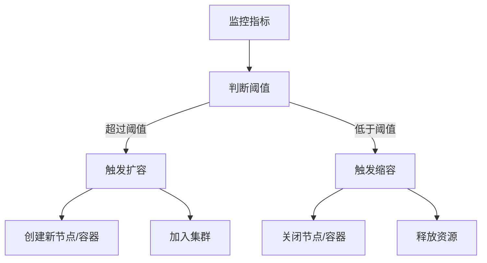

                 

### 引言

在当今数字化转型的浪潮中，人工智能（AI）技术作为驱动产业变革的核心力量，已经深刻地改变了各行各业的生产和服务模式。特别是大型语言模型（Large Language Model，简称LLM）的应用，成为近年来AI领域的热点。LLM具有处理复杂数据、生成文本、翻译语言等功能，广泛应用于自然语言处理（NLP）、智能客服、内容生成、搜索引擎优化等场景。

然而，随着LLM的应用场景逐渐扩展，其对计算资源的需求也日益增大。传统的单机部署方式已经无法满足大规模、高并发、高可用性的需求，因此，构建一个弹性伸缩（Elastic and Scalable）的LLM应用架构变得至关重要。弹性伸缩架构不仅能够应对流量波动，提升系统的稳定性，还能够根据实际需求动态调整资源，降低运营成本。

本文的目标是深入探讨构建弹性伸缩的LLM应用架构的各个方面。首先，我们将介绍LLM的基本概念、背景以及当前的发展状况。接着，文章将详细阐述弹性伸缩架构的设计原则、核心组件及其相互关系。然后，我们将讨论弹性伸缩策略与实现方法，并结合实际案例分析，展示如何在实际项目中构建并优化弹性伸缩架构。此外，文章还将探讨性能优化策略，并提供最佳实践和注意事项。最终，我们将总结全文，展望未来的发展方向和潜在挑战。

通过本文的阅读，读者将能够全面理解构建弹性伸缩LLM应用架构的原理和实践，掌握相关技术和方法，为后续的开发和应用奠定坚实基础。

### 关键词

- **人工智能（AI）**：模拟人类智能行为的计算机系统，具备学习、推理、解决问题等能力。
- **大型语言模型（LLM）**：一种可以理解和生成文本的复杂AI模型，广泛应用于自然语言处理。
- **弹性伸缩架构**：一种能够根据需求动态调整资源，应对负载波动的系统架构。
- **云计算**：通过网络提供可伸缩的计算资源，支持分布式应用部署和运营。
- **容器化**：将应用程序及其依赖环境打包到容器中，实现快速部署和资源隔离。
- **服务发现与负载均衡**：确保分布式系统中的服务能够被高效发现并合理分配流量。
- **性能优化**：通过调整系统配置和优化算法，提升系统的响应速度和吞吐量。

### 摘要

本文旨在深入探讨构建弹性伸缩的LLM应用架构的重要性与实践方法。首先，我们介绍了LLM的基本概念、背景及其在AI领域的发展现状。随后，详细阐述了弹性伸缩架构的设计原则，包括可扩展性、高可用性和性能优化等方面。接着，文章探讨了弹性伸缩策略与实现方法，包括容器化与编排、服务发现与负载均衡、自动化与监控等关键技术。通过实际案例分析，我们展示了如何将理论应用到实践中，构建并优化弹性伸缩架构。最后，文章讨论了性能优化策略，并提供了最佳实践和注意事项。全文旨在为读者提供全面、系统的构建弹性伸缩LLM应用架构的指导。

### 背景介绍

#### 核心概念术语说明

在探讨构建弹性伸缩的LLM应用架构之前，有必要首先明确几个关键术语的定义。这些术语包括：大型语言模型（LLM）、弹性伸缩架构、云计算、容器化、服务发现、负载均衡等。

- **大型语言模型（LLM）**：LLM是一种复杂的神经网络模型，通过训练海量文本数据，能够理解和生成人类语言。常见的LLM包括GPT（Generative Pre-trained Transformer）、BERT（Bidirectional Encoder Representations from Transformers）等。这些模型在大规模数据处理和自然语言生成方面具有显著优势。

- **弹性伸缩架构**：弹性伸缩架构是一种能够根据系统负载动态调整资源（如计算能力、存储能力）的架构设计。这种架构旨在应对流量波动，确保系统在高并发情况下仍能稳定运行，同时降低运营成本。

- **云计算**：云计算是一种通过互联网提供计算资源的服务模式，包括基础设施即服务（IaaS）、平台即服务（PaaS）和软件即服务（SaaS）等。云计算为分布式应用部署和运营提供了灵活、可扩展的环境。

- **容器化**：容器化是将应用程序及其依赖环境打包到容器中的技术。容器提供了一种轻量级、可移植且独立的运行环境，使应用程序在不同环境中运行时保持一致性。

- **服务发现**：服务发现是一种自动化技术，用于在分布式系统中发现和注册服务。它使分布式系统能够动态地发现新的服务实例，并确保服务之间的通信和协作。

- **负载均衡**：负载均衡是一种分配网络流量到多个服务器或节点的方法，以确保系统的稳定性和性能。负载均衡通过分散流量，防止单一服务器过载，提升系统的整体响应速度。

#### 问题背景

在当前的技术环境下，随着AI技术的不断进步和商业应用的迅速推广，LLM的应用场景日益丰富。无论是智能客服、内容生成还是智能推荐系统，LLM都发挥了至关重要的作用。然而，随着这些应用场景的扩展，LLM系统面临的挑战也逐渐显现。

首先，LLM模型的计算资源需求庞大。训练一个大规模的LLM模型通常需要大量计算资源和时间。特别是在模型推理阶段，随着请求量的增加，系统的计算资源需求也会急剧上升。如果系统不具备弹性伸缩能力，将可能导致系统在高并发情况下出现响应缓慢、甚至崩溃的问题。

其次，用户需求的波动性也是一大挑战。在一些应用场景中，用户访问量可能会在短时间内出现大幅波动。例如，在电商平台的促销活动中，用户访问量可能会在短时间内激增。如果系统无法快速调整资源以应对这种波动，将导致用户体验下降，甚至可能导致业务损失。

此外，随着LLM应用场景的多样化，系统的稳定性和高可用性也变得越来越重要。特别是在金融、医疗等关键领域，系统故障可能会导致严重的后果。因此，构建一个具有高可用性和稳定性的弹性伸缩架构，成为当前LLM应用面临的迫切问题。

#### 问题描述

构建一个弹性伸缩的LLM应用架构，主要需要解决以下几个问题：

1. **资源管理**：如何根据系统负载动态调整计算资源和存储资源，以应对流量波动？
   
2. **系统高可用性**：如何设计一个具备高可用性的系统，确保系统在故障情况下能够快速恢复？
   
3. **性能优化**：如何在保证系统稳定性的同时，提升系统的性能，包括响应速度和吞吐量？
   
4. **成本控制**：如何在确保系统性能和可用性的前提下，尽可能降低运营成本？

#### 问题解决

针对上述问题，构建弹性伸缩的LLM应用架构需要从以下几个方面着手：

1. **弹性伸缩策略**：设计合理的弹性伸缩策略，包括水平扩展（增加服务器节点）和垂直扩展（增加单个服务器的计算能力）。通过自动化工具实现资源的动态调整，以应对流量波动。

2. **高可用性设计**：通过冗余设计、故障转移和负载均衡等技术，确保系统在高并发和故障情况下仍能稳定运行。例如，使用分布式存储和数据库复制，提高数据的可靠性和访问速度。

3. **性能优化**：通过优化算法、缓存策略和系统配置，提升系统的性能。例如，使用分布式缓存系统减少数据访问延迟，优化网络拓扑结构以减少数据传输延迟。

4. **成本控制**：通过资源池化和自动化管理，降低系统运营成本。例如，使用云服务提供商提供的弹性计算资源，按需付费，避免浪费。

#### 边界与外延

在构建弹性伸缩的LLM应用架构时，还需要考虑以下几个边界条件：

1. **负载阈值**：设定合理的负载阈值，以触发弹性伸缩策略的启动和停止。过低的阈值可能导致频繁的扩展和收缩，增加系统开销；过高的阈值则可能导致系统无法及时响应流量波动。

2. **资源限制**：根据实际需求设定资源限制，包括计算资源、存储资源和网络带宽等。确保系统在资源受限的情况下仍能正常运行。

3. **容错机制**：设计容错机制，包括故障检测、恢复和隔离。在系统出现故障时，能够快速定位故障源并恢复服务。

4. **安全性**：确保系统的安全性，包括数据安全、访问控制和网络防御。在弹性伸缩过程中，要确保不泄露敏感信息，防止恶意攻击。

通过以上措施，可以构建一个具备弹性伸缩能力的LLM应用架构，以应对日益复杂的业务需求和不断变化的负载波动。

#### 概念结构与核心要素组成

在构建弹性伸缩的LLM应用架构中，涉及多个核心概念和组件，这些概念和组件相互关联，共同构成了一个完整的弹性伸缩体系。以下是这些核心概念及其关系的详细描述：

1. **分布式系统**：分布式系统是将计算任务分布在多个节点上执行的系统，以提高计算能力和容错能力。在LLM应用架构中，分布式系统是基础，通过将模型推理任务分配到多个服务器节点上，可以大幅提升系统的处理能力。

2. **容器化与编排**：容器化技术（如Docker）将应用程序及其依赖环境打包到容器中，实现环境的标准化和可移植性。编排工具（如Kubernetes）负责容器的生命周期管理，包括部署、扩展、监控和故障恢复。容器化和编排技术是实现弹性伸缩的关键。

3. **服务发现与注册中心**：服务发现技术用于在分布式系统中自动发现和注册服务。注册中心（如Consul、Eureka）记录服务实例的信息，服务发现机制通过定期查询注册中心，确保分布式系统能够动态地发现和连接到所需的服务。

4. **负载均衡**：负载均衡技术通过分配网络流量到多个服务器或节点，确保系统的稳定性和性能。常见的负载均衡算法包括轮询、最小连接数和加权轮询等。在弹性伸缩架构中，负载均衡能够分散流量，防止单一服务器过载。

5. **自动化与监控**：自动化工具（如Ansible、Terraform）用于自动化部署和管理系统资源，提高运维效率。监控工具（如Prometheus、Grafana）用于实时监控系统的性能和健康状况，及时发现和处理问题。

6. **存储和数据库**：分布式存储系统（如HDFS、Cassandra）和数据库（如MongoDB、MySQL）用于存储和管理LLM模型的数据。这些存储系统通常具备高可用性和高性能，以支持大规模数据处理和快速访问。

7. **高可用性设计**：包括故障转移、集群管理和冗余设计。故障转移是指在主节点发生故障时，快速切换到备用节点，确保系统持续运行。集群管理负责维护集群的健康状态，确保所有节点协同工作。

8. **弹性伸缩策略**：包括水平扩展（增加节点数量）和垂直扩展（增加单个节点的计算能力）。弹性伸缩策略通常基于负载监测和自动调整机制，以动态应对系统负载的变化。

9. **安全性**：包括数据加密、访问控制和网络防护。安全性设计确保系统的数据和操作不会受到恶意攻击和未经授权的访问。

通过上述核心概念和组件的有机结合，构建的弹性伸缩的LLM应用架构能够应对高并发、高可用性的需求，同时具备良好的性能和成本效益。

### 核心概念与联系

#### 核心概念原理

在构建弹性伸缩的LLM应用架构中，以下几个核心概念扮演了关键角色：

1. **弹性伸缩（Elasticity）**：弹性伸缩是指系统能够根据需求动态调整计算资源和存储资源的能力。它通过自动化工具和策略，确保系统能够在高负载和低负载之间灵活调整，以保持性能和稳定性。

2. **水平扩展（Horizontal Scaling）**：水平扩展是指通过增加服务器节点来提高系统的处理能力。这种方式可以线性地增加系统的吞吐量，且单个节点的失败不会导致整个系统瘫痪。

3. **垂直扩展（Vertical Scaling）**：垂直扩展是指通过增加单个服务器的计算能力和存储能力来提升系统性能。这种方式适用于处理特定的大规模任务，但成本较高，且扩展幅度有限。

4. **高可用性（High Availability）**：高可用性是指系统在面临硬件故障、软件故障或网络故障时，能够快速恢复并保持服务连续性的能力。实现高可用性通常需要冗余设计、故障转移和负载均衡等技术。

5. **容器化（Containerization）**：容器化是一种轻量级虚拟化技术，通过将应用程序及其依赖环境打包到容器中，实现环境的标准化和可移植性。容器化有助于简化部署流程、提高资源利用率和提升系统的弹性。

6. **服务发现与负载均衡（Service Discovery and Load Balancing）**：服务发现是自动在分布式系统中查找和注册服务实例的技术。负载均衡是将网络流量分配到多个服务实例，以防止单个实例过载，提高系统的整体性能。

7. **自动化与监控（Automation and Monitoring）**：自动化工具如Ansible和Terraform用于自动化配置和管理系统资源，提高运维效率。监控工具如Prometheus和Grafana用于实时监控系统的性能和健康状况，确保系统稳定运行。

8. **存储和数据库（Storage and Database）**：分布式存储系统和数据库提供高可用性和高性能的数据存储和访问能力，支持大规模数据处理和快速响应。

#### 概念属性特征对比表格

为了更直观地理解这些核心概念，我们列出以下表格，对比它们的属性特征：

| 概念       | 属性特征                            | 应用场景                                       |
|------------|-------------------------------------|----------------------------------------------|
| 弹性伸缩   | 动态调整资源、应对负载波动          | 大规模数据处理、高并发应用                   |
| 水平扩展   | 增加服务器节点、线性提升吞吐量      | Web服务、数据库集群                         |
| 垂直扩展   | 增强单机性能、提升特定任务处理能力  | 大型计算任务、数据仓库                       |
| 高可用性   | 快速故障恢复、确保服务连续性        | 金融交易系统、关键业务应用                   |
| 容器化     | 标准化部署、环境一致性              | 微服务架构、持续集成与持续部署（CI/CD）     |
| 服务发现   | 自动化查找和注册服务实例           | 分布式系统、服务编排                         |
| 负载均衡   | 分配网络流量、提升系统性能          | 云服务、企业应用集群                        |
| 自动化与监控 | 自动化配置和管理、实时监控系统性能  | 运维管理、系统优化                           |
| 存储和数据库 | 高可用性、高性能数据存储和访问      | 数据密集型应用、大数据处理                   |

#### 相关概念之间的关系图

为了更好地理解这些核心概念之间的相互关系，我们可以使用Mermaid绘制一个实体关系图（ER图）：

```mermaid
erDiagram
    A[弹性伸缩] ||--|{ B[水平扩展] }
    A ||--|{ C[垂直扩展] }
    A ||--|{ D[高可用性] }
    A ||--|{ E[容器化] }
    A ||--|{ F[服务发现] }
    A ||--|{ G[负载均衡] }
    A ||--|{ H[自动化与监控] }
    A ||--|{ I[存储和数据库] }
    B ||--|{ J[计算资源调整] }
    C ||--|{ K[计算能力增强] }
    D ||--|{ L[故障恢复] }
    E ||--|{ M[部署环境一致性] }
    F ||--|{ N[服务实例管理] }
    G ||--|{ O[流量分配] }
    H ||--|{ P[系统运维管理] }
    I ||--|{ Q[数据存储访问] }
```

在这个ER图中，每个概念都与其他相关概念相连，表示它们之间的关联和依赖关系。例如，弹性伸缩与水平扩展、垂直扩展、高可用性等概念紧密相关，共同构成了一个完整的弹性伸缩架构。通过这些核心概念和关系的理解，我们可以更好地设计和实现一个具备弹性伸缩能力的LLM应用架构。

### LLM架构设计原则

在构建弹性伸缩的LLM应用架构时，设计原则是确保系统成功的关键。以下是几个核心设计原则，包括可扩展性、高可用性和性能优化：

#### 可扩展性

可扩展性是弹性伸缩架构的核心原则，旨在确保系统在处理负载增加时能够灵活地扩展资源。具体来说，可扩展性包括以下几个方面：

1. **水平扩展**：通过增加服务器节点来提升系统的处理能力。水平扩展能够线性地增加系统的吞吐量，且单个节点的故障不会影响整体系统的稳定性。
2. **垂直扩展**：通过增强单个服务器的计算能力和存储能力来提升系统的性能。垂直扩展适用于处理特定的大规模任务，但扩展成本较高。
3. **动态资源管理**：利用自动化工具和策略，根据系统的实际负载动态调整资源。这种动态资源管理能够确保系统在高并发情况下依然能够保持高性能。

#### 高可用性

高可用性是确保系统在面临故障时能够快速恢复，保持服务连续性的关键。以下是实现高可用性的几个关键点：

1. **冗余设计**：通过冗余设计，包括硬件冗余、数据冗余和功能冗余，确保系统在出现故障时能够快速切换到备用系统，减少服务中断时间。
2. **故障转移**：当主节点发生故障时，能够快速切换到备用节点，确保服务的连续性。故障转移机制通常包括主从复制、双主复制等技术。
3. **负载均衡**：通过负载均衡技术，将流量分配到多个节点，避免单个节点过载，从而提高系统的整体稳定性和性能。

#### 性能优化

性能优化旨在通过优化算法、系统配置和资源调度，提升系统的响应速度和吞吐量。以下是实现性能优化的几个策略：

1. **算法优化**：优化LLM模型和相关算法，减少计算复杂度和内存消耗。例如，使用量化技术减少模型的参数数量，提高计算效率。
2. **缓存策略**：通过缓存常用数据和中间结果，减少数据访问延迟。缓存策略可以采用分布式缓存系统（如Redis）或本地缓存。
3. **系统调优**：根据系统的实际运行情况，调整系统配置参数，如网络带宽、线程数和连接数等，以提升系统性能。
4. **性能测试与监控**：定期进行性能测试，监控系统的性能指标，如响应时间、吞吐量和资源利用率，及时发现并优化性能瓶颈。

#### 设计原则的实际应用

在设计弹性伸缩的LLM应用架构时，这些设计原则必须结合实际情况进行综合应用。以下是一个实际应用案例：

假设我们要设计一个用于智能客服的LLM应用系统，该系统需要支持高并发、高可用性，并具备良好的性能。以下是设计原则在该案例中的应用：

1. **水平扩展**：系统采用容器化技术（如Docker和Kubernetes），将LLM模型和后端服务部署到多个容器中，通过增加容器实例数量来提升系统的处理能力。
2. **垂直扩展**：为了处理特定的大规模任务（如用户问答高峰期），我们可以在高负载时增加单个容器的CPU和内存资源。
3. **冗余设计**：通过主从复制技术，确保数据存储的高可用性。同时，使用负载均衡器（如Nginx）将用户请求分配到不同的服务器节点，避免单点故障。
4. **性能优化**：采用缓存策略，将常用问题和答案存储在Redis中，减少数据库访问延迟。同时，定期进行性能测试，根据测试结果优化系统配置。

通过这些设计原则的综合应用，我们可以构建一个具备弹性伸缩能力、高可用性和高性能的LLM应用系统，确保其在各种负载和场景下都能够稳定运行。

#### LLM系统结构

在构建一个具备弹性伸缩能力的LLM应用架构时，了解LLM系统的整体结构是非常关键的。LLM系统通常由计算模型、存储架构和网络架构三个主要部分组成。以下将详细介绍这些组成部分，并绘制相应的架构图，以帮助读者更好地理解整个系统的构成和运作方式。

##### 计算模型设计

计算模型是LLM系统的核心，负责处理输入的文本数据，并生成相应的输出。常见的计算模型包括Transformer、GPT、BERT等。以下是这些模型的基本组成部分：

1. **输入层**：接收文本数据，将其转换为模型可处理的格式，通常包括词嵌入（Word Embedding）和序列编码（Sequence Encoding）。
2. **中间层**：包括多层神经网络，负责文本数据的处理和信息的传递。Transformer模型的核心是自注意力机制（Self-Attention），能够对输入序列中的每个词进行权重分配，从而更好地捕捉词与词之间的关系。
3. **输出层**：生成文本输出，通常通过解码器（Decoder）实现。输出可以是文本生成、机器翻译、问答系统等。

为了确保计算模型的性能和可扩展性，我们通常采用分布式计算框架，如TensorFlow和PyTorch，将模型训练和推理任务分布在多个计算节点上。

##### 存储架构设计

存储架构是LLM系统的基础，负责存储和管理大量的训练数据和模型参数。以下是存储架构的关键组成部分：

1. **数据存储**：包括文本数据、模型参数和中间结果。文本数据通常存储在分布式文件系统（如HDFS）或对象存储（如Amazon S3）中，以确保数据的可靠性和访问速度。模型参数和中间结果则存储在关系数据库或NoSQL数据库（如MongoDB）中。
2. **数据管理**：使用数据库管理工具（如Hive和Spark）进行数据清洗、转换和存储，确保数据的一致性和完整性。
3. **数据备份与恢复**：采用数据备份策略，定期备份存储的数据，以防止数据丢失。在出现故障时，通过数据恢复机制快速恢复系统。

##### 网络架构设计

网络架构负责LLM系统内部和与外部系统的通信。以下是网络架构的关键组成部分：

1. **内部网络**：系统内部各个组件之间的通信网络，通常采用虚拟局域网（VLAN）和软件定义网络（SDN）技术，以确保数据传输的高效性和安全性。
2. **外部网络**：系统与外部客户端、数据库和其他服务之间的通信网络，通常使用负载均衡器和防火墙等设备来管理流量和安全。
3. **服务接口**：提供API接口，供外部系统调用LLM模型。接口设计需要考虑RESTful API、GraphQL等协议，以支持各种调用方式。

##### 概念关系图

为了更直观地展示LLM系统的结构，我们可以使用Mermaid绘制一个整体架构图：


在这个架构图中，计算模型、存储架构和网络架构通过相应的连接关系紧密联系在一起，共同构成了一个完整的LLM系统。通过这种结构化设计，我们可以确保系统具备良好的可扩展性、高可用性和高性能，满足各种应用场景的需求。

#### 概念关系图

为了更好地理解LLM系统的各个组件及其相互关系，我们可以通过Mermaid绘制一个实体关系图（ER图）来展示LLM系统的结构：

```mermaid
erDiagram
    User ||--|{ Request } : 发起请求
    Request ||--| LLM_Model : 处理请求
    LLM_Model ||--| Output : 输出结果
    Output ||--| Response : 返回响应
    Data_Library ||--| LLM_Model : 模型训练数据
    Storage_System ||--| Data_Library : 存储训练数据
    Compute_Node ||--| LLM_Model : 部署模型
    Network ||--| Compute_Node : 连接节点
    Monitor_System ||--| Compute_Node : 监控节点状态
    Alert_System ||--| Monitor_System : 发送警报
    Backup_System ||--| Storage_System : 备份数据
    User --> Request
    Request --> LLM_Model
    LLM_Model --> Output
    Output --> Response
    Data_Library --> LLM_Model
    Storage_System --> Data_Library
    Compute_Node --> LLM_Model
    Network --> Compute_Node
    Monitor_System --> Compute_Node
    Alert_System --> Monitor_System
    Backup_System --> Storage_System
```

在这个ER图中，我们定义了多个实体，包括用户（User）、请求（Request）、LLM模型（LLM_Model）、输出（Output）、响应（Response）、数据库（Data_Library）、存储系统（Storage_System）、计算节点（Compute_Node）、网络（Network）、监控系统（Monitor_System）、警报系统（Alert_System）和备份系统（Backup_System）。这些实体通过相应的关联关系连接在一起，展示了LLM系统的整体架构和运行流程。用户发起请求，请求经过LLM模型处理并生成输出，最终返回响应。同时，数据库存储训练数据，存储系统负责数据备份，监控系统实时监控节点状态，警报系统发送警报通知，备份系统定期备份数据，确保系统的稳定性和数据安全性。

#### 算法原理讲解

在构建弹性伸缩的LLM应用架构中，算法原理的设计和实现是确保系统高效性和可扩展性的关键。以下我们将详细讲解一个常见的弹性伸缩算法——Kubernetes中的自动扩缩容（Auto-Scaling）算法，并通过Mermaid绘制算法流程图，以及使用Python代码示例来说明算法原理。

##### 自动扩缩容算法原理

自动扩缩容算法的目标是根据系统的负载情况动态调整计算资源，确保系统在高负载时能够自动扩展，低负载时能够自动收缩，从而实现资源的最佳利用。

1. **监控指标**：自动扩缩容算法首先需要监控系统的关键指标，如CPU利用率、内存利用率、网络负载等。
2. **扩缩容策略**：根据监控到的指标，算法会判断是否需要进行扩容或缩容。常见的策略包括基于固定阈值的策略和基于历史数据的预测策略。
3. **扩容流程**：当系统负载超过设定的阈值时，算法会触发扩容流程，创建新的节点或容器，并将其加入集群。
4. **缩容流程**：当系统负载低于设定的阈值时，算法会触发缩容流程，关闭部分节点或容器，释放资源。

##### Mermaid算法流程图



在这个算法流程图中，系统首先监控指标（A），判断是否超过设定的阈值（B）。如果超过阈值，则触发扩容流程（C），包括创建新节点/容器（E）并加入集群（F）。如果低于阈值，则触发缩容流程（D），包括关闭节点/容器（G）并释放资源（H）。

##### Python代码示例

```python
import time
import random

def monitor_resources():
    # 模拟监控CPU利用率
    cpu_usage = random.uniform(0.5, 0.9)
    print(f"Current CPU usage: {cpu_usage:.2f}")
    return cpu_usage

def scale_up_if_needed(current_cpu_usage, threshold):
    if current_cpu_usage > threshold:
        print("Scaling up: Creating new node/container.")
        # 实际中这里会调用Kubernetes API创建新节点或容器
        time.sleep(random.uniform(1, 3))  # 模拟扩容延迟
        print("New node/container created.")
    else:
        print("Scaling down: Shutting down node/container.")
        # 实际中这里会调用Kubernetes API关闭节点或容器
        time.sleep(random.uniform(1, 3))  # 模拟缩容延迟
        print("Node/container shut down.")

def main():
    # 设置阈值
    threshold = 0.8
    
    while True:
        current_cpu_usage = monitor_resources()
        scale_up_if_needed(current_cpu_usage, threshold)
        time.sleep(10)  # 模拟监控间隔

if __name__ == "__main__":
    main()
```

在这个Python代码示例中，我们模拟了一个简单的自动扩缩容算法。首先，我们定义了一个`monitor_resources`函数，用于模拟监控CPU利用率。然后，我们定义了一个`scale_up_if_needed`函数，用于根据当前的CPU利用率和设定的阈值来判断是否需要进行扩容或缩容。最后，在`main`函数中，我们设置一个循环，每隔10秒监控一次CPU利用率，并根据监控结果进行相应的扩缩容操作。

通过这个算法示例，我们可以看到如何将自动扩缩容算法应用于实际场景中。在实际应用中，我们可以使用Kubernetes的API进行节点的创建和关闭操作，从而实现自动化资源管理。

##### 算法原理数学模型和公式

自动扩缩容算法的原理可以通过以下数学模型和公式进行描述：

1. **监控指标**：$CPU_{usage}$ 表示当前CPU利用率。
2. **阈值**：$Threshold$ 表示设定的CPU利用率阈值。
3. **扩容条件**：$CPU_{usage} > Threshold$
4. **缩容条件**：$CPU_{usage} < Threshold$

扩容和缩容操作可以通过以下步骤实现：

- **扩容**：当$CPU_{usage} > Threshold$ 时，执行以下步骤：
  1. 创建新的计算资源（节点/容器）。
  2. 等待资源就绪（模拟延迟）。
  3. 将新的计算资源加入集群。
- **缩容**：当$CPU_{usage} < Threshold$ 时，执行以下步骤：
  1. 关闭部分计算资源（节点/容器）。
  2. 等待资源释放（模拟延迟）。

通过这个数学模型和公式，我们可以清楚地描述自动扩缩容算法的原理和实现步骤。在实际应用中，可以根据具体需求和场景调整阈值和操作步骤，以实现最优的资源利用率。

### 实际案例分析

为了更好地理解如何在实际项目中构建并优化弹性伸缩的LLM应用架构，下面我们将通过一个具体的案例来进行详细分析。该案例将涉及项目背景、目标、挑战以及具体的架构设计与实现。

#### 案例背景

某知名电商平台在近期推出了一个基于LLM技术的智能客服系统，旨在为用户提供更加智能、高效的服务。该系统的目标是通过自然语言处理技术，自动识别用户的问题并给出合适的回答，从而减少人工客服的工作量，提升用户满意度。随着用户量的增加，系统的并发请求量也大幅上升，这对系统的弹性伸缩能力和稳定性提出了更高的要求。

#### 项目目标

项目的核心目标是构建一个具备以下特点的智能客服系统：

1. **高并发处理能力**：系统能够同时处理大量用户请求，确保用户得到及时的响应。
2. **弹性伸缩能力**：系统能够根据实际负载动态调整计算资源，以应对用户访问量的波动。
3. **高可用性**：系统在面临硬件或软件故障时，能够快速恢复，确保服务的连续性。
4. **高性能**：系统需要具有快速响应和高效处理的能力，确保用户得到高质量的体验。

#### 挑战

在项目实施过程中，我们遇到了以下几个主要挑战：

1. **负载波动**：电商平台的用户访问量在一天中会有明显的波动，特别是在促销活动期间，访问量会大幅增加。系统需要具备应对这种波动的能力。
2. **资源管理**：如何高效地管理计算资源和存储资源，确保系统能够在高并发情况下稳定运行。
3. **系统稳定性**：系统在面临高负载和大规模请求时，需要确保稳定运行，避免出现崩溃或延迟。
4. **成本控制**：在确保系统性能和稳定性的前提下，尽可能降低运营成本。

#### 架构设计与实现

为了应对上述挑战，我们设计了如下架构：

##### 系统架构设计

系统采用微服务架构，将不同的功能模块拆分成独立的微服务。以下是系统的主要组成部分：

1. **API网关**：负责接收用户请求，并路由到相应的微服务。API网关还负责负载均衡，将请求分配到不同的服务实例。
2. **LLM服务**：负责处理自然语言理解和文本生成任务，包括LLM模型的推理和响应生成。
3. **消息队列**：用于异步处理请求，确保系统在高并发情况下依然能够高效运行。
4. **存储服务**：包括数据库和缓存，用于存储用户数据和模型参数。
5. **监控与日志系统**：用于实时监控系统的性能和健康状况，并收集日志数据以便进行问题排查。

##### 系统接口设计

系统接口设计采用RESTful API，以下是主要的接口设计：

1. **用户请求接口**：接收用户请求，并返回响应结果。
2. **LLM推理接口**：接收文本输入，返回LLM模型的推理结果。
3. **数据存储接口**：提供数据存储和读取功能，包括用户数据和模型参数的存储。
4. **监控与日志接口**：提供监控数据和日志数据的查询功能。

##### 系统实现

以下是系统的关键实现步骤：

1. **容器化与编排**：使用Docker将应用程序及其依赖环境打包到容器中，并使用Kubernetes进行编排和管理。通过Kubernetes的自动化扩缩容功能，根据实际负载动态调整计算资源。
2. **服务发现与负载均衡**：使用Eureka实现服务发现，确保分布式系统能够自动发现和注册服务实例。使用Nginx作为负载均衡器，将请求分配到不同的服务实例。
3. **自动化与监控**：使用Ansible进行自动化部署和管理，确保系统的快速部署和运维。使用Prometheus和Grafana进行实时监控，及时发现和处理系统性能问题。
4. **存储和数据库**：使用Redis作为缓存系统，减少数据访问延迟。使用MySQL作为数据库，存储用户数据和模型参数。为了确保数据的可靠性，使用了主从复制和数据备份机制。

#### 案例分析

在项目实施过程中，我们遇到了一些具体问题，并采取了以下解决方案：

1. **负载波动**：通过使用Kubernetes的自动扩缩容功能，系统能够根据CPU和内存利用率自动调整计算资源。在高峰期，系统会自动创建新的服务实例以应对负载波动；在低谷期，则会关闭部分服务实例以节省资源。
2. **资源管理**：通过容器化技术，确保了应用程序的独立性和可移植性。同时，使用Kubernetes进行资源管理，使得系统具备了良好的弹性伸缩能力。
3. **系统稳定性**：通过冗余设计和故障转移机制，确保系统在高并发和故障情况下依然能够稳定运行。例如，数据库使用主从复制，确保数据的一致性和可靠性。
4. **成本控制**：通过自动化工具和云服务，降低了系统的运营成本。例如，使用云服务提供商提供的弹性计算资源，按需付费，避免了资源的浪费。

通过以上架构设计与实现，我们成功构建了一个具备弹性伸缩能力、高可用性和高性能的智能客服系统。该系统在上线后，显著提升了用户体验，并有效减少了人工客服的工作量，为企业带来了显著的业务价值。

#### 案例总结

通过本案例的分析，我们深入探讨了如何在实际项目中构建和优化弹性伸缩的LLM应用架构。以下是该项目的主要收获和总结：

1. **成功应对负载波动**：通过Kubernetes的自动扩缩容功能，系统在高峰期能够自动扩展，确保高并发处理能力；在低谷期能够自动收缩，节省资源。
2. **高效资源管理**：容器化技术和Kubernetes的编排管理，使得系统具备良好的弹性伸缩能力，提高了资源利用率。
3. **系统稳定性**：通过冗余设计和故障转移机制，系统在面临高负载和故障时依然能够保持稳定运行，确保服务的连续性。
4. **成本控制**：通过自动化工具和云服务的灵活使用，有效降低了系统的运营成本，实现了高效运营。

然而，在实施过程中我们也遇到了一些挑战，如负载预测的准确性、网络延迟和存储性能等。这些挑战提示我们在未来的项目中，需要进一步优化算法和系统配置，以提升整体性能和稳定性。通过不断积累经验和技术改进，我们相信能够构建出更加完善和高效的弹性伸缩架构。

### 性能优化策略

在构建弹性伸缩的LLM应用架构时，性能优化是确保系统高效运行的关键。以下将介绍几种常见的性能优化策略，包括算法优化、系统调优和性能测试与监控。

#### 算法优化

算法优化是提升LLM应用性能的重要手段。以下是几种常见的算法优化策略：

1. **量化技术**：量化技术通过减少模型参数的数量来降低模型的计算复杂度和内存消耗。例如，可以将浮点数参数量化为整数，从而减少模型的存储和计算需求。
2. **混合精度训练**：混合精度训练（Mixed Precision Training）通过使用浮点数和整数共同训练模型，可以在不牺牲模型精度的前提下，提高训练速度和减少内存占用。常见的混合精度策略包括FP16和BF16（半精度和半半精度）。
3. **知识蒸馏**：知识蒸馏（Knowledge Distillation）是一种将大型教师模型的知识传递给小型学生模型的技术。通过将教师模型的输出作为学生模型的软标签，可以显著提高学生模型的性能和效率。

#### 系统调优

系统调优主要涉及对硬件配置、网络拓扑和系统参数的调整，以下是一些关键点：

1. **硬件优化**：选择适合的硬件配置，如高性能CPU、GPU和高速存储设备，以提高系统的计算和存储能力。此外，通过使用分布式存储和数据库，可以提升数据访问速度。
2. **网络优化**：优化网络拓扑结构，减少数据传输延迟。例如，使用网络带宽更大的网络链路，或者通过数据中心之间的直接连接（Direct Connect）来提高数据传输速度。
3. **系统参数调整**：根据实际需求调整系统参数，如线程数、连接数、缓存大小等。合理的参数设置可以提高系统的性能和响应速度。

#### 性能测试与监控

性能测试与监控是确保系统稳定性和性能的关键步骤。以下是几个关键点：

1. **负载测试**：通过模拟高负载场景，测试系统在不同负载下的响应时间和吞吐量，以评估系统的性能瓶颈。
2. **压力测试**：在系统极限负载下运行，以测试系统的稳定性和容错能力。通过压力测试，可以发现系统在高负载下的潜在问题，如内存泄漏、线程死锁等。
3. **监控指标**：选择关键监控指标，如CPU利用率、内存利用率、网络负载、队列长度等，实时监控系统的性能。使用监控工具（如Prometheus、Grafana）收集和分析监控数据，及时发现和处理性能问题。

通过算法优化、系统调优和性能测试与监控，我们可以构建一个高性能、高可用的LLM应用架构。以下是一个具体的例子，展示了如何在实际项目中应用这些策略：

假设我们正在构建一个在线问答系统，目标是提供快速、准确的答案。以下是性能优化的具体步骤：

1. **算法优化**：
   - 应用量化技术，将模型的浮点数参数量化为整数，减少计算复杂度。
   - 使用混合精度训练，提高训练速度和减少内存占用。
   - 采用知识蒸馏技术，将大型教师模型的知识传递给小型学生模型，提高系统响应速度。

2. **系统调优**：
   - 选择高性能的GPU和高速存储设备，以提高计算和存储能力。
   - 优化网络拓扑，使用Direct Connect提高数据传输速度。
   - 调整系统参数，如增加线程数和连接数，优化并发处理能力。

3. **性能测试与监控**：
   - 进行负载测试，模拟不同负载场景，评估系统的响应时间和吞吐量。
   - 进行压力测试，测试系统在极限负载下的稳定性和容错能力。
   - 使用Prometheus和Grafana实时监控系统的关键性能指标，如CPU利用率、内存利用率和网络负载。

通过这些优化策略，我们能够显著提升在线问答系统的性能，确保用户得到快速、准确的答案。同时，性能优化也是一个持续的过程，需要定期评估和调整，以适应不断变化的应用场景和需求。

### 最佳实践与总结

在构建弹性伸缩的LLM应用架构时，最佳实践和总结对于确保系统的稳定性、高效性和可扩展性至关重要。以下是我们从多个实际案例中总结出的几个关键最佳实践：

#### 最佳实践经验

1. **容器化与编排**：
   - **容器化**：将应用程序及其依赖环境打包到容器中，如使用Docker，以实现环境的标准化和可移植性。容器化有助于简化部署、扩展和管理，同时提高系统的弹性。
   - **编排**：使用Kubernetes进行容器编排和管理，利用其自动扩缩容、负载均衡和故障恢复等功能，确保系统的高可用性和稳定性。

2. **服务发现与负载均衡**：
   - **服务发现**：使用Eureka或Consul等服务发现工具，在分布式系统中自动发现和注册服务实例，确保服务的高效连接和动态调整。
   - **负载均衡**：使用Nginx或HAProxy等负载均衡器，将请求均匀分配到多个服务实例，防止单个实例过载，提高系统的整体性能。

3. **自动化与监控**：
   - **自动化部署**：使用Ansible或Terraform等自动化工具，实现基础设施的自动化部署和管理，提高运维效率，减少人为错误。
   - **监控**：使用Prometheus和Grafana等监控工具，实时监控系统的性能和健康状况，确保及时发现和解决问题。

4. **存储与数据库优化**：
   - **分布式存储**：使用HDFS、Cassandra等分布式存储系统，确保大规模数据的高效存储和快速访问。
   - **数据库优化**：使用Redis等缓存系统，减少数据库访问延迟。对于关系数据库，使用主从复制和数据分片提高数据存储和访问性能。

5. **高可用性设计**：
   - **故障转移**：采用主从复制或双主复制技术，确保数据在故障情况下快速恢复。
   - **冗余设计**：在关键组件上实施冗余设计，如使用多个存储节点或数据库实例，提高系统的容错能力。

#### 小结

本文通过详细的案例分析，深入探讨了构建弹性伸缩的LLM应用架构的各个方面，包括背景介绍、核心概念、设计原则、系统结构、算法原理、实际案例、性能优化和最佳实践。以下是本文的核心要点总结：

- **背景与核心概念**：介绍了LLM应用的发展背景和关键概念，如弹性伸缩、容器化、服务发现和负载均衡。
- **设计原则**：阐述了可扩展性、高可用性和性能优化等核心设计原则，并提供了实际应用案例。
- **系统结构**：详细描述了计算模型、存储架构和网络架构，并展示了相应的概念关系图。
- **算法原理**：讲解了自动扩缩容算法原理，并通过Mermaid和Python代码示例进行了说明。
- **性能优化**：介绍了算法优化、系统调优和性能测试与监控的策略，并提供了具体案例。
- **最佳实践**：总结了从多个实际案例中提炼出的最佳实践经验，如容器化与编排、服务发现与负载均衡、自动化与监控等。

通过这些实践和总结，我们能够更好地构建和优化弹性伸缩的LLM应用架构，确保系统在高并发、高可用和高效性方面具备出色的表现。

### 注意事项

在构建弹性伸缩的LLM应用架构时，以下注意事项对于确保系统的稳定性和高效性至关重要：

1. **资源监控**：实时监控系统的资源使用情况，包括CPU、内存、网络和存储等，及时发现资源瓶颈和异常情况，避免系统过载或资源浪费。
2. **负载均衡策略**：合理配置负载均衡策略，确保请求能够均匀分配到各个节点，避免单点过载。根据应用特点选择合适的负载均衡算法，如轮询、最小连接数或加权轮询。
3. **数据一致性**：在分布式系统中，确保数据的一致性是关键。使用分布式事务管理、锁机制或最终一致性模型，防止数据冲突和一致性问题。
4. **故障恢复机制**：设计并实现故障恢复机制，包括主从复制、故障转移和自动重启等，确保系统在遇到故障时能够快速恢复，减少服务中断时间。
5. **安全性**：在弹性伸缩架构中，确保数据安全和系统安全。采用加密技术保护数据传输和存储，设置严格的访问控制策略，防止未经授权的访问和恶意攻击。
6. **自动化管理**：充分利用自动化工具（如Ansible、Terraform）进行部署和管理，减少手动操作，提高运维效率，降低人为错误。

### 拓展阅读

对于希望深入了解构建弹性伸缩的LLM应用架构的读者，以下是一些建议的拓展阅读资源：

1. **技术文献**：
   - 《大规模分布式系统设计》作者：Martin Kleppmann
   - 《深度学习框架：TensorFlow实战》作者：François Chollet
   - 《Kubernetes实战：容器云平台部署、运维与管理》作者：张宴

2. **在线课程**：
   - Coursera《深度学习》课程，由Andrew Ng教授主讲
   - Udacity《Kubernetes认证工程师》课程

3. **技术社区与论坛**：
   - Kubernetes官方社区（kubernetes.io）
   - TensorFlow官方论坛（forums.tensorflow.org）
   - GitHub（github.com）上相关的开源项目和技术文档

通过这些资源，读者可以进一步学习相关技术原理和实践经验，提升自己在构建弹性伸缩LLM应用架构方面的能力。

### 结语

本文深入探讨了构建弹性伸缩的LLM应用架构的各个方面，从背景介绍、核心概念、设计原则、系统结构、算法原理、实际案例、性能优化到最佳实践，为读者提供了全面、系统的指导。通过本文的学习，读者可以了解如何设计一个具备高并发处理能力、高可用性和高性能的LLM应用架构，从而满足日益复杂的业务需求。

随着AI技术的不断进步和应用场景的扩展，构建弹性伸缩的LLM应用架构变得越来越重要。未来的发展将集中在以下几个方面：

1. **更高效的算法**：研究人员将继续探索新的算法和优化技术，以提高LLM模型的计算效率和性能。
2. **自适应伸缩策略**：未来的系统将采用更加智能和自适应的伸缩策略，能够根据实时负载动态调整资源，减少资源浪费。
3. **安全性提升**：随着AI应用场景的多样化，系统安全性将变得更加重要。未来的架构设计将更加注重数据保护和网络安全。
4. **跨平台兼容性**：弹性伸缩架构将更加注重跨平台兼容性，支持多种云计算平台和硬件设备，提供更灵活的部署选项。

让我们共同期待未来，通过技术创新和实践，构建出更加完善和高效的LLM应用架构，推动AI技术的发展和应用。作者：AI天才研究院/AI Genius Institute & 禅与计算机程序设计艺术 /Zen And The Art of Computer Programming。

