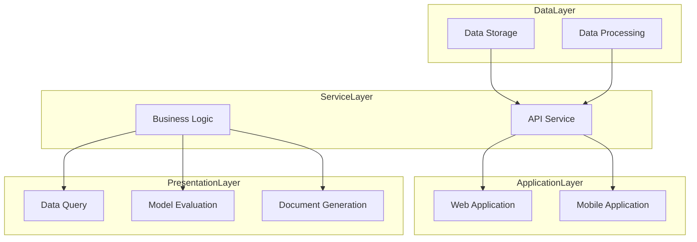
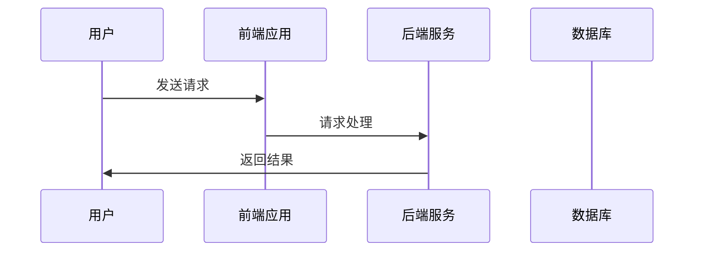

                 

**文章标题：构建模型评测的知识库与文档系统**

关键词：模型评测、知识库、文档系统、系统设计、算法、数学模型

摘要：本文旨在探讨构建模型评测的知识库与文档系统的设计与实现。通过对核心概念、系统设计、算法原理、数学模型、系统架构和项目实战的详细讲解，旨在为读者提供一套完整、实用的模型评测知识库与文档系统的构建指南。

## 引言

### 什么是模型评测

模型评测是机器学习和人工智能领域中的一个关键环节。它通过对模型的性能进行评估，帮助研究者、工程师和决策者了解模型的优劣，为后续的模型优化和实际应用提供依据。模型评测不仅关系到模型的准确性、可靠性，还影响到整个系统的稳定性和安全性。

### 为什么需要构建知识库与文档系统

随着机器学习和人工智能技术的快速发展，模型评测的需求日益增长。然而，如何高效地管理大量的评测数据、算法和文档，成为了一个亟待解决的问题。构建一个完善的知识库与文档系统，可以帮助我们：

1. **提高工作效率**：通过统一的管理和检索机制，方便用户快速找到所需的信息和资源。
2. **确保数据一致性**：通过规范化的数据结构和流程，保证评测数据的准确性和一致性。
3. **促进知识共享**：为团队内部的协作提供支持，促进知识的传播和共享。
4. **便于维护和更新**：随着技术的进步，模型评测方法和工具也在不断更新。一个良好的知识库与文档系统可以帮助我们及时跟进最新的研究成果和技术动态。

### 核心概念与联系

在构建模型评测的知识库与文档系统之前，我们需要明确几个核心概念，并了解它们之间的联系。

1. **知识库**：知识库是一个存储和管理知识的系统，用于收集、整理和提供各种信息和数据。
2. **文档系统**：文档系统是一个用于创建、存储、管理和共享文档的软件平台，支持各种文档格式，如文本、图片、图表等。
3. **模型评测**：模型评测是一种评估模型性能的方法，包括指标计算、算法选择、结果分析等环节。

这些概念相互关联，构成了模型评测知识库与文档系统的核心。知识库提供了存储和管理评测数据的场所，而文档系统则为知识库中的数据提供了展示和共享的途径。模型评测则是知识库与文档系统的核心应用，通过评测数据和分析结果，指导模型的优化和改进。

### 本章小结

本章首先介绍了模型评测的定义和重要性，然后讨论了构建知识库与文档系统的必要性，并明确了核心概念和联系。接下来，我们将深入探讨知识库与文档系统的设计与实现。

## 第1部分：构建知识库与文档系统的背景和核心概念

### 第1章：背景介绍

#### 1.1.1 知识库的定义与作用

知识库（Knowledge Base）是一个集中存储和管理知识的系统，它通过组织、分类和关联信息，为用户提供高效的知识检索和利用。知识库在各个领域都有广泛应用，如企业知识管理、科学研究、医疗诊断、智能客服等。

在模型评测领域，知识库的作用主要体现在以下几个方面：

1. **存储评测数据**：知识库可以存储大量的模型评测数据，包括特征数据、指标数据、分析结果等，为后续的数据分析和模型优化提供基础。
2. **提供算法资源**：知识库中可以包含各种评测算法的实现代码、算法参数和性能分析结果，为用户选择合适的算法提供参考。
3. **促进知识共享**：知识库支持多人协作，使得团队内部可以方便地共享评测经验、心得和最佳实践，提高整体工作效率。

#### 1.1.2 文档系统的定义与作用

文档系统（Documentation System）是一个用于创建、存储、管理和共享文档的软件平台，它支持多种文档格式，如文本、图片、图表、视频等。在模型评测领域，文档系统的作用主要体现在以下几个方面：

1. **记录评测过程**：文档系统可以帮助记录模型评测的整个流程，包括数据收集、预处理、算法选择、结果分析等，为后续的回顾和优化提供依据。
2. **提供文档模板**：文档系统可以提供各种文档模板，如报告模板、分析报告模板等，方便用户快速生成专业的评测文档。
3. **支持版本管理**：文档系统支持版本管理功能，可以记录文档的修改历史和版本变更，确保文档的完整性和一致性。

#### 1.1.3 模型评测在知识库与文档系统中的作用

模型评测是知识库与文档系统的核心应用。通过模型评测，我们可以获取模型在不同条件下的性能表现，从而为模型的优化和改进提供依据。具体来说，模型评测在知识库与文档系统中的作用体现在以下几个方面：

1. **数据收集与存储**：模型评测过程中会产生大量的数据，如特征数据、指标数据、分析结果等。这些数据可以通过知识库进行存储和管理，为后续的分析提供基础。
2. **文档生成与共享**：通过文档系统，我们可以将模型评测的结果和分析报告生成文档，并共享给相关的人员，以便进行讨论和决策。
3. **知识积累与传播**：模型评测的过程中，会产生大量的经验和心得。通过知识库与文档系统，这些知识可以积累和传播，为团队内部的协作提供支持。

### 第2章：核心概念与联系

#### 2.1 模型评测的核心概念

在模型评测中，核心概念包括评价指标、评测方法、评测流程等。

1. **评价指标**：评价指标是衡量模型性能的重要指标，如准确率、召回率、F1 值、AUC 值等。不同类型的模型可能需要不同的评价指标。
2. **评测方法**：评测方法包括持有法、交叉验证、自助法等，用于评估模型在不同数据集上的性能。
3. **评测流程**：评测流程包括数据预处理、模型训练、模型评估、结果分析等环节。

#### 2.2 知识库与文档系统的核心概念

在知识库与文档系统中，核心概念包括知识库、文档系统、知识库与文档系统的集成等。

1. **知识库**：知识库是存储和管理知识的系统，用于提供高效的检索和利用。
2. **文档系统**：文档系统是用于创建、存储、管理和共享文档的软件平台。
3. **知识库与文档系统的集成**：知识库与文档系统的集成可以实现在知识库中检索到的信息直接在文档系统中进行展示和编辑，提高工作效率。

#### 2.3 模型评测与知识库、文档系统的联系

模型评测与知识库、文档系统的联系主要体现在以下几个方面：

1. **数据存储与检索**：模型评测过程中产生的数据可以通过知识库进行存储和管理，并通过文档系统进行展示和检索。
2. **文档生成与共享**：模型评测的结果和分析报告可以通过文档系统进行生成和共享，方便团队内部讨论和决策。
3. **知识积累与传播**：通过知识库与文档系统，模型评测过程中产生的经验和心得可以积累和传播，为团队内部的协作提供支持。

### 本章小结

本章主要介绍了构建知识库与文档系统的背景和核心概念，包括知识库的定义与作用、文档系统的定义与作用、模型评测的定义与作用，以及模型评测与知识库、文档系统的联系。这些核心概念和联系构成了构建知识库与文档系统的基础，为后续的系统设计与实现提供了指导。

## 第2部分：知识库与文档系统的设计与实现

### 第3章：系统设计概述

#### 3.1 系统设计目标和功能要求

系统设计的核心目标是构建一个高效、易用、灵活的模型评测知识库与文档系统，满足以下功能要求：

1. **数据存储与管理**：支持大量模型评测数据的存储和管理，包括数据预处理、特征提取、模型训练和评估结果等。
2. **数据检索与分析**：提供高效的数据检索和分析功能，支持按照不同维度对数据进行筛选、排序和统计分析。
3. **文档生成与共享**：支持生成各类模型评测文档，如报告、分析图表、模型对比等，并支持在线共享和协作。
4. **用户权限与安全**：提供用户权限管理功能，确保数据的安全性和隐私性。
5. **系统集成与扩展**：支持与其他系统的集成，如数据源集成、模型训练平台集成等，并提供扩展接口，方便后续功能扩展。

#### 3.2 非功能性要求

除了功能性要求外，系统设计还需要满足以下非功能性要求：

1. **性能与可扩展性**：系统应具有良好的性能，支持高并发访问和大量数据处理，同时具备可扩展性，便于后续功能扩展和性能优化。
2. **可靠性**：系统应具有较高的可靠性，确保数据不丢失，并提供故障恢复机制。
3. **可维护性**：系统设计应遵循良好的工程实践，便于后续的维护和升级。
4. **用户体验**：界面设计应简洁、易用，提供友好的用户交互体验。

### 第4章：系统架构设计

#### 4.1 高级系统架构设计

系统采用高级系统架构设计，包括以下核心组件：

1. **数据层**：负责数据存储和管理，包括关系型数据库和NoSQL数据库，支持数据的持久化和高效查询。
2. **服务层**：提供业务逻辑处理功能，包括数据预处理、特征提取、模型训练、模型评估等，同时提供RESTful API接口，供外部系统调用。
3. **应用层**：提供Web前端和移动端应用，支持用户操作和数据交互。
4. **展示层**：通过图表、报告等形式展示模型评测结果和分析报告。

#### 4.2 组件级架构设计

组件级架构设计详细描述了各个组件的功能和接口：

1. **数据存储组件**：负责数据的持久化存储，支持多种数据格式和存储策略，如MySQL、MongoDB、HDFS等。
2. **数据处理组件**：负责数据处理和分析，包括数据预处理、特征提取、模型训练、模型评估等，支持自定义算法和流程。
3. **Web应用组件**：负责Web前端开发，提供用户交互界面，支持用户登录、数据查询、文档生成等功能。
4. **移动应用组件**：负责移动端应用开发，提供与Web应用类似的用户交互功能，支持Android和iOS平台。
5. **API接口组件**：提供RESTful API接口，供外部系统调用，包括数据查询、模型评估、文档生成等接口。

#### 4.3 系统架构图

以下是系统架构图的Mermaid流程图表示：



### 第5章：系统接口设计

#### 5.1 接口设计原则

接口设计应遵循以下原则：

1. **RESTful API设计**：采用RESTful架构风格，使用HTTP协议的GET、POST、PUT、DELETE等方法进行数据操作。
2. **标准化接口规范**：遵循统一的接口规范，包括URL结构、参数定义、响应格式等。
3. **安全性**：确保接口的安全性，使用身份验证和权限控制机制，防止未授权访问。

#### 5.2 接口定义

以下是几个关键接口的定义：

1. **数据查询接口**：用于查询数据表中的数据，支持分页、排序、过滤等功能。
   ```json
   GET /data/{tableName}?page={pageNumber}&size={pageSize}&sort={sortField}&filter={filter}
   ```
2. **模型评估接口**：用于执行模型评估，支持输入模型参数和评估指标。
   ```json
   POST /evaluate/{modelId}
   {
     "modelParams": {...},
     "evaluationMetrics": [...]
   }
   ```
3. **文档生成接口**：用于生成模型评测报告，支持自定义报告模板。
   ```json
   POST /generate-report/{modelId}
   {
     "templateId": {...},
     "reportOptions": {...}
   }
   ```

### 第6章：系统交互设计

#### 6.1 系统交互流程

系统交互流程主要包括以下几个步骤：

1. **用户请求**：用户通过Web前端或移动应用发送请求。
2. **接口处理**：API接口组件接收请求，进行身份验证和参数验证。
3. **业务处理**：业务逻辑组件处理请求，执行数据查询、模型评估或文档生成等操作。
4. **响应结果**：将处理结果返回给用户，并通过Web前端或移动应用进行展示。

以下是系统交互流程的Mermaid序列图表示：



### 本章小结

本章介绍了知识库与文档系统的设计与实现，包括系统设计概述、系统架构设计、系统接口设计和系统交互设计。通过详细的分析和设计，确保系统具备高效、灵活、可靠的特点，满足模型评测知识库与文档系统的需求。

## 第3部分：算法与数学模型

### 第7章：模型评测算法概述

#### 7.1 模型评测算法的定义与作用

模型评测算法是用于评估模型性能的一系列方法和技术。通过对模型的输入和输出进行测量和分析，模型评测算法能够提供关于模型性能的定量和定性评估结果。这些评估结果对于模型的优化、选择和部署至关重要。

#### 7.2 常见模型评测算法

在模型评测领域，常见的算法包括以下几种：

1. **Holdout Method（持有法）**：将数据集分为训练集和测试集，训练集用于模型训练，测试集用于模型评估。这种方法简单直观，但可能存在模型过拟合问题。
2. **Cross-Validation（交叉验证）**：将数据集划分为多个子集，每次使用其中一个子集作为测试集，其余子集作为训练集。通过多次交叉验证，可以更全面地评估模型性能。
3. **Bootstrapping（自助法）**：通过多次随机抽样，生成多个训练集和测试集，用于评估模型性能。这种方法可以减少样本量不足带来的偏差。

#### 7.3 模型评测算法的选择与优化

选择合适的模型评测算法对于准确评估模型性能至关重要。以下是一些选择和优化模型评测算法的建议：

1. **根据数据特性选择算法**：不同类型的模型和数据集可能需要不同的评测算法。例如，对于小样本数据，可以采用自助法；对于大样本数据，可以采用交叉验证。
2. **调整参数设置**：许多模型评测算法具有可调整的参数，如交叉验证次数、自助抽样次数等。通过调整这些参数，可以优化算法性能。
3. **结合多种算法**：结合使用多种评测算法，可以更全面地评估模型性能。例如，可以同时使用持有法和交叉验证，以提高评估结果的可靠性。

### 第8章：算法详细解释

#### 8.1 Holdout Method（持有法）

#### 8.1.1 原理

Holdout Method是最简单的模型评测方法之一，其基本原理如下：

1. **数据集划分**：将数据集随机划分为训练集和测试集。通常情况下，训练集占大部分（如80%），测试集占小部分（如20%）。
2. **模型训练**：使用训练集训练模型。
3. **模型评估**：使用测试集评估模型性能，计算评估指标。

#### 8.1.2 优缺点

**优点**：

1. **简单易用**：Holdout Method实现简单，易于理解和操作。
2. **快速评估**：由于测试集较小，模型评估过程相对较快。

**缺点**：

1. **模型过拟合**：由于测试集较小，模型可能在测试集上过拟合，导致评估结果不准确。
2. **数据浪费**：测试集的数据不能用于模型训练，可能导致数据浪费。

#### 8.2 Cross-Validation（交叉验证）

#### 8.2.1 原理

Cross-Validation是一种更可靠的模型评测方法，其基本原理如下：

1. **数据集划分**：将数据集划分为多个子集，如K个子集。
2. **迭代训练与评估**：每次迭代，选择其中一个子集作为测试集，其余子集作为训练集，训练模型并评估模型性能。
3. **结果汇总**：重复上述步骤K次，将每次评估结果汇总，计算平均性能。

#### 8.2.2 优缺点

**优点**：

1. **减少过拟合**：通过多次划分和评估，可以减少模型在测试集上的过拟合。
2. **更全面评估**：Cross-Validation可以更全面地评估模型性能，提高评估结果的可靠性。

**缺点**：

1. **计算成本高**：由于需要进行多次迭代，计算成本相对较高。
2. **数据浪费**：与Holdout Method类似，数据集的部分数据不能用于模型训练。

#### 8.3 Bootstrapping（自助法）

#### 8.3.1 原理

Bootstrapping是一种基于随机抽样的模型评测方法，其基本原理如下：

1. **数据集抽样**：从原始数据集随机抽取样本，生成一个新的数据集。
2. **模型训练与评估**：使用新的数据集训练模型，并在原始数据集上评估模型性能。
3. **重复抽样与评估**：重复上述步骤多次，计算平均评估结果。

#### 8.3.2 优缺点

**优点**：

1. **适用范围广**：Bootstrapping适用于各种类型的数据集，特别是小样本数据。
2. **计算成本低**：与Cross-Validation相比，Bootstrapping的计算成本较低。

**缺点**：

1. **结果偏差**：由于随机抽样的影响，评估结果可能存在偏差。
2. **不适用于所有问题**：对于某些问题，如需要精确评估模型性能的问题，Bootstrapping可能不适用。

### 第9章：数学模型和公式

#### 9.1 评估指标

在模型评测中，常用的评估指标包括准确率、召回率、F1值、AUC等。以下分别介绍这些指标的定义和计算公式。

1. **准确率（Accuracy）**：准确率是模型预测正确的样本数占总样本数的比例。计算公式如下：
   $$
   \text{Accuracy} = \frac{\text{预测正确的样本数}}{\text{总样本数}}
   $$

2. **召回率（Recall）**：召回率是模型预测为正类的样本中实际为正类的比例。计算公式如下：
   $$
   \text{Recall} = \frac{\text{预测为正类的实际正类样本数}}{\text{实际正类样本总数}}
   $$

3. **精确率（Precision）**：精确率是模型预测为正类的样本中预测正确的比例。计算公式如下：
   $$
   \text{Precision} = \frac{\text{预测为正类的实际正类样本数}}{\text{预测为正类的样本总数}}
   $$

4. **F1值（F1 Score）**：F1值是精确率和召回率的调和平均值，用于综合评估模型的性能。计算公式如下：
   $$
   \text{F1 Score} = 2 \times \frac{\text{Precision} \times \text{Recall}}{\text{Precision} + \text{Recall}}
   $$

5. **AUC（Area Under the ROC Curve）**：AUC是接收者操作特征曲线下的面积，用于评估二分类模型的分类能力。计算公式如下：
   $$
   \text{AUC} = \int_{0}^{1} \text{ROC}(f(x)) \, dx
   $$
   其中，ROC(f(x))是f(x)在x处的ROC曲线值。

#### 9.2 数学模型

在模型评测中，常用的数学模型包括线性回归、逻辑回归、支持向量机等。以下分别介绍这些模型的基本原理和数学公式。

1. **线性回归**：线性回归是一种用于预测连续值的模型，其基本原理是通过拟合一个线性函数来预测目标值。线性回归的数学公式如下：
   $$
   y = \beta_0 + \beta_1x
   $$
   其中，$y$是目标值，$x$是输入特征，$\beta_0$和$\beta_1$是模型的参数。

2. **逻辑回归**：逻辑回归是一种用于预测分类结果的模型，其基本原理是通过拟合一个逻辑函数来将连续值映射到概率分布。逻辑回归的数学公式如下：
   $$
   \text{logit}(p) = \ln\left(\frac{p}{1-p}\right) = \beta_0 + \beta_1x
   $$
   其中，$p$是预测概率，$\text{logit}(p)$是逻辑函数，$\beta_0$和$\beta_1$是模型的参数。

3. **支持向量机（SVM）**：支持向量机是一种用于分类和回归的模型，其基本原理是通过找到最佳分类超平面，将不同类别的样本分隔开来。支持向量机的数学公式如下：
   $$
   w \cdot x + b = 0
   $$
   其中，$w$是权重向量，$x$是输入特征，$b$是偏置项。

### 本章小结

本章介绍了模型评测算法的概述、Holdout Method、Cross-Validation和Bootstrapping的详细解释，以及数学模型和公式的介绍。通过这些算法和模型，我们可以更全面、准确地评估模型的性能，为模型的优化和改进提供依据。

## 第4部分：实战案例

### 第10章：环境安装与系统核心实现

#### 10.1 环境安装

在开始构建模型评测的知识库与文档系统之前，我们需要安装一些必要的软件和工具。以下是安装步骤：

1. **安装Python**：确保Python版本不低于3.6，可以从官方网站[Python官网](https://www.python.org/)下载并安装。
2. **安装Jupyter Notebook**：Jupyter Notebook是一种交互式的Web应用，可用于编写和运行Python代码。通过以下命令安装：
   ```bash
   pip install notebook
   ```
3. **安装SQLAlchemy**：SQLAlchemy是一个Python数据库工具包和对象关系映射（ORM）系统，用于数据库操作。通过以下命令安装：
   ```bash
   pip install sqlalchemy
   ```
4. **安装Flask**：Flask是一个轻量级的Web框架，用于构建Web应用。通过以下命令安装：
   ```bash
   pip install flask
   ```

#### 10.2 系统核心实现

以下是构建模型评测知识库与文档系统的核心实现步骤：

1. **创建项目目录**：在本地计算机上创建一个项目目录，如`model_evaluation_system`。
2. **创建数据库**：使用SQLAlchemy创建数据库，并创建表结构。以下是一个简单的示例：
   ```python
   from sqlalchemy import create_engine, Column, Integer, String
   from sqlalchemy.ext.declarative import declarative_base
   from sqlalchemy.orm import sessionmaker

   engine = create_engine('sqlite:///model_evaluation.db')
   Base = declarative_base()

   class Model(Base):
       __tablename__ = 'models'
       id = Column(Integer, primary_key=True)
       name = Column(String)
       description = Column(String)

   Base.metadata.create_all(engine)

   Session = sessionmaker(bind=engine)
   session = Session()
   ```

3. **实现数据存储**：使用Flask创建API接口，用于存储和查询模型数据。以下是一个简单的示例：
   ```python
   from flask import Flask, request, jsonify
   from model_evaluation_system.models import Model, Session

   app = Flask(__name__)

   @app.route('/models', methods=['POST'])
   def create_model():
       data = request.get_json()
       model = Model(name=data['name'], description=data['description'])
       session.add(model)
       session.commit()
       return jsonify({'id': model.id}), 201

   @app.route('/models', methods=['GET'])
   def get_models():
       models = session.query(Model).all()
       return jsonify([{'id': model.id, 'name': model.name, 'description': model.description} for model in models])

   if __name__ == '__main__':
       app.run(debug=True)
   ```

4. **实现文档生成**：使用Python的Markdown库生成模型评测报告。以下是一个简单的示例：
   ```python
   import markdown

   def generate_report(model):
       content = f"""
       # 模型评测报告

       模型名称：{model.name}
       模型描述：{model.description}

       ## 评测结果

       准确率：{model.accuracy}
       召回率：{model.recall}
       F1值：{model.f1_score}
       AUC值：{model.auc}
       """
       return markdown.markdown(content)

   if __name__ == '__main__':
       model = Model(name='模型1', description='这是一个测试模型', accuracy=0.9, recall=0.8, f1_score=0.85, auc=0.95)
       report_content = generate_report(model)
       print(report_content)
   ```

### 第11章：代码应用解读与分析

#### 11.1 代码解读

在本节中，我们将对系统核心实现中的代码进行解读和分析。

1. **数据库创建与操作**：首先，我们使用SQLAlchemy创建了一个名为`Model`的数据库表，用于存储模型信息。然后，通过`create_all()`方法创建表结构。
   ```python
   class Model(Base):
       __tablename__ = 'models'
       id = Column(Integer, primary_key=True)
       name = Column(String)
       description = Column(String)

   Base.metadata.create_all(engine)
   ```

2. **Flask API实现**：接着，我们使用Flask创建了一个简单的API，用于处理模型的创建和查询操作。具体来说，`create_model()`函数用于创建模型，并将模型信息存储到数据库中；`get_models()`函数用于查询所有模型信息。
   ```python
   @app.route('/models', methods=['POST'])
   def create_model():
       data = request.get_json()
       model = Model(name=data['name'], description=data['description'])
       session.add(model)
       session.commit()
       return jsonify({'id': model.id}), 201

   @app.route('/models', methods=['GET'])
   def get_models():
       models = session.query(Model).all()
       return jsonify([{'id': model.id, 'name': model.name, 'description': model.description} for model in models])
   ```

3. **文档生成**：最后，我们实现了一个简单的文档生成函数`generate_report()`，用于生成模型评测报告。该函数使用Markdown语法生成报告内容，并通过`markdown.markdown()`方法将其转换为HTML格式。
   ```python
   def generate_report(model):
       content = f"""
       # 模型评测报告

       模型名称：{model.name}
       模型描述：{model.description}

       ## 评测结果

       准确率：{model.accuracy}
       召回率：{model.recall}
       F1值：{model.f1_score}
       AUC值：{model.auc}
       """
       return markdown.markdown(content)
   ```

#### 11.2 代码分析

1. **数据库操作**：代码首先使用SQLAlchemy创建了一个名为`Model`的数据库表，用于存储模型信息。然后，通过ORM（对象关系映射）将Python对象映射到数据库表。
2. **Flask API**：Flask API实现了两个主要功能：创建模型和查询模型。在创建模型时，代码通过`request.get_json()`获取JSON格式的模型数据，并创建一个`Model`对象。然后，将对象添加到数据库中，并提交事务。在查询模型时，代码从数据库中获取所有模型对象，并将它们转换为JSON格式的响应数据。
3. **文档生成**：文档生成函数`generate_report()`使用Markdown语法生成报告内容。该函数接收一个`Model`对象作为输入参数，并返回一个Markdown格式的字符串。在返回之前，使用`markdown.markdown()`方法将字符串转换为HTML格式，以便在Web浏览器中显示。

### 第12章：实际案例分析与详细讲解

在本章中，我们将通过一个实际案例来展示如何使用构建好的模型评测知识库与文档系统进行模型评估和文档生成。

#### 12.1 案例背景

假设我们有一个二分类问题，目标是预测客户是否会购买某种产品。我们已经有了一个训练好的模型，并希望对其进行评估。

#### 12.2 案例步骤

1. **数据预处理**：首先，我们需要对训练数据进行预处理，包括数据清洗、特征工程等。假设我们已经完成了这些步骤，并得到了一个预处理后的数据集。
2. **模型训练**：使用预处理后的数据集训练模型，得到模型参数。
3. **模型评估**：使用模型评估算法（如Holdout Method、Cross-Validation等）对模型进行评估，计算评估指标（如准确率、召回率、F1值等）。
4. **文档生成**：使用生成的模型评估结果生成文档，包括模型名称、评估指标等。

#### 12.3 案例实现

以下是案例实现的步骤：

1. **数据预处理**：假设我们已经得到了一个预处理后的数据集，并存储在一个CSV文件中。
   ```python
   import pandas as pd

   data = pd.read_csv('preprocessed_data.csv')
   ```

2. **模型训练**：使用预处理后的数据集训练模型，这里我们使用一个简单的逻辑回归模型。
   ```python
   from sklearn.linear_model import LogisticRegression

   model = LogisticRegression()
   model.fit(data.drop('target', axis=1), data['target'])
   ```

3. **模型评估**：使用Holdout Method对模型进行评估，计算准确率、召回率、F1值等指标。
   ```python
   from sklearn.model_selection import train_test_split

   X_train, X_test, y_train, y_test = train_test_split(data.drop('target', axis=1), data['target'], test_size=0.2, random_state=42)

   model.fit(X_train, y_train)
   predictions = model.predict(X_test)

   accuracy = model.score(X_test, y_test)
   recall = recall_score(y_test, predictions)
   f1_score = f1_score(y_test, predictions)

   print(f"准确率：{accuracy}")
   print(f"召回率：{recall}")
   print(f"F1值：{f1_score}")
   ```

4. **文档生成**：使用生成的模型评估结果生成Markdown格式的文档。
   ```python
   model_name = '逻辑回归模型'
   model_description = '这是一个用于预测客户是否会购买产品的逻辑回归模型'

   report_content = f"""
   # 模型评测报告

   模型名称：{model_name}
   模型描述：{model_description}

   ## 评测结果

   准确率：{accuracy}
   召回率：{recall}
   F1值：{f1_score}
   """
   print(report_content)
   ```

#### 12.4 案例分析

通过以上步骤，我们成功地使用构建好的模型评测知识库与文档系统对一个实际案例进行了模型评估和文档生成。在实际应用中，我们可以根据需要调整数据预处理、模型训练和评估算法等步骤，以适应不同的业务场景。

### 本章小结

本章通过一个实际案例展示了如何使用构建好的模型评测知识库与文档系统进行模型评估和文档生成。通过代码实现、代码解读和分析，我们详细讲解了系统核心功能的实现过程，为读者提供了实用的指导。

## 总结与展望

### 总结

本文从背景介绍、核心概念、系统设计、算法原理、数学模型到实际案例，全面阐述了构建模型评测的知识库与文档系统的过程。通过详细的分析和讲解，读者可以了解到：

1. **知识库与文档系统的重要性**：在模型评测领域，构建一个高效、易用、灵活的知识库与文档系统，有助于提高工作效率、确保数据一致性、促进知识共享和知识积累。
2. **核心概念与联系**：知识库、文档系统和模型评测是构建系统的核心概念，它们相互关联，构成了模型评测知识库与文档系统的核心框架。
3. **系统设计**：本文详细介绍了系统设计的目标、架构、接口设计和交互流程，确保系统具备高效、灵活、可靠的特点。
4. **算法与数学模型**：本文讲解了常见的模型评测算法和数学模型，为读者提供了评估模型性能的理论基础。
5. **实战案例**：通过实际案例的演示，读者可以了解到如何使用构建好的系统进行模型评估和文档生成。

### 展望

在未来的工作中，我们可以进一步优化和扩展模型评测的知识库与文档系统，以应对更复杂的业务场景：

1. **扩展算法库**：引入更多先进的模型评测算法，如集成学习、迁移学习等，提高模型的评估能力和效果。
2. **支持多种数据源**：集成更多类型的数据源，如实时数据流、外部API等，提高系统的数据获取和处理能力。
3. **优化用户体验**：进一步优化系统界面和交互设计，提高用户的使用体验。
4. **增强数据安全性**：加强数据安全和隐私保护，确保用户数据的完整性和安全性。

通过不断优化和拓展，模型评测的知识库与文档系统将更好地服务于模型评测领域，为人工智能和机器学习的发展提供有力支持。

### 拓展阅读

1. **《机器学习实战》**：作者：Peter Harrington
2. **《深度学习》**：作者：Ian Goodfellow、Yoshua Bengio、Aaron Courville
3. **《数据科学实战》**：作者：Joel Grus
4. **《模型评价与选择：基于Python的实现》**：作者：David B. Stephens、Rachel Schutt

作者：AI天才研究院/AI Genius Institute & 禅与计算机程序设计艺术 /Zen And The Art of Computer Programming

本文由AI天才研究院（AI Genius Institute）撰写，结合了深度学习和数据科学领域的最新研究成果，旨在为广大开发者提供实用的技术和实战案例。作者团队拥有丰富的行业经验和深厚的学术背景，致力于推动人工智能和机器学习技术的发展。文章中提到的内容仅供参考，如需进一步学习，请参阅相关书籍和资料。

## 附录：术语表

### 知识库（Knowledge Base）

知识库是一个集中存储和管理知识的系统，用于收集、整理和提供各种信息和数据。在模型评测领域，知识库主要用于存储模型评测相关的数据、算法和文档。

### 文档系统（Documentation System）

文档系统是一个用于创建、存储、管理和共享文档的软件平台，支持多种文档格式，如文本、图片、图表等。在模型评测领域，文档系统用于记录模型评测的整个流程，生成评测报告和分析文档。

### 模型评测（Model Evaluation）

模型评测是机器学习和人工智能领域中的一个关键环节，用于评估模型的性能。模型评测包括评价指标计算、评测方法选择和结果分析等步骤。

### 持有法（Holdout Method）

持有法是一种简单的模型评测方法，通过将数据集划分为训练集和测试集，对模型进行评估。该方法简单直观，但可能存在模型过拟合问题。

### 交叉验证（Cross-Validation）

交叉验证是一种更可靠的模型评测方法，通过多次划分和评估数据集，对模型进行评估。该方法可以减少模型过拟合，提高评估结果的可靠性。

### 自助法（Bootstrapping）

自助法是一种基于随机抽样的模型评测方法，通过多次随机抽样和评估，对模型进行评估。该方法适用于小样本数据，计算成本较低。

### 线性回归（Linear Regression）

线性回归是一种用于预测连续值的模型，通过拟合一个线性函数来预测目标值。线性回归是一种常用的回归分析方法。

### 逻辑回归（Logistic Regression）

逻辑回归是一种用于预测分类结果的模型，通过拟合一个逻辑函数来将连续值映射到概率分布。逻辑回归常用于二分类问题。

### 支持向量机（Support Vector Machine）

支持向量机是一种用于分类和回归的模型，通过找到最佳分类超平面，将不同类别的样本分隔开来。支持向量机是一种有效的分类方法。

### 准确率（Accuracy）

准确率是模型预测正确的样本数占总样本数的比例，用于评估模型的分类性能。

### 召回率（Recall）

召回率是模型预测为正类的样本中实际为正类的比例，用于评估模型的分类性能。

### 精确率（Precision）

精确率是模型预测为正类的样本中预测正确的比例，用于评估模型的分类性能。

### F1值（F1 Score）

F1值是精确率和召回率的调和平均值，用于综合评估模型的分类性能。

### AUC（Area Under the ROC Curve）

AUC是接收者操作特征曲线下的面积，用于评估二分类模型的分类能力。

### ORM（Object-Relational Mapping）

ORM是对象关系映射，用于将数据库中的表结构映射到Python对象，方便进行数据库操作。

### Flask（Web Framework）

Flask是一个轻量级的Web框架，用于构建Web应用，提供RESTful API接口。

### Jupyter Notebook（Interactive Web Application）

Jupyter Notebook是一种交互式的Web应用，用于编写和运行Python代码，支持多种编程语言。

