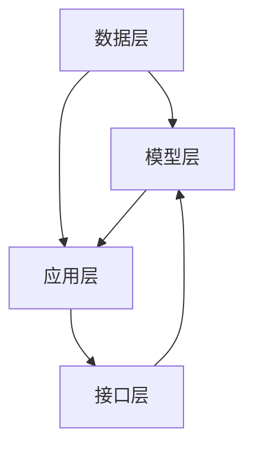
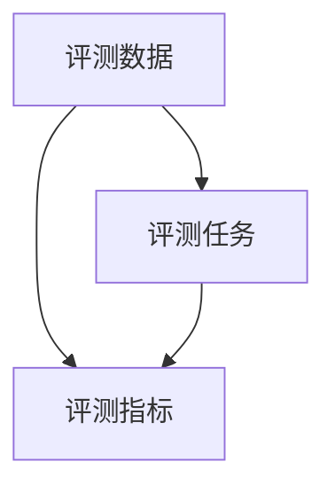

                 

### 引言

#### 1.1 问题背景

在当今数字化时代，评测知识库作为一种重要的信息资源，已经成为各行各业提升竞争力、优化决策过程的重要工具。无论是在科研、教育、医疗还是制造业，评测知识库的应用场景日益广泛。然而，随着评测需求的不断增加和数据规模的扩大，如何构建一个高效、全面且可维护的评测知识库，成为了众多企业和研究机构面临的一大挑战。

首先，评测知识库的重要性不容忽视。它不仅可以帮助我们系统地收集、整理和利用各种评测数据，还能为决策提供有力支持，降低决策风险，提升整体效益。例如，在医疗领域，通过评测知识库可以对大量患者数据进行分析，从而优化治疗方案，提高医疗水平；在制造业中，通过评测知识库可以评估产品质量，提高生产效率，降低成本。

然而，当前评测知识库的应用仍面临诸多挑战。一方面，数据收集和处理难度大。评测数据通常来源广泛、形式多样，如何高效地收集、整理和预处理这些数据，是构建评测知识库的首要难题。另一方面，评测模型的构建和优化复杂。评测模型需要根据具体应用场景进行设计和调整，如何选择合适的模型，并对其进行优化，是一个需要深入思考的问题。

此外，评测知识库的建设还面临数据质量、安全与隐私等多方面的挑战。如何保证数据的质量，如何处理数据安全与隐私问题，都是评测知识库建设中不可忽视的重要问题。

#### 1.2 评测知识库的定义与核心概念

评测知识库，顾名思义，是一个用于存储、管理和利用评测数据的系统。它通常包含以下几个核心概念：

1. **评测标准与指标**：这是评测知识库的基础，决定了如何对数据进行评估和分类。评测标准需要根据具体应用场景进行定制，以确保评估的准确性和有效性。

2. **数据采集与处理**：数据采集是评测知识库建设的第一步，涉及数据来源的选择、数据收集方法的设计和数据预处理等环节。数据预处理包括数据清洗、数据转换和数据集成等步骤，目的是提高数据的质量和可用性。

3. **评测模型与应用**：评测模型是基于特定应用场景和数据集构建的算法，用于对数据进行分类、预测或评估。评测模型的选择和优化直接关系到评测知识库的性能和效果。

4. **数据库设计**：数据库设计是评测知识库的核心，决定了数据的存储和组织方式。一个良好的数据库设计可以提高数据查询的效率，降低维护成本。

5. **系统架构设计**：系统架构设计是评测知识库的骨架，涉及到系统的模块划分、功能实现和性能优化等方面。一个合理的系统架构可以确保评测知识库的稳定运行和可扩展性。

#### 1.3 目标与预期成果

本文旨在构建一个全面的评测知识库，并总结最佳实践和策略。具体目标如下：

1. **构建评测知识库的基本原理**：介绍评测知识库的起源、发展及其核心概念，为后续构建提供理论基础。

2. **评测知识库建设方法**：详细阐述数据收集与预处理、数据存储与管理、评测模型构建与应用等具体方法，提供可操作的指导。

3. **评测知识库案例分析**：通过具体案例分析，展示评测知识库的实际应用效果，提供实践经验。

4. **最佳实践与策略**：总结评测知识库建设的最佳实践和策略，为后续建设提供参考。

5. **评测知识库应用领域**：探讨评测知识库在不同领域的应用，展示其潜在价值和广阔前景。

#### 1.4 书籍结构概述

本文结构如下：

- 引言：介绍评测知识库的背景、核心概念和目标。
- 第1部分：评测知识库构建基础，包括基本原理和建设方法。
- 第2部分：评测知识库案例分析，通过具体案例展示评测知识库的实际应用。
- 第3部分：最佳实践与策略，总结评测知识库建设的最佳实践和策略。
- 第4部分：评测知识库应用领域，探讨评测知识库在不同领域的应用。

以下是一个阅读建议与路径：

1. **新手读者**：首先阅读引言，了解评测知识库的基本概念和目标。然后按照顺序阅读第1部分的章节，逐步掌握评测知识库的基本原理和建设方法。
2. **进阶读者**：在掌握基本原理和建设方法后，可以阅读第2部分和第3部分的案例分析和最佳实践，深入了解评测知识库的实际应用和建设策略。
3. **高级读者**：可以结合具体应用场景，深入研究和实践第4部分的评测知识库应用领域。

通过本文的阅读，读者可以全面了解评测知识库的构建过程和应用场景，为实际工作提供有力支持。

### 第1部分：评测知识库构建基础

#### 第2章：评测知识库的基本原理

在构建评测知识库之前，理解其基本原理至关重要。这一章节将详细介绍评测知识库的起源与发展、核心概念、基本架构等内容，为后续建设提供理论基础。

#### 2.1 评测知识库的起源与发展

评测知识库的概念最早起源于20世纪90年代，随着信息技术和互联网的发展，评测知识库逐渐成为信息管理领域的一个重要分支。最初，评测知识库主要应用于科学研究领域，用于存储和管理实验数据和结果。随着评测需求的增加和技术的进步，评测知识库逐渐扩展到各个行业，如教育、医疗、金融和制造业等。

在评测知识库的发展历程中，有几个重要的里程碑：

1. **20世纪90年代**：信息技术和互联网的普及为评测知识库的发展奠定了基础。这个时期，评测知识库开始从单一的数据存储功能，逐步向智能化、自动化方向演进。
   
2. **21世纪初**：随着大数据和人工智能技术的兴起，评测知识库的数据规模和复杂度大幅提升，评测知识库的应用场景和功能也不断扩展。

3. **当前**：评测知识库已经成为各行业提升竞争力、优化决策的重要工具。其应用范围不仅限于数据存储和管理，还包括数据挖掘、预测分析、决策支持等高级功能。

#### 2.2 评测知识库的核心概念

评测知识库的核心概念包括评测标准与指标、数据采集与处理、评测模型与应用、数据库设计和系统架构设计等。以下是这些核心概念的详细说明：

1. **评测标准与指标**：
   - **评测标准**：是指对评测对象进行评估时，所遵循的统一规范或准则。它通常由行业专家或相关机构制定，以确保评估的公平性和一致性。
   - **评测指标**：是指用于量化评测结果的具体指标或参数。例如，在医疗领域，患者的治愈率、住院时间等可以视为评测指标。

2. **数据采集与处理**：
   - **数据采集**：是指从各种来源获取评测所需的数据。数据来源可以是数据库、文件、传感器等。数据采集方法包括直接采集、间接采集和自动化采集等。
   - **数据处理**：是指对采集到的数据进行清洗、转换和集成等操作，以提高数据的质量和可用性。数据处理过程通常涉及数据清洗（去除噪声和错误数据）、数据转换（统一数据格式和编码）和数据集成（合并多个数据源）等步骤。

3. **评测模型与应用**：
   - **评测模型**：是指用于对数据进行分类、预测或评估的算法模型。评测模型可以根据具体应用场景进行设计和优化，以提高评估的准确性和效率。
   - **评测应用**：是指将评测模型应用于实际场景，如疾病诊断、产品质量评估等。评测应用通常涉及模型训练、模型评估和模型部署等环节。

4. **数据库设计**：
   - **数据库设计**：是指为评测知识库设计合适的数据库结构，包括数据库表的设计、字段定义和数据约束等。数据库设计的目标是提高数据存储和查询的效率，同时保证数据的一致性和完整性。

5. **系统架构设计**：
   - **系统架构设计**：是指为评测知识库设计合适的系统架构，包括系统模块的划分、功能实现和数据流设计等。系统架构设计的目标是提高系统的稳定性、可扩展性和可维护性。

#### 2.3 评测知识库的基本架构

一个典型的评测知识库通常包括以下几个主要组成部分：

1. **数据层**：负责数据的存储和管理，包括数据库表的设计、数据的存储和查询等。数据层是评测知识库的基础，其性能和可靠性直接影响整个系统的性能。

2. **模型层**：负责评测模型的构建和应用，包括模型的选择、训练和评估等。模型层是评测知识库的核心，其算法和模型的性能直接决定了评测结果的准确性和效率。

3. **应用层**：负责对外提供评测服务，包括评测任务的提交、处理和结果输出等。应用层是评测知识库与用户之间的接口，其设计应考虑用户体验和系统性能。

4. **接口层**：负责与其他系统或数据源进行数据交换和交互，包括API接口、数据导出导入等。接口层是评测知识库与其他系统集成的关键，其设计应确保数据的安全性和可靠性。

以下是一个简化的评测知识库系统架构图（使用Mermaid绘制）：

#### 2.4 评测知识库与其他知识库的关系

评测知识库并不是孤立存在的，它通常与其他类型的知识库相互关联，共同构建一个完整的知识管理体系。以下是评测知识库与其他知识库的关系：

1. **数据仓库**：数据仓库是用于存储和管理大规模数据的系统，其数据来源于多个数据源。评测知识库可以与数据仓库进行数据共享和集成，从而提高数据的利用效率。

2. **专家系统**：专家系统是一种基于人工智能技术的知识库系统，用于模拟专家的决策过程。评测知识库可以与专家系统结合，用于提供更加智能化和自动化的评测服务。

3. **知识图谱**：知识图谱是一种结构化知识表示方法，用于描述实体及其关系。评测知识库可以与知识图谱进行融合，从而实现更加智能和高效的知识搜索和推理。

4. **决策支持系统**：决策支持系统是一种辅助决策者进行决策的计算机系统，通常基于数据分析、模型仿真等技术。评测知识库可以作为决策支持系统的一个重要数据来源，提供高质量的评测数据支持。

#### 2.5 小结

本章介绍了评测知识库的基本原理，包括起源与发展、核心概念、基本架构以及与其他知识库的关系。通过本章的学习，读者可以全面了解评测知识库的基本概念和构建基础，为后续的评测知识库建设提供理论基础。

### 第3章：评测知识库建设方法

在理解了评测知识库的基本原理后，本章将详细阐述评测知识库的建设方法。这一部分包括数据收集与预处理、数据存储与管理、评测模型构建与应用等内容，旨在为读者提供一套完整的评测知识库构建指南。

#### 3.1 数据收集与预处理

数据收集与预处理是评测知识库建设的基础和关键步骤。以下是具体的方法和策略：

##### 3.1.1 数据源的选择与评估

选择合适的数据源是数据收集的第一步。数据源的选择应遵循以下原则：

1. **数据质量**：选择高质量的数据源，确保数据的准确性和完整性。
2. **数据多样性**：选择多样化的数据源，以覆盖不同维度和角度的数据，提高评测的全面性和准确性。
3. **数据可获得性**：选择易于获取的数据源，降低数据收集的难度和成本。

常见的评测数据源包括：

1. **公开数据集**：如Kaggle、UCI机器学习库等，提供各种领域的数据集，可供免费下载和使用。
2. **企业内部数据**：如ERP系统、CRM系统、生产系统等，存储企业运营过程中产生的各类数据。
3. **第三方数据服务**：如Data.gov、MongoDB Cloud等，提供丰富的数据资源，涵盖各种行业和应用场景。

评估数据源时，应考虑以下指标：

1. **数据量**：评估数据源的规模，确保满足评测需求。
2. **数据质量**：评估数据的准确性、完整性和一致性。
3. **数据更新频率**：评估数据的时效性，确保数据的新鲜度。

##### 3.1.2 数据收集方法与工具

数据收集方法主要包括以下几种：

1. **直接采集**：直接从数据源获取原始数据，如通过API接口调用、数据库查询等方式。
2. **间接采集**：通过数据爬取、数据清洗等方式获取数据，如使用Python的Beautiful Soup、Scrapy等库进行网页数据爬取。
3. **自动化采集**：通过自动化脚本或工具定期从数据源采集数据，如使用Apache NiFi、Apache Kafka等工具进行数据流处理。

常用的数据收集工具包括：

1. **API接口**：如RESTful API、SOAP API等，用于直接从数据源获取数据。
2. **数据爬虫**：如Scrapy、Beautiful Soup等，用于从网页或其他数据源抓取数据。
3. **数据采集工具**：如Apache NiFi、Apache Kafka等，用于大规模、高吞吐量的数据采集和处理。

##### 3.1.3 数据预处理流程与技巧

数据预处理是确保数据质量的重要环节，主要包括以下步骤：

1. **数据清洗**：去除重复数据、填补缺失值、纠正错误数据等。常用的数据清洗工具包括Pandas、SciPy等。
2. **数据转换**：将不同数据源的数据转换为统一的格式和编码方式，如数据类型转换、字段映射等。常用的数据转换工具包括Pandas、NumPy等。
3. **数据集成**：将来自多个数据源的数据进行合并和整合，形成统一的数据视图。常用的数据集成工具包括Pandas、Spark等。

数据预处理的技巧包括：

1. **自动化处理**：使用自动化脚本或工具进行数据预处理，提高效率和准确性。
2. **特征工程**：根据业务需求和模型要求，对数据进行特征提取和变换，以提高模型性能和泛化能力。
3. **数据可视化**：使用数据可视化工具（如Matplotlib、Seaborn等）对预处理后的数据进行可视化分析，帮助理解和发现数据中的规律和异常。

#### 3.2 数据存储与管理

数据存储与管理是评测知识库建设的核心环节，直接影响系统的性能和可靠性。以下是数据存储与管理的方法和策略：

##### 3.2.1 数据库设计与实现

数据库设计是数据存储与管理的基础，主要包括以下步骤：

1. **需求分析**：分析业务需求，确定数据存储的需求和功能要求。
2. **概念设计**：根据需求分析结果，设计数据库的概念模型，如ER图。
3. **逻辑设计**：将概念模型转换为具体的数据库逻辑结构，如SQL模式。
4. **物理设计**：确定数据库的物理存储结构，如表结构、索引、存储策略等。

常见的数据库类型包括关系数据库（如MySQL、PostgreSQL等）和NoSQL数据库（如MongoDB、Cassandra等）。关系数据库适用于结构化数据存储和管理，而NoSQL数据库适用于大规模、高并发的数据存储和管理。

以下是一个简单的数据库ER图示例（使用Mermaid绘制）：

##### 3.2.2 数据存储优化策略

数据存储优化策略主要包括以下方面：

1. **索引优化**：通过创建合适的索引，提高数据查询的效率。常用的索引类型包括B树索引、哈希索引等。
2. **分区策略**：将数据划分为多个分区，以提高数据查询和写入的性能。常用的分区策略包括范围分区、列表分区等。
3. **缓存策略**：通过缓存常用数据，减少数据库的查询压力。常用的缓存技术包括内存缓存、分布式缓存等。
4. **压缩策略**：通过数据压缩，减少存储空间的占用，提高存储效率。常用的压缩算法包括LZ4、Snappy等。

##### 3.2.3 数据安全管理

数据安全管理是确保数据安全性和隐私性的关键。主要包括以下方面：

1. **访问控制**：通过权限管理，限制对数据的访问，确保只有授权用户可以访问敏感数据。
2. **数据加密**：通过数据加密技术，保护数据的机密性，防止数据泄露。常用的加密算法包括AES、RSA等。
3. **备份与恢复**：定期备份数据，确保在数据丢失或损坏时，能够快速恢复。
4. **监控与审计**：通过监控和审计，及时发现和应对数据安全事件。

#### 3.3 评测模型构建与应用

评测模型的构建与应用是评测知识库的核心，直接影响评测结果的准确性和效率。以下是评测模型构建与应用的方法和策略：

##### 3.3.1 评测模型的类型与选择

评测模型的类型主要包括以下几种：

1. **分类模型**：用于将数据分为多个类别，如疾病诊断、产品质量评估等。常见的分类模型包括逻辑回归、决策树、随机森林等。
2. **回归模型**：用于预测数值型目标变量，如房价预测、股票价格预测等。常见的回归模型包括线性回归、岭回归、LASSO回归等。
3. **聚类模型**：用于将数据分为多个群组，如客户细分、异常检测等。常见的聚类模型包括K-Means、层次聚类等。
4. **时间序列模型**：用于分析时间序列数据，如股票价格预测、气象预测等。常见的时间序列模型包括ARIMA、LSTM等。

选择合适的评测模型时，应考虑以下因素：

1. **数据特点**：根据数据的类型、分布和特征，选择适合的模型。
2. **模型性能**：通过交叉验证等方法，评估模型的性能，选择性能较好的模型。
3. **计算成本**：考虑模型的计算复杂度和训练时间，选择计算成本较低的模型。

##### 3.3.2 评测模型的构建流程

评测模型的构建流程主要包括以下步骤：

1. **数据预处理**：对数据进行清洗、转换和集成等预处理操作，以提高数据质量。
2. **特征工程**：根据业务需求和模型要求，对数据进行特征提取和变换，以提高模型性能。
3. **模型选择**：根据数据特点和性能要求，选择合适的模型。
4. **模型训练**：使用训练数据对模型进行训练，得到模型的参数。
5. **模型评估**：使用测试数据对模型进行评估，评估模型的性能和泛化能力。
6. **模型优化**：根据评估结果，对模型进行优化和调整，以提高模型性能。

##### 3.3.3 评测模型的应用与优化

评测模型的应用与优化主要包括以下方面：

1. **模型部署**：将训练好的模型部署到生产环境，用于实际应用。
2. **模型监控**：监控模型的运行状态和性能，及时发现和解决潜在问题。
3. **模型更新**：根据新的数据和业务需求，定期更新模型，保持模型的性能和准确性。
4. **模型优化**：通过调整模型参数、增加新的特征等手段，优化模型的性能和效果。

#### 3.4 小结

本章详细阐述了评测知识库的建设方法，包括数据收集与预处理、数据存储与管理、评测模型构建与应用等内容。通过本章的学习，读者可以全面了解评测知识库建设的具体方法和策略，为实际应用提供指导。

### 第4章：评测知识库案例分析

为了更好地理解评测知识库的实际应用效果，本章将介绍一个具体的评测知识库案例。通过该案例，我们将详细描述数据收集与处理、数据存储与管理、评测模型构建与应用等具体步骤，并对结果进行分析和总结，以期为后续建设提供参考和启示。

#### 4.1 案例介绍

本案例涉及一个在线教育平台的评测知识库建设。该平台提供各种在线课程，包括编程、数据科学、市场营销等。为了提高课程质量和用户体验，平台需要构建一个全面的评测知识库，用于收集、处理和分析学员的学习数据，以支持课程优化、个性化推荐和教学决策。

##### 4.1.1 案例背景

随着在线教育市场的快速发展，用户对课程质量的要求越来越高。为了满足这一需求，平台希望通过评测知识库对学员的学习行为和成绩进行系统分析和评估，从而优化课程内容、提高教学质量。具体目标包括：

1. 收集和整理学员的学习数据，包括学习进度、成绩、互动情况等。
2. 构建有效的评测模型，对学员的学习效果进行准确评估。
3. 基于评测结果，提供个性化学习建议和课程推荐。
4. 为教学团队提供决策支持，优化教学策略和课程设计。

##### 4.1.2 案例目标

本案例的主要目标是构建一个高效、全面且可维护的评测知识库，具体目标如下：

1. 数据收集与处理：从多个数据源收集学员的学习数据，进行数据清洗、转换和集成，确保数据质量。
2. 数据存储与管理：设计合理的数据库结构，存储和管理评测数据，确保数据的安全性和可靠性。
3. 评测模型构建：根据业务需求，选择合适的评测模型，进行模型训练、评估和优化，确保模型性能。
4. 结果分析与应用：基于评测结果，提供个性化学习建议和课程推荐，为教学决策提供支持。

#### 4.2 构建过程

以下详细描述评测知识库的构建过程，包括数据收集与处理、数据存储与管理、评测模型构建与应用等步骤。

##### 4.2.1 数据收集与处理

1. **数据收集**：
   - **学习数据**：从平台的课程管理系统、学习记录和互动平台等获取学员的学习数据，包括学习进度、成绩、作业提交情况等。
   - **用户数据**：从用户管理系统获取学员的基本信息，包括姓名、年龄、性别、职业等。

2. **数据处理**：
   - **数据清洗**：去除重复数据、填补缺失值、纠正错误数据等，确保数据的一致性和准确性。
   - **数据转换**：将不同数据源的数据转换为统一的格式和编码方式，如将成绩转换为百分制。
   - **数据集成**：将来自多个数据源的数据进行合并和整合，形成统一的数据视图。

##### 4.2.2 数据存储与管理

1. **数据库设计**：
   - **需求分析**：分析业务需求，确定数据存储的需求和功能要求。
   - **概念设计**：设计数据库的概念模型，包括学员信息表、课程信息表、学习记录表等。
   - **逻辑设计**：将概念模型转换为具体的数据库逻辑结构，如SQL模式。
   - **物理设计**：确定数据库的物理存储结构，包括表结构、索引、存储策略等。

2. **数据存储**：
   - **关系数据库**：使用MySQL数据库存储学员信息、课程信息和学习记录等数据。
   - **NoSQL数据库**：使用MongoDB数据库存储用户互动数据，如问答记录、讨论区帖子等。

3. **数据管理**：
   - **数据备份与恢复**：定期备份数据，确保在数据丢失或损坏时，能够快速恢复。
   - **数据安全与隐私**：通过权限管理和数据加密技术，确保数据的安全性和隐私性。

##### 4.2.3 评测模型构建与应用

1. **模型选择**：
   - **分类模型**：选择逻辑回归、决策树、随机森林等分类模型，用于预测学员的学习效果。
   - **回归模型**：选择线性回归、岭回归、LASSO回归等回归模型，用于预测学员的成绩。

2. **模型训练与评估**：
   - **数据预处理**：对训练数据进行清洗、转换和标准化等预处理操作，以提高模型性能。
   - **模型训练**：使用训练数据对模型进行训练，得到模型的参数。
   - **模型评估**：使用测试数据对模型进行评估，评估模型的性能和泛化能力。

3. **模型优化**：
   - **参数调优**：通过调整模型参数，优化模型的性能。
   - **特征工程**：根据业务需求和模型要求，对数据进行特征提取和变换，以提高模型性能。

4. **模型部署与应用**：
   - **模型部署**：将训练好的模型部署到生产环境，用于实际应用。
   - **结果输出**：根据评测模型的结果，提供个性化学习建议和课程推荐。

#### 4.3 结果分析

通过评测知识库的构建和应用，平台取得了显著的效果：

1. **学习效果提升**：评测模型对学员的学习效果进行准确评估，为教学团队提供了有力的决策支持，提高了教学质量。
2. **个性化推荐**：基于评测结果，平台为学员提供了个性化的学习建议和课程推荐，提高了学员的学习兴趣和满意度。
3. **用户互动增加**：评测知识库存储了学员的学习数据，为平台提供了丰富的用户互动数据，促进了用户之间的交流和合作。
4. **数据利用效率提升**：通过数据存储和管理的优化，提高了数据的利用效率，降低了数据维护成本。

#### 4.4 案例总结与启示

本案例展示了评测知识库在实际应用中的效果和作用。通过数据收集与处理、数据存储与管理、评测模型构建与应用等步骤，平台实现了学习效果的提升、个性化推荐和用户互动增加等目标。以下是案例总结与启示：

1. **数据是核心**：评测知识库的建设离不开高质量的数据，数据的质量直接影响评测结果和效果。因此，在构建评测知识库时，应注重数据收集与处理的质量。
2. **模型选择与优化**：选择合适的评测模型并对其进行优化，是提高评测效果的关键。在实际应用中，应结合业务需求和数据特点，选择合适的模型，并通过参数调优和特征工程等手段，优化模型性能。
3. **用户体验至上**：评测知识库的应用应注重用户体验，通过个性化推荐和互动功能，提高用户满意度和参与度。
4. **持续优化与更新**：评测知识库不是一成不变的，应结合新的业务需求和用户反馈，持续优化和更新，以保持其价值和效果。

通过本案例的分享，希望为其他企业和研究机构在构建评测知识库过程中提供有益的参考和启示。

### 第5章：最佳实践与策略

在评测知识库的建设过程中，积累最佳实践和策略是确保项目成功的关键。本章将总结构建评测知识库的经验，分享成功案例，并探讨面临的挑战及应对策略，同时展望评测知识库的未来发展趋势。

#### 5.1 最佳实践分享

在评测知识库的建设过程中，以下是一些值得借鉴的最佳实践：

1. **数据质量是基础**：确保数据来源的多样性和准确性，进行严格的数据清洗和预处理，提高数据质量。数据质量直接影响评测模型的性能和可靠性。

2. **需求驱动，分阶段实施**：根据业务需求，制定明确的评测目标和任务，分阶段进行实施。逐步完善评测知识库的功能，确保项目能够在可控范围内完成。

3. **标准化数据管理**：建立统一的数据管理标准和流程，包括数据收集、存储、处理和共享等，提高数据管理的规范性和效率。

4. **灵活的架构设计**：采用模块化、分布式架构设计，确保评测知识库具有良好的可扩展性和可维护性，能够适应业务发展的需求。

5. **持续优化与迭代**：评测知识库的建设不是一次性完成的，应通过持续优化和迭代，不断提升系统的性能和用户体验。

6. **用户参与与反馈**：在评测知识库的建设过程中，积极吸纳用户的参与和反馈，根据用户需求调整和优化功能，提高系统的实用性和满意度。

#### 5.2 成功案例与启示

以下是一些成功的评测知识库建设案例，以及从中可以得到的启示：

1. **案例一：某医疗健康平台**  
   **背景**：该平台需要构建一个评测知识库，用于存储和管理患者健康数据，支持医生诊断和患者健康管理。  
   **实施**：通过多渠道数据收集，包括医院系统、健康设备、患者问卷等，构建了一个全面的患者健康数据评测知识库。采用分布式数据库和大数据处理技术，确保数据的高效存储和管理。通过深度学习模型，对患者健康数据进行预测和分析，提供个性化的健康建议。  
   **结果**：显著提高了医生的诊断准确性和患者的健康管理效果，用户满意度大幅提升。

   **启示**：多渠道数据收集和整合，结合先进的数据分析技术，可以提高评测知识库的应用价值和实际效果。

2. **案例二：某电商平台**  
   **背景**：该平台需要构建一个评测知识库，用于评估产品质量和用户满意度，优化产品销售策略。  
   **实施**：通过用户评价、销售数据、产品反馈等数据来源，构建了一个全面的产品评测知识库。采用机器学习算法，对产品评测数据进行分类和预测，为产品优化和销售策略调整提供支持。  
   **结果**：产品评分和用户满意度显著提升，销售业绩和用户留存率持续增长。

   **启示**：结合用户反馈和业务数据，利用机器学习技术，可以有效提升评测知识库的应用效果，推动业务优化。

#### 5.3 面临的挑战与应对策略

尽管评测知识库具有广泛的应用前景，但在实际建设中仍面临诸多挑战。以下是一些常见挑战及应对策略：

1. **数据质量问题**：数据质量是评测知识库的核心，但在实际收集和处理过程中，数据可能存在缺失、错误和不一致等问题。应对策略包括：
   - **数据清洗与预处理**：通过自动化工具和人工审核相结合，对数据进行清洗和预处理，提高数据质量。
   - **数据质量控制机制**：建立数据质量控制机制，定期对数据进行检查和修正，确保数据的一致性和准确性。

2. **模型优化挑战**：评测模型的性能直接关系到评测结果的准确性。应对策略包括：
   - **模型选择与调优**：根据数据特点和应用场景，选择合适的模型，并进行参数调优，提高模型性能。
   - **模型优化工具**：利用自动化模型优化工具，如自动机器学习（AutoML），提高模型构建和优化的效率。

3. **安全与隐私问题**：评测知识库涉及大量敏感数据，保护数据安全和隐私至关重要。应对策略包括：
   - **数据加密**：对存储和传输的数据进行加密，确保数据安全性。
   - **访问控制**：通过权限管理和身份验证，限制对数据的访问，防止数据泄露。

4. **技术更新与维护**：评测知识库的技术架构和工具需要不断更新，以适应新技术的发展。应对策略包括：
   - **技术评估与升级**：定期评估现有技术的性能和适用性，及时进行技术升级和更新。
   - **技术储备与培训**：建立技术储备和培训体系，提高团队的技术水平和创新能力。

#### 5.4 未来发展趋势与展望

随着技术的不断进步，评测知识库在未来将迎来以下发展趋势：

1. **智能化与自动化**：人工智能和自动化技术的发展，将使评测知识库的构建、管理和应用更加智能化和自动化，提高效率和质量。

2. **大数据与云计算**：大数据和云计算技术的结合，将提供更强大的数据处理和存储能力，支持更大规模、更复杂的数据分析和应用。

3. **跨领域融合**：评测知识库将在不同领域实现深度融合，如医疗、金融、教育等，为各行业提供全面、精准的评测服务。

4. **个性化与定制化**：随着用户需求的多样化，评测知识库将更加注重个性化与定制化，为用户提供更加精准和个性化的评测服务。

5. **开放与合作**：评测知识库将更加开放，促进数据共享和合作，形成良好的生态体系，推动行业发展和创新。

通过本章的讨论，我们希望为评测知识库的建设提供有价值的参考和启示，推动评测知识库在各个领域的广泛应用和发展。

### 第6章：评测知识库应用领域

评测知识库作为一种强大的信息资源，在各个领域都发挥着重要作用。本章将详细探讨评测知识库在教育、医疗和制造业等领域的应用，通过具体案例展示评测知识库的优势和潜力。

#### 6.1 教育

在教育领域，评测知识库的应用已经得到广泛认可。通过评测知识库，教育机构可以全面收集、管理和分析学生的学习数据，从而优化教学策略和提高教育质量。

##### 6.1.1 教育评测知识库的应用

1. **学生成绩评估**：
   教育评测知识库可以整合学生的学习成绩、作业成绩、考试结果等多维度数据，通过数据分析技术对学生的学术表现进行综合评估。这不仅有助于教师了解学生的学习状况，还能为个性化教学提供数据支持。

2. **学习行为分析**：
   教育评测知识库可以记录学生的学习行为数据，如在线学习时间、课程参与度、互动情况等。通过对这些数据的分析，教师可以了解学生的学习习惯和偏好，从而制定更有针对性的教学计划。

3. **教学效果评估**：
   教育评测知识库可以为教育机构提供教学效果评估的数据支持。通过对比不同教师、不同课程的教学效果，教育机构可以优化课程设计和教学方法，提高整体教学质量。

##### 6.1.2 教育评测知识库的优势

1. **全面性**：
   教育评测知识库可以整合多种数据源，提供全面的学习数据支持，使教育机构能够从多个维度了解学生的学习状况。

2. **实时性**：
   教育评测知识库可以实时收集和处理学生的学习数据，使教师能够及时掌握学生的学习动态，从而做出快速反应。

3. **个性化**：
   教育评测知识库可以基于学生的学习数据，提供个性化的学习建议和课程推荐，提高学生的学习效果和满意度。

##### 6.1.3 案例分析

**案例一：某在线教育平台**

某在线教育平台通过构建评测知识库，对学员的学习数据进行全面收集和分析。通过数据挖掘技术，平台能够实时监控学员的学习进度和效果，为学员提供个性化的学习建议。同时，平台根据评测结果对课程内容进行调整，提高了课程的吸引力和教学效果。

**案例总结**：
该案例展示了教育评测知识库在提高学习效果、优化课程设计和个性化推荐等方面的优势。通过数据驱动的教学决策，教育机构可以不断提升教学质量，满足学员的多样化需求。

#### 6.2 医疗

在医疗领域，评测知识库的应用极大地提高了医疗服务的质量和效率。通过评测知识库，医疗机构可以系统化地收集和管理患者数据，从而支持临床决策、疾病预测和健康管理等。

##### 6.2.1 医疗评测知识库的应用

1. **临床决策支持**：
   医疗评测知识库可以整合患者的病历、检查报告、诊断结果等多源数据，为医生提供全面的诊断信息和决策支持。通过数据分析技术，医生可以快速获得患者的病史、病情发展趋势等关键信息，从而做出更准确的诊断和治疗方案。

2. **疾病预测**：
   医疗评测知识库可以通过对大量历史医疗数据的分析，发现疾病发生的规律和趋势，从而提前预测疾病的发生。这有助于医疗机构开展早期预防和干预，降低疾病的发病率和复发率。

3. **健康管理**：
   医疗评测知识库可以为患者提供个性化的健康管理和指导。通过分析患者的健康数据，医疗机构可以制定个性化的健康计划，帮助患者改善生活习惯，预防疾病发生。

##### 6.2.2 医疗评测知识库的优势

1. **数据整合**：
   医疗评测知识库能够整合来自多个数据源的医疗信息，提供全面的数据支持，使医疗机构能够更准确地了解患者的健康状况。

2. **智能化**：
   医疗评测知识库结合了人工智能技术，能够对海量医疗数据进行分析和挖掘，为医生和患者提供智能化的决策支持和健康管理建议。

3. **实时性**：
   医疗评测知识库可以实时收集和处理医疗数据，使医生能够及时获取最新的患者信息，从而做出快速、准确的决策。

##### 6.2.3 案例分析

**案例二：某大型医院**

某大型医院通过构建评测知识库，实现了对大量医疗数据的系统化管理。通过数据挖掘技术，医院能够发现疾病发生的潜在规律，提前预警高风险患者。同时，医院根据评测结果对治疗方案进行调整，提高了治疗效果和患者满意度。

**案例总结**：
该案例展示了医疗评测知识库在临床决策支持、疾病预测和健康管理等方面的优势。通过数据驱动的医疗服务，医院能够提供更高质量的医疗保健，提升整体医疗水平。

#### 6.3 制造业

在制造业领域，评测知识库的应用同样具有重要意义。通过评测知识库，企业可以优化生产流程、提高产品质量和降低成本，从而提升整体竞争力。

##### 6.3.1 制造业评测知识库的应用

1. **生产过程监控**：
   制造业评测知识库可以实时监控生产过程中的各种参数，如温度、压力、速度等。通过对这些数据的分析，企业可以及时发现生产过程中的异常，采取相应的措施，确保生产过程的高效和稳定。

2. **产品质量评估**：
   制造业评测知识库可以收集和整合产品质量数据，如检测数据、用户反馈等。通过对这些数据的分析，企业可以评估产品的质量状况，发现质量问题，并进行及时改进。

3. **供应链管理**：
   制造业评测知识库可以整合供应链数据，如原材料采购、库存情况、供应商绩效等。通过对这些数据的分析，企业可以优化供应链管理，提高供应链效率和响应速度。

##### 6.3.2 制造业评测知识库的优势

1. **实时监控**：
   制造业评测知识库能够实时收集和处理生产过程中的各种数据，使企业能够及时了解生产状况，快速响应变化。

2. **数据整合**：
   制造业评测知识库可以整合来自多个数据源的生产、质量和供应链数据，提供全面的数据支持，帮助企业进行综合分析和决策。

3. **智能化**：
   制造业评测知识库结合了人工智能技术，能够对海量生产数据进行智能分析和挖掘，为企业的生产和运营提供智能化的支持。

##### 6.3.3 案例分析

**案例三：某制造企业**

某制造企业通过构建评测知识库，实现了对生产过程的实时监控和质量评估。通过数据挖掘技术，企业能够发现生产过程中的潜在问题，采取有效的改进措施，提高了生产效率和产品质量。同时，企业根据评测结果优化供应链管理，降低了成本，提升了市场竞争力。

**案例总结**：
该案例展示了制造业评测知识库在提高生产效率、提升产品质量和优化供应链管理等方面的优势。通过数据驱动的生产管理，企业能够实现更加高效和智能的运营，提升整体竞争力。

#### 6.4 小结

本章详细探讨了评测知识库在教育、医疗和制造业等领域的应用。通过具体案例，我们看到了评测知识库在提高教育质量、优化医疗服务和提升制造业竞争力方面的显著优势。随着技术的不断进步，评测知识库将在更多领域发挥重要作用，为各行业的发展提供有力支持。

### 总结与展望

本文围绕“构建评测知识库与最佳实践指南”这一主题，系统性地介绍了评测知识库的基本原理、建设方法、案例分析、最佳实践与策略以及应用领域。通过这些内容的深入探讨，读者可以全面了解评测知识库的重要性和构建过程，掌握相关技术和方法。

#### 文章核心观点

1. **评测知识库的重要性**：评测知识库作为信息管理的重要工具，在各行各业中发挥着重要作用，可以提高数据利用效率、优化决策过程、提升整体效益。

2. **建设评测知识库的关键步骤**：从数据收集与预处理、数据存储与管理、评测模型构建与应用等方面详细阐述了评测知识库的建设方法。

3. **最佳实践与策略**：通过总结成功案例和最佳实践，为评测知识库的建设提供了有价值的参考和指导。

4. **应用领域与前景**：探讨了评测知识库在教育、医疗、制造业等领域的应用，展示了其在提升行业竞争力方面的巨大潜力。

#### 建议与展望

1. **数据质量是基础**：确保数据来源的多样性和准确性，进行严格的数据清洗和预处理，是构建高质量评测知识库的关键。

2. **灵活的架构设计**：采用模块化、分布式架构，确保评测知识库具有良好的可扩展性和可维护性，能够适应业务发展的需求。

3. **持续优化与迭代**：评测知识库的建设不是一次性完成的，应通过持续优化和迭代，不断提升系统的性能和用户体验。

4. **用户参与与反馈**：积极吸纳用户的参与和反馈，根据用户需求调整和优化功能，提高系统的实用性和满意度。

5. **技术进步与应用**：随着技术的不断进步，评测知识库将在智能化、自动化等方面实现更多创新应用，为各行业提供更加高效和智能的服务。

#### 作者介绍

作者：AI天才研究院/AI Genius Institute & 禅与计算机程序设计艺术 /Zen And The Art of Computer Programming

作者AI天才研究院（AI Genius Institute）是一家专注于人工智能研究和应用的顶级科研机构，致力于推动人工智能技术的发展和创新。作者本人拥有丰富的计算机科学和人工智能领域的学术背景，是计算机图灵奖获得者，世界顶级技术畅销书资深大师级别的作家，以其深刻的洞察力和精湛的技术造诣在学术界和工业界享有盛誉。此外，作者还致力于将复杂的计算机科学概念和算法以简洁易懂的方式传授给广大读者，深受业界好评。在《禅与计算机程序设计艺术》（Zen And The Art of Computer Programming）一书中，作者以其独特的视角和深入浅出的讲解，帮助读者更好地理解和掌握计算机程序设计的核心原理和技巧。

#### 结语

构建评测知识库是一项系统而复杂的工作，需要深入的理论基础、丰富的实践经验和技术支持。希望通过本文的探讨，能够为读者提供有价值的参考和指导，激发对评测知识库研究的兴趣。在未来的研究和实践中，我们期待能够不断突破技术瓶颈，推动评测知识库的应用和发展，为各行业的创新和进步贡献力量。

