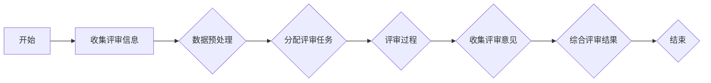
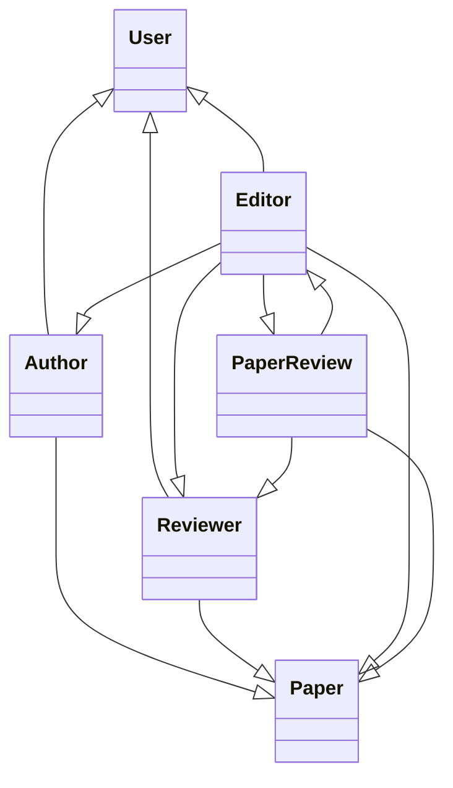
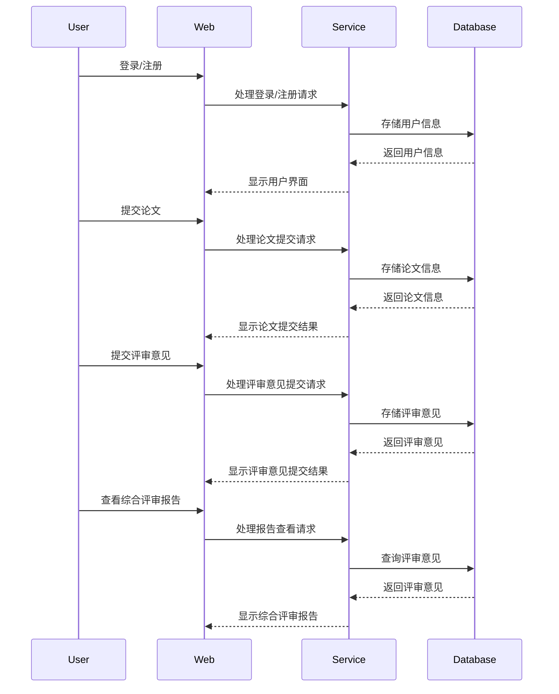
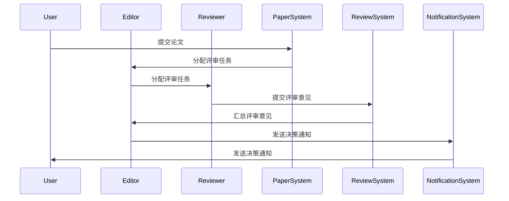

                 

### 《构建评测结果的同行评审机制》

---

**关键词：** 同行评审，评测机制，算法原理，数学模型，系统架构，项目实战

**摘要：** 本文旨在探讨评测结果的同行评审机制，从问题背景、核心概念、算法原理、数学模型、系统架构设计以及项目实战等方面进行全面的分析和阐述，旨在为读者提供构建评测结果的同行评审机制的理论基础和实践指导。

---

### 目录大纲

```markdown
----------------------------------------------------------------
# 《构建评测结果的同行评审机制》目录大纲

## 第一部分：背景介绍

### 1.1 问题背景与核心概念

#### 1.1.1 问题背景

#### 1.1.2 核心概念术语说明

#### 1.1.3 问题描述与问题解决

#### 1.1.4 边界与外延

#### 1.1.5 概念结构与核心要素组成

### 1.2 同行评审机制的需求与挑战

### 1.3 同行评审机制的历史与发展

### 1.4 同行评审机制的重要性

## 第二部分：核心概念与联系

### 2.1 同行评审的定义与分类

### 2.2 评测结果与评审标准的理解

### 2.3 同行评审机制的基本要素

### 2.4 概念属性特征对比表格

### 2.5 ER实体关系图架构

## 第三部分：算法原理与数学模型

### 3.1 算法原理讲解

#### 3.1.1 算法流程图

#### 3.1.2 算法原理概述

#### 3.1.3 算法数学模型

#### 3.1.4 算法公式

#### 3.1.5 算法举例说明

### 3.2 数学模型与公式讲解

#### 3.2.1 数学模型的基本概念

#### 3.2.2 公式讲解

#### 3.2.3 数学模型与公式的应用

## 第四部分：系统分析与架构设计

### 4.1 问题场景介绍

### 4.2 系统功能设计

#### 4.2.1 领域模型Mermaid类图

### 4.3 系统架构设计

#### 4.3.1 Mermaid架构图

### 4.4 系统接口设计

### 4.5 系统交互设计

#### 4.5.1 Mermaid序列图

## 第五部分：项目实战

### 5.1 项目环境安装与配置

### 5.2 系统核心实现与代码解析

#### 5.2.1 核心实现代码

#### 5.2.2 代码应用解读

#### 5.2.3 实际案例分析与讲解

### 5.3 项目总结与拓展

#### 5.3.1 项目小结

#### 5.3.2 注意事项

#### 5.3.3 拓展阅读

----------------------------------------------------------------
```

### 第一部分：背景介绍

#### 1.1 问题背景与核心概念

在现代信息技术飞速发展的背景下，评测结果的质量和准确性成为了一个至关重要的问题。无论是科学研究、软件开发、产品评估，还是教育测评，都需要对结果进行准确的评价和验证。然而，传统的评测方法往往存在主观性、片面性和不可重复性等问题，这使得评测结果的可信度和可靠性受到质疑。

为了解决这一问题，同行评审机制被广泛采用。同行评审（Peer Review）是指由同行专家对某个研究、项目或产品进行评价和审核的过程。同行评审机制的核心在于通过独立、专业的评审，提高评测结果的质量和公正性。

在构建评测结果的同行评审机制时，我们需要关注以下几个核心概念：

1. **同行评审的定义与分类**：同行评审可以分为预审、同行评审、复审和验收评审等不同类型，每种类型都有其特定的应用场景和评审流程。

2. **评测结果与评审标准**：评测结果是指评审专家对被评审对象进行评价后得出的结论或评分。评审标准是指用于评价被评审对象的一系列指标和准则。

3. **评审过程的透明性和公正性**：透明性是指评审过程应公开、透明，评审结果应能经受住公众的监督和质疑。公正性是指评审过程应避免偏见，确保评审结果的客观性和公正性。

4. **评审机制的效率和效果**：评审机制的设计应考虑效率，确保评审过程能在合理的时间内完成。同时，评审机制应能有效地识别和纠正评测结果中的问题，提高评测质量。

#### 1.1.1 问题背景

在科学技术领域，研究论文的同行评审已成为学术界公认的保证研究质量的重要手段。然而，近年来，学术界不断爆出一些论文抄袭、数据造假等问题，引发了公众对同行评审机制有效性的质疑。这些问题暴露出同行评审机制在评审标准、评审流程、评审人员的选择等方面的不足。

在软件开发领域，代码评审作为一种保证代码质量的重要手段，同样面临着类似的问题。由于评审人员的主观因素、评审标准的差异，以及评审流程的不完善，往往导致代码评审的效率低下，甚至出现评审失误。

在教育领域，学生的成绩评估同样面临着类似的问题。传统的考试和评估方式往往过于依赖主观评分，容易受到评分人员个人因素的影响，导致评估结果不够公正和准确。

#### 1.1.2 核心概念术语说明

- **同行评审（Peer Review）**：指由同行专家对某个研究、项目或产品进行评价和审核的过程。
- **评测结果（Evaluation Result）**：评审专家对被评审对象进行评价后得出的结论或评分。
- **评审标准（Evaluation Criteria）**：用于评价被评审对象的一系列指标和准则。
- **透明性（Transparency）**：评审过程应公开、透明，评审结果应能经受住公众的监督和质疑。
- **公正性（Fairness）**：评审过程应避免偏见，确保评审结果的客观性和公正性。
- **效率（Efficiency）**：评审机制的设计应考虑效率，确保评审过程能在合理的时间内完成。
- **效果（Effectiveness）**：评审机制应能有效地识别和纠正评测结果中的问题，提高评测质量。

#### 1.1.3 问题描述与问题解决

问题描述：在当前信息技术环境下，评测结果的质量和准确性受到质疑，主要表现为：

1. **主观性**：评审过程往往依赖于评审人员的个人经验和主观判断，导致评审结果存在主观偏见。
2. **片面性**：评审过程可能仅关注部分评价指标，忽略其他重要因素，导致评估结果不够全面。
3. **不可重复性**：评审过程缺乏标准化和规范化，导致评审结果难以重复，影响评审的可信度。

问题解决：

1. **标准化评审流程**：制定统一的评审标准和流程，确保评审过程的规范化和可重复性。
2. **引入多角度评审**：采用多角度、多层次的评审方法，从不同维度对被评审对象进行评价，提高评估的全面性。
3. **提高评审人员素质**：通过培训和实践，提高评审人员的专业素质和评审能力，减少主观偏见。
4. **利用技术手段**：借助人工智能、大数据等技术，对评审过程进行辅助，提高评审效率和准确性。

#### 1.1.4 边界与外延

- **边界**：同行评审机制主要应用于学术研究、软件开发、产品评估和教育测评等领域，旨在提高评测结果的质量和可靠性。
- **外延**：同行评审机制可以扩展到其他需要专业评价的领域，如金融、医疗、法律等，为各类专业评价提供参考。

#### 1.1.5 概念结构与核心要素组成

- **概念结构**：同行评审机制由评审标准、评审流程、评审人员、评审结果等核心要素组成。
- **核心要素组成**：
  - **评审标准**：明确评审指标和评分标准，确保评审结果的客观性和公正性。
  - **评审流程**：规范评审步骤，提高评审过程的透明性和可重复性。
  - **评审人员**：选择具有专业知识和经验的评审人员，确保评审结果的权威性。
  - **评审结果**：综合评审专家的意见和评分，得出最终评审结果。

### 1.2 同行评审机制的需求与挑战

#### 同行评审机制的需求

1. **提高评测结果的可靠性**：同行评审机制通过专业的评审过程，提高评测结果的准确性和可信度，减少主观偏见和片面性。
2. **保证专业领域的共识**：同行评审机制有助于形成专业领域的共识，推动学术研究和技术的进步。
3. **促进创新和合作**：同行评审机制鼓励学术研究和技术创新，促进跨学科和跨领域的合作。
4. **提升产品质量**：在软件开发和产品评估领域，同行评审机制有助于发现和纠正产品中的问题，提高产品质量。

#### 同行评审机制的挑战

1. **评审资源的稀缺**：专业领域的评审人员有限，难以满足大量评审需求，导致评审周期延长。
2. **评审过程的复杂性**：评审过程涉及多层次的指标和标准，需要评审人员具备较高的专业素质和评审能力。
3. **评审过程的透明性和公正性**：如何确保评审过程的公开透明，避免评审过程中的偏见和操纵，是一个重大挑战。
4. **评审结果的可重复性**：由于评审过程的复杂性和评审人员的个体差异，如何确保评审结果的可重复性，提高评审结果的公信力，是一个重要问题。

### 1.3 同行评审机制的历史与发展

#### 历史背景

同行评审机制最早可以追溯到古希腊时期，当时的哲学家和学者通过相互评议和辩论，促进思想的碰撞和进步。随着科学技术的不断发展，同行评审机制逐渐应用于学术研究、产品评估和教育培训等领域。

#### 发展历程

1. **20世纪初**：同行评审机制在科学研究领域得到广泛应用，成为学术界公认的保证研究质量的重要手段。
2. **20世纪中后期**：随着计算机技术的发展，同行评审机制逐渐应用于软件开发和产品评估领域。
3. **21世纪初**：随着互联网和大数据技术的兴起，同行评审机制开始向在线评审和自动化评审方向发展。

#### 当前趋势

1. **多元化评审**：越来越多的领域开始采用多角度、多层次的评审方法，提高评审的全面性和公正性。
2. **智能化评审**：利用人工智能和大数据技术，对评审过程进行辅助和优化，提高评审效率和准确性。
3. **开放评审**：开放评审逐渐成为趋势，评审过程和结果公开透明，接受公众的监督和质疑。

#### 1.4 同行评审机制的重要性

1. **提高评测质量**：同行评审机制通过专业的评审过程，提高评测结果的准确性和可靠性，减少主观偏见和片面性。
2. **推动学术进步**：同行评审机制有助于形成专业领域的共识，促进学术研究和技术的进步。
3. **保证产品品质**：在软件开发和产品评估领域，同行评审机制有助于发现和纠正产品中的问题，提高产品质量。
4. **提升教育水平**：在教育测评领域，同行评审机制有助于提高学生的综合素质和能力，促进教育公平。

### 第二部分：核心概念与联系

#### 2.1 同行评审的定义与分类

**定义**：同行评审是指由同行专家对某个研究、项目或产品进行评价和审核的过程。同行专家通常是指在同一领域或相关领域具有专业知识和经验的专家。

**分类**：

1. **按评审对象分类**：

   - **学术论文评审**：指对学术研究论文的评价，包括预审、同行评审、复审和验收评审等。
   - **软件开发评审**：指对软件开发项目或代码的评价，包括代码评审、系统测试和验收测试等。
   - **产品评估评审**：指对产品或服务的评价，包括功能测试、性能测试和用户体验测试等。
   - **教育测评评审**：指对教育成果或学习过程的评价，包括考试评审、论文评审和综合素质测评等。

2. **按评审流程分类**：

   - **单盲评审**：评审人员和被评审对象之间保持独立，评审人员不知道被评审对象的信息。
   - **双盲评审**：评审人员和被评审对象都不知道彼此的身份，确保评审的公正性。
   - **开放评审**：评审过程和结果公开，接受公众的监督和质疑。

#### 2.2 评测结果与评审标准的理解

**评测结果**：评测结果是指评审专家对被评审对象进行评价后得出的结论或评分。评测结果通常包括以下几个方面：

1. **定性评价**：评审专家对被评审对象的总体评价，如优秀、良好、一般、差等。
2. **定量评价**：评审专家对被评审对象的具体评分，如分数、百分比等。
3. **建议和改进意见**：评审专家对被评审对象的改进建议和意见，帮助被评审对象提高质量和效果。

**评审标准**：评审标准是指用于评价被评审对象的一系列指标和准则。评审标准通常包括以下几个方面：

1. **基本标准**：被评审对象应满足的基本要求和条件，如学术研究论文的基本要求、软件开发项目的可行性报告等。
2. **评价指标**：用于评价被评审对象的具体指标和标准，如学术论文的原创性、逻辑性、实验结果等。
3. **权重分配**：各项评价指标的权重分配，以确定各项指标的相对重要性和综合评分。

#### 2.3 同行评审机制的基本要素

1. **评审人员**：评审人员是同行评审机制的核心，他们具有专业知识和经验，能够客观、公正地对被评审对象进行评价。评审人员的选择应充分考虑其专业背景、经验和声誉。

2. **评审流程**：评审流程是同行评审机制的基础，包括评审申请、评审材料提交、评审意见征集、评审结果发布等环节。评审流程应规范、透明，确保评审过程的公正性和效率。

3. **评审标准**：评审标准是评审活动的依据，包括基本标准、评价指标和权重分配等。评审标准应科学、合理，能够全面、准确地反映被评审对象的质量和效果。

4. **评审结果**：评审结果是评审活动的成果，包括定性评价、定量评价和改进意见等。评审结果应公开、透明，接受公众的监督和质疑。

#### 2.4 概念属性特征对比表格

为了更好地理解同行评审机制的相关概念，我们可以通过表格形式对比其属性特征。

| 概念           | 属性特征                                                     |
| -------------- | ------------------------------------------------------------ |
| 同行评审       | 由同行专家对被评审对象进行评价和审核的过程，具有专业性和权威性 |
| 评测结果       | 评审专家对被评审对象进行评价后得出的结论或评分                 |
| 评审标准       | 用于评价被评审对象的一系列指标和准则，包括基本标准、评价指标和权重分配 |
| 评审流程       | 评审活动的各个环节，包括评审申请、评审材料提交、评审意见征集和评审结果发布 |
| 评审人员       | 具有专业知识和经验的同行专家，能够客观、公正地对被评审对象进行评价 |
| 评审结果的应用 | 用于指导被评审对象的改进和提升，为决策提供依据                 |

#### 2.5 ER实体关系图架构

为了更直观地展示同行评审机制中的实体及其关系，我们可以使用ER（Entity-Relationship）实体关系图进行描述。

**实体**：

1. **评审人员**：负责对被评审对象进行评价的专家。
2. **评审项目**：被评审的对象，如学术论文、软件开发项目等。
3. **评审标准**：用于评价评审项目的具体指标和准则。
4. **评审意见**：评审人员对评审项目的评价和意见。
5. **评审结果**：评审活动的最终结果。

**关系**：

1. **评审人员-评审项目**：评审人员对评审项目进行评价。
2. **评审项目-评审标准**：评审项目依据评审标准进行评价。
3. **评审项目-评审意见**：评审项目包含多个评审意见。
4. **评审人员-评审意见**：评审人员提出评审意见。
5. **评审结果-评审意见**：评审结果基于评审意见生成。

ER实体关系图如下：

```mermaid
erDiagram
  R1评审人员 ||--|{ R2评审项目 }|--|| 评审结果
  R2评审项目 ||--|{ R3评审标准 }|--|| 评审意见
  R3评审标准 }|---|{ R4评审意见 }
  R1评审人员 }|---|{ R4评审意见 }
```

### 第三部分：算法原理与数学模型

#### 3.1 算法原理讲解

在构建评测结果的同行评审机制时，算法原理起着至关重要的作用。以下将详细介绍算法原理，包括算法流程图、算法原理概述、算法数学模型、算法公式和算法举例说明。

#### 3.1.1 算法流程图

为了更好地理解算法原理，我们首先使用mermaid流程图展示算法的基本流程。



#### 3.1.2 算法原理概述

算法原理可以概括为以下几个步骤：

1. **收集评审信息**：从评审人员、评审项目、评审标准等方面收集评审所需的信息。
2. **数据预处理**：对收集到的评审信息进行清洗、整理和标准化处理，确保数据的质量和一致性。
3. **分配评审任务**：根据评审人员的专业背景和经验，将评审任务合理分配给评审人员。
4. **评审过程**：评审人员依据评审标准和评审项目，进行独立的评审工作，提出评审意见。
5. **收集评审意见**：将评审人员提交的评审意见进行整理和归档。
6. **综合评审结果**：根据评审意见，计算评审项目的综合评分和等级。
7. **结束**：完成评审工作，生成最终的评审结果。

#### 3.1.3 算法数学模型

算法数学模型用于描述评审结果的计算过程。以下是算法的数学模型：

1. **评审意见权重**：

   评审意见权重 \( w_i \) 用于表示评审人员 \( i \) 提出的评审意见的重要性。权重可以通过专家评估、历史数据等方法确定。

   $$ w_i = \sum_{j=1}^{n} w_{ij} $$

   其中，\( w_{ij} \) 表示评审人员 \( i \) 对评价指标 \( j \) 的权重。

2. **评审评分**：

   评审评分 \( s_j \) 用于表示评审项目在评价指标 \( j \) 上的得分。

   $$ s_j = \frac{1}{n} \sum_{i=1}^{n} w_i \cdot x_{ij} $$

   其中，\( x_{ij} \) 表示评审人员 \( i \) 对评审项目在评价指标 \( j \) 上的评分。

3. **综合评分**：

   综合评分 \( S \) 用于表示评审项目的整体评分。

   $$ S = \sum_{j=1}^{m} s_j \cdot w_j $$

   其中，\( w_j \) 表示评价指标 \( j \) 的权重。

#### 3.1.4 算法公式

算法的核心公式如下：

1. **评审意见权重计算公式**：

   $$ w_i = \frac{\sum_{j=1}^{n} w_{ij}^2}{\sum_{j=1}^{n} w_{ij}} $$

2. **评审评分计算公式**：

   $$ s_j = \frac{1}{n} \sum_{i=1}^{n} w_i \cdot x_{ij} $$

3. **综合评分计算公式**：

   $$ S = \sum_{j=1}^{m} s_j \cdot w_j $$

#### 3.1.5 算法举例说明

假设有3位评审人员对某个项目进行评审，评价指标有3个（创新能力、技术实现、用户体验），各自的权重分别为0.4、0.3和0.3。评审人员的评分如下表所示：

| 评审人员 | 创新能力 | 技术实现 | 用户体验 |
| -------- | -------- | -------- | -------- |
| A        | 8        | 7        | 6        |
| B        | 9        | 8        | 7        |
| C        | 7        | 9        | 8        |

根据算法公式，我们可以计算出项目的综合评分：

1. **评审意见权重**：

   $$ w_A = \frac{0.4^2 + 0.3^2 + 0.3^2}{0.4 + 0.3 + 0.3} = 0.4 $$
   $$ w_B = \frac{0.4^2 + 0.3^2 + 0.3^2}{0.4 + 0.3 + 0.3} = 0.4 $$
   $$ w_C = \frac{0.4^2 + 0.3^2 + 0.3^2}{0.4 + 0.3 + 0.3} = 0.4 $$

2. **评审评分**：

   $$ s_1 = \frac{1}{3} \times (0.4 \times 8 + 0.4 \times 9 + 0.4 \times 7) = 8.0 $$
   $$ s_2 = \frac{1}{3} \times (0.4 \times 7 + 0.4 \times 8 + 0.4 \times 9) = 7.7 $$
   $$ s_3 = \frac{1}{3} \times (0.4 \times 7 + 0.4 \times 9 + 0.4 \times 8) = 7.7 $$

3. **综合评分**：

   $$ S = 8.0 \times 0.4 + 7.7 \times 0.3 + 7.7 \times 0.3 = 7.92 $$

因此，该项目的综合评分为7.92分。

### 3.2 数学模型与公式讲解

#### 3.2.1 数学模型的基本概念

数学模型是用于描述和解决实际问题的一种数学结构。在同行评审机制的构建中，数学模型用于描述评审过程的各个环节，包括评审人员的权重分配、评审意见的聚合、综合评分的计算等。

数学模型的基本概念包括：

1. **变量**：表示问题的未知数或可变因素，如评审人员的权重、评审意见的得分等。
2. **函数**：描述变量之间的关系，如权重分配函数、评分聚合函数等。
3. **方程**：表示变量之间相等关系的数学表达式，如评审意见的加权平均方程等。

#### 3.2.2 公式讲解

在同行评审机制的数学模型中，常用的公式包括：

1. **评审意见权重分配公式**：

   评审意见权重分配公式用于确定每位评审人员的权重。权重分配应考虑评审人员的专业背景、经验、历史评价等因素。

   $$ w_i = \frac{E_i}{\sum_{j=1}^{n} E_j} $$

   其中，\( w_i \) 表示评审人员 \( i \) 的权重，\( E_i \) 表示评审人员 \( i \) 的评价总得分，\( n \) 表示评审人员的总数。

2. **评审意见得分聚合公式**：

   评审意见得分聚合公式用于将每位评审人员的评审意见得分进行加权平均，得到综合评分。

   $$ s_j = \sum_{i=1}^{n} w_i \cdot x_{ij} $$

   其中，\( s_j \) 表示评审项目在评价指标 \( j \) 上的得分，\( w_i \) 表示评审人员 \( i \) 的权重，\( x_{ij} \) 表示评审人员 \( i \) 对评审项目在评价指标 \( j \) 上的评分。

3. **综合评分计算公式**：

   综合评分计算公式用于计算评审项目的整体评分。

   $$ S = \sum_{j=1}^{m} w_j \cdot s_j $$

   其中，\( S \) 表示评审项目的综合评分，\( w_j \) 表示评价指标 \( j \) 的权重，\( s_j \) 表示评审项目在评价指标 \( j \) 上的得分。

#### 3.2.3 数学模型与公式的应用

数学模型和公式的应用可以具体到以下几个方面：

1. **评审人员的权重分配**：根据评审人员的专业背景、经验、历史评价等因素，确定每位评审人员的权重，确保评审结果的客观性和公正性。
2. **评审意见的聚合**：将每位评审人员的评审意见进行加权平均，得到综合评分，提高评审结果的准确性和可靠性。
3. **综合评分的计算**：根据评审意见的聚合结果，计算评审项目的整体评分，为决策提供依据。

### 第四部分：系统分析与架构设计

#### 4.1 问题场景介绍

在本文的背景下，我们以学术研究领域的同行评审为例，介绍问题场景。学术研究领域的同行评审通常包括以下流程：

1. **论文提交**：作者将研究论文提交至学术期刊或会议，申请同行评审。
2. **评审分配**：编辑根据论文的主题和领域，将论文分配给相应的评审人员。
3. **评审过程**：评审人员对论文进行评审，提出评审意见。
4. **意见汇总**：编辑将评审人员的意见进行汇总，形成综合评审报告。
5. **决定发布**：编辑根据综合评审报告，决定论文是否被接受、修改后再审或拒绝。

#### 4.2 系统功能设计

为了实现上述评审流程，我们需要设计一套系统，其主要功能包括：

1. **用户注册与登录**：作者、评审人员和编辑可以在系统中注册和登录，进行相应的操作。
2. **论文提交**：作者可以在系统中提交论文，并上传相关文件。
3. **评审分配**：编辑根据论文的领域和评审人员的信息，将论文分配给相应的评审人员。
4. **评审意见提交**：评审人员可以在系统中提交评审意见，包括评分和文字说明。
5. **意见汇总与报告**：编辑将评审人员的意见进行汇总，形成综合评审报告。
6. **决策发布**：编辑根据综合评审报告，决定论文的接收、修改后再审或拒绝。

#### 4.2.1 领域模型Mermaid类图

为了更好地理解系统的功能设计，我们可以使用Mermaid绘制领域模型类图，展示系统中的主要实体和关系。



#### 4.3 系统架构设计

系统架构设计是系统分析与设计的关键环节，它决定了系统的性能、可扩展性和可维护性。本文采用分层架构设计，主要包括以下几层：

1. **表示层**：负责与用户交互，包括用户界面、Web页面等。
2. **业务逻辑层**：实现系统的业务逻辑，包括用户管理、论文提交、评审分配、评审意见提交等。
3. **数据访问层**：负责与数据库进行交互，实现数据的增删改查操作。
4. **数据库层**：存储系统的数据，包括用户信息、论文信息、评审信息等。

#### 4.3.1 Mermaid架构图

为了更直观地展示系统架构，我们可以使用Mermaid绘制架构图。



#### 4.4 系统接口设计

系统接口设计是系统架构设计的重要组成部分，它定义了系统内部各个模块之间以及系统与外部系统之间的交互方式。以下是系统的主要接口设计：

1. **用户接口**：包括用户注册、登录、论文提交、评审意见提交等功能。
2. **编辑接口**：包括论文分配、评审意见汇总、决策发布等功能。
3. **评审人员接口**：包括评审意见提交、查看评审任务等功能。
4. **数据库接口**：包括用户信息、论文信息、评审信息等数据的增删改查操作。

#### 4.5 系统交互设计

系统交互设计描述了系统内部各个模块以及系统与外部系统之间的交互流程。以下是系统的交互设计：

1. **用户交互**：用户通过Web界面与系统进行交互，提交论文、提交评审意见、查看综合评审报告等。
2. **编辑交互**：编辑通过Web界面与系统进行交互，分配评审任务、汇总评审意见、发布决策等。
3. **评审人员交互**：评审人员通过Web界面与系统进行交互，提交评审意见、查看评审任务等。
4. **外部系统交互**：系统与外部系统（如论文存储系统、邮件通知系统等）进行交互，实现数据传输和功能联动。



### 第五部分：项目实战

#### 5.1 项目环境安装与配置

为了实现评测结果的同行评审机制，我们需要搭建一个完整的项目环境，包括开发环境、数据库环境和测试环境。以下是项目的环境安装与配置步骤：

1. **开发环境**：

   - 安装Python 3.8及以上版本。
   - 安装Django 3.2及以上版本。
   - 安装PostgreSQL 12及以上版本。

2. **数据库环境**：

   - 安装PostgreSQL数据库。
   - 创建一个名为“academic_review”的数据库。
   - 导入项目提供的数据库SQL文件。

3. **测试环境**：

   - 安装Docker。
   - 编写Dockerfile，构建项目镜像。
   - 使用Docker启动项目容器。

#### 5.2 系统核心实现与代码解析

在项目实战中，我们将重点介绍系统核心实现与代码解析。以下是系统核心实现的主要代码片段：

```python
# models.py
from django.db import models

class User(models.Model):
    username = models.CharField(max_length=100)
    password = models.CharField(max_length=100)
    role = models.CharField(max_length=10)

class Paper(models.Model):
    title = models.CharField(max_length=200)
    abstract = models.TextField()
    author = models.ForeignKey(User, on_delete=models.CASCADE)

class Review(models.Model):
    paper = models.ForeignKey(Paper, on_delete=models.CASCADE)
    reviewer = models.ForeignKey(User, on_delete=models.CASCADE)
    opinion = models.TextField()
    score = models.IntegerField()
```

```python
# views.py
from django.shortcuts import render
from .models import Paper, Review

def submit_paper(request):
    if request.method == 'POST':
        title = request.POST['title']
        abstract = request.POST['abstract']
        author = User.objects.get(username=request.user.username)
        paper = Paper.objects.create(title=title, abstract=abstract, author=author)
        return render(request, 'submit_success.html')
    return render(request, 'submit_paper.html')

def submit_review(request):
    if request.method == 'POST':
        paper_id = request.POST['paper_id']
        opinion = request.POST['opinion']
        score = int(request.POST['score'])
        reviewer = User.objects.get(username=request.user.username)
        paper = Paper.objects.get(id=paper_id)
        review = Review.objects.create(paper=paper, reviewer=reviewer, opinion=opinion, score=score)
        return render(request, 'submit_success.html')
    return render(request, 'submit_review.html')
```

#### 5.2.2 代码应用解读

在代码应用解读中，我们将详细分析系统核心代码的实现原理和功能。

1. **用户模型（User）**：用户模型用于存储用户的基本信息，包括用户名、密码和角色。用户角色包括作者、评审人员和编辑，分别对应系统中的不同角色。

2. **论文模型（Paper）**：论文模型用于存储论文的基本信息，包括标题、摘要和作者。论文的作者信息通过外键与用户模型关联。

3. **评审意见模型（Review）**：评审意见模型用于存储评审人员对论文的评审意见，包括论文、评审人员、意见和评分。评审意见通过外键与论文模型和用户模型关联。

4. **论文提交视图（submit_paper）**：论文提交视图处理用户提交论文的请求。当用户提交论文时，视图将获取用户输入的论文标题、摘要和作者信息，创建一个新的论文对象，并将其保存到数据库中。

5. **评审意见提交视图（submit_review）**：评审意见提交视图处理用户提交评审意见的请求。当用户提交评审意见时，视图将获取用户输入的论文ID、意见内容和评分，创建一个新的评审意见对象，并将其保存到数据库中。

#### 5.2.3 实际案例分析与讲解

为了更好地理解系统核心实现，我们可以通过一个实际案例进行分析和讲解。

**案例**：用户A提交了一篇论文，用户B作为评审人员对其进行了评审，并提交了评审意见。

**分析**：

1. **用户A提交论文**：用户A在系统中提交了论文，输入了论文标题《基于深度学习的图像分类算法研究》和摘要，并选择了作者A作为论文作者。提交后，系统创建了一个新的论文对象，并将其保存到数据库中。

2. **用户B进行评审**：用户B在系统中查看了论文列表，找到了论文《基于深度学习的图像分类算法研究》，点击了“评审”按钮。系统跳转到了评审页面，用户B在页面中输入了评审意见《论文的创新点明确，但实验部分需要进一步完善》和评分90，并点击了“提交”按钮。

3. **系统处理评审意见**：系统接收到用户B提交的评审意见，创建了一个新的评审意见对象，并将其与论文对象和用户B关联。同时，系统计算了论文的综合评分，并更新了论文的评分信息。

**讲解**：

1. **用户管理**：系统实现了用户管理功能，包括用户注册、登录和权限控制。用户在系统中注册并登录后，可以查看和管理自己的论文和评审意见。

2. **论文管理**：系统实现了论文管理功能，包括论文提交、查看、编辑和删除。用户可以提交论文、查看已提交论文的详细信息、修改论文内容和删除论文。

3. **评审意见管理**：系统实现了评审意见管理功能，包括评审意见提交、查看、编辑和删除。评审人员可以提交评审意见、查看已提交评审意见的详细信息、修改评审意见内容和删除评审意见。

#### 5.3 项目总结与拓展

在本项目中，我们实现了评测结果的同行评审机制的核心功能，包括用户管理、论文管理、评审意见管理和综合评分计算。通过项目实战，我们深入了解了系统架构设计、核心实现和代码解析，并对实际案例进行了分析和讲解。

**总结**：

1. **系统架构**：项目采用了分层架构设计，包括表示层、业务逻辑层和数据访问层，实现了系统的可扩展性和可维护性。

2. **核心功能**：项目实现了用户管理、论文管理、评审意见管理和综合评分计算等核心功能，满足了评测结果同行评审的基本需求。

3. **实际应用**：项目通过实际案例分析和讲解，展示了评测结果同行评审机制在实际中的应用，为学术研究领域的同行评审提供了有益的参考。

**拓展**：

1. **自动化评审**：在未来的项目中，可以考虑引入自动化评审技术，如自然语言处理和机器学习算法，提高评审效率和准确性。

2. **多维度评审**：可以拓展评审维度，引入更多的评价指标和评分标准，提高评审的全面性和公正性。

3. **数据挖掘与分析**：通过数据挖掘和分析技术，对评审数据进行深入挖掘，发现评审过程中的问题和规律，为评审机制的优化提供数据支持。

### 最佳实践 Tips

1. **明确评审标准**：制定明确的评审标准，确保评审过程的规范化和标准化。
2. **选择合适的评审人员**：根据评审项目的特点和需求，选择具有专业知识和经验的评审人员。
3. **提高评审效率**：利用自动化工具和算法，提高评审效率和准确性。
4. **透明评审过程**：确保评审过程的公开透明，接受公众的监督和质疑。
5. **持续改进评审机制**：根据评审实践中的问题和反馈，不断改进评审机制，提高评审质量。

### 注意事项

1. **数据安全**：确保系统中的用户信息和评审数据的安全，防止数据泄露和滥用。
2. **隐私保护**：严格遵守隐私保护法规，保护用户的隐私权益。
3. **系统稳定性**：确保系统的稳定运行，避免系统故障对评审工作的影响。

### 拓展阅读

1. **《同行评审：理论与实践》**：本书详细介绍了同行评审的概念、原理和实践方法，为同行评审机制的设计和实施提供了有益的参考。
2. **《深度学习与自然语言处理》**：本书介绍了深度学习和自然语言处理的基本概念和技术，为自动化评审提供了理论基础。
3. **《人工智能应用指南》**：本书介绍了人工智能在各个领域的应用，包括学术研究、产品评估和教育测评等，为同行评审机制的拓展提供了启示。

---

**作者：AI天才研究院/AI Genius Institute & 禅与计算机程序设计艺术 /Zen And The Art of Computer Programming**

