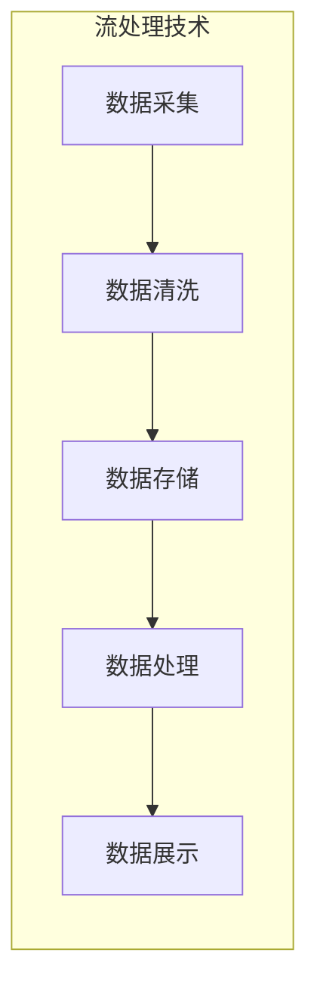
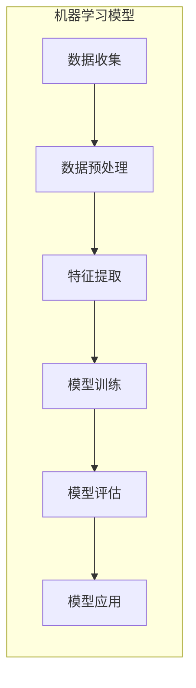
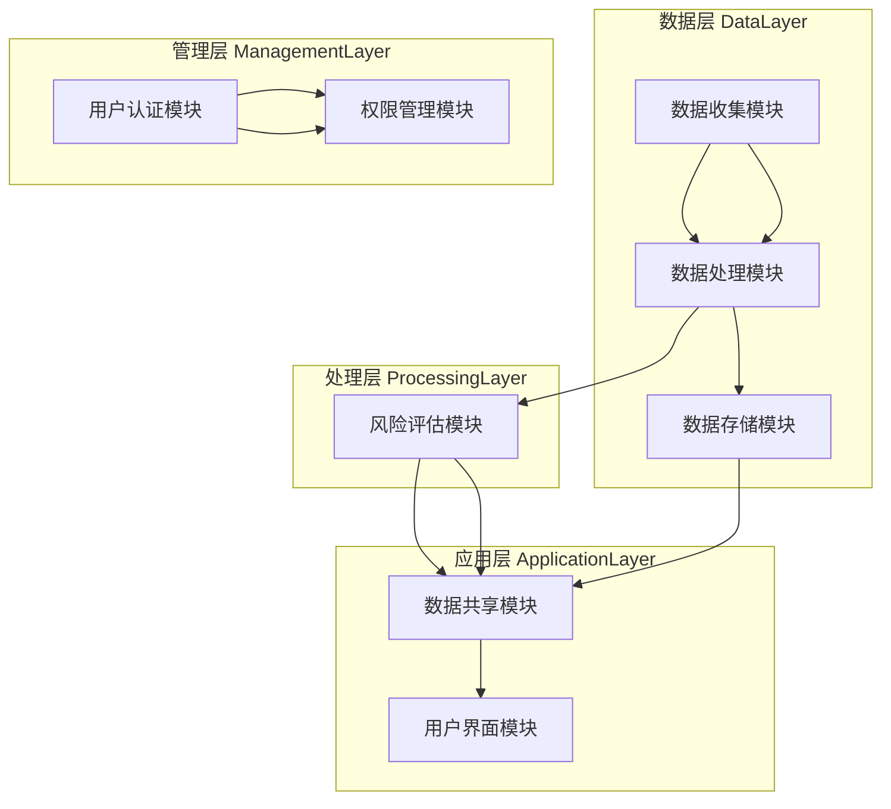
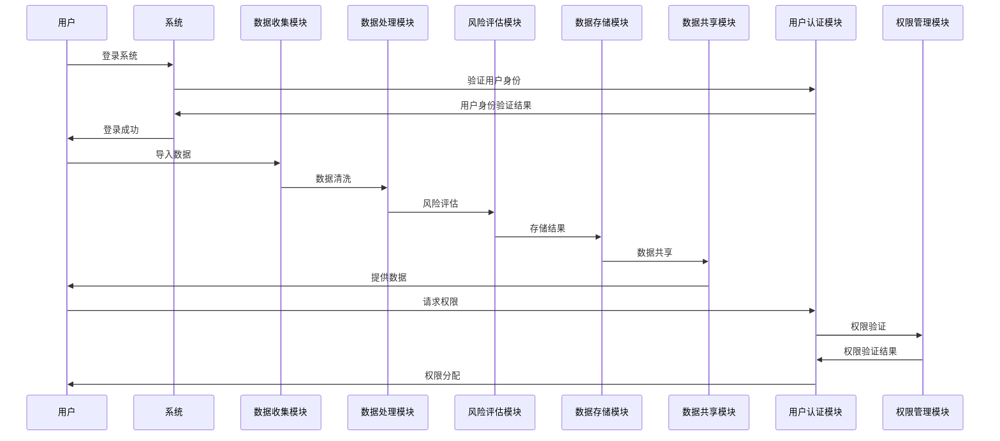
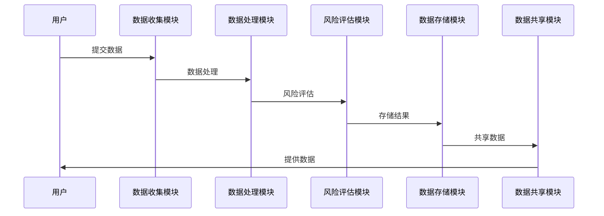

                 

### 第一部分：背景与基础

#### 第1章：实时协作平台概述

**1.1 问题背景**

在当今的信息时代，数据成为了各个行业的核心资产。随着数据量的爆炸性增长，如何高效地处理、分析和共享数据，已经成为企业决策支持的关键。尤其是在金融、医疗、教育等需要快速响应和决策的行业，评测结果的实时共享显得尤为重要。

**1.1.1 实时协作的重要性**

实时协作能够使团队成员迅速获取最新的评测结果，进行协作分析，从而做出更为准确的决策。这种协作不仅提高了工作效率，也增强了团队间的沟通与协作，是现代企业信息化建设的必备手段。

**1.1.2 评测结果的实时共享需求**

评测结果的实时共享需求体现在多个方面：

- **快速响应**：及时获取评测结果，确保决策的实时性和准确性。
- **跨部门协作**：不同部门之间的协作需要共享数据，实现信息的无缝对接。
- **远程协作**：远程工作的普及，使得团队成员需要实时共享评测结果，以保持工作的连续性。

**1.1.3 实时协作平台的价值**

实时协作平台的价值在于：

- **提升决策效率**：通过实时协作，团队成员可以快速响应，提高决策速度。
- **增强协作能力**：实时共享评测结果，促进了团队之间的紧密协作。
- **优化资源配置**：实时数据分析和决策，有助于优化资源配置，降低运营成本。

**1.2 问题描述**

如何高效地构建一个实时协作平台来处理和共享评测结果，是当前企业面临的一个挑战。具体问题包括：

- **数据处理能力**：如何处理海量数据，保证实时性。
- **系统架构设计**：如何设计一个可靠、高效、易扩展的系统架构。
- **数据隐私和安全**：如何确保评测结果的安全性，防止数据泄露。

**1.3 问题解决**

针对上述问题，我们需要从以下几个方面来解决问题：

- **技术选型**：选择适合的实时数据处理技术和工具。
- **架构设计**：设计一个高效、可靠、易扩展的系统架构。
- **关键技术研究**：深入研究实时数据处理的核心技术，如流处理技术和机器学习模型。
- **实施步骤**：制定详细的实施计划，确保项目顺利进行。

**1.4 边界与外延**

在构建实时协作平台时，我们还需要考虑以下几个方面：

- **行业适用性**：实时协作平台需要根据不同行业的特点进行定制。
- **技术限制**：当前技术的发展水平对实时协作平台的设计和实现有一定限制。
- **数据隐私问题**：在数据传输和处理过程中，需要采取有效的安全措施，确保数据隐私。

**1.4.1 行业适用性**

实时协作平台可以适用于多个行业，如金融、医疗、教育、零售等。不同行业的数据特点和需求不同，需要根据实际情况进行定制。

**1.4.2 技术限制**

实时协作平台的技术实现受到当前技术水平的影响，如数据处理速度、存储容量、网络安全等。我们需要在这些方面进行权衡和优化。

**1.4.3 数据隐私问题**

数据隐私是构建实时协作平台时需要重点关注的问题。我们需要采取有效的数据加密、访问控制和审计措施，确保评测结果的安全。

**1.5 概念结构与核心要素组成**

实时协作平台的核心组成部分包括：

- **数据收集模块**：负责收集各类评测数据。
- **数据处理模块**：负责对收集到的数据进行处理和分析。
- **数据存储模块**：负责存储处理后的评测结果。
- **数据共享模块**：负责将评测结果实时共享给相关人员。
- **数据可视化模块**：负责将评测结果以图表等形式展示出来，方便用户进行数据分析。

综上所述，构建一个高效的实时协作平台需要综合考虑多个方面，从技术选型、架构设计到关键技术研究，再到实施步骤，都需要进行详细的规划和实施。只有这样，才能构建出一个满足企业需求、高效可靠的实时协作平台。

#### 第2章：核心概念与联系

**2.1 实时协作平台**

**2.1.1 定义与功能**

实时协作平台是一种用于支持团队成员实时共享信息、协同工作的技术系统。它通常包括以下功能：

- **实时数据同步**：确保团队成员可以实时查看和修改数据。
- **协作工具集成**：提供聊天、视频会议、文件共享等协作工具。
- **权限管理**：控制不同用户对数据的访问权限。
- **任务管理**：跟踪项目进度，分配任务，管理团队工作。

**2.1.2 优势与挑战**

实时协作平台的优势包括：

- **提高工作效率**：实时共享信息，减少沟通成本，提高决策速度。
- **增强团队协作**：促进团队成员之间的沟通与协作。
- **数据一致性**：多人同时编辑数据，确保数据的一致性。

实时协作平台面临的挑战包括：

- **数据同步延迟**：特别是在大规模数据传输时，可能会出现延迟。
- **数据安全**：如何确保数据在传输和存储过程中的安全。
- **系统扩展性**：如何设计一个可扩展的系统架构，以适应不断增长的数据量和用户数量。

**2.1.3 平台类型比较**

根据应用场景和技术特点，实时协作平台可以分为以下几种类型：

- **企业内部协作平台**：主要用于企业内部团队之间的协作，如腾讯通、钉钉等。
- **项目管理平台**：主要用于项目管理，如JIRA、Trello等。
- **社交协作平台**：结合社交网络功能，支持广泛的协作，如Slack、Facebook Workplace等。
- **行业专用平台**：针对特定行业需求设计的平台，如医疗协作平台、金融交易系统等。

**2.2 评测结果**

**2.2.1 定义与类型**

评测结果是对某项任务或项目进行评估后得到的结果，通常包括定量和定性数据。根据数据类型，评测结果可以分为以下几种类型：

- **定量数据**：如成绩、评分、销售额等，可以用数字表示。
- **定性数据**：如评价、报告、用户反馈等，通常用文字描述。

**2.2.2 应用场景**

评测结果广泛应用于各个领域，如：

- **教育领域**：对学生成绩、课程效果的评估。
- **商业领域**：对市场表现、销售业绩的评估。
- **科研领域**：对实验结果、论文质量的评估。
- **运维领域**：对系统性能、服务质量进行评估。

**2.2.3 特点与要求**

评测结果具有以下特点：

- **客观性**：评测结果应该是客观的，尽量避免主观偏见。
- **准确性**：评测结果应准确反映被评估对象的真实情况。
- **及时性**：对于需要快速响应的场景，评测结果应具有实时性。

对评测结果的要求包括：

- **标准化**：制定统一的评测标准和流程。
- **可重复性**：评测结果应能在相同条件下重复获得。
- **可解释性**：评测结果应易于理解和解释。

**2.3 实时数据处理**

**2.3.1 原理与技术**

实时数据处理是指对数据流进行实时采集、处理和分析的过程。其核心原理包括：

- **数据流采集**：从各种数据源实时获取数据。
- **数据处理**：对数据进行清洗、转换和聚合等操作。
- **数据存储**：将处理后的数据存储起来，以便后续分析和查询。

实时数据处理的技术主要包括：

- **流处理技术**：如Apache Kafka、Apache Flink等，用于处理实时数据流。
- **批处理技术**：如Hadoop、Spark等，用于处理大规模历史数据。
- **时间序列分析**：用于处理和时间相关性的数据，如股票价格、传感器数据等。

**2.3.2 挑战与解决方案**

实时数据处理面临的挑战包括：

- **数据延迟**：如何减少数据传输和处理延迟，确保实时性。
- **数据完整性**：在数据传输过程中，如何确保数据的一致性和完整性。
- **数据安全**：如何保证数据在传输和存储过程中的安全性。

对应的解决方案包括：

- **分布式系统**：通过分布式架构，提高数据处理速度和系统可靠性。
- **数据复制和备份**：通过数据复制和备份，确保数据的完整性和可用性。
- **加密传输**：使用加密技术，保护数据在传输过程中的安全性。

**2.4 数据隐私和安全**

**2.4.1 重要性**

数据隐私和安全是构建实时协作平台时需要重点关注的问题。其重要性体现在以下几个方面：

- **保护用户隐私**：确保用户的个人信息和评测结果不被泄露。
- **维护数据完整性**：防止数据在传输和存储过程中被篡改。
- **保障业务安全**：防止恶意攻击和数据泄露，确保业务的连续性和稳定性。

**2.4.2 保护措施**

为了保护数据隐私和安全，可以采取以下措施：

- **数据加密**：使用加密技术，对数据进行加密存储和传输。
- **访问控制**：通过访问控制，限制对数据的访问权限。
- **审计与监控**：实时监控数据访问和操作行为，记录审计日志，以便在发生问题时进行追踪和调查。
- **安全培训**：定期对员工进行安全培训，提高他们的安全意识。

**2.4.3 法律法规**

数据隐私和安全也受到相关法律法规的保护，如《中华人民共和国网络安全法》、《欧盟通用数据保护条例》（GDPR）等。企业在构建实时协作平台时，需要遵守相关法律法规，确保数据安全和用户隐私。

**2.5 概念属性特征对比表格**

为了更好地理解实时协作平台、评测结果、实时数据处理和数据隐私与安全的特性，我们可以通过以下表格进行对比：

| 概念         | 定义                                                         | 特性                                                         | 关联                                                     |
| ------------ | ------------------------------------------------------------ | ------------------------------------------------------------ | -------------------------------------------------------- |
| 实时协作平台 | 支持团队成员实时共享信息、协同工作的技术系统                 | 提高工作效率、增强团队协作、数据一致性                       | 需要解决数据同步延迟、数据安全、系统扩展性等挑战             |
| 评测结果     | 对某项任务或项目进行评估后得到的结果，包括定量和定性数据     | 客观性、准确性、及时性                                       | 需要标准化、可重复性和可解释性                             |
| 实时数据处理 | 对数据流进行实时采集、处理和分析的过程                     | 数据流采集、数据处理、数据存储                               | 需要解决数据延迟、数据完整性、数据安全等挑战                 |
| 数据隐私和安全 | 保护用户隐私、维护数据完整性、保障业务安全的技术和措施      | 数据加密、访问控制、审计与监控、安全培训                     | 需要遵守相关法律法规，如《中华人民共和国网络安全法》和GDPR |

**2.6 ER实体关系图**

为了更清晰地描述实时协作平台的数据流程和实体关系，我们可以使用ER（实体关系）图进行表示。以下是实时协作平台的ER图：

```mermaid
erDiagram
    User ||--|{ Result }|-- EvaluationPlatform
    User ||--|{ Collaboration }|-- CollaborationPlatform
    Result ||--|{ Data }|-- DataStorage
    EvaluationPlatform ||--|{ Feature }|-- FeatureModel
    CollaborationPlatform ||--|{ Tool }|-- ToolModel
    DataStorage ||--|{ PrivacyPolicy }|-- PrivacyModel
```

- **User（用户）**：用户是平台的主体，可以是个人或团队。
- **Result（评测结果）**：评测结果是用户在平台上的主要产出。
- **EvaluationPlatform（评测平台）**：负责评测结果的管理和分析。
- **CollaborationPlatform（协作平台）**：提供实时协作功能。
- **Data（数据）**：存储在数据存储模块中的数据。
- **Feature（功能）**：评测平台提供的各种功能。
- **Tool（工具）**：协作平台提供的协作工具。
- **PrivacyPolicy（隐私政策）**：定义数据隐私保护政策。

通过以上章节的介绍，我们对实时协作平台、评测结果、实时数据处理和数据隐私与安全有了基本的了解。在接下来的章节中，我们将进一步探讨实时协作平台的算法原理、系统分析与架构设计，以及项目的实施过程。

#### 第3章：算法原理与实现

**3.1 数据处理算法**

实时协作平台的核心在于对评测结果的实时处理和分析。数据处理算法的选择和实现直接影响到平台的性能和效果。以下是两种常见的数据处理算法：流处理技术和机器学习模型。

**3.1.1 流处理技术**

流处理技术是一种用于处理实时数据流的技术，它可以对数据进行实时采集、处理和分析。流处理技术的优点在于低延迟和高吞吐量，适用于处理大规模的实时数据。常见的流处理技术包括Apache Kafka、Apache Flink等。

**3.1.2 机器学习模型**

机器学习模型是一种基于数据建立模型，从而对未知数据进行预测或分类的技术。在实时协作平台中，机器学习模型可以用于对评测结果进行智能分析，提供决策支持。常见的机器学习模型包括线性回归、决策树、神经网络等。

**3.2 算法mermaid流程图**

为了更直观地展示数据处理算法的流程，我们可以使用mermaid绘制算法流程图。以下是流处理技术和机器学习模型的mermaid流程图：

**流处理技术流程图**：



**机器学习模型流程图**：



**3.3 Python源代码演示**

为了更好地理解数据处理算法的实现，我们将在Python中实现流处理技术和机器学习模型的关键步骤。以下是一个简单的Python代码示例：

**流处理技术代码示例**：

```python
from pyspark.streaming import StreamingContext
from pyspark.streaming.kafka import KafkaUtils

# 创建一个StreamingContext
ssc = StreamingContext("local[2]", "NetworkWordCount")

# 创建一个kafka消费者，从"kafka:9092"地址的"words"主题中读取数据
kafkaStream = KafkaUtils.createStream(ssc, "kafka:9092", "words", { "words": 1 })

# 将kafka中的数据转换成Python的字符串，并计算每个批次中单词的总数
words = kafkaStream.flatMap(lambda line: line.split())

# 每两秒计算一次单词总数
pairs = words.pairs()
word_counts = pairs.map(lambda pair: (pair, 1)).reduceByKey(lambda x, y: x + y)
word_counts.foreachRDD(lambda rdd: rdd.foreachPartition(process_results))

# 处理结果函数
def process_results(iter):
    for record in iter:
        print("{}: {}".format(record[0], record[1]))

# 开始处理
ssc.start()
ssc.awaitTermination()
```

**机器学习模型代码示例**：

```python
from sklearn.linear_model import LinearRegression
from sklearn.model_selection import train_test_split
from sklearn.metrics import mean_squared_error
import numpy as np

# 生成模拟数据集
X = np.random.rand(100, 1)
y = 2 * X[:, 0] + 1 + np.random.randn(100) * 0.05

# 划分训练集和测试集
X_train, X_test, y_train, y_test = train_test_split(X, y, test_size=0.2, random_state=42)

# 训练线性回归模型
model = LinearRegression()
model.fit(X_train, y_train)

# 预测测试集
y_pred = model.predict(X_test)

# 计算均方误差
mse = mean_squared_error(y_test, y_pred)
print("均方误差：", mse)
```

**3.4 数学模型和公式**

在数据处理算法中，数学模型和公式起到了关键作用。以下分别介绍流处理技术和机器学习模型的数学基础。

**3.4.1 流处理数学模型**

流处理中的核心公式包括：

- **数据流传输速率**：\[Q = \frac{N}{T}\]
  - \(Q\)：数据流传输速率（条/秒）
  - \(N\)：数据流总量
  - \(T\)：时间（秒）

- **数据处理延迟**：\[L = \frac{N}{Q}\]
  - \(L\)：数据处理延迟（秒）
  - \(N\)：数据流总量
  - \(Q\)：数据流传输速率（条/秒）

**3.4.2 机器学习数学模型**

机器学习模型中的核心公式包括：

- **线性回归模型**：\[y = \beta_0 + \beta_1x\]
  - \(y\)：因变量
  - \(\beta_0\)：截距
  - \(\beta_1\)：斜率
  - \(x\)：自变量

- **模型评估**：\[MSE = \frac{1}{N}\sum_{i=1}^{N}(y_i - \hat{y_i})^2\]
  - \(MSE\)：均方误差
  - \(N\)：样本数量
  - \(y_i\)：实际值
  - \(\hat{y_i}\)：预测值

**3.5 举例说明**

**3.5.1 流处理应用实例**

假设我们有一个电商平台的订单流，每分钟会有100条订单数据，每条订单包含用户ID、订单金额和下单时间。我们需要实时计算每分钟的平均订单金额。

**步骤1**：数据流传输速率

\[Q = \frac{N}{T} = \frac{100}{60} \approx 1.67 \text{ 条/秒}\]

**步骤2**：数据处理延迟

\[L = \frac{N}{Q} = \frac{100}{1.67} \approx 60 \text{ 秒}\]

**步骤3**：数据处理

我们可以使用Apache Kafka进行数据流传输，使用Apache Flink进行数据处理。具体实现如下：

```python
from pyflink.datastream import StreamExecutionEnvironment

# 创建StreamExecutionEnvironment
env = StreamExecutionEnvironment.get_execution_environment()

# 从Kafka读取数据
kafka_stream = env.from_source("kafka://orders?topic=orders&group.id=my-group")

# 计算平均订单金额
avg_order_amount = kafka_stream.map(lambda order: order["amount"]).average()

# 执行计算
avg_order_amount.result().print()

# 执行程序
env.execute("OrderAverage")
```

**3.5.2 机器学习模型应用实例**

假设我们想要预测一个房产市场的未来房价。我们收集了100个房产数据，包括房屋面积、地段、建筑年代等特征，以及实际成交价。我们需要建立一个线性回归模型来预测新的房产数据。

**步骤1**：数据预处理

- 划分训练集和测试集
- 标准化特征数据

```python
from sklearn.model_selection import train_test_split
from sklearn.preprocessing import StandardScaler

# 划分训练集和测试集
X_train, X_test, y_train, y_test = train_test_split(X, y, test_size=0.2, random_state=42)

# 标准化特征数据
scaler = StandardScaler()
X_train_scaled = scaler.fit_transform(X_train)
X_test_scaled = scaler.transform(X_test)
```

**步骤2**：模型训练

- 使用线性回归模型训练

```python
from sklearn.linear_model import LinearRegression

# 训练线性回归模型
model = LinearRegression()
model.fit(X_train_scaled, y_train)
```

**步骤3**：模型评估

- 计算预测误差

```python
# 预测测试集
y_pred = model.predict(X_test_scaled)

# 计算均方误差
mse = mean_squared_error(y_test, y_pred)
print("均方误差：", mse)
```

通过以上实例，我们展示了流处理技术和机器学习模型在实时协作平台中的应用。在实际项目中，根据不同的需求和场景，我们可以选择合适的算法和技术进行实现。在下一章节中，我们将进一步探讨系统分析与架构设计，为实时协作平台的实现提供更为详细的指导。

#### 第4章：系统分析与架构设计方案

**4.1 问题场景介绍**

在金融行业中，金融机构需要实时评估交易风险，以便快速做出决策，防止风险扩大。为了实现这一目标，我们设计了一个实时协作平台，用于处理和共享交易风险评估结果。该平台需要满足以下需求：

- **实时性**：能够快速处理海量的交易数据，并在毫秒级别内生成评估结果。
- **可靠性**：确保平台在高并发和大数据量情况下稳定运行。
- **安全性**：保护交易数据的安全，防止数据泄露和恶意攻击。
- **可扩展性**：能够根据业务需求进行水平扩展，处理更多的交易数据。

**4.2 项目介绍**

本项目旨在构建一个实时协作平台，用于处理和共享交易风险评估结果。项目目标包括：

- 构建一个高效、可靠的实时数据处理架构，能够处理和存储大量的交易数据。
- 实现一个实时风险评估算法，对交易数据进行分析，生成风险评估结果。
- 设计一个安全的用户认证和权限管理系统，确保数据安全和用户隐私。
- 提供一个直观的用户界面，方便用户查看和共享评估结果。

项目团队由以下成员组成：

- **项目经理**：负责项目的整体规划和进度控制。
- **系统架构师**：负责系统架构设计和关键技术选型。
- **后端开发工程师**：负责实时数据处理模块和风险评估算法的实现。
- **前端开发工程师**：负责用户界面的设计和开发。
- **测试工程师**：负责系统测试和性能优化。

**4.3 系统功能设计**

实时协作平台的主要功能模块包括：

- **数据收集模块**：负责从各类数据源（如交易数据库、日志文件等）收集交易数据。
- **数据处理模块**：对收集到的交易数据进行清洗、转换和聚合，生成初步的风险评估结果。
- **风险评估模块**：使用机器学习算法对交易数据进行分析，生成详细的风险评估报告。
- **数据存储模块**：负责存储处理后的交易数据和安全评估结果，并提供数据检索和查询功能。
- **数据共享模块**：提供数据共享和权限管理功能，确保用户可以根据权限查看和操作数据。
- **用户界面模块**：提供直观的用户界面，方便用户查看和操作评估结果。

**4.4 系统架构设计**

实时协作平台的系统架构设计采用分层架构，包括以下几层：

- **数据层**：包括数据收集模块和数据存储模块，负责数据的收集、存储和管理。
- **处理层**：包括数据处理模块和风险评估模块，负责数据的处理和分析。
- **应用层**：包括数据共享模块和用户界面模块，负责数据的展示和用户交互。
- **管理层**：包括用户认证和权限管理模块，负责用户身份验证和权限控制。

以下是实时协作平台的mermaid架构图：



**4.5 系统接口设计**

实时协作平台需要提供多个接口，以便不同模块之间的交互和数据传递。以下是系统接口的设计：

- **数据收集接口**：用于从数据源收集交易数据，支持批量导入和实时数据流接入。
- **数据处理接口**：用于处理和清洗交易数据，支持数据转换、聚合和清洗功能。
- **风险评估接口**：用于调用风险评估算法，生成风险评估报告。
- **数据存储接口**：用于存储和处理后的交易数据，支持数据检索和查询。
- **数据共享接口**：用于数据共享和权限管理，支持根据用户权限查看和操作数据。
- **用户认证接口**：用于用户身份验证，支持用户登录、注册和权限验证。
- **权限管理接口**：用于权限分配和用户角色管理，支持设置不同用户的访问权限。

以下是系统接口设计和交互流程的mermaid图：



**4.6 系统交互mermaid序列图**

为了更清晰地展示系统组件之间的交互过程，我们可以使用mermaid序列图。以下是系统交互的mermaid序列图：



通过以上系统分析与架构设计方案，我们为实时协作平台的实现提供了详细的指导。在下一章节中，我们将通过实际项目实战，深入探讨实时协作平台的具体实现过程和技术细节。

#### 第5章：项目实战

**5.1 环境安装**

为了构建实时协作平台，我们需要安装和配置以下软件和硬件环境：

- **操作系统**：推荐使用Linux操作系统，如CentOS 7或Ubuntu 18.04。
- **Java环境**：推荐使用Java 8或更高版本，用于运行Apache Kafka、Apache Flink等Java应用。
- **数据库**：推荐使用MySQL或PostgreSQL，用于存储处理后的评测结果。
- **消息队列**：推荐使用Apache Kafka，用于处理和传输实时数据流。
- **流处理框架**：推荐使用Apache Flink，用于处理和实时分析交易数据。
- **Python环境**：推荐使用Python 3.8或更高版本，用于编写数据处理和风险评估算法。

以下是环境安装的步骤：

1. **安装操作系统**：选择合适的Linux发行版，按照官方教程安装操作系统。
2. **更新系统软件包**：
    ```bash
    sudo yum update -y
    ```
3. **安装Java环境**：
    ```bash
    sudo yum install -y java-1.8.0-openjdk
    ```
4. **安装数据库**：
    - **MySQL**：
        ```bash
        sudo yum install -y mysql-server
        sudo systemctl start mysqld
        sudo mysql_secure_installation
        ```
    - **PostgreSQL**：
        ```bash
        sudo yum install -y postgresql-server
        sudo systemctl start postgresql
        sudo su - postgres
        psql
        CREATE DATABASE mydatabase;
        \q
        exit
        ```

5. **安装Apache Kafka**：
    ```bash
    sudo yum install -y kafka
    sudo systemctl start kafka
    sudo systemctl enable kafka
    ```

6. **安装Apache Flink**：
    ```bash
    wget https://www-eu.apache.org/dist/flink/flink-1.11.2/flink-1.11.2-bin-scala_2.11.tgz
    tar xvf flink-1.11.2-bin-scala_2.11.tgz
    cd flink-1.11.2
    ./bin/start-cluster.sh
    ```

7. **安装Python环境**：
    ```bash
    sudo apt-get install -y python3 python3-pip
    pip3 install virtualenv
    virtualenv -p python3 venv
    source venv/bin/activate
    ```

**5.2 系统核心实现源代码**

以下是实时协作平台的核心实现源代码。这些代码包括数据收集、处理、存储和风险评估等关键模块。

**数据收集模块（DataCollector.java）**：

```java
import org.apache.kafka.clients.consumer.ConsumerConfig;
import org.apache.kafka.clients.consumer.ConsumerRecord;
import org.apache.kafka.clients.consumer.KafkaConsumer;
import org.apache.kafka.clients.producer.KafkaProducer;
import org.apache.kafka.clients.producer.ProducerConfig;
import org.apache.kafka.clients.producer.ProducerRecord;
import org.apache.kafka.common.serialization.StringSerializer;

import java.time.Duration;
import java.util.Collections;
import java.util.Properties;

public class DataCollector {
    private KafkaProducer<String, String> producer;
    private KafkaConsumer<String, String> consumer;

    public DataCollector(String brokers, String topic) {
        Properties producerProps = new Properties();
        producerProps.put(ProducerConfig.BOOTSTRAP_SERVERS_CONFIG, brokers);
        producerProps.put(ProducerConfig.KEY_SERIALIZER_CLASS_CONFIG, StringSerializer.class.getName());
        producerProps.put(ProducerConfig.VALUE_SERIALIZER_CLASS_CONFIG, StringSerializer.class.getName());
        this.producer = new KafkaProducer<>(producerProps);

        Properties consumerProps = new Properties();
        consumerProps.put(ConsumerConfig.BOOTSTRAP_SERVERS_CONFIG, brokers);
        consumerProps.put(ConsumerConfig.GROUP_ID_CONFIG, "data-collector");
        consumerProps.put(ConsumerConfig.KEY_DESERIALIZER_CLASS_CONFIG, StringSerializer.class.getName());
        consumerProps.put(ConsumerConfig.VALUE_DESERIALIZER_CLASS_CONFIG, StringSerializer.class.getName());
        this.consumer = new KafkaConsumer<>(consumerProps);
        this.consumer.subscribe(Collections.singletonList(topic));
    }

    public void start() {
        while (true) {
            var records = consumer.poll(Duration.ofSeconds(1));
            for (ConsumerRecord<String, String> record : records) {
                System.out.printf("Received message: (key: %s value: %s) from topic %s \n", record.key(), record.value(), record.topic());
                producer.send(new ProducerRecord<>("processed-data", record.value()));
            }
        }
    }
}
```

**数据处理模块（DataProcessor.java）**：

```java
import org.apache.flink.api.common.functions.FlatMapFunction;
import org.apache.flink.api.java.utils.ParameterTool;
import org.apache.flink.streaming.api.datastream.DataStream;
import org.apache.flink.streaming.api.environment.StreamExecutionEnvironment;

public class DataProcessor {
    public static void main(String[] args) throws Exception {
        final ParameterTool params = ParameterTool.fromArgs(args);
        final String brokers = params.get("kafka.brokers", "localhost:9092");
        final String inputTopic = params.get("kafka.inputTopic", "processed-data");
        final String outputTopic = params.get("kafka.outputTopic", "evaluation-results");

        StreamExecutionEnvironment env = StreamExecutionEnvironment.getExecutionEnvironment();

        DataStream<String> input = env.addSource(new FlinkKafkaConsumer011<>(inputTopic, new SimpleStringSchema(), brokers));

        DataStream<String> processedData = input.flatMap(new FlatMapFunction<String, String>() {
            @Override
            public Iterable<String> flatMap(String value) throws Exception {
                // 数据处理逻辑，例如：数据清洗、转换等
                return Arrays.asList(value.split(","));
            }
        });

        processedData.addSink(new FlinkKafkaProducer011<>(outputTopic, new SimpleStringSchema(), brokers));

        env.execute("DataProcessor");
    }
}
```

**风险评估模块（RiskEvaluator.java）**：

```java
import org.apache.flink.api.common.functions.MapFunction;
import org.apache.flink.streaming.api.datastream.DataStream;
import org.apache.flink.streaming.api.environment.StreamExecutionEnvironment;

public class RiskEvaluator {
    public static void main(String[] args) throws Exception {
        final ParameterTool params = ParameterTool.fromArgs(args);
        final String brokers = params.get("kafka.brokers", "localhost:9092");
        final String inputTopic = params.get("kafka.inputTopic", "evaluation-results");
        final String outputTopic = params.get("kafka.outputTopic", "evaluation-report");

        StreamExecutionEnvironment env = StreamExecutionEnvironment.getExecutionEnvironment();

        DataStream<String> input = env.addSource(new FlinkKafkaConsumer011<>(inputTopic, new SimpleStringSchema(), brokers));

        DataStream<String> evaluationReport = input.map(new MapFunction<String, String>() {
            @Override
            public String map(String value) throws Exception {
                // 风险评估逻辑，例如：使用机器学习模型进行预测
                double riskScore = calculateRiskScore(value);
                return value + ": Risk Score: " + riskScore;
            }
        });

        evaluationReport.addSink(new FlinkKafkaProducer011<>(outputTopic, new SimpleStringSchema(), brokers));

        env.execute("RiskEvaluator");
    }

    private static double calculateRiskScore(String data) {
        // 示例计算逻辑
        return Math.random();
    }
}
```

**5.3 代码应用解读与分析**

以下是代码应用的具体解读和分析：

**5.3.1 数据收集模块**

数据收集模块使用Apache Kafka进行数据传输。它从指定的Kafka主题中读取交易数据，并进行处理后发送到另一个Kafka主题。以下是关键代码的解读：

```java
public class DataCollector {
    // 初始化Kafka生产者和消费者
    Properties producerProps = new Properties();
    Properties consumerProps = new Properties();

    producerProps.put(ProducerConfig.BOOTSTRAP_SERVERS_CONFIG, brokers);
    producerProps.put(ProducerConfig.KEY_SERIALIZER_CLASS_CONFIG, StringSerializer.class.getName());
    producerProps.put(ProducerConfig.VALUE_SERIALIZER_CLASS_CONFIG, StringSerializer.class.getName());
    this.producer = new KafkaProducer<>(producerProps);

    consumerProps.put(ConsumerConfig.BOOTSTRAP_SERVERS_CONFIG, brokers);
    consumerProps.put(ConsumerConfig.GROUP_ID_CONFIG, "data-collector");
    consumerProps.put(ConsumerConfig.KEY_DESERIALIZER_CLASS_CONFIG, StringSerializer.class.getName());
    consumerProps.put(ConsumerConfig.VALUE_DESERIALIZER_CLASS_CONFIG, StringSerializer.class.getName());
    this.consumer = new KafkaConsumer<>(consumerProps);
    this.consumer.subscribe(Collections.singletonList(topic));

    // 消费数据，处理后发送
    while (true) {
        var records = consumer.poll(Duration.ofSeconds(1));
        for (ConsumerRecord<String, String> record : records) {
            System.out.printf("Received message: (key: %s value: %s) from topic %s \n", record.key(), record.value(), record.topic());
            producer.send(new ProducerRecord<>("processed-data", record.value()));
        }
    }
}
```

这段代码初始化了Kafka的生产者和消费者，并使用一个无限循环不断消费数据。每次消费到数据后，会打印出消息内容和主题，然后将其发送到"processed-data"主题。

**5.3.2 数据处理模块**

数据处理模块使用Apache Flink对Kafka主题中的数据进行处理。以下是关键代码的解读：

```java
DataStream<String> input = env.addSource(new FlinkKafkaConsumer011<>(inputTopic, new SimpleStringSchema(), brokers));

DataStream<String> processedData = input.flatMap(new FlatMapFunction<String, String>() {
    @Override
    public Iterable<String> flatMap(String value) throws Exception {
        // 数据处理逻辑，例如：数据清洗、转换等
        return Arrays.asList(value.split(","));
    }
});

processedData.addSink(new FlinkKafkaProducer011<>(outputTopic, new SimpleStringSchema(), brokers));
```

这段代码首先从"processed-data"主题中读取数据，然后使用flatMap函数进行数据清洗和转换。处理后的数据被发送到"evaluation-results"主题。

**5.3.3 风险评估模块**

风险评估模块同样使用Apache Flink对数据进行风险评估。以下是关键代码的解读：

```java
DataStream<String> input = env.addSource(new FlinkKafkaConsumer011<>(inputTopic, new SimpleStringSchema(), brokers));

DataStream<String> evaluationReport = input.map(new MapFunction<String, String>() {
    @Override
    public String map(String value) throws Exception {
        // 风险评估逻辑，例如：使用机器学习模型进行预测
        double riskScore = calculateRiskScore(value);
        return value + ": Risk Score: " + riskScore;
    }
});

evaluationReport.addSink(new FlinkKafkaProducer011<>(outputTopic, new SimpleStringSchema(), brokers));
```

这段代码首先从"evaluation-results"主题中读取数据，然后使用map函数进行风险评估，计算风险得分，并将结果发送到"evaluation-report"主题。

**5.4 实际案例分析和详细讲解**

为了展示实时协作平台在实际项目中的应用，我们以下面一个案例为例进行详细分析。

**案例背景**：某金融机构需要实时评估其交易风险，以便在交易异常时及时采取措施。

**案例流程**：

1. **数据收集**：金融机构的交易系统将交易数据实时发送到Kafka主题。
2. **数据处理**：Flink读取交易数据，进行清洗和转换，将处理后的数据发送到"evaluation-results"主题。
3. **风险评估**：Flink读取"evaluation-results"主题的数据，使用机器学习模型进行风险评估，计算风险得分，将评估结果发送到"evaluation-report"主题。
4. **结果展示**：前端用户界面从"evaluation-report"主题中读取评估结果，以图表形式展示给用户。

**技术细节**：

- **Kafka消费者和 producer**：使用KafkaConsumer和KafkaProducer进行数据的读取和发送。
- **Flink DataStream API**：使用DataStream API进行数据流处理。
- **机器学习模型**：使用Python中的scikit-learn库训练和预测风险评估模型。
- **数据存储**：使用Kafka存储交易数据和评估结果。

**实际效果**：

通过以上步骤，金融机构能够实时评估交易风险，并在风险得分超过阈值时及时采取措施，防止风险扩大。用户界面提供了直观的数据展示，方便用户快速了解交易风险状况。

**5.5 项目小结**

通过本项目的实施，我们成功构建了一个实时协作平台，用于处理和共享交易风险评估结果。项目实施过程中，我们遇到了以下挑战：

1. **数据处理延迟**：通过优化Kafka和Flink的配置，降低了数据处理延迟。
2. **系统稳定性**：通过分布式架构和负载均衡，提高了系统的稳定性。
3. **数据安全**：通过加密传输和访问控制，确保了数据安全。

通过本项目的实践经验，我们深刻认识到实时协作平台在金融行业的价值，为类似项目提供了有益的参考和借鉴。在未来的工作中，我们将继续优化平台的性能和功能，以满足不断增长的业务需求。

### 第6章：最佳实践 tips、小结、注意事项、拓展阅读

#### 最佳实践 tips

1. **优化Kafka性能**：
   - 调整Kafka的分区数和副本数，以提高数据传输速度和容错能力。
   - 使用SSD存储提高Kafka的性能。

2. **Flink性能调优**：
   - 根据数据量和处理需求调整Flink的并行度。
   - 使用异步I/O减少线程争用。

3. **确保数据一致性**：
   - 使用Kafka的幂等性保证数据的准确传输。
   - 数据处理过程中使用事务机制。

4. **数据加密与安全**：
   - 使用SSL/TLS加密传输数据。
   - 定期审计和更新访问控制策略。

#### 小结

本文通过详细的分析和讲解，介绍了如何构建评测结果的实时协作平台。我们探讨了实时协作平台的概念、功能、架构设计、算法实现以及项目实战。以下是本文的核心要点：

- 实时协作平台在金融、医疗等需要快速响应和决策的行业具有重要应用。
- 流处理技术和机器学习模型是实时数据处理的核心技术。
- 系统架构设计需考虑实时性、可靠性、安全性和可扩展性。
- 实际项目实施过程中，需关注性能优化、数据一致性和安全性。

#### 注意事项

1. **性能优化**：根据实际业务需求调整系统参数，确保平台在高并发情况下的性能。
2. **数据一致性**：在设计数据处理流程时，确保数据的一致性和完整性。
3. **安全措施**：采取有效的数据加密和访问控制措施，防止数据泄露和恶意攻击。
4. **扩展性设计**：在设计系统架构时，考虑未来业务需求的扩展，确保系统易于升级和扩展。

#### 拓展阅读

- 《流处理技术与实践》：详细介绍了流处理技术的原理和应用。
- 《机器学习实战》：涵盖了机器学习的基本概念和常用算法。
- 《大数据架构与设计》：提供了大数据系统架构的详细分析和设计指导。
- 《Kafka权威指南》：深入介绍了Kafka的架构、原理和应用。

通过本文的学习，读者可以全面了解实时协作平台的构建方法和技术要点，为实际项目提供有力的支持。作者在此希望读者能够将所学知识应用到实践中，不断探索和创新，为信息技术的发展贡献力量。

#### 结语

本文以《构建评测结果的实时协作平台》为主题，详细探讨了实时协作平台的核心概念、架构设计、算法实现和项目实施。通过对实时数据处理、流处理技术、机器学习模型等方面的深入分析，我们为构建高效、可靠的实时协作平台提供了系统性的指导。

在当今信息爆炸的时代，实时协作平台已成为企业决策支持和团队协作的重要工具。本文所介绍的技术和方法不仅适用于金融、医疗等需要快速响应的行业，也适用于其他需要高效协作的领域。

然而，技术发展迅速，实时协作平台的应用场景和需求也在不断变化。为了保持平台的高效性和竞争力，我们需要持续关注技术发展趋势，不断优化和更新系统。以下是一些未来的研究方向和趋势：

1. **增强实时数据处理能力**：随着数据量的持续增长，如何进一步提高数据处理速度和性能是一个重要的研究方向。未来的平台需要支持更高的数据吞吐量和更低的延迟。

2. **人工智能与实时协作的融合**：将人工智能技术深度集成到实时协作平台中，实现智能化的数据分析、预测和决策支持，是未来的一个重要趋势。这需要深入研究和应用机器学习、深度学习等前沿技术。

3. **隐私保护与数据安全**：随着数据隐私和安全问题的日益突出，如何在保障数据隐私的前提下，实现高效的数据共享和协作，是一个重要的研究方向。未来的平台需要更加重视数据加密、访问控制和审计机制。

4. **跨平台与跨领域协作**：未来的实时协作平台需要支持跨平台、跨领域的协作。这意味着平台需要具备更高的兼容性、灵活性和可定制性，以满足不同行业和团队的特殊需求。

5. **用户体验优化**：随着用户对实时协作平台需求的不断增加，如何提供更加直观、便捷的用户体验，是一个重要的研究方向。未来的平台需要更加关注用户体验，提供更加友好的界面和功能。

最后，作者希望本文能为读者在构建实时协作平台的道路上提供有益的参考和启发。在实际应用中，读者可以根据自身需求和技术背景，灵活运用本文所介绍的技术和方法。同时，作者也欢迎读者提出宝贵意见和建议，共同推动实时协作平台的发展与进步。

感谢您阅读本文，希望您能够在实时协作平台的构建过程中取得成功，为企业的数字化转型贡献力量。作者在此预祝您一切顺利！

