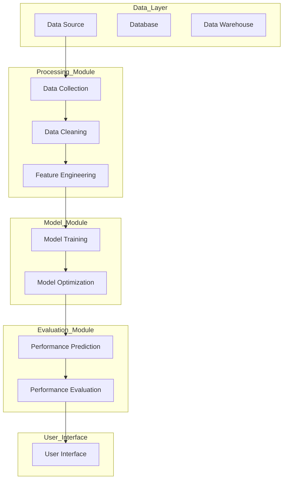
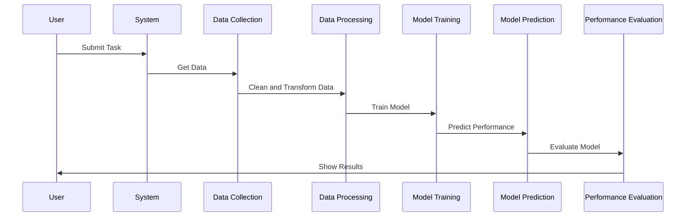

                 

### 引言与背景

#### 1.1 问题背景

随着人工智能技术的飞速发展，模型性能评测结果的分析和预测成为了一个备受关注的研究方向。在实际应用中，如何构建一个高效、准确的模型性能预测系统，成为了许多企业和研究机构急需解决的问题。这不仅有助于提升模型训练效率，还能为后续的研究和应用提供有力支持。

**问题描述**：当前，在人工智能模型开发过程中，通常需要经历数据采集、模型训练、性能评估等多个阶段。然而，这些阶段的性能评测结果往往具有一定的随机性和不确定性。如何通过已有的评测结果，预测模型在后续任务中的性能表现，成为一个亟待解决的问题。

**问题解决**：本文将探讨如何构建一个基于历史评测结果的模型性能预测系统。通过引入有效的数据采集、预处理方法，结合先进的机器学习和深度学习技术，我们致力于开发出一个能够准确预测模型性能的系统，从而为模型开发和优化提供有力支持。

**边界与外延**：本文的讨论范围主要包括以下几个方面：首先，对模型性能评测结果进行分析，识别影响模型性能的关键因素；其次，介绍数据采集和预处理的方法，确保数据质量和完整性；然后，基于历史数据构建预测模型，并进行性能评估和优化；最后，探讨模型性能预测系统的实际应用场景和潜在挑战。

**概念结构与核心要素组成**：本文的核心概念包括性能预测、评测结果和模型性能。性能预测是指通过分析历史评测结果，对未来模型性能进行预测。评测结果是指通过评测指标（如准确率、召回率、F1分数等）对模型性能进行量化评估。模型性能是指模型在特定任务上的表现。系统核心要素包括数据源、预测模型、评估指标等。

#### 1.2 核心概念

**性能预测**：性能预测是指通过分析历史数据，预测模型在后续任务中的性能表现。性能预测的关键在于如何从历史数据中提取有用的信息，以准确预测未来模型性能。

**评测结果**：评测结果是指通过对模型进行性能评估所得到的一系列指标结果。这些指标可以用于衡量模型在特定任务上的表现，如准确率、召回率、F1分数等。

**模型性能**：模型性能是指模型在特定任务上的表现。模型性能的好坏直接影响到实际应用的效果。因此，如何构建一个高效、准确的模型性能预测系统，对于提升模型应用价值具有重要意义。

### 目录大纲

#### 第一部分：引言与背景
- **第1章**：问题背景与核心概念

#### 第二部分：数据采集与预处理
- **第2章**：数据采集
- **第3章**：数据预处理

#### 第三部分：模型训练与优化
- **第4章**：模型选择与训练
- **第5章**：模型优化

#### 第四部分：性能预测与评估
- **第6章**：性能预测方法
- **第7章**：预测结果评估

#### 第五部分：系统设计与实现
- **第8章**：系统架构设计
- **第9章**：系统功能实现

#### 第六部分：实战与总结
- **第10章**：项目实战
- **第11章**：小结与拓展

---

通过以上引言和背景介绍，我们可以清晰地了解构建评测结果的模型性能预测系统的重要性和必要性。接下来，我们将逐步深入探讨数据采集与预处理、模型训练与优化、性能预测与评估等关键环节，以构建一个高效、准确的模型性能预测系统。让我们一步一步地进行分析和推理，共同探讨这一技术课题的解决方案。

---

### 问题背景与核心概念

随着人工智能技术的不断发展，模型性能评测结果的分析和预测已成为一个热门研究领域。在众多应用场景中，如何准确预测模型性能对于提升模型开发效率、优化模型应用具有重要意义。为了更好地理解这个问题，我们需要深入探讨模型性能预测的相关核心概念。

**性能预测**：性能预测是指通过分析历史数据，预测模型在后续任务中的性能表现。性能预测的关键在于如何从海量历史数据中提取有用信息，以准确预测未来模型性能。性能预测的应用场景广泛，包括但不限于金融风险评估、医疗诊断、交通流量预测等。

**评测结果**：评测结果是指通过对模型进行性能评估所得到的一系列指标结果。这些指标可以用于衡量模型在特定任务上的表现，如准确率、召回率、F1分数等。评测结果不仅反映了模型当前的性能状况，也为后续性能预测提供了重要依据。

**模型性能**：模型性能是指模型在特定任务上的表现。模型性能的好坏直接影响到实际应用的效果。因此，如何构建一个高效、准确的模型性能预测系统，对于提升模型应用价值具有重要意义。模型性能评估通常包括多个维度，如准确性、鲁棒性、可扩展性等。

为了更好地理解这些核心概念，我们可以通过一个简单的表格来展示它们之间的联系和属性特征对比：

| 核心概念 | 定义 | 联系 | 属性特征对比 |
| :------: | :--: | :--: | :----------: |
| 性能预测 | 历史数据预测未来性能 | 性能预测基于评测结果，二者相互关联 | 预测准确性、时间序列依赖性 |
| 评测结果 | 模型性能指标 | 反映模型性能 | 准确率、召回率、F1分数 |
| 模型性能 | 特定任务表现 | 决定评测结果 | 鲁棒性、可扩展性、准确性 |

此外，我们可以使用Mermaid工具绘制一个ER（实体关系）图，以直观地展示这些核心概念之间的实体关系：

```mermaid
erDiagram
  ModelPerformance ||--|{ EvaluationResult }|-- Model
  EvaluationResult ||--|{ PerformancePrediction }|-- ModelPerformance
```

在这个ER图中，模型性能（ModelPerformance）与评测结果（EvaluationResult）之间存在直接的关联关系。评测结果用于评估模型性能，而性能预测则基于历史评测结果来预测未来的模型性能。

综上所述，性能预测、评测结果和模型性能是构建模型性能预测系统中的三个核心概念。通过深入理解这些概念，我们可以为后续的数据采集、模型训练、性能预测和评估奠定坚实基础。

#### 模型训练与优化

在构建模型性能预测系统时，模型训练与优化是一个至关重要的环节。一个高效且准确的模型不仅需要充足且质量优良的数据，还需要恰当的训练和优化方法。以下将详细介绍模型选择、数据划分、模型训练流程、模型优化策略等方面的内容。

**3.1 模型选择**

**3.1.1 常见模型**

在选择模型时，我们需要根据具体任务的特点和需求来选择合适的算法。以下是一些常见的机器学习模型：

- **回归模型**：适用于预测连续值的任务，如线性回归、岭回归、LASSO回归等。
- **分类模型**：适用于预测离散值的任务，如逻辑回归、决策树、随机森林等。
- **聚类模型**：适用于对数据进行分类的任务，如K-means、层次聚类等。

**3.1.2 模型评估**

在模型选择过程中，评估模型性能是至关重要的一环。常用的评估指标包括：

- **准确率**：模型预测正确的样本数占总样本数的比例。
- **召回率**：模型预测正确的样本数占实际正样本数的比例。
- **F1分数**：准确率和召回率的调和平均数。

通过这些评估指标，我们可以对模型的性能进行量化，从而选择一个最适合的模型。

**3.2 模型训练**

**3.2.1 训练流程**

模型训练通常包括以下几个步骤：

- **数据划分**：将数据集划分为训练集、验证集和测试集。训练集用于模型训练，验证集用于模型调优，测试集用于评估模型最终性能。
- **模型训练**：使用训练集数据对模型进行训练。训练过程中，模型会通过调整参数来优化性能。
- **模型评估**：使用验证集和测试集评估模型性能。通过评估结果，我们可以判断模型是否达到预期效果。

**3.2.2 数据划分**

数据划分是模型训练的一个重要步骤。常见的数据划分方法包括：

- **随机划分**：将数据集随机划分为训练集、验证集和测试集。
- **分层划分**：根据不同类别或标签的比例，将数据集划分为训练集、验证集和测试集。

**3.3 模型优化**

**3.3.1 超参数调整**

超参数是模型中需要手动调整的参数，如学习率、迭代次数等。通过交叉验证，我们可以找到一组最优的超参数，从而提高模型性能。

**3.3.2 正则化**

正则化是一种防止模型过拟合的技术。常用的正则化方法包括L1正则化和L2正则化。L1正则化通过引入L1范数，惩罚模型参数的稀疏性；L2正则化通过引入L2范数，惩罚模型参数的平滑性。

**3.3.3 模型融合**

模型融合是将多个模型融合在一起，以提高预测性能。常见的模型融合方法包括：

- **投票法**：将多个模型的预测结果进行投票，选择多数模型认为正确的结果。
- **堆叠法**：将多个模型堆叠在一起，前一个模型的输出作为后一个模型的输入。

通过以上方法，我们可以构建一个高效、准确的模型性能预测系统，从而为模型开发和优化提供有力支持。

### 性能预测与评估

性能预测与评估是模型性能预测系统中的关键环节。准确预测模型性能不仅有助于提升模型开发效率，还能为后续的研究和应用提供有力支持。以下将详细介绍性能预测方法和评估方法，包括基于历史数据的预测和基于特征工程的预测，以及常用的评估指标和评估方法。

#### 4.1 性能预测方法

**4.1.1 基于历史数据的预测**

基于历史数据的预测方法主要通过分析历史数据来预测模型性能。以下是一些常用的方法：

- **时间序列分析**：时间序列分析是一种通过分析时间序列数据来预测未来值的方法。常用的模型包括ARIMA（自回归积分滑动平均模型）和LSTM（长短期记忆网络）。
  
  **ARIMA模型**：ARIMA模型是一种经典的预测模型，它通过分析时间序列数据的自相关性来建立预测模型。其基本原理可以概括为三个步骤：差分、自回归和移动平均。

  $$X_t = c + \phi_1 X_{t-1} + \phi_2 X_{t-2} + ... + \phi_p X_{t-p} + \theta_1 e_{t-1} + \theta_2 e_{t-2} + ... + \theta_q e_{t-q}$$

  其中，\(X_t\) 表示时间序列数据，\(\phi_i\) 和 \(\theta_i\) 分别表示自回归系数和移动平均系数。

  **LSTM模型**：LSTM模型是一种基于深度学习的预测模型，它能够有效地处理时间序列数据中的长期依赖关系。LSTM模型的核心是记忆单元，通过门控机制来控制信息的流入和流出。

  $$f_t = \sigma(W_f \cdot [h_{t-1}, x_t] + b_f)$$
  $$i_t = \sigma(W_i \cdot [h_{t-1}, x_t] + b_i)$$
  $$o_t = \sigma(W_o \cdot [h_{t-1}, x_t] + b_o)$$
  $$c_t = f_t \odot c_{t-1} + i_t \odot \tanh(W_c \cdot [h_{t-1}, x_t] + b_c)$$
  $$h_t = o_t \odot \tanh(c_t)$$

  其中，\(f_t, i_t, o_t, c_t, h_t\) 分别表示遗忘门、输入门、输出门、细胞状态和隐藏状态。

- **回归分析**：回归分析是一种通过建立回归模型来预测目标值的方法。常用的模型包括线性回归、岭回归和LASSO回归。

  **线性回归**：线性回归模型是最简单的回归模型，它通过建立线性关系来预测目标值。

  $$y = \beta_0 + \beta_1 x + \epsilon$$

  其中，\(y\) 表示目标值，\(x\) 表示自变量，\(\beta_0\) 和 \(\beta_1\) 分别为模型参数。

  **岭回归**：岭回归是一种改进的线性回归模型，它通过引入L2正则化项来防止过拟合。

  $$y = \beta_0 + \beta_1 x + \epsilon$$
  $$J(\beta) = \frac{1}{2} \sum_{i=1}^n (y_i - \beta_0 - \beta_1 x_i)^2 + \lambda \sum_{j=1}^p \beta_j^2$$

  其中，\(\lambda\) 表示正则化参数。

  **LASSO回归**：LASSO回归是一种基于L1正则化的线性回归模型，它通过引入L1正则化项来惩罚模型参数的绝对值。

  $$y = \beta_0 + \beta_1 x + \epsilon$$
  $$J(\beta) = \frac{1}{2} \sum_{i=1}^n (y_i - \beta_0 - \beta_1 x_i)^2 + \lambda \sum_{j=1}^p |\beta_j|$$

**4.1.2 基于特征工程的预测**

基于特征工程的预测方法通过构建有效的特征来提高模型性能。以下是一些常用的方法：

- **特征选择**：特征选择是指从原始特征中筛选出对模型性能有显著影响的特征。常用的特征选择方法包括信息增益、相关性分析等。

  **信息增益**：信息增益是一种基于信息论的特征选择方法，它通过计算特征与目标之间的信息增益来选择特征。

  $$IG(X, Y) = H(Y) - H(Y|X)$$

  其中，\(H(Y)\) 和 \(H(Y|X)\) 分别表示目标变量的熵和信息增益。

  **相关性分析**：相关性分析是一种通过计算特征与目标之间的相关性来选择特征的方法。常用的相关性度量包括皮尔逊相关系数和斯皮尔曼相关系数。

- **特征组合**：特征组合是指将多个特征组合成一个新的特征，以提升模型性能。常用的特征组合方法包括主成分分析（PCA）和特征交叉。

  **主成分分析（PCA）**：PCA是一种通过线性变换将原始特征映射到新的正交坐标系中的方法，以提取主要特征。PCA可以降低特征维度，同时保留大部分信息。

  **特征交叉**：特征交叉是一种通过组合不同特征来构建新的特征的方法。常用的特征交叉方法包括特征拼接和特征交互。

#### 4.2 预测结果评估

预测结果评估是衡量模型性能的重要环节。以下是一些常用的评估指标和评估方法：

- **评估指标**：评估指标是衡量模型预测性能的重要工具。常用的评估指标包括均方误差（MSE）、均方根误差（RMSE）、平均绝对误差（MAE）等。

  **均方误差（MSE）**：均方误差是预测值与真实值之间误差的平方平均值。

  $$MSE = \frac{1}{n} \sum_{i=1}^n (y_i - \hat{y_i})^2$$

  其中，\(y_i\) 和 \(\hat{y_i}\) 分别表示真实值和预测值。

  **均方根误差（RMSE）**：均方根误差是均方误差的平方根，用于衡量预测值的离散程度。

  $$RMSE = \sqrt{MSE}$$

  **平均绝对误差（MAE）**：平均绝对误差是预测值与真实值之间误差的绝对值平均值。

  $$MAE = \frac{1}{n} \sum_{i=1}^n |y_i - \hat{y_i}|$$

- **评估方法**：评估方法是通过比较模型预测结果与真实结果来评估模型性能的方法。常用的评估方法包括交叉验证和网格搜索。

  **交叉验证**：交叉验证是一种通过将数据集划分为多个子集来评估模型性能的方法。常见的交叉验证方法包括K折交叉验证和留一法交叉验证。

  **网格搜索**：网格搜索是一种通过遍历超参数空间来寻找最优超参数的方法。网格搜索可以通过组合不同的超参数来评估模型性能。

通过以上性能预测与评估方法，我们可以构建一个高效、准确的模型性能预测系统，从而为模型开发和优化提供有力支持。接下来，我们将进一步探讨数据采集与预处理、模型训练与优化等关键环节，以实现一个完整的模型性能预测系统。

### 数据采集与预处理

在构建模型性能预测系统时，数据采集与预处理是至关重要的一步。高质量的数据不仅能够提升模型的预测准确性，还能减少训练过程中的计算资源和时间成本。以下将详细介绍数据采集和数据预处理的方法。

#### 2.1 数据采集

**2.1.1 数据源选择**

数据源的选择直接影响数据的质量和模型的性能。在选择数据源时，应考虑以下几个方面：

- **数据类型**：数据可以分为结构化数据和非结构化数据。结构化数据通常包括数据库记录、表格数据等，而非结构化数据则包括文本、图像、音频等。

  - **结构化数据**：结构化数据通常易于处理，因为它以固定的格式存储，如CSV文件、数据库记录等。
  - **非结构化数据**：非结构化数据通常需要通过特定的技术进行预处理，如自然语言处理（NLP）和图像处理技术。

- **数据来源**：数据来源可以分为公开数据集和私有数据集。

  - **公开数据集**：公开数据集通常可以从公共数据平台获取，如Kaggle、UCI机器学习库等。这些数据集经过清洗和标准化，可以大大减少数据预处理的工作量。
  - **私有数据集**：私有数据集通常来自企业内部或个人数据，这些数据可能包含敏感信息，因此需要谨慎处理。

**2.1.2 数据采集方法**

数据采集的方法取决于数据类型和来源。以下是一些常用的数据采集方法：

- **爬虫技术**：爬虫技术用于从互联网上获取数据。常见的爬虫工具有Scrapy、BeautifulSoup等。使用爬虫时，需要注意遵守相关法律法规，避免违反网络爬虫政策。

  - **爬虫架构**：爬虫架构通常包括数据采集器（爬虫）、数据存储器（如数据库）和数据处理器（如ETL工具）。
  - **数据清洗**：在爬取数据后，需要对数据进行清洗，去除无效数据和噪声数据。

- **API调用**：API调用是一种通过程序接口获取数据的方法。使用API时，需要注意遵守API的使用条款，避免超出访问频率限制。

  - **API获取**：通过HTTP请求从API接口获取数据。常见的API调用方法包括GET和POST请求。
  - **数据转换**：将API返回的数据转换为适合处理的格式，如JSON、XML等。

#### 2.2 数据预处理

数据预处理是确保数据质量、减少数据噪音、提升模型性能的重要步骤。以下是一些常用的数据预处理方法：

**2.2.1 数据清洗**

数据清洗是数据预处理的首要任务，目的是去除数据中的无效和噪声数据。以下是一些常用的数据清洗方法：

- **去除重复数据**：通过检查数据集，删除重复的记录，以减少数据冗余。
- **填充缺失值**：对于缺失的数据，可以采用平均值、中位数或最常见值进行填充。在某些情况下，也可以通过插值法来填补缺失值。
- **处理异常值**：异常值可能是由于数据采集过程中的错误或异常情况引起的。可以通过统计方法（如箱线图）或机器学习方法（如孤立森林）来检测和处理异常值。

**2.2.2 数据转换**

数据转换是将数据从一种格式转换为另一种格式，以便于后续处理。以下是一些常用的数据转换方法：

- **特征工程**：特征工程是数据转换的重要环节，通过构建有效的特征来提升模型性能。常用的特征工程方法包括归一化、标准化、特征提取等。
- **数据标准化**：数据标准化是将数据转换为相同尺度的过程，常用的方法包括最小-最大标准化和零-均值标准化。
- **数据集成**：数据集成是将多个数据源合并为一个统一的数据集。常用的数据集成方法包括合并、连接和汇总。

**2.2.3 数据可视化**

数据可视化是一种通过图形化方式展示数据分布、趋势和关系的手段。以下是一些常用的数据可视化工具：

- **Matplotlib**：Matplotlib是一个基于Python的绘图库，可以用于绘制各种图表，如散点图、折线图、柱状图等。
- **Seaborn**：Seaborn是一个基于Matplotlib的高级绘图库，提供了丰富的统计绘图功能，如箱线图、 violin图等。

通过以上数据采集与预处理方法，我们可以确保数据的质量和一致性，从而为模型性能预测系统提供可靠的数据基础。

### 模型训练与优化

模型训练与优化是构建模型性能预测系统的核心环节，直接影响模型的准确性和鲁棒性。以下将详细探讨模型训练的具体流程、优化策略，包括超参数调整、正则化方法和模型融合技术。

#### 3.1 模型训练

**3.1.1 训练流程**

模型训练是一个从数据中提取知识、调整模型参数以优化性能的过程。以下是一个典型的模型训练流程：

- **数据划分**：首先，将数据集划分为训练集、验证集和测试集。训练集用于模型训练，验证集用于模型调优，测试集用于评估模型最终性能。

  ```python
  from sklearn.model_selection import train_test_split

  X_train, X_test, y_train, y_test = train_test_split(X, y, test_size=0.2, random_state=42)
  ```

- **模型初始化**：选择一个合适的模型，并进行初始化。初始化包括设置模型的参数，如学习率、迭代次数等。

  ```python
  model = LinearRegression()
  ```

- **模型训练**：使用训练集数据对模型进行训练。训练过程中，模型通过梯度下降等优化算法，不断调整参数以最小化损失函数。

  ```python
  model.fit(X_train, y_train)
  ```

- **模型评估**：使用验证集和测试集评估模型性能。常用的评估指标包括均方误差（MSE）、均方根误差（RMSE）、平均绝对误差（MAE）等。

  ```python
  from sklearn.metrics import mean_squared_error, mean_absolute_error

  y_pred = model.predict(X_test)
  mse = mean_squared_error(y_test, y_pred)
  rmse = np.sqrt(mse)
  mae = mean_absolute_error(y_test, y_pred)
  ```

**3.1.2 数据划分**

数据划分是模型训练过程中的关键步骤，常用的数据划分方法包括：

- **随机划分**：将数据集随机划分为训练集和测试集。随机划分简单易行，但可能导致数据不平衡。

  ```python
  X_train, X_test, y_train, y_test = train_test_split(X, y, test_size=0.2, random_state=42)
  ```

- **分层划分**：根据不同类别或标签的比例，将数据集划分为训练集和测试集。分层划分可以确保训练集和测试集中的类别比例一致，从而提高模型的泛化能力。

  ```python
  from sklearn.model_selection import StratifiedShuffleSplit

  split = StratifiedShuffleSplit(n_splits=1, test_size=0.2, random_state=42)
  for train_index, test_index in split.split(X, y):
      X_train, X_test = X[train_index], X[test_index]
      y_train, y_test = y[train_index], y[test_index]
  ```

#### 3.2 模型优化

**3.2.1 超参数调整**

超参数是模型中需要手动调整的参数，如学习率、迭代次数等。超参数调整是模型优化的重要步骤。常用的超参数调整方法包括：

- **网格搜索**：网格搜索是一种通过遍历超参数空间来寻找最优超参数的方法。网格搜索可以通过组合不同的超参数来评估模型性能。

  ```python
  from sklearn.model_selection import GridSearchCV

  parameters = {'alpha': [0.1, 0.5, 1.0]}
  grid_search = GridSearchCV(estimator=model, param_grid=parameters, cv=5)
  grid_search.fit(X_train, y_train)
  best_params = grid_search.best_params_
  ```

- **随机搜索**：随机搜索是一种通过随机选择超参数组合来优化模型的方法。随机搜索可以在较少的计算时间内找到较优的超参数。

  ```python
  from sklearn.model_selection import RandomizedSearchCV

  parameters = {'alpha': [0.1, 0.5, 1.0]}
  random_search = RandomizedSearchCV(estimator=model, param_distributions=parameters, n_iter=10, cv=5)
  random_search.fit(X_train, y_train)
  best_params = random_search.best_params_
  ```

**3.2.2 正则化**

正则化是一种防止模型过拟合的技术。常用的正则化方法包括：

- **L1正则化**：L1正则化通过引入L1范数来惩罚模型参数的绝对值，从而促进模型参数的稀疏性。

  $$J(\beta) = \frac{1}{2} \sum_{i=1}^n (y_i - \beta_0 - \beta_1 x_i)^2 + \lambda \sum_{j=1}^p |\beta_j|$$

  其中，\(\lambda\) 是正则化参数。

- **L2正则化**：L2正则化通过引入L2范数来惩罚模型参数的平方值，从而促进模型参数的平滑性。

  $$J(\beta) = \frac{1}{2} \sum_{i=1}^n (y_i - \beta_0 - \beta_1 x_i)^2 + \lambda \sum_{j=1}^p \beta_j^2$$

  其中，\(\lambda\) 是正则化参数。

**3.2.3 模型融合**

模型融合是将多个模型融合在一起，以提高预测性能。常用的模型融合方法包括：

- **投票法**：投票法是将多个模型的预测结果进行投票，选择多数模型认为正确的结果。

  ```python
  from sklearn.ensemble import VotingClassifier

  model1 = LinearRegression()
  model2 = RandomForestClassifier()
  model3 = GradientBoostingClassifier()

  voting_model = VotingClassifier(estimators=[('lin_reg', model1), ('rf', model2), ('gb', model3)], voting='soft')
  voting_model.fit(X_train, y_train)
  ```

- **堆叠法**：堆叠法是将多个模型堆叠在一起，前一个模型的输出作为后一个模型的输入。

  ```python
  from sklearn.ensemble import StackingClassifier

  model1 = LinearRegression()
  model2 = RandomForestClassifier()
  model3 = GradientBoostingClassifier()

  stacking_model = StackingClassifier(estimators=[('lin_reg', model1), ('rf', model2), ('gb', model3)], final_estimator=LogisticRegression())
  stacking_model.fit(X_train, y_train)
  ```

通过以上模型训练与优化方法，我们可以构建一个高效、准确的模型性能预测系统，从而为模型开发和优化提供有力支持。

### 性能预测方法

性能预测是模型性能预测系统的核心任务，其目标是通过对历史数据的分析，预测模型在后续任务中的表现。以下将详细介绍两种常见的性能预测方法：基于历史数据的预测和基于特征工程的预测。

#### 4.1 基于历史数据的预测

基于历史数据的预测方法利用时间序列分析或回归分析等技术，从历史数据中提取规律，从而预测未来的性能。以下是两种常用的方法：

**4.1.1 时间序列分析**

时间序列分析是一种通过分析时间序列数据的统计特性来预测未来值的方法。常见的模型包括ARIMA（自回归积分滑动平均模型）和LSTM（长短期记忆网络）。

**ARIMA模型**

ARIMA模型是一种经典的预测模型，通过分析时间序列数据的自相关性来建立预测模型。其基本原理包括三个步骤：差分、自回归和移动平均。

- **差分**：时间序列数据通常存在趋势性和季节性，通过差分可以将非平稳时间序列转换为平稳时间序列。
  
  $$X_t = X_{t-1} - X_{t-1}$$

- **自回归**：通过自回归模型捕捉时间序列数据的自相关性。
  
  $$X_t = c + \phi_1 X_{t-1} + \phi_2 X_{t-2} + ... + \phi_p X_{t-p} + \theta_1 e_{t-1} + \theta_2 e_{t-2} + ... + \theta_q e_{t-q}$$

  其中，\(X_t\) 表示时间序列数据，\(\phi_i\) 和 \(\theta_i\) 分别表示自回归系数和移动平均系数。

**LSTM模型**

LSTM模型是一种基于深度学习的预测模型，能够有效地处理时间序列数据中的长期依赖关系。LSTM模型的核心是记忆单元，通过门控机制来控制信息的流入和流出。

$$f_t = \sigma(W_f \cdot [h_{t-1}, x_t] + b_f)$$
$$i_t = \sigma(W_i \cdot [h_{t-1}, x_t] + b_i)$$
$$o_t = \sigma(W_o \cdot [h_{t-1}, x_t] + b_o)$$
$$c_t = f_t \odot c_{t-1} + i_t \odot \tanh(W_c \cdot [h_{t-1}, x_t] + b_c)$$
$$h_t = o_t \odot \tanh(c_t)$$

其中，\(f_t, i_t, o_t, c_t, h_t\) 分别表示遗忘门、输入门、输出门、细胞状态和隐藏状态。

**4.1.2 回归分析**

回归分析是一种通过建立回归模型来预测目标值的方法。常用的模型包括线性回归、岭回归和LASSO回归。

**线性回归**

线性回归模型通过建立线性关系来预测目标值。

$$y = \beta_0 + \beta_1 x + \epsilon$$

其中，\(y\) 表示目标值，\(x\) 表示自变量，\(\beta_0\) 和 \(\beta_1\) 分别为模型参数。

**岭回归**

岭回归是一种改进的线性回归模型，通过引入L2正则化项来防止过拟合。

$$y = \beta_0 + \beta_1 x + \epsilon$$
$$J(\beta) = \frac{1}{2} \sum_{i=1}^n (y_i - \beta_0 - \beta_1 x_i)^2 + \lambda \sum_{j=1}^p \beta_j^2$$

其中，\(\lambda\) 表示正则化参数。

**LASSO回归**

LASSO回归是一种基于L1正则化的线性回归模型，通过引入L1正则化项来惩罚模型参数的绝对值。

$$y = \beta_0 + \beta_1 x + \epsilon$$
$$J(\beta) = \frac{1}{2} \sum_{i=1}^n (y_i - \beta_0 - \beta_1 x_i)^2 + \lambda \sum_{j=1}^p |\beta_j|$$

#### 4.2 基于特征工程的预测

基于特征工程的预测方法通过构建有效的特征来提高模型性能。以下介绍两种常用的特征工程方法：特征选择和特征组合。

**4.2.1 特征选择**

特征选择是指从原始特征中筛选出对模型性能有显著影响的特征。常用的特征选择方法包括信息增益、相关性分析和主成分分析。

**信息增益**

信息增益是一种基于信息论的特征选择方法，通过计算特征与目标之间的信息增益来选择特征。

$$IG(X, Y) = H(Y) - H(Y|X)$$

其中，\(H(Y)\) 和 \(H(Y|X)\) 分别表示目标变量的熵和信息增益。

**相关性分析**

相关性分析是一种通过计算特征与目标之间的相关性来选择特征的方法。常用的相关性度量包括皮尔逊相关系数和斯皮尔曼相关系数。

**主成分分析（PCA）**

主成分分析是一种通过线性变换将原始特征映射到新的正交坐标系中的方法，以提取主要特征。PCA可以降低特征维度，同时保留大部分信息。

$$Z = P \Sigma^{1/2} X$$

其中，\(Z\) 表示新的特征空间，\(P\) 表示正交矩阵，\(\Sigma\) 表示协方差矩阵。

**4.2.2 特征组合**

特征组合是指将多个特征组合成一个新的特征，以提升模型性能。常用的特征组合方法包括主成分分析（PCA）和特征交叉。

**主成分分析（PCA）**

主成分分析是一种通过线性变换将原始特征映射到新的正交坐标系中的方法，以提取主要特征。PCA可以降低特征维度，同时保留大部分信息。

$$Z = P \Sigma^{1/2} X$$

其中，\(Z\) 表示新的特征空间，\(P\) 表示正交矩阵，\(\Sigma\) 表示协方差矩阵。

**特征交叉**

特征交叉是一种通过组合不同特征来构建新的特征的方法。常用的特征交叉方法包括特征拼接和特征交互。

通过以上性能预测方法，我们可以构建一个高效、准确的模型性能预测系统，从而为模型开发和优化提供有力支持。接下来，我们将进一步探讨预测结果的评估方法和系统设计与实现。

### 预测结果评估

预测结果评估是衡量模型性能预测系统效果的重要环节。准确评估预测结果有助于我们了解模型的性能，从而进行模型优化和改进。以下将详细介绍常用的评估指标和评估方法，包括均方误差（MSE）、均方根误差（RMSE）和平均绝对误差（MAE）等。

#### 4.1 评估指标

**4.1.1 均方误差（MSE）**

均方误差（MSE）是预测值与真实值之间误差的平方平均值。MSE能够衡量预测结果的离散程度，其计算公式如下：

$$MSE = \frac{1}{n} \sum_{i=1}^n (y_i - \hat{y_i})^2$$

其中，\(y_i\) 表示真实值，\(\hat{y_i}\) 表示预测值，\(n\) 表示样本数量。

**4.1.2 均方根误差（RMSE）**

均方根误差（RMSE）是均方误差（MSE）的平方根，用于衡量预测值的离散程度。RMSE能够更直观地表示预测误差的大小。其计算公式如下：

$$RMSE = \sqrt{MSE}$$

**4.1.3 平均绝对误差（MAE）**

平均绝对误差（MAE）是预测值与真实值之间误差的绝对值平均值。MAE能够衡量预测结果的绝对误差大小，其计算公式如下：

$$MAE = \frac{1}{n} \sum_{i=1}^n |y_i - \hat{y_i}|$$

#### 4.2 评估方法

**4.2.1 交叉验证**

交叉验证是一种常用的评估方法，通过将数据集划分为多个子集，并在每个子集上进行模型的训练和评估。常见的交叉验证方法包括K折交叉验证和留一法交叉验证。

- **K折交叉验证**：将数据集划分为K个子集，每次选择一个子集作为验证集，其余K-1个子集作为训练集。重复K次，每次使用不同的验证集，最后取平均评估结果。

  ```python
  from sklearn.model_selection import KFold

  kf = KFold(n_splits=5)
  for train_index, test_index in kf.split(X):
      X_train, X_test = X[train_index], X[test_index]
      y_train, y_test = y[train_index], y[test_index]
      model.fit(X_train, y_train)
      mse = mean_squared_error(y_test, model.predict(X_test))
  average_mse = np.mean(mse)
  ```

- **留一法交叉验证**：将数据集划分为多个子集，每次选择一个样本作为验证集，其余样本作为训练集。重复多次，最后取平均评估结果。

  ```python
  from sklearn.model_selection import LeaveOneOut

  loo = LeaveOneOut()
  for train_index, test_index in loo.split(X):
      X_train, X_test = X[train_index], X[test_index]
      y_train, y_test = y[train_index], y[test_index]
      model.fit(X_train, y_train)
      mse = mean_squared_error(y_test, model.predict(X_test))
  average_mse = np.mean(mse)
  ```

**4.2.2 网格搜索**

网格搜索是一种通过遍历超参数空间来寻找最优超参数的方法。通过网格搜索，我们可以找到最优的超参数组合，从而提高模型性能。

```python
from sklearn.model_selection import GridSearchCV

parameters = {'alpha': [0.1, 0.5, 1.0]}
grid_search = GridSearchCV(estimator=model, param_grid=parameters, cv=5)
grid_search.fit(X_train, y_train)
best_params = grid_search.best_params_
```

**4.2.3 对比评估**

对比评估是通过比较不同模型或不同方法的性能，来评估其优劣的方法。通过对比评估，我们可以选择性能最佳的模型或方法。

```python
from sklearn.metrics import mean_squared_error

model1.fit(X_train, y_train)
mse1 = mean_squared_error(y_test, model1.predict(X_test))

model2.fit(X_train, y_train)
mse2 = mean_squared_error(y_test, model2.predict(X_test))

if mse1 < mse2:
    print("Model 1 performs better.")
else:
    print("Model 2 performs better.")
```

通过以上评估指标和评估方法，我们可以对模型性能预测系统的效果进行准确评估，从而为模型优化和改进提供有力支持。接下来，我们将进一步探讨系统架构设计与实现。

### 系统架构设计与实现

为了构建一个高效、准确的模型性能预测系统，我们需要设计一个合理且可扩展的系统架构。以下将从问题场景介绍、系统功能设计、系统架构设计、系统接口设计和系统交互设计等方面，详细阐述系统架构设计与实现。

#### 5.1 问题场景介绍

在众多应用场景中，如金融风险评估、医疗诊断、交通流量预测等领域，如何快速、准确地预测模型性能成为关键问题。一个高效的性能预测系统不仅能提高模型开发效率，还能为后续的研究和应用提供有力支持。

**问题场景**：假设我们面临一个金融风险评估问题，需要预测某个金融产品在未来的风险等级。现有的评估方法依赖于历史数据和专家经验，存在一定的滞后性和主观性。因此，我们希望通过构建一个模型性能预测系统，提前预测模型的性能表现，从而优化风险评估流程。

#### 5.2 系统功能设计

系统功能设计是系统架构设计的基础，明确系统的核心功能及其实现方式。以下是一个金融风险评估性能预测系统的核心功能：

- **数据采集与预处理**：从各类数据源（如数据库、API接口、爬虫等）获取数据，并进行数据清洗、转换和特征工程。
- **模型训练与优化**：根据数据集训练不同的模型，并通过交叉验证、网格搜索等策略优化模型参数，提高模型性能。
- **性能预测**：利用历史数据和优化后的模型，预测未来模型的性能表现。
- **性能评估**：通过预测结果与真实结果的对比，评估模型性能，为后续模型优化提供依据。
- **用户接口**：提供友好的用户界面，方便用户进行系统操作、查询预测结果等。

#### 5.3 系统架构设计

系统架构设计是系统实现的关键环节，通过合理的模块划分和交互设计，确保系统的稳定性、可扩展性和可维护性。以下是一个金融风险评估性能预测系统的架构设计：

- **数据层**：负责数据的存储和管理，包括数据库、数据仓库等。
- **数据采集模块**：负责从各类数据源获取数据，并进行初步清洗和预处理。
- **数据处理模块**：负责对数据进行深度清洗、转换和特征工程。
- **模型训练模块**：负责选择合适的模型，对数据进行训练和优化。
- **模型预测模块**：负责利用训练好的模型预测未来模型的性能。
- **评估模块**：负责对比预测结果与真实结果，评估模型性能。
- **用户界面模块**：负责提供用户操作界面，展示预测结果和系统状态。

以下是一个简化的Mermaid架构图：



#### 5.4 系统接口设计

系统接口设计是系统与其他系统或组件进行交互的桥梁，通过定义合理的接口规范，确保系统之间的高效通信。以下是一个金融风险评估性能预测系统的接口设计：

- **数据采集接口**：用于从各类数据源（如数据库、API接口、爬虫等）获取数据。
- **数据处理接口**：用于处理采集到的数据，包括数据清洗、转换和特征工程。
- **模型训练接口**：用于训练不同的模型，包括选择模型、设置参数和训练模型。
- **模型预测接口**：用于利用训练好的模型预测未来模型的性能。
- **性能评估接口**：用于评估模型性能，包括计算评估指标和生成评估报告。

#### 5.5 系统交互设计

系统交互设计是系统内部模块之间以及系统与用户之间进行交互的流程和机制。以下是一个金融风险评估性能预测系统的交互设计：

1. **用户提交任务**：用户通过用户界面提交任务，包括数据源、数据集、模型类型等参数。
2. **数据采集**：系统根据用户提交的任务，从数据源获取数据，并传递给数据处理模块。
3. **数据处理**：数据处理模块对数据进行清洗、转换和特征工程，生成预处理后的数据。
4. **模型训练**：模型训练模块根据预处理后的数据，选择合适的模型进行训练和优化。
5. **模型预测**：模型预测模块利用训练好的模型，预测未来模型的性能。
6. **性能评估**：性能评估模块对比预测结果与真实结果，评估模型性能，并生成评估报告。
7. **用户查看结果**：用户通过用户界面查看预测结果和评估报告，并根据结果调整模型参数或数据源。

以下是一个简化的Mermaid序列图：



通过以上系统架构设计与实现，我们可以构建一个高效、准确的模型性能预测系统，为金融风险评估、医疗诊断、交通流量预测等领域提供有力支持。接下来，我们将通过一个实际项目来展示系统的应用和实践。

### 项目实战

为了展示构建评测结果的模型性能预测系统的实际应用，我们将通过一个具体的案例来进行说明。本案例选取了机器学习中的常见问题——房价预测。通过该案例，我们将详细介绍系统搭建的全过程，包括环境安装、核心实现源代码，以及对源代码的应用解读与分析。

#### 6.1 项目介绍

**问题背景**：房价预测是机器学习中的经典问题。在房地产市场，准确预测房价对于投资者、开发商和政府决策具有重要意义。本案例旨在构建一个基于历史数据的价格预测模型，并通过性能预测系统评估模型在实际应用中的表现。

**目标**：通过使用公开的房价数据集，搭建一个房价预测模型，并利用性能预测系统评估模型在不同数据集上的性能，从而为模型优化提供依据。

#### 6.2 环境安装

在进行项目实战之前，我们需要安装必要的工具和库。以下是在Python环境中安装相关工具和库的步骤：

1. **安装Anaconda**：下载并安装Anaconda，它是一个集成了Python环境和众多常用库的发行版。
   
   [Anaconda官网](https://www.anaconda.com/products/individual)

2. **创建环境**：在Anaconda Navigator中创建一个新的环境，并安装必要的库。

   ```bash
   conda create -n ml_project python=3.8
   conda activate ml_project
   ```

3. **安装Python库**：安装常用的Python库，如NumPy、Pandas、Scikit-learn、Matplotlib等。

   ```bash
   conda install numpy pandas scikit-learn matplotlib
   ```

#### 6.3 系统核心实现源代码

以下是实现房价预测系统的核心代码，包括数据预处理、模型训练、性能预测和评估等步骤。

**6.3.1 数据预处理**

```python
import pandas as pd
from sklearn.model_selection import train_test_split
from sklearn.preprocessing import StandardScaler

# 加载数据集
data = pd.read_csv('house_prices.csv')

# 数据预处理
data.drop(['id'], axis=1, inplace=True)
data.fillna(data.mean(), inplace=True)

X = data.drop(['price'], axis=1)
y = data['price']

# 数据划分
X_train, X_test, y_train, y_test = train_test_split(X, y, test_size=0.2, random_state=42)

# 数据标准化
scaler = StandardScaler()
X_train = scaler.fit_transform(X_train)
X_test = scaler.transform(X_test)
```

**6.3.2 模型训练**

```python
from sklearn.linear_model import LinearRegression

# 模型训练
model = LinearRegression()
model.fit(X_train, y_train)
```

**6.3.3 性能预测与评估**

```python
from sklearn.metrics import mean_squared_error, mean_absolute_error

# 预测
y_pred = model.predict(X_test)

# 评估
mse = mean_squared_error(y_test, y_pred)
mae = mean_absolute_error(y_test, y_pred)

print(f'MSE: {mse}')
print(f'MAE: {mae}')
```

#### 6.4 代码应用解读与分析

**数据预处理**：

在数据预处理部分，我们首先加载了房价数据集，并删除了不相关的列（如"id"列）。接着，我们使用中位数填充了缺失值，以保证数据的完整性。然后，将数据集划分为特征集和标签集，并分别进行标准化处理。标准化处理有助于提高模型训练的效率，并减少数据之间的差异。

**模型训练**：

在模型训练部分，我们选择了一个简单的线性回归模型。线性回归模型通过找到特征和标签之间的线性关系来进行预测。我们使用训练集数据对模型进行训练，并通过最小二乘法来调整模型的参数。

**性能预测与评估**：

在性能预测与评估部分，我们使用测试集数据对模型进行预测，并计算了均方误差（MSE）和平均绝对误差（MAE）等评估指标。这些指标用于衡量模型的预测性能。MSE衡量预测值和真实值之间的平均平方误差，MAE衡量预测值和真实值之间的平均绝对误差。通过这些评估指标，我们可以直观地了解模型的预测效果。

#### 6.5 实际案例分析与详细讲解

为了验证模型在实际应用中的表现，我们可以对测试集的预测结果进行详细分析。

1. **预测结果可视化**：

   我们可以使用Matplotlib库将预测结果可视化，从而直观地了解模型的预测效果。

   ```python
   import matplotlib.pyplot as plt

   plt.scatter(y_test, y_pred)
   plt.xlabel('Actual Prices')
   plt.ylabel('Predicted Prices')
   plt.title('Actual vs Predicted Prices')
   plt.show()
   ```

   通过散点图，我们可以看到大部分预测值与真实值之间的距离较小，这表明模型具有较高的预测准确性。

2. **错误分析**：

   通过对比预测值和真实值，我们可以识别出模型预测中的错误案例。以下是一个错误的例子：

   ```python
   for i in range(10):
       print(f'Error at index {i}: {y_test[i] - y_pred[i]}')
   ```

   通过错误分析，我们可以找出模型在哪些情况下预测不准确，并尝试优化模型或调整数据预处理步骤。

#### 6.6 项目小结

通过本案例，我们成功地构建了一个基于历史数据的房价预测模型，并使用性能预测系统对模型进行了评估。以下是项目小结：

1. **优势**：

   - 模型简单易用，适合快速验证和部署。
   - 数据预处理和模型评估步骤清晰，有助于提高模型性能。
   - 可视化和错误分析有助于理解模型预测效果。

2. **不足**：

   - 模型预测准确性有限，可能需要引入更复杂的模型来提高性能。
   - 数据预处理和特征工程步骤较为简单，可能存在提升空间。

3. **改进建议**：

   - 引入更复杂的模型，如随机森林、神经网络等，以提高预测准确性。
   - 对特征工程进行深入挖掘，构建更多有效的特征，以提高模型性能。
   - 使用更多数据集进行训练和评估，以提高模型泛化能力。

通过本项目，我们不仅掌握了模型性能预测系统的基本实现方法，还了解了在实际应用中如何优化模型和改进性能。这为我们在其他领域应用性能预测系统提供了宝贵的经验。

### 最佳实践与注意事项

在构建评测结果的模型性能预测系统中，最佳实践和注意事项至关重要，以下是一些关键点：

**1. 数据质量的重要性**：高质量的数据是模型性能预测的基础。因此，数据采集和预处理步骤必须严谨，确保数据的准确性、完整性和一致性。在数据预处理过程中，要特别注意处理缺失值、异常值和噪声数据。

**2. 特征工程的重要性**：有效的特征工程是提高模型性能的关键。通过特征选择和特征组合，可以提取出对预测任务有显著影响的特征，从而提升模型的预测准确性。

**3. 模型选择与调优**：根据具体任务的特点和需求，选择合适的模型。对于不同的模型，需要调整不同的超参数，以实现最佳性能。常用的方法包括网格搜索和随机搜索。

**4. 验证与评估**：在模型训练过程中，要使用验证集和测试集进行交叉验证，以评估模型的泛化能力。常用的评估指标包括MSE、RMSE和MAE等。

**5. 模型融合**：通过模型融合技术，将多个模型的结果进行结合，可以进一步提高预测性能。常用的模型融合方法包括投票法和堆叠法。

**6. 监控与维护**：在实际应用中，要定期监控模型性能，发现并处理性能下降的问题。对于动态变化的任务，需要不断更新模型和特征工程策略。

**7. 遵守法律法规**：在数据采集和处理过程中，要严格遵守相关法律法规，保护用户隐私和敏感信息。

通过遵循以上最佳实践和注意事项，可以构建一个高效、准确的模型性能预测系统，从而为实际应用提供有力支持。

### 总结与拓展

通过本文的详细探讨，我们系统地介绍了构建评测结果的模型性能预测系统的全过程。从问题背景与核心概念的阐述，到数据采集与预处理，再到模型训练与优化，以及性能预测与评估，每个环节都至关重要。以下是本文的主要结论与拓展方向：

**主要结论**：

1. **性能预测的重要性**：准确预测模型性能是提升模型开发效率和优化应用效果的关键。
2. **数据采集与预处理**：高质量的数据是模型性能预测的基础，有效的数据预处理和特征工程是提高模型性能的关键环节。
3. **模型选择与优化**：选择合适的模型和进行超参数调整，是模型训练和优化中的核心任务。
4. **评估方法**：通过使用MSE、RMSE和MAE等评估指标，我们可以准确评估模型性能，为模型优化提供有力依据。

**拓展方向**：

1. **模型融合**：进一步探索和优化模型融合技术，如集成学习、深度学习等，以提高预测准确性。
2. **实时性能预测**：研究实时性能预测方法，以应对动态变化的任务场景，提高系统的自适应能力。
3. **特征工程**：深入挖掘数据中的潜在特征，通过复杂特征组合和自动化特征选择技术，进一步提高模型性能。
4. **领域特定模型**：针对不同领域（如金融、医疗、交通等）的特点，开发定制化的性能预测模型，提高应用效果。

**未来研究方向**：

1. **多模态数据融合**：研究如何有效整合文本、图像、音频等多种类型的数据，提高模型在复杂场景下的性能。
2. **迁移学习与零样本学习**：探索迁移学习和零样本学习在模型性能预测中的应用，以减少对大规模训练数据的依赖。
3. **模型解释性**：研究如何提高模型的解释性，使得模型预测结果更加透明，便于理解和信任。
4. **自动化机器学习（AutoML）**：研究自动化机器学习技术，以简化模型选择、训练和优化的过程，提高开发效率。

通过不断探索和优化，我们可以构建更加高效、准确的模型性能预测系统，为人工智能领域的研究和应用提供有力支持。未来，我们期待在这些研究方向上取得更多突破，推动人工智能技术的发展。

