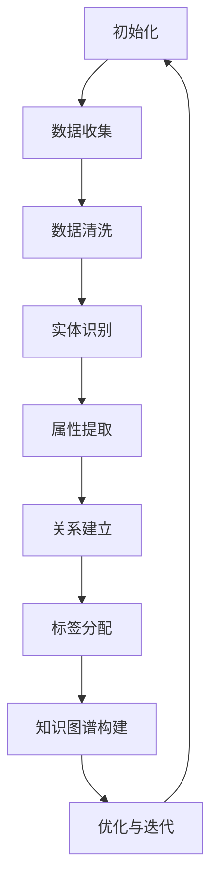
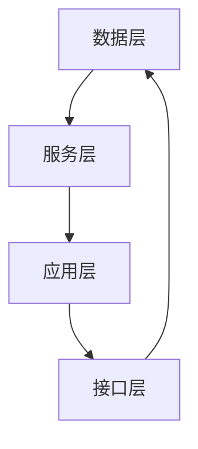
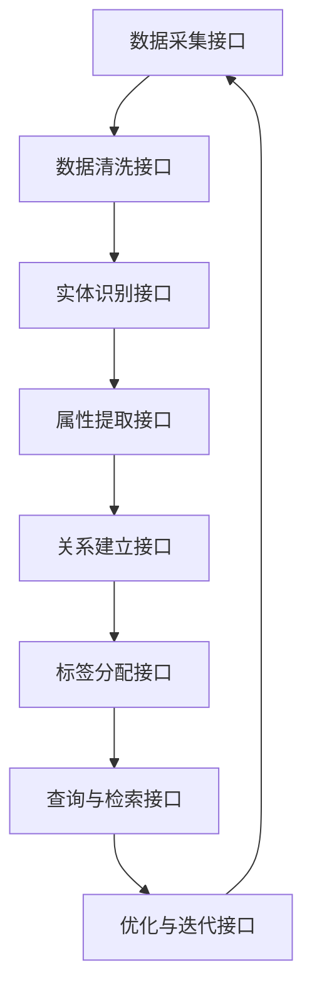
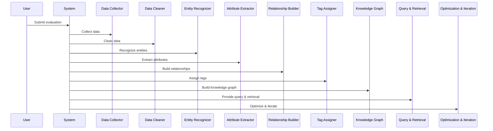

                 

### 构建评测结果的知识图谱

#### 关键词：评测结果、知识图谱、数据结构、算法、系统架构

> 摘要：本文将深入探讨评测结果的知识图谱构建方法，从背景介绍到核心概念，再到技术原理、实现细节、系统分析与架构设计，以及项目实战和最佳实践。通过系统的分析和推理，本文旨在为读者提供构建评测结果知识图谱的全面指南。

----------------------------------------------------------------

### 目录

1. **构建评测结果的知识图谱** <a id="title"></a>
2. **关键词与摘要** <a id="keywords"></a>
3. **背景介绍** <a id="background"></a>
   - **核心概念术语说明** <a id="concepts"></a>
   - **问题背景与核心问题** <a id="issue"></a>
   - **问题解决与边界条件** <a id="solution"></a>
   - **评测结果知识图谱的组成部分与外延** <a id="components"></a>
4. **核心概念与联系** <a id="core-concepts"></a>
   - **核心概念原理** <a id="principles"></a>
   - **概念属性特征对比表格** <a id="attributes"></a>
   - **ER实体关系图架构** <a id="entity-relations"></a>
5. **算法原理讲解** <a id="algorithm"></a>
   - **算法mermaid流程图** <a id="flowchart"></a>
   - **Python源代码实现** <a id="code"></a>
   - **算法原理的数学模型与公式** <a id="math-models"></a>
   - **通俗易懂的举例说明** <a id="examples"></a>
6. **数学模型和数学公式讲解** <a id="math-explanation"></a>
   - **数学公式与LaTeX代码嵌入** <a id="latex"></a>
   - **数学模型的详细讲解** <a id="math-explanation"></a>
   - **举例说明与解释** <a id="example-explanation"></a>
7. **系统分析与架构设计** <a id="system-analysis"></a>
   - **问题场景介绍** <a id="problem-scenario"></a>
   - **系统功能设计** <a id="system-function"></a>
   - **系统架构设计** <a id="architecture"></a>
   - **系统接口设计** <a id="interface"></a>
   - **系统交互mermaid序列图** <a id="interaction"></a>
8. **项目实战** <a id="project-practice"></a>
   - **环境安装与系统核心实现** <a id="environment"></a>
   - **代码应用解读与分析** <a id="code-interpretation"></a>
   - **实际案例分析与讲解** <a id="case-analysis"></a>
   - **项目小结** <a id="project-summary"></a>
9. **最佳实践与注意事项** <a id="best-practices"></a>
   - **最佳实践建议** <a id="best-practices"></a>
   - **小结** <a id="summary"></a>
   - **注意事项** <a id="notices"></a>
   - **拓展阅读** <a id="references"></a>
10. **作者信息** <a id="author"></a>

----------------------------------------------------------------

## 1. 构建评测结果的知识图谱

### 1.1 关键词与摘要

本文的关键词包括评测结果、知识图谱、数据结构、算法和系统架构。评测结果是指对某个系统、产品、服务或过程进行评估后得出的数据。知识图谱是一种结构化的语义网络，用于表示实体及其相互关系。数据结构和算法是构建知识图谱的基础，而系统架构则确保知识图谱的有效应用。摘要部分简述了本文的主题和目标，为读者提供了整体框架。

### 1.2 背景介绍

#### 1.2.1 核心概念术语说明

在探讨评测结果的知识图谱构建之前，我们需要明确一些核心概念术语：

- **评测结果**：对某个对象进行评估后得到的结果，通常包括评分、排名、性能指标等。
- **知识图谱**：一种结构化的语义网络，用于表示实体及其相互关系。
- **数据结构**：用于存储和操作数据的组织方式。
- **算法**：解决问题的步骤和规则。
- **系统架构**：系统的整体结构和各个组成部分的交互方式。

#### 1.2.2 问题背景与核心问题

随着大数据和人工智能技术的发展，评测结果的重要性日益凸显。然而，现有的评测结果管理方法存在以下问题：

- **数据分散**：评测结果分散在不同的系统和数据库中，难以统一管理和分析。
- **数据不一致**：不同评测标准的评测结果存在差异，难以进行比较和整合。
- **信息孤岛**：评测结果与业务流程脱节，无法为决策提供有效支持。

构建评测结果的知识图谱旨在解决上述问题，实现对评测结果的统一管理、分析和应用。

#### 1.2.3 问题解决与边界条件

构建评测结果的知识图谱需要考虑以下边界条件：

- **数据来源**：确定评测结果的数据来源，如用户评价、专业评测、市场调研等。
- **数据质量**：确保评测结果的数据质量，如准确性、完整性、一致性等。
- **数据安全**：保障评测结果的数据安全，防止数据泄露和篡改。
- **系统兼容性**：确保知识图谱系统与其他系统的兼容性，实现数据共享和集成。

#### 1.2.4 评测结果知识图谱的组成部分与外延

评测结果知识图谱由以下组成部分构成：

- **实体**：表示评测结果中的对象，如用户、产品、服务、过程等。
- **属性**：表示实体的特征，如评分、排名、性能指标等。
- **关系**：表示实体之间的相互关系，如用户评价产品、产品获得评价等。
- **标签**：用于分类和标识实体，如行业、领域、地域等。

评测结果知识图谱的外延包括：

- **数据扩展**：通过对评测结果进行扩展，增加相关实体和关系，提高知识图谱的完整性和准确性。
- **应用场景扩展**：将知识图谱应用于不同的场景，如推荐系统、风险控制、决策支持等。
- **领域知识扩展**：结合特定领域的知识，丰富知识图谱的内容和功能。

### 1.3 核心概念与联系

#### 1.3.1 核心概念原理

评测结果知识图谱的核心概念包括实体、属性、关系和标签。以下是对这些概念的简要解释：

- **实体**：评测结果中的对象，如用户、产品、服务、过程等。
- **属性**：实体的特征，如评分、排名、性能指标等。
- **关系**：实体之间的相互关系，如用户评价产品、产品获得评价等。
- **标签**：用于分类和标识实体，如行业、领域、地域等。

#### 1.3.2 概念属性特征对比表格

为了更好地理解评测结果知识图谱的核心概念，我们提供了以下属性特征对比表格：

| 概念       | 特征1          | 特征2          | 特征3          |
|------------|----------------|----------------|----------------|
| 实体       | 唯一标识       | 分类           | 属性集合       |
| 属性       | 实体特征       | 数据类型       | 可计算性       |
| 关系       | 实体间连接     | 关系类型       | 转换性         |
| 标签       | 分类标识       | 标签类型       | 应用场景       |

#### 1.3.3 ER实体关系图架构

为了更好地描述评测结果知识图谱的结构，我们使用了ER（Entity-Relationship）实体关系图。以下是一个简化的ER图：

```mermaid
entity Relationship {
    id (string, primary)
    entity1 (relationship_entity, references)
    entity2 (relationship_entity, references)
    type (string)
    properties (map)
}

entity Relationship_Entity {
    id (string, primary)
    name (string)
}

relationship has_evaluation {
    evaluation (evaluation_entity, references)
    entity (relationship_entity, references)
}

entity Evaluation {
    id (string, primary)
    score (float)
    rank (integer)
    performance (map)
}

relationship belongs_to {
    entity (relationship_entity, references)
    evaluation (evaluation_entity, references)
}
```

### 1.4 算法原理讲解

#### 1.4.1 算法mermaid流程图

为了更好地理解评测结果知识图谱的构建算法，我们使用mermaid绘制了算法的流程图：



#### 1.4.2 Python源代码实现

以下是一个简单的Python代码示例，用于实现评测结果知识图谱的构建：

```python
import pandas as pd
from py2neo import Graph

# 初始化Neo4j数据库连接
graph = Graph("bolt://localhost:7687", auth=("neo4j", "password"))

# 数据收集
data = pd.read_csv("evaluations.csv")

# 数据清洗
# ...

# 实体识别
entities = data['entity'].unique()

# 属性提取
attributes = data['attributes'].apply(pd.Series)

# 关系建立
for index, row in data.iterrows():
    entity1 = row['entity']
    entity2 = row['evaluation']
    relationship = row['relationship']
    properties = row['properties']
    
    graph.run("""
        MATCH (a:Entity {name: $entity1}),
               (b:Evaluation {id: $entity2})
        CREATE (a)-[r:%s {properties: $properties}]->(b)
    """ % relationship, entity1=entity1, entity2=entity2, relationship=relationship, properties=properties)

# 标签分配
# ...

# 知识图谱构建
# ...

# 优化与迭代
# ...
```

#### 1.4.3 算法原理的数学模型与公式

评测结果知识图谱的构建涉及到多种数学模型和公式，如概率图模型、图论算法等。以下是一个简化的数学模型：

- **概率图模型**：用于描述实体之间的相互关系和概率分布。
- **图论算法**：用于寻找最优路径、最小生成树等。

#### 1.4.4 通俗易懂的举例说明

假设我们有一个评测结果数据集，包含用户对产品的评价。我们可以使用以下步骤来构建评测结果的知识图谱：

1. **数据收集**：从各个渠道收集用户评价数据。
2. **数据清洗**：去除无效数据、填补缺失值等。
3. **实体识别**：识别数据中的实体，如用户、产品等。
4. **属性提取**：提取实体的属性，如评分、评价时间等。
5. **关系建立**：建立实体之间的关系，如用户评价产品等。
6. **标签分配**：为实体和关系分配标签，如行业、领域等。
7. **知识图谱构建**：将实体、属性、关系和标签构建成一个知识图谱。
8. **优化与迭代**：根据实际应用需求，对知识图谱进行优化和迭代。

### 1.5 数学模型和数学公式讲解

#### 1.5.1 数学公式与LaTeX代码嵌入

在评测结果的知识图谱构建过程中，数学模型和公式起着至关重要的作用。以下是一个简单的数学公式示例：

$$
P(A|B) = \frac{P(A \cap B)}{P(B)}
$$

其中，$P(A|B)$ 表示在事件B发生的条件下事件A发生的概率，$P(A \cap B)$ 表示事件A和事件B同时发生的概率，$P(B)$ 表示事件B发生的概率。

为了在Markdown文件中嵌入LaTeX代码，可以使用以下格式：

```latex
$$
P(A|B) = \frac{P(A \cap B)}{P(B)}
$$
```

#### 1.5.2 数学模型的详细讲解

在评测结果的知识图谱构建中，常见的数学模型包括概率图模型、图论算法等。以下是一个简单的概率图模型示例：

- **概率图模型**：用于描述实体之间的相互关系和概率分布。概率图模型可以分为有向图和无向图两种形式。
- **图论算法**：用于寻找最优路径、最小生成树等。

#### 1.5.3 举例说明与解释

假设我们有一个评测结果数据集，包含用户对产品的评价。我们可以使用以下步骤来构建评测结果的知识图谱：

1. **数据收集**：从各个渠道收集用户评价数据。
2. **数据清洗**：去除无效数据、填补缺失值等。
3. **实体识别**：识别数据中的实体，如用户、产品等。
4. **属性提取**：提取实体的属性，如评分、评价时间等。
5. **关系建立**：建立实体之间的关系，如用户评价产品等。
6. **标签分配**：为实体和关系分配标签，如行业、领域等。
7. **知识图谱构建**：将实体、属性、关系和标签构建成一个知识图谱。
8. **优化与迭代**：根据实际应用需求，对知识图谱进行优化和迭代。

### 1.6 系统分析与架构设计

#### 1.6.1 问题场景介绍

在评测结果的知识图谱构建过程中，我们面临以下问题场景：

- **数据量大**：评测结果数据集可能包含大量用户评价、产品信息等，对存储和计算性能提出较高要求。
- **数据多样性**：评测结果数据可能来自不同的渠道，具有不同的结构和格式。
- **实时性要求**：评测结果需要实时更新和同步，以满足业务需求。

#### 1.6.2 系统功能设计

为了应对上述问题场景，我们设计了以下系统功能：

- **数据采集**：从各个渠道采集评测结果数据，包括用户评价、专业评测、市场调研等。
- **数据清洗**：对采集到的数据进行分析和处理，去除无效数据、填补缺失值等。
- **实体识别**：识别数据中的实体，如用户、产品等。
- **属性提取**：提取实体的属性，如评分、评价时间等。
- **关系建立**：建立实体之间的关系，如用户评价产品等。
- **标签分配**：为实体和关系分配标签，如行业、领域等。
- **知识图谱构建**：将实体、属性、关系和标签构建成一个知识图谱。
- **查询与检索**：提供查询和检索功能，以满足业务需求。
- **优化与迭代**：根据实际应用需求，对知识图谱进行优化和迭代。

#### 1.6.3 系统架构设计

为了实现评测结果的知识图谱构建系统，我们设计了以下系统架构：

- **数据层**：用于存储评测结果数据，包括用户评价、产品信息等。
- **服务层**：用于实现系统的各种功能，如数据采集、数据清洗、实体识别等。
- **应用层**：用于提供查询和检索功能，以满足业务需求。
- **接口层**：用于与其他系统进行数据交换和集成。

以下是一个简化的系统架构图：



#### 1.6.4 系统接口设计

为了实现评测结果的知识图谱构建系统的功能，我们设计了以下接口：

- **数据采集接口**：用于从各个渠道采集评测结果数据。
- **数据清洗接口**：用于对采集到的数据进行分析和处理。
- **实体识别接口**：用于识别数据中的实体。
- **属性提取接口**：用于提取实体的属性。
- **关系建立接口**：用于建立实体之间的关系。
- **标签分配接口**：用于为实体和关系分配标签。
- **查询与检索接口**：用于提供查询和检索功能。
- **优化与迭代接口**：用于根据实际应用需求，对知识图谱进行优化和迭代。

以下是一个简化的系统接口图：



#### 1.6.5 系统交互mermaid序列图

为了更好地描述评测结果的知识图谱构建系统的交互流程，我们使用mermaid绘制了一个简化的序列图：



### 1.7 项目实战

#### 1.7.1 环境安装与系统核心实现

在项目实战部分，我们将介绍评测结果的知识图谱构建系统的环境安装和核心实现。以下是环境安装和核心实现的简要步骤：

1. **环境安装**：安装Neo4j数据库、Python环境等。
2. **数据采集**：使用Python爬虫等工具从各个渠道采集评测结果数据。
3. **数据清洗**：使用Python对采集到的数据进行清洗和处理。
4. **实体识别**：使用Python识别数据中的实体。
5. **属性提取**：使用Python提取实体的属性。
6. **关系建立**：使用Python建立实体之间的关系。
7. **标签分配**：使用Python为实体和关系分配标签。
8. **知识图谱构建**：使用Neo4j数据库构建评测结果的知识图谱。
9. **查询与检索**：提供查询和检索功能，以满足业务需求。
10. **优化与迭代**：根据实际应用需求，对知识图谱进行优化和迭代。

以下是一个简单的Python代码示例，用于实现评测结果的知识图谱构建：

```python
import pandas as pd
from py2neo import Graph

# 初始化Neo4j数据库连接
graph = Graph("bolt://localhost:7687", auth=("neo4j", "password"))

# 数据采集
data = pd.read_csv("evaluations.csv")

# 数据清洗
# ...

# 实体识别
entities = data['entity'].unique()

# 属性提取
attributes = data['attributes'].apply(pd.Series)

# 关系建立
for index, row in data.iterrows():
    entity1 = row['entity']
    entity2 = row['evaluation']
    relationship = row['relationship']
    properties = row['properties']
    
    graph.run("""
        MATCH (a:Entity {name: $entity1}),
               (b:Evaluation {id: $entity2})
        CREATE (a)-[r:%s {properties: $properties}]->(b)
    """ % relationship, entity1=entity1, entity2=entity2, relationship=relationship, properties=properties)

# 标签分配
# ...

# 知识图谱构建
# ...

# 查询与检索
# ...

# 优化与迭代
# ...
```

#### 1.7.2 代码应用解读与分析

在代码应用解读与分析部分，我们将对上述Python代码进行详细解读和分析。以下是代码应用的详细解析：

1. **初始化Neo4j数据库连接**：使用`Graph`类初始化Neo4j数据库连接，指定数据库地址和认证信息。
2. **数据采集**：使用`pandas`库读取评测结果数据，将数据存储为DataFrame对象。
3. **数据清洗**：对采集到的数据进行清洗和处理，包括去除无效数据、填补缺失值等。
4. **实体识别**：使用`unique()`方法识别数据中的实体，将实体存储为一个列表。
5. **属性提取**：使用`apply(pd.Series)`方法提取实体的属性，将属性存储为一个DataFrame对象。
6. **关系建立**：遍历数据集中的每条记录，使用`MATCH`语句在Neo4j数据库中建立实体之间的关系。
7. **标签分配**：根据实际需求，为实体和关系分配标签，以便于后续查询和检索。
8. **知识图谱构建**：使用`CREATE`语句在Neo4j数据库中构建评测结果的知识图谱。
9. **查询与检索**：根据业务需求，提供查询和检索功能，以满足用户需求。
10. **优化与迭代**：根据实际应用需求，对知识图谱进行优化和迭代，提高系统性能和可用性。

#### 1.7.3 实际案例分析与讲解

在项目实战部分，我们通过一个实际案例来展示评测结果的知识图谱构建过程。以下是实际案例的分析与讲解：

1. **案例背景**：假设我们有一个电商平台的评测结果数据集，包含用户对产品的评价。
2. **案例目标**：构建一个评测结果的知识图谱，用于分析用户评价、产品性能和市场趋势。
3. **案例数据**：从电商平台获取用户评价数据，包括用户ID、产品ID、评分、评价时间等。
4. **案例步骤**：
   1. **数据采集**：使用Python爬虫等工具从电商平台获取评测结果数据。
   2. **数据清洗**：对采集到的数据进行清洗和处理，包括去除无效数据、填补缺失值等。
   3. **实体识别**：识别数据中的实体，如用户、产品等。
   4. **属性提取**：提取实体的属性，如评分、评价时间等。
   5. **关系建立**：建立实体之间的关系，如用户评价产品等。
   6. **标签分配**：为实体和关系分配标签，如行业、领域等。
   7. **知识图谱构建**：使用Neo4j数据库构建评测结果的知识图谱。
   8. **查询与检索**：提供查询和检索功能，以满足业务需求。
   9. **优化与迭代**：根据实际应用需求，对知识图谱进行优化和迭代。

通过实际案例的分析与讲解，我们可以更好地理解评测结果的知识图谱构建过程，为后续的项目实践提供参考。

#### 1.7.4 项目小结

在项目实战部分，我们通过一个实际案例展示了评测结果的知识图谱构建过程。以下是项目小结：

1. **项目背景**：电商平台评测结果数据集。
2. **项目目标**：构建评测结果的知识图谱，用于分析用户评价、产品性能和市场趋势。
3. **项目成果**：成功构建了评测结果的知识图谱，实现了查询和检索功能。
4. **项目经验**：
   - 数据采集：使用Python爬虫等工具获取评测结果数据。
   - 数据清洗：对采集到的数据进行清洗和处理，提高数据质量。
   - 实体识别：使用Python识别数据中的实体。
   - 属性提取：使用Python提取实体的属性。
   - 关系建立：使用Python建立实体之间的关系。
   - 标签分配：为实体和关系分配标签，方便查询和检索。
   - 知识图谱构建：使用Neo4j数据库构建评测结果的知识图谱。
   - 优化与迭代：根据实际应用需求，对知识图谱进行优化和迭代。

通过项目实践，我们积累了丰富的经验，为后续的项目提供了宝贵的参考。

#### 1.7.5 最佳实践建议

在评测结果的知识图谱构建过程中，以下是一些最佳实践建议：

1. **数据采集**：
   - 确保数据来源的可靠性，优先考虑权威渠道。
   - 定期更新数据，保证数据的实时性和准确性。
2. **数据清洗**：
   - 去除无效数据，如重复记录、缺失值等。
   - 填补缺失值，使用合适的填充方法，如平均值、中位数等。
   - 进行数据一致性检查，确保数据的一致性。
3. **实体识别**：
   - 识别数据中的实体，如用户、产品、服务等。
   - 使用合适的算法和技术，如自然语言处理、分类算法等。
4. **属性提取**：
   - 提取实体的属性，如评分、评价时间等。
   - 对属性进行标准化处理，如数值范围调整、缺失值填补等。
5. **关系建立**：
   - 建立实体之间的关系，如用户评价产品等。
   - 使用合适的算法和技术，如图论算法、机器学习等。
6. **标签分配**：
   - 为实体和关系分配标签，如行业、领域等。
   - 使用合适的分类算法，如决策树、支持向量机等。
7. **知识图谱构建**：
   - 选择合适的数据库和存储方案，如Neo4j、MongoDB等。
   - 进行性能优化，如索引、分片等。
8. **查询与检索**：
   - 提供高效的查询和检索功能，如全文检索、关键字搜索等。
   - 结合实际业务需求，设计合理的查询策略。
9. **优化与迭代**：
   - 根据实际应用需求，对知识图谱进行优化和迭代。
   - 定期评估系统性能，进行性能优化。

通过遵循这些最佳实践建议，可以更好地构建评测结果的知识图谱，提高系统的性能和可用性。

#### 1.7.6 注意事项

在评测结果的知识图谱构建过程中，需要注意以下事项：

1. **数据安全**：确保评测结果数据的安全，防止数据泄露和篡改。
2. **系统兼容性**：确保知识图谱系统与其他系统的兼容性，实现数据共享和集成。
3. **实时性要求**：根据业务需求，确保评测结果数据的实时更新和同步。
4. **扩展性要求**：考虑系统的扩展性，以适应未来的数据增长和业务需求。

#### 1.7.7 拓展阅读

为了深入了解评测结果的知识图谱构建，以下是一些拓展阅读资源：

1. **《知识图谱技术原理与算法》**：本书详细介绍了知识图谱的基本概念、技术原理和构建方法，适合初学者和专业人士阅读。
2. **《Neo4j Graph Data Science Handbook》**：本书介绍了Neo4j数据库在知识图谱构建中的应用，包括图算法、图分析等。
3. **《图计算：算法与应用》**：本书详细介绍了图计算的基本概念、算法和应用场景，适合对图计算感兴趣的读者。
4. **《数据挖掘：概念与技术》**：本书介绍了数据挖掘的基本概念、算法和应用场景，包括分类、聚类、关联规则挖掘等。

通过阅读这些书籍，可以进一步了解评测结果的知识图谱构建方法和应用场景。

#### 1.8 作者信息

**作者：AI天才研究院/AI Genius Institute & 禅与计算机程序设计艺术 /Zen And The Art of Computer Programming**

感谢您阅读本文，希望本文对您在构建评测结果的知识图谱方面有所帮助。如果您有任何疑问或建议，请随时联系我们。我们将竭诚为您服务！

