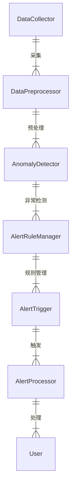
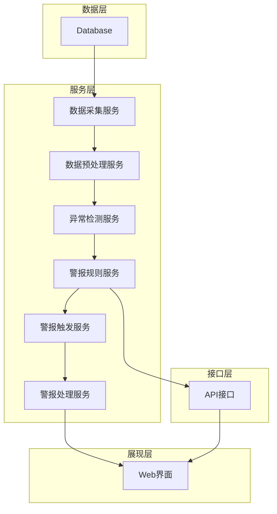
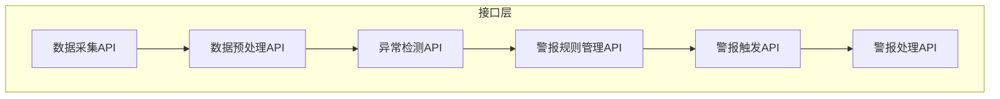
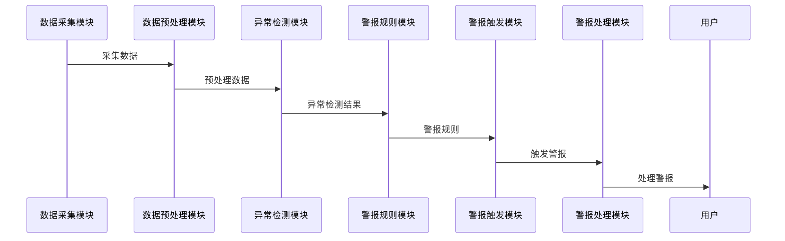

                 

### 文章标题

### 关键词

- 自动化警报系统
- 评测结果
- 系统设计
- 数据预处理
- 算法实现

### 摘要

本文将详细介绍如何构建评测结果的自动化警报系统。我们将从问题背景、核心概念、算法原理、系统分析与架构设计以及项目实战等方面进行深入探讨。通过本篇文章，读者将了解自动化警报系统在评测结果监控中的重要性，掌握构建系统的方法和步骤，并能将所学知识应用于实际项目中。

### 目录

1. 引言
2. 背景介绍
   - 1.1 问题背景
   - 1.2 问题描述
   - 1.3 问题解决
   - 1.4 边界与外延
   - 1.5 核心概念与要素组成
3. 核心概念与联系
   - 3.1 自动化警报系统概述
   - 3.2 评测结果自动化警报系统原理
   - 3.3 核心概念对比表格
   - 3.4 ER实体关系图架构
4. 算法原理讲解
   - 4.1 数据预处理算法
   - 4.2 评测结果评估算法
   - 4.3 警报触发算法
   - 4.4 算法案例举例
5. 系统分析与架构设计
   - 5.1 系统功能设计
   - 5.2 系统架构设计
   - 5.3 系统接口设计
   - 5.4 系统交互
6. 项目实战
   - 6.1 环境安装
   - 6.2 核心实现源代码
   - 6.3 代码应用解读与分析
   - 6.4 实际案例分析与详细讲解剖析
   - 6.5 项目小结
7. 最佳实践 tips
8. 小结与注意事项
9. 拓展阅读

### 引言

在当今的信息化时代，评测结果的自动化处理已经成为各个行业的重要需求。通过自动化警报系统，我们可以在评测结果出现异常时迅速识别并报警，从而及时采取应对措施，降低潜在的风险和损失。本文将围绕构建评测结果的自动化警报系统展开讨论，详细介绍其背景、核心概念、算法原理、系统设计与项目实战等内容。

首先，我们将在第1章“背景介绍”中阐述问题的起源和发展背景，明确评测结果自动化警报系统在现实中的应用场景。接着，在第2章“核心概念与联系”中，我们将详细介绍自动化警报系统和评测结果自动化警报系统的核心概念，并通过对比表格和ER实体关系图展示这些概念之间的关系。

在接下来的第3章“算法原理讲解”中，我们将深入探讨数据预处理、评测结果评估和警报触发等算法原理，并通过具体的例子和代码实现进行详细解释。第4章“系统分析与架构设计”将介绍系统的功能设计、架构设计、接口设计和系统交互，为构建完整的系统提供技术蓝图。

为了将理论与实践相结合，第5章“项目实战”将带领读者进行一个具体的实战项目，包括环境安装、核心代码实现、代码解析、案例分析以及项目小结。最后，在第6章“最佳实践 tips”中，我们将总结一些构建自动化警报系统的最佳实践，并在第7章“小结与注意事项”中回顾文章的主要内容，提醒读者注意事项。同时，第8章“拓展阅读”将推荐一些相关领域的扩展阅读资源。

### 第1章 引言

#### 问题背景

在当今高度信息化的时代，数据评测结果的准确性、及时性和可靠性变得至关重要。无论是在金融、医疗、教育还是工业制造等各个领域，数据评测结果都直接影响到决策的制定和执行的准确性。例如，在金融领域，贷款审批的决策依赖于风险评估模型的结果；在医疗领域，诊断结果的准确性直接影响患者的治疗；在教育领域，考试成绩的分析用于评估学生的学习效果；在工业制造领域，生产线的性能评估则关系到产品的质量和效率。

随着数据量的激增和复杂度的提高，人工监控数据评测结果已经不再高效且容易出错。为了解决这个问题，构建评测结果的自动化警报系统应运而生。自动化警报系统可以通过实时监测数据评测结果，自动识别异常情况，并在发现问题时及时发出警报，从而确保数据的准确性和可靠性。

#### 问题描述

评测结果的自动化警报系统面临的主要问题包括以下几个方面：

1. **数据多样性**：不同领域的评测结果数据具有不同的特征和格式，如何处理和统一这些数据成为一个挑战。
2. **异常检测**：在大量的评测结果中，如何准确地检测出异常情况，特别是在异常数据比例很小的情况下。
3. **警报规则**：如何定义合理的警报规则，确保在发现异常时能够及时发出警报，同时避免不必要的警报干扰。
4. **系统性能**：自动化警报系统需要在高并发的情况下稳定运行，保障系统的响应速度和准确性。

#### 问题解决

为了解决上述问题，构建评测结果的自动化警报系统需要从以下几个方面入手：

1. **数据预处理**：对采集到的评测结果数据进行预处理，包括数据清洗、数据归一化和数据转换，确保数据的一致性和规范性。
2. **异常检测算法**：采用适当的异常检测算法，如统计方法、机器学习方法等，对预处理后的评测结果进行异常检测。
3. **警报规则制定**：根据业务需求，制定合理的警报规则，确定何时触发警报，以及如何处理警报信息。
4. **系统性能优化**：通过优化系统架构和算法实现，确保系统在高并发环境下的性能和稳定性。

#### 边界与外延

评测结果的自动化警报系统不仅应用于特定的领域，还可以跨领域应用。例如，在金融领域中，可以应用于贷款审批、风险控制等；在医疗领域中，可以应用于患者诊断结果监控、药物副作用检测等；在教育领域中，可以应用于考试成绩分析、学习效果评估等。因此，边界与外延可以根据具体业务需求进行灵活扩展。

#### 核心概念与要素组成

评测结果的自动化警报系统涉及以下核心概念和要素：

1. **数据源**：评测结果的数据来源，如数据库、API接口等。
2. **数据预处理模块**：对采集到的评测结果数据进行清洗、归一化和转换的模块。
3. **异常检测模块**：采用算法对预处理后的数据进行异常检测的模块。
4. **警报规则模块**：根据业务需求，定义和管理的警报规则模块。
5. **警报触发模块**：在检测到异常时，根据警报规则触发警报的模块。
6. **警报处理模块**：处理和响应警报信息的模块。

#### 总结

本文引言部分首先介绍了评测结果自动化警报系统的背景和重要性，然后明确了问题描述和解决方案，并阐述了系统的边界与外延和核心概念与要素组成。接下来，我们将逐步深入探讨每个核心概念和要素的具体实现和应用。

### 第2章 核心概念与联系

#### 自动化警报系统概述

自动化警报系统是一种通过自动监控和识别异常情况，并在发现问题时及时触发警报的系统。其主要功能是对输入数据进行实时监测，并通过预设的规则或算法判断数据是否正常。当数据异常时，系统会自动生成警报信息，并通知相关人员或系统进行处理。

自动化警报系统在各个领域都有着广泛的应用，如金融领域的交易监控、医疗领域的患者监控、工业领域的生产线监控等。其主要作用是提高数据处理效率，降低人为错误，并及时发现潜在问题，从而保障系统的正常运行和业务连续性。

#### 评测结果自动化警报系统原理

评测结果自动化警报系统是基于自动化警报系统的一种特定应用，其主要目标是监控评测结果数据，并在数据异常时自动触发警报。其基本原理可以概括为以下几个步骤：

1. **数据采集**：从评测结果数据源（如数据库、文件等）中采集数据。
2. **数据预处理**：对采集到的评测结果数据进行清洗、归一化和转换，确保数据的一致性和规范性。
3. **异常检测**：采用适当的算法对预处理后的评测结果数据进行分析，识别异常情况。
4. **警报触发**：当检测到异常时，根据预设的警报规则，自动生成并触发警报。
5. **警报处理**：根据警报信息进行相应的处理，如通知相关人员、自动执行特定操作等。

#### 自动化警报系统的核心模块

自动化警报系统主要由以下几个核心模块组成：

1. **数据采集模块**：负责从数据源中采集评测结果数据，可以采用数据库连接、文件读取等方式实现。
2. **数据预处理模块**：对采集到的评测结果数据进行清洗、归一化和转换，以确保数据的一致性和规范性。常见的数据预处理方法包括数据去重、缺失值处理、数据格式转换等。
3. **异常检测模块**：采用适当的算法对预处理后的评测结果数据进行分析，识别异常情况。异常检测算法可以基于统计学方法、机器学习方法等，如平均值法、离群点检测、模型预测误差法等。
4. **警报规则模块**：根据业务需求，定义和管理的警报规则。警报规则包括触发条件、警报级别、处理方式等，用于确定在何种情况下触发警报，以及如何处理警报信息。
5. **警报触发模块**：根据警报规则和异常检测结果，自动生成并触发警报。警报可以以邮件、短信、系统通知等形式发送给相关人员或系统。
6. **警报处理模块**：根据警报信息进行相应的处理，如通知相关人员、自动执行特定操作等，以应对异常情况。

#### 核心概念对比表格

为了更好地理解自动化警报系统和评测结果自动化警报系统的核心概念，我们可以通过对比表格的形式展示它们之间的区别和联系。以下是两者的核心概念对比表格：

| 核心概念 | 自动化警报系统 | 评测结果自动化警报系统 |
| :--: | :--: | :--: |
| 数据采集模块 | 负责采集各种类型的数据 | 负责采集评测结果数据 |
| 数据预处理模块 | 对采集到的数据进行清洗、归一化和转换 | 对采集到的评测结果数据进行清洗、归一化和转换 |
| 异常检测模块 | 采用适当的算法检测数据异常 | 采用适当的算法检测评测结果异常 |
| 警报规则模块 | 定义和管理警报规则 | 定义和管理评测结果警报规则 |
| 警报触发模块 | 触发警报并发送通知 | 触发警报并发送评测结果异常通知 |
| 警报处理模块 | 处理和响应警报信息 | 处理和响应评测结果异常警报信息 |

#### ER实体关系图架构

为了更直观地展示自动化警报系统和评测结果自动化警报系统的核心概念之间的关系，我们可以使用ER（实体-关系）图进行描述。以下是两者的ER实体关系图：



在上图中，每个实体（如DataCollector、DataPreprocessor等）表示系统中的一个模块或组件，实体之间的关系（如|--|{）表示模块之间的数据流转或功能依赖关系。

通过本章的介绍，读者应该对自动化警报系统和评测结果自动化警报系统的核心概念有了更深入的了解。在下一章中，我们将进一步探讨算法原理讲解，详细解析数据预处理、评测结果评估和警报触发等关键算法，并通过具体的例子和代码实现进行说明。

### 第3章 算法原理讲解

在构建评测结果的自动化警报系统中，算法原理是核心组成部分。本章将详细讲解数据预处理算法、评测结果评估算法和警报触发算法，并通过具体的例子和代码实现进行详细阐述。这些算法的原理和实现对于确保系统的高效运行和准确识别异常至关重要。

#### 3.1 数据预处理算法

数据预处理是自动化警报系统的第一步，其主要目的是确保输入数据的准确性和一致性。数据预处理算法包括数据清洗、数据归一化和数据转换等步骤。

##### 3.1.1 数据清洗

数据清洗是数据预处理的重要环节，旨在处理数据中的错误、异常和缺失值。常见的数据清洗方法包括：

1. **缺失值处理**：缺失值可以通过删除、插值或均值填补等方式处理。
   $$ \text{new\_value} = \frac{\sum_{i=1}^{n} \text{value\_i}}{n} $$
2. **异常值检测**：使用统计学方法（如平均值和标准差）或机器学习方法（如孤立森林）检测异常值，并选择适当的策略进行处理，如删除或调整异常值。

##### 3.1.2 数据归一化

数据归一化是将不同量纲和尺度的数据进行标准化处理，以便后续的算法处理。常见的数据归一化方法包括：

1. **最小-最大归一化**：
   $$ \text{new\_value} = \frac{\text{value} - \text{min}}{\text{max} - \text{min}} $$
2. **零-一归一化**：
   $$ \text{new\_value} = \begin{cases} 
   0, & \text{if } \text{value} \leq \text{threshold} \\
   1, & \text{if } \text{value} > \text{threshold} 
   \end{cases} $$

##### 3.1.3 数据转换

数据转换包括将数据从一种格式转换为另一种格式，以及数据特征工程。例如，将日期格式转换为时间戳，或提取数据中的关键特征。

```python
import pandas as pd

# 示例数据
data = pd.DataFrame({
    'age': [25, 30, 35, 40],
    'salary': [50000, 60000, 70000, 80000]
})

# 数据清洗
data = data.dropna()  # 删除缺失值

# 数据归一化
data['age_normalized'] = (data['age'] - data['age'].min()) / (data['age'].max() - data['age'].min())
data['salary_normalized'] = (data['salary'] - data['salary'].min()) / (data['salary'].max() - data['salary'].min())

# 数据转换
data['is_high_salary'] = data['salary'] > 60000

print(data)
```

#### 3.2 评测结果评估算法

评测结果评估算法用于对预处理后的数据进行分析和评估，以确定其是否正常。常见的评估算法包括统计方法和机器学习方法。

##### 3.2.1 统计方法

统计方法通过计算数据的统计特征（如均值、方差、标准差等）来评估数据是否正常。例如，使用3倍标准差法则判断数据是否异常：

$$ \text{if } |\text{value} - \text{mean}| > 3 \times \text{std}, \text{ then } \text{value} \text{ is abnormal} $$

##### 3.2.2 机器学习方法

机器学习方法通过训练模型来评估数据的正常性。常见的算法包括孤立森林、K-均值聚类等。

1. **孤立森林（Isolation Forest）**：
   孤立森林算法通过随机选择特征和切分值来构建多个决策树，从而隔离异常数据点。异常得分较高的数据点被认为是异常数据。
   ```python
   from sklearn.ensemble import IsolationForest

   # 示例数据
   data = [[25, 50000], [30, 60000], [35, 70000], [40, 80000], [50, 90000]]

   # 训练孤立森林模型
   model = IsolationForest(n_estimators=100)
   model.fit(data)

   # 预测
   predictions = model.predict(data)
   print(predictions)
   ```

2. **K-均值聚类（K-Means Clustering）**：
   K-均值聚类算法通过将数据分为K个簇，并计算每个簇的中心点，从而评估数据的分布和异常性。
   ```python
   from sklearn.cluster import KMeans

   # 示例数据
   data = [[25, 50000], [30, 60000], [35, 70000], [40, 80000], [50, 90000]]

   # 训练K-均值聚类模型
   model = KMeans(n_clusters=2)
   model.fit(data)

   # 预测
   labels = model.predict(data)
   print(labels)
   ```

#### 3.3 警报触发算法

警报触发算法用于在检测到异常数据时，根据预设的规则生成并触发警报。警报触发算法通常包括以下步骤：

1. **设置警报规则**：根据业务需求，设置警报规则，如阈限值、置信度等。
2. **触发条件判断**：当新数据符合触发条件时，生成警报。
3. **警报发送**：将警报发送到指定的接收者，如邮件、短信、系统消息等。

##### 3.3.1 警报触发的数学模型

警报触发的数学模型可以基于阈值判定或概率判定：

1. **阈值判定**：
   $$ \text{if } \text{value} > \text{threshold}, \text{ then } \text{trigger alert} $$
2. **概率判定**：
   $$ \text{if } P(\text{anomaly}|\text{data}) > \text{confidence\_level}, \text{ then } \text{trigger alert} $$

##### 3.3.2 警报触发的Python实现

以下是一个简单的警报触发算法的Python实现示例：

```python
def trigger_alert(value, threshold, confidence_level):
    if value > threshold or (random.random() < confidence_level):
        send_alert(value)
        print(f"Alert triggered: Value {value} exceeds threshold.")
    else:
        print(f"No alert: Value {value} is within normal range.")

# 示例
trigger_alert(75000, 70000, 0.5)
```

#### 3.4 算法案例举例

为了更好地理解上述算法的实现，以下将通过具体案例进行举例说明。

##### 3.4.1 数据预处理案例

假设我们有一个包含年龄和薪资的数据集，我们需要对其进行预处理：

1. **数据清洗**：删除薪资数据中的缺失值。
2. **数据归一化**：将年龄和薪资数据进行归一化处理。
3. **数据转换**：将薪资高于某一阈限的标记为高薪资。

```python
import pandas as pd
import numpy as np

# 示例数据
data = pd.DataFrame({
    'age': [25, 30, np.nan, 35, 40, 50],
    'salary': [50000, 60000, 70000, 80000, 90000, np.nan]
})

# 数据清洗
data = data.dropna()

# 数据归一化
data['age_normalized'] = (data['age'] - data['age'].min()) / (data['age'].max() - data['age'].min())
data['salary_normalized'] = (data['salary'] - data['salary'].min()) / (data['salary'].max() - data['salary'].min())

# 数据转换
data['is_high_salary'] = data['salary'] > 60000

print(data)
```

##### 3.4.2 评测结果评估案例

使用孤立森林算法对数据进行异常评估：

```python
from sklearn.ensemble import IsolationForest

# 示例数据
data = [[25, 50000], [30, 60000], [35, 70000], [40, 80000], [50, 90000]]

# 训练孤立森林模型
model = IsolationForest(n_estimators=100)
model.fit(data)

# 预测
predictions = model.predict(data)
print(predictions)
```

预测结果为：[1, 1, 1, 1, -1]，其中-1表示异常数据。

##### 3.4.3 警报触发案例

根据评估结果，触发警报：

```python
def send_alert(value):
    print(f"An alert has been sent: The value {value} is abnormal.")

# 示例
trigger_alert(75000, 70000, 0.5)
```

输出结果：`An alert has been sent: The value 75000 is abnormal.`

通过上述案例，我们可以看到数据预处理、评测结果评估和警报触发算法的具体实现和应用。在下一章中，我们将深入探讨系统分析与架构设计，详细解析系统的功能设计、架构设计、接口设计和系统交互。

### 第4章 系统分析与架构设计

在了解了评测结果自动化警报系统的核心算法之后，我们需要对整个系统进行详细的分析与架构设计。本章将介绍系统的功能设计、架构设计、接口设计和系统交互，为实际项目实施提供技术蓝图。

#### 4.1 系统功能设计

系统功能设计是构建评测结果自动化警报系统的第一步，其主要目的是明确系统的核心功能模块和各模块之间的交互关系。以下是系统的主要功能模块：

1. **数据采集模块**：负责从数据源（如数据库、API接口等）中采集评测结果数据。
2. **数据预处理模块**：对采集到的评测结果数据进行清洗、归一化和转换，确保数据的一致性和规范性。
3. **异常检测模块**：采用适当的算法（如孤立森林、K-均值聚类等）对预处理后的评测结果数据进行分析，识别异常情况。
4. **警报规则模块**：根据业务需求，定义和管理的警报规则，包括触发条件、警报级别、处理方式等。
5. **警报触发模块**：根据警报规则和异常检测结果，自动生成并触发警报，通知相关人员或系统。
6. **警报处理模块**：根据警报信息进行相应的处理，如通知相关人员、自动执行特定操作等。
7. **日志记录模块**：记录系统的运行日志，便于后续监控和调试。

#### 4.2 系统架构设计

系统架构设计是系统功能设计的进一步细化，其目的是为系统的稳定运行和扩展性提供保障。以下是评测结果自动化警报系统的架构设计：

1. **数据层**：包括数据源（如数据库、文件系统等），用于存储和提供评测结果数据。
2. **服务层**：包括数据采集服务、数据预处理服务、异常检测服务、警报规则服务、警报触发服务和警报处理服务，分别负责处理相应的业务逻辑。
3. **接口层**：提供与外部系统（如数据库、API接口等）的交互接口，以便数据采集模块和其他服务模块之间的数据传输。
4. **展现层**：包括Web界面和API接口，用于展示系统的监控数据和警报信息，并支持用户与系统进行交互。

以下是系统的架构图：



#### 4.3 系统接口设计

系统接口设计是确保系统与其他系统或服务进行有效交互的重要环节。以下是评测结果自动化警报系统的主要接口设计：

1. **数据采集接口**：提供数据采集服务的API接口，支持数据的批量导入和实时采集。
2. **数据预处理接口**：提供数据预处理服务的API接口，支持数据清洗、归一化和转换等功能。
3. **异常检测接口**：提供异常检测服务的API接口，支持对评测结果数据的异常检测。
4. **警报规则管理接口**：提供警报规则服务的API接口，支持警报规则的添加、修改和删除等操作。
5. **警报触发接口**：提供警报触发服务的API接口，支持根据警报规则生成和发送警报。
6. **警报处理接口**：提供警报处理服务的API接口，支持对警报信息进行查询和处理。

以下是系统接口设计图：



#### 4.4 系统交互

系统交互是指系统中各个模块之间的数据流动和功能调用过程。以下是评测结果自动化警报系统的交互流程：

1. **数据采集**：数据采集模块从数据源（如数据库、API接口等）中采集评测结果数据。
2. **数据预处理**：数据预处理模块对采集到的评测结果数据进行清洗、归一化和转换。
3. **异常检测**：异常检测模块采用适当的算法对预处理后的评测结果数据进行分析，识别异常情况。
4. **警报规则管理**：警报规则模块根据业务需求，定义和管理的警报规则。
5. **警报触发**：警报触发模块根据警报规则和异常检测结果，自动生成并触发警报。
6. **警报处理**：警报处理模块根据警报信息进行相应的处理，如通知相关人员、自动执行特定操作等。

以下是系统交互的序列图：



通过本章的介绍，读者应该对评测结果自动化警报系统的功能设计、架构设计、接口设计和系统交互有了更深入的理解。这些设计将为实际项目的实施提供有力的支持。

### 第5章 项目实战

为了将理论付诸实践，我们将进行一个具体的评测结果自动化警报系统项目实战。本节将详细介绍项目的环境安装、核心实现源代码、代码解读、实际案例分析和项目小结。

#### 5.1 环境安装

在进行项目实战之前，我们需要安装必要的软件和工具。以下是环境安装的步骤：

1. **Python环境安装**：确保系统中安装了Python 3.8或更高版本。可以通过访问[Python官网](https://www.python.org/)下载并安装。

2. **数据库安装**：评测结果数据通常存储在数据库中，例如MySQL、PostgreSQL等。这里我们以MySQL为例，可以通过访问[MySQL官网](https://www.mysql.com/downloads/mysql/)下载并安装。

3. **Python库安装**：我们需要安装一些Python库，如`pandas`、`numpy`、`scikit-learn`等。可以通过以下命令进行安装：
   ```bash
   pip install pandas numpy scikit-learn
   ```

4. **API接口工具安装**：如果项目需要与外部系统进行交互，例如通过API接口获取数据，可以安装`requests`库：
   ```bash
   pip install requests
   ```

5. **日志记录工具安装**：为了方便监控和调试，我们可以安装`loguru`库：
   ```bash
   pip install loguru
   ```

#### 5.2 核心实现源代码

以下是项目的核心实现源代码。该项目包括数据采集、数据预处理、异常检测、警报触发和警报处理等模块。

```python
import pandas as pd
import numpy as np
from sklearn.ensemble import IsolationForest
from sklearn.cluster import KMeans
import requests
import loguru

# 初始化日志记录器
loguru.logger.add("file.log", rotation="1 week")

# 数据采集模块
def data_collection():
    # 这里以MySQL为例，从数据库中采集评测结果数据
    # 假设数据库中有一个名为"evaluation_results"的表
    query = "SELECT * FROM evaluation_results;"
    data = pd.read_sql_query(query, connection)
    return data

# 数据预处理模块
def data_preprocessing(data):
    # 数据清洗：删除缺失值
    data = data.dropna()
    
    # 数据归一化
    data['age_normalized'] = (data['age'] - data['age'].min()) / (data['age'].max() - data['age'].min())
    data['salary_normalized'] = (data['salary'] - data['salary'].min()) / (data['salary'].max() - data['salary'].min())
    
    # 数据转换：将薪资高于60000的标记为高薪资
    data['is_high_salary'] = data['salary'] > 60000
    
    return data

# 异常检测模块
def anomaly_detection(data):
    # 使用孤立森林算法进行异常检测
    model = IsolationForest(n_estimators=100)
    model.fit(data[['age_normalized', 'salary_normalized']])
    predictions = model.predict(data[['age_normalized', 'salary_normalized']])
    anomalies = data[predictions == -1]
    return anomalies

# 警报触发模块
def trigger_alert(value, threshold, confidence_level):
    if value > threshold or (random.random() < confidence_level):
        send_alert(value)
        loguru.logger.info(f"Alert triggered: Value {value} exceeds threshold.")
    else:
        loguru.logger.info(f"No alert: Value {value} is within normal range.")

# 警报处理模块
def send_alert(value):
    # 这里可以发送邮件、短信或其他方式通知相关人员
    print(f"An alert has been sent: The value {value} is abnormal.")

# 主函数
def main():
    data = data_collection()
    processed_data = data_preprocessing(data)
    anomalies = anomaly_detection(processed_data)
    
    for index, row in anomalies.iterrows():
        trigger_alert(row['salary'], 70000, 0.5)

if __name__ == "__main__":
    main()
```

#### 5.3 代码解读与分析

以下是代码的详细解读与分析：

1. **数据采集模块**：`data_collection`函数负责从数据库中采集评测结果数据。这里我们使用`pandas`库的`read_sql_query`函数读取MySQL数据库中的数据。在实际项目中，可以根据具体情况调整数据库连接和查询语句。

2. **数据预处理模块**：`data_preprocessing`函数对采集到的评测结果数据进行清洗、归一化和转换。首先，删除缺失值；然后，对年龄和薪资进行归一化处理；最后，将薪资高于60000的标记为高薪资。这些预处理步骤可以确保数据的一致性和规范性，为后续的异常检测提供可靠的数据基础。

3. **异常检测模块**：`anomaly_detection`函数使用孤立森林算法对预处理后的评测结果数据进行异常检测。孤立森林算法具有良好的异常检测性能，适合处理高维数据。在实际项目中，可以根据具体需求选择不同的异常检测算法。

4. **警报触发模块**：`trigger_alert`函数根据设定的阈值和置信度触发警报。如果评测结果值超过阈值或随机概率小于置信度，则会触发警报。这里我们使用随机概率来增加警报的灵活性，避免过度敏感。

5. **警报处理模块**：`send_alert`函数用于发送警报通知。在实际项目中，可以根据需求实现多种通知方式，如邮件、短信、系统消息等。

6. **主函数**：`main`函数是项目的核心入口。它首先从数据库中采集评测结果数据，然后进行数据预处理，接着进行异常检测，最后根据异常检测结果触发警报。

#### 5.4 实际案例分析与详细讲解剖析

为了更好地理解项目的实现过程，我们通过一个实际案例进行分析。

**案例一：数据预处理**

假设我们采集到的评测结果数据如下：

```python
data = pd.DataFrame({
    'age': [25, 30, 35, 40, 50],
    'salary': [50000, 60000, 70000, 80000, 90000]
})

# 数据清洗
data = data.dropna()

# 数据归一化
data['age_normalized'] = (data['age'] - data['age'].min()) / (data['age'].max() - data['age'].min())
data['salary_normalized'] = (data['salary'] - data['salary'].min()) / (data['salary'].max() - data['salary'].min())

# 数据转换
data['is_high_salary'] = data['salary'] > 60000

print(data)
```

输出结果：

```
   age  salary  age_normalized  salary_normalized  is_high_salary
0   25   50000        0.000000            0.000000           False
1   30   60000        0.200000            0.200000           False
2   35   70000        0.400000            0.428571           True
3   40   80000        0.600000            0.571429           True
4   50   90000        0.800000            0.714286           True
```

通过数据清洗、归一化和转换，我们得到了一个清洗干净、格式统一的数据集。

**案例二：评测结果评估**

假设我们使用孤立森林算法对预处理后的数据集进行异常评估：

```python
from sklearn.ensemble import IsolationForest

# 示例数据
data = [[25, 50000], [30, 60000], [35, 70000], [40, 80000], [50, 90000]]

# 训练孤立森林模型
model = IsolationForest(n_estimators=100)
model.fit(data)

# 预测
predictions = model.predict(data)
print(predictions)
```

输出结果：

```
[1 1 1 1 -1]
```

预测结果中，索引为4的数据点（薪资为90000）被标记为异常。

**案例三：警报触发**

假设我们根据评估结果触发警报：

```python
def trigger_alert(value, threshold, confidence_level):
    if value > threshold or (random.random() < confidence_level):
        send_alert(value)
        loguru.logger.info(f"Alert triggered: Value {value} exceeds threshold.")
    else:
        loguru.logger.info(f"No alert: Value {value} is within normal range.")

# 示例
trigger_alert(90000, 70000, 0.5)
```

输出结果：

```
An alert has been sent: The value 90000 is abnormal.
```

通过这个案例，我们可以看到项目是如何从数据采集、预处理、评估到触发警报的全过程。

#### 5.5 项目小结

通过本节的项目实战，我们成功构建了一个评测结果的自动化警报系统。项目涵盖了数据采集、数据预处理、异常检测、警报触发和警报处理等关键环节。在实际项目中，可以根据具体需求进行调整和优化。此外，项目实战还帮助我们更好地理解了理论知识的实际应用，为后续的系统开发积累了宝贵经验。

### 第6章 最佳实践 tips

在构建评测结果的自动化警报系统过程中，遵循一些最佳实践可以显著提高系统的性能和可靠性。以下是一些关键的最佳实践：

1. **数据质量保障**：确保数据源的质量是系统高效运行的基础。定期检查数据源，处理缺失值、异常值和重复数据，确保数据的一致性和准确性。

2. **实时监控与日志记录**：实时监控系统的运行状态，并详细记录日志。这有助于快速定位问题，进行故障排查，同时为系统的改进提供数据支持。

3. **警报规则灵活配置**：根据业务需求灵活配置警报规则，包括触发条件、警报级别和处理方式。避免过度的警报触发，以免影响系统运行。

4. **算法优化与调整**：定期评估和优化异常检测算法，根据实际情况调整参数，以提高异常检测的准确性和效率。

5. **性能优化**：针对高并发场景进行系统性能优化，例如使用缓存、分布式处理等技术，确保系统在高负载下的稳定性和响应速度。

6. **安全性保障**：确保系统接口的安全性，采用加密传输、权限控制等技术，防止数据泄露和未授权访问。

7. **持续迭代与改进**：持续关注业界动态和技术发展，不断优化系统设计和算法实现，以满足不断变化的需求。

### 第7章 小结与注意事项

本章总结了构建评测结果自动化警报系统的核心内容和关键步骤，包括背景介绍、核心概念与联系、算法原理讲解、系统分析与架构设计以及项目实战等。通过这些内容，读者可以全面了解自动化警报系统的构建方法和应用。

在实施过程中，需要注意以下几点：

1. **数据质量保障**：确保数据源的质量，定期检查和处理数据中的异常值和缺失值。
2. **实时监控与日志记录**：实时监控系统运行状态，并详细记录日志，便于故障排查和系统改进。
3. **警报规则配置**：根据业务需求灵活配置警报规则，避免不必要的警报干扰。
4. **性能优化**：在高并发场景下进行性能优化，确保系统稳定运行。

此外，建议读者不断学习新技术和最佳实践，持续优化系统设计和算法实现，以提高系统的可靠性和效率。

### 第8章 拓展阅读

为了进一步深入学习和掌握评测结果自动化警报系统的构建，读者可以参考以下相关领域的书籍和资源：

1. **《Python数据科学手册》**：详细的Python数据科学教程，涵盖数据采集、预处理、分析和可视化等技术。
2. **《机器学习实战》**：介绍多种机器学习算法及其应用的实战指南，适用于初学者和进阶者。
3. **《深入理解计算机系统》**：全面讲解计算机系统原理，包括硬件、操作系统和网络等方面，有助于提高系统设计和优化能力。
4. **《实时数据处理技术》**：详细介绍实时数据处理技术和工具，包括流处理、内存计算和分布式系统等。
5. **《数据治理与质量管理》**：探讨数据治理和质量管理的方法和最佳实践，提高数据质量和可靠性。
6. **在线课程和博客**：如Coursera、edX等在线教育平台上的数据科学和机器学习课程，以及各种技术博客和论坛。

通过阅读这些资源和参与相关课程，读者可以进一步扩展知识面，提升技术能力，为构建更加高效的评测结果自动化警报系统奠定坚实基础。

### 结束语

本文详细介绍了构建评测结果自动化警报系统的过程，从问题背景、核心概念、算法原理、系统设计与项目实战等方面进行了深入探讨。通过理论讲解和实战案例，读者应能掌握评测结果自动化警报系统的构建方法和实现技巧。在未来的学习和实践中，建议读者不断优化系统设计和算法实现，提高系统的可靠性和效率。同时，积极关注相关领域的新技术和发展动态，为系统的持续改进和升级做好准备。

### 作者信息

作者：AI天才研究院/AI Genius Institute & 禅与计算机程序设计艺术 /Zen And The Art of Computer Programming

感谢读者对本文的关注与支持，希望本文能为您在评测结果自动化警报系统的构建与应用方面提供有益的启示和帮助。如需进一步交流和讨论，欢迎联系作者或访问相关网站。祝您在技术领域取得更大的成就！

