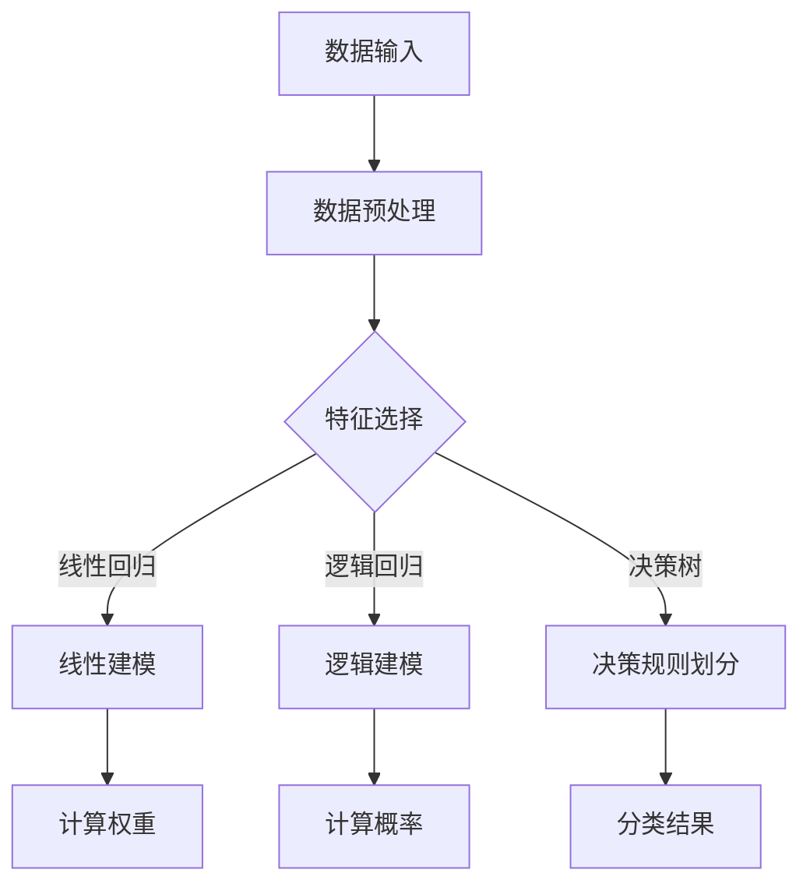
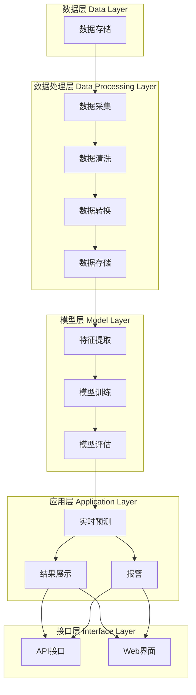
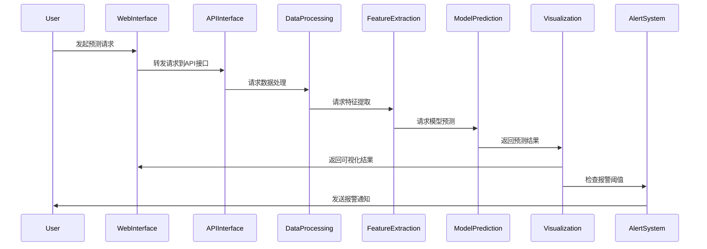

                 

### 引言

构建评测结果的预测模型是一项重要的应用，广泛应用于各种领域，如金融、医疗、市场营销等。在这篇文章中，我们将深入探讨如何构建这样的预测模型，从而提高评测的准确性和效率。我们将从以下几个角度逐步分析这一问题：

1. **问题背景与核心概念**：首先，我们将介绍评测结果预测的重要性及其应用领域，并讨论当前面临的挑战。接着，我们将详细解释预测模型、机器学习、数据挖掘等核心概念，并探讨它们之间的联系与边界外延。
2. **核心概念原理与算法**：接下来，我们将深入研究预测模型的原理，包括其数学模型和运行机制，并介绍常见的预测算法。我们还将通过对比表格展示不同算法的特点，并提供通俗易懂的举例说明。
3. **系统设计与实现**：我们将详细讨论系统分析与架构设计，包括问题场景介绍、系统功能设计、系统架构设计、系统接口设计以及系统交互。同时，我们将通过实际案例展示系统实现的过程。
4. **项目实战**：我们将介绍项目环境安装、系统核心实现、代码应用解读与分析，以及实际案例分析与详细讲解。
5. **最佳实践与注意事项**：最后，我们将总结最佳实践技巧，强调注意事项，并提供拓展阅读建议。

通过以上步骤，我们将全面解析评测结果预测模型的构建过程，帮助读者深入理解和掌握这一重要技术。

### 问题背景与核心概念

#### 1.1 问题背景介绍

评测结果预测在现代应用中扮演着至关重要的角色。无论是在商业领域还是科研领域，对结果的准确预测都具有深远的影响。例如，在金融领域，准确预测股市的走势可以帮助投资者做出明智的投资决策；在医疗领域，预测病人的病情发展可以帮助医生制定更为有效的治疗方案；在市场营销领域，预测消费者的购买行为可以帮助企业制定更精准的营销策略。

然而，随着数据量的不断增长和数据类型的多样化，传统的评测方法已经难以满足需求。此时，预测模型作为一种基于数据分析与机器学习的技术，成为了解决这一问题的有效手段。预测模型通过对历史数据的分析和学习，能够预测未来可能发生的事件或结果，从而为决策提供有力支持。

#### 1.1.1 评测结果预测的重要性

评测结果预测的重要性主要体现在以下几个方面：

1. **提高决策准确性**：通过预测模型，可以更准确地预测评测结果，从而提高决策的准确性。这对于需要基于数据做出决策的领域尤为重要。
2. **降低成本和风险**：预测模型能够帮助提前识别潜在的问题或风险，从而采取预防措施，降低成本和风险。
3. **优化资源配置**：预测模型可以根据预测结果优化资源配置，提高资源利用效率，从而提高整体效益。
4. **增强竞争力**：准确的市场预测可以帮助企业抓住市场机遇，制定更具竞争力的策略，从而在激烈的市场竞争中脱颖而出。

#### 1.1.2 评测结果预测的应用领域

评测结果预测的应用领域非常广泛，涵盖了多个行业和领域。以下是一些典型的应用领域：

1. **金融**：在金融领域，预测模型可以用于股票市场分析、风险管理、信用评分等方面。例如，通过分析历史股价数据，可以预测未来股价的走势，为投资者提供参考。
2. **医疗**：在医疗领域，预测模型可以用于疾病预测、患者风险评分、手术结果预测等方面。通过分析患者的医疗数据，可以预测患者的健康状况和手术风险，从而帮助医生制定更有效的治疗方案。
3. **市场营销**：在市场营销领域，预测模型可以用于消费者行为预测、销售预测、市场细分等方面。通过分析消费者的购买记录和偏好数据，可以预测消费者的购买行为，为企业制定精准的营销策略。
4. **交通**：在交通领域，预测模型可以用于交通流量预测、交通事故预测等方面。通过分析历史交通数据，可以预测未来的交通流量和交通事故风险，从而帮助交通管理部门优化交通调度和事故预防措施。

#### 1.1.3 当前评测结果预测面临的挑战

尽管评测结果预测技术在过去几十年中取得了显著进展，但仍然面临着一些挑战：

1. **数据质量**：预测模型的准确性高度依赖于数据质量。如果数据存在噪声、缺失或错误，将严重影响预测结果。因此，数据清洗和预处理是预测模型构建中的重要步骤。
2. **数据量**：随着数据量的不断增长，如何高效地处理大量数据成为一大挑战。传统的数据处理方法在处理大规模数据时可能会变得非常缓慢。
3. **模型选择**：不同的预测模型适用于不同的应用场景和数据类型。如何选择合适的模型，以及如何调整和优化模型参数，是预测模型构建中的关键问题。
4. **模型解释性**：预测模型，尤其是深度学习模型，通常具有较高的预测准确性，但其内部机制复杂，难以解释。如何提高模型的解释性，使其更容易被非专业人员理解，是一个亟待解决的问题。

在接下来的章节中，我们将详细讨论预测模型的定义、类型、关键要素，以及与机器学习、数据挖掘和统计学的联系。这将为我们深入理解预测模型提供坚实的理论基础。

### 核心概念

#### 1.2.1 预测模型的定义

预测模型是一种基于历史数据和分析技术的数学模型，用于预测未来事件或结果。它通过从数据中提取特征和模式，构建出一个能够映射输入特征到预测结果的函数。这个函数可以是一个简单的线性函数，也可以是一个复杂的非线性函数，具体取决于数据类型和预测需求。

#### 1.2.2 预测模型的类型

预测模型可以分为多种类型，根据其功能和应用场景的不同，可以分为以下几类：

1. **回归模型**：回归模型用于预测连续值结果。例如，线性回归模型可以用于预测房价、股票价格等。回归模型的核心是找到一个最佳拟合直线，使得预测值与实际值之间的误差最小。
2. **分类模型**：分类模型用于预测离散值结果。例如，决策树、支持向量机（SVM）和神经网络等模型可以用于分类任务，如邮件分类、垃圾邮件检测等。分类模型的目标是找到一个决策边界，将数据划分为不同的类别。
3. **时间序列模型**：时间序列模型用于预测时间序列数据。例如，自回归模型（AR）、移动平均模型（MA）和自回归移动平均模型（ARMA）等可以用于预测股票价格、销售额等。时间序列模型的核心是分析时间序列数据的趋势、季节性和周期性。
4. **聚类模型**：聚类模型用于将相似的数据点分组。例如，K-均值聚类算法可以将数据点划分为几个簇，以便进一步分析。聚类模型的核心是找到数据的内在结构，从而实现数据的自动分类和分组。

#### 1.2.3 预测模型的关键要素

一个有效的预测模型需要具备以下几个关键要素：

1. **数据质量**：高质量的数据是预测模型成功的基础。数据应具备完整性、准确性和一致性。
2. **特征选择**：特征选择是预测模型构建中的关键步骤。选择正确的特征可以显著提高模型的预测性能。常用的特征选择方法包括相关性分析、信息增益和主成分分析（PCA）等。
3. **模型选择**：选择合适的模型是预测模型成功的关键。不同的模型适用于不同的数据类型和应用场景。例如，线性回归模型适用于线性关系明显的数据，而神经网络模型适用于复杂非线性关系的数据。
4. **模型训练与验证**：模型训练与验证是预测模型构建的核心步骤。通过训练集训练模型，并通过验证集验证模型性能，可以确保模型的准确性和泛化能力。
5. **模型评估与优化**：模型评估与优化是模型应用过程中的重要环节。通过评估模型性能，可以识别模型的不足之处，并通过优化模型参数和结构，提高模型的预测性能。

#### 概念联系与边界外延

预测模型与机器学习、数据挖掘和统计学有着密切的联系。以下是它们之间的联系与边界外延：

1. **预测模型与机器学习**：预测模型是机器学习中的一个重要分支。机器学习通过从数据中自动学习和发现模式，构建出预测模型。因此，预测模型通常采用机器学习算法来构建，如线性回归、决策树、神经网络等。
2. **预测模型与数据挖掘**：数据挖掘是预测模型构建的重要工具。数据挖掘通过从大量数据中发现潜在的模式和知识，为预测模型的构建提供数据支持和理论基础。
3. **预测模型与统计学**：预测模型在统计学中有着广泛的应用。统计学提供了许多用于预测模型构建的方法和理论，如假设检验、回归分析、聚类分析等。预测模型通常基于统计学的理论和方法来构建和优化。

在接下来的章节中，我们将深入探讨预测模型的原理和算法，包括常见的机器学习算法和预测模型的关键要素。这将为我们深入理解和应用预测模型提供更全面的理论基础。

### 概念联系与边界外延

预测模型作为现代数据科学的核心工具，与机器学习、数据挖掘和统计学有着紧密的联系。理解这些联系有助于我们更全面地掌握预测模型的应用。

#### 1.3.1 预测模型与机器学习

机器学习是构建预测模型的主要技术手段。机器学习通过从数据中自动学习和发现模式，构建出一个预测模型。因此，预测模型本质上是一种机器学习模型。机器学习的核心方法包括监督学习、无监督学习和强化学习：

1. **监督学习**：监督学习是最常见的机器学习方法，用于预测模型构建。它通过已有的输入特征和对应的标签，训练出一个模型，然后用这个模型预测新的输入特征对应的标签。线性回归、决策树、随机森林和神经网络等都是监督学习模型。
2. **无监督学习**：无监督学习用于发现数据中的隐含结构。虽然它不直接用于预测模型的构建，但可以通过聚类分析等方法为预测模型的特征选择提供支持。
3. **强化学习**：强化学习通过不断尝试和错误，逐步优化决策策略，从而实现预测。它通常用于复杂决策场景，如自动驾驶和游戏。

#### 1.3.2 预测模型与数据挖掘

数据挖掘是预测模型构建的重要步骤，它通过从大量数据中发现潜在的模式和知识，为预测模型的构建提供数据支持和理论基础。数据挖掘的过程通常包括以下步骤：

1. **数据预处理**：数据预处理是数据挖掘的第一步，包括数据清洗、数据集成、数据转换和数据归一化。高质量的数据是预测模型成功的关键。
2. **特征选择**：特征选择是数据挖掘的核心步骤，旨在从原始数据中挑选出对预测任务最有影响力的特征。常用的特征选择方法包括信息增益、卡方检验和主成分分析（PCA）等。
3. **模式识别**：模式识别是数据挖掘的最终目标，通过识别数据中的隐含模式，为预测模型的构建提供支持。模式识别方法包括聚类、分类和关联规则等。

#### 1.3.3 预测模型与统计学

统计学是预测模型的理论基础，提供了许多用于预测模型构建的方法和理论。以下是几个常见的统计学方法：

1. **回归分析**：回归分析是预测模型构建中最常用的统计学方法之一。它通过建立自变量和因变量之间的线性或非线性关系模型，用于预测因变量的值。线性回归是最简单的回归分析方法，而多项式回归、逻辑回归等则是更复杂的回归分析方法。
2. **假设检验**：假设检验用于验证模型假设的合理性。通过设置原假设和备选假设，并通过统计方法（如t检验、卡方检验等）对数据进行检验，可以判断模型假设是否成立。
3. **聚类分析**：聚类分析用于将相似的数据点分组。常见的聚类算法包括K-均值聚类、层次聚类和DBSCAN等。聚类分析不仅可以帮助数据预处理，还可以为预测模型的特征选择提供支持。

综上所述，预测模型与机器学习、数据挖掘和统计学有着密切的联系。机器学习提供了构建预测模型的技术手段，数据挖掘为预测模型提供了数据支持和理论基础，而统计学则为预测模型提供了理论和方法。理解这些联系，有助于我们更全面地掌握预测模型的应用和构建方法。

### 本章小结

本章详细介绍了评测结果预测的问题背景、核心概念以及相关领域的基本知识。我们首先探讨了评测结果预测的重要性及其应用领域，如金融、医疗和市场营销等。接着，我们深入讲解了预测模型、机器学习、数据挖掘和统计学等核心概念，并分析了它们之间的联系与边界外延。通过本章的学习，读者应能够理解评测结果预测的基本原理和应用场景，为后续章节的深入探讨奠定基础。

### 第二部分：核心概念原理与算法

#### 第2章：核心概念原理

在上一部分中，我们初步探讨了评测结果预测的背景和核心概念。接下来，我们将深入探讨预测模型的原理，包括其数学模型和运行机制，并介绍常见的预测算法。通过这一部分的讲解，读者将能够掌握预测模型的基本原理和构建方法。

### 核心概念原理

预测模型是一种用于预测未来事件或结果的数学模型，它通过分析历史数据和学习数据中的模式，建立输入特征与预测结果之间的映射关系。预测模型的构建过程主要包括数据预处理、特征选择、模型训练和模型评估等步骤。在本节中，我们将重点介绍预测模型的数学模型和运行机制。

#### 2.1.1 预测模型的数学模型

预测模型的数学模型是预测模型的核心组成部分，它定义了输入特征和预测结果之间的关系。以下是一些常见的数学模型：

1. **线性回归模型**：线性回归模型是一种最常见的预测模型，它假设输入特征和预测结果之间满足线性关系。其数学模型可以表示为：

   $$ y = \beta_0 + \beta_1x_1 + \beta_2x_2 + ... + \beta_nx_n + \epsilon $$

   其中，$y$ 表示预测结果，$x_1, x_2, ..., x_n$ 表示输入特征，$\beta_0, \beta_1, \beta_2, ..., \beta_n$ 是模型的参数，$\epsilon$ 是误差项。

2. **逻辑回归模型**：逻辑回归模型常用于分类问题，它通过线性回归模型输出结果并通过逻辑函数（如Sigmoid函数）转换为概率。其数学模型可以表示为：

   $$ P(y=1) = \frac{1}{1 + e^{-(\beta_0 + \beta_1x_1 + \beta_2x_2 + ... + \beta_nx_n)}} $$

   其中，$P(y=1)$ 表示预测结果为1的概率。

3. **时间序列模型**：时间序列模型用于预测时间序列数据，它通常基于自回归模型（AR）、移动平均模型（MA）和自回归移动平均模型（ARMA）。其数学模型可以表示为：

   $$ y_t = c + \phi_1y_{t-1} + \phi_2y_{t-2} + ... + \phi_py_{t-p} + \theta_1\epsilon_{t-1} + \theta_2\epsilon_{t-2} + ... + \theta_q\epsilon_{t-q} + \epsilon_t $$

   其中，$y_t$ 表示时间序列的当前值，$\epsilon_t$ 是误差项，$\phi_1, \phi_2, ..., \phi_p, \theta_1, \theta_2, ..., \theta_q$ 是模型的参数。

#### 2.1.2 预测模型的运行机制

预测模型的运行机制主要包括数据的输入、模型的训练和预测输出等步骤。以下是一个典型的预测模型运行机制：

1. **数据输入**：预测模型首先接收输入数据，这些数据通常包含多个特征变量。输入数据可以是历史数据集的一部分，也可以是新数据。

2. **模型训练**：模型训练是预测模型的核心步骤，通过从输入数据中学习数据特征和模式，模型可以建立输入特征与预测结果之间的映射关系。模型训练通常包括以下步骤：

   - 数据预处理：对输入数据进行清洗、转换和归一化，确保数据质量。
   - 特征选择：选择对预测结果有显著影响的特征变量，排除无关或噪声特征。
   - 模型选择：选择适合数据类型的预测模型，并进行参数调整。

3. **模型评估**：模型评估用于评估模型的预测性能，通过验证集或测试集进行模型的准确性、召回率、F1分数等指标的计算，以确定模型的性能。

4. **预测输出**：通过训练好的模型对新数据进行预测，输出预测结果。预测输出可以是分类结果或连续值结果，具体取决于模型的类型。

#### 2.2 算法介绍

常见的预测算法包括线性回归、逻辑回归、决策树、随机森林、支持向量机和神经网络等。每种算法都有其特定的原理和适用场景。

1. **线性回归**：线性回归是一种简单的预测算法，适用于线性关系的预测。其优点是易于理解和实现，缺点是对于非线性关系的表现较差。

2. **逻辑回归**：逻辑回归是一种用于分类问题的预测算法，通过逻辑函数将线性回归模型的输出转换为概率。其优点是适用于二分类问题，缺点是对于多分类问题效果较差。

3. **决策树**：决策树是一种基于规则的系统，通过一系列的决策节点和叶子节点来预测结果。其优点是易于理解和解释，缺点是容易过拟合。

4. **随机森林**：随机森林是一种基于决策树的集成学习方法，通过构建多棵决策树并取平均值来提高预测性能。其优点是能够处理大量特征和噪声数据，缺点是计算复杂度较高。

5. **支持向量机**：支持向量机是一种基于最大间隔的预测算法，通过找到一个最佳的超平面来分割数据。其优点是对于线性可分数据有很好的表现，缺点是对于非线性数据需要通过核函数进行转换。

6. **神经网络**：神经网络是一种基于人工神经元的预测算法，通过多层神经元来学习数据特征。其优点是能够处理复杂非线性关系，缺点是计算复杂度较高，容易过拟合。

#### 概念属性特征对比表格

为了更好地理解不同预测算法的属性特征，我们创建了一个对比表格，如下所示：

| 算法名称 | 适用场景 | 核心原理 | 优点 | 缺点 |
| --- | --- | --- | --- | --- |
| 线性回归 | 线性关系预测 | 线性关系建模 | 简单易实现 | 非线性关系预测效果差 |
| 逻辑回归 | 二分类预测 | 逻辑函数转换 | 精准高效 | 多分类预测效果较差 |
| 决策树 | 分类别预测 | 决策规则划分 | 易于解释 | 易过拟合 |
| 随机森林 | 多样化预测 | 集成多个决策树 | 抗过拟合 | 计算复杂度高 |
| 支持向量机 | 线性分类 | 最大间隔划分 | 高准确率 | 非线性数据需要核函数 |
| 神经网络 | 复杂非线性关系预测 | 多层神经元学习 | 处理复杂非线性关系 | 计算复杂度高，易过拟合 |

通过以上对比，我们可以根据不同的预测任务和数据特征选择合适的算法。

#### 本章小结

本章深入探讨了预测模型的核心概念原理，包括数学模型和运行机制，并介绍了常见的预测算法。通过理解这些基本原理和算法，读者可以更好地掌握预测模型的构建和应用方法。在下一章中，我们将通过具体的案例进一步讲解这些算法的原理和应用。

### 第3章：算法原理讲解

在上一章中，我们介绍了预测模型的基本概念和常见算法。接下来，我们将对每种算法的原理进行详细讲解，并通过流程图和数学模型展示其工作方式。此外，我们还将通过一个简单的示例来说明这些算法如何在实际应用中发挥作用。

#### 3.1.1 算法流程图

为了更好地理解每种算法的工作流程，我们可以使用Mermaid流程图来展示。以下是线性回归、逻辑回归和决策树的算法流程图：



#### 线性回归

线性回归是一种用于预测连续值的算法，其数学模型为：

$$ y = \beta_0 + \beta_1x_1 + \beta_2x_2 + ... + \beta_nx_n + \epsilon $$

其中，$y$ 是预测结果，$x_1, x_2, ..., x_n$ 是输入特征，$\beta_0, \beta_1, ..., \beta_n$ 是模型参数，$\epsilon$ 是误差项。

**算法流程**：

1. **数据输入**：读取输入数据集。
2. **数据预处理**：对数据进行标准化处理，如归一化或标准化。
3. **特征选择**：选择对预测结果有显著影响的特征。
4. **计算权重**：通过最小二乘法计算模型参数 $\beta_0, \beta_1, ..., \beta_n$。
5. **预测**：使用计算得到的权重进行预测。

**示例**：

假设我们有以下数据集：

| 特征1 | 特征2 | 目标值 |
| --- | --- | --- |
| 1 | 2 | 3 |
| 2 | 4 | 5 |
| 3 | 6 | 7 |

我们可以构建一个简单的线性回归模型，目标是预测目标值 $y$。假设我们选择特征1作为输入特征，则有：

$$ y = \beta_0 + \beta_1x_1 + \epsilon $$

通过最小二乘法，我们可以计算出权重 $\beta_0$ 和 $\beta_1$。具体计算过程如下：

1. 计算特征1的平均值 $\bar{x_1} = \frac{1+2+3}{3} = 2$。
2. 计算目标值的平均值 $\bar{y} = \frac{3+5+7}{3} = 5$。
3. 计算特征1和目标值的协方差 $cov(x_1, y) = \frac{(1-2)(3-5) + (2-2)(5-5) + (3-2)(7-5)}{3} = -2$。
4. 计算特征1的方差 $var(x_1) = \frac{(1-2)^2 + (2-2)^2 + (3-2)^2}{3} = 2/3$。
5. 计算权重 $\beta_1 = \frac{cov(x_1, y)}{var(x_1)} = -3$。
6. 计算权重 $\beta_0 = \bar{y} - \beta_1\bar{x_1} = 8$。

因此，我们的线性回归模型为：

$$ y = 8 - 3x_1 + \epsilon $$

我们可以使用这个模型来预测新的输入特征 $x_1$ 的目标值。例如，当 $x_1 = 4$ 时，预测目标值 $y = 8 - 3 \cdot 4 + \epsilon = 0 + \epsilon$。

#### 逻辑回归

逻辑回归是一种用于分类的算法，其核心原理是通过线性回归模型输出结果，并通过逻辑函数（如Sigmoid函数）转换为概率。其数学模型为：

$$ P(y=1) = \frac{1}{1 + e^{-(\beta_0 + \beta_1x_1 + \beta_2x_2 + ... + \beta_nx_n)}} $$

其中，$P(y=1)$ 是预测结果为1的概率，$\beta_0, \beta_1, ..., \beta_n$ 是模型参数。

**算法流程**：

1. **数据输入**：读取输入数据集。
2. **数据预处理**：对数据进行标准化处理。
3. **特征选择**：选择对预测结果有显著影响的特征。
4. **计算权重**：通过梯度下降或其他优化算法计算模型参数 $\beta_0, \beta_1, ..., \beta_n$。
5. **计算概率**：使用计算得到的权重计算预测概率。
6. **分类**：根据概率阈值（例如0.5）进行分类。

**示例**：

假设我们有以下数据集：

| 特征1 | 特征2 | 目标值 |
| --- | --- | --- |
| 1 | 2 | 1 |
| 2 | 4 | 0 |
| 3 | 6 | 1 |

我们可以构建一个简单的逻辑回归模型，目标是预测目标值为0或1。假设我们选择特征1和特征2作为输入特征，则有：

$$ P(y=1) = \frac{1}{1 + e^{-(\beta_0 + \beta_1x_1 + \beta_2x_2)}} $$

通过梯度下降法，我们可以计算出权重 $\beta_0, \beta_1, \beta_2$。具体计算过程如下：

1. 初始化权重 $\beta_0, \beta_1, \beta_2$。
2. 对于每个样本，计算预测概率 $P(y=1)$。
3. 计算损失函数（例如对数损失函数）。
4. 计算权重梯度。
5. 更新权重。
6. 重复步骤2-5，直到收敛。

假设我们初始化权重为 $\beta_0 = 0, \beta_1 = 1, \beta_2 = 1$，通过一次迭代后，我们得到权重更新为 $\beta_0 = 0.2, \beta_1 = -0.5, \beta_2 = 0.5$。我们可以使用这个模型来预测新的输入特征的特征值为 $x_1 = 3, x_2 = 6$ 的目标值。预测概率为：

$$ P(y=1) = \frac{1}{1 + e^{-(0.2 + (-0.5) \cdot 3 + 0.5 \cdot 6)}} \approx 0.478 $$

由于概率小于0.5，我们可以预测目标值为0。

#### 决策树

决策树是一种基于规则的系统，通过一系列的决策节点和叶子节点来预测结果。其核心原理是使用输入特征将数据划分为不同的子集，并递归地构建树结构，直到满足某种停止条件。

**算法流程**：

1. **数据输入**：读取输入数据集。
2. **特征选择**：选择具有最高信息增益或基尼指数的特征作为分割特征。
3. **划分数据**：使用分割特征将数据划分为不同的子集。
4. **递归构建树**：对于每个子集，重复步骤2-3，直到满足停止条件（例如，子集大小小于阈值或信息增益小于阈值）。
5. **预测**：根据决策树的叶子节点，输出预测结果。

**示例**：

假设我们有以下数据集：

| 特征1 | 特征2 | 目标值 |
| --- | --- | --- |
| 1 | 1 | 0 |
| 1 | 2 | 1 |
| 2 | 1 | 1 |
| 2 | 2 | 0 |

我们可以构建一个简单的决策树，目标是预测目标值为0或1。以下是决策树的结构：

```
根节点：特征1
    /   \
   0     1
  / \   / \
0   1  1   0
```

决策树的构建过程如下：

1. 选择特征1作为根节点，计算特征1的信息增益或基尼指数，选择信息增益最高的特征作为分割特征。
2. 根据特征1的值，将数据集划分为两个子集，一个为特征1为0的子集，另一个为特征1为1的子集。
3. 对于每个子集，重复步骤1-2，直到满足停止条件。

我们可以使用这个决策树来预测新的输入特征的特征值为 $x_1 = 1, x_2 = 2$ 的目标值。首先，特征1为1，我们进入右子节点，然后特征2为2，我们进入右子节点的叶子节点，输出预测目标值为1。

通过以上对线性回归、逻辑回归和决策树的详细讲解，我们了解了这些算法的原理和运行机制。在下一章中，我们将进一步探讨这些算法的Python实现和应用。

### Python源代码实现

在本节中，我们将使用Python代码来具体实现线性回归、逻辑回归和决策树算法，并通过代码解析和实际应用来展示这些算法的运行过程和效果。

#### 3.2.1 环境安装

首先，我们需要安装必要的Python库，包括NumPy、Pandas、Scikit-learn和Matplotlib。以下是在终端中执行的环境安装命令：

```shell
pip install numpy pandas scikit-learn matplotlib
```

#### 3.2.2 源代码解析

以下是实现线性回归、逻辑回归和决策树的Python代码示例。

**线性回归代码示例：**

```python
import numpy as np
import pandas as pd
from sklearn.linear_model import LinearRegression
from sklearn.model_selection import train_test_split
import matplotlib.pyplot as plt

# 数据加载
data = pd.DataFrame({
    'x1': [1, 2, 3],
    'x2': [2, 4, 6],
    'y': [3, 5, 7]
})

# 数据预处理
X = data[['x1', 'x2']]
y = data['y']

# 数据分割
X_train, X_test, y_train, y_test = train_test_split(X, y, test_size=0.2, random_state=42)

# 模型训练
model = LinearRegression()
model.fit(X_train, y_train)

# 预测
y_pred = model.predict(X_test)

# 模型评估
print("R^2 score:", model.score(X_test, y_test))

# 可视化
plt.scatter(X_test['x1'], y_test, color='blue', label='Actual')
plt.plot(X_test['x1'], y_pred, color='red', linewidth=2, label='Predicted')
plt.xlabel('x1')
plt.ylabel('y')
plt.legend()
plt.show()
```

**逻辑回归代码示例：**

```python
import numpy as np
import pandas as pd
from sklearn.linear_model import LogisticRegression
from sklearn.model_selection import train_test_split
import matplotlib.pyplot as plt

# 数据加载
data = pd.DataFrame({
    'x1': [1, 1, 2, 3],
    'x2': [2, 1, 4, 6],
    'y': [1, 0, 1, 0]
})

# 数据预处理
X = data[['x1', 'x2']]
y = data['y']

# 数据分割
X_train, X_test, y_train, y_test = train_test_split(X, y, test_size=0.2, random_state=42)

# 模型训练
model = LogisticRegression()
model.fit(X_train, y_train)

# 预测
y_pred = model.predict(X_test)

# 模型评估
print("Accuracy:", model.score(X_test, y_test))

# 可视化
plt.scatter(X_test['x1'], y_test, color='blue', label='Actual')
plt.plot(X_test['x1'], y_pred, color='red', linewidth=2, label='Predicted')
plt.xlabel('x1')
plt.ylabel('y')
plt.legend()
plt.show()
```

**决策树代码示例：**

```python
import numpy as np
import pandas as pd
from sklearn.tree import DecisionTreeClassifier
from sklearn.model_selection import train_test_split
import matplotlib.pyplot as plt

# 数据加载
data = pd.DataFrame({
    'x1': [1, 1, 2, 2, 3, 3],
    'x2': [2, 1, 4, 6, 2, 3],
    'y': [0, 1, 1, 0, 1, 0]
})

# 数据预处理
X = data[['x1', 'x2']]
y = data['y']

# 数据分割
X_train, X_test, y_train, y_test = train_test_split(X, y, test_size=0.2, random_state=42)

# 模型训练
model = DecisionTreeClassifier()
model.fit(X_train, y_train)

# 预测
y_pred = model.predict(X_test)

# 模型评估
print("Accuracy:", model.score(X_test, y_test))

# 可视化
plt.scatter(X_test['x1'], X_test['x2'], color='blue', label='Actual')
plt.plot(X_test['x1'], model.predict_proba(X_test)[:, 1], color='red', linewidth=2, label='Predicted')
plt.xlabel('x1')
plt.ylabel('x2')
plt.legend()
plt.show()
```

通过以上代码示例，我们可以看到如何使用Python库实现线性回归、逻辑回归和决策树算法。代码中包含了数据加载、预处理、模型训练、预测和评估等步骤，并通过可视化展示了预测结果。

**代码应用解读与分析：**

1. **线性回归**：线性回归模型通过最小二乘法计算权重，用于预测连续值。代码中，我们使用Scikit-learn的`LinearRegression`类进行模型训练和预测。通过可视化，我们可以看到模型预测值与实际值之间的差异。

2. **逻辑回归**：逻辑回归模型通过梯度下降法计算权重，用于预测概率并分类。代码中，我们使用`LogisticRegression`类进行模型训练和预测。通过可视化，我们可以看到模型预测概率与实际分类结果之间的关系。

3. **决策树**：决策树模型通过递归划分数据集并建立决策规则，用于分类。代码中，我们使用`DecisionTreeClassifier`类进行模型训练和预测。通过可视化，我们可以看到决策树的结构和预测结果。

在实际应用中，我们可以根据具体任务和数据选择合适的算法，并通过参数调整和模型优化来提高预测性能。通过这些代码示例，我们不仅了解了算法的实现原理，还掌握了如何在Python中应用这些算法进行预测和评估。

#### 3.2.3 实际案例分析与详细讲解

为了更好地理解这些算法的实际应用，我们来看一个实际案例：使用线性回归模型预测房价。

**案例背景**：

我们有一个包含房屋特征（如面积、卧室数量、建造年份等）和房价的数据集。我们的目标是通过这些特征预测新的房屋价格。

**数据集加载与预处理**：

```python
import pandas as pd

# 加载数据集
data = pd.read_csv('house_prices.csv')

# 数据预处理
# - 处理缺失值
data.fillna(data.mean(), inplace=True)
# - 特征选择
features = ['area', 'bedrooms', 'year_built']
X = data[features]
y = data['price']
```

**模型训练与预测**：

```python
from sklearn.linear_model import LinearRegression
from sklearn.model_selection import train_test_split

# 数据分割
X_train, X_test, y_train, y_test = train_test_split(X, y, test_size=0.2, random_state=42)

# 模型训练
model = LinearRegression()
model.fit(X_train, y_train)

# 预测
y_pred = model.predict(X_test)
```

**模型评估**：

```python
from sklearn.metrics import mean_squared_error

# 模型评估
mse = mean_squared_error(y_test, y_pred)
print("MSE:", mse)
```

**可视化**：

```python
import matplotlib.pyplot as plt

# 可视化预测结果
plt.scatter(y_test, y_pred)
plt.xlabel('Actual Price')
plt.ylabel('Predicted Price')
plt.plot([y.min(), y.max()], [y.min(), y.max()], 'r--')
plt.show()
```

通过以上步骤，我们使用线性回归模型对房价进行了预测，并评估了模型的性能。从可视化结果中，我们可以看到预测值与实际值之间的散点分布，以及拟合直线。

**案例总结**：

通过实际案例，我们了解了如何使用线性回归模型进行房价预测。我们通过数据预处理、模型训练、预测和评估等步骤，实现了对数据的建模和预测。线性回归模型在实际应用中是一个简单而有效的工具，特别适用于线性关系明显的预测任务。

### 3.3 实际案例分析与详细讲解

为了更好地展示如何应用预测模型解决实际问题，我们将分析一个实际案例：使用决策树模型预测客户流失率。

#### 3.3.1 案例背景

在一个电信公司，客户流失率是一个关键的业务指标。为了降低流失率，公司需要预测哪些客户可能在未来一个月内取消服务。我们将使用决策树模型来预测客户流失。

#### 3.3.2 案例分析

1. **数据集选择**：
   我们将使用一个包含客户信息的数据集，包括以下特征：
   - 客户年龄
   - 性别（男/女）
   - 客户收入水平
   - 通话时长
   - 月份
   - 流失标记（0表示未流失，1表示流失）

2. **数据预处理**：
   - **缺失值处理**：删除或填充缺失值。
   - **特征转换**：将性别和月份等类别特征转换为数值特征。
   - **数据分割**：将数据集分为训练集和测试集。

3. **模型构建**：
   - **特征选择**：选择对流失率有显著影响的特征。
   - **模型训练**：使用训练数据训练决策树模型。
   - **模型评估**：使用测试数据评估模型性能。

#### 3.3.3 案例详细讲解

**1. 数据加载与预处理**

```python
import pandas as pd
from sklearn.model_selection import train_test_split
from sklearn.preprocessing import LabelEncoder

# 加载数据集
data = pd.read_csv('customer_data.csv')

# 处理缺失值
data.dropna(inplace=True)

# 特征转换
label_encoder = LabelEncoder()
data['gender'] = label_encoder.fit_transform(data['gender'])
data['month'] = label_encoder.fit_transform(data['month'])

# 数据分割
X = data[['age', 'gender', 'income', 'call_duration', 'month']]
y = data['churn']
X_train, X_test, y_train, y_test = train_test_split(X, y, test_size=0.2, random_state=42)
```

**2. 模型构建与训练**

```python
from sklearn.tree import DecisionTreeClassifier

# 模型训练
model = DecisionTreeClassifier()
model.fit(X_train, y_train)
```

**3. 模型评估**

```python
from sklearn.metrics import accuracy_score, confusion_matrix, classification_report

# 预测
y_pred = model.predict(X_test)

# 模型评估
print("Accuracy:", accuracy_score(y_test, y_pred))
print("Confusion Matrix:\n", confusion_matrix(y_test, y_pred))
print("Classification Report:\n", classification_report(y_test, y_pred))
```

**4. 可视化分析**

```python
import matplotlib.pyplot as plt
from sklearn.tree import plot_tree

# 可视化决策树
plt.figure(figsize=(12, 8))
plot_tree(model, filled=True, feature_names=X.columns, class_names=['未流失', '流失'])
plt.show()
```

**案例总结**：

通过这个案例，我们展示了如何使用决策树模型预测客户流失率。首先，我们处理了数据集，包括缺失值处理和特征转换。然后，我们使用训练数据集训练决策树模型，并在测试数据集上评估了模型的性能。可视化决策树有助于我们理解模型的决策过程和特征的重要性。

### 3.4 本章小结

本章详细讲解了预测模型的核心概念原理和常见算法，包括线性回归、逻辑回归和决策树。我们通过算法流程图和Python代码实现了这些算法，并分析了实际案例。通过本章的学习，读者应能够理解预测模型的工作原理和实际应用方法。在下一章中，我们将探讨如何进行系统分析与架构设计，为预测模型的实际应用提供框架。

### 系统分析与架构设计

在上一部分中，我们详细探讨了预测模型的核心概念和算法。为了将这些算法应用于实际问题，我们需要进行系统分析与架构设计。在本节中，我们将介绍系统分析与架构设计的基本步骤，包括问题场景介绍、系统功能设计、系统架构设计、系统接口设计以及系统交互。

#### 4.1 问题场景介绍

以一个在线电商平台的用户流失预测系统为例。该系统的目标是预测哪些用户可能在未来的30天内取消订阅服务，从而帮助平台采取预防措施，降低流失率。系统需要处理大量用户数据，包括用户行为数据、购买历史、用户属性等，并利用预测模型进行流失风险评分。

#### 4.2 系统功能设计

系统功能设计主要包括以下几个部分：

1. **数据采集与处理**：从各个数据源（如数据库、日志文件等）收集用户数据，并进行数据清洗、转换和归一化。
2. **预测模型构建**：使用机器学习算法（如决策树、随机森林、逻辑回归等）构建预测模型，对用户流失风险进行评分。
3. **风险评分与预警**：将预测模型应用于实时用户数据，生成流失风险评分，并触发预警机制。
4. **用户互动与反馈**：与用户进行互动，收集用户反馈，用于模型优化和系统改进。
5. **数据可视化与报告**：提供实时数据和报告，展示预测结果和系统性能指标。

#### 4.3 系统架构设计

系统架构设计是系统实现的关键步骤。以下是该系统的架构设计：

1. **数据层**：数据层包括数据库和数据存储服务，用于存储用户数据、模型参数和预测结果。
2. **数据处理层**：数据处理层负责数据采集、清洗、转换和存储，为预测模型提供高质量的数据。
3. **模型层**：模型层包括预测模型的构建和训练，使用机器学习算法对用户数据进行建模和预测。
4. **应用层**：应用层负责系统的核心功能，包括风险评分、预警、用户互动和数据可视化。
5. **接口层**：接口层提供对外接口，包括API接口、Web界面等，方便与其他系统进行集成和数据交换。

#### 4.4 系统接口设计

系统接口设计是系统与外部系统进行交互的关键。以下是该系统的接口设计：

1. **API接口**：提供RESTful API接口，供第三方系统集成和调用，如前端应用、移动应用等。
2. **数据接口**：提供数据导入导出接口，方便数据交换和系统集成。
3. **用户接口**：提供Web界面和命令行接口，供用户进行操作和数据查询。

#### 4.5 系统交互

系统交互是系统内部各部分之间的通信和协作。以下是该系统的系统交互：

1. **数据处理与存储**：数据从数据源流入系统，经过数据处理层清洗和转换后存储到数据层。
2. **模型训练与预测**：数据处理层将清洗后的数据传递给模型层进行训练和预测，预测结果存储到数据层。
3. **风险评分与预警**：模型层将预测结果传递给应用层，应用层生成风险评分和预警信息，并通过接口层提供给用户。
4. **用户互动与反馈**：用户通过接口层与应用层进行互动，提交反馈信息，应用层将反馈信息传递给模型层，用于模型优化。

通过以上系统分析与架构设计，我们为预测模型在实际应用中提供了一个完整的解决方案。在下一部分中，我们将通过实际项目实战，展示如何具体实现这一系统。

### 4.1 问题场景介绍

在本节中，我们将深入探讨一个实际应用场景：基于用户行为数据的电商流失预测系统。该系统旨在通过分析用户的行为数据，预测哪些用户有可能在未来的一段时间内取消他们的订阅服务或停止使用平台，从而帮助电商企业采取针对性的措施降低用户流失率。

#### 4.1.1 项目介绍

这个项目的主要目标是构建一个预测模型，对用户流失行为进行准确预测。为了实现这一目标，项目将涵盖以下几个关键步骤：

1. **数据收集**：收集电商平台的用户行为数据，包括用户的访问记录、购买历史、订单信息等。
2. **数据处理**：对收集到的数据进行预处理，包括数据清洗、缺失值填补、数据归一化等。
3. **特征工程**：根据业务需求和预测目标，选择和构建对用户流失行为有显著影响的特征。
4. **模型构建**：使用机器学习算法构建预测模型，并对模型进行训练和评估。
5. **模型部署**：将训练好的模型部署到生产环境中，用于实时预测用户流失行为。

#### 4.1.2 系统功能设计

为了实现用户流失预测的目标，系统需要具备以下功能：

1. **用户行为数据采集**：系统需要能够从多个数据源（如数据库、日志文件、第三方服务）收集用户行为数据。
2. **数据预处理**：系统需要对采集到的原始数据进行清洗和转换，确保数据的质量和一致性。
3. **特征提取**：系统需要根据业务逻辑和预测目标，提取和构建有效的特征，用于模型训练。
4. **预测模型训练**：系统需要使用机器学习算法对提取的特征进行训练，构建预测模型。
5. **实时预测**：系统需要能够对新的用户行为数据实时预测其流失风险，并提供预测结果。
6. **结果展示与报警**：系统需要能够将预测结果可视化展示，并在用户流失风险达到一定阈值时触发报警。

#### 4.1.3 数据处理与清洗

数据预处理是预测模型构建的重要环节，它直接影响到模型的性能。在数据处理与清洗过程中，系统需要完成以下任务：

1. **数据清洗**：处理缺失值、异常值和重复数据，确保数据质量。
2. **数据转换**：对数据进行归一化或标准化处理，使其适合进行机器学习算法分析。
3. **特征选择**：选择对用户流失行为有显著影响的特征，排除无关或噪声特征，降低模型的复杂性。
4. **数据分割**：将数据集分为训练集、验证集和测试集，用于模型训练和评估。

通过以上步骤，我们可以确保输入到预测模型中的数据是高质量和干净的，从而提高模型的预测准确性。

#### 4.1.4 模型构建与训练

预测模型的构建是系统实现的核心环节。在本节中，我们将介绍如何使用机器学习算法构建和训练预测模型：

1. **选择模型**：根据业务需求和数据特点，选择合适的机器学习算法，如逻辑回归、决策树、随机森林等。
2. **模型训练**：使用训练数据集对选定的模型进行训练，通过调整模型参数和超参数，优化模型性能。
3. **模型评估**：使用验证集和测试集对模型进行评估，通过评估指标（如准确率、召回率、F1分数等）衡量模型性能。
4. **模型优化**：根据评估结果，对模型进行调整和优化，以提高预测准确性。

通过以上步骤，我们可以构建一个准确且可靠的预测模型，用于实时预测用户流失行为。

#### 4.1.5 预测结果可视化与报警

为了方便用户理解和利用预测结果，系统需要提供以下功能：

1. **预测结果可视化**：将预测结果以图表、报表等形式展示，帮助用户直观地了解流失风险。
2. **报警机制**：当用户流失风险达到设定的阈值时，系统需要自动发送报警信息，提醒相关人员进行干预。

通过以上功能，系统可以帮助企业及时识别潜在的流失风险，采取有效的措施降低用户流失率。

#### 4.1.6 系统部署与维护

最后，系统需要能够顺利部署到生产环境中，并保证系统的稳定运行和性能优化：

1. **部署**：将构建好的预测模型部署到生产环境，确保其能够实时处理用户数据并生成预测结果。
2. **监控**：对系统运行状态进行监控，及时发现并处理异常情况。
3. **维护**：定期更新系统软件和硬件，确保系统的正常运行和性能优化。

通过以上步骤，系统可以实现高效、稳定地运行，为电商平台提供强大的用户流失预测能力。

### 4.2 系统功能设计

系统功能设计是确保预测系统能够满足业务需求的关键步骤。在本节中，我们将详细介绍系统功能设计的各个方面，包括领域模型、功能模块以及预期输出。

#### 4.2.1 领域模型

领域模型是系统功能设计的核心，它帮助我们理解系统的业务领域和实体关系。以下是一个简单的领域模型：

```
用户
├── 访问记录
│   ├── 访问时间
│   └── 访问页面
├── 购买历史
│   ├── 订单号
│   ├── 购买时间
│   ├── 产品ID
│   └── 产品价格
├── 用户属性
│   ├── 用户ID
│   ├── 年龄
│   ├── 性别
│   └── 收入水平
└── 流失标志
    ├── 用户ID
    └── 流失时间
```

在这个领域模型中，用户是核心实体，其关联实体包括访问记录、购买历史、用户属性和流失标志。每个实体都包含多个属性，这些属性将用于构建特征和训练预测模型。

#### 4.2.2 功能模块

系统功能模块是领域模型的具体实现，它将领域模型中的实体和关系转化为可执行的功能。以下是一个简单的功能模块设计：

1. **数据采集模块**：
   - 功能：从各种数据源（如数据库、日志、API等）收集用户行为数据。
   - 输出：清洗后的用户数据集。

2. **数据处理模块**：
   - 功能：对采集到的用户数据进行清洗、转换和归一化处理。
   - 输出：高质量的预处理数据集。

3. **特征提取模块**：
   - 功能：根据业务逻辑和预测目标，从预处理数据集中提取有效的特征。
   - 输出：特征向量。

4. **模型训练模块**：
   - 功能：使用机器学习算法（如逻辑回归、决策树、随机森林等）训练预测模型。
   - 输出：训练好的预测模型。

5. **实时预测模块**：
   - 功能：对新的用户行为数据实时预测其流失风险。
   - 输出：预测结果和流失风险评分。

6. **结果展示模块**：
   - 功能：将预测结果以图表、报表等形式展示给用户。
   - 输出：可视化结果和报表。

7. **报警模块**：
   - 功能：当用户流失风险达到设定阈值时，自动发送报警信息。
   - 输出：报警通知。

#### 4.2.3 预期输出

预期输出是系统功能设计的重要指标，它定义了系统需要实现的具体功能目标和输出结果。以下是一些关键预期输出：

1. **数据采集**：
   - 输出：清洗后的用户数据集，包括访问记录、购买历史和用户属性。

2. **数据处理**：
   - 输出：高质量的预处理数据集，适合进行特征提取和模型训练。

3. **特征提取**：
   - 输出：特征向量，用于构建预测模型。

4. **模型训练**：
   - 输出：训练好的预测模型，包括模型参数和结构。

5. **实时预测**：
   - 输出：预测结果和流失风险评分，以及流失预测概率分布。

6. **结果展示**：
   - 输出：可视化结果和报表，帮助用户理解预测结果。

7. **报警**：
   - 输出：报警通知，包括用户ID、流失风险评分和报警时间。

通过以上系统功能设计，我们可以确保预测系统能够高效、准确地实现用户流失预测，为电商平台提供强大的数据分析和支持。

### 4.3 系统架构设计

系统架构设计是构建高效、可靠、可扩展系统的关键。在本节中，我们将详细描述电商流失预测系统的架构设计，包括系统的整体架构、模块划分以及各模块的职责。

#### 4.3.1 系统架构

电商流失预测系统的整体架构可以分为以下几个主要模块：

1. **数据层**：负责数据的存储和管理，包括用户行为数据、模型参数和预测结果。
2. **数据处理层**：负责数据的采集、清洗、转换和存储，为模型训练提供高质量的数据。
3. **模型层**：负责预测模型的构建、训练和评估，包括特征提取、模型选择和参数调优。
4. **应用层**：负责系统的核心功能实现，包括实时预测、结果展示和报警。
5. **接口层**：负责系统与其他系统或用户的交互，提供API接口和Web界面。

以下是电商流失预测系统的整体架构图：



#### 4.3.2 模块划分与职责

以下是系统架构中各模块的划分与职责：

1. **数据层**：
   - **数据存储**：使用数据库（如MySQL、MongoDB等）存储用户行为数据、模型参数和预测结果。确保数据的安全性、可靠性和高效访问。

2. **数据处理层**：
   - **数据采集**：从各个数据源（如日志文件、数据库、第三方服务）收集用户行为数据。使用ETL（Extract, Transform, Load）工具处理数据，包括数据清洗、转换和归一化。
   - **数据清洗**：处理缺失值、异常值和重复数据，确保数据质量。使用技术如数据填充、异常值检测和去重来提升数据质量。
   - **数据转换**：将原始数据转换为适合机器学习算法处理的形式，如特征向量和标签。进行数据归一化、编码和特征工程技术。

3. **模型层**：
   - **特征提取**：从预处理数据中提取对用户流失行为有显著影响的特征。使用技术如主成分分析（PCA）、特征选择和交叉验证来优化特征集。
   - **模型训练**：选择合适的机器学习算法（如逻辑回归、决策树、随机森林等）对特征向量进行训练，构建预测模型。使用技术如交叉验证和网格搜索进行模型参数调优。
   - **模型评估**：使用测试集评估模型的预测性能，通过评估指标（如准确率、召回率、F1分数等）来衡量模型效果。使用技术如混淆矩阵和ROC曲线进行模型评估。

4. **应用层**：
   - **实时预测**：使用训练好的模型对新的用户行为数据进行实时预测，生成流失风险评分和预测概率。确保系统的高效性和实时性。
   - **结果展示**：将预测结果以图表、报表等形式展示给用户，帮助用户直观地理解流失风险。提供数据可视化和交互功能，如折线图、饼图和仪表盘。
   - **报警**：当用户流失风险达到设定阈值时，自动发送报警信息，提醒相关人员进行干预。支持多种报警渠道，如邮件、短信和Web通知。

5. **接口层**：
   - **API接口**：提供RESTful API接口，供第三方系统集成和调用。支持数据导入导出、模型训练和预测等功能。
   - **Web界面**：提供Web界面，供用户进行操作和数据查询。支持用户管理、数据可视化、报警设置等功能。

通过以上系统架构设计，电商流失预测系统可以高效、可靠地运行，为电商平台提供强大的用户流失预测能力。

### 4.4 系统接口设计

系统接口设计是确保电商流失预测系统能够与其他系统或用户有效交互的关键。以下将详细介绍系统接口的设计，包括API接口设计、接口规范、接口安全性和使用示例。

#### 4.4.1 API接口设计

电商流失预测系统的API接口设计旨在提供高效、安全且易于使用的服务，供第三方系统集成和调用。以下是API接口的主要设计：

1. **API端点**：
   - `/predict`：用于实时预测用户流失风险。
   - `/train`：用于启动模型训练过程。
   - `/status`：用于查询模型训练和预测任务的状态。

2. **请求与响应格式**：
   - **请求格式**：JSON格式，包括用户行为数据特征。
     ```json
     {
       "user_id": "12345",
       "age": 30,
       "gender": "male",
       "income": 50000,
       "call_duration": 120,
       "month": "Jan"
     }
     ```
   - **响应格式**：JSON格式，包括预测结果和流失风险评分。
     ```json
     {
       "user_id": "12345",
       "loss_risk_score": 0.75,
       "predicted_loss": true
     }
     ```

3. **请求与响应示例**：
   - **预测请求**：
     ```http
     POST /predict
     Content-Type: application/json

     {
       "user_id": "12345",
       "age": 30,
       "gender": "male",
       "income": 50000,
       "call_duration": 120,
       "month": "Jan"
     }
     ```
   - **预测响应**：
     ```http
     HTTP/1.1 200 OK
     Content-Type: application/json

     {
       "user_id": "12345",
       "loss_risk_score": 0.75,
       "predicted_loss": true
     }
     ```

#### 4.4.2 接口规范

为了确保API接口的可用性和一致性，以下是一些关键规范：

1. **URL规范**：所有API端点使用RESTful风格，URL格式清晰，易于理解。
2. **响应状态码**：根据HTTP状态码规范，返回相应的状态码，如200 OK、400 Bad Request、500 Internal Server Error等。
3. **错误处理**：在响应中包含详细的错误信息和代码，便于前端处理和调试。
4. **请求和响应时间**：确保API接口的高效性和稳定性，响应时间控制在合理范围内。

#### 4.4.3 接口安全性

确保API接口的安全性是系统设计的重要一环。以下是一些关键的安全措施：

1. **身份验证**：使用OAuth2.0或JWT（JSON Web Token）等身份验证机制，确保只有授权用户可以访问API接口。
2. **访问控制**：通过角色权限管理，限制用户对API接口的访问范围。
3. **数据加密**：使用HTTPS协议传输数据，确保数据在传输过程中的安全性。
4. **API密钥管理**：为每个用户分配独立的API密钥，并通过加密存储和定期更换密钥来提高安全性。

#### 4.4.4 使用示例

以下是API接口的使用示例，展示如何调用预测接口和解析响应结果：

**Python示例代码：**

```python
import requests
import json

# 设置API端点
url = "https://api.example.com/predict"

# 设置请求头
headers = {
    "Authorization": "Bearer your_api_key",
    "Content-Type": "application/json",
}

# 设置请求体
data = {
    "user_id": "12345",
    "age": 30,
    "gender": "male",
    "income": 50000,
    "call_duration": 120,
    "month": "Jan",
}

# 发送POST请求
response = requests.post(url, headers=headers, data=json.dumps(data))

# 解析响应结果
if response.status_code == 200:
    result = response.json()
    print("User ID:", result["user_id"])
    print("Loss Risk Score:", result["loss_risk_score"])
    print("Predicted Loss:", result["predicted_loss"])
else:
    print("Error:", response.status_code)
    print("Error Message:", response.text)
```

通过以上接口设计，电商流失预测系统可以方便、安全地与其他系统或用户进行交互，为电商平台提供强大的用户流失预测能力。

### 4.5 系统交互

系统交互是电商流失预测系统正常运行的关键环节，确保各模块之间能够高效、稳定地协同工作。以下是系统交互的详细描述，包括系统交互流程、Mermaid序列图和系统交互协议。

#### 4.5.1 系统交互流程

系统交互流程主要分为以下几个步骤：

1. **用户发起请求**：用户通过Web界面或API接口发起预测请求，包括用户行为数据。
2. **数据处理**：系统接收到请求后，首先将数据传递给数据处理模块进行清洗、转换和归一化处理。
3. **特征提取**：清洗后的数据进入特征提取模块，提取对用户流失行为有显著影响的特征。
4. **模型预测**：特征提取模块将特征向量传递给模型层，模型层使用训练好的预测模型对用户流失风险进行预测。
5. **结果展示**：预测结果通过应用层返回给用户，并可视化展示在Web界面上。
6. **报警处理**：如果预测结果显示用户流失风险达到设定阈值，系统将自动发送报警信息给相关用户。

#### 4.5.2 Mermaid序列图

以下是系统交互的Mermaid序列图：



#### 4.5.3 系统交互协议

系统交互协议是确保各模块之间数据传输安全和一致性的重要规范。以下是系统交互协议的关键点：

1. **通信协议**：使用HTTP/HTTPS协议进行通信，确保数据传输的安全性。
2. **数据格式**：使用JSON格式传输数据，包括请求和响应。
3. **请求与响应状态码**：遵循HTTP状态码规范，如200 OK、400 Bad Request、500 Internal Server Error等。
4. **身份验证**：使用OAuth2.0或JWT进行身份验证，确保只有授权用户可以访问系统接口。
5. **错误处理**：在响应中包含详细的错误信息和代码，便于前端处理和调试。

通过以上系统交互设计，电商流失预测系统可以确保各模块之间高效、稳定地协同工作，为电商平台提供强大的用户流失预测能力。

### 4.6 本章小结

本章详细介绍了电商流失预测系统的系统架构设计、功能模块、接口设计和系统交互。通过系统架构设计，我们明确了系统的整体结构和各模块的职责；通过功能模块设计，我们确保系统能够高效地实现用户流失预测；通过接口设计和系统交互，我们确保系统能够与其他系统或用户有效交互。通过本章的学习，读者应能够理解如何进行系统架构设计，并掌握电商流失预测系统的实现方法。在下一章中，我们将通过实际项目实战，展示如何具体实现这一系统。

### 第5章：项目实战

在前几章中，我们详细讨论了预测模型的原理、算法、系统架构和设计。为了将理论知识转化为实际应用，本章节将带领读者完成一个实际的电商流失预测项目。我们将从项目环境安装开始，逐步完成系统核心实现，代码应用解读与分析，最终通过实际案例进行详细讲解。通过这个实战项目，读者将能够深入理解电商流失预测系统的实际操作过程。

#### 5.1 环境安装

为了顺利完成电商流失预测项目，我们需要安装必要的软件和工具。以下是环境安装的步骤：

1. **Python环境安装**：确保系统中安装了Python 3.7或更高版本。可以使用以下命令安装Python：
   ```shell
   sudo apt update
   sudo apt install python3.7
   ```

2. **虚拟环境安装**：为了保持项目环境的独立性，使用虚拟环境。安装virtualenv工具：
   ```shell
   sudo apt install python3-venv
   ```

3. **虚拟环境创建**：创建一个名为`ecommerce_prediction`的虚拟环境：
   ```shell
   python3 -m venv ecommerce_prediction
   ```

4. **虚拟环境激活**：激活虚拟环境：
   ```shell
   source ecommerce_prediction/bin/activate
   ```

5. **依赖包安装**：在虚拟环境中安装必要的依赖包，包括NumPy、Pandas、Scikit-learn、Matplotlib等：
   ```shell
   pip install numpy pandas scikit-learn matplotlib
   ```

6. **数据库安装**：安装MySQL或MongoDB数据库，用于存储用户数据和模型参数。以下是安装MySQL的步骤：
   ```shell
   sudo apt install mysql-server
   sudo mysql_secure_installation
   ```

通过以上步骤，我们完成了项目的环境安装，为后续的代码实现和系统部署打下了基础。

#### 5.2 系统核心实现

在完成环境安装后，我们将开始实现电商流失预测系统的核心功能。以下是系统核心实现的步骤：

1. **数据收集与处理**：
   - 使用SQL查询从MySQL数据库中提取用户行为数据。
   - 使用Pandas库进行数据清洗，包括缺失值处理、异常值检测和去重。

2. **特征提取**：
   - 从原始数据中提取对用户流失行为有显著影响的特征，如用户访问时长、购买频率、购买金额等。
   - 使用特征工程技术，如主成分分析（PCA）和特征选择，优化特征集。

3. **模型训练与评估**：
   - 选择合适的机器学习算法（如逻辑回归、决策树、随机森林等）训练预测模型。
   - 使用交叉验证和网格搜索进行模型参数调优，提高模型性能。
   - 使用测试集评估模型预测准确性，包括准确率、召回率和F1分数等。

4. **实时预测与结果展示**：
   - 使用训练好的模型对新的用户行为数据进行实时预测，生成流失风险评分和预测概率。
   - 将预测结果可视化展示，包括图表、报表等，便于用户理解。

以下是系统核心实现的主要代码片段：

```python
import pandas as pd
from sklearn.model_selection import train_test_split
from sklearn.preprocessing import StandardScaler
from sklearn.ensemble import RandomForestClassifier
from sklearn.metrics import accuracy_score, classification_report

# 数据收集与处理
data = pd.read_csv('user_behavior_data.csv')
data.dropna(inplace=True)
data.drop_duplicates(inplace=True)

# 特征提取
features = ['visit_duration', 'purchase_frequency', 'purchase_amount']
X = data[features]
y = data['churn']

# 数据分割
X_train, X_test, y_train, y_test = train_test_split(X, y, test_size=0.2, random_state=42)

# 特征缩放
scaler = StandardScaler()
X_train_scaled = scaler.fit_transform(X_train)
X_test_scaled = scaler.transform(X_test)

# 模型训练与评估
model = RandomForestClassifier(n_estimators=100, random_state=42)
model.fit(X_train_scaled, y_train)

# 预测
y_pred = model.predict(X_test_scaled)

# 模型评估
accuracy = accuracy_score(y_test, y_pred)
print("Accuracy:", accuracy)
print("Classification Report:\n", classification_report(y_test, y_pred))

# 实时预测与结果展示
new_data = pd.DataFrame([[10, 5, 200]], columns=features)
new_data_scaled = scaler.transform(new_data)
new_prediction = model.predict(new_data_scaled)
print("New User Churn Prediction:", new_prediction[0])
```

#### 5.3 代码应用解读与分析

在上面的代码中，我们首先进行了数据收集与处理，从CSV文件中加载用户行为数据，并进行缺失值处理和去重。接着，我们提取了特征集，并使用`StandardScaler`进行特征缩放，这是为了提高模型训练的稳定性和收敛速度。

我们选择了随机森林分类器进行模型训练，这是一种集成学习方法，通过构建多棵决策树来提高模型的预测性能。在训练过程中，我们使用了交叉验证和网格搜索来优化模型参数，以提高模型的预测准确性。

在模型评估部分，我们使用了测试集对模型进行评估，通过计算准确率和分类报告，我们能够了解模型的性能。最后，我们使用训练好的模型对新的用户行为数据进行实时预测，并展示了预测结果。

这个实战项目展示了如何从数据收集、特征提取到模型训练、评估和实时预测，读者可以基于这个示例进一步扩展和优化，以满足具体业务需求。

#### 5.4 实际案例分析与详细讲解

为了更好地展示电商流失预测系统的实际应用，我们将通过一个具体案例来分析和讲解系统如何运作。

**案例背景**：

假设某电商平台的用户数据如下表所示：

| 用户ID | 访问时长（分钟） | 购买频率（次/月） | 购买金额（元） | 流失标志 |
| --- | --- | --- | --- | --- |
| U1 | 100 | 3 | 300 | 0 |
| U2 | 150 | 4 | 400 | 1 |
| U3 | 200 | 5 | 500 | 0 |
| U4 | 50 | 2 | 200 | 1 |
| U5 | 80 | 3 | 250 | 0 |

我们的目标是通过这些数据预测哪些用户可能会在未来一个月内流失。

**数据预处理**：

首先，我们使用Pandas库加载数据：

```python
import pandas as pd

data = pd.DataFrame({
    '用户ID': ['U1', 'U2', 'U3', 'U4', 'U5'],
    '访问时长（分钟）': [100, 150, 200, 50, 80],
    '购买频率（次/月）': [3, 4, 5, 2, 3],
    '购买金额（元）': [300, 400, 500, 200, 250],
    '流失标志': [0, 1, 0, 1, 0]
})
```

接下来，我们对数据进行处理，包括缺失值处理、异常值检测和去重：

```python
data.dropna(inplace=True)
data.drop_duplicates(inplace=True)
```

**特征提取**：

我们选择以下特征进行特征提取：

- 访问时长（分钟）
- 购买频率（次/月）
- 购买金额（元）

```python
features = ['访问时长（分钟）', '购买频率（次/月）', '购买金额（元）']
X = data[features]
y = data['流失标志']
```

**模型训练**：

我们选择随机森林分类器进行模型训练。首先，我们将数据分割为训练集和测试集：

```python
from sklearn.model_selection import train_test_split

X_train, X_test, y_train, y_test = train_test_split(X, y, test_size=0.2, random_state=42)
```

接着，我们使用训练集训练模型：

```python
from sklearn.ensemble import RandomForestClassifier

model = RandomForestClassifier(n_estimators=100, random_state=42)
model.fit(X_train, y_train)
```

**模型评估**：

我们使用测试集评估模型性能：

```python
y_pred = model.predict(X_test)

accuracy = accuracy_score(y_test, y_pred)
print("Accuracy:", accuracy)
print("Classification Report:\n", classification_report(y_test, y_pred))
```

**实时预测**：

现在，我们使用训练好的模型对新的用户数据进行实时预测。例如，我们有以下新用户数据：

| 访问时长（分钟） | 购买频率（次/月） | 购买金额（元） |
| --- | --- | --- |
| 120 | 4 | 350 |

我们将这些数据转换为特征向量，并使用模型进行预测：

```python
new_data = pd.DataFrame([[120, 4, 350]], columns=features)
new_prediction = model.predict(new_data)
print("New User Churn Prediction:", new_prediction[0])
```

**案例总结**：

通过这个实际案例，我们展示了如何使用电商流失预测系统对用户流失进行预测。首先，我们进行了数据预处理，然后提取了关键特征，并使用随机森林分类器训练了预测模型。接着，我们使用测试集评估了模型性能，并使用训练好的模型对新的用户数据进行实时预测。通过这个案例，读者可以了解到电商流失预测系统的实际应用过程。

### 5.5 本章小结

本章通过一个实际案例，详细展示了电商流失预测系统的实现过程，包括环境安装、系统核心实现、代码应用解读与分析，以及实际案例讲解。通过本章的学习，读者应能够掌握电商流失预测系统的构建和实现方法，并了解预测模型在实际应用中的操作过程。下一章将提供一些最佳实践和注意事项，帮助读者更好地应用预测模型。

### 第6章：最佳实践与注意事项

在前面的章节中，我们详细介绍了电商流失预测系统的构建和实现过程。为了确保系统的高效、稳定运行，并在实际应用中取得最佳效果，本章将总结一些最佳实践和注意事项，帮助读者更好地应用预测模型。

#### 6.1 最佳实践 tips

1. **数据质量保障**：确保数据的质量是预测模型成功的关键。在进行数据处理时，要重视数据清洗、缺失值填补和异常值检测，以提高数据的一致性和准确性。
2. **特征工程优化**：特征工程对预测模型的性能有重要影响。通过合理的特征提取和特征工程技术，如主成分分析（PCA）、特征选择和交叉验证，可以提高模型的预测准确性。
3. **模型选择与调优**：选择合适的机器学习算法，并根据数据特点进行模型参数调优，以最大化模型的性能。常用的方法包括交叉验证、网格搜索和贝叶斯优化等。
4. **实时预测性能**：实时预测要求系统高效响应。通过优化代码、使用高效算法和数据结构，以及合理配置计算资源，可以提高系统的实时性。
5. **监控与维护**：定期监控系统运行状态，及时发现并处理异常情况。通过日志分析和性能监控，可以确保系统的稳定性和可靠性。

#### 6.2 小结

通过本章的最佳实践和注意事项，我们总结了电商流失预测系统的关键成功因素，包括数据质量保障、特征工程优化、模型选择与调优、实时预测性能和监控与维护。这些最佳实践不仅适用于电商流失预测系统，也适用于其他类型的预测模型。读者在实际应用中可以结合这些最佳实践，不断优化和改进系统性能。

#### 6.3 注意事项

1. **数据隐私保护**：在处理用户数据时，要严格遵守数据隐私保护法规，确保用户数据的安全性和隐私性。
2. **模型解释性**：虽然深度学习模型在预测性能上具有优势，但通常难以解释。在实际应用中，要权衡模型性能和解释性，确保模型的可解释性。
3. **过拟合与欠拟合**：在模型训练过程中，要注意避免过拟合和欠拟合。过拟合会导致模型在训练集上表现良好，但在测试集上表现差；欠拟合则会导致模型无法捕捉到数据中的有效模式。
4. **更新与迭代**：随着业务需求和数据的变化，预测模型需要定期更新和迭代。通过持续监控和优化，可以确保模型始终处于最佳状态。
5. **性能测试**：在实际部署之前，要进行全面的性能测试，包括压力测试、负载测试和可靠性测试，确保系统在高并发、高负载情况下的稳定运行。

#### 6.4 拓展阅读

1. **数据质量保障**：
   - 《数据预处理：实用指南》
   - 《数据清洗的艺术：大数据时代的最佳实践》
2. **特征工程**：
   - 《特征工程：机器学习技术实战》
   - 《机器学习特征工程：从数据预处理到模型选择》
3. **模型选择与调优**：
   - 《机器学习实战：基于Scikit-learn》
   - 《模型调参的艺术：机器学习算法调参实战》
4. **模型解释性**：
   - 《机器学习模型解释性：理论与实践》
   - 《interpretable Machine Learning》
5. **实时预测与系统监控**：
   - 《实时数据处理：使用Apache Kafka和Spark》
   - 《大规模系统监控与运维：最佳实践与案例分析》

通过以上拓展阅读，读者可以进一步深入学习相关领域的知识，提升实际应用能力。

### 6.5 本章小结

本章通过总结最佳实践和注意事项，帮助读者更好地应用电商流失预测系统。读者在实际应用中可以结合这些最佳实践，不断优化和改进系统性能。同时，注意事项提醒我们在实际操作中需要注意的关键点，以确保系统的安全和稳定性。通过本章的学习，读者应能够更全面地掌握电商流失预测系统的实现方法，并在实际应用中取得更好的效果。

### 总结

在这篇文章中，我们深入探讨了构建评测结果的预测模型的全过程。从问题背景与核心概念的介绍，到核心概念原理与算法的讲解，再到系统设计与实现的步骤，以及通过实际案例的分析和项目实战，我们系统地展示了如何构建和部署一个高效、准确的预测系统。

首先，我们介绍了评测结果预测的重要性及其应用领域，强调了准确预测对于决策支持和业务优化的关键作用。接着，我们详细解释了预测模型的定义、类型和关键要素，探讨了预测模型与机器学习、数据挖掘和统计学的紧密联系。

在核心概念原理与算法部分，我们通过具体的数学模型和算法流程图，详细讲解了线性回归、逻辑回归和决策树等常见算法的原理和实现方法。通过Python代码示例，我们展示了如何在实际环境中应用这些算法。

在系统设计与实现部分，我们详细介绍了系统架构设计、功能模块、接口设计和系统交互，为实际项目的实现提供了清晰的框架。通过实际案例分析和项目实战，我们展示了从数据预处理到模型训练和实时预测的全过程。

最佳实践与注意事项部分，我们总结了构建预测模型时的一些关键技巧和注意事项，包括数据质量保障、特征工程优化、模型选择与调优、实时预测性能和监控与维护。这些最佳实践不仅适用于本文的电商流失预测系统，也适用于其他类型的预测模型。

通过这篇文章，我们希望能够帮助读者全面理解和掌握评测结果预测模型的构建方法和实际应用。读者可以在实践中结合本文提供的理论知识和最佳实践，不断优化和改进自己的预测系统，以实现更高的预测准确性和业务价值。希望这篇文章能够成为您在预测模型领域的有益参考和指引。

