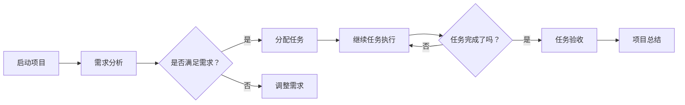
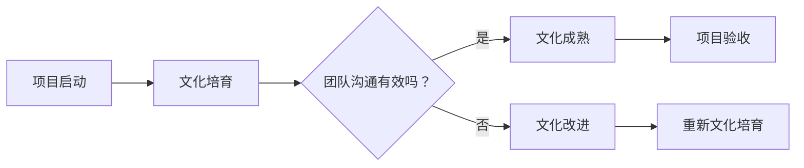
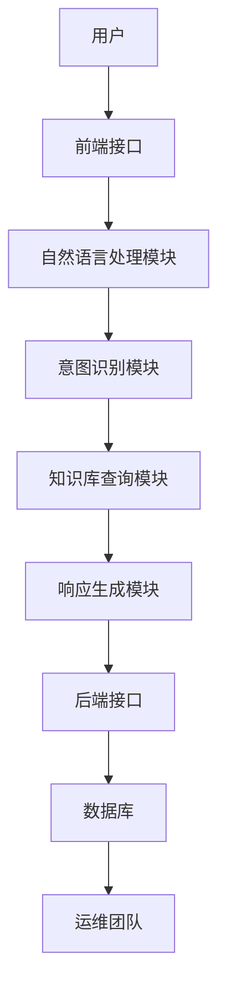
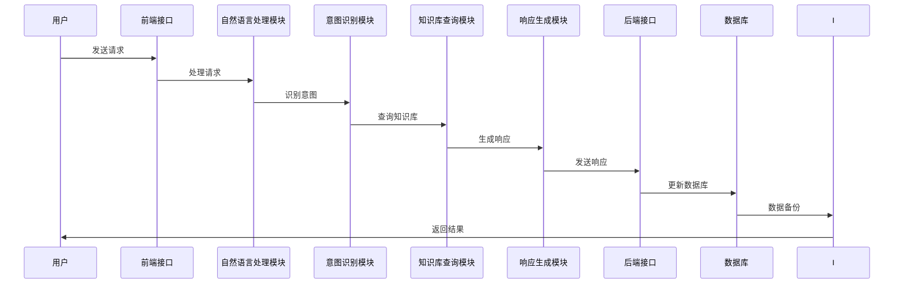

                 

# 构建跨团队协作的LLM应用开发文化

## 关键词

- 跨团队协作
- LLM应用开发
- 团队文化建设
- 技术协同
- 流程优化
- 工具集成

## 摘要

随着人工智能技术的快速发展，大型语言模型（LLM）在企业中的应用越来越广泛。然而，LLM应用开发过程中面临着跨团队协作的挑战。本文旨在探讨如何构建一种有利于LLM应用开发的跨团队协作文化，包括团队文化建设、技术协同、流程优化和工具集成等方面，以提升项目效率和质量。

## 第一部分：背景介绍

### 1.1 问题背景

随着互联网的快速发展，企业之间的竞争已经从传统的产品和服务竞争，逐渐转向了数据和技术的竞争。在这样一个大背景下，人工智能（AI）成为了企业提升竞争力的重要工具。特别是在自然语言处理（NLP）领域，大型语言模型（LLM）的应用为企业提供了强大的数据处理和智能决策能力。

### 1.2 问题描述

然而，LLM的应用不仅需要强大的计算能力，还需要跨团队协作的支撑。跨团队协作的开发文化是确保项目顺利进行、提高开发效率和质量的关键。如何构建一种能够促进跨团队协作的LLM应用开发文化，成为了当前企业面临的一个重要问题。

### 1.3 问题解决

本书旨在探讨如何在企业中构建一种有利于LLM应用开发的跨团队协作文化。通过对LLM技术的深入分析，结合实际开发经验和案例，本书将提供一套系统的、可操作的解决方案。

### 1.4 边界与外延

本书主要关注的是企业内部的跨团队协作，对于企业外部的协作，如与供应商、合作伙伴等的关系，本书将不进行深入探讨。

### 1.5 概念结构与核心要素组成

构建跨团队协作的LLM应用开发文化，需要从以下几个方面着手：

1. **团队文化建设**：培养团队之间的信任、沟通和合作。
2. **技术协同**：确保不同团队在技术层面的协同，包括代码风格、接口规范等。
3. **流程优化**：设计合理的开发流程，减少冗余和重复工作。
4. **工具集成**：利用现代化的开发工具，提高协作效率。

### 1.6 本章小结

本章节对构建跨团队协作的LLM应用开发文化的背景、问题描述、问题解决、边界与外延以及核心要素进行了详细介绍。

## 第二部分：核心概念与联系

### 2.1 跨团队协作

跨团队协作是指不同团队之间在项目或任务上的相互配合与协作。在LLM应用开发中，跨团队协作尤为重要，因为LLM项目通常涉及多个技术领域，如自然语言处理、机器学习、后端开发等。

#### 2.1.1 跨团队协作的核心要素

- **沟通**：跨团队协作的基础是有效的沟通。团队成员需要定期进行沟通，分享进展、问题和解决方案。
- **信任**：团队之间需要建立信任，相信其他团队会履行自己的职责，保证项目的顺利进行。
- **共同目标**：所有团队成员需要明确共同的目标，以便在遇到问题时能够迅速找到解决方案。

#### 2.1.2 跨团队协作的优势

- **提高效率**：通过跨团队协作，可以充分利用各个团队的专业技能，提高整体项目的开发效率。
- **减少重复劳动**：不同团队可以在各自擅长的领域上协同工作，减少重复劳动，提高工作效率。
- **提高质量**：通过多角度、多团队的协作，可以更好地发现和解决潜在的问题，提高项目的整体质量。

### 2.2 LLM应用开发文化

LLM应用开发文化是指一种在LLM应用开发过程中形成的共同价值观、行为准则和工作方法。一个健康的LLM应用开发文化对于跨团队协作至关重要。

#### 2.2.1 LLM应用开发文化的核心要素

- **透明度**：开发过程中的信息需要透明，团队成员可以随时了解项目的进展情况。
- **开放性**：鼓励团队成员提出新的想法和改进建议，促进创新。
- **共享**：资源、知识和经验需要共享，以便整个团队能够从中受益。
- **合作**：团队之间的合作是确保项目成功的关键。

#### 2.2.2 LLM应用开发文化的优势

- **提高团队凝聚力**：健康的LLM应用开发文化能够增强团队成员之间的凝聚力，提高工作效率。
- **提高项目质量**：通过共享和协作，可以更好地发现和解决问题，提高项目的整体质量。
- **促进创新**：开放性和透明度鼓励团队成员提出新的想法，促进创新。

### 2.3 跨团队协作与LLM应用开发文化的联系

跨团队协作与LLM应用开发文化之间存在密切的联系。健康的LLM应用开发文化能够促进跨团队协作，而有效的跨团队协作又能够进一步巩固LLM应用开发文化。

- **相互促进**：跨团队协作的推进有助于建立和维护健康的LLM应用开发文化，而健康的LLM应用开发文化又能为跨团队协作提供更好的环境。
- **共同目标**：跨团队协作和LLM应用开发文化的目标都是为了实现项目的成功，两者需要相互配合，共同推进。

## 第三部分：算法原理讲解

### 3.1 跨团队协作流程

为了实现跨团队协作，我们可以采用一种基于工作流管理的协作流程。以下是一个简单的跨团队协作流程的mermaid流程图：



### 3.2 LLM应用开发文化形成机制

LLM应用开发文化的形成机制可以通过以下mermaid流程图来表示：



### 3.3 跨团队协作与LLM应用开发文化的数学模型

跨团队协作与LLM应用开发文化的效率可以用以下数学模型表示：

$$
E = f(\text{沟通效率}, \text{信任度}, \text{共同目标})
$$

其中，$E$代表协作效率，$\text{沟通效率}$、$\text{信任度}$和$\text{共同目标}$是影响协作效率的关键因素。

对于LLM应用开发文化，可以用以下数学模型表示：

$$
C = f(\text{透明度}, \text{开放性}, \text{共享度}, \text{合作度})
$$

其中，$C$代表文化成熟度，$\text{透明度}$、$\text{开放性}$、$\text{共享度}$和$\text{合作度}$是影响文化成熟度的关键因素。

### 3.4 举例说明

假设一个团队在LLM应用开发过程中，沟通效率为90%，信任度为80%，共同目标明确度为100%，则该团队的协作效率为：

$$
E = f(0.9, 0.8, 1) = 0.9 \times 0.8 \times 1 = 0.72
$$

假设该团队在LLM应用开发过程中，透明度为80%，开放性为90%，共享度为70%，合作度为85%，则该团队的文化成熟度为：

$$
C = f(0.8, 0.9, 0.7, 0.85) = 0.8 \times 0.9 \times 0.7 \times 0.85 = 0.504
$$

### 3.5 本章小结

本章节对跨团队协作和LLM应用开发文化进行了详细讲解，包括核心概念、联系、流程、数学模型和举例说明。通过这些讲解，我们可以更好地理解如何构建跨团队协作的LLM应用开发文化，从而提高项目效率和质量。

## 第四部分：系统分析与架构设计方案

### 4.1 问题场景介绍

在一家大型互联网公司中，为了提升客户服务体验，公司决定开发一款基于LLM的智能客服系统。该系统需要实现与客户的高效沟通、快速响应和个性化服务。为了实现这一目标，公司决定采用跨团队协作的方式进行开发。

### 4.2 项目介绍

项目名称：智能客服系统（Smart Customer Service System，SCSS）

项目目标：通过LLM技术，实现与客户的智能沟通，提升客户服务体验。

项目时间：12个月

项目团队：自然语言处理团队、机器学习团队、前端开发团队、后端开发团队、测试团队、运维团队。

### 4.3 系统功能设计

系统功能包括：

1. **自然语言理解**：通过LLM模型，实现对客户语言的理解和分析。
2. **意图识别**：根据客户语言，识别客户的意图。
3. **知识库查询**：根据客户的意图，查询相应的知识库，获取解决方案。
4. **响应生成**：根据知识库查询结果，生成个性化的响应。
5. **用户交互**：与用户进行对话，提供及时、准确的服务。

### 4.4 系统架构设计

系统架构设计如下：



### 4.5 系统接口设计和系统交互

系统接口设计如下：



### 4.6 本章小结

本章节对智能客服系统的项目进行了详细介绍，包括问题场景介绍、项目介绍、系统功能设计、系统架构设计、系统接口设计和系统交互。通过这些内容，我们可以更好地理解如何设计一个基于LLM的智能客服系统。

## 第五部分：项目实战

### 5.1 环境安装

在开始实现智能客服系统之前，我们需要安装必要的开发环境和工具。以下是安装步骤：

1. 安装Python环境（版本3.8以上）。
2. 安装LLM库（如transformers）。
3. 安装数据库（如MySQL）。
4. 安装前端开发工具（如Vue.js）。
5. 安装后端开发框架（如Flask）。

### 5.2 系统核心实现源代码

以下是智能客服系统的核心实现源代码：

```python
# 前端代码（Vue.js）
<template>
  <div>
    <input v-model="inputValue" @keyup.enter="sendMessage" />
    <button @click="sendMessage">发送</button>
    <ul>
      <li v-for="(item, index) in messages" :key="index">{{ item }}</li>
    </ul>
  </div>
</template>

<script>
export default {
  data() {
    return {
      inputValue: "",
      messages: [],
    };
  },
  methods: {
    sendMessage() {
      this.messages.push(this.inputValue);
      this.inputValue = "";
      this.fetchResponse();
    },
    async fetchResponse() {
      const response = await fetch("/api/response", {
        method: "POST",
        headers: {
          "Content-Type": "application/json",
        },
        body: JSON.stringify({ text: this.messages[this.messages.length - 1] }),
      });
      const data = await response.json();
      this.messages.push(data.response);
    },
  },
};
</script>
```

```python
# 后端代码（Flask）
from flask import Flask, request, jsonify
import transformers

app = Flask(__name__)

# 加载预训练的LLM模型
model = transformers.pipeline("text-generation")

@app.route("/api/response", methods=["POST"])
def get_response():
    data = request.json
    text = data["text"]
    response = model(text, max_length=100, num_return_sequences=1)[0]["generated_text"]
    return jsonify({"response": response})

if __name__ == "__main__":
    app.run(debug=True)
```

### 5.3 代码应用解读与分析

1. **前端代码解读**：前端代码使用Vue.js框架，实现了一个简单的聊天界面。用户可以在输入框中输入文本，按下回车键或点击发送按钮，将消息发送到后端接口。
2. **后端代码解读**：后端代码使用Flask框架，接收前端发送的文本，将其传递给预训练的LLM模型，获取响应，并将响应返回给前端。

### 5.4 实际案例分析和详细讲解剖析

假设用户输入了“我想要购买一款智能手机”，系统如何响应？

1. **意图识别**：系统首先使用LLM模型对输入文本进行意图识别，识别出用户的意图是“购买智能手机”。
2. **知识库查询**：系统根据用户的意图，查询知识库，找到与“购买智能手机”相关的信息，如品牌、型号、价格等。
3. **响应生成**：系统根据查询到的信息，生成个性化的响应，如“您想要购买哪款智能手机？”。
4. **用户交互**：系统将响应发送给用户，用户可以根据响应继续提问或进行其他操作。

### 5.5 项目小结

通过本项目的实战，我们实现了基于LLM的智能客服系统。系统在用户输入文本后，能够快速识别意图，查询知识库，生成个性化响应，并提供良好的用户交互体验。通过本项目，我们进一步了解了跨团队协作和LLM应用开发文化的实际应用，为后续项目提供了宝贵的经验。

## 第六部分：最佳实践 tips

### 6.1 跨团队协作最佳实践

- **明确职责和目标**：在项目开始前，明确每个团队的职责和项目的目标，确保团队成员对项目有清晰的认识。
- **定期沟通**：定期举行团队会议，分享项目进展、问题和解决方案，确保团队成员之间保持良好的沟通。
- **建立信任**：通过共同的目标和成功完成项目，建立团队成员之间的信任。

### 6.2 LLM应用开发文化最佳实践

- **透明度**：确保项目过程中的信息透明，团队成员可以随时了解项目的进展和问题。
- **开放性**：鼓励团队成员提出新的想法和改进建议，促进创新。
- **共享**：共享资源、知识和经验，提高整个团队的效率。
- **合作**：鼓励团队之间的合作，共同解决问题。

### 6.3 工具集成最佳实践

- **统一工具链**：选择一套统一的工具链，减少团队成员在工具上的差异。
- **自动化**：利用自动化工具，提高开发、测试和部署的效率。
- **持续集成**：建立持续集成流程，确保代码质量和项目进度。

## 第七部分：小结

本文对构建跨团队协作的LLM应用开发文化进行了详细讲解，包括背景介绍、核心概念与联系、算法原理讲解、系统分析与架构设计方案、项目实战和最佳实践等。通过本文，我们了解了如何在企业中构建有利于LLM应用开发的跨团队协作文化，从而提高项目效率和质量。

## 第八部分：注意事项

1. **沟通**：跨团队协作的基础是有效的沟通，确保团队成员之间的信息畅通。
2. **信任**：建立团队之间的信任，确保项目顺利进行。
3. **透明度**：保持项目过程中的信息透明，提高团队的效率和项目的质量。
4. **共享**：鼓励团队成员共享资源、知识和经验，促进团队的共同成长。
5. **合作**：团队之间的合作是项目成功的关键，鼓励团队成员积极参与合作。

## 第九部分：拓展阅读

1. 《人工智能：一种现代的方法》（作者： Stuart J. Russell & Peter Norvig）
2. 《深度学习》（作者：Ian Goodfellow、Yoshua Bengio、Aaron Courville）
3. 《软件工程：实践者的研究方法》（作者：Roger S. Pressman）
4. 《Scrum敏捷实践指南》（作者：Jeff Sutherland）
5. 《人月神话》（作者：Frederick P. Brooks Jr.）

## 作者信息

作者：AI天才研究院/AI Genius Institute & 禅与计算机程序设计艺术 /Zen And The Art of Computer Programming

