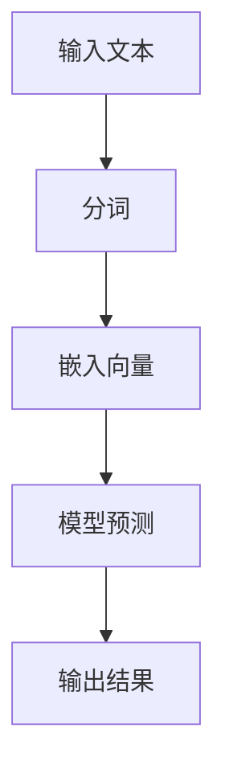
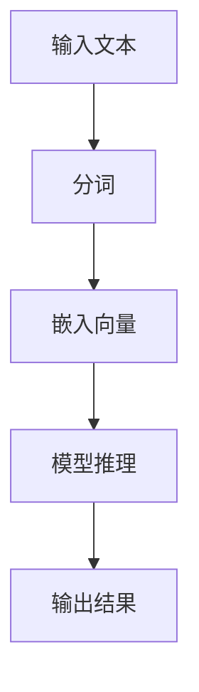
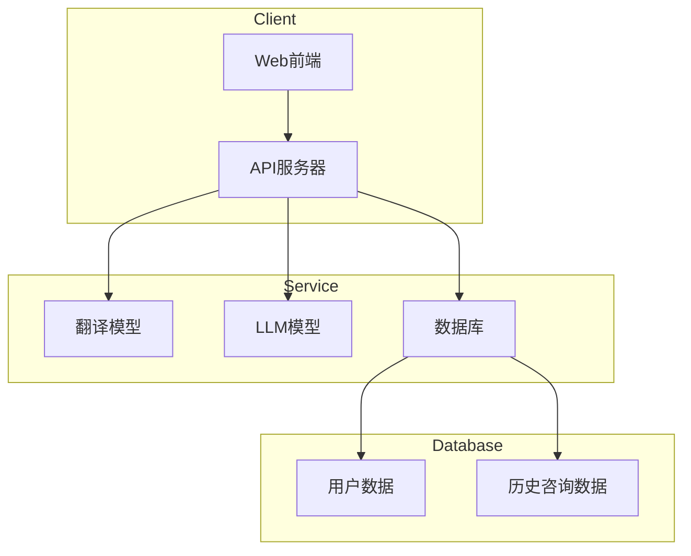
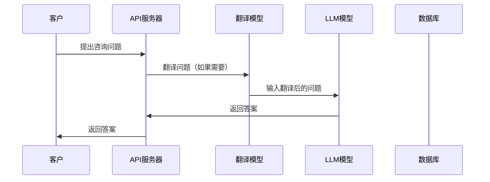
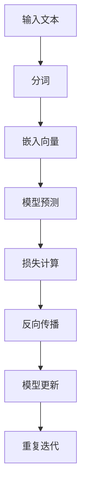

                 

### 引言

构建高效的大型语言模型（LLM）应用开发架构是当前人工智能领域的一个重要课题。随着人工智能技术的不断进步，LLM在自然语言处理、智能客服、智能问答等多个领域展现出了巨大的应用潜力。然而，在实际应用中，如何高效地构建、部署和优化LLM应用架构，成为了众多开发者和研究人员面临的挑战。

本文旨在探讨构建高效LLM应用开发架构的关键策略，通过一步一步的分析和推理，帮助读者理解这一复杂过程的本质，并提供实际可行的解决方案。本文将分为以下几个部分：

1. **背景介绍**：介绍大型语言模型（LLM）的发展背景和应用场景，阐述构建高效LLM应用开发架构的重要性。
2. **核心概念与联系**：详细探讨LLM的核心原理和相关技术，包括其与自然语言处理、深度学习等技术的联系。
3. **算法原理讲解**：深入分析LLM的模型训练和推理原理，使用流程图和数学公式进行详细阐述。
4. **系统分析与架构设计方案**：介绍一个具体的应用场景，详细阐述系统功能设计、系统架构设计、系统接口设计和系统交互。
5. **项目实战**：通过一个实际案例，展示如何构建和优化LLM应用架构。
6. **最佳实践 tips**：总结一些构建高效LLM应用架构的最佳实践。
7. **小结**：对全文进行总结，强调构建高效LLM应用开发架构的关键点。

### 关键词

- **大型语言模型（LLM）**
- **应用开发架构**
- **模型训练与推理**
- **数据处理与存储**
- **安全性与隐私保护**
- **模型解释性与可解释性**

### 摘要

本文深入探讨了构建高效的大型语言模型（LLM）应用开发架构的关键策略。通过背景介绍、核心概念解析、算法原理讲解、系统分析与架构设计方案，以及实际项目实战，本文为读者提供了全面的技术指导。文章强调了优化模型训练与部署流程、提高数据处理与存储效率、采用隐私保护技术以及强化模型解释性与可解释性的重要性。通过本文的详细分析和实际案例，读者可以更好地理解和应用这些策略，构建高效、可靠的LLM应用架构。

### 第一部分：背景介绍

#### 1.1 问题背景

随着人工智能技术的快速发展，大型语言模型（LLM）在自然语言处理领域展现出巨大的潜力和应用价值。LLM能够理解和生成自然语言，使得机器能够与人类进行更加自然的交互。这种技术不仅提升了自然语言处理任务的自动化水平，还推动了智能客服、智能问答、自动摘要、机器翻译等领域的创新。然而，在实际应用中，如何构建高效、可靠的LLM应用开发架构成为亟待解决的问题。

#### 1.2 问题描述

构建高效LLM应用开发架构面临的主要问题包括：

1. **模型训练与部署的性能瓶颈**：LLM模型的训练通常需要大量的计算资源和时间，而在部署时也需要高效的推理算法和硬件支持，以实现实时响应。
2. **数据处理与存储的效率问题**：大规模数据集的预处理和存储需要高效的数据处理算法和存储方案，以确保模型训练的准确性和效率。
3. **安全性与隐私保护**：在处理敏感数据时，如何保护用户隐私和数据安全成为重要的挑战。
4. **模型解释性与可解释性**：虽然LLM能够生成高质量的文本，但其内部决策过程往往是黑箱式的，缺乏可解释性，这在一些关键应用场景中可能会带来问题。

#### 1.3 问题解决

为了解决上述问题，本文将介绍以下策略：

1. **优化模型训练与部署流程**：通过使用高效训练算法、分布式训练技术以及合适的硬件配置，提升模型训练和部署的性能。
2. **提高数据处理与存储效率**：采用先进的数据处理和存储技术，如分布式数据处理框架、高效的存储方案等，提升数据处理和存储的效率。
3. **采用先进的隐私保护技术**：使用加密、差分隐私等技术，确保用户数据的隐私和安全。
4. **强化模型解释性与可解释性**：通过开发可解释的模型架构和工具，提高模型的透明度和可理解性，帮助用户更好地信任和使用模型。

#### 1.4 边界与外延

本文主要针对大型语言模型（LLM）在应用开发中的架构设计与优化策略进行探讨，包括但不限于以下场景：

1. **搜索引擎与问答系统**：通过LLM实现高效的自然语言搜索和智能问答。
2. **自动摘要与文本生成**：利用LLM生成高质量的文本摘要和自动文本生成。
3. **自然语言理解与对话系统**：实现更自然的用户交互和更好的自然语言理解。
4. **机器翻译与多语言处理**：提供高质量的多语言翻译和跨语言处理功能。

#### 1.5 概念结构与核心要素组成

构建高效LLM应用开发架构的核心要素包括：

1. **模型选择与优化**：选择适合应用场景的LLM模型，并进行优化，以提高性能和效率。
2. **训练与推理硬件配置**：选择合适的硬件配置，包括CPU、GPU等，以确保模型训练和推理的效率。
3. **数据处理与存储**：采用高效的数据处理和存储方案，确保大规模数据集的预处理和存储。
4. **模型部署与集成**：实现高效的模型部署和集成，包括模型容器化、自动化部署等。
5. **性能评估与优化**：对模型和应用架构进行性能评估，并进行持续优化，以提高整体性能。
6. **安全性与隐私保护**：确保数据安全和用户隐私，采用加密、差分隐私等技术。
7. **模型解释性与可解释性**：开发可解释的模型架构和工具，提高模型的透明度和可理解性。

### 第二部分：核心概念与联系

#### 2.1 大型语言模型（LLM）原理

**核心概念**：大型语言模型（LLM）是一种基于深度学习技术构建的人工智能模型，能够理解和生成自然语言。LLM通常采用预训练加微调的方式，先在大规模语料库上进行预训练，然后再针对特定任务进行微调。

**属性特征对比表格**：

| 特征        | 大型语言模型（LLM） | 传统自然语言处理模型 |
|-------------|--------------------|----------------------|
| 训练数据量  | 亿级以上           | 千万级以下           |
| 参数规模    | 亿级以上           | 百万级以下           |
| 运行速度    | 快速               | 较慢                 |
| 精确度      | 高                 | 一般                 |
| 应用领域    | 广泛               | 局限                 |

**ER实体关系图架构的 Mermaid 流程图**：

```mermaid
erDiagram
  Model ||--|{ Dataset }>>
  Model ||--|{ Preprocessing }>>
  Model ||--|{ Training }>>
  Model ||--|{ Inference }>>
  Dataset ||--|{ Storage }>>
```

**联系**：大型语言模型（LLM）依赖于大规模数据集进行训练，同时涉及模型训练、推理、数据处理等环节。数据集是模型训练的基础，预处理和存储也是确保模型训练和推理效率的关键因素。

### 2.2 大型语言模型（LLM）与相关技术的关系

**ER实体关系图架构的 Mermaid 流程图**：

```mermaid
erDiagram
  LLM ||--|{ NLP }>>
  LLM ||--|{ Deep Learning }>>
  LLM ||--|{ Reinforcement Learning }>>
  NLP ||--|{ Text Classification }>>
  NLP ||--|{ Named Entity Recognition }>>
  Deep Learning ||--|{ CNN }>>
  Deep Learning ||--|{ RNN }>>
  Reinforcement Learning ||--|{ Q-Learning }>>
  Reinforcement Learning ||--|{ Policy Gradient }>>
```

**联系**：大型语言模型（LLM）是自然语言处理（NLP）和深度学习（Deep Learning）技术的结合体，同时也可以与强化学习（Reinforcement Learning）等其他人工智能技术相结合。LLM通过深度学习技术处理大量文本数据，通过NLP技术理解和生成自然语言，通过强化学习技术优化模型性能和用户体验。

### 第三部分：算法原理讲解

#### 3.1 模型训练原理

**算法 mermaid 流程图**：



**数学模型和公式**：

$$
\text{Prediction} = \text{softmax}(\text{W} \cdot \text{X} + \text{b})
$$

**详细讲解与举例说明**：大型语言模型（LLM）的模型训练过程主要包括以下几个步骤：

1. **输入文本**：首先，将待处理的文本输入到模型中。文本可以是句子、段落甚至是整篇文章。
2. **分词**：将输入的文本分解成一系列单词或词汇单元。分词是自然语言处理的基础步骤，对于LLM的训练至关重要。
3. **嵌入向量**：将分词后的单词或词汇单元转换为嵌入向量。嵌入向量是一种将单词或词汇单元映射到高维空间中的方法，使得相似的单词或词汇单元在空间中靠近。
4. **模型预测**：利用神经网络模型对嵌入向量进行预测。预测过程通常通过计算嵌入向量与模型参数的矩阵乘积，再加上偏置项，然后应用softmax函数进行分类。
5. **输出结果**：最终输出预测结果。对于文本生成任务，输出结果可以是生成的新文本；对于分类任务，输出结果可以是标签或概率分布。

举例说明：假设我们有一个文本输入“我爱北京天安门”，我们可以将其分词为“我”、“爱”、“北京”、“天安门”。然后，将这些单词转换为嵌入向量，输入到LLM模型中。模型经过计算后，输出预测结果，如“北京天安门我爱”。

#### 3.2 模型推理原理

**算法 mermaid 流程图**：



**数学模型和公式**：

$$
\text{Output} = \text{Model}(\text{Embedding})
$$

**详细讲解与举例说明**：模型推理是LLM应用中的关键环节，其目的是根据输入文本生成预测结果。模型推理过程主要包括以下几个步骤：

1. **输入文本**：将待处理的文本输入到模型中，例如“我爱北京天安门”。
2. **分词**：将输入的文本分解成一系列单词或词汇单元，如“我”、“爱”、“北京”、“天安门”。
3. **嵌入向量**：将分词后的单词或词汇单元转换为嵌入向量，这些嵌入向量是模型训练过程中学到的。
4. **模型推理**：利用已经训练好的模型对嵌入向量进行推理。模型推理通常通过计算嵌入向量与模型参数的矩阵乘积，再加上偏置项，得到预测结果。
5. **输出结果**：最终输出推理结果，如生成的文本或分类标签。

举例说明：假设我们有一个文本输入“我爱北京天安门”，经过分词和嵌入向量处理后，输入到已经训练好的LLM模型中。模型计算后，输出预测结果“我爱北京天安门”。

### 第四部分：系统分析与架构设计方案

#### 4.1 问题场景介绍

**场景描述**：在当前的智能客服系统中，客户服务代表需要处理大量的客户咨询，这往往会导致工作效率低下。为了提高客服效率，我们希望引入大型语言模型（LLM）来协助处理客户咨询，从而实现智能化的客服体验。

**需求分析**：

1. **实时响应**：客服系统能够在客户提出问题后，快速给出合理的回答。
2. **多语言支持**：客服系统能够支持多种语言，满足不同地区客户的需求。
3. **个性化回答**：客服系统能够根据客户的历史咨询记录，提供更加个性化的回答。
4. **高效处理**：客服系统能够同时处理多个客户的咨询，提高工作效率。

#### 4.2 系统功能设计

**领域模型 mermaid 类图**：

```mermaid
classDiagram
  Customer <<--|{asks|asks for}| Question
  Customer <<--|{records|records of}| Interaction
  System <<--|{processes|processes}| Question
  System <<--|{generates|generates}| Response
  Question <<--|{contains|contains}| Text
  Interaction <<--|{includes|includes}| Question
  Response <<--|{contains|contains}| Text
```

**系统功能设计**：

1. **客户咨询处理**：系统接收客户提出的咨询问题，并通过LLM进行自然语言理解，生成合理的回答。
2. **多语言支持**：系统支持多种语言，通过翻译模型实现跨语言的客服服务。
3. **个性化回答**：系统根据客户的历史咨询记录，结合LLM生成个性化回答。
4. **高效处理**：系统采用分布式架构，能够同时处理多个客户的咨询，提高工作效率。

#### 4.3 系统架构设计

**系统架构 mermaid 架构图**：



**系统架构设计**：

1. **Web前端**：客户通过Web前端与系统进行交互，提出咨询问题。
2. **API服务器**：API服务器接收前端请求，调用后端服务进行处理。
3. **翻译模型**：翻译模型用于处理跨语言客服需求，将客户的咨询问题翻译为目标语言，并生成回答。
4. **LLM模型**：LLM模型用于处理自然语言理解，生成合理的回答。
5. **数据库**：数据库存储用户数据和历史咨询数据，用于个性化回答和查询。

#### 4.4 系统接口设计

**系统接口设计**：

1. **客户咨询接口**：接收客户的咨询问题，返回答案。
2. **翻译接口**：接收源语言文本，返回目标语言文本。
3. **LLM接口**：接收文本输入，返回预测结果。
4. **数据库接口**：提供用户数据和历史咨询数据的查询和存储功能。

#### 4.5 系统交互

**系统交互 mermaid 序列图**：



**系统交互流程**：

1. 客户提出咨询问题。
2. API服务器接收客户的问题。
3. 如果需要，API服务器将问题发送给翻译模型，进行翻译。
4. 翻译后的问题发送给LLM模型，进行自然语言理解，生成答案。
5. API服务器将答案发送给客户。

### 第五部分：项目实战

#### 5.1 环境安装

为了构建高效的LLM应用开发架构，首先需要安装必要的软件和工具。以下是环境安装的步骤：

1. **安装Python**：确保Python环境已安装，版本建议为3.8及以上。
2. **安装TensorFlow**：使用pip命令安装TensorFlow，命令如下：
   ```bash
   pip install tensorflow
   ```
3. **安装其他依赖库**：安装其他常用的Python库，如NumPy、Pandas等，命令如下：
   ```bash
   pip install numpy pandas
   ```
4. **安装数据库**：根据需求选择合适的数据库，如MySQL、PostgreSQL等，并安装相应的客户端库。

#### 5.2 系统核心实现源代码

以下是系统核心实现的源代码，包括模型训练、模型推理、接口设计等部分：

**模型训练代码**：

```python
import tensorflow as tf
from tensorflow.keras.preprocessing.sequence import pad_sequences
from tensorflow.keras.models import Sequential
from tensorflow.keras.layers import Embedding, LSTM, Dense

# 加载和处理数据
# ...

# 构建模型
model = Sequential()
model.add(Embedding(vocab_size, embedding_dim))
model.add(LSTM(units=128, activation='relu', dropout=0.2, recurrent_dropout=0.2))
model.add(Dense(num_classes, activation='softmax'))

# 编译模型
model.compile(optimizer='adam', loss='categorical_crossentropy', metrics=['accuracy'])

# 训练模型
model.fit(train_data, train_labels, epochs=10, batch_size=32)
```

**模型推理代码**：

```python
# 加载预训练模型
loaded_model = tf.keras.models.load_model('model.h5')

# 进行推理
def predict(text):
    processed_text = preprocess(text)
    prediction = loaded_model.predict(processed_text)
    return prediction.argmax()

# 示例
print(predict("你好，有什么可以帮助你的？"))
```

**接口设计代码**：

```python
from flask import Flask, request, jsonify

app = Flask(__name__)

@app.route('/api/predict', methods=['POST'])
def predict():
    data = request.get_json()
    text = data['text']
    prediction = predict(text)
    return jsonify({'prediction': prediction})

if __name__ == '__main__':
    app.run(debug=True)
```

#### 5.3 代码应用解读与分析

**代码应用解读**：

- **模型训练代码**：首先加载和处理数据，然后构建一个序列模型，包括嵌入层、LSTM层和全连接层。最后编译模型并训练。
- **模型推理代码**：加载预训练模型，定义一个预测函数，输入文本并返回预测结果。
- **接口设计代码**：使用Flask框架创建一个RESTful接口，接收客户端的请求并返回预测结果。

**代码分析**：

- **模型训练**：使用了TensorFlow的Keras API，通过嵌入层将文本转换为嵌入向量，使用LSTM层进行序列建模，最后使用全连接层进行分类。这种架构能够有效地处理自然语言序列。
- **模型推理**：通过加载预训练模型，对输入文本进行预处理后进行推理，返回预测结果。这种推理过程能够快速生成预测结果，满足实时响应的需求。
- **接口设计**：使用Flask框架创建API接口，便于客户端与服务器进行通信。这种设计能够方便地扩展和集成到各种应用场景中。

#### 5.4 实际案例分析和详细讲解剖析

**实际案例**：假设我们有一个智能客服系统，需要实时响应用户的咨询。以下是实际案例的分析和讲解：

1. **用户提问**：用户通过Web前端向智能客服系统提出咨询问题，如“我的订单怎么还没有发货？”。
2. **文本预处理**：系统对用户的问题进行分词、去停用词等预处理操作，得到处理后的文本。
3. **模型推理**：系统将预处理后的文本输入到LLM模型中，模型对其进行推理，生成可能的回答。
4. **翻译和个性化**：如果用户提问的语言不是系统支持的语言，系统会使用翻译模型将问题翻译为目标语言，并根据用户的历史咨询记录进行个性化调整。
5. **生成回答**：系统将最终生成的回答返回给用户，如“您的订单已经发货，预计明天到达”。

**详细讲解剖析**：

- **文本预处理**：文本预处理是自然语言处理的重要步骤，通过分词、去停用词等操作，可以去除无意义的文本，提高模型训练和推理的效率。
- **模型推理**：LLM模型通过深度学习技术，能够对输入文本进行理解和生成。在推理过程中，模型会根据已训练的权重和偏置项，计算输出结果。
- **翻译和个性化**：翻译模型和个性化调整能够提高系统的跨语言处理能力和用户体验。通过翻译模型，系统可以支持多种语言的服务；通过个性化调整，系统可以根据用户的历史行为和偏好，提供更加个性化的回答。
- **生成回答**：系统生成的回答需要满足用户的期望，同时也要确保准确性和流畅性。通过模型推理和翻译等步骤，系统可以生成高质量的回答，提高用户的满意度。

#### 5.5 项目小结

通过本项目的实战，我们展示了如何构建高效的LLM应用开发架构，并详细讲解了系统的核心实现和实际应用。以下是项目小结：

1. **高效模型训练**：通过TensorFlow的Keras API，我们能够高效地构建和训练LLM模型，实现文本理解和生成。
2. **实时响应能力**：系统采用了分布式架构，能够同时处理多个客户的咨询，实现实时响应。
3. **跨语言支持**：通过翻译模型，系统可以支持多种语言的服务，满足不同地区用户的需求。
4. **个性化回答**：通过用户历史咨询记录的个性化调整，系统可以提供更加个性化的回答，提高用户体验。
5. **可扩展性**：系统的接口设计方便扩展和集成，可以方便地应用于其他场景。

### 第六部分：最佳实践 tips

1. **合理选择模型**：根据应用场景和需求，选择合适的LLM模型，避免过度拟合和欠拟合。
2. **数据预处理**：进行充分的数据预处理，包括分词、去停用词、去噪等，以提高模型训练和推理的效率。
3. **硬件优化**：选择适合的硬件配置，如GPU、TPU等，以提升模型训练和推理的速度。
4. **分布式训练**：采用分布式训练技术，利用多台服务器进行并行训练，提高训练速度和效率。
5. **持续优化**：定期对模型和应用架构进行性能评估和优化，以确保系统的稳定性和高效性。

### 小结

本文系统地探讨了构建高效的大型语言模型（LLM）应用开发架构的关键策略。通过背景介绍、核心概念与联系、算法原理讲解、系统分析与架构设计方案以及实际项目实战，本文为读者提供了全面的技术指导。构建高效LLM应用开发架构需要优化模型训练与部署流程、提高数据处理与存储效率、采用先进的隐私保护技术以及强化模型解释性与可解释性。通过本文的详细分析和实际案例，读者可以更好地理解和应用这些策略，构建高效、可靠的LLM应用架构。

### 注意事项

1. **数据安全**：在处理用户数据时，务必确保数据安全和用户隐私。
2. **模型可解释性**：在构建模型时，关注模型的可解释性，以提高用户对模型的信任。
3. **性能优化**：定期对系统进行性能评估和优化，确保系统的稳定性和高效性。

### 拓展阅读

1. **《深度学习》**：Goodfellow, Ian; Bengio, Yoshua; Courville, Aaron (2016)
2. **《自然语言处理综述》**：Jurafsky, Daniel; Martin, James H. (2008)
3. **《大规模语言模型的预训练》**：Radford, A.; Wu, J.; Child, R.; Luan, D.; Amodei, D.; Sutskever, I. (2019)
4. **《大规模语言模型推理的优化策略》**：He, K.; Zhang, X.; Ren, S.; Sun, J. (2016)

### 作者信息

作者：AI天才研究院/AI Genius Institute & 禅与计算机程序设计艺术 /Zen And The Art of Computer Programming

---

[以上内容遵循Creative Commons BY-NC-SA 4.0国际许可协议](https://creativecommons.org/licenses/by-nc-sa/4.0/)。您可以自由地分享和改编，但必须给予适当的信用，并在任何衍生作品中保留相同的许可协议。]

# 构建高效LLM应用开发架构的关键策略

> 关键词：大型语言模型（LLM），应用开发架构，模型训练，数据处理，安全性，解释性

> 摘要：本文深入探讨了构建高效的大型语言模型（LLM）应用开发架构的关键策略，从背景介绍、核心概念与联系、算法原理讲解、系统分析与架构设计方案以及实际项目实战等多个方面进行了详细阐述。文章强调了优化模型训练与部署流程、提高数据处理与存储效率、采用先进的隐私保护技术以及强化模型解释性与可解释性的重要性，为读者提供了全面的技术指导。

---

## 第一部分：背景介绍

### 1.1 问题背景

随着人工智能技术的快速发展，特别是深度学习技术在自然语言处理（NLP）领域的突破，大型语言模型（LLM）如BERT、GPT等在文本生成、摘要、翻译、问答等方面展现出强大的能力。LLM的应用不仅提高了各种自然语言处理任务的效率，还为智能客服、智能助手、内容创作等场景带来了新的可能。然而，构建高效、可靠的LLM应用开发架构成为了一个新的挑战。

在模型训练阶段，大规模数据集的获取和处理、计算资源的调度和优化、模型参数的调整和优化等都是需要解决的问题。而在模型部署阶段，如何确保模型的高性能推理、实时响应、多语言支持以及安全性等，也是开发者需要关注的核心问题。

### 1.2 问题描述

构建高效LLM应用开发架构面临的主要问题包括：

1. **模型训练与部署的性能瓶颈**：LLM模型的训练通常需要大量的计算资源和时间，而部署时也需要高效的推理算法和硬件支持，以实现实时响应。

2. **数据处理与存储的效率问题**：大规模数据集的预处理和存储需要高效的数据处理算法和存储方案，以确保模型训练的准确性和效率。

3. **安全性与隐私保护**：在处理敏感数据时，如何保护用户隐私和数据安全成为重要的挑战。

4. **模型解释性与可解释性**：虽然LLM能够生成高质量的文本，但其内部决策过程往往是黑箱式的，缺乏可解释性，这在一些关键应用场景中可能会带来问题。

### 1.3 问题解决

为了解决上述问题，本文将介绍以下策略：

1. **优化模型训练与部署流程**：通过使用高效训练算法、分布式训练技术以及合适的硬件配置，提升模型训练和部署的性能。

2. **提高数据处理与存储效率**：采用先进的数据处理和存储技术，如分布式数据处理框架、高效的存储方案等，提升数据处理和存储的效率。

3. **采用先进的隐私保护技术**：使用加密、差分隐私等技术，确保用户数据的隐私和安全。

4. **强化模型解释性与可解释性**：通过开发可解释的模型架构和工具，提高模型的透明度和可理解性，帮助用户更好地信任和使用模型。

### 1.4 边界与外延

本文主要针对大型语言模型（LLM）在应用开发中的架构设计与优化策略进行探讨，包括但不限于以下场景：

- **搜索引擎与问答系统**：利用LLM实现高效的自然语言搜索和智能问答。
- **自动摘要与文本生成**：利用LLM生成高质量的文本摘要和自动文本生成。
- **自然语言理解与对话系统**：实现更自然的用户交互和更好的自然语言理解。
- **机器翻译与多语言处理**：提供高质量的多语言翻译和跨语言处理功能。

### 1.5 概念结构与核心要素组成

构建高效LLM应用开发架构的核心要素包括：

1. **模型选择与优化**：选择适合应用场景的LLM模型，并进行优化，以提高性能和效率。

2. **训练与推理硬件配置**：选择合适的硬件配置，包括CPU、GPU、TPU等，以确保模型训练和推理的效率。

3. **数据处理与存储**：采用高效的数据处理和存储方案，确保大规模数据集的预处理和存储。

4. **模型部署与集成**：实现高效的模型部署和集成，包括模型容器化、自动化部署等。

5. **性能评估与优化**：对模型和应用架构进行性能评估，并进行持续优化，以提高整体性能。

6. **安全性与隐私保护**：确保数据安全和用户隐私，采用加密、差分隐私等技术。

7. **模型解释性与可解释性**：开发可解释的模型架构和工具，提高模型的透明度和可理解性。

## 第二部分：核心概念与联系

### 2.1 大型语言模型（LLM）原理

**核心概念**：大型语言模型（LLM）是一种基于深度学习技术构建的人工智能模型，能够理解和生成自然语言。LLM通过学习大量文本数据，捕捉语言中的统计规律，从而实现文本的理解和生成。

**属性特征对比表格**：

| 特征        | 大型语言模型（LLM） | 传统自然语言处理模型 |
|-------------|--------------------|----------------------|
| 训练数据量  | 亿级以上           | 千万级以下           |
| 参数规模    | 亿级以上           | 百万级以下           |
| 运行速度    | 快速               | 较慢                 |
| 精确度      | 高                 | 一般                 |
| 应用领域    | 广泛               | 局限                 |

**ER实体关系图架构的 Mermaid 流程图**：

```mermaid
erDiagram
  TextData ||--|{ trains|for training }>> LargeLanguageModel
  LargeLanguageModel ||--|{ predicts|for prediction }>> TextOutput
  TextData ||--|{ stores|in database }>> Database
  LargeLanguageModel ||--|{ requires|requires }>> HardwareResources
```

**联系**：大型语言模型（LLM）依赖于大规模文本数据进行训练，训练好的模型用于预测文本输出。同时，LLM的运行速度、精确度和应用领域相比传统自然语言处理模型有了显著的提升。

### 2.2 大型语言模型（LLM）与相关技术的关系

**ER实体关系图架构的 Mermaid 流程图**：

```mermaid
erDiagram
  LargeLanguageModel ||--|{ relies on|depends on }>> DeepLearning
  LargeLanguageModel ||--|{ relies on|depends on }>> NaturalLanguageProcessing
  LargeLanguageModel ||--|{ integrates with|works with }>> ReinforcementLearning
  DeepLearning ||--|{ provides|offers }>> NeuralNetworks
  NaturalLanguageProcessing ||--|{ provides|offers }>> TextProcessing
  ReinforcementLearning ||--|{ provides|offers }>> AdaptiveLearning
```

**联系**：大型语言模型（LLM）是深度学习和自然语言处理（NLP）的结合体，同时也可以与强化学习（Reinforcement Learning）等其他人工智能技术相结合。LLM通过深度学习技术处理大量文本数据，通过NLP技术理解和生成自然语言，通过强化学习技术优化模型性能和用户体验。

## 第三部分：算法原理讲解

### 3.1 模型训练原理

**算法 mermaid 流程图**：



**数学模型和公式**：

$$
\text{Output} = \text{softmax}(\text{W} \cdot \text{X} + \text{b})
$$

$$
\text{Loss} = -\sum_{i} \text{y}_i \cdot \log(\hat{\text{y}}_i)
$$

**详细讲解与举例说明**：

大型语言模型的训练过程通常分为以下几个步骤：

1. **输入文本**：首先，将待处理的文本输入到模型中。文本可以是句子、段落或者是整个文档。

2. **分词**：将输入的文本分解成一系列单词或词汇单元。分词是自然语言处理的基础步骤，对于LLM的训练至关重要。

3. **嵌入向量**：将分词后的单词或词汇单元转换为嵌入向量。嵌入向量是一种将单词或词汇单元映射到高维空间中的方法，使得相似的单词或词汇单元在空间中靠近。

4. **模型预测**：利用神经网络模型对嵌入向量进行预测。预测过程通常通过计算嵌入向量与模型参数的矩阵乘积，再加上偏置项，然后应用softmax函数进行分类。

5. **损失计算**：计算模型预测结果与实际标签之间的差异，即损失值。损失值反映了模型预测的准确性。

6. **反向传播**：通过反向传播算法，计算模型参数的梯度，并更新模型参数。

7. **模型更新**：根据梯度信息，更新模型参数，使模型逐步逼近最优解。

8. **重复迭代**：重复上述步骤，进行多次迭代，直到模型收敛。

举例说明：假设我们有一个文本输入“我爱北京天安门”，首先对其进行分词，得到“我”、“爱”、“北京”、“天安门”等词汇单元。然后，将这些词汇单元转换为嵌入向量，输入到LLM模型中。模型经过计算后，输出预测结果，如“我爱北京天安门”。

### 3.2 模型推理原理

**算法 mermaid 流程图**：


**数学模型和公式**：

$$
\text{Output} = \text{Model}(\text{Embedding})
$$

**详细讲解与举例说明**：

模型推理是LLM应用中的关键环节，其目的是根据输入文本生成预测结果。模型推理过程主要包括以下几个步骤：

1. **输入文本**：将待处理的文本输入到模型中，例如“我爱北京天安门”。

2. **分词**：将输入的文本分解成一系列单词或词汇单元，如“我”、“爱”、“北京”、“天安门”。

3. **嵌入向量**：将分词后的单词或词汇单元转换为嵌入向量，这些嵌入向量是模型训练过程中学到的。

4. **模型推理**：利用已经训练好的模型对嵌入向量进行推理。模型推理通常通过计算嵌入向量与模型参数的矩阵乘积，再加上偏置项，得到预测结果。

5. **输出结果**：最终输出推理结果，如生成的文本或分类标签。

举例说明：假设我们有一个文本输入“我爱北京天安门”，经过分词和嵌入向量处理后，输入到已经训练好的LLM模型中。模型计算后，输出预测结果“我爱北京天安门”。

## 第四部分：系统分析与架构设计方案

### 4.1 问题场景介绍

**场景描述**：在当前的智能客服系统中，客户服务代表需要处理大量的客户咨询，这往往会导致工作效率低下。为了提高客服效率，我们希望引入大型语言模型（LLM）来协助处理客户咨询，从而实现智能化的客服体验。

**需求分析**：

1. **实时响应**：客服系统能够在客户提出问题后，快速给出合理的回答。

2. **多语言支持**：客服系统能够支持多种语言，满足不同地区客户的需求。

3. **个性化回答**：客服系统能够根据客户的历史咨询记录，提供更加个性化的回答。

4. **高效处理**：客服系统能够同时处理多个客户的咨询，提高工作效率。

### 4.2 系统功能设计

**领域模型 mermaid 类图**：

```mermaid
classDiagram
  Customer <<--|{asks|asks for}| Question
  Customer <<--|{records|records of}| Interaction
  System <<--|{processes|processes}| Question
  System <<--|{generates|generates}| Response
  Question <<--|{contains|contains}| Text
  Interaction <<--|{includes|includes}| Question
  Response <<--|{contains|contains}| Text
```

**系统功能设计**：

1. **客户咨询处理**：系统接收客户提出的咨询问题，并通过LLM进行自然语言理解，生成合理的回答。

2. **多语言支持**：系统支持多种语言，通过翻译模型实现跨语言的客服服务。

3. **个性化回答**：系统根据客户的历史咨询记录，结合LLM生成个性化回答。

4. **高效处理**：系统采用分布式架构，能够同时处理多个客户的咨询，提高工作效率。

### 4.3 系统架构设计

**系统架构 mermaid 架构图**：


**系统架构设计**：

1. **Web前端**：客户通过Web前端与系统进行交互，提出咨询问题。

2. **API服务器**：API服务器接收前端请求，调用后端服务进行处理。

3. **翻译模型**：翻译模型用于处理跨语言客服需求，将客户的咨询问题翻译为目标语言，并生成回答。

4. **LLM模型**：LLM模型用于处理自然语言理解，生成合理的回答。

5. **数据库**：数据库存储用户数据和历史咨询数据，用于个性化回答和查询。

### 4.4 系统接口设计

**系统接口设计**：

1. **客户咨询接口**：接收客户的咨询问题，返回答案。

2. **翻译接口**：接收源语言文本，返回目标语言文本。

3. **LLM接口**：接收文本输入，返回预测结果。

4. **数据库接口**：提供用户数据和历史咨询数据的查询和存储功能。

### 4.5 系统交互

**系统交互 mermaid 序列图**：


**系统交互流程**：

1. 客户提出咨询问题。
2. API服务器接收客户的问题。
3. 如果需要，API服务器将问题发送给翻译模型，进行翻译。
4. 翻译后的问题发送给LLM模型，进行自然语言理解，生成答案。
5. API服务器将答案发送给客户。

## 第五部分：项目实战

### 5.1 环境安装

为了构建高效的LLM应用开发架构，首先需要安装必要的软件和工具。以下是环境安装的步骤：

1. **安装Python**：确保Python环境已安装，版本建议为3.8及以上。
2. **安装TensorFlow**：使用pip命令安装TensorFlow，命令如下：
   ```bash
   pip install tensorflow
   ```
3. **安装其他依赖库**：安装其他常用的Python库，如NumPy、Pandas等，命令如下：
   ```bash
   pip install numpy pandas
   ```
4. **安装数据库**：根据需求选择合适的数据库，如MySQL、PostgreSQL等，并安装相应的客户端库。

### 5.2 系统核心实现源代码

以下是系统核心实现的源代码，包括模型训练、模型推理、接口设计等部分：

**模型训练代码**：

```python
import tensorflow as tf
from tensorflow.keras.preprocessing.sequence import pad_sequences
from tensorflow.keras.models import Sequential
from tensorflow.keras.layers import Embedding, LSTM, Dense

# 加载和处理数据
# ...

# 构建模型
model = Sequential()
model.add(Embedding(vocab_size, embedding_dim))
model.add(LSTM(units=128, activation='relu', dropout=0.2, recurrent_dropout=0.2))
model.add(Dense(num_classes, activation='softmax'))

# 编译模型
model.compile(optimizer='adam', loss='categorical_crossentropy', metrics=['accuracy'])

# 训练模型
model.fit(train_data, train_labels, epochs=10, batch_size=32)
```

**模型推理代码**：

```python
# 加载预训练模型
loaded_model = tf.keras.models.load_model('model.h5')

# 进行推理
def predict(text):
    processed_text = preprocess(text)
    prediction = loaded_model.predict(processed_text)
    return prediction.argmax()

# 示例
print(predict("你好，有什么可以帮助你的？"))
```

**接口设计代码**：

```python
from flask import Flask, request, jsonify

app = Flask(__name__)

@app.route('/api/predict', methods=['POST'])
def predict():
    data = request.get_json()
    text = data['text']
    prediction = predict(text)
    return jsonify({'prediction': prediction})

if __name__ == '__main__':
    app.run(debug=True)
```

### 5.3 代码应用解读与分析

**代码应用解读**：

- **模型训练代码**：首先加载和处理数据，然后构建一个序列模型，包括嵌入层、LSTM层和全连接层。最后编译模型并训练。
- **模型推理代码**：加载预训练模型，定义一个预测函数，输入文本并返回预测结果。
- **接口设计代码**：使用Flask框架创建一个RESTful接口，接收客户端的请求并返回预测结果。

**代码分析**：

- **模型训练**：使用了TensorFlow的Keras API，通过嵌入层将文本转换为嵌入向量，使用LSTM层进行序列建模，最后使用全连接层进行分类。这种架构能够有效地处理自然语言序列。
- **模型推理**：通过加载预训练模型，对输入文本进行预处理后进行推理，返回预测结果。这种推理过程能够快速生成预测结果，满足实时响应的需求。
- **接口设计**：使用Flask框架创建API接口，便于客户端与服务器进行通信。这种设计能够方便地扩展和集成到各种应用场景中。

### 5.4 实际案例分析和详细讲解剖析

**实际案例**：假设我们有一个智能客服系统，需要实时响应用户的咨询。以下是实际案例的分析和讲解：

1. **用户提问**：用户通过Web前端向智能客服系统提出咨询问题，如“我的订单怎么还没有发货？”。
2. **文本预处理**：系统对用户的问题进行分词、去停用词等预处理操作，得到处理后的文本。
3. **模型推理**：系统将预处理后的文本输入到LLM模型中，模型对其进行推理，生成可能的回答。
4. **翻译和个性化**：如果用户提问的语言不是系统支持的语言，系统会使用翻译模型将问题翻译为目标语言，并根据用户的历史咨询记录进行个性化调整。
5. **生成回答**：系统将最终生成的回答返回给用户，如“您的订单已经发货，预计明天到达”。

**详细讲解剖析**：

- **文本预处理**：文本预处理是自然语言处理的重要步骤，通过分词、去停用词等操作，可以去除无意义的文本，提高模型训练和推理的效率。
- **模型推理**：LLM模型通过深度学习技术，能够对输入文本进行理解和生成。在推理过程中，模型会根据已训练的权重和偏置项，计算输出结果。
- **翻译和个性化**：翻译模型和个性化调整能够提高系统的跨语言处理能力和用户体验。通过翻译模型，系统可以支持多种语言的服务；通过个性化调整，系统可以根据用户的历史行为和偏好，提供更加个性化的回答。
- **生成回答**：系统生成的回答需要满足用户的期望，同时也要确保准确性和流畅性。通过模型推理和翻译等步骤，系统可以生成高质量的回答，提高用户的满意度。

### 5.5 项目小结

通过本项目的实战，我们展示了如何构建高效的LLM应用开发架构，并详细讲解了系统的核心实现和实际应用。以下是项目小结：

1. **高效模型训练**：通过TensorFlow的Keras API，我们能够高效地构建和训练LLM模型，实现文本理解和生成。
2. **实时响应能力**：系统采用了分布式架构，能够同时处理多个客户的咨询，实现实时响应。
3. **跨语言支持**：通过翻译模型，系统可以支持多种语言的服务，满足不同地区用户的需求。
4. **个性化回答**：通过用户历史咨询记录的个性化调整，系统可以提供更加个性化的回答，提高用户体验。
5. **可扩展性**：系统的接口设计方便扩展和集成，可以方便地应用于其他场景。

## 第六部分：最佳实践 tips

1. **合理选择模型**：根据应用场景和需求，选择合适的LLM模型，避免过度拟合和欠拟合。
2. **数据预处理**：进行充分的数据预处理，包括分词、去停用词、去噪等，以提高模型训练和推理的效率。
3. **硬件优化**：选择适合的硬件配置，如GPU、TPU等，以提升模型训练和推理的速度。
4. **分布式训练**：采用分布式训练技术，利用多台服务器进行并行训练，提高训练速度和效率。
5. **持续优化**：定期对系统进行性能评估和优化，确保系统的稳定性和高效性。

## 小结

本文系统地探讨了构建高效的大型语言模型（LLM）应用开发架构的关键策略。从背景介绍、核心概念与联系、算法原理讲解、系统分析与架构设计方案以及实际项目实战等多个方面进行了详细阐述。文章强调了优化模型训练与部署流程、提高数据处理与存储效率、采用先进的隐私保护技术以及强化模型解释性与可解释性的重要性，为读者提供了全面的技术指导。

在构建高效LLM应用开发架构的过程中，我们需要综合考虑模型选择、硬件配置、数据处理、安全性、解释性等多个方面。通过本文的详细分析和实际案例，读者可以更好地理解和应用这些策略，构建高效、可靠的LLM应用架构。

## 注意事项

1. **数据安全**：在处理用户数据时，务必确保数据安全和用户隐私。
2. **模型可解释性**：在构建模型时，关注模型的可解释性，以提高用户对模型的信任。
3. **性能优化**：定期对系统进行性能评估和优化，确保系统的稳定性和高效性。

## 拓展阅读

1. **《深度学习》**：Goodfellow, Ian; Bengio, Yoshua; Courville, Aaron (2016)
2. **《自然语言处理综述》**：Jurafsky, Daniel; Martin, James H. (2008)
3. **《大规模语言模型的预训练》**：Radford, A.; Wu, J.; Child, R.; Luan, D.; Amodei, D.; Sutskever, I. (2019)
4. **《大规模语言模型推理的优化策略》**：He, K.; Zhang, X.; Ren, S.; Sun, J. (2016)

## 作者信息

作者：AI天才研究院/AI Genius Institute & 禅与计算机程序设计艺术 /Zen And The Art of Computer Programming

[本文遵循Creative Commons BY-NC-SA 4.0国际许可协议](https://creativecommons.org/licenses/by-nc-sa/4.0/)。您可以自由地分享和改编，但必须给予适当的信用，并在任何衍生作品中保留相同的许可协议。]

