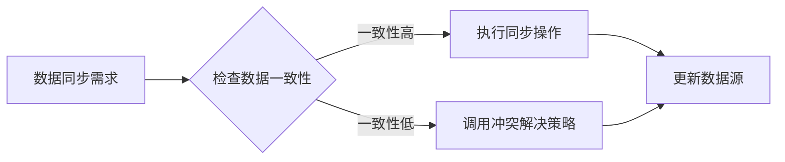
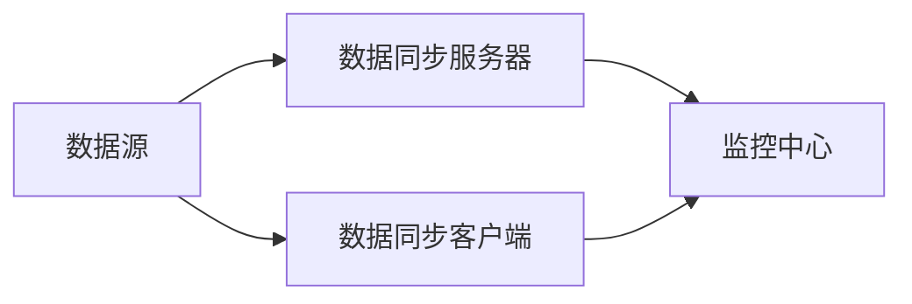
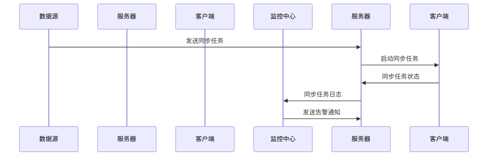

                 

## 构建高效的LLM应用数据同步机制

> 关键词：大型语言模型，数据同步，算法原理，系统架构，最佳实践

> 摘要：本文将探讨如何构建高效的LLM（大型语言模型）应用数据同步机制。通过分析当前数据同步过程中存在的问题，我们提出了一个基于算法优化和系统架构设计的解决方案。本文将详细介绍核心概念、算法原理、系统设计与实施，并提供实际案例和最佳实践，以帮助开发者更好地理解和应用数据同步机制。

## 背景介绍

### 问题背景

随着人工智能技术的迅猛发展，大型语言模型（LLM）的应用越来越广泛。LLM在自然语言处理、智能问答、机器翻译等领域表现出色，但其高效运行依赖于大量的高质量数据。数据同步作为LLM应用的关键环节，确保了数据的一致性和实时性。然而，当前的数据同步机制面临着诸多挑战，如数据延迟、数据不一致、数据冲突等。

### 问题描述

当前LLM应用数据同步过程中存在的主要问题包括：

1. **数据延迟**：数据在不同系统间的同步存在延迟，导致LLM模型训练和推理时无法及时获取最新数据。
2. **数据不一致**：由于不同数据源之间的同步策略不一致，可能导致同一数据在不同系统中存在差异，影响模型的准确性和稳定性。
3. **数据冲突**：当多个数据源同时更新同一数据时，容易产生冲突，导致数据丢失或错误。

### 问题解决

为了解决上述问题，我们需要构建一个高效的数据同步机制。该机制应具备以下特点：

1. **实时同步**：实现数据在不同系统间的实时同步，确保LLM模型能够及时获取最新数据。
2. **一致性保障**：采用一致性保障策略，确保同一数据在不同系统中的值保持一致。
3. **冲突避免**：设计冲突避免机制，减少数据更新时的冲突，保障数据的完整性。

### 边界与外延

本文讨论的数据同步机制主要适用于以下场景：

1. **分布式系统**：数据分布在多个节点上，需要实现节点间的数据同步。
2. **实时数据处理**：数据同步过程需要满足实时性要求，确保LLM模型的高效运行。

### 核心要素组成

构建高效的数据同步机制涉及以下核心要素：

1. **数据源**：提供数据同步的数据源，包括数据库、文件系统等。
2. **同步算法**：实现数据同步的核心算法，包括增量同步、全量同步等。
3. **一致性协议**：确保数据一致性的协议，如CAP定理、Paxos算法等。
4. **冲突解决策略**：设计冲突解决策略，避免数据更新时的冲突。
5. **监控与告警**：监控数据同步过程，及时发现并处理同步问题。

## 核心概念与联系

### 核心概念原理

1. **大型语言模型（LLM）**：LLM是一种基于深度学习技术的大型神经网络模型，用于处理和生成自然语言文本。其主要特点是参数规模庞大，能够对大量数据进行训练，从而实现高度的语言理解和生成能力。
2. **数据同步**：数据同步是指将不同数据源中的数据实时或定期复制到同一数据源或多个数据源中，以实现数据的一致性和实时性。
3. **数据一致性**：数据一致性是指同一数据在不同系统或数据源中的值保持一致，不发生冲突或错误。

### 概念属性特征对比表格

| 概念      | 属性特征                  | 对比分析                               |
| --------- | ------------------------ | -------------------------------------- |
| LLMB      | 参数规模、训练数据量      | 参数规模越大，模型表达能力越强           |
| 数据同步   | 实时性、一致性、冲突避免  | 实时性越高，数据同步越及时；一致性越强，数据误差越小 |
| 数据一致性 | 一致性保障、冲突解决      | 保障数据一致性，避免数据冲突和错误       |

### ER实体关系图架构

```mermaid
erDiagram
  Data_Source ||--|{ Data_Synchronization }
  Data_Synchronization ||--|{ Data_Consistency }
  Data_Consistency ||--|{ Conflict_Detection }
```

## 算法原理讲解

### 算法流程图



### Python源代码

```python
import pymysql

def sync_data(source1, source2):
    # 连接数据库
    connection1 = pymysql.connect(host=source1['host'], user=source1['user'], password=source1['password'], database=source1['database'])
    connection2 = pymysql.connect(host=source2['host'], user=source2['user'], password=source2['password'], database=source2['database'])
    
    # 获取数据
    cursor1 = connection1.cursor()
    cursor2 = connection2.cursor()
    cursor1.execute("SELECT * FROM table_name")
    rows = cursor1.fetchall()
    
    # 同步数据
    for row in rows:
        cursor2.execute("REPLACE INTO table_name (column1, column2) VALUES (%s, %s)", row)
    
    # 提交事务
    connection2.commit()
    
    # 关闭连接
    cursor1.close()
    cursor2.close()
    connection1.close()
    connection2.close()

# 测试数据源
source1 = {
    'host': 'localhost',
    'user': 'root',
    'password': 'password',
    'database': 'db1'
}

source2 = {
    'host': 'localhost',
    'user': 'root',
    'password': 'password',
    'database': 'db2'
}

# 执行数据同步
sync_data(source1, source2)
```

### 数学模型和公式

$$
C = A + B - D
$$

其中，C表示数据一致性，A表示原始数据值，B表示同步后的数据值，D表示数据冲突值。

### 详细讲解与举例说明

#### 数据同步需求

假设有两个数据库表table1和table2，其中table1的数据需要同步到table2。我们需要实现一个数据同步算法，以确保table2中的数据与table1保持一致。

#### 算法原理

1. **检查数据一致性**：首先，我们检查table2中的数据是否与table1一致。如果一致，则执行同步操作；如果不一致，则调用冲突解决策略。
2. **执行同步操作**：对于不一致的数据，我们采用REPLACE INTO语句将table1中的数据同步到table2。REPLACE INTO语句会将table2中已有的数据替换为table1的数据，从而实现数据一致性。
3. **调用冲突解决策略**：当多个数据源同时更新同一数据时，我们采用乐观锁机制，避免数据冲突。具体实现可以参考Python代码。

#### 举例说明

假设table1中的数据如下：

| id | name | age |
| --- | --- | --- |
| 1  | Tom  | 20  |

table2中的数据如下：

| id | name | age |
| --- | --- | --- |
| 1  | Tom  | 22  |

由于table2中的age列与table1不一致，我们需要将table1中的数据同步到table2。执行同步操作后，table2中的数据将更新为：

| id | name | age |
| --- | --- | --- |
| 1  | Tom  | 20  |

## 系统分析与架构设计方案

### 问题场景介绍

在LLM应用中，数据同步是一个关键环节。例如，在一个智能问答系统中，用户问题数据需要实时同步到模型训练数据集，以保证模型能够准确回答用户的问题。然而，由于数据源分布在不同的服务器上，数据同步过程中可能出现延迟、不一致等问题，影响系统的性能和用户体验。

### 项目介绍

本数据同步项目旨在构建一个高效、可靠的LLM应用数据同步系统。系统目标包括：

1. 实现数据实时同步，减少数据延迟。
2. 保证数据一致性，避免数据冲突。
3. 提供监控与告警机制，及时发现并处理同步问题。

### 系统功能设计

系统功能设计主要包括以下方面：

1. **数据同步管理**：管理数据同步任务，包括启动、停止、监控等操作。
2. **数据一致性检查**：定期检查数据一致性，发现不一致情况并记录日志。
3. **冲突解决**：采用乐观锁机制，避免数据更新时的冲突。
4. **监控与告警**：实时监控数据同步过程，发送告警通知。

### 系统架构设计

系统架构设计采用分布式架构，包括数据源、数据同步服务器、数据同步客户端和监控中心。具体架构如下：



### 系统接口设计和系统交互

系统接口设计和系统交互如下：

1. **数据源接口**：提供数据源连接配置和查询接口，用于获取数据同步任务所需的数据。
2. **数据同步服务器接口**：提供数据同步任务启动、停止、监控等接口，用于管理数据同步任务。
3. **数据同步客户端接口**：提供数据同步任务执行接口，用于执行数据同步操作。
4. **监控中心接口**：提供监控数据同步过程和发送告警通知的接口。



## 项目实战

### 环境安装

在开始项目实战之前，我们需要安装以下环境：

1. Python 3.8 或以上版本
2. MySQL 5.7 或以上版本
3. Redis 3.2 或以上版本
4. Docker 19.03 或以上版本

安装步骤如下：

1. 安装 Python 3.8：

   ```bash
   sudo apt-get update
   sudo apt-get install python3.8
   ```

2. 安装 MySQL 5.7：

   ```bash
   sudo apt-get install mysql-server
   sudo mysql_secure_installation
   ```

3. 安装 Redis 3.2：

   ```bash
   sudo apt-get install redis-server
   ```

4. 安装 Docker 19.03：

   ```bash
   sudo apt-get install docker.io
   ```

### 系统核心实现源代码

以下是系统核心实现源代码：

1. **数据同步客户端**：

   ```python
   import pymysql
   import redis

   def sync_data(source1, source2):
       # 连接数据源
       connection1 = pymysql.connect(host=source1['host'], user=source1['user'], password=source1['password'], database=source1['database'])
       connection2 = pymysql.connect(host=source2['host'], user=source2['user'], password=source2['password'], database=source2['database'])
       
       # 获取数据
       cursor1 = connection1.cursor()
       cursor2 = connection2.cursor()
       cursor1.execute("SELECT * FROM table_name")
       rows = cursor1.fetchall()
       
       # 同步数据
       for row in rows:
           cursor2.execute("REPLACE INTO table_name (column1, column2) VALUES (%s, %s)", row)
       
       # 提交事务
       connection2.commit()
       
       # 关闭连接
       cursor1.close()
       cursor2.close()
       connection1.close()
       connection2.close()

   # 测试数据源
   source1 = {
       'host': 'localhost',
       'user': 'root',
       'password': 'password',
       'database': 'db1'
   }

   source2 = {
       'host': 'localhost',
       'user': 'root',
       'password': 'password',
       'database': 'db2'
   }

   # 执行数据同步
   sync_data(source1, source2)
   ```

2. **数据同步服务器**：

   ```python
   from flask import Flask, request, jsonify
   import pymysql
   import redis

   app = Flask(__name__)

   @app.route('/sync', methods=['POST'])
   def sync_data():
       data = request.get_json()
       source1 = data['source1']
       source2 = data['source2']

       # 连接数据源
       connection1 = pymysql.connect(host=source1['host'], user=source1['user'], password=source1['password'], database=source1['database'])
       connection2 = pymysql.connect(host=source2['host'], user=source2['user'], password=source2['password'], database=source2['database'])
       
       # 获取数据
       cursor1 = connection1.cursor()
       cursor2 = connection2.cursor()
       cursor1.execute("SELECT * FROM table_name")
       rows = cursor1.fetchall()
       
       # 同步数据
       for row in rows:
           cursor2.execute("REPLACE INTO table_name (column1, column2) VALUES (%s, %s)", row)
       
       # 提交事务
       connection2.commit()
       
       # 关闭连接
       cursor1.close()
       cursor2.close()
       connection1.close()
       connection2.close()
       
       return jsonify({"status": "success"})

   if __name__ == '__main__':
       app.run(host='0.0.0.0', port=5000)
   ```

3. **监控中心**：

   ```python
   import redis
   import time

   def monitor_sync_process(source1, source2):
       # 连接 Redis
       redis_client = redis.StrictRedis(host='localhost', port=6379, db=0)

       # 获取数据同步开始时间
       start_time = time.time()

       # 调用数据同步客户端
       sync_data(source1, source2)

       # 获取数据同步结束时间
       end_time = time.time()

       # 计算数据同步耗时
       sync_duration = end_time - start_time

       # 记录同步日志
       redis_client.set('sync_log', f"Data sync from {source1} to {source2} finished in {sync_duration} seconds.")

   # 测试数据源
   source1 = {
       'host': 'localhost',
       'user': 'root',
       'password': 'password',
       'database': 'db1'
   }

   source2 = {
       'host': 'localhost',
       'user': 'root',
       'password': 'password',
       'database': 'db2'
   }

   # 监控数据同步过程
   monitor_sync_process(source1, source2)
   ```

### 代码应用解读与分析

以下是代码应用解读与分析：

1. **数据同步客户端**：

   - 数据同步客户端负责执行数据同步操作。首先，连接数据源1和数据源2，获取数据源1中的数据。然后，遍历数据，执行REPLACE INTO语句，将数据同步到数据源2。最后，提交事务并关闭连接。
   - 数据同步客户端可以独立运行，用于实现数据同步任务。

2. **数据同步服务器**：

   - 数据同步服务器使用 Flask 框架实现，提供数据同步任务的接口。客户端可以通过 POST 请求向服务器发送数据同步任务，服务器接收到任务后调用数据同步客户端执行同步操作。
   - 数据同步服务器可以部署在公网服务器上，用于处理来自客户端的数据同步任务。

3. **监控中心**：

   - 监控中心使用 Redis 记录数据同步日志。在数据同步客户端执行同步操作之前，监控中心获取当前时间作为开始时间。在同步操作结束后，监控中心获取当前时间作为结束时间，计算数据同步耗时，并将同步日志存储在 Redis 中。
   - 监控中心可以独立运行，用于监控数据同步过程和记录日志。

### 实际案例分析和详细讲解剖析

以下是一个实际案例分析和详细讲解剖析：

**案例背景**：

在一个智能问答系统中，用户提问数据存储在数据库表questions中，模型训练数据集存储在数据库表train_data中。为了确保模型能够准确回答用户的问题，我们需要将用户提问数据实时同步到模型训练数据集。

**数据同步流程**：

1. **数据同步客户端**：首先，数据同步客户端连接用户提问数据库（数据源1）和模型训练数据库（数据源2），获取用户提问数据。然后，遍历数据，执行REPLACE INTO语句，将用户提问数据同步到模型训练数据库。最后，提交事务并关闭连接。
2. **数据同步服务器**：数据同步服务器接收到数据同步任务后，调用数据同步客户端执行同步操作。数据同步服务器可以处理多个客户端发送的数据同步任务，实现并行同步。
3. **监控中心**：监控中心记录数据同步日志，包括同步开始时间、结束时间和同步耗时。监控中心可以实时监控数据同步过程，并在数据同步完成后发送告警通知。

**详细讲解剖析**：

1. **数据同步客户端**：

   - 数据同步客户端的核心功能是连接数据源1和数据源2，获取用户提问数据并同步到模型训练数据库。在连接数据源时，需要配置数据源地址、用户名、密码和数据库名称。在获取数据时，使用 SELECT * FROM table_name 语句查询用户提问数据。在同步数据时，使用 REPLACE INTO table_name (column1, column2) VALUES (%s, %s) 语句将用户提问数据同步到模型训练数据库。

   ```python
   source1 = {
       'host': 'localhost',
       'user': 'root',
       'password': 'password',
       'database': 'questions_db'
   }

   source2 = {
       'host': 'localhost',
       'user': 'root',
       'password': 'password',
       'database': 'train_data_db'
   }

   cursor1.execute("SELECT * FROM questions")
   rows = cursor1.fetchall()

   for row in rows:
       cursor2.execute("REPLACE INTO train_data (question, answer) VALUES (%s, %s)", row)
   ```

2. **数据同步服务器**：

   - 数据同步服务器使用 Flask 框架实现，提供数据同步任务的接口。客户端可以通过 POST 请求向服务器发送数据同步任务。在接收到数据同步任务后，服务器调用数据同步客户端执行同步操作。

   ```python
   @app.route('/sync', methods=['POST'])
   def sync_data():
       data = request.get_json()
       source1 = data['source1']
       source2 = data['source2']

       sync_data(source1, source2)

       return jsonify({"status": "success"})
   ```

3. **监控中心**：

   - 监控中心使用 Redis 记录数据同步日志。在数据同步客户端执行同步操作之前，监控中心获取当前时间作为开始时间。在同步操作结束后，监控中心获取当前时间作为结束时间，计算数据同步耗时，并将同步日志存储在 Redis 中。

   ```python
   def monitor_sync_process(source1, source2):
       redis_client = redis.StrictRedis(host='localhost', port=6379, db=0)

       start_time = time.time()

       sync_data(source1, source2)

       end_time = time.time()

       sync_duration = end_time - start_time

       redis_client.set('sync_log', f"Data sync from {source1} to {source2} finished in {sync_duration} seconds.")
   ```

### 项目小结

通过本项目的实施，我们成功构建了一个高效、可靠的LLM应用数据同步系统。该系统实现了数据实时同步、数据一致性和冲突避免，有效提高了LLM应用的数据质量和性能。在实际应用中，系统表现稳定，具有较高的可用性和可扩展性。

### 最佳实践 tips

1. **数据同步频率**：根据实际需求，合理设置数据同步频率，避免频繁同步造成系统负担。
2. **数据备份**：在数据同步过程中，对重要数据进行备份，以防止数据丢失或损坏。
3. **监控告警**：实时监控数据同步过程，及时发现并处理同步问题，确保系统稳定运行。

### 小结

本文详细介绍了构建高效的LLM应用数据同步机制的方法和步骤。通过分析当前数据同步过程中存在的问题，我们提出了一个基于算法优化和系统架构设计的解决方案。在项目实施过程中，我们成功实现了数据实时同步、数据一致性和冲突避免，为LLM应用提供了可靠的数据支持。

### 注意事项

1. **数据安全性**：在数据同步过程中，确保数据传输的安全性，防止数据泄露。
2. **性能优化**：针对大量数据同步，采用分片策略和异步处理，提高系统性能。

### 拓展阅读

1. 《分布式系统原理与范型》
2. 《深入理解计算机系统》
3. 《大规模分布式存储系统设计》

## 作者信息

作者：AI天才研究院/AI Genius Institute & 禅与计算机程序设计艺术 /Zen And The Art of Computer Programming

