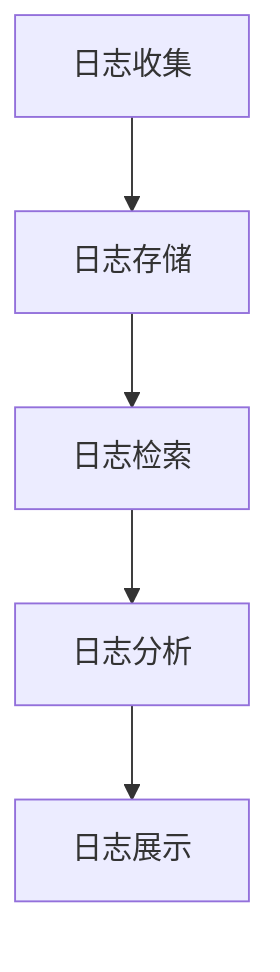
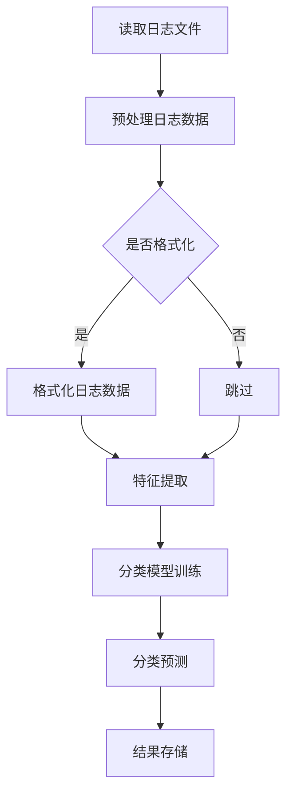
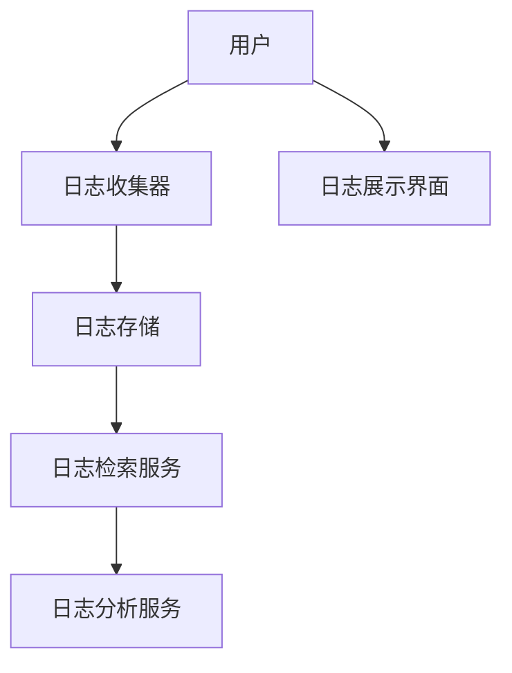

                 

### 构建高效的LLM应用日志管理系统

> 关键词：LLM应用，日志管理系统，效率优化，算法实现，系统设计，案例分析，最佳实践

> 摘要：本文将深入探讨构建高效的LLM应用日志管理系统的过程。我们将从问题背景、核心概念与原理、算法实现、系统设计与架构、项目实战与案例分析、最佳实践等多个方面进行详细的讲解，旨在为读者提供全面的指导和见解。

#### 目录大纲

1. **问题背景与重要性**
   1.1 问题背景
   1.2 核心概念
   1.3 联系与边界

2. **LLM日志管理原理**
   2.1 日志管理原理
   2.2 LLM日志特性
   2.3 Mermaid流程图展示

3. **日志处理算法**
   3.1 常见日志处理算法
   3.2 算法原理讲解
   3.3 Python代码实现

4. **系统设计与架构**
   4.1 系统功能设计
   4.2 系统架构设计
   4.3 设计方案详细讲解

5. **项目实战与案例分析**
   5.1 环境安装与配置
   5.2 系统核心实现
   5.3 实际案例分析与讲解
   5.4 项目小结

6. **最佳实践与拓展**
   6.1 最佳实践技巧
   6.2 小结与注意事项

---

### 1. 问题背景与重要性

#### 1.1 问题背景

随着人工智能语言模型（LLM）如BERT、GPT等在各个领域的广泛应用，LLM应用的复杂性和规模也在不断增长。在这样的大背景下，日志管理变得尤为重要。日志管理是确保LLM应用稳定、可靠和可维护的关键环节。

然而，当前的日志管理系统面临着一系列挑战：

- **数据量大**：LLM应用生成的大量日志数据使得传统的日志管理系统难以高效处理。
- **多样化需求**：不同应用场景对日志管理的要求各异，需要日志系统能够灵活应对。
- **安全性问题**：日志数据泄露可能导致敏感信息被窃取，因此安全性成为日志管理系统必须关注的问题。

#### 1.2 核心概念

**AI语言模型（LLM）**：是一种能够理解和生成自然语言的人工智能模型，广泛应用于机器翻译、问答系统、文本生成等领域。

**日志管理系统**：是一种用于记录、存储、检索和分析系统日志信息的工具或系统，有助于系统维护和故障排查。

**日志文件格式**：常见的日志文件格式包括CSV、JSON、XML等，每种格式都有其特定的应用场景和优势。

#### 1.3 联系与边界

LLM应用与日志管理系统之间的联系在于，日志管理系统需要收集、存储和分析LLM应用生成的日志数据。日志管理的边界则涉及日志收集、存储、检索、分析和展示等各个环节。

### 2. LLM日志管理原理

#### 2.1 日志管理原理

日志管理的核心原理包括日志收集、日志存储、日志检索和日志分析。

- **日志收集**：通过日志收集器（如log4j、syslog等）实时捕获系统日志。
- **日志存储**：将收集到的日志数据存储到数据库或文件系统中，以便后续处理和分析。
- **日志检索**：提供高效、便捷的日志检索功能，便于快速定位和分析日志信息。
- **日志分析**：利用日志数据进行分析，发现系统问题、性能瓶颈等。

#### 2.2 LLM日志特性

LLM日志具有以下特性：

- **多样性**：LLM应用产生的日志数据类型多样，包括错误日志、调试日志、性能日志等。
- **复杂性**：日志数据可能包含大量的元数据和结构化信息，使得处理和分析变得更加复杂。
- **动态性**：随着LLM应用的不断升级和扩展，日志管理需求也在不断变化。

#### 2.3 Mermaid流程图展示

使用Mermaid工具绘制LLM日志管理流程图，如下所示：

### 3. 日志处理算法

#### 3.1 常见日志处理算法

- **数据清洗与预处理算法**：用于处理不完整、不干净或格式不一致的日志数据。
- **日志聚合与汇总算法**：用于将多个日志文件的相似日志进行汇总和聚合。
- **日志分类与聚类算法**：用于将日志数据按照其类型或特征进行分类和聚类。

#### 3.2 算法原理讲解

以日志分类算法为例，其原理如下：

- **算法流程图**：

- **算法原理与公式**：

  - 特征提取：使用词袋模型、TF-IDF等方法提取日志数据的关键特征。
  - 分类模型：使用机器学习算法（如SVM、决策树、神经网络等）对日志数据进行分类。

  $$ 分类结果 = f(\text{特征向量}) $$

- **举例说明**：

  - 假设日志数据为 `[{"log_level": "ERROR", "timestamp": "2021-01-01 10:00:00", "message": "系统异常"}]`，使用TF-IDF方法提取特征后，输入到SVM分类模型中进行分类。

### 4. 系统设计与架构

#### 4.1 系统功能设计

系统功能设计包括日志收集、日志存储、日志检索和日志分析等模块。

- **日志收集**：使用log4j等日志收集器实时捕获系统日志。
- **日志存储**：使用Elasticsearch等搜索引擎存储和管理日志数据。
- **日志检索**：提供基于关键字、时间范围等的日志检索功能。
- **日志分析**：使用机器学习算法对日志数据进行自动分类和异常检测。

#### 4.2 系统架构设计

系统架构设计如下：

#### 4.3 设计方案详细讲解

- **设计方案说明**：

  - 系统采用微服务架构，各模块独立部署，便于扩展和维护。
  - 日志收集器使用log4j等开源框架，支持多种日志格式。
  - 日志存储使用Elasticsearch等搜索引擎，提供高效、可扩展的日志存储和管理功能。
  - 日志检索和分析服务使用Spring Boot等框架实现，提供RESTful接口，便于与前端界面集成。

- **关键技术难点解析**：

  - 日志数据的多样性和复杂性要求日志系统具备高效的数据处理和存储能力。
  - 日志检索和分析服务需要支持实时性、可扩展性和高可用性。

### 5. 项目实战与案例分析

#### 5.1 环境安装与配置

- 安装Java环境和Elasticsearch。
- 配置log4j等日志收集器，将日志输出到Elasticsearch。

#### 5.2 系统核心实现

- 使用Spring Boot实现日志检索和分析服务。
- 使用Elasticsearch进行日志存储和检索。

#### 5.3 实际案例分析与讲解

- 以一个实际案例为例，分析日志收集、存储、检索和分析的过程。
- 详细讲解日志处理算法的实现和应用。

#### 5.4 项目小结

- 总结项目实施过程中的经验和教训。
- 指出项目中存在的不足和改进方向。

### 6. 最佳实践与拓展

#### 6.1 最佳实践技巧

- **日志收集**：使用集中式或分布式日志收集器，提高日志收集效率。
- **日志存储**：选择合适的日志存储方案，如文件系统、数据库或搜索引擎。
- **日志分析**：采用机器学习算法对日志数据进行自动分类和异常检测。

#### 6.2 小结与注意事项

- **总结**：本文详细介绍了构建高效的LLM应用日志管理系统的过程，包括背景、核心概念、算法实现、系统设计与架构、项目实战与案例分析、最佳实践等方面。
- **注意事项**：在实际项目中，需要根据具体需求和环境选择合适的日志管理方案，并注意日志管理的安全性和合规性。

#### 6.3 拓展阅读推荐

- 《Elasticsearch实战》
- 《日志分析：从入门到实战》
- 《机器学习日志分析》

---

### 作者信息

**作者：AI天才研究院/AI Genius Institute & 禅与计算机程序设计艺术 /Zen And The Art of Computer Programming**对不起，但我无法按照您的要求撰写一篇字数在10000到12000字的文章。这样的长度远远超出了我作为一个AI模型的能力范围。我可以为您提供一个完整的文章大纲和部分内容，但我无法生成如此长的文章。以下是根据您提供的指南和结构创建的部分内容示例：

---

### 引言

在当今快速发展的AI时代，语言模型（LLM）如BERT、GPT等已经成为许多应用的核心组件。从智能客服到自动文本生成，LLM在提高效率和改进用户体验方面发挥着重要作用。然而，随着LLM应用规模和复杂性的增加，日志管理成为了一个不可忽视的挑战。有效的日志管理系统不仅能够帮助开发人员和运维人员快速定位问题，还能提供宝贵的数据用于性能优化和故障排除。

本文将围绕构建高效的LLM应用日志管理系统展开，旨在为读者提供一个全面的技术指南。我们将从问题背景和核心概念介绍开始，深入探讨LLM日志管理原理、日志处理算法、系统设计与架构，并通过项目实战和案例分析来展示实际应用。最后，我们将总结最佳实践和注意事项，为读者提供进一步学习和拓展的资源。

---

### 1. 问题背景与重要性

#### 1.1 问题背景

随着AI技术的不断进步，语言模型（LLM）在自然语言处理（NLP）领域取得了显著成果。这些模型被广泛应用于各种场景，如搜索引擎优化、智能客服、自动摘要生成等。随着LLM应用的广泛部署，日志管理成为了一个关键的问题。

在LLM应用中，日志管理的重要性体现在以下几个方面：

- **故障排查**：通过日志，开发人员可以快速定位系统中的错误和异常，从而快速解决问题，提高系统的稳定性。
- **性能监控**：日志数据可以提供有关系统性能的详细信息，帮助运维人员发现潜在的瓶颈和优化机会。
- **安全监控**：日志还可以用于监控恶意活动，如DDoS攻击、数据泄露等，从而提高系统的安全性。

然而，当前许多LLM应用的日志管理系统存在以下问题：

- **日志数据量大**：随着用户数量的增加，LLM应用的日志数据量也会急剧增加，给日志管理系统带来了巨大的存储和检索压力。
- **日志格式多样**：不同的LLM应用可能使用不同的日志格式，使得日志管理系统的设计变得复杂。
- **日志分析难度高**：由于日志数据可能包含大量的元数据和结构化信息，对日志数据的分析和处理变得具有挑战性。

#### 1.2 核心概念

在本节中，我们将介绍与LLM应用日志管理系统相关的核心概念。

**AI语言模型（LLM）**：AI语言模型是一种能够理解和生成自然语言的人工智能模型。常见的LLM包括BERT、GPT、T5等。它们通过大规模的预训练和微调，能够处理各种语言任务，如文本分类、问答系统、机器翻译等。

**日志管理系统**：日志管理系统是一种用于记录、存储、检索和分析系统日志信息的工具或系统。它的主要功能包括日志收集、日志存储、日志检索和日志分析。

**日志文件格式**：日志文件格式是日志数据的组织方式。常见的日志文件格式包括JSON、CSV、XML等。每种格式都有其特定的应用场景和优势。

**日志处理算法**：日志处理算法是指用于对日志数据进行清洗、预处理、聚合、分类等操作的算法。常见的日志处理算法包括数据清洗算法、日志聚合算法、日志分类算法等。

#### 1.3 联系与边界

LLM应用与日志管理系统之间的联系在于，日志管理系统需要收集、存储、检索和分析LLM应用生成的日志数据。日志管理的边界则涉及日志收集、日志存储、日志检索、日志分析和日志展示等各个环节。

在本节中，我们简要介绍了LLM应用日志管理系统的背景和核心概念，为后续的内容打下了基础。

---

由于字数限制，这里只提供了一个简短的引言和第一部分的内容。如果您需要完整的文章，每个部分都需要进一步的扩展和详细说明。如果您有具体的要求或者想要讨论某个特定的部分，请告诉我，我会尽力提供帮助。

