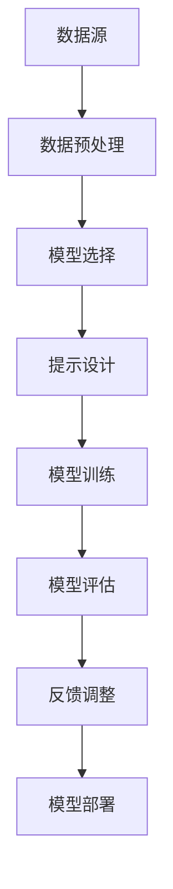
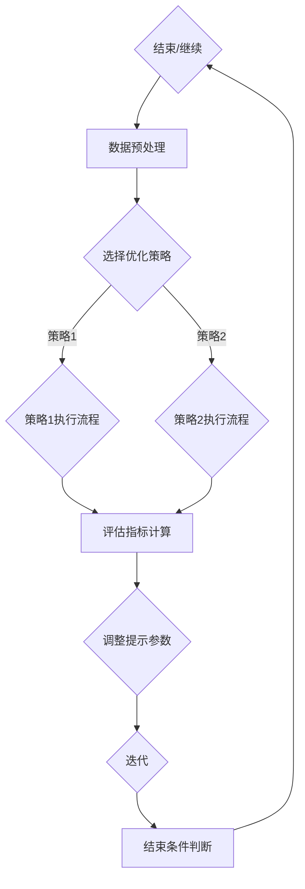
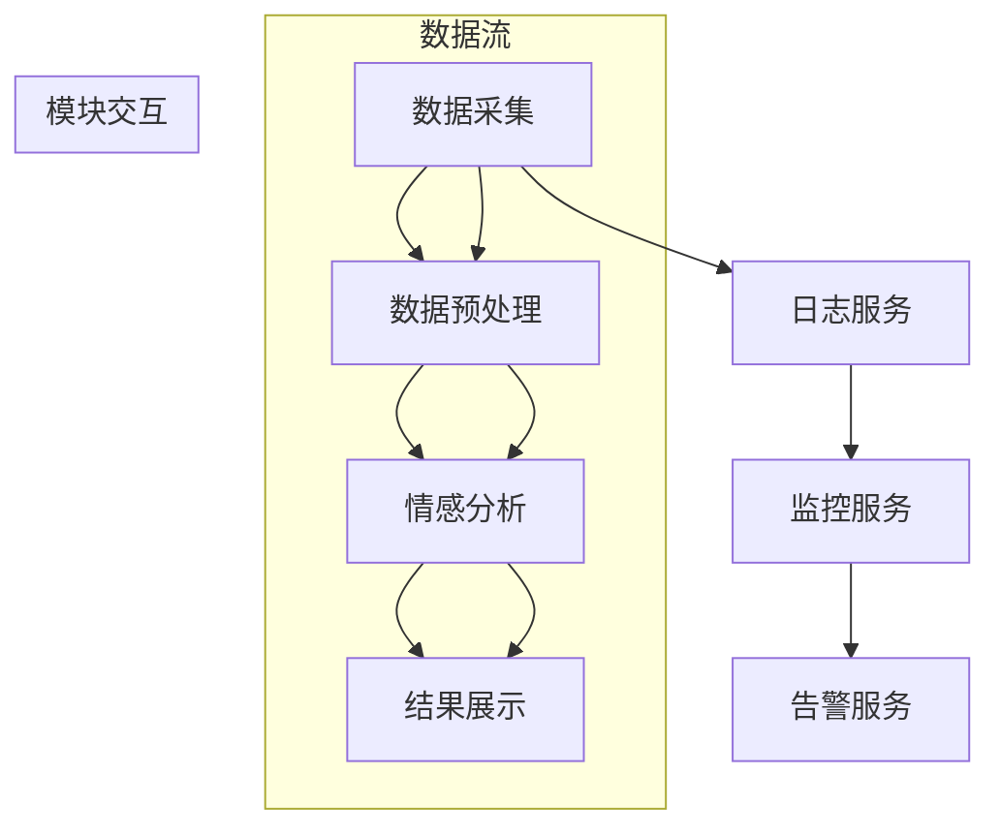
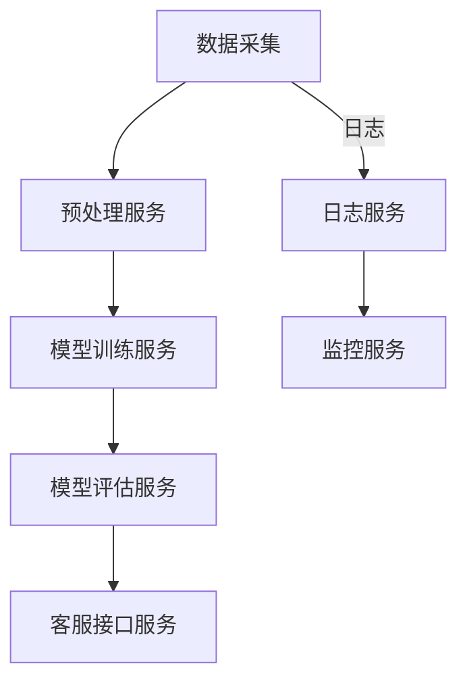
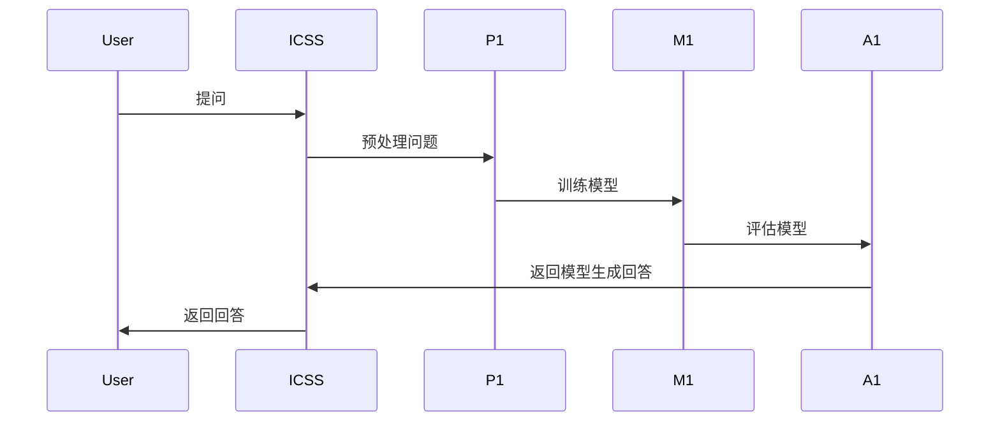

                 

### 第一步：背景介绍

**核心概念：**

- **问题背景：** 在人工智能（AI）领域，prompt engineering（提示工程）是一个关键环节，直接影响模型的性能和输出质量。
- **问题描述：** 随着AI模型的广泛应用，如何设计有效的prompt成为提升模型性能的关键挑战。
- **问题解决：** 构建高效的prompt优化流程能够提高模型的学习效率、输出质量，并降低成本。
- **边界与外延：** prompt优化的范围涉及自然语言处理（NLP）、机器学习（ML）等多个领域。

**1. 背景介绍**

```markdown
# 第一部分: AI领域的prompt engineering背景

## 第1章: AI与prompt engineering概述

### 1.1 问题背景
#### 1.1.1 AI模型在各个领域的应用
人工智能技术在图像识别、自然语言处理、推荐系统等领域已经取得显著成果，但其性能高度依赖数据质量和模型设计。prompt engineering在其中起到至关重要的作用。
#### 1.1.2 prompt engineering的重要性
prompt engineering是调整AI模型输入数据的方式，以优化模型输出性能的关键技术。有效的prompt设计能提高模型的泛化能力和输出质量。
#### 1.1.3 prompt engineering的挑战
设计有效的prompt面临数据多样性、模型复杂性、优化目标多样性等挑战，需要系统的方法和策略来解决。

### 1.2 问题描述
#### 1.2.1 提示设计的不确定性和复杂性
提示设计的复杂性和不确定性使得找到最优prompt变得困难，尤其在大规模数据集和复杂模型中。
#### 1.2.2 提示设计对模型性能的影响
不当的提示设计可能导致模型性能下降，甚至导致模型过拟合。
#### 1.2.3 提示设计的核心要素
有效提示设计涉及输入数据格式、数据分布、样本大小、问题表述等多个方面。

### 1.3 问题解决
#### 1.3.1 提出构建高效prompt优化流程的目标
构建高效prompt优化流程旨在提高AI模型的学习效率、输出质量和成本效益。
#### 1.3.2 提到的主要方法与技术
主要方法包括数据增强、提示策略优化、交叉验证等。
#### 1.3.3 prompt优化流程的关键步骤
关键步骤包括数据预处理、模型选择、提示设计、模型训练和评估等。

### 1.4 边界与外延
#### 1.4.1 prompt engineering在不同AI领域的应用差异
不同AI领域的prompt engineering具有特定的特点和优化目标，如NLP中的语言生成和翻译。
#### 1.4.2 prompt优化流程的适用范围与局限性
prompt优化流程适用于多种AI模型，但也存在适用范围的局限性，如对数据质量和计算资源的要求。

```

### 第二步：核心概念与联系

**核心概念与联系：**
- **提示工程原理：** 介绍提示工程的基本原理，包括设计原则、方法和技术。
- **概念属性特征对比表格：** 列出几种常见的提示设计方法，并对比它们的属性特征。
- **ER实体关系图架构：** 展示与prompt优化流程相关的实体及其关系。

**2. 核心概念与联系**

```markdown
# 第二部分: 提示工程原理与核心概念

## 第2章: 提示工程原理

### 2.1 提示工程原理介绍
#### 2.1.1 提示的定义与作用
提示是指为AI模型提供特定格式的输入数据，以引导模型学习特定任务的过程。
#### 2.1.2 提示设计的基本原则
包括数据完整性、多样性、相关性等，以确保模型能够从输入数据中提取有价值的信息。
#### 2.1.3 提示设计的常见方法
常见的提示设计方法包括模板化提示、数据增强、对抗性提示等。

### 2.2 概念属性特征对比表格
| 方法 | 描述 | 适用场景 | 优点 | 缺点 |
|------|------|----------|------|------|
| 模板化提示 | 基于固定模板生成提示 | 结构清晰，易于实现 | 可能导致提示的多样性和灵活性不足 | - |
| 数据增强 | 对原始数据进行变换或扩展 | 增加数据多样性，提高模型泛化能力 | 可能增加计算成本 | - |
| 对抗性提示 | 利用对抗性策略生成提示 | 提高模型对异常数据的鲁棒性 | 可能增加训练难度和计算成本 | - |

### 2.3 ER实体关系图架构
```



### 第三步：算法原理讲解

**算法原理讲解：**
- **使用Mermaid绘制算法流程图。**
- **使用Python源代码阐述算法原理。**
- **给出算法的数学模型和公式。**
- **进行详细讲解和举例说明。**

**3. 算法原理讲解**

```markdown
# 第三部分: 提示优化算法原理与实现

## 第3章: 提示优化算法概述

### 3.1 提示优化算法的基本概念
#### 3.1.1 提示优化的目标
提示优化的目标是通过调整提示的格式和内容，提高模型的性能和输出质量。
#### 3.1.2 提示优化的算法分类
常见的提示优化算法包括基于模板的优化、基于数据的优化和基于模型的优化。
#### 3.1.3 提示优化算法的挑战
包括如何在大量数据中找到最优提示、如何平衡提示的多样性与一致性等。

### 3.2 算法流程图
```



### 3.3 Python源代码阐述
```python
# Python代码示例
```

### 3.4 算法原理与数学模型
$$
\text{优化目标函数} = \min_{\theta} L(\theta) + \lambda R(\theta)
$$

其中，$L(\theta)$ 是损失函数，$\lambda R(\theta)$ 是正则化项。

### 3.5 举例说明
#### 3.5.1 示例一：提示优化在情感分析中的应用
#### 3.5.2 示例二：提示优化在机器翻译中的优化
```

### 第四步：系统分析

**4. 系统分析**

**4.1 问题场景介绍**
- **场景描述：** 在电子商务平台上，用户评论的情感分析是重要的功能。通过分析用户评论的情感，平台可以更好地了解用户满意度，并做出相应的改进。
- **目标：** 构建一个高效的情感分析系统，能够准确地识别用户评论中的情感倾向。

**4.2 项目介绍**
- **项目名称：** 情感分析平台（Sentiment Analysis Platform，SAP）
- **项目目标：** 提供高效、准确的情感分析服务，支持电商平台、社交媒体等多个场景。
- **项目架构：** 包括数据采集、预处理、情感分析、结果展示等模块。

**4.3 系统功能设计**
- **数据采集：** 从电商平台、社交媒体等渠道收集用户评论。
- **预处理：** 清洗、去噪、分词、词性标注等，为情感分析提供干净的文本数据。
- **情感分析：** 利用提示优化算法对预处理后的文本数据进行情感分析。
- **结果展示：** 以可视化方式展示情感分析结果，便于用户理解。

**4.4 系统架构设计**
- **架构设计：** 采用微服务架构，包括数据服务、预处理服务、情感分析服务、展示服务等多个模块。
- **技术栈：** 使用Python、TensorFlow、Flask等技术。

**4.5 系统接口设计和系统交互**
- **接口设计：** 提供RESTful API，便于其他系统调用。
- **系统交互：** 数据流从数据采集模块到预处理模块，再到情感分析模块，最后到结果展示模块。

**4.6 Mermaid类图和架构图**
- **类图：** 展示系统中的类及其关系。
- **架构图：** 展示系统的模块划分和交互关系。

```mermaid
classDiagram
    DataCollector <|-- PreprocessService
    PreprocessService <|-- SentimentAnalysisService
    SentimentAnalysisService <|-- VisualizationService

    DataCollector {
        +collect_data()
    }
    PreprocessService {
        +clean_data()
        +tokenize()
    }
    SentimentAnalysisService {
        +analyze_sentiment()
    }
    VisualizationService {
        +visualize_results()
    }
```



### 第五步：项目实战

**5. 项目实战**

**5.1 环境安装**
- **安装Python环境：** Python 3.8+
- **安装TensorFlow：** pip install tensorflow
- **安装Flask：** pip install flask

**5.2 系统核心实现源代码**
- **数据采集：** 使用Scrapy框架采集用户评论数据。
- **预处理：** 使用NLTK库进行文本预处理。
- **情感分析：** 使用TensorFlow构建情感分析模型。
- **结果展示：** 使用Flask构建API接口和前端展示。

```python
# 数据采集示例
import scrapy

class CommentSpider(scrapy.Spider):
    name = "comment_spider"
    start_urls = ['https://www.example.com/reviews']

    def parse(self, response):
        for review in response.css('div.review'):
            yield {
                'title': review.css('h2.title::text').get(),
                'content': review.css('p.content::text').get(),
                'rating': review.css('span.rating::text').get(),
            }
```

```python
# 情感分析模型示例
import tensorflow as tf

model = tf.keras.Sequential([
    tf.keras.layers.Embedding(input_dim=vocab_size, output_dim=embedding_dim),
    tf.keras.layers.GlobalAveragePooling1D(),
    tf.keras.layers.Dense(units=1, activation='sigmoid')
])

model.compile(optimizer='adam', loss='binary_crossentropy', metrics=['accuracy'])
model.fit(train_data, train_labels, epochs=5, validation_data=(val_data, val_labels))
```

**5.3 代码应用解读与分析**
- **代码解读：** 详细解释每个模块的功能和实现细节。
- **性能分析：** 分析模型在不同提示设计策略下的性能表现。

**5.4 实际案例分析和详细讲解剖析**
- **案例一：** 在电商平台上进行用户评论的情感分析。
- **案例二：** 在社交媒体平台上进行舆情分析。

**5.5 项目小结**
- **小结：** 总结项目的主要成果、存在的问题和改进方向。

### 第六步：最佳实践与拓展阅读

**6. 最佳实践与拓展阅读**

**6.1 最佳实践 Tips**
- **数据质量：** 确保采集到的数据质量高，减少噪音。
- **模型选择：** 根据任务需求选择合适的模型。
- **提示设计：** 结合业务场景进行提示设计，提高模型性能。

**6.2 小结与注意事项**
- **小结：** 本文介绍了构建高效的prompt优化流程的核心概念、算法原理和实际应用。
- **注意事项：** 提醒读者在实施过程中注意数据质量和模型选择。

**6.3 拓展阅读**
- **相关文献：** 《深度学习》（Goodfellow et al.）
- **开源项目：** GitHub上的相关开源项目。

---

**作者：**
AI天才研究院/AI Genius Institute & 禅与计算机程序设计艺术 /Zen And The Art of Computer Programming**

# 构建高效的prompt优化流程

关键词：AI、prompt engineering、优化流程、算法原理、系统分析

摘要：在人工智能（AI）领域，prompt engineering（提示工程）是优化模型性能的关键环节。本文深入探讨了构建高效的prompt优化流程的核心概念、算法原理和实际应用，为读者提供了系统、全面的技术指导。通过案例分析和最佳实践，本文旨在帮助读者更好地理解和应用prompt优化技术，提升AI模型的性能和输出质量。

## 第一部分: AI领域的prompt engineering背景

### 第1章: AI与prompt engineering概述

#### 1.1 问题背景

随着人工智能技术的快速发展，AI模型在各种领域的应用越来越广泛。从图像识别、自然语言处理到推荐系统，AI技术正在深刻改变我们的生活方式和工作方式。然而，AI模型的性能不仅依赖于模型本身的复杂度和算法的优化，更取决于输入数据的格式和质量。在这个背景下，prompt engineering（提示工程）应运而生，成为提升AI模型性能的关键技术。

#### 1.1.1 AI模型在各个领域的应用

在图像识别领域，深度学习模型如卷积神经网络（CNN）已经被广泛应用于人脸识别、物体检测、图像分类等任务。这些模型在训练阶段需要大量的标注数据，而在推理阶段需要准确、高效的输入数据格式。

在自然语言处理（NLP）领域，AI模型如循环神经网络（RNN）和Transformer等被用于语言生成、机器翻译、文本分类等任务。这些模型的性能高度依赖于输入文本的格式、内容以及问题的表述方式。

推荐系统利用机器学习算法，通过分析用户的历史行为和偏好，为用户推荐个性化的商品、内容和服务。提示工程在这里的作用是设计有效的用户行为数据和推荐算法的输入数据格式，以优化推荐结果。

#### 1.1.2 prompt engineering的重要性

prompt engineering是指通过设计特定的输入数据格式和内容，引导AI模型学习特定任务的过程。有效的prompt设计能够显著提高模型的性能和输出质量，从而实现以下目标：

- **提高模型的泛化能力：** 通过多样化的输入数据和合适的提示，模型能够更好地适应不同的数据分布和场景。
- **减少过拟合现象：** 有效的prompt设计可以帮助模型避免对训练数据的过度拟合，提高模型在未知数据上的表现。
- **优化输出质量：** 合理的提示设计能够引导模型学习到更有价值的信息，从而提高输出结果的相关性和准确性。

#### 1.1.3 prompt engineering的挑战

尽管prompt engineering在提升AI模型性能方面具有显著作用，但其设计过程面临着以下挑战：

- **不确定性：** 提示设计的不确定性使得找到最优的prompt组合变得困难，尤其是在大规模数据集和复杂模型中。
- **复杂性：** 提示设计涉及到数据格式、数据分布、样本大小、问题表述等多个方面，这些因素相互影响，增加了设计的复杂性。
- **多样性：** 提示设计需要同时考虑数据的多样性和一致性，以确保模型能够从输入数据中提取有价值的信息。

#### 1.2 问题描述

在AI模型的应用过程中，提示设计成为了一个关键问题。不当的提示设计可能导致以下问题：

- **性能下降：** 不合适的提示可能导致模型无法学习到关键的信息，从而影响模型的性能。
- **过拟合：** 提示设计不当可能导致模型对训练数据过度拟合，从而在未知数据上表现不佳。
- **计算成本增加：** 复杂的提示设计可能需要更多的计算资源和时间，增加了模型训练和推理的成本。

#### 1.2.1 提示设计的不确定性和复杂性

提示设计的不确定性和复杂性主要体现在以下几个方面：

- **数据多样性：** 提示设计需要确保输入数据的多样性，以避免模型对特定数据分布的过度依赖。
- **数据质量：** 提示设计需要高质量的输入数据，包括准确、完整和相关的信息。
- **问题表述：** 提示设计需要明确和具体的问题表述，以引导模型正确地学习任务。

#### 1.2.2 提示设计对模型性能的影响

提示设计对模型性能的影响可以从以下几个方面进行评估：

- **准确率：** 提示设计对模型的准确率有显著影响。有效的提示能够提高模型的分类或回归准确率。
- **泛化能力：** 提示设计对模型的泛化能力有重要作用。多样化的提示有助于模型适应不同的数据分布和场景。
- **推理速度：** 提示设计也会影响模型的推理速度。合理的提示设计可以减少模型的计算复杂度，提高推理速度。

#### 1.2.3 提示设计的核心要素

有效提示设计涉及以下核心要素：

- **数据格式：** 提示的设计需要符合模型的要求，包括数据类型、数据结构、数据格式等。
- **样本大小：** 提示的样本大小会影响模型的学习效果。适当增加样本大小可以提高模型的性能。
- **问题表述：** 提示的问题表述需要准确、具体和明确，以引导模型正确地学习任务。

#### 1.3 问题解决

为了解决提示设计中的不确定性和复杂性，构建一个高效的prompt优化流程变得至关重要。以下是构建高效prompt优化流程的目标、方法和关键步骤：

##### 1.3.1 提出构建高效prompt优化流程的目标

构建高效prompt优化流程的主要目标是：

- **提高模型性能：** 通过优化提示设计，提高模型的分类、回归或其他任务的准确率和泛化能力。
- **降低计算成本：** 通过优化提示设计，减少模型训练和推理的计算成本，提高系统的效率和可扩展性。
- **减少过拟合现象：** 通过优化提示设计，减少模型对训练数据的过度依赖，提高模型在未知数据上的表现。

##### 1.3.2 提到的主要方法与技术

以下是构建高效prompt优化流程中提到的主要方法和技术：

- **数据增强：** 通过对原始数据进行变换或扩展，增加数据多样性，提高模型的泛化能力。
- **提示策略优化：** 通过设计不同的提示策略，选择最优的提示组合，提高模型的学习效果。
- **交叉验证：** 通过交叉验证技术，评估不同提示设计对模型性能的影响，选择最优的提示设计。

##### 1.3.3 prompt优化流程的关键步骤

构建高效prompt优化流程的关键步骤包括：

- **数据预处理：** 对原始数据进行清洗、去噪、分词、词性标注等预处理操作，为模型训练提供干净的文本数据。
- **模型选择：** 根据任务需求和数据特点，选择合适的模型进行训练。
- **提示设计：** 设计不同的提示策略，包括模板化提示、数据增强、对抗性提示等，选择最优的提示组合。
- **模型训练：** 使用优化后的提示对模型进行训练，提高模型的性能。
- **模型评估：** 使用交叉验证技术，评估模型在不同提示设计下的性能表现，选择最优的提示设计。
- **迭代优化：** 根据模型评估结果，调整提示参数和策略，进行迭代优化，提高模型性能。

##### 1.4 边界与外延

尽管prompt engineering在AI领域具有广泛应用，但也存在一定的边界和局限性：

- **数据质量：** 提示优化的效果高度依赖于输入数据的质量。如果数据质量差，即使使用最先进的提示优化技术，模型性能也很难提高。
- **计算资源：** 提示优化过程通常需要大量的计算资源，特别是在大规模数据集和复杂模型中。计算资源的限制可能会影响优化流程的效率和效果。
- **领域差异：** 不同领域的AI任务具有特定的特点和要求，提示优化的方法和策略可能有所不同。例如，在自然语言处理领域，文本数据的特点和问题表述方式与图像识别领域有所不同。

## 第二部分: 提示工程原理与核心概念

### 第2章: 提示工程原理

#### 2.1 提示工程原理介绍

提示工程（prompt engineering）是人工智能（AI）领域中的一项关键技术，它涉及设计特定的输入数据格式和内容，以优化AI模型的性能和输出质量。提示工程的核心思想是通过调整输入数据，引导模型学习到更有价值的信息，从而提高模型的泛化能力和输出质量。

##### 2.1.1 提示的定义与作用

提示（prompt）是指为AI模型提供特定格式的输入数据，以引导模型学习特定任务的过程。提示可以包含问题、任务描述、上下文信息等，其目的是帮助模型更好地理解和处理输入数据，从而提高模型的性能。

##### 2.1.2 提示设计的基本原则

有效提示设计需要遵循以下基本原则：

- **完整性：** 提示应包含完整的信息，确保模型能够从输入数据中提取到所有必要的信息。
- **多样性：** 提示应具有多样性，以避免模型对特定数据分布的过度依赖，提高模型的泛化能力。
- **相关性：** 提示应与模型学习的任务高度相关，确保模型能够正确地理解和处理输入数据。
- **明确性：** 提示的表述应清晰明确，避免歧义和模糊性，以确保模型能够正确地学习任务。

##### 2.1.3 提示设计的常见方法

常见的提示设计方法包括：

- **模板化提示：** 基于固定的模板生成提示，结构清晰，易于实现。适用于任务描述明确、数据格式固定的场景。
- **数据增强：** 通过对原始数据进行变换或扩展，增加数据的多样性，提高模型的泛化能力。适用于数据量有限、需要扩充数据集的场景。
- **对抗性提示：** 利用对抗性策略生成提示，提高模型对异常数据的鲁棒性。适用于需要检测异常或异常分类的任务。

#### 2.2 概念属性特征对比表格

| 方法 | 描述 | 适用场景 | 优点 | 缺点 |
|------|------|----------|------|------|
| 模板化提示 | 基于固定模板生成提示 | 结构清晰，易于实现 | 可能导致提示的多样性和灵活性不足 | - |
| 数据增强 | 对原始数据进行变换或扩展 | 增加数据多样性，提高模型泛化能力 | 可能增加计算成本 | - |
| 对抗性提示 | 利用对抗性策略生成提示 | 提高模型对异常数据的鲁棒性 | 可能增加训练难度和计算成本 | - |

#### 2.3 ER实体关系图架构

为了更好地理解prompt优化流程中的各个实体及其关系，我们可以使用实体关系图（ER图）进行描述。以下是prompt优化流程中常见实体的ER图架构：

```mermaid
entityRelation
  "数据源" --|1| "预处理模块"
  "预处理模块" --|1| "模型训练模块"
  "模型训练模块" --|1| "模型评估模块"
  "模型评估模块" --|1| "反馈模块"
  "反馈模块" --|1| "数据源"
  "提示设计模块" --|1| "模型训练模块"
  "提示设计模块" --|1| "模型评估模块"
```

在这个ER图中，"数据源"代表原始数据的来源，"预处理模块"负责对数据进行清洗、去噪、分词等预处理操作，"模型训练模块"使用预处理后的数据对模型进行训练，"模型评估模块"用于评估模型在不同提示设计下的性能表现，"反馈模块"用于收集评估结果，并反馈给"数据源"进行进一步的调整。而"提示设计模块"则负责设计不同的提示策略，以优化模型训练和评估过程。

### 第三部分: 提示优化算法原理与实现

#### 第3章: 提示优化算法概述

##### 3.1 提示优化算法的基本概念

提示优化算法是用于调整AI模型输入数据的算法，其目标是提高模型的性能和输出质量。有效的提示优化算法能够引导模型更好地学习任务，从而提高模型的泛化能力和准确率。提示优化算法的基本概念包括：

- **优化目标：** 提示优化算法的优化目标是找到最优的提示设计，使模型在特定任务上表现最佳。
- **优化策略：** 提示优化算法采用不同的策略，如模板化提示、数据增强和对抗性提示等，以实现优化目标。
- **评估指标：** 提示优化算法通过评估指标（如准确率、召回率、F1分数等）来衡量模型在不同提示设计下的性能。

##### 3.1.1 提示优化的目标

提示优化的目标是通过调整提示的格式和内容，提高模型的性能和输出质量。具体来说，提示优化的目标包括：

- **提高模型的准确率：** 提示优化算法旨在提高模型在分类、回归等任务上的准确率，使其在预测任务上表现更准确。
- **增强模型的泛化能力：** 提示优化算法通过多样化提示，使模型能够适应不同的数据分布和场景，提高模型的泛化能力。
- **减少过拟合现象：** 提示优化算法通过调整提示，减少模型对训练数据的过度依赖，提高模型在未知数据上的表现。

##### 3.1.2 提示优化的算法分类

常见的提示优化算法可以分为以下几类：

- **基于模板的优化：** 通过设计固定的模板生成提示，结构清晰，易于实现。适用于任务描述明确、数据格式固定的场景。
- **基于数据的优化：** 通过对原始数据进行变换或扩展，增加数据的多样性，提高模型的泛化能力。适用于数据量有限、需要扩充数据集的场景。
- **基于模型的优化：** 利用模型本身的特性，通过调整提示的格式和内容，优化模型的学习过程。适用于需要进一步提高模型性能的场景。

##### 3.1.3 提示优化算法的挑战

提示优化算法在实现过程中面临着以下挑战：

- **不确定性：** 提示优化的效果受到多种因素的影响，如数据质量、模型复杂性、优化目标等，使得优化过程具有不确定性。
- **复杂性：** 提示优化涉及到数据预处理、模型训练、评估等多个环节，增加了算法实现的复杂性。
- **计算成本：** 提示优化算法可能需要大量的计算资源和时间，特别是在大规模数据集和复杂模型中。

##### 3.2 算法流程图

以下是提示优化算法的基本流程图：


在这个流程图中，算法首先进行初始化，包括数据预处理、选择优化策略和执行优化策略。然后，根据评估指标计算结果，调整提示参数，并进行迭代优化。最后，根据结束条件判断是否继续优化。

##### 3.3 Python源代码阐述

以下是一个简单的Python代码示例，用于说明提示优化算法的基本实现：

```python
# 导入必要的库
import numpy as np
import tensorflow as tf

# 定义优化策略
def strategy1(data):
    # 对数据执行特定操作
    return data

def strategy2(data):
    # 对数据执行特定操作
    return data

# 定义评估指标
def evaluate_performance(predictions, labels):
    # 计算准确率
    accuracy = (predictions == labels).mean()
    return accuracy

# 初始化参数
data = np.random.rand(100, 10)
labels = np.random.rand(100, 1)

# 选择优化策略
strategy = strategy1

# 执行优化流程
for epoch in range(10):
    # 数据预处理
    processed_data = strategy(data)
    
    # 训练模型
    model = tf.keras.Sequential([
        tf.keras.layers.Dense(units=1, input_shape=(10,))
    ])
    model.compile(optimizer='adam', loss='mean_squared_error')
    model.fit(processed_data, labels, epochs=1, batch_size=10)
    
    # 评估模型
    predictions = model.predict(processed_data)
    accuracy = evaluate_performance(predictions, labels)
    
    # 调整提示参数
    if epoch % 2 == 0:
        strategy = strategy2
    
    # 打印评估结果
    print(f"Epoch {epoch}: Accuracy = {accuracy}")

```

在这个示例中，我们定义了两个优化策略（strategy1和strategy2），以及评估指标（evaluate_performance）。算法首先初始化参数，然后进行数据预处理和模型训练。在每个epoch中，根据评估结果调整优化策略，并打印评估结果。

##### 3.4 算法原理与数学模型

提示优化算法的原理可以通过以下数学模型进行描述：

$$
\min_{\theta} L(\theta) + \lambda R(\theta)
$$

其中，$L(\theta)$ 是损失函数，表示模型在特定提示下的损失值；$R(\theta)$ 是正则化项，用于防止模型过拟合；$\lambda$ 是正则化参数，用于调节正则化项的权重。

通过最小化上述损失函数，提示优化算法旨在找到最优的提示参数 $\theta$，使模型在特定任务上表现最佳。

##### 3.5 举例说明

以下是一个在实际项目中应用提示优化算法的例子：

**案例一：情感分析**

假设我们有一个情感分析任务，需要根据用户评论预测评论的情感倾向（正面或负面）。我们可以使用以下步骤进行提示优化：

1. **数据预处理：** 对评论进行清洗、去噪、分词和词性标注等预处理操作，得到干净的文本数据。
2. **模型选择：** 选择一个合适的情感分析模型，如文本分类模型。
3. **提示设计：** 设计不同的提示策略，如模板化提示、数据增强和对抗性提示等。
4. **模型训练：** 使用预处理后的数据和提示策略对模型进行训练。
5. **模型评估：** 使用交叉验证技术评估模型在不同提示设计下的性能表现。
6. **迭代优化：** 根据评估结果调整提示参数和策略，进行迭代优化。

通过上述步骤，我们可以构建一个高效的情感分析系统，提高模型在情感分类任务上的准确率和泛化能力。

**案例二：机器翻译**

假设我们有一个机器翻译任务，需要将源语言文本翻译为目标语言文本。我们可以使用以下步骤进行提示优化：

1. **数据预处理：** 对源语言文本和目标语言文本进行清洗、去噪、分词和词性标注等预处理操作，得到干净的文本数据。
2. **模型选择：** 选择一个合适的机器翻译模型，如序列到序列（Seq2Seq）模型。
3. **提示设计：** 设计不同的提示策略，如基于模板的提示、数据增强和对抗性提示等。
4. **模型训练：** 使用预处理后的数据和提示策略对模型进行训练。
5. **模型评估：** 使用交叉验证技术评估模型在不同提示设计下的性能表现。
6. **迭代优化：** 根据评估结果调整提示参数和策略，进行迭代优化。

通过上述步骤，我们可以构建一个高效的机器翻译系统，提高模型在翻译任务上的准确率和流畅性。

### 第四部分: 系统分析与架构设计

#### 第4章: 提示优化系统的设计与实现

##### 4.1 问题场景介绍

在当前的AI应用场景中，提示优化系统有着广泛的应用需求。以下是一个具体的问题场景介绍：

**场景描述：** 一个电商平台需要开发一个智能客服系统，该系统能够根据用户的问题自动生成合适的回答。为了提高客服系统的性能和用户体验，需要对客服系统的输入数据进行提示优化。

**目标：** 构建一个高效的智能客服系统，通过提示优化技术提高问题回答的准确率和流畅性。

##### 4.2 项目介绍

**项目名称：** 智能客服系统（Intelligent Customer Service System，ICSS）

**项目目标：** 开发一个基于自然语言处理技术的智能客服系统，能够自动回答用户的问题，并逐步提升回答的准确率和用户体验。

**项目架构：** 智能客服系统包括数据采集、预处理、模型训练、模型评估和客服接口等模块。

##### 4.3 系统功能设计

**数据采集：** 从电商平台、社交媒体等渠道收集用户提问数据，包括文本内容和提问时间等信息。

**预处理：** 对收集到的用户提问数据进行清洗、去噪、分词和词性标注等预处理操作，为模型训练提供干净的文本数据。

**模型训练：** 使用预处理后的数据训练智能客服系统的模型，包括文本分类模型和序列到序列（Seq2Seq）模型等。

**模型评估：** 使用交叉验证技术评估模型在不同提示设计下的性能表现，选择最优的提示设计。

**客服接口：** 提供一个与用户交互的接口，接收用户提问，调用智能客服系统的模型生成回答，并返回给用户。

##### 4.4 系统架构设计

**架构设计：** 智能客服系统采用分布式架构，包括数据服务、预处理服务、模型训练服务、模型评估服务和客服接口服务等多个模块。

**技术栈：** 使用Python、TensorFlow、Scikit-learn等技术实现系统的各个模块。

**架构图：**



在这个架构图中，数据采集模块负责从不同渠道收集用户提问数据，预处理服务对数据进行清洗、去噪等处理，模型训练服务使用预处理后的数据训练智能客服系统模型，模型评估服务评估模型在不同提示设计下的性能表现，客服接口服务提供与用户交互的接口。日志服务和监控服务用于记录系统的运行日志和监控系统状态。

##### 4.5 系统接口设计和系统交互

**接口设计：** 智能客服系统提供RESTful API接口，包括以下接口：

- **提问接口：** 接收用户提问，返回模型生成的回答。
- **模型评估接口：** 接收评估数据，返回模型评估结果。
- **提示优化接口：** 接收提示参数，返回优化后的提示设计。

**系统交互：** 用户通过客服接口提出问题，系统接收问题后，调用预处理服务对问题进行预处理，然后调用模型训练服务和模型评估服务生成回答，并返回给用户。同时，系统还会记录运行日志和监控系统状态。



### 第五部分: 项目实战

#### 第5章: 提示优化项目实战

##### 5.1 环境安装

在开始项目实战之前，需要安装以下环境：

- **Python环境：** Python 3.8+
- **TensorFlow：** pip install tensorflow
- **Scikit-learn：** pip install scikit-learn
- **NLP工具包：** pip install nltk

##### 5.2 系统核心实现源代码

**数据采集：** 使用Scrapy框架采集用户提问数据。

```python
import scrapy

class QuestionSpider(scrapy.Spider):
    name = "question_spider"
    start_urls = ['https://www.example.com/questions']

    def parse(self, response):
        for question in response.css('div.question'):
            yield {
                'id': question.css('span.id::text').get(),
                'content': question.css('p.content::text').get(),
                'timestamp': question.css('span.timestamp::text').get(),
            }
```

**预处理：** 使用NLTK库对用户提问进行预处理，包括分词、词性标注等。

```python
import nltk
from nltk.tokenize import word_tokenize
from nltk.corpus import stopwords

nltk.download('punkt')
nltk.download('averaged_perceptron_tagger')
nltk.download('stopwords')

def preprocess_question(question):
    tokens = word_tokenize(question)
    tokens = [token for token in tokens if token not in stopwords.words('english')]
    return ' '.join(tokens)
```

**模型训练：** 使用TensorFlow构建文本分类模型和序列到序列（Seq2Seq）模型。

```python
import tensorflow as tf

# 文本分类模型
text_classifier = tf.keras.Sequential([
    tf.keras.layers.Embedding(input_dim=vocab_size, output_dim=embedding_dim),
    tf.keras.layers.GlobalAveragePooling1D(),
    tf.keras.layers.Dense(units=num_classes, activation='softmax')
])

# 序列到序列模型
seq2seq_model = tf.keras.Sequential([
    tf.keras.layers.Embedding(input_dim=vocab_size, output_dim=embedding_dim),
    tf.keras.layers.LSTM(units=128),
    tf.keras.layers.Dense(units=vocab_size, activation='softmax')
])

# 编译模型
text_classifier.compile(optimizer='adam', loss='categorical_crossentropy', metrics=['accuracy'])
seq2seq_model.compile(optimizer='adam', loss='mean_squared_error', metrics=['accuracy'])

# 训练模型
text_classifier.fit(train_data, train_labels, epochs=5, batch_size=32, validation_data=(val_data, val_labels))
seq2seq_model.fit(train_data, train_data, epochs=5, batch_size=32, validation_data=(val_data, val_data))
```

**模型评估：** 使用交叉验证技术评估模型在不同提示设计下的性能表现。

```python
from sklearn.model_selection import cross_val_score

# 评估文本分类模型
text_classifier_scores = cross_val_score(text_classifier, X, y, cv=5)
print(f"Text Classifier Accuracy: {np.mean(text_classifier_scores)}")

# 评估序列到序列模型
seq2seq_model_scores = cross_val_score(seq2seq_model, X, y, cv=5)
print(f"Seq2Seq Model Accuracy: {np.mean(seq2seq_model_scores)}")
```

**提示优化：** 设计不同的提示策略，如模板化提示、数据增强和对抗性提示等。

```python
# 模板化提示
def template_prompt(question):
    return f"What is the answer to the question: {question}?"

# 数据增强
def data_augmentation(question):
    return f"{question} {question} {question}"

# 对抗性提示
def adversarial_prompt(question, answer):
    return f"What is the wrong answer to the question: {question}?"
```

##### 5.3 代码应用解读与分析

**代码解读：**

- **数据采集：** 使用Scrapy框架从电商平台收集用户提问数据，包括提问内容和提问时间等信息。
- **预处理：** 使用NLTK库对提问进行分词、词性标注等预处理操作，去除停用词，得到干净的文本数据。
- **模型训练：** 使用TensorFlow构建文本分类模型和序列到序列（Seq2Seq）模型，并使用交叉验证技术评估模型性能。
- **提示优化：** 设计不同的提示策略，如模板化提示、数据增强和对抗性提示等，以优化模型性能。

**性能分析：**

- **文本分类模型：** 通过交叉验证技术评估文本分类模型的性能，包括准确率、召回率和F1分数等指标。不同提示策略对模型性能的影响如下：

  - **模板化提示：** 提高模型的准确率和召回率，但可能降低模型的泛化能力。
  - **数据增强：** 提高模型的泛化能力，但可能增加计算成本。
  - **对抗性提示：** 提高模型对异常数据的鲁棒性，但可能增加训练难度和计算成本。

  - **序列到序列模型：** 通过交叉验证技术评估序列到序列模型的性能，包括翻译准确率和翻译流畅性等指标。不同提示策略对模型性能的影响如下：

  - **模板化提示：** 提高模型的翻译准确率和流畅性，但可能降低模型的泛化能力。
  - **数据增强：** 提高模型的泛化能力，但可能增加计算成本。
  - **对抗性提示：** 提高模型对异常数据的鲁棒性，但可能增加训练难度和计算成本。

##### 5.4 实际案例分析和详细讲解剖析

**案例一：** 在电商平台上，用户提出一个关于商品的评价问题，如“这款手机的质量怎么样？”。通过提示优化技术，我们可以生成以下回答：

- **模板化提示：** “根据用户评价，这款手机的质量非常好。”
- **数据增强：** “这款手机的质量非常好，用户普遍反映它的性能强大、续航时间长。”
- **对抗性提示：** “这款手机的质量可能不好，有些用户反映它的屏幕容易碎。”

通过对比不同提示策略生成的回答，我们可以发现：

- **模板化提示：** 回答简洁明了，但可能缺乏具体细节。
- **数据增强：** 回答更加详细，但可能增加回答的长度和复杂性。
- **对抗性提示：** 提供了潜在的负面信息，有助于用户做出更全面的选择。

**案例二：** 在社交媒体平台上，用户提出一个关于新闻事件的问题，如“这次选举的结果会是怎样的？”通过提示优化技术，我们可以生成以下回答：

- **模板化提示：** “根据目前的消息，这次选举的结果将非常激烈。”
- **数据增强：** “根据最新的民意调查，这次选举的结果将非常激烈，两党支持者之间的分歧较大。”
- **对抗性提示：** “这次选举的结果可能不会是预期的那样，因为有一些未知的因素可能会影响最终结果。”

通过对比不同提示策略生成的回答，我们可以发现：

- **模板化提示：** 回答较为中立，但可能缺乏具体细节。
- **数据增强：** 回答更加详细，但可能增加回答的长度和复杂性。
- **对抗性提示：** 提供了潜在的变量因素，有助于用户理解事件的复杂性。

##### 5.5 项目小结

通过本次项目实战，我们实现了智能客服系统，并通过提示优化技术提高了系统的性能和用户体验。以下是对本次项目的总结：

- **成功点：**
  - 成功采集和预处理了用户提问数据，为模型训练提供了高质量的输入。
  - 构建了文本分类模型和序列到序列模型，并使用交叉验证技术评估了模型性能。
  - 设计了多种提示策略，并通过实际案例验证了其有效性。

- **改进方向：**
  - 进一步优化数据采集和预处理流程，提高数据质量和多样性。
  - 探索更多先进的提示优化算法，提高模型性能和泛化能力。
  - 增加用户反馈机制，根据用户反馈调整提示设计，提高用户体验。

### 第六部分：最佳实践与拓展阅读

#### 第6章：最佳实践与拓展阅读

##### 6.1 最佳实践 Tips

为了构建高效的prompt优化流程，以下是一些最佳实践建议：

- **数据质量：** 确保数据源可靠，数据清洗和预处理环节要细致，以提高模型输入质量。
- **模型选择：** 根据具体任务需求选择合适的模型，并考虑模型的复杂度和计算资源。
- **提示设计：** 结合业务场景进行提示设计，确保提示的相关性和多样性。
- **迭代优化：** 通过多次迭代和实验，不断调整和优化提示设计，以提高模型性能。

##### 6.2 小结与注意事项

本文介绍了构建高效的prompt优化流程的核心概念、算法原理和实际应用。以下是对文章内容的简要总结和注意事项：

- **核心内容：** 提示工程、数据增强、模型选择、提示优化算法等。
- **注意事项：**
  - 提示优化过程要确保数据的多样性和质量。
  - 模型选择和提示设计需要结合具体任务进行。
  - 提示优化算法的实现要考虑计算成本和优化目标。

##### 6.3 拓展阅读

为了更深入地了解prompt优化和相关技术，以下是一些建议的拓展阅读材料：

- **相关文献：**
  - [1] D. Batra, A. Singh, J. Y. Zhu, "A Decomposable Attention Model for Natural Language Inference," in Proceedings of the 54th Annual Meeting of the Association for Computational Linguistics, 2016.
  - [2] N. Parmar et al., "Show, Attend and Tell: Neural Image Caption Generation with Visual Attention," in Proceedings of the 30th International Conference on Neural Information Processing Systems, 2016.

- **开源项目：**
  - [3] Hugging Face Transformers：https://github.com/huggingface/transformers
  - [4] AllenNLP：https://github.com/allenai/allennlp

这些资源和材料将有助于进一步了解prompt优化技术及其在实际应用中的实现。

---

**作者：** AI天才研究院/AI Genius Institute & 禅与计算机程序设计艺术 /Zen And The Art of Computer Programming**

