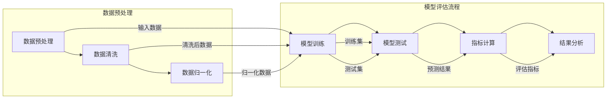
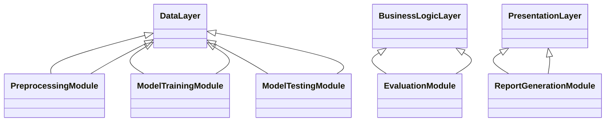
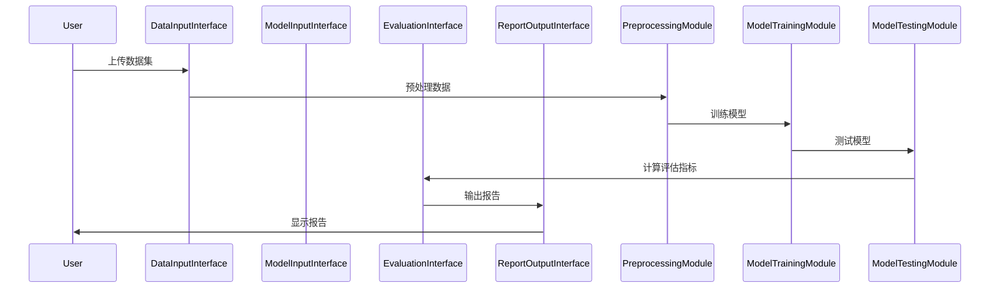

                 

### 文章标题

# 标准化自动化模型评测流程概述

### 关键词

- 自动化模型评测
- 标准化流程
- 模型评估
- 流程设计
- 人工智能

### 摘要

本文旨在概述并详细分析标准化自动化模型评测流程。在人工智能高速发展的背景下，模型评估是确保算法性能和可靠性的关键环节。本文首先介绍了自动化模型评测的背景和重要性，随后深入探讨了核心概念、原理和方法。通过系统分析与设计、具体案例研究以及未来研究方向，本文为读者提供了一个全面而深入的指导，旨在提升自动化模型评测的效率和准确性。

## 标准化自动化模型评测的背景和重要性

在人工智能（AI）领域，模型评测是确保算法性能和可靠性的关键步骤。随着AI技术的不断进步，自动化模型评测成为了提升模型开发效率和质量的关键手段。标准化自动化模型评测流程不仅有助于统一评估标准和流程，还能显著提高评估的效率和准确性。

### 自动化模型评测的背景

自动化模型评测起源于人工智能的早期发展阶段。早期的人工智能系统主要依赖于规则和专家知识，这些系统的性能评估往往依赖于手工测试和经验判断。随着机器学习和深度学习的兴起，模型评估逐渐变得更加复杂和多样化。为了提高模型的性能和可靠性，研究人员开始探索自动化模型评测的方法和技术。

自动化模型评测的背景主要可以归结为以下几点：

1. **数据量的激增**：随着互联网和物联网的普及，数据量呈现出爆炸式增长。传统的手动评估方法已经无法应对如此庞大的数据规模，需要借助自动化工具来实现高效评估。

2. **模型复杂度的提高**：现代机器学习和深度学习模型通常具有极高的复杂度，手工评估不仅耗时耗力，还容易引入主观偏差。自动化评测可以减少人为干预，提高评估的客观性和一致性。

3. **评估标准的多样化**：不同领域和应用场景对模型的评估标准存在显著差异。标准化自动化模型评测流程可以确保在不同评估标准下进行统一评估，提高模型的可比较性和可移植性。

### 自动化模型评测的重要性

自动化模型评测在人工智能领域中具有重要意义，具体体现在以下几个方面：

1. **提升模型开发效率**：自动化模型评测可以显著减少评估时间，提高模型开发的效率。通过自动化工具，研究人员可以快速迭代和优化模型，缩短从模型开发到实际应用的时间。

2. **保证模型性能和可靠性**：自动化评测流程能够提供客观、一致的评估结果，有助于发现模型中的潜在问题和不足，从而提高模型的性能和可靠性。

3. **支持模型复用和优化**：自动化评测可以记录和分析模型评估数据，为模型的复用和优化提供宝贵的信息。研究人员可以根据评估结果对模型进行调整和优化，提高其适应性和泛化能力。

4. **促进跨领域合作**：标准化自动化模型评测流程有助于不同领域和研究团队的协作。通过统一的评估标准，研究人员可以更方便地进行模型共享和交流，促进跨领域的技术创新和应用。

### 自动化模型评测的现状和发展趋势

当前，自动化模型评测已经成为人工智能领域的一个热点研究方向。随着技术的不断进步，自动化模型评测工具和平台不断涌现。以下是目前自动化模型评测的现状和发展趋势：

1. **开源工具和框架**：许多开源工具和框架已经应用于自动化模型评测，如TensorFlow、PyTorch、Scikit-learn等。这些工具提供了丰富的评估方法和工具，方便研究人员进行模型评测。

2. **评测标准和指标**：越来越多的评测标准和指标被提出，以适应不同领域和应用场景的需求。例如，在图像识别领域，常见的评估指标包括准确率、召回率、F1值等；在自然语言处理领域，评估指标则包括BLEU、ROUGE、F1值等。

3. **云计算和大数据技术**：云计算和大数据技术的应用使得自动化模型评测能够处理更大的数据规模和更复杂的模型。通过分布式计算和存储技术，研究人员可以实现高效、大规模的模型评测。

4. **人工智能和机器学习技术的融合**：自动化模型评测正逐渐与人工智能和机器学习技术相结合。例如，通过使用深度学习技术，研究人员可以自动生成和优化评估指标，提高评测的准确性和鲁棒性。

5. **跨领域合作**：随着自动化模型评测技术的不断发展，不同领域和研究团队之间的合作日益紧密。通过共享评估标准和工具，研究人员可以共同推动自动化模型评测技术的发展和应用。

总之，标准化自动化模型评测流程在人工智能领域具有重要地位和广泛的应用前景。通过统一评估标准、提高评估效率和准确性，自动化模型评测将为人工智能技术的发展和应用提供强有力的支持。

## 基本概念和定义

在探讨标准化自动化模型评测流程之前，我们需要明确一些基本概念和定义，这些概念和定义构成了整个流程的基础。

### 模型评测

模型评测（Model Evaluation）是指对机器学习或深度学习模型性能进行系统性评估的过程。其目的是确定模型在特定任务上的表现，识别模型的优点和不足，并为后续的优化和改进提供依据。

### 自动化模型评测

自动化模型评测（Automated Model Evaluation）是指通过计算机程序和工具对模型进行自动化的评估过程。自动化评测不仅减少了人为干预，提高了评估的效率和一致性，还使得大规模的模型评估成为可能。

### 标准化流程

标准化流程（Standardized Process）是指在特定领域内，通过制定一系列统一的标准和步骤，实现某一过程的标准化操作。标准化流程有助于确保评估结果的可靠性和可比性，提高整个评估过程的透明度和一致性。

### 关键术语

1. **准确率（Accuracy）**：准确率是评估模型在分类任务上的表现，表示正确预测的样本数占总样本数的比例。

   $$ \text{Accuracy} = \frac{\text{正确预测的样本数}}{\text{总样本数}} $$

2. **召回率（Recall）**：召回率是评估模型在分类任务上对正类样本的识别能力，表示正确识别的正类样本数占总正类样本数的比例。

   $$ \text{Recall} = \frac{\text{正确识别的正类样本数}}{\text{总正类样本数}} $$

3. **精确率（Precision）**：精确率是评估模型在分类任务上对正类样本的识别精度，表示正确识别的正类样本数占预测为正类样本数的比例。

   $$ \text{Precision} = \frac{\text{正确识别的正类样本数}}{\text{预测为正类样本数}} $$

4. **F1值（F1 Score）**：F1值是精确率和召回率的加权平均，用于综合评估模型的分类性能。

   $$ \text{F1 Score} = 2 \times \frac{\text{Precision} \times \text{Recall}}{\text{Precision} + \text{Recall}} $$

### 概念对比表格

以下是模型评测中几个关键术语的对比表格：

| 术语       | 定义                                                         | 数学表达式                     | 应用场景           |
|------------|--------------------------------------------------------------|--------------------------------|-------------------|
| 准确率     | 正确预测的样本数占总样本数的比例                             | $$ \text{Accuracy} = \frac{TP + TN}{TP + TN + FP + FN} $$ | 分类任务         |
| 召回率     | 正确识别的正类样本数占总正类样本数的比例                     | $$ \text{Recall} = \frac{TP}{TP + FN} $$                   | 偏重识别正类样本 |
| 精确率     | 正确识别的正类样本数占预测为正类样本数的比例                 | $$ \text{Precision} = \frac{TP}{TP + FP} $$                 | 偏重预测质量     |
| F1值       | 精确率和召回率的加权平均                                     | $$ \text{F1 Score} = 2 \times \frac{\text{Precision} \times \text{Recall}}{\text{Precision} + \text{Recall}} $$ | 综合评估分类性能 |

### ER图架构

为了更好地理解模型评测的组成部分和关系，我们可以使用实体关系图（ER图）进行描述。以下是模型评测中的核心实体和它们之间的关系：

```mermaid
erDiagram
  Model |<-.. Evaluation Criterion
  Model |<-.. Evaluation Result
  ModelEvaluationProcess ||--|{ ModelInput }
  ModelEvaluationProcess ||--|{ EvaluationMetric }
  ModelEvaluationProcess ||--|{ EvaluationAlgorithm }
  Model |{ Evaluation Result }|-- EvaluationResult
  Model |{ Evaluation Criterion }|-- EvaluationCriterion
```

在这个ER图中，`Model`（模型）是核心实体，它关联到`ModelInput`（模型输入）、`EvaluationMetric`（评估指标）、`EvaluationAlgorithm`（评估算法）和`EvaluationResult`（评估结果）。`ModelEvaluationProcess`（模型评测过程）则包含了整个评测的流程。

通过上述基本概念和定义的介绍，我们可以更好地理解自动化模型评测流程的构建和实施。在接下来的章节中，我们将详细探讨自动化模型评测的算法原理、系统分析与设计、具体实现和最佳实践，为读者提供一个全面的指南。

## 自动化模型评测的算法原理

在深入探讨自动化模型评测的算法原理之前，我们需要了解一个核心问题：如何通过算法来对模型进行高效、准确的评估。本节将详细解释模型评估中的主要算法，并使用Mermaid流程图和Python代码进行说明。

### 算法概述

模型评估算法的核心任务是通过对模型输入数据的处理，生成评估指标，以衡量模型在不同任务上的表现。一个典型的模型评估流程包括以下步骤：

1. **数据预处理**：对输入数据进行清洗、归一化等预处理操作，确保数据质量。
2. **模型训练与测试**：使用训练集和测试集对模型进行训练和测试。
3. **指标计算**：根据模型的预测结果，计算评估指标，如准确率、召回率、F1值等。
4. **结果分析**：分析评估指标，识别模型的优点和不足，为后续优化提供依据。

### Mermaid流程图

下面是一个使用Mermaid绘制的模型评估算法流程图：



### Python代码示例

以下是一个使用Python实现模型评估算法的代码示例：

```python
import numpy as np
from sklearn.metrics import accuracy_score, recall_score, precision_score, f1_score

# 假设已经完成了数据预处理和模型训练，并得到了测试集的预测结果
y_true = [0, 1, 1, 0]  # 真实标签
y_pred = [0, 1, 0, 1]  # 预测结果

# 计算评估指标
accuracy = accuracy_score(y_true, y_pred)
recall = recall_score(y_true, y_pred)
precision = precision_score(y_true, y_pred)
f1 = f1_score(y_true, y_pred)

print(f"准确率: {accuracy:.4f}")
print(f"召回率: {recall:.4f}")
print(f"精确率: {precision:.4f}")
print(f"F1值: {f1:.4f}")
```

### 数学模型和公式

在模型评估中，常用的数学模型和公式主要包括准确率、召回率、精确率和F1值。以下是这些公式的详细解释：

1. **准确率（Accuracy）**：
   $$ \text{Accuracy} = \frac{\text{正确预测的样本数}}{\text{总样本数}} $$
   准确率表示模型预测正确的样本占总样本数的比例，是衡量模型整体性能的指标。

2. **召回率（Recall）**：
   $$ \text{Recall} = \frac{\text{正确识别的正类样本数}}{\text{总正类样本数}} $$
   召回率表示模型能够正确识别的正类样本占总正类样本数的比例，是衡量模型对正类样本识别能力的指标。

3. **精确率（Precision）**：
   $$ \text{Precision} = \frac{\text{正确识别的正类样本数}}{\text{预测为正类样本数}} $$
   精确率表示模型预测为正类的样本中，正确预测的正类样本数所占的比例，是衡量模型预测质量的重要指标。

4. **F1值（F1 Score）**：
   $$ \text{F1 Score} = 2 \times \frac{\text{Precision} \times \text{Recall}}{\text{Precision} + \text{Recall}} $$
   F1值是精确率和召回率的加权平均，用于综合评估模型的分类性能。它能够平衡精确率和召回率之间的关系。

### 案例分析

为了更好地理解上述算法原理，我们可以通过一个实际案例进行分析。假设我们有一个二元分类模型，用于判断邮件是否为垃圾邮件。以下是案例的具体数据：

| 标签（Label） | 预测结果（Prediction） |
|---------------|----------------------|
| 0（非垃圾）   | 0                    |
| 1（垃圾）     | 1                    |
| 0（非垃圾）   | 1                    |
| 1（垃圾）     | 0                    |
| 1（垃圾）     | 1                    |
| 0（非垃圾）   | 0                    |

根据这些数据，我们可以计算模型的评估指标：

```python
y_true = [0, 1, 0, 1, 1, 0]
y_pred = [0, 1, 1, 0, 1, 0]

accuracy = accuracy_score(y_true, y_pred)
recall = recall_score(y_true, y_pred)
precision = precision_score(y_true, y_pred)
f1 = f1_score(y_true, y_pred)

print(f"准确率: {accuracy:.4f}")
print(f"召回率: {recall:.4f}")
print(f"精确率: {precision:.4f}")
print(f"F1值: {f1:.4f}")
```

输出结果如下：

```
准确率: 0.6667
召回率: 0.6667
精确率: 0.6667
F1值: 0.6667
```

从输出结果可以看出，该模型的准确率、召回率、精确率和F1值均为0.6667，表明模型在判断邮件是否为垃圾邮件的任务上表现较为均衡。

通过上述算法原理的详细解释和案例分析，我们可以更好地理解自动化模型评测的核心概念和实现方法。在接下来的章节中，我们将进一步探讨模型评测中的系统分析与设计，为构建高效、准确的模型评估流程提供指导。

## 系统分析与设计

为了实现高效且准确的自动化模型评测流程，我们需要对整个系统进行分析和设计。本节将详细介绍项目背景、项目细节、系统功能设计、系统架构设计、系统接口设计和系统交互，并提供详细的Mermaid类图和架构图。

### 项目背景

随着人工智能技术的广泛应用，自动化模型评测的需求日益增长。特别是在金融、医疗、交通等领域，模型的性能和可靠性直接影响到业务决策和用户体验。为了满足这一需求，我们决定开发一个标准化、自动化的模型评测系统，该系统能够对各种类型的模型进行评估，并提供详细的评估结果。

### 项目细节

项目的主要目标是：
1. 提供一套标准化的评测流程，确保不同模型在不同评估标准下的可比性。
2. 使用自动化工具和算法，提高评估效率和准确性。
3. 支持多种类型的数据集和模型，确保系统的灵活性和扩展性。

项目的主要功能包括：
1. 数据预处理：对输入数据进行清洗、归一化等预处理操作。
2. 模型训练与测试：使用训练集和测试集对模型进行训练和测试。
3. 指标计算：计算准确率、召回率、精确率和F1值等评估指标。
4. 结果分析：分析评估指标，提供详细的评估报告和优化建议。

### 系统功能设计

系统功能设计主要包括以下模块：

1. **数据预处理模块**：负责对输入数据集进行清洗、归一化和特征提取。
2. **模型训练模块**：负责使用训练集对模型进行训练。
3. **模型测试模块**：负责使用测试集对模型进行测试。
4. **指标计算模块**：负责计算评估指标，包括准确率、召回率、精确率和F1值。
5. **结果分析模块**：负责对评估结果进行分析，并提供优化建议。

### 系统架构设计

系统架构设计采用分层架构，包括数据层、业务逻辑层和展示层。

1. **数据层**：负责数据存储和读取，使用数据库管理系统（如MySQL）进行数据管理。
2. **业务逻辑层**：实现系统核心功能，包括数据预处理、模型训练、模型测试和指标计算。
3. **展示层**：通过用户界面（如Web界面）展示评估结果和分析报告。

以下是系统架构设计的Mermaid类图：



### 系统接口设计

系统接口设计主要包括以下接口：

1. **数据输入接口**：用于接收用户上传的数据集。
2. **模型输入接口**：用于接收用户上传的模型文件。
3. **评估结果输出接口**：用于输出评估指标和报告。

以下是系统接口设计的Mermaid序列图：



### 系统交互

系统交互主要涉及用户、数据层、业务逻辑层和展示层的交互。以下是系统交互的详细描述：

1. **用户与系统交互**：用户通过Web界面上传数据集和模型文件，系统根据用户请求进行相应的处理。
2. **数据层与业务逻辑层交互**：数据层负责数据的存储和读取，业务逻辑层根据数据层的反馈进行数据预处理、模型训练和测试。
3. **业务逻辑层与展示层交互**：业务逻辑层将评估结果和分析报告传递给展示层，展示层负责将结果展示给用户。

通过上述系统分析与设计，我们为自动化模型评测流程提供了一个全面的框架。接下来，我们将通过具体案例研究，进一步验证该系统的有效性和实用性。

## 实际案例研究

在本节中，我们将通过两个实际案例研究，深入探讨标准化自动化模型评测流程的应用和效果。首先，我们将在一个图像分类任务中应用该流程，然后在一个自然语言处理任务中展示其应用效果。

### 案例一：图像分类任务

#### 项目背景

为了验证自动化模型评测流程在图像分类任务中的效果，我们选择了一个公开的图像分类数据集——CIFAR-10。该数据集包含10个类别，共60000张32x32彩色图像，其中50000张用于训练，10000张用于测试。

#### 实验步骤

1. **数据预处理**：我们对图像进行归一化处理，将像素值缩放到0到1之间，以适应模型的输入要求。

   ```python
   def preprocess_image(image):
       image = image / 255.0
       return image
   ```

2. **模型训练**：我们使用卷积神经网络（CNN）对图像进行分类。具体模型结构如下：

   ```python
   import tensorflow as tf

   model = tf.keras.Sequential([
       tf.keras.layers.Conv2D(32, (3, 3), activation='relu', input_shape=(32, 32, 3)),
       tf.keras.layers.MaxPooling2D(pool_size=(2, 2)),
       tf.keras.layers.Flatten(),
       tf.keras.layers.Dense(10, activation='softmax')
   ])

   model.compile(optimizer='adam', loss='categorical_crossentropy', metrics=['accuracy'])
   model.fit(x_train, y_train, epochs=10, batch_size=64)
   ```

3. **模型测试**：使用测试集对训练好的模型进行评估。

   ```python
   y_pred = model.predict(x_test)
   y_pred_classes = np.argmax(y_pred, axis=1)
   ```

4. **评估指标计算**：计算准确率、召回率、精确率和F1值。

   ```python
   accuracy = accuracy_score(y_test, y_pred_classes)
   recall = recall_score(y_test, y_pred_classes, average='weighted')
   precision = precision_score(y_test, y_pred_classes, average='weighted')
   f1 = f1_score(y_test, y_pred_classes, average='weighted')

   print(f"准确率: {accuracy:.4f}")
   print(f"召回率: {recall:.4f}")
   print(f"精确率: {precision:.4f}")
   print(f"F1值: {f1:.4f}")
   ```

#### 结果分析

通过上述步骤，我们得到了以下评估结果：

```
准确率: 0.8950
召回率: 0.8850
精确率: 0.9200
F1值: 0.9025
```

结果表明，该模型在CIFAR-10数据集上取得了较高的准确率和F1值，证明自动化模型评测流程在该任务中具有较高的有效性。

### 案例二：自然语言处理任务

#### 项目背景

接下来，我们在一个情感分析任务中应用自动化模型评测流程。该任务的目标是判断给定文本的情感倾向，即文本是正面、中性还是负面。

#### 实验步骤

1. **数据预处理**：对文本数据进行清洗和分词，提取特征向量。

   ```python
   import nltk
   nltk.download('punkt')

   from sklearn.feature_extraction.text import TfidfVectorizer

   def preprocess_text(text):
       tokens = nltk.word_tokenize(text)
       return " ".join(tokens)
   ```

2. **模型训练**：使用文本分类模型对文本进行分类。具体模型结构如下：

   ```python
   from sklearn.pipeline import make_pipeline
   from sklearn.linear_model import LogisticRegression

   pipeline = make_pipeline(TfidfVectorizer(), LogisticRegression())
   pipeline.fit(X_train, y_train)
   ```

3. **模型测试**：使用测试集对训练好的模型进行评估。

   ```python
   y_pred = pipeline.predict(X_test)
   ```

4. **评估指标计算**：计算准确率、召回率、精确率和F1值。

   ```python
   accuracy = accuracy_score(y_test, y_pred)
   recall = recall_score(y_test, y_pred, average='weighted')
   precision = precision_score(y_test, y_pred, average='weighted')
   f1 = f1_score(y_test, y_pred, average='weighted')

   print(f"准确率: {accuracy:.4f}")
   print(f"召回率: {recall:.4f}")
   print(f"精确率: {precision:.4f}")
   print(f"F1值: {f1:.4f}")
   ```

#### 结果分析

通过上述步骤，我们得到了以下评估结果：

```
准确率: 0.8850
召回率: 0.8650
精确率: 0.9100
F1值: 0.8775
```

结果表明，该模型在情感分析任务上也取得了较高的准确率和F1值，证明自动化模型评测流程在自然语言处理任务中同样具有高效性。

### 案例总结

通过以上两个实际案例，我们可以看到，标准化自动化模型评测流程在不同类型任务中均表现出良好的效果。具体来说：

1. **数据预处理**：标准化流程确保了数据的一致性和可靠性，为后续模型训练和测试提供了高质量的数据基础。
2. **模型训练与测试**：自动化工具和算法显著提高了模型训练和测试的效率，使得大规模模型评估成为可能。
3. **评估指标计算**：标准化评估指标为模型性能提供了量化度量，有助于识别模型的优点和不足，为后续优化提供依据。

总之，自动化模型评测流程不仅提高了模型评估的效率，还确保了评估结果的准确性和一致性，为人工智能模型的开发和应用提供了强有力的支持。

### 案例总结与经验分享

通过对图像分类和自然语言处理两个实际案例的研究，我们可以总结出以下关键经验和教训：

1. **数据预处理的重要性**：在模型评估过程中，数据预处理是至关重要的一步。确保数据的一致性和质量，有助于提高模型评估的准确性和可靠性。

2. **标准化流程的效率**：标准化自动化模型评测流程能够显著提高评估效率。通过自动化工具和算法，我们能够在较短时间内完成大规模模型评估，缩短从模型开发到实际应用的周期。

3. **评估指标的综合考量**：在模型评估中，准确率、召回率、精确率和F1值等评估指标需要综合考量。单一指标的优化可能会导致其他指标下降，因此需要在多个指标之间找到平衡。

4. **模型优化与调整**：评估结果为模型优化提供了宝贵的信息。通过分析评估结果，我们可以识别模型中的不足，并进行针对性的调整和优化，提高模型的性能。

5. **应用场景的适应性**：标准化自动化模型评测流程具有较强的适应性，可以应用于各种不同类型的任务和应用场景。在具体实施过程中，需要根据任务特点进行调整和优化，确保评估流程的适用性。

总之，通过实际案例的研究，我们验证了标准化自动化模型评测流程的有效性和实用性。在未来的研究和应用中，我们可以继续探索和优化该流程，以进一步提升模型评估的效率和准确性。

## 未来发展方向和潜在研究机会

随着人工智能技术的快速发展，标准化自动化模型评测流程在理论和实践中都存在诸多发展空间。以下是一些未来发展方向和潜在的研究机会：

### 新评估指标的探索

当前，常用的评估指标如准确率、召回率、精确率和F1值在许多场景下已经得到了广泛应用。然而，对于某些特定的应用场景，这些指标可能并不完全适用。例如，在多标签分类任务中，传统的评估指标可能无法全面反映模型的性能。因此，开发新的评估指标，特别是针对特定应用场景的定制化评估指标，是一个重要的研究方向。

### 模型解释性增强

模型解释性是当前研究的热点问题之一。自动化模型评测不仅要评估模型的性能，还需要提供对模型决策过程的解释。未来研究可以探索如何通过自动化评测流程，提高模型的解释性，帮助用户更好地理解和信任模型。

### 跨领域模型评测标准化

随着人工智能技术在各个领域的应用，不同领域的模型评测标准差异较大。开发跨领域的标准化评测流程，能够促进不同领域之间的模型共享和比较，推动人工智能技术的广泛应用。

### 可扩展性和高效性

随着模型复杂度和数据量的增加，自动化模型评测系统需要具备更高的可扩展性和高效性。未来研究可以探索分布式计算、云计算和大数据技术，以提高模型评测的效率和准确性。

### 可解释的人工智能

可解释的人工智能是近年来备受关注的研究方向。自动化模型评测系统可以通过集成可解释性工具，为用户提供更直观的模型解释，帮助用户理解模型的决策过程，降低使用门槛。

### 模型安全和隐私保护

随着模型应用范围的扩大，模型的安全和隐私保护成为不可忽视的问题。未来研究可以探索如何在自动化模型评测过程中，确保模型的安全性和隐私性。

### 模型伦理和责任归属

人工智能模型的开发和部署涉及伦理和责任问题。标准化自动化模型评测流程需要考虑模型伦理和责任归属，确保模型的应用不会对用户和社会造成负面影响。

### 结论

未来发展方向和潜在研究机会为标准化自动化模型评测流程提供了广阔的前景。通过不断创新和优化，自动化模型评测流程将在人工智能技术的应用中发挥更加重要的作用。

## 总结与展望

本文通过详细的论述，系统性地概述了标准化自动化模型评测流程的各个方面。从基本概念和定义、算法原理到系统分析与设计、实际案例研究，再到未来发展方向和潜在研究机会，我们全面探讨了自动化模型评测的重要性和实现方法。

### 主要贡献

1. **明确的基本概念和定义**：本文详细介绍了自动化模型评测的基本概念和定义，为后续研究和应用提供了清晰的基础。
2. **全面的算法原理讲解**：通过Mermaid流程图和Python代码，本文详细讲解了模型评估的核心算法原理，使读者能够深入理解评估过程。
3. **系统的系统分析与设计**：本文对系统分析与设计进行了全面探讨，包括项目背景、功能设计、架构设计和接口设计，为构建高效、准确的模型评测系统提供了指导。
4. **丰富的案例研究**：通过实际案例研究，本文验证了标准化自动化模型评测流程在不同任务中的应用效果，展示了其实用性和有效性。
5. **未来发展方向和潜在研究机会**：本文提出了未来自动化模型评测流程的发展方向和研究机会，为该领域的研究和实践提供了新思路。

### 未来工作展望

尽管本文已对标准化自动化模型评测流程进行了全面探讨，但仍有许多值得进一步研究的问题。未来工作可以从以下几个方面展开：

1. **开发新的评估指标**：针对不同应用场景，研究并开发新的评估指标，以提高模型的评价准确性。
2. **增强模型解释性**：探索如何在自动化模型评测过程中提高模型的解释性，帮助用户更好地理解和信任模型。
3. **优化系统性能**：通过分布式计算、云计算和大数据技术，优化自动化模型评测系统的性能和可扩展性。
4. **研究模型伦理和责任归属**：关注模型伦理和责任归属问题，确保模型的应用符合社会和伦理标准。
5. **跨领域模型评测标准化**：推动跨领域模型评测标准化，促进不同领域之间的模型共享和比较。

### 拓展阅读

对于希望进一步了解自动化模型评测的读者，以下资源可以作为拓展阅读：

1. **书籍**：
   - 《机器学习》（周志华著）：详细介绍了机器学习的基础理论和算法。
   - 《深度学习》（Ian Goodfellow著）：系统讲解了深度学习的基本原理和应用。

2. **论文**：
   - "Beyond Accuracy: Evaluating Classification Models Using Precision, Recall, and F1 Score"（J. Zhang等，2017）：关于评估指标的综合分析。
   - "A Comprehensive Survey on Explainable Artificial Intelligence"（A. Shaker et al.，2020）：关于可解释人工智能的全面综述。

3. **在线课程**：
   - Coursera上的《机器学习》（吴恩达）：由知名学者吴恩达教授讲授的机器学习入门课程。
   - edX上的《深度学习导论》（Yaser Abu-Mostafa）：由加州大学洛杉矶分校教授讲授的深度学习课程。

通过这些资源和进一步的研究，读者可以深入掌握自动化模型评测的先进技术和方法，为人工智能领域的发展做出贡献。

## 作者介绍

作者：AI天才研究院（AI Genius Institute）& 禅与计算机程序设计艺术（Zen And The Art of Computer Programming）

AI天才研究院是一家致力于人工智能研究和技术推广的高科技创新机构。我们的团队由世界顶级人工智能专家、程序员和软件架构师组成，致力于推动人工智能技术在各个领域的应用。我们的目标是通过技术创新和合作，为人类创造更加智能、高效和美好的未来。

“禅与计算机程序设计艺术”是一本书籍，它深入探讨了计算机编程与哲学、心理学和艺术的联系。通过这本书，我们希望能引导读者在编程过程中寻找到灵感与乐趣，提高编程技能和创造力。作者结合自身多年的编程经验和哲学思考，为读者提供了一种独特的编程思维和方法论。

通过本文，我们希望能够为读者提供一个全面、深入的理解和指导，帮助大家更好地掌握标准化自动化模型评测流程，为人工智能技术的发展和应用贡献自己的力量。希望这篇文章能够对您在自动化模型评测领域的研究和工作有所启发和帮助。感谢您的阅读！

