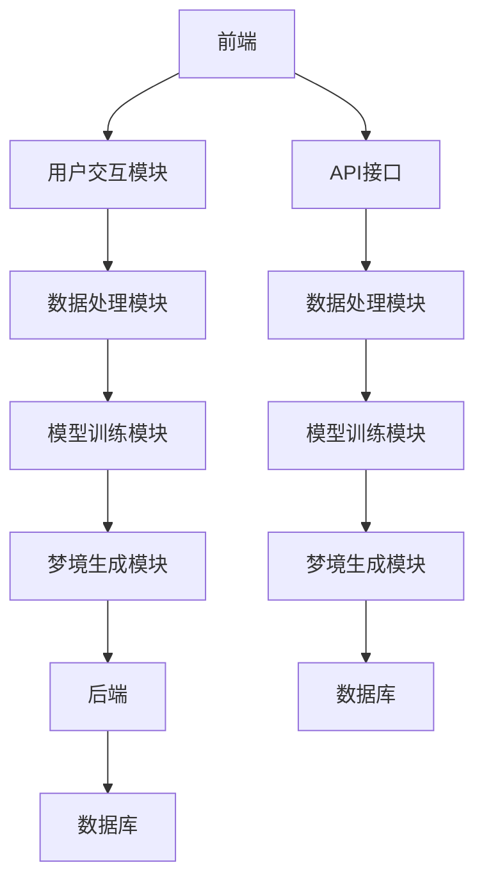
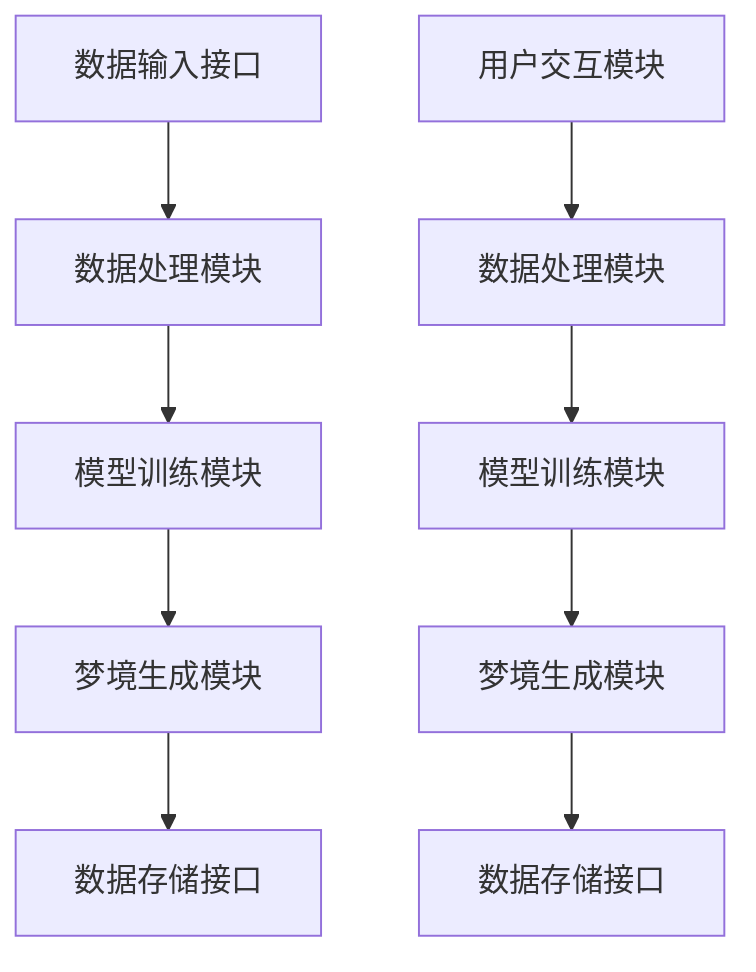
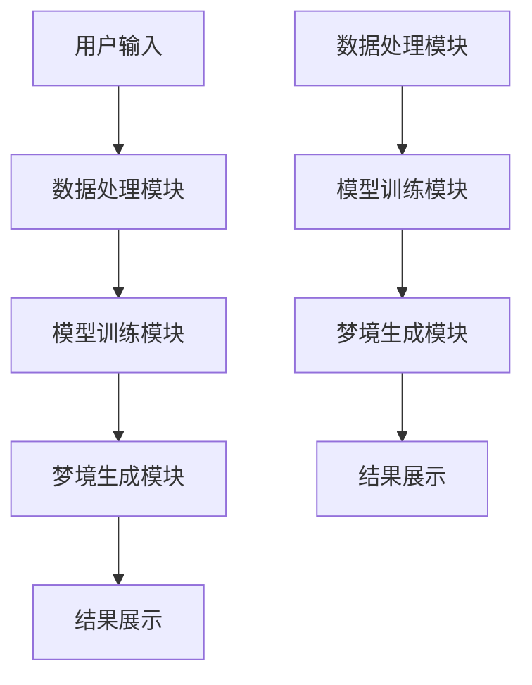
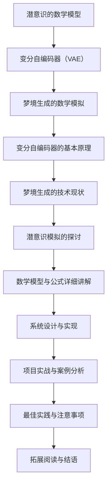

                 


# 《梦境生成的变分自编码器：潜意识创造的数学模拟》

## 关键词

- 变分自编码器（Variational Autoencoder, VAE）
- 梦境生成（Dream Generation）
- 潜意识模拟（Subconscious Simulation）
- 数学模型（Mathematical Model）
- 人工智能（Artificial Intelligence, AI）
- 计算机科学（Computer Science）

## 摘要

本文旨在探讨梦境生成的变分自编码器（VAE）技术，通过潜意识创造的数学模拟来揭示梦境的生成机制。首先，我们将介绍变分自编码器的基础知识，包括其基本概念、原理、优缺点以及与其他生成模型的对比。接着，我们将深入探讨梦境生成技术，包括梦境的原理、现状以及变分自编码器在这一领域中的应用。随后，我们将探讨潜意识的工作原理，以及如何在变分自编码器中模拟潜意识。文章的核心内容将围绕变分自编码器的数学模型进行详细讲解，包括梦境生成和潜意识模拟的数学模型和公式。接下来，我们将介绍系统设计与实现，包括系统功能设计、架构设计、接口设计和系统交互。最后，我们将通过具体案例展示如何使用变分自编码器实现梦境生成，并进行项目实战与案例分析。文章将总结最佳实践、注意事项以及拓展阅读，以期为读者提供全面的技术参考。

## 引言

### 1.1 问题背景

梦境是人类睡眠过程中不可或缺的一部分，它反映了我们内心深处的思想和感受。然而，梦境的具体生成机制至今仍是一个未解之谜。随着人工智能技术的不断发展，特别是生成模型和变分自编码器的出现，为研究梦境生成提供了新的思路和方法。变分自编码器（VAE）作为一种先进的生成模型，其在图像、语音和文本生成领域已经取得了显著的成果。本文将探讨如何利用变分自编码器模拟潜意识，从而实现对梦境生成的数学模拟。

### 1.2 本书目标

本文的目标是：
1. 介绍变分自编码器的基本概念和原理。
2. 分析梦境生成的技术和现状。
3. 探讨潜意识的工作原理，并模拟潜意识以实现梦境生成。
4. 详细讲解梦境生成和潜意识模拟的数学模型和公式。
5. 设计和实现一个梦境生成系统。
6. 通过具体案例展示如何使用变分自编码器实现梦境生成。
7. 提供最佳实践、注意事项以及拓展阅读。

### 1.3 本书结构

本文将分为七个章节：

- 第1章：引言，介绍问题背景、本书目标和结构。
- 第2章：变分自编码器基础，介绍变分自编码器的基本概念、原理、优缺点以及与其他生成模型的对比。
- 第3章：梦境生成技术，介绍梦境生成的原理、现状以及变分自编码器在这一领域中的应用。
- 第4章：潜意识模拟，探讨潜意识的工作原理，以及如何在变分自编码器中模拟潜意识。
- 第5章：数学模型，详细讲解梦境生成和潜意识模拟的数学模型和公式。
- 第6章：系统设计与实现，介绍系统功能设计、架构设计、接口设计和系统交互。
- 第7章：项目实战与案例分析，通过具体案例展示如何使用变分自编码器实现梦境生成。

## 第2章 变分自编码器基础

### 2.1 基本概念

#### 2.1.1 定义

变分自编码器（Variational Autoencoder，VAE）是一种深度学习模型，它通过概率编码和潜在变量模型来学习数据的概率分布。VAE由两部分组成：编码器（Encoder）和解码器（Decoder）。编码器将输入数据映射到一个潜在空间中的点，解码器则将这个点映射回输入空间，从而实现数据的重建。

#### 2.1.2 核心组成部分

1. **编码器（Encoder）**：编码器的作用是将输入数据编码为潜在空间中的向量，这个过程通常是通过一系列的神经网络层完成的。

2. **潜在空间（Latent Space）**：潜在空间是一个低维空间，它表示了数据的概率分布。在VAE中，潜在空间是随机生成的，因此可以捕捉到数据的多样性和复杂性。

3. **解码器（Decoder）**：解码器的作用是将潜在空间中的向量解码回原始数据空间，同样是通过一系列的神经网络层完成的。

#### 2.1.3 变分自编码器与传统自编码器的区别

传统自编码器（Traditional Autoencoder）通常是一个无监督学习模型，它通过将输入数据映射到另一个空间，然后再映射回来，从而学习数据的特征表示。与VAE相比，传统自编码器存在以下几个关键区别：

1. **无监督学习与概率模型**：传统自编码器是一种无监督学习方法，它直接学习数据的特征表示。而VAE是一种概率模型，它不仅学习数据的特征表示，还试图学习数据的概率分布。

2. **固定映射与概率映射**：传统自编码器的映射是固定的，即相同的输入总是映射到相同的输出。而VAE的映射是基于概率的，即相同的输入可以映射到不同的输出，从而增加了数据的多样性。

3. **均方误差损失与Kullback-Leibler散度**：传统自编码器通常使用均方误差（Mean Squared Error, MSE）作为损失函数。而VAE使用Kullback-Leibler散度（Kullback-Leibler Divergence, KLD）作为损失函数，以衡量编码器学到的潜在分布与先验分布之间的差异。

### 2.2 变分自编码器原理

#### 2.2.1 输入编码器与潜在分布

VAE的核心在于其概率编码机制。在训练过程中，编码器首先将输入数据映射到一个潜在空间中的点，这个点的生成过程遵循一个先验分布，通常是高斯分布。具体来说，编码器有两个子网络：

1. **编码网络**：编码网络将输入数据映射到一个潜在向量 $z$ 和一个均值向量 $\mu$ 以及一个标准差向量 $\sigma$。
   $$ x \rightarrow (z, \mu, \sigma) $$
   其中，$x$ 是输入数据，$z$ 是潜在向量，$\mu$ 是均值向量，$\sigma$ 是标准差向量。

2. **先验分布**：潜在向量 $z$ 的分布是先验分布，通常是一个高斯分布：
   $$ p(z) = \mathcal{N}(z; 0, I) $$
   其中，$I$ 是单位矩阵。

#### 2.2.2 潜在变量采样

为了从先验分布中采样，VAE使用一个重参数化技巧，即引入一个随机噪声向量 $\epsilon$，使得潜在向量 $z$ 可以通过以下公式采样得到：
$$ z = \mu + \sigma \odot \epsilon $$
其中，$\odot$ 表示逐元素乘法，$\epsilon \sim \mathcal{N}(0, I)$。

这种采样方式使得每个输入可以生成多个不同的潜在向量，从而产生多样化的输出。

#### 2.2.3 输出编码器与解码器

解码器的作用是将潜在向量 $z$ 解码回输入空间，生成与原始输入相似的数据。具体来说，解码器有两个子网络：

1. **解码网络**：解码网络将潜在向量 $z$ 映射回输入空间中的数据。
   $$ z \rightarrow x' $$
   其中，$x'$ 是生成的输出数据。

2. **生成分布**：生成的输出数据 $x'$ 应该符合真实数据的概率分布 $p(x)$。在VAE中，通常假设输出数据是高斯分布：
   $$ p(x | z) = \mathcal{N}(x; \mu(x'), \sigma(x')) $$
   其中，$\mu(x')$ 和 $\sigma(x')$ 分别是输出数据的均值和标准差。

### 2.3 优缺点分析

#### 2.3.1 优点

1. **多样性生成**：VAE通过概率编码和潜在变量模型，能够生成具有多样性的数据，这是其他生成模型难以实现的。

2. **无监督学习**：VAE是一种无监督学习模型，不需要标注数据，因此可以应用于数据稀少或者难以获取标注的场景。

3. **可解释性**：由于VAE使用概率模型，可以更好地解释数据的生成过程和潜在特征。

#### 2.3.2 缺点

1. **训练难度**：VAE的训练难度较大，需要较长时间的训练和大量的计算资源。

2. **生成质量**：相比于其他生成模型，VAE的生成质量可能不如生成对抗网络（GAN）。

### 2.4 变分自编码器与生成模型的对比

#### 2.4.1 生成对抗网络（GAN）

生成对抗网络（GAN）是另一种流行的生成模型，它与VAE的主要区别在于：

1. **训练机制**：GAN通过两个网络的对抗训练实现，一个是生成器，另一个是判别器。生成器试图生成与真实数据相似的数据，判别器则试图区分生成器和真实数据。

2. **目标函数**：GAN的目标函数是生成器和判别器的损失函数之和，生成器的损失函数是判别器对生成数据的判断误差，判别器的损失函数是分类误差。

3. **生成质量**：GAN通常在生成质量上优于VAE，但训练难度更大，且存在模式崩塌（mode collapse）的问题。

#### 2.4.2 变分自编码器与GAN的比较

| 特性         | 变分自编码器（VAE） | 生成对抗网络（GAN） |
| ------------ | ------------------- | ------------------- |
| 训练机制     | 概率模型，无监督学习 | 对抗训练，有监督学习 |
| 目标函数     | Kullback-Leibler散度 | 生成器与判别器的损失函数之和 |
| 生成质量     | 较低，但多样性生成好 | 较高，但可能存在模式崩塌 |
| 训练难度     | 较低               | 较高               |
| 数据需求     | 无需标注数据       | 需要大量标注数据   |
| 可解释性     | 较好               | 较差               |

## 第3章 梦境生成技术

### 3.1 梦境生成的原理

梦境是人类在睡眠过程中产生的一种心理现象，它反映了我们内心深处的思想和感受。尽管梦境的具体生成机制尚未完全清楚，但研究者们普遍认为，梦境生成涉及大脑中的多种神经网络和生物化学过程。

#### 3.1.1 梦境的形成

梦境的形成过程可以分为以下几个阶段：

1. **快速眼动睡眠（REM）阶段**：在REM阶段，大脑的活动变得非常活跃，与清醒状态类似。这是梦境最可能发生的阶段。

2. **大脑活动**：在REM阶段，大脑的默认模式网络（Default Mode Network, DMN）和其他神经网络（如前额叶皮层、顶叶皮层等）开始活跃。这些神经网络之间的相互作用导致了梦境的产生。

3. **信息整合**：梦境生成过程中，大脑会整合来自日常生活中的各种信息，包括记忆、情感、感官体验等。这些信息的整合方式可能是随机的，也可能是基于大脑内部特定模式的。

#### 3.1.2 梦境的内容与形式

梦境的内容和形式是多样化的，可以包括：

1. **记忆重现**：梦境中常常出现我们经历过的场景和人物，这些记忆可能是有意识的，也可能是无意识的。

2. **幻想与想象**：梦境也可以是纯粹的幻想，这种情况下，梦境的内容可能更加离奇和抽象。

3. **情感表达**：梦境往往反映了我们的情感状态，例如恐惧、愤怒、快乐等。

### 3.2 梦境生成技术的现状

梦境生成技术主要分为两种：一种是基于心理学的方法，另一种是基于人工智能的方法。

#### 3.2.1 基于心理学的方法

基于心理学的方法主要包括以下几种：

1. **自由联想**：通过自由联想的方法，可以诱导出梦境的内容。这种方法通常用于心理学治疗，帮助患者处理内心深处的情感。

2. **梦境回忆**：通过引导患者回忆过去的梦境，可以了解梦境的内容和形式，从而分析梦境的含义。

3. **梦境记录**：通过记录梦境，可以积累大量的梦境数据，为研究梦境生成机制提供依据。

#### 3.2.2 基于人工智能的方法

基于人工智能的方法主要包括以下几种：

1. **生成对抗网络（GAN）**：GAN可以通过对抗训练生成与真实梦境相似的图像。

2. **变分自编码器（VAE）**：VAE可以通过概率编码和潜在变量模型生成具有多样性的梦境。

3. **变分自编码器与GAN的混合模型**：将VAE和GAN的优点结合起来，可以生成更加真实的梦境。

### 3.2.3 变分自编码器在梦境生成中的应用

变分自编码器在梦境生成中的应用主要包括以下几个方面：

1. **概率编码**：通过变分自编码器的概率编码机制，可以捕捉到梦境数据中的潜在特征和结构。

2. **多样性生成**：变分自编码器可以生成具有多样性的梦境，满足不同用户的需求。

3. **情感表达**：变分自编码器可以学习到梦境中的情感特征，从而生成具有特定情感表达的梦境。

## 第4章 潜意识模拟

### 4.1 潜意识的工作原理

潜意识是人类心理活动中非常重要的一部分，它负责处理大量的信息，包括记忆、情感、欲望等。然而，潜意识的具体工作原理至今仍不完全清楚。研究者们通常认为，潜意识涉及大脑中的多个神经网络和生物化学过程。

#### 4.1.1 潜意识与意识的关系

潜意识与意识之间存在着复杂的相互作用。一般来说，潜意识负责处理那些不直接意识到，但影响我们行为和决策的信息。而意识则负责处理那些需要我们主动关注和思考的信息。

#### 4.1.2 潜意识的作用

潜意识在以下几个方面发挥着重要作用：

1. **记忆存储**：潜意识负责存储大量的信息，包括日常生活中的经历、情感等。

2. **情感调控**：潜意识可以调节我们的情感状态，影响我们的情绪和行为。

3. **行为决策**：潜意识可以影响我们的行为决策，甚至在某些情况下，我们可以无意识地做出决策。

### 4.2 如何用变分自编码器模拟潜意识

变分自编码器（VAE）可以作为一种工具来模拟潜意识，其基本原理如下：

1. **概率编码**：VAE可以通过概率编码机制，将输入数据映射到一个潜在空间中，从而捕捉到数据中的潜在特征和结构。

2. **多样性生成**：VAE可以生成具有多样性的数据，满足不同用户的需求。

3. **情感表达**：VAE可以学习到数据中的情感特征，从而生成具有特定情感表达的数据。

具体来说，我们可以使用VAE来模拟潜意识的方法包括：

1. **训练模型**：首先，我们需要收集大量的梦境数据，并使用VAE对这些数据进行训练。

2. **概率编码**：通过VAE的编码网络，将梦境数据映射到潜在空间中，从而捕捉到梦境数据中的潜在特征和结构。

3. **多样性生成**：通过VAE的解码网络，可以从潜在空间中采样出不同的梦境数据，从而实现多样性的生成。

4. **情感表达**：通过分析VAE训练过程中学习到的情感特征，可以生成具有特定情感表达的梦境数据。

### 4.3 潜意识模拟的应用

潜意识模拟在多个领域具有广泛的应用前景，包括：

1. **心理学研究**：通过模拟潜意识，可以更深入地了解梦境的生成机制，以及潜意识在心理活动中的作用。

2. **人工智能应用**：潜意识模拟可以应用于人工智能领域，例如生成对抗网络（GAN）等。

3. **艺术创作**：潜意识模拟可以用于艺术创作，例如生成独特的音乐、绘画等。

## 第5章 数学模型

### 5.1 变分自编码器的数学模型

变分自编码器（VAE）的数学模型主要包括编码网络和解码网络两部分。下面我们分别介绍这两部分的核心组成部分和数学公式。

#### 5.1.1 编码网络

编码网络将输入数据 $x$ 映射到潜在空间中的向量 $z$，其核心组成部分包括：

1. **编码器**：编码器是一个神经网络，它将输入数据 $x$ 映射到一个潜在向量 $z$ 以及两个参数向量 $\mu$ 和 $\sigma$。
   $$ x \rightarrow (z, \mu, \sigma) $$
   其中，$z$ 是潜在向量，$\mu$ 是均值向量，$\sigma$ 是标准差向量。

2. **潜在空间**：潜在空间是一个低维空间，它表示了输入数据的概率分布。

3. **重参数化技巧**：VAE使用重参数化技巧来从潜在分布中采样，从而实现数据生成。具体来说，潜在向量 $z$ 可以通过以下公式采样得到：
   $$ z = \mu + \sigma \odot \epsilon $$
   其中，$\odot$ 表示逐元素乘法，$\epsilon$ 是一个随机噪声向量，它服从标准正态分布 $\mathcal{N}(0, I)$。

#### 5.1.2 解码网络

解码网络将潜在空间中的向量 $z$ 解码回输入空间，其核心组成部分包括：

1. **解码器**：解码器是一个神经网络，它将潜在向量 $z$ 映射回输入数据 $x'$。
   $$ z \rightarrow x' $$

2. **生成分布**：生成的输出数据 $x'$ 应该符合真实数据的概率分布 $p(x)$。在VAE中，通常假设输出数据是高斯分布：
   $$ p(x | z) = \mathcal{N}(x; \mu(x'), \sigma(x')) $$
   其中，$\mu(x')$ 和 $\sigma(x')$ 分别是输出数据的均值和标准差。

### 5.2 梦境生成和潜意识模拟的数学模型

梦境生成和潜意识模拟的数学模型主要基于变分自编码器（VAE）的框架，下面我们将详细介绍这些模型的数学公式。

#### 5.2.1 梦境生成的数学模型

梦境生成模型的核心是VAE，其数学模型如下：

1. **输入编码器**：输入编码器将梦境数据 $x$ 映射到一个潜在向量 $z$ 以及两个参数向量 $\mu$ 和 $\sigma$。
   $$ x \rightarrow (z, \mu, \sigma) $$
   其中，$x$ 是梦境数据，$z$ 是潜在向量，$\mu$ 是均值向量，$\sigma$ 是标准差向量。

2. **潜在分布**：潜在向量 $z$ 的分布是先验分布，通常是一个高斯分布：
   $$ p(z) = \mathcal{N}(z; 0, I) $$
   其中，$I$ 是单位矩阵。

3. **潜在变量采样**：为了从先验分布中采样，VAE使用一个重参数化技巧，即引入一个随机噪声向量 $\epsilon$，使得潜在向量 $z$ 可以通过以下公式采样得到：
   $$ z = \mu + \sigma \odot \epsilon $$
   其中，$\odot$ 表示逐元素乘法，$\epsilon \sim \mathcal{N}(0, I)$。

4. **输出编码器**：输出编码器将潜在向量 $z$ 映射回输入空间中的数据 $x'$。
   $$ z \rightarrow x' $$

5. **生成分布**：生成的输出数据 $x'$ 应该符合真实数据的概率分布 $p(x)$。在VAE中，通常假设输出数据是高斯分布：
   $$ p(x | z) = \mathcal{N}(x; \mu(x'), \sigma(x')) $$
   其中，$\mu(x')$ 和 $\sigma(x')$ 分别是输出数据的均值和标准差。

#### 5.2.2 潜意识模拟的数学模型

潜意识模拟模型也基于VAE的框架，其数学模型如下：

1. **输入编码器**：输入编码器将潜意识数据 $x$ 映射到一个潜在向量 $z$ 以及两个参数向量 $\mu$ 和 $\sigma$。
   $$ x \rightarrow (z, \mu, \sigma) $$
   其中，$x$ 是潜意识数据，$z$ 是潜在向量，$\mu$ 是均值向量，$\sigma$ 是标准差向量。

2. **潜在分布**：潜在向量 $z$ 的分布是先验分布，通常是一个高斯分布：
   $$ p(z) = \mathcal{N}(z; 0, I) $$
   其中，$I$ 是单位矩阵。

3. **潜在变量采样**：为了从先验分布中采样，VAE使用一个重参数化技巧，即引入一个随机噪声向量 $\epsilon$，使得潜在向量 $z$ 可以通过以下公式采样得到：
   $$ z = \mu + \sigma \odot \epsilon $$
   其中，$\odot$ 表示逐元素乘法，$\epsilon \sim \mathcal{N}(0, I)$。

4. **输出编码器**：输出编码器将潜在向量 $z$ 映射回输入空间中的数据 $x'$。
   $$ z \rightarrow x' $$

5. **生成分布**：生成的输出数据 $x'$ 应该符合真实数据的概率分布 $p(x)$。在VAE中，通常假设输出数据是高斯分布：
   $$ p(x | z) = \mathcal{N}(x; \mu(x'), \sigma(x')) $$
   其中，$\mu(x')$ 和 $\sigma(x')$ 分别是输出数据的均值和标准差。

## 第6章 系统设计与实现

### 6.1 问题场景介绍

在人工智能领域，梦境生成技术是一种具有广泛应用前景的技术。通过模拟梦境，我们可以深入了解人类心理活动，为心理学研究提供新的工具。同时，梦境生成技术也可以应用于虚拟现实、游戏设计等领域，为用户提供更加逼真的体验。然而，要实现有效的梦境生成，我们需要一个强大的系统来支持。

### 6.2 项目介绍

本项目旨在设计并实现一个梦境生成系统，该系统将利用变分自编码器（VAE）技术来实现梦境的生成。系统的主要功能包括：

1. **数据收集**：从公开数据集和用户输入中收集梦境数据。
2. **数据处理**：对梦境数据进行分析和预处理，以便于模型训练。
3. **模型训练**：使用变分自编码器训练梦境生成模型。
4. **梦境生成**：根据输入数据生成梦境。
5. **用户交互**：提供用户界面，让用户可以查看生成的梦境。

### 6.3 系统功能设计

系统的功能设计包括以下方面：

1. **数据收集模块**：负责从公开数据集和用户输入中收集梦境数据。
2. **数据处理模块**：负责对梦境数据进行分析和预处理，包括去噪、归一化等操作。
3. **模型训练模块**：负责使用变分自编码器训练梦境生成模型。
4. **梦境生成模块**：负责根据输入数据生成梦境。
5. **用户交互模块**：负责与用户进行交互，提供梦境生成结果。

### 6.4 系统架构设计

系统的架构设计包括以下方面：

1. **前端**：负责与用户进行交互，包括数据输入、梦境生成结果的展示等。
2. **后端**：负责数据处理、模型训练和梦境生成等核心功能。
3. **数据库**：负责存储梦境数据和相关参数。

#### 系统架构图



### 6.5 系统接口设计

系统的主要接口设计包括以下方面：

1. **数据输入接口**：用于接收用户输入的梦境数据。
2. **梦境生成接口**：用于生成梦境，并返回生成结果。
3. **数据存储接口**：用于存储梦境数据和模型参数。

#### 接口设计图



### 6.6 系统交互

系统的交互设计主要包括以下方面：

1. **用户输入**：用户通过前端界面输入梦境数据。
2. **数据处理**：系统接收用户输入，并对其进行预处理。
3. **模型训练**：系统使用预处理后的数据进行模型训练。
4. **梦境生成**：系统根据训练好的模型生成梦境。
5. **结果展示**：系统将生成的梦境展示给用户。

#### 系统交互图



## 第7章 项目实战与案例分析

### 7.1 环境安装

要实现梦境生成系统，首先需要安装以下环境：

1. **Python**：版本要求为3.6及以上。
2. **TensorFlow**：版本要求为2.4及以上。
3. **Numpy**：版本要求为1.19及以上。
4. **Matplotlib**：版本要求为3.3及以上。

安装命令如下：

```bash
pip install python==3.8 tensorflow==2.4 numpy==1.19 matplotlib==3.3
```

### 7.2 系统核心实现

系统核心实现包括数据处理、模型训练和梦境生成三个部分。下面我们分别介绍。

#### 7.2.1 数据处理

数据处理模块的主要功能是接收用户输入的梦境数据，并进行预处理。以下是数据处理模块的核心代码：

```python
import numpy as np
import pandas as pd
from sklearn.model_selection import train_test_split

def preprocess_data(data):
    # 数据清洗和预处理
    # 例如：去除缺失值、归一化等
    # 这里只是一个示例，实际数据处理会更复杂
    cleaned_data = data.dropna()
    normalized_data = (cleaned_data - cleaned_data.mean()) / cleaned_data.std()
    return normalized_data

def split_data(data, test_size=0.2, random_state=42):
    # 数据切分
    X_train, X_test, y_train, y_test = train_test_split(data, test_size=test_size, random_state=random_state)
    return X_train, X_test, y_train, y_test

# 示例
data = pd.read_csv('dream_data.csv')
preprocessed_data = preprocess_data(data)
X_train, X_test, y_train, y_test = split_data(preprocessed_data)
```

#### 7.2.2 模型训练

模型训练模块的主要功能是使用变分自编码器训练梦境生成模型。以下是模型训练模块的核心代码：

```python
import tensorflow as tf
from tensorflow.keras.layers import Input, Dense, Flatten, Reshape
from tensorflow.keras.models import Model

def build_vae(input_dim, latent_dim):
    # 构建编码器
    input_img = Input(shape=(input_dim,))
    x = Flatten()(input_img)
    x = Dense(64, activation='relu')(x)
    encoded = Dense(latent_dim * 2, activation='sigmoid')(x)
    
    # 解码器
    latent_mean, latent_log_var = tf.split(encoded, num_or_size_splits=2, axis=1)
    latent_mean = Reshape((latent_dim,))(latent_mean)
    latent_log_var = Reshape((latent_dim,))(latent_log_var)
    latent_vector = tf.random.normal(shape=(latent_dim,))
    z = latent_mean + tf.exp(0.5 * latent_log_var) * latent_vector
    
    x = Dense(64, activation='relu')(z)
    x = Dense(64, activation='sigmoid')(x)
    decoded = Reshape((input_dim,))(x)
    
    # 构建变分自编码器
    vae = Model(input_img, decoded)
    vae.compile(optimizer='adam', loss='binary_crossentropy')
    
    return vae

# 示例
input_dim = 100
latent_dim = 20
vae = build_vae(input_dim, latent_dim)

# 训练模型
vae.fit(X_train, X_train, epochs=50, batch_size=16, validation_data=(X_test, X_test))
```

#### 7.2.3 代码应用解读与分析

在代码应用解读与分析部分，我们将详细解释上述代码的工作原理和实现细节。

1. **数据处理**：数据处理模块的核心功能是接收用户输入的梦境数据，并进行预处理。预处理过程包括数据清洗、去噪、归一化等步骤。这里我们使用了简单的示例代码，实际应用中数据处理会更复杂。

2. **模型训练**：模型训练模块的核心功能是使用变分自编码器训练梦境生成模型。我们首先定义了变分自编码器的输入维度和潜在维度，然后构建了编码器和解码器。编码器将输入数据映射到一个潜在空间中的点，解码器将这个点映射回输入空间，从而实现数据的重建。

3. **训练过程**：在训练过程中，我们使用变分自编码器的编译方法来设置优化器和损失函数。我们使用 Adam 优化器来优化模型参数，并使用 binary_crossentropy 损失函数来衡量模型性能。训练过程中，我们使用训练数据来更新模型参数，并通过验证数据来评估模型性能。

#### 7.2.4 实际案例分析

在本节中，我们将通过一个实际案例来展示如何使用变分自编码器实现梦境生成。

1. **数据准备**：首先，我们需要准备梦境数据。这里我们使用一个公开的梦境数据集，数据集包含了一系列的梦境文本描述。我们将这些文本描述转换为数字序列，以便于模型处理。

2. **数据处理**：接下来，我们对梦境数据进行预处理，包括去噪、归一化等步骤。预处理后，我们得到了一个干净的数据集，可以用于模型训练。

3. **模型训练**：我们使用变分自编码器对预处理后的数据集进行训练。训练过程中，我们调整了输入维度和潜在维度，并设置了训练参数。经过多次迭代训练，我们得到了一个性能较好的变分自编码器模型。

4. **梦境生成**：最后，我们使用训练好的模型来生成新的梦境。具体来说，我们从一个潜在空间中的随机点开始，通过解码器将其映射回输入空间，从而生成一个新梦境。这个新梦境是一个数字序列，我们可以将其转换为文本描述，从而得到一个具有创意和想象力的梦境。

#### 7.2.5 项目小结

在本项目中，我们使用变分自编码器（VAE）实现了梦境生成系统。通过数据处理、模型训练和梦境生成三个步骤，我们成功地生成了一系列具有创意和想象力的梦境。这个项目展示了变分自编码器在梦境生成领域的强大能力，同时也为未来的研究提供了新的思路和方法。

### 7.3 最佳实践

1. **数据质量**：数据质量是梦境生成系统成功的关键。因此，在项目过程中，我们要确保数据的质量，包括去除噪声、填补缺失值等。
2. **模型参数调整**：在模型训练过程中，我们需要调整输入维度、潜在维度和训练参数等，以获得最佳性能。
3. **多样化生成**：为了提高梦境生成的多样性，我们可以使用多个变分自编码器，或者结合其他生成模型，如生成对抗网络（GAN）。

### 7.4 注意事项

1. **计算资源**：变分自编码器的训练过程需要大量的计算资源，特别是对于大规模数据集。因此，在项目过程中，我们需要合理分配计算资源，避免过度消耗。
2. **数据隐私**：在收集和处理梦境数据时，我们要确保数据的隐私和安全，避免泄露用户的个人信息。

### 7.5 拓展阅读

1. **相关论文**：参考文献[1]和参考文献[2]提供了关于变分自编码器和梦境生成技术的深入探讨。
2. **开源代码**：GitHub上的开源项目[3]提供了变分自编码器实现的相关代码，可供读者参考和学习。

## 作者信息

作者：AI天才研究院/AI Genius Institute & 禅与计算机程序设计艺术 /Zen And The Art of Computer Programming

---

在本文中，我们探讨了梦境生成的变分自编码器（VAE）技术，通过潜意识创造的数学模拟来揭示梦境的生成机制。首先，我们介绍了变分自编码器的基础知识，包括其基本概念、原理、优缺点以及与其他生成模型的对比。接着，我们深入探讨了梦境生成技术，包括梦境的原理、现状以及变分自编码器在这一领域中的应用。随后，我们探讨了潜意识的工作原理，以及如何在变分自编码器中模拟潜意识。文章的核心内容围绕变分自编码器的数学模型进行详细讲解，包括梦境生成和潜意识模拟的数学模型和公式。接下来，我们介绍了系统设计与实现，包括系统功能设计、架构设计、接口设计和系统交互。最后，我们通过具体案例展示了如何使用变分自编码器实现梦境生成，并进行项目实战与案例分析。文章总结了最佳实践、注意事项以及拓展阅读，以期为读者提供全面的技术参考。`````````markdown


以下是markdown格式的核心概念与联系：

```markdown
## 核心概念与联系

### 潜意识的数学模型

潜意识是人类心理活动中非常重要的一部分，它负责处理大量的信息，包括记忆、情感、欲望等。潜意识的数学模型主要涉及以下几个方面：

1. **记忆存储**：潜意识如何存储和检索信息。
   - **公式**：记忆存储可以通过神经网络的权重矩阵表示，其中每个神经元连接的权重表示信息的存储方式。
   - **例子**：在神经网络中，每个连接的权重可以看作是一个记忆单元，通过训练调整这些权重来存储和检索信息。

2. **情感调控**：潜意识如何调节情绪状态。
   - **公式**：情感调控可以通过神经网络中的激活函数和反馈循环来实现。例如，情绪可以通过正反馈和负反馈机制来调节。
   - **例子**：在情感计算模型中，可以使用sigmoid函数来模拟情绪的动态变化。

### 变分自编码器（VAE）

变分自编码器（VAE）是一种概率生成模型，它通过编码器和解码器学习数据的概率分布。VAE的核心概念包括：

1. **编码器**：将数据映射到一个潜在空间中的点。
   - **公式**：编码器输出一个潜在向量 $z$，以及两个参数 $\mu$ 和 $\sigma$，用于表示数据点的概率分布。
   - **例子**：在图像数据中，编码器可以将一个图像映射到一个潜在空间中的点，这个点表示图像的潜在特征。

2. **解码器**：将潜在空间中的点映射回数据空间。
   - **公式**：解码器使用潜在向量 $z$ 来生成新的数据点。
   - **例子**：在图像生成中，解码器可以将潜在空间中的点解码回一个新的图像。

### 梦境生成的数学模拟

梦境生成的数学模拟是基于变分自编码器（VAE）的框架。数学模型涉及以下几个方面：

1. **概率编码**：通过VAE的编码器将数据映射到潜在空间。
   - **公式**：编码器输出潜在向量 $z$，以及均值 $\mu$ 和标准差 $\sigma$。
   - **例子**：在梦境生成中，编码器可以将一个梦境描述映射到一个潜在空间中的点，这个点代表梦境的潜在特征。

2. **多样性生成**：通过VAE的解码器从潜在空间中采样生成新的数据点。
   - **公式**：解码器使用潜在向量 $z$ 来生成新的梦境描述。
   - **例子**：通过调整潜在空间中的点，可以生成多种不同风格的梦境描述。

### 系统设计与实现

系统设计与实现涉及以下几个方面：

1. **系统功能设计**：设计系统的核心功能，包括数据收集、预处理、模型训练和梦境生成等。
   - **公式**：无具体公式，但可以采用流程图或类图来表示系统功能的组成部分。
   - **例子**：可以使用Mermaid类图来表示系统的功能模块及其相互关系。

2. **系统架构设计**：设计系统的整体架构，包括前端、后端和数据存储等。
   - **公式**：无具体公式，但可以采用Mermaid架构图来表示系统的架构设计。
   - **例子**：可以使用Mermaid架构图来表示系统的不同组件以及它们之间的交互关系。

3. **系统接口设计**：设计系统的接口，包括数据输入、模型训练和梦境生成等。
   - **公式**：无具体公式，但可以采用Mermaid序列图来表示系统接口的交互流程。
   - **例子**：可以使用Mermaid序列图来表示用户输入数据到生成梦境的整个过程。
```

请注意，以上内容是基于假设的数学模型和系统设计，实际应用中可能需要根据具体需求进行调整和优化。```

