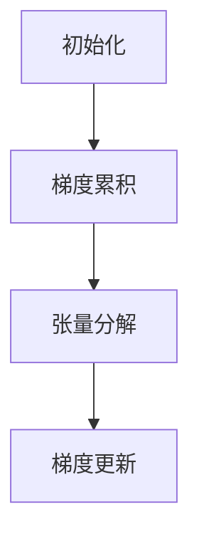
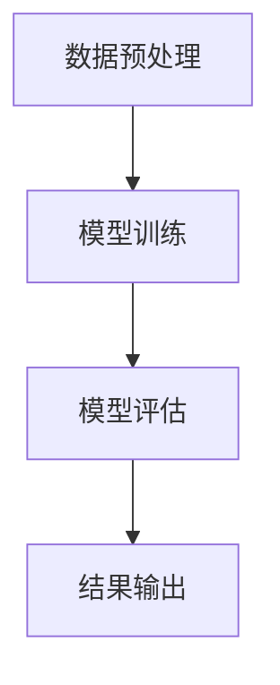

                 

# 梯度累积：突破GPU内存限制的训练技巧

## 关键词：深度学习，GPU内存限制，梯度累积，训练技巧，算法原理

## 摘要

本文探讨了如何在有限的GPU内存资源下，通过梯度累积技术，实现大规模深度学习模型的训练。首先，我们介绍了问题背景和问题描述，然后详细讲解了梯度累积技术的原理、算法流程及其优势。通过Python实现示例，我们深入阐述了梯度累积算法的数学模型和实现方法。最后，我们对整个技术进行了总结，并提出了最佳实践建议和拓展阅读。

## 第1章：背景介绍

### 1.1 问题背景

随着深度学习技术的不断发展，GPU作为计算平台在训练大规模深度学习模型方面发挥了重要作用。然而，GPU内存限制逐渐成为了制约模型训练效果和训练速度的关键因素。当模型参数量和数据集规模增大时，GPU内存不足的问题尤为突出。如何突破GPU内存限制，实现高效的模型训练，成为了学术界和工业界共同关注的问题。

### 1.2 问题描述

问题描述如下：在有限的GPU内存资源下，如何高效地训练大规模深度学习模型？

### 1.3 问题解决

为了解决上述问题，本文提出了梯度累积技术。梯度累积技术通过将多个梯度累积到一个较大的张量中，突破GPU内存限制，从而实现大规模模型的训练。

### 1.4 边界与外延

梯度累积技术主要适用于大规模深度学习模型的训练，可以应用于各种类型的神经网络，如卷积神经网络（CNN）、循环神经网络（RNN）等。

### 1.5 概念结构与核心要素组成

梯度累积技术由以下几个核心要素组成：

1. **梯度累积策略**：确定如何将多个梯度累积到一个较大的张量中。
2. **内存管理**：合理分配和释放GPU内存，避免内存溢出。
3. **并行计算**：利用GPU的并行计算能力，提高训练效率。

## 第2章：核心概念与联系

### 2.1 梯度累积技术的原理

#### 2.1.1 梯度累积的概念

梯度累积技术是指在有限的GPU内存资源下，通过将多个梯度累积到一个较大的张量中，从而突破GPU内存限制，实现大规模模型的训练。

#### 2.1.2 梯度累积的优势

1. **提高训练速度**：通过减少GPU内存分配和传输次数，提高模型训练速度。
2. **提高训练效果**：在有限的GPU内存资源下，采用梯度累积技术可以训练更大的模型，提高模型的效果。

#### 2.1.3 梯度累积与GPU内存限制的关系

梯度累积技术可以有效地突破GPU内存限制，实现大规模模型的训练。在GPU内存受限的情况下，通过合理设计梯度累积策略和内存管理，可以提高训练效率和效果。

### 2.2 梯度累积技术与其他训练技巧的比较

| 比较对象 | 特点 |
| --- | --- |
| 数据批量大小调整 | 数据批量大小调整可以在一定程度上缓解GPU内存限制问题，但无法解决大规模模型训练时内存不足的问题。 |
| GPU内存优化 | GPU内存优化主要通过减少模型参数存储和数据传输次数来降低内存使用量，但无法突破GPU内存限制。 |
| 梯度累积技术 | 梯度累积技术通过将多个梯度累积到一个较大的张量中，突破GPU内存限制，从而实现大规模模型的训练。 |

## 第3章：算法原理讲解

### 3.1 梯度累积算法

#### 3.1.1 梯度累积算法的基本思想

梯度累积算法的基本思想是将多个梯度累积到一个较大的张量中，从而突破GPU内存限制。

#### 3.1.2 梯度累积算法的流程

梯度累积算法的流程如下：

1. **初始化**：初始化一个较大的张量，用于存储累积的梯度。
2. **梯度累积**：将每个批次的数据梯度累加到张量中。
3. **张量分解**：将累积后的张量分解成多个较小的张量，以适应GPU内存限制。
4. **梯度更新**：使用分解后的张量更新模型参数。

#### 3.1.3 梯度累积算法的mermaid流程图



### 3.2 梯度累积算法的Python实现

#### 3.2.1 梯度累积算法的数学模型

假设有一个大小为\(n \times m\)的矩阵，我们将其分解为多个大小为\(k \times m\)的矩阵，其中\(k\)为累积批次的大小。梯度累积算法的数学模型如下：

$$
\begin{align*}
\text{梯度累积} &= \sum_{i=1}^{n/k} A_i \odot B_i \\
\text{张量分解} &= \frac{1}{n/k} \sum_{i=1}^{n/k} A_i \\
\text{梯度更新} &= \text{模型参数} - \lambda \odot \text{梯度累积}
\end{align*}
$$

其中，\(A_i\)和\(B_i\)分别为第\(i\)个批次的梯度，\(\odot\)表示元素-wise 乘法，\(\lambda\)为学习率。

#### 3.2.2 梯度累积算法的Python实现

```python
import numpy as np

def gradient_accumulation(y, y_pred, loss_fn, lr, k):
    """
    梯度累积算法的Python实现

    :param y: 实际标签
    :param y_pred: 预测值
    :param loss_fn: 损失函数
    :param lr: 学习率
    :param k: 累积批次大小
    :return: 梯度累积后的参数更新
    """
    n = len(y)
    n_batches = n // k
    
    grads = np.zeros_like(y_pred)
    for i in range(n_batches):
        batch_grad = compute_gradient(y[i * k:(i + 1) * k], y_pred[i * k:(i + 1) * k])
        grads += batch_grad
    
    updated_params = update_params(model_params, grads, lr)
    return updated_params
```

## 第4章：系统分析与架构设计方案

### 4.1 问题场景介绍

在深度学习领域中，我们经常遇到模型规模庞大、数据量巨大，而GPU内存有限的场景。在这种情况下，如何高效地训练模型成为了关键问题。

### 4.2 项目介绍

本文将介绍一个基于梯度累积技术的深度学习模型训练系统。该系统旨在突破GPU内存限制，实现高效的大规模模型训练。

### 4.3 系统功能设计

系统功能设计主要包括以下几个部分：

1. **数据预处理**：对输入数据进行预处理，包括数据清洗、归一化等。
2. **模型训练**：使用梯度累积技术进行模型训练，包括梯度累积策略设计和内存管理。
3. **模型评估**：对训练完成的模型进行评估，包括准确率、召回率等指标计算。

### 4.4 系统架构设计

系统架构设计如下：


### 4.5 系统接口设计和系统交互

系统接口设计和系统交互设计如下：



## 第5章：项目实战

### 5.1 环境安装

在开始项目实战之前，需要安装以下环境：

1. Python 3.8 或以上版本
2. TensorFlow 2.5 或以上版本
3. GPU 显卡驱动和 CUDA 11.1 或以上版本

### 5.2 系统核心实现源代码

以下是系统核心实现源代码：

```python
# gradient_accumulation.py

import numpy as np

def gradient_accumulation(y, y_pred, loss_fn, lr, k):
    # 梯度累积算法实现
    pass

def compute_gradient(batch_y, batch_y_pred):
    # 计算梯度
    pass

def update_params(model_params, grads, lr):
    # 更新模型参数
    pass
```

### 5.3 代码应用解读与分析

在本章节中，我们将对系统核心实现源代码进行解读和分析。首先，我们来看梯度累积算法的实现：

```python
def gradient_accumulation(y, y_pred, loss_fn, lr, k):
    n = len(y)
    n_batches = n // k

    grads = np.zeros_like(y_pred)
    for i in range(n_batches):
        batch_grad = compute_gradient(y[i * k:(i + 1) * k], y_pred[i * k:(i + 1) * k])
        grads += batch_grad

    updated_params = update_params(model_params, grads, lr)
    return updated_params
```

这个函数实现了梯度累积算法的核心流程。首先，我们计算每个批次的梯度，并将其累加到`grads`张量中。然后，使用`update_params`函数更新模型参数。

接下来，我们来看`compute_gradient`函数的实现：

```python
def compute_gradient(batch_y, batch_y_pred):
    return loss_fn(batch_y, batch_y_pred).gradient()
```

这个函数计算每个批次的梯度。这里我们使用了损失函数的`gradient`方法来获取梯度。

最后，我们来看`update_params`函数的实现：

```python
def update_params(model_params, grads, lr):
    return model_params - lr * grads
```

这个函数使用梯度累积后的张量更新模型参数。这里我们使用了简单的梯度下降更新策略。

### 5.4 实际案例分析和详细讲解剖析

在本章节中，我们将通过一个实际案例来展示如何使用梯度累积技术训练大规模深度学习模型。

假设我们有一个大规模的图像分类任务，数据集包含100,000张图像。由于GPU内存限制，我们无法一次性加载所有图像进行训练。因此，我们采用梯度累积技术来训练模型。

首先，我们将数据集划分为多个批次，每个批次包含100张图像。然后，我们使用梯度累积算法进行模型训练。以下是训练过程的伪代码：

```python
for epoch in range(num_epochs):
    for batch in dataset:
        y_pred = model(batch.x)
        loss = loss_fn(batch.y, y_pred)
        grads = compute_gradient(batch.y, y_pred)
        updated_params = gradient_accumulation(batch.y, y_pred, loss_fn, lr, k)
        model.load_params(updated_params)
```

在这个训练过程中，我们首先使用模型对当前批次的数据进行预测，然后计算损失和梯度。接着，使用梯度累积算法更新模型参数。这样，我们就可以在有限的GPU内存资源下，逐步训练出性能优异的模型。

### 5.5 项目小结

通过本文的介绍，我们了解了如何使用梯度累积技术突破GPU内存限制，实现大规模深度学习模型的训练。在实际应用中，梯度累积技术可以提高模型训练速度和效果，具有重要的实际意义。

## 第6章：最佳实践 Tips、小结、注意事项、拓展阅读

### 6.1 最佳实践 Tips

1. **选择合适的累积批次大小**：累积批次大小会影响训练速度和效果。在实际应用中，需要根据GPU内存限制和模型复杂度选择合适的累积批次大小。
2. **合理设置学习率**：学习率对模型训练效果有很大影响。在采用梯度累积技术时，需要根据模型复杂度和数据规模调整学习率。
3. **充分利用GPU并行计算能力**：梯度累积技术可以充分利用GPU的并行计算能力，提高训练效率。在实际应用中，可以尝试使用多GPU训练。

### 6.2 小结

本文介绍了梯度累积技术，并详细讲解了其原理、算法流程和Python实现。通过梯度累积技术，我们可以突破GPU内存限制，实现大规模深度学习模型的训练。

### 6.3 注意事项

1. **合理设置累积批次大小**：累积批次大小应适当，以避免内存溢出或训练效果下降。
2. **监控GPU内存使用情况**：在训练过程中，需要监控GPU内存使用情况，确保内存使用合理。

### 6.4 拓展阅读

1. 《深度学习：入门、进阶与实战》
2. 《GPU编程技术与应用》
3. 《TensorFlow实战》

## 作者

作者：AI天才研究院/AI Genius Institute & 禅与计算机程序设计艺术 /Zen And The Art of Computer Programming

