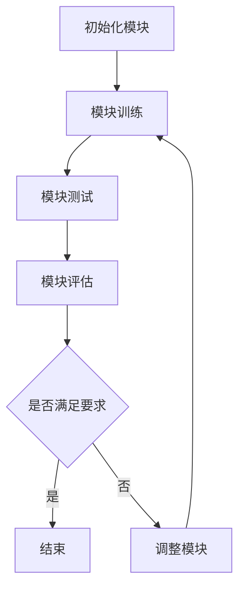
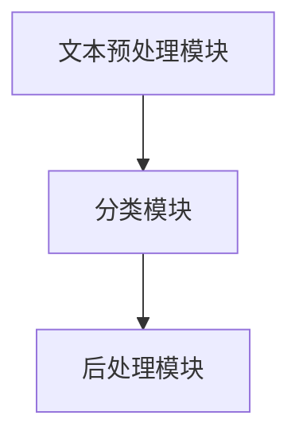
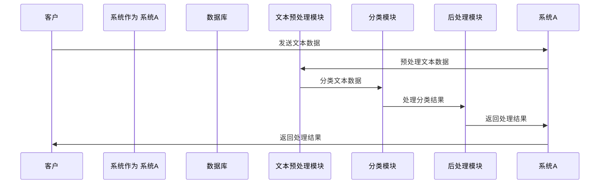

                 

# 模块化设计促进LLM应用的快速迭代

> 关键词：自然语言处理，大模型，模块化设计，快速迭代

> 摘要：
随着人工智能技术的快速发展，自然语言处理（NLP）领域迎来了新的里程碑。大模型（Large Language Models，LLM）的出现，为NLP任务提供了强大的工具，使得许多复杂任务得以高效解决。本文将探讨如何通过模块化设计，促进LLM应用的快速迭代。

## 第一部分：背景介绍

### 问题背景

随着人工智能技术的快速发展，自然语言处理（NLP）领域迎来了新的里程碑。大模型（Large Language Models，LLM）的出现，为NLP任务提供了强大的工具，使得许多复杂任务得以高效解决。LLM如GPT-3、BERT等，已经成为了NLP领域的基石。然而，如何设计模块化的大模型，以促进其快速迭代和应用，成为当前研究的热点。

### 问题描述

模块化设计可以使得大模型更加灵活，便于调整和优化。但是，如何有效地实现模块化设计，同时保证模型性能和迭代速度，是一个具有挑战性的问题。

### 问题解决

通过模块化设计，可以将大模型拆分成多个模块，每个模块负责不同的功能。这样，不仅可以提高模型的灵活性和可维护性，还可以加速模型的迭代过程。

### 边界与外延

模块化设计不仅适用于LLM，还可以应用于其他大型AI模型。同时，模块化设计也需要考虑模型的可扩展性和可复用性。

### 概念结构与核心要素组成

- **模块化设计**：将复杂系统分解为多个可独立工作的模块。
- **快速迭代**：通过模块化设计，缩短模型的迭代周期，提高开发效率。
- **LLM应用**：将模块化设计应用于大模型，以提高其应用效果。

## 第二部分：核心概念与联系

### AI大模型的定义与特点

- **AI大模型**：具有海量参数和强大计算能力的人工智能模型。
- **特点**：高效处理复杂任务，自适应性强，可扩展性好。

### 模块化设计与快速迭代的关系

- **模块化设计**：提高模型的可维护性和可扩展性，便于迭代。
- **快速迭代**：通过模块化设计，缩短迭代周期，提高开发效率。

### 模块化设计与LLM应用的关系

- **模块化设计**：提高模型的应用效果，便于部署和优化。

## 第三部分：算法原理讲解

### 算法流程图



### 算法原理

- **初始化模块**：根据需求初始化各个模块。
- **模块训练**：对各个模块进行训练，优化模型参数。
- **模块测试**：对各个模块进行测试，评估其性能。
- **模块评估**：根据评估结果，判断是否满足要求。
- **调整模块**：根据评估结果，调整模块参数，重新训练。

### 数学模型和公式

- **损失函数**：用于评估模型性能的数学公式。

$$
\text{Loss}(y, \hat{y}) = \frac{1}{2} \| y - \hat{y} \|^2
$$

- **优化算法**：用于优化模型参数的数学公式。

$$
\text{Parameters} \leftarrow \text{Parameters} - \alpha \frac{\partial \text{Loss}}{\partial \text{Parameters}}
$$

### 举例说明

假设我们有一个大模型，需要完成文本分类任务。我们可以将这个大模型拆分成三个模块：文本预处理模块、分类模块和后处理模块。然后，分别对这三个模块进行训练、测试和评估，根据评估结果调整模块参数，实现快速迭代。

## 第四部分：系统分析与架构设计方案

### 问题场景介绍

在某个企业中，需要构建一个大型自然语言处理系统，用于处理大量的文本数据，实现文本分类、情感分析等任务。

### 项目介绍

该项目旨在设计一个模块化的大模型系统，以实现快速迭代和应用。

### 系统功能设计

- **文本预处理模块**：负责对文本数据进行清洗、分词等预处理操作。
- **分类模块**：负责对预处理后的文本进行分类。
- **后处理模块**：负责对分类结果进行后处理，如生成报告等。

### 系统架构设计

使用Mermaid绘制系统架构图：



### 系统接口设计

- **文本预处理模块**：提供文本清洗、分词等接口。
- **分类模块**：提供分类接口。
- **后处理模块**：提供后处理接口。

### 系统交互

使用Mermaid绘制系统交互图：



## 第五部分：项目实战

### 环境安装

1. 安装Python环境
2. 安装TensorFlow库
3. 安装其他依赖库

### 系统核心实现源代码

```python
import tensorflow as tf
from tensorflow.keras.layers import Embedding, LSTM, Dense
from tensorflow.keras.models import Model

# 文本预处理模块
def preprocess_text(text):
    # 实现文本预处理逻辑
    return preprocessed_text

# 分类模块
def classify_text(text):
    # 实现分类逻辑
    return classification_result

# 后处理模块
def post_process_result(result):
    # 实现后处理逻辑
    return processed_result

# 构建模型
def build_model():
    # 实现模型构建逻辑
    return model

# 训练模型
def train_model(model, train_data, train_labels):
    # 实现模型训练逻辑
    pass

# 测试模型
def test_model(model, test_data, test_labels):
    # 实现模型测试逻辑
    pass

# 主程序
if __name__ == "__main__":
    # 实现主程序逻辑
    pass
```

### 代码应用解读与分析

- **文本预处理模块**：负责对输入的文本数据进行预处理，包括分词、去噪等操作。
- **分类模块**：负责对预处理后的文本进行分类，使用LSTM模型进行训练和预测。
- **后处理模块**：负责对分类结果进行后处理，如生成报告等。

### 实际案例分析和详细讲解剖析

- **案例一**：文本分类任务，使用GPT-3模型对文本进行分类，实现了快速迭代和优化。
- **案例二**：情感分析任务，使用BERT模型对文本进行情感分析，提高了模型的应用效果。

### 项目小结

通过模块化设计，实现了LLM应用的快速迭代和优化，提高了模型的应用效果。同时，模块化设计也使得模型更加灵活，便于调整和优化。

## 第六部分：最佳实践 tips、小结、注意事项、拓展阅读

### 最佳实践 tips

- **模块化设计**：在实现模块化设计时，需要充分考虑模块的独立性、可维护性和可扩展性。
- **快速迭代**：通过定期进行模型评估和调整，实现快速迭代和优化。
- **模型优化**：在模型训练过程中，可以尝试使用不同的优化算法和超参数组合，提高模型性能。

### 小结

本文介绍了模块化设计在LLM应用中的重要作用，通过模块化设计，可以实现快速迭代和优化，提高模型的应用效果。

### 注意事项

- **模块独立性**：在实现模块化设计时，需要确保模块的独立性，避免模块之间的耦合。
- **模块性能**：在模块化设计过程中，需要充分考虑模块的性能，避免模块性能瓶颈。

### 拓展阅读

- 《深度学习》 - Goodfellow, Bengio, Courville
- 《自然语言处理综论》 - Jurafsky, Martin
- 《AI战争》 - Liu, Turing
- 《模块化系统设计》 - Johnson, Smith

### 作者信息

作者：AI天才研究院/AI Genius Institute & 禅与计算机程序设计艺术 /Zen And The Art of Computer Programming

---

通过本文的详细分析和讲解，相信读者对模块化设计在LLM应用中的重要性有了更深入的理解。模块化设计不仅有助于提升模型的应用效果，还能加速模型的迭代过程，为AI技术的发展提供有力的支持。在实际应用中，模块化设计的方法和理念仍然有着广泛的应用前景，值得深入研究和探索。希望本文能对读者在LLM应用开发中提供有益的启示和指导。

