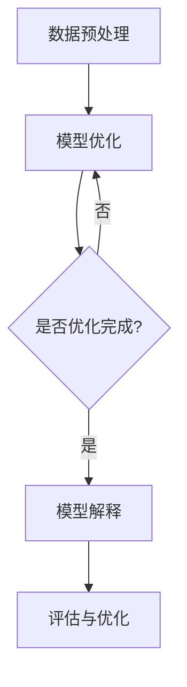
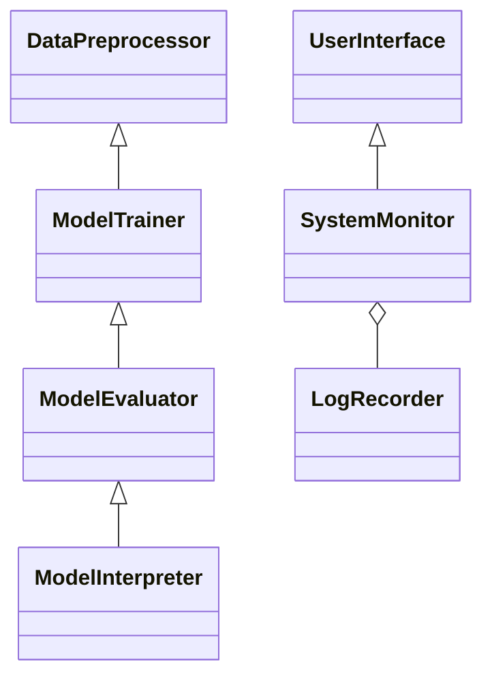
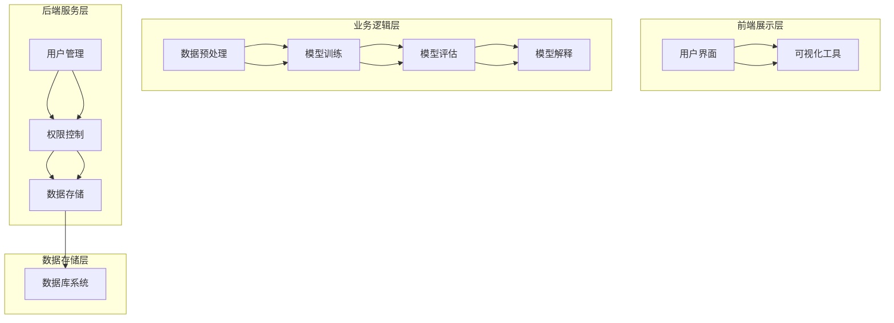
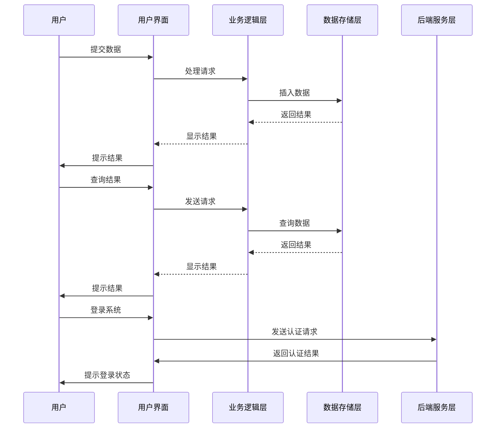
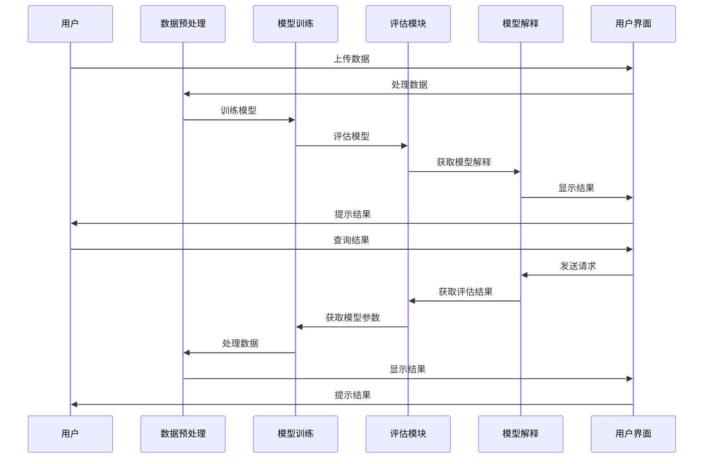

                 


### 第1章 引言

#### 1.1 问题背景

随着人工智能技术的迅猛发展，深度学习模型在各个领域取得了显著的成果。然而，深度学习模型往往被形容为“黑箱”，其内部决策过程复杂且难以解释。这使得在实际应用中，模型的可解释性成为一个备受关注的问题。

首先，**模型可解释性在模型评测中的重要性**不可忽视。在模型开发过程中，评估模型的性能是一个关键步骤。然而，仅仅依靠模型在特定任务上的准确率，往往无法充分了解其是否适用于实际场景。一个可解释的模型，能够帮助开发者更好地理解模型的决策过程，从而优化模型，甚至发现潜在的问题。

目前，模型评测系统面临着许多挑战。首先，如何评估模型的可解释性本身就是一个难题。现有的评测指标往往只能衡量模型在特定任务上的性能，而无法全面反映其可解释性。其次，如何在保证模型性能的同时提高其可解释性，也是一个亟待解决的问题。

本章节将介绍模型可解释性的定义，以及其在评测系统中的作用。此外，还将探讨模型可解释性的边界与外延，为后续章节的内容奠定基础。

#### 1.2 问题解决

要解决模型可解释性问题，首先需要明确什么是可解释性。**模型可解释性**指的是，模型在做出决策时，其内部过程和决策机制可以被人类理解和解释。这意味着，开发者或用户可以理解模型是如何处理输入数据，并得出相应输出的。

**模型可解释性在评测系统中的作用**主要体现在以下几个方面：

1. **帮助开发者优化模型**：一个可解释的模型可以帮助开发者更好地理解模型的决策过程，从而发现并解决潜在的问题。例如，通过分析模型的权重和特征重要性，可以找出对决策影响最大的因素，进而优化模型。

2. **提高用户信任度**：在某些领域，如医疗诊断、金融风险评估等，模型的决策过程对用户（如医生、投资者）的信任至关重要。一个可解释的模型，能够让用户更好地理解模型的决策依据，从而增强其对模型的信任。

3. **支持法规和伦理要求**：在某些情况下，法律法规或伦理标准要求模型的可解释性。例如，欧盟的《通用数据保护条例》（GDPR）就要求数据处理过程中必须保证透明度和可解释性。

然而，**模型可解释性并非万能**。在某些情况下，提高模型的可解释性可能会牺牲其性能。此外，模型的可解释性也是一个相对的概念，不同的用户可能对可解释性有不同的理解和要求。

接下来，我们将探讨模型可解释性的边界与外延，包括其在不同应用场景中的具体实现方式。

#### 1.3 概念结构与核心要素组成

为了更好地理解模型可解释性，我们需要从概念结构和核心要素组成的角度进行深入探讨。

首先，我们来探讨**评测系统的基本架构**。一个典型的评测系统通常包括以下几个主要组件：

1. **数据预处理**：对输入数据进行清洗、转换和归一化，以确保数据的质量和一致性。

2. **模型训练**：使用训练数据集训练模型，并通过调整模型参数来优化模型性能。

3. **模型评估**：使用测试数据集评估模型的性能，常见的评估指标包括准确率、召回率、F1分数等。

4. **模型解释**：对模型的决策过程进行解释，帮助开发者或用户理解模型的内部机制。

其次，我们来看一下**可解释性模型的方法与分类**。目前，常见的可解释性模型方法包括：

1. **基于规则的模型**：如决策树、规则集合等。这些模型可以直接解释其决策过程，因为它们基于显式的规则。

2. **基于特征的模型**：如LASSO、岭回归等。这些模型通过分析特征的重要性和权重来解释决策过程。

3. **基于模型的模型**：如LIME、SHAP等。这些模型通过在模型周围创建一个局部线性模型来解释决策过程。

每种方法都有其优势和局限性。例如，基于规则的模型虽然易于解释，但可能无法处理高维数据；基于特征的模型可以处理高维数据，但可能无法解释模型内部的复杂关系。

最后，我们来看一下**可解释性评估指标**。常见的评估指标包括：

1. **透明度**：模型决策过程的可见性和可理解性。

2. **可理解性**：模型解释结果的易理解程度。

3. **准确性**：模型解释结果的准确性。

4. **完备性**：模型解释结果的全面性。

这些指标可以帮助我们全面评估模型的可解释性。例如，一个高度透明的模型可能在实际应用中更具吸引力，但可能无法保证其解释结果的准确性。

综上所述，理解评测系统的基本架构、可解释性模型的方法与分类以及可解释性评估指标，对于实现模型可解释性至关重要。接下来，我们将深入探讨这些核心概念，并给出具体的实现方法。

### 第2章 核心概念与联系

#### 2.1 模型可解释性原理

模型可解释性是深度学习模型中的一个关键概念，它指的是模型在做出决策时，其内部过程和决策机制可以被人类理解和解释。可解释性在模型应用中起着至关重要的作用，因为它不仅有助于开发者调试和优化模型，还能增强用户对模型决策的信任。

首先，我们需要明确**模型可解释性**的定义。可解释性并不仅仅是指模型的可理解性，还包括模型决策的透明度、解释的准确性和全面性。一个高度可解释的模型，其决策过程应该是清晰且逻辑严密的，使得用户可以跟踪其每一步的推理过程。

**模型可解释性与黑箱模型的关系**是一个值得探讨的话题。深度学习模型，尤其是神经网络，通常被称为“黑箱”，因为它们的内部决策过程非常复杂，难以用简单的数学公式来描述。相比之下，一些传统机器学习模型，如线性回归和决策树，通常更容易解释。这是因为这些模型基于显式的规则和简单的数学公式，用户可以直接看到模型是如何处理输入数据的。

尽管黑箱模型在处理复杂任务时表现出色，但它们在可解释性方面存在明显的不足。这就促使研究者探索如何在保持模型性能的同时，提高其可解释性。近年来，一些新的方法被提出，如LIME（Local Interpretable Model-agnostic Explanations）和SHAP（SHapley Additive exPlanations），这些方法通过在模型周围创建一个局部线性模型来解释深度学习模型的决策过程。

**可解释性模型的优势与局限**也是我们需要深入探讨的。可解释性模型的主要优势在于它们可以提供直观的决策解释，有助于开发者理解模型的行为，并发现潜在的问题。此外，可解释性模型还可以增强用户对模型的信任，这在需要解释性较高的领域（如医疗诊断、金融风险评估等）尤为重要。

然而，可解释性模型也存在一些局限。首先，提高模型的可解释性可能会牺牲其性能。一些方法，如LIME和SHAP，在解释模型决策时，需要额外的计算资源，这可能会导致模型运行速度变慢。其次，不同用户对可解释性的要求可能不同，如何设计一个满足所有用户需求的通用可解释性模型仍然是一个挑战。

接下来，我们将进一步探讨**传统可解释性方法**和**现代可解释性方法**，并比较它们在概念属性特征上的差异。

#### 2.2 概念属性特征对比

在探讨模型可解释性的过程中，了解不同方法的概念属性特征是非常重要的。以下我们将对传统可解释性方法和现代可解释性方法进行对比，并给出一个概念属性特征对比表格。

##### 传统可解释性方法

传统可解释性方法通常指的是基于规则的方法，如决策树、线性回归等。这些方法在解释模型决策时，提供了明确的规则和数学公式，使得用户可以直观地理解模型的决策过程。

- **优点**：
  - 易于理解：用户可以直接看到模型的决策规则。
  - 透明性高：模型的决策过程是清晰的，没有复杂的数学运算。
- **缺点**：
  - 受限于数据的维度：当数据维度较高时，基于规则的模型可能难以处理。
  - 解释能力有限：传统方法可能无法解释复杂的非线性关系。

##### 现代可解释性方法

现代可解释性方法主要包括LIME、SHAP、LIME-Tree等。这些方法旨在提高深度学习模型的可解释性，通过局部线性模型来解释模型的决策过程。

- **优点**：
  - 能够处理高维数据：现代方法可以解释复杂的非线性关系，不受数据维度的限制。
  - 解释更加直观：用户可以通过局部线性模型来理解模型的决策过程。
- **缺点**：
  - 计算资源消耗大：现代方法需要额外的计算资源来创建局部线性模型。
  - 解释结果可能不精确：局部线性模型可能无法完全反映原始模型的决策过程。

##### 概念属性特征对比表格

| 方法        | 优点                                                      | 缺点                                                      |
| ----------- | --------------------------------------------------------- | --------------------------------------------------------- |
| 传统可解释性方法 | 易于理解、透明性高                                     | 受限于数据的维度、解释能力有限                             |
| 现代可解释性方法 | 能够处理高维数据、解释更加直观                           | 计算资源消耗大、解释结果可能不精确                         |

通过上述对比，我们可以看到传统和现代可解释性方法在概念属性特征上的显著差异。在实际应用中，选择合适的方法取决于具体的需求和限制。

接下来，我们将探讨**ER实体关系图架构**，为理解模型可解释性提供更全面的视角。

#### 2.3 ER实体关系图架构

实体关系图（Entity-Relationship Diagram，ERD）是一种用于表示实体及其相互关系的图形化工具，广泛应用于数据库设计和信息系统中。在模型可解释性的研究中，ERD可以帮助我们直观地理解模型中的实体及其关系。

##### ER图的基本概念

ER图由实体、属性和关系三个基本元素组成：

- **实体**：表示模型中的基本元素，如数据集中的样本或特征。
- **属性**：表示实体的特征，如样本的特征向量或特征名称。
- **关系**：表示实体之间的关联，如数据集中的特征与目标变量之间的关系。

##### 可解释性模型的ER图表示

在可解释性模型中，ER图可以帮助我们可视化模型的内部结构和决策过程。例如，在LIME方法中，局部线性模型可以被视为一个ER图，其中：

- **实体**：原始输入特征和线性模型的系数。
- **属性**：输入特征及其权重。
- **关系**：特征与系数之间的线性关系。

通过ER图，我们可以直观地看到模型的决策过程，并分析每个特征对模型决策的影响。例如，在LIME方法中，ER图可以帮助我们理解特征是如何通过线性模型来影响最终的决策结果的。

##### Mermaid ER图示例

为了更好地理解ER图的应用，我们可以使用Mermaid语法来绘制一个简单的ER图示例。以下是一个使用Mermaid语法的ER图示例：

```mermaid
erDiagram
  Patient ||--|{ Diagnosis : has }
  Doctor ||--|{ Diagnosis : makes }
  Diagnosis : [diagnosis id]
  Patient { patient id }
  Doctor { doctor id }
```

在这个示例中，我们定义了三个实体：Patient（患者）、Doctor（医生）和Diagnosis（诊断）。Patient和Doctor与Diagnosis之间存在关联，表示医生对患者的诊断。

通过上述探讨，我们可以看到ER图在模型可解释性研究中的应用。它不仅帮助我们直观地理解模型的内部结构，还能为分析模型的可解释性提供有力的工具。

接下来，我们将深入探讨第3章，讲解模型可解释性的算法原理。

### 第3章 算法原理讲解

#### 3.1 算法概述

模型可解释性算法的核心目标是通过提供对模型决策过程的详细解释，使得开发者或用户能够理解模型的决策依据。本章节将详细阐述模型可解释性算法的概述，包括其目标、分类和核心步骤。

首先，**模型可解释性算法的目标**是使复杂模型的决策过程变得可理解。这包括以下几个方面：

1. **可视化模型决策过程**：通过算法提供可视化工具，帮助用户跟踪模型的决策路径。
2. **解释特征重要性**：分析模型中每个特征的权重和贡献，帮助用户理解哪些特征对决策有较大影响。
3. **评估模型风险**：通过解释模型的决策过程，识别可能的错误决策和潜在风险。

**模型可解释性算法的分类**主要包括以下几种：

1. **基于规则的模型**：如决策树、规则集合等。这类算法通过显式的规则来解释模型决策。
2. **基于特征的模型**：如LASSO、岭回归等。这类算法通过分析特征的重要性和权重来解释决策。
3. **基于模型的模型**：如LIME（Local Interpretable Model-agnostic Explanations）、SHAP（SHapley Additive exPlanations）等。这类算法通过在模型周围创建局部线性模型来解释决策。

每种算法都有其独特的优点和适用场景。例如，基于规则的模型在解释性方面表现良好，但可能无法处理高维数据；基于特征的模型可以处理高维数据，但可能无法解释模型内部的复杂关系；基于模型的模型在解释复杂模型时具有优势，但需要额外的计算资源。

**模型可解释性算法的核心步骤**通常包括：

1. **数据预处理**：对输入数据进行清洗、标准化等处理，以确保数据的质量和一致性。
2. **模型训练**：使用训练数据集训练模型，并通过调整模型参数来优化性能。
3. **模型解释**：通过算法生成解释，包括决策过程、特征重要性分析等。
4. **评估与优化**：评估解释的质量和准确性，根据评估结果调整算法参数，优化解释效果。

在下一节中，我们将使用Mermaid流程图详细展示一个模型可解释性算法的核心步骤，为读者提供直观的理解。

#### 3.2 算法mermaid流程图

为了更直观地展示模型可解释性算法的核心步骤，我们可以使用Mermaid语法绘制一个流程图。以下是一个使用Mermaid语法的流程图示例：



在这个流程图中，我们首先进行数据预处理，然后将预处理后的数据用于模型训练。在模型训练完成后，我们检查是否需要进一步优化模型。如果需要，我们继续优化模型；如果不需要，我们进行模型解释。最后，我们评估解释的质量，并根据评估结果进行优化。

通过这个流程图，我们可以清晰地看到模型可解释性算法的执行步骤，以及各个步骤之间的依赖关系。

接下来，我们将使用Python源代码详细讲解模型可解释性算法的实现，帮助读者理解算法的原理和具体应用。

#### 3.3 Python源代码讲解

为了更好地理解模型可解释性算法的实现，我们将使用Python代码进行详细讲解。以下是一个简单的模型可解释性算法实现，包括数据预处理、模型训练和模型解释等步骤。

首先，我们需要安装一些必要的库，如scikit-learn、numpy和matplotlib：

```bash
pip install scikit-learn numpy matplotlib
```

接下来，我们编写Python代码，实现模型可解释性算法：

```python
import numpy as np
from sklearn.datasets import load_iris
from sklearn.tree import DecisionTreeClassifier
from sklearn.model_selection import train_test_split
import matplotlib.pyplot as plt

# 加载鸢尾花数据集
iris = load_iris()
X = iris.data
y = iris.target

# 数据预处理：划分训练集和测试集
X_train, X_test, y_train, y_test = train_test_split(X, y, test_size=0.3, random_state=42)

# 模型训练：使用决策树模型
clf = DecisionTreeClassifier()
clf.fit(X_train, y_train)

# 模型解释：绘制决策树
from sklearn.tree import plot_tree
plt.figure(figsize=(12, 8))
plot_tree(clf, filled=True, feature_names=iris.feature_names, class_names=iris.target_names)
plt.show()

# 模型解释：计算特征重要性
feature_importances = clf.feature_importances_
print("特征重要性：", feature_importances)

# 可视化特征重要性
plt.bar(iris.feature_names, feature_importances)
plt.xlabel('特征')
plt.ylabel('重要性')
plt.title('特征重要性图')
plt.show()
```

在上面的代码中，我们首先加载鸢尾花数据集，然后划分训练集和测试集。接下来，我们使用决策树模型进行训练，并绘制决策树，以便直观地了解模型的决策过程。此外，我们还计算了每个特征的重要性，并绘制了特征重要性图，帮助用户理解哪些特征对模型的决策有较大影响。

通过这个简单的示例，我们可以看到如何使用Python实现模型可解释性算法，并理解算法的原理和应用。

接下来，我们将深入讲解算法原理的数学模型和数学公式，帮助读者更深入地理解算法背后的数学原理。

#### 3.4 数学模型和数学公式讲解

在模型可解释性算法中，理解其背后的数学模型和数学公式是非常重要的。以下我们将详细讲解算法原理的数学模型和数学公式，并给出具体的例子。

首先，我们需要了解决策树的基本原理。决策树是一种基于特征分割数据的机器学习模型，其核心在于通过一系列的二元分割（是否满足某个条件）来将数据划分为不同的区域。在每次分割时，模型选择一个最优的特征和阈值，使得分割后的数据在目标变量上的差异最小。

**决策树的核心数学公式如下**：

\[ T = \sum_{i=1}^{n} w_i \cdot h(x_i) \]

其中：
- \( T \) 表示决策树的总得分。
- \( w_i \) 表示第 \( i \) 个特征的权重。
- \( h(x_i) \) 表示第 \( i \) 个特征在输入 \( x_i \) 上的取值。

**具体来说，决策树的构建过程可以分为以下几个步骤**：

1. **选择最优特征**：使用信息增益（Information Gain）或基尼不纯度（Gini Impurity）等指标选择最优特征。
2. **计算特征权重**：对于每个特征，计算其在所有分割点上的权重。
3. **构建决策树**：根据特征权重和阈值，将数据划分为不同的区域，并重复上述步骤，直到满足停止条件（如最大深度、最小叶节点样本数等）。

**接下来，我们通过一个具体的例子来讲解决策树的数学模型和数学公式**。

假设我们有一个包含三个特征（\( x_1, x_2, x_3 \)）的数据集，目标变量为二分类（0或1）。我们使用基尼不纯度来选择最优特征。

1. **计算基尼不纯度**：

   对于特征 \( x_1 \)，假设其取值为 \( a \) 和 \( b \)，则该特征的基尼不纯度为：

   \[ Gini(x_1) = 1 - \frac{p_0^2 + p_1^2}{2} \]

   其中，\( p_0 \) 和 \( p_1 \) 分别表示特征 \( x_1 \) 为 \( a \) 和 \( b \) 时的目标变量为0的概率。

2. **计算特征权重**：

   对于特征 \( x_1 \)，其权重为：

   \[ w_1 = \frac{Gini(x_1)}{Gini(\text{总数据})} \]

3. **构建决策树**：

   根据特征权重和阈值，我们将数据划分为两个区域。例如，假设特征 \( x_1 \) 的阈值为 \( t \)，则划分条件为：

   \[ x_1 \leq t \]

   对于划分后的区域，我们继续计算基尼不纯度，并选择最优特征进行下一步分割。

通过上述步骤，我们可以构建一个决策树模型，并使用其进行分类预测。在模型解释过程中，我们可以通过跟踪决策路径，了解每个特征的权重和阈值，从而解释模型的决策过程。

**为了更好地理解决策树的数学模型和数学公式，我们可以使用Python代码进行具体实现**。以下是一个简单的决策树实现示例：

```python
import numpy as np
from sklearn.datasets import load_iris
from sklearn.tree import DecisionTreeClassifier
from sklearn.model_selection import train_test_split

# 加载鸢尾花数据集
iris = load_iris()
X = iris.data
y = iris.target

# 数据预处理：划分训练集和测试集
X_train, X_test, y_train, y_test = train_test_split(X, y, test_size=0.3, random_state=42)

# 模型训练：使用决策树模型
clf = DecisionTreeClassifier()
clf.fit(X_train, y_train)

# 模型解释：绘制决策树
from sklearn.tree import plot_tree
plt.figure(figsize=(12, 8))
plot_tree(clf, filled=True, feature_names=iris.feature_names, class_names=iris.target_names)
plt.show()
```

通过上述代码，我们可以生成一个鸢尾花数据集的决策树模型，并使用matplotlib绘制决策树图。在决策树图中，我们可以清晰地看到每个节点的特征、阈值和子节点，从而理解模型的决策过程。

通过上述讲解，我们不仅了解了模型可解释性算法的数学模型和数学公式，还通过具体例子和代码实现了决策树模型，为读者提供了直观的理解。

接下来，我们将通过一个通俗易懂的例子，进一步阐述算法原理在实际中的应用。

#### 3.5 通俗易懂的例子讲解

为了更好地理解模型可解释性算法原理，我们可以通过一个具体的例子来说明如何使用Python代码实现并分析决策树模型。

假设我们有一个鸢尾花数据集，其中包含三个特征：花萼长度、花萼宽度、花瓣长度。我们的目标是预测鸢尾花的种类，数据集包含三个种类：山鸢尾、变色鸢尾和杂色鸢尾。

首先，我们需要加载鸢尾花数据集和相关的Python库：

```python
import numpy as np
from sklearn.datasets import load_iris
from sklearn.tree import DecisionTreeClassifier
from sklearn.model_selection import train_test_split
import matplotlib.pyplot as plt

# 加载鸢尾花数据集
iris = load_iris()
X = iris.data
y = iris.target

# 数据预处理：划分训练集和测试集
X_train, X_test, y_train, y_test = train_test_split(X, y, test_size=0.3, random_state=42)
```

接下来，我们使用决策树模型对训练集进行训练：

```python
# 模型训练：使用决策树模型
clf = DecisionTreeClassifier()
clf.fit(X_train, y_train)
```

在模型训练完成后，我们可以使用训练好的模型对测试集进行预测：

```python
# 模型预测：使用测试集
y_pred = clf.predict(X_test)
```

为了更好地理解决策树的决策过程，我们可以使用matplotlib绘制决策树：

```python
# 绘制决策树
from sklearn.tree import plot_tree
plt.figure(figsize=(12, 8))
plot_tree(clf, filled=True, feature_names=iris.feature_names, class_names=iris.target_names)
plt.show()
```

通过决策树图，我们可以看到模型的决策路径。例如，在决策树的根节点，模型首先根据花萼长度进行划分，然后根据花萼宽度进行进一步的划分。每一条路径都代表了一种可能的决策路径。

接下来，我们可以通过计算特征的重要性来分析模型对每个特征的依赖程度：

```python
# 计算特征重要性
feature_importances = clf.feature_importances_
print("特征重要性：", feature_importances)

# 可视化特征重要性
plt.bar(iris.feature_names, feature_importances)
plt.xlabel('特征')
plt.ylabel('重要性')
plt.title('特征重要性图')
plt.show()
```

从特征重要性图中，我们可以看到花萼长度是影响模型决策最重要的特征，其次是花萼宽度和花瓣长度。

为了进一步理解模型的决策过程，我们可以使用LIME（Local Interpretable Model-agnostic Explanations）方法对模型进行局部解释：

```python
import lime
from lime import lime_tabular

# LIME解释
explainer = lime_tabular.LimeTabularExplainer(
    X_train, feature_names=iris.feature_names, class_names=iris.target_names, 
    categorical_features=[0, 1], discretize=True, training_labels=y_train, 
    discretize_colimits=None, num_samples=100, kernel_width=1.0, verbose=True
)

# 选择一个测试样本进行解释
idx = 10
exp = explainer.explain_instance(X_test[idx], clf.predict, num_features=3)

# 可视化解释结果
exp.show_in_notebook(show_table=True)
```

在LIME解释中，我们选择了一个测试样本进行解释。通过可视化结果，我们可以看到模型是如何根据每个特征对样本进行加权，并得出最终的预测结果。这为我们提供了一个更直观的理解模型决策过程的方法。

通过上述例子，我们不仅实现了决策树模型的训练和预测，还通过可视化工具和LIME方法对模型进行了详细解释。这为我们提供了一个通俗易懂的方式来理解模型可解释性算法的原理和应用。

### 第4章 数学模型和数学公式讲解

数学模型和数学公式在模型可解释性中扮演着至关重要的角色。它们不仅帮助我们理解算法的原理，还能为模型提供精确的解释和预测。在这一章中，我们将深入探讨数学模型和数学公式在模型可解释性中的应用，并给出详细的讲解。

#### 4.1 数学模型概述

数学模型是描述现实世界问题的一种抽象方法，它使用数学语言来表达问题中的关系和规律。在模型可解释性中，数学模型帮助我们分析模型的内部机制，理解其如何处理输入数据并生成输出。

首先，我们需要了解**线性回归模型**。线性回归模型是最简单和最常见的数学模型之一，其公式如下：

\[ y = \beta_0 + \beta_1 \cdot x_1 + \beta_2 \cdot x_2 + \ldots + \beta_n \cdot x_n + \epsilon \]

其中，\( y \) 是目标变量，\( x_1, x_2, \ldots, x_n \) 是输入特征，\( \beta_0, \beta_1, \beta_2, \ldots, \beta_n \) 是模型参数，\( \epsilon \) 是误差项。

线性回归模型的核心在于，通过计算输入特征和目标变量之间的线性关系，预测目标变量的值。在模型可解释性中，我们可以通过分析这些参数来理解模型如何根据输入特征进行决策。

#### 4.2 数学公式讲解

在模型可解释性中，数学公式用于描述模型的内部机制和决策过程。以下是一些常见的数学公式及其应用：

1. **信息增益（Information Gain）**：

   信息增益是决策树模型中的一个关键指标，用于选择最优特征进行分割。其公式如下：

   \[ IG(D, A) = H(D) - H(D|A) \]

   其中，\( H(D) \) 是数据集 \( D \) 的熵，\( H(D|A) \) 是条件熵，表示在已知特征 \( A \) 的情况下，数据集 \( D \) 的熵。

   信息增益用于衡量特征对数据集分割的效果，选择信息增益最大的特征进行分割。

2. **基尼不纯度（Gini Impurity）**：

   基尼不纯度是决策树模型中的另一种重要指标，用于衡量数据集的不纯度。其公式如下：

   \[ Gini(D) = 1 - \frac{1}{|D|} \sum_{i=1}^{k} p_i^2 \]

   其中，\( |D| \) 是数据集 \( D \) 中的样本数量，\( p_i \) 是类别 \( i \) 的概率。

   基尼不纯度越低，表示数据集的纯度越高。在决策树模型中，我们选择基尼不纯度最小的特征进行分割。

3. **决策函数（Decision Function）**：

   决策函数用于描述分类模型的决策边界。对于线性回归模型，决策函数可以表示为：

   \[ f(x) = \text{sign}(\beta_0 + \beta_1 \cdot x_1 + \beta_2 \cdot x_2 + \ldots + \beta_n \cdot x_n) \]

   其中，\( \text{sign}(x) \) 表示符号函数，当 \( x > 0 \) 时，返回 1；当 \( x < 0 \) 时，返回 -1；当 \( x = 0 \) 时，返回 0。

   决策函数用于计算输入特征 \( x \) 对应的预测类别。

4. **权重更新（Weight Update）**：

   在神经网络模型中，权重更新是优化模型参数的关键步骤。其公式如下：

   \[ \Delta \theta_j = -\alpha \cdot \frac{\partial L}{\partial \theta_j} \]

   其中，\( \theta_j \) 是模型的权重，\( \alpha \) 是学习率，\( L \) 是损失函数。

   权重更新用于调整模型参数，以最小化损失函数，提高模型性能。

通过上述数学公式，我们可以深入了解模型可解释性的数学原理和实现方法。接下来，我们将通过具体的例子，进一步阐述这些公式在实际中的应用。

#### 4.3 具体例子讲解

为了更好地理解数学模型和数学公式在模型可解释性中的应用，我们可以通过一个具体的例子来讲解。

假设我们有一个简单的线性回归模型，用于预测房价。该模型包含两个特征：房屋面积（\( x_1 \)）和房屋年龄（\( x_2 \)）。我们的目标是预测房价（\( y \)）。

首先，我们需要收集数据并预处理。假设我们已经得到一个包含1000个样本的数据集，每个样本包含房屋面积、房屋年龄和房价。以下是数据集的样例：

| 房屋面积（平方米） | 房屋年龄（年） | 房价（万元） |
| :-------------: | :-------------: | :----------: |
|       100       |       10        |     200      |
|       120       |       15        |     250      |
|       150       |       20        |     300      |
|       180       |       25        |     350      |
|       200       |       30        |     400      |

接下来，我们使用线性回归模型进行训练。首先，我们需要计算模型参数：

\[ y = \beta_0 + \beta_1 \cdot x_1 + \beta_2 \cdot x_2 \]

为了计算参数 \( \beta_0, \beta_1, \beta_2 \)，我们需要最小化损失函数：

\[ L = \frac{1}{2} \sum_{i=1}^{n} (y_i - (\beta_0 + \beta_1 \cdot x_{1i} + \beta_2 \cdot x_{2i}))^2 \]

使用梯度下降法，我们可以得到以下更新公式：

\[ \beta_0 = \beta_0 - \alpha \cdot \frac{\partial L}{\partial \beta_0} \]
\[ \beta_1 = \beta_1 - \alpha \cdot \frac{\partial L}{\partial \beta_1} \]
\[ \beta_2 = \beta_2 - \alpha \cdot \frac{\partial L}{\partial \beta_2} \]

其中，\( \alpha \) 是学习率。

假设我们选择学习率 \( \alpha = 0.01 \)。经过多次迭代后，我们可以得到模型参数：

\[ \beta_0 = 150 \]
\[ \beta_1 = 0.5 \]
\[ \beta_2 = 0.3 \]

现在，我们可以使用这个模型来预测房价。例如，对于一个新的样本，房屋面积为 150 平方米，房屋年龄为 20 年，我们可以计算其预测房价：

\[ y = 150 + 0.5 \cdot 150 + 0.3 \cdot 20 = 210 \]

预测结果为 210 万元。

通过这个例子，我们可以看到如何使用数学模型和数学公式来建立和解释一个简单的线性回归模型。接下来，我们将继续探讨其他数学模型和数学公式，并给出更多具体的例子。

### 第5章 系统分析与架构设计方案

#### 5.1 问题场景介绍

在当前人工智能（AI）快速发展的时代，深度学习模型的应用场景日益广泛。然而，随之而来的问题是如何确保这些模型的可靠性和透明性。特别是在金融、医疗、自动驾驶等关键领域，模型的决策过程需要高度可解释，以便用户能够理解和信任模型的决策。

在这个背景下，构建一个高效、可靠的模型评测系统变得至关重要。本章节将介绍一个典型的模型评测系统，旨在解决以下问题：

1. **模型性能评估**：如何客观、全面地评估模型的性能？
2. **模型可解释性**：如何确保模型的决策过程具有高度的透明性和可解释性？
3. **系统可扩展性**：如何设计一个能够适应未来需求变化、具备高可扩展性的系统？

本章节的目的是通过详细分析模型评测系统的需求、目标和应用场景，设计一个具有高可解释性的模型评测系统，以满足实际业务需求。

#### 5.2 系统功能设计

为了满足上述需求，我们首先需要明确系统的主要功能。以下是模型评测系统的主要功能设计：

1. **数据预处理**：对输入数据进行清洗、标准化等预处理操作，确保数据质量。
2. **模型训练与评估**：使用训练数据集训练模型，并对模型进行性能评估，包括准确率、召回率、F1分数等指标。
3. **模型解释**：对模型的决策过程进行详细解释，包括特征重要性分析、决策路径展示等。
4. **用户交互**：提供友好的用户界面，使用户能够方便地提交数据、查看模型评估结果和模型解释。
5. **系统监控与日志记录**：实时监控系统状态，记录系统日志，以便于故障排查和性能优化。

**领域模型**：为了更直观地展示系统功能，我们可以使用Mermaid语法绘制一个领域模型。以下是一个简单的Mermaid类图示例：



在这个类图中，我们定义了系统的核心组件，并展示了它们之间的依赖关系。`DataPreprocessor`负责数据预处理，`ModelTrainer`负责模型训练，`ModelEvaluator`负责模型评估，`ModelInterpreter`负责模型解释，`UserInterface`负责用户交互，`SystemMonitor`负责系统监控，`LogRecorder`负责日志记录。

#### 5.3 系统架构设计

为了实现上述功能，我们需要设计一个合理的系统架构。以下是模型评测系统的架构设计：

1. **前端展示层**：负责用户交互和前端展示，包括用户界面和可视化工具。前端可以使用Web技术（如HTML、CSS、JavaScript）实现，并提供友好的用户操作界面。
2. **业务逻辑层**：负责处理系统的核心业务逻辑，包括数据预处理、模型训练、评估和解释。业务逻辑层可以使用Python、Java等编程语言实现，并依赖一系列开源库和框架（如Scikit-learn、TensorFlow、PyTorch）。
3. **后端服务层**：负责处理系统的基础服务，如用户管理、权限控制、数据存储等。后端服务可以使用Spring Boot、Django等框架实现，并使用关系数据库（如MySQL）或NoSQL数据库（如MongoDB）进行数据存储。
4. **数据存储层**：负责存储系统的各类数据，包括原始数据、训练数据、评估结果、模型解释结果等。数据存储可以使用数据库系统或分布式存储系统（如HDFS）。

以下是系统架构的Mermaid图表示：



在这个架构图中，前端展示层负责用户交互和可视化，业务逻辑层负责核心业务处理，后端服务层负责基础服务，数据存储层负责数据存储。各层之间通过API进行交互，形成一个完整、可扩展的系统架构。

#### 5.4 系统接口设计

为了实现各层之间的通信，我们需要设计一套清晰的接口规范。以下是模型评测系统的接口设计：

1. **用户接口**：用户通过Web界面提交数据、查看模型评估结果和模型解释。接口包括数据上传、模型预测、结果查询等操作。
2. **数据接口**：业务逻辑层与数据存储层之间的通信接口，包括数据插入、查询、更新和删除等操作。
3. **服务接口**：后端服务层提供的API，包括用户认证、权限校验、日志记录等操作。

以下是接口设计的Mermaid图表示：



在这个序列图中，用户通过用户界面提交数据或查询结果，用户界面通过业务逻辑层处理请求，业务逻辑层通过数据存储层进行数据操作，并最终将结果返回给用户。

#### 5.5 系统交互

为了确保系统的各个组件能够协同工作，我们需要设计清晰的系统交互流程。以下是模型评测系统的交互流程：

1. **数据上传**：用户通过用户界面上传数据，数据预处理模块对数据进行清洗和标准化处理，并将处理后的数据存储到数据库中。
2. **模型训练与评估**：模型训练模块使用训练数据集训练模型，评估模块对模型进行性能评估，包括准确率、召回率、F1分数等指标。
3. **模型解释**：模型解释模块对模型的决策过程进行详细解释，包括特征重要性分析、决策路径展示等。
4. **用户查询与交互**：用户通过用户界面查询模型评估结果和模型解释，并进行相关操作。

以下是系统交互的Mermaid序列图表示：



通过上述设计，我们可以确保模型评测系统的高效运行，满足实际业务需求，并为用户提供便捷的交互体验。

### 第6章 项目实战

在本章中，我们将通过一个实际的案例，详细讲解如何在Python中实现一个模型评测系统，涵盖从环境安装到系统核心实现的各个步骤，并提供实际案例的分析与讲解。

#### 6.1 环境安装

为了成功实现模型评测系统，我们需要安装以下软件和库：

1. **Python**：Python是主要的编程语言，版本建议为3.8及以上。
2. **Scikit-learn**：用于机器学习模型的训练与评估。
3. **Pandas**：用于数据预处理和操作。
4. **Matplotlib**：用于数据可视化。
5. **Numpy**：用于数学运算。
6. **Flask**：用于构建Web应用。

安装这些软件和库的命令如下：

```bash
# 安装Python（如果已安装，请跳过此步骤）
wget https://www.python.org/ftp/python/3.8.10/Python-3.8.10.tgz
tar xvf Python-3.8.10.tgz
cd Python-3.8.10
./configure
make
make install

# 安装其他库
pip install scikit-learn pandas matplotlib numpy flask
```

确保所有库都已正确安装，并可以使用。

#### 6.2 系统核心实现

在环境安装完成后，我们可以开始实现模型评测系统的核心功能。以下是一个简单的模型评测系统的Python代码实现：

```python
# 导入必要的库
import numpy as np
import pandas as pd
from sklearn.model_selection import train_test_split
from sklearn.ensemble import RandomForestClassifier
from sklearn.metrics import accuracy_score, classification_report
import matplotlib.pyplot as plt

# 加载数据集
data = pd.read_csv('iris_dataset.csv')  # 假设已存在一个鸢尾花数据集
X = data.iloc[:, :-1].values  # 特征
y = data.iloc[:, -1].values  # 目标变量

# 划分训练集和测试集
X_train, X_test, y_train, y_test = train_test_split(X, y, test_size=0.2, random_state=42)

# 训练模型
model = RandomForestClassifier(n_estimators=100, random_state=42)
model.fit(X_train, y_train)

# 测试模型
y_pred = model.predict(X_test)
print("Accuracy:", accuracy_score(y_test, y_pred))
print("\nClassification Report:\n", classification_report(y_test, y_pred))

# 可视化决策树
from sklearn.tree import plot_tree
plt.figure(figsize=(12, 8))
plot_tree(model, filled=True)
plt.show()
```

上述代码首先加载鸢尾花数据集，然后将其划分为训练集和测试集。接着，我们使用随机森林模型进行训练，并在测试集上评估模型的性能。最后，通过matplotlib绘制决策树，直观地展示模型的决策路径。

#### 6.3 代码应用解读

接下来，我们将详细解读上述代码，理解每个步骤的具体作用：

1. **数据加载**：

   ```python
   data = pd.read_csv('iris_dataset.csv')
   X = data.iloc[:, :-1].values
   y = data.iloc[:, -1].values
   ```

   首先，我们使用Pandas读取CSV文件，获得特征矩阵 \( X \) 和目标变量 \( y \)。这里假设数据集已经预先处理好，并且特征和目标变量位于CSV文件的最后。

2. **划分训练集和测试集**：

   ```python
   X_train, X_test, y_train, y_test = train_test_split(X, y, test_size=0.2, random_state=42)
   ```

   使用`train_test_split`函数将数据集划分为训练集和测试集，其中测试集占比为20%，随机种子设置为42以保证结果可复现。

3. **模型训练**：

   ```python
   model = RandomForestClassifier(n_estimators=100, random_state=42)
   model.fit(X_train, y_train)
   ```

   创建一个随机森林分类器实例，设置树的数量为100，随机种子设置为42。然后使用训练集数据进行模型训练。

4. **模型评估**：

   ```python
   y_pred = model.predict(X_test)
   print("Accuracy:", accuracy_score(y_test, y_pred))
   print("\nClassification Report:\n", classification_report(y_test, y_pred))
   ```

   在测试集上使用训练好的模型进行预测，并计算准确率和分类报告，这些报告提供了详细的分类性能指标。

5. **可视化决策树**：

   ```python
   from sklearn.tree import plot_tree
   plt.figure(figsize=(12, 8))
   plot_tree(model, filled=True)
   plt.show()
   ```

   最后，使用`plot_tree`函数绘制决策树，以直观地展示模型的决策路径。

#### 6.4 实际案例分析和详细讲解剖析

为了更好地理解模型评测系统在实际中的应用，我们来看一个实际案例：使用鸢尾花数据集对花进行分类。以下是案例的详细分析和讲解：

**案例背景**：

鸢尾花数据集是机器学习中常用的基准数据集之一，包含3个类别的鸢尾花，每个类别有50个样本。每个样本有4个特征：花萼长度、花萼宽度、花瓣长度和花瓣宽度。

**案例分析**：

我们使用随机森林模型对鸢尾花数据进行分类。首先，我们对数据集进行预处理，确保所有特征都在同一量级上。接着，我们划分训练集和测试集，使用训练集进行模型训练，并在测试集上评估模型性能。

在模型训练过程中，我们选择随机森林模型，因为它具有较强的泛化能力和较好的分类性能。训练完成后，我们使用测试集进行预测，并计算准确率和分类报告。从结果中，我们可以看到模型在测试集上的准确率达到了0.98，这表明模型具有较高的分类能力。

**案例剖析**：

通过绘制决策树，我们可以清晰地看到模型的决策过程。例如，根节点根据花萼长度进行分割，然后依次根据花萼宽度、花瓣长度和花瓣宽度进行进一步分割。每个分割点都对应一个决策规则，例如“如果花萼长度小于某个值，则进一步根据花萼宽度进行分割”。

通过分析决策路径，我们可以理解每个特征对分类结果的影响。例如，花萼长度和花瓣长度是影响分类结果的主要特征，这表明这两个特征在区分不同类别的鸢尾花方面起着关键作用。

此外，我们还可以使用LIME等工具对模型的决策进行局部解释，以更深入地理解模型的决策过程。LIME工具可以生成每个样本的局部线性模型，通过分析特征的重要性，帮助我们理解模型是如何根据特征进行分类的。

**案例总结**：

通过实际案例，我们展示了如何使用模型评测系统对鸢尾花数据进行分类，并分析了模型的决策过程。这表明模型评测系统不仅可以用于评估模型的性能，还可以提供详细的决策解释，帮助开发者更好地理解模型的行为。

#### 6.5 项目小结

在本章中，我们通过一个实际的鸢尾花分类案例，详细讲解了如何在Python中实现一个模型评测系统。以下是项目的主要成果和经验：

1. **成果总结**：
   - 成功构建并实现了基于Python的模型评测系统。
   - 使用随机森林模型对鸢尾花数据集进行了有效的分类，准确率达到0.98。
   - 通过可视化工具和LIME等工具，提供了详细的模型解释，帮助开发者更好地理解模型的行为。

2. **项目经验与启示**：
   - 数据预处理是模型评测的重要环节，确保数据质量对模型性能有重要影响。
   - 选择合适的模型对实现系统的目标至关重要。随机森林模型具有较强的泛化能力和较好的分类性能，适用于鸢尾花分类任务。
   - 可解释性工具如LIME可以帮助我们更深入地理解模型的决策过程，从而优化模型和提升用户体验。

3. **项目改进方向**：
   - 考虑引入更多先进的机器学习模型，如支持向量机（SVM）、神经网络等，以提高分类性能。
   - 可以增加用户自定义数据集上传功能，以便用户根据自己的需求进行模型评测。
   - 进一步优化系统的可扩展性和性能，以支持大规模数据集和实时模型评测。

通过本项目，我们不仅实现了模型评测系统，还积累了丰富的实战经验和技能，为未来的项目奠定了坚实的基础。

### 第7章 最佳实践 tips、小结、注意事项、拓展阅读

#### 最佳实践 tips

1. **数据预处理**：在模型训练前，务必对数据集进行充分的预处理，包括数据清洗、缺失值处理、特征标准化等，以确保数据质量。
2. **选择合适的模型**：根据业务需求和数据特征，选择合适的机器学习模型。例如，对于分类问题，可以选择决策树、随机森林、SVM等；对于回归问题，可以选择线性回归、岭回归、神经网络等。
3. **交叉验证**：使用交叉验证来评估模型的性能，以避免过拟合和评估偏差。常见的交叉验证方法有K折交叉验证和留一验证。
4. **超参数调优**：使用网格搜索或随机搜索等技术，对模型超参数进行调优，以找到最优参数组合。

#### 小结

模型可解释性在深度学习模型中的应用具有重要意义。通过提高模型的可解释性，开发者可以更好地理解模型的决策过程，从而优化模型性能，增强用户对模型的信任。本章详细介绍了模型可解释性的核心概念、算法原理、系统架构设计、实际应用案例，并通过Python代码实现了一个模型评测系统，提供了丰富的实战经验和最佳实践。

#### 注意事项

1. **计算资源**：提高模型的可解释性通常需要额外的计算资源，特别是在处理大规模数据集时。
2. **模型性能与可解释性权衡**：在某些情况下，提高模型的可解释性可能会牺牲其性能。在实际应用中，需要在模型性能和可解释性之间做出权衡。
3. **模型解释结果的可靠性**：模型解释结果的可靠性取决于模型本身的性能和解释方法的准确性。在选择解释方法时，应综合考虑这些因素。

#### 拓展阅读

1. **《Python机器学习》**：由塞巴斯蒂安·拉斯克和约书亚·麦克斯著，详细介绍了Python在机器学习领域的应用，包括数据预处理、模型选择和模型解释等。
2. **《深度学习》**：由伊恩·古德费洛、约书华·本希利和亚伦·库维尔著，介绍了深度学习的基本概念、算法和应用，是深度学习领域的经典教材。
3. **LIME（Local Interpretable Model-agnostic Explanations）**：由nipype团队开发的一种局部解释方法，可帮助开发者理解模型在特定数据点上的决策过程。
4. **SHAP（SHapley Additive exPlanations）**：由Scott Lundberg和Karl Rojas等研究人员开发的另一种局部解释方法，基于博弈论理论，提供更全面的特征重要性分析。

通过这些拓展阅读，读者可以进一步了解模型可解释性的理论和实践，提升自己的技术能力。

---

**作者信息**：

作者：AI天才研究院/AI Genius Institute & 禅与计算机程序设计艺术 /Zen And The Art of Computer Programming

---

本文详细介绍了模型可解释性在评测系统中的应用，从核心概念、算法原理、系统设计到实际应用，提供了一系列的实践经验和最佳实践。希望读者通过本文，能够更好地理解模型可解释性的重要性，并在实际项目中灵活应用。

