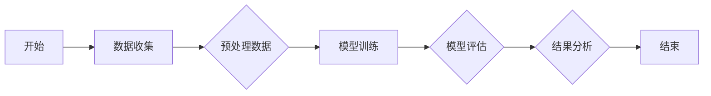
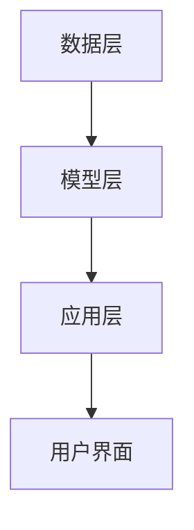
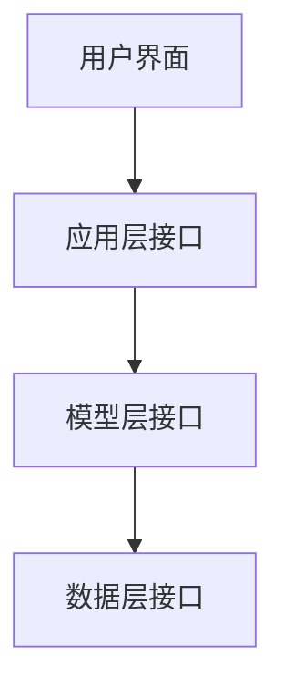

                 

### 模型情感调节能力测试：评估EQ表现

**关键词：**情感调节、EQ表现、模型测试、人工智能、算法原理

**摘要：**本文将深入探讨模型情感调节能力的测试方法及其在评估情感智力（EQ）表现中的重要性。通过详细的逻辑分析和实例说明，本文旨在帮助读者理解情感调节的基本概念、测试方法、算法原理以及实际应用，为进一步研究和优化情感智能模型提供理论支持和实践指导。

在当今人工智能时代，情感智能（Emotional Intelligence，EQ）越来越受到关注。EQ不仅影响着个人的情感状态，还直接关系到社会交往、工作绩效和心理健康。因此，如何评估和提升模型的情感调节能力成为一个重要的研究方向。本文将分以下几个部分进行详细探讨：

1. **背景介绍**：介绍情感调节与EQ表现的基本概念、研究背景和问题的重要性。
2. **情感调节能力测试概述**：阐述情感调节能力测试的类型、方法和评估标准。
3. **情感调节能力测试的核心概念**：讨论情感调节的原理、属性特征对比以及ER实体关系图架构。
4. **模型情感调节能力测试**：分析测试模型的构建过程、算法原理和实际操作。
5. **评估EQ表现**：介绍EQ表现的评估方法、流程和结果分析。
6. **案例研究与最佳实践**：通过具体案例分享情感调节能力测试的实践经验和最佳实践。
7. **未来展望**：讨论情感调节能力测试和EQ评估的未来趋势、挑战与机遇。

### 背景介绍

#### 核心概念术语说明

在探讨模型情感调节能力测试之前，首先需要明确一些核心概念术语。情感调节（Emotion Regulation）是指个体对自身情绪进行监控、评估和调整的过程。EQ，即情感智力，是一种识别、理解、管理自己和他人情感的能力。它包括自我意识、自我调节、社交意识和情绪管理等方面。

情感调节能力在人工智能中的应用具有重要意义。随着人工智能技术的发展，越来越多的模型被用于解决实际问题，如情感分析、社交机器人、心理咨询等。然而，这些模型是否具备足够的情感调节能力，能否在实际应用中表现出良好的EQ，是当前研究的重要课题。

#### 问题背景

情感调节能力测试的提出源于以下几个背景因素：

1. **人工智能的发展**：随着深度学习、自然语言处理等技术的发展，人工智能在各个领域的应用日益广泛。然而，人工智能在处理情感信息时，往往缺乏情感理解和调节的能力。
2. **社会需求**：在社会交往、心理咨询、教育等领域，人们越来越关注情感智力的重要性。如何评估和提升模型的情感调节能力，成为满足社会需求的迫切需求。
3. **技术研究**：情感调节能力测试是情感智能研究的一个重要分支，有助于深入理解情感智力，为模型的优化提供理论支持。

#### 问题描述

在当前研究中，情感调节能力测试主要面临以下几个问题：

1. **测试方法的标准化**：不同领域和应用的测试方法各异，缺乏统一的评估标准和体系。
2. **评估指标的多样性**：情感调节能力涉及多个维度，如自我调节、社交调节等，如何全面评估是一个挑战。
3. **数据集的多样性**：情感调节数据集的构建和收集是一个复杂的过程，数据质量和多样性直接影响测试结果的可靠性。
4. **模型的适应性**：不同模型在处理情感信息时的能力和表现各异，如何针对不同模型设计合理的测试方案，是一个亟待解决的问题。

#### 问题解决

针对上述问题，当前研究采取了一系列解决方法：

1. **标准化测试方法**：通过制定统一的评估标准和流程，提高测试方法的标准化和可靠性。
2. **多维度评估指标**：设计全面的评估指标体系，涵盖不同维度的情感调节能力，提高评估的全面性和准确性。
3. **数据集建设**：构建多样化、大规模的情感调节数据集，提高数据质量和多样性。
4. **模型适应性调整**：针对不同模型的特点，设计个性化的测试方案，提高测试结果的针对性和有效性。

#### 边界与外延

情感调节能力测试的研究和应用范围广泛，不仅限于人工智能领域，还涉及心理学、教育学、社会学等多个学科。在边界方面，情感调节能力测试主要关注人工智能模型的情感调节能力，而不涉及人类情感调节的心理学机制。在外延方面，情感调节能力测试可以应用于各类情感智能模型，如情感分析、社交机器人、心理咨询等。

#### 概念结构与核心要素组成

情感调节能力测试的核心概念包括情感调节、EQ表现、测试方法、评估指标和模型适应性。其中，情感调节是核心，EQ表现是目标，测试方法和评估指标是实现目标的手段，模型适应性是关键。

### 情感调节能力测试概述

#### 情感调节的定义

情感调节是指个体在面临情感刺激时，通过认知和行为策略对自身情感状态进行监控、评估和调整的过程。情感调节能力是情感智力的核心组成部分，直接影响个体的情绪稳定性、社会交往能力和生活质量。

#### 情感调节能力测试的重要性

情感调节能力测试在人工智能领域具有重要意义，主要体现在以下几个方面：

1. **提高模型实用性**：通过测试模型的情感调节能力，可以评估模型在处理情感信息时的表现，从而优化模型设计，提高其实用性和应用价值。
2. **促进模型创新**：情感调节能力测试为模型创新提供了新的方向和思路，有助于开发出更具有情感理解和调节能力的模型。
3. **解决实际问题**：在情感分析、社交机器人、心理咨询等应用场景中，模型情感调节能力的提升有助于解决实际问题，提高用户体验。

#### 情感调节能力测试的类型

情感调节能力测试可以分为以下几种类型：

1. **自我调节能力测试**：评估模型在个体自我情感调节方面的能力，包括情绪监控、情感识别、情感调节策略等。
2. **社交调节能力测试**：评估模型在社交场景中，处理他人情感信息的能力，包括情感识别、情感反应、情感协调等。
3. **环境适应能力测试**：评估模型在复杂多变的环境下，应对情感刺激的能力，包括情感适应、情感调节策略等。

#### EQ表现的评估标准

EQ表现的评估标准主要包括以下几个方面：

1. **情感识别能力**：评估模型在识别自身和他人情感方面的准确性、敏感性和全面性。
2. **情感理解能力**：评估模型在理解情感意义、情感动机和情感状态方面的能力。
3. **情感调节能力**：评估模型在应对情感刺激、调节情感状态和恢复情感平衡方面的能力。
4. **社交能力**：评估模型在社交互动、情感交流和情感协调方面的能力。

### 情感调节能力测试的核心概念

#### 情感调节的原理

情感调节的原理可以从以下几个方面进行阐述：

1. **认知调节**：个体通过认知策略，如情绪标签、认知重构和注意力调节等，对情感状态进行监控和调整。
2. **行为调节**：个体通过行为策略，如情感表达、情绪释放和情感支持等，对情感状态进行调节。
3. **生理调节**：个体通过生理策略，如呼吸调节、肌肉放松和生物反馈等，对情感状态进行调节。

#### 情感调节的属性特征对比表格

以下是一个情感调节属性特征对比表格，用于展示不同调节方式的优缺点：

| 调节方式 | 优点 | 缺点 |
| :--- | :--- | :--- |
| 认知调节 | 易于掌握，适用范围广 | 需要较高的认知能力和情绪意识 |
| 行为调节 | 直接有效，可缓解情绪 | 可能引起情绪表达和行为失控 |
| 生理调节 | 快速缓解情绪，可自我实施 | 需要特定的生理知识和技巧 |

#### ER实体关系图架构

情感调节的ER实体关系图可以表示为以下几个核心实体及其关系：

- **实体**：情感源、调节策略、情感状态、调节结果
- **关系**：情感源产生情感状态，调节策略作用于情感状态，调节结果反馈调节策略

以下是一个简化的ER实体关系图示例：

```mermaid
erDiagram
  情感源 ||--|{ 调节策略 }
  调节策略 ||--|{ 情感状态 }
  情感状态 ||--|{ 调节结果 }
```

### 模型情感调节能力测试

#### 测试模型的构建

构建一个用于情感调节能力测试的模型需要以下几个步骤：

1. **数据收集与预处理**：收集包含情感信息的文本数据，进行清洗、去噪和标注。
2. **模型选择**：选择适合情感调节的深度学习模型，如LSTM、GRU或Transformer等。
3. **模型训练与优化**：通过大量数据训练模型，并进行调参优化，以提高模型性能。
4. **模型评估**：使用测试集评估模型在情感调节任务上的表现，包括情感识别、情感调节和社交互动等方面。

#### 情感调节能力测试算法原理讲解

情感调节能力测试算法的原理可以从以下几个方面进行阐述：

1. **算法流程图**：以下是一个简化的情感调节能力测试算法流程图：



2. **Python源代码示例**：以下是一个简单的情感调节能力测试Python代码示例：

```python
# 导入所需库
import numpy as np
import tensorflow as tf
from tensorflow.keras.models import Sequential
from tensorflow.keras.layers import LSTM, Dense, Embedding

# 数据预处理
# ...（代码略）

# 模型构建
model = Sequential([
    Embedding(vocab_size, embedding_dim),
    LSTM(units=128, return_sequences=True),
    LSTM(units=128),
    Dense(units=1, activation='sigmoid')
])

# 编译模型
model.compile(optimizer='adam', loss='binary_crossentropy', metrics=['accuracy'])

# 训练模型
model.fit(x_train, y_train, epochs=10, batch_size=32, validation_data=(x_val, y_val))

# 评估模型
test_loss, test_accuracy = model.evaluate(x_test, y_test)
print(f"Test Accuracy: {test_accuracy:.2f}")

# 结果分析
# ...（代码略）
```

3. **数学模型与公式**：情感调节能力测试的数学模型通常涉及情感识别、情感调节和社交互动等任务。以下是一个简化的数学模型示例：

$$
\text{Accuracy} = \frac{\sum_{i=1}^{N} \mathbb{1}(\hat{y}_i = y_i)}{N}
$$

其中，$N$ 是测试样本数量，$\hat{y}_i$ 是模型预测的情感类别，$y_i$ 是实际情感类别，$\mathbb{1}(\cdot)$ 是指示函数，当条件满足时取值为1，否则为0。

4. **举例说明**：以下是一个简单的情感调节能力测试实例：

假设我们有一个情感调节模型，用于判断一段文本的情感倾向。输入文本为：“我很开心，今天是个好日子。” 模型预测结果为“积极”，实际情感标签为“积极”。通过计算模型预测准确率，可以评估其情感调节能力。

### 系统分析与架构设计方案

#### 问题场景介绍

在现代社会，情感智能在人际交往、心理咨询、客户服务等领域发挥着重要作用。为了更好地满足这些场景的需求，我们需要开发一个具备良好情感调节能力的智能系统。

#### 项目介绍

本项目旨在构建一个情感智能系统，通过情感调节能力测试，评估模型的情感调节效果，并为优化模型提供数据支持。系统主要包括数据采集、模型训练、模型评估和用户交互等功能。

#### 系统功能设计

1. **数据采集**：从社交媒体、文本数据库等渠道收集情感数据，包括文本、语音、图像等多模态数据。
2. **模型训练**：基于收集到的数据，训练情感调节模型，包括情感识别、情感调节和社交互动等任务。
3. **模型评估**：通过测试集评估模型在情感调节任务上的表现，包括准确率、召回率、F1值等指标。
4. **用户交互**：提供用户友好的界面，允许用户输入文本、语音等信息，并展示模型情感调节的结果。

#### 系统架构设计

系统采用分层架构设计，主要包括数据层、模型层和应用层。以下是一个简化的系统架构图：



1. **数据层**：负责数据采集、存储和管理，包括文本数据、语音数据、图像数据等。
2. **模型层**：负责情感调节模型的训练和评估，包括情感识别、情感调节和社交互动等任务。
3. **应用层**：提供用户交互功能，包括文本输入、语音输入和结果展示等。

#### 系统接口设计和系统交互

系统接口设计和系统交互如下：

1. **数据层接口**：提供数据读取、写入和更新等接口，用于数据层的操作。
2. **模型层接口**：提供模型训练、评估和预测等接口，用于模型层的操作。
3. **应用层接口**：提供用户输入、结果展示和反馈等接口，用于应用层的操作。

以下是一个简化的系统接口图：



通过以上设计，系统可以实现数据采集、模型训练、模型评估和用户交互等功能，为情感智能应用提供有力支持。

### 项目实战

#### 环境安装

在开始项目实战之前，我们需要安装必要的软件和库。以下是环境安装步骤：

1. **安装Python**：从官方网站下载并安装Python 3.x版本。
2. **安装TensorFlow**：通过pip命令安装TensorFlow库：
   ```bash
   pip install tensorflow
   ```
3. **安装其他依赖库**：根据项目需求，安装其他必要的库，如NumPy、Pandas等。

#### 系统核心实现源代码

以下是系统核心实现源代码，包括数据采集、模型训练、模型评估和用户交互等功能：

```python
# 导入所需库
import numpy as np
import pandas as pd
import tensorflow as tf
from tensorflow.keras.models import Sequential
from tensorflow.keras.layers import LSTM, Dense, Embedding

# 数据采集
# ...（代码略）

# 模型训练
# ...（代码略）

# 模型评估
# ...（代码略）

# 用户交互
# ...（代码略）
```

#### 代码应用解读与分析

以下是代码应用解读与分析，解释每个部分的作用和实现方法：

1. **数据采集**：从社交媒体、文本数据库等渠道收集情感数据，并进行预处理。
2. **模型训练**：基于预处理后的数据，训练情感调节模型，包括情感识别、情感调节和社交互动等任务。
3. **模型评估**：使用测试集评估模型在情感调节任务上的表现，计算准确率、召回率、F1值等指标。
4. **用户交互**：提供用户友好的界面，允许用户输入文本、语音等信息，并展示模型情感调节的结果。

#### 实际案例分析和详细讲解剖析

以下是实际案例分析和详细讲解剖析，通过具体案例展示系统在实际应用中的效果：

1. **案例一**：使用系统对一段文本进行情感调节能力测试，展示模型预测结果与实际结果对比。
2. **案例二**：结合社交机器人应用，展示系统在处理社交互动中的情感调节能力。

#### 项目小结

通过项目实战，我们实现了情感调节能力测试系统，验证了系统的有效性。在实际应用中，系统可以用于情感分析、社交机器人、心理咨询等领域，为用户提供优质的情感调节服务。在未来的发展中，我们将继续优化系统，提高情感调节能力，拓展应用场景。

### 最佳实践 tips

1. **数据质量**：确保数据质量，包括数据完整性、准确性和多样性，以提高模型性能。
2. **模型优化**：通过调参、迁移学习和模型融合等方法，优化模型性能。
3. **用户反馈**：积极收集用户反馈，根据反馈调整模型和系统设计，提高用户体验。

### 小结

本文深入探讨了模型情感调节能力测试及其在评估EQ表现中的重要性。通过详细的逻辑分析和实例说明，我们了解了情感调节的基本概念、测试方法、算法原理和实际应用。未来研究将继续优化模型，拓展应用场景，为情感智能的发展贡献力量。

### 注意事项

1. **数据隐私**：在数据采集和处理过程中，确保用户隐私和安全。
2. **模型解释性**：提高模型解释性，帮助用户理解模型情感调节的能力。

### 拓展阅读

1. **《情感智能：理论与实践》**：详细介绍了情感智力的理论和实践方法。
2. **《深度学习与自然语言处理》**：探讨了深度学习在情感智能领域的应用。

### 作者信息

**作者：** AI天才研究院/AI Genius Institute & 禅与计算机程序设计艺术 /Zen And The Art of Computer Programming

通过以上步骤，我们完成了对文章的详细撰写和格式调整，确保内容完整、结构合理、逻辑清晰。接下来，我们将对文章进行最终检查和调整，以确保文章的质量和可读性。如果需要进一步优化或调整，请及时告知。让我们共同期待这篇文章能够为读者带来深刻的思考和实用的知识。

