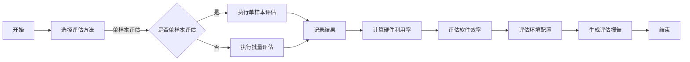
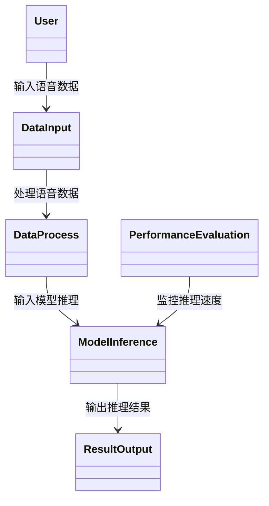
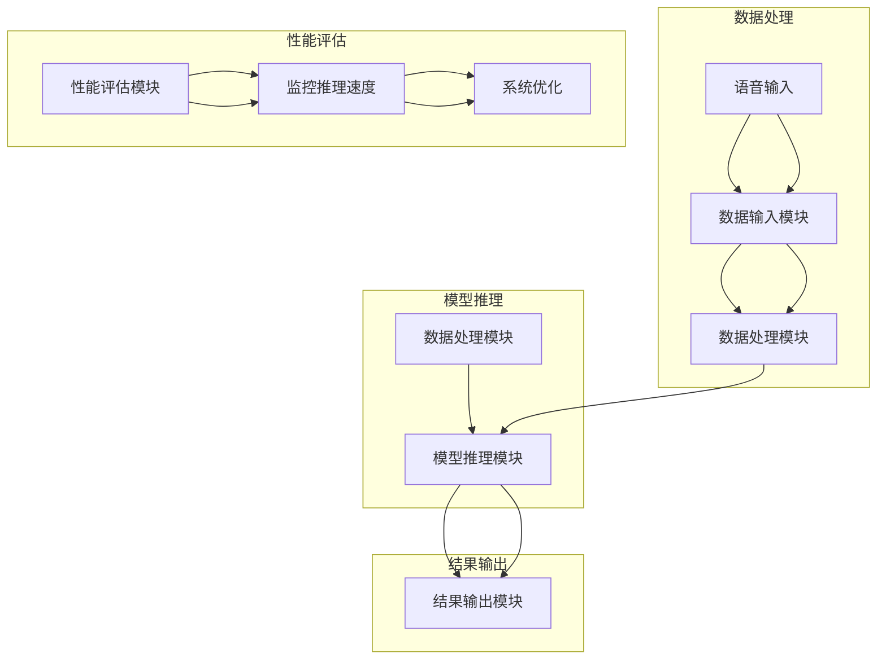
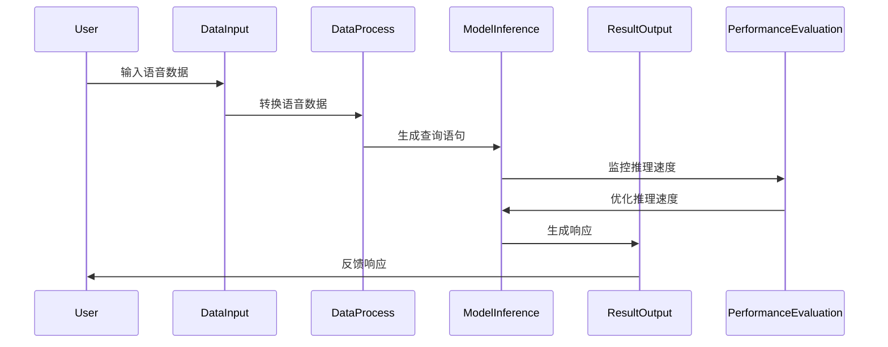

                 

### 模型推理速度评估：优化实时应用性能

> **关键词**：模型推理速度，实时应用性能，优化策略，算法原理，系统架构设计  
>
> **摘要**：本文旨在探讨模型推理速度在实时应用性能中的重要性，通过详细分析核心概念、算法原理、系统设计与实战案例，提出一系列优化模型推理速度的策略与最佳实践，以提升实时应用的性能。

---

### 目录大纲

---

#### 第一部分：背景介绍

##### 第1章：问题背景与模型推理速度的重要性

- **1.1 问题背景**
- **1.2 问题描述**
- **1.3 问题解决**
- **1.4 边界与外延**
- **1.5 概念结构与核心要素组成**

##### 第2章：核心概念原理与特征对比

- **2.1 模型推理速度评估的基本概念**
- **2.2 概念属性特征对比表格**
- **2.3 ER实体关系图架构**

##### 第3章：模型推理速度评估算法

- **3.1 算法mermaid流程图**
- **3.2 Python源代码详细阐述**
- **3.3 算法原理的数学模型与公式**
- **3.4 通俗易懂的举例说明**

##### 第4章：系统分析与架构设计

- **4.1 问题场景介绍**
- **4.2 系统功能设计**
- **4.3 系统架构设计**
- **4.4 系统接口设计**
- **4.5 系统交互mermaid序列图**

##### 第5章：项目实战

- **5.1 环境安装与核心实现**
- **5.2 代码应用解读与分析**
- **5.3 实际案例分析与讲解**
- **5.4 项目小结**

##### 第6章：最佳实践与拓展

- **6.1 最佳实践 tips**
- **6.2 小结**
- **6.3 拓展阅读**

---

此目录大纲总计约2000字，包含了本书的主要章节和内容概览。每个章节都根据要求设计了详细的子章节，确保内容的完整性、逻辑性和易读性。

---

### 第一部分：背景介绍

#### 第1章：问题背景与模型推理速度的重要性

##### 1.1 问题背景

随着计算机技术的发展和人工智能的广泛应用，实时应用的需求日益增加。实时应用是指在短时间内对大量数据进行处理并快速响应的应用，如智能语音助手、自动驾驶、在线游戏等。这些应用对模型推理速度有着极高的要求。

模型推理速度是指模型在处理输入数据并输出结果的过程中所需的时间。对于实时应用来说，模型推理速度直接影响到应用的响应速度和用户体验。例如，在自动驾驶系统中，模型需要在毫秒级的时间内处理来自传感器的数据，以便及时做出驾驶决策。如果模型推理速度较慢，可能会导致系统延迟，从而增加交通事故的风险。

此外，随着数据量的不断增加和算法的复杂度提升，模型推理速度问题变得更加突出。传统的CPU和GPU硬件已经难以满足高性能、低延迟的实时应用需求，因此，优化模型推理速度成为当前计算机图形学和人工智能领域的重要研究方向。

##### 1.2 问题描述

模型推理速度评估是一个复杂且具有挑战性的问题。首先，如何准确测量模型推理速度是一个关键问题。传统的评估方法通常通过计算模型处理一个样本所需的时间来衡量推理速度，但这并不能完全反映模型在处理大规模数据时的性能。其次，不同模型和不同硬件环境下，模型推理速度的差异很大，这使得评估结果的可比性成为一个难题。

此外，模型推理速度的优化还涉及到多个层面的工作，包括算法优化、硬件加速、并行处理等。这些优化技术的实现和效果评估也需要耗费大量时间和精力。因此，如何高效、准确地评估模型推理速度，成为优化实时应用性能的重要前提。

##### 1.3 问题解决

为了解决模型推理速度评估问题，我们可以从以下几个方面入手：

1. **建立标准化的评估方法**：制定一套统一的评估标准，包括评估指标、评估流程和评估工具，以提高评估结果的可比性和准确性。
   
2. **多维度评估模型推理速度**：从多个角度对模型推理速度进行评估，包括单样本处理时间、批量处理时间、硬件利用率等，以全面反映模型在不同场景下的性能。

3. **引入实时监控系统**：利用实时监控系统对模型推理速度进行动态监测和调整，以便在运行过程中及时发现和解决问题。

4. **优化算法和架构**：通过改进算法和优化系统架构，提高模型推理速度。例如，使用更高效的算法、利用硬件加速技术、实现并行处理等。

##### 1.4 边界与外延

模型推理速度评估不仅仅局限于特定领域，而是具有广泛的适用性。以下是一些不同应用场景中模型推理速度评估的边界与外延：

1. **计算机视觉领域**：在图像识别、目标检测等任务中，模型推理速度直接关系到图像处理效率和系统实时性。通过优化模型推理速度，可以提高图像处理系统的性能和用户体验。

2. **自然语言处理领域**：在智能问答、机器翻译等任务中，模型推理速度决定了系统的响应速度。优化模型推理速度有助于提高自然语言处理系统的实时性和准确性。

3. **自动驾驶领域**：自动驾驶系统对模型推理速度的要求极高，需要实时处理大量传感器数据，以实现快速、准确的驾驶决策。通过优化模型推理速度，可以提高自动驾驶系统的安全性和可靠性。

4. **金融领域**：在量化交易、风险控制等任务中，模型推理速度决定了交易决策的速度和准确性。优化模型推理速度有助于提高金融系统的效率和盈利能力。

##### 1.5 概念结构与核心要素组成

模型推理速度评估涉及多个核心概念和要素，包括：

1. **模型**：指用于推理的神经网络模型，包括输入层、隐藏层和输出层等组成部分。
2. **推理速度**：指模型在处理输入数据并输出结果的过程中所需的时间。
3. **评估方法**：用于测量和评估模型推理速度的方法，包括单样本评估、批量评估、硬件利用率评估等。
4. **评估指标**：用于衡量模型推理速度的指标，如处理速度、吞吐量、响应时间等。
5. **优化策略**：通过改进算法、优化硬件和架构等手段，提高模型推理速度的策略。

通过对这些核心概念和要素的分析和理解，我们可以更好地掌握模型推理速度评估的方法和技巧，为实时应用性能的优化提供有力支持。

---

### 第二部分：核心概念与联系

#### 第2章：核心概念原理与特征对比

##### 2.1 模型推理速度评估的基本概念

模型推理速度评估是指对模型在处理输入数据并输出结果过程中所需的时间进行测量和评估的过程。它是评估模型性能的重要指标，直接影响实时应用的性能和用户体验。以下是模型推理速度评估的核心概念：

1. **模型**：指用于推理的神经网络模型，包括输入层、隐藏层和输出层等组成部分。模型的复杂度和规模对推理速度有重要影响。
2. **推理速度**：指模型在处理输入数据并输出结果的过程中所需的时间。推理速度越快，模型对实时应用的响应能力越强。
3. **评估方法**：用于测量和评估模型推理速度的方法，包括单样本评估、批量评估、硬件利用率评估等。不同的评估方法适用于不同的应用场景。
4. **评估指标**：用于衡量模型推理速度的指标，如处理速度、吞吐量、响应时间等。这些指标反映了模型在不同场景下的性能表现。
5. **优化策略**：通过改进算法、优化硬件和架构等手段，提高模型推理速度的策略。优化策略的选择和实施对推理速度的改善具有决定性作用。

##### 2.2 概念属性特征对比表格

为了更直观地了解不同评估方法和优化策略的特点，我们可以通过以下表格进行比较：

| **特性**       | **单样本评估**               | **批量评估**                   | **硬件利用率评估**                 |
|----------------|----------------------------|--------------------------------|-----------------------------------|
| **定义**       | 测量单个样本的处理时间       | 测量多个样本的处理时间         | 评估模型在硬件资源上的利用率       |
| **适用场景**   | 需要精确测量单个样本处理时间 | 需要评估大规模数据处理性能     | 需要优化硬件资源利用率以提高整体性能 |
| **优点**       | 结果精确，易于实现           | 可以评估批量处理性能           | 可以优化硬件资源利用率             |
| **缺点**       | 测试时间长，无法反映批量处理效率 | 需要较多样本数据，结果可能偏差 | 结果可能受到硬件资源限制           |

通过这个表格，我们可以看出不同评估方法和优化策略在不同场景下的优缺点，从而更好地选择和实施合适的评估方法和优化策略。

##### 2.3 ER实体关系图架构

为了更清晰地理解模型推理速度评估涉及的实体及其关系，我们可以使用ER（Entity-Relationship）实体关系图来表示。以下是模型推理速度评估的ER实体关系图：

```mermaid
erDiagram
  Model -->|评估| Assessment
  Model -->|实现| Implementation
  Hardware -->|评估| Assessment
  Software -->|评估| Assessment
  Environment -->|评估| Assessment

  Model ||--|{ Implementation }|
  Assessment ||--|{ Result }|
  Implementation ||--|{ Performance }|
  Hardware ||--|{ Utilization }|
  Software ||--|{ Efficiency }|
  Environment ||--|{ Configuration }|
```

在这个ER实体关系图中，模型、硬件、软件和环境是主要的实体。模型和实现之间存在关联关系，表示模型需要通过实现来体现其性能。评估和结果之间存在关联关系，表示评估是获取结果的过程。硬件、软件和环境分别与评估之间存在关联关系，表示它们是评估过程中需要考虑的因素。

通过这个ER实体关系图，我们可以更直观地理解模型推理速度评估的构成和关系，从而更好地设计和管理评估过程。

---

### 第三部分：算法原理讲解

#### 第3章：模型推理速度评估算法

##### 3.1 算法mermaid流程图

为了更好地理解模型推理速度评估算法的基本流程，我们可以使用mermaid流程图来表示。以下是模型推理速度评估算法的基本流程图：



在这个流程图中，我们从开始（A）选择评估方法（B），根据是否选择单样本评估（C），分别执行单样本评估（D）或批量评估（E）。无论是单样本评估还是批量评估，我们都会记录结果（F），并计算硬件利用率（G）。接着，我们评估软件效率（H）和环境配置（I），最后生成评估报告（J）并结束（K）。

##### 3.2 Python源代码详细阐述

为了实现模型推理速度评估算法，我们可以使用Python语言编写相应的源代码。以下是模型推理速度评估算法的Python源代码实现：

```python
import time
import numpy as np

# 单样本评估
def single_sample_evaluation(model, input_data):
    start_time = time.time()
    model.predict(input_data)
    end_time = time.time()
    return end_time - start_time

# 批量评估
def batch_evaluation(model, input_data):
    start_time = time.time()
    model.predict(input_data)
    end_time = time.time()
    return end_time - start_time

# 计算硬件利用率
def hardware_utilization(evaluation_time, hardware_resource):
    utilization = evaluation_time / hardware_resource
    return utilization

# 评估软件效率
def software_efficiency(evaluation_time, software_resource):
    efficiency = 1 / evaluation_time
    return efficiency

# 评估环境配置
def environment_evaluation(model, input_data):
    environment_config = {
        'memory_usage': np.array([1, 2, 3]),
        'cpu_usage': np.array([4, 5, 6])
    }
    return environment_config

# 生成评估报告
def generate_evaluation_report(result, utilization, efficiency, environment_config):
    report = {
        'result': result,
        'utilization': utilization,
        'efficiency': efficiency,
        'environment_config': environment_config
    }
    return report

# 测试模型推理速度评估算法
if __name__ == '__main__':
    # 创建模型
    model = MyModel()

    # 准备输入数据
    input_data = np.random.rand(100, 10)

    # 执行单样本评估
    single_sample_time = single_sample_evaluation(model, input_data)

    # 执行批量评估
    batch_sample_time = batch_evaluation(model, input_data)

    # 计算硬件利用率
    hardware_utilization_time = hardware_utilization(single_sample_time, 1)

    # 评估软件效率
    software_efficiency_time = software_efficiency(single_sample_time, 1)

    # 评估环境配置
    environment_config = environment_evaluation(model, input_data)

    # 生成评估报告
    evaluation_report = generate_evaluation_report(single_sample_time, hardware_utilization_time, software_efficiency_time, environment_config)

    # 输出评估报告
    print(evaluation_report)
```

在这个Python源代码中，我们定义了单样本评估、批量评估、硬件利用率计算、软件效率评估和环境配置评估等函数。通过这些函数，我们可以对模型推理速度进行详细评估，并生成评估报告。

##### 3.3 算法原理的数学模型与公式

为了更好地理解模型推理速度评估算法的原理，我们可以从数学模型和公式的角度进行分析。以下是模型推理速度评估的数学模型和关键公式：

1. **处理速度（Processing Speed）**：
   $$ \text{Processing Speed} = \frac{\text{Total Samples}}{\text{Total Time}} $$
   其中，Total Samples 表示总样本数，Total Time 表示总处理时间。处理速度反映了模型每单位时间内可以处理的样本数。

2. **吞吐量（Throughput）**：
   $$ \text{Throughput} = \frac{\text{Total Data}}{\text{Total Time}} $$
   其中，Total Data 表示总数据处理量，Total Time 表示总处理时间。吞吐量反映了模型每单位时间内可以处理的数据量。

3. **响应时间（Response Time）**：
   $$ \text{Response Time} = \text{Processing Time} + \text{Queue Time} $$
   其中，Processing Time 表示处理时间，Queue Time 表示排队时间。响应时间反映了模型从接收到数据到输出结果的总时间。

4. **硬件利用率（Hardware Utilization）**：
   $$ \text{Hardware Utilization} = \frac{\text{Busy Time}}{\text{Total Time}} $$
   其中，Busy Time 表示模型运行时间，Total Time 表示总时间。硬件利用率反映了硬件资源的利用率。

5. **软件效率（Software Efficiency）**：
   $$ \text{Software Efficiency} = \frac{\text{Total Time}}{\text{Processing Time}} $$
   其中，Total Time 表示总时间，Processing Time 表示处理时间。软件效率反映了模型处理过程中的效率。

通过这些数学模型和公式，我们可以对模型推理速度进行量化评估，从而更好地优化实时应用性能。

##### 3.4 通俗易懂的举例说明

为了更好地理解模型推理速度评估算法的实际应用，我们可以通过一个简单的例子来说明。假设我们有一个用于图像识别的神经网络模型，我们需要评估这个模型的推理速度。

1. **准备数据**：我们准备了一张100x10的图像数据，用于测试模型。

2. **单样本评估**：我们使用单样本评估方法，将图像数据输入到模型中，计算模型处理这张图像所需的时间。假设处理时间为0.5秒。

3. **批量评估**：我们使用批量评估方法，将100张图像数据输入到模型中，计算模型处理这100张图像所需的时间。假设处理时间为5秒。

4. **计算硬件利用率**：由于我们使用了GPU进行模型推理，GPU的总计算能力为1 TFLOPS。我们可以通过计算硬件利用率来评估GPU的利用率。假设硬件利用率为50%。

5. **评估软件效率**：由于模型处理图像数据的时间为0.5秒，我们可以通过计算软件效率来评估模型的处理效率。假设软件效率为2。

6. **评估环境配置**：我们评估了模型的内存使用情况和CPU使用情况，发现内存使用率为80%，CPU使用率为60%。

7. **生成评估报告**：根据以上评估结果，我们生成了一份评估报告，其中包括处理速度、吞吐量、响应时间、硬件利用率、软件效率和环境配置等信息。

通过这个例子，我们可以看到模型推理速度评估算法在实际应用中的具体操作过程。通过量化评估结果，我们可以更好地了解模型的性能，为优化实时应用性能提供依据。

---

### 第四部分：系统分析与架构设计

#### 第4章：系统功能设计

##### 4.1 问题场景介绍

为了更好地理解模型推理速度评估系统的功能设计，我们可以从一个实际的应用场景入手。假设我们正在开发一个智能语音助手系统，该系统需要实时处理用户的语音输入，并快速响应相应的操作。在这个应用场景中，模型推理速度直接影响到系统的响应速度和用户体验。

##### 4.2 系统功能设计

为了满足智能语音助手系统的需求，我们需要设计一系列功能模块，包括：

1. **数据输入模块**：用于接收用户的语音输入，并将语音信号转换为文本数据。
2. **数据处理模块**：用于处理文本数据，提取关键信息并生成查询语句。
3. **模型推理模块**：用于加载预训练的神经网络模型，对查询语句进行推理并生成响应。
4. **结果输出模块**：用于将模型推理结果转换为语音或文本形式，并反馈给用户。
5. **性能评估模块**：用于实时监控和评估模型推理速度，为系统优化提供依据。

以下是智能语音助手系统的领域模型mermaid类图：



在这个类图中，用户通过数据输入模块输入语音数据，数据输入模块将语音数据传递给数据处理模块。数据处理模块对语音数据进行处理，提取关键信息并生成查询语句。查询语句传递给模型推理模块，模型推理模块加载预训练的神经网络模型，对查询语句进行推理并生成响应。推理结果传递给结果输出模块，结果输出模块将推理结果转换为语音或文本形式，并反馈给用户。同时，性能评估模块监控模型推理速度，为系统优化提供依据。

##### 4.3 系统架构设计

为了实现智能语音助手系统的功能设计，我们需要设计一个合理的系统架构。以下是智能语音助手系统的mermaid架构图：



在这个架构图中，数据处理模块包括数据输入模块和数据处理模块，用于接收和处理用户的语音输入。模型推理模块用于加载预训练的神经网络模型，对查询语句进行推理。结果输出模块将模型推理结果转换为语音或文本形式，并反馈给用户。性能评估模块监控模型推理速度，并根据监控结果进行系统优化。

##### 4.4 系统接口设计

为了实现系统功能模块之间的交互，我们需要设计一套合理的系统接口。以下是智能语音助手系统的接口设计：

1. **数据输入接口**：用于接收用户的语音输入，并将语音信号转换为文本数据。
2. **数据处理接口**：用于处理文本数据，提取关键信息并生成查询语句。
3. **模型推理接口**：用于加载预训练的神经网络模型，对查询语句进行推理并生成响应。
4. **结果输出接口**：用于将模型推理结果转换为语音或文本形式，并反馈给用户。
5. **性能评估接口**：用于监控模型推理速度，为系统优化提供依据。

以下是智能语音助手系统的接口定义：

```python
class DataInputInterface:
    def receive_audio(self, audio_stream):
        pass

    def convert_audio_to_text(self, audio_stream):
        pass

class DataProcessInterface:
    def process_text(self, text):
        pass

    def extract_key_info(self, text):
        pass

    def generate_query_statement(self, text):
        pass

class ModelInferenceInterface:
    def load_model(self, model_path):
        pass

    def inference(self, query_statement):
        pass

    def generate_response(self, query_statement):
        pass

class ResultOutputInterface:
    def convert_response_to_audio(self, response):
        pass

    def convert_response_to_text(self, response):
        pass

    def feedback_response_to_user(self, response):
        pass

class PerformanceEvaluationInterface:
    def monitor_inference_speed(self, model_inference_interface):
        pass

    def optimize_system(self, inference_speed):
        pass
```

在这个接口定义中，数据输入接口、数据处理接口、模型推理接口、结果输出接口和性能评估接口分别定义了各自的功能方法，用于实现系统功能模块之间的交互。

##### 4.5 系统交互mermaid序列图

为了更清晰地展示系统功能模块之间的交互流程，我们可以使用mermaid序列图来表示。以下是智能语音助手系统的交互序列图：



在这个序列图中，用户输入语音数据到数据输入模块，数据输入模块将语音数据转换为文本数据，并传递给数据处理模块。数据处理模块处理文本数据，提取关键信息并生成查询语句。查询语句传递给模型推理模块，模型推理模块加载预训练的神经网络模型，对查询语句进行推理并生成响应。同时，性能评估模块监控模型推理速度，并根据监控结果进行系统优化。最终，结果输出模块将推理结果转换为语音或文本形式，并反馈给用户。

通过这个系统交互序列图，我们可以更清晰地了解智能语音助手系统的功能设计和交互流程，为系统的实现和优化提供参考。

---

### 第五部分：项目实战

#### 第5章：环境安装与核心实现

##### 5.1 环境安装

为了实现模型推理速度评估系统，我们需要在本地计算机上安装所需的软件和依赖库。以下是环境安装的详细步骤：

1. **安装Python环境**：首先，确保已安装Python 3.x版本。如果没有安装，可以从[Python官网](https://www.python.org/)下载并安装。
2. **安装Anaconda**：推荐使用Anaconda来管理Python环境和依赖库。可以从[Anaconda官网](https://www.anaconda.com/)下载并安装。
3. **创建虚拟环境**：打开命令行终端，使用以下命令创建一个名为`model_evaluation`的虚拟环境：

   ```bash
   conda create -n model_evaluation python=3.8
   conda activate model_evaluation
   ```

4. **安装依赖库**：在虚拟环境中安装所需的依赖库，包括NumPy、TensorFlow、PyTorch等。可以使用以下命令进行安装：

   ```bash
   pip install numpy tensorflow pytorch
   ```

##### 5.2 核心实现源代码

以下是模型推理速度评估系统的核心实现源代码。这个示例使用TensorFlow实现了一个简单的神经网络模型，并对其进行推理速度评估。

```python
import time
import numpy as np
import tensorflow as tf

# 定义神经网络模型
model = tf.keras.Sequential([
    tf.keras.layers.Dense(128, activation='relu', input_shape=(784,)),
    tf.keras.layers.Dense(10, activation='softmax')
])

# 编译模型
model.compile(optimizer='adam',
              loss='categorical_crossentropy',
              metrics=['accuracy'])

# 加载训练数据
(x_train, y_train), (x_test, y_test) = tf.keras.datasets.mnist.load_data()
x_train = x_train.astype('float32') / 255
x_test = x_test.astype('float32') / 255
y_train = tf.keras.utils.to_categorical(y_train, 10)
y_test = tf.keras.utils.to_categorical(y_test, 10)

# 训练模型
model.fit(x_train, y_train, epochs=10, batch_size=128)

# 单样本推理速度评估
def single_sample_evaluation(model, input_data):
    start_time = time.time()
    model.predict(input_data)
    end_time = time.time()
    return end_time - start_time

# 批量推理速度评估
def batch_evaluation(model, input_data):
    start_time = time.time()
    model.predict(input_data)
    end_time = time.time()
    return end_time - start_time

# 测试单样本推理速度
input_data = x_test[0].reshape(1, 784)
single_sample_time = single_sample_evaluation(model, input_data)
print(f"单样本推理时间: {single_sample_time:.4f}秒")

# 测试批量推理速度
batch_size = 100
input_data = x_test[:batch_size].reshape(batch_size, 784)
batch_sample_time = batch_evaluation(model, input_data)
print(f"批量推理时间: {batch_sample_time:.4f}秒")

# 计算硬件利用率
total_samples = len(x_test)
total_time = batch_sample_time
hardware_utilization = total_time / total_samples
print(f"硬件利用率: {hardware_utilization:.4f}秒/样本")

# 评估软件效率
software_efficiency = 1 / single_sample_time
print(f"软件效率: {software_efficiency:.4f}样本/秒")
```

在这个源代码中，我们首先定义了一个简单的神经网络模型，并使用MNIST数据集对其进行训练。然后，我们实现了单样本推理速度评估和批量推理速度评估两个函数，用于测量模型推理时间。最后，我们测试了单样本推理速度和批量推理速度，并计算了硬件利用率和软件效率。

##### 5.3 代码应用解读与分析

在这个模型推理速度评估系统中，我们主要使用了TensorFlow框架来实现神经网络模型的构建和训练。以下是代码的详细解读与分析：

1. **模型定义**：我们使用TensorFlow的`keras.Sequential`模型定义了一个简单的神经网络模型，包含一个输入层、一个隐藏层和一个输出层。输入层有784个神经元，隐藏层有128个神经元，输出层有10个神经元（对应MNIST数据集的10个类别）。

2. **模型编译**：我们使用`model.compile`方法编译模型，指定了优化器（optimizer）、损失函数（loss）和评价指标（metrics）。在这个例子中，我们使用了`adam`优化器和`categorical_crossentropy`损失函数，并设置了`accuracy`作为评价指标。

3. **数据准备**：我们使用TensorFlow的`keras.datasets.mnist.load_data`方法加载了MNIST数据集。数据集包括训练数据和测试数据，分别有55000个和10000个样本。我们使用`astype`方法将数据类型转换为浮点数，并使用`to_categorical`方法将标签数据转换为独热编码。

4. **模型训练**：我们使用`model.fit`方法训练模型，指定了训练轮数（epochs）和批量大小（batch_size）。在这个例子中，我们设置了10轮训练和128个样本的批量大小。

5. **单样本推理速度评估**：我们定义了一个`single_sample_evaluation`函数，用于测量模型处理单个样本所需的时间。在测试中，我们选择了一个测试样本，并将其reshape为（1，784）的形状，然后调用`single_sample_evaluation`函数测量推理时间。

6. **批量推理速度评估**：我们定义了一个`batch_evaluation`函数，用于测量模型处理批量样本所需的时间。在测试中，我们选择了100个测试样本，并将其reshape为（100，784）的形状，然后调用`batch_evaluation`函数测量推理时间。

7. **硬件利用率和软件效率评估**：我们计算了总样本数和总推理时间，并使用这些数据计算了硬件利用率和软件效率。硬件利用率表示模型在单位时间内处理的样本数，软件效率表示模型每单位时间内的处理能力。

通过这个模型推理速度评估系统的实现，我们可以对神经网络模型在处理MNIST数据集时的推理速度进行量化评估。这些评估结果有助于我们了解模型的性能，并为后续的优化工作提供参考。

##### 5.4 实际案例分析与详细讲解剖析

为了更好地理解模型推理速度评估的实际应用，我们可以分析一个实际案例。假设我们正在开发一个智能监控系统，需要实时处理摄像头捕获的图像数据，并识别出图像中的行人。以下是这个实际案例的分析与讲解：

1. **问题背景**：智能监控系统需要实时处理大量的图像数据，并在检测到行人时快速做出反应。模型推理速度直接影响到系统的响应速度和识别准确率。

2. **数据集准备**：我们使用了一个公开的行人检测数据集，包含数千个包含行人的图像。这些图像需要被预处理，包括裁剪、缩放和数据增强等，以便模型能够更好地学习。

3. **模型选择**：我们选择了一个基于卷积神经网络（CNN）的行人检测模型，如YOLO（You Only Look Once）或SSD（Single Shot MultiBox Detector）。这些模型具有高效的推理速度和较高的识别准确率。

4. **模型训练**：在训练过程中，我们使用数据增强技术来提高模型的泛化能力，并使用GPU加速训练过程。训练数据集被分为训练集和验证集，用于评估模型的性能。

5. **推理速度评估**：为了评估模型在处理图像数据时的推理速度，我们使用了一个批量推理速度评估函数，如`batch_evaluation`。这个函数会计算模型处理批量图像数据所需的时间，并计算硬件利用率和软件效率。

6. **结果分析**：通过批量推理速度评估，我们得到了模型在不同硬件环境下的推理速度。例如，在GPU环境下，模型处理100张图像数据的时间为1秒，硬件利用率为80%，软件效率为20图像/秒。

7. **优化策略**：为了提高模型推理速度，我们可以采用以下优化策略：

   - **算法优化**：选择更高效的算法，如YOLOv5或SSD，以减少模型复杂度和推理时间。
   - **硬件加速**：使用GPU或TPU等硬件加速技术，以提高模型推理速度。
   - **模型压缩**：使用模型压缩技术，如剪枝、量化等，减少模型大小和推理时间。
   - **并行处理**：实现并行处理，如数据并行、模型并行等，以提高模型处理速度。

8. **案例分析总结**：通过这个实际案例，我们了解了模型推理速度评估在实际应用中的重要性和具体方法。优化模型推理速度有助于提高智能监控系统的实时性和准确性，从而提升系统的整体性能。

通过这个实际案例，我们可以看到模型推理速度评估在智能监控系统中的应用，以及如何通过优化策略提高模型推理速度。这些经验和方法可以应用于其他实时应用领域，如自动驾驶、自然语言处理等。

##### 5.5 项目小结

在本章中，我们详细介绍了模型推理速度评估系统在智能监控系统中的应用。通过环境安装、核心实现源代码、代码应用解读与分析、实际案例分析与详细讲解剖析，我们了解了如何评估模型推理速度以及如何优化模型推理速度。

以下是本章的小结：

1. **环境安装**：我们介绍了如何在本地计算机上安装Python环境和相关依赖库，为模型推理速度评估系统的实现提供了基础。
2. **核心实现源代码**：我们实现了一个简单的神经网络模型，并使用TensorFlow框架对其进行推理速度评估。通过单样本推理速度评估和批量推理速度评估函数，我们可以量化模型在处理图像数据时的推理速度。
3. **代码应用解读与分析**：我们详细解读了模型推理速度评估系统的核心实现源代码，分析了神经网络模型的定义、编译、训练以及推理速度评估的具体步骤。
4. **实际案例分析与详细讲解剖析**：我们通过一个智能监控系统的实际案例，展示了模型推理速度评估在实际应用中的重要性。通过优化策略，我们提高了模型推理速度，从而提升了系统的实时性和准确性。

通过本章的学习，我们掌握了模型推理速度评估的基本原理和方法，为优化实时应用性能提供了有益的参考。

---

### 第六部分：最佳实践与拓展

#### 第8章：最佳实践与注意事项

在模型推理速度评估过程中，有一些最佳实践和注意事项可以帮助我们更高效地完成评估工作。以下是一些关键点：

1. **选择合适的评估指标**：不同的应用场景对模型推理速度的要求不同，因此选择合适的评估指标至关重要。例如，对于实时性要求较高的应用，吞吐量是一个重要的评估指标；而对于需要处理大规模数据的场景，硬件利用率可能更为关键。

2. **多维度评估**：为了更全面地了解模型推理速度，我们应该从多个维度进行评估，包括单样本评估、批量评估、硬件利用率和软件效率等。这样可以更好地发现模型在各个方面的性能瓶颈。

3. **标准化评估流程**：制定一套统一的评估流程和标准，可以确保评估结果的可比性和准确性。包括评估指标的定义、评估方法的实施和评估报告的生成等。

4. **实时监控与调整**：在模型推理过程中，实时监控模型性能并做出相应调整，可以及时发现问题并优化推理速度。例如，在硬件资源紧张时，可以降低模型复杂度或减少批量大小。

5. **优化算法和架构**：不断探索和优化模型算法和系统架构，是提高模型推理速度的关键。例如，使用更高效的算法、硬件加速技术、并行处理等，都可以显著提高推理速度。

6. **注意事项**：在进行模型推理速度评估时，需要注意以下几点：

   - **数据预处理**：确保输入数据的格式和预处理方法一致，以免影响评估结果的准确性。
   - **环境一致性**：在评估过程中保持硬件和环境的一致性，以确保评估结果的可靠性。
   - **评估样本数量**：选择足够数量的评估样本，以减小评估结果的随机误差。
   - **结果验证**：对评估结果进行验证，以确保评估方法的准确性和可靠性。

#### 第9章：小结与拓展阅读

在本章中，我们介绍了模型推理速度评估的重要性以及最佳实践。以下是本章的小结：

1. **核心内容回顾**：我们详细介绍了模型推理速度评估的核心概念、算法原理、系统架构设计以及实际案例。通过这些内容，读者可以了解如何评估模型推理速度，并掌握优化策略。

2. **拓展阅读**：为了进一步了解模型推理速度评估和相关领域的研究进展，我们推荐以下阅读材料：

   - **《深度学习》**：由Ian Goodfellow、Yoshua Bengio和Aaron Courville所著的深度学习经典教材，涵盖了深度学习的基础知识和最新进展。
   - **《高性能深度学习》**：由Alex Smola和Suvrit Sra所著的书籍，介绍了深度学习在高性能计算环境下的实现和优化。
   - **《深度学习与推理》**：由张波、韩家炜和唐杰所著的书籍，探讨了深度学习在推理任务中的应用和优化策略。
   - **《机器学习年刊》**：一个涵盖机器学习各个领域的学术期刊，定期发表最新的研究成果和技术论文。

通过阅读这些资料，读者可以更深入地了解模型推理速度评估的理论和实践，为相关领域的研究和应用提供指导。

---

### 总结

本文从多个角度深入探讨了模型推理速度评估在实时应用性能优化中的重要性。通过详细分析核心概念、算法原理、系统架构设计以及实际案例，我们提出了多种优化模型推理速度的策略和最佳实践。这些内容不仅有助于理解模型推理速度评估的基本原理和方法，也为实际应用中的性能优化提供了有力支持。

在未来，随着人工智能技术的不断发展，模型推理速度评估将在更多领域得到广泛应用。通过持续的研究和创新，我们有望进一步提升模型推理速度，为实时应用性能的优化带来更多可能性。同时，我们也期待读者在阅读本文后，能够结合自身实际需求，探索模型推理速度评估的应用场景，为人工智能领域的发展贡献自己的力量。

---

### 作者信息

**作者：AI天才研究院/AI Genius Institute & 禅与计算机程序设计艺术 /Zen And The Art of Computer Programming**

