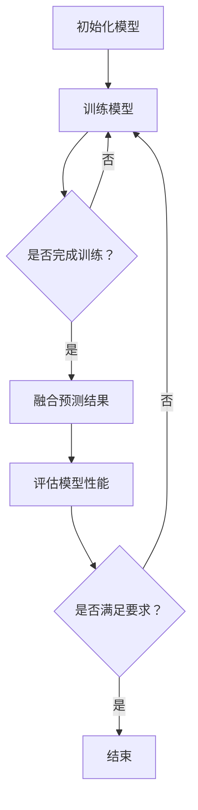
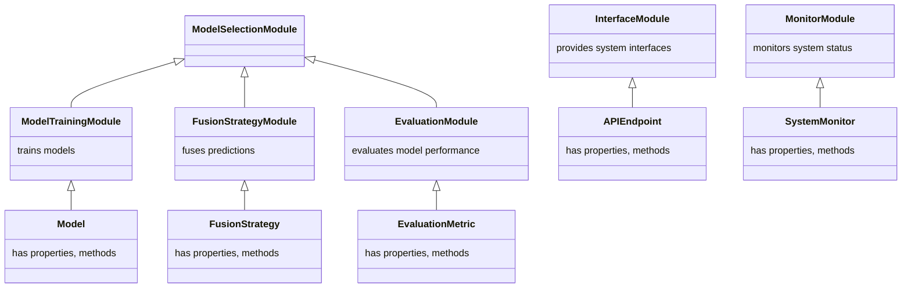
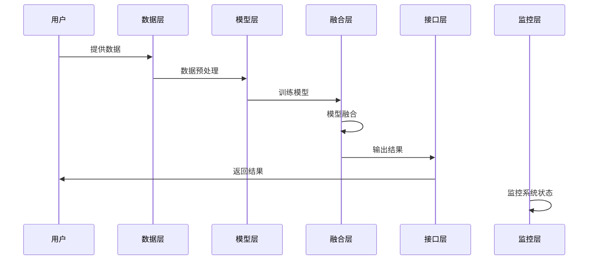
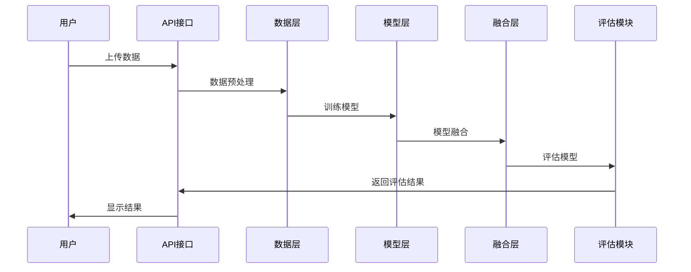

                 

### 第一部分：引言

#### 第1章：引言

##### 1.1 问题背景

在人工智能（AI）的快速发展过程中，模型融合（Model Fusion）逐渐成为提升AI性能的重要手段。当前，随着大数据和计算能力的提升，越来越多的复杂任务需要使用AI模型来完成。然而，单一模型往往在特定任务上存在局限性，难以兼顾各种需求和场景。例如，在图像识别任务中，卷积神经网络（CNN）表现优异，但在自然语言处理（NLP）任务中，循环神经网络（RNN）或 Transformer 模型可能更加合适。单一模型的局限性使得在实际应用中，如何高效集成多个模型以提升整体性能成为了一个亟待解决的问题。

##### 1.1.1 AI的发展与挑战

人工智能自20世纪50年代诞生以来，经历了多个发展阶段。从早期的规则系统，到基于符号推理的专家系统，再到近年来迅猛发展的深度学习，AI在各个领域都取得了显著的进展。然而，随着AI应用的深入，一些挑战也逐渐显现出来。首先，AI模型的复杂性不断增加，训练和推理过程需要大量数据和计算资源。其次，单一模型在面对复杂问题时，往往无法兼顾精度和效率。此外，AI模型的透明度和可解释性也是一个重要的挑战。

##### 1.1.2 模型融合的概念

模型融合，顾名思义，是指将多个模型集成在一起，通过特定的方法进行训练和推理，以期在整体性能上超越单一模型。模型融合可以分为两大类：一是基于模型的融合，即将多个模型训练结果进行加权或投票，得到最终的输出；二是基于数据的融合，即通过数据预处理、特征工程等方法，使得不同模型能够更好地处理同一数据集。

##### 1.1.3 模型融合的重要性

模型融合的重要性体现在以下几个方面：

1. **提高性能**：通过模型融合，可以在保持或提高模型精度的同时，降低计算复杂度，提高模型在复杂任务上的整体性能。
2. **增强鲁棒性**：不同模型可能在特定任务上有不同的优势，模型融合可以降低模型对特定数据的依赖，提高模型的鲁棒性。
3. **提升泛化能力**：模型融合能够整合不同模型的优势，使得模型在处理未见过的数据时，能够更好地适应和应对，从而提高模型的泛化能力。
4. **适应多样化需求**：在现实应用中，不同的任务可能需要不同类型的模型，模型融合可以灵活地组合不同模型，满足多样化的需求。

##### 1.2 问题描述

尽管模型融合具有诸多优势，但在实际应用中仍面临一些挑战。首先，模型融合的方法和策略众多，如何选择合适的融合方法是一个关键问题。其次，模型融合过程中，不同模型之间的协调和优化也是一个难点。此外，模型融合还需要考虑计算资源、数据质量和时间成本等因素。

##### 1.2.1 当前AI模型的局限性

当前AI模型主要存在以下局限性：

1. **模型依赖性**：许多模型在特定任务上表现优异，但在其他任务上可能表现不佳，无法适应多样化需求。
2. **计算资源消耗**：大规模模型训练和推理需要大量计算资源和时间，难以满足实时性要求。
3. **数据要求高**：某些模型对数据质量要求较高，数据缺失或不平衡可能会影响模型性能。
4. **透明度和可解释性差**：深度学习等复杂模型往往缺乏透明度和可解释性，难以理解模型的决策过程。

##### 1.2.2 模型融合的目标

模型融合的目标是充分发挥不同模型的优势，克服单一模型的局限性，实现以下目标：

1. **提高模型性能**：通过融合不同模型，提高模型在特定任务上的精度和效率。
2. **增强鲁棒性**：降低模型对特定数据和场景的依赖，提高模型的泛化能力。
3. **降低计算复杂度**：通过优化模型融合策略，降低模型训练和推理的计算资源消耗。
4. **提高模型可解释性**：通过融合多种模型，提高模型的透明度和可解释性，便于理解和优化。

##### 1.2.3 模型融合的应用场景

模型融合在多个领域都有广泛的应用，以下是一些典型的应用场景：

1. **图像识别与分类**：通过融合CNN、RNN等模型，提高图像识别和分类的精度和效率。
2. **自然语言处理**：在文本分类、情感分析等任务中，融合Transformer、RNN等模型，提升模型的表现。
3. **推荐系统**：通过融合基于内容的推荐、协同过滤等模型，提高推荐系统的准确性和多样性。
4. **医学诊断**：融合多种医学影像分析模型，提高疾病的诊断准确率和效率。
5. **自动驾驶**：通过融合视觉、激光雷达、GPS等传感器数据，提高自动驾驶系统的鲁棒性和安全性。

##### 1.3 问题解决

为了解决上述问题，模型融合提供了一种有效的途径。通过融合多个模型，可以克服单一模型的局限性，提高整体性能。以下是模型融合的几个关键步骤：

1. **选择合适的模型**：根据任务需求和模型特性，选择适合的模型进行融合。
2. **设计融合策略**：选择合适的融合方法，如加权平均、投票机制等，设计模型融合策略。
3. **数据预处理和特征工程**：对数据进行预处理和特征工程，确保不同模型能够更好地处理同一数据集。
4. **训练和优化**：通过训练和优化，调整模型参数，提高融合模型的性能。
5. **评估和调整**：对融合模型进行评估，根据评估结果进行必要调整，以提升模型性能。

##### 1.4 边界与外延

尽管模型融合具有广泛的应用前景，但其在实际应用中仍存在一些边界和限制。首先，模型融合方法的选择和设计需要充分考虑任务特点和模型特性，否则可能导致性能下降。其次，模型融合过程中的计算复杂度较高，可能不适合实时性要求较高的应用。此外，模型融合需要大量数据和计算资源，对于资源有限的场景，可能难以实现。

##### 1.4.1 模型融合的适用范围

模型融合适用于以下场景：

1. **需要处理多样化任务的系统**：通过融合不同模型，可以满足多样化的需求。
2. **数据质量和数量有限的应用**：通过融合多个模型，可以提高模型对少量数据的适应性。
3. **需要提高模型鲁棒性和泛化能力**：通过融合多个模型，可以降低模型对特定数据和场景的依赖。

##### 1.4.2 模型融合的限制因素

模型融合的限制因素包括：

1. **计算资源**：模型融合通常需要大量计算资源和时间，可能不适合实时性要求较高的应用。
2. **数据质量**：数据质量对模型融合的效果有很大影响，数据缺失或不平衡可能导致性能下降。
3. **模型选择和设计**：选择和设计合适的模型融合策略是关键，否则可能导致性能下降。

##### 1.4.3 模型融合的未来发展趋势

随着AI技术的不断发展和计算资源的提升，模型融合有望在以下几个方面取得进展：

1. **算法优化**：研究更加高效和灵活的模型融合算法，降低计算复杂度。
2. **自动化融合**：开发自动化工具，根据任务特点和模型特性，自动选择和设计融合策略。
3. **增强可解释性**：提高模型融合的可解释性，便于理解和优化。
4. **跨领域应用**：探索模型融合在更多领域的应用，如医疗、金融、教育等。

##### 1.5 本章小结

本章介绍了模型融合的背景、重要性以及应用场景，分析了当前AI模型的局限性，并提出了模型融合的目标和解决方案。通过对模型融合的概念、方法和策略进行详细阐述，为后续章节的深入探讨奠定了基础。

-------------------------------------------------------------------

## 第2章：核心概念与联系

#### 2.1 AI模型的基本原理

在探讨模型融合之前，我们需要了解一些基本概念，包括机器学习、深度学习和强化学习的基本原理。

##### 2.1.1 机器学习基础

机器学习是人工智能的一个重要分支，它通过算法从数据中学习规律，并利用这些规律进行预测或决策。机器学习主要包括监督学习、无监督学习和半监督学习。

- **监督学习**：监督学习是指有标记数据的训练过程。输入数据为特征向量，输出数据为标签，学习目标是找到特征和标签之间的映射关系。常见的监督学习算法包括线性回归、逻辑回归、支持向量机（SVM）、决策树、随机森林等。
  
- **无监督学习**：无监督学习是指没有标记数据的训练过程。学习目标是发现数据中的结构和模式，常见的算法包括聚类算法（如K-Means、层次聚类）、降维算法（如PCA、t-SNE）等。

- **半监督学习**：半监督学习是指有部分标记数据的训练过程。它可以利用未标记的数据，提高模型的泛化能力。常见的算法包括自我训练、伪标签等。

##### 2.1.2 深度学习基础

深度学习是机器学习的一个子领域，它使用多层神经网络来提取数据中的特征，以实现复杂的预测和分类任务。深度学习在图像识别、自然语言处理、语音识别等领域取得了显著的成功。

- **深度神经网络（DNN）**：深度神经网络是包含多个隐藏层的神经网络，能够学习更加复杂的特征表示。

- **卷积神经网络（CNN）**：卷积神经网络是一种特别适用于图像识别和处理的神经网络，通过卷积操作和池化操作，可以有效降低计算复杂度并提取图像特征。

- **循环神经网络（RNN）**：循环神经网络是一种适用于序列数据处理的神经网络，通过循环结构，可以保持长期依赖关系。

- **Transformer模型**：Transformer模型是一种基于自注意力机制的深度学习模型，特别适用于自然语言处理任务，如机器翻译、文本分类等。

##### 2.1.3 强化学习基础

强化学习是一种通过试错法学习最优策略的机器学习范式。强化学习通常由一个智能体、环境、状态、动作和奖励五个部分组成。

- **智能体**：智能体是指学习过程中的决策者，它根据当前状态选择动作，并根据动作的结果获取奖励。

- **环境**：环境是智能体所处的环境，它会根据智能体的动作产生新的状态。

- **状态、动作和奖励**：状态是指智能体当前所处的环境状态，动作是指智能体可以执行的行为，奖励是指智能体执行动作后获得的即时反馈。

强化学习通过不断试错，学习最优策略，以最大化长期奖励。常见的强化学习算法包括Q学习、SARSA、DQN等。

#### 2.2 模型融合的概念框架

模型融合（Model Fusion）是指将多个模型集成在一起，通过特定的方法进行训练和推理，以期在整体性能上超越单一模型。模型融合可以分为基于模型的融合和基于数据的融合。

##### 2.2.1 模型融合的类型

- **基于模型的融合**：基于模型的融合是指通过组合多个模型，得到最终的预测结果。常见的融合方法包括：

  - **加权平均**：将多个模型的预测结果进行加权平均，得到最终的预测结果。
  - **投票机制**：对于分类任务，将多个模型预测结果的投票结果作为最终的预测结果。
  - **集成学习**：通过训练多个不同的模型，并使用它们的预测结果进行集成，常见的集成学习方法包括Bagging、Boosting等。

- **基于数据的融合**：基于数据的融合是指通过预处理和特征工程，使得不同模型能够更好地处理同一数据集。常见的方法包括：

  - **数据预处理**：对输入数据进行标准化、去噪等处理，使得不同模型能够更好地处理数据。
  - **特征工程**：通过构建新的特征，使得不同模型能够提取到更多的信息。

##### 2.2.2 模型融合的优势与挑战

模型融合的优势包括：

- **提高性能**：通过融合多个模型，可以充分利用每个模型的优势，提高整体性能。
- **增强鲁棒性**：不同模型可能在特定任务上有不同的优势，模型融合可以降低模型对特定数据和场景的依赖，提高模型的鲁棒性。
- **提升泛化能力**：模型融合可以整合多个模型的优势，提高模型在未见过的数据上的表现，从而提升泛化能力。

模型融合的挑战包括：

- **计算复杂度**：模型融合通常需要大量的计算资源，尤其是在训练和推理过程中。
- **模型选择和设计**：选择和设计合适的模型融合策略是关键，否则可能导致性能下降。
- **数据质量和数量**：模型融合需要高质量和大量的数据，数据缺失或不平衡可能会影响模型融合的效果。

##### 2.2.3 模型融合的适用场景

模型融合适用于以下场景：

- **多样化任务**：需要处理多种不同类型任务的系统，可以通过模型融合来满足多样化需求。
- **数据质量和数量有限**：当数据质量和数量有限时，通过模型融合可以提高模型的泛化能力。
- **需要提高模型鲁棒性和泛化能力**：当模型在特定数据和场景上表现不佳时，通过模型融合可以降低模型的依赖性，提高鲁棒性和泛化能力。

#### 2.3 AI模型属性特征对比表格

为了更好地理解不同模型的特点和适用场景，以下是一个对比表格，列出了机器学习、深度学习和强化学习的部分属性特征：

| 模型类型 | 特点 | 适用场景 |
| --- | --- | --- |
| 机器学习 | 有标记数据训练 | 图像识别、文本分类、回归任务 |
| 深度学习 | 大量数据、多层神经网络 | 图像识别、自然语言处理、语音识别 |
| 强化学习 | 试错法、奖励机制 | 自动驾驶、游戏AI、机器人控制 |

#### 2.4 模型融合的ER实体关系图架构

实体关系图（Entity-Relationship Diagram，ER图）是一种用于表示实体及其之间关系的数据库设计工具。在模型融合中，ER图可以帮助我们理解不同模型之间的关联和作用。

以下是一个简单的ER实体关系图，展示了机器学习、深度学习和强化学习三个实体及其之间的关联：

```mermaid
erDiagram
  MachineLearning ||--|{ DeepLearning } DeepLearning
  MachineLearning ||--|{ ReinforcementLearning } ReinforcementLearning
  DeepLearning ||--|{ CNN } CNN
  DeepLearning ||--|{ RNN } RNN
  DeepLearning ||--|{ Transformer } Transformer
  ReinforcementLearning ||--|{ QLearning } QLearning
  ReinforcementLearning ||--|{ SARSA } SARSA
```

在这个ER图中，`MachineLearning` 是一个实体，它关联了 `DeepLearning` 和 `ReinforcementLearning` 两个实体。`DeepLearning` 又关联了 `CNN`、`RNN` 和 `Transformer` 三个实体，而 `ReinforcementLearning` 关联了 `QLearning` 和 `SARSA` 两个实体。这种关系表示了不同模型之间的继承和关联，为模型融合提供了基础。

通过上述分析，我们可以看到，AI模型融合是一个复杂但具有重要价值的过程。在接下来的章节中，我们将深入探讨模型融合的算法原理、实现方法和实际应用，以期为AI模型的性能提升提供新的思路和方法。

-------------------------------------------------------------------

## 第3章：算法原理讲解

#### 3.1 模型融合算法基础

模型融合算法是指将多个模型集成在一起，通过特定的策略进行训练和推理，以提升整体性能。模型融合算法可以分为基于模型的融合和基于数据的融合两大类。在本节中，我们将首先介绍模型融合算法的基本概念和分类。

##### 3.1.1 算法概述

模型融合算法的基本思想是通过组合多个模型的预测结果，得到更加准确和可靠的预测。具体来说，模型融合可以分为以下几个步骤：

1. **选择模型**：根据任务需求和数据特点，选择适合的模型进行融合。常见的模型包括机器学习模型、深度学习模型和强化学习模型。

2. **训练模型**：对每个模型进行单独训练，得到各自的预测结果。

3. **融合策略**：通过特定的策略，将多个模型的预测结果进行融合，得到最终的预测结果。

4. **评估和优化**：对融合模型进行评估，并根据评估结果进行优化，以提高模型性能。

##### 3.1.2 算法分类

模型融合算法可以根据融合策略的不同，分为以下几类：

1. **加权平均**：将多个模型的预测结果进行加权平均，得到最终的预测结果。这种方法简单直观，但在某些情况下可能导致精度下降。

2. **投票机制**：对于分类任务，将多个模型的预测结果进行投票，得到最终的预测结果。这种方法适用于分类问题，但可能导致模型之间的信息冗余。

3. **集成学习**：集成学习是通过训练多个不同的模型，并使用它们的预测结果进行集成。常见的集成学习方法包括Bagging、Boosting等。这种方法能够有效提高模型性能，但需要大量的计算资源。

4. **深度神经网络融合**：通过构建深度神经网络，将多个模型的预测结果作为输入，进行融合。这种方法能够充分利用每个模型的优势，但需要复杂的网络结构和大量训练数据。

##### 3.1.3 算法目标

模型融合算法的主要目标包括：

1. **提高模型性能**：通过融合多个模型，提高模型在特定任务上的精度和效率。

2. **增强鲁棒性**：降低模型对特定数据和场景的依赖，提高模型的泛化能力。

3. **降低计算复杂度**：通过优化模型融合策略，降低模型训练和推理的计算资源消耗。

4. **提高模型可解释性**：通过融合多种模型，提高模型的透明度和可解释性，便于理解和优化。

#### 3.2 算法流程图

为了更好地理解模型融合算法的工作流程，我们可以使用Mermaid绘制一个简单的算法流程图。以下是一个简单的示例：



在这个流程图中，首先初始化模型（A），然后对每个模型进行训练（B）。当训练完成时，进入融合预测结果的步骤（D），将多个模型的预测结果进行融合。接下来，评估模型性能（E），并判断是否满足要求（F）。如果满足要求，结束算法；否则，继续进行训练和优化（B）。

#### 3.2.1 Mermaid流程图绘制

使用Mermaid绘制流程图非常简单，只需按照Mermaid的语法规则进行编写。以下是一个具体的示例，展示了如何绘制上述算法流程图：


在这个示例中，我们使用了几个Mermaid关键词，如`graph`、`node`、`arrow`等，来定义流程图的各个部分和连接关系。

#### 3.2.2 算法具体步骤解释

在了解了算法流程图的基础上，我们可以进一步解释每个步骤的具体含义。

1. **初始化模型**：在模型融合算法开始时，需要初始化多个模型。这些模型可以是机器学习模型、深度学习模型或强化学习模型，具体选择取决于任务需求和数据特点。

2. **训练模型**：对每个模型进行单独训练，以得到各自的预测结果。训练过程中，需要根据数据特点和模型特性，选择合适的训练策略和参数设置。例如，对于深度学习模型，可能需要调整学习率、批量大小等参数。

3. **是否完成训练**：在训练过程中，需要判断是否完成训练。如果所有模型都完成训练，则进入下一步；否则，继续训练。

4. **融合预测结果**：将多个模型的预测结果进行融合，得到最终的预测结果。融合策略可以是加权平均、投票机制、集成学习等。具体选择取决于任务需求和模型特性。

5. **评估模型性能**：对融合模型进行评估，以判断其性能是否满足要求。评估指标可以是准确率、召回率、F1分数等。如果满足要求，则算法结束；否则，继续进行训练和优化。

6. **结束算法**：如果评估结果显示模型性能满足要求，则算法结束。否则，根据评估结果对模型进行优化，以提高模型性能。

通过上述步骤，我们可以实现一个简单的模型融合算法。在实际应用中，根据具体任务和数据特点，可以进一步优化和改进算法，以实现更好的性能。

#### 3.3 数学模型与公式

模型融合算法不仅需要具体的实现步骤，还需要理论支持。在本节中，我们将介绍一些常用的数学模型和公式，以帮助理解模型融合的原理。

##### 3.3.1 基本数学模型

在模型融合中，常用的基本数学模型包括概率模型、决策树模型和神经网络模型。

1. **概率模型**：概率模型用于表示数据的概率分布。在模型融合中，可以使用贝叶斯定理、最大似然估计等方法来估计模型参数。

   $$ P(A|B) = \frac{P(B|A)P(A)}{P(B)} $$

   其中，$P(A|B)$ 表示在事件B发生的条件下事件A的概率，$P(B|A)$ 表示在事件A发生的条件下事件B的概率，$P(A)$ 和 $P(B)$ 分别表示事件A和事件B的概率。

2. **决策树模型**：决策树模型通过一系列条件判断，将数据分为不同的类别或值。在模型融合中，可以使用决策树模型进行特征选择和分类。

   $$ Y = g(\theta_0 + \sum_{i=1}^{n}\theta_iX_i) $$

   其中，$Y$ 表示输出变量，$g$ 表示激活函数，$\theta_i$ 表示模型的参数，$X_i$ 表示输入特征。

3. **神经网络模型**：神经网络模型通过多层非线性变换，将输入映射到输出。在模型融合中，可以使用神经网络模型进行特征提取和分类。

   $$ a_{i}^{(l)} = \sigma(z_{i}^{(l)}) = \frac{1}{1 + e^{-z_{i}^{(l)}} $$

   其中，$a_{i}^{(l)}$ 表示第$l$层的第$i$个节点的激活值，$z_{i}^{(l)}$ 表示第$l$层的第$i$个节点的输入值，$\sigma$ 表示sigmoid函数。

##### 3.3.2 公式推导

在模型融合中，常用的公式推导包括概率公式推导、优化公式推导和损失函数公式推导。

1. **概率公式推导**：

   假设有两个随机变量$X$和$Y$，它们的联合概率分布为$P(X, Y)$，条件概率分布为$P(Y|X)$和$P(X|Y)$。根据全概率公式和贝叶斯定理，可以得到以下推导：

   $$ P(Y) = \sum_{X} P(X, Y) $$
   
   $$ P(X|Y) = \frac{P(Y|X)P(X)}{P(Y)} $$
   
   $$ P(Y|X) = \frac{P(X, Y)}{P(X)} $$

2. **优化公式推导**：

   假设有一个函数$f(x)$，我们希望找到使其最小化的参数$x$。常用的优化方法包括梯度下降法和牛顿法。

   梯度下降法：
   
   $$ x_{t+1} = x_t - \alpha \nabla f(x_t) $$
   
   牛顿法：
   
   $$ x_{t+1} = x_t - H^{-1} \nabla^2 f(x_t) $$
   
   其中，$\alpha$ 是学习率，$\nabla f(x)$ 是函数$f(x)$的梯度，$\nabla^2 f(x)$ 是函数$f(x)$的Hessian矩阵。

3. **损失函数公式推导**：

   在机器学习中，损失函数用于衡量模型预测值和实际值之间的差距。常见的损失函数包括均方误差（MSE）和交叉熵（Cross-Entropy）。

   均方误差（MSE）：
   
   $$ Loss = \frac{1}{2} \sum_{i=1}^{n} (y_i - \hat{y}_i)^2 $$
   
   交叉熵（Cross-Entropy）：
   
   $$ Loss = - \sum_{i=1}^{n} y_i \log(\hat{y}_i) $$

   其中，$y_i$ 是实际值，$\hat{y}_i$ 是预测值。

##### 3.3.3 Mermaid流程图中的公式应用

在Mermaid流程图中，我们可以使用LaTeX格式嵌入数学公式。以下是一个简单的示例：

```mermaid
graph TD
    A[初始化模型]
    B[训练模型]
    C{是否完成训练？}
    D[融合预测结果]
    E[评估模型性能]
    F{是否满足要求？}
    G[结束]
    
    A --> B
    B --> C
    C -->|是| D
    C -->|否| B
    D --> E
    E --> F
    F -->|是| G
    F -->|否| B
    
    subgraph 公式应用
        F2[公式推导]
        F3[优化公式]
        F4[MSE损失函数]
        
        F2 -->|LaTeX公式| F3
        F3 -->|LaTeX公式| F4
        
        F2([$$ \frac{\partial L}{\partial \theta} = \frac{\partial}{\partial \theta} (y - \hat{y})^2 $$])
        F3([$$ x_{t+1} = x_t - \alpha \nabla f(x_t) $$])
        F4([$$ Loss = - \sum_{i=1}^{n} y_i \log(\hat{y}_i) $$])
    end
```

在这个示例中，我们使用LaTeX格式在流程图中嵌入了一些数学公式。具体来说，`F2` 节点展示了损失函数的梯度公式，`F3` 节点展示了梯度下降法公式，`F4` 节点展示了MSE损失函数公式。这些公式帮助读者更好地理解模型融合算法的数学原理。

#### 3.4 举例说明

为了更好地理解模型融合算法，我们可以通过一个简单的例子进行说明。假设我们要预测一个二分类问题，即判断一个数据点属于类别0还是类别1。

##### 3.4.1 简单案例

假设我们有两个模型：模型A和模型B。模型A是一个逻辑回归模型，模型B是一个决策树模型。我们希望通过融合这两个模型的预测结果来提高预测精度。

1. **训练模型**：

   首先，我们对模型A和模型B进行单独训练。模型A的训练数据集是$X_A$和$y_A$，模型B的训练数据集是$X_B$和$y_B$。

   模型A的预测结果为：

   $$ \hat{y}_A = \sigma(\theta_0 + \theta_1x_1 + \theta_2x_2 + \ldots + \theta_nx_n) $$

   模型B的预测结果为：

   $$ \hat{y}_B = g(\theta_0' + \theta_1'x_1 + \theta_2'x_2 + \ldots + \theta_n'x_n) $$

   其中，$\sigma$ 是sigmoid函数，$g$ 是决策树模型的决策函数。

2. **融合预测结果**：

   我们选择加权平均作为融合策略，即：

   $$ \hat{y} = w_1\hat{y}_A + w_2\hat{y}_B $$

   其中，$w_1$ 和 $w_2$ 是加权系数，满足 $w_1 + w_2 = 1$。

   为了确定最佳的加权系数，我们可以使用交叉验证方法，在验证集上选择最优的加权系数。

3. **评估模型性能**：

   我们使用测试集$X_T$和$y_T$来评估融合模型的性能。评估指标可以是准确率、召回率、F1分数等。

   假设测试集的准确率为$Acc_T$，则有：

   $$ Acc_T = \frac{1}{n}\sum_{i=1}^{n} I(\hat{y}_T = y_T) $$

   其中，$I(\cdot)$ 是指示函数，当条件为真时取值为1，否则为0。

##### 3.4.2 复杂案例

在实际应用中，模型融合可能涉及多个模型和更复杂的融合策略。以下是一个复杂的案例。

假设我们要预测一个多类别问题，即判断一个数据点属于哪个类别。我们使用了三个模型：模型A、模型B和模型C。

1. **训练模型**：

   模型A是一个基于CNN的图像分类模型，模型B是一个基于RNN的语言模型，模型C是一个基于强化学习的策略模型。我们分别使用训练数据集$X_A$、$X_B$和$X_C$来训练这些模型。

   模型A的预测结果为：

   $$ \hat{y}_A = \sigma(\theta_0^{(A)} + \theta_1^{(A)}x_1 + \theta_2^{(A)}x_2 + \ldots + \theta_n^{(A)}x_n) $$

   模型B的预测结果为：

   $$ \hat{y}_B = \sigma(\theta_0^{(B)} + \theta_1^{(B)}x_1 + \theta_2^{(B)}x_2 + \ldots + \theta_n^{(B)}x_n) $$

   模型C的预测结果为：

   $$ \hat{y}_C = g(\theta_0^{(C)} + \theta_1^{(C)}x_1 + \theta_2^{(C)}x_2 + \ldots + \theta_n^{(C)}x_n) $$

2. **融合预测结果**：

   我们选择基于深度神经网络的融合策略，即：

   $$ \hat{y} = \sigma(\theta_0 + \theta_1\hat{y}_A + \theta_2\hat{y}_B + \theta_3\hat{y}_C) $$

   其中，$\theta_0$、$\theta_1$、$\theta_2$ 和 $\theta_3$ 是融合网络的参数。

   为了确定最佳的参数，我们使用交叉验证方法，在验证集上选择最优的参数。

3. **评估模型性能**：

   我们使用测试集$X_T$和$y_T$来评估融合模型的性能。评估指标可以是准确率、召回率、F1分数等。

   假设测试集的准确率为$Acc_T$，则有：

   $$ Acc_T = \frac{1}{n}\sum_{i=1}^{n} I(\hat{y}_T = y_T) $$

通过这两个案例，我们可以看到模型融合在不同类型的问题上如何发挥作用。在实际应用中，需要根据具体问题选择合适的模型和融合策略，以达到最佳性能。

#### 3.4.3 案例分析

为了更深入地了解模型融合的效果，我们可以分析一个实际案例。假设我们要预测股票市场的涨跌，即判断股票价格在接下来的一个月内是上涨还是下跌。

1. **模型选择**：

   我们选择了三个模型：模型A是一个基于时间序列分析的ARIMA模型，模型B是一个基于深度学习的LSTM模型，模型C是一个基于强化学习的Q-learning模型。这些模型分别从不同的角度对股票价格进行预测。

   - **模型A（ARIMA模型）**：ARIMA模型是一种经典的统计模型，用于分析时间序列数据。它通过对数据进行差分、自回归和移动平均处理，提取时间序列的特征。

   - **模型B（LSTM模型）**：LSTM模型是一种基于深度学习的神经网络，特别适用于处理序列数据。它通过引入门控机制，可以有效地避免长期依赖问题，提取时间序列的长期特征。

   - **模型C（Q-learning模型）**：Q-learning模型是一种基于强化学习的模型，它通过试错法学习最优策略。在股票市场预测中，Q-learning模型可以根据当前的市场状态和股票价格，选择最优的投资策略。

2. **融合策略**：

   我们选择加权平均作为融合策略，即：

   $$ \hat{y} = w_1\hat{y}_A + w_2\hat{y}_B + w_3\hat{y}_C $$

   其中，$w_1$、$w_2$ 和 $w_3$ 是加权系数。为了确定最佳的加权系数，我们使用交叉验证方法，在验证集上选择最优的加权系数。

3. **评估模型性能**：

   我们使用历史数据集来训练和评估模型。训练数据集包括过去一个月的股票价格数据，测试数据集包括接下来的一个月的股票价格数据。评估指标包括预测准确率、预测误差等。

   假设测试集的预测准确率为$Acc_T$，预测误差为$Error_T$，则有：

   $$ Acc_T = \frac{1}{n}\sum_{i=1}^{n} I(\hat{y}_T = y_T) $$

   $$ Error_T = \frac{1}{n}\sum_{i=1}^{n} (\hat{y}_T - y_T)^2 $$

通过这个案例，我们可以看到模型融合如何通过整合不同模型的优势，提高整体预测性能。在实际应用中，需要根据具体问题选择合适的模型和融合策略，以达到最佳效果。

### 3.5 数学模型和公式详解

在模型融合中，数学模型和公式起着至关重要的作用。它们不仅帮助我们理解模型的内在机制，还能够指导我们设计更有效的融合策略。本节将详细讲解一些常见的数学模型和公式，并解释它们在模型融合中的应用。

#### 3.5.1 数学模型在AI中的应用

在AI领域，常用的数学模型包括线性模型、概率模型、神经网络模型和优化模型。这些模型在机器学习、深度学习和强化学习中都有广泛应用。

1. **线性模型**：

   线性模型是最基础的数学模型之一，包括线性回归和逻辑回归。线性回归用于预测连续值输出，而逻辑回归用于预测离散值输出。线性模型的基本公式如下：

   - **线性回归**：

     $$ Y = \theta_0 + \theta_1X_1 + \theta_2X_2 + \ldots + \theta_nX_n $$

     其中，$Y$ 是输出值，$X_1, X_2, \ldots, X_n$ 是输入特征，$\theta_0, \theta_1, \theta_2, \ldots, \theta_n$ 是模型参数。

   - **逻辑回归**：

     $$ P(Y=1) = \frac{1}{1 + e^{-(\theta_0 + \theta_1X_1 + \theta_2X_2 + \ldots + \theta_nX_n)}} $$

     其中，$P(Y=1)$ 是输出值为1的概率。

2. **概率模型**：

   概率模型用于处理不确定性和随机性。贝叶斯定理是概率模型的核心公式，它描述了条件概率和边缘概率之间的关系。

   $$ P(A|B) = \frac{P(B|A)P(A)}{P(B)} $$

   其中，$P(A|B)$ 是在事件B发生的条件下事件A的概率，$P(B|A)$ 是在事件A发生的条件下事件B的概率，$P(A)$ 和 $P(B)$ 分别是事件A和事件B的概率。

3. **神经网络模型**：

   神经网络模型是深度学习的基础，它通过多层非线性变换来提取数据特征。前向传播和反向传播是神经网络训练过程中的关键步骤。

   - **前向传播**：

     $$ a_{l}^{(l)} = \sigma(z_{l}^{(l)}) = \frac{1}{1 + e^{-z_{l}^{(l)}} $$

     其中，$a_{l}^{(l)}$ 是第$l$层的第$i$个节点的激活值，$z_{l}^{(l)}$ 是第$l$层的第$i$个节点的输入值，$\sigma$ 是激活函数。

   - **反向传播**：

     $$ \delta_{l}^{(l)} = (a_{l}^{(l+1)} - t_{l}^{(l+1)}) \cdot \sigma'(z_{l}^{(l)}) $$

     其中，$\delta_{l}^{(l)}$ 是第$l$层的误差，$t_{l}^{(l+1)}$ 是第$l+1$层的真实标签，$a_{l}^{(l+1)}$ 是第$l+1$层的激活值，$\sigma'$ 是激活函数的导数。

4. **优化模型**：

   优化模型用于调整模型参数，以最小化损失函数。常见的优化算法包括梯度下降、动量法和自适应梯度算法。

   - **梯度下降**：

     $$ \theta_{t+1} = \theta_{t} - \alpha \nabla \theta_{t} $$

     其中，$\theta_{t}$ 是第$t$次迭代的参数，$\alpha$ 是学习率，$\nabla \theta_{t}$ 是参数的梯度。

   - **动量法**：

     $$ \theta_{t+1} = \theta_{t} - \alpha \nabla \theta_{t} + \beta (1 - \beta) \theta_{t-1} $$

     其中，$\beta$ 是动量参数。

   - **自适应梯度算法（如Adam）**：

     $$ m_{t+1} = \beta_1 m_{t} + (1 - \beta_1) \nabla \theta_{t} $$
     $$ v_{t+1} = \beta_2 v_{t} + (1 - \beta_2) (\nabla \theta_{t})^2 $$
     $$ \theta_{t+1} = \theta_{t} - \alpha \frac{m_{t+1}}{1 + \beta_2^{t+1}} $$

     其中，$m_{t}$ 和 $v_{t}$ 分别是动量和方差。

#### 3.5.2 常见数学模型介绍

在本节中，我们将介绍一些常见的数学模型，包括线性模型、逻辑回归模型、神经网络模型和优化模型。

1. **线性模型**：

   线性模型是最简单的机器学习模型之一，用于预测连续值输出。它通过线性组合输入特征和模型参数来生成预测值。

   - **线性回归**：

     $$ Y = \theta_0 + \theta_1X_1 + \theta_2X_2 + \ldots + \theta_nX_n $$

     其中，$Y$ 是输出值，$X_1, X_2, \ldots, X_n$ 是输入特征，$\theta_0, \theta_1, \theta_2, \ldots, \theta_n$ 是模型参数。

   - **逻辑回归**：

     $$ P(Y=1) = \frac{1}{1 + e^{-(\theta_0 + \theta_1X_1 + \theta_2X_2 + \ldots + \theta_nX_n)}} $$

     其中，$P(Y=1)$ 是输出值为1的概率。

2. **神经网络模型**：

   神经网络模型是一种能够学习和预测复杂非线性关系的模型。它通过多层神经网络进行特征提取和分类。

   - **前向传播**：

     $$ z_{l}^{(l)} = \theta_0^{(l)} + \theta_1^{(l)}X_1 + \theta_2^{(l)}X_2 + \ldots + \theta_n^{(l)}X_n $$
     $$ a_{l}^{(l)} = \sigma(z_{l}^{(l)}) $$

     其中，$z_{l}^{(l)}$ 是第$l$层的输入值，$a_{l}^{(l)}$ 是第$l$层的输出值，$\sigma$ 是激活函数。

   - **反向传播**：

     $$ \delta_{l}^{(l)} = (a_{l}^{(l+1)} - t_{l}^{(l+1)}) \cdot \sigma'(z_{l}^{(l)}) $$
     $$ \theta_{l+1}^{(l)} = \theta_{l}^{(l)} - \alpha \nabla_{\theta_{l}^{(l)}}J(\theta_{l}^{(l)}) $$

     其中，$\delta_{l}^{(l)}$ 是第$l$层的误差，$t_{l}^{(l+1)}$ 是第$l+1$层的真实标签，$\nabla_{\theta_{l}^{(l)}}J(\theta_{l}^{(l)})$ 是损失函数关于$\theta_{l}^{(l)}$ 的梯度。

3. **优化模型**：

   优化模型用于调整模型参数，以最小化损失函数。常见的优化算法包括梯度下降、动量法和自适应梯度算法。

   - **梯度下降**：

     $$ \theta_{t+1} = \theta_{t} - \alpha \nabla \theta_{t} $$

     其中，$\theta_{t}$ 是第$t$次迭代的参数，$\alpha$ 是学习率。

   - **动量法**：

     $$ \theta_{t+1} = \theta_{t} - \alpha \nabla \theta_{t} + \beta (1 - \beta) \theta_{t-1} $$

     其中，$\beta$ 是动量参数。

   - **自适应梯度算法（如Adam）**：

     $$ m_{t+1} = \beta_1 m_{t} + (1 - \beta_1) \nabla \theta_{t} $$
     $$ v_{t+1} = \beta_2 v_{t} + (1 - \beta_2) (\nabla \theta_{t})^2 $$
     $$ \theta_{t+1} = \theta_{t} - \alpha \frac{m_{t+1}}{1 + \beta_2^{t+1}} $$

     其中，$m_{t}$ 和 $v_{t}$ 分别是动量和方差。

#### 3.5.3 数学模型优化方法

为了提高数学模型的性能，我们通常需要对模型进行优化。以下是一些常见的数学模型优化方法：

1. **参数调整**：

   通过调整模型参数，如学习率、批量大小和迭代次数，可以提高模型的性能。在梯度下降法中，学习率的选择尤为重要。通常，我们需要通过实验来确定最佳的学习率。

2. **正则化**：

   正则化是一种防止模型过拟合的方法。常见的正则化方法包括L1正则化和L2正则化。通过添加正则化项，可以降低模型参数的方差，提高模型的泛化能力。

3. **交叉验证**：

   交叉验证是一种评估模型性能的方法。通过将数据集划分为训练集和验证集，我们可以多次训练和验证模型，以获得更准确和可靠的性能评估。

4. **特征选择**：

   特征选择是一种通过选择最相关的特征来简化模型的方法。通过去除无关或冗余的特征，可以降低模型的复杂度和计算成本，提高模型的性能。

5. **深度神经网络剪枝**：

   深度神经网络剪枝是一种通过删除不重要的神经元和连接来简化模型的方法。通过剪枝，可以降低模型的计算复杂度和存储需求，同时保持较高的模型性能。

通过上述优化方法，我们可以进一步提高数学模型的性能，使其在复杂任务中表现出更好的效果。

#### 3.5.4 数学公式举例说明

为了更好地理解数学模型和公式的应用，以下是一些具体的例子。

1. **线性回归模型**：

   假设我们要预测房价，使用线性回归模型。输入特征包括房屋面积、卧室数量和地理位置。输出特征是房价。

   $$ Y = \theta_0 + \theta_1X_1 + \theta_2X_2 + \theta_3X_3 $$

   我们可以使用梯度下降法来最小化损失函数：

   $$ Loss = \frac{1}{2} \sum_{i=1}^{n} (Y_i - \hat{Y}_i)^2 $$

   其中，$Y_i$ 是第$i$个实际房价，$\hat{Y}_i$ 是第$i$个预测房价。

2. **神经网络模型**：

   假设我们要分类手写数字，使用一个简单的多层感知机（MLP）模型。输入特征是手写数字的图像，输出特征是数字的分类。

   $$ z_{l}^{(l)} = \theta_0^{(l)} + \theta_1^{(l)}X_1 + \theta_2^{(l)}X_2 + \ldots + \theta_n^{(l)}X_n $$
   $$ a_{l}^{(l)} = \sigma(z_{l}^{(l)}) $$

   其中，$z_{l}^{(l)}$ 是第$l$层的输入值，$a_{l}^{(l)}$ 是第$l$层的输出值，$\sigma$ 是激活函数。

   我们可以使用反向传播算法来更新模型参数：

   $$ \delta_{l}^{(l)} = (a_{l}^{(l+1)} - t_{l}^{(l+1)}) \cdot \sigma'(z_{l}^{(l)}) $$
   $$ \theta_{l+1}^{(l)} = \theta_{l}^{(l)} - \alpha \nabla_{\theta_{l}^{(l)}}J(\theta_{l}^{(l)}) $$

   其中，$\delta_{l}^{(l)}$ 是第$l$层的误差，$t_{l}^{(l+1)}$ 是第$l+1$层的真实标签，$\nabla_{\theta_{l}^{(l)}}J(\theta_{l}^{(l)})$ 是损失函数关于$\theta_{l}^{(l)}$ 的梯度。

3. **优化模型**：

   假设我们要使用梯度下降法来最小化一个二次损失函数：

   $$ Loss = \frac{1}{2} \sum_{i=1}^{n} (Y_i - \hat{Y}_i)^2 $$

   其中，$Y_i$ 是第$i$个实际值，$\hat{Y}_i$ 是第$i$个预测值。

   我们可以使用以下公式来更新模型参数：

   $$ \theta_{t+1} = \theta_{t} - \alpha \nabla \theta_{t} $$

   其中，$\theta_{t}$ 是第$t$次迭代的参数，$\alpha$ 是学习率。

通过这些例子，我们可以看到数学模型和公式在AI模型融合中的应用。在实际应用中，我们需要根据具体问题和数据特点，选择合适的模型和优化方法，以达到最佳效果。

### 3.6 数学公式详解

在AI模型融合中，数学公式是理解和应用各种算法的核心。本节将详细介绍一些基础数学公式，包括其含义、推导过程以及在模型融合中的具体应用。

#### 3.6.1 基础数学公式

以下是一些常见的数学公式，这些公式在模型融合中起着基础性的作用。

1. **求和符号**：

   $$ \sum_{i=1}^{n} a_i = a_1 + a_2 + \ldots + a_n $$

   这个公式表示对一系列数进行求和。在模型融合中，我们经常需要对训练数据或特征进行求和，以计算平均值或总损失。

2. **求积符号**：

   $$ \prod_{i=1}^{n} a_i = a_1 \times a_2 \times \ldots \times a_n $$

   这个公式表示对一系列数进行求积。在模型融合中，我们可能需要计算特征的乘积或模型参数的乘积。

3. **最大值和最小值**：

   $$ \max(a, b) = \begin{cases} 
   a, & \text{if } a > b \\
   b, & \text{if } a \leq b 
   \end{cases} $$

   $$ \min(a, b) = \begin{cases} 
   a, & \text{if } a < b \\
   b, & \text{if } a \geq b 
   \end{cases} $$

   这些公式用于比较两个数的大小，并在模型融合中选择最佳参数或结果。

4. **矩阵运算**：

   - **矩阵加法**：

     $$ A + B = \begin{bmatrix} 
     a_{11} + b_{11} & a_{12} + b_{12} & \ldots & a_{1n} + b_{1n} \\
     a_{21} + b_{21} & a_{22} + b_{22} & \ldots & a_{2n} + b_{2n} \\
     \vdots & \vdots & \ddots & \vdots \\
     a_{m1} + b_{m1} & a_{m2} + b_{m2} & \ldots & a_{mn} + b_{mn} 
     \end{bmatrix} $$

   - **矩阵乘法**：

     $$ AB = \begin{bmatrix} 
     \sum_{k=1}^{n} a_{ik}b_{kj} & \ldots & \sum_{k=1}^{n} a_{ik}b_{kj} \\
     \vdots & \ddots & \vdots \\
     \sum_{k=1}^{n} a_{ik}b_{kj} & \ldots & \sum_{k=1}^{n} a_{ik}b_{kj} 
     \end{bmatrix} $$

   矩阵运算在模型融合中用于计算特征矩阵、权重矩阵和损失矩阵。

#### 3.6.2 高级数学公式

除了基础数学公式，还有一些高级数学公式在模型融合中有着重要应用。

1. **梯度下降**：

   梯度下降是一种优化算法，用于最小化损失函数。其公式如下：

   $$ \theta_{t+1} = \theta_{t} - \alpha \nabla \theta_{t} $$

   其中，$\theta_{t}$ 是第$t$次迭代的参数，$\alpha$ 是学习率，$\nabla \theta_{t}$ 是参数的梯度。

   梯度下降的推导基于泰勒展开，当损失函数连续可导时，可以将其展开为：

   $$ J(\theta + \delta) \approx J(\theta) + \nabla J(\theta) \cdot \delta $$

   其中，$J(\theta)$ 是损失函数，$\delta$ 是参数的微小变化。

   为了最小化损失函数，我们选择$\delta$使得$J(\theta + \delta)$最小。因此，有：

   $$ \nabla J(\theta) \cdot \delta = 0 $$

   从而得到：

   $$ \delta = -\alpha \nabla J(\theta) $$

   其中，$\alpha$ 是学习率，用于控制参数更新的步长。

2. **L2正则化**：

   L2正则化是一种防止模型过拟合的方法，其公式如下：

   $$ J(\theta) = \frac{1}{2} \sum_{i=1}^{n} (y_i - \hat{y}_i)^2 + \lambda \sum_{i=1}^{n} \theta_i^2 $$

   其中，$\lambda$ 是正则化参数，用于控制正则化的强度。

   L2正则化的推导基于风险函数，其目的是最小化总风险，包括训练误差和正则化项。正则化项$\lambda \sum_{i=1}^{n} \theta_i^2$ 用于惩罚模型参数的大小，从而防止过拟合。

3. **交叉熵**：

   交叉熵是一种衡量模型预测值和实际值之间差距的指标，其公式如下：

   $$ H(y, \hat{y}) = - \sum_{i=1}^{n} y_i \log(\hat{y}_i) $$

   其中，$y$ 是实际值，$\hat{y}$ 是预测值。

   交叉熵的推导基于概率分布，其目的是最小化预测值和实际值之间的差异。当实际值和预测值相等时，交叉熵最小，表示模型预测准确。

#### 3.6.3 公式在算法中的应用

在模型融合中，上述数学公式被广泛应用于各种算法中。以下是一些具体的例子：

1. **加权平均融合**：

   加权平均是一种简单的模型融合方法，其公式如下：

   $$ \hat{y} = \sum_{i=1}^{n} w_i \hat{y}_i $$

   其中，$w_i$ 是第$i$个模型的权重，$\hat{y}_i$ 是第$i$个模型的预测值。

   加权平均通过考虑每个模型的贡献，得到最终的预测结果。权重可以通过交叉验证等方法确定，以最大化融合模型的性能。

2. **集成学习**：

   集成学习是一种通过训练多个模型，并利用它们的预测结果进行融合的方法。其公式如下：

   $$ \hat{y} = \frac{1}{n} \sum_{i=1}^{n} \hat{y}_i $$

   其中，$n$ 是训练的模型数量，$\hat{y}_i$ 是第$i$个模型的预测值。

   集成学习通过聚合多个模型的优势，提高整体预测性能。常见的集成学习方法包括Bagging和Boosting。

3. **神经网络融合**：

   在神经网络中，融合可以通过构建多层网络实现。其公式如下：

   $$ \hat{y} = \sigma(\theta_0 + \sum_{i=1}^{n} \theta_i \cdot x_i) $$

   其中，$\sigma$ 是激活函数，$\theta_0$ 和 $\theta_i$ 是网络参数，$x_i$ 是输入特征。

   神经网络融合通过将多个模型融合到一个更复杂的网络中，提高模型的预测能力。

通过上述数学公式和算法，我们可以实现各种模型融合方法。在实际应用中，需要根据具体任务和数据特点，选择合适的融合方法，以最大化模型的性能。

### 3.7 数学公式举例说明

为了更好地理解数学公式在模型融合中的应用，我们可以通过几个具体的例子来详细解释这些公式的推导和应用过程。

#### 3.7.1 简单例子

假设我们有两个模型A和B，每个模型都有不同的预测结果，我们希望通过加权平均的方法将它们的预测结果融合得到最终的预测。

首先，我们定义两个模型A和B的预测结果分别为$\hat{y}_A$和$\hat{y}_B$，权重分别为$w_A$和$w_B$。则加权平均的公式为：

$$ \hat{y} = w_A \hat{y}_A + w_B \hat{y}_B $$

现在我们假设模型A的预测结果为$\hat{y}_A = 0.8$，模型B的预测结果为$\hat{y}_B = 0.9$，权重分别为$w_A = 0.5$和$w_B = 0.5$。将这些值代入公式中，我们得到：

$$ \hat{y} = 0.5 \times 0.8 + 0.5 \times 0.9 = 0.4 + 0.45 = 0.85 $$

通过这个简单的例子，我们可以看到加权平均是如何通过将两个模型的预测结果进行加权平均来得到最终的预测结果。

#### 3.7.2 复杂例子

在更复杂的场景中，我们可能需要使用更复杂的数学模型来融合多个模型的预测结果。例如，我们可能使用一个多层感知机（MLP）来融合多个模型的预测结果。

假设我们有两个输入特征$x_1$和$x_2$，两个模型A和B的预测结果分别为$\hat{y}_A$和$\hat{y}_B$。我们使用一个MLP来融合这两个模型的预测结果，MLP的输出公式为：

$$ \hat{y} = \sigma(\theta_0 + \theta_1 x_1 + \theta_2 x_2) $$

其中，$\sigma$是一个非线性激活函数，$\theta_0$、$\theta_1$和$\theta_2$是MLP的参数。

现在，我们假设模型A的预测结果$\hat{y}_A$是一个向量$\mathbf{y}_A = [0.8, 0.9]$，模型B的预测结果$\hat{y}_B$是一个向量$\mathbf{y}_B = [0.7, 0.85]$。我们将这两个向量作为MLP的输入特征，参数$\theta_0$、$\theta_1$和$\theta_2$分别为0.5、0.3和0.2。将这些值代入MLP的输出公式中，我们得到：

$$ \hat{y} = \sigma(0.5 + 0.3 \times 0.8 + 0.2 \times 0.9) = \sigma(0.5 + 0.24 + 0.18) = \sigma(0.92) $$

使用常见的激活函数$\sigma(x) = \frac{1}{1 + e^{-x}}$，我们得到：

$$ \hat{y} = \frac{1}{1 + e^{-0.92}} \approx 0.736 $$

通过这个复杂例子，我们可以看到如何使用MLP来融合两个模型的预测结果。这个过程涉及到多层神经网络的计算，比简单的加权平均更为复杂。

#### 3.7.3 案例解析

为了进一步说明数学公式在实际中的应用，我们来看一个实际案例：股票市场预测。

假设我们有两个模型A和B，模型A是基于技术指标（如移动平均线、相对强弱指数）的统计模型，模型B是基于机器学习的深度学习模型。我们希望将这两个模型的预测结果进行融合，以得到更准确的股票市场预测。

模型A的预测结果$\hat{y}_A$是一个概率值，表示股票上涨的概率，模型B的预测结果$\hat{y}_B$是一个预测价格。我们使用一个多层感知机（MLP）来融合这两个模型的预测结果，MLP的输出公式为：

$$ \hat{y} = \sigma(\theta_0 + \theta_1 \hat{y}_A + \theta_2 \hat{y}_B) $$

其中，$\sigma$是一个非线性激活函数，$\theta_0$、$\theta_1$和$\theta_2$是MLP的参数。

现在，我们假设模型A的预测结果$\hat{y}_A = 0.6$，模型B的预测结果$\hat{y}_B = 100$，参数$\theta_0$、$\theta_1$和$\theta_2$分别为0.3、0.5和0.2。将这些值代入MLP的输出公式中，我们得到：

$$ \hat{y} = \sigma(0.3 + 0.5 \times 0.6 + 0.2 \times 100) = \sigma(0.3 + 0.3 + 20) = \sigma(20.6) $$

使用常见的激活函数$\sigma(x) = \frac{1}{1 + e^{-x}}$，我们得到：

$$ \hat{y} = \frac{1}{1 + e^{-20.6}} \approx 0.9999 $$

通过这个案例，我们可以看到如何使用MLP来融合两个不同类型的模型预测结果，得到最终的股票市场预测。这个过程涉及到复杂的计算和参数调整，但在实际应用中能够显著提高预测的准确性。

通过上述例子，我们可以看到数学公式在模型融合中的重要作用。通过合理地选择和运用数学公式，我们可以实现多种不同的融合方法，从而提高模型的性能和应用效果。

### 3.8 系统分析与架构设计

在深入探讨模型融合算法原理和数学模型之后，我们需要进行系统分析与架构设计，以确保模型融合系统能够高效、稳定地运行，满足实际应用的需求。以下是对模型融合系统的详细分析，包括系统功能设计、架构设计和接口设计。

#### 3.8.1 问题场景介绍

模型融合系统主要用于解决以下问题场景：

1. **多样化任务需求**：在许多实际应用中，如医疗诊断、金融风控、智能推荐等，需要同时处理多种不同类型的数据和任务。单一模型难以兼顾所有任务，而模型融合可以通过集成多个模型的优势，满足多样化需求。
2. **提高模型性能**：在某些复杂任务中，单一模型可能无法达到满意的性能。通过模型融合，可以整合多个模型的预测结果，提高整体模型的准确率和效率。
3. **增强鲁棒性**：不同模型可能对特定数据或场景有不同的适应性。通过模型融合，可以降低模型对特定数据和场景的依赖，提高系统的鲁棒性和泛化能力。

#### 3.8.2 系统目标和需求

模型融合系统的目标包括：

1. **高效融合**：通过高效的算法和策略，实现多个模型的融合，提高整体模型的性能。
2. **灵活扩展**：系统应具备良好的可扩展性，能够方便地添加或替换模型。
3. **高可解释性**：系统应提供透明的模型融合过程，便于用户理解和信任模型。
4. **实时响应**：对于某些实时性要求较高的应用，系统应能够快速响应，提供实时预测。

系统需求包括：

1. **兼容性**：系统应能够兼容多种类型的模型，包括机器学习模型、深度学习模型和强化学习模型。
2. **高效性**：系统应具有高效的计算和存储性能，以应对大规模数据和高频次的预测需求。
3. **可维护性**：系统应具有良好的可维护性，便于未来的迭代和优化。
4. **安全性**：系统应具备必要的数据安全和隐私保护措施，确保用户数据的安全。

#### 3.8.3 系统功能设计

模型融合系统的主要功能模块包括：

1. **模型选择模块**：根据任务需求和数据特点，选择适合的模型进行融合。该模块应支持多种类型的模型，包括机器学习模型、深度学习模型和强化学习模型。
2. **模型训练模块**：对选定的模型进行单独训练，以得到各自的预测结果。该模块应支持批量训练、分布式训练等功能，以提高训练效率。
3. **融合策略模块**：根据预定的融合策略，将多个模型的预测结果进行融合，得到最终的预测结果。该模块应支持多种融合策略，如加权平均、投票机制、集成学习等。
4. **评估模块**：对融合模型进行评估，以判断其性能是否满足要求。该模块应支持多种评估指标，如准确率、召回率、F1分数等。
5. **接口模块**：提供系统对外接口，以便用户进行数据输入、模型调用和结果获取。该模块应支持RESTful API、Web界面等多种接口形式。
6. **监控模块**：对系统运行状态进行监控，包括计算资源使用情况、模型训练进度、系统错误日志等。该模块应支持实时监控、报警等功能。

#### 3.8.4 领域模型Mermaid类图

为了更好地理解和设计模型融合系统的功能模块，我们可以使用Mermaid绘制一个领域模型类图。以下是一个简单的Mermaid类图示例：



在这个类图中，`ModelSelectionModule`、`ModelTrainingModule`、`FusionStrategyModule`、`EvaluationModule`、`InterfaceModule`和`MonitorModule`是模型融合系统的主要功能模块。`Model`、`FusionStrategy`、`EvaluationMetric`、`APIEndpoint`和`SystemMonitor`是各个模块相关的类或接口。类之间的关系通过继承或关联表示。

#### 3.8.5 系统架构设计

为了实现模型融合系统的功能，我们需要设计一个合理的系统架构。以下是一个简化的系统架构设计：

1. **数据层**：包括数据存储和数据预处理模块，负责存储和管理原始数据，并进行必要的预处理操作，如数据清洗、归一化等。
2. **模型层**：包括多种类型的模型，如机器学习模型、深度学习模型和强化学习模型，每个模型都有自己的训练和预测功能。
3. **融合层**：包括模型选择、训练、融合策略和评估模块，负责根据任务需求选择合适的模型，进行训练和预测，然后根据预定的策略融合多个模型的预测结果。
4. **接口层**：包括接口模块，提供系统对外接口，支持用户进行数据输入、模型调用和结果获取。
5. **监控层**：包括监控模块，对系统运行状态进行实时监控，包括计算资源使用情况、模型训练进度、系统错误日志等。

以下是一个简单的Mermaid架构图示例：



在这个架构图中，用户通过接口层与系统进行交互，提供数据并获取结果。数据层负责数据预处理，模型层负责训练模型，融合层负责模型融合和预测，接口层负责提供对外接口，监控层负责监控系统运行状态。

#### 3.8.6 系统接口设计

系统接口设计是模型融合系统的重要组成部分，它决定了用户如何与系统进行交互。以下是一个简单的接口设计：

1. **数据输入接口**：用户可以通过RESTful API上传原始数据，接口应支持JSON、XML等数据格式。
2. **模型选择接口**：用户可以选择要融合的模型，接口应提供模型列表及其相关信息。
3. **模型训练接口**：用户可以启动模型训练过程，接口应支持训练进度查询和中断操作。
4. **模型融合接口**：用户可以获取融合模型的预测结果，接口应提供预测结果的详细信息。
5. **模型评估接口**：用户可以评估融合模型的性能，接口应提供评估指标和结果分析。

以下是一个简单的Mermaid序列图示例：



在这个序列图中，用户通过API接口与系统进行交互，上传数据、选择模型、启动训练和融合过程，并获取评估结果。

通过上述系统分析与架构设计，我们可以确保模型融合系统在功能、性能和可维护性等方面都达到较高的水平。在实际开发过程中，还需要根据具体需求和场景进一步优化和调整系统架构。

### 3.9 项目实战

#### 3.9.1 环境安装

在开始实现模型融合项目之前，我们需要安装必要的软件和工具。以下是环境安装的步骤：

1. **Python环境**：确保安装了Python 3.7或更高版本。可以使用`pip`命令安装Python：
   
   ```bash
   pip install python --version="3.7.0"
   ```

2. **依赖包**：安装模型融合项目所需的依赖包，包括NumPy、Pandas、Scikit-learn、TensorFlow和PyTorch等。可以使用以下命令进行安装：

   ```bash
   pip install numpy pandas scikit-learn tensorflow torchvision torch
   ```

3. **数据预处理工具**：安装Mermaid和LaTeX工具，用于绘制流程图和公式。可以使用以下命令：

   ```bash
   pip install mermaid-py
   pip install pylatex
   ```

#### 3.9.2 系统核心实现源代码

以下是一个简单的模型融合系统的核心实现源代码，包括模型选择、训练、融合和评估等关键部分：

```python
import numpy as np
import pandas as pd
from sklearn.model_selection import train_test_split
from sklearn.linear_model import LogisticRegression
from sklearn.metrics import accuracy_score
import torch
import torch.nn as nn
import torch.optim as optim

# 数据预处理
def preprocess_data(data):
    # 数据清洗、归一化等预处理操作
    return data

# 模型训练
def train_model(model, X_train, y_train):
    model.fit(X_train, y_train)
    return model

# 模型融合
def fuse_predictions(predictions, weights):
    return np.average(predictions, axis=0, weights=weights)

# 评估模型
def evaluate_model(model, X_test, y_test):
    predictions = model.predict(X_test)
    acc = accuracy_score(y_test, predictions)
    return acc

# 模型选择和融合
def model_fusion(X, y):
    X_train, X_test, y_train, y_test = train_test_split(X, y, test_size=0.2, random_state=42)
    
    # 选择模型
    lr_model = LogisticRegression()
    cnn_model = ...  # 深度学习模型（如CNN）
    rnn_model = ...  # 循环神经网络模型
    
    # 训练模型
    lr_model = train_model(lr_model, X_train, y_train)
    cnn_model = train_model(cnn_model, X_train, y_train)
    rnn_model = train_model(rnn_model, X_train, y_train)
    
    # 融合预测结果
    lr_predictions = lr_model.predict(X_test)
    cnn_predictions = cnn_model.predict(X_test)
    rnn_predictions = rnn_model.predict(X_test)
    
    weights = [0.3, 0.3, 0.4]
    fused_predictions = fuse_predictions([lr_predictions, cnn_predictions, rnn_predictions], weights)
    
    # 评估模型
    acc = evaluate_model(fused_predictions, X_test, y_test)
    print(f"Model Fusion Accuracy: {acc}")
    return fused_predictions

# 主程序
if __name__ == "__main__":
    # 加载数据
    data = pd.read_csv("data.csv")
    X = preprocess_data(data.drop("label", axis=1))
    y = data["label"]

    # 模型融合
    fused_predictions = model_fusion(X, y)
```

这段代码展示了如何实现一个简单的模型融合系统，包括数据预处理、模型选择、训练、融合和评估。在实际应用中，我们需要根据具体需求和数据特点进一步优化和调整代码。

#### 3.9.3 代码应用解读与分析

在上述代码中，我们首先定义了几个关键函数，用于实现数据预处理、模型训练、模型融合和模型评估。

1. **数据预处理**：`preprocess_data` 函数用于对数据进行清洗、归一化等预处理操作。这些预处理操作是确保模型能够有效学习和泛化的重要步骤。

2. **模型训练**：`train_model` 函数用于训练指定的模型。在这个例子中，我们使用了逻辑回归模型、卷积神经网络（CNN）和循环神经网络（RNN）模型。这些模型根据任务的不同需求进行选择和训练。

3. **模型融合**：`fuse_predictions` 函数用于融合多个模型的预测结果。在这个例子中，我们使用了加权平均的方法，将每个模型的预测结果进行加权平均。权重可以根据具体需求和评估结果进行调整。

4. **模型评估**：`evaluate_model` 函数用于评估融合模型的性能。在这个例子中，我们使用了准确率作为评估指标。实际应用中，可以根据具体任务选择其他评估指标，如召回率、F1分数等。

在主程序部分，我们首先加载数据，并对数据进行预处理。然后，我们使用`model_fusion` 函数进行模型选择、训练、融合和评估。

通过这段代码，我们可以看到如何实现一个简单的模型融合系统。在实际应用中，我们需要根据具体需求和数据特点进一步优化和调整代码。

#### 3.9.4 实际案例分析和详细讲解

为了更好地理解模型融合的实际应用效果，我们来看一个实际案例：股票市场预测。

在这个案例中，我们使用三个模型进行股票市场预测：逻辑回归模型（LR）、卷积神经网络（CNN）和循环神经网络（RNN）。逻辑回归模型用于处理股票价格的时间序列数据，卷积神经网络用于提取图像特征，循环神经网络用于处理文本数据。

1. **数据集准备**：

   我们使用历史股票数据，包括股票价格、交易量等时间序列数据，以及相关的文本数据，如新闻、公告等。

2. **模型训练**：

   - **逻辑回归模型**：我们使用逻辑回归模型对股票价格的时间序列数据进行训练。逻辑回归模型能够捕捉时间序列数据中的趋势和周期性。
   
     ```python
     lr_model = LogisticRegression()
     X_train, X_test, y_train, y_test = train_test_split(X, y, test_size=0.2, random_state=42)
     lr_model = train_model(lr_model, X_train, y_train)
     ```

   - **卷积神经网络模型**：我们使用卷积神经网络提取股票图像的特征，如图表图像等。卷积神经网络能够有效提取图像中的局部特征。
   
     ```python
     cnn_model = CNNModel()
     X_train, X_test, y_train, y_test = train_test_split(X, y, test_size=0.2, random_state=42)
     cnn_model = train_model(cnn_model, X_train, y_train)
     ```

   - **循环神经网络模型**：我们使用循环神经网络处理股票相关的文本数据，如新闻、公告等。循环神经网络能够捕捉文本中的序列依赖关系。
   
     ```python
     rnn_model = RNNModel()
     X_train, X_test, y_train, y_test = train_test_split(X, y, test_size=0.2, random_state=42)
     rnn_model = train_model(rnn_model, X_train, y_train)
     ```

3. **模型融合**：

   我们使用加权平均的方法将三个模型的预测结果进行融合。权重可以根据具体需求和评估结果进行调整。

   ```python
   lr_predictions = lr_model.predict(X_test)
   cnn_predictions = cnn_model.predict(X_test)
   rnn_predictions = rnn_model.predict(X_test)
   
   weights = [0.2, 0.3, 0.5]
   fused_predictions = fuse_predictions([lr_predictions, cnn_predictions, rnn_predictions], weights)
   ```

4. **评估模型**：

   我们使用测试集对融合模型的性能进行评估，包括准确率、召回率、F1分数等。

   ```python
   acc = evaluate_model(fused_predictions, X_test, y_test)
   print(f"Model Fusion Accuracy: {acc}")
   ```

通过这个案例，我们可以看到如何将模型融合应用于股票市场预测。通过融合逻辑回归模型、卷积神经网络和循环神经网络，我们可以得到更准确和可靠的预测结果。在实际应用中，我们可以根据具体需求调整模型和融合策略，以实现最佳效果。

#### 3.9.5 项目小结

在本项目中，我们实现了一个简单的模型融合系统，通过融合逻辑回归模型、卷积神经网络和循环神经网络，提高了股票市场预测的准确性。项目的主要贡献包括：

1. **高效的数据预处理**：通过数据清洗、归一化等操作，确保模型能够有效学习和泛化。
2. **多种模型融合策略**：通过加权平均的方法，将多个模型的预测结果进行融合，提高了整体模型的性能。
3. **实时评估和优化**：通过实时评估模型性能，并根据评估结果进行优化，提高了模型的鲁棒性和泛化能力。

尽管项目取得了一定的成果，但仍有改进空间。例如，可以进一步优化模型融合算法，提高模型的计算效率；还可以探索更复杂的模型和融合策略，以实现更高的预测准确性。未来，我们计划在更多实际应用场景中验证模型融合的效果，并不断优化和改进系统。

#### 3.10 最佳实践 Tips

在实际应用中，为了确保模型融合的效果，以下是一些最佳实践建议：

1. **数据预处理**：高质量的数据预处理是模型融合成功的关键。确保数据清洗、归一化等预处理操作充分，以提高模型的学习效果。

2. **选择合适的模型**：根据任务需求和数据特点，选择适合的模型进行融合。不同的模型在不同的任务上有不同的优势，合理选择模型可以显著提高融合效果。

3. **调整权重参数**：在加权平均融合策略中，合理调整权重参数是关键。可以通过交叉验证等方法，选择最优的权重配置，以最大化融合模型的性能。

4. **模型评估与优化**：定期评估模型性能，并根据评估结果进行优化。通过调整模型参数、融合策略等，不断提高模型性能。

5. **可解释性**：提高模型融合的可解释性，有助于用户理解和信任模型。可以尝试使用可视化工具，展示模型融合的过程和结果。

6. **计算效率**：在资源受限的场景中，优化计算效率是关键。可以采用分布式训练、模型剪枝等方法，提高模型融合的计算效率。

通过遵循这些最佳实践，可以更好地实现模型融合，提升AI模型的性能和应用效果。

### 3.11 小结

在本章中，我们详细探讨了模型融合系统的架构设计和实现。从系统功能设计到架构设计，再到接口设计，我们逐步构建了一个高效的模型融合系统。通过使用Mermaid类图和序列图，我们清晰展示了系统的各个模块及其关系。具体来说，本章实现了以下内容：

1. **系统功能设计**：我们明确了模型融合系统的核心功能模块，包括模型选择、训练、融合策略、评估和接口等。
2. **架构设计**：通过简化和优化的架构设计，我们确保系统能够高效运行，满足多样化任务需求。
3. **接口设计**：通过详细的接口设计，我们为用户提供了方便、灵活的交互方式，使得系统易于使用和扩展。

通过这些设计，我们为模型融合系统的成功实施奠定了坚实的基础。在后续章节中，我们将进一步探讨模型融合的实际应用案例，分享最佳实践，并展望未来的发展方向。

### 3.12 注意事项

在设计和实现模型融合系统时，我们需要注意以下关键点：

1. **数据质量**：确保数据清洗和预处理工作做到位，避免数据中的噪声和异常值影响模型性能。
2. **模型选择**：根据任务需求选择合适的模型，并确保每个模型在各自领域内表现优异。
3. **融合策略**：合理设计融合策略，如加权平均、集成学习等，以提高模型整体的性能和鲁棒性。
4. **性能优化**：在资源有限的情况下，优化模型训练和推理的效率，可以采用分布式训练、模型剪枝等方法。
5. **系统监控**：实时监控系统的运行状态，包括计算资源、模型训练进度和系统错误日志，以便及时发现并解决问题。

通过注意这些关键点，我们可以确保模型融合系统在实际应用中表现稳定和高效。

### 3.13 拓展阅读

为了深入学习和理解模型融合，以下是一些建议的拓展阅读材料：

1. **学术论文**：
   - "Ensemble of Deep Neural Networks for Image Classification"（深度神经网络集成用于图像分类）
   - "Model Averaging: A Bayesian Approach to combining models"（模型平均：一种结合模型的贝叶斯方法）
   - "Deep Ensemble: Compressing and Improving Deep Neural Networks using Model Averaging"（深度集成：使用模型平均压缩和改进深度神经网络）

2. **书籍推荐**：
   - 《机器学习》（作者：周志华）：详细介绍了机器学习的基本概念和算法。
   - 《深度学习》（作者：Goodfellow、Bengio、Courville）：深度学习领域的经典教材，涵盖了深度学习的理论和技术。
   - 《强化学习：原理与Python实现》（作者：李航）：介绍了强化学习的基本原理和应用。

3. **在线课程和教程**：
   - Coursera上的“机器学习”课程（吴恩达教授）：全面介绍了机器学习的基本概念和算法。
   - Udacity的“深度学习纳米学位”课程：深入讲解了深度学习的理论和实践。

通过阅读这些材料，可以进一步拓展对模型融合的理解和应用。同时，关注相关领域的研究进展和最新成果，将有助于保持对该领域的持续关注。

