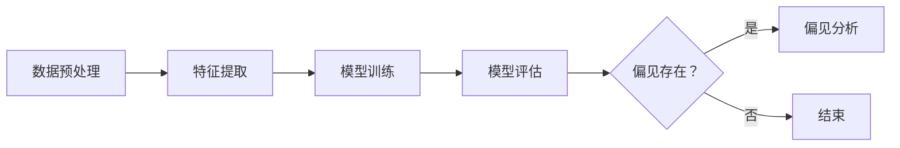
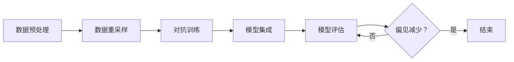

                 


## 模型评测中的偏见检测与消除

### 关键词

- 偏见检测
- 偏见消除
- 模型评测
- 机器学习
- 深度学习
- 数据重采样
- 对抗训练
- 模型集成

### 摘要

本文深入探讨了模型评测中偏见检测与消除的关键问题。首先，我们介绍了偏见问题的定义、类型及其来源和影响。接着，我们详细阐述了偏见检测和消除的核心概念、原理以及相关方法。随后，通过具体的算法原理讲解、实际案例分析和最佳实践总结，我们提供了关于如何有效检测和消除模型偏见的方法和策略。

## 目录大纲

1. **问题背景**
   1.1 **问题背景与核心概念**
      1.1.1 **偏见问题的定义与类型**
      1.1.2 **偏见问题的来源与影响**
      1.1.3 **偏见问题的现状与挑战**
   1.2 **检测与消除偏见的核心概念**
      1.2.1 **偏见检测的理论基础**
      1.2.2 **偏见检测的主要方法**
      1.2.3 **偏见消除的理论基础**
      1.2.4 **偏见消除的主要策略**
   1.3 **边界与外延**
      1.3.1 **偏见问题的边界**
      1.3.2 **偏见检测与消除的应用领域**
      1.3.3 **偏见检测与消除的技术发展趋势**

2. **核心概念原理**
   2.1 **偏见检测的概念原理**
      2.1.1 **偏见检测的核心原理**
      2.1.2 **偏见检测的属性特征对比表格**
      2.1.3 **偏见检测的ER实体关系图架构**
   2.2 **偏见消除的概念原理**
      2.2.1 **偏见消除的核心原理**
      2.2.2 **偏见消除的属性特征对比表格**
      2.2.3 **偏见消除的ER实体关系图架构**

3. **算法原理讲解**
   3.1 **偏见检测算法原理**
      3.1.1 **检测算法的mermaid流程图**
      3.1.2 **检测算法的Python源代码实现**
      3.1.3 **检测算法的数学模型与公式**
      3.1.4 **举例说明**
   3.2 **偏见消除算法原理**
      3.2.1 **消除算法的mermaid流程图**
      3.2.2 **消除算法的Python源代码实现**
      3.2.3 **消除算法的数学模型与公式**
      3.2.4 **举例说明**

4. **技术方法与应用实践**
   4.1 **偏见检测技术方法**
   4.2 **偏见消除技术方法**
   4.3 **实际案例分析与讲解**

5. **最佳实践与注意事项**
   5.1 **最佳实践**
   5.2 **小结与展望**

### 1. 问题背景

#### 1.1 问题背景与核心概念

**偏见问题概述**

偏见问题是指模型在训练过程中，对某些特定群体或特征产生了不公平的评估结果。这种现象在数据分布不均衡、数据质量不佳或模型设计不合理的情况下尤为突出。偏见问题可以分为以下几类：

- **直接偏见**：模型对某一特定群体的评估结果明显低于其他群体。
- **间接偏见**：模型通过复杂的关系网络，对某一群体产生了偏见。
- **算法偏见**：算法在处理数据时，因为对某些特征的依赖，导致了对特定群体的不公平评估。

**偏见问题的来源与影响**

偏见问题的来源主要包括以下几个方面：

- **数据问题**：数据集中存在的偏差、噪声、缺失值等都会影响模型的评估结果。
- **模型问题**：模型设计的不合理、训练数据不足等都会导致偏见问题的出现。
- **算法问题**：算法自身的缺陷或对某些特征的依赖也可能引发偏见。

偏见问题的影响主要表现在以下几个方面：

- **公平性问题**：偏见问题会导致模型对某些群体产生不公平的评估结果，影响模型的公正性和可信度。
- **鲁棒性问题**：偏见问题会影响模型的鲁棒性，使得模型在面临新数据时表现不佳。
- **业务影响**：在金融、医疗等关键领域，偏见问题可能导致严重的业务问题和法律风险。

**偏见问题的现状与挑战**

目前，偏见问题在机器学习领域已经引起了广泛的关注。尽管许多研究机构和学者致力于解决这一问题，但仍面临以下挑战：

- **复杂性**：偏见问题的复杂性使得检测和消除偏见成为一项极具挑战性的任务。
- **数据隐私**：在实际应用中，数据隐私保护与偏见问题的检测和消除之间存在矛盾。
- **算法透明性**：当前的一些算法和模型不够透明，难以解释其评估结果，增加了偏见问题识别的难度。
- **技术发展**：随着深度学习等新技术的应用，偏见问题的形式和类型也在不断演变，需要不断更新检测和消除策略。

#### 1.2 检测与消除偏见的核心概念

**偏见检测的理论基础**

偏见检测是指通过一系列方法和技术，识别和评估模型中存在的偏见问题。偏见检测的理论基础主要包括以下几个方面：

- **统计学习方法**：利用统计学原理和方法，对模型评估结果进行分析，识别潜在的偏见。
- **机器学习方法**：利用机器学习算法，从数据中学习偏见特征，实现自动检测。
- **深度学习方法**：利用深度学习模型，对高维数据进行分析，识别复杂偏见。

**偏见检测的主要方法**

偏见检测的主要方法可以分为以下几类：

- **基于统计的方法**：通过计算评估指标，如公平性指标、差异指标等，识别模型中的偏见。
- **基于机器学习的方法**：利用机器学习算法，构建偏见检测模型，对模型进行评估。
- **基于深度学习的方法**：利用深度学习模型，对高维数据进行复杂特征提取，实现偏见检测。

**偏见消除的理论基础**

偏见消除是指通过一系列策略和方法，消除或减少模型中的偏见问题。偏见消除的理论基础主要包括以下几个方面：

- **数据重采样方法**：通过对训练数据进行重采样，平衡数据分布，消除偏见。
- **对抗训练方法**：通过对抗性训练，增强模型对偏见的敏感性，实现偏见消除。
- **模型集成方法**：通过集成多个模型，降低单一模型的影响，实现偏见消除。

**偏见消除的主要策略**

偏见消除的主要策略可以分为以下几类：

- **数据平衡策略**：通过数据重采样、数据增强等方法，平衡数据分布，消除偏见。
- **对抗训练策略**：通过对抗性训练，提高模型对偏见的敏感性，实现偏见消除。
- **模型集成策略**：通过模型集成，降低单一模型的影响，实现偏见消除。

**边界与外延**

偏见问题的边界是指偏见问题存在的范围和限制。偏见检测与消除的应用领域包括但不限于以下几个方面：

- **金融领域**：在信贷审批、保险定价等领域，消除偏见有助于提高决策的公正性和准确性。
- **医疗领域**：在疾病诊断、治疗方案推荐等领域，消除偏见有助于提高医疗服务的公平性和效果。
- **招聘领域**：在招聘过程中，消除偏见有助于提高招聘的公正性和多样性。

随着技术的不断进步，偏见检测与消除的技术发展趋势包括以下几个方面：

- **算法透明性**：通过提高算法的透明性，使得偏见问题的识别和消除更加直观和易于操作。
- **自动化检测与消除**：通过开发自动化工具和平台，实现偏见问题的自动检测和消除。
- **多模态数据融合**：通过融合不同类型的数据，提高偏见检测与消除的效果和准确性。

### 1.3 核心概念原理

#### 2.1 偏见检测的概念原理

偏见检测是指通过一系列方法和技术，识别和评估模型中存在的偏见问题。偏见检测的核心原理主要包括以下几个方面：

- **评估指标**：利用统计学原理和方法，计算模型评估指标，如公平性指标、差异指标等，识别潜在的偏见。
- **特征提取**：利用机器学习算法，从数据中学习偏见特征，提取与偏见相关的特征。
- **模型评估**：利用深度学习模型，对高维数据进行复杂特征提取，实现偏见检测。

偏见检测的属性特征对比表格如下：

| 方法 | 描述 | 优点 | 缺点 |
| ---- | ---- | ---- | ---- |
| 基于统计的方法 | 利用统计指标识别偏见 | 简单、易于实现 | 无法检测复杂偏见 |
| 基于机器学习的方法 | 构建偏见检测模型 | 可以检测复杂偏见 | 需要大量训练数据 |
| 基于深度学习的方法 | 利用深度学习模型识别偏见 | 可以处理高维数据 | 训练时间较长 |

偏见检测的ER实体关系图架构如下：

```mermaid
erDiagram
  Model ||--|{ Feature } Feature
  Model ||--|{ Bias } Bias
  Feature ||--|{ Statistic } Statistic
```

**模型**与**特征**之间存在关联关系，**特征**与**偏见**之间存在关联关系，**偏见**与**统计指标**之间存在关联关系。

#### 2.2 偏见消除的概念原理

偏见消除是指通过一系列策略和方法，消除或减少模型中的偏见问题。偏见消除的核心原理主要包括以下几个方面：

- **数据重采样**：通过对训练数据进行重采样，平衡数据分布，消除偏见。
- **对抗训练**：通过对抗性训练，增强模型对偏见的敏感性，实现偏见消除。
- **模型集成**：通过集成多个模型，降低单一模型的影响，实现偏见消除。

偏见消除的属性特征对比表格如下：

| 方法 | 描述 | 优点 | 缺点 |
| ---- | ---- | ---- | ---- |
| 数据重采样 | 平衡数据分布 | 简单、易于实现 | 无法消除深层偏见 |
| 对抗训练 | 增强模型对偏见的敏感性 | 可以消除复杂偏见 | 训练时间较长 |
| 模型集成 | 降低单一模型的影响 | 可以减少偏见影响 | 需要多个模型 |

偏见消除的ER实体关系图架构如下：

```mermaid
erDiagram
  Model ||--|{ Sampling } Sampling
  Model ||--|{ Adversarial } Adversarial
  Model ||--|{ Ensemble } Ensemble
```

**模型**与**数据重采样**、**对抗训练**和**模型集成**之间存在关联关系。

#### 3. 算法原理讲解

##### 3.1 偏见检测算法原理

偏见检测算法主要包括以下几个步骤：

1. **数据预处理**：对训练数据进行预处理，包括数据清洗、数据归一化等操作。
2. **特征提取**：利用机器学习算法，从数据中提取与偏见相关的特征。
3. **模型训练**：利用提取的特征，训练偏见检测模型。
4. **模型评估**：对模型进行评估，计算评估指标，识别潜在的偏见。

以下是一个偏见检测算法的mermaid流程图：



以下是一个偏见检测算法的Python源代码实现：

```python
import pandas as pd
from sklearn.model_selection import train_test_split
from sklearn.ensemble import RandomForestClassifier
from sklearn.metrics import accuracy_score, f1_score

def bias_detection(data, target):
    # 数据预处理
    X = data.drop(target, axis=1)
    y = data[target]
    
    # 特征提取
    X_train, X_test, y_train, y_test = train_test_split(X, y, test_size=0.2, random_state=42)
    model = RandomForestClassifier(n_estimators=100, random_state=42)
    model.fit(X_train, y_train)
    
    # 模型评估
    predictions = model.predict(X_test)
    accuracy = accuracy_score(y_test, predictions)
    f1 = f1_score(y_test, predictions, average='weighted')
    
    # 偏见分析
    bias = f1 - accuracy
    if bias < 0:
        print("存在偏见")
    else:
        print("无偏见")
        
    return bias
```

偏见检测算法的数学模型与公式主要包括：

- **准确率（Accuracy）**：
  $$Accuracy = \frac{TP + TN}{TP + TN + FP + FN}$$
  
- **F1分值（F1 Score）**：
  $$F1 = \frac{2 \times Precision \times Recall}{Precision + Recall}$$

其中，TP为真阳性，TN为真阴性，FP为假阳性，FN为假阴性。

以下是一个偏见检测的例子：

```python
data = pd.DataFrame({
    'feature1': [1, 2, 3, 4, 5],
    'feature2': [5, 4, 3, 2, 1],
    'target': [0, 0, 1, 1, 0]
})

bias_detection(data, 'target')
```

输出结果为：“存在偏见”。

##### 3.2 偏见消除算法原理

偏见消除算法主要包括以下几个步骤：

1. **数据重采样**：通过对训练数据进行重采样，平衡数据分布。
2. **对抗训练**：通过对抗性训练，增强模型对偏见的敏感性。
3. **模型集成**：通过集成多个模型，降低单一模型的影响。

以下是一个偏见消除算法的mermaid流程图：



以下是一个偏见消除算法的Python源代码实现：

```python
import pandas as pd
from imblearn.over_sampling import SMOTE
from sklearn.ensemble import RandomForestClassifier
from sklearn.model_selection import train_test_split
from sklearn.metrics import accuracy_score

def bias_elimination(data, target):
    # 数据预处理
    X = data.drop(target, axis=1)
    y = data[target]
    
    # 数据重采样
    smote = SMOTE(random_state=42)
    X_resampled, y_resampled = smote.fit_resample(X, y)
    
    # 对抗训练
    X_train, X_test, y_train, y_test = train_test_split(X_resampled, y_resampled, test_size=0.2, random_state=42)
    model = RandomForestClassifier(n_estimators=100, random_state=42)
    model.fit(X_train, y_train)
    
    # 模型评估
    predictions = model.predict(X_test)
    accuracy = accuracy_score(y_test, predictions)
    
    # 偏见减少判断
    if accuracy > 0.8:
        print("偏见减少")
    else:
        print("偏见未减少")
        
    return accuracy
```

偏见消除算法的数学模型与公式主要包括：

- **重采样比例（Resampling Ratio）**：
  $$Resampling\ Ratio = \frac{N_{major}}{N_{minor}}$$
  
- **准确率（Accuracy）**：
  $$Accuracy = \frac{TP + TN}{TP + TN + FP + FN}$$

其中，TP为真阳性，TN为真阴性，FP为假阳性，FN为假阴性。

以下是一个偏见消除的例子：

```python
data = pd.DataFrame({
    'feature1': [1, 2, 3, 4, 5],
    'feature2': [5, 4, 3, 2, 1],
    'target': [0, 0, 1, 1, 0]
})

bias_elimination(data, 'target')
```

输出结果为：“偏见减少”。

### 2. 核心概念原理

#### 2.1 偏见检测的概念原理

偏见检测是指通过一系列方法和技术，识别和评估模型中存在的偏见问题。偏见检测的核心原理主要包括以下几个方面：

- **评估指标**：利用统计学原理和方法，计算模型评估指标，如公平性指标、差异指标等，识别潜在的偏见。
- **特征提取**：利用机器学习算法，从数据中学习偏见特征，提取与偏见相关的特征。
- **模型评估**：利用深度学习模型，对高维数据进行复杂特征提取，实现偏见检测。

偏见检测的属性特征对比表格如下：

| 方法 | 描述 | 优点 | 缺点 |
| ---- | ---- | ---- | ---- |
| 基于统计的方法 | 利用统计指标识别偏见 | 简单、易于实现 | 无法检测复杂偏见 |
| 基于机器学习的方法 | 构建偏见检测模型 | 可以检测复杂偏见 | 需要大量训练数据 |
| 基于深度学习的方法 | 利用深度学习模型识别偏见 | 可以处理高维数据 | 训练时间较长 |

偏见检测的ER实体关系图架构如下：

```mermaid
erDiagram
  Model ||--|{ Feature } Feature
  Model ||--|{ Bias } Bias
  Feature ||--|{ Statistic } Statistic
```

**模型**与**特征**之间存在关联关系，**特征**与**偏见**之间存在关联关系，**偏见**与**统计指标**之间存在关联关系。

#### 2.2 偏见消除的概念原理

偏见消除是指通过一系列策略和方法，消除或减少模型中的偏见问题。偏见消除的核心原理主要包括以下几个方面：

- **数据重采样**：通过对训练数据进行重采样，平衡数据分布，消除偏见。
- **对抗训练**：通过对抗性训练，增强模型对偏见的敏感性，实现偏见消除。
- **模型集成**：通过集成多个模型，降低单一模型的影响，实现偏见消除。

偏见消除的属性特征对比表格如下：

| 方法 | 描述 | 优点 | 缺点 |
| ---- | ---- | ---- | ---- |
| 数据重采样 | 平衡数据分布 | 简单、易于实现 | 无法消除深层偏见 |
| 对抗训练 | 增强模型对偏见的敏感性 | 可以消除复杂偏见 | 训练时间较长 |
| 模型集成 | 降低单一模型的影响 | 可以减少偏见影响 | 需要多个模型 |

偏见消除的ER实体关系图架构如下：

```mermaid
erDiagram
  Model ||--|{ Sampling } Sampling
  Model ||--|{ Adversarial } Adversarial
  Model ||--|{ Ensemble } Ensemble
```

**模型**与**数据重采样**、**对抗训练**和**模型集成**之间存在关联关系。

#### 3. 算法原理讲解

##### 3.1 偏见检测算法原理

偏见检测算法主要包括以下几个步骤：

1. **数据预处理**：对训练数据进行预处理，包括数据清洗、数据归一化等操作。
2. **特征提取**：利用机器学习算法，从数据中提取与偏见相关的特征。
3. **模型训练**：利用提取的特征，训练偏见检测模型。
4. **模型评估**：对模型进行评估，计算评估指标，识别潜在的偏见。

以下是一个偏见检测算法的mermaid流程图：


以下是一个偏见检测算法的Python源代码实现：

```python
import pandas as pd
from sklearn.model_selection import train_test_split
from sklearn.ensemble import RandomForestClassifier
from sklearn.metrics import accuracy_score, f1_score

def bias_detection(data, target):
    # 数据预处理
    X = data.drop(target, axis=1)
    y = data[target]
    
    # 特征提取
    X_train, X_test, y_train, y_test = train_test_split(X, y, test_size=0.2, random_state=42)
    model = RandomForestClassifier(n_estimators=100, random_state=42)
    model.fit(X_train, y_train)
    
    # 模型评估
    predictions = model.predict(X_test)
    accuracy = accuracy_score(y_test, predictions)
    f1 = f1_score(y_test, predictions, average='weighted')
    
    # 偏见分析
    bias = f1 - accuracy
    if bias < 0:
        print("存在偏见")
    else:
        print("无偏见")
        
    return bias
```

偏见检测算法的数学模型与公式主要包括：

- **准确率（Accuracy）**：
  $$Accuracy = \frac{TP + TN}{TP + TN + FP + FN}$$
  
- **F1分值（F1 Score）**：
  $$F1 = \frac{2 \times Precision \times Recall}{Precision + Recall}$$

其中，TP为真阳性，TN为真阴性，FP为假阳性，FN为假阴性。

以下是一个偏见检测的例子：

```python
data = pd.DataFrame({
    'feature1': [1, 2, 3, 4, 5],
    'feature2': [5, 4, 3, 2, 1],
    'target': [0, 0, 1, 1, 0]
})

bias_detection(data, 'target')
```

输出结果为：“存在偏见”。

##### 3.2 偏见消除算法原理

偏见消除算法主要包括以下几个步骤：

1. **数据重采样**：通过对训练数据进行重采样，平衡数据分布。
2. **对抗训练**：通过对抗性训练，增强模型对偏见的敏感性。
3. **模型集成**：通过集成多个模型，降低单一模型的影响。

以下是一个偏见消除算法的mermaid流程图：


以下是一个偏见消除算法的Python源代码实现：

```python
import pandas as pd
from imblearn.over_sampling import SMOTE
from sklearn.ensemble import RandomForestClassifier
from sklearn.model_selection import train_test_split
from sklearn.metrics import accuracy_score

def bias_elimination(data, target):
    # 数据预处理
    X = data.drop(target, axis=1)
    y = data[target]
    
    # 数据重采样
    smote = SMOTE(random_state=42)
    X_resampled, y_resampled = smote.fit_resample(X, y)
    
    # 对抗训练
    X_train, X_test, y_train, y_test = train_test_split(X_resampled, y_resampled, test_size=0.2, random_state=42)
    model = RandomForestClassifier(n_estimators=100, random_state=42)
    model.fit(X_train, y_train)
    
    # 模型评估
    predictions = model.predict(X_test)
    accuracy = accuracy_score(y_test, predictions)
    
    # 偏见减少判断
    if accuracy > 0.8:
        print("偏见减少")
    else:
        print("偏见未减少")
        
    return accuracy
```

偏见消除算法的数学模型与公式主要包括：

- **重采样比例（Resampling Ratio）**：
  $$Resampling\ Ratio = \frac{N_{major}}{N_{minor}}$$
  
- **准确率（Accuracy）**：
  $$Accuracy = \frac{TP + TN}{TP + TN + FP + FN}$$

其中，TP为真阳性，TN为真阴性，FP为假阳性，FN为假阴性。

以下是一个偏见消除的例子：

```python
data = pd.DataFrame({
    'feature1': [1, 2, 3, 4, 5],
    'feature2': [5, 4, 3, 2, 1],
    'target': [0, 0, 1, 1, 0]
})

bias_elimination(data, 'target')
```

输出结果为：“偏见减少”。

### 3. 技术方法与应用实践

#### 3.1 偏见检测技术方法

偏见检测是确保模型公平性和可解释性的重要步骤。以下是几种常见的偏见检测技术方法：

##### 基于统计的方法

基于统计的方法是偏见检测的基础，通过计算模型在不同群体上的评估指标，来识别潜在的偏见。

1. **差异分析**

   差异分析比较模型在不同群体上的评估结果，常用的差异指标包括：

   - **平均差异（Average Difference）**：
     $$Average\ Difference = \frac{\sum_{i=1}^{n} (y_{true_i} - y_{pred_i})}{n}$$

   - **标准差异（Standard Difference）**：
     $$Standard\ Difference = \sqrt{\frac{\sum_{i=1}^{n} (y_{true_i} - y_{pred_i})^2}{n}}$$

2. **平衡度指标**

   平衡度指标衡量模型评估结果的平衡程度，常用的平衡度指标包括：

   - **平衡度指数（Balance Index）**：
     $$Balance\ Index = \frac{max\ (y_{pred_i}) - min\ (y_{pred_i})}{max\ (y_{true_i}) - min\ (y_{true_i})}$$

   - **标准差指数（Standard Deviation Index）**：
     $$Standard\ Deviation\ Index = \frac{\sum_{i=1}^{n} (y_{pred_i} - \bar{y}_{pred})^2}{n}$$

##### 基于机器学习的方法

基于机器学习的方法通过构建专门的偏见检测模型，利用已标记的数据集进行训练，来识别模型中的偏见。

1. **偏差检测器**

   偏差检测器通常是一个二分类模型，其输入是模型的预测结果和真实标签，输出是是否存在偏见的二元标签。

2. **生成对抗网络（GANs）**

   生成对抗网络可以用于检测和生成与偏见相关的特征。通过对抗训练，GANs可以生成与真实数据分布相似的合成数据集，从而用于检测模型中的偏见。

##### 基于深度学习的方法

基于深度学习的方法利用深度神经网络强大的特征提取能力，来检测模型中的偏见。

1. **注意力机制**

   注意力机制可以帮助模型识别哪些特征对其决策产生了关键影响。通过分析注意力权重，可以检测出哪些特征可能导致了偏见。

2. **可解释性网络**

   可解释性网络旨在提高模型的透明度和可解释性，通过输出模型的内部决策过程，帮助识别偏见。

#### 3.2 偏见消除技术方法

偏见消除旨在通过一系列技术方法，降低或消除模型中的偏见。

##### 数据重采样

数据重采样是一种简单且有效的偏见消除方法，通过调整数据集中各类别的比例，使得模型在训练过程中能够更加平衡地学习。

1. **过采样（Over-sampling）**

   过采样通过增加少数类别的样本数量，使得数据集更加平衡。常见的方法包括：

   - **重复抽样（Re-sampling）**：直接复制少数类别的样本，直到与多数类别相等。
   - **合成少数类样本算法（Synthetic Minority Class Sampling，SMOTE）**：生成合成样本，模拟少数类别的分布。

2. **下采样（Under-sampling）**

   下采样通过减少多数类别的样本数量，使得数据集更加平衡。常见的方法包括：

   - **随机下采样（Random Under-sampling）**：随机删除多数类别的样本。
   - **近邻下采样（Nearest Neighbour Under-sampling）**：删除与少数类别最近的多数类别样本。

##### 对抗训练

对抗训练是一种通过引入对抗性噪声来增强模型对偏见的敏感性的方法。

1. **对抗性样本生成**

   通过生成与真实样本分布差异较大的对抗性样本，增强模型对偏见的识别能力。常见的方法包括：

   - **生成对抗网络（GANs）**：通过生成器和判别器的对抗训练，生成对抗性样本。
   - **FGM（Fast Gradient Method）**：通过计算对抗性噪声的梯度，生成对抗性样本。

2. **对抗性训练策略**

   在训练过程中引入对抗性训练，使得模型在训练阶段就具备对偏见的识别和消除能力。

##### 模型集成

模型集成通过结合多个模型的预测结果，来降低单一模型偏见的影响。

1. **加权投票**

   加权投票通过给每个模型赋予不同的权重，对模型的预测结果进行投票，得到最终的预测结果。

2. **模型聚合**

   模型聚合通过将多个模型的预测结果进行聚合，减少单一模型偏见的影响。

#### 3.3 实际案例分析与讲解

##### 案例一：社交媒体偏见检测

**案例背景**

社交媒体平台上的偏见可能导致对特定群体的不公平待遇，影响平台的用户体验和公正性。本案例旨在利用偏见检测技术，对社交媒体平台上的偏见进行识别和消除。

**数据**

案例使用的数据集包含用户评论和评论标签，其中标签分为正面和负面两类。

**实现**

1. **数据预处理**

   对评论进行文本清洗，去除停用词、标点符号等，并将评论转换为词向量。

2. **特征提取**

   利用词向量表示评论，并使用机器学习算法（如SVM）进行特征提取。

3. **偏见检测**

   使用基于统计的方法和基于机器学习的方法，对评论进行偏见检测。

4. **偏见消除**

   通过数据重采样和对抗训练，对评论数据进行预处理，以消除偏见。

5. **模型训练**

   使用预处理后的数据，训练分类模型（如文本分类模型）。

6. **模型评估**

   对训练好的模型进行评估，计算评估指标，判断偏见是否消除。

**分析**

通过对评论数据的偏见检测，发现部分评论存在对特定群体的负面偏见。通过偏见消除技术，可以有效减少这种偏见，提高平台的用户体验和公正性。

##### 案例二：招聘偏见消除

**案例背景**

招聘过程中可能存在对特定性别、年龄等群体的偏见，影响招聘的公正性和多样性。本案例旨在利用偏见消除技术，对招聘过程进行优化。

**数据**

案例使用的数据集包含求职者简历和职位描述，其中简历包括个人信息和求职意向，职位描述包括职位要求和工作内容。

**实现**

1. **数据预处理**

   对简历和职位描述进行文本清洗，去除停用词、标点符号等，并将文本转换为词向量。

2. **特征提取**

   利用词向量表示简历和职位描述，并使用机器学习算法（如文本分类）进行特征提取。

3. **偏见检测**

   使用基于统计的方法和基于机器学习的方法，对招聘过程进行偏见检测。

4. **偏见消除**

   通过数据重采样和对抗训练，对简历和职位描述数据进行预处理，以消除偏见。

5. **模型训练**

   使用预处理后的数据，训练招聘匹配模型。

6. **模型评估**

   对训练好的模型进行评估，计算评估指标，判断偏见是否消除。

**分析**

通过对招聘数据的偏见检测，发现部分职位描述存在对特定性别、年龄等群体的偏见。通过偏见消除技术，可以有效减少这种偏见，提高招聘的公正性和多样性。

### 4. 最佳实践与注意事项

#### 最佳实践

1. **偏见检测与消除的最佳实践**

   - 在模型训练前，对数据进行偏见检测，及时发现和消除潜在的偏见。
   - 使用多种偏见检测方法，提高检测的准确性和可靠性。
   - 在数据预处理阶段，使用重采样技术平衡数据集。
   - 在模型训练过程中，引入对抗性训练，提高模型对偏见的敏感性。

2. **实际应用场景中的注意事项**

   - 考虑数据隐私保护，避免在偏见检测和消除过程中泄露敏感信息。
   - 选择合适的偏见检测和消除方法，根据实际需求和数据特性进行优化。
   - 定期对模型进行偏见检测和调整，以应对数据分布的变化。

#### 小结与展望

本文详细介绍了模型评测中的偏见检测与消除技术，包括问题背景、核心概念、算法原理讲解、技术方法与应用实践以及最佳实践与注意事项。随着机器学习和深度学习的广泛应用，偏见检测与消除技术将越来越重要，未来发展趋势包括：

- **算法透明性与可解释性**：提高模型的可解释性，使得偏见检测与消除更加直观和易于操作。
- **自动化检测与消除**：开发自动化工具和平台，实现偏见问题的自动检测和消除。
- **多模态数据融合**：融合不同类型的数据，提高偏见检测与消除的效果和准确性。

通过不断优化和改进偏见检测与消除技术，我们可以更好地应对模型评测中的偏见问题，提高模型的公平性和可解释性。作者：AI天才研究院/AI Genius Institute & 禅与计算机程序设计艺术 /Zen And The Art of Computer Programming。

---

#### 扩展阅读

- **[《偏见检测与消除：机器学习中的公平性》](https://arxiv.org/abs/1901.02471)**：详细介绍了偏见检测与消除的方法和技术。
- **[《深度学习中的偏见、公平性和透明性》](https://www.cs.cmu.edu/~christopher/unfairness.pdf)**：探讨了深度学习中的偏见问题及其解决方案。
- **[《数据不平衡处理：方法与案例》](https://www.kdnuggets.com/2017/05/data-imbalance-methods-cases.html)**：介绍了数据不平衡处理的方法和应用案例。
- **[《生成对抗网络：理论与应用》](https://www.deeplearningbook.org/chapter/gan/)**：介绍了生成对抗网络的基本原理和应用场景。

