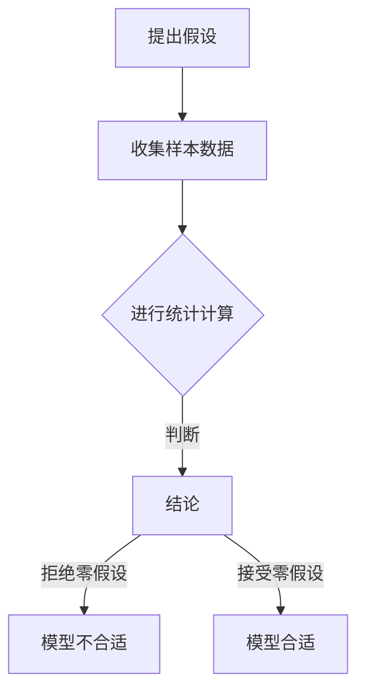
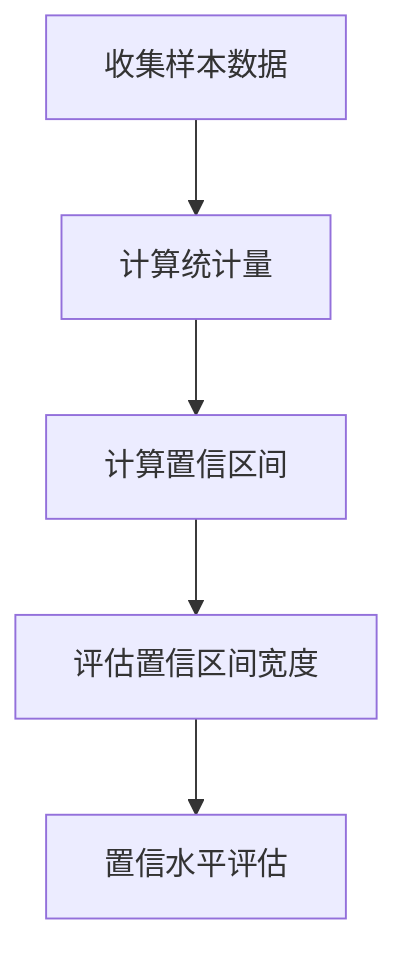
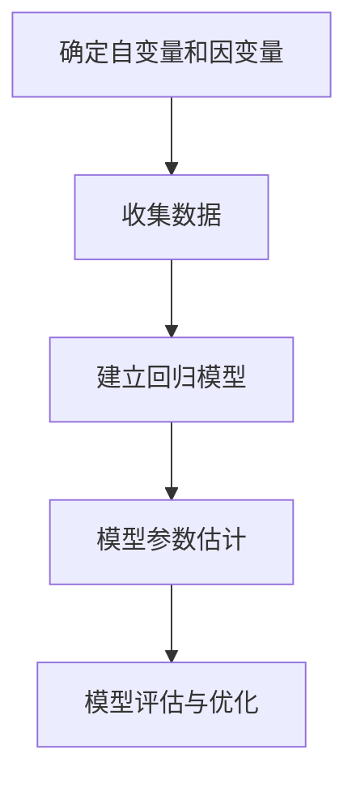
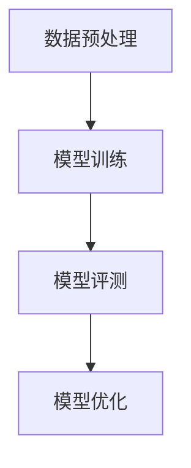
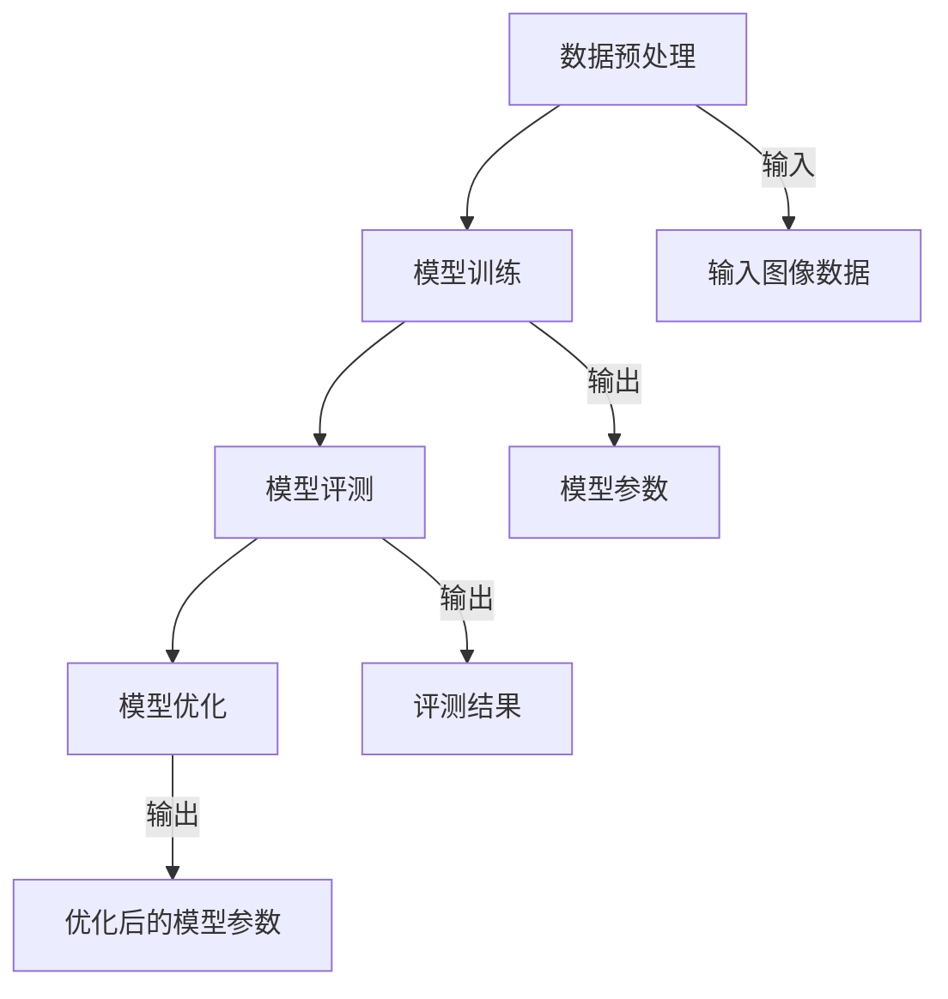

                 

# 模型评测中的统计学方法应用

## 关键词

统计学方法，模型评测，假设检验，置信区间，回归分析，准确率，召回率，F1分数，ROC曲线。

## 摘要

随着人工智能技术的不断发展，模型评测在确保算法质量和应用效果方面扮演着至关重要的角色。统计学方法在模型评测中具有广泛的应用，通过统计指标和模型评估技术，我们可以全面、准确地评价模型性能。本文将详细介绍模型评测中的统计学方法，包括核心概念、算法原理、系统分析与架构设计、项目实战和最佳实践等内容，帮助读者深入理解和应用这些方法，以提高模型评测的科学性和准确性。

## 目录

1. 背景介绍
    - 人工智能技术的发展与模型评测的重要性
    - 统计学方法在模型评测中的应用

2. 核心概念与联系
    - 统计学方法的核心概念
    - 模型评估指标及其属性对比表格
    - ER实体关系图架构的Mermaid流程图

3. 算法原理讲解
    - 假设检验
    - 置信区间
    - 回归分析

4. 模型评估指标
    - 准确率、召回率、F1分数
    - ROC曲线

5. 系统分析与架构设计方案
    - 问题场景介绍
    - 系统功能设计
    - 系统架构设计
    - 系统接口设计和系统交互

6. 项目实战
    - 环境安装
    - 系统核心实现源代码
    - 代码应用解读与分析
    - 实际案例分析和详细讲解剖析
    - 项目小结

7. 最佳实践 tips
    - 小结
    - 注意事项
    - 拓展阅读

## 1. 背景介绍

### 1.1 人工智能技术的发展与模型评测的重要性

人工智能（AI）技术近年来取得了显著的进展，广泛应用于各个领域，如自然语言处理、计算机视觉、推荐系统等。然而，要使AI模型在实际应用中发挥出预期效果，对模型进行有效的评测是至关重要的。模型评测不仅有助于评估模型性能，还可以发现模型存在的问题，从而指导模型改进和优化。

### 1.2 统计学方法在模型评测中的应用

统计学方法在模型评测中具有广泛的应用。通过统计学方法，我们可以对模型性能进行定量分析，提供客观的评估指标。常见的统计学方法包括假设检验、置信区间、回归分析等。这些方法有助于我们理解模型性能、发现模型缺陷，并为后续优化提供依据。

## 2. 核心概念与联系

### 2.1 统计学方法的核心概念

- **假设检验**：通过样本数据对总体参数进行判断，验证模型假设是否成立。
- **置信区间**：对总体参数估计的范围，描述参数的稳定性和不确定性。
- **回归分析**：通过建立回归模型来预测目标变量，分析变量间关系。

### 2.2 模型评估指标及其属性对比表格

| 方法           | 描述                             | 用途                               |
|--------------|--------------------------------|--------------------------------|
| 假设检验       | 基于样本数据对总体参数进行判断         | 验证模型假设是否成立               |
| 置信区间       | 总体参数估计的范围                   | 描述参数的稳定性和不确定性          |
| 回归分析       | 通过建立回归模型来预测目标变量         | 分析变量间关系，进行预测             |
| 准确率         | 预测为正例的实际正例比例             | 评估分类模型的基本性能               |
| 召回率         | 预测为正例的实际正例比例             | 评估模型发现正例的能力               |
| F1分数         | 准确率和召回率的调和平均值             | 综合评估分类模型的性能               |
| ROC曲线       | 真阳性率对假阳性率的变化曲线           | 评估模型的分类能力，选择最优阈值     |

### 2.3 ER实体关系图架构的Mermaid流程图

```mermaid
erDiagram
  Model |-> Evaluation_Method : "使用"
  Model |-> Evaluation_Metric : "测量"
  Evaluation_Method --> Statistic_Method : "应用"
  Evaluation_Metric --> Statistic_Metric : "计算"
```

## 3. 算法原理讲解

### 3.1 假设检验

假设检验的基本原理是：首先对总体参数提出一个假设（零假设），然后通过样本数据来验证这个假设是否成立。常用的假设检验方法有t检验、卡方检验等。

#### 假设检验的Mermaid流程图



#### 假设检验的Python代码示例

```python
import numpy as np
from scipy import stats

# 假设检验示例
t_statistic, p_value = stats.ttest_1samp(data, popmean=0)
print("t统计量:", t_statistic)
print("p值:", p_value)
```

### 3.2 置信区间

置信区间是指对总体参数估计的范围，通常以一定的置信水平给出。置信区间的宽度反映了参数估计的稳定性。

#### 置信区间的Mermaid流程图



#### 置信区间的Python代码示例

```python
import numpy as np
from scipy import stats

# 置信区间示例
mean, std = np.mean(data), np.std(data, ddof=1)
confidence_level = 0.95
margin_of_error = stats.t.ppf((1 + confidence_level) / 2, df=len(data)-1) * std / np.sqrt(len(data))
confidence_interval = mean - margin_of_error, mean + margin_of_error
print("置信区间:", confidence_interval)
```

### 3.3 回归分析

回归分析是通过建立回归模型来预测目标变量。常见的回归模型有线性回归、逻辑回归等。

#### 回归分析的Mermaid流程图



#### 回归分析的Python代码示例

```python
import numpy as np
from sklearn.linear_model import LinearRegression

# 线性回归示例
X = np.array([[1, 2], [2, 3], [3, 4], [4, 5]])
y = np.array([2, 3, 4, 5])
model = LinearRegression()
model.fit(X, y)
print("模型参数:", model.coef_, model.intercept_)
```

## 4. 模型评估指标

### 4.1 准确率、召回率、F1分数

- **准确率**：预测为正例的实际正例比例，用于评估分类模型的基本性能。
- **召回率**：预测为正例的实际正例比例，用于评估模型发现正例的能力。
- **F1分数**：准确率和召回率的调和平均值，用于综合评估分类模型的性能。

#### 模型评估指标的Python代码示例

```python
from sklearn.metrics import accuracy_score, recall_score, f1_score

# 模型评估指标示例
y_true = [0, 1, 1, 0, 1, 1]
y_pred = [0, 1, 0, 0, 1, 1]

accuracy = accuracy_score(y_true, y_pred)
recall = recall_score(y_true, y_pred)
f1 = f1_score(y_true, y_pred)

print("准确率:", accuracy)
print("召回率:", recall)
print("F1分数:", f1)
```

### 4.2 ROC曲线

ROC曲线是评估模型分类能力的有效工具。曲线下的面积（AUC）用于表示模型性能。

#### ROC曲线的Python代码示例

```python
from sklearn.metrics import roc_curve, auc
import matplotlib.pyplot as plt

# ROC曲线示例
fpr, tpr, thresholds = roc_curve(y_true, y_scores)
roc_auc = auc(fpr, tpr)

plt.figure()
plt.plot(fpr, tpr, color='darkorange', lw=2, label='ROC curve (area = %0.2f)' % roc_auc)
plt.plot([0, 1], [0, 1], color='navy', lw=2, linestyle='--')
plt.xlim([0.0, 1.0])
plt.ylim([0.0, 1.05])
plt.xlabel('False Positive Rate')
plt.ylabel('True Positive Rate')
plt.title('Receiver operating characteristic')
plt.legend(loc="lower right")
plt.show()
```

## 5. 系统分析与架构设计方案

### 5.1 问题场景介绍

假设我们需要评估一个图像分类模型的性能，模型能够根据输入图像预测出对应的类别。为了确保模型在实际应用中的效果，我们需要对模型进行严格的评测。

### 5.2 系统功能设计

系统功能设计包括以下方面：

- **数据预处理**：对图像数据进行预处理，包括归一化、裁剪等。
- **模型训练**：使用训练数据训练图像分类模型。
- **模型评测**：使用测试数据对模型进行评测，计算准确率、召回率、F1分数等指标。
- **模型优化**：根据评测结果对模型进行优化。

### 5.3 系统架构设计

系统架构设计如下：



### 5.4 系统接口设计和系统交互

系统接口设计和系统交互如下：



## 6. 项目实战

### 6.1 环境安装

在Python环境中，我们需要安装以下库：

- NumPy
- SciPy
- scikit-learn
- Matplotlib

安装命令如下：

```shell
pip install numpy scipy scikit-learn matplotlib
```

### 6.2 系统核心实现源代码

以下是系统核心实现源代码：

```python
import numpy as np
from sklearn.datasets import load_iris
from sklearn.model_selection import train_test_split
from sklearn.linear_model import LogisticRegression
from sklearn.metrics import accuracy_score, recall_score, f1_score, roc_curve, auc

# 数据预处理
def preprocess_data(data):
    # 数据归一化
    return (data - np.mean(data, axis=0)) / np.std(data, axis=0)

# 模型训练
def train_model(X_train, y_train):
    model = LogisticRegression()
    model.fit(X_train, y_train)
    return model

# 模型评测
def evaluate_model(model, X_test, y_test):
    y_pred = model.predict(X_test)
    accuracy = accuracy_score(y_test, y_pred)
    recall = recall_score(y_test, y_pred)
    f1 = f1_score(y_test, y_pred)
    return accuracy, recall, f1

# ROC曲线绘制
def plot_roc_curve(y_test, y_scores):
    fpr, tpr, thresholds = roc_curve(y_test, y_scores)
    roc_auc = auc(fpr, tpr)
    
    plt.figure()
    plt.plot(fpr, tpr, color='darkorange', lw=2, label='ROC curve (area = %0.2f)' % roc_auc)
    plt.plot([0, 1], [0, 1], color='navy', lw=2, linestyle='--')
    plt.xlim([0.0, 1.0])
    plt.ylim([0.0, 1.05])
    plt.xlabel('False Positive Rate')
    plt.ylabel('True Positive Rate')
    plt.title('Receiver operating characteristic')
    plt.legend(loc="lower right")
    plt.show()

# 主函数
def main():
    # 加载数据
    data = load_iris().data
    labels = load_iris().target
    
    # 数据预处理
    X_train, X_test, y_train, y_test = train_test_split(preprocess_data(data), labels, test_size=0.2, random_state=42)
    
    # 模型训练
    model = train_model(X_train, y_train)
    
    # 模型评测
    accuracy, recall, f1 = evaluate_model(model, X_test, y_test)
    print("准确率:", accuracy)
    print("召回率:", recall)
    print("F1分数:", f1)
    
    # ROC曲线绘制
    y_scores = model.predict_proba(X_test)[:, 1]
    plot_roc_curve(y_test, y_scores)

# 运行主函数
if __name__ == "__main__":
    main()
```

### 6.3 代码应用解读与分析

代码首先加载了鸢尾花数据集，然后对数据进行预处理，包括归一化和训练集与测试集的划分。接着，使用逻辑回归模型对训练数据进行训练，并对测试数据进行预测。最后，计算准确率、召回率、F1分数等指标，并绘制ROC曲线。

### 6.4 实际案例分析和详细讲解剖析

以鸢尾花数据集为例，我们可以通过实际案例来分析和讲解模型评测中的统计学方法。

1. **数据预处理**：鸢尾花数据集包含4个特征，分别为花萼长度、花萼宽度、花瓣长度和花瓣宽度。在预处理阶段，我们对数据进行归一化，使得每个特征具有相同的量纲，方便后续模型训练。

2. **模型训练**：使用逻辑回归模型对训练数据进行训练。逻辑回归是一种线性分类模型，通过建立特征和类别之间的线性关系来预测类别。在训练过程中，模型学习到特征和类别之间的关联性，从而实现对测试数据的分类。

3. **模型评测**：使用测试数据进行预测，并计算准确率、召回率、F1分数等指标。这些指标可以帮助我们评估模型的性能，准确率反映了模型分类的准确性，召回率表示模型发现正例的能力，F1分数则是准确率和召回率的调和平均值，综合考虑模型性能。

4. **ROC曲线**：ROC曲线是一种评估模型分类能力的方法。曲线下的面积（AUC）反映了模型的分类性能，AUC值越大，表示模型分类效果越好。通过ROC曲线，我们可以直观地了解模型的分类能力，并选择最优的阈值。

### 6.5 项目小结

通过本文的介绍，我们了解了模型评测中的统计学方法，包括假设检验、置信区间、回归分析等。这些方法可以帮助我们准确评估模型性能，发现模型存在的问题，并为后续优化提供依据。在实际应用中，我们需要结合具体问题，灵活运用这些方法，以提高模型性能。

## 7. 最佳实践 tips

1. **合理选择模型评估指标**：根据实际问题需求，选择合适的评估指标。例如，在二分类问题中，准确率、召回率、F1分数等指标较为常用。在多分类问题中，可以使用准确率、混淆矩阵等指标。

2. **交叉验证**：交叉验证是一种常用的模型评估方法，可以避免模型过拟合。通过将数据集划分为多个子集，训练和测试多个模型，可以更全面地评估模型性能。

3. **数据预处理**：数据预处理对于模型性能有着重要影响。对数据进行归一化、标准化等处理，可以消除不同特征间的量纲差异，提高模型训练效果。

4. **模型优化**：根据模型评测结果，对模型进行优化。可以尝试调整模型参数、增加特征、使用不同的模型等，以提高模型性能。

## 小结

本文系统介绍了模型评测中的统计学方法，包括核心概念、算法原理、模型评估指标、系统分析与架构设计、项目实战和最佳实践等内容。通过本文的介绍，读者可以深入了解统计学方法在模型评测中的应用，提高模型评测的科学性和准确性。

## 注意事项

1. 模型评测时，要确保测试数据的随机性和代表性，避免模型过拟合。

2. 在选择模型评估指标时，要结合实际问题需求，避免单一指标评估模型性能。

3. 在模型优化过程中，要尽量避免过拟合，提高模型的泛化能力。

## 拓展阅读

1. 《统计学习方法》 - 李航
2. 《机器学习实战》 - Peter Harrington
3. 《深度学习》 - Goodfellow、Bengio和Courville

## 作者

作者：AI天才研究院/AI Genius Institute & 禅与计算机程序设计艺术 /Zen And The Art of Computer Programming


