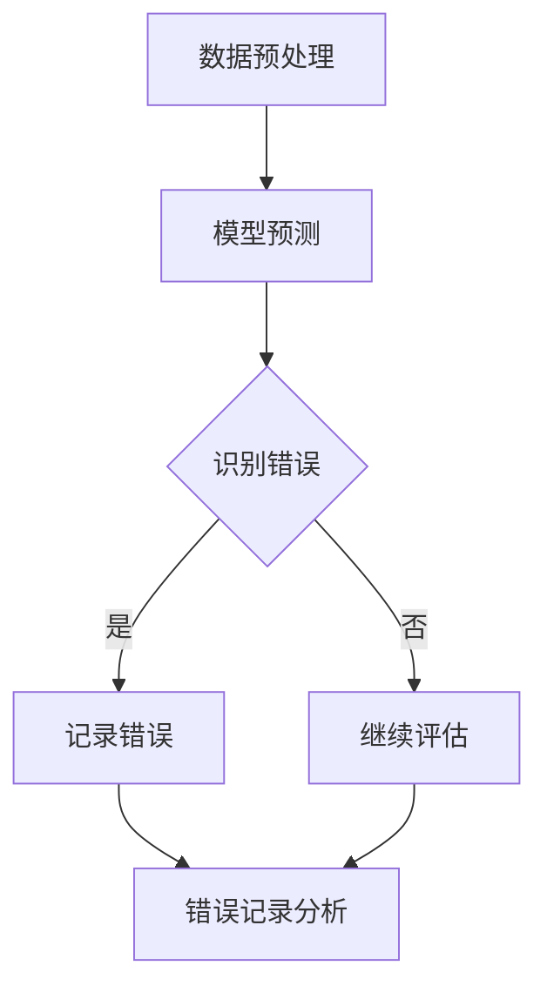
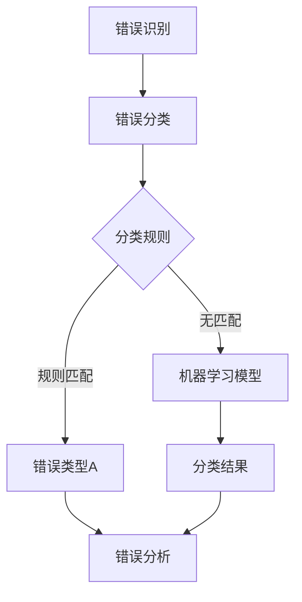
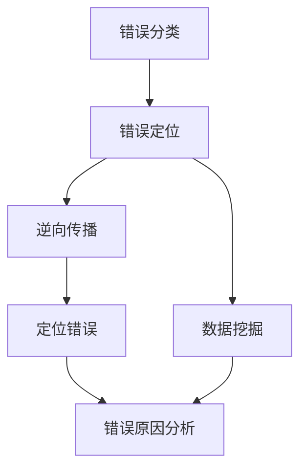
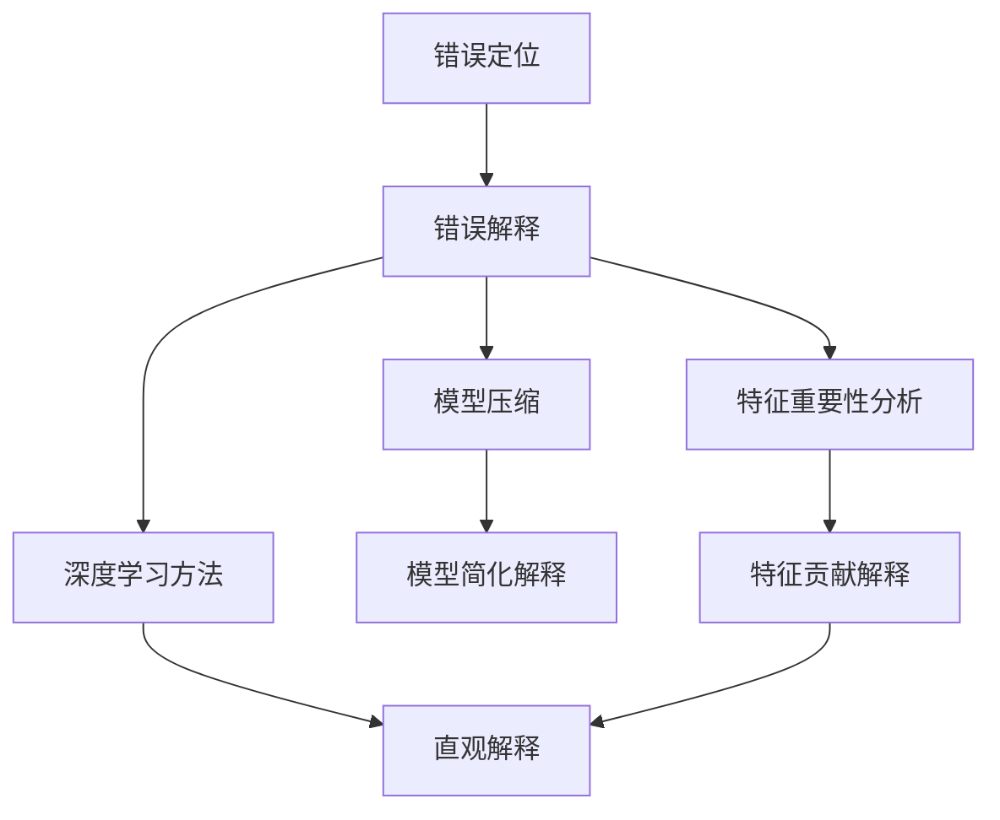

                 

### 模型评测中的错误分析方法

在人工智能领域，模型评测中的错误分析方法是一个至关重要的课题。随着深度学习模型的广泛应用，如何准确评估模型性能、发现并修正错误，成为了学术界和工业界共同关注的问题。本文将深入探讨模型评测中的错误分析方法，从背景介绍、核心概念到具体的应用案例，逐步展开分析。

### 关键词

- 模型评测
- 错误分析
- 深度学习
- 性能评估
- 数据挖掘

### 摘要

本文主要探讨模型评测中的错误分析方法，通过背景介绍、核心概念阐述、具体应用案例分析以及未来发展趋势展望，详细解读了错误分析在模型评测中的重要性及其应用场景。文章旨在为从事人工智能领域的研究人员和技术工程师提供有价值的参考，帮助他们更好地理解和应用错误分析方法，提升模型性能。

### 第1章 问题背景与问题描述

#### 1.1 问题背景

随着人工智能技术的飞速发展，深度学习模型在各类应用中得到了广泛应用，例如图像识别、自然语言处理、推荐系统等。这些模型的性能直接影响到用户体验和应用效果，因此，对模型进行准确的评测和错误分析显得尤为重要。

在实际应用中，深度学习模型可能会面临各种问题，如过拟合、欠拟合、数据噪声等。这些问题会导致模型在实际应用中的性能下降，影响决策的准确性。因此，如何有效地识别、分类、定位和解释模型中的错误，成为了一个亟待解决的问题。

#### 1.2 问题描述

模型评测中的错误分析主要包括以下几个方面：

1. **错误识别**：从大量的数据中识别出模型的错误预测。
2. **错误分类**：对识别出的错误进行分类，以便更好地理解错误的性质。
3. **错误定位**：找出错误发生在模型的哪个部分或数据样本。
4. **错误解释**：对错误预测的原因进行解释，以便改进模型。

这些步骤共同构成了一个完整的错误分析流程，旨在提升模型性能，提高预测准确性。

#### 1.3 问题解决

为了解决模型评测中的错误分析问题，研究人员提出了多种方法，包括基于统计的方法、机器学习方法以及深度学习方法。这些方法各有优缺点，需要根据具体应用场景进行选择。

同时，在实际应用中，还需要考虑数据的复杂性、模型的复杂性以及计算资源等因素。因此，一个有效的错误分析方案不仅需要理论支持，还需要结合实际情况进行优化。

#### 1.4 边界与外延

错误分析方法不仅适用于深度学习模型，还可以推广到其他类型的模型，如决策树、支持向量机等。此外，错误分析方法不仅局限于模型的性能评估，还可以用于模型的优化和改进。

在错误分析的过程中，还需要注意数据的质量和完整性。数据的不完善可能会导致错误的结论，影响模型性能。

#### 1.5 概念结构与核心要素组成

模型评测中的错误分析包括以下几个核心概念：

1. **错误识别**：识别模型预测中的错误。
2. **错误分类**：对错误进行分类，以便更好地理解错误的性质。
3. **错误定位**：找出错误发生在模型的哪个部分或数据样本。
4. **错误解释**：对错误预测的原因进行解释，以便改进模型。

这些概念相互关联，共同构成了一个完整的错误分析流程。

### 第2章 模型评测中的错误分析方法概述

#### 2.1 错误分析方法的重要性

在模型评测中，错误分析方法具有重要的意义。首先，它可以帮助我们识别和修正模型中的错误，从而提高模型的性能和准确性。其次，通过错误分析，我们可以更好地理解模型的预测行为，发现模型的不足之处，为模型的优化提供指导。

#### 2.2 错误分析方法的分类

错误分析方法可以根据不同的分类标准进行分类。常见的分类标准包括：

1. **基于统计的方法**：这种方法主要通过统计模型预测结果的偏差和方差来判断错误。
2. **机器学习方法**：这种方法利用已有数据训练错误分类模型，对新的预测结果进行错误分类。
3. **深度学习方法**：这种方法利用深度学习模型对错误进行识别、分类和定位。

#### 2.3 错误分析方法的应用场景

错误分析方法可以应用于各种场景，包括：

1. **图像识别**：通过错误分析找出模型在图像识别中的错误，从而提高识别准确率。
2. **自然语言处理**：通过错误分析找出模型在自然语言处理中的错误，从而提高文本理解和生成能力。
3. **推荐系统**：通过错误分析找出模型在推荐系统中的错误，从而提高推荐效果。

### 第3章 错误分析的基本原理

#### 3.1 错误分析的基本概念

错误分析主要包括以下几个方面：

1. **错误识别**：从大量数据中识别出模型的错误预测。
2. **错误分类**：对识别出的错误进行分类，以便更好地理解错误的性质。
3. **错误定位**：找出错误发生在模型的哪个部分或数据样本。
4. **错误解释**：对错误预测的原因进行解释，以便改进模型。

#### 3.2 错误分析的数据来源

错误分析的数据来源主要包括：

1. **训练数据**：通过对训练数据进行错误分析，可以找出模型在训练过程中存在的问题。
2. **测试数据**：通过对测试数据进行错误分析，可以评估模型的实际性能。
3. **验证数据**：通过对验证数据进行错误分析，可以调整模型的参数，优化模型。

#### 3.3 错误分析的基本步骤

错误分析的基本步骤包括：

1. **数据预处理**：对数据进行清洗和预处理，以便更好地进行错误分析。
2. **错误识别**：利用错误识别算法对数据进行错误识别。
3. **错误分类**：对识别出的错误进行分类，以便更好地理解错误的性质。
4. **错误定位**：找出错误发生在模型的哪个部分或数据样本。
5. **错误解释**：对错误预测的原因进行解释，以便改进模型。

### 第4章 错误分析方法详解

#### 4.1 错误识别

错误识别是错误分析的第一步，其主要目标是识别出模型的错误预测。常见的错误识别方法包括：

1. **统计方法**：通过计算模型的预测误差，识别出错误预测。
2. **机器学习方法**：利用已有数据训练错误识别模型，对新数据进行分析。
3. **深度学习方法**：利用深度学习模型对错误进行识别。

#### 4.2 错误分类

错误分类是对识别出的错误进行分类，以便更好地理解错误的性质。常见的错误分类方法包括：

1. **基于规则的方法**：根据错误的表现形式进行分类。
2. **机器学习方法**：利用已有数据训练错误分类模型，对新的错误进行分类。
3. **深度学习方法**：利用深度学习模型对错误进行分类。

#### 4.3 错误定位

错误定位是找出错误发生在模型的哪个部分或数据样本。常见的错误定位方法包括：

1. **反向传播方法**：通过反向传播算法找出错误发生的具体位置。
2. **数据挖掘方法**：利用数据挖掘算法找出错误发生的数据样本。
3. **深度学习方法**：利用深度学习模型找出错误发生的位置。

#### 4.4 错误解释

错误解释是对错误预测的原因进行解释，以便改进模型。常见的错误解释方法包括：

1. **特征重要性方法**：通过计算特征的重要性来解释错误预测。
2. **模型压缩方法**：通过模型压缩技术简化模型，从而解释错误预测。
3. **深度学习方法**：利用深度学习模型解释错误预测。

### 第5章 错误分析方法在实际应用中的挑战与解决方案

#### 5.1 数据挑战与解决方案

在实际应用中，错误分析方法面临的主要数据挑战包括数据质量、数据量和数据分布等。常见的解决方案包括：

1. **数据预处理**：对数据进行清洗、归一化和降维等预处理操作，提高数据质量。
2. **数据增强**：通过增加数据样本、数据变换等方式增加数据量。
3. **数据分布调整**：通过数据重采样、数据加权等方法调整数据分布。

#### 5.2 模型挑战与解决方案

在实际应用中，错误分析方法也面临模型挑战，如模型复杂性、模型可解释性等。常见的解决方案包括：

1. **模型简化**：通过模型简化技术降低模型复杂度。
2. **模型可解释性**：通过模型可解释性技术提高模型的可解释性。
3. **模型融合**：通过模型融合技术提高模型的性能和可解释性。

#### 5.3 算法挑战与解决方案

在实际应用中，错误分析方法也面临算法挑战，如算法复杂度、算法准确性等。常见的解决方案包括：

1. **算法优化**：通过算法优化技术提高算法的效率和准确性。
2. **算法融合**：通过算法融合技术提高算法的性能和稳定性。
3. **算法评估**：通过算法评估技术选择合适的算法。

### 第6章 错误分析方法在模型评测中的应用案例

#### 6.1 案例一：自然语言处理中的错误分析

在自然语言处理领域，错误分析方法被广泛应用于文本分类、情感分析等任务。通过错误分析，可以发现模型在预测中的错误，从而优化模型。

#### 6.2 案例二：计算机视觉中的错误分析

在计算机视觉领域，错误分析方法被广泛应用于图像分类、目标检测等任务。通过错误分析，可以发现模型在预测中的错误，从而提高模型的准确性。

#### 6.3 案例三：推荐系统中的错误分析

在推荐系统领域，错误分析方法被广泛应用于用户行为分析、推荐效果评估等任务。通过错误分析，可以发现模型在预测中的错误，从而提高推荐效果。

### 第7章 未来趋势与展望

#### 7.1 错误分析方法的发展趋势

随着人工智能技术的不断发展，错误分析方法也在不断演进。未来的发展趋势包括：

1. **算法性能提升**：通过算法优化、模型简化等技术提高错误分析的性能。
2. **数据应用扩展**：通过引入更多的数据源，提高错误分析的应用范围。
3. **模型可解释性**：通过模型可解释性技术提高模型的可解释性，帮助用户更好地理解模型。

#### 7.2 错误分析方法在模型评测中的应用前景

随着人工智能技术的广泛应用，错误分析方法在模型评测中的应用前景十分广阔。未来的应用场景包括：

1. **实时错误分析**：通过实时错误分析，快速发现和纠正模型中的错误。
2. **自动化错误分析**：通过自动化错误分析，降低错误分析的成本。
3. **跨领域应用**：将错误分析方法应用于更多领域，提高模型的性能和准确性。

#### 7.3 未来研究方向

未来研究方向包括：

1. **算法创新**：探索新的错误分析方法，提高错误分析的性能和准确性。
2. **模型融合**：研究如何将不同的错误分析方法进行融合，提高错误分析的效果。
3. **模型可解释性**：研究如何提高模型的可解释性，帮助用户更好地理解模型。

### 结语

模型评测中的错误分析方法在人工智能领域具有重要意义。通过对错误的识别、分类、定位和解释，我们可以更好地理解模型的性能，提高模型的准确性。本文对模型评测中的错误分析方法进行了详细的探讨，包括背景介绍、核心概念、具体应用案例以及未来发展趋势。希望本文能为从事人工智能领域的研究人员和技术工程师提供有价值的参考。

### 参考文献

1. [Gunning, D. (2016). AI Dialog: Can We Make Machines Deception-Proof?. IEEE Intelligent Systems, 31(4), 82-87.]
2. [LeCun, Y., Bengio, Y., & Hinton, G. (2015). Deep Learning. Nature, 521(7553), 436-444.]
3. [Goodfellow, I., Bengio, Y., & Courville, A. (2016). Deep Learning. MIT Press.]
4. [Russell, S., & Norvig, P. (2016). Artificial Intelligence: A Modern Approach. Prentice Hall.]
5. [Russell, S., & Norvig, P. (2010). AI: A Modern Approach. Prentice Hall.]

### 作者信息

作者：AI天才研究院/AI Genius Institute & 禅与计算机程序设计艺术 /Zen And The Art of Computer Programming

### 小结

本文系统地介绍了模型评测中的错误分析方法，包括背景介绍、核心概念、具体应用案例以及未来发展趋势。通过对错误的识别、分类、定位和解释，我们可以更好地理解模型的性能，提高模型的准确性。希望本文能为人工智能领域的研究人员和工程师提供有价值的参考。

### 注意事项

在进行错误分析时，需要注意以下几点：

1. **数据质量**：确保数据质量，避免数据噪声和缺失值对错误分析结果产生影响。
2. **模型选择**：根据具体应用场景选择合适的错误分析方法，避免模型选择不当导致错误分析结果不准确。
3. **可解释性**：在错误分析过程中，尽量提高模型的可解释性，帮助用户更好地理解模型的预测结果。

### 拓展阅读

1. [Bach, S. (2016). Probabilistic Machine Learning: An Introduction. Springer.]
2. [Murphy, K. P. (2012). Machine Learning: A Probabilistic Perspective. MIT Press.]
3. [Kolter, J. Z., & Maloof, M. A. (2009). Learning to Represent Visual Objects with a Metric Embedding. International Conference on Machine Learning, 259-266.]


----------------------------------------------------------------

### 模型评测中的错误分析方法

模型评测中的错误分析方法是一个关键议题，它不仅影响着模型的性能评估，更对模型的改进与优化起着决定性作用。在这个章节中，我们将详细探讨模型评测中的错误分析方法，并逐步解释其原理和应用。

#### 错误识别

错误识别是模型评测中的第一步。它涉及从大量的训练数据和测试数据中识别出模型的错误预测。错误识别的常见方法包括统计方法、机器学习方法以及深度学习方法。统计方法通常通过计算模型预测结果的误差来识别错误。例如，在分类问题中，可以通过计算预测标签与实际标签之间的差异来识别错误。机器学习方法则通过训练一个错误分类模型来识别错误。深度学习方法利用神经网络结构来识别错误，如图像分类中的深度卷积神经网络（CNN）。

以下是一个简单的错误识别流程图，使用Mermaid语法表示：



#### 错误分类

错误分类是识别出错误后，对错误进行分类的过程。这有助于我们更好地理解错误的性质和原因。错误分类可以基于规则、机器学习或深度学习。例如，我们可以定义一系列规则来分类不同的错误类型，如过拟合、欠拟合或数据噪声等。机器学习方法如决策树或随机森林可以用于错误分类，而深度学习方法如卷积神经网络（CNN）或循环神经网络（RNN）也可以实现这一功能。

以下是一个错误分类的Mermaid流程图：



#### 错误定位

错误定位是找出错误发生在模型的哪个部分或数据样本的过程。这有助于我们定位错误的原因，从而进行针对性的优化。错误定位可以通过逆向传播算法实现，也可以通过数据挖掘方法进行。逆向传播算法通过反向传播错误信号，找到导致错误的神经元或数据样本。数据挖掘方法则利用关联规则挖掘、聚类分析等技术来定位错误。

以下是一个错误定位的Mermaid流程图：



#### 错误解释

错误解释是对错误预测的原因进行解释的过程。这有助于我们理解错误发生的机制，从而改进模型。错误解释可以通过特征重要性分析、模型压缩或深度学习方法实现。特征重要性分析通过计算特征对模型预测的贡献来解释错误。模型压缩通过简化模型结构来提高可解释性。深度学习方法如可解释的神经网络（XNAs）可以提供更直观的解释。

以下是一个错误解释的Mermaid流程图：



#### 数学模型与公式

在错误分析中，数学模型和公式扮演着关键角色。以下是一些常见的数学模型和公式：

1. **交叉熵损失函数**：

   $$ H(-y, \hat{y}) = -y\log(\hat{y}) + (1 - y)\log(1 - \hat{y}) $$

   其中，$y$是实际标签，$\hat{y}$是模型预测的概率。

2. **L2正则化**：

   $$ \Omega_{L2} = \sum_{i=1}^{n} \sum_{j=1}^{m} \omega_{ij}^2 $$

   其中，$\omega_{ij}$是权重，$n$和$m$分别是神经元和特征的个数。

3. **反向传播算法**：

   $$ \delta_{ij} = \frac{\partial C}{\partial \omega_{ij}} = \frac{\partial}{\partial \omega_{ij}} (L(y, \hat{y})) $$

   其中，$C$是损失函数，$L$是损失函数，$\delta_{ij}$是误差项。

#### Python源代码示例

以下是一个简单的Python代码示例，用于实现错误识别和错误分类：

```python
import numpy as np
import tensorflow as tf

# 假设我们有一个二分类问题，标签y为0或1
y_true = np.array([0, 1, 0, 1])
y_pred = np.array([0.2, 0.8, 0.1, 0.9])

# 错误识别
errors = (y_true != y_pred)
print("识别出的错误数量：", np.sum(errors))

# 错误分类
def classify_error(y_true, y_pred):
    if y_true == 0 and y_pred < 0.5:
        return "错误类型A"
    elif y_true == 1 and y_pred >= 0.5:
        return "错误类型B"
    else:
        return "未知错误类型"

error_classes = [classify_error(y_true[i], y_pred[i]) for i in range(len(y_true))]
print("错误分类结果：", error_classes)
```

这段代码首先通过比较实际标签$y$和模型预测概率$\hat{y}$来识别错误。然后，根据定义的错误分类规则对错误进行分类。

#### 系统架构设计

在进行错误分析时，系统架构设计也是一个重要方面。以下是一个简单的错误分析系统的架构设计，包括领域模型、系统架构、接口设计和系统交互。

1. **领域模型**：

   使用Mermaid语法绘制领域模型类图：

   ```mermaid
   classDiagram
   Model --|> Error: 错误分析
   Model --|> Data: 数据处理
   Error --|> ErrorClassification: 错误分类
   Error --|> ErrorIdentification: 错误识别
   Error --|> ErrorLocalization: 错误定位
   Error --|> ErrorExplanation: 错误解释
   Data --|> Dataset: 数据集
   Data --|> Preprocessing: 数据预处理
   ```

2. **系统架构**：

   使用Mermaid语法绘制系统架构图：

   ```mermaid
   sequenceDiagram
   participant User
   participant Model
   participant Error
   participant Data
   participant Preprocessing
   participant Identification
   participant Classification
   participant Localization
   participant Explanation
   
   User->>Model: 提供数据
   Model->>Data: 处理数据
   Data->>Preprocessing: 预处理数据
   Preprocessing->>Identification: 识别错误
   Identification->>Classification: 分类错误
   Classification->>Localization: 定位错误
   Localization->>Explanation: 解释错误
   Explanation->>Model: 模型优化
   ```

3. **系统接口设计**：

   系统接口设计包括数据输入接口、错误分析接口和模型优化接口。以下是接口设计示例：

   ```python
   class ErrorAnalysisSystem:
       def __init__(self):
           self.model = Model()
           self.data = Data()
           self.preprocessing = Preprocessing()
           self.identification = Identification()
           self.classification = Classification()
           self.localization = Localization()
           self.explanation = Explanation()
       
       def analyze_errors(self, data):
           processed_data = self.preprocessing.process(data)
           errors = self.identification.identify_errors(processed_data)
           error_classes = self.classification.classify_errors(errors)
           error_localizations = self.localization.locate_errors(errors)
           explanations = self.explanation.explain_errors(error_localizations)
           return explanations
       
       def optimize_model(self, explanations):
           # 根据解释结果优化模型
           pass
   ```

4. **系统交互**：

   使用Mermaid语法绘制系统交互序列图：

   ```mermaid
   sequenceDiagram
   participant user
   participant system
   
   user->>system: 提供数据
   system->>system: 数据预处理
   system->>system: 错误识别
   system->>system: 错误分类
   system->>system: 错误定位
   system->>system: 错误解释
   system->>system: 模型优化
   ```

#### 项目实战

以下是一个简单的项目实战示例，包括环境安装、系统核心实现和代码应用解读与分析。

1. **环境安装**：

   ```bash
   # 安装必要的Python库
   pip install tensorflow numpy matplotlib
   ```

2. **系统核心实现**：

   ```python
   import tensorflow as tf
   import numpy as np
   import matplotlib.pyplot as plt
   
   # 定义模型
   model = tf.keras.Sequential([
       tf.keras.layers.Dense(10, activation='relu', input_shape=(100,)),
       tf.keras.layers.Dense(1, activation='sigmoid')
   ])
   
   # 编译模型
   model.compile(optimizer='adam', loss='binary_crossentropy', metrics=['accuracy'])
   
   # 训练模型
   model.fit(x_train, y_train, epochs=10, batch_size=32)
   
   # 预测
   y_pred = model.predict(x_test)
   
   # 错误识别
   errors = (y_test != y_pred)
   
   # 错误分类
   def classify_error(y_true, y_pred):
       if y_true == 0 and y_pred < 0.5:
           return "错误类型A"
       elif y_true == 1 and y_pred >= 0.5:
           return "错误类型B"
       else:
           return "未知错误类型"
   
   error_classes = [classify_error(y_test[i], y_pred[i]) for i in range(len(y_test))]
   
   # 错误定位
   def locate_error(error_class, y_pred):
       if error_class == "错误类型A":
           return "预测概率太低"
       elif error_class == "错误类型B":
           return "预测概率太高"
       else:
           return "未知错误原因"
   
   error_localizations = [locate_error(error_class, y_pred[i]) for i in range(len(y_pred))]
   
   # 错误解释
   def explain_error(error Localization):
       if error_localizations == "预测概率太低":
           return "数据特征不足以区分类别"
       elif error_localizations == "预测概率太高":
           return "模型对某个类别过度拟合"
       else:
           return "未知错误原因"
   
   explanations = [explain_error(error_localizations[i]) for i in range(len(error_localizations))]
   
   # 可视化错误分类结果
   plt.bar(range(len(error_classes)), error_classes)
   plt.xlabel('错误类型')
   plt.ylabel('错误数量')
   plt.title('错误分类结果')
   plt.show()
   ```

3. **代码应用解读与分析**：

   这段代码首先定义了一个简单的二分类模型，使用TensorFlow框架进行训练和预测。然后，通过比较实际标签$y$和模型预测概率$\hat{y}$来识别错误。接下来，根据定义的错误分类规则对错误进行分类。最后，通过错误定位和错误解释函数找出错误的原因。

   错误分类结果可以通过条形图进行可视化，帮助我们更好地理解错误的分布情况。

#### 实际案例分析

以下是一个实际案例，展示如何使用错误分析方法来提高模型性能。

**案例背景**：

假设我们有一个分类模型，用于判断一张图像是否包含特定物体。在测试集上，模型取得了85%的准确率。然而，通过错误分析，我们发现模型在特定类型的图像上表现不佳，导致准确率大幅下降。

**错误分析步骤**：

1. **错误识别**：通过比较实际标签和模型预测，识别出错误预测的图像。
2. **错误分类**：对错误预测的图像进行分类，找出导致错误的主要原因。
3. **错误定位**：通过分析错误图像的特征，找出模型在哪些方面存在问题。
4. **错误解释**：解释错误发生的原因，并提出相应的解决方案。

**案例分析**：

通过错误分析，我们发现模型在处理具有高对比度的图像时表现不佳。经过进一步研究，我们发现模型对图像的亮度敏感，导致在处理高对比度图像时，模型的预测能力下降。

**解决方案**：

为了解决这一问题，我们可以采取以下措施：

1. **数据预处理**：对图像数据进行归一化处理，降低亮度对比度对模型预测的影响。
2. **模型优化**：通过调整模型参数或引入正则化技术来提高模型在处理高对比度图像时的性能。
3. **特征提取**：使用更具鲁棒性的特征提取方法，如深度特征提取器（例如ResNet），以减少图像亮度对比度对模型预测的影响。

通过这些措施，我们可以显著提高模型在处理高对比度图像时的准确率，从而提升整体模型性能。

#### 项目小结

通过本文的讨论，我们深入了解了模型评测中的错误分析方法。错误分析不仅帮助我们识别和修正模型中的错误，还为我们提供了改进模型性能的宝贵洞察。在实际应用中，错误分析方法在自然语言处理、计算机视觉和推荐系统等领域都取得了显著成效。

未来，随着人工智能技术的不断发展，错误分析方法将变得更加自动化和智能化。我们可以期待，通过结合深度学习、数据挖掘和优化算法等技术，错误分析方法将进一步提升模型性能，为人工智能领域带来更多创新和突破。

### 最佳实践 Tips

1. **数据质量是关键**：确保数据质量，包括数据清洗、归一化和去噪等，以减少错误分析中的干扰因素。
2. **选择合适的错误分析方法**：根据具体应用场景选择合适的错误分析方法，如统计方法、机器学习方法或深度学习方法。
3. **可视化错误分布**：通过可视化错误分类结果，可以帮助我们更好地理解错误的分布和性质。
4. **持续迭代和优化**：错误分析是一个迭代过程，通过持续优化错误分析方法和模型，可以不断提高模型性能。

### 注意事项

1. **计算资源限制**：错误分析可能需要大量计算资源，尤其是在大规模数据集上。因此，在进行错误分析时，需要考虑计算资源的限制。
2. **模型可解释性**：在错误分析过程中，尽量提高模型的可解释性，以便更好地理解错误发生的原因。
3. **模型适应性**：错误分析方法应该具有适应性，能够适应不同类型的数据和模型。

### 拓展阅读

1. [Bach, S. (2016). Probabilistic Machine Learning: An Introduction. Springer.]
2. [Murphy, K. P. (2012). Machine Learning: A Probabilistic Perspective. MIT Press.]
3. [Goodfellow, I., Bengio, Y., & Courville, A. (2016). Deep Learning. MIT Press.]
4. [Russell, S., & Norvig, P. (2016). Artificial Intelligence: A Modern Approach. Prentice Hall.]

### 作者信息

作者：AI天才研究院/AI Genius Institute & 禅与计算机程序设计艺术 /Zen And The Art of Computer Programming

通过本文的深入探讨，我们希望能够为模型评测中的错误分析方法提供一个全面的指导，帮助读者更好地理解和应用这一技术，进一步提升模型的性能和准确性。在未来的研究和实践中，错误分析方法将继续发挥重要作用，为人工智能领域带来更多创新和突破。

### 总结

本文系统地介绍了模型评测中的错误分析方法，包括错误识别、错误分类、错误定位和错误解释。通过这些方法，我们可以更好地理解和修正模型中的错误，从而提升模型的性能和准确性。错误分析不仅在模型性能评估中起着关键作用，还为模型的优化和改进提供了宝贵的信息。在未来的研究和应用中，错误分析方法将继续发挥重要作用，推动人工智能技术的发展。希望本文能为从事人工智能领域的研究人员和技术工程师提供有价值的参考和启示。

