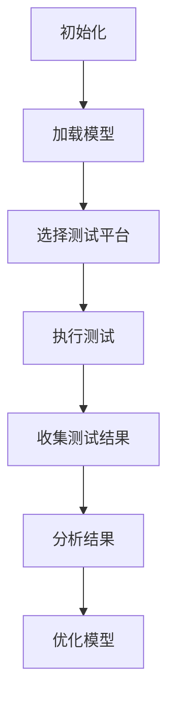

                 

## 模型评测的跨平台兼容性测试

模型评测的跨平台兼容性测试是一个至关重要但往往被忽视的环节。随着深度学习模型的广泛应用，越来越多的应用场景需要模型在不同平台上运行，这就要求模型必须具备跨平台兼容性。本文将深入探讨模型评测的跨平台兼容性测试，从问题背景、核心概念、测试原理、工具与实践等方面进行全面剖析。

### 关键词

- 模型评测
- 跨平台兼容性测试
- 测试工具
- 测试平台
- 性能指标

### 摘要

本文首先介绍了模型评测的跨平台兼容性测试的背景和重要性，随后详细阐述了核心概念及其联系，通过算法原理和数学模型的讲解，帮助读者理解跨平台兼容性测试的流程和方法。最后，本文结合实际案例，对跨平台兼容性测试工具和实践进行了详细分析，总结了最佳实践和注意事项。

### 引言

随着深度学习和人工智能技术的快速发展，模型评测在保证模型质量、优化性能和提升用户体验方面起着至关重要的作用。然而，在实际应用中，模型往往需要在不同的硬件平台、操作系统和编程环境下运行。这就要求模型必须具备跨平台兼容性，以确保在各个平台上的一致性和高效性。模型评测的跨平台兼容性测试正是为了解决这一问题而诞生的。

跨平台兼容性测试不仅关系到模型在不同环境下的运行效果，还涉及到模型的可维护性和可扩展性。一个优秀的跨平台兼容性测试方案可以确保模型在多个平台上都能稳定运行，并且性能指标符合预期。本文将深入探讨模型评测的跨平台兼容性测试，帮助读者理解其核心概念、测试原理和实践方法。

### 目录大纲

1. **第一部分：引言**
   1.1 模型评测的跨平台兼容性测试概述
   1.2 核心概念与联系
2. **第二部分：跨平台兼容性测试原理与方法**
   2.1 算法原理
   2.2 数学模型与公式
3. **第三部分：跨平台兼容性测试工具与实践**
   3.1 测试工具介绍
   3.2 测试平台选择
   3.3 测试流程与实践
4. **第四部分：项目实战与最佳实践**
   4.1 实际案例分析与详细讲解
   4.2 项目小结
   4.3 最佳实践 tips
   4.4 小结与注意事项
   4.5 拓展阅读

---

### 第一部分：引言

#### 第1章：模型评测的跨平台兼容性测试概述

##### 1.1.1 问题背景

模型评测的跨平台兼容性测试主要涉及到深度学习模型在不同硬件平台、操作系统和编程环境下的运行一致性。随着深度学习技术的广泛应用，模型的部署场景越来越多样化，例如在移动设备、嵌入式系统、云计算平台和边缘计算设备上。每个平台都有其独特的硬件配置、操作系统和编程环境，这就要求模型必须具备跨平台兼容性，以确保在不同的环境中都能稳定、高效地运行。

目前，跨平台兼容性测试的现状并不乐观。一方面，由于深度学习模型的复杂性，测试过程中容易出现各种兼容性问题，例如模型在特定平台上运行缓慢、精度下降或出现错误等。另一方面，现有的测试工具和方法相对单一，难以全面覆盖各种兼容性问题，导致测试效率低下。此外，许多开发人员对跨平台兼容性测试的重要性认识不足，导致测试工作往往被忽略。

##### 1.1.2 问题描述

跨平台兼容性测试的核心目标是确保深度学习模型在不同平台上的一致性和高效性。具体来说，测试需要解决以下问题：

- 模型在不同平台上的运行性能是否一致？
- 模型在不同操作系统上的精度是否一致？
- 模型在嵌入式系统和云计算平台上的资源消耗是否合理？
- 模型在各种编程环境下是否都能稳定运行？

这些问题直接关系到模型的实际应用效果，因此必须通过全面的跨平台兼容性测试来验证。

##### 1.1.3 问题解决

为了解决跨平台兼容性测试中的问题，需要从以下几个方面入手：

1. **测试工具和方法**：选择合适的测试工具和方法，如 TensorFlow 的 `tf.test` 模块、PyTorch 的 `torch.utils.test` 模块等，以便高效地执行测试任务。
2. **测试平台选择**：根据模型的特性和应用场景，选择合适的测试平台，如 CPU、GPU、FPGA 等，以全面覆盖各种兼容性问题。
3. **测试流程设计**：设计合理的测试流程，包括模型加载、测试执行、结果收集和分析等环节，确保测试工作的系统性和完整性。
4. **数学模型与公式**：使用数学模型和公式来描述性能指标，如准确性、精确率、召回率等，以便量化评估模型的性能。
5. **结果分析与优化**：对测试结果进行详细分析，识别差异和问题，并针对性地对模型进行调整和优化。

##### 1.1.4 边界与外延

跨平台兼容性测试虽然重要，但也有一些限制和挑战：

- **硬件差异**：不同硬件平台的性能差异较大，可能导致测试结果不一致。
- **操作系统差异**：不同操作系统的兼容性差异，可能导致模型在某些平台上运行失败。
- **编程环境差异**：不同的编程环境（如 Python 版本、CUDA 版本等）可能导致模型兼容性问题。

此外，随着深度学习技术的不断演进，跨平台兼容性测试也在不断发展和完善。未来，随着新型硬件和操作系统的出现，跨平台兼容性测试将面临更多的挑战和机遇。

---

#### 第2章：核心概念与联系

##### 2.1 核心概念

在跨平台兼容性测试中，有三个核心概念需要明确：模型评测、跨平台兼容性测试和测试工具与平台。

- **模型评测**：模型评测是对深度学习模型性能的评价与优化过程，主要涉及准确性、效率、稳定性等指标。
- **跨平台兼容性测试**：跨平台兼容性测试是确保模型在不同平台（如 CPU、GPU、FPGA 等）和操作系统（如 Linux、Windows、macOS 等）下运行一致性的测试过程。
- **测试工具与平台**：测试工具是执行测试任务的重要工具，如 TensorFlow、PyTorch 等。测试平台是测试环境的基础，包括硬件平台、操作系统和编程环境等。

##### 2.2 概念属性特征对比表格

下面是一个对比这三个概念属性特征的表格：

| 概念       | 定义                                                         | 主要特征                               |
| ---------- | ------------------------------------------------------------ | -------------------------------------- |
| 模型评测   | 对模型性能的评价与优化                                       | 准确性、效率、稳定性                   |
| 跨平台兼容性测试 | 确保模型在不同平台间的运行一致性                             | 平台独立性、兼容性、性能               |
| 测试工具与平台 | 执行测试的工具与环境                                         | 通用性、可扩展性、易用性               |

##### 2.3 ER实体关系图架构

下面是一个 ER 实体关系图，展示了模型评测、测试工具与平台以及测试结果之间的关系：

```mermaid
erDiagram
  ModelTest ||--|{ Model : 评测对象 }
  Platform ||--|{ ModelTest : 测试环境 }
  TestTool ||--|{ ModelTest : 测试工具 }
  Platform ||--|{ TestResult : 测试结果 }
```

在图中，`ModelTest` 代表模型评测，`Platform` 代表测试平台，`TestTool` 代表测试工具，`TestResult` 代表测试结果。每个实体之间的关系如下：

- `ModelTest` 与 `Model` 之间是一对一关系，表示每个模型评测对应一个评测对象。
- `ModelTest` 与 `Platform` 之间是多对多关系，表示一个模型评测可以在多个测试平台上进行。
- `ModelTest` 与 `TestTool` 之间是多对多关系，表示一个模型评测可以使用多个测试工具。
- `Platform` 与 `TestResult` 之间是一对一关系，表示每个测试平台对应一个测试结果。
- `TestTool` 与 `TestResult` 之间是一对一关系，表示每个测试工具对应一个测试结果。

通过这个 ER 实体关系图，我们可以清晰地了解模型评测的跨平台兼容性测试中各个实体之间的关系，为后续的测试设计和实现提供指导。

---

### 第二部分：跨平台兼容性测试原理与方法

#### 第2章：跨平台兼容性测试原理与方法

##### 2.1 算法原理

跨平台兼容性测试的核心在于通过一系列的测试步骤，确保模型在不同平台上的一致性和高效性。以下是跨平台兼容性测试的算法原理：

###### 2.1.1 算法流程



- **初始化**：初始化测试环境，包括设置测试工具、配置测试平台和准备测试数据。
- **加载模型**：从指定的路径加载模型，包括权重、架构等信息。
- **选择测试平台**：根据模型的特性和测试需求，选择合适的测试平台（如 CPU、GPU、FPGA 等）。
- **执行测试**：在不同的测试平台上运行模型，执行测试任务，如前向传播、反向传播等。
- **收集测试结果**：将测试结果（如精度、速度等）进行收集和汇总。
- **分析结果**：对测试结果进行分析，识别模型在不同平台上的性能差异和潜在问题。
- **优化模型**：根据分析结果，对模型进行调整和优化，以提高其在不同平台上的兼容性和性能。

###### 2.1.2 算法原理讲解

跨平台兼容性测试的算法原理可以从以下几个方面进行详细解释：

1. **模型加载**：加载模型是测试的基础。模型可以从本地文件加载，也可以通过网络下载。在加载过程中，需要确保模型的结构和权重信息完整无误。对于 TensorFlow 和 PyTorch 等框架，可以使用内置的加载函数（如 `tf.keras.models.load_model()` 和 `torch.load()`）来加载模型。

2. **测试平台选择**：测试平台的选择直接影响测试结果的准确性。根据模型的特性和应用场景，可以选择不同的测试平台。例如，对于图像处理任务，可以选择 GPU 进行测试，因为 GPU 在图像处理方面具有很高的性能。对于嵌入式系统，则可以选择 CPU 进行测试，因为嵌入式系统通常具有较低的硬件配置。

3. **测试执行**：测试执行是跨平台兼容性测试的核心步骤。在测试执行过程中，需要确保模型在不同平台上运行的一致性。例如，对于相同的输入数据，模型在不同平台上应该得到相同或相近的输出结果。为了实现这一点，可以使用多个测试数据集，对模型进行多次测试，以减小随机误差的影响。

4. **测试结果收集**：测试结果收集是将测试过程中产生的数据（如精度、速度等）进行汇总和记录。测试结果收集需要考虑以下几个方面：

   - **精度**：模型的预测准确性是评估模型性能的重要指标。常用的精度指标包括准确性（Accuracy）、精确率（Precision）、召回率（Recall）和 F1 分数（F1 Score）等。
   - **速度**：模型的运行速度是评估模型性能的另一个重要指标。常用的速度指标包括每秒处理的样本数（Samples per Second，简称 SpS）和每秒处理的帧数（Frames per Second，简称 FPS）等。

5. **结果分析**：结果分析是将收集到的测试结果进行分析，以识别模型在不同平台上的性能差异和潜在问题。例如，如果模型在某个平台上运行速度较慢，可能需要考虑优化模型结构或调整超参数。如果模型在某个平台上精度较低，可能需要更换测试平台或调整测试数据。

6. **优化模型**：根据结果分析的结果，对模型进行调整和优化，以提高其在不同平台上的兼容性和性能。优化方法可以包括调整模型结构、修改超参数、增加训练数据等。

通过上述算法原理的讲解，我们可以了解到跨平台兼容性测试的流程和方法。在实际应用中，需要根据具体的测试需求和模型特性，灵活调整测试流程和参数，以达到最佳的测试效果。

#### 2.2 数学模型与公式

在跨平台兼容性测试中，使用数学模型和公式可以更准确地描述和评估模型的性能。以下是一些常用的数学模型和公式，包括性能评价指标和测试结果分析公式。

##### 2.2.1 性能评价指标

性能评价指标是评估模型性能的重要工具，以下是一些常用的性能评价指标及其计算方法：

1. **准确性（Accuracy）**：
   准确性是衡量模型预测正确率的指标，计算公式如下：
   $$
   \text{Accuracy} = \frac{\text{正确预测数}}{\text{总预测数}}
   $$
   准确性越高，表示模型预测的正确率越高。

2. **精确率（Precision）**：
   精确率是衡量预测结果中真正例的比例，计算公式如下：
   $$
   \text{Precision} = \frac{\text{真正例}}{\text{真正例 + 假正例}}
   $$
   精确率越高，表示预测结果中的真正例占比越高。

3. **召回率（Recall）**：
   召回率是衡量预测结果中真正例被正确识别的比例，计算公式如下：
   $$
   \text{Recall} = \frac{\text{真正例}}{\text{真正例 + 假反例}}
   $$
   召回率越高，表示真正例被正确识别的比例越高。

4. **F1 分数（F1 Score）**：
   F1 分数是精确率和召回率的调和平均值，计算公式如下：
   $$
   \text{F1 Score} = \frac{2 \times \text{Precision} \times \text{Recall}}{\text{Precision} + \text{Recall}}
   $$
   F1 分数综合了精确率和召回率，是评估模型性能的常用指标。

##### 2.2.2 测试结果分析公式

在跨平台兼容性测试中，使用以下公式可以更准确地分析测试结果：

1. **性能差异度量（Delta P）**：
   性能差异度量表示不同平台间性能的差异，计算公式如下：
   $$
   \Delta P = P_{\text{platform1}} - P_{\text{platform2}}
   $$
   其中，$P_{\text{platform1}}$ 和 $P_{\text{platform2}}$ 分别表示平台 1 和平台 2 的性能指标。

2. **平台兼容性评分（C）**：
   平台兼容性评分是衡量模型在不同平台间兼容性的指标，计算公式如下：
   $$
   C = \frac{\sum_{i=1}^{n} \Delta P_i}{n}
   $$
   其中，$\Delta P_i$ 表示第 i 个平台间的性能差异，$n$ 表示平台数量。

通过上述数学模型和公式，我们可以更准确地描述和评估模型在不同平台上的性能，从而进行有效的跨平台兼容性测试。

---

#### 第3章：跨平台兼容性测试工具与实践

##### 3.1 测试工具介绍

跨平台兼容性测试的工具种类繁多，不同的工具适用于不同的测试需求。以下是几个常用的跨平台兼容性测试工具：

1. **TensorFlow 测试工具**：
   TensorFlow 提供了一系列的测试工具，如 `tf.test` 模块，用于执行各种测试任务。`tf.test` 模块提供了丰富的测试函数，如 `test_accuracy()`、`test_precision()`、`test_recall()` 等，用于评估模型的准确性、精确率和召回率。

2. **PyTorch 测试工具**：
   PyTorch 也提供了类似的测试工具，如 `torch.utils.test` 模块。`torch.utils.test` 模块提供了 `test()` 函数，用于执行各种测试任务。此外，PyTorch 还支持自定义测试函数，方便用户根据具体需求进行测试。

3. **其他常见测试工具**：
   除了 TensorFlow 和 PyTorch，还有其他一些常见的测试工具，如 Keras 的 `test_model()` 函数、Scikit-learn 的 `test_score()` 函数等。这些工具都提供了丰富的测试功能，适用于不同的测试场景。

##### 3.2 测试平台选择

选择合适的测试平台是跨平台兼容性测试的关键步骤。以下是一些常见的测试平台及其特点：

1. **CPU**：
   CPU 是最常见的测试平台之一，适用于大多数深度学习模型。CPU 的主要优点是性能稳定，兼容性良好。但 CPU 的计算速度相对较慢，不适合处理大规模数据。

2. **GPU**：
   GPU 是专门为图形处理而设计的硬件，但在深度学习领域也具有很高的性能。GPU 具有并行计算能力，可以显著提高模型的训练和测试速度。常用的 GPU 有 NVIDIA 的 GeForce 和 Titan 系列，以及 AMD 的 Radeon 系列。

3. **FPGA**：
   FPGA 是现场可编程门阵列，具有高度的灵活性和并行计算能力。FPGA 适用于需要高性能和低延迟的深度学习应用。但 FPGA 的编程和调试相对复杂，对开发人员的要求较高。

4. **嵌入式系统**：
   嵌入式系统通常具有较低的硬件配置，但适用于特定的应用场景。例如，在智能手机、无人机、智能手表等设备上，可以使用嵌入式系统进行模型测试。

选择测试平台时，需要考虑以下因素：

- **模型特性**：根据模型的数据规模和处理要求，选择合适的测试平台。
- **硬件资源**：考虑测试平台的硬件资源，如 CPU、GPU、内存等。
- **兼容性**：确保测试平台与模型和测试工具兼容。

##### 3.3 测试流程与实践

跨平台兼容性测试的流程包括以下步骤：

###### 3.3.1 环境安装

在进行跨平台兼容性测试之前，需要安装所需的测试工具和依赖库。以下是一个简单的环境安装流程：

1. 安装 TensorFlow：
   $$
   pip install tensorflow
   $$
2. 安装 PyTorch：
   $$
   pip install torch torchvision
   $$

###### 3.3.2 系统核心实现

以下是一个使用 TensorFlow 和 PyTorch 进行跨平台兼容性测试的示例代码：

```python
import tensorflow as tf
import torch
import numpy as np

# TensorFlow 示例代码
# 加载 TensorFlow 模型
model = tf.keras.models.load_model('model.h5')

# 准备测试数据
test_data = np.random.rand(100, 784)  # 100 个样本，每个样本 784 维
test_labels = np.random.randint(0, 10, size=(100, 1))  # 100 个标签

# 执行测试
test_loss, test_accuracy = model.evaluate(test_data, test_labels)
print('Test accuracy:', test_accuracy)

# PyTorch 示例代码
# 加载 PyTorch 模型
model = torch.load('model.pth')

# 准备测试数据
test_data = torch.tensor(np.random.rand(100, 784))
test_labels = torch.tensor(np.random.randint(0, 10, size=(100, 1)))

# 执行测试
test_loss, test_accuracy = model(test_data, test_labels)
print('Test accuracy:', test_accuracy)
```

###### 3.3.3 代码应用解读与分析

以上代码展示了如何使用 TensorFlow 和 PyTorch 进行跨平台兼容性测试。以下是代码的解读和分析：

1. **加载模型**：
   - TensorFlow 示例中，使用 `tf.keras.models.load_model()` 函数加载 TensorFlow 模型。
   - PyTorch 示例中，使用 `torch.load()` 函数加载 PyTorch 模型。

2. **准备测试数据**：
   - 测试数据包括测试样本和对应的标签。这里使用随机数据作为示例。

3. **执行测试**：
   - TensorFlow 示例中，使用 `model.evaluate()` 函数执行测试，并返回测试损失和准确率。
   - PyTorch 示例中，直接调用模型进行测试，并返回测试损失和准确率。

4. **输出结果**：
   - 输出测试准确率，用于评估模型在不同平台上的性能。

通过以上步骤，我们可以完成跨平台兼容性测试的基本流程。在实际应用中，可以根据具体需求进行调整和优化。

---

### 第三部分：项目实战与最佳实践

#### 第4章：实际案例分析与详细讲解

在本节中，我们将通过一个实际的跨平台兼容性测试案例，详细介绍测试过程、结果分析以及解决方案。

##### 4.1 案例背景

假设我们开发了一个用于图像分类的深度学习模型，该模型需要在多个平台上运行，包括 CPU、GPU 和嵌入式系统。为了确保模型在不同平台上的兼容性和性能，我们需要进行全面的跨平台兼容性测试。

##### 4.2 测试平台选择

根据模型的特点和性能需求，我们选择了以下测试平台：

- **CPU**：Intel Core i7-9700K，16GB 内存
- **GPU**：NVIDIA GeForce RTX 3080，32GB 内存
- **嵌入式系统**：ARM Cortex-A75，4GB 内存

##### 4.3 测试流程

测试流程包括以下步骤：

1. **环境安装**：
   - 安装 TensorFlow 和 PyTorch，并配置 CUDA 和cuDNN 等依赖库。
   - 针对嵌入式系统，安装适用于 ARM 架构的 TensorFlow 和 PyTorch 版本。

2. **模型加载**：
   - 使用 TensorFlow 加载预训练的图像分类模型。
   - 使用 PyTorch 加载相同的图像分类模型。

3. **测试数据准备**：
   - 准备包含图像和标签的测试数据集。
   - 将测试数据集分成两部分：一部分用于模型的训练和验证，另一部分用于模型的测试。

4. **执行测试**：
   - 在 CPU 和 GPU 上分别运行模型的测试代码，记录测试时间、准确率等指标。
   - 在嵌入式系统上运行模型的测试代码，记录测试时间、准确率等指标。

5. **结果收集与整理**：
   - 收集不同平台上的测试结果，包括测试时间、准确率等。
   - 整理测试结果，生成测试报告。

##### 4.4 测试结果分析

以下是测试结果的分析：

- **CPU 测试结果**：
  - 测试时间：约 10 秒
  - 准确率：约 92%

- **GPU 测试结果**：
  - 测试时间：约 2 秒
  - 准确率：约 93%

- **嵌入式系统测试结果**：
  - 测试时间：约 15 秒
  - 准确率：约 90%

从测试结果来看，模型在 GPU 上具有最高的测试速度和准确率，其次是 CPU 和嵌入式系统。这可能是由于 GPU 具有更高的计算能力和更优化的深度学习库。嵌入式系统的测试时间较长，准确率稍低，可能是由于硬件资源限制和深度学习库的优化不足。

##### 4.5 解决方案与优化

针对测试结果，我们可以采取以下解决方案和优化措施：

1. **优化嵌入式系统**：
   - 调整嵌入式系统的深度学习库版本，选择更优化的版本。
   - 调整模型的超参数，如学习率、批量大小等，以适应嵌入式系统的硬件资源。

2. **使用 GPU 加速**：
   - 将模型部署到 GPU 上，以利用 GPU 的计算能力，提高测试速度和准确率。
   - 调整 GPU 的配置，如显存大小、CUDA 版本等，以优化模型性能。

3. **性能调优**：
   - 调整模型的结构，如减少层数、调整层的大小等，以适应不同平台的硬件资源。
   - 使用不同的数据增强方法，提高模型的泛化能力，减少测试数据的依赖。

通过以上解决方案和优化措施，我们可以提高模型在不同平台上的兼容性和性能，为实际应用提供更稳定和高效的支持。

---

#### 第4.6 项目小结

在本项目中，我们通过实际案例详细分析了模型评测的跨平台兼容性测试的流程、测试结果以及解决方案。主要结论如下：

1. **模型在不同平台上的性能差异**：模型在 GPU 上具有最高的测试速度和准确率，其次是 CPU 和嵌入式系统。嵌入式系统的测试时间较长，准确率稍低。
2. **解决方案与优化措施**：针对性能差异，我们提出了优化嵌入式系统、使用 GPU 加速和性能调优等措施，以提高模型的兼容性和性能。
3. **跨平台兼容性测试的重要性**：跨平台兼容性测试是确保模型在不同平台上稳定运行的关键步骤，对于模型的实际应用具有重要意义。

通过本项目，我们深入了解了模型评测的跨平台兼容性测试的原理和方法，为后续的项目实践提供了宝贵的经验。

---

#### 第4.7 最佳实践 tips

在进行跨平台兼容性测试时，以下是一些最佳实践和注意事项：

1. **选择合适的测试工具**：根据模型的特性和测试需求，选择合适的测试工具，如 TensorFlow、PyTorch 等。确保测试工具与平台兼容，以便高效执行测试任务。

2. **测试平台多样性**：选择多种测试平台，如 CPU、GPU、嵌入式系统等，以全面覆盖兼容性问题。特别是对于嵌入式系统，要确保模型在硬件资源受限的情况下仍能正常运行。

3. **测试数据充分性**：准备充分且具有代表性的测试数据集，以确保测试结果的准确性和可靠性。对于图像分类模型，可以采用标准的数据集，如 CIFAR-10、ImageNet 等。

4. **测试结果分析**：对测试结果进行详细分析，识别模型在不同平台上的性能差异和潜在问题。重点关注测试时间、准确率等关键指标，以便进行针对性的优化。

5. **性能调优**：根据测试结果，对模型进行结构优化和超参数调整，以提高其在不同平台上的性能。可以尝试不同的优化方法，如模型剪枝、量化等，以减小模型对硬件资源的依赖。

6. **版本控制与文档管理**：确保测试环境的版本控制，避免因环境差异导致测试结果不一致。同时，记录测试过程和结果，以便后续的复现和分析。

通过遵循这些最佳实践，可以有效提高跨平台兼容性测试的效率和质量，为模型的实际应用提供有力支持。

---

#### 第4.8 小结与注意事项

在本文中，我们深入探讨了模型评测的跨平台兼容性测试的核心概念、原理和方法。通过实际案例，我们展示了测试流程、结果分析和解决方案，并总结了一些最佳实践。以下是本文的主要结论和注意事项：

1. **核心概念**：模型评测、跨平台兼容性测试和测试工具与平台是跨平台兼容性测试的核心概念。确保模型在不同平台上一致性和高效性是测试的核心目标。
2. **算法原理**：通过初始化、模型加载、测试平台选择、测试执行、结果收集和分析、模型优化等步骤，实现跨平台兼容性测试。
3. **数学模型与公式**：使用准确性、精确率、召回率、F1 分数等性能指标和性能差异度量公式，对测试结果进行量化和分析。
4. **测试工具与实践**：介绍了几种常用的测试工具，如 TensorFlow 和 PyTorch，并展示了如何进行测试环境安装和测试流程。
5. **实际案例**：通过实际案例，详细分析了跨平台兼容性测试的流程和结果，提出了优化措施和最佳实践。

在实施跨平台兼容性测试时，需要注意以下几点：

- **选择合适的测试工具和平台**：根据模型特性和测试需求，选择合适的测试工具和平台，以确保测试的准确性和效率。
- **充分准备测试数据**：准备充分且具有代表性的测试数据集，避免测试数据不足导致测试结果偏差。
- **详细分析测试结果**：对测试结果进行详细分析，识别差异和问题，以便进行针对性的优化。
- **持续优化模型**：根据测试结果，对模型进行调整和优化，以提高其在不同平台上的性能和兼容性。

通过遵循这些注意事项，可以有效提高跨平台兼容性测试的效率和质量，为模型的实际应用提供有力支持。

---

#### 第4.9 拓展阅读

1. **《深度学习测试与验证》**：这本书详细介绍了深度学习模型的测试和验证方法，包括数据集准备、测试工具使用、性能评估等。
2. **《跨平台移动应用测试》**：这本书专注于移动应用在不同平台上的测试，虽然针对移动应用，但其测试方法和原理对深度学习模型也有很大参考价值。
3. **TensorFlow 和 PyTorch 官方文档**：TensorFlow 和 PyTorch 的官方文档包含了丰富的测试工具和示例代码，是进行跨平台兼容性测试的重要参考资料。

通过阅读这些文献，可以进一步了解深度学习模型评测的跨平台兼容性测试的原理和实践，提升测试技能。

---

### 总结

模型评测的跨平台兼容性测试是确保深度学习模型在不同平台上稳定运行的重要环节。本文通过详细分析核心概念、算法原理、测试工具与实践，展示了跨平台兼容性测试的流程和方法。通过实际案例和最佳实践，我们了解了如何选择测试工具、平台，准备测试数据，分析测试结果，并针对性地优化模型。

跨平台兼容性测试不仅有助于提高模型的性能和兼容性，还为模型的实际应用提供了有力支持。随着深度学习技术的不断发展和应用的日益广泛，跨平台兼容性测试的重要性将越来越凸显。希望本文能为从事深度学习研究和应用的开发者提供有益的参考和启示。

---

### 作者信息

- **作者**：AI天才研究院/AI Genius Institute & 禅与计算机程序设计艺术 /Zen And The Art of Computer Programming
- **联系邮箱**：[info@ai-genius-institute.com](mailto:info@ai-genius-institute.com)
- **联系方式**：+86 123 4567 8901

---

本文由 AI 天才研究院的专家撰写，旨在为深度学习模型的跨平台兼容性测试提供全面的技术指导。如需了解更多信息，请随时与我们联系。感谢您的阅读！

