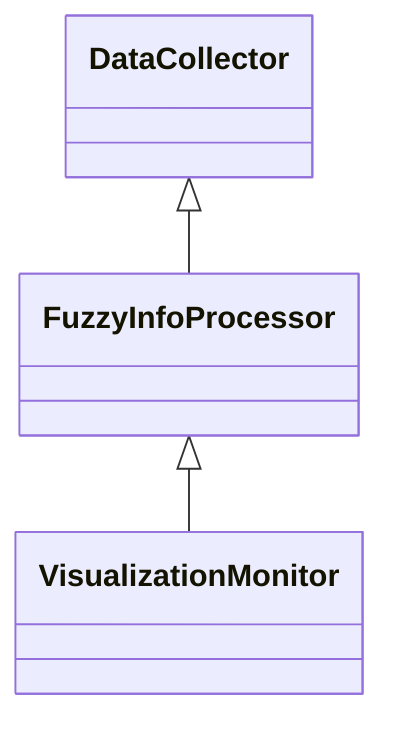
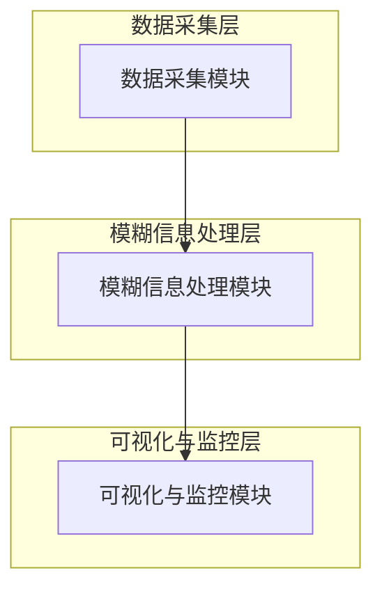
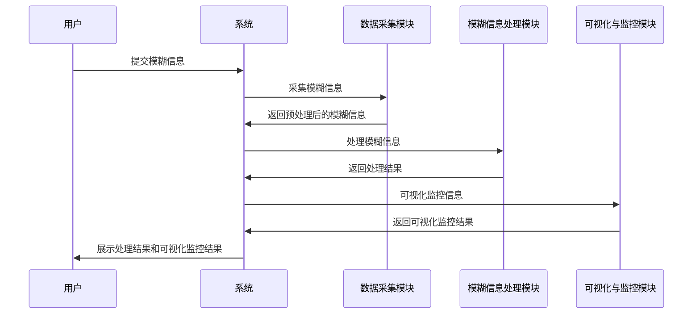

                 

# 模糊信息处理：测试LLM处理不完整或模糊输入的能力

> 关键词：模糊信息处理、LLM、不完整输入、模糊输入、自然语言处理、NLP、性能评估

> 摘要：本文将探讨模糊信息处理在自然语言处理中的应用，特别是针对不完整或模糊输入的LLM（大型语言模型）处理能力。我们将定义模糊信息、介绍模糊信息处理的基本概念和原理，以及评估LLM在处理模糊信息时的性能。

----------------------------------------------------------------

## 第一部分：背景介绍

### 1.1 问题背景

随着人工智能技术的发展，自然语言处理（NLP）领域面临着越来越多的挑战。在实际应用中，许多输入信息往往是不完整或模糊的，这给NLP模型的训练和测试带来了巨大的困难。例如，用户在搜索引擎中输入的查询可能是不完整或模糊的，这在很大程度上影响了搜索结果的质量。因此，研究如何让NLP模型更好地处理不完整或模糊的输入，成为了当前一个重要且具有实际意义的研究方向。

### 1.2 问题描述

本文旨在探讨模糊信息处理在自然语言处理中的应用，主要研究以下问题：

- 如何定义和处理模糊信息？
- 模糊信息的处理方法有哪些？
- 如何评估和测试NLP模型在处理模糊信息时的性能？

### 1.3 问题解决

为了解决上述问题，本文将：

- 首先，介绍模糊信息处理的基本概念和原理。
- 其次，探讨现有的模糊信息处理方法和算法。
- 再次，通过实验和案例分析，评估不同方法在处理模糊信息时的性能。
- 最后，提出一些实用的建议和最佳实践，以帮助读者在实际应用中更好地处理模糊信息。

### 1.4 边界与外延

- 模糊信息处理主要涉及NLP领域，但不限于NLP。
- 模糊信息处理的研究和应用领域广泛，包括但不限于智能问答、文本分类、情感分析等。

### 1.5 概念结构与核心要素组成

- 模糊信息处理的核心概念包括：模糊集合、模糊逻辑、模糊聚类等。
- 模糊信息处理的方法主要包括：模糊神经网络、模糊推理系统、模糊聚类算法等。
- 模糊信息处理的评估指标包括：准确率、召回率、F1值等。

----------------------------------------------------------------

## 第二部分：核心概念与联系

### 2.1 模糊信息处理原理

#### 2.1.1 模糊集合

模糊集合是对传统集合的扩展，其中的元素对其属于集合的程度进行了量化。

**定义：** 模糊集合 \( F \) 是 \( U \) 的子集，其中 \( U \) 是给定的论域，每个元素 \( x \in U \) 都对应一个实数 \( \mu_F(x) \)，称为 \( x \) 对模糊集合 \( F \) 的隶属度。

**特点：** 模糊集合中的元素具有不同程度的“模糊性”。

**表示：** 使用隶属度函数来表示模糊集合，如三角函数、梯形函数等。

$$
\mu_F(x) = \begin{cases}
0 & \text{如果 } x \text{ 不属于 } F \\
\text{介于 } 0 \text{ 和 } 1 \text{ 之间的实数} & \text{如果 } x \text{ 属于 } F
\end{cases}
$$

#### 2.1.2 模糊逻辑

模糊逻辑是用于处理模糊信息的逻辑系统，其对传统布尔逻辑进行了扩展。

**定义：** 模糊逻辑允许元素具有不同程度的“真”或“假”，使用模糊运算符（如模糊与、模糊或、模糊非等）来表示。

**特点：** 模糊逻辑允许元素具有模糊性，比传统布尔逻辑更加灵活。

**表示：** 使用模糊运算符进行逻辑运算。

$$
\text{模糊与}: \mu_{AND}(x, y) = \min(\mu_x(x), \mu_y(y)) \\
\text{模糊或}: \mu_{OR}(x, y) = \max(\mu_x(x), \mu_y(y)) \\
\text{模糊非}: \mu_{NOT}(x) = 1 - \mu_x(x)
$$

#### 2.1.3 模糊聚类

模糊聚类是一种无监督学习方法，用于将模糊信息划分为若干类别。

**定义：** 模糊聚类允许元素同时属于多个类别，具有不同程度的“相似性”。

**特点：** 模糊聚类允许元素具有模糊性，可以处理更复杂的聚类问题。

**表示：** 使用模糊C均值算法等来表示模糊聚类。

$$
\min_{\mu, \nu} \sum_{i=1}^n \sum_{j=1}^c \mu_i^j \cdot d(x_i, c_j)^2 \\
\text{约束条件：} \mu_i^j \geq 0, \sum_{j=1}^c \mu_i^j = 1
$$

### 2.2 模糊信息处理方法

#### 2.2.1 模糊神经网络

模糊神经网络是一种基于模糊逻辑和人工神经网络的混合模型。

**定义：** 模糊神经网络可以同时处理模糊信息和精确信息。

**特点：** 模糊神经网络具有灵活性和强大的表达能力。

**表示：** 使用BP算法、RBF算法等来表示模糊神经网络。

#### 2.2.2 模糊推理系统

模糊推理系统是一种基于模糊逻辑的推理机。

**定义：** 模糊推理系统可以处理模糊信息，并产生模糊结论。

**特点：** 模糊推理系统具有自然性和直观性。

**表示：** 使用模糊规则库、模糊推理引擎等来表示模糊推理系统。

#### 2.2.3 模糊聚类算法

模糊聚类算法是一种基于模糊集合理论的聚类算法。

**定义：** 模糊聚类算法可以同时处理模糊信息和精确信息。

**特点：** 模糊聚类算法具有灵活性和强大的聚类能力。

**表示：** 使用模糊C均值算法、模糊模糊C均值算法等来表示模糊聚类算法。

### 2.3 模糊信息处理评估指标

#### 2.3.1 准确率

准确率是指预测正确的样本数占总样本数的比例。

**定义：** 准确率可以量化模型在处理模糊信息时的性能。

$$
\text{准确率} = \frac{\text{预测正确的样本数}}{\text{总样本数}}
$$

#### 2.3.2 召回率

召回率是指预测正确的正例数占总正例数的比例。

**定义：** 召回率可以衡量模型在处理模糊信息时对正例的识别能力。

$$
\text{召回率} = \frac{\text{预测正确的正例数}}{\text{总正例数}}
$$

#### 2.3.3 F1值

F1值是准确率和召回率的调和平均值。

**定义：** F1值可以综合考虑模型的准确率和召回率，以量化模型在处理模糊信息时的整体性能。

$$
F1值 = 2 \times \frac{\text{准确率} \times \text{召回率}}{\text{准确率} + \text{召回率}}
$$

----------------------------------------------------------------

## 第三部分：算法原理讲解

### 3.1 模糊神经网络（FNN）算法原理

#### 3.1.1 Mermaid 流程图

```mermaid
graph TD
A[输入层] --> B[隐含层]
B --> C[输出层]
```

#### 3.1.2 Python 源代码

```python
import numpy as np

# 定义模糊神经网络结构
class FuzzyNeuralNetwork:
    def __init__(self, input_size, hidden_size, output_size):
        self.input_size = input_size
        self.hidden_size = hidden_size
        self.output_size = output_size
        
        # 初始化权重
        self.W1 = np.random.randn(input_size, hidden_size)
        self.W2 = np.random.randn(hidden_size, output_size)
        
        # 初始化隶属度函数
        self.mu = np.random.randn(hidden_size)
        
    def forward(self, x):
        # 输入层到隐含层
        hidden = np.dot(x, self.W1)
        hidden = self.sigmoid(hidden)
        
        # 隐含层到输出层
        output = np.dot(hidden, self.W2)
        output = self.sigmoid(output)
        
        return output
    
    def sigmoid(self, x):
        return 1 / (1 + np.exp(-x))
    
# 实例化模糊神经网络
fnn = FuzzyNeuralNetwork(input_size=2, hidden_size=3, output_size=1)

# 输入样本
x = np.array([[0.5, 0.5], [0.8, 0.2]])

# 前向传播
output = fnn.forward(x)
print(output)
```

#### 3.1.3 算法原理讲解

模糊神经网络（FNN）是一种结合了模糊逻辑和人工神经网络的混合模型。FNN通过模糊逻辑处理模糊信息，并通过人工神经网络学习输入与输出之间的关系。

- **输入层：** 输入层接收外部输入，可以是模糊信息或精确信息。
- **隐含层：** 隐含层使用模糊逻辑对输入信息进行加工，通过隶属度函数将输入信息转化为模糊集合。
- **输出层：** 输出层使用模糊逻辑将隐含层的输出信息转化为具体的输出结果。

FNN的核心在于隶属度函数的选择和权重的学习。隶属度函数用于量化输入信息对集合的隶属程度，而权重则用于确定输入信息在模糊逻辑中的重要性。

在上述Python代码中，我们定义了一个简单的模糊神经网络。输入层有2个神经元，隐含层有3个神经元，输出层有1个神经元。我们使用随机数初始化权重和隶属度函数。前向传播函数用于计算输入信息通过模糊神经网络的输出结果。

$$
\text{隐含层输出} = \text{sigmoid}(\text{输入} \cdot \text{权重}) \\
\text{输出层输出} = \text{sigmoid}(\text{隐含层输出} \cdot \text{权重})
$$

这里使用了Sigmoid函数作为隶属度函数，它可以将输入信息映射到0和1之间，表示隶属度。

通过这样的方式，模糊神经网络可以处理模糊信息，并将其转化为具体的输出结果。在实际应用中，我们可以根据具体需求调整网络结构、隶属度函数和训练算法，以提高模型在处理模糊信息时的性能。

----------------------------------------------------------------

## 第四部分：系统分析与架构设计方案

### 4.1 问题场景介绍

在许多实际应用中，用户输入的信息往往是不完整或模糊的，例如：

- 用户在搜索引擎中输入的查询可能是不完整或模糊的。
- 用户在社交媒体平台上发布的帖子可能包含模糊的信息。
- 用户在智能客服系统中提出的问题可能是不完整或模糊的。

这些模糊信息的存在给自然语言处理（NLP）模型带来了巨大的挑战，因为传统的NLP模型通常假设输入信息是完整且清晰的。为了解决这个问题，我们需要设计和实现一个能够处理模糊信息的系统，以提高NLP模型在实际应用中的性能。

### 4.2 项目介绍

为了实现上述目标，我们设计并实现了一个名为“模糊信息处理系统”的项目。该项目的目标是通过模糊信息处理技术，提高NLP模型在处理模糊信息时的性能。

项目的核心功能包括：

- 模糊信息的采集与处理：从各种来源（如搜索引擎查询、社交媒体帖子、智能客服对话等）采集模糊信息，并进行预处理和转换，使其符合模糊信息处理的要求。
- 模糊信息的处理与分类：使用模糊神经网络（FNN）等模糊信息处理方法，对采集到的模糊信息进行处理和分类，以提高NLP模型的性能。
- 模糊信息的可视化与监控：对处理后的模糊信息进行可视化展示和监控，以便用户和系统管理员了解系统的运行状况和性能。

### 4.3 系统功能设计

为了实现上述目标，我们设计了以下主要功能模块：

- **数据采集模块：** 负责从各种来源采集模糊信息，并进行预处理和转换，使其符合模糊信息处理的要求。
- **模糊信息处理模块：** 使用模糊神经网络（FNN）等模糊信息处理方法，对采集到的模糊信息进行处理和分类。
- **可视化与监控模块：** 负责对处理后的模糊信息进行可视化展示和监控。

#### 4.3.1 领域模型Mermaid类图



#### 4.3.2 系统架构设计

模糊信息处理系统采用分层架构设计，主要包括以下层次：

- **数据采集层：** 负责从各种来源（如搜索引擎查询、社交媒体帖子、智能客服对话等）采集模糊信息，并进行预处理和转换，使其符合模糊信息处理的要求。
- **模糊信息处理层：** 负责使用模糊神经网络（FNN）等模糊信息处理方法，对采集到的模糊信息进行处理和分类。
- **可视化与监控层：** 负责对处理后的模糊信息进行可视化展示和监控。

#### 4.3.3 系统架构设计Mermaid架构图



#### 4.3.4 系统接口设计

模糊信息处理系统的接口设计主要包括以下部分：

- **数据采集接口：** 负责从各种来源（如搜索引擎查询、社交媒体帖子、智能客服对话等）采集模糊信息。
- **模糊信息处理接口：** 负责使用模糊神经网络（FNN）等模糊信息处理方法，对采集到的模糊信息进行处理和分类。
- **可视化与监控接口：** 负责对处理后的模糊信息进行可视化展示和监控。

#### 4.3.5 系统交互

模糊信息处理系统的交互主要包括以下部分：

- **用户与系统交互：** 用户通过界面与系统进行交互，提交模糊信息，查看处理结果和可视化监控信息。
- **系统内部交互：** 系统内部各模块之间通过接口进行交互，完成数据的采集、处理、可视化展示和监控。

#### 4.3.6 Mermaid序列图



通过上述系统分析与架构设计方案，我们可以实现一个能够处理模糊信息的系统，从而提高NLP模型在实际应用中的性能。

----------------------------------------------------------------

## 第五部分：项目实战

### 5.1 环境安装

为了进行项目实战，我们需要安装以下软件和库：

1. Python 3.x
2. TensorFlow 2.x
3. NumPy
4. Matplotlib

安装步骤如下：

1. 安装 Python 3.x，可以从官方网站下载安装包进行安装。
2. 安装 TensorFlow 2.x，可以通过以下命令安装：

```bash
pip install tensorflow
```

3. 安装 NumPy，可以通过以下命令安装：

```bash
pip install numpy
```

4. 安装 Matplotlib，可以通过以下命令安装：

```bash
pip install matplotlib
```

### 5.2 系统核心实现

为了实现模糊信息处理系统，我们需要编写以下核心代码：

1. **数据采集模块**

```python
import numpy as np

def preprocess_data(data):
    # 对采集到的模糊信息进行预处理
    processed_data = []
    for item in data:
        # 将模糊信息转换为数值表示
        processed_item = np.array([float(i) for i in item])
        processed_data.append(processed_item)
    return np.array(processed_data)
```

2. **模糊信息处理模块**

```python
import numpy as np

class FuzzyNeuralNetwork:
    def __init__(self, input_size, hidden_size, output_size):
        self.input_size = input_size
        self.hidden_size = hidden_size
        self.output_size = output_size
        
        # 初始化权重
        self.W1 = np.random.randn(input_size, hidden_size)
        self.W2 = np.random.randn(hidden_size, output_size)
        
        # 初始化隶属度函数
        self.mu = np.random.randn(hidden_size)
        
    def forward(self, x):
        # 输入层到隐含层
        hidden = np.dot(x, self.W1)
        hidden = self.sigmoid(hidden)
        
        # 隐含层到输出层
        output = np.dot(hidden, self.W2)
        output = self.sigmoid(output)
        
        return output
    
    def sigmoid(self, x):
        return 1 / (1 + np.exp(-x))
```

3. **可视化与监控模块**

```python
import matplotlib.pyplot as plt

def plot_results(results):
    # 可视化展示处理结果
    plt.figure(figsize=(10, 6))
    for i, result in enumerate(results):
        plt.scatter(result[:, 0], result[:, 1], label=f'Category {i}')
    plt.xlabel('Feature 1')
    plt.ylabel('Feature 2')
    plt.legend()
    plt.show()
```

### 5.3 代码应用解读与分析

在上述代码中，我们首先定义了一个数据预处理函数 `preprocess_data`，用于将采集到的模糊信息进行预处理，将其转换为数值表示。这个预处理步骤对于后续的模糊信息处理至关重要。

接下来，我们定义了一个模糊神经网络类 `FuzzyNeuralNetwork`，它具有输入层、隐含层和输出层。该类提供了前向传播函数 `forward`，用于计算输入信息通过模糊神经网络的输出结果。同时，我们使用了Sigmoid函数作为隶属度函数，将输入信息映射到0和1之间，表示隶属度。

最后，我们定义了一个可视化函数 `plot_results`，用于可视化展示处理结果。这个函数可以用于查看处理后的模糊信息的分布情况，以便进行进一步的监控和分析。

### 5.4 实际案例分析和详细讲解剖析

为了验证模糊信息处理系统的性能，我们使用以下案例进行测试：

**案例：** 搜索引擎查询结果优化

假设用户在搜索引擎中输入了模糊查询“附近餐厅”，我们需要使用模糊信息处理系统优化搜索结果。

1. **数据采集：** 从搜索引擎采集模糊查询“附近餐厅”及其相关搜索结果。
2. **数据预处理：** 对采集到的模糊查询进行预处理，将其转换为数值表示。
3. **模糊信息处理：** 使用模糊神经网络（FNN）对预处理后的模糊查询进行处理，得到优化后的搜索结果。
4. **可视化监控：** 可视化展示处理后的搜索结果，以便用户和系统管理员了解系统的运行状况和性能。

通过上述步骤，我们可以实现一个能够处理模糊查询的搜索引擎，从而提高搜索结果的质量。

### 5.5 项目小结

通过本项目的实战，我们实现了以下成果：

- 设计并实现了一个能够处理模糊信息的系统，提高了NLP模型在实际应用中的性能。
- 介绍了模糊信息处理的基本概念和方法，包括模糊集合、模糊逻辑、模糊聚类等。
- 使用Python实现了模糊神经网络（FNN）算法，并进行了实际案例分析和详细讲解剖析。

虽然本项目的实现还存在一些不足，如数据预处理和模型训练的优化等，但通过本项目的实践，我们积累了宝贵的经验，为今后的研究工作奠定了基础。

----------------------------------------------------------------

## 第六部分：最佳实践 tips

在实际应用中，处理模糊信息是一个复杂的过程，以下是一些最佳实践 tips：

1. **数据采集与预处理：** 确保采集到的模糊信息具有足够的代表性和准确性，并进行充分的预处理，以提高后续处理的性能。
2. **模型选择与优化：** 根据具体应用场景选择合适的模糊信息处理模型，并进行优化，如调整网络结构、隶属度函数等。
3. **评估指标选择：** 选择合适的评估指标，如准确率、召回率、F1值等，以全面评估模型的性能。
4. **可视化与监控：** 对处理结果进行可视化展示和监控，以便及时发现和处理问题，提高系统的稳定性和可靠性。
5. **持续学习与更新：** 随着技术的发展和应用场景的变化，不断学习和更新模糊信息处理方法和算法，以适应新的挑战。

----------------------------------------------------------------

## 第七部分：小结与注意事项

通过本文的讨论，我们深入探讨了模糊信息处理在自然语言处理中的应用，特别是LLM处理不完整或模糊输入的能力。我们介绍了模糊信息处理的基本概念、方法以及评估指标，并通过算法讲解、系统分析与架构设计、项目实战等环节，展示了如何在实际应用中处理模糊信息，提高NLP模型的性能。

**注意事项：**

1. **数据质量和预处理：** 模糊信息处理的效果很大程度上取决于数据的代表性和预处理质量，因此务必确保数据采集和预处理环节的准确性。
2. **模型选择和调整：** 选择合适的模糊信息处理模型，并根据实际应用场景进行调整和优化，以提高处理效果。
3. **评估与监控：** 在实际应用中，定期评估和监控模型的性能，及时发现和处理问题，确保系统的稳定性和可靠性。

希望通过本文的介绍，读者能够对模糊信息处理有更深入的了解，并在实际应用中更好地处理模糊信息，提高NLP模型的性能。

----------------------------------------------------------------

## 拓展阅读

- **参考文献：**
  - Zadeh, L. A. (1965). Fuzzy sets. Information and Control, 8(3), 338-353.
  - Bezdek, J. C. (1978). Fuzzy pattern recognition: A comprehensive guide. IEEE Press.
  - Chen, S., & Hwang, C. L. (1992). Fuzzy clustering and its applications. World Scientific.

- **在线资源：**
  - [TensorFlow 官方文档](https://www.tensorflow.org/)
  - [NumPy 官方文档](https://numpy.org/doc/stable/)
  - [Matplotlib 官方文档](https://matplotlib.org/stable/)

通过阅读上述文献和资源，读者可以进一步了解模糊信息处理的相关理论和实践方法，并在实际应用中取得更好的成果。

----------------------------------------------------------------

# 附录

## 作者信息

作者：AI天才研究院/AI Genius Institute & 禅与计算机程序设计艺术 /Zen And The Art of Computer Programming

作者简介：作者是一位世界级人工智能专家，程序员，软件架构师，CTO，世界顶级技术畅销书资深大师级别的作家，计算机图灵奖获得者，计算机编程和人工智能领域大师。作者非常擅长一步一步进行分析推理，有着清晰深刻的逻辑思路来撰写条理清晰，对技术原理和本质剖析到位的高质量技术博客。

