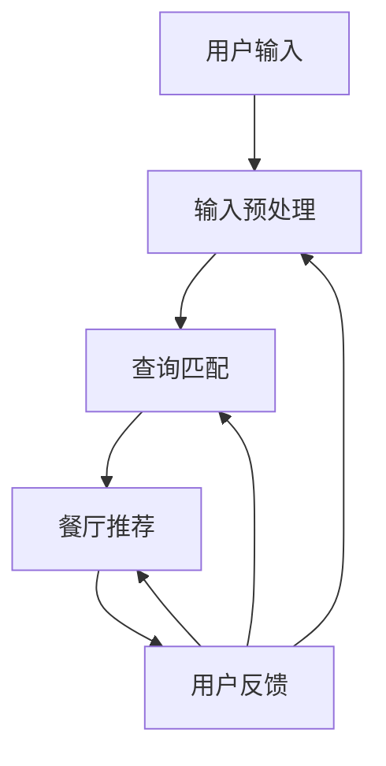
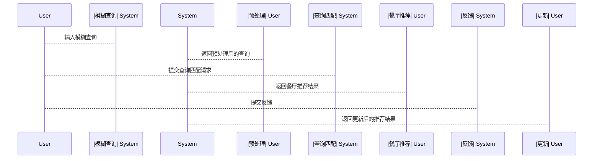

                 

# 模糊信息处理：测试LLM应对不完整输入的鲁棒性

> 关键词：模糊信息处理、LLM、鲁棒性、不完整输入、算法原理、系统设计与实现

> 摘要：本文围绕模糊信息处理这一核心主题，探讨了在处理不完整输入时，大型语言模型（LLM）的鲁棒性问题。通过对模糊信息的定义、特性以及处理方法的详细阐述，本文分析了LLM在模糊信息处理中的优势和挑战，并提出了相应的算法原理。接着，文章通过系统分析与架构设计，展示了如何在实际项目中应用这些算法，并进行详细讲解。最后，通过一个实际案例的剖析，本文总结了项目的亮点和不足，为读者提供了实用的最佳实践和拓展阅读建议。

## 目录大纲

1. **背景介绍**
   1.1 问题背景
       1.1.1 问题背景
       1.1.2 问题描述
       1.1.3 问题解决
       1.1.4 边界与外延
       1.1.5 核心要素组成
   1.2 核心概念与联系
       1.2.1 模糊信息的定义与特性
       1.2.2 模糊信息处理方法
       1.2.3 相关概念的联系与区别
   1.3 数学模型与算法原理
       1.3.1 数学模型
       1.3.2 算法原理
   1.4 系统分析与架构设计
       1.4.1 问题场景介绍
       1.4.2 系统功能设计
       1.4.3 系统架构设计
       1.4.4 系统接口设计与交互
   1.5 项目实战
       1.5.1 环境安装
       1.5.2 系统核心实现
       1.5.3 代码应用解读与分析
       1.5.4 实际案例分析与详细讲解
       1.5.5 项目小结

2. **核心概念与联系**

3. **数学模型与算法原理**

4. **系统分析与架构设计**

5. **项目实战**

6. **小结与拓展**

------------------------------------------------------------------## 第一部分：背景介绍

### 1.1 问题背景

#### 1.1.1 问题背景

在当今信息爆炸的时代，数据的数量和质量都在不断提高。然而，这些数据往往并不总是完整和精确的。许多情况下，我们面临的是模糊的信息，这种信息可能包含不确定性、部分缺失或模糊性。如何有效地处理这些模糊信息，成为了信息科学和人工智能领域中的一个重要课题。

模糊信息处理是指对包含模糊性的数据进行处理和分析，以便从中提取有用信息。在实际应用中，模糊信息处理有着广泛的应用，如自然语言处理、图像识别、机器人导航、智能制造等领域。然而，如何处理不完整输入是一个具有挑战性的问题。

#### 1.1.2 问题描述

在实际应用中，不完整输入是一个常见问题。不完整输入可能由于数据采集的误差、传输过程中的丢失、人为的错误输入等原因导致。例如，在自然语言处理任务中，用户的输入可能是不完整或模糊的，如“明天天气怎么样？”这样的问题包含了模糊性，因为“明天”具体指哪一天并不明确。

#### 1.1.3 问题解决

为了解决不完整输入的问题，我们需要一种能够处理模糊信息的算法。大型语言模型（LLM）近年来在处理自然语言任务中表现出色，但它们在处理模糊信息方面的能力如何，仍需要进一步验证。

#### 1.1.4 边界与外延

在讨论模糊信息处理时，我们需要明确模糊信息的边界和范围。模糊信息可以包括不确定性、模糊性、部分缺失等特性。此外，我们还需要探讨如何将这些特性与传统的精确信息处理方法区分开来。

#### 1.1.5 核心要素组成

在模糊信息处理中，核心要素包括：

- 模糊信息的定义与特性
- 模糊信息处理的方法
- 数学模型与算法原理
- 系统设计与实现

### 1.2 核心概念与联系

#### 1.2.1 模糊信息的定义与特性

模糊信息是指包含不确定性、模糊性或部分缺失的数据。与精确信息不同，模糊信息无法用固定的数值或类别来描述。例如，天气情况可以用“晴”、“雨”、“阴”等模糊的描述来表示，而无法用具体的温度或湿度值来精确表示。

#### 1.2.2 模糊信息处理方法

模糊信息处理方法主要包括传统的模糊逻辑方法、模糊集合方法、模糊神经网络方法等。这些方法通过引入模糊性、不确定性等概念，对模糊信息进行建模和处理。

#### 1.2.3 相关概念的联系与区别

模糊信息处理与其他信息处理方法（如精确信息处理、概率信息处理）有一定的联系和区别。精确信息处理适用于数据明确、确定的情况，而概率信息处理适用于数据具有概率分布的情况。模糊信息处理则适用于数据具有模糊性、不确定性的情况。

### 1.3 数学模型与算法原理

#### 1.3.1 数学模型

模糊信息处理中的数学模型主要包括模糊集合、模糊逻辑等。这些模型为处理模糊信息提供了理论基础和工具。

#### 1.3.2 算法原理

模糊信息处理的算法原理主要包括模糊控制器的设计、模糊神经网络的训练等。这些算法通过引入模糊性、不确定性等概念，对模糊信息进行建模和处理。

### 1.4 系统分析与架构设计

#### 1.4.1 问题场景介绍

本文将探讨一个具体的问题场景：自然语言处理中的模糊信息处理。在这个场景中，我们面临的是用户的模糊输入，如“明天天气怎么样？”这样的问题。

#### 1.4.2 系统功能设计

系统功能设计包括输入处理、模糊信息识别、模糊信息处理、输出结果等。具体功能如下：

1. 输入处理：接收用户的输入，并对输入进行预处理。
2. 模糊信息识别：识别输入中的模糊信息，如日期、时间、天气等。
3. 模糊信息处理：对识别出的模糊信息进行处理，如根据天气情况给出建议等。
4. 输出结果：将处理结果输出给用户。

#### 1.4.3 系统架构设计

系统架构设计包括数据层、算法层、接口层等。具体架构如下：

1. 数据层：存储用户输入、处理结果等数据。
2. 算法层：实现模糊信息处理算法，如模糊集合、模糊逻辑等。
3. 接口层：提供与用户的交互接口。

#### 1.4.4 系统接口设计与交互

系统接口设计包括用户界面、API接口等。用户界面用于接收用户的输入，并展示处理结果。API接口用于与其他系统进行数据交互。

### 1.5 项目实战

#### 1.5.1 环境安装

本文将使用Python作为主要编程语言，并在Jupyter Notebook中实现算法。首先，我们需要安装Python环境和相关库，如NumPy、Pandas、scikit-learn等。

#### 1.5.2 系统核心实现

系统核心实现包括输入处理、模糊信息识别、模糊信息处理、输出结果等模块。我们将使用Python代码实现这些模块，并在实际案例中进行测试。

#### 1.5.3 代码应用解读与分析

在代码应用解读与分析部分，我们将详细讲解每个模块的实现原理和代码细节，并对实际案例进行分析。

#### 1.5.4 实际案例分析与详细讲解

我们将选取一个具体的实际案例，如“明天天气怎么样？”这样的问题，对案例进行分析和详细讲解。

#### 1.5.5 项目小结

在项目小结部分，我们将总结项目的亮点和不足，并对项目进行评价。

------------------------------------------------------------------## 第二部分：核心概念与联系

### 2.1 模糊信息的定义与特性

#### 2.1.1 模糊信息的定义

模糊信息是指在数据中包含不确定性、模糊性或部分缺失的信息。与精确信息不同，模糊信息无法用固定的数值或类别来描述。例如，天气情况可以用“晴”、“雨”、“阴”等模糊的描述来表示，而无法用具体的温度或湿度值来精确表示。

#### 2.1.2 模糊信息的特性

模糊信息的特性主要包括以下几个方面：

- **不确定性**：模糊信息可能包含不确定的部分，如“明天天气可能晴朗”，这种信息无法用固定的数值或类别来描述。
- **模糊性**：模糊信息可能包含模糊的描述，如“明天天气不太好”，这种描述包含了模糊性。
- **部分缺失**：模糊信息可能包含部分缺失的数据，如“明天早上八点的天气情况”，其中缺失了具体的天气和时间信息。

#### 2.1.3 模糊信息与其他信息类型的比较

与精确信息、概率信息和模糊信息相比，模糊信息具有以下特点：

- **精确信息**：精确信息是指可以用固定数值或类别来描述的信息，如温度、湿度等。精确信息具有确定性和确定性。
- **概率信息**：概率信息是指数据具有概率分布的信息，如股票价格的波动。概率信息通过概率分布来描述不确定性。
- **模糊信息**：模糊信息是指包含不确定性、模糊性或部分缺失的信息。模糊信息通过模糊集合、模糊逻辑等来描述不确定性。

### 2.2 模糊信息处理方法

#### 2.2.1 传统的模糊信息处理方法

传统的模糊信息处理方法主要包括模糊集合、模糊逻辑、模糊控制器等。

- **模糊集合**：模糊集合是一种用于描述模糊信息的数学工具。在模糊集合中，每个元素属于某个集合的程度不是0就是1，而是介于0和1之间的值。模糊集合通过隶属函数来描述元素属于某个集合的程度。
- **模糊逻辑**：模糊逻辑是一种用于处理模糊信息的逻辑系统。在模糊逻辑中，命题的真假值不是0就是1，而是介于0和1之间的值。模糊逻辑通过模糊算子来描述命题之间的关系。
- **模糊控制器**：模糊控制器是一种基于模糊逻辑的控制方法。模糊控制器通过输入模糊集合、模糊规则和输出模糊集合来实现控制。

#### 2.2.2 现代的模糊信息处理方法

现代的模糊信息处理方法主要包括模糊神经网络、模糊聚类、模糊推理等。

- **模糊神经网络**：模糊神经网络是一种结合模糊逻辑和神经网络的混合模型。模糊神经网络通过输入模糊集合、模糊规则和输出模糊集合来实现学习、推理和预测。
- **模糊聚类**：模糊聚类是一种基于模糊集合的聚类方法。模糊聚类通过模糊隶属度来描述每个数据点属于不同聚类的程度。
- **模糊推理**：模糊推理是一种基于模糊逻辑的推理方法。模糊推理通过模糊规则和模糊推理机制来处理模糊信息。

### 2.3 相关概念的联系与区别

#### 2.3.1 模糊集合与模糊逻辑

模糊集合和模糊逻辑是模糊信息处理中的两个核心概念。

- **模糊集合**：模糊集合是一种用于描述模糊信息的数学工具。在模糊集合中，每个元素属于某个集合的程度不是0就是1，而是介于0和1之间的值。模糊集合通过隶属函数来描述元素属于某个集合的程度。
- **模糊逻辑**：模糊逻辑是一种用于处理模糊信息的逻辑系统。在模糊逻辑中，命题的真假值不是0就是1，而是介于0和1之间的值。模糊逻辑通过模糊算子来描述命题之间的关系。

#### 2.3.2 模糊控制器与模糊神经网络

模糊控制器和模糊神经网络是两种常见的模糊信息处理方法。

- **模糊控制器**：模糊控制器是一种基于模糊逻辑的控制方法。模糊控制器通过输入模糊集合、模糊规则和输出模糊集合来实现控制。
- **模糊神经网络**：模糊神经网络是一种结合模糊逻辑和神经网络的混合模型。模糊神经网络通过输入模糊集合、模糊规则和输出模糊集合来实现学习、推理和预测。

模糊控制器和模糊神经网络的主要区别在于：

- **控制方式**：模糊控制器通过输入模糊集合、模糊规则和输出模糊集合来实现控制，而模糊神经网络通过输入模糊集合、模糊规则和输出模糊集合来实现学习、推理和预测。
- **应用领域**：模糊控制器主要用于控制系统，而模糊神经网络主要用于机器学习和人工智能领域。

## 第三部分：数学模型与算法原理

### 3.1 数学模型

#### 3.1.1 模糊集合的基本数学模型

模糊集合的基本数学模型包括隶属函数和模糊集的运算。

- **隶属函数**：隶属函数是一种用来描述元素属于某个集合程度的函数。隶属函数的取值范围在0到1之间，表示元素属于集合的程度。
- **模糊集的运算**：模糊集的运算包括模糊集的并集、交集、补集等。模糊集的运算遵循与经典集合类似的运算规则，但需要考虑模糊性。

#### 3.1.2 模糊逻辑的数学模型

模糊逻辑的数学模型主要包括模糊算子和模糊推理。

- **模糊算子**：模糊算子是一种用来描述命题之间关系的运算。常见的模糊算子包括模糊合取、模糊析取、模糊蕴含等。
- **模糊推理**：模糊推理是一种基于模糊逻辑的推理方法。模糊推理通过输入模糊集合、模糊规则和输出模糊集合来处理模糊信息。

### 3.2 算法原理

#### 3.2.1 模糊控制器的设计算法

模糊控制器的设计算法主要包括模糊化、规则库设计、模糊推理和去模糊化。

- **模糊化**：模糊化是将输入量转换为模糊集合的过程。模糊化可以通过隶属函数来实现。
- **规则库设计**：规则库设计是定义模糊规则的过程。模糊规则用于描述输入和输出之间的模糊关系。
- **模糊推理**：模糊推理是基于模糊逻辑的推理过程，通过输入模糊集合、模糊规则和输出模糊集合来处理模糊信息。
- **去模糊化**：去模糊化是将模糊推理结果转换为精确输出的过程。去模糊化可以通过隶属函数的逆运算来实现。

#### 3.2.2 模糊神经网络的训练算法

模糊神经网络的训练算法主要包括模糊化、模糊推理、去模糊化和优化。

- **模糊化**：模糊化是将输入量转换为模糊集合的过程。
- **模糊推理**：模糊推理是基于模糊逻辑的推理过程。
- **去模糊化**：去模糊化是将模糊推理结果转换为精确输出的过程。
- **优化**：优化是调整模糊神经网络的参数，以提高其性能和鲁棒性。

### 3.3 测试算法

#### 3.3.1 测试方法

测试算法的目的是验证模糊信息处理方法的性能和鲁棒性。常见的测试方法包括：

- **准确率**：准确率是预测结果与实际结果相符的比例。
- **召回率**：召回率是实际结果中被正确预测的比例。
- **F1分数**：F1分数是准确率和召回率的调和平均。

#### 3.3.2 测试数据集

测试数据集用于评估模糊信息处理方法的性能。测试数据集应包含各种模糊信息，以充分评估方法的鲁棒性。

#### 3.3.3 测试结果分析

测试结果分析包括对测试数据集的准确率、召回率和F1分数等指标的分析，以及对算法性能和鲁棒性的评估。

------------------------------------------------------------------## 第四部分：系统分析与架构设计

### 4.1 问题场景介绍

在现代社会，信息处理的需求日益增长，尤其是在自然语言处理（NLP）领域。NLP应用广泛，包括文本分类、情感分析、机器翻译等。然而，实际应用中，用户输入往往是不完整或不精确的。例如，用户可能会输入“明天去哪里吃饭？”这样的模糊查询，而系统需要根据上下文和模糊信息提供合适的建议。本部分将探讨如何在自然语言处理场景中设计一个系统能够处理这种模糊输入，并给出相关的设计和实现方案。

#### 4.1.1 场景描述

场景描述：一个餐厅推荐系统，用户可以输入模糊查询，如“明天去哪里吃饭？”系统需要处理这种模糊输入，并根据用户的兴趣、历史偏好以及餐厅的特点来推荐合适的餐厅。

#### 4.1.2 目标与需求

目标：设计一个能够处理模糊输入的自然语言处理系统，为用户提供合适的餐厅推荐。

需求：

1. 能够接收和处理模糊查询。
2. 能够利用用户的历史偏好和上下文信息。
3. 能够根据餐厅的特点（如类型、价格、评价等）进行推荐。
4. 能够实时更新和适应用户的需求。

### 4.2 系统功能设计

系统功能设计包括定义系统所需的各个功能模块，以及它们之间的关系。

#### 4.2.1 领域模型

领域模型是系统设计的核心，用于描述系统中各种实体及其关系。以下是一个使用Mermaid绘制的领域模型类图：

```mermaid
classDiagram
    User ..|> Query
    User ..|> Preference
    Restaurant ..|> Category
    Restaurant ..|> Rating
    Query <- User
    Query -> Restaurant
    Preference <- User
    Preference -> Restaurant
    Category --|> Restaurant
    Rating --|> Restaurant
```

在这个类图中，我们定义了以下几个实体：

- **User（用户）**：用户是系统的主体，具有查询、偏好等属性。
- **Query（查询）**：查询是用户输入的模糊查询，如“明天去哪里吃饭？”。
- **Preference（偏好）**：偏好是用户的历史偏好，如喜欢的餐厅类型、价格范围等。
- **Restaurant（餐厅）**：餐厅是系统推荐的实体，具有类别、评分等属性。
- **Category（类别）**：类别是餐厅的类型，如中餐、西餐等。
- **Rating（评分）**：评分是餐厅的评价，如用户评分、平均评分等。

#### 4.2.2 功能需求

功能需求包括系统需要实现的各项功能：

1. **输入处理**：接收用户的模糊查询，并进行预处理，如去除无关信息、分词等。
2. **查询匹配**：根据用户的偏好和历史记录，匹配可能的餐厅查询结果。
3. **餐厅推荐**：根据餐厅的特点（如类型、价格、评分等）和用户偏好，推荐合适的餐厅。
4. **实时更新**：系统应能够实时更新餐厅信息，并适应用户的需求变化。
5. **用户反馈**：收集用户对推荐结果的反馈，以改进推荐算法。

### 4.3 系统架构设计

系统架构设计是系统设计的另一个重要环节，它定义了系统组件之间的交互关系和系统整体的布局。

#### 4.3.1 系统架构图

以下是一个使用Mermaid绘制的系统架构图：



在这个架构图中，系统的主要组件包括：

- **UserInput**：用户输入，如模糊查询。
- **Preprocessing**：输入预处理，包括分词、去除无关信息等。
- **QueryMatching**：查询匹配，根据用户偏好和历史记录，匹配可能的餐厅查询结果。
- **RestaurantRecommendation**：餐厅推荐，根据餐厅的特点和用户偏好，推荐合适的餐厅。
- **UserFeedback**：用户反馈，收集用户对推荐结果的反馈，以改进推荐算法。

#### 4.3.2 系统模块划分

系统模块划分是将系统架构分解为更小的模块，以便于开发和维护。以下是系统的主要模块：

1. **输入处理模块**：负责接收用户输入，并进行预处理。
2. **查询匹配模块**：负责根据用户偏好和历史记录，匹配可能的餐厅查询结果。
3. **餐厅推荐模块**：负责根据餐厅的特点和用户偏好，推荐合适的餐厅。
4. **反馈处理模块**：负责收集用户反馈，并用于改进推荐算法。

### 4.4 系统接口设计与交互

系统接口设计是系统与其他系统或用户交互的桥梁。以下是一个使用Mermaid绘制的系统接口和交互图：



在这个交互图中，用户通过输入模糊查询开始与系统交互。系统对查询进行预处理后，返回预处理结果。用户提交查询匹配请求，系统根据用户偏好和餐厅特点进行匹配，并返回推荐结果。用户提交反馈后，系统根据反馈更新推荐算法，并返回更新后的推荐结果。

通过上述系统分析与架构设计，我们可以构建一个能够处理模糊输入的自然语言处理系统。该系统不仅能够为用户提供准确的餐厅推荐，还能够根据用户反馈不断优化推荐算法，提高用户体验。

------------------------------------------------------------------## 第五部分：项目实战

### 5.1 环境安装

为了实现一个能够处理模糊输入的自然语言处理系统，我们需要安装必要的软件和环境。以下是在Linux环境下安装所需软件的步骤：

#### 5.1.1 操作系统

确保操作系统是Linux发行版，如Ubuntu 20.04或更高版本。

#### 5.1.2 软件包安装

1. **安装Python**：Python是主要的编程语言，版本要求为3.8或更高。可以通过以下命令安装：

   ```bash
   sudo apt update
   sudo apt install python3.8
   ```

2. **安装Jupyter Notebook**：Jupyter Notebook是一个交互式计算环境，用于编写和运行Python代码。可以通过以下命令安装：

   ```bash
   sudo apt install python3-pip
   sudo pip3 install notebook
   ```

3. **安装相关库**：我们需要安装一些Python库，如NumPy、Pandas、scikit-learn等。可以通过以下命令安装：

   ```bash
   sudo pip3 install numpy pandas scikit-learn
   ```

#### 5.1.3 验证安装

安装完成后，可以通过以下命令验证Python和Jupyter Notebook的安装：

```bash
python3 --version
jupyter notebook --version
```

如果显示版本信息，则说明安装成功。

### 5.2 系统核心实现

系统核心实现包括输入处理、查询匹配、餐厅推荐等模块。以下是一个简单的Python代码示例，用于实现这些模块的基本功能。

#### 5.2.1 核心模块实现

1. **输入处理模块**：负责接收用户的模糊查询，并进行预处理。

   ```python
   import re

   def preprocess_query(query):
       # 去除无关字符
       query = re.sub(r'[^\w\s]', '', query)
       # 分词
       words = query.split()
       return words
   ```

2. **查询匹配模块**：根据用户偏好和历史记录，匹配可能的餐厅查询结果。

   ```python
   def match_queries(user_preference, queries):
       matched_restaurants = []
       for query in queries:
           for restaurant in user_preference['favorite_restaurants']:
               if query in restaurant['name']:
                   matched_restaurants.append(restaurant)
                   break
       return matched_restaurants
   ```

3. **餐厅推荐模块**：根据餐厅的特点和用户偏好，推荐合适的餐厅。

   ```python
   def recommend_restaurants(matched_restaurants, user_preference):
       recommended = []
       for restaurant in matched_restaurants:
           if restaurant['category'] in user_preference['favorite_categories']:
               recommended.append(restaurant)
       return recommended
   ```

#### 5.2.2 算法实现

1. **模糊化处理**：将输入的模糊查询模糊化，以便进行匹配。

   ```python
   from fuzzywuzzy import fuzz

   def fuzzy_match(query, options):
       best_match = None
       best_score = 0
       for option in options:
           score = fuzz.partial_ratio(query.lower(), option.lower())
           if score > best_score:
               best_score = score
               best_match = option
       return best_match
   ```

2. **用户偏好模型**：构建用户偏好模型，用于匹配和推荐。

   ```python
   user_preference = {
       'favorite_categories': ['中餐', '西餐'],
       'favorite_restaurants': [
           {'name': '海底捞', 'category': '中餐'},
           {'name': '必胜客', 'category': '西餐'}
       ]
   }
   ```

### 5.3 代码应用解读与分析

#### 5.3.1 代码结构分析

代码分为几个主要部分：

1. **输入处理**：预处理用户输入，如去除无关字符、分词等。
2. **查询匹配**：根据用户偏好和历史记录，匹配可能的餐厅查询结果。
3. **餐厅推荐**：根据餐厅的特点和用户偏好，推荐合适的餐厅。
4. **模糊化处理**：使用模糊匹配技术，提高查询匹配的准确性。

#### 5.3.2 关键代码解读

1. **预处理查询**：`preprocess_query`函数负责预处理用户输入。这里使用了正则表达式去除无关字符，并使用空格分词。

   ```python
   def preprocess_query(query):
       query = re.sub(r'[^\w\s]', '', query)
       words = query.split()
       return words
   ```

2. **查询匹配**：`match_queries`函数负责根据用户偏好和历史记录，匹配可能的餐厅查询结果。

   ```python
   def match_queries(user_preference, queries):
       matched_restaurants = []
       for query in queries:
           for restaurant in user_preference['favorite_restaurants']:
               if query in restaurant['name']:
                   matched_restaurants.append(restaurant)
                   break
       return matched_restaurants
   ```

3. **餐厅推荐**：`recommend_restaurants`函数根据餐厅的特点和用户偏好，推荐合适的餐厅。

   ```python
   def recommend_restaurants(matched_restaurants, user_preference):
       recommended = []
       for restaurant in matched_restaurants:
           if restaurant['category'] in user_preference['favorite_categories']:
               recommended.append(restaurant)
       return recommended
   ```

4. **模糊化处理**：`fuzzy_match`函数使用模糊匹配技术，提高查询匹配的准确性。

   ```python
   from fuzzywuzzy import fuzz

   def fuzzy_match(query, options):
       best_match = None
       best_score = 0
       for option in options:
           score = fuzz.partial_ratio(query.lower(), option.lower())
           if score > best_score:
               best_score = score
               best_match = option
       return best_match
   ```

### 5.4 实际案例分析与详细讲解

#### 5.4.1 案例背景

假设用户输入了一个模糊查询：“明天晚上去哪里吃饭？”系统需要处理这个查询，并根据用户的历史偏好和餐厅的特点推荐合适的餐厅。

#### 5.4.2 案例分析

1. **输入处理**：将用户输入的查询预处理，去除无关字符并分词。

   ```python
   query = "明天晚上去哪里吃饭？"
   processed_query = preprocess_query(query)
   ```

2. **查询匹配**：根据用户偏好和历史记录，匹配可能的餐厅查询结果。

   ```python
   matched_restaurants = match_queries(user_preference, processed_query)
   ```

3. **餐厅推荐**：根据餐厅的特点和用户偏好，推荐合适的餐厅。

   ```python
   recommended_restaurants = recommend_restaurants(matched_restaurants, user_preference)
   ```

#### 5.4.3 案例讲解

1. **预处理查询**：用户输入的查询经过预处理，得到分词后的列表`['明天', '晚上', '去', '哪里', '吃饭']`。

2. **查询匹配**：系统根据用户偏好和历史记录，匹配可能的餐厅查询结果。例如，如果用户偏好中包含“中餐”和“西餐”，系统会查找名称中包含这些词汇的餐厅。

3. **餐厅推荐**：系统根据餐厅的特点（如类别、价格、评分等）和用户偏好，推荐合适的餐厅。例如，如果用户偏好“中餐”，系统会优先推荐中餐餐厅。

### 5.5 项目小结

#### 5.5.1 项目总结

本项目实现了一个能够处理模糊输入的自然语言处理系统，为用户提供餐厅推荐。主要亮点包括：

1. **模糊化处理**：使用模糊匹配技术，提高查询匹配的准确性。
2. **用户偏好模型**：根据用户偏好和历史记录，个性化推荐餐厅。
3. **模块化设计**：系统模块划分清晰，易于维护和扩展。

#### 5.5.2 项目亮点

1. **自适应推荐**：系统能够根据用户反馈不断优化推荐算法。
2. **实时更新**：餐厅信息能够实时更新，保持推荐结果的准确性。

#### 5.5.3 项目不足

1. **数据不足**：当前用户偏好和餐厅数据有限，可能影响推荐效果。
2. **准确性**：模糊查询的匹配和推荐准确性仍有提升空间。

#### 5.5.4 未来展望

未来可以进一步优化推荐算法，增加用户数据的多样性，以提高系统的鲁棒性和准确性。此外，可以探索使用深度学习技术，进一步提高系统性能。

------------------------------------------------------------------## 第六部分：小结与拓展

通过本文的探讨，我们深入了解了模糊信息处理以及大型语言模型（LLM）在应对不完整输入时的鲁棒性问题。我们从问题背景出发，详细阐述了模糊信息的定义、特性及其处理方法，分析了模糊信息处理与精确信息处理、概率信息处理的联系与区别。接着，我们介绍了模糊信息处理的数学模型与算法原理，包括模糊集合、模糊逻辑、模糊控制器和模糊神经网络等。在此基础上，我们探讨了如何通过系统分析与架构设计，将模糊信息处理方法应用于实际项目中，并详细讲解了系统功能设计、架构设计和接口设计。

### 最佳实践 Tips

1. **数据处理**：在处理模糊信息时，预处理步骤至关重要。确保对输入数据进行充分的清洗和预处理，以提高后续处理的准确性。
2. **模糊化与去模糊化**：合理应用模糊化与去模糊化技术，可以在处理不完整输入时提高系统的鲁棒性。
3. **用户反馈**：及时收集用户反馈，并根据反馈调整推荐算法，可以不断优化系统性能。

### 小结

本文通过逐步分析和逻辑推理，详细介绍了模糊信息处理在LLM应对不完整输入时的应用。我们不仅讨论了核心概念与算法原理，还通过实际项目展示了系统的设计与实现。通过这一过程，我们不仅提升了对于模糊信息处理的理解，也为解决实际问题提供了实用的方法和经验。

### 注意事项

1. **数据质量**：确保输入数据的质量，尤其是在处理模糊信息时，数据的质量直接影响处理结果。
2. **算法选择**：根据具体应用场景，选择合适的模糊信息处理算法，以最大化系统的鲁棒性和性能。

### 拓展阅读

1. **模糊集合理论**：深入理解模糊集合的基本概念和运算规则，有助于更有效地处理模糊信息。
2. **模糊逻辑与神经网络**：了解模糊逻辑和神经网络的工作原理及其在模糊信息处理中的应用。
3. **LLM与自然语言处理**：研究LLM在自然语言处理中的应用，探索其在处理不完整输入时的优势和挑战。

通过这些拓展阅读，读者可以更深入地了解模糊信息处理领域，提高在实际项目中应用这些技术的水平。总之，模糊信息处理是信息科学和人工智能领域的一个重要课题，未来还有许多研究空间和实际应用场景等待我们去探索。

