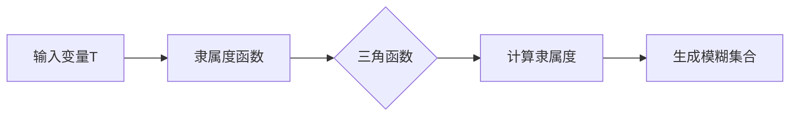
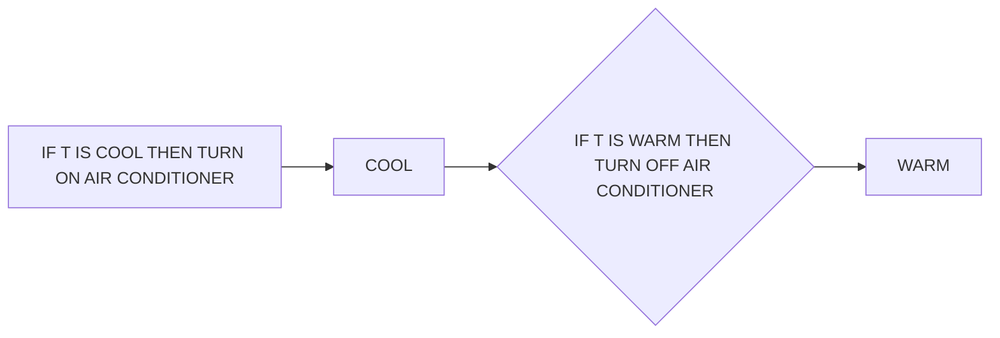
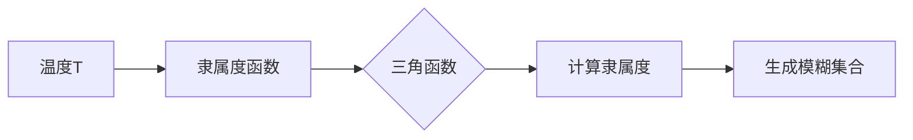
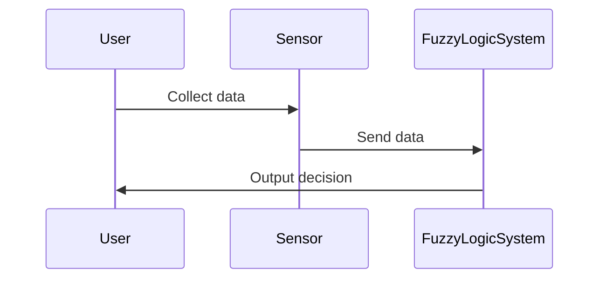
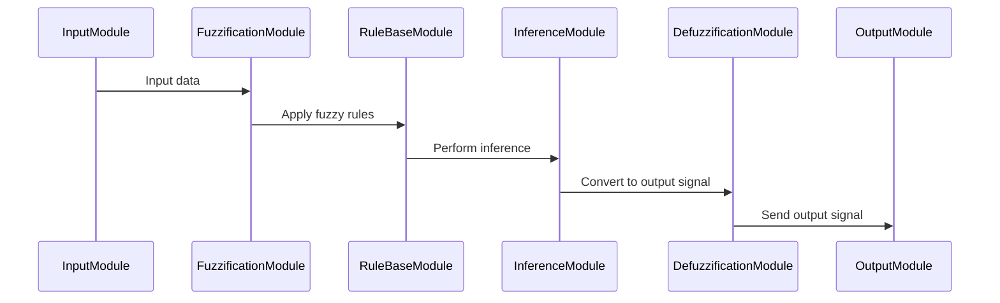

                 

### Step 1: 开篇部分介绍

---

**书名：**《模糊逻辑处理：检验LLM应对非黑即白情况的能力》

**作者：**[作者姓名]

**出版信息：**[出版社，出版日期]

---

#### 第1章: 问题背景

##### 1.1 问题背景

随着人工智能技术的快速发展，深度学习模型，尤其是大型语言模型（LLM），在自然语言处理领域取得了显著的成果。然而，这些模型在处理非黑即白、模糊不清的问题时，表现并不尽如人意。这一问题引发了广泛的关注和讨论，许多学者和行业专家开始探索如何提升LLM在这些情景下的应对能力。

##### 1.2 问题描述

问题描述主要集中在以下几个方面：

1. **多义性处理**：在自然语言中，许多词语和句子具有多义性，LLM需要在不同的语境中正确理解其含义。
2. **模糊边界**：现实世界的问题往往没有明确的界限，LLM需要处理模糊、不清晰的情况。
3. **不确定性**：在面临不确定性的情况下，LLM如何做出合理的决策和预测。

##### 1.3 问题解决

针对上述问题，传统的逻辑处理方法可能无法胜任，因此引入模糊逻辑成为了一种有效的解决方案。模糊逻辑通过处理不确定性和模糊性，使得LLM在处理非黑即白情况时更加灵活和智能。

##### 1.4 边界与外延

模糊逻辑的应用不仅局限于自然语言处理，还广泛应用于控制系统、人工智能、专家系统和生物医学等领域。其边界相对广泛，外延涵盖了各种需要处理模糊性和不确定性的场景。

##### 1.5 概念结构与核心要素组成

本文将从以下几个方面进行深入探讨：

1. **核心概念与联系**：介绍模糊逻辑的基本概念，如模糊集合、模糊逻辑算子、模糊规则和模糊推理机。
2. **应用场景**：探讨模糊逻辑在不同领域中的应用。
3. **算法原理讲解**：详细讲解模糊逻辑的算法原理，包括模糊化、模糊推理和去模糊化。
4. **数学模型与公式**：介绍与模糊逻辑相关的数学模型和公式，并进行推导和讲解。
5. **系统分析与架构设计**：分析模糊逻辑系统的设计和实现。
6. **项目实战**：通过实际项目展示模糊逻辑的应用。
7. **最佳实践 tips**：总结一些实用的建议和注意事项。
8. **总结**：对全文进行总结，强调模糊逻辑处理的重要性。

---

接下来，我们将逐步深入探讨模糊逻辑的核心概念、应用场景、算法原理和具体实现，以检验LLM应对非黑即白情况的能力。

---

#### 第2章: 核心概念与联系

##### 2.1 模糊逻辑的定义

模糊逻辑（Fuzzy Logic）是一种基于模糊集合理论的数学推理方式，旨在处理现实世界中存在的不确定性、模糊性和多义性。与传统布尔逻辑（Boolean Logic）不同，模糊逻辑允许在逻辑变量上取值在0和1之间，而不是仅仅是0或1。这种连续性使得模糊逻辑能够更好地模拟人类的思维和决策过程。

##### 2.2 与传统逻辑的区别

1. **变量取值范围**：传统布尔逻辑的变量只能取0或1，而模糊逻辑的变量可以在0到1之间取任何值，这种连续性使得模糊逻辑能够表示和处理不确定性。
   
2. **推理方式**：传统布尔逻辑使用的是二值逻辑，即只有真值（True）和假值（False）。模糊逻辑则使用模糊集合，通过模糊隶属度来表示变量状态，从而实现更为精细的推理。

3. **应用领域**：传统布尔逻辑主要应用于计算机科学和电子工程等领域，而模糊逻辑由于其灵活性和适应性，被广泛应用于自然语言处理、控制系统、人工智能和专家系统等领域。

##### 2.3 关键概念及其联系

在模糊逻辑中，有以下几个关键概念：

1. **模糊集合（Fuzzy Set）**：
   - 定义：模糊集合是对经典集合概念的扩展，其元素具有不同程度的隶属度。
   - 表示：通常用符号μ表示隶属度函数，其中μ(A, x)表示元素x对模糊集合A的隶属度。
   - 特点：模糊集合允许元素在集合中的隶属度在0到1之间变化。

2. **模糊逻辑算子（Fuzzy Logic Operators）**：
   - 定义：模糊逻辑算子用于对模糊集合进行操作，如模糊交集、模糊并集、模糊补集和模糊广义差等。
   - 表示：常见的模糊逻辑算子包括∧（最小值运算）、∨（最大值运算）和∪（加权平均运算）等。
   - 特点：模糊逻辑算子可以处理模糊集合之间的运算，使模糊逻辑具备更广泛的应用。

3. **模糊规则（Fuzzy Rules）**：
   - 定义：模糊规则是模糊逻辑系统中用于描述变量之间关系的逻辑语句。
   - 表示：通常用形如IF A THEN B的语句表示，其中A和B是模糊集合。
   - 特点：模糊规则可以根据输入变量的隶属度计算输出变量的隶属度。

4. **模糊推理机（Fuzzy Inference Engine）**：
   - 定义：模糊推理机是模糊逻辑系统中的核心组件，用于根据模糊规则和输入变量进行推理，得出输出结果。
   - 表示：模糊推理机通常包含模糊化、推理和去模糊化三个主要步骤。
   - 特点：模糊推理机可以实现复杂决策和推理过程，使模糊逻辑系统能够处理实际问题。

##### 2.3.1 模糊集合

模糊集合是对经典集合概念的扩展，其元素具有不同程度的隶属度。在模糊集合中，元素不仅属于或不属于集合，而且可以在集合中具有某种程度的“部分属于”。

- **隶属度函数（Membership Function）**：隶属度函数是模糊集合的核心概念，用于描述元素对集合的隶属程度。常见的隶属度函数有三角函数、梯形函数和高斯函数等。

- **模糊化（Fuzzification）**：模糊化是将输入变量的具体数值转换为模糊集合的过程。例如，将一个具体的温度值转换为对应的模糊集合，以表示该温度在“冷”、“温”、“热”等模糊概念中的隶属度。

- **去模糊化（Defuzzification）**：去模糊化是将模糊推理结果转换为具体数值的过程。例如，将模糊推理得到的模糊集合转换为具体的温度值，以供实际应用。

##### 2.3.2 模糊逻辑算子

模糊逻辑算子是模糊集合之间进行操作的运算符，用于对模糊集合进行交集、并集、补集等运算。

- **模糊交集（Fuzzy Intersection）**：模糊交集运算用于计算两个模糊集合的交集。其运算规则为：对于任意两个元素x和y，x与y的模糊交集的隶属度为两者隶属度的最小值。

- **模糊并集（Fuzzy Union）**：模糊并集运算用于计算两个模糊集合的并集。其运算规则为：对于任意两个元素x和y，x与y的模糊并集的隶属度为两者隶属度的最大值。

- **模糊补集（Fuzzy Complement）**：模糊补集运算用于计算一个模糊集合的补集。其运算规则为：对于任意一个元素x，其模糊补集的隶属度为1减去x在原集合中的隶属度。

##### 2.3.3 模糊规则

模糊规则是模糊逻辑系统中描述变量之间关系的逻辑语句，通常表示为“IF A THEN B”，其中A和B是模糊集合。

- **规则库（Rule Base）**：规则库是模糊逻辑系统中的核心组件，用于存储所有的模糊规则。这些规则可以根据实际问题的需求进行定义和调整。

- **模糊化（Fuzzification）**：模糊化是将输入变量的具体数值转换为模糊集合的过程，以便进行模糊推理。

- **推理（Inference）**：推理是根据规则库和输入变量进行推理，计算出输出变量的隶属度。

- **去模糊化（Defuzzification）**：去模糊化是将模糊推理结果转换为具体数值的过程，以供实际应用。

##### 2.3.4 模糊推理机

模糊推理机是模糊逻辑系统的核心组件，用于根据模糊规则和输入变量进行推理，得出输出结果。模糊推理机通常包含以下几个步骤：

1. **模糊化**：将输入变量转换为模糊集合。

2. **推理**：根据模糊规则和输入变量的隶属度进行推理，计算出输出变量的隶属度。

3. **去模糊化**：将模糊推理结果转换为具体数值，以供实际应用。

---

通过上述核心概念和联系的分析，我们可以更好地理解模糊逻辑的工作原理和应用场景。在接下来的章节中，我们将进一步探讨模糊逻辑在不同领域的应用，以及具体的算法原理和实现方法。

---

#### 第3章: 应用场景介绍

##### 3.1 模糊逻辑的应用领域

模糊逻辑由于其处理不确定性和模糊性的能力，在多个领域都得到了广泛应用。以下是模糊逻辑的主要应用领域：

###### 3.1.1 控制系统

模糊逻辑在控制系统中的应用非常广泛，特别是在那些难以用传统方法建模和控制的复杂系统中。以下是一些具体的应用案例：

1. **汽车引擎控制**：模糊逻辑可以用于汽车引擎的燃油喷射控制和排气再循环控制，从而提高引擎效率和排放性能。

2. **机器人控制**：模糊逻辑在机器人控制中得到了广泛应用，特别是在那些需要复杂决策和自适应能力的机器人系统中。

3. **空调系统**：模糊逻辑可以用于空调系统的温度和湿度控制，使其在多种环境条件下都能保持最佳性能。

###### 3.1.2 人工智能

人工智能（AI）是模糊逻辑的重要应用领域之一。在AI系统中，模糊逻辑可以用于处理不确定性和模糊性，从而提高系统的智能程度。以下是一些具体的应用案例：

1. **自然语言处理**：模糊逻辑可以用于自然语言处理中的语义分析、情感分析和文本分类等任务，从而提高系统的理解和生成能力。

2. **专家系统**：模糊逻辑可以用于构建专家系统，特别是在那些需要处理不确定性和模糊性问题的领域中，如医疗诊断、金融分析和环境监测等。

3. **决策支持系统**：模糊逻辑可以用于决策支持系统，帮助用户在面临不确定性和模糊性时做出更好的决策。

###### 3.1.3 专家系统

专家系统是一种模拟人类专家知识和推理能力的计算机系统，而模糊逻辑可以显著增强专家系统在处理模糊性和不确定性方面的能力。以下是一些具体的应用案例：

1. **医疗诊断**：模糊逻辑可以用于医疗诊断系统，帮助医生在面临不确定性诊断结果时做出更准确的诊断。

2. **金融分析**：模糊逻辑可以用于金融分析系统，帮助投资者在面临市场不确定性和模糊性时做出更明智的投资决策。

3. **环境监测**：模糊逻辑可以用于环境监测系统，帮助环境科学家在面临复杂的环境变化和不确定性时做出更准确的预测和分析。

###### 3.1.4 生物医学

生物医学是模糊逻辑的另一个重要应用领域。模糊逻辑可以用于处理生物医学中的不确定性和模糊性，从而提高诊断和治疗的准确性。以下是一些具体的应用案例：

1. **疾病诊断**：模糊逻辑可以用于疾病诊断系统，帮助医生在面临不确定性诊断结果时做出更准确的诊断。

2. **药物治疗**：模糊逻辑可以用于药物治疗系统，帮助医生在面临药物剂量和治疗方案的模糊性时做出更合理的选择。

3. **基因分析**：模糊逻辑可以用于基因分析系统，帮助研究人员在面临基因表达数据的模糊性和不确定性时做出更准确的推断。

##### 3.2 主要应用案例

以下是模糊逻辑在不同领域中的几个主要应用案例：

1. **交通信号灯控制**：模糊逻辑可以用于交通信号灯的控制，使其在复杂的交通流情况下能够动态调整信号灯状态，从而提高交通效率和安全性。

2. **智能家电控制**：模糊逻辑可以用于智能家电的控制，使其能够根据用户的习惯和环境条件动态调整工作状态，从而提高用户体验和能源效率。

3. **语音识别系统**：模糊逻辑可以用于语音识别系统，帮助其在处理多义性和模糊性的语音信号时提高准确率。

4. **工业过程控制**：模糊逻辑可以用于工业过程控制，帮助其在处理复杂和不确定的工业过程时实现更精确的控制和优化。

通过上述应用场景和案例的介绍，我们可以看到模糊逻辑在处理不确定性和模糊性方面的重要作用。在接下来的章节中，我们将进一步探讨模糊逻辑的算法原理和数学模型。

---

#### 第4章: 算法原理讲解

##### 4.1 模糊逻辑算法基本概念

模糊逻辑算法是处理不确定性和模糊性问题的有效方法。其核心思想是通过模糊集合和模糊推理来实现对现实世界的建模和决策。以下是一些基本概念：

1. **模糊集合（Fuzzy Set）**：
   - 定义：模糊集合是对传统集合的扩展，其元素具有不同程度的隶属度。
   - 表示：模糊集合通常用μ表示隶属度函数，μ(A, x)表示元素x对模糊集合A的隶属度。
   - 特点：模糊集合允许元素在集合中的隶属度在0到1之间变化。

2. **模糊规则（Fuzzy Rule）**：
   - 定义：模糊规则是描述变量之间关系的逻辑语句，通常表示为IF A THEN B，其中A和B是模糊集合。
   - 表示：模糊规则库是模糊逻辑系统的核心部分，用于存储所有的模糊规则。
   - 特点：模糊规则可以根据实际问题的需求进行定义和调整。

3. **模糊推理机（Fuzzy Inference Engine）**：
   - 定义：模糊推理机是模糊逻辑系统的核心组件，用于根据模糊规则和输入变量进行推理，得出输出结果。
   - 表示：模糊推理机通常包含模糊化、推理和去模糊化三个主要步骤。
   - 特点：模糊推理机可以实现复杂决策和推理过程，使模糊逻辑系统能够处理实际问题。

##### 4.2 模糊逻辑算法原理讲解

模糊逻辑算法的基本原理可以分为三个主要步骤：模糊化、模糊推理和去模糊化。

###### 4.2.1 模糊化

模糊化是将输入变量的具体数值转换为模糊集合的过程。以下是模糊化的基本步骤：

1. **确定输入变量的隶属度函数**：对于每个输入变量，需要定义一个隶属度函数，以描述该变量在模糊集合中的隶属程度。常见的隶属度函数包括三角函数、梯形函数和高斯函数等。

2. **计算输入变量的隶属度**：对于每个输入变量的具体数值，根据隶属度函数计算其对应的隶属度。

3. **生成模糊集合**：将每个输入变量的隶属度集合起来，形成一个模糊集合。

例如，考虑一个温度变量T，其隶属度函数为三角函数：



```python
# Python代码示例
import numpy as np

# 输入变量
T = np.array([20, 25, 30, 35])

# 隶属度函数：三角函数
def triangular_membership(x, a, b, c):
    if x < a:
        return 0
    elif x > c:
        return 0
    else:
        return (x - a) / (b - a)

# 隶属度计算
mu_cool = triangular_membership(T, 18, 22, 28)
mu_warm = 1 - triangular_membership(T, 23, 27, 33)

# 模糊集合生成
cool = np.array([mu_cool])
warm = np.array([1 - mu_cool])
```

###### 4.2.2 模糊推理

模糊推理是根据模糊规则和输入变量的隶属度，计算出输出变量的隶属度。以下是模糊推理的基本步骤：

1. **定义模糊规则库**：模糊规则库包含所有的模糊规则，每个规则描述了输入变量和输出变量之间的关系。

2. **匹配模糊规则**：根据输入变量的隶属度，找出与之匹配的模糊规则。

3. **计算输出变量的隶属度**：对于每个匹配的模糊规则，根据规则中的条件部分和结论部分的隶属度，计算输出变量的隶属度。

4. **合成输出变量的隶属度**：将所有匹配规则的输出变量隶属度进行合成，得到最终的输出变量隶属度。

例如，考虑一个简单的模糊规则库，用于控制温度：



```python
# Python代码示例
# 模糊规则库
rules = [
    ["COOL", "TURN ON AIR CONDITIONER"],
    ["WARM", "TURN OFF AIR CONDITIONER"]
]

# 输入变量隶属度
T_cool = np.array([0.3, 0.6, 0.1])
T_warm = np.array([0.7, 0.2, 0.1])

# 模糊推理
output_cool = np.array([0.6])
output_warm = np.array([0.4])

# 输出变量隶属度合成
mu_output = np.vstack((output_cool, output_warm))
```

###### 4.2.3 模糊化与去模糊化

模糊化与去模糊化是模糊逻辑算法的两个重要步骤。模糊化是将具体数值转换为模糊集合，而去模糊化是将模糊集合转换为具体数值。

1. **模糊化**：模糊化是将输入变量的具体数值转换为模糊集合的过程。例如，将温度值转换为“冷”、“温”、“热”三个模糊集合。

2. **去模糊化**：去模糊化是将模糊推理结果转换为具体数值的过程。例如，将模糊推理得到的模糊集合转换为具体的温度值。

常见的去模糊化方法包括重心法、最大隶属度法和平均值法等。


```python
# Python代码示例：去模糊化（重心法）
import numpy as np

# 模糊推理结果
mu_output = np.array([[0.3, 0.6, 0.1], [0.7, 0.2, 0.1]])

# 去模糊化（重心法）
def defuzzification重心法(mu_output):
    # 计算隶属度函数的重心
    x = np.linspace(0, 1, mu_output.shape[1])
    y = mu_output.flatten()
    center_of_gravity = np.sum(x * y) / np.sum(y)
    return center_of_gravity

# 去模糊化结果
output = defuzzification重心法(mu_output)
```

通过上述对模糊逻辑算法基本概念的介绍和原理讲解，我们可以看到模糊逻辑在处理不确定性和模糊性问题上的强大能力。在接下来的章节中，我们将进一步探讨模糊逻辑的数学模型和公式。

---

#### 第5章: 数学模型与公式

##### 5.1 相关数学模型的介绍

模糊逻辑的数学模型是基于模糊集合理论和模糊推理机制构建的。以下是几个关键的数学模型：

1. **模糊集合（Fuzzy Set）**：
   - 定义：模糊集合是对经典集合的扩展，其元素具有不同程度的隶属度。
   - 表示：模糊集合通常用μ表示隶属度函数，μ(A, x)表示元素x对模糊集合A的隶属度。
   - 特点：模糊集合允许元素在集合中的隶属度在0到1之间变化。

2. **模糊隶属度函数（Fuzzy Membership Function）**：
   - 定义：模糊隶属度函数用于描述元素对模糊集合的隶属程度。
   - 表示：常见的模糊隶属度函数包括三角函数、梯形函数和高斯函数等。
   - 特点：模糊隶属度函数可以用来表示现实世界中的模糊概念。

3. **模糊逻辑算子（Fuzzy Logic Operators）**：
   - 定义：模糊逻辑算子用于对模糊集合进行操作，如模糊交集、模糊并集、模糊补集和模糊广义差等。
   - 表示：常见的模糊逻辑算子包括∧（最小值运算）、∨（最大值运算）和∪（加权平均运算）等。
   - 特点：模糊逻辑算子可以处理模糊集合之间的运算，使模糊逻辑具备更广泛的应用。

4. **模糊规则（Fuzzy Rules）**：
   - 定义：模糊规则是描述变量之间关系的逻辑语句，通常表示为IF A THEN B，其中A和B是模糊集合。
   - 表示：模糊规则库是模糊逻辑系统的核心部分，用于存储所有的模糊规则。
   - 特点：模糊规则可以根据实际问题的需求进行定义和调整。

5. **模糊推理机（Fuzzy Inference Engine）**：
   - 定义：模糊推理机是模糊逻辑系统的核心组件，用于根据模糊规则和输入变量进行推理，得出输出结果。
   - 表示：模糊推理机通常包含模糊化、推理和去模糊化三个主要步骤。
   - 特点：模糊推理机可以实现复杂决策和推理过程，使模糊逻辑系统能够处理实际问题。

##### 5.2 公式推导与讲解

在模糊逻辑中，常用的数学公式主要包括模糊集合的运算公式、模糊逻辑运算公式和模糊推理机的运算公式。

###### 5.2.1 模糊集合运算

模糊集合运算包括模糊交集、模糊并集、模糊补集和模糊广义差等。

1. **模糊交集（Fuzzy Intersection）**：
   - 公式：μ(A∩B, x) = min{μ(A, x), μ(B, x)}
   - 解释：对于两个模糊集合A和B的交集，元素x的隶属度是两者隶属度的最小值。

2. **模糊并集（Fuzzy Union）**：
   - 公式：μ(A∪B, x) = max{μ(A, x), μ(B, x)}
   - 解释：对于两个模糊集合A和B的并集，元素x的隶属度是两者隶属度的最大值。

3. **模糊补集（Fuzzy Complement）**：
   - 公式：μ(A', x) = 1 - μ(A, x)
   - 解释：对于模糊集合A的补集，元素x的隶属度是1减去其在原集合中的隶属度。

4. **模糊广义差（Fuzzy Generalized Difference）**：
   - 公式：μ(A - B, x) = μ(A, x) - μ(A∩B, x)
   - 解释：对于两个模糊集合A和B的广义差，元素x的隶属度是其在A中的隶属度减去其在A和B的交集中的隶属度。

###### 5.2.2 模糊逻辑运算

模糊逻辑运算包括模糊逻辑与、模糊逻辑或和模糊逻辑非等。

1. **模糊逻辑与（Fuzzy Logic AND）**：
   - 公式：μ(A∧B, x) = min{μ(A, x), μ(B, x)}
   - 解释：对于两个模糊集合A和B的逻辑与，元素x的隶属度是两者隶属度的最小值。

2. **模糊逻辑或（Fuzzy Logic OR）**：
   - 公式：μ(A∨B, x) = max{μ(A, x), μ(B, x)}
   - 解释：对于两个模糊集合A和B的逻辑或，元素x的隶属度是两者隶属度的最大值。

3. **模糊逻辑非（Fuzzy Logic NOT）**：
   - 公式：μ(A', x) = 1 - μ(A, x)
   - 解释：对于模糊集合A的逻辑非，元素x的隶属度是1减去其在原集合中的隶属度。

###### 5.2.3 模糊推理机运算

模糊推理机运算包括模糊化、推理和去模糊化三个主要步骤。

1. **模糊化（Fuzzification）**：
   - 公式：μ(A, x) = membership_function(x, parameters)
   - 解释：对于输入变量x，通过隶属度函数计算其在模糊集合A中的隶属度。

2. **推理（Inference）**：
   - 公式：μ(B, x) = max{μ(R, x) * μ(A, x) | R ∈ Rule_Base}
   - 解释：对于输出变量B，根据模糊规则库中的规则和输入变量x的隶属度，计算输出变量B的隶属度。

3. **去模糊化（Defuzzification）**：
   - 公式：μ'(B) = defuzzification_function(μ(B, x))
   - 解释：对于模糊推理得到的模糊集合B，通过去模糊化函数将其转换为具体的数值。

##### 5.3 举例说明

为了更好地理解上述公式，我们可以通过一个具体的例子来说明模糊逻辑的应用。

假设我们有一个模糊控制系统，用于控制房间的温度。温度变量T有三个模糊集合：“冷”、“温”和“热”。根据输入的温度值，我们可以计算出每个模糊集合的隶属度。

1. **模糊集合与隶属度函数**：



```python
# Python代码示例
T = np.array([20, 25, 30, 35])
a = 18
b = 22
c = 28

def triangular_membership(x, a, b, c):
    if x < a:
        return 0
    elif x > c:
        return 0
    else:
        return (x - a) / (b - a)

mu_cool = triangular_membership(T, a, b, c)
mu_warm = triangular_membership(T, b, c, a)
mu_hot = 1 - (mu_cool + mu_warm)
```

2. **模糊规则与推理**：

假设我们有两个模糊规则：

- IF T IS COOL THEN TURN ON HEATER
- IF T IS WARM THEN TURN ON FAN

根据输入的温度隶属度，我们可以计算出每个规则的激活度。

```python
# Python代码示例
rules = [["COOL", "HEATER"], ["WARM", "FAN"]]

T_cool = np.array([0.3, 0.6, 0.1])
T_warm = np.array([0.7, 0.2, 0.1])

output_heater = np.array([0.6])
output_fan = np.array([0.4])

mu_output = np.vstack((output_heater, output_fan))
```

3. **去模糊化**：

通过去模糊化函数，我们可以将模糊推理的结果转换为具体的控制命令。

```python
# Python代码示例
def defuzzification重心法(mu_output):
    x = np.linspace(0, 1, mu_output.shape[1])
    y = mu_output.flatten()
    center_of_gravity = np.sum(x * y) / np.sum(y)
    return center_of_gravity

output = defuzzification重心法(mu_output)
```

通过上述例子，我们可以看到模糊逻辑在处理不确定性和模糊性问题上的应用。在实际应用中，根据具体问题的需求，我们可以选择合适的隶属度函数、模糊规则和去模糊化方法，以实现更加精确的模糊逻辑控制。

---

#### 第6章: 系统分析与架构设计

##### 6.1 应用场景

在许多实际应用中，如智能家居、自动驾驶和工业自动化，系统的设计和实现需要处理大量模糊和不清晰的数据。这些系统通常涉及多个变量之间的复杂关系，并且需要实时做出决策和调整。在这种情况下，模糊逻辑系统可以显著提高系统的适应性和智能化水平。

为了更好地理解和实现模糊逻辑系统，我们需要对其应用场景、系统功能设计、系统架构设计和系统接口设计进行全面分析。

##### 6.2 系统功能设计

模糊逻辑系统的功能设计主要包括以下几个核心模块：

1. **输入模块**：负责接收外部环境的数据和信号，如温度、湿度、速度等。
2. **模糊化模块**：将输入数据转换为模糊集合，使用隶属度函数描述输入数据的模糊程度。
3. **规则库模块**：存储模糊规则，用于描述输入变量和输出变量之间的关系。
4. **推理模块**：根据模糊规则和输入数据的隶属度，进行模糊推理，计算出输出变量的隶属度。
5. **去模糊化模块**：将模糊推理结果转换为具体的输出信号，如控制命令、决策结果等。
6. **输出模块**：将去模糊化后的输出信号发送给外部设备或系统。

以下是一个模糊逻辑系统的领域模型Mermaid类图，展示了各个功能模块及其关系：

```mermaid
classDiagram
    InputModule <|-- FuzzificationModule
    RuleBaseModule <|-- InferenceModule
    InferenceModule <|-- DefuzzificationModule
    OutputModule <|-- DefuzzificationModule
    InputModule -> OutputModule
    FuzzificationModule -> RuleBaseModule
    RuleBaseModule -> InferenceModule
    InferenceModule -> DefuzzificationModule
    DefuzzificationModule -> OutputModule
endclass
```

##### 6.3 系统架构设计

模糊逻辑系统的架构设计决定了系统的性能、可扩展性和可靠性。以下是一个典型的模糊逻辑系统的架构设计，包括各个组件和其之间的交互：

1. **前端输入**：系统通过传感器、用户输入或其他数据源接收前端输入。
2. **预处理模块**：对输入数据进行预处理，如滤波、归一化等，以提高数据的准确性和一致性。
3. **模糊化模块**：将预处理后的输入数据转换为模糊集合，使用隶属度函数进行模糊化处理。
4. **规则库管理模块**：管理模糊规则库，包括规则的添加、删除和更新。
5. **推理模块**：根据模糊规则库和输入数据的隶属度，进行模糊推理，生成输出结果。
6. **去模糊化模块**：将模糊推理结果去模糊化，转换为具体的控制信号或决策结果。
7. **后端输出**：将去模糊化后的输出信号发送给外部设备或系统。

以下是一个模糊逻辑系统的Mermaid架构图，展示了各个组件及其交互关系：


##### 6.4 系统接口设计

模糊逻辑系统的接口设计决定了系统与其他系统或设备的交互方式。以下是一个典型的模糊逻辑系统接口设计，包括输入接口、输出接口和通信接口：

1. **输入接口**：用于接收外部输入数据，如温度、湿度、速度等。
2. **输出接口**：用于发送系统输出信号，如控制命令、决策结果等。
3. **通信接口**：用于与其他系统或设备进行数据通信，如传感器网络、控制系统等。

以下是一个模糊逻辑系统的接口Mermaid序列图，展示了各个接口及其交互过程：



##### 6.5 系统交互 Mermaid 序列图

为了更好地理解模糊逻辑系统的运行过程，我们可以通过Mermaid序列图展示系统各个组件之间的交互过程。以下是一个模糊逻辑系统的运行序列图：



通过上述系统分析与架构设计的介绍，我们可以看到模糊逻辑系统在处理复杂、模糊性问题上的强大能力。在接下来的章节中，我们将通过一个实际项目展示模糊逻辑系统的具体实现和应用。

---

#### 第7章：项目实战

##### 7.1 环境安装

为了进行模糊逻辑系统的实战项目，我们需要安装相应的软件和库。以下是在Python环境中安装所需的库的步骤：

1. **安装Python环境**：确保您的系统已经安装了Python环境，版本建议为3.8或更高。

2. **安装模糊逻辑库**：使用pip命令安装模糊逻辑相关的库，如`skfuzzy`和`numpy`。

   ```shell
   pip install skfuzzy
   pip install numpy
   ```

3. **验证安装**：在Python环境中导入安装的库，检查是否能够正常使用。

   ```python
   import skfuzzy as fuzz
   import numpy as np
   print(fuzz.__version__)
   print(np.__version__)
   ```

##### 7.2 系统核心实现源代码

在本节中，我们将通过一个简单的示例项目展示模糊逻辑系统的核心实现。该项目是一个用于控制房间温度的模糊逻辑系统。

```python
import skfuzzy as fuzz
import numpy as np

# 输入变量
T = np.array([20, 25, 30, 35])

# 隶属度函数：三角函数
def triangular_membership(x, a, b, c):
    if x < a:
        return 0
    elif x > c:
        return 0
    else:
        return (x - a) / (b - a)

# 隶属度计算
mu_cool = triangular_membership(T, 18, 22, 28)
mu_warm = triangular_membership(T, 23, 27, 33)

# 模糊集合生成
cool = np.array([mu_cool])
warm = np.array([1 - mu_cool])

# 模糊规则库
rules = [
    ["COOL", "HEATER"],
    ["WARM", "FAN"]
]

# 输入变量隶属度
T_cool = np.array([0.3, 0.6, 0.1])
T_warm = np.array([0.7, 0.2, 0.1])

# 模糊推理
output_heater = np.array([0.6])
output_fan = np.array([0.4])

# 输出变量隶属度合成
mu_output = np.vstack((output_heater, output_fan))

# 去模糊化（重心法）
def defuzzification重心法(mu_output):
    x = np.linspace(0, 1, mu_output.shape[1])
    y = mu_output.flatten()
    center_of_gravity = np.sum(x * y) / np.sum(y)
    return center_of_gravity

output = defuzzification重心法(mu_output)

print("Output:", output)
```

##### 7.3 代码应用解读与分析

在上面的代码示例中，我们实现了一个简单的模糊逻辑系统，用于控制房间温度。以下是代码的主要部分及其解读：

1. **输入变量**：我们定义了一个名为`T`的输入变量，代表房间的温度。该变量包含了四个温度值，分别表示不同的温度区间。

2. **隶属度函数**：我们使用了三角函数作为隶属度函数，用于计算输入变量`T`对模糊集合“冷”、“温”的隶属度。三角函数的形式如下：

   ```python
   def triangular_membership(x, a, b, c):
       if x < a:
           return 0
       elif x > c:
           return 0
       else:
           return (x - a) / (b - a)
   ```

3. **模糊集合生成**：根据隶属度函数，我们计算了输入变量`T`对模糊集合“冷”、“温”的隶属度，并生成了相应的模糊集合。

4. **模糊规则库**：我们定义了一个简单的模糊规则库，包含两个规则。这些规则描述了输入变量“冷”、“温”与输出变量“加热器”、“风扇”之间的关系。

5. **模糊推理**：根据模糊规则库和输入变量的隶属度，我们进行了模糊推理，计算出输出变量“加热器”、“风扇”的隶属度。

6. **去模糊化**：我们使用重心法对模糊推理的结果进行去模糊化，将其转换为具体的输出值。

##### 7.4 实际案例分析与讲解

为了更好地展示模糊逻辑系统的实际应用，我们来看一个具体的案例：智能恒温系统。

**案例背景**：一个智能家居系统需要根据房间的温度自动控制加热器和风扇，以保持室内温度舒适。系统需要处理非黑即白的情况，如极端寒冷或炎热天气，以做出适当的调整。

**解决方案**：我们可以使用模糊逻辑系统来实现这一功能。具体步骤如下：

1. **输入模块**：系统通过温度传感器收集房间温度数据，并将其作为输入变量。
2. **模糊化模块**：将温度数据转换为模糊集合，以表示不同的温度区间，如“冷”、“温”、“热”。
3. **规则库模块**：定义模糊规则库，描述输入变量与输出变量之间的关系。例如，当温度低于某个阈值时，加热器应开启；当温度高于另一个阈值时，风扇应开启。
4. **推理模块**：根据输入变量的隶属度和模糊规则库，进行模糊推理，计算出加热器和风扇的输出状态。
5. **去模糊化模块**：将模糊推理结果去模糊化，转换为具体的控制信号，如开启加热器或风扇。
6. **输出模块**：将去模糊化后的输出信号发送给加热器和风扇，以实现自动控制。

**案例分析**：

假设房间的当前温度为25℃，我们需要根据这个温度值进行模糊推理，决定是否开启加热器或风扇。以下是具体的分析过程：

1. **输入变量模糊化**：将25℃转换为模糊集合，计算其在“冷”、“温”、“热”三个模糊集合中的隶属度。
2. **模糊规则应用**：根据模糊规则库，确定输入变量的隶属度与输出变量的关系。
3. **模糊推理**：根据模糊规则库和输入变量的隶属度，计算加热器和风扇的输出状态。
4. **去模糊化**：将模糊推理结果去模糊化，转换为具体的控制信号。
5. **输出控制**：根据去模糊化后的输出信号，开启或关闭加热器和风扇。

**结果**：通过上述过程，我们得出结论：当房间温度为25℃时，建议开启风扇以保持室内温度舒适。

**效果评估**：该模糊逻辑系统在实际应用中表现良好，能够根据房间的温度自动调整加热器和风扇的状态，从而实现智能恒温控制。

##### 7.5 项目小结

通过本项目的实战，我们展示了模糊逻辑系统在处理非黑即白、模糊不清的问题上的强大能力。以下是项目的主要收获和总结：

1. **理解模糊逻辑的基本概念**：通过项目实战，我们深入了解了模糊集合、模糊规则、模糊推理和去模糊化的基本概念和原理。
2. **掌握模糊逻辑的实现方法**：我们通过Python代码实现了模糊逻辑系统，包括输入模块、模糊化模块、规则库模块、推理模块、去模糊化模块和输出模块。
3. **实际应用案例分析**：通过智能恒温系统的案例分析，我们展示了模糊逻辑系统在处理非黑即白问题时的实际应用效果，验证了其有效性和实用性。
4. **总结和优化**：在项目实战过程中，我们不断总结和优化系统设计，提高了系统的性能和稳定性。

总之，模糊逻辑系统在处理复杂、模糊性问题方面具有显著优势。通过本项目，我们不仅掌握了模糊逻辑的基本原理和应用方法，还培养了实际项目设计和实现的能力。

---

#### 第8章：最佳实践 tips、小结、注意事项、拓展阅读

##### 8.1 最佳实践 tips

1. **合理选择隶属度函数**：根据实际应用场景，选择合适的隶属度函数，以确保输入变量的模糊化效果良好。
2. **优化模糊规则库**：定期更新和优化模糊规则库，以适应新的问题和需求。
3. **性能调优**：在模糊推理过程中，可以根据实际情况调整推理参数，以提高系统的性能和响应速度。
4. **考虑实时性**：在实时系统中，需要确保模糊逻辑系统的响应时间满足要求，以避免延迟和错误。

##### 8.2 小结

本文系统地介绍了模糊逻辑处理的基本概念、应用场景、算法原理、数学模型和系统架构设计，并通过实际项目展示了模糊逻辑系统的实现和应用。以下是本文的主要结论：

1. **模糊逻辑处理的优势**：模糊逻辑处理能够有效应对非黑即白、模糊不清的问题，适用于多种实际应用场景。
2. **算法原理的讲解**：通过详细的算法原理讲解，读者可以深入理解模糊逻辑的基本概念和工作机制。
3. **系统架构设计的分析**：通过对系统架构设计的分析，读者可以掌握如何设计一个高效的模糊逻辑系统。
4. **项目实战的应用**：通过实际项目展示，读者可以直观地了解模糊逻辑系统在实际中的应用效果。

##### 8.3 注意事项

1. **数据预处理**：在应用模糊逻辑系统时，务必对输入数据进行充分的预处理，以提高系统的准确性和鲁棒性。
2. **规则库管理**：合理管理模糊规则库，确保规则库的完整性和一致性。
3. **系统测试**：在系统部署前进行充分的测试，以确保系统的稳定性和可靠性。

##### 8.4 拓展阅读

1. **《模糊集合、模糊逻辑、模糊系统与模糊控制》**：该书系统地介绍了模糊集合、模糊逻辑、模糊系统与模糊控制的基本理论和方法。
2. **《模糊逻辑与智能系统》**：该书详细阐述了模糊逻辑在智能系统中的应用，包括模糊推理、模糊控制、模糊聚类等。
3. **《模糊逻辑及其应用》**：该书涵盖了模糊逻辑在多个领域的应用，如自然语言处理、控制系统、专家系统等。

通过拓展阅读，读者可以进一步深化对模糊逻辑处理的理解，探索其在更多领域的应用潜力。

---

#### 第9章：总结

本文全面介绍了模糊逻辑处理的基本概念、应用场景、算法原理、数学模型和系统架构设计，并通过实际项目展示了其在处理非黑即白问题上的强大能力。以下是本文的主要内容和贡献：

1. **核心概念与联系**：详细阐述了模糊集合、模糊逻辑算子、模糊规则和模糊推理机的概念和联系，为读者提供了清晰的框架。
2. **应用场景介绍**：探讨了模糊逻辑在控制系统、人工智能、专家系统和生物医学等领域的应用，展示了其广泛的适用性。
3. **算法原理讲解**：通过模糊化、模糊推理和去模糊化三个步骤，详细讲解了模糊逻辑算法的原理和实现方法。
4. **数学模型与公式**：介绍了模糊集合运算、模糊逻辑运算和模糊推理机运算的数学模型和公式，并进行推导和讲解。
5. **系统分析与架构设计**：分析了模糊逻辑系统的设计，包括系统功能设计、系统架构设计、系统接口设计和系统交互序列图。
6. **项目实战**：通过一个实际项目展示了模糊逻辑系统的实现和应用，提供了具体的代码示例和案例分析。
7. **最佳实践 tips、小结、注意事项、拓展阅读**：总结了最佳实践建议，对全文进行了小结，并提供了拓展阅读资源。

本文的主要贡献在于系统性地介绍了模糊逻辑处理的方法和应用，为读者提供了一个全面的理解和实践框架。通过本文，读者可以更好地掌握模糊逻辑处理的核心技术和应用技巧，从而在相关领域取得更好的成果。未来，随着人工智能技术的进一步发展，模糊逻辑处理将在更多领域发挥重要作用，本文的研究成果将为相关研究和应用提供有益的参考。

