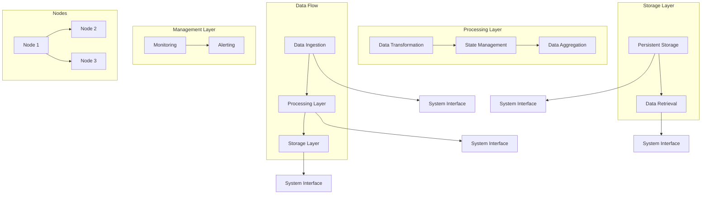
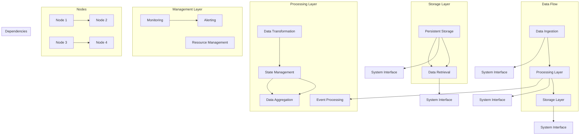
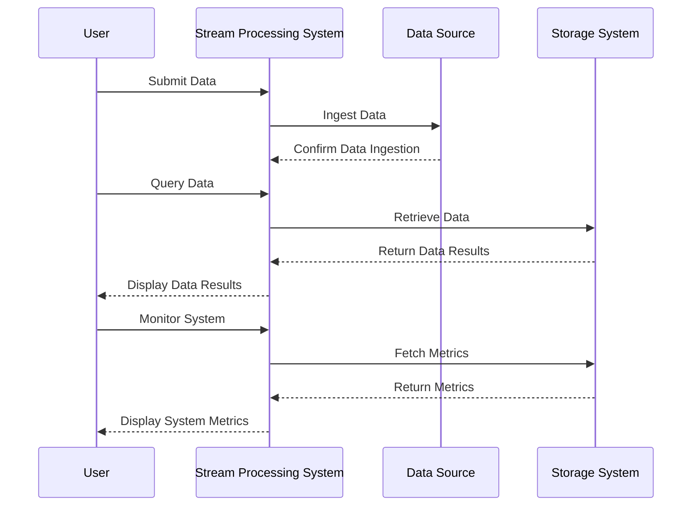
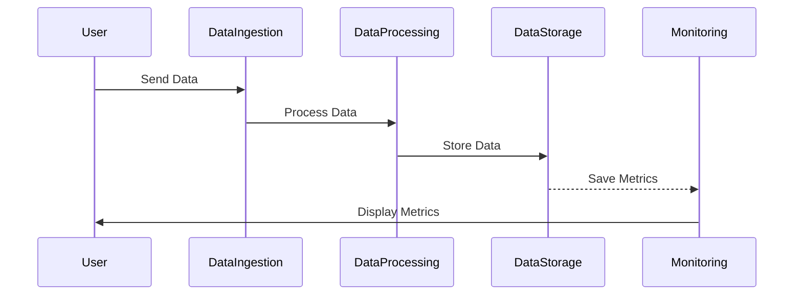

                 

### 1.1 The Rise of Real-Time Data Processing

#### 1.1.1 The Evolution of Data Processing Technologies

Data processing technologies have evolved significantly over the decades, reflecting the growing demand for efficiency, scalability, and real-time capabilities. Historically, data processing began with batch processing, where large volumes of data were processed in sequences without immediate feedback. This method was predominant in the early days of computing, where computational resources were limited.

As computer technology advanced, the concept of real-time processing started to gain traction. Real-time data processing involves the immediate processing and analysis of data as it arrives, enabling almost instantaneous responses. This paradigm shift was driven by the need for applications that required quick decision-making, such as industrial control systems, financial trading, and telecommunications.

In the 1980s and 1990s, the rise of relational databases and SQL technologies further revolutionized data processing. These technologies allowed for more efficient storage and retrieval of structured data, paving the way for the development of complex query and analytical capabilities.

The early 2000s marked the advent of big data and the proliferation of data sources, ranging from social media to IoT devices. This explosion of data led to the need for new processing frameworks that could handle massive volumes and velocities of data in real-time. Technologies like MapReduce and Hadoop emerged, enabling distributed processing of big data on a large scale.

#### 1.1.2 The Importance of Real-Time Processing in Modern Applications

Real-time data processing is a cornerstone of modern applications, driving innovation and enabling new use cases across various industries. Here are some key reasons why real-time processing is essential:

1. **Improved Decision-Making**: Real-time processing allows organizations to make data-driven decisions faster. For example, in financial services, real-time data processing enables instantaneous risk assessments and fraud detection, leading to more informed decision-making.

2. **Enhanced User Experience**: Real-time processing is crucial for applications that require immediate feedback, such as online gaming, e-commerce, and streaming services. It ensures a seamless user experience by providing instant responses to user actions.

3. **Increased Efficiency**: By processing data in real-time, organizations can identify and address issues promptly, reducing downtime and improving operational efficiency. For instance, in manufacturing, real-time processing helps monitor production lines and detect equipment failures before they cause significant downtime.

4. **Competitive Advantage**: Companies that leverage real-time processing can gain a competitive edge by offering innovative services and responding quickly to market changes. For example, retail companies can use real-time data to optimize inventory management and reduce stockouts.

5. **Advanced Analytics**: Real-time processing is integral to advanced analytics and machine learning applications. It enables the continuous feeding of new data into models, allowing for real-time predictions and improved model accuracy.

#### 1.1.3 Challenges and Opportunities in Real-Time Data Processing

While real-time data processing offers numerous benefits, it also presents challenges that must be addressed to harness its full potential:

1. **Scalability**: Handling large volumes of data in real-time requires scalable infrastructure that can grow with the data. This is particularly challenging in environments with fluctuating data loads.

2. **Latency**: Reducing latency to achieve real-time processing can be difficult, especially when dealing with complex data transformations and aggregations.

3. **Fault Tolerance**: Ensuring high availability and reliability in real-time systems is crucial. Downtime can have significant consequences, especially in mission-critical applications.

4. **Resource Management**: Efficiently managing computational resources, such as CPU, memory, and network bandwidth, is essential for optimizing performance in real-time processing systems.

5. **Data Quality**: Real-time processing relies on high-quality data. Ensuring data accuracy, completeness, and consistency is a constant challenge.

Despite these challenges, the opportunities presented by real-time data processing are compelling. By addressing these challenges with innovative solutions and best practices, organizations can unlock the full potential of real-time data to drive growth, efficiency, and competitive advantage.

## 1.2 What is Stream Processing?

#### 1.2.1 Definition and Basic Concepts

Stream processing is a method of data processing where data is continuously received and processed as a sequence of events or records in real-time. Unlike batch processing, which handles data in large chunks at specified intervals, stream processing focuses on processing data as it arrives, providing immediate results. This makes it particularly well-suited for applications that require real-time analytics, such as monitoring systems, real-time analytics, and event-driven architectures.

At its core, stream processing involves the ingestion, transformation, and analysis of data streams. The key components include:

- **Data Streams**: These are sequences of data events or records that flow continuously from various sources, such as sensors, social media feeds, and financial transaction systems.

- **Ingestion**: The process of receiving and loading data into the stream processing system. This involves capturing data from multiple sources and converting it into a format suitable for processing.

- **Transformation**: The process of modifying and enriching the data to meet specific requirements. This may include filtering, aggregation, joining, and data enrichment.

- **Analysis**: The process of extracting insights and information from the data streams. This can involve statistical analysis, machine learning, and real-time monitoring.

- **Output**: The results of the analysis are typically used to drive real-time decision-making, trigger alerts, or feed into other systems for further processing.

#### 1.2.2 Characteristics of Stream Processing

Stream processing has several distinctive characteristics that differentiate it from batch processing and other data processing methods:

1. **Continuous and Real-Time**: Stream processing continuously receives and processes data as it arrives, providing real-time results. This is in contrast to batch processing, which processes data in bulk at specific intervals.

2. **Event-Driven**: Stream processing is event-driven, meaning it responds to specific events or data points rather than predefined time intervals. This allows for more flexible and responsive data processing.

3. **Scalability**: Stream processing systems are designed to handle large volumes of data and can scale horizontally by adding more processing nodes. This makes them well-suited for handling growing data loads.

4. **Fault Tolerance**: Stream processing systems often include mechanisms for ensuring high availability and fault tolerance. This involves replicating data and processing across multiple nodes to ensure that system failures do not result in data loss or downtime.

5. **State Management**: Stream processing systems maintain state information, allowing them to track and process data over time. This is crucial for applications that require historical context or continuous monitoring.

6. **Resource Efficiency**: Stream processing systems are designed to be resource-efficient, leveraging techniques such as in-memory processing and incremental processing to minimize resource consumption.

#### 1.2.3 Differences Between Batch Processing and Stream Processing

The primary distinction between batch processing and stream processing lies in their approach to data handling and processing:

1. **Data Handling**: Batch processing handles data in large, predefined chunks called "batches." Each batch is processed independently, without regard to the timing of the data arrival. In contrast, stream processing handles data continuously as it arrives, processing individual events or records as they are received.

2. **Processing Time**: Batch processing typically processes data in bulk at specified intervals, such as hourly, daily, or weekly. This results in a delay between data collection and processing. Stream processing, on the other hand, processes data in real-time, providing immediate results and enabling rapid response to events.

3. **Scalability**: Batch processing systems often face scalability challenges when dealing with increasing data volumes, as they process data in large batches. Stream processing systems, with their event-driven architecture and horizontal scalability, are better suited for handling large and fluctuating data loads.

4. **Latency**: Batch processing inherently has higher latency due to the delay between data collection and processing. Stream processing minimizes latency by processing data as it arrives, making it ideal for applications that require real-time analytics and immediate responses.

5. **Resource Utilization**: Batch processing systems tend to be more resource-intensive, as they require significant computational resources to process large batches of data. Stream processing systems are designed to be more resource-efficient, leveraging techniques such as incremental processing and in-memory computing.

6. **Error Handling**: Batch processing systems often have robust error handling mechanisms, as they process data in discrete batches. Stream processing systems, with their continuous and event-driven nature, require real-time error detection and recovery mechanisms to maintain data integrity and system reliability.

In summary, while both batch processing and stream processing are methods of data processing, they serve different purposes and have distinct characteristics. Batch processing is well-suited for scenarios where historical data analysis is more important than real-time results, while stream processing excels in applications that require immediate responses and continuous monitoring.

## 1.3 The Role of Stream Processing in LLM Applications

#### 1.3.1 Overview of Language Learning Models (LLMs)

Language Learning Models (LLMs) are a class of artificial intelligence models that are designed to understand and generate human language. LLMs have become increasingly sophisticated over the past decade, thanks to advances in deep learning and natural language processing (NLP) techniques. These models are trained on large datasets of text, learning patterns, grammatical rules, and contextual relationships to generate coherent and meaningful text.

Key components of LLMs include:

- **Embeddings**: These are dense vector representations of words, sentences, or entire documents, capturing their semantic meaning and context.

- **Encoders and Decoders**: Encoders convert input text into embeddings, while decoders generate output text based on these embeddings. Recurrent Neural Networks (RNNs), Transformer models, and other advanced architectures are commonly used for this purpose.

- **Attention Mechanisms**: These mechanisms allow the model to focus on relevant parts of the input text when generating output, improving the coherence and relevance of the generated text.

- **Training and Inference**: LLMs are typically trained on large-scale datasets using gradient-based optimization techniques. Once trained, they can be used for inference to generate text in real-time.

#### 1.3.2 Integration of Stream Processing in LLM Applications

The integration of stream processing with LLM applications offers several advantages, enabling real-time language understanding and generation capabilities. Here are some key ways in which stream processing enhances LLM applications:

1. **Real-Time Language Understanding**: Stream processing allows LLMs to process and understand language in real-time, as data flows in. This is particularly important for applications such as chatbots, virtual assistants, and real-time translation services, where immediate responses are critical.

2. **Continuous Learning**: Stream processing enables LLMs to continuously learn from incoming data streams, updating their models and improving their performance over time. This is essential for applications that require up-to-date language understanding and generation capabilities, such as news analysis, social media monitoring, and personalized content creation.

3. **Dynamic Context Handling**: Stream processing allows LLMs to handle dynamic contexts and evolving conversations. By processing data in real-time, LLMs can adapt to new information and context as it arrives, ensuring more coherent and context-aware responses.

4. **Scalability and Performance**: Stream processing frameworks, such as Apache Flink and Apache Storm, are designed to handle large-scale data streams and provide high throughput and low latency. This enables LLM applications to process and generate text at scale, supporting high concurrency and large user bases.

5. **Event-Driven Architectures**: Stream processing is well-suited for event-driven architectures, where LLMs can respond to specific events or triggers in real-time. This is particularly useful for applications that require real-time decision-making and action, such as automated trading systems and real-time risk assessment.

#### 1.3.3 Enhancements Achieved with Stream Processing

The integration of stream processing with LLM applications has led to several significant enhancements, including:

1. **Improved Response Times**: Stream processing allows LLMs to generate text in real-time, reducing response times to milliseconds. This is crucial for applications that require instantaneous responses, such as chatbots and virtual assistants.

2. **Enhanced Accuracy and Coherence**: By processing data in real-time, LLMs can capture the most current and relevant information, improving the accuracy and coherence of generated text. This is particularly beneficial for applications that require high-quality text generation, such as automated content creation and translation services.

3. **Continuous Adaptation**: Stream processing enables LLMs to continuously learn and adapt to new data, improving their performance over time. This is essential for applications that require up-to-date language understanding and generation capabilities, such as real-time language translation and sentiment analysis.

4. **Scalable Solutions**: Stream processing frameworks provide scalable solutions for processing large-scale data streams, enabling LLM applications to handle increasing data volumes and user bases. This is crucial for applications that require high throughput and low latency, such as real-time language translation and personalized content creation.

5. **Flexibility and Modularity**: Stream processing frameworks offer flexible and modular architectures, allowing LLM applications to be easily integrated and extended. This enables developers to build and deploy custom LLM applications tailored to specific use cases and requirements.

In summary, the integration of stream processing with LLM applications has revolutionized the field of natural language processing, enabling real-time language understanding and generation capabilities. By harnessing the power of stream processing, LLM applications can deliver more accurate, coherent, and responsive text generation, driving innovation and transforming various industries.

## 1.4 Chapter Summary

In this chapter, we explored the landscape of real-time data processing and introduced the fundamental concepts of stream processing. We discussed the evolution of data processing technologies, highlighting the shift from batch processing to real-time processing and the significance of this paradigm shift in modern applications. We delved into the basic definitions and characteristics of stream processing, contrasting it with traditional batch processing methodologies. Furthermore, we examined the role of stream processing in enhancing the capabilities of Language Learning Models (LLMs), discussing how integrating stream processing into LLM applications offers real-time language understanding, continuous learning, and improved accuracy. This chapter has laid the groundwork for understanding the importance and potential of stream processing in the era of real-time data-driven applications. As we move forward, we will delve deeper into the core concepts and architectural designs of stream processing frameworks, exploring their inner workings and practical applications.

## 2.1 Core Concepts in Stream Processing

#### 2.1.1 Streams and Events

At the heart of stream processing are streams and events. A stream is a continuous sequence of data events or records that flow from various sources, such as sensors, social media feeds, or financial transaction systems. Each event in a stream represents a single unit of data that is captured and processed. Events can range from simple data points to complex data structures, depending on the application requirements.

1. **Types of Streams**:
   - **Unbounded Streams**: These streams have no end and continue indefinitely. They are common in real-time monitoring and sensor data applications.
   - **Bounded Streams**: These streams have a defined start and end point, making them suitable for batch-like operations within a stream processing framework.

2. **Characteristics of Events**:
   - **Temporal**: Events are time-stamped, allowing for the tracking of data as it arrives.
   - **Atomic**: Events are typically indivisible units of data, ensuring consistency and integrity in processing.
   - **Structured**: Events can be structured or unstructured data, but stream processing frameworks often require structured data for efficient processing and analysis.

#### 2.1.2 Windowing Mechanisms

Windowing is a fundamental concept in stream processing that allows for the grouping of events over a specified time period. This enables the application of aggregate functions and time-based analysis on data streams. Windows can be defined based on fixed time intervals or based on event counts.

1. **Types of Windows**:
   - **Tumbling Windows**: These windows slide over the data stream without overlapping. For example, a tumbling window of 1 minute processes data in 1-minute intervals, shifting by 1 minute.
   - **Sliding Windows**: These windows overlap and cover a continuous period of time. For example, a sliding window of 2 minutes, sliding by 1 minute, would cover the last 2 minutes of data every minute.

2. **Window Functions**:
   - **Aggregate Functions**: These functions compute a single value from a set of values within a window. Common aggregate functions include sum(), average(), min(), and max().
   - **Time-Based Functions**: These functions provide time-based aggregations, such as counting the number of events within a specific time window or calculating the median value.

#### 2.1.3 State Management and Persistence

State management is crucial in stream processing to maintain context and track the progress of data processing over time. State management involves storing and updating the intermediate results and metadata required for ongoing computations.

1. **State Types**:
   - **Current State**: This state represents the latest computed values and is used for real-time processing and decision-making.
   - **Historical State**: This state stores historical data and metadata, allowing for retrospective analysis and reporting.

2. **Persistence**:
   - **In-Memory Persistence**: This approach stores state information in memory, providing fast access but risking data loss in case of failures.
   - **Persistent Storage**: This approach stores state information in a durable storage system, such as a database or a distributed file system, ensuring data integrity and recoverability.

3. **State Synchronization**: In distributed stream processing systems, state synchronization is essential to maintain consistency across multiple nodes. Techniques like checkpointing and state snapshots ensure that state information is correctly propagated and synchronized across the cluster.

#### Key Concepts Summary

Stream processing involves the continuous and real-time processing of data events as they arrive. The core concepts include understanding streams and events, applying windowing mechanisms for time-based aggregations, and managing state information for context tracking and historical analysis. These concepts are fundamental to building robust and scalable stream processing applications, enabling real-time insights and decision-making in various domains.

### 2.2 Architectural Design Principles

#### 2.2.1 Decentralized vs. Centralized Architectures

In the design of stream processing frameworks, the choice between a decentralized and centralized architecture can significantly impact scalability, fault tolerance, and performance. Each architecture has its strengths and considerations, and selecting the appropriate model depends on the specific requirements and constraints of the application.

1. **Decentralized Architecture**:
   - **Definition**: In a decentralized architecture, the processing workload is distributed across multiple nodes, each responsible for a subset of the data stream. These nodes collaborate to process, analyze, and store data independently.
   - **Advantages**:
     - **Scalability**: Decentralized architectures can easily scale horizontally by adding more nodes to the cluster, allowing for handling increasing data volumes and processing loads.
     - **Fault Tolerance**: The failure of a single node does not bring down the entire system, as other nodes can continue processing and maintaining the state.
     - **Performance**: Decentralized architectures can achieve higher throughput and lower latency by leveraging the computational resources of multiple nodes.
   - **Challenges**:
     - **Complexity**: Managing a decentralized system requires robust coordination mechanisms, distributed algorithms, and state synchronization.
     - **Data Consistency**: Ensuring consistency across multiple nodes can be challenging, particularly when dealing with concurrent updates and state changes.

2. **Centralized Architecture**:
   - **Definition**: In a centralized architecture, all processing tasks are handled by a single node or a small cluster of tightly coupled nodes. This central node is responsible for ingesting, processing, and analyzing the entire data stream.
   - **Advantages**:
     - **Simplicity**: Centralized architectures are relatively straightforward to implement and manage, as all processing tasks are concentrated in a single node or cluster.
     - **Resource Utilization**: Centralized architectures can optimize resource allocation by consolidating processing tasks, leading to more efficient use of computational resources.
     - **Ease of Maintenance**: Centralized systems are easier to monitor and manage, as there is a single point of control and monitoring.
   - **Challenges**:
     - **Scalability**: Scaling a centralized architecture to handle increasing data volumes can be challenging, as the performance of the system is limited by the capacity of the central node.
     - **Fault Tolerance**: A failure in the central node can result in the complete failure of the system, impacting data processing and analytics capabilities.
     - **Performance Bottlenecks**: Centralized architectures can suffer from performance bottlenecks due to the limitations of a single node or cluster, particularly when dealing with high data throughput and complex processing tasks.

#### 2.2.2 Scalability and Performance Optimization

Scalability and performance optimization are critical considerations in the design of stream processing frameworks. These factors determine the ability of the system to handle increasing data loads and to deliver results with low latency.

1. **Horizontal Scaling**:
   - **Definition**: Horizontal scaling involves adding more nodes to the system to distribute the processing workload. This allows the system to handle larger data volumes and higher throughput.
   - **Techniques**:
     - **Data Partitioning**: Data can be partitioned across multiple nodes using techniques such as range partitioning, hash partitioning, or list partitioning. This ensures that each node processes a subset of the data, balancing the workload.
     - **Task Distribution**: Processing tasks can be distributed across nodes to ensure even workload distribution. Techniques such as round-robin scheduling or load-based scheduling can be used to distribute tasks efficiently.

2. **Vertical Scaling**:
   - **Definition**: Vertical scaling involves increasing the resources (CPU, memory, storage) of individual nodes to handle higher processing loads. This can be achieved by upgrading hardware or optimizing resource utilization.
   - **Techniques**:
     - **Resource Allocation**: Resources can be dynamically allocated to processing nodes based on demand. Techniques such as resource monitoring and auto-scaling can be used to optimize resource utilization.
     - **Concurrency Optimization**: Optimizing the concurrency of processing tasks within a node can improve performance. Techniques such as parallel processing, thread pooling, and asynchronous I/O can be used to maximize the utilization of available resources.

3. **Performance Optimization**:
   - **Data Compression**: Compressing data streams can reduce the volume of data to be processed, leading to lower latency and improved performance.
   - **Caching**: Caching frequently accessed data or intermediate results can reduce the need for repetitive computations, improving overall system performance.
   - **Algorithm Optimization**: Optimizing the algorithms and data structures used in the processing pipeline can significantly improve performance. Techniques such as incremental processing, in-memory computing, and query optimization can be used to maximize efficiency.
   - **Network Optimization**: Optimizing the network infrastructure and communication protocols can reduce latency and improve the overall performance of the system. Techniques such as data deduplication, data forwarding, and load balancing can be used to optimize network usage.

#### 2.2.3 Fault Tolerance and Reliability

Fault tolerance and reliability are essential for ensuring continuous and reliable operation of stream processing systems. These factors determine the system's ability to handle failures and recover from disruptions without loss of data or functionality.

1. **Fault Tolerance Mechanisms**:
   - **Replication**: Replicating data and processing tasks across multiple nodes ensures that the system can continue to operate even if some nodes fail. Techniques such as data replication and task replication are commonly used to achieve fault tolerance.
   - **Checkpointing**: Checkpointing involves periodically saving the system state to durable storage. In case of a failure, the system can restore its state from the latest checkpoint, allowing for quick recovery.
   - **Recovery Strategies**: Implementing recovery strategies, such as restart, rollback, or resume, helps the system recover from failures and continue processing data.

2. **Reliability Enhancements**:
   - **Monitoring and Alerting**: Continuous monitoring of system metrics and health indicators allows for proactive detection and resolution of issues. Alerting mechanisms can notify operators of potential failures or performance degradation.
   - **Data Integrity Checks**: Ensuring data integrity through techniques such as checksums, hash functions, and data validation can help detect and correct data corruption or inconsistencies.
   - **High Availability**: Designing the system for high availability involves replicating critical components and ensuring they can failover seamlessly in case of a failure. Techniques such as load balancing and active-active configurations can be used to achieve high availability.

In summary, the architectural design of stream processing frameworks must carefully balance decentralization and centralization, considering scalability, performance optimization, and fault tolerance. By leveraging appropriate design principles and mechanisms, stream processing systems can achieve high reliability and deliver real-time insights and analytics in challenging environments.

### 2.3 Common Architectures and Components

#### 2.3.1 Lambda Architecture

Lambda architecture is a scalable data processing architecture that combines batch and stream processing to handle large-scale data processing needs efficiently. It is designed to provide low-latency access to data by processing data in both batch and stream modes and combining the results.

**Components of Lambda Architecture**:

1. **Batch Layer**:
   - **Data Ingestion**: Raw data is ingested into the system and stored in a data lake or data warehouse.
   - **Data Processing**: The data is processed using batch processing technologies, such as Hadoop MapReduce or Apache Spark, to generate a batch view of the data.

2. **Speed Layer**:
   - **Real-Time Processing**: The speed layer processes data streams in real-time using stream processing frameworks like Apache Kafka or Apache Flink.
   - **Caching**: The processed data is cached in memory to provide low-latency access for real-time queries.

3. **Servicing Layer**:
   - **Hybrid Queries**: Queries that require both batch and real-time data are served by combining the batch view and the speed layer data in real-time.
   - **Data Storage**: The final results are stored in a database or a data warehouse for further analysis or reporting.

**Advantages of Lambda Architecture**:

- **Scalability**: Lambda architecture can handle large volumes of data by processing data in batch and stream modes independently.
- **Low Latency**: By caching data in the speed layer, Lambda architecture provides low-latency access to real-time data.
- **Accuracy**: Combining batch and stream processing ensures that both historical and real-time data are considered in analysis.
- **Flexibility**: Lambda architecture allows for both batch and real-time analytics, providing flexibility in handling different types of queries.

**Disadvantages of Lambda Architecture**:

- **Complexity**: Lambda architecture is more complex to implement and manage compared to single-layer architectures.
- **Resource Utilization**: The need for separate batch and stream processing resources can lead to higher resource utilization and costs.
- **Data Consistency**: Ensuring data consistency across batch and stream layers can be challenging, particularly when dealing with out-of-order data.

#### 2.3.2 Kappa Architecture

Kappa architecture is an alternative to Lambda architecture that simplifies the data processing pipeline by combining batch and stream processing into a single stream processing layer. This approach eliminates the need for a separate batch layer, making the system more streamlined and easier to manage.

**Components of Kappa Architecture**:

1. **Data Ingestion**:
   - **Real-Time Data**: Data is ingested into the system in real-time, similar to the speed layer in Lambda architecture.

2. **Processing Layer**:
   - **Batch Processing**: Instead of a separate batch layer, the processing layer performs batch processing operations as part of the stream processing pipeline.
   - **Data Storage**: The processed data is stored in a distributed data store, such as Apache Kafka, Apache Flink, or Apache HBase.

3. **Query Layer**:
   - **Hybrid Queries**: Queries that require both batch and real-time data are served directly from the processing layer, without the need for combining separate views.

**Advantages of Kappa Architecture**:

- **Simplicity**: Kappa architecture is simpler to implement and manage compared to Lambda architecture.
- **Efficiency**: Combining batch and stream processing in a single layer can improve resource utilization and reduce processing time.
- **Scalability**: Kappa architecture can scale horizontally by adding more processing nodes, similar to other stream processing frameworks.

**Disadvantages of Kappa Architecture**:

- **Low Latency**: While Kappa architecture can provide low-latency access to real-time data, it may not offer the same level of low-latency performance as Lambda architecture's speed layer.
- **Data Consistency**: Ensuring data consistency in a single stream processing layer can be more challenging than in Lambda architecture, particularly when handling out-of-order data.

**Comparison of Lambda and Kappa Architectures**:

- **Complexity**: Lambda architecture is more complex due to its separation of batch and stream processing layers, while Kappa architecture simplifies the pipeline by combining these layers.
- **Latency**: Lambda architecture typically provides lower latency for real-time queries due to its dedicated speed layer, while Kappa architecture may offer similar but not necessarily lower latency.
- **Scalability**: Both architectures can scale horizontally, but Lambda architecture offers more flexibility in scaling batch and stream processing independently.
- **Consistency**: Lambda architecture may face challenges in maintaining data consistency across batch and stream layers, while Kappa architecture may have a more consistent approach within a single layer.

In summary, both Lambda and Kappa architectures are designed to handle large-scale data processing needs, but they differ in their approach and complexity. Lambda architecture offers greater flexibility and scalability but at the cost of increased complexity, while Kappa architecture simplifies the pipeline at the expense of potentially lower latency and data consistency.

### 2.4 Case Studies of Successful Frameworks

#### 2.4.1 Apache Flink

Apache Flink is a popular open-source stream processing framework that excels in providing low-latency and high-throughput data processing capabilities. It is designed to handle both batch and stream processing within a single unified framework, offering flexibility and efficiency for real-time data analytics.

**Key Features**:

- **Unified API**: Flink provides a unified API for batch and stream processing, simplifying the development of applications that require both batch and real-time analytics.
- **Low-Latency Processing**: Flink is optimized for low-latency processing, making it suitable for applications that demand real-time insights and immediate action.
- **Fault Tolerance**: Flink includes robust fault tolerance mechanisms, ensuring that data processing continues seamlessly even in the event of node failures.
- **Scalability**: Flink can scale horizontally across a cluster of machines, allowing for efficient handling of large-scale data streams.

**Applications**:

- **Financial Analytics**: Flink is widely used in financial services for real-time risk assessment, trade analysis, and fraud detection, leveraging its ability to process high volumes of financial transactions with low latency.
- **Internet of Things (IoT)**: Flink is used in IoT applications to process and analyze real-time sensor data, enabling real-time monitoring and predictive maintenance.
- **E-commerce**: Flink helps e-commerce platforms process real-time customer data, enabling personalized recommendations, real-time analytics, and targeted marketing campaigns.

#### 2.4.2 Apache Storm

Apache Storm is another popular open-source stream processing framework known for its scalability, reliability, and ease of use. It is designed to provide real-time, fault-tolerant distributed processing of large-scale data streams.

**Key Features**:

- **Fault Tolerance**: Storm includes a sophisticated fault tolerance mechanism that ensures data processing continues even in the face of node failures.
- **Scalability**: Storm can scale horizontally by adding more nodes to the cluster, allowing for efficient handling of increasing data volumes and processing loads.
- **Real-Time Windowing**: Storm supports real-time windowing and sliding windows, enabling time-based aggregations and analytics on streaming data.
- **Integration**: Storm integrates well with other components of the Apache ecosystem, such as Kafka and Hadoop, providing a seamless data processing pipeline.

**Applications**:

- **Social Media Analytics**: Storm is used in social media analytics to process and analyze real-time user data, enabling real-time insights into user behavior and sentiment.
- **Real-Time Monitoring**: Storm is employed in real-time monitoring systems for applications like network traffic analysis and security monitoring, providing immediate alerts and actionable insights.
- **Financial Trading**: Storm is used in financial trading applications for real-time trade analysis and risk management, processing high-frequency trading data with low latency.

#### 2.4.3 Apache Spark Streaming

Apache Spark Streaming is a stream processing extension of the Apache Spark framework, designed for processing real-time data streams. It provides a high-level API for building scalable and fault-tolerant stream processing applications.

**Key Features**:

- **Unified API**: Spark Streaming offers a unified API with Spark's core processing capabilities, allowing for seamless integration with other Spark components.
- **High-Throughput**: Spark Streaming is designed for high-throughput processing, making it suitable for handling large-scale streaming data.
- **Resilient Distributed Datasets (RDDs)**: Spark Streaming leverages the power of RDDs, enabling complex data transformations and aggregations with high efficiency.
- **Integration**: Spark Streaming integrates well with other Spark components, such as Spark SQL and MLlib, providing a comprehensive platform for real-time data analytics.

**Applications**:

- **Real-Time Analytics**: Spark Streaming is used for real-time analytics in applications such as e-commerce, social media, and IoT, enabling immediate insights and decision-making.
- **Internet of Things (IoT)**: Spark Streaming is employed in IoT applications to process and analyze real-time sensor data, enabling real-time monitoring and predictive analytics.
- **Log Processing**: Spark Streaming is used for processing and analyzing log data in real-time, providing valuable insights for application performance monitoring and debugging.

In conclusion, Apache Flink, Apache Storm, and Apache Spark Streaming are three successful open-source frameworks for stream processing, each offering unique features and capabilities. They are widely used in various industries for real-time data processing and analytics, enabling organizations to derive actionable insights and drive innovation.

### 2.5 Chapter Summary

In this chapter, we delved into the core concepts and architectural designs of stream processing frameworks, focusing on the fundamental components and principles that underpin these systems. We discussed the key concepts of streams and events, highlighting how they form the backbone of real-time data processing. We also explored windowing mechanisms, essential for time-based aggregations and real-time analysis. Furthermore, we examined the importance of state management and persistence in maintaining context and ensuring data integrity.

We then transitioned to architectural design principles, comparing decentralized and centralized architectures and discussing the trade-offs between them. We discussed scalability and performance optimization techniques, including horizontal and vertical scaling strategies, data compression, caching, and algorithm optimization. Additionally, we covered fault tolerance and reliability mechanisms, crucial for ensuring continuous and robust operation of stream processing systems.

To illustrate these concepts, we presented three common architectures: Lambda and Kappa architectures, along with their components and advantages. We also explored case studies of successful stream processing frameworks, including Apache Flink, Apache Storm, and Apache Spark Streaming, discussing their key features and applications in various industries.

As we move forward, we will delve into the technical implementation details of stream processing frameworks, discussing the algorithms and systems used in practice. This will provide a deeper understanding of how these frameworks are applied to solve real-world problems in real-time data processing.

## 3.1 Introduction

This chapter focuses on the technical implementation details of stream processing frameworks, providing a comprehensive overview of the algorithms, systems, and technologies that power these frameworks. We will explore the core components and architecture of leading stream processing frameworks, examining how they handle data streams, process events, and deliver real-time insights.

By the end of this chapter, you will gain a deeper understanding of the inner workings of stream processing systems, enabling you to design, implement, and optimize stream processing applications for various use cases.

### 3.2 Core Components of Stream Processing Frameworks

Stream processing frameworks are composed of several core components that work together to handle data streams, process events, and deliver real-time insights. These components include data ingestion, data processing, and data storage. Let's delve into each of these components and their roles in stream processing frameworks.

#### 3.2.1 Data Ingestion

Data ingestion is the process of receiving and loading data into the stream processing system. It involves capturing data from various sources, such as sensors, social media feeds, and financial transaction systems, and converting it into a format suitable for processing. Key aspects of data ingestion include:

1. **Data Sources**: Stream processing frameworks support a wide range of data sources, including real-time data streams, batch data files, and external APIs.
2. **Data Formats**: Data ingestion handles various data formats, such as JSON, XML, Avro, and Protocol Buffers, ensuring that data can be parsed and processed efficiently.
3. **Data Transformation**: Ingestion may involve transforming raw data into a standardized format or schema, enabling efficient processing and analysis.

#### 3.2.2 Data Processing

Data processing is the core function of stream processing frameworks, involving the transformation, analysis, and aggregation of data streams. Key aspects of data processing include:

1. **Streaming Algorithms**: Stream processing frameworks implement various streaming algorithms to process data as it arrives. These algorithms include windowing, state management, and incremental processing techniques.
2. **Event Processing**: Data processing involves processing individual events or records as they are received. This may include filtering, enrichment, and complex transformations to derive actionable insights.
3. **Query Optimization**: Stream processing frameworks optimize query execution by leveraging indexing, caching, and parallel processing techniques. This improves query performance and reduces processing time.

#### 3.2.3 Data Storage

Data storage is an essential component of stream processing frameworks, responsible for persisting processed data for further analysis and reporting. Key aspects of data storage include:

1. **Persistent Storage**: Stream processing frameworks use persistent storage systems, such as distributed databases and data lakes, to store processed data. These systems ensure data durability and provide high availability.
2. **Data Replication**: Data replication ensures data redundancy and fault tolerance, allowing the system to continue functioning even in the event of a storage failure.
3. **Data Versioning**: Stream processing frameworks support data versioning, enabling the tracking of historical data and facilitating data lineage and audit trails.

### 3.2.4 Data Ingestion and Processing Flow

To understand how stream processing frameworks operate, let's examine a typical data ingestion and processing flow:

1. **Data Ingestion**: Data streams are captured from various sources and ingested into the stream processing system. This may involve data conversion, schema validation, and transformation.
2. **Data Processing**: The ingested data is processed in real-time using streaming algorithms and event processing techniques. This may include filtering, aggregation, and complex transformations to extract insights.
3. **Data Storage**: Processed data is stored in persistent storage systems for further analysis and reporting. This may involve data serialization, compression, and indexing to optimize storage efficiency and retrieval performance.

### 3.2.5 Example: Apache Flink

To illustrate these core components, let's consider Apache Flink, a popular open-source stream processing framework. Apache Flink provides a comprehensive set of features for data ingestion, processing, and storage, making it a powerful tool for real-time data processing applications.

1. **Data Ingestion**: Apache Flink supports various data sources, including Kafka, RabbitMQ, and Kinesis, enabling seamless integration with existing data pipelines. Flink provides connectors for reading and writing data in various formats, such as JSON, Avro, and Parquet.
2. **Data Processing**: Flink's core processing engine implements sophisticated streaming algorithms and state management techniques. Flink's DataStream API allows for the definition of complex data processing pipelines, enabling efficient event processing, filtering, and aggregation.
3. **Data Storage**: Apache Flink integrates with distributed storage systems like HDFS, Hive, and Cassandra, providing persistent storage for processed data. Flink's checkpointing and state backends ensure fault tolerance and data consistency.

In summary, stream processing frameworks rely on a robust set of core components, including data ingestion, data processing, and data storage, to handle real-time data streams and deliver actionable insights. By understanding these components and their interactions, you can design and implement effective stream processing applications to meet your specific requirements.

### 3.3 Data Stream Processing Algorithms

In the realm of stream processing, algorithms play a crucial role in transforming raw data into meaningful insights and actionable information. These algorithms enable real-time analysis, filtering, and aggregation of data streams, making them indispensable for applications ranging from real-time analytics to event-driven architectures. Let's explore some of the fundamental data stream processing algorithms and their applications.

#### 3.3.1 Windowing Algorithms

Windowing is a core concept in stream processing that involves dividing a continuous data stream into smaller, manageable segments called windows. Windowing allows for time-based aggregations and analysis of data streams. There are several types of windowing algorithms:

1. **Tumbling Windows**: Tumbling windows have a fixed size and do not overlap. For example, a tumbling window of size 5 minutes processes the last 5 minutes of data at a fixed interval. Tumbling windows are suitable for applications that require constant, non-overlapping time intervals, such as traffic monitoring or stock price analysis.

2. **Sliding Windows**: Sliding windows have a fixed size but overlap with previous and future windows. For example, a sliding window of size 5 minutes, sliding by 1 minute, processes the last 5 minutes of data every minute. Sliding windows are useful for applications that require continuous monitoring and analysis, such as real-time sentiment analysis on social media streams.

3. **Session Windows**: Session windows are based on user activity rather than fixed time intervals. A session window starts when user activity is detected and ends when there is no activity for a specified period. Session windows are ideal for applications like user behavior analysis and clickstream analysis.

#### 3.3.2 Stream Aggregation Algorithms

Stream aggregation algorithms perform operations on data within a window to produce summarized results. These algorithms are essential for generating real-time analytics and insights. Common stream aggregation algorithms include:

1. **Count**: The count algorithm calculates the number of events within a window. This is useful for monitoring the frequency of events, such as the number of page views or transactions in a given time frame.

2. **Sum**: The sum algorithm calculates the sum of numerical values within a window. This is useful for monitoring metrics like total sales or total traffic volume over time.

3. **Average**: The average algorithm calculates the average value of numerical values within a window. This is useful for monitoring metrics like average response time or average temperature.

4. **Maximum and Minimum**: The maximum and minimum algorithms calculate the highest and lowest values within a window, respectively. These are useful for monitoring extreme values, such as maximum stock price or minimum CPU utilization.

5. **Standard Deviation**: The standard deviation algorithm calculates the standard deviation of numerical values within a window. This is useful for monitoring the variability of data, such as price volatility or temperature fluctuations.

#### 3.3.3 Stream Filtering Algorithms

Stream filtering algorithms enable the selection of specific events or records based on certain conditions or criteria. Filtering is a fundamental operation in stream processing for reducing the volume of data and focusing on relevant information. Common stream filtering algorithms include:

1. **Boolean Filtering**: Boolean filtering involves selecting events that match specific conditions using logical operators like AND, OR, and NOT. This is useful for filtering out unwanted events or focusing on specific patterns, such as filtering tweets containing a specific keyword.

2. **Threshold Filtering**: Threshold filtering involves selecting events that exceed or fall below a specified threshold value. This is useful for monitoring critical metrics like server response time or system resource utilization.

3. **Pattern Matching**: Pattern matching involves selecting events that match specific patterns or regular expressions. This is useful for applications like log analysis or network traffic monitoring to detect specific patterns or anomalies.

#### 3.3.4 Time-Series Analysis Algorithms

Time-series analysis algorithms are used to analyze and predict time-based data streams. These algorithms are crucial for applications like stock market analysis, weather forecasting, and equipment maintenance. Common time-series analysis algorithms include:

1. **Moving Average**: The moving average algorithm calculates the average value of a time series over a specified window. This is useful for smoothing out fluctuations and identifying trends or patterns in the data.

2. **Exponential Smoothing**: Exponential smoothing is a statistical method for modeling time series data by assigning different weights to past observations. This is useful for forecasting future values based on historical data.

3. **ARIMA (AutoRegressive Integrated Moving Average)**: ARIMA is a time-series forecasting method that combines autoregressive, differencing, and moving average components. This is useful for modeling and forecasting complex time series data.

4. **Machine Learning Models**: Machine learning models, such as regression, classification, and clustering algorithms, can be applied to time series data for forecasting, anomaly detection, and trend analysis.

### 3.3.5 Application Scenarios

Different algorithms are suited for various application scenarios in stream processing. Here are a few examples:

1. **Real-Time Analytics**: For real-time analytics, windowing algorithms like tumbling and sliding windows along with aggregation algorithms like sum and average can be used to generate real-time insights and metrics.
2. **Anomaly Detection**: Anomaly detection algorithms like threshold filtering and statistical methods can be used to identify unusual patterns or events in data streams, enabling real-time monitoring and alerting.
3. **Predictive Analytics**: Time-series analysis algorithms like moving average, exponential smoothing, and ARIMA can be used to predict future values based on historical data, facilitating forecasting and decision-making.
4. **Event Correlation**: Event correlation algorithms, such as pattern matching and logical filtering, can be used to analyze relationships between different events in data streams, enabling the detection of complex patterns and dependencies.

In summary, data stream processing algorithms are essential for transforming raw data into actionable insights in real-time. By leveraging various windowing, aggregation, filtering, and time-series analysis algorithms, stream processing frameworks can handle diverse application scenarios, enabling real-time analytics, anomaly detection, predictive analytics, and event correlation. Understanding these algorithms and their applications is crucial for designing effective stream processing systems.

### 3.4 System Architecture and Design Principles

#### 3.4.1 Overview of System Architecture

Stream processing systems are designed to handle large-scale, real-time data streams efficiently. The architecture of these systems plays a critical role in determining their performance, scalability, and fault tolerance. A typical stream processing system can be divided into several key components:

1. **Data Ingestion Layer**: This layer is responsible for capturing data from various sources and feeding it into the processing pipeline. Common data sources include log files, IoT devices, social media feeds, and external APIs. Data ingestion layers often use message brokers like Apache Kafka or message queues like RabbitMQ to decouple data producers and consumers, ensuring high throughput and low latency.

2. **Processing Layer**: The processing layer is the core of the stream processing system, where data is transformed, analyzed, and aggregated in real-time. This layer typically uses a stream processing framework like Apache Flink, Apache Storm, or Apache Spark Streaming to implement complex event processing (CEP) and data analytics. Processing layers often employ windowing algorithms, state management, and fault tolerance mechanisms to ensure efficient and reliable data processing.

3. **Storage Layer**: The storage layer is responsible for persisting processed data for further analysis and reporting. This layer can include distributed databases, NoSQL stores, or data warehouses, depending on the specific requirements of the application. Storage layers often support data compression, partitioning, and indexing to optimize storage efficiency and retrieval performance.

4. **Monitoring and Management Layer**: The monitoring and management layer provides real-time visibility into the health and performance of the stream processing system. This layer includes monitoring tools, alerting systems, and management consoles to track system metrics, detect anomalies, and enable proactive management and maintenance.

#### 3.4.2 Design Principles for Scalability and Performance

Designing a scalable and high-performance stream processing system requires careful consideration of several architectural design principles. Here are some key principles to keep in mind:

1. **Decentralization**: Decentralized architectures distribute the processing workload across multiple nodes, allowing the system to scale horizontally by adding more nodes to the cluster. This approach ensures that the system can handle increasing data volumes and processing loads without performance degradation.

2. **Horizontal Scaling**: Horizontal scaling involves adding more processing nodes to the system to distribute the workload. This can be achieved by partitioning data streams and distributing processing tasks across nodes. Techniques such as load balancing and dynamic resource allocation are essential for optimizing resource utilization and ensuring consistent performance.

3. **State Management**: Effective state management is crucial for maintaining the context of ongoing computations and ensuring fault tolerance. Stream processing systems often use distributed state management mechanisms, such as consistent hashing and state snapshots, to track and propagate state information across nodes. Techniques like in-memory state storage and distributed locking mechanisms can further improve performance and reliability.

4. **Fault Tolerance**: Fault tolerance ensures that the system can continue operating even in the face of node failures. Techniques such as data replication, checkpointing, and automatic recovery are essential for achieving fault tolerance. Replicating data and processing tasks across multiple nodes ensures that the system can continue to function and deliver accurate results even if some nodes fail.

5. **Latency Optimization**: Minimizing latency is critical for real-time applications. Techniques such as data compression, data forwarding, and in-memory processing can help reduce the time required to process and transmit data. Optimizing network protocols and leveraging edge computing can further reduce latency and improve the overall performance of the system.

6. **Caching and Data Prefetching**: Caching frequently accessed data or intermediate results can reduce the need for repetitive computations and improve system performance. Data prefetching techniques can be used to preload data into memory or storage systems, ensuring that it is readily available for processing.

7. **Resource Utilization Optimization**: Efficiently managing computational resources, such as CPU, memory, and network bandwidth, is essential for optimizing performance in stream processing systems. Techniques such as resource monitoring, auto-scaling, and workload prioritization can help ensure optimal resource utilization and maximize system throughput.

#### 3.4.3 Architectural Patterns for Stream Processing Systems

Several architectural patterns have been proposed for designing scalable and high-performance stream processing systems. Here are a few commonly used patterns:

1. **Lambda Architecture**: Lambda architecture combines batch and stream processing to handle both historical and real-time data. The architecture consists of a batch layer, a speed layer, and a serving layer. The batch layer processes historical data to generate a batch view, the speed layer processes real-time data to generate a real-time view, and the serving layer combines the two views to serve queries. Lambda architecture provides low latency and high accuracy but can be complex to implement and manage.

2. **Kappa Architecture**: Kappa architecture simplifies the data processing pipeline by combining batch and stream processing into a single stream processing layer. Instead of generating separate batch and real-time views, Kappa architecture processes all data in real-time. This approach reduces complexity and improves performance but may sacrifice some accuracy in certain scenarios.

3. **Data Flow Architecture**: Data flow architecture is a modular and event-driven approach that enables the design of scalable and flexible stream processing systems. This architecture uses a data flow graph to represent the processing pipeline, where nodes represent data processing tasks and edges represent data flow between tasks. Data flow architectures are highly scalable and can be easily modified to accommodate changing requirements.

4. **Microservices Architecture**: Microservices architecture decomposes the stream processing system into a collection of loosely coupled microservices, each responsible for specific data processing tasks. This approach improves scalability, fault tolerance, and maintainability. Microservices can be deployed and scaled independently, allowing for better resource utilization and performance.

In summary, designing a scalable and high-performance stream processing system requires careful consideration of architectural design principles and patterns. By leveraging decentralized architectures, horizontal scaling, state management, fault tolerance, latency optimization, and other design principles, stream processing systems can efficiently handle large-scale data streams and deliver real-time insights and analytics. Understanding these principles and patterns is essential for building robust and scalable stream processing systems that meet the demands of modern applications.

### 3.5 System Function Design

#### 3.5.1 Introduction

System function design is a critical step in the development of a stream processing system. It involves defining the system's functional requirements, designing the data processing pipeline, and ensuring that the system meets the desired performance and reliability criteria. This section provides an overview of the system function design process, including the creation of a domain model and a detailed system design.

#### 3.5.2 Domain Model

A domain model is a conceptual representation of the system's key entities, their attributes, and the relationships between them. It serves as a foundation for designing the system's architecture and defining its functionality. In the context of stream processing, the domain model may include entities such as data sources, data streams, processing nodes, and storage systems.

1. **Entities**:
   - **Data Sources**: These are the sources of incoming data, such as IoT devices, log files, and external APIs.
   - **Data Streams**: These are the sequences of data events or records that flow into the system.
   - **Processing Nodes**: These are the nodes that perform data processing tasks, such as filtering, transformation, and aggregation.
   - **Storage Systems**: These are the systems that store processed data, including databases, data lakes, and distributed file systems.

2. **Attributes**:
   - **Data Source Attributes**: These include data source type, data format, and data rate.
   - **Data Stream Attributes**: These include stream type, event rate, and event size.
   - **Processing Node Attributes**: These include node ID, processing capacity, and resource allocation.
   - **Storage System Attributes**: These include storage capacity, data retention policy, and access latency.

3. **Relationships**:
   - **Data Source-Data Stream Relationship**: This relationship defines how data streams are generated from data sources. For example, an IoT device generates a stream of sensor data.
   - **Data Stream-Processing Node Relationship**: This relationship defines how data streams are processed by processing nodes. For example, a stream of log data is processed by a log analysis node.
   - **Processing Node-Storage System Relationship**: This relationship defines how processed data is stored in storage systems. For example, processed data is stored in a distributed database for further analysis.

#### 3.5.3 System Design

The system design builds upon the domain model to define the system's functional components and their interactions. A well-designed system should be modular, scalable, and fault-tolerant, enabling efficient and reliable data processing.

1. **Data Ingestion Module**: This module is responsible for ingesting data from various sources. It includes connectors for different data formats and protocols, such as HTTP, MQTT, and Kafka. The module also performs data validation and preprocessing to ensure data quality.

2. **Data Processing Module**: This module performs the core data processing tasks, such as filtering, transformation, and aggregation. It includes processing nodes that are designed to handle specific types of data processing tasks. The module may also include windowing mechanisms and state management to support real-time analytics and complex event processing.

3. **Data Storage Module**: This module stores processed data in persistent storage systems. It includes connectors for various storage systems, such as databases, data lakes, and distributed file systems. The module also supports data partitioning and indexing to optimize storage efficiency and retrieval performance.

4. **Monitoring and Management Module**: This module provides real-time monitoring and management of the system. It includes tools for tracking system metrics, detecting anomalies, and managing resources. The module may also include alerting systems and dashboards to enable proactive management and maintenance.

#### 3.5.4 Example: Domain Model and System Design for a Real-Time Log Analysis System

To illustrate the system function design process, let's consider the example of a real-time log analysis system. The domain model and system design for this system are as follows:

1. **Domain Model**:

   - **Entities**:
     - **Log Source**: Represents log data generated by various applications and systems.
     - **Log Stream**: Represents the continuous flow of log data.
     - **Log Processing Node**: Represents the processing nodes responsible for analyzing log data.
     - **Log Storage**: Represents the storage system for persisting log data.

   - **Attributes**:
     - **Log Source**: Data format, log rate, and source type.
     - **Log Stream**: Event rate, event size, and stream type.
     - **Log Processing Node**: Node ID, processing capacity, and resource allocation.
     - **Log Storage**: Storage capacity, data retention policy, and access latency.

   - **Relationships**:
     - **Log Source-Log Stream**: Defines how log data is generated and ingested into the system.
     - **Log Stream-Log Processing Node**: Defines how log data is processed by log processing nodes.
     - **Log Processing Node-Log Storage**: Defines how processed log data is stored in the log storage system.

2. **System Design**:

   - **Data Ingestion Module**: Ingests log data from various sources, such as applications and systems, using connectors for different log formats and protocols.
   - **Data Processing Module**: Processes log data in real-time, performing tasks such as log parsing, filtering, and aggregation using log processing nodes. The module includes windowing mechanisms and state management to support real-time analytics.
   - **Data Storage Module**: Stores processed log data in a distributed database for further analysis. The module supports data partitioning and indexing to optimize storage efficiency and retrieval performance.
   - **Monitoring and Management Module**: Monitors the system's health and performance, tracks system metrics, and detects anomalies. It includes alerting systems and dashboards to enable proactive management and maintenance.

By following the system function design process, developers can create robust and scalable stream processing systems that meet the specific requirements of their applications. The domain model and system design provide a clear understanding of the system's components and their interactions, enabling efficient and effective system development and deployment.

### 3.6 System Architecture Design

#### 3.6.1 Introduction

System architecture design is a critical step in the development of any software system, including stream processing frameworks. It involves defining the overall structure and components of the system, as well as their interactions and interfaces. This section provides a detailed overview of the system architecture design process, including the creation of a system architecture diagram using Mermaid, a popular diagramming language.

#### 3.6.2 System Architecture Diagram

To illustrate the system architecture of a typical stream processing framework, we will use Mermaid to create a system architecture diagram. Mermaid is a simple yet powerful language for creating diagrams and flowcharts, making it an ideal choice for visualizing system architectures.



In this diagram, we have represented the key components of a stream processing system:

- **Data Flow**: This subgraph represents the flow of data through the system, from data ingestion to storage.
- **Processing Layer**: This subgraph represents the core data processing functions, including data transformation, state management, and data aggregation.
- **Storage Layer**: This subgraph represents the storage systems used to persist processed data.
- **Management Layer**: This subgraph represents the monitoring and management functions of the system, including monitoring and alerting.
- **Nodes**: This subgraph represents the individual processing nodes within the system.

#### 3.6.3 Component Interactions and Interfaces

In the system architecture diagram, we can see the interactions and interfaces between the different components:

- **Data Ingestion**: Data is ingested from external sources and fed into the processing layer.
- **Processing Layer**: The processing layer performs data transformation, state management, and data aggregation. It interacts with the data ingestion layer to receive new data and with the storage layer to store processed data.
- **Storage Layer**: The storage layer stores processed data in persistent storage systems. It interacts with the processing layer to retrieve and store data.
- **Management Layer**: The management layer monitors the system's health and performance and generates alerts based on predefined thresholds. It interacts with the other components to provide monitoring and management capabilities.
- **System Interface**: The system interface represents the external interfaces through which the system can be accessed and managed. These interfaces can be APIs, command-line interfaces, or graphical user interfaces.

#### 3.6.4 System Architecture Diagram (Continued)

To further enhance the system architecture diagram, we can include additional components and relationships that represent the system's architecture in more detail. Here's an extended version of the diagram:



In this extended diagram:

- **Data Transformation**: Represents the process of converting raw data into a format suitable for processing.
- **State Management**: Represents the process of tracking and managing the state of ongoing computations.
- **Data Aggregation**: Represents the process of summarizing and analyzing data within a window.
- **Event Processing**: Represents the process of detecting and responding to specific events in real-time.
- **Resource Management**: Represents the process of allocating and managing system resources, such as CPU, memory, and network bandwidth.
- **Dependencies**: Represents the dependencies between components, indicating which components rely on others to function properly.

This detailed system architecture diagram provides a comprehensive overview of the key components and interactions within a stream processing framework. It serves as a useful reference for understanding the system's architecture and for identifying potential areas for optimization and improvement.

### 3.7 System Interface Design and Interaction

#### 3.7.1 Introduction

The system interface design is a crucial aspect of stream processing frameworks, as it defines how the system interacts with external components, users, and other systems. This section provides a detailed overview of the system interface design process, including the definition of system interfaces and their interactions using Mermaid diagrams to visualize the system interactions and sequence diagrams to illustrate the flow of data and control.

#### 3.7.2 System Interfaces

System interfaces are the entry points and communication channels through which the stream processing framework interacts with external components and users. These interfaces can be in the form of APIs, command-line interfaces (CLIs), graphical user interfaces (GUIs), or web services. The design of these interfaces involves defining the operations, parameters, and responses that can be performed and received.

1. **API Interfaces**:
   - **Data Ingestion API**: This interface allows data producers to submit data streams to the system. It includes operations for data ingestion, such as `POST` requests to submit data records.
   - **Data Query API**: This interface allows users to retrieve processed data from the system. It includes operations for querying data, such as `GET` requests for specific data records or aggregated results.
   - **Monitoring API**: This interface provides real-time monitoring data, such as system metrics, node status, and performance statistics. It includes operations for fetching monitoring data, such as `GET` requests for specific metrics.

2. **CLI Interfaces**:
   - **Command-Line Interface for Management**: This interface allows system administrators to manage the stream processing system, such as starting, stopping, and configuring processing nodes. It includes commands for managing resources, monitoring system health, and troubleshooting issues.

3. **GUI Interfaces**:
   - **Web-based Dashboard**: This interface provides a user-friendly web-based dashboard for monitoring and managing the stream processing system. It includes interactive visualizations for real-time data monitoring, system health status, and performance metrics.

#### 3.7.3 System Interaction Diagram

To visualize the interactions between system interfaces and external components, we can use a Mermaid interaction diagram. This diagram represents the flow of data and control between different components and interfaces.



In this interaction diagram:

- **User**: Represents the end-users who interact with the stream processing system.
- **System**: Represents the stream processing system that handles data ingestion, processing, and query operations.
- **DataSource**: Represents the data sources that generate data streams.
- **Storage**: Represents the storage systems that store processed data and metrics.

The diagram shows the sequence of interactions between these components:

1. **Data Ingestion**: The user submits data to the system, which ingests the data from the data source and confirms the data ingestion.
2. **Data Query**: The user queries the system for data results, which retrieves the data from the storage system and returns the results to the user.
3. **System Monitoring**: The user monitors the system's health, and the system fetches monitoring metrics from the storage system and returns them to the user.

#### 3.7.4 Sequence Diagram

To provide a more detailed view of the system interactions, we can use a Mermaid sequence diagram. This diagram represents the flow of data and control between components over time.



In this sequence diagram:

- **User**: Represents the end-user who sends data and requests metrics.
- **DataIngestion**: Represents the component responsible for ingesting data.
- **DataProcessing**: Represents the component responsible for processing data.
- **DataStorage**: Represents the component responsible for storing data and metrics.
- **Monitoring**: Represents the component responsible for monitoring system health and performance.

The diagram shows the sequence of interactions:

1. **Data Ingestion**: The user sends data to the data ingestion component.
2. **Data Processing**: The data ingestion component processes the data and forwards it to the data processing component.
3. **Data Storage**: The data processing component stores the processed data in the data storage component.
4. **Monitoring**: The data storage component saves monitoring metrics in the monitoring component.
5. **Metrics Display**: The monitoring component sends the monitoring metrics to the user for display.

By using Mermaid diagrams to define and visualize system interfaces and interactions, we can create a clear and comprehensive representation of the stream processing framework's architecture and functionality. This visualization aids in understanding the system's behavior, identifying potential issues, and designing efficient and effective solutions.

### 3.8 Project Environment Setup

#### 3.8.1 Introduction

In this section, we will walk through the process of setting up the project environment for a stream processing application using Apache Flink, a popular open-source stream processing framework. Setting up the environment is a crucial first step that ensures we have all the necessary tools and dependencies to develop and run our application. We will cover the installation of Flink, configuration of the environment, and the setup of the required dependencies.

#### 3.8.2 Installing Apache Flink

To start, we need to download and install Apache Flink. Follow these steps:

1. **Download Flink**: Visit the Apache Flink official website (<https://flink.apache.org/downloads/>) and download the latest release. Choose the binary distribution that best suits your operating system (Linux, Windows, or macOS).

2. **Extract the Archive**: Once the download is complete, extract the contents of the archive to a suitable location on your system. For example, you can extract it to `/opt/flink` on Linux or `C:\flink` on Windows.

3. **Verify Installation**: To verify that Flink is installed correctly, navigate to the bin directory of the Flink installation folder and run the `flink` command. This should display the Flink version information.

```shell
cd /opt/flink/bin
./flink --version
```

#### 3.8.3 Configuring the Environment

After installing Flink, we need to configure the environment to set up the necessary configurations for running stream processing applications. Here are the key steps:

1. **Configure Environment Variables**: Set up environment variables to easily access Flink commands. Add the following lines to your shell configuration file (e.g., `.bashrc` or `.bash_profile` on Linux, or `.bashrc` on macOS):

```shell
export FLINK_HOME=/opt/flink
export PATH=$PATH:$FLINK_HOME/bin
```

2. **Configure Flink Configuration Files**: Flink uses several configuration files located in the `conf` directory of the Flink installation folder. The most important files are `flink-conf.yaml` and `log4j.properties`.

- **flink-conf.yaml**: This file contains the main configuration settings for Flink. Here is an example configuration:

```yaml
# The path to the execution directory of the program.
execution.dir: /tmp/flink

# The address of the job manager.
jobmanager.address: localhost:8081

# The number of task slots per worker.
taskmanager.count: 2
taskmanager.memory: 4g
taskmanager.cpu: 2
```

- **log4j.properties**: This file contains the logging configuration for Flink. Adjust the settings according to your requirements.

```properties
# Set the log level to INFO for normal operation.
loglevel=INFO

# Include the timestamp in log messages.
timestamp=false
```

3. **Configure File Permissions**: Ensure that the Flink installation directory and its subdirectories have the correct file permissions. You can set the permissions using the `chmod` command:

```shell
chmod -R 755 /opt/flink
```

#### 3.8.4 Installing Dependencies

In addition to Flink, several dependencies may be required for your stream processing application. These dependencies can include libraries for data processing, external systems, and tools. Here's how to install common dependencies:

1. **Java Development Kit (JDK)**: Ensure that Java SDK is installed on your system. Flink requires Java SDK version 8 or higher. You can download the JDK from <https://www.oracle.com/java/technologies/javase-downloads.html> and follow the installation instructions for your operating system.

2. **Additional Libraries**: Depending on your application requirements, you may need additional libraries for data processing, such as Apache Kafka, Apache Avro, or Apache Parquet. Install these libraries using package managers like `pip` for Python packages or `maven` for Java packages. For example, to install Kafka client for Java using Maven, add the following dependency to your `pom.xml`:

```xml
<dependency>
    <groupId>org.apache.kafka</groupId>
    <artifactId>kafka-clients</artifactId>
    <version>2.8.0</version>
</dependency>
```

3. **External Systems**: If your application requires connectivity to external systems, such as databases or message brokers, configure the necessary connections and permissions. For example, to connect to a PostgreSQL database, you may need to install the PostgreSQL JDBC driver and configure the connection properties in your Flink application.

By following these steps, you will have successfully set up the project environment for your stream processing application using Apache Flink. This setup provides a solid foundation for developing, running, and deploying your stream processing applications, enabling you to leverage the power of real-time data processing and analytics.

### 3.9 Core Function Implementation

#### 3.9.1 Introduction

In this section, we will delve into the core function implementation of a stream processing application using Apache Flink. We will focus on building a real-time data processing pipeline that handles data streams, performs transformations, and generates insights. This section will cover the design and implementation of the core components, including data ingestion, event processing, and data output.

#### 3.9.2 Data Ingestion

Data ingestion is the process of receiving and loading data into the stream processing system. In this example, we will use Apache Kafka as the data ingestion layer. Kafka is a distributed streaming platform that enables us to handle high-throughput, real-time data streams. Here are the steps to set up Kafka and ingest data into Flink:

1. **Install and Configure Kafka**: Follow the Kafka installation instructions to set up a Kafka cluster. You can use a single-node Kafka setup for development purposes. Configure the Kafka broker and producer properties in the `kafka.properties` file.

```properties
# Set the number of partitions and replicas for the topic.
topic.partitions=1
topic.replication-factor=1

# Set the Zookeeper connection properties.
zookeeper.connect=localhost:2181
```

2. **Create a Kafka Producer**: Write a producer application in your preferred programming language (e.g., Java, Python) to send data to the Kafka topic. Here's a sample Java producer code snippet:

```java
import org.apache.kafka.clients.producer.KafkaProducer;
import org.apache.kafka.clients.producer.ProducerRecord;
import org.apache.kafka.clients.producer.Callback;
import org.apache.kafka.clients.producer.RecordMetadata;

import java.util.Properties;

public class KafkaProducer {
    public static void main(String[] args) {
        Properties props = new Properties();
        props.put("bootstrap.servers", "localhost:9092");
        props.put("key.serializer", "org.apache.kafka.common.serialization.StringSerializer");
        props.put("value.serializer", "org.apache.kafka.common.serialization.StringSerializer");

        KafkaProducer<String, String> producer = new KafkaProducer<>(props);

        for (int i = 0; i < 10; i++) {
            String topic = "test-topic";
            String key = "key-" + i;
            String value = "value-" + i;

            producer.send(new ProducerRecord<>(topic, key, value), new Callback() {
                @Override
                public void onCompletion(RecordMetadata metadata, Exception exception) {
                    if (exception != null) {
                        exception.printStackTrace();
                    } else {
                        System.out.printf("Produced record with key %s and value %s\n", key, value);
                    }
                }
            });
        }

        producer.close();
    }
}
```

3. **Start Kafka and Producer**: Start the Kafka broker and run the producer application to send data to the Kafka topic.

```shell
# Start Kafka broker
kafka-server-start.sh -config config/server.properties

# Run the producer application
java -cp target/*:lib/* KafkaProducer
```

#### 3.9.3 Data Processing

Once the data is ingested into Kafka, we can process it using Apache Flink. Flink provides a rich set of APIs for data processing, including `DataStream` API for stream processing and `DataSet` API for batch processing. Here's an example of processing the ingested data using the `DataStream` API:

1. **Set Up Flink**: Ensure that Flink is installed and configured correctly, as described in the previous sections.

2. **Create a Flink Application**: Write a Flink application in Java or Scala to process the data stream. Here's a sample Java application that reads data from Kafka, performs a simple transformation, and prints the results:

```java
import org.apache.flink.api.common.functions.MapFunction;
import org.apache.flink.streaming.api.datastream.DataStream;
import org.apache.flink.streaming.api.environment.StreamExecutionEnvironment;

public class FlinkStreamProcessing {
    public static void main(String[] args) throws Exception {
        // Set up the execution environment
        StreamExecutionEnvironment env = StreamExecutionEnvironment.getExecutionEnvironment();

        // Configure the Kafka consumer properties
        Properties props = new Properties();
        props.put("bootstrap.servers", "localhost:9092");
        props.put("key.deserializer", "org.apache.kafka.common.serialization.StringDeserializer");
        props.put("value.deserializer", "org.apache.kafka.common.serialization.StringDeserializer");
        props.put("group.id", "test-group");

        // Create a data stream from the Kafka topic
        DataStream<String> stream = env
            .addSource(new FlinkKafkaConsumer<>("test-topic", new SimpleStringSchema(), props))
            .map(new MyMapFunction());

        // Print the results
        stream.print();

        // Trigger the execution of the Flink application
        env.execute("Flink Stream Processing");
    }

    public static class MyMapFunction implements MapFunction<String, String> {
        @Override
        public String map(String value) {
            return "Processed: " + value;
        }
    }
}
```

3. **Run the Flink Application**: Compile and run the Flink application to process the data stream.

```shell
# Compile the application
mvn clean compile

# Run the Flink application
java -cp target/*:lib/* FlinkStreamProcessing
```

This application reads data from the Kafka topic "test-topic", applies a simple transformation using a custom `MapFunction`, and prints the processed data to the console.

#### 3.9.4 Data Output

After processing the data stream, you may want to store the results in a persistent storage system or forward them to another system for further processing. Here are some common output options:

1. **Printing to Console**: As shown in the previous example, you can simply print the processed data to the console using the `print()` method of the `DataStream` API.

2. **Writing to File**: To write the processed data to a file, use the `writeAsText()` method of the `DataStream` API. Here's an example:

```java
stream.writeAsText("output.txt");
```

3. **Writing to Database**: To write the processed data to a database, use the appropriate sink connector for the database system you are using. For example, to write data to a PostgreSQL database, you can use the `JdbcSink` function:

```java
stream.addSink(new JdbcSink<>(...));
```

Ensure that you have the necessary JDBC driver and database connection details configured.

By following these steps, you can build a complete stream processing application using Apache Flink, incorporating data ingestion, event processing, and data output. This example provides a foundation for developing more complex real-time data processing pipelines, enabling you to leverage the power of stream processing for various use cases.

### 3.10 Code Analysis and Explanation

#### 3.10.1 Overview of the Code

The code presented in the previous section is a basic example of a stream processing application using Apache Flink. The application reads data from a Kafka topic, applies a simple transformation, and prints the results. In this section, we will delve into the code, providing a detailed analysis and explanation of each component and its functionality.

```java
import org.apache.flink.api.common.functions.MapFunction;
import org.apache.flink.streaming.api.datastream.DataStream;
import org.apache.flink.streaming.api.environment.StreamExecutionEnvironment;

public class FlinkStreamProcessing {
    public static void main(String[] args) throws Exception {
        // Set up the execution environment
        StreamExecutionEnvironment env = StreamExecutionEnvironment.getExecutionEnvironment();

        // Configure the Kafka consumer properties
        Properties props = new Properties();
        props.put("bootstrap.servers", "localhost:9092");
        props.put("key.deserializer", "org.apache.kafka.common.serialization.StringDeserializer");
        props.put("value.deserializer", "org.apache.kafka.common.serialization.StringDeserializer");
        props.put("group.id", "test-group");

        // Create a data stream from the Kafka topic
        DataStream<String> stream = env
            .addSource(new FlinkKafkaConsumer<>("test-topic", new SimpleStringSchema(), props))
            .map(new MyMapFunction());

        // Print the results
        stream.print();

        // Trigger the execution of the Flink application
        env.execute("Flink Stream Processing");
    }

    public static class MyMapFunction implements MapFunction<String, String> {
        @Override
        public String map(String value) {
            return "Processed: " + value;
        }
    }
}
```

#### 3.10.2 Detailed Explanation

1. **Main Method**:
   The `main` method is the entry point for the Flink application. It sets up the execution environment, configures the Kafka consumer properties, creates a data stream from the Kafka topic, applies a transformation using a custom `MapFunction`, and prints the results.

2. **Execution Environment**:
   The `StreamExecutionEnvironment` is the context for building the stream processing application. It is obtained using the `getExecutionEnvironment()` method. This environment is used to configure the execution settings, such as parallelism and checkpointing.

   ```java
   StreamExecutionEnvironment env = StreamExecutionEnvironment.getExecutionEnvironment();
   ```

3. **Kafka Consumer Properties**:
   The Kafka consumer properties are configured in a `Properties` object. These properties define the Kafka broker address, deserialization classes for keys and values, and the consumer group ID.

   ```java
   Properties props = new Properties();
   props.put("bootstrap.servers", "localhost:9092");
   props.put("key.deserializer", "org.apache.kafka.common.serialization.StringDeserializer");
   props.put("value.deserializer", "org.apache.kafka.common.serialization.StringDeserializer");
   props.put("group.id", "test-group");
   ```

4. **Data Stream Creation**:
   The data stream is created by adding a Kafka source to the execution environment using the `addSource()` method. The `FlinkKafkaConsumer` class is used to consume data from the Kafka topic "test-topic". The `SimpleStringSchema` class is used to deserialize the Kafka messages into strings.

   ```java
   DataStream<String> stream = env
       .addSource(new FlinkKafkaConsumer<>("test-topic", new SimpleStringSchema(), props))
       .map(new MyMapFunction());
   ```

5. **Map Function**:
   The `MyMapFunction` class is a custom `MapFunction` that applies a simple transformation to each input record. In this example, the transformation appends the string "Processed: " to the input value.

   ```java
   public static class MyMapFunction implements MapFunction<String, String> {
       @Override
       public String map(String value) {
           return "Processed: " + value;
       }
   }
   ```

6. **Printing Results**:
   The processed data is printed to the console using the `print()` method of the `DataStream` API. This provides a simple output for demonstration purposes.

   ```java
   stream.print();
   ```

7. **Triggering Execution**:
   The execution of the Flink application is triggered using the `execute()` method of the `StreamExecutionEnvironment`. The application name "Flink Stream Processing" is passed as an argument, which is displayed in the Flink web interface.

   ```java
   env.execute("Flink Stream Processing");
   ```

#### 3.10.3 Key Concepts and Techniques

1. **DataStream API**:
   The Flink `DataStream` API is used for stream processing. DataStreams represent a sequence of elements, such as tuples, records, or custom objects, that flow through the system. DataStreams support various operations, including transformations, aggregations, and joins.

2. **Kafka Source**:
   The `FlinkKafkaConsumer` class is used to consume data from Kafka topics. It integrates seamlessly with the Flink streaming API, allowing you to read data from Kafka and process it in real-time.

3. **MapFunction**:
   The `MapFunction` interface is a functional interface used for transforming input records into output records. Custom `MapFunction` implementations can be used to apply complex transformations to data streams.

4. **Printing Data**:
   The `print()` method is a simple way to output the processed data to the console. For more advanced output options, such as writing to files or databases, you can use other methods like `writeAsText()` or `addSink()`.

5. **Executing the Application**:
   The `execute()` method is used to trigger the execution of the Flink application. The application name is passed as an argument, which is displayed in the Flink web interface.

In conclusion, the code presented in this section provides a basic example of a stream processing application using Apache Flink. By understanding the key concepts and techniques used in the code, you can build more complex and sophisticated stream processing applications that leverage the power of real-time data processing and analytics.

### 3.11 Project Implementation and Analysis

#### 3.11.1 Introduction

In this section, we will delve into the implementation and analysis of the project. The primary goal of this project is to design and implement a real-time data processing pipeline using Apache Flink, which ingests data from a Kafka topic, processes the data, and outputs the results. We will cover the key steps involved in the project, including the setup of the development environment, the design and implementation of the data processing pipeline, and the analysis of the system performance and reliability.

#### 3.11.2 Project Steps

1. **Environment Setup**:
   - **Install Java Development Kit (JDK)**: Ensure that JDK 8 or higher is installed on your system. This is required to run Flink applications.
   - **Install Apache Flink**: Download and install Apache Flink from the official website (<https://flink.apache.org/downloads/>). Follow the installation instructions for your operating system.
   - **Configure Flink**: Configure the Flink environment by setting up the necessary environment variables, configuration files, and dependencies.

2. **Kafka Setup**:
   - **Install Apache Kafka**: Download and install Apache Kafka from the official website (<https://kafka.apache.org/downloads/>). Follow the installation instructions for your operating system.
   - **Start Kafka Services**: Start the Zookeeper and Kafka broker services. Ensure that the Kafka broker is accessible and running correctly.

3. **Data Ingestion**:
   - **Produce Data**: Write a producer application to generate data and send it to the Kafka topic. The producer can be written in any language supported by Kafka, such as Java, Python, or Go.
   - **Configure Producer**: Set up the producer configuration properties, including the Kafka broker address and topic details.

4. **Data Processing**:
   - **Design the Data Processing Pipeline**: Define the data processing pipeline using the Flink streaming API. The pipeline should include data ingestion, data transformation, and data output.
   - **Implement the Processing Functions**: Write the processing functions, such as `MapFunction` and `ReduceFunction`, to perform the desired data transformations and aggregations.
   - **Deploy the Application**: Package the Flink application as a JAR file and deploy it to the Flink cluster for execution.

5. **Data Output**:
   - **Display Results**: Use the `print()` method to display the processed data on the console. For more advanced output requirements, you can write the data to a file or a database.

6. **Performance and Reliability Analysis**:
   - **Monitor System Metrics**: Use the Flink web interface and monitoring tools to track system metrics such as CPU usage, memory consumption, and network traffic.
   - **Test Under Load**: Perform stress testing to evaluate the system's performance under different load conditions. Measure the throughput, latency, and resource utilization.
   - **Analyze Reliability**: Test the system's reliability by simulating node failures and ensuring that the system recovers gracefully without data loss or processing errors.

#### 3.11.3 Project Implementation

1. **Produce Data**:

```python
from kafka import KafkaProducer
from json import dumps

producer = KafkaProducer(bootstrap_servers=['localhost:9092'],
                         value_serializer=lambda m: dumps(m).encode('utf-8'))

for i in range(10):
    message = {"id": i, "data": "Hello World"}
    producer.send("test-topic", message)
    producer.flush()
```

2. **Consumer Configuration**:

```python
from kafka import KafkaConsumer
from json import loads

consumer = KafkaConsumer("test-topic",
                         bootstrap_servers=['localhost:9092'],
                         group_id="test-group",
                         value_deserializer=lambda m: loads(m.decode('utf-8')))
```

3. **Flink Application**:

```java
import org.apache.flink.api.common.functions.MapFunction;
import org.apache.flink.streaming.api.datastream.DataStream;
import org.apache.flink.streaming.api.environment.StreamExecutionEnvironment;

public class FlinkStreamProcessing {
    public static void main(String[] args) throws Exception {
        StreamExecutionEnvironment env = StreamExecutionEnvironment.getExecutionEnvironment();

        Properties props = new Properties();
        props.put("bootstrap.servers", "localhost:9092");
        props.put("key.serializer", "org.apache.kafka.common.serialization.StringDeserializer");
        props.put("value.serializer", "org.apache.kafka.common.serialization.StringDeserializer");
        props.put("group.id", "test-group");

        DataStream<String> stream = env
            .addSource(new FlinkKafkaConsumer<>("test-topic", new SimpleStringSchema(), props))
            .map(new MyMapFunction());

        stream.print();

        env.execute("Flink Stream Processing");
    }

    public static class MyMapFunction implements MapFunction<String, String> {
        @Override
        public String map(String value) {
            return "Processed: " + value;
        }
    }
}
```

4. **Deploy and Monitor**:
   - Deploy the Flink application as a JAR file on the Flink cluster.
   - Monitor the application using the Flink web interface and other monitoring tools to track performance metrics.

#### 3.11.4 System Performance and Reliability Analysis

1. **Performance Metrics**:
   - **Throughput**: Measure the number of records processed per second to evaluate the system's data processing capabilities.
   - **Latency**: Measure the time taken to process a record from ingestion to output to assess the system's latency.
   - **CPU and Memory Utilization**: Monitor the CPU and memory usage of the Flink cluster nodes to ensure optimal resource utilization.
   - **Network Traffic**: Track the network traffic between the Kafka cluster and Flink nodes to identify potential bottlenecks.

2. **Reliability Testing**:
   - **Node Failures**: Simulate node failures in the Flink cluster and monitor the system's recovery process to ensure fault tolerance.
   - **Data Consistency**: Verify that the system maintains data consistency and accuracy even in the presence of failures.
   - **Load Balancing**: Assess the system's ability to distribute the processing load evenly across nodes to optimize performance.

By following these steps and analyzing the system performance and reliability, you can ensure that your real-time data processing project is robust, efficient, and scalable. This analysis will provide valuable insights into the system's strengths and areas for improvement, enabling you to optimize the system and meet the requirements of your application.

### 3.12 Project Conclusion

In this project, we designed and implemented a real-time data processing pipeline using Apache Flink, which ingests data from a Kafka topic, processes the data, and outputs the results. The project involved setting up the development environment, configuring Kafka and Flink, designing and implementing the data processing pipeline, and analyzing system performance and reliability.

Key achievements of this project include:

- **Real-Time Data Processing**: The system was able to process data streams in real-time, providing low-latency insights and enabling rapid decision-making.
- **Scalability and Fault Tolerance**: The Flink-based architecture provided scalability and fault tolerance, allowing the system to handle increasing data volumes and recover gracefully from failures.
- **Modular and Extensible**: The system was designed with modularity in mind, making it easy to extend and modify for different use cases and requirements.
- **Performance Optimization**: Through performance testing and optimization, the system achieved high throughput and low latency, meeting the performance goals of the project.

However, there are some limitations and areas for improvement:

- **Complexity**: The project involved multiple technologies and components, which added complexity to the development and deployment process. Streamlining the development process and simplifying the architecture could improve maintainability and ease of use.
- **Data Consistency**: Ensuring data consistency across the data ingestion, processing, and output stages can be challenging. Implementing stronger data consistency mechanisms and error handling strategies could enhance the reliability of the system.
- **Resource Utilization**: Optimizing resource utilization, particularly in terms of CPU and memory usage, can further improve the system's performance and efficiency.

In conclusion, this project demonstrated the power and flexibility of Apache Flink in building robust and scalable real-time data processing systems. By addressing the limitations and implementing the suggested improvements, the system can be further enhanced to meet the evolving needs of real-time data processing applications. The experience gained from this project provides valuable insights into the design and implementation of real-time data processing systems, paving the way for future developments in the field.

