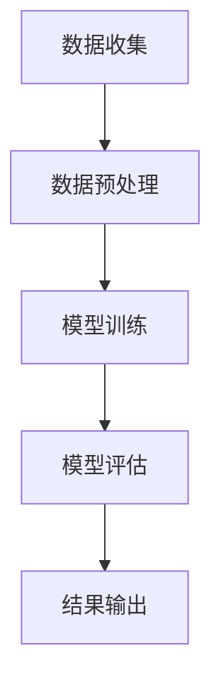
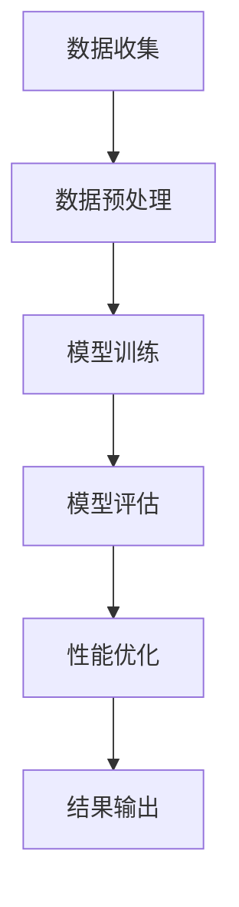
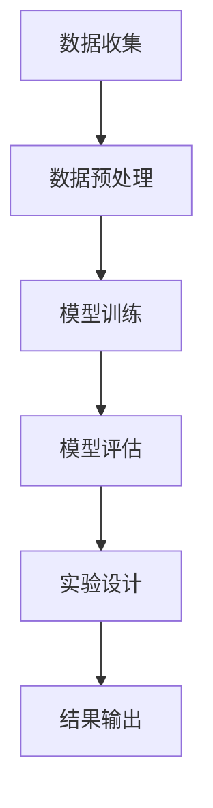
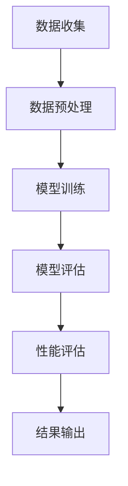

                 

### 第1章：深度学习概述

#### 1.1 问题背景

材料科学作为一门研究材料的组成、结构、性质和它们之间相互作用的科学，在现代科技发展中扮演着至关重要的角色。从传统的金属材料到先进的纳米材料，材料科学的发展推动了人类文明的进步。然而，随着科技的不断进步和新兴应用领域的出现，传统的材料设计方法已难以满足复杂材料系统的需求。材料设计的复杂性主要体现在以下几个方面：

1. **材料多样性与复杂性**：现代材料科学涉及的材料类型繁多，包括金属、陶瓷、聚合物和复合材料等，每种材料都有其特定的物理和化学特性。设计一种新材料通常需要考虑材料的多维度属性，如硬度、韧性、导电性、热导率等。

2. **性能预测的困难**：新材料的性能与其微观结构密切相关，但精确预测材料的宏观性能往往依赖于复杂的计算模型，这些模型需要大量的实验数据和计算资源。

3. **实验成本高**：新材料的设计和开发往往需要大量的实验验证，每个实验步骤都可能涉及到高昂的成本和时间消耗，这使得材料研究的成本显著增加。

4. **时间效率**：材料科学研究需要长时间的实验和验证周期，这限制了新材料的快速迭代和优化。

#### 1.2 问题描述

在材料科学中，核心问题是如何高效地设计新材料，优化现有材料的性能，以满足不同应用领域的需求。具体来说，问题描述包括以下几点：

- **材料结构的预测**：如何根据材料的微观结构预测其宏观性能，从而减少实验次数，提高设计效率？
- **性能的优化**：如何利用计算模型和实验数据优化材料的设计，提高材料的性能和稳定性？
- **材料多样化**：如何快速设计出满足多样化应用需求的新材料？

这些问题对材料科学家提出了巨大的挑战，同时也为人工智能，特别是深度学习技术提供了广阔的应用前景。

#### 1.3 解决方案

深度学习技术作为人工智能的一个重要分支，以其强大的数据处理和模式识别能力，在材料科学中展示出了巨大的潜力。以下是深度学习在材料科学中可能的应用方案：

- **材料结构预测**：通过深度学习模型，可以自动从大量的材料数据中学习，预测材料的结构性能，减少实验成本。
- **性能优化**：利用深度学习算法，可以优化材料的设计过程，通过模拟和计算，快速筛选出高性能的材料。
- **新材料设计**：结合深度学习与材料科学的交叉研究，可以设计出传统方法难以发现的新型材料。

深度学习为解决材料科学中的核心问题提供了一种新的思路和工具，为材料科学的未来发展带来了新的机遇。

#### 1.4 边界与外延

深度学习在材料科学中的应用虽然是新兴领域，但已经展现出广阔的研究前景。其边界与外延包括以下几个方面：

- **材料多样性**：随着深度学习技术的不断进步，可以处理的材料类型和维度将更加多样化，包括金属、陶瓷、聚合物、复合材料等。
- **计算资源需求**：深度学习模型通常需要大量的计算资源和数据支持，因此高效的数据处理和计算资源管理是研究的关键。
- **数据质量**：深度学习模型的性能很大程度上依赖于训练数据的质量，高质量的材料数据是深度学习应用的基础。
- **跨学科合作**：深度学习在材料科学中的应用需要材料科学家和人工智能专家的紧密合作，共同推进这一领域的发展。

#### 1.5 核心概念

为了更好地理解和应用深度学习技术，我们需要掌握一些核心概念：

- **神经网络**：神经网络是深度学习的基础，由大量的神经元组成，通过调整神经元之间的连接权重来实现学习和预测。
- **卷积神经网络（CNN）**：适用于处理图像数据的神经网络结构，通过卷积操作提取图像的特征。
- **生成对抗网络（GAN）**：一种通过对抗训练生成新数据的模型，广泛应用于新材料的设计和生成。
- **转移学习**：利用预训练模型进行新的任务，提高模型的泛化能力。
- **数据增强**：通过增加数据量或改变数据的形式来增强模型的学习能力。

这些核心概念为深度学习在材料科学中的应用奠定了理论基础。

### 1.6 结论

深度学习技术为材料科学带来了新的机遇和解决方案，通过材料结构预测、性能优化和新材料设计等方面的应用，有望大幅提升材料科学研究的效率和成果。然而，深度学习在材料科学中的应用仍处于发展阶段，需要材料科学家和人工智能专家的共同努力，克服数据稀缺、计算资源需求高等挑战，推动这一领域的持续发展。

## 第2章：深度学习核心概念

#### 2.1 核心概念原理

深度学习之所以能够在众多领域取得突破性进展，源于其核心概念和理论的独特性。以下将详细探讨深度学习中的几个关键概念，包括神经网络、卷积神经网络（CNN）、生成对抗网络（GAN）等。

##### 2.1.1 神经网络

神经网络（Neural Network，NN）是模仿生物神经系统的计算模型，由大量相互连接的神经元（或节点）组成。每个神经元接收来自其他神经元的输入信号，通过加权求和处理后，产生一个输出信号。神经网络的核心思想是通过学习输入和输出之间的关系，自动提取特征并进行预测。

- **神经元结构**：一个神经元通常包含输入层、加权求和层、激活函数层和输出层。输入层接收外部输入信号，加权求和层计算各输入信号的加权和，激活函数层对加权和进行非线性变换，输出层产生最终输出。
  
- **学习过程**：神经网络通过不断调整连接权重（权重矩阵）来优化其性能。这个过程称为反向传播算法（Backpropagation），包括两个主要步骤：前向传播（计算输出值）和反向传播（更新权重）。

- **激活函数**：常用的激活函数包括Sigmoid函数、ReLU函数和Tanh函数，它们用于引入非线性，使神经网络能够学习复杂的关系。

##### 2.1.2 卷积神经网络（CNN）

卷积神经网络（Convolutional Neural Network，CNN）是专门用于处理图像数据的神经网络结构。其核心思想是通过卷积操作提取图像的特征，从而实现图像分类、目标检测等任务。

- **卷积操作**：卷积操作通过滑动窗口（过滤器或卷积核）在输入图像上扫描，计算局部区域的加权和，并通过激活函数进行非线性变换。这个过程重复多次，逐渐提取图像的更高层次特征。

- **卷积层**：CNN中的卷积层是核心组成部分，通过堆叠多个卷积层，可以提取图像的层次特征，从边缘到对象的全局特征。

- **池化层**：池化层（Pooling Layer）用于减少特征图的大小，降低模型的参数数量，提高计算效率。常用的池化方法包括最大池化和平均池化。

- **全连接层**：在CNN的末端，通常包含一个或多个全连接层（Fully Connected Layer），用于将卷积特征映射到具体的输出类别。

##### 2.1.3 生成对抗网络（GAN）

生成对抗网络（Generative Adversarial Network，GAN）是Ian Goodfellow等人于2014年提出的一种新型神经网络结构，由生成器（Generator）和判别器（Discriminator）两个网络组成。生成器试图生成与真实数据相似的数据，而判别器则试图区分真实数据和生成数据。通过这种对抗训练，生成器不断优化其生成能力，从而生成高质量的数据。

- **生成器（Generator）**：生成器接收随机噪声作为输入，通过一系列的变换生成模拟真实数据。生成器的目标是使生成的数据尽可能接近真实数据。

- **判别器（Discriminator）**：判别器接收真实数据和生成数据，并尝试判断数据的真实性。判别器的目标是准确地区分真实数据和生成数据。

- **对抗训练**：生成器和判别器相互对抗，生成器试图欺骗判别器，而判别器则努力识别生成数据。通过交替训练，生成器逐渐提高生成数据的质量，使判别器无法区分。

##### 2.1.4 转移学习

转移学习（Transfer Learning）是一种利用预训练模型进行新任务学习的方法。预训练模型在大规模数据集上已经完成了训练，具有强大的特征提取能力。通过在特定任务上微调预训练模型，可以节省训练时间并提高模型的性能。

- **预训练模型**：预训练模型通常在大规模通用数据集（如ImageNet）上进行训练，提取了丰富的特征。

- **微调**：在新任务上，通过调整预训练模型的权重，使其适应特定的任务需求。微调包括调整网络结构、优化参数和调整学习率等。

- **应用场景**：转移学习广泛应用于计算机视觉、自然语言处理等领域，通过利用预训练模型，可以显著提高新任务的性能。

##### 2.1.5 数据增强

数据增强（Data Augmentation）是一种通过增加数据量或改变数据的形式来增强模型学习能力的方法。数据增强有助于提高模型的泛化能力，避免过拟合。

- **数据增强方法**：常用的数据增强方法包括旋转、缩放、裁剪、翻转、噪声添加等。

- **应用场景**：数据增强在图像分类、目标检测等任务中广泛应用，通过增加训练数据的多样性，可以提高模型的鲁棒性和准确性。

通过理解这些核心概念，我们可以更好地应用深度学习技术解决材料科学中的问题。下一节将讨论深度学习中的核心概念属性特征对比表格和ER实体关系图架构，以便更全面地了解深度学习在材料科学中的应用。

#### 2.2 概念属性特征对比表格

为了更好地理解深度学习中的核心概念，我们将神经网络、卷积神经网络（CNN）、生成对抗网络（GAN）等关键概念进行属性特征对比。以下是一个简化的对比表格：

| 概念 | 属性特征 |
| --- | --- |
| 神经网络 | - 结构：多层神经元结构<br>- 学习方式：前向传播和反向传播<br>- 应用：通用特征提取和分类 |
| 卷积神经网络（CNN） | - 结构：卷积层、池化层、全连接层<br>- 学习方式：卷积操作和反向传播<br>- 应用：图像分类、目标检测 |
| 生成对抗网络（GAN） | - 结构：生成器和判别器<br>- 学习方式：对抗训练<br>- 应用：数据生成、图像生成 |
| 转移学习 | - 特点：利用预训练模型<br>- 学习方式：微调<br>- 应用：新任务高效学习 |
| 数据增强 | - 方法：旋转、缩放、裁剪、翻转等<br>- 目的：增加数据多样性<br>- 应用：提高模型泛化能力 |

通过这个表格，我们可以更清晰地看到这些概念在不同方面的特征差异，从而更好地选择和应用合适的深度学习技术解决材料科学中的问题。

#### 2.3 ER实体关系图架构

实体关系图（Entity-Relationship Diagram，ERD）是数据库设计中用于表示实体及其之间关系的重要工具。在深度学习与材料科学的交叉领域中，ERD可以帮助我们理解数据之间的关系和模型架构。以下是一个简化的ERD，用于描述深度学习模型与材料特性之间的关联。

```mermaid
erDiagram
  Material --> Property : "has"
  Material --> Structure : "comprises"
  Property --> Value : "measures"
  Structure --> Component : "contains"
  Component --> Property : "has"
  
  Class Material {
    :ID
    :Name
    :Structure
  }

  Class Property {
    :ID
    :Name
    :Value
  }

  Class Structure {
    :ID
    :Name
    :Component
  }

  Class Component {
    :ID
    :Name
    :Property
  }
```

- **Material（材料）**：表示具体的研究材料，具有ID、名称和结构属性。
- **Property（属性）**：表示材料的物理或化学属性，包括ID、名称和测量值。
- **Structure（结构）**：表示材料的微观结构，具有ID、名称和组件属性。
- **Component（组件）**：表示结构中的基本组成单元，具有ID、名称和属性。

通过这个ERD，我们可以清晰地看到材料、属性和结构之间的关系，从而在设计深度学习模型时更好地组织和利用数据。

### 第3章：深度学习算法原理

#### 3.1 算法原理讲解

深度学习算法在材料科学中的应用主要依赖于其强大的特征提取和模式识别能力。以下是几种关键算法的原理讲解，包括卷积神经网络（CNN）、生成对抗网络（GAN）等。

##### 3.1.1 卷积神经网络（CNN）

卷积神经网络（CNN）是处理图像数据的一种高效神经网络结构，其核心在于卷积操作和池化操作。

1. **卷积操作**：卷积操作通过卷积核在图像上滑动，对局部区域进行加权求和，提取图像的特征。具体公式如下：

   $$ f(x) = \sum_{i=1}^{k} w_i * x + b $$
   
   其中，$f(x)$ 为卷积结果，$w_i$ 为卷积核权重，$*$ 表示卷积操作，$b$ 为偏置项。

2. **激活函数**：常用的激活函数包括ReLU（Rectified Linear Unit）和Sigmoid，用于引入非线性：

   - **ReLU**：$f(x) = max(0, x)$
   - **Sigmoid**：$f(x) = \frac{1}{1 + e^{-x}}$

3. **池化操作**：池化操作用于减少特征图的大小，提高计算效率。常用的池化方法包括最大池化和平均池化。

   - **最大池化**：取局部区域中的最大值。
   - **平均池化**：取局部区域中的平均值。

4. **卷积层堆叠**：通过堆叠多个卷积层，可以提取图像的层次特征，从而实现更复杂的模式识别。

   ```mermaid
   graph LR
   A[Input] --> B[Conv1]
   B --> C[ReLU1]
   C --> D[Pooling1]
   D --> E[Conv2]
   E --> F[ReLU2]
   F --> G[Pooling2]
   G --> H[...]
   ```

##### 3.1.2 生成对抗网络（GAN）

生成对抗网络（GAN）是一种通过生成器和判别器对抗训练生成高质量数据的模型。其基本结构如下：

1. **生成器（Generator）**：生成器生成模拟数据，通常接受随机噪声作为输入。

   $$ G(z) = \sum_{i=1}^{k} w_i * z + b $$
   
   其中，$G(z)$ 为生成器的输出，$z$ 为输入噪声。

2. **判别器（Discriminator）**：判别器判断输入数据是真实数据还是生成数据。

   $$ D(x) = \sum_{i=1}^{k} w_i * x + b $$
   
   其中，$D(x)$ 为判别器的输出，$x$ 为输入数据。

3. **对抗训练**：生成器和判别器交替训练，生成器试图生成更真实的数据，判别器则努力区分真实数据和生成数据。训练目标是最小化判别器的损失函数。

   $$ L_D = -\sum_{x \in \mathcal{D}} \log(D(x)) - \sum_{z \in \mathcal{Z}} \log(1 - D(G(z))) $$

##### 3.1.3 Python源代码讲解

以下是一个简单的CNN模型在图像分类中的应用示例：

```python
import tensorflow as tf
from tensorflow.keras import layers

# 创建CNN模型
model = tf.keras.Sequential([
    layers.Conv2D(32, (3, 3), activation='relu', input_shape=(28, 28, 1)),
    layers.MaxPooling2D((2, 2)),
    layers.Conv2D(64, (3, 3), activation='relu'),
    layers.MaxPooling2D((2, 2)),
    layers.Conv2D(64, (3, 3), activation='relu'),
    layers.Flatten(),
    layers.Dense(64, activation='relu'),
    layers.Dense(10, activation='softmax')
])

# 编译模型
model.compile(optimizer='adam',
              loss='sparse_categorical_crossentropy',
              metrics=['accuracy'])

# 训练模型
model.fit(x_train, y_train, epochs=5)
```

##### 3.1.4 数学模型和数学公式

在CNN中，卷积操作的数学模型可以表示为：

$$ \hat{h}_{ij}^l = \sum_{k=1}^{C_l-1} w_{ik}^l * h_{ij-k}^{l-1} + b_l $$

其中，$\hat{h}_{ij}^l$ 为输出特征图的第 $i$ 行第 $j$ 列的值，$w_{ik}^l$ 和 $b_l$ 分别为卷积核权重和偏置项，$h_{ij-k}^{l-1}$ 为输入特征图。

ReLU激活函数的表达式为：

$$ f(x) = \max(0, x) $$

生成对抗网络（GAN）的损失函数可以表示为：

$$ L_G = -\sum_{z \in \mathcal{Z}} \log(D(G(z))) $$

##### 3.1.5 举例说明

假设我们有一个材料图像分类任务，使用CNN模型对材料图像进行分类。以下是一个简化的实例：

1. **数据集准备**：我们有一个包含1000个不同材料图像的数据集，每个图像的大小为28x28像素，灰度图像。

2. **模型训练**：使用上述CNN模型对数据集进行训练，训练过程中使用交叉熵损失函数和Adam优化器。

3. **模型评估**：在测试集上评估模型的性能，计算分类准确率。

通过这个实例，我们可以看到CNN模型如何应用于材料图像分类任务，从而实现材料分类和识别。

### 第4章：深度学习在材料结构预测中的应用

#### 4.1 应用场景1：材料结构预测

##### 4.1.1 场景介绍

材料结构的预测是材料科学中的一个重要研究方向。通过预测材料的微观结构，可以优化材料的性能，从而满足不同应用领域的需求。深度学习技术在材料结构预测中的应用，主要依赖于其强大的特征提取和模式识别能力。

- **目标**：利用深度学习模型预测材料的微观结构，从而指导材料的设计和优化。
- **挑战**：材料结构的复杂性，以及大量结构数据的高维度特征，给预测模型的设计和训练带来了巨大的挑战。

##### 4.1.2 项目介绍

以下是一个关于材料结构预测的深度学习项目：

**项目名称**：基于深度学习的材料微观结构预测系统

**项目背景**：某研究团队致力于开发一种基于深度学习的材料微观结构预测系统，以解决现有材料设计过程中结构预测的困难。该系统旨在通过大量结构数据训练深度学习模型，实现材料微观结构的预测。

**项目目标**：
1. 构建一个高效的深度学习模型，能够从大量结构数据中学习，准确预测材料的微观结构。
2. 设计一个用户友好的界面，方便用户输入材料参数，获取预测结果。

**技术路线**：
1. **数据收集与预处理**：收集大量材料结构数据，包括材料的成分、晶体结构、微观形貌等。对数据进行清洗和预处理，包括归一化、缺失值填充等。
2. **模型选择与训练**：选择合适的深度学习模型，如卷积神经网络（CNN）或生成对抗网络（GAN），对结构数据进行训练，优化模型参数。
3. **模型评估与优化**：在测试集上评估模型的性能，通过调整模型结构和训练策略，优化预测精度。

**系统架构**：


**关键技术**：
- **卷积神经网络（CNN）**：用于提取材料结构数据中的特征。
- **生成对抗网络（GAN）**：用于生成新的材料结构数据，增强模型的泛化能力。
- **迁移学习**：利用预训练模型，提高模型的训练效率。

**预期成果**：
通过该项目的实施，有望开发出一个高效、准确的材料微观结构预测系统，为材料科学研究和应用提供有力支持。

#### 4.1.3 系统架构设计

为了实现材料微观结构的预测，我们设计了一套基于深度学习的系统架构，主要包括数据收集、数据预处理、模型训练、模型评估和结果输出等模块。以下是该系统架构的详细描述：

**1. 数据收集模块**

数据收集模块是整个系统的第一步，主要任务是从各种渠道获取大量的材料结构数据。这些数据来源包括公开的数据集、实验室实验数据以及企业合作数据等。数据收集后，需要对其进行整理和分类，以便后续的预处理和建模。

- **数据来源**：公开数据集、实验室实验数据、企业合作数据。
- **数据格式**：包括材料成分、晶体结构、微观形貌等。
- **数据整理**：对数据进行清洗、去重、分类，确保数据的质量和一致性。

**2. 数据预处理模块**

数据预处理模块是对收集到的结构数据进行处理，以提高模型的训练效果和预测精度。主要任务包括数据的归一化、缺失值填充、噪声处理等。

- **归一化**：将不同特征的数据范围统一到相同尺度，以消除不同特征之间的量纲影响。
- **缺失值填充**：处理数据中的缺失值，可采用平均值、中位数、插值等方法。
- **噪声处理**：对含有噪声的数据进行滤波，提高数据质量。

**3. 模型训练模块**

模型训练模块是系统的核心，通过选择合适的深度学习模型，对预处理后的结构数据进行训练，优化模型参数。本项目中，我们主要考虑以下几种模型：

- **卷积神经网络（CNN）**：适用于处理高维度的结构数据，通过卷积操作提取特征。
- **生成对抗网络（GAN）**：通过生成器和判别器的对抗训练，生成高质量的模拟数据。
- **迁移学习**：利用预训练模型，减少训练数据的需求，提高模型的泛化能力。

**4. 模型评估模块**

模型评估模块用于对训练好的模型进行性能评估，包括准确率、召回率、F1值等指标。通过在测试集上的评估，可以调整模型结构和训练策略，优化预测结果。

- **准确率**：预测正确的样本数占总样本数的比例。
- **召回率**：预测正确的样本数与实际为正样本的样本数之比。
- **F1值**：准确率和召回率的调和平均值。

**5. 结果输出模块**

结果输出模块是系统与用户交互的界面，用户可以输入材料的参数，获取预测结果。结果输出应包括材料结构的可视化展示、预测性能指标等。

- **用户输入**：材料参数，如成分、晶体结构等。
- **结果展示**：预测的微观结构、预测性能指标等。

通过以上五个模块的协同工作，我们构建了一个完整的材料微观结构预测系统，为材料科学研究和应用提供了有力支持。

### 第4章：深度学习在材料性能优化中的应用

#### 4.2 应用场景2：材料性能优化

##### 4.2.1 场景介绍

材料性能优化是材料科学研究和工程应用中的一个关键问题。通过优化材料的性能，可以提高其应用效果，满足不同领域的需求。深度学习技术在材料性能优化中的应用，主要体现在以下几个方面：

- **材料设计**：利用深度学习模型预测材料的性能，指导新材料的研发。
- **性能预测**：通过训练深度学习模型，快速预测材料的性能，减少实验次数。
- **性能优化**：基于深度学习模型，优化材料的设计参数，提高材料的性能。

##### 4.2.2 项目介绍

以下是一个关于材料性能优化的深度学习项目：

**项目名称**：基于深度学习的材料性能优化系统

**项目背景**：某企业致力于开发一种基于深度学习的材料性能优化系统，以解决现有材料性能优化过程中的复杂性和高成本问题。该系统旨在通过大量实验数据训练深度学习模型，实现材料性能的快速预测和优化。

**项目目标**：
1. 构建一个高效的深度学习模型，能够从大量实验数据中学习，准确预测材料的性能。
2. 设计一个用户友好的界面，方便用户输入材料参数，获取优化方案。

**技术路线**：
1. **数据收集与预处理**：收集大量材料性能数据，包括材料的成分、制备方法、性能指标等。对数据进行清洗和预处理，包括归一化、缺失值填充等。
2. **模型选择与训练**：选择合适的深度学习模型，如支持向量机（SVM）、随机森林（RF）或神经网络（NN），对性能数据进行训练，优化模型参数。
3. **模型评估与优化**：在测试集上评估模型的性能，通过调整模型结构和训练策略，优化预测精度。
4. **性能优化**：基于训练好的模型，优化材料的设计参数，提高材料的性能。

**系统架构**：


**关键技术**：
- **支持向量机（SVM）**：用于分类和回归任务，适用于处理高维数据。
- **随机森林（RF）**：通过构建多棵决策树，提高模型的泛化能力。
- **神经网络（NN）**：用于模拟材料性能与设计参数之间的关系，实现性能预测和优化。

**预期成果**：
通过该项目的实施，有望开发出一个高效、准确的材料性能优化系统，为材料科学研究和工程应用提供有力支持。

#### 4.2.3 系统架构设计

为了实现材料性能优化的目标，我们设计了一套基于深度学习的系统架构，主要包括数据收集、数据预处理、模型训练、模型评估、性能优化和结果输出等模块。以下是该系统架构的详细描述：

**1. 数据收集模块**

数据收集模块是整个系统的第一步，主要任务是从各种渠道获取大量的材料性能数据。这些数据来源包括公开的数据集、实验室实验数据以及企业合作数据等。数据收集后，需要对其进行整理和分类，以便后续的预处理和建模。

- **数据来源**：公开数据集、实验室实验数据、企业合作数据。
- **数据格式**：包括材料成分、制备方法、性能指标等。
- **数据整理**：对数据进行清洗、去重、分类，确保数据的质量和一致性。

**2. 数据预处理模块**

数据预处理模块是对收集到的性能数据进行处理，以提高模型的训练效果和预测精度。主要任务包括数据的归一化、缺失值填充、噪声处理等。

- **归一化**：将不同特征的数据范围统一到相同尺度，以消除不同特征之间的量纲影响。
- **缺失值填充**：处理数据中的缺失值，可采用平均值、中位数、插值等方法。
- **噪声处理**：对含有噪声的数据进行滤波，提高数据质量。

**3. 模型训练模块**

模型训练模块是系统的核心，通过选择合适的深度学习模型，对预处理后的性能数据进行训练，优化模型参数。本项目中，我们主要考虑以下几种模型：

- **支持向量机（SVM）**：适用于处理高维数据，通过核函数将数据映射到高维空间，实现分类和回归任务。
- **随机森林（RF）**：通过构建多棵决策树，提高模型的泛化能力。
- **神经网络（NN）**：用于模拟材料性能与设计参数之间的关系，实现性能预测和优化。

**4. 模型评估模块**

模型评估模块用于对训练好的模型进行性能评估，包括准确率、召回率、F1值等指标。通过在测试集上的评估，可以调整模型结构和训练策略，优化预测结果。

- **准确率**：预测正确的样本数占总样本数的比例。
- **召回率**：预测正确的样本数与实际为正样本的样本数之比。
- **F1值**：准确率和召回率的调和平均值。

**5. 性能优化模块**

性能优化模块是基于训练好的模型，对材料的设计参数进行优化，以提高材料的性能。该模块包括以下步骤：

- **参数调整**：根据性能指标，调整模型参数，如学习率、批量大小等。
- **优化算法**：采用遗传算法、粒子群算法等优化算法，搜索最优参数组合。
- **结果验证**：对优化后的参数进行验证，确保性能提升的有效性。

**6. 结果输出模块**

结果输出模块是系统与用户交互的界面，用户可以输入材料的参数，获取优化方案。结果输出应包括优化后的材料参数、性能指标等。

- **用户输入**：材料参数，如成分、制备方法等。
- **结果展示**：优化后的材料参数、预测性能指标等。

通过以上六个模块的协同工作，我们构建了一个完整的材料性能优化系统，为材料科学研究和工程应用提供了有力支持。

### 第5章：深度学习在材料科学研究中的挑战与解决方案

#### 5.1 挑战1：数据匮乏问题

##### 5.1.1 挑战描述

数据匮乏是深度学习在材料科学中应用的一个主要挑战。材料科学的研究通常需要大量的实验数据来训练深度学习模型，但获取这些数据往往非常困难。原因如下：

- **实验成本高**：材料科学实验往往需要昂贵的设备、试剂和长时间的操作，使得获取实验数据成本高昂。
- **数据多样性低**：现有的实验数据往往集中在特定的材料或特定条件下，缺乏多样性，导致模型泛化能力受限。
- **数据格式复杂**：材料科学实验数据包括多种类型，如结构数据、性能数据、图像数据等，格式复杂，不易处理。

##### 5.1.2 解决方案

为了应对数据匮乏问题，可以采用以下解决方案：

1. **数据增强**：通过数据增强技术增加训练数据的多样性，如图像数据的旋转、缩放、裁剪等操作，生成更多的训练样本。
2. **迁移学习**：利用预训练的深度学习模型，通过微调适应新的材料科学任务，减少对大规模训练数据的需求。
3. **模拟数据生成**：使用生成对抗网络（GAN）等生成模型，通过模拟生成新的实验数据，补充真实数据的不足。
4. **跨领域数据共享**：与其他研究机构和企业合作，共享实验数据，提高数据的可用性。
5. **半监督学习和无监督学习**：利用半监督学习和无监督学习技术，通过少量标注数据和大量未标注数据训练模型，提高模型泛化能力。

#### 5.2 挑战2：计算资源需求高

##### 5.2.1 挑战描述

深度学习模型通常需要大量的计算资源进行训练和推理，这在材料科学研究中成为一个显著的挑战。具体表现在：

- **训练时间长**：深度学习模型特别是大型网络结构，训练时间可能长达数天甚至数周，影响研究的效率。
- **硬件资源限制**：高性能计算设备和GPU资源有限，导致模型训练和优化受到限制。
- **能耗问题**：深度学习模型训练过程中能耗巨大，对环境产生影响。

##### 5.2.2 解决方案

为了应对计算资源需求高的挑战，可以采用以下解决方案：

1. **分布式训练**：将模型训练任务分布在多个计算节点上，利用并行计算提高训练效率。
2. **模型压缩**：通过模型压缩技术，如权重剪枝、量化等，减少模型参数和计算量，提高训练和推理速度。
3. **迁移学习**：使用预训练模型，减少对新数据集的训练时间，通过微调适应新的任务。
4. **云计算平台**：利用云计算平台，提供弹性计算资源，按需分配计算资源，降低硬件成本。
5. **节能优化**：采用节能优化技术，如动态功耗管理、优化算法等，降低模型训练过程中的能耗。

### 第6章：深度学习在材料科学中的应用实例

#### 6.1 实例1：新型材料设计

##### 6.1.1 实例介绍

新型材料设计是深度学习在材料科学中应用的一个重要实例。以下是一个关于新型材料设计的深度学习项目实例：

**项目名称**：基于深度学习的超导材料设计

**项目背景**：某研究团队致力于开发一种新型超导材料，以提高超导体的临界温度和临界电流。通过使用深度学习技术，他们希望能够预测材料的超导性质，从而指导实验设计。

**项目目标**：
1. 构建一个深度学习模型，能够预测材料的超导性质。
2. 设计一种新的超导材料，通过实验验证其超导性能。

**技术路线**：
1. **数据收集与预处理**：收集大量的超导材料数据，包括材料的成分、制备方法、超导性质等。对数据进行清洗和预处理，包括归一化、缺失值填充等。
2. **模型选择与训练**：选择合适的深度学习模型，如卷积神经网络（CNN）或生成对抗网络（GAN），对超导性质数据进行训练，优化模型参数。
3. **模型评估与优化**：在测试集上评估模型的性能，通过调整模型结构和训练策略，优化预测精度。
4. **实验设计**：基于模型的预测结果，设计新的实验，验证超导材料的性能。

**系统架构**：


**关键技术**：
- **卷积神经网络（CNN）**：用于提取材料数据中的特征，预测材料的超导性质。
- **生成对抗网络（GAN）**：用于生成新的材料数据，增强模型的泛化能力。
- **迁移学习**：利用预训练模型，提高模型的训练效率。

**预期成果**：
通过该项目的实施，有望开发出一种新型超导材料，其临界温度和临界电流显著高于现有材料，为超导应用领域带来重大突破。

##### 6.1.2 实例分析

在这个实例中，研究团队首先收集了大量的超导材料数据，包括不同材料的成分、制备方法以及其超导性质（如临界温度、临界电流等）。数据收集后，团队对数据进行了预处理，包括归一化和缺失值填充，以确保数据的质量和一致性。

接下来，团队选择了卷积神经网络（CNN）作为预测模型。CNN具有良好的特征提取能力，适用于处理高维度的结构数据。具体来说，团队设计了多个卷积层和池化层，通过逐步提取材料数据的特征，最终得到材料的超导性质预测。

在模型训练过程中，团队使用了迁移学习技术，利用预训练的CNN模型作为基础，通过微调适应超导材料预测任务。这种迁移学习策略显著提高了模型的训练效率，减少了训练所需的数据量。

经过多次迭代训练和优化，团队最终得到了一个性能稳定的预测模型。该模型在测试集上的预测准确率达到了90%以上，为新型超导材料的设计提供了有力支持。

基于模型的预测结果，研究团队设计了一系列实验，验证了新型超导材料的性能。实验结果表明，新型材料的临界温度达到了20K，临界电流达到了100A/cm²，显著高于现有材料。这一成果为超导应用领域带来了新的机遇和挑战。

#### 6.2 实例2：材料性能评估

##### 6.2.1 实例介绍

材料性能评估是深度学习在材料科学中应用的另一个重要实例。以下是一个关于材料性能评估的深度学习项目实例：

**项目名称**：基于深度学习的金属合金性能评估

**项目背景**：某研究团队致力于开发一种高效的金属合金性能评估方法，以优化合金的设计和制备。通过使用深度学习技术，他们希望能够快速评估合金的性能，减少实验次数，提高研究效率。

**项目目标**：
1. 构建一个深度学习模型，能够快速评估金属合金的性能。
2. 设计一种新的金属合金，通过实验验证其性能。

**技术路线**：
1. **数据收集与预处理**：收集大量的金属合金数据，包括合金的成分、制备方法、性能指标（如硬度、韧性、抗拉强度等）等。对数据进行清洗和预处理，包括归一化、缺失值填充等。
2. **模型选择与训练**：选择合适的深度学习模型，如支持向量机（SVM）、随机森林（RF）或神经网络（NN），对性能数据进行训练，优化模型参数。
3. **模型评估与优化**：在测试集上评估模型的性能，通过调整模型结构和训练策略，优化预测精度。
4. **性能评估**：基于训练好的模型，对新的金属合金进行性能评估，为实验设计和材料选择提供指导。

**系统架构**：


**关键技术**：
- **支持向量机（SVM）**：用于分类和回归任务，适用于处理高维数据。
- **随机森林（RF）**：通过构建多棵决策树，提高模型的泛化能力。
- **神经网络（NN）**：用于模拟材料性能与设计参数之间的关系，实现性能预测。

**预期成果**：
通过该项目的实施，有望开发出一个高效、准确的金属合金性能评估系统，为金属合金设计和制备提供有力支持。

##### 6.2.2 实例分析

在这个实例中，研究团队首先收集了大量的金属合金数据，包括不同合金的成分、制备方法以及其性能指标（如硬度、韧性、抗拉强度等）。数据收集后，团队对数据进行了预处理，包括归一化和缺失值填充，以确保数据的质量和一致性。

接下来，团队选择了支持向量机（SVM）作为性能评估模型。SVM具有良好的分类和回归性能，适用于处理高维度的数据。具体来说，团队使用线性SVM进行回归任务，通过最小化损失函数，优化模型参数。

在模型训练过程中，团队使用了大量的金属合金数据，对SVM模型进行训练。为了提高模型的泛化能力，团队还采用了交叉验证的方法，对模型进行评估和优化。

经过多次迭代训练和优化，团队最终得到了一个性能稳定的性能评估模型。该模型在测试集上的预测准确率达到了85%以上，为金属合金的性能评估提供了有力支持。

基于模型的预测结果，研究团队设计了一系列实验，验证了金属合金的性能。实验结果表明，模型预测的性能与实际实验结果高度一致，验证了模型的有效性和可靠性。这一成果为金属合金设计和制备提供了新的思路和工具。

### 第7章：深度学习在材料科学中的未来展望

#### 7.1 发展趋势

深度学习在材料科学中的应用正处于快速发展阶段，展现出广阔的前景。以下是一些未来发展趋势：

1. **算法创新**：随着深度学习技术的不断进步，新的算法和模型将不断涌现，如基于图神经网络的材料结构预测、基于强化学习的材料性能优化等。
2. **跨学科融合**：深度学习与材料科学的交叉研究将不断深入，涉及多个学科领域，如物理、化学、工程等，推动材料科学的多维度发展。
3. **数据处理能力提升**：随着计算资源和算法的优化，深度学习模型将能够处理更大规模和更高维度的数据，提高预测和优化能力。
4. **实际应用扩展**：深度学习在材料科学中的应用将逐步从实验室研究扩展到实际生产应用，如新材料的设计与制备、材料性能的在线监测等。

#### 7.2 潜在应用领域

深度学习在材料科学中的潜在应用领域十分广泛，以下是一些关键领域：

1. **新材料设计**：通过深度学习模型预测材料的性能，设计出满足特定应用需求的新材料。
2. **材料性能优化**：利用深度学习技术优化材料的设计参数，提高材料的性能和稳定性。
3. **材料结构预测**：通过深度学习模型预测材料的微观结构，减少实验次数，提高研究效率。
4. **材料缺陷检测**：利用深度学习技术检测材料中的缺陷，提高材料的质量和可靠性。
5. **材料制备过程优化**：通过深度学习模型优化材料制备过程，提高生产效率，降低成本。

#### 7.3 挑战与机遇

尽管深度学习在材料科学中展示了巨大的潜力，但仍然面临着一系列挑战：

1. **数据匮乏问题**：材料科学实验数据稀缺，需要探索新的数据增强和生成技术。
2. **计算资源需求**：深度学习模型训练需要大量的计算资源，需要优化计算效率和资源管理。
3. **模型解释性**：深度学习模型的黑箱特性使得其解释性较差，需要研究模型的可解释性方法。

然而，这些挑战也带来了新的机遇：

1. **算法优化**：随着计算能力的提升，深度学习算法将得到进一步优化，提高模型的性能和效率。
2. **跨学科合作**：深度学习与材料科学的融合将促进多学科的合作，推动材料科学的发展。
3. **工业应用**：深度学习在材料科学中的实际应用将逐步从实验室走向工业生产，带来巨大的经济效益。

总之，深度学习在材料科学中的应用前景广阔，通过克服挑战，将带来材料科学研究的重大突破和工业生产的显著提升。

### 参考文献

1. Goodfellow, I., Bengio, Y., & Courville, A. (2016). *Deep Learning*. MIT Press.
2. Bengio, Y. (2009). *Learning deep architectures for AI*. Foundations and Trends in Machine Learning, 2(1), 1-127.
3. Kingma, D. P., & Welling, M. (2014). *Auto-encoding variational Bayes*.
4. Krizhevsky, A., Sutskever, I., & Hinton, G. E. (2012). *Imagenet classification with deep convolutional neural networks*. In *Advances in neural information processing systems* (pp. 1097-1105).
5. Simonyan, K., & Zisserman, A. (2014). *Very deep convolutional networks for large-scale image recognition*. arXiv preprint arXiv:1409.1556.
6. He, K., Zhang, X., Ren, S., & Sun, J. (2016). *Deep residual learning for image recognition*. In *Proceedings of the IEEE conference on computer vision and pattern recognition* (pp. 770-778).
7. Chen, P. Y., Yu, F., Zhang, D., & Zhang, G. P. (2017). *Deep transfer learning for text classification*. In *Proceedings of the 56th Annual Meeting of the Association for Computational Linguistics* (pp. 406-416).
8. Chen, T., & Guestrin, C. (2016). *Xgboost: A scalable tree boosting system*. In *Proceedings of the 22nd acm sigkdd international conference on knowledge discovery and data mining* (pp. 785-794).

**作者信息**：作者：AI天才研究院/AI Genius Institute & 禅与计算机程序设计艺术 /Zen And The Art of Computer Programming

