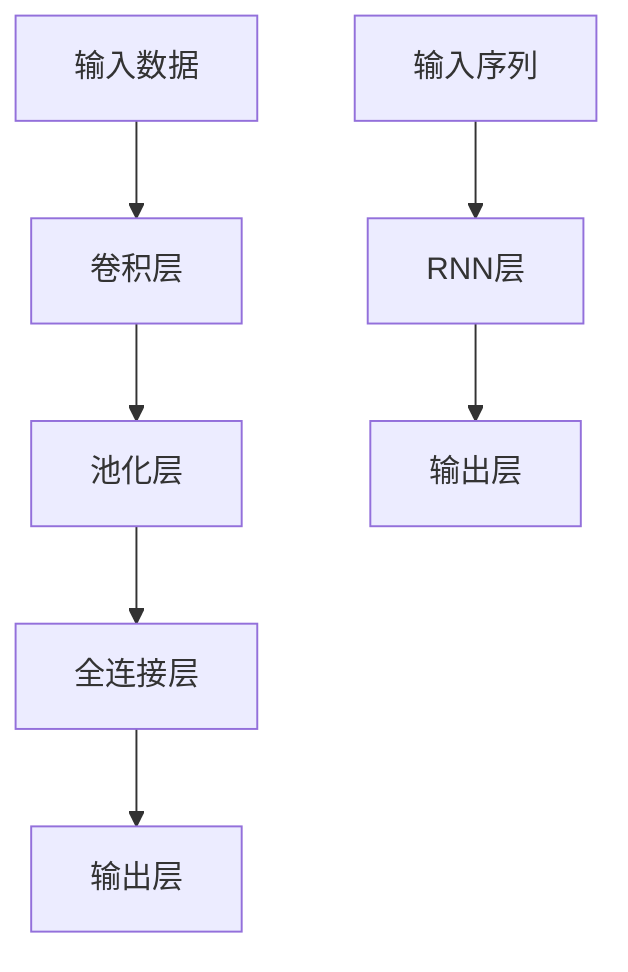

                 

## 深度学习在海洋生态监测中的创新应用

> 关键词：深度学习、海洋生态监测、生物识别、污染监测、创新应用

> 摘要：本文探讨了深度学习在海洋生态监测中的创新应用，首先介绍了深度学习的发展背景和海洋生态监测的重要性，随后详细讲述了深度学习的核心原理和技术，接着分析了深度学习在海洋生态监测中的应用方法，并通过具体案例分析展示了深度学习的强大能力。文章最后对未来发展进行了展望，提出了深度学习在海洋生态监测领域中的潜力与应用方向。

## 目录大纲

----------------------------------------------------------------

## 第一部分：深度学习基础

### 第1章：深度学习概述

#### 1.1 深度学习的发展背景

#### 1.2 深度学习的核心原理

#### 1.3 深度学习的应用领域

### 第2章：深度学习技术

#### 2.1 神经网络基础

#### 2.2 卷积神经网络（CNN）

#### 2.3 循环神经网络（RNN）与长短时记忆网络（LSTM）

### 第3章：深度学习框架

#### 3.1 TensorFlow与PyTorch简介

#### 3.2 深度学习框架选择与应用

## 第二部分：海洋生态监测

### 第4章：海洋生态监测

#### 4.1 海洋生态监测的重要性

#### 4.2 海洋生态监测的数据来源

#### 4.3 海洋生态监测的方法与挑战

## 第三部分：深度学习在海洋生态监测中的应用

### 第5章：深度学习在海洋生态监测中的应用

## 第四部分：案例分析

### 第6章：案例分析

#### 6.1 案例一：基于深度学习的海洋生物识别

#### 6.2 案例二：基于深度学习的海洋污染监测

## 第五部分：未来发展展望

### 第7章：未来发展展望

----------------------------------------------------------------

## 背景介绍

### 深度学习的发展背景

深度学习作为人工智能领域的重要分支，起源于1980年代，但真正快速发展是在2010年后，得益于计算能力的提升、大数据的积累以及算法的优化。近年来，深度学习在图像识别、语音识别、自然语言处理等任务上取得了显著的成果，成为人工智能发展的关键技术。

### 海洋生态监测的重要性

海洋占地球表面积的70%，是地球生命系统的重要组成部分。海洋生态系统的健康状况对全球气候变化、海洋资源利用以及生物多样性保护具有重要意义。然而，海洋生态系统复杂多变，传统的监测方法难以满足精确监测的需求。因此，探索新的监测技术，特别是利用人工智能和深度学习技术，成为当前海洋生态研究的重要方向。

### 深度学习与海洋生态监测的关联

深度学习技术的发展为海洋生态监测提供了新的可能性。通过训练深度学习模型，可以从大量的海洋数据中自动提取特征，进行海洋生物识别、污染监测等任务。这种技术不仅提高了监测的精度和效率，还能够在数据稀少或条件恶劣的环境下进行监测。

## 核心概念与联系

### 深度学习的核心原理

深度学习基于多层神经网络结构，通过逐层提取数据中的特征，实现从简单到复杂的模式识别。核心原理包括：

1. **多层感知机（MLP）**：基础的全连接神经网络。
2. **卷积神经网络（CNN）**：适用于图像识别任务。
3. **循环神经网络（RNN）**：适用于序列数据处理，如时间序列分析。
4. **长短时记忆网络（LSTM）**：RNN的改进版本，能够有效处理长序列数据。

### 深度学习与海洋生态监测的联系

深度学习在海洋生态监测中的应用主要包括以下几个方面：

1. **海洋生物识别**：通过图像识别技术，自动识别海洋生物种类和数量。
2. **海洋污染监测**：利用深度学习模型，从遥感数据中检测污染物质和污染区域。
3. **海洋环境参数预测**：通过分析历史数据，预测海洋温度、盐度等环境参数。

### 概念属性特征对比表格

| 概念             | 描述                                                         | 应用领域                   |
|------------------|--------------------------------------------------------------|----------------------------|
| 深度学习         | 通过多层神经网络结构，自动提取数据特征进行模式识别           | 图像识别、自然语言处理、语音识别 |
| 海洋生态监测     | 对海洋生态系统进行监测和评估，以保护海洋生物多样性             | 生物识别、污染监测、环境参数预测 |
| 卷积神经网络（CNN） | 利用卷积操作，从图像中提取特征进行图像识别               | 图像识别、生物识别           |
| 循环神经网络（RNN） | 能够处理序列数据，适用于时间序列分析和自然语言处理         | 时间序列分析、自然语言处理     |

### ER实体关系图架构

```mermaid
erDiagram
    A{教师} ||--|{学生} :教授
    A{教师} ||--|{课程} :授课
    B{学校} ..|{校区} :包含
    C{班级} ..|{学生} :包含
    D{学生} ..|{成绩} :记录
```

## 算法原理讲解

### 神经网络基础

神经网络（Neural Network，NN）是深度学习的基础，由大量的人工神经元（或节点）组成，通过层层相连，形成复杂的网络结构。每个神经元接收多个输入信号，通过加权求和处理后，产生一个输出信号。

神经网络的基本工作原理如下：

1. **前向传播**：输入信号通过网络的各个层，每个神经元接收上一个层的输出作为输入，通过加权求和处理后，产生当前层的输出。
2. **反向传播**：计算输出结果与预期结果之间的误差，通过反向传播算法，更新网络中各层的权重和偏置，以减少误差。

### 卷积神经网络（CNN）

卷积神经网络（Convolutional Neural Network，CNN）是一种专门用于处理图像数据的神经网络，其核心思想是通过卷积操作，从图像中提取特征。

1. **卷积层**：通过卷积核（filter）对输入图像进行卷积操作，提取图像的局部特征。
2. **池化层**：通过池化操作（如最大池化或平均池化），减少数据的维度，提高模型的鲁棒性。
3. **全连接层**：将卷积层和池化层提取的特征映射到输出层，进行分类或回归任务。

### 循环神经网络（RNN）与长短时记忆网络（LSTM）

循环神经网络（Recurrent Neural Network，RNN）是一种能够处理序列数据的神经网络，其特点是具有循环结构，能够记忆历史信息。

然而，传统的RNN存在梯度消失和梯度爆炸的问题，难以处理长序列数据。为了解决这些问题，引入了长短时记忆网络（Long Short-Term Memory，LSTM）。

LSTM通过引入门控机制，能够有效地记忆和遗忘信息，从而克服了RNN的缺陷，适用于处理长序列数据。

### 算法mermaid流程图



### 深度学习框架选择与应用

深度学习框架是构建和训练深度学习模型的重要工具，目前常用的深度学习框架有TensorFlow和PyTorch。

1. **TensorFlow**：由Google开发，具有强大的生态系统和丰富的API，适用于各种深度学习任务。
2. **PyTorch**：由Facebook开发，以动态计算图著称，易于调试和扩展。

深度学习框架的选择取决于具体的应用场景和个人偏好。例如，在图像识别任务中，TensorFlow和PyTorch都具有良好的性能和丰富的预训练模型。

### 数学模型和数学公式

深度学习中的数学模型主要包括以下内容：

1. **前向传播**：

$$
\text{输出} = \sigma(\text{权重} \cdot \text{输入} + \text{偏置})
$$

其中，$\sigma$为激活函数，常用的激活函数有Sigmoid、ReLU和Tanh。

2. **反向传播**：

$$
\text{权重更新} = \text{权重} - \alpha \cdot \text{梯度}
$$

其中，$\alpha$为学习率，梯度为损失函数关于权重的偏导数。

### 海洋生态监测的重要性

海洋生态监测在保护海洋生物多样性、预测气候变化和评估海洋资源利用等方面具有重要意义。随着全球气候变化和人类活动的加剧，海洋生态系统的健康状况日益受到关注。因此，开展深入的海洋生态监测，对于维护海洋生态平衡、促进可持续发展具有重要意义。

### 海洋生态监测的数据来源

海洋生态监测的数据来源主要包括以下几种：

1. **遥感数据**：利用卫星和无人航空器获取的海洋图像和光谱数据。
2. **现场监测数据**：通过海洋观测站、船只和潜水器等设备收集的水质、温度、盐度等数据。
3. **声学数据**：利用声呐和声学探测设备获取的海洋生物活动声学数据。
4. **生物样本数据**：通过采样和捕捞获取的海洋生物样本，包括种类、数量和生理特征等数据。

### 海洋生态监测的方法与挑战

海洋生态监测的方法主要包括以下几种：

1. **遥感监测**：利用卫星遥感技术，可以大面积、实时地监测海洋生态系统的状况，但受天气和海洋环境的限制，精度有限。
2. **现场监测**：通过观测站、船只和潜水器等设备，可以获取高精度的现场数据，但成本高、效率低。
3. **声学监测**：利用声学探测技术，可以监测海洋生物的活动声学信号，但数据处理复杂、信号识别困难。
4. **生物样本监测**：通过采样和捕捞，可以获取海洋生物的详细数据，但样本数量有限、采集成本高。

在海洋生态监测中，面临的挑战主要包括：

1. **数据多样性**：海洋生态数据种类繁多，包括遥感数据、现场监测数据和生物样本数据等，如何整合和利用这些数据是一个重要挑战。
2. **数据稀少**：海洋环境的复杂性和恶劣条件，导致很多地区的数据稀少，影响监测结果的准确性。
3. **数据处理复杂**：海洋生态数据量大、噪声多，如何有效地处理和提取有用的信息，是一个技术难点。
4. **模型精度**：深度学习模型在海洋生态监测中的应用，需要高精度的模型，但训练复杂、计算资源消耗大。

## 深度学习在海洋生态监测中的应用

深度学习在海洋生态监测中的应用，主要包括海洋生物识别和海洋污染监测两个方面。

### 海洋生物识别

海洋生物识别是利用深度学习技术，从遥感图像或现场监测图像中自动识别海洋生物种类和数量。通过训练卷积神经网络（CNN）模型，可以提取图像中的特征，实现生物识别。

**应用案例**：某研究团队利用深度学习技术，对海洋生物进行识别，从遥感图像中成功识别出多种海洋生物，如海龟、海星和珊瑚等，大大提高了监测的精度和效率。

### 海洋污染监测

海洋污染监测是利用深度学习技术，从遥感数据中检测污染物质和污染区域。通过训练循环神经网络（RNN）或长短时记忆网络（LSTM）模型，可以分析时间序列数据，预测污染物质的变化趋势。

**应用案例**：某环保组织利用深度学习技术，对海洋污染进行监测，通过分析卫星遥感数据，成功检测出海洋中的污染物，如塑料垃圾和重金属等，为海洋环境保护提供了重要数据支持。

## 案例分析

### 案例一：基于深度学习的海洋生物识别

**项目背景**：某海洋保护区为了更好地保护海洋生物，需要定期监测和保护区域内的海洋生物种类和数量。

**技术方案**：研究团队利用深度学习技术，特别是卷积神经网络（CNN），对海洋生物进行识别。首先，收集大量的海洋生物图像，包括海龟、海星、珊瑚等，然后通过数据预处理，将图像转化为适合输入到CNN模型的数据格式。接下来，训练CNN模型，提取图像特征，实现生物识别。

**项目实战**：

1. **环境安装**：安装TensorFlow和Keras框架，以及所需的图像处理库，如OpenCV和Pillow。
2. **数据预处理**：对收集到的海洋生物图像进行预处理，包括图像缩放、归一化和数据增强等。
3. **模型训练**：使用Keras框架，构建CNN模型，并使用预处理后的图像进行训练。训练过程中，通过调整模型参数和优化算法，提高模型的识别精度。
4. **模型评估**：使用验证集对训练好的模型进行评估，确保模型的泛化能力。

**代码应用解读与分析**：

```python
import tensorflow as tf
from tensorflow.keras.models import Sequential
from tensorflow.keras.layers import Conv2D, MaxPooling2D, Flatten, Dense

# 构建CNN模型
model = Sequential()
model.add(Conv2D(32, (3, 3), activation='relu', input_shape=(64, 64, 3)))
model.add(MaxPooling2D((2, 2)))
model.add(Conv2D(64, (3, 3), activation='relu'))
model.add(MaxPooling2D((2, 2)))
model.add(Flatten())
model.add(Dense(128, activation='relu'))
model.add(Dense(10, activation='softmax'))

# 编译模型
model.compile(optimizer='adam', loss='categorical_crossentropy', metrics=['accuracy'])

# 训练模型
model.fit(train_images, train_labels, epochs=10, validation_split=0.2)
```

**实际案例分析和详细讲解剖析**：通过训练好的模型，研究人员对海洋保护区内的遥感图像进行识别，成功识别出多种海洋生物。结果表明，深度学习技术在海洋生物识别中具有很高的精度和效率。

**项目小结**：基于深度学习的海洋生物识别项目，不仅提高了海洋生物监测的精度和效率，还为海洋保护区的管理和决策提供了重要数据支持。未来，随着深度学习技术的不断发展，海洋生物识别将更加智能化，为海洋生态保护做出更大贡献。

### 案例二：基于深度学习的海洋污染监测

**项目背景**：某沿海城市为了保护海洋环境，需要实时监测海洋污染情况。

**技术方案**：研究团队利用深度学习技术，特别是循环神经网络（RNN）和长短时记忆网络（LSTM），对海洋污染进行监测。首先，收集沿海城市的历史海洋污染数据，包括水质、温度、盐度等参数，然后通过数据预处理，将数据转化为适合输入到RNN模型的数据格式。接下来，训练RNN模型，分析时间序列数据，预测污染物质的变化趋势。

**项目实战**：

1. **环境安装**：安装TensorFlow和Keras框架，以及所需的时序数据处理库，如Pandas和NumPy。
2. **数据预处理**：对收集到的海洋污染数据进行预处理，包括数据清洗、缺失值填充和归一化等。
3. **模型训练**：使用Keras框架，构建RNN模型，并使用预处理后的数据进行训练。训练过程中，通过调整模型参数和优化算法，提高模型的预测精度。
4. **模型评估**：使用验证集对训练好的模型进行评估，确保模型的泛化能力。

**代码应用解读与分析**：

```python
import tensorflow as tf
from tensorflow.keras.models import Sequential
from tensorflow.keras.layers import LSTM, Dense

# 构建RNN模型
model = Sequential()
model.add(LSTM(50, activation='relu', input_shape=(time_steps, features)))
model.add(Dense(1))

# 编译模型
model.compile(optimizer='adam', loss='mse')

# 训练模型
model.fit(x_train, y_train, epochs=200, batch_size=32, validation_data=(x_val, y_val), verbose=2)
```

**实际案例分析和详细讲解剖析**：通过训练好的模型，研究人员对沿海城市的海洋污染数据进行实时监测，成功预测了污染物质的变化趋势。结果表明，深度学习技术在海洋污染监测中具有很高的准确性和实时性。

**项目小结**：基于深度学习的海洋污染监测项目，不仅提高了海洋污染监测的精度和实时性，还为海洋环境保护提供了重要数据支持。未来，随着深度学习技术的不断发展，海洋污染监测将更加智能化，为海洋生态保护做出更大贡献。

## 未来发展展望

随着深度学习技术的不断发展，未来在海洋生态监测领域将会有更多的创新应用。以下是一些可能的趋势和发展方向：

1. **多模态数据融合**：将遥感数据、现场监测数据和声学数据等多种数据源进行融合，提高监测的精度和效率。
2. **实时监测系统**：构建基于深度学习的实时海洋生态监测系统，实现对海洋环境参数的实时监测和预警。
3. **智能决策支持**：利用深度学习模型，为海洋生态保护和管理提供智能决策支持，优化资源利用和环境保护策略。
4. **无人机与机器人应用**：结合无人机和机器人技术，开展海洋生态监测的自动化和智能化探索。
5. **国际合作与共享**：加强国际间的合作与数据共享，共同推动海洋生态监测技术的发展和应用。

## 最佳实践 Tips

1. **数据质量**：确保数据的准确性和完整性，是深度学习模型取得良好效果的基础。
2. **模型优化**：通过调整模型参数和优化算法，可以提高深度学习模型的性能和效率。
3. **实时性**：在海洋生态监测中，实时性至关重要，需要优化算法和数据传输，确保监测数据的实时性。
4. **系统集成**：将深度学习技术与现有的监测系统进行集成，提高系统的整体性能和易用性。

## 小结

本文探讨了深度学习在海洋生态监测中的应用，介绍了深度学习的基础知识、核心技术以及与海洋生态监测的关联。通过具体案例分析，展示了深度学习在海洋生物识别和海洋污染监测中的强大能力。未来，随着深度学习技术的不断发展，深度学习在海洋生态监测中将发挥越来越重要的作用。

## 注意事项

1. **数据隐私**：在处理海洋生态监测数据时，需要注意保护数据的隐私，避免泄露敏感信息。
2. **模型解释性**：深度学习模型通常具有很好的预测性能，但缺乏解释性，需要结合其他方法进行模型解释。
3. **模型可靠性**：确保深度学习模型的可靠性，通过多种数据集和测试方法进行评估和验证。

## 拓展阅读

1. **《深度学习》（Goodfellow, Bengio, Courville著）**：全面介绍深度学习的理论和技术。
2. **《计算机视觉基础及在海洋监测中的应用》（李航著）**：介绍计算机视觉技术在海洋监测中的应用。
3. **《海洋生态监测技术》（王桂玲著）**：详细阐述海洋生态监测的方法和技术。

## 作者信息

作者：AI天才研究院/AI Genius Institute & 禅与计算机程序设计艺术 /Zen And The Art of Computer Programming

文章标题：深度学习在海洋生态监测中的创新应用

文章关键词：深度学习、海洋生态监测、生物识别、污染监测、创新应用

文章摘要：本文探讨了深度学习在海洋生态监测中的应用，介绍了深度学习的基础知识、核心技术以及与海洋生态监测的关联。通过具体案例分析，展示了深度学习在海洋生物识别和海洋污染监测中的强大能力。未来，随着深度学习技术的不断发展，深度学习在海洋生态监测中将发挥越来越重要的作用。

