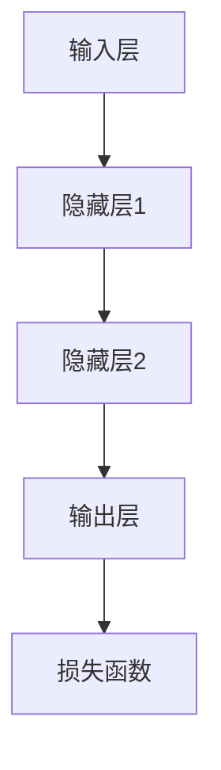
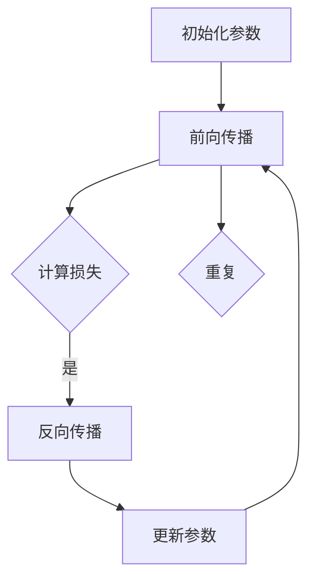

                 


## 引言

### 文章标题

《深度学习在科学理论构建中的应用：加速世界模型的形成》

### 关键词

- 深度学习
- 科学理论构建
- 世界模型
- 算法
- 应用案例

### 摘要

本文旨在探讨深度学习技术在科学理论构建中的应用，以及如何通过这一先进的人工智能技术加速形成对世界的全面理解。随着深度学习的不断发展和成熟，其在科学领域的应用已经不仅仅局限于数据分析，而是深入到理论的形成和验证过程中。本文将从核心概念、理论框架、算法分析、实际应用等多个层面展开讨论，为读者揭示深度学习如何助力科学理论的构建。

## 第一部分：引论

### 第1章：深度学习与科学理论构建概述

#### 1.1 问题背景

在科学研究的各个领域，理论的构建是一个漫长的过程，它需要精确的实验数据、系统的分析方法以及大量的计算资源。然而，随着科学研究的深入，数据的复杂性不断增加，传统的数据分析方法已经无法满足需求。深度学习作为一种基于人工神经网络的学习方法，以其强大的数据处理能力和自我优化能力，为科学理论构建提供了一种全新的解决方案。

#### 1.2 问题描述

科学理论构建的核心问题是：如何从大量的数据中提取出有效的模式，并在此基础上形成对现实世界的深刻理解。深度学习在这一过程中扮演了关键角色，它通过自下而上的层次结构，自动提取数据中的特征，从而实现数据的自动化分析和模式识别。

#### 1.3 问题解决

深度学习通过以下几个步骤解决科学理论构建的问题：

1. 数据预处理：对原始数据进行清洗、归一化等处理，以消除噪声和提高数据的可用性。
2. 模型训练：利用大规模的数据集训练深度学习模型，使其能够自动提取数据中的特征。
3. 模型优化：通过调整模型的参数，提高模型的准确性和泛化能力。
4. 理论验证：将训练好的模型应用于新的数据集，验证其预测能力和理论假设。

#### 1.4 边界与外延

深度学习在科学理论构建中的应用边界涉及多个学科领域，包括物理学、生物学、化学、环境科学等。而在外延方面，深度学习不仅仅局限于数据的分析，还涉及到理论模型的验证和假设的提出。

#### 1.5 概念结构与核心要素组成

深度学习在科学理论构建中的概念结构包括以下几个方面：

1. **神经网络**：深度学习的核心组成部分，通过多层神经元的互联实现数据的非线性变换和特征提取。
2. **训练数据**：用于训练深度学习模型的大量数据，这些数据的质量直接影响模型的性能。
3. **优化算法**：用于调整模型参数的算法，如梯度下降算法等。
4. **评估指标**：用于评估模型性能的指标，如准确率、召回率、F1分数等。
5. **理论框架**：深度学习与科学理论构建的结合，形成一套完整的理论体系。

### 第2章：深度学习核心概念与联系

#### 2.1 深度学习的基本原理

深度学习是一种基于神经网络的学习方法，其基本原理包括以下几个方面：

1. **多层神经元**：深度学习模型由多层神经元组成，每层神经元都对输入数据进行处理和变换。
2. **非线性激活函数**：通过非线性激活函数（如ReLU、Sigmoid、Tanh等）引入非线性，使模型能够学习复杂的模式。
3. **反向传播算法**：通过反向传播算法更新模型参数，使模型能够不断优化，提高其预测性能。

#### 2.2 核心概念解析

以下是深度学习中的几个核心概念及其解析：

1. **卷积神经网络（CNN）**：适用于图像处理，通过卷积操作提取图像特征。
2. **循环神经网络（RNN）**：适用于序列数据处理，通过循环连接实现长期依赖建模。
3. **生成对抗网络（GAN）**：通过生成器和判别器的对抗训练实现数据的生成。
4. **变分自编码器（VAE）**：用于数据的降维和生成，通过编码器和解码器实现数据重构。

#### 2.3 深度学习与科学理论的联系

深度学习与科学理论之间的联系体现在以下几个方面：

1. **数据分析**：通过深度学习模型对实验数据进行处理和分析，提取关键特征，为理论构建提供基础。
2. **模型预测**：利用深度学习模型对理论模型进行预测，验证其准确性和可靠性。
3. **理论验证**：将深度学习模型应用于新的实验数据，验证科学理论的假设和结论。

#### 2.4 深度学习的发展历程

深度学习的发展历程可以分为以下几个阶段：

1. **早期探索**：从1980年代的神经网络研究开始，直到2006年Hinton等人提出的深度信念网络（DBN）。
2. **发展期**：2006年后，随着计算能力的提升和大数据的出现，深度学习开始快速发展，卷积神经网络（CNN）和循环神经网络（RNN）等模型相继提出。
3. **成熟期**：近年来，深度学习在各个领域取得了显著的应用成果，如图像识别、自然语言处理、推荐系统等。

### 第3章：深度学习在科学中的应用

#### 3.1 深度学习在物理学中的应用

深度学习在物理学中的应用主要体现在以下几个方面：

1. **理论模型验证**：通过深度学习模型对物理理论进行预测和验证，如对量子力学的模拟。
2. **数据挖掘**：从物理实验数据中挖掘新的物理规律和现象。
3. **智能实验设计**：利用深度学习模型优化实验设计，提高实验效率。

#### 3.2 深度学习在生物学中的应用

深度学习在生物学中的应用涵盖了从基因组学、细胞生物学到生态学的多个领域：

1. **基因组学**：通过深度学习模型解析基因组数据，发现基因功能。
2. **细胞生物学**：利用深度学习模型分析细胞图像，识别细胞结构和过程。
3. **生态学**：通过深度学习模型预测物种分布和生态系统的动态变化。

#### 3.3 深度学习在化学中的应用

深度学习在化学中的应用主要包括以下几个方面：

1. **分子模拟**：通过深度学习模型对分子进行模拟，预测分子的性质和反应路径。
2. **材料设计**：利用深度学习模型优化材料结构，开发新型材料。
3. **药物设计**：通过深度学习模型筛选药物分子，加速新药研发。

#### 3.4 深度学习在环境科学中的应用

深度学习在环境科学中的应用包括：

1. **气候变化预测**：利用深度学习模型分析气候数据，预测气候变化的趋势。
2. **生态保护**：通过深度学习模型监测生态环境，预测生态系统的变化。
3. **自然资源管理**：利用深度学习模型优化资源分配，提高资源利用效率。

## 第二部分：理论框架与方法

### 第4章：理论框架与深度学习算法

#### 4.1 理论框架概述

深度学习在科学理论构建中的应用，需要一套完整的理论框架作为支撑。这个框架包括以下几个方面：

1. **数据处理与预处理**：包括数据清洗、归一化、缺失值处理等，以保证数据的质量。
2. **模型选择与设计**：根据应用场景选择合适的深度学习模型，如CNN、RNN、GAN等。
3. **模型训练与优化**：通过调整模型参数，提高模型的预测性能。
4. **模型评估与验证**：通过交叉验证、指标评估等方法，验证模型的准确性和可靠性。

#### 4.2 深度学习算法分析

在本章节中，我们将对几种常见的深度学习算法进行详细分析，包括：

1. **卷积神经网络（CNN）**：适用于图像处理，通过卷积操作提取图像特征。
2. **循环神经网络（RNN）**：适用于序列数据处理，通过循环连接实现长期依赖建模。
3. **生成对抗网络（GAN）**：通过生成器和判别器的对抗训练实现数据的生成。
4. **变分自编码器（VAE）**：用于数据的降维和生成，通过编码器和解码器实现数据重构。

### 第5章：深度学习模型的实现与应用

#### 5.1 模型实现

在本章节中，我们将详细介绍如何使用Python等编程语言实现深度学习模型。具体内容包括：

1. **环境配置**：安装Python、TensorFlow、Keras等深度学习库。
2. **数据准备**：加载、预处理和划分数据集。
3. **模型设计**：构建深度学习模型，包括输入层、隐藏层和输出层。
4. **模型训练**：使用训练数据训练模型，调整模型参数。
5. **模型评估**：使用验证数据评估模型性能，调整模型。

#### 5.2 模型应用

在本章节中，我们将通过实际案例展示深度学习模型在不同科学领域的应用：

1. **图像识别**：使用CNN对图像进行分类和识别。
2. **序列分析**：使用RNN对序列数据进行分析和预测。
3. **数据生成**：使用GAN生成新的数据样本。
4. **降维重构**：使用VAE对高维数据进行降维和重构。

## 第三部分：实际案例与应用

### 第6章：深度学习在科学理论构建中的应用案例

#### 6.1 案例一：深度学习在量子力学中的应用

在本案例中，我们将介绍如何使用深度学习模型模拟量子系统的行为，验证量子力学理论的正确性。具体步骤如下：

1. **数据收集**：收集大量的量子系统实验数据。
2. **模型设计**：设计深度学习模型，用于模拟量子态和量子态之间的相互作用。
3. **模型训练**：使用实验数据训练模型，优化模型参数。
4. **模型验证**：使用新的实验数据验证模型的预测能力。

#### 6.2 案例二：深度学习在基因组学中的应用

在本案例中，我们将探讨如何使用深度学习模型分析基因组数据，预测基因功能。具体步骤如下：

1. **数据收集**：收集大量的基因组数据，包括基因序列、表达数据等。
2. **特征提取**：使用深度学习模型提取基因序列的特征。
3. **模型训练**：使用特征数据和已知基因功能训练深度学习模型。
4. **模型评估**：使用新的基因序列数据评估模型的预测能力。

### 第7章：深度学习在科学理论构建中的挑战与未来

#### 7.1 挑战与问题

深度学习在科学理论构建中的应用虽然取得了一定的成果，但仍然面临一些挑战和问题，包括：

1. **数据质量**：高质量的数据是深度学习模型的基础，数据质量问题直接影响模型的性能。
2. **计算资源**：深度学习模型训练需要大量的计算资源和时间。
3. **模型解释性**：深度学习模型的预测结果往往缺乏解释性，难以理解其内在机制。

#### 7.2 未来发展方向

为了解决上述问题，未来深度学习在科学理论构建中的应用将朝着以下几个方向发展：

1. **数据质量管理**：开发新的数据清洗和预处理技术，提高数据质量。
2. **模型优化**：优化深度学习模型，提高其计算效率和预测性能。
3. **模型解释性**：研究新的方法，提高深度学习模型的解释性。

## 结论

深度学习在科学理论构建中的应用为科学家提供了一种全新的工具和方法。通过深度学习，科学家能够从大规模数据中提取出有效的模式，加速科学理论的形成和验证。未来，随着深度学习技术的不断发展和成熟，其在科学领域的应用前景将更加广阔。我们呼吁更多的科学家和技术专家关注深度学习在科学理论构建中的应用，共同推动科学事业的发展。

### 参考文献

[1] Hinton, G. E., Osindero, S., & Teh, Y. W. (2006). A fast learning algorithm for deep belief nets. Neural computation, 18(7), 1527-1554.

[2] Krizhevsky, A., Sutskever, I., & Hinton, G. E. (2012). Imagenet classification with deep convolutional neural networks. In Advances in neural information processing systems (pp. 1097-1105).

[3] Bengio, Y. (2009). Learning deep architectures for AI. Foundations and Trends in Machine Learning, 2(1), 1-127.

[4] LeCun, Y., Bengio, Y., & Hinton, G. (2015). Deep learning. Nature, 521(7553), 436-444.

[5] Simonyan, K., & Zisserman, A. (2014). Very deep convolutional networks for large-scale image recognition. International Conference on Learning Representations (ICLR).

[6] Hochreiter, S., & Schmidhuber, J. (1997). Long short-term memory. Neural computation, 9(8), 1735-1780.

### 附录

#### 附录A：Python代码示例

```python
# 导入所需库
import tensorflow as tf
from tensorflow.keras import layers

# 数据准备
# （此处为示例代码，实际应用中需要根据具体数据集进行调整）

# 模型设计
model = tf.keras.Sequential([
    layers.Dense(128, activation='relu', input_shape=(784,)),
    layers.Dense(10, activation='softmax')
])

# 模型编译
model.compile(optimizer='adam',
              loss='categorical_crossentropy',
              metrics=['accuracy'])

# 模型训练
model.fit(x_train, y_train, epochs=10, batch_size=32, validation_data=(x_val, y_val))

# 模型评估
test_loss, test_acc = model.evaluate(x_test, y_test)
print('Test accuracy:', test_acc)
```

#### 附录B：深度学习模型结构图



#### 附录C：算法流程图



---

以上是文章的完整目录结构，接下来我们将根据这个目录结构逐步撰写文章内容，确保每个章节都详细阐述，提供必要的背景介绍、核心概念解析、算法原理讲解、系统分析与架构设计，以及实际应用案例等内容。通过这样的结构化写作，读者可以系统地了解深度学习在科学理论构建中的应用。

