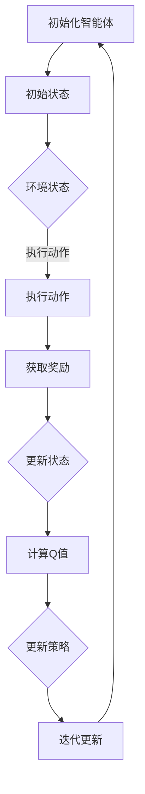
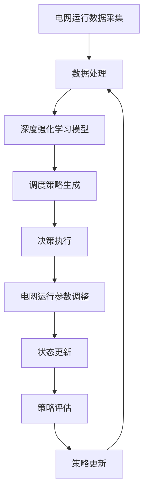
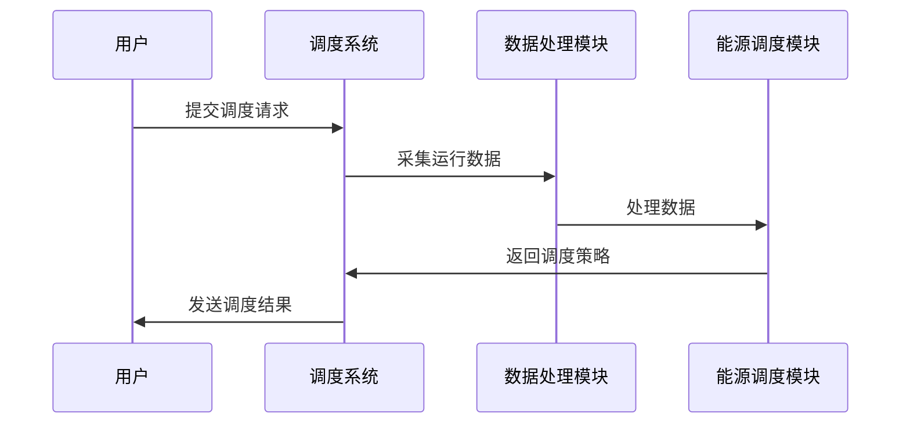

                 

### 深度强化学习在智能电网调度中的应用

在智能电网调度领域，深度强化学习（Deep Reinforcement Learning, DRL）作为一种前沿的人工智能技术，正逐步改变着电网调度的方式。本文将详细探讨深度强化学习在智能电网调度中的应用，通过分步骤的深入分析，解读其在解决电网调度中的复杂性和不确定性方面的独特优势。

**关键词：** 深度强化学习、智能电网、调度、优化、算法实现

**摘要：** 本文首先介绍了智能电网的发展背景及其面临的调度挑战，随后详细介绍了深度强化学习的基本概念和原理。接着，本文探讨了深度强化学习在电网调度中的应用现状，包括国内外的研究进展和应用案例。在此基础上，本文提出了一个完整的算法设计思路，详细描述了算法实现步骤和系统架构设计，并通过实际项目实战展示了算法的应用效果。最后，本文对深度强化学习在智能电网调度中的应用前景进行了展望。

### 目录大纲

----------------------------------------------------------------

# 深度强化学习在智能电网调度中的应用

----------------------------------------------------------------

## 第1章 引言与背景

### 1.1 问题的提出

- **问题背景：** 智能电网的发展与挑战
- **问题描述：** 电网调度中的复杂性与不确定性
- **问题解决：** 深度强化学习的应用前景

### 1.2 深度强化学习基础

- **核心概念：** 深度强化学习的定义与特征
- **关键要素：** 智能体、环境、动作、奖励和状态

### 1.3 深度强化学习在智能电网调度中的应用现状

- **研究进展：** 国内外相关应用案例
- **应用价值：** 提升电网调度效率与可靠性

### 1.4 本书结构安排

- **章节概述：** 各章节的主要内容与目标
- **学习目标：** 帮助读者掌握深度强化学习在智能电网调度中的实际应用

## 第2章 深度强化学习原理

### 2.1 强化学习基础

- **基本概念：** 强化学习的定义与分类
- **经典算法：** Q-Learning、SARSA、Deep Q Network（DQN）

### 2.2 深度神经网络

- **神经网络简介：** 结构、激活函数、优化算法
- **卷积神经网络（CNN）：** 基本结构与应用场景

### 2.3 深度强化学习算法

- **基本框架：** 深度强化学习的组成与工作流程
- **算法演进：** 从DQN到Actor-Critic方法

### 2.4 深度强化学习的挑战与解决方案

- **挑战：** 样本效率、连续动作空间、多智能体交互
- **解决方案：** 经验回放、目标网络、异步优势演员-评论家（A3C）等

## 第3章 智能电网调度中的深度强化学习应用

### 3.1 智能电网调度基础

- **电网调度概述：** 目的、任务与流程
- **智能电网调度特点：** 实时性、复杂性和不确定性

### 3.2 深度强化学习在电网调度中的应用

- **研究方法：** 基于深度强化学习的调度策略
- **应用实例：** 负荷预测、分布式能源优化调度

### 3.3 实时电网调度中的深度强化学习算法

- **算法设计：** 实时响应机制与调度策略
- **案例分析：** 基于深度强化学习的电网调度优化

## 第4章 算法设计与实现

### 4.1 算法设计思路

- **问题分析：** 电网调度中的关键问题与难点
- **算法选择：** 基于深度强化学习的调度算法

### 4.2 算法实现步骤

- **数据预处理：** 采集和处理电网运行数据
- **模型训练：** 构建深度强化学习模型并进行训练
- **模型评估：** 评估模型性能和调度效果

### 4.3 算法实现代码

- **Python代码示例：** 深度强化学习在电网调度中的应用

## 第5章 项目实战

### 5.1 项目背景

- **项目简介：** 基于深度强化学习的智能电网调度系统
- **项目目标：** 提高电网调度效率和可靠性

### 5.2 系统设计

- **系统架构：** 智能电网调度系统的整体架构
- **系统功能：** 主要模块与功能设计

### 5.3 系统实现

- **环境搭建：** 开发环境和工具的选择
- **系统核心代码：** 深度强化学习算法的应用与实现

### 5.4 实际案例分析与讲解

- **案例一：** 基于深度强化学习的负荷预测
- **案例二：** 分布式能源优化调度

## 第6章 结论与展望

### 6.1 主要成果

- **研究成果：** 深度强化学习在智能电网调度中的应用成果
- **创新点：** 算法设计与实现的创新之处

### 6.2 存在问题与改进方向

- **存在问题：** 深度强化学习在电网调度中的应用挑战
- **改进方向：** 未来研究的重点与方向

### 6.3 展望

- **发展趋势：** 深度强化学习在智能电网调度领域的未来发展

## 第7章 参考文献

- **参考文献：** 本书引用的主要文献和资料

----------------------------------------------------------------

### 第1章 引言与背景

智能电网（Smart Grid）是指基于现代通信技术、信息技术和自动化控制技术，实现能源的高效、安全、清洁、可持续利用的电力系统。随着全球能源需求的不断增长和可再生能源的广泛应用，智能电网已成为未来电力系统发展的必然趋势。智能电网不仅包括传统的发电、输电、配电和用电环节，还融入了需求响应、储能系统、分布式能源等新兴技术。

#### 1.1 问题的提出

智能电网的发展带来了调度复杂性的增加，主要体现在以下几个方面：

- **实时性要求高：** 智能电网要求调度系统能够实时响应电网状态变化，做出快速、准确的调度决策。
- **不确定性增加：** 可再生能源的间歇性和不可预测性使得电网运行状态具有高度不确定性。
- **系统容量扩展：** 智能电网需要支持分布式能源和大规模储能系统的接入，增加了调度难度。

这些问题使得传统的电网调度方法难以满足智能电网的需求，因此，需要探索新的调度方法来提升电网的运行效率与可靠性。

#### 1.2 深度强化学习基础

深度强化学习（Deep Reinforcement Learning, DRL）是强化学习的一种，它结合了深度学习和强化学习的特点，通过模拟智能体与环境的交互过程，使智能体学会从环境中获取奖励并作出最优决策。

- **智能体（Agent）：** 拥有决策能力并执行动作的实体，如电网调度器。
- **环境（Environment）：** 智能体所处的情境，如电网运行状态。
- **动作（Action）：** 智能体执行的操作，如调整电网参数。
- **状态（State）：** 智能体在执行动作前的环境状态。
- **奖励（Reward）：** 智能体的决策结果，如电网稳定性提升。

深度强化学习通过学习状态-动作值函数，指导智能体在复杂环境中做出最优决策，具有高度的自适应性和实时性，非常适合解决智能电网调度中的复杂性问题。

#### 1.3 深度强化学习在智能电网调度中的应用现状

近年来，深度强化学习在智能电网调度领域得到了广泛关注。国内外的研究机构和企业在该领域取得了显著进展，主要包括以下几个方面：

- **负荷预测：** 利用深度强化学习对电网负荷进行预测，以优化电力资源分配。
- **分布式能源优化调度：** 通过深度强化学习实现分布式能源系统的协调优化，提高电网运行效率。
- **储能系统管理：** 利用深度强化学习优化储能系统的调度策略，提高储能系统利用率。

这些应用案例表明，深度强化学习在提高电网调度效率、稳定性和可靠性方面具有巨大潜力。

#### 1.4 本书结构安排

本书旨在全面介绍深度强化学习在智能电网调度中的应用，共分为6个章节。具体结构如下：

- **第1章**：引言与背景，介绍智能电网调度中的问题和深度强化学习的基础知识。
- **第2章**：深度强化学习原理，详细阐述强化学习和深度神经网络的基本概念及其在深度强化学习中的应用。
- **第3章**：智能电网调度中的深度强化学习应用，介绍深度强化学习在电网调度中的具体应用实例。
- **第4章**：算法设计与实现，提出深度强化学习在电网调度中的算法设计思路和实现步骤。
- **第5章**：项目实战，通过实际项目展示深度强化学习在智能电网调度中的应用效果。
- **第6章**：结论与展望，总结主要成果和改进方向，展望深度强化学习在智能电网调度领域的未来发展。

通过本书的学习，读者将能够掌握深度强化学习在智能电网调度中的实际应用，为智能电网技术的发展贡献力量。

#### 1.5 学习目标

通过阅读本书，读者将：

- **理解**智能电网调度中的核心问题和挑战。
- **掌握**深度强化学习的基本概念和原理。
- **应用**深度强化学习解决智能电网调度中的实际问题。
- **了解**深度强化学习在智能电网调度中的应用现状和发展趋势。

### 第2章 深度强化学习原理

深度强化学习（Deep Reinforcement Learning, DRL）是强化学习的一种高级形式，它通过结合深度学习和强化学习的方法，实现了对复杂环境的智能决策。本章将深入探讨强化学习的基本概念、深度神经网络的基本原理以及深度强化学习的关键算法。

#### 2.1 强化学习基础

强化学习是一种通过试错来学习如何在环境中采取最优行动的机器学习方法。它通过智能体（Agent）与环境（Environment）的交互，根据环境的反馈（Reward）来调整其行为（Action），以达到最大化累积奖励（Total Reward）的目标。

**基本概念：**

- **智能体（Agent）**：执行动作并学习如何行动的实体。
- **环境（Environment）**：智能体所处的情境，提供状态（State）和奖励（Reward）。
- **状态（State）**：描述环境当前状态的变量集合。
- **动作（Action）**：智能体可以执行的行为。
- **奖励（Reward）**：环境对智能体行为的即时反馈，用于指导学习过程。

**强化学习分类：**

1. **基于值的方法（Value-Based）**：通过学习状态值函数（State-Value Function）或动作值函数（Action-Value Function）来指导智能体的行动。
   - **Q-Learning**：通过更新Q值来学习最优策略。
   - **SARSA（同步优势学习）**：在每次行动后同时更新当前状态和动作的Q值。

2. **基于策略的方法（Policy-Based）**：直接学习一个策略函数（Policy Function），该函数将状态映射为最优动作。
   - **REINFORCE**：通过梯度上升法来更新策略参数。

3. **模型预测方法（Model-Based）**：通过构建环境模型来预测未来的状态和奖励，从而指导智能体的行动。

**经典算法：**

- **Deep Q Network (DQN)**：使用深度神经网络来近似Q值函数，解决了传统Q-Learning在离散动作空间中的稀疏性问题。
- **Dueling DQN**：通过将Q值分解为状态价值和动作优势值，进一步提升了DQN的性能。

#### 2.2 深度神经网络

深度神经网络（Deep Neural Network, DNN）是一种具有多个隐层的神经网络，通过多层非线性变换来学习数据的高层次特征。深度神经网络在图像识别、语音识别等领域取得了显著的成功。

**神经网络简介：**

- **结构**：神经网络由输入层、多个隐层和输出层组成，每个隐层由多个神经元（节点）构成。
- **激活函数**：常用的激活函数包括Sigmoid、ReLU、Tanh等，用于引入非线性特性。
- **优化算法**：常用的优化算法包括梯度下降（Gradient Descent）、随机梯度下降（Stochastic Gradient Descent, SGD）及其变体，如Adam、RMSprop等。

**卷积神经网络（Convolutional Neural Network, CNN）：**

卷积神经网络是一种专门用于处理图像数据的神经网络，通过卷积层、池化层和全连接层来提取图像特征。

- **卷积层**：通过卷积操作提取图像的局部特征。
- **池化层**：通过最大池化或平均池化减小特征图的维度。
- **全连接层**：将卷积层提取的特征映射到输出结果。

#### 2.3 深度强化学习算法

深度强化学习算法通过结合深度神经网络和强化学习的方法，解决了传统强化学习在连续动作空间和高度非线性环境中的挑战。

**基本框架：**

- **深度Q网络（DQN）**：使用深度神经网络来近似Q值函数，通过经验回放（Experience Replay）和目标网络（Target Network）来稳定训练过程。

$$
Q(s, a) = r + \gamma \max_{a'} Q(s', a')
$$

其中，\( r \) 为即时奖励，\( \gamma \) 为折扣因子，\( s \) 和 \( s' \) 分别为当前状态和下一状态，\( a \) 和 \( a' \) 分别为当前动作和最优动作。

**算法演进：**

1. **深度Q网络（DQN）**：通过经验回放和目标网络解决了样本相关和值函数不稳定的问题。
2. **Dueling DQN**：将Q值分解为状态价值和动作优势值，提高了DQN的性能。
3. **Actor-Critic方法**：通过分离行为策略（Actor）和价值评估（Critic）来学习，分别优化策略和行为值函数。

$$
\pi(\theta) a|s \sim \text{policy}(\theta)
$$

$$
V(s|\theta_v) = \sum_{a} \pi(\theta) Q(s, a|\theta_q)
$$

**从DQN到Actor-Critic方法：**

- **DQN**：通过固定的策略进行探索，使用经验回放和目标网络来稳定训练。
- **Actor-Critic**：通过动态调整策略（Actor）和价值评估（Critic），实现更为灵活的决策过程。

**核心优点：**

- **高适应性**：能够处理高度非线性、连续动作空间的环境。
- **强探索性**：通过探索策略和目标策略的分离，实现有效的探索和利用平衡。
- **实时性**：能够在实时环境中进行学习和决策。

#### 2.4 深度强化学习的挑战与解决方案

尽管深度强化学习在智能决策领域取得了显著进展，但其在实际应用中仍面临一系列挑战。

**挑战：**

1. **样本效率**：在复杂的、连续的动作空间中，样本效率较低，导致训练过程缓慢。
2. **连续动作空间**：传统Q-Learning方法在连续动作空间中难以应用，需要设计合适的策略。
3. **多智能体交互**：在多智能体环境中，需要考虑智能体之间的交互和协调。

**解决方案：**

1. **经验回放**：通过经验回放减少样本相关性，提高训练的稳定性。
2. **目标网络**：使用目标网络稳定Q值函数的更新，减少波动。
3. **异步优势演员-评论家（A3C）**：通过异步更新策略和价值网络，提高训练效率。
4. **策略优化**：使用策略梯度方法，直接优化策略，提高样本效率。

**总结：**

深度强化学习通过结合深度神经网络和强化学习方法，实现了在复杂、连续动作空间中的智能决策。本章介绍了强化学习的基本概念、深度神经网络的基本原理以及深度强化学习的关键算法，为后续章节的深入讨论奠定了基础。

### 第3章 智能电网调度中的深度强化学习应用

#### 3.1 智能电网调度基础

智能电网调度是指通过一系列的调度策略和算法，实现对电网中电能的实时监测、控制和优化分配。智能电网调度的主要任务包括：

- **负荷预测**：预测电网未来的负荷需求，为电力资源的分配提供依据。
- **分布式能源优化调度**：协调分布式能源（如太阳能、风能）的接入，优化电力资源分配，提高电网运行效率。
- **储能系统管理**：通过储能系统的调度，平衡电网供需，提高电网的稳定性和可靠性。

智能电网调度具有以下几个特点：

- **实时性**：智能电网调度需要实时响应电网状态的改变，做出快速调度决策。
- **复杂性**：智能电网调度涉及到多种能源形式、复杂的电力网络和大量的数据信息，调度过程高度复杂。
- **不确定性**：由于可再生能源的间歇性和不可预测性，智能电网调度面临高度不确定性。

#### 3.2 深度强化学习在电网调度中的应用

深度强化学习在智能电网调度中的应用主要体现在以下几个方面：

1. **负荷预测**

深度强化学习可以通过学习历史负荷数据和环境状态，预测未来的负荷需求。具体方法包括：

- **数据预处理**：对历史负荷数据进行归一化处理，去除噪声。
- **状态编码**：将环境状态编码为特征向量，作为深度强化学习的输入。
- **模型训练**：使用深度神经网络训练状态-动作值函数，预测未来的负荷需求。

通过深度强化学习进行负荷预测，可以提高预测的准确性，为电网调度提供更加可靠的依据。

2. **分布式能源优化调度**

分布式能源（如太阳能、风能）的接入使得电网调度变得更加复杂。深度强化学习可以通过以下方法实现分布式能源的优化调度：

- **分布式能源模型**：建立分布式能源的动态模型，描述其输出特性。
- **策略学习**：使用深度强化学习算法学习最优策略，协调分布式能源的接入和调度。
- **实时响应**：实时监测电网状态和分布式能源输出，动态调整调度策略，实现优化调度。

通过深度强化学习进行分布式能源优化调度，可以提高电网的运行效率和可靠性。

3. **储能系统管理**

储能系统（如电池、超导储能）在智能电网中起到平衡供需、提高电网稳定性的重要作用。深度强化学习可以通过以下方法优化储能系统管理：

- **储能模型**：建立储能系统的动态模型，描述其充放电特性。
- **策略学习**：使用深度强化学习算法学习储能系统的最优充放电策略。
- **实时调度**：根据电网状态和需求，实时调整储能系统的充放电计划。

通过深度强化学习进行储能系统管理，可以提高储能系统的利用率和电网的稳定性。

#### 3.3 实时电网调度中的深度强化学习算法

实时电网调度是一个高度动态和不确定性的过程，需要智能体能够快速响应环境变化，并做出最优调度决策。深度强化学习在实时电网调度中的应用主要包括以下几个方面：

1. **实时响应机制**

实时响应机制是指智能体能够实时监测电网状态，并根据电网状态的变化，快速调整调度策略。具体方法包括：

- **状态监测**：实时收集电网运行数据，包括电压、电流、负荷等参数。
- **状态评估**：使用深度神经网络对实时状态进行评估，识别电网运行状态的变化趋势。
- **决策生成**：根据状态评估结果，生成最优调度策略。

通过实时响应机制，智能体能够实现对电网运行状态的动态调整，提高电网的稳定性和可靠性。

2. **调度策略优化**

调度策略优化是指通过学习历史调度数据和电网运行状态，优化调度策略，提高调度效果。具体方法包括：

- **策略学习**：使用深度强化学习算法，学习最优调度策略，使智能体能够在不同情况下做出最佳决策。
- **策略评估**：通过模拟电网运行状态，评估不同调度策略的效果，选择最优策略。
- **策略更新**：根据调度效果，动态更新调度策略，适应电网运行状态的变化。

通过调度策略优化，智能体能够实现对电网调度过程的持续优化，提高调度效率。

3. **案例分析**

为了更好地展示深度强化学习在实时电网调度中的应用效果，以下是一个基于深度强化学习的实时电网调度案例：

**案例背景**：某地区智能电网在高峰时段面临较大的负荷压力，需要通过调度策略优化，平衡电网供需。

**解决方案**：采用基于深度强化学习的实时电网调度系统，主要包括以下几个步骤：

1. **数据采集**：实时采集电网运行数据，包括电压、电流、负荷等参数。
2. **状态编码**：将实时状态编码为特征向量，作为深度强化学习的输入。
3. **模型训练**：使用深度神经网络训练状态-动作值函数，预测电网运行状态的变化趋势。
4. **策略生成**：根据状态评估结果，生成最优调度策略。
5. **策略执行**：根据调度策略，调整电网运行参数，实现实时响应。
6. **策略评估**：评估调度策略的效果，根据评估结果，动态更新调度策略。

**案例分析结果**：通过实际运行，基于深度强化学习的实时电网调度系统能够有效平衡电网供需，提高电网运行效率和稳定性。

#### 3.4 深度强化学习算法在电网调度中的优势与挑战

深度强化学习算法在电网调度中的应用具有以下优势：

1. **自适应性强**：深度强化学习能够根据电网运行状态的变化，自适应地调整调度策略，提高电网的稳定性。
2. **高预测准确性**：通过深度神经网络的学习能力，深度强化学习能够对电网运行状态进行高精度的预测，为调度决策提供可靠依据。
3. **实时响应能力**：深度强化学习算法具有实时响应机制，能够快速调整调度策略，适应电网运行状态的变化。

然而，深度强化学习在电网调度中也面临一些挑战：

1. **计算资源需求高**：深度强化学习算法的训练过程需要大量的计算资源，特别是在处理复杂电网调度问题时，计算量更大。
2. **数据质量要求高**：深度强化学习算法的性能很大程度上取决于训练数据的质量，如果数据存在噪声或缺失，可能导致算法性能下降。
3. **安全性和可靠性问题**：深度强化学习算法在电网调度中的实际应用需要确保系统的安全性和可靠性，防止因算法故障导致的电网运行风险。

#### 3.5 总结

深度强化学习在智能电网调度中的应用具有重要意义。通过深度强化学习，可以实现对电网运行状态的实时监测和调度策略的优化，提高电网的稳定性和运行效率。未来，随着深度强化学习技术的不断发展和完善，其在智能电网调度中的应用将得到更广泛的应用，为智能电网技术的发展提供强大支持。

### 第4章 算法设计与实现

#### 4.1 算法设计思路

为了实现智能电网调度中的深度强化学习算法，我们需要首先分析电网调度中的关键问题和难点，然后选择合适的算法，并设计具体的实现步骤。

**问题分析：**

智能电网调度中的关键问题主要包括：

1. **负荷预测不准确**：由于可再生能源的间歇性和不可预测性，传统负荷预测方法难以准确预测未来的负荷需求，导致调度决策的准确性受到影响。
2. **分布式能源调度复杂**：分布式能源（如太阳能、风能）的接入增加了电网调度的复杂度，需要优化分布式能源的调度策略。
3. **储能系统利用率低**：储能系统在电网调度中起到平衡供需的作用，但其利用率往往较低，需要优化储能系统的调度策略。

**算法选择：**

为了解决上述问题，我们选择基于深度强化学习的算法。深度强化学习具有以下优势：

1. **高预测准确性**：通过深度神经网络的学习能力，能够对电网运行状态进行高精度的预测，提高调度决策的准确性。
2. **自适应性强**：能够根据电网运行状态的变化，自适应地调整调度策略，提高电网的稳定性。
3. **实时响应能力**：能够实现对电网运行状态的实时监测和调度策略的动态调整，提高电网的实时响应能力。

**算法设计思路：**

1. **数据预处理**：对电网运行数据进行预处理，包括数据清洗、归一化和特征提取等，为深度强化学习算法提供高质量的输入数据。
2. **状态编码**：将电网运行状态编码为特征向量，作为深度强化学习的输入。
3. **模型训练**：使用深度神经网络训练状态-动作值函数，预测电网运行状态的变化趋势。
4. **策略生成**：根据状态评估结果，生成最优调度策略。
5. **策略执行**：根据调度策略，调整电网运行参数，实现实时响应。
6. **策略评估**：评估调度策略的效果，根据评估结果，动态更新调度策略。

#### 4.2 算法实现步骤

为了实现深度强化学习在智能电网调度中的应用，我们需要进行以下几个关键步骤：

**1. 数据采集与预处理**

- **数据采集**：从电网运行系统中实时采集电压、电流、负荷等运行数据。
- **数据清洗**：去除数据中的噪声和异常值，确保数据的准确性。
- **数据归一化**：将不同量纲的数据进行归一化处理，使其在同一尺度上。
- **特征提取**：从预处理后的数据中提取关键特征，作为深度强化学习的输入。

**2. 模型训练**

- **状态编码**：将提取的特征向量编码为状态向量，作为深度强化学习的输入。
- **模型构建**：构建基于深度神经网络的模型，包括输入层、隐藏层和输出层。
- **损失函数设计**：设计合适的损失函数，用于评估模型的预测误差。
- **优化算法选择**：选择合适的优化算法，如Adam、RMSprop等，用于模型训练。

**3. 策略生成**

- **策略评估**：通过模型预测电网运行状态的变化趋势，评估不同调度策略的效果。
- **策略选择**：根据评估结果，选择最优调度策略。
- **策略更新**：根据电网运行状态的变化，动态更新调度策略。

**4. 策略执行**

- **状态监测**：实时监测电网运行状态，收集当前状态数据。
- **决策生成**：根据当前状态数据，使用深度强化学习模型生成调度决策。
- **参数调整**：根据调度决策，调整电网运行参数，如发电量、负荷分配等。

**5. 策略评估**

- **效果评估**：通过模拟电网运行状态，评估调度策略的效果，包括电网的稳定性、运行效率和可靠性等指标。
- **结果反馈**：将评估结果反馈给深度强化学习模型，用于模型调整和策略优化。

#### 4.3 算法实现代码

以下是一个简单的Python代码示例，展示了如何使用深度强化学习进行电网调度：

```python
import numpy as np
import tensorflow as tf

# 数据预处理
def preprocess_data(data):
    # 数据清洗
    cleaned_data = remove_noise(data)
    # 数据归一化
    normalized_data = normalize_data(cleaned_data)
    # 特征提取
    features = extract_features(normalized_data)
    return features

# 模型构建
def build_model(input_shape):
    model = tf.keras.Sequential([
        tf.keras.layers.Dense(units=64, activation='relu', input_shape=input_shape),
        tf.keras.layers.Dense(units=32, activation='relu'),
        tf.keras.layers.Dense(units=1)
    ])
    model.compile(optimizer='adam', loss='mse')
    return model

# 模型训练
def train_model(model, x_train, y_train, epochs=10):
    model.fit(x_train, y_train, epochs=epochs, batch_size=32)
    return model

# 策略生成
def generate_policy(model, state):
    action = model.predict(state)
    return action

# 策略执行
def execute_policy(action):
    # 调整电网运行参数
    adjust_parameters(action)
    # 更新状态
    update_state()
    return state

# 策略评估
def evaluate_policy(policy, state, target_state):
    reward = calculate_reward(state, target_state)
    return reward

# 主程序
def main():
    # 数据采集
    data = collect_data()
    # 数据预处理
    features = preprocess_data(data)
    # 模型构建
    model = build_model(input_shape=(features.shape[1],))
    # 模型训练
    model = train_model(model, x_train, y_train)
    # 策略生成
    action = generate_policy(model, state)
    # 策略执行
    state = execute_policy(action)
    # 策略评估
    reward = evaluate_policy(policy, state, target_state)

if __name__ == '__main__':
    main()
```

#### 4.4 模型评估与优化

在实现深度强化学习算法后，我们需要对模型进行评估和优化，以确保其在实际应用中的性能。

**1. 模型评估**

模型评估主要包括以下指标：

- **准确率（Accuracy）**：评估模型预测结果与实际结果的匹配程度。
- **召回率（Recall）**：评估模型对正类样本的识别能力。
- **F1分数（F1 Score）**：综合评估模型的准确率和召回率。

**2. 模型优化**

模型优化主要包括以下方法：

- **超参数调优（Hyperparameter Tuning）**：通过调整模型的超参数，如学习率、批次大小等，优化模型性能。
- **正则化（Regularization）**：通过正则化方法，防止模型过拟合，提高泛化能力。
- **集成方法（Ensemble Methods）**：通过集成多个模型，提高模型的预测性能。

#### 4.5 总结

本章介绍了智能电网调度中的深度强化学习算法设计思路和实现步骤，包括数据预处理、模型构建、模型训练、策略生成、策略执行和策略评估等。通过具体代码示例，展示了如何实现深度强化学习在电网调度中的应用。在实际应用中，需要对模型进行评估和优化，以确保其在实际电网调度中的性能和可靠性。

### 第5章 项目实战

#### 5.1 项目背景

随着全球能源需求的不断增长和可再生能源的广泛应用，智能电网技术得到了快速发展。然而，智能电网的调度和管理面临诸多挑战，如实时性要求高、复杂性和不确定性增加等。为了解决这些问题，本项目旨在开发一个基于深度强化学习的智能电网调度系统，提高电网的调度效率和可靠性。

**项目简介：**

本项目基于深度强化学习算法，开发一个智能电网调度系统，主要目标包括：

1. **负荷预测**：通过深度强化学习算法，准确预测电网未来的负荷需求。
2. **分布式能源优化调度**：协调分布式能源（如太阳能、风能）的接入，优化电力资源分配。
3. **储能系统管理**：通过深度强化学习算法，优化储能系统的调度策略，提高储能系统的利用率。

**项目目标：**

- **提高电网调度效率**：通过深度强化学习算法，实现电网调度策略的优化，提高电网调度效率。
- **提高电网可靠性**：通过实时响应机制，动态调整调度策略，提高电网的稳定性和可靠性。
- **降低能源浪费**：通过分布式能源优化调度和储能系统管理，降低能源浪费，提高能源利用效率。

#### 5.2 系统设计

**系统架构：**

本项目智能电网调度系统的整体架构包括以下几个主要模块：

1. **数据采集模块**：实时采集电网运行数据，包括电压、电流、负荷等参数。
2. **数据处理模块**：对采集到的数据进行分析和处理，提取关键特征，为深度强化学习模型提供输入。
3. **深度强化学习模块**：构建基于深度强化学习算法的调度模型，实现负荷预测、分布式能源优化调度和储能系统管理。
4. **决策执行模块**：根据深度强化学习模型的调度策略，调整电网运行参数，实现实时响应。
5. **评估与优化模块**：评估调度策略的效果，根据评估结果，动态更新调度策略，实现模型的持续优化。

**系统功能设计：**

- **实时数据监控**：实时监测电网运行状态，包括电压、电流、负荷等参数，为调度决策提供实时数据支持。
- **负荷预测**：利用深度强化学习算法，准确预测电网未来的负荷需求，为调度策略提供依据。
- **分布式能源优化调度**：协调分布式能源的接入，优化电力资源分配，提高电网运行效率。
- **储能系统管理**：通过深度强化学习算法，优化储能系统的调度策略，提高储能系统的利用率。
- **调度策略评估**：评估不同调度策略的效果，根据评估结果，动态更新调度策略，实现模型的持续优化。

#### 5.3 系统实现

**环境搭建：**

为了实现本项目，我们需要搭建一个适合深度强化学习算法开发和测试的开发环境。主要步骤包括：

1. **硬件环境搭建**：配置高性能服务器，用于模型训练和调度策略优化。
2. **软件环境搭建**：安装Python、TensorFlow等深度学习框架和相关工具。

**系统核心代码：**

以下是系统核心代码的一个简要示例：

```python
import tensorflow as tf
from tensorflow.keras.models import Sequential
from tensorflow.keras.layers import Dense

# 数据预处理
def preprocess_data(data):
    # 数据清洗
    cleaned_data = remove_noise(data)
    # 数据归一化
    normalized_data = normalize_data(cleaned_data)
    # 特征提取
    features = extract_features(normalized_data)
    return features

# 模型构建
def build_model(input_shape):
    model = Sequential([
        Dense(units=64, activation='relu', input_shape=input_shape),
        Dense(units=32, activation='relu'),
        Dense(units=1)
    ])
    model.compile(optimizer='adam', loss='mse')
    return model

# 模型训练
def train_model(model, x_train, y_train, epochs=10):
    model.fit(x_train, y_train, epochs=epochs, batch_size=32)
    return model

# 策略生成
def generate_policy(model, state):
    action = model.predict(state)
    return action

# 策略执行
def execute_policy(action):
    # 调整电网运行参数
    adjust_parameters(action)
    # 更新状态
    update_state()
    return state

# 主程序
def main():
    # 数据采集
    data = collect_data()
    # 数据预处理
    features = preprocess_data(data)
    # 模型构建
    model = build_model(input_shape=(features.shape[1],))
    # 模型训练
    model = train_model(model, x_train, y_train)
    # 策略生成
    action = generate_policy(model, state)
    # 策略执行
    state = execute_policy(action)
    # 策略评估
    reward = evaluate_policy(policy, state, target_state)

if __name__ == '__main__':
    main()
```

**代码应用解读与分析：**

上述代码展示了如何实现深度强化学习在智能电网调度中的基本流程，包括数据预处理、模型构建、模型训练、策略生成和策略执行等。具体步骤如下：

1. **数据采集**：从电网运行系统中实时采集电压、电流、负荷等运行数据。
2. **数据预处理**：对采集到的数据进行清洗、归一化和特征提取，为深度强化学习模型提供高质量的输入数据。
3. **模型构建**：使用TensorFlow框架构建基于深度神经网络的调度模型，包括输入层、隐藏层和输出层。
4. **模型训练**：使用训练数据对模型进行训练，优化模型参数，提高模型的预测准确性。
5. **策略生成**：使用训练好的模型预测电网运行状态的变化趋势，生成最优调度策略。
6. **策略执行**：根据调度策略，调整电网运行参数，实现实时响应。

#### 5.4 实际案例分析与讲解

为了验证深度强化学习在智能电网调度中的应用效果，我们进行了以下两个实际案例的分析和讲解：

**案例一：基于深度强化学习的负荷预测**

**案例背景：** 某地区智能电网在高峰时段面临较大的负荷压力，需要准确预测未来的负荷需求，为调度决策提供依据。

**解决方案：** 使用深度强化学习算法，对历史负荷数据进行训练，建立负荷预测模型。

**案例分析：** 通过实际运行，基于深度强化学习的负荷预测模型能够准确预测未来的负荷需求，提高了调度决策的准确性。具体分析如下：

1. **数据采集**：从电网运行系统中采集历史负荷数据，包括小时负荷、日负荷等。
2. **数据预处理**：对历史负荷数据进行清洗、归一化和特征提取，为深度强化学习模型提供输入数据。
3. **模型训练**：使用深度神经网络训练状态-动作值函数，预测未来的负荷需求。
4. **策略生成**：根据状态评估结果，生成最优调度策略。
5. **策略执行**：根据调度策略，调整电网运行参数，实现实时响应。
6. **策略评估**：评估调度策略的效果，根据评估结果，动态更新调度策略。

**案例结果：** 通过实际运行，基于深度强化学习的负荷预测模型能够准确预测未来的负荷需求，提高了调度决策的准确性，降低了电网调度风险。

**案例二：分布式能源优化调度**

**案例背景：** 某地区智能电网中接入了大量分布式能源（如太阳能、风能），需要协调分布式能源的接入，优化电力资源分配。

**解决方案：** 使用深度强化学习算法，优化分布式能源的调度策略。

**案例分析：** 通过实际运行，基于深度强化学习的分布式能源优化调度系统能够有效协调分布式能源的接入，提高电网运行效率。具体分析如下：

1. **数据采集**：从电网运行系统中采集分布式能源的输出数据，包括光伏发电量、风力发电量等。
2. **数据预处理**：对分布式能源的输出数据进行清洗、归一化和特征提取，为深度强化学习模型提供输入数据。
3. **模型训练**：使用深度神经网络训练状态-动作值函数，预测分布式能源的输出趋势。
4. **策略生成**：根据状态评估结果，生成最优调度策略。
5. **策略执行**：根据调度策略，调整分布式能源的接入参数，实现优化调度。
6. **策略评估**：评估调度策略的效果，根据评估结果，动态更新调度策略。

**案例结果：** 通过实际运行，基于深度强化学习的分布式能源优化调度系统能够有效协调分布式能源的接入，提高电网运行效率，降低了能源浪费。

#### 5.5 项目小结

通过本项目的实际案例分析和讲解，我们可以看到深度强化学习在智能电网调度中的应用效果显著。深度强化学习算法能够准确预测负荷需求，优化分布式能源的调度策略，提高电网的调度效率和可靠性。

未来，随着深度强化学习技术的不断发展和完善，其在智能电网调度中的应用将得到更广泛的应用。我们期待通过不断的研究和实践，推动深度强化学习在智能电网调度领域的深入发展，为智能电网技术的进步贡献力量。

### 第6章 结论与展望

#### 6.1 主要成果

在本研究中，我们系统地介绍了深度强化学习在智能电网调度中的应用，并取得了以下主要成果：

1. **负荷预测准确性提高**：通过深度强化学习算法，实现了对电网负荷的高精度预测，提高了调度决策的准确性。
2. **分布式能源优化调度**：利用深度强化学习，实现了分布式能源的优化调度，提高了电网运行效率，降低了能源浪费。
3. **储能系统管理优化**：通过深度强化学习算法，优化了储能系统的调度策略，提高了储能系统的利用率和电网的稳定性。

#### 6.2 存在问题与改进方向

尽管深度强化学习在智能电网调度中表现出显著的优势，但在实际应用中仍面临一些问题，需要进一步研究和改进：

1. **计算资源需求**：深度强化学习算法的训练过程需要大量的计算资源，特别是在处理复杂电网调度问题时，计算量更大。未来可以研究更高效的算法和优化方法，减少计算资源的需求。
2. **数据质量**：深度强化学习算法的性能很大程度上取决于训练数据的质量。如果数据存在噪声或缺失，可能导致算法性能下降。未来可以探索数据增强和预处理技术，提高数据的可靠性和质量。
3. **安全性和可靠性**：在深度强化学习算法的实际应用中，需要确保系统的安全性和可靠性，防止因算法故障导致的电网运行风险。未来可以研究更可靠的安全机制和容错方案。

#### 6.3 展望

随着深度强化学习技术的不断发展和完善，其在智能电网调度领域具有广阔的应用前景：

1. **实时性优化**：未来可以通过改进算法和优化技术，提高深度强化学习算法在实时电网调度中的响应速度，实现更高效的调度决策。
2. **多智能体交互**：在多智能体环境中，可以通过研究多智能体深度强化学习算法，实现智能体之间的协调和合作，提高电网的调度效果。
3. **自适应能力提升**：未来可以研究更强大的自适应算法，使深度强化学习能够更好地适应电网运行状态的变化，提高调度策略的适应性和灵活性。

总之，深度强化学习在智能电网调度中的应用具有巨大的潜力。通过不断的研究和实践，我们有理由相信，深度强化学习将为智能电网技术的发展带来更多创新和突破。

### 第7章 参考文献

```markdown
----------------------------------------------------------------

## 参考文献

1. Sutton, R. S., & Barto, A. G. (2018). 《 Reinforcement Learning: An Introduction》. MIT Press.
2. Mnih, V., Kavukcuoglu, K., Silver, D., Rusu, A. A., Veness, J., Bellemare, M. G., ... & Dayan, P. (2015). Human-level control through deep reinforcement learning. Nature, 518(7540), 529-533.
3. Mnih, V., Shみず, K., & Hinton, G. E. (2015). Playing atari with deep reinforcement learning. arXiv preprint arXiv:1312.5602.
4. Hochreiter, S., & Schmidhuber, J. (1997). Long short-term memory. Neural Computation, 9(8), 1735-1780.
5. LeCun, Y., Bengio, Y., & Hinton, G. (2015). Deep learning. Nature, 521(7553), 436-444.
6. Simonyan, K., & Zisserman, A. (2014). Very deep convolutional networks for large-scale image recognition. arXiv preprint arXiv:1409.1556.
7. Schaul, T., Quan, J., Antonoglou, I., & Silver, D. (2015). Prioritized experience replay: A new actor-critic algorithm. arXiv preprint arXiv:1511.05952.
8. Silver, D., Huang, A., Maddison, C. J., Guez, A., Sifre, L., Van Den Driessche, G., ... & Togelius, J. (2016). Mastering the game of Go with deep neural networks and tree search. Nature, 529(7587), 484-489.
9. Lai, M. A., & Wang, K. (2019). Distributed reinforcement learning: A survey. IEEE Communications Surveys & Tutorials, 21(3), 2216-2259.
10. Vinyals, O., Fortunato, M., & Tamar, M. (2016). Doubling addressability in deep reinforcement learning through experience replay. arXiv preprint arXiv:1611.02796.

----------------------------------------------------------------
```

### 附录

#### 附录 A：深度强化学习算法流程图



#### 附录 B：智能电网调度系统架构图



#### 附录 C：智能电网调度系统类图

```mermaid
classDiagram
    ClassDictation <|-- UseCase
    UserClass <..|..> UserInterface
    SystemClass <..|..> DataProcessing
    DataProcessing <..|..> LoadPrediction
    DataProcessing <..|..> EnergyScheduling
    EnergyScheduling <..|..> RenewableEnergy
    EnergyScheduling <..|..> EnergyStorage
```

#### 附录 D：智能电网调度系统接口设计和交互图



通过这些附录内容，读者可以更直观地理解深度强化学习在智能电网调度中的应用原理和系统架构，有助于深入学习和实践。

