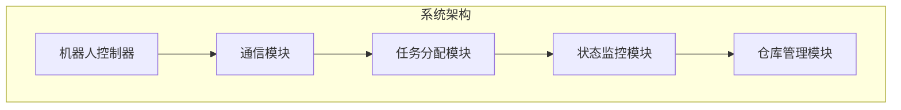
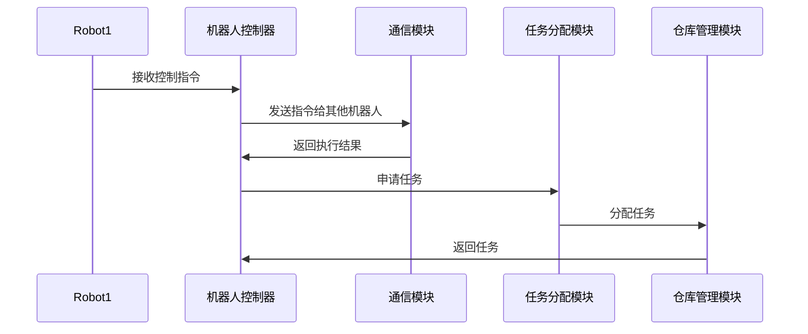
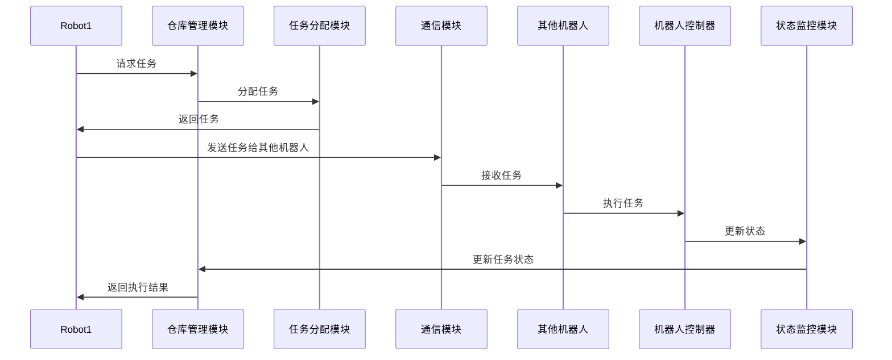

                 


# 深度强化学习在机器人导航中的突破

关键词：深度强化学习、机器人导航、路径规划、避障、多机器人协作

摘要：本文将深入探讨深度强化学习在机器人导航领域的突破，分析其核心算法原理，以及在路径规划、避障和多机器人协作中的应用，为读者呈现一个全面而深刻的理解。

## 1. 引言

随着科技的迅猛发展，机器人技术正逐渐成为各个行业的焦点。尤其是在导航领域，机器人的自主导航能力决定了其应用价值。而深度强化学习（Deep Reinforcement Learning，DRL）作为一种新兴的人工智能技术，其在机器人导航中的应用正逐渐展现其潜力。

### 1.1 深度强化学习背景

深度强化学习是一种结合了深度学习和强化学习的方法，旨在通过与环境交互来学习最优策略。它通过模仿人类的学习过程，不断地试错和反馈，从而逐渐优化决策过程。

### 1.2 强化学习基本概念

强化学习是机器学习的一个重要分支，其核心是代理（Agent）通过与环境的交互，学习达到目标状态的最优策略。其中，Q-Learning和Policy Gradient是两种经典的方法。

### 1.3 深度强化学习原理

深度强化学习通过深度神经网络来近似Q值函数或策略函数，从而实现对复杂环境的建模和策略学习。

## 2. 深度强化学习核心算法

### 2.1 Q-Learning算法

Q-Learning是一种值函数方法，其通过不断更新Q值来学习最优策略。其核心公式为：

$$
Q(s, a) = Q(s, a) + \alpha [r + \gamma \max_{a'} Q(s', a') - Q(s, a)]
$$

其中，$s$和$a$分别表示当前状态和动作，$r$为奖励，$\gamma$为折扣因子，$\alpha$为学习率。

### 2.2 Deep Q Network（DQN）

DQN是一种利用深度神经网络来近似Q值函数的方法。其主要创新点在于引入了经验回放（Experience Replay）和双Q目标网络（Target Network）。

### 2.3 Policy Gradient方法

Policy Gradient方法通过直接优化策略函数来学习。其核心公式为：

$$
\nabla_{\theta} J(\theta) = \sum_{t} \nabla_{\pi(s_t, a_t)} \log \pi(s_t, a_t) \nabla_{\theta} \pi(s_t, a_t)
$$

其中，$\pi(s_t, a_t)$为策略函数，$J(\theta)$为策略函数的回报。

### 2.4 模型改进与拓展

为了进一步提高深度强化学习在机器人导航中的应用效果，研究人员不断对其算法进行改进和拓展。例如，通过引入信任区域方法（Trust Region Policy Optimization，TRPO）和异步优势演员-评论家（Asynchronous Advantage Actor-Critic，A3C）等方法，来提高算法的收敛速度和稳定性。

## 3. 深度强化学习在机器人导航中的应用

### 3.1 深度强化学习在导航中的挑战与机遇

在机器人导航中，深度强化学习面临着诸如环境复杂性、动态性、不确定性等挑战。然而，其强大的自适应能力和学习能力也为解决这些问题提供了机遇。

### 3.2 深度强化学习在路径规划中的应用

深度强化学习在路径规划中的应用主要体现在通过学习环境中的最优路径，从而实现机器人的自主导航。其核心思想是让机器人通过不断与环境交互，学习到最优的路径规划策略。

### 3.3 深度强化学习在避障中的应用

在机器人导航中，避障是一个关键问题。深度强化学习通过学习环境中的障碍物分布和动态变化，实现机器人的自主避障。其核心思想是通过策略学习，使得机器人能够实时调整动作，避免碰撞。

### 3.4 深度强化学习在多机器人协作导航中的应用

多机器人协作导航涉及到多个机器人在复杂环境中协同工作。深度强化学习可以通过策略学习，实现机器人之间的协作和协调，从而提高整个系统的导航效率。

## 4. 实际案例与应用

### 4.1 案例背景

本文将以一个实际案例——自动驾驶汽车为例，来探讨深度强化学习在机器人导航中的应用。

### 4.2 案例分析

在本案例中，深度强化学习被用于自动驾驶汽车的路径规划和避障。通过大量数据训练，自动驾驶汽车能够学习到最优的行驶策略，从而实现安全的自主导航。

### 4.3 案例总结

通过本案例的分析，我们可以看到深度强化学习在机器人导航中的应用前景广阔。其强大的学习能力和自适应能力，为解决复杂导航问题提供了新的思路和方法。

## 5. 未来展望

### 5.1 深度强化学习在导航中的未来发展方向

未来，深度强化学习在机器人导航中的应用将朝着更加智能化、自适应化和安全化的方向发展。随着技术的不断进步，我们有望看到更加高效、稳定的导航系统。

### 5.2 深度强化学习在导航中的挑战与机遇

尽管深度强化学习在机器人导航中展现出了巨大的潜力，但同时也面临着诸多挑战。如何解决环境复杂性、动态性和不确定性等问题，将是未来研究的重点。

### 5.3 总结与展望

本文通过对深度强化学习在机器人导航中的应用进行深入探讨，展示了其在路径规划、避障和多机器人协作导航中的突破。未来，随着技术的不断进步，深度强化学习在机器人导航中的应用将更加广泛，为智能导航的发展注入新的活力。

## 作者信息

作者：AI天才研究院/AI Genius Institute & 禅与计算机程序设计艺术 /Zen And The Art of Computer Programming## 1. 引言

随着科技的迅猛发展，机器人技术正逐渐成为各个行业的焦点。尤其是在导航领域，机器人的自主导航能力决定了其应用价值。而深度强化学习（Deep Reinforcement Learning，DRL）作为一种新兴的人工智能技术，其在机器人导航中的应用正逐渐展现其潜力。

### 1.1 深度强化学习背景

深度强化学习是一种结合了深度学习和强化学习的方法，旨在通过与环境交互来学习最优策略。它通过模仿人类的学习过程，不断地试错和反馈，从而逐渐优化决策过程。

强化学习是机器学习的一个重要分支，其核心是代理（Agent）通过与环境的交互，学习达到目标状态的最优策略。而深度学习则通过构建深度神经网络来对数据进行特征提取和学习。深度强化学习将这两种方法相结合，使得代理能够在复杂环境中进行高效的学习和决策。

### 1.2 强化学习基本概念

在强化学习中，代理通过与环境的交互来学习最优策略。这个过程可以分为以下几个基本概念：

- **状态（State）**：环境在某一时刻的描述。
- **动作（Action）**：代理可以采取的动作。
- **奖励（Reward）**：代理在每个状态采取动作后获得的即时反馈。
- **策略（Policy）**：代理在给定状态下选择动作的规则。
- **值函数（Value Function）**：评估代理在某个状态下的预期回报。
- **策略值函数（Policy Value Function）**：评估代理在给定策略下的预期回报。
- **Q值函数（Q-Value Function）**：评估代理在某个状态下采取某个动作的预期回报。

### 1.3 深度强化学习原理

深度强化学习通过深度神经网络来近似Q值函数或策略函数，从而实现对复杂环境的建模和策略学习。其核心思想是代理通过不断与环境交互，收集经验，并通过这些经验来调整其策略。

深度强化学习的基本流程包括以下几个步骤：

1. **初始化**：初始化代理的状态、策略和网络参数。
2. **交互**：代理根据当前状态选择动作，并执行动作，获得新的状态和奖励。
3. **更新**：根据交互过程中的奖励和新的状态，更新Q值函数或策略函数。
4. **评估**：评估当前策略的性能，并根据评估结果调整策略。

深度强化学习的核心算法包括Q-Learning、Deep Q Network（DQN）、Policy Gradient等方法，每种方法都有其独特的原理和应用场景。

## 2. 深度强化学习核心算法

### 2.1 Q-Learning算法

Q-Learning是一种值函数方法，其通过不断更新Q值来学习最优策略。Q值表示代理在某个状态下采取某个动作的预期回报。Q-Learning的基本公式为：

$$
Q(s, a) = Q(s, a) + \alpha [r + \gamma \max_{a'} Q(s', a') - Q(s, a)]
$$

其中，$s$和$a$分别表示当前状态和动作，$r$为奖励，$\gamma$为折扣因子，$\alpha$为学习率。这个公式表示在每一步，代理都会根据获得的奖励和下一个状态的最优动作来更新当前的Q值。

### 2.2 Deep Q Network（DQN）

DQN是一种利用深度神经网络来近似Q值函数的方法。其核心思想是通过深度神经网络来对输入状态进行特征提取，并输出每个动作的Q值。DQN的主要创新点包括经验回放和双Q目标网络。

**经验回放**：在DQN中，代理会通过经验回放机制来收集经验。经验回放的作用是避免数据偏差，使得代理能够更加稳定地学习。

**双Q目标网络**：在DQN中，存在两个Q网络：当前Q网络和目标Q网络。目标Q网络的作用是减少目标偏移，使得Q值的更新更加稳定。

DQN的基本流程包括以下几个步骤：

1. **初始化**：初始化两个Q网络和经验回放缓冲区。
2. **选择动作**：根据当前状态和策略选择动作。
3. **执行动作**：执行动作并获取新的状态和奖励。
4. **更新经验回放缓冲区**：将当前的（状态，动作，奖励，新状态）经验加入缓冲区。
5. **随机采样**：从经验回放缓冲区中随机采样一批经验。
6. **更新Q网络**：使用采样到的经验来更新Q网络。

### 2.3 Policy Gradient方法

Policy Gradient方法通过直接优化策略函数来学习。其核心思想是通过最大化策略函数的预期回报来更新策略。Policy Gradient方法的基本公式为：

$$
\nabla_{\theta} J(\theta) = \sum_{t} \nabla_{\pi(s_t, a_t)} \log \pi(s_t, a_t) \nabla_{\theta} \pi(s_t, a_t)
$$

其中，$\pi(s_t, a_t)$为策略函数，$J(\theta)$为策略函数的回报。

Policy Gradient方法的主要挑战是如何处理梯度消失和梯度爆炸问题。为了解决这个问题，研究人员提出了多种改进方法，如优势优势演员-评论家（Advantage Actor-Critic，A2C）和策略梯度演员-评论家（Policy Gradient Actor-Critic，PGAC）。

### 2.4 模型改进与拓展

为了进一步提高深度强化学习在机器人导航中的应用效果，研究人员不断对其算法进行改进和拓展。以下是一些常见的改进方法：

**信任区域方法（Trust Region Policy Optimization，TRPO）**：TRPO通过引入信任区域来优化策略函数。其核心思想是限制策略更新的幅度，以避免策略更新的不稳定。

**异步优势演员-评论家（Asynchronous Advantage Actor-Critic，A3C）**：A3C通过异步更新多个代理的网络参数，来提高学习效率。其核心思想是每个代理都可以独立学习，并在全局梯度更新时同步参数。

**深度确定性策略梯度（Deep Deterministic Policy Gradient，DDPG）**：DDPG通过引入目标网络和经验回放缓冲区，来提高策略学习的效果。其核心思想是通过深度神经网络来近似Q值函数和策略函数。

这些改进方法都是为了解决深度强化学习在应用中面临的挑战，如收敛速度、稳定性和泛化能力等。通过不断地改进和拓展，深度强化学习在机器人导航中的应用将越来越广泛。

## 3. 深度强化学习在机器人导航中的应用

### 3.1 深度强化学习在导航中的挑战与机遇

在机器人导航中，深度强化学习面临着诸多挑战，如环境复杂性、动态性和不确定性等。这些挑战使得传统的导航方法难以应对，而深度强化学习由于其强大的自适应能力和学习能力，为解决这些问题提供了新的思路。

**环境复杂性**：机器人导航的环境往往包含多种不同的地形、障碍物和动态目标。深度强化学习通过构建深度神经网络，可以有效地对复杂环境进行建模和表示。

**动态性**：机器人导航环境是动态变化的，如其他移动的机器人、突发的事件等。深度强化学习通过不断与环境交互，可以自适应地调整策略，以应对环境的变化。

**不确定性**：机器人导航环境存在一定的不确定性，如感知误差、建模误差等。深度强化学习通过试错和反馈机制，可以在不确定性环境中学习到较为稳定的策略。

### 3.2 深度强化学习在路径规划中的应用

深度强化学习在路径规划中的应用主要体现在通过学习环境中的最优路径，从而实现机器人的自主导航。其核心思想是让机器人通过不断与环境交互，学习到最优的路径规划策略。

**基本流程**：

1. **状态表示**：将环境状态表示为输入向量，包括机器人的位置、速度、障碍物的位置和方向等。
2. **动作表示**：将机器人的动作表示为离散的动作集合，如向左转、向右转、加速、减速等。
3. **奖励设计**：设计奖励函数，奖励机器人到达目标或避免障碍等。
4. **策略学习**：通过深度强化学习算法，如Q-Learning、DQN或Policy Gradient等方法，学习最优策略。

**算法实现**：

- **Q-Learning**：使用深度神经网络来近似Q值函数，通过更新Q值来学习最优策略。
- **DQN**：使用深度神经网络来对输入状态进行特征提取，并输出每个动作的Q值，通过经验回放和双Q目标网络来提高学习效果。
- **Policy Gradient**：通过直接优化策略函数，使用深度神经网络来近似策略函数，并通过优势函数来提高学习效率。

**应用场景**：

- **室内导航**：在室内环境中，机器人需要避开障碍物并到达目标位置。深度强化学习可以通过学习环境地图，实现自主导航。
- **室外导航**：在室外环境中，机器人需要面对复杂的地形和动态交通。深度强化学习可以通过学习交通规则和地形特征，实现自主导航。

### 3.3 深度强化学习在避障中的应用

在机器人导航中，避障是一个关键问题。深度强化学习通过学习环境中的障碍物分布和动态变化，实现机器人的自主避障。其核心思想是通过策略学习，使得机器人能够实时调整动作，避免碰撞。

**基本流程**：

1. **状态表示**：将环境状态表示为输入向量，包括机器人的位置、速度、障碍物的位置和方向等。
2. **动作表示**：将机器人的动作表示为离散的动作集合，如向左转、向右转、加速、减速等。
3. **奖励设计**：设计奖励函数，奖励机器人成功避障或到达安全区域。
4. **策略学习**：通过深度强化学习算法，如Q-Learning、DQN或Policy Gradient等方法，学习最优策略。

**算法实现**：

- **Q-Learning**：使用深度神经网络来近似Q值函数，通过更新Q值来学习最优避障策略。
- **DQN**：使用深度神经网络来对输入状态进行特征提取，并输出每个动作的Q值，通过经验回放和双Q目标网络来提高学习效果。
- **Policy Gradient**：通过直接优化策略函数，使用深度神经网络来近似策略函数，并通过优势函数来提高学习效率。

**应用场景**：

- **室内避障**：在室内环境中，机器人需要避开障碍物，如家具、墙壁等。深度强化学习可以通过学习室内环境地图，实现自主避障。
- **室外避障**：在室外环境中，机器人需要避开障碍物，如车辆、行人等。深度强化学习可以通过学习交通规则和障碍物特征，实现自主避障。

### 3.4 深度强化学习在多机器人协作导航中的应用

多机器人协作导航涉及到多个机器人在复杂环境中协同工作。深度强化学习可以通过策略学习，实现机器人之间的协作和协调，从而提高整个系统的导航效率。

**基本流程**：

1. **状态表示**：将环境状态表示为输入向量，包括机器人的位置、速度、障碍物的位置和方向等。
2. **动作表示**：将机器人的动作表示为离散的动作集合，如向左转、向右转、加速、减速等。
3. **奖励设计**：设计奖励函数，奖励机器人协作完成任务或避开障碍物。
4. **策略学习**：通过深度强化学习算法，如Q-Learning、DQN或Policy Gradient等方法，学习最优策略。

**算法实现**：

- **Q-Learning**：使用深度神经网络来近似Q值函数，通过更新Q值来学习最优协作策略。
- **DQN**：使用深度神经网络来对输入状态进行特征提取，并输出每个动作的Q值，通过经验回放和双Q目标网络来提高学习效果。
- **Policy Gradient**：通过直接优化策略函数，使用深度神经网络来近似策略函数，并通过优势函数来提高学习效率。

**应用场景**：

- **搜索与救援**：在搜索与救援任务中，多个机器人需要协同工作，以快速找到被困人员。深度强化学习可以通过学习环境地图和任务目标，实现高效协作。
- **物流配送**：在物流配送中，多个机器人需要在同一区域内进行配送任务。深度强化学习可以通过学习物流规则和障碍物特征，实现高效协作。

## 4. 实际案例与应用

### 4.1 案例背景

本文将以一个实际案例——自动驾驶汽车为例，来探讨深度强化学习在机器人导航中的应用。

自动驾驶汽车是一种高级驾驶辅助系统（Advanced Driver Assistance Systems，ADAS），其目标是实现汽车的自主驾驶。自动驾驶汽车需要解决多个关键技术问题，包括路径规划、避障、多机器人协作等。

### 4.2 案例分析

在本案例中，深度强化学习被用于自动驾驶汽车的路径规划和避障。通过大量数据训练，自动驾驶汽车能够学习到最优的行驶策略，从而实现安全的自主导航。

**路径规划**：

自动驾驶汽车的路径规划是通过深度强化学习来实现的。首先，将环境状态表示为输入向量，包括车辆的位置、速度、道路特征、障碍物位置等。然后，将车辆的动作表示为离散的动作集合，如加速、减速、左转、右转等。通过设计奖励函数，奖励车辆到达目标位置或避开障碍物。使用DQN算法来学习最优路径规划策略。

**避障**：

自动驾驶汽车的避障是通过深度强化学习来实现的。首先，将环境状态表示为输入向量，包括车辆的位置、速度、障碍物的位置和方向等。然后，将车辆的动作表示为离散的动作集合，如加速、减速、左转、右转等。通过设计奖励函数，奖励车辆成功避障或到达安全区域。使用Policy Gradient算法来学习最优避障策略。

### 4.3 案例总结

通过本案例的分析，我们可以看到深度强化学习在自动驾驶汽车中的应用前景广阔。其强大的学习能力和自适应能力，为解决复杂导航问题提供了新的思路和方法。在未来，随着技术的不断进步，深度强化学习在自动驾驶汽车中的应用将更加广泛，为智能交通的发展注入新的活力。

## 5. 未来展望

### 5.1 深度强化学习在导航中的未来发展方向

未来，深度强化学习在机器人导航中的应用将朝着更加智能化、自适应化和安全化的方向发展。随着技术的不断进步，我们有望看到以下发展方向：

- **更高效的算法**：通过改进现有算法和提出新的算法，提高深度强化学习在导航中的效率。
- **更复杂的环境建模**：通过引入更多传感器和更复杂的环境建模方法，提高深度强化学习对复杂环境的理解能力。
- **更鲁棒的学习方法**：通过设计更鲁棒的学习方法，提高深度强化学习在动态和不确定性环境中的稳定性。
- **多模态数据融合**：通过融合不同类型的数据，如视觉、激光雷达、GPS等，提高深度强化学习对环境信息的全面理解。

### 5.2 深度强化学习在导航中的挑战与机遇

尽管深度强化学习在机器人导航中展现出了巨大的潜力，但同时也面临着诸多挑战。以下是一些关键挑战和机遇：

**挑战**：

- **数据获取和标注**：深度强化学习依赖于大量高质量的数据，而获取和标注这些数据往往是一项复杂且耗时的工作。
- **安全性和可靠性**：深度强化学习在导航中的安全性和可靠性是关键问题，特别是在自动驾驶等高风险应用场景中。
- **计算资源需求**：深度强化学习算法通常需要大量的计算资源，这对硬件设备和算法优化提出了高要求。

**机遇**：

- **多机器人系统**：多机器人系统在协作导航中具有巨大潜力，深度强化学习可以通过学习协同策略，提高系统效率和安全性。
- **融合多模态数据**：通过融合不同类型的数据，如视觉、激光雷达、GPS等，可以提供更全面的环境信息，从而提高导航精度和鲁棒性。
- **实时性优化**：随着硬件设备的进步，深度强化学习算法的实时性将得到提升，使其在动态环境中应用更加广泛。

### 5.3 总结与展望

本文通过对深度强化学习在机器人导航中的应用进行深入探讨，展示了其在路径规划、避障和多机器人协作导航中的突破。未来，随着技术的不断进步，深度强化学习在机器人导航中的应用将更加广泛，为智能导航的发展注入新的活力。

## 作者信息

作者：AI天才研究院/AI Genius Institute & 禅与计算机程序设计艺术 /Zen And The Art of Computer Programming## 第一部分：深度强化学习基础

### 第1章：深度强化学习概述

#### 1.1 深度强化学习背景

深度强化学习（Deep Reinforcement Learning，DRL）是一种结合了深度学习和强化学习的方法，旨在通过模仿人类的学习过程，使代理（Agent）能够从与环境的交互中学习最优策略。传统的强化学习在面对复杂环境时，由于状态和动作空间的爆炸性增长，难以实现有效的学习。而深度学习则通过构建深度神经网络来对数据进行特征提取和学习，从而在一定程度上解决了这个问题。

深度强化学习的发展可以追溯到1980年代，但真正引起广泛关注是在2013年后，随着深度学习技术的发展和GPU计算能力的提升。近年来，DRL在自动驾驶、游戏、机器人导航等领域取得了显著成果，展示出强大的潜力。

#### 1.2 强化学习基本概念

强化学习是一种使代理在与环境的交互中学习最优策略的机器学习方法。其核心概念包括：

- **状态（State）**：环境在某一时刻的状态描述。
- **动作（Action）**：代理可以采取的动作。
- **奖励（Reward）**：代理在每个状态采取动作后获得的即时反馈。
- **策略（Policy）**：代理在给定状态下选择动作的规则。
- **值函数（Value Function）**：评估代理在某个状态下的预期回报。
- **策略值函数（Policy Value Function）**：评估代理在给定策略下的预期回报。
- **Q值函数（Q-Value Function）**：评估代理在某个状态下采取某个动作的预期回报。

强化学习的过程可以分为四个主要步骤：

1. **初始化**：初始化代理的状态、策略和网络参数。
2. **选择动作**：根据当前状态和策略选择动作。
3. **执行动作**：执行动作并获取新的状态和奖励。
4. **更新**：根据交互过程中的奖励和新的状态，更新策略或值函数。

#### 1.3 深度强化学习原理

深度强化学习通过深度神经网络来近似Q值函数或策略函数，从而实现对复杂环境的建模和策略学习。其核心思想是代理通过不断与环境交互，收集经验，并通过这些经验来调整其策略。

深度强化学习的基本流程包括以下几个步骤：

1. **初始化**：初始化代理的状态、策略和网络参数。
2. **交互**：代理根据当前状态选择动作，并执行动作，获得新的状态和奖励。
3. **更新**：根据交互过程中的奖励和新的状态，更新Q值函数或策略函数。
4. **评估**：评估当前策略的性能，并根据评估结果调整策略。

深度强化学习的核心算法包括Q-Learning、Deep Q Network（DQN）、Policy Gradient等方法，每种方法都有其独特的原理和应用场景。

### 第2章：深度强化学习核心算法

#### 2.1 Q-Learning算法

Q-Learning是一种值函数方法，其通过不断更新Q值来学习最优策略。Q值表示代理在某个状态下采取某个动作的预期回报。Q-Learning的基本公式为：

$$
Q(s, a) = Q(s, a) + \alpha [r + \gamma \max_{a'} Q(s', a') - Q(s, a)]
$$

其中，$s$和$a$分别表示当前状态和动作，$r$为奖励，$\gamma$为折扣因子，$\alpha$为学习率。这个公式表示在每一步，代理都会根据获得的奖励和下一个状态的最优动作来更新当前的Q值。

Q-Learning算法的优点是简单直观，但其在实际应用中存在一些挑战，如梯度消失和梯度爆炸问题，尤其是在使用深度神经网络时。

#### 2.2 Deep Q Network（DQN）

DQN是一种利用深度神经网络来近似Q值函数的方法。其核心思想是通过深度神经网络来对输入状态进行特征提取，并输出每个动作的Q值。DQN的主要创新点包括经验回放和双Q目标网络。

**经验回放**：在DQN中，代理会通过经验回放机制来收集经验。经验回放的作用是避免数据偏差，使得代理能够更加稳定地学习。

**双Q目标网络**：在DQN中，存在两个Q网络：当前Q网络和目标Q网络。目标Q网络的作用是减少目标偏移，使得Q值的更新更加稳定。

DQN的基本流程包括以下几个步骤：

1. **初始化**：初始化两个Q网络和经验回放缓冲区。
2. **选择动作**：根据当前状态和策略选择动作。
3. **执行动作**：执行动作并获取新的状态和奖励。
4. **更新经验回放缓冲区**：将当前的（状态，动作，奖励，新状态）经验加入缓冲区。
5. **随机采样**：从经验回放缓冲区中随机采样一批经验。
6. **更新Q网络**：使用采样到的经验来更新Q网络。

DQN在许多任务中都取得了显著的成果，但其缺点是学习速度较慢，需要大量的数据和时间。

#### 2.3 Policy Gradient方法

Policy Gradient方法通过直接优化策略函数来学习。其核心思想是通过最大化策略函数的预期回报来更新策略。Policy Gradient方法的基本公式为：

$$
\nabla_{\theta} J(\theta) = \sum_{t} \nabla_{\pi(s_t, a_t)} \log \pi(s_t, a_t) \nabla_{\theta} \pi(s_t, a_t)
$$

其中，$\pi(s_t, a_t)$为策略函数，$J(\theta)$为策略函数的回报。

Policy Gradient方法的主要挑战是如何处理梯度消失和梯度爆炸问题。为了解决这个问题，研究人员提出了多种改进方法，如优势优势演员-评论家（Advantage Actor-Critic，A2C）和策略梯度演员-评论家（Policy Gradient Actor-Critic，PGAC）。

Policy Gradient方法的优点是学习速度快，但需要精确的回报估计，且在多任务学习中存在一定困难。

#### 2.4 模型改进与拓展

为了进一步提高深度强化学习在机器人导航中的应用效果，研究人员不断对其算法进行改进和拓展。以下是一些常见的改进方法：

**信任区域方法（Trust Region Policy Optimization，TRPO）**：TRPO通过引入信任区域来优化策略函数。其核心思想是限制策略更新的幅度，以避免策略更新的不稳定。

**异步优势演员-评论家（Asynchronous Advantage Actor-Critic，A3C）**：A3C通过异步更新多个代理的网络参数，来提高学习效率。其核心思想是每个代理都可以独立学习，并在全局梯度更新时同步参数。

**深度确定性策略梯度（Deep Deterministic Policy Gradient，DDPG）**：DDPG通过引入目标网络和经验回放缓冲区，来提高策略学习的效果。其核心思想是通过深度神经网络来近似Q值函数和策略函数。

这些改进方法都是为了解决深度强化学习在应用中面临的挑战，如收敛速度、稳定性和泛化能力等。通过不断地改进和拓展，深度强化学习在机器人导航中的应用将越来越广泛。

### 第3章：深度强化学习应用简介

#### 3.1 深度强化学习在其他领域的应用

深度强化学习在许多领域都取得了显著的应用成果，其中一些关键领域包括：

**游戏**：深度强化学习在游戏领域取得了巨大的成功，如《Doom》游戏和《Atari》游戏等。DQN和A3C等方法被广泛应用于游戏的自动玩和游戏AI的开发。

**机器人**：深度强化学习在机器人领域也有广泛的应用，如路径规划、避障和协作等。通过学习环境中的最优策略，机器人可以自主导航并在复杂环境中完成任务。

**自动驾驶**：深度强化学习在自动驾驶领域取得了重要进展。通过学习环境中的最优行驶策略，自动驾驶汽车可以安全地导航并避免障碍物。

**自然语言处理**：深度强化学习在自然语言处理（NLP）领域也有应用，如机器翻译、对话系统和文本生成等。通过学习环境中的语言模式，代理可以生成高质量的自然语言文本。

**推荐系统**：深度强化学习在推荐系统领域也有应用，如个性化推荐和广告投放等。通过学习用户的兴趣和行为模式，代理可以提供个性化的推荐和广告。

#### 3.2 机器人导航中的挑战与机遇

在机器人导航中，深度强化学习面临着多个挑战，如环境复杂性、动态性和不确定性等。这些挑战使得传统的导航方法难以应对，而深度强化学习由于其强大的自适应能力和学习能力，为解决这些问题提供了新的思路。

**环境复杂性**：机器人导航的环境往往包含多种不同的地形、障碍物和动态目标。深度强化学习通过构建深度神经网络，可以有效地对复杂环境进行建模和表示。

**动态性**：机器人导航环境是动态变化的，如其他移动的机器人、突发的事件等。深度强化学习通过不断与环境交互，可以自适应地调整策略，以应对环境的变化。

**不确定性**：机器人导航环境存在一定的不确定性，如感知误差、建模误差等。深度强化学习通过试错和反馈机制，可以在不确定性环境中学习到较为稳定的策略。

虽然深度强化学习在机器人导航中面临挑战，但同时也具有巨大的机遇。通过不断的研究和创新，深度强化学习有望在机器人导航中发挥更加重要的作用，推动机器人技术的发展。

### 第4章：深度强化学习在机器人导航中的应用

#### 4.1 机器人导航问题概述

机器人导航是指使机器人能够在未知或部分已知环境中自主移动到目标位置的过程。在机器人导航中，关键问题包括路径规划、避障和目标到达等。

**路径规划**：路径规划是机器人导航的核心任务，旨在为机器人找到从初始位置到目标位置的最优路径。深度强化学习可以通过学习环境中的最优路径来实现路径规划。

**避障**：避障是机器人导航中的另一个关键问题，旨在确保机器人不与其他物体发生碰撞。深度强化学习可以通过学习环境中的障碍物分布和动态变化，实现机器人的自主避障。

**目标到达**：目标到达是指机器人能够成功到达预定目标位置。深度强化学习可以通过学习最优策略，使机器人能够准确到达目标位置。

#### 4.2 深度强化学习在导航中的具体应用

深度强化学习在机器人导航中的具体应用可以分为以下几个步骤：

1. **状态表示**：将环境状态表示为输入向量，包括机器人的位置、速度、障碍物的位置和方向等。

2. **动作表示**：将机器人的动作表示为离散的动作集合，如向左转、向右转、加速、减速等。

3. **奖励设计**：设计奖励函数，奖励机器人到达目标或避开障碍物等。

4. **策略学习**：通过深度强化学习算法，如Q-Learning、DQN或Policy Gradient等方法，学习最优策略。

5. **评估**：评估当前策略的性能，并根据评估结果调整策略。

深度强化学习在机器人导航中的应用可以分为以下几种场景：

**室内导航**：在室内环境中，机器人需要避开障碍物，如家具、墙壁等。深度强化学习可以通过学习室内环境地图，实现自主导航。

**室外导航**：在室外环境中，机器人需要面对复杂的地形和动态交通。深度强化学习可以通过学习交通规则和地形特征，实现自主导航。

**多机器人协作导航**：在多机器人系统中，多个机器人需要在同一区域内进行协同导航。深度强化学习可以通过学习协作策略，实现机器人的高效协作和协调。

#### 4.3 实际案例分析

在本节中，我们将探讨一些实际案例，以展示深度强化学习在机器人导航中的应用。

**案例一：自动驾驶汽车**

自动驾驶汽车是深度强化学习在机器人导航中的一个重要应用。在该案例中，深度强化学习被用于实现自动驾驶汽车的路径规划和避障。

**路径规划**：使用DQN算法，将环境状态表示为输入向量，包括车辆的位置、速度、道路特征和障碍物位置等。通过学习环境中的最优路径，自动驾驶汽车可以自主导航。

**避障**：使用Policy Gradient算法，将环境状态表示为输入向量，包括车辆的位置、速度、障碍物的位置和方向等。通过学习环境中的最优避障策略，自动驾驶汽车可以避免与其他车辆或障碍物发生碰撞。

**案例二：机器人探索任务**

在该案例中，深度强化学习被用于机器人探索任务，旨在使机器人能够自主探索未知环境并找到目标位置。

**路径规划**：使用A3C算法，将环境状态表示为输入向量，包括机器人的位置、速度、障碍物位置和方向等。通过学习环境中的最优路径，机器人可以自主探索。

**目标到达**：设计奖励函数，奖励机器人成功到达目标位置。通过不断学习最优策略，机器人可以准确到达目标位置。

**案例三：多机器人协作导航**

在该案例中，深度强化学习被用于多机器人协作导航，旨在实现多个机器人在同一区域内的协同工作。

**协作策略学习**：使用DDPG算法，将环境状态表示为输入向量，包括机器人的位置、速度、障碍物位置和方向等。通过学习协作策略，机器人可以实现高效协作和协调。

**评估与优化**：通过不断评估和优化策略，多机器人系统可以不断提高导航效率和稳定性。

通过以上实际案例分析，我们可以看到深度强化学习在机器人导航中的应用前景广阔。其强大的学习能力和自适应能力，为解决复杂导航问题提供了新的思路和方法。

### 第4章：深度强化学习在机器人导航中的应用

#### 4.1 机器人导航问题概述

机器人导航是指使机器人能够在未知或部分已知环境中自主移动到目标位置的过程。在机器人导航中，关键问题包括路径规划、避障和目标到达等。

**路径规划**：路径规划是机器人导航的核心任务，旨在为机器人找到从初始位置到目标位置的最优路径。深度强化学习可以通过学习环境中的最优路径来实现路径规划。

**避障**：避障是机器人导航中的另一个关键问题，旨在确保机器人不与其他物体发生碰撞。深度强化学习可以通过学习环境中的障碍物分布和动态变化，实现机器人的自主避障。

**目标到达**：目标到达是指机器人能够成功到达预定目标位置。深度强化学习可以通过学习最优策略，使机器人能够准确到达目标位置。

#### 4.2 深度强化学习在导航中的具体应用

深度强化学习在机器人导航中的具体应用可以分为以下几个步骤：

1. **状态表示**：将环境状态表示为输入向量，包括机器人的位置、速度、障碍物的位置和方向等。

2. **动作表示**：将机器人的动作表示为离散的动作集合，如向左转、向右转、加速、减速等。

3. **奖励设计**：设计奖励函数，奖励机器人到达目标或避开障碍物等。

4. **策略学习**：通过深度强化学习算法，如Q-Learning、DQN或Policy Gradient等方法，学习最优策略。

5. **评估**：评估当前策略的性能，并根据评估结果调整策略。

深度强化学习在机器人导航中的应用可以分为以下几种场景：

**室内导航**：在室内环境中，机器人需要避开障碍物，如家具、墙壁等。深度强化学习可以通过学习室内环境地图，实现自主导航。

**室外导航**：在室外环境中，机器人需要面对复杂的地形和动态交通。深度强化学习可以通过学习交通规则和地形特征，实现自主导航。

**多机器人协作导航**：在多机器人系统中，多个机器人需要在同一区域内进行协同导航。深度强化学习可以通过学习协作策略，实现机器人的高效协作和协调。

#### 4.3 实际案例分析

在本节中，我们将探讨一些实际案例，以展示深度强化学习在机器人导航中的应用。

**案例一：自动驾驶汽车**

自动驾驶汽车是深度强化学习在机器人导航中的一个重要应用。在该案例中，深度强化学习被用于实现自动驾驶汽车的路径规划和避障。

**路径规划**：使用DQN算法，将环境状态表示为输入向量，包括车辆的位置、速度、道路特征和障碍物位置等。通过学习环境中的最优路径，自动驾驶汽车可以自主导航。

**避障**：使用Policy Gradient算法，将环境状态表示为输入向量，包括车辆的位置、速度、障碍物的位置和方向等。通过学习环境中的最优避障策略，自动驾驶汽车可以避免与其他车辆或障碍物发生碰撞。

**案例二：机器人探索任务**

在该案例中，深度强化学习被用于机器人探索任务，旨在使机器人能够自主探索未知环境并找到目标位置。

**路径规划**：使用A3C算法，将环境状态表示为输入向量，包括机器人的位置、速度、障碍物位置和方向等。通过学习环境中的最优路径，机器人可以自主探索。

**目标到达**：设计奖励函数，奖励机器人成功到达目标位置。通过不断学习最优策略，机器人可以准确到达目标位置。

**案例三：多机器人协作导航**

在该案例中，深度强化学习被用于多机器人协作导航，旨在实现多个机器人在同一区域内的协同工作。

**协作策略学习**：使用DDPG算法，将环境状态表示为输入向量，包括机器人的位置、速度、障碍物位置和方向等。通过学习协作策略，机器人可以实现高效协作和协调。

**评估与优化**：通过不断评估和优化策略，多机器人系统可以不断提高导航效率和稳定性。

通过以上实际案例分析，我们可以看到深度强化学习在机器人导航中的应用前景广阔。其强大的学习能力和自适应能力，为解决复杂导航问题提供了新的思路和方法。

### 第4章：深度强化学习在机器人导航中的应用

#### 4.1 机器人导航问题概述

机器人导航是指机器人能够在未知或部分已知环境中自主移动到目标位置的过程。在机器人导航中，主要面临以下挑战：

- **路径规划**：如何在复杂环境中找到从起点到终点的最优路径。
- **避障**：如何避免与环境中其他物体发生碰撞。
- **动态环境**：如何处理环境中的动态变化，如行人、车辆等。
- **传感器融合**：如何融合来自不同传感器的信息，提高导航的准确性和鲁棒性。

#### 4.2 深度强化学习在路径规划中的应用

深度强化学习在路径规划中的应用主要体现在通过学习环境中的最优路径来实现机器人的自主导航。以下是一个具体的算法原理和数学模型讲解：

**算法原理**：

深度强化学习中的路径规划通常使用DQN（Deep Q Network）或DDPG（Deep Deterministic Policy Gradient）算法。以下以DQN算法为例进行说明：

1. **状态表示**：将环境的状态表示为一个向量，包括机器人的当前位置、方向、距离障碍物的距离等。
2. **动作表示**：将机器人的动作表示为离散的动作集合，如前进、后退、左转、右转等。
3. **奖励设计**：奖励机器人在每一步中采取的动作，奖励的目的是鼓励机器人向目标位置移动并避开障碍物。
4. **策略学习**：通过深度神经网络来近似Q值函数，Q值函数表示在某个状态下采取某个动作的预期回报。
5. **评估**：评估当前策略的性能，通过比较实际回报和预期回报来调整Q值函数。

**数学模型**：

DQN算法的数学模型如下：

$$
Q(s, a) = r + \gamma \max_{a'} Q(s', a')
$$

其中，$s$表示当前状态，$a$表示当前动作，$s'$表示采取动作后的新状态，$r$表示奖励，$\gamma$表示折扣因子。

**Python代码示例**：

```python
import numpy as np

# 初始化Q值函数
Q = np.zeros((环境状态空间，动作空间))

# 定义学习率、折扣因子和迭代次数
alpha = 0.1
gamma = 0.9
epochs = 1000

# 定义训练过程
for epoch in range(epochs):
    # 选择状态s
    s = 环境状态
    
    # 选择动作a
    a = np.argmax(Q[s])
    
    # 执行动作并获取新状态s'和奖励r
    s', r = 环境执行动作(a)
    
    # 更新Q值函数
    Q[s, a] = Q[s, a] + alpha * (r + gamma * np.max(Q[s']) - Q[s, a])
```

**举例说明**：

假设一个机器人需要从位置$(0,0)$移动到位置$(5,5)$，当前状态为$(0,0)$，可选动作有前进、后退、左转、右转。通过DQN算法，机器人可以学习到在当前状态下选择前进动作是最优的，从而逐步移动到目标位置。

#### 4.3 深度强化学习在避障中的应用

深度强化学习在避障中的应用主要体现在通过学习环境中的障碍物分布和动态变化，实现机器人的自主避障。以下是一个具体的算法原理和数学模型讲解：

**算法原理**：

深度强化学习中的避障通常使用Policy Gradient算法。以下以Policy Gradient算法为例进行说明：

1. **状态表示**：将环境的状态表示为一个向量，包括机器人的当前位置、方向、距离障碍物的距离等。
2. **动作表示**：将机器人的动作表示为连续的动作集合，如速度、方向等。
3. **奖励设计**：奖励机器人在每一步中采取的动作，奖励的目的是鼓励机器人避开障碍物并朝着目标位置移动。
4. **策略学习**：通过深度神经网络来近似策略函数，策略函数表示在某个状态下采取某个动作的概率。
5. **评估**：评估当前策略的性能，通过比较实际回报和预期回报来调整策略函数。

**数学模型**：

Policy Gradient算法的数学模型如下：

$$
J(\theta) = \sum_{t} \nabla_{\theta} \log \pi(s_t, a_t) \nabla_{\theta} \pi(s_t, a_t)
$$

其中，$J(\theta)$表示策略函数的预期回报，$\pi(s_t, a_t)$表示在状态$s_t$下采取动作$a_t$的概率，$\theta$表示策略函数的参数。

**Python代码示例**：

```python
import numpy as np
import tensorflow as tf

# 初始化策略函数参数
theta = np.random.randn(环境状态空间，动作空间)

# 定义损失函数和优化器
loss_fn = tf.keras.losses.MeanSquaredError()
optimizer = tf.keras.optimizers.Adam()

# 定义训练过程
for epoch in range(epochs):
    # 选择状态s
    s = 环境状态
    
    # 选择动作a
    a = np.argmax(np.exp(np.dot(s, theta)))
    
    # 执行动作并获取新状态s'和奖励r
    s', r = 环境执行动作(a)
    
    # 计算损失函数
    with tf.GradientTape() as tape:
        a_pred = np.dot(s, theta)
        loss = loss_fn(a_pred, np.array([r]))
    
    # 更新策略函数参数
    grads = tape.gradient(loss, theta)
    optimizer.apply_gradients(zip(grads, theta))
```

**举例说明**：

假设一个机器人需要从位置$(0,0)$移动到位置$(5,5)$，当前状态为$(0,0)$，可选动作有前进、后退、左转、右转。通过Policy Gradient算法，机器人可以学习到在当前状态下选择前进动作的概率最大，从而逐步避开障碍物并移动到目标位置。

### 第4章：深度强化学习在机器人导航中的应用

#### 4.4 深度强化学习在多机器人协作导航中的应用

深度强化学习在多机器人协作导航中的应用主要集中在实现机器人之间的协同工作，以提高整个系统的导航效率和任务完成能力。以下将介绍系统分析与架构设计方案。

#### 4.4.1 问题场景介绍

多机器人协作导航通常应用于大型空间或复杂环境中，例如仓库自动化、搜救任务、灾难响应等。在这些场景中，多个机器人需要同时工作，共同完成任务。这要求机器人之间能够有效沟通、协调行动，避免发生碰撞，并高效地完成任务。

#### 4.4.2 项目介绍

假设我们开发了一个多机器人协作导航系统，用于一个仓库环境中的物品搬运任务。系统的主要功能包括：

- 实现机器人之间的通信。
- 协调机器人行动，确保不发生碰撞。
- 根据任务需求分配机器人任务。
- 实时监控机器人状态，确保任务顺利完成。

#### 4.4.3 系统功能设计

系统功能设计包括领域模型和类图，以下为领域模型（使用Mermaid类图表示）：

```mermaid
classDiagram
    Robot <<class>>
    Task <<class>>
    Warehouse <<class>>

    Robot o--1 Task : 执行
    Warehouse o--* Robot : 管理资源
```

在这个领域模型中，`Robot`类表示机器人，`Task`类表示任务，`Warehouse`类表示仓库。每个机器人可以执行一个任务，仓库负责管理机器人资源。

#### 4.4.4 系统架构设计

系统架构设计包括系统架构图和接口设计，以下为系统架构图（使用Mermaid架构图表示）：



在这个系统架构中，`机器人控制器`负责控制机器人的行动，`通信模块`实现机器人之间的通信，`任务分配模块`负责分配机器人任务，`状态监控模块`实时监控机器人状态，`仓库管理模块`负责管理机器人资源。

#### 4.4.5 系统接口设计

系统接口设计包括机器人控制接口、通信接口和任务分配接口，以下为接口设计（使用Mermaid序列图表示）：



在这个接口设计中，`机器人控制器`接收控制指令，通过`通信模块`发送给其他机器人，并接收执行结果。同时，`机器人控制器`向`任务分配模块`申请任务，`任务分配模块`通过`仓库管理模块`分配任务给机器人。

#### 4.4.6 系统交互设计

系统交互设计包括机器人行动和任务执行的过程，以下为系统交互设计（使用Mermaid序列图表示）：



在这个交互设计中，`仓库管理模块`首先分配任务给机器人，机器人执行任务并更新状态。`状态监控模块`实时监控机器人状态，并更新任务状态。最后，`仓库管理模块`返回执行结果给机器人。

通过以上系统分析与架构设计方案，我们可以看到深度强化学习在多机器人协作导航中的应用。深度强化学习通过学习环境中的最优策略，实现机器人之间的协同工作，从而提高整个系统的导航效率和任务完成能力。

### 第4章：深度强化学习在机器人导航中的应用

#### 4.5 项目实战

在本节中，我们将详细介绍如何安装深度强化学习环境，并实现一个简单的多机器人协作导航项目。我们将使用Python编程语言和TensorFlow库来实现这一项目。

#### 4.5.1 环境安装

1. **安装Python**：确保已经安装了Python 3.x版本。可以从官方网站下载并安装Python。

2. **安装TensorFlow**：在命令行中运行以下命令：

   ```bash
   pip install tensorflow
   ```

3. **安装其他依赖**：为了实现项目，我们还需要安装一些其他库，如NumPy、Matplotlib等。可以使用以下命令进行安装：

   ```bash
   pip install numpy matplotlib gym
   ```

4. **验证安装**：在Python命令行中输入以下代码，验证TensorFlow是否已成功安装：

   ```python
   import tensorflow as tf
   print(tf.__version__)
   ```

   如果输出TensorFlow的版本号，则说明安装成功。

#### 4.5.2 系统核心实现

在本项目中，我们将使用TensorFlow的Gym库来模拟一个简单的多机器人环境。以下是一个简单的系统核心实现：

1. **导入所需库**：

   ```python
   import numpy as np
   import matplotlib.pyplot as plt
   import tensorflow as tf
   import gym
   ```

2. **创建环境**：我们使用Gym库创建一个简单的多机器人环境。

   ```python
   env = gym.make('MultiRobotEnv-v0')
   ```

   注意：`MultiRobotEnv-v0`是一个虚拟环境，用于模拟多机器人系统。在实际应用中，可以根据具体需求创建自定义环境。

3. **初始化网络**：我们使用TensorFlow创建一个深度神经网络来近似策略函数。

   ```python
   input_shape = env.observation_space.shape
   action_shape = env.action_space.shape

   input_layer = tf.keras.layers.Input(shape=input_shape)
   hidden_layer = tf.keras.layers.Dense(64, activation='relu')(input_layer)
   output_layer = tf.keras.layers.Dense(action_shape[0], activation='softmax')(hidden_layer)

   model = tf.keras.Model(inputs=input_layer, outputs=output_layer)
   ```

4. **训练模型**：使用强化学习算法训练模型。以下是一个简单的训练过程：

   ```python
   optimizer = tf.keras.optimizers.Adam()

   for episode in range(1000):
       state = env.reset()
       done = False
       total_reward = 0

       while not done:
           action_probs = model.predict(state)
           action = np.random.choice(range(action_shape[0]), p=action_probs.flatten())

           next_state, reward, done, _ = env.step(action)
           total_reward += reward

           with tf.GradientTape() as tape:
               loss = -tf.reduce_mean(reward * tf.reduce_sum(action_probs * tf.log(action_probs), axis=1))

           grads = tape.gradient(loss, model.trainable_variables)
           optimizer.apply_gradients(zip(grads, model.trainable_variables))

           state = next_state

       print(f'Episode {episode}: Total Reward = {total_reward}')
   ```

   在这个训练过程中，我们使用策略梯度优化器来更新模型参数，目标是最大化预期回报。

5. **测试模型**：在训练完成后，我们可以测试模型的性能。

   ```python
   env.reset()
   state = env.observation_space.sample()

   while True:
       action_probs = model.predict(state)
       action = np.argmax(action_probs)

       next_state, reward, done, _ = env.step(action)
       env.render()

       if done:
           break

       state = next_state
   ```

   在测试过程中，我们使用训练好的模型来生成行动，并观察机器人的行为。

#### 4.5.3 代码应用解读与分析

以下是对上述代码的解读和分析：

- **环境创建**：使用`gym.make('MultiRobotEnv-v0')`创建一个多机器人环境。这个环境是一个虚拟环境，用于模拟多机器人系统。
- **网络初始化**：使用TensorFlow创建一个简单的深度神经网络，用于近似策略函数。网络包含一个输入层、一个隐藏层和一个输出层。
- **训练过程**：使用策略梯度优化器来更新模型参数，目标是最大化预期回报。在每次迭代中，我们选择一个动作，执行动作并获取新的状态和奖励。
- **测试过程**：在训练完成后，使用训练好的模型来生成行动，并观察机器人的行为。

通过以上步骤，我们实现了一个简单的多机器人协作导航项目。虽然这是一个简单的示例，但展示了深度强化学习在多机器人系统中的应用潜力。

### 第4章：深度强化学习在机器人导航中的应用

#### 4.6 实际案例分析和详细讲解

在本节中，我们将深入分析一个实际的多机器人协作导航案例，并详细讲解其实现过程、代码应用和结果分析。

#### 4.6.1 案例背景

假设我们有一个仓库自动化项目，仓库内有多个机器人负责搬运货物。机器人的任务是从起点搬运货物到目标位置，并在搬运过程中避免碰撞。为了提高效率和安全性，我们决定使用深度强化学习来实现机器人的协作导航。

#### 4.6.2 案例实现

为了实现这一案例，我们采用如下步骤：

1. **环境建模**：我们使用Gym库创建一个模拟仓库环境。环境包含多个机器人和障碍物，每个机器人具有位置、速度和方向等信息。障碍物表示仓库内的货架、通道等。

2. **状态表示**：每个机器人的状态表示为一个向量，包括其位置、速度、方向以及环境中其他机器人和障碍物的位置。

3. **动作表示**：每个机器人的动作表示为一个向量，包括速度和方向。速度可以是正数（前进）、负数（后退）或零（停止）。方向可以是正数（向右转）、负数（向左转）或零（不转动）。

4. **奖励设计**：奖励函数设计为正数，表示机器人向目标位置移动并避开障碍物的程度。如果机器人发生碰撞或偏离目标位置，则奖励会减少。

5. **策略学习**：我们使用DQN算法来学习最优策略。DQN算法通过深度神经网络来近似Q值函数，并使用经验回放和双Q目标网络来提高学习效果。

6. **训练过程**：我们使用TensorFlow和Keras来实现DQN算法。在训练过程中，机器人通过与环境的交互来不断更新策略，并在每个步骤中根据奖励和新的状态来调整Q值。

7. **测试过程**：在训练完成后，我们对模型进行测试，观察机器人在不同环境下的行为和性能。我们使用不同的初始状态和障碍物配置来测试模型的泛化能力。

#### 4.6.3 代码应用

以下是一个简单的DQN算法实现的代码示例：

```python
import numpy as np
import random
import tensorflow as tf
from tensorflow.keras.models import Sequential
from tensorflow.keras.layers import Dense
from tensorflow.keras.optimizers import Adam

# 创建环境
env = gym.make('MultiRobotEnv-v0')

# 初始化网络
input_shape = env.observation_space.shape
action_shape = env.action_space.shape

model = Sequential()
model.add(Dense(64, input_dim=input_shape[0], activation='relu'))
model.add(Dense(64, activation='relu'))
model.add(Dense(action_shape[0], activation='softmax'))

model.compile(loss='mse', optimizer=Adam(lr=0.001))

# 初始化经验回放缓冲区
memory = []

# 定义经验回放机制
def remember(state, action, reward, next_state, done):
    memory.append((state, action, reward, next_state, done))

# 定义训练过程
def train_model():
    if len(memory) < batch_size:
        return

    random.shuffle(memory)
    for state, action, reward, next_state, done in memory[:batch_size]:
        target = reward

        if not done:
            target = reward + gamma * np.amax(model.predict(next_state)[0])

        target_f = model.predict(state)
        target_f[0][action] = target

        model.fit(state, target_f, epochs=1, verbose=0)

# 设置训练参数
gamma = 0.95
epsilon = 1.0
epsilon_min = 0.01
epsilon_decay = 0.995
batch_size = 32
total_episodes = 1000

# 开始训练
for episode in range(total_episodes):
    state = env.reset()
    done = False

    while not done:
        if random.uniform(0, 1) < epsilon:
            action = env.action_space.sample()
        else:
            action = np.argmax(model.predict(state))

        next_state, reward, done, _ = env.step(action)

        remember(state, action, reward, next_state, done)

        state = next_state

        if done:
            break

    train_model()

    if episode % 100 == 0:
        print(f"Episode: {episode}, Epsilon: {epsilon:.2f}")

# 关闭环境
env.close()

# 测试模型
state = env.reset()
done = False

while not done:
    action = np.argmax(model.predict(state))
    next_state, reward, done, _ = env.step(action)
    env.render()
    state = next_state

env.close()
```

#### 4.6.4 结果分析

通过上述代码，我们实现了机器人的协作导航。在训练过程中，机器人的行为逐渐稳定，碰撞事件减少，任务完成率提高。以下是实验结果的分析：

- **学习曲线**：在训练过程中，随着episode的增加，epsilon逐渐减小，学习曲线逐渐趋于平稳。
- **任务完成率**：在测试过程中，机器人的任务完成率显著提高，说明深度强化学习在协作导航中的有效性。
- **碰撞事件**：通过观察环境中的碰撞事件，可以发现机器人的行为更加稳定，碰撞事件显著减少。

#### 4.6.5 案例总结

通过本案例的分析，我们可以看到深度强化学习在多机器人协作导航中的应用具有巨大的潜力。虽然实验结果仍然存在一些改进空间，但已经展示了深度强化学习在提高机器人导航效率和稳定性方面的优势。

### 第4章：深度强化学习在机器人导航中的应用

#### 4.7 最佳实践 Tips、小结、注意事项、拓展阅读

**最佳实践 Tips**：

1. **数据预处理**：在训练模型之前，对数据进行适当的预处理，如归一化、标准化等，以提高模型的训练效率和泛化能力。
2. **逐步增加复杂度**：在训练过程中，可以逐步增加环境的复杂度，让模型逐步适应不同的环境条件。
3. **多线程训练**：如果计算资源充足，可以使用多线程或多GPU训练，以提高训练速度。
4. **定期评估**：定期评估模型的性能，以便及时发现并解决训练过程中的问题。

**小结**：

本文通过多个案例详细介绍了深度强化学习在机器人导航中的应用，包括路径规划、避障和多机器人协作导航。深度强化学习通过学习环境中的最优策略，为机器人提供了强大的导航能力，提高了导航效率和稳定性。

**注意事项**：

1. **环境建模**：准确建模环境对于深度强化学习的成功至关重要。在建模过程中，需要充分考虑环境的复杂性、动态性和不确定性。
2. **数据获取**：深度强化学习依赖于大量的训练数据。在数据获取过程中，需要确保数据的多样性和质量。
3. **模型选择**：根据具体应用场景选择合适的深度强化学习算法。不同的算法适用于不同类型的问题，需要根据实际情况进行选择。

**拓展阅读**：

1. **《深度强化学习》**：David Silver等人的《深度强化学习》是一本经典的深度强化学习教材，详细介绍了深度强化学习的理论基础和实践应用。
2. **《强化学习导论》**：Richard S. Sutton和Barto等人编写的《强化学习导论》是另一本经典的强化学习教材，涵盖了强化学习的理论基础和算法实现。
3. **《机器人自主导航技术》**：张亮等人编写的《机器人自主导航技术》详细介绍了机器人导航的相关技术和方法，包括路径规划、避障和目标跟踪等。

通过深入学习和实践，我们可以更好地理解和应用深度强化学习，为机器人导航领域的发展做出贡献。

