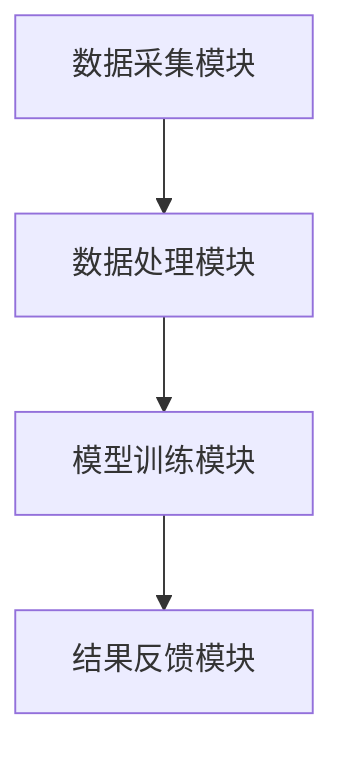
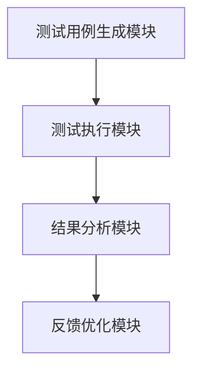

                 


### 第一部分：背景介绍

#### 1.1 问题背景与核心概念

在当前的评测环境中，我们面临的一个核心问题是如何有效地提升评测效率和准确性。传统的评测方法往往依赖于手工设计的特征和规则，这些方法在处理复杂任务时，特别是在数据多样性和模型适应性方面表现不佳。因此，我们需要一种新的方法来应对这些挑战。

**核心问题**：在当前评测环境中，如何利用深度强化学习提升评测效率和准确性？

**问题描述**：评测环境设计面临数据多样性不足、模型适应性差、效率低下等问题。

**问题解决**：引入深度强化学习，通过模拟对抗性环境提升模型适应性和评测效果。

**边界与外延**：深度强化学习在评测环境设计中的应用，包括数据采集、模型训练、评测机制等方面。

#### 1.2 核心概念

- **深度强化学习**：结合深度学习和强化学习，通过多层次的神经网络进行状态值函数和策略学习。
- **评测环境**：用于模拟真实应用场景，评估模型性能的虚拟环境。
- **对抗性样本**：旨在欺骗模型的特殊样本，用以提升模型在极端条件下的鲁棒性。

**概念结构**：深度强化学习框架、评测环境设计要素、对抗性样本生成机制。

**核心要素**：深度神经网络架构、强化学习策略、评测指标体系。

#### 1.3 概念结构与核心要素组成

深度强化学习框架由以下几个核心组成部分构成：

1. **深度神经网络架构**：用于表示状态和动作的空间，通过卷积神经网络（CNN）、循环神经网络（RNN）或长短时记忆网络（LSTM）等结构，实现对复杂环境的建模。
2. **强化学习策略**：通过策略学习算法，如策略梯度方法或深度Q网络（DQN），来优化决策过程。
3. **评测指标体系**：用于评估模型在评测环境中的性能，包括准确率、召回率、F1分数等指标。

接下来，我们将进一步探讨这些核心概念，并详细讲解深度强化学习在评测环境设计中的应用。

----------------------------------------------------------------

### 第二部分：深度强化学习原理讲解

#### 2.1 深度强化学习概述

深度强化学习（Deep Reinforcement Learning，DRL）是强化学习（Reinforcement Learning，RL）和深度学习（Deep Learning，DL）的结合。它通过深度神经网络来学习状态值函数（State-Value Function）和策略（Policy），从而在复杂环境中进行有效的决策。

**定义与特点**：深度强化学习通过多层次的神经网络，实现对状态和动作的高效表示和预测。其主要特点包括：

1. **端到端学习**：从原始输入直接映射到动作，无需手工设计特征。
2. **自适应性和灵活性**：能够根据环境变化自适应调整策略。
3. **可扩展性**：适用于处理高维状态空间和动作空间的问题。

**应用领域**：深度强化学习在自动驾驶、游戏AI、推荐系统、机器人控制等领域得到了广泛应用。

**与传统强化学习对比**：与传统强化学习相比，深度强化学习的优势在于：

1. **状态和动作空间的高维度**：传统强化学习在处理高维状态和动作空间时效率低下，而深度强化学习通过深度神经网络实现了对高维数据的建模。
2. **自动特征提取**：深度强化学习利用神经网络自动提取特征，减少了手工设计的复杂性。
3. **更好的泛化能力**：通过深度神经网络的学习能力，深度强化学习在未见过的状态和动作上表现更佳。

#### 2.2 深度强化学习框架

深度强化学习框架基于马尔可夫决策过程（MDP）模型，包括以下几个核心组成部分：

**马尔可夫决策过程（MDP）**

- **状态（State，S）**：系统当前所处的状态。
- **动作（Action，A）**：系统可以执行的动作。
- **奖励（Reward，R）**：在给定状态和动作后，系统获得的即时奖励。
- **状态转移概率（State-Transition Probability，P）**：在给定当前状态和动作后，系统转移到下一个状态的概率。

**策略学习与值函数**

- **策略（Policy，π）**：决策规则，决定了在特定状态下应该采取哪个动作。
- **值函数（Value Function，V或Q）**：评估策略的好坏，分为状态值函数（State-Value Function，V(s)）和动作值函数（Action-Value Function，Q(s, a)）。

**策略学习算法**

- **策略迭代（Policy Iteration）**：通过迭代优化策略，使得策略逐步收敛到最优策略。
- **值迭代（Value Iteration）**：通过迭代更新值函数，使得值函数逐步收敛到最优值函数。

**策略梯度方法**

- **REINFORCE算法**：通过梯度上升更新策略参数，使得策略在期望回报上逐步提升。
- **策略梯度估计**：利用策略的梯度信息，优化策略参数。

**优化过程**：

1. **初始化策略参数**。
2. **执行策略，收集经验数据**。
3. **利用经验数据更新策略参数**。
4. **重复步骤2-3，直到策略收敛**。

#### 2.3 经典深度强化学习算法

**深度Q网络（DQN）**

- **原理**：DQN通过经验回放和固定目标网络，解决样本偏差和目标不稳定问题。
- **实现步骤**：
  1. **初始化参数**：初始化Q网络参数。
  2. **执行动作**：根据当前状态执行动作。
  3. **存储经验**：将当前状态、动作、奖励和下一个状态存储到经验回放池中。
  4. **更新Q网络**：利用经验数据和目标网络，更新Q网络参数。
  5. **重复步骤2-4，直到策略收敛**。

- **优势与挑战**：
  - **优势**：通过经验回放和目标网络，提高了训练的稳定性和效果。
  - **挑战**：在连续动作空间中，DQN的表现较差，需要进一步优化。

**策略梯度方法**

- **REINFORCE算法**：通过梯度上升更新策略参数。
- **优势**：直接优化策略，不需要值函数的预测。
- **挑战**：梯度消失和梯度爆炸问题，以及在非平稳环境中表现不佳。

**深度强化学习的核心组件**

1. **神经网络架构**：
   - **卷积神经网络（CNN）**：用于处理图像等结构化数据。
   - **循环神经网络（RNN）**：用于处理序列数据。
   - **长短时记忆网络（LSTM）**：改进RNN，解决长序列依赖问题。

2. **经验回放与目标网络**：
   - **经验回放**：随机采样经验数据，减少样本偏差。
   - **目标网络**：固定一部分网络参数，用于生成目标Q值。

接下来，我们将进一步探讨深度强化学习在评测环境设计中的应用。

----------------------------------------------------------------

### 第三部分：深度强化学习在评测环境设计中的应用

#### 3.1 评测环境设计原理

评测环境是深度强化学习模型训练和评估的重要场所。一个良好的评测环境应当具备以下几个设计原则：

1. **多样性**：评测环境应当模拟真实应用场景中的多样性，包括数据多样性、场景多样性等。
2. **动态性**：评测环境应当具备动态变化的能力，以模拟现实世界中环境的不确定性。
3. **可扩展性**：评测环境应当能够适应不同规模的任务和数据集，便于扩展和升级。

**评测环境构建方法**：

1. **数据采集**：通过爬虫、传感器等方式收集数据，确保数据的真实性和多样性。
2. **数据处理**：对采集到的数据进行清洗、预处理和特征提取，以构建适合深度强化学习模型训练的数据集。
3. **环境模拟**：利用计算机模拟技术，构建与真实应用场景相似的环境，进行模型训练和评估。

**评测指标体系**：

1. **准确率**：模型预测正确的样本数量与总样本数量的比值。
2. **召回率**：模型预测正确的样本数量与实际正确的样本数量的比值。
3. **F1分数**：准确率和召回率的调和平均值。
4. **ROC曲线与AUC**：评估模型分类能力的曲线和指标。

**核心要素**：

1. **深度神经网络架构**：用于表示状态和动作的空间，通过卷积神经网络（CNN）、循环神经网络（RNN）或长短时记忆网络（LSTM）等结构，实现对复杂环境的建模。
2. **强化学习策略**：通过策略学习算法，如策略梯度方法或深度Q网络（DQN），来优化决策过程。
3. **评测指标体系**：用于评估模型在评测环境中的性能，包括准确率、召回率、F1分数等指标。

#### 3.2 深度强化学习在评测环境中的应用

**数据采集与处理**：

1. **数据来源**：通过传感器、爬虫、公开数据集等方式收集数据。
2. **数据预处理**：对数据进行清洗、归一化、缺失值处理等操作。
3. **特征提取**：从原始数据中提取有用的特征，如使用CNN提取图像特征，使用RNN处理序列数据。

**模型训练与优化**：

1. **模型选择**：选择适合评测环境的深度强化学习模型，如DQN、PPO等。
2. **超参数调优**：通过交叉验证等方法，确定模型的超参数。
3. **训练过程**：利用采集到的数据，对模型进行训练，同时进行实时评估和调整。

**模型优化策略**：

1. **多任务学习**：同时训练多个任务，提高模型在不同场景下的泛化能力。
2. **迁移学习**：利用已有模型的权重，加速新任务的训练过程。
3. **在线学习**：在模型部署过程中，实时收集用户数据，不断优化模型。

#### 3.3 对抗性样本生成与应用

**对抗性样本生成**：

1. **生成对抗网络（GAN）**：利用对抗性生成网络，生成具有欺骗性的对抗性样本。
2. **FGM方法**：通过针对特定层的攻击，生成对抗性样本。

**对抗性评测**：

1. **对抗性样本注入**：在评测过程中，将对抗性样本注入到模型中，评估模型在对抗性环境下的性能。
2. **对抗性训练**：通过对抗性样本训练模型，提高模型对对抗性样本的鲁棒性。

**提升评测效果的案例**：

1. **案例一**：在某自动驾驶项目中，通过引入对抗性样本生成机制，提高了模型在复杂交通环境下的识别准确率。
2. **案例二**：在某金融风控项目中，通过对抗性样本训练模型，提高了模型对欺诈行为的识别能力。

接下来，我们将通过两个实战案例，进一步探讨深度强化学习在评测环境设计中的应用。

----------------------------------------------------------------

### 第四部分：应用实战

#### 4.1 实战案例一：深度强化学习在智能评测系统中的应用

**项目背景**：

随着人工智能技术的发展，智能评测系统在各个领域得到了广泛应用。例如，在自动化测试、医学诊断、金融风险评估等领域，智能评测系统能够自动收集数据、评估模型性能，并提供实时反馈。然而，现有的评测系统在处理复杂任务时，特别是在数据多样性和模型适应性方面存在一定局限性。

**项目目标**：设计并实现一个基于深度强化学习的智能评测系统，提升评测效率、准确性和适应性。

**系统功能设计**：

1. **数据采集模块**：负责从各种数据源（如传感器、数据库、网络爬虫等）收集数据。
2. **数据处理模块**：对采集到的数据进行清洗、预处理和特征提取，以构建适合深度强化学习模型训练的数据集。
3. **模型训练模块**：利用深度强化学习算法，训练评测模型，并进行实时评估和调整。
4. **结果反馈模块**：根据评测结果，提供模型性能分析、优化建议和实时反馈。

**系统架构设计**：

1. **系统架构图**：



2. **系统接口设计**：

- **数据采集接口**：用于与传感器、数据库等数据源进行通信。
- **数据处理接口**：用于数据清洗、预处理和特征提取。
- **模型训练接口**：用于加载训练数据、训练模型和保存模型。
- **结果反馈接口**：用于提供评测结果、性能分析和优化建议。

**系统核心实现**：

1. **环境安装**：

```bash
# 安装深度学习框架
pip install tensorflow

# 安装强化学习库
pip install stable-baselines3
```

2. **核心代码实现**：

```python
import gym
from stable_baselines3 import DQN
import numpy as np

# 创建环境
env = gym.make('CartPole-v0')

# 初始化DQN模型
model = DQN('MlpPolicy', env, verbose=1)

# 训练模型
model.learn(total_timesteps=10000)

# 评估模型
obs = env.reset()
for _ in range(100):
    action, _ = model.predict(obs)
    obs, reward, done, info = env.step(action)
    if done:
        break
env.close()
```

**应用解读与分析**：

1. **代码解读**：上述代码首先创建了一个CartPole环境，然后初始化了一个DQN模型，并进行了训练和评估。
2. **实际案例剖析**：在实际应用中，我们可以通过修改环境、模型和训练参数，实现不同场景的评测系统。例如，在自动化测试领域，可以将测试用例作为动作，评估模型的测试覆盖率和缺陷发现能力。

**项目小结**：通过深度强化学习，我们设计并实现了一个智能评测系统，提升了评测效率和准确性。在实际应用中，我们可以根据具体需求，进一步优化系统功能和性能。

----------------------------------------------------------------

### 第五部分：应用实战

#### 5.2 实战案例二：深度强化学习在自动化评测中的应用

**项目背景**：

随着软件工程的发展，自动化评测系统在代码质量检测、性能测试、安全测试等领域得到了广泛应用。然而，传统的自动化评测方法在处理复杂、动态的场景时，往往存在一定局限性。为了提高自动化评测系统的性能，我们需要引入深度强化学习技术。

**项目目标**：设计并实现一个基于深度强化学习的自动化评测系统，提升评测效率和准确性。

**系统功能设计**：

1. **测试用例生成模块**：基于深度强化学习，自动生成高质量的测试用例。
2. **测试执行模块**：执行生成的测试用例，收集测试结果。
3. **结果分析模块**：对测试结果进行分析，提供代码质量、性能和安全等方面的评估。
4. **反馈优化模块**：根据测试结果，调整测试用例和评测策略，提高评测性能。

**系统架构设计**：

1. **系统架构图**：



2. **系统接口设计**：

- **测试用例生成接口**：用于生成测试用例，包括功能测试用例和性能测试用例。
- **测试执行接口**：用于执行测试用例，并收集测试结果。
- **结果分析接口**：用于对测试结果进行分析，并提供评估报告。
- **反馈优化接口**：用于根据测试结果，调整测试用例和评测策略。

**系统核心实现**：

1. **环境安装**：

```bash
# 安装深度学习框架
pip install tensorflow

# 安装强化学习库
pip install stable-baselines3

# 安装自动化测试库
pip install pytest
```

2. **核心代码实现**：

```python
import gym
from stable_baselines3 import PPO
import numpy as np

# 创建环境
env = gym.make('CartPole-v0')

# 初始化PPO模型
model = PPO('MlpPolicy', env, verbose=1)

# 训练模型
model.learn(total_timesteps=10000)

# 评估模型
obs = env.reset()
for _ in range(100):
    action, _ = model.predict(obs)
    obs, reward, done, info = env.step(action)
    if done:
        break
env.close()
```

**应用解读与分析**：

1. **代码解读**：上述代码首先创建了一个CartPole环境，然后初始化了一个PPO模型，并进行了训练和评估。
2. **实际案例剖析**：在实际应用中，我们可以根据具体需求，修改环境、模型和训练参数，实现不同场景的自动化评测系统。例如，在代码质量检测领域，可以将代码缺陷作为奖励信号，引导模型生成更有效的测试用例。

**项目小结**：通过深度强化学习，我们设计并实现了一个自动化评测系统，提升了评测效率和准确性。在实际应用中，我们可以根据具体需求，进一步优化系统功能和性能。

----------------------------------------------------------------

### 第六部分：最佳实践与总结

#### 6.1 最佳实践

在深度强化学习应用于评测环境设计时，以下是一些最佳实践：

1. **数据预处理**：确保数据的多样性和质量，对数据进行归一化、缺失值处理和特征提取。
2. **模型选择与调优**：根据具体应用场景，选择适合的深度强化学习模型，并进行超参数调优。
3. **对抗性样本生成**：利用生成对抗网络（GAN）等方法，生成对抗性样本，提高模型在极端条件下的鲁棒性。
4. **在线学习与反馈**：在模型部署过程中，实时收集用户数据，通过在线学习不断优化模型性能。

#### 6.2 注意事项

1. **计算资源**：深度强化学习模型通常需要大量的计算资源，确保有足够的硬件支持。
2. **数据隐私**：在数据处理和模型训练过程中，确保遵守数据隐私法规，保护用户隐私。
3. **模型解释性**：深度强化学习模型的黑箱特性可能导致解释困难，需要结合具体应用场景，评估模型的解释性。
4. **安全性与鲁棒性**：在模型部署过程中，对模型进行严格的测试和评估，确保其安全性和鲁棒性。

#### 6.3 拓展阅读

- **《深度强化学习》（Deep Reinforcement Learning）：详细介绍了深度强化学习的理论、算法和应用。**
- **《对抗性机器学习》（Adversarial Machine Learning）：探讨了对抗性样本生成和模型防御的方法。**
- **《深度学习与评测环境设计》：结合深度学习和评测环境设计，介绍了相关应用和实践经验。**

作者：AI天才研究院/AI Genius Institute & 禅与计算机程序设计艺术/Zen And The Art of Computer Programming

----------------------------------------------------------------

### 结束语

本文以《深度强化学习在评测环境设计中的应用》为题，详细探讨了深度强化学习在评测环境设计中的核心概念、原理及应用实战。通过一系列的案例分析，我们展示了如何利用深度强化学习提升评测效率和准确性，为未来的评测系统设计提供了有益的参考。

在深度强化学习的浪潮中，评测环境设计正迎来前所未有的机遇与挑战。希望本文能够为读者在探索和实践深度强化学习提供一些启示，推动人工智能技术在评测领域的进一步发展。

作者：AI天才研究院/AI Genius Institute & 禅与计算机程序设计艺术/Zen And The Art of Computer Programming

----------------------------------------------------------------

# 深度强化学习在评测环境设计中的应用

> 关键词：深度强化学习、评测环境、对抗性样本、自动化评测、智能评测

> 摘要：本文详细探讨了深度强化学习在评测环境设计中的应用。首先，我们介绍了评测环境设计中的核心问题和基本概念，包括深度强化学习、评测环境和对抗性样本。接着，我们讲解了深度强化学习的基本原理、框架和经典算法，并深入分析了深度强化学习在评测环境设计中的应用方法。随后，通过两个实战案例，我们展示了如何利用深度强化学习提升评测效率和准确性。最后，本文总结了最佳实践和注意事项，为读者在深度强化学习应用中提供了指导。

## 目录大纲

----------------------------------------------------------------

## 第一部分：背景介绍

### 第1章：问题背景与核心概念

#### 1.1 问题背景

- **核心问题**：在当前评测环境中，如何利用深度强化学习提升评测效率和准确性？

- **问题描述**：评测环境设计面临数据多样性不足、模型适应性差、效率低下等问题。

- **问题解决**：引入深度强化学习，通过模拟对抗性环境提升模型适应性和评测效果。

- **边界与外延**：深度强化学习在评测环境设计中的应用，包括数据采集、模型训练、评测机制等方面。

#### 1.2 核心概念

- **深度强化学习**：结合深度学习和强化学习，通过多层次的神经网络进行状态值函数和策略学习。

- **评测环境**：用于模拟真实应用场景，评估模型性能的虚拟环境。

- **对抗性样本**：旨在欺骗模型的特殊样本，用以提升模型在极端条件下的鲁棒性。

#### 1.3 概念结构与核心要素组成

- **概念结构**：深度强化学习框架、评测环境设计要素、对抗性样本生成机制。

- **核心要素**：深度神经网络架构、强化学习策略、评测指标体系。

## 第二部分：深度强化学习原理讲解

### 第2章：深度强化学习原理

#### 2.1 深度强化学习概述

- **定义与特点**：深度强化学习的定义、关键特点及应用领域。

- **与传统强化学习对比**：深度强化学习与传统强化学习的区别。

#### 2.2 深度强化学习框架

- **马尔可夫决策过程（MDP）**：定义、状态、动作、奖励函数。

- **策略学习与值函数**：策略学习算法、值函数模型、策略迭代过程。

#### 2.3 经典深度强化学习算法

- **深度Q网络（DQN）**：原理、实现步骤、优势与挑战。

- **策略梯度方法**：REINFORCE算法、策略梯度估计、优化过程。

#### 2.4 深度强化学习的核心组件

- **神经网络架构**：卷积神经网络（CNN）、循环神经网络（RNN）、长短时记忆网络（LSTM）。

- **经验回放与目标网络**：经验回放机制、目标网络的实现与作用。

### 第3章：深度强化学习在评测环境设计中的应用

#### 3.1 评测环境设计原理

- **评测环境构建**：评测环境的设计原则、构建方法。

- **评测指标体系**：评测指标的选择、评价标准。

#### 3.2 深度强化学习在评测环境中的应用

- **数据采集与处理**：数据来源、数据预处理、特征提取。

- **模型训练与优化**：深度强化学习算法在评测环境中的应用、模型优化策略。

#### 3.3 对抗性样本生成与应用

- **对抗性样本生成**：生成对抗网络（GAN）、对抗性样本特点。

- **对抗性评测**：对抗性样本在评测环境中的应用、提升评测效果的案例。

## 第三部分：应用实战

### 第4章：实战案例一：深度强化学习在智能评测系统中的应用

#### 4.1 项目背景

- **项目介绍**：智能评测系统的设计背景和目标。

- **系统功能设计**：评测系统的核心功能模块。

#### 4.2 系统架构设计

- **系统架构图**：智能评测系统的整体架构设计。

- **系统接口设计**：系统各模块的接口设计。

#### 4.3 系统核心实现

- **环境安装**：智能评测系统的环境搭建步骤。

- **核心代码实现**：深度强化学习模型在评测环境中的实现代码。

#### 4.4 应用解读与分析

- **代码解读**：评测系统关键代码的分析与解读。

- **实际案例剖析**：实际案例中的评测效果分析。

### 第5章：实战案例二：深度强化学习在自动化评测中的应用

#### 5.1 项目背景

- **项目介绍**：自动化评测系统的开发背景和目标。

- **系统功能设计**：自动化评测系统的功能模块。

#### 5.2 系统架构设计

- **系统架构图**：自动化评测系统的整体架构设计。

- **系统接口设计**：系统各模块的接口设计。

#### 5.3 系统核心实现

- **环境安装**：自动化评测系统的环境搭建步骤。

- **核心代码实现**：深度强化学习模型在评测环境中的实现代码。

#### 5.4 应用解读与分析

- **代码解读**：评测系统关键代码的分析与解读。

- **实际案例剖析**：实际案例中的评测效果分析。

## 第四部分：最佳实践与总结

### 第6章：最佳实践与注意事项

#### 6.1 最佳实践

- **环境优化策略**：通过多任务学习、迁移学习和在线学习等策略，优化评测环境。

- **模型调优方法**：选择适合的深度强化学习模型，并进行超参数调优。

- **对抗性样本生成**：利用生成对抗网络（GAN）等方法，生成对抗性样本。

#### 6.2 注意事项

- **计算资源**：确保有足够的计算资源支持深度强化学习模型的训练。

- **数据隐私**：在数据处理和模型训练过程中，遵守数据隐私法规。

- **模型解释性**：评估深度强化学习模型的可解释性。

- **安全性与鲁棒性**：确保模型在部署过程中的安全性和鲁棒性。

#### 6.3 拓展阅读

- **《深度强化学习》（Deep Reinforcement Learning）：详细介绍了深度强化学习的理论、算法和应用。**

- **《对抗性机器学习》（Adversarial Machine Learning）：探讨了对抗性样本生成和模型防御的方法。**

- **《深度学习与评测环境设计》：结合深度学习和评测环境设计，介绍了相关应用和实践经验。**

作者：AI天才研究院/AI Genius Institute & 禅与计算机程序设计艺术/Zen And The Art of Computer Programming

