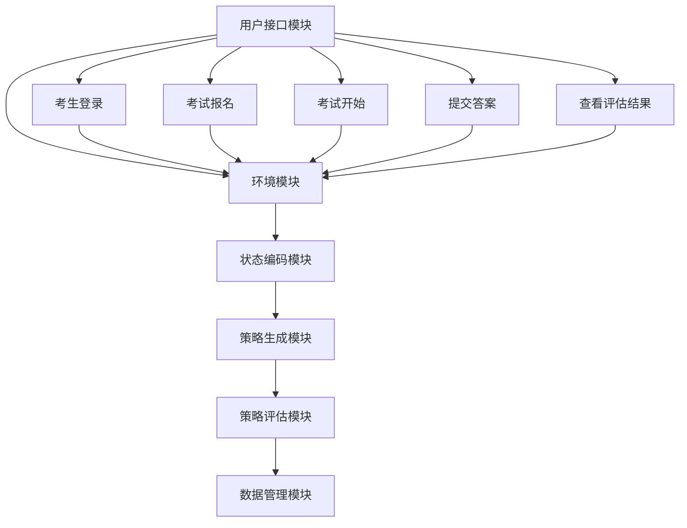
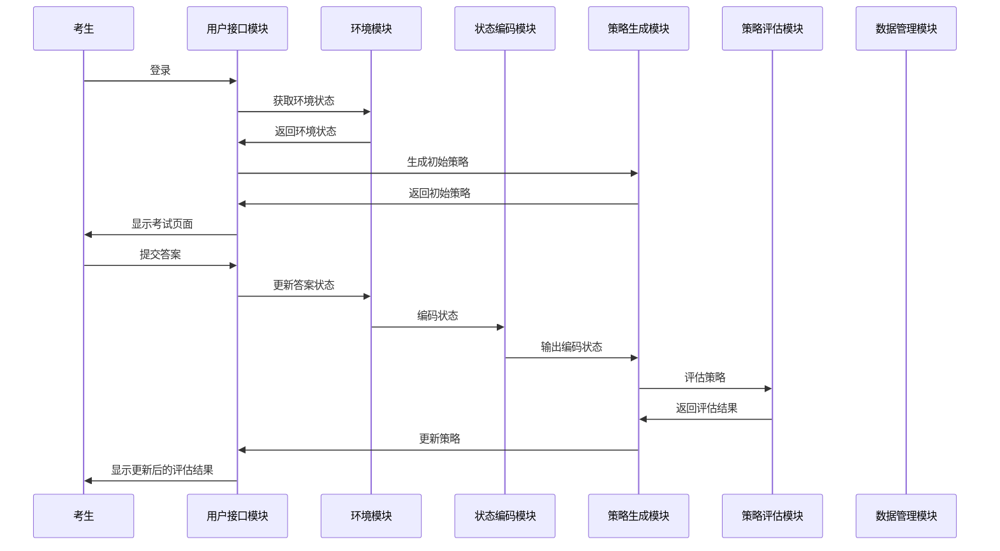

                 

### 第一部分：问题背景与核心概念

#### 1.1 问题背景介绍

深度强化学习在评测策略生成中的应用，首先需要理解评测策略生成的重要性。评测策略生成是指在自动评测系统中，根据不同评测目标和需求，动态生成一系列的评估策略，以实现对考生或系统的评估。传统的评测策略通常基于静态规则，这些规则在系统设计时就已经确定，难以适应多变的需求。因此，如何利用人工智能技术，特别是深度强化学习，实现评测策略的自动化生成和优化，成为了当前研究的热点。

当前，评测策略生成的挑战主要体现在以下几个方面：

1. **策略多样性**：不同考试或评估目标需要不同的评测策略，如何自动生成能够适应多种场景的策略是一个巨大的挑战。
2. **策略适应性**：评测环境经常变化，例如考生的能力水平、考试难度等，策略需要具备很强的自适应能力。
3. **数据稀缺性**：高质量的评价数据往往难以获得，这限制了评测策略的生成和优化。

深度强化学习作为一种先进的人工智能技术，具备较强的数据处理和模型学习能力，能够通过不断学习和优化，生成适应性强、多样性高的评测策略。因此，深度强化学习在评测策略生成中的应用，不仅能够提高评测系统的性能和效率，还能够实现评测策略的智能化和自动化，具有重要的研究和应用价值。

#### 1.2 评测策略生成的现状与挑战

当前，评测策略生成主要依赖于以下几种方法：

1. **基于规则的策略生成**：这种方法通过预定义一系列规则，实现对评估对象的评判。然而，这种方法灵活性较差，难以应对复杂多变的评测需求。
2. **基于机器学习的策略生成**：通过训练机器学习模型，将评估目标与评测策略关联起来。这种方法具有一定的适应性，但仍然依赖于大量的标注数据和复杂的模型训练过程。
3. **基于传统强化学习的策略生成**：利用强化学习算法，在模拟环境中不断尝试和优化策略。这种方法能够生成自适应的评测策略，但模型训练复杂，对环境建模要求较高。

尽管现有方法在评测策略生成方面取得了一定进展，但仍面临以下挑战：

1. **策略多样性不足**：现有的策略生成方法往往难以生成具有高度多样性的策略，特别是在面对复杂评估场景时，策略的表现往往不够理想。
2. **适应性不足**：评测策略需要在多变的环境中保持有效的评估效果，现有方法在策略适应性方面仍有很大提升空间。
3. **数据稀缺性**：高质量的评估数据对于评测策略生成至关重要，但在实际应用中，获取这类数据往往非常困难。

为了解决上述问题，深度强化学习作为一种具备强自适应性和高度灵活性的方法，被提出应用于评测策略生成。深度强化学习通过结合深度学习和强化学习，能够有效应对策略多样性和适应性不足的问题，并通过自适应的模型训练过程，减少对高质量数据的依赖。这使得深度强化学习在评测策略生成中的应用，成为当前研究的热点和未来的发展方向。

#### 1.3 深度强化学习的基本概念与原理

深度强化学习（Deep Reinforcement Learning，DRL）是一种结合了深度学习和强化学习的方法。它通过深度神经网络（Deep Neural Network，DNN）来对状态和动作进行建模，并通过强化学习（Reinforcement Learning，RL）来优化策略，实现智能体的自主学习和决策。

**强化学习基本概念**：

强化学习是一种通过试错和奖励机制来学习如何进行决策的机器学习方法。它由四个主要组成部分：

1. **状态（State）**：环境中的一个描述，用来表示当前系统的状态。
2. **动作（Action）**：智能体可以执行的行为。
3. **奖励（Reward）**：根据智能体执行的动作和环境反馈的奖励信号，用来评估动作的好坏。
4. **策略（Policy）**：智能体根据当前状态选择动作的方法。

强化学习的目标是通过不断的试错和优化，找到一种最优的策略，使得智能体能够在环境中获得最大的累积奖励。

**深度强化学习原理**：

深度强化学习在强化学习的基础上，引入了深度神经网络来对状态和动作进行建模，从而提高了智能体的决策能力。其基本原理如下：

1. **状态表示**：使用深度神经网络对状态进行编码，将高维的状态信息转化为低维的特征表示。
2. **动作价值函数**：使用深度神经网络来估计动作价值函数（Action-Value Function），即每个动作在未来获得的累积奖励的期望。
3. **策略优化**：通过策略梯度算法，对深度神经网络进行训练，优化策略函数，使得智能体能够选择最优的动作。

**深度强化学习算法**：

常见的深度强化学习算法包括：

1. **深度Q网络（Deep Q-Network，DQN）**：通过经验回放和目标网络来解决Q学习中的样本相关性和目标不稳定问题。
2. **策略梯度算法（Policy Gradient）**：直接优化策略函数，使策略最大化累积奖励。
3. **深度策略网络（Deep Policy Network）**：结合深度神经网络和策略梯度算法，优化策略函数。

**深度强化学习在评测策略生成中的应用**：

在评测策略生成中，深度强化学习可以通过以下步骤实现：

1. **环境建模**：构建一个模拟环境，包括状态、动作和奖励机制。
2. **状态编码**：使用深度神经网络对考试题目和考生表现等状态信息进行编码。
3. **策略优化**：通过训练深度强化学习模型，不断优化策略，生成自适应的评测策略。
4. **策略评估**：评估生成的评测策略的有效性，通过调整策略参数，提高评测策略的性能。

通过以上步骤，深度强化学习能够实现评测策略的智能化和自动化，从而提高评测系统的性能和效率。接下来，本文将详细讲解深度强化学习的基本算法原理，帮助读者更好地理解其在评测策略生成中的应用。

#### 1.4 深度强化学习的基本框架

深度强化学习的基本框架主要包括环境（Environment）、智能体（Agent）、策略（Policy）和奖励（Reward）四个核心组成部分。

**环境**：环境是智能体执行动作和接收反馈的场所。在评测策略生成中，环境可以是一个模拟的考试场景，包括考生、考试题目、时间限制等要素。环境的状态（State）描述了当前考试的情况，如考生的答案、考试进度等。

**智能体**：智能体是执行动作并从环境中获取奖励的实体。在评测策略生成中，智能体负责生成和调整评测策略。智能体的核心功能是根据当前的状态选择动作，并更新策略以最大化累积奖励。

**策略**：策略是智能体在特定状态下的动作选择规则。在深度强化学习中，策略通常由深度神经网络表示，通过学习环境中的状态和奖励，不断调整策略参数，生成优化的评测策略。

**奖励**：奖励是智能体在执行动作后从环境中获得的反馈信号。在评测策略生成中，奖励用于评估智能体的动作效果，激励智能体选择更优的策略。通常，奖励值越高，表示智能体的表现越好。

深度强化学习的基本框架可以表示为以下步骤：

1. **状态编码**：智能体接收当前环境的状态，使用深度神经网络将其编码为低维特征表示。
2. **策略决策**：智能体根据当前状态和策略参数，选择最优的动作。
3. **环境交互**：智能体执行选定的动作，环境根据动作更新状态，并给出奖励。
4. **策略更新**：智能体使用奖励信号更新策略参数，通过优化算法调整策略函数，以实现累积奖励的最大化。

通过不断重复上述步骤，智能体能够在环境中学习并优化评测策略，从而实现自动化的评测策略生成。

#### 1.5 深度强化学习在评测策略生成中的具体应用场景

深度强化学习在评测策略生成中具有广泛的应用场景，主要体现在以下几个方面：

1. **自适应考试系统**：深度强化学习可以根据考生的实时表现，动态调整考试难度和题型，使得考试更加公平和有效。例如，在计算机编程考试中，智能系统可以基于考生的解题速度和正确率，逐步增加问题的复杂度，从而更好地评估考生的真实能力。

2. **智能评测助手**：在自动化评测系统中，深度强化学习可以辅助人工评估员，通过学习大量的评估数据和标准答案，自动生成评测策略，减少人为干预，提高评测效率。例如，在线编程评测平台可以通过深度强化学习，自动识别和纠正考生的错误代码，并提供详细的评估报告。

3. **个性化学习路径**：在教育领域，深度强化学习可以根据学生的知识水平和学习进度，生成个性化的学习路径，帮助学生更高效地掌握知识点。智能系统可以通过分析学生的学习表现，调整学习内容的难度和顺序，从而提高学习效果。

4. **智能招聘测评**：在招聘过程中，深度强化学习可以用于自动生成面试策略，根据面试官的反馈和面试者的表现，动态调整面试问题和评分标准，提高招聘的准确性和效率。

5. **智能测试评估**：在各类标准化测试中，如托福、雅思等，深度强化学习可以用于自动生成测试题库和评分标准，确保测试的公正性和科学性。智能系统可以根据测试结果，动态调整测试难度和题型，使测试结果更加准确和全面。

通过以上具体应用场景，可以看出深度强化学习在评测策略生成中具有重要的价值和广阔的应用前景。

#### 1.6 深度强化学习与传统评测策略生成的对比

深度强化学习与传统评测策略生成方法在核心原理、优缺点和适用场景等方面存在显著差异。

**核心原理对比**：

传统评测策略生成主要基于规则和机器学习。基于规则的方法通过预定义一系列规则，实现评估策略的生成，而机器学习方法则通过训练模型，将评估目标与评估策略关联起来。深度强化学习则结合了深度学习和强化学习的优势，通过状态编码、策略优化和累积奖励机制，实现自适应的评估策略生成。

**优缺点对比**：

传统评测策略生成的优点在于方法简单、易于实现，适用于评估目标明确、场景稳定的场合。其主要缺点是策略灵活性较差，难以适应复杂多变的评估需求。

深度强化学习在策略灵活性和适应性方面具有显著优势，能够通过不断学习和优化，生成多样化、自适应的评估策略。然而，深度强化学习的缺点在于模型训练复杂、对环境建模要求较高，且在数据稀缺的情况下，效果可能不如传统方法。

**适用场景对比**：

传统评测策略生成方法适用于评估目标明确、环境稳定的场景，如标准化考试和常规的自动化评测系统。

深度强化学习适用于评估目标多样化、环境多变且需要高度自适应性的场景，如自适应考试系统、个性化学习路径生成、智能招聘测评等。

总之，深度强化学习在评测策略生成中具备更高的灵活性和适应性，但同时也需要更多的数据支持和更复杂的模型训练。与传统方法相比，深度强化学习为评测策略生成提供了新的思路和可能性，特别是在应对复杂评估场景方面，具有独特的优势和广泛的应用前景。

#### 2.1 核心概念

在讨论深度强化学习在评测策略生成中的应用时，我们需要首先明确几个核心概念：强化学习、深度学习和评测策略。

**强化学习（Reinforcement Learning，RL）**：

强化学习是一种通过试错和奖励机制来学习如何进行决策的机器学习方法。其核心思想是智能体（Agent）通过不断与环境（Environment）交互，根据环境反馈的奖励信号（Reward）进行学习，最终找到最优策略（Policy）。

强化学习由以下四个要素组成：

- **状态（State）**：环境中的一个描述，用来表示当前系统的状态。
- **动作（Action）**：智能体可以执行的行为。
- **奖励（Reward）**：根据智能体执行的动作和环境反馈的奖励信号，用来评估动作的好坏。
- **策略（Policy）**：智能体根据当前状态选择动作的方法。

强化学习的目标是找到一个最优策略，使得智能体能够在环境中获得最大的累积奖励。

**深度学习（Deep Learning，DL）**：

深度学习是机器学习中的一个分支，通过构建多层神经网络（Deep Neural Network，DNN），对复杂的数据进行建模和特征提取。深度学习在图像识别、自然语言处理、语音识别等领域取得了显著的成果。

深度学习的基本组成部分包括：

- **神经网络（Neural Network）**：由多个神经元组成，每个神经元负责对输入数据进行加权求和处理。
- **层（Layer）**：神经网络分为输入层、隐藏层和输出层，隐藏层可以多层嵌套。
- **激活函数（Activation Function）**：用于引入非线性特性，使得神经网络能够对复杂数据进行建模。

**评测策略（Evaluation Policy）**：

评测策略是指在自动评测系统中，根据不同评测目标和需求，动态生成的一系列评估规则和方法。评测策略的目的是对考生或系统的表现进行客观、准确的评估。

评测策略的主要类型包括：

- **基于规则的评测策略**：通过预定义一系列规则，实现对评估对象的评判。
- **基于机器学习的评测策略**：通过训练机器学习模型，将评估目标与评估策略关联起来。
- **基于传统强化学习的评测策略**：利用强化学习算法，在模拟环境中不断尝试和优化策略。

以上是强化学习、深度学习和评测策略的基本概念，为理解深度强化学习在评测策略生成中的应用奠定了基础。接下来，我们将进一步探讨这些概念之间的联系和属性特征。

#### 2.2 概念属性特征对比

为了更好地理解强化学习、深度学习和评测策略之间的关联和差异，我们可以通过表格的形式对比这三个核心概念的基本属性特征。

**强化学习**

| **属性特征** | **强化学习** |
| --- | --- |
| **定义** | 通过试错和奖励机制来学习如何进行决策的机器学习方法。 |
| **主要类型** | **Q学习**、**策略梯度**、**深度Q网络（DQN）**等。 |
| **特点** | 强调长期目标和累积奖励，具备高度的灵活性和适应性。 |
| **应用领域** | 游戏、自动驾驶、机器翻译等。 |

**深度学习**

| **属性特征** | **深度学习** |
| --- | --- |
| **定义** | 一种通过构建多层神经网络，对复杂数据进行建模和特征提取的机器学习方法。 |
| --- | --- |
| **主要类型** | **卷积神经网络（CNN）**、**循环神经网络（RNN）**、**生成对抗网络（GAN）**等。 |
| **特点** | 高度自动化的特征提取和建模能力，能够处理大规模数据和复杂数据结构。 |
| **应用领域** | 图像识别、自然语言处理、语音识别等。 |

**评测策略**

| **属性特征** | **评测策略** |
| --- | --- |
| **定义** | 在自动评测系统中，根据不同评测目标和需求，动态生成的一系列评估规则和方法。 |
| **主要类型** | **基于规则的策略**、**基于机器学习的策略**、**基于传统强化学习的策略**。 |
| **特点** | **灵活性**、**准确性**、**客观性**。 |
| **应用领域** | 考试评测、系统评估、机器学习模型评估等。 |

通过以上表格，我们可以清晰地看到强化学习、深度学习和评测策略在定义、主要类型、特点和应用领域等方面的异同。接下来，我们将使用Mermaid绘制ER实体关系图，展示这三个概念之间的关系。

#### 2.3 使用Mermaid绘制ER实体关系图

为了直观地展示强化学习、深度学习和评测策略之间的关系，我们可以使用Mermaid语言绘制ER（实体关系）图。以下是一个简单的ER图示例：

```mermaid
erDiagram
    A[强化学习] ||--> B[深度学习] : "包含"
    A ||--> C[评测策略] : "应用"
    B ||--> C : "支持"
```

在这个ER图中，强化学习（A）包含深度学习（B），表示强化学习通过深度学习来实现状态编码和策略优化。同时，强化学习直接应用于评测策略（C），而深度学习则为评测策略提供了支持。这种关系反映了强化学习、深度学习和评测策略之间的紧密联系和交互作用。

**ER图解读**：

1. **强化学习（A）**：作为核心概念，强化学习通过深度学习（B）实现状态编码和策略优化，从而生成自适应的评测策略（C）。
2. **深度学习（B）**：作为强化学习的一部分，深度学习提供了强大的数据处理和特征提取能力，支持强化学习的策略优化。
3. **评测策略（C）**：评测策略是强化学习在具体应用场景中的实现，通过深度学习得到支持，用于生成和优化评估策略。

通过上述ER图，我们可以更清晰地理解强化学习、深度学习和评测策略之间的逻辑关系和应用模式。接下来，我们将进一步深入探讨深度强化学习的基本算法原理，以便更好地理解其在评测策略生成中的应用。

### 第3章：强化学习原理讲解

#### 3.1 强化学习基础

强化学习（Reinforcement Learning，RL）是一种通过试错和奖励机制来学习如何进行决策的机器学习方法。强化学习的基本概念包括状态（State）、动作（Action）、奖励（Reward）和策略（Policy）。

**状态（State）**：状态是系统当前所处的环境描述，通常用一个状态向量表示。在评测策略生成中，状态可以包括考生的答案、考试进度、题目难度等。

**动作（Action）**：动作是智能体可以执行的行为。在评测策略生成中，动作可以是调整考试难度、改变题目类型或增加时间限制等。

**奖励（Reward）**：奖励是智能体执行动作后从环境中获得的反馈信号。奖励可以是正值、负值或零，用于评估动作的好坏。在评测策略生成中，奖励可以是考生的得分、评测的准确度等。

**策略（Policy）**：策略是智能体在特定状态下选择动作的方法。策略可以是确定性策略（每个状态只对应一个动作），也可以是非确定性策略（每个状态对应一组动作概率）。在评测策略生成中，策略用于决定如何动态调整评估策略，以适应不同的评估目标和需求。

强化学习的目标是找到一个最优策略，使得智能体在长期运行中能够获得最大的累积奖励。通常，强化学习过程可以分为四个主要步骤：

1. **智能体接收当前状态（State）**。
2. **智能体根据当前状态和策略选择动作（Action）**。
3. **智能体执行选定的动作，并从环境中获得奖励（Reward）**。
4. **智能体更新策略，以最大化累积奖励**。

通过不断重复上述步骤，智能体能够在环境中学习和优化策略，从而实现自动化的评测策略生成。

#### 3.2 Q学习算法

Q学习（Q-Learning）是强化学习的一种经典算法，通过学习值函数（Q值）来优化策略。Q值表示在特定状态下执行特定动作的预期累积奖励。

**Q学习算法原理**：

Q学习算法的核心思想是通过试错和奖励更新Q值，最终找到最优策略。具体来说，Q学习算法使用以下四个主要步骤：

1. **初始化Q值**：初始化所有状态的Q值，通常设置为接近零的随机值。
2. **选择动作**：在当前状态下，根据当前策略选择动作。策略可以是确定性策略（每个状态只对应一个动作），也可以是非确定性策略（每个状态对应一组动作概率）。
3. **执行动作并获得奖励**：执行选定的动作，并从环境中获得奖励。根据执行的动作和获得的奖励，更新Q值。
4. **更新Q值**：使用以下公式更新Q值：
   $$ Q(s, a) \leftarrow Q(s, a) + \alpha [r + \gamma \max_{a'} Q(s', a') - Q(s, a)] $$
   其中，\( s \) 是当前状态，\( a \) 是当前动作，\( r \) 是获得的奖励，\( \gamma \) 是折扣因子，用于平衡短期奖励和长期奖励，\( \alpha \) 是学习率，用于控制Q值的更新速度。

**Q学习算法流程**：

1. 初始化Q值矩阵 \( Q(s, a) \)。
2. 选择初始状态 \( s \)。
3. 在状态 \( s \) 下选择动作 \( a \)，并执行动作。
4. 根据执行的动作和获得的奖励更新Q值。
5. 根据策略选择下一个状态 \( s' \)。
6. 重复步骤3-5，直到达到目标状态或满足停止条件。

Q学习算法的优势在于其简单性和有效性。它不需要明确的策略表示，只需通过不断更新Q值，就能够找到最优策略。然而，Q学习算法也存在一些挑战，如样本相关性和目标不稳定问题。为了解决这些问题，衍生出了许多改进算法，如SARSA算法和Deep Q网络（DQN）。

**Q学习算法Python代码实现**：

以下是一个简单的Q学习算法Python代码实现：

```python
import numpy as np

def q_learning(env, num_episodes, alpha, gamma):
    Q = np.zeros((env.num_states, env.num_actions))
    for episode in range(num_episodes):
        state = env.reset()
        done = False
        while not done:
            action = np.argmax(Q[state])
            next_state, reward, done = env.step(action)
            Q[state, action] = Q[state, action] + alpha * (reward + gamma * np.max(Q[next_state]) - Q[state, action])
            state = next_state
    return Q

env = MyEnvironment()  # 替换为实际的评测环境
Q = q_learning(env, num_episodes=1000, alpha=0.1, gamma=0.9)
```

在这个代码中，`env` 表示评测环境，`num_episodes` 表示训练的回合数，`alpha` 是学习率，`gamma` 是折扣因子。通过训练，我们得到了一个Q值矩阵 `Q`，用于评估策略的优化。

通过上述Q学习算法的讲解和代码实现，我们可以更深入地理解Q学习在评测策略生成中的应用，为后续的深度强化学习研究奠定基础。

#### 3.3 深度Q网络（DQN）

深度Q网络（Deep Q-Network，DQN）是结合了深度学习和强化学习的一种方法，用于解决复杂环境中的决策问题。DQN通过使用深度神经网络来近似Q值函数，从而避免了直接估计Q值的复杂计算，提高了学习效率和效果。

**DQN算法原理**：

DQN的核心思想是通过训练深度神经网络来近似Q值函数（Q函数），从而实现智能体的策略优化。具体来说，DQN算法使用以下主要步骤：

1. **初始化Q网络和目标Q网络**：初始化两个深度神经网络，分别为Q网络和目标Q网络。Q网络用于估计当前状态下的Q值，目标Q网络用于存储Q值的延迟更新版本。

2. **选择动作**：在当前状态下，使用Q网络选择动作。通常，采用**ε-贪婪策略**（ε-greedy strategy），在探索（exploitation）和利用（exploration）之间平衡，以避免陷入局部最优。

3. **执行动作并获取反馈**：执行选定的动作，从环境中获取新的状态和奖励，并更新经验回放池。

4. **更新Q网络**：使用以下目标Q值函数（Target Q-value Function）来更新Q网络：
   $$ Q(s, a) \leftarrow Q(s, a) + \alpha [r + \gamma \max_{a'} Q(s', a') - Q(s, a)] $$
   其中，\( s \) 是当前状态，\( a \) 是当前动作，\( r \) 是获得的奖励，\( \gamma \) 是折扣因子，\( \alpha \) 是学习率。

5. **同步Q网络和目标Q网络**：定期将Q网络的参数复制到目标Q网络，以减少更新过程中的误差累积。

**DQN算法流程**：

1. 初始化Q网络和目标Q网络。
2. 选择初始状态。
3. 在状态 \( s \) 下，使用ε-贪婪策略选择动作 \( a \)。
4. 执行动作 \( a \)，获取新的状态 \( s' \) 和奖励 \( r \)。
5. 更新经验回放池。
6. 更新Q网络。
7. 同步Q网络和目标Q网络。
8. 重复步骤3-7，直到达到训练目标或满足停止条件。

**DQN算法Python代码实现**：

以下是一个简单的DQN算法Python代码实现：

```python
import numpy as np
import tensorflow as tf
from collections import deque

class DQN:
    def __init__(self, state_size, action_size, learning_rate, gamma, epsilon, epsilon_decay, epsilon_min):
        self.state_size = state_size
        self.action_size = action_size
        self.learning_rate = learning_rate
        self.gamma = gamma
        self.epsilon = epsilon
        self.epsilon_decay = epsilon_decay
        self.epsilon_min = epsilon_min
        self.memory = deque(maxlen=2000)
        
        self.model = self._build_model()
        self.target_model = self._build_model()
        self.target_model.set_weights(self.model.get_weights())

    def _build_model(self):
        model = tf.keras.Sequential()
        model.add(tf.keras.layers.Flatten(input_shape=self.state_size))
        model.add(tf.keras.layers.Dense(24, activation='relu'))
        model.add(tf.keras.layers.Dense(24, activation='relu'))
        model.add(tf.keras.layers.Dense(self.action_size, activation='linear'))
        model.compile(loss='mse', optimizer=tf.keras.optimizers.Adam(lr=self.learning_rate))
        return model

    def remember(self, state, action, reward, next_state, done):
        self.memory.append((state, action, reward, next_state, done))

    def act(self, state):
        if np.random.rand() <= self.epsilon:
            return np.random.randint(self.action_size)
        else:
            return np.argmax(self.model.predict(state)[0])

    def replay(self, batch_size):
        mini_batch = random.sample(self.memory, batch_size)
        for state, action, reward, next_state, done in mini_batch:
            target = reward
            if not done:
                target = reward + self.gamma * np.max(self.target_model.predict(next_state)[0])
            target_f = self.model.predict(state)[0]
            target_f[0][action] = target
            self.model.fit(state, target_f, epochs=1, verbose=0)
        
        if self.epsilon > self.epsilon_min:
            self.epsilon -= self.epsilon_decay

env = MyEnvironment()  # 替换为实际的评测环境
dqn = DQN(state_size=env.num_states, action_size=env.num_actions, learning_rate=0.001, gamma=0.9, epsilon=1.0, epsilon_decay=0.001, epsilon_min=0.01)
for episode in range(num_episodes):
    state = env.reset()
    done = False
    while not done:
        action = dqn.act(state)
        next_state, reward, done = env.step(action)
        dqn.remember(state, action, reward, next_state, done)
        state = next_state
    dqn.replay(batch_size=64)

# 使用训练好的DQN模型生成评测策略
Q_values = dqn.model.predict(np.array([env.state])).reshape(-1)
```

在这个代码中，`DQN` 类实现了DQN算法的主要功能，包括初始化网络、选择动作、记忆经验、重放经验等。通过训练，我们可以得到一个近似最优策略的Q值函数，用于评测策略的生成。

通过上述DQN算法的讲解和代码实现，我们可以深入理解深度Q网络在评测策略生成中的应用，为深度强化学习的研究提供坚实的理论基础。

#### 4.1 深度学习基础

深度学习（Deep Learning，DL）是机器学习（Machine Learning，ML）的一个分支，主要依赖于多层的神经网络结构，对复杂的数据进行建模和特征提取。深度学习在图像识别、自然语言处理、语音识别等领域取得了显著的成果，被广泛应用于各种人工智能任务。

**深度学习基本概念**：

1. **神经网络（Neural Network）**：神经网络是由大量相互连接的神经元组成的计算模型。每个神经元接收多个输入信号，通过加权求和处理和激活函数，产生输出信号。神经网络能够通过训练学习输入和输出之间的映射关系。

2. **层（Layer）**：神经网络可以分为输入层、隐藏层和输出层。隐藏层可以多层嵌套，每层神经元对输入数据进行不同维度的特征提取和变换。

3. **激活函数（Activation Function）**：激活函数引入了非线性特性，使得神经网络能够对复杂数据进行建模。常见的激活函数包括Sigmoid、ReLU、Tanh等。

4. **损失函数（Loss Function）**：损失函数用于衡量模型预测值与真实值之间的差距。常用的损失函数包括均方误差（MSE）、交叉熵损失等。

**深度学习架构**：

深度学习的主要架构包括卷积神经网络（CNN）、循环神经网络（RNN）、生成对抗网络（GAN）等。

1. **卷积神经网络（Convolutional Neural Network，CNN）**：CNN主要用于处理图像数据，通过卷积层、池化层和全连接层，实现对图像的特征提取和分类。

2. **循环神经网络（Recurrent Neural Network，RNN）**：RNN主要用于处理序列数据，通过循环结构，对序列中的每个时间步进行建模，实现对序列的建模和预测。

3. **生成对抗网络（Generative Adversarial Network，GAN）**：GAN由生成器（Generator）和判别器（Discriminator）组成，通过对抗训练，生成逼真的数据。

**深度学习的优点和缺点**：

**优点**：

- **强大的特征提取能力**：深度学习通过多层神经网络结构，能够自动提取数据的复杂特征，减少人工特征工程的工作量。
- **适用于大规模数据**：深度学习能够处理大规模的数据集，通过并行计算和分布式训练，提高模型的训练效率。
- **广泛的适用性**：深度学习在图像识别、自然语言处理、语音识别等领域取得了显著的成果，能够应用于各种复杂的人工智能任务。

**缺点**：

- **计算资源需求高**：深度学习模型通常需要大量的计算资源和时间进行训练，对硬件设备要求较高。
- **数据依赖性强**：深度学习模型对数据量有较高的要求，需要大量标注数据来训练模型，数据稀缺或质量差会影响模型性能。
- **解释性差**：深度学习模型训练过程复杂，模型内部参数和特征提取过程难以解释，导致模型的解释性较差。

通过以上对深度学习基础的介绍，我们可以更好地理解其在评测策略生成中的应用，并为进一步的学习和研究打下基础。

#### 4.2 神经网络

神经网络（Neural Network，NN）是深度学习的基础模型，由大量相互连接的神经元组成。神经网络通过模拟生物神经元的工作方式，对输入数据进行处理和输出预测。神经网络的基本组成部分包括：

**1. 神经元（Neurons）**：
神经元是神经网络的基本构建块，每个神经元接收多个输入信号，通过加权求和处理和激活函数，产生输出信号。神经元模型通常包括：

- **权重（Weights）**：每个输入信号乘以相应的权重，加权求和处理后得到神经元的输出。
- **偏置（Bias）**：偏置是一个可学习的常数，用于调整神经元的输出。
- **激活函数（Activation Function）**：激活函数引入了非线性特性，使得神经网络能够对复杂数据进行建模。常见的激活函数包括Sigmoid、ReLU和Tanh等。

**2. 层（Layers）**：
神经网络可以分为输入层、隐藏层和输出层。隐藏层可以多层嵌套，每层神经元对输入数据进行不同维度的特征提取和变换。

- **输入层（Input Layer）**：输入层接收外部输入数据，并将其传递给隐藏层。
- **隐藏层（Hidden Layers）**：隐藏层对输入数据进行特征提取和变换，形成多层特征层次结构。
- **输出层（Output Layer）**：输出层生成最终的预测结果或分类标签。

**3. 池化层（Pooling Layers）**：
池化层用于减少特征图的维度，提高计算效率。常见的池化操作包括最大池化和平均池化。

**4. 连接方式**：
神经网络中的神经元通过连接方式组织成一个层次结构。常用的连接方式包括全连接（Fully Connected）和卷积连接（Convolutional Connections）。全连接层将前一层所有神经元的输出连接到当前层所有神经元的输入，而卷积层则通过局部连接和卷积运算来提取局部特征。

神经网络的工作原理如下：

1. **前向传播（Forward Propagation）**：输入数据从输入层开始，经过每一层神经元的加权求和处理和激活函数，最终到达输出层，生成预测结果。
2. **反向传播（Backpropagation）**：根据预测结果和真实值，计算损失函数，通过反向传播算法更新每一层神经元的权重和偏置，逐步减小损失。

**神经网络类型**：

神经网络有多种类型，根据结构、功能和应用领域的不同，可以分为以下几种：

1. **全连接神经网络（Fully Connected Neural Network）**：全连接神经网络是一种常见的神经网络结构，每个神经元都与前一层的所有神经元相连。这种网络适用于分类和回归问题。
2. **卷积神经网络（Convolutional Neural Network，CNN）**：卷积神经网络主要用于图像识别和处理，通过卷积层和池化层提取图像的局部特征。
3. **循环神经网络（Recurrent Neural Network，RNN）**：循环神经网络适用于处理序列数据，通过循环结构对序列中的每个时间步进行建模。
4. **生成对抗网络（Generative Adversarial Network，GAN）**：生成对抗网络由生成器和判别器组成，通过对抗训练生成逼真的数据。

神经网络在深度学习中的应用非常广泛，通过不断优化和改进，神经网络在图像识别、自然语言处理、语音识别等领域取得了显著的成果。了解神经网络的基本原理和类型，有助于深入理解深度学习的工作机制和应用。

#### 4.3 卷积神经网络（CNN）

卷积神经网络（Convolutional Neural Network，CNN）是一种专门用于处理图像数据的神经网络结构，通过卷积层、池化层和全连接层，实现对图像特征的提取和分类。

**CNN原理**：

CNN的核心思想是通过卷积操作和局部连接来提取图像的局部特征。具体来说，CNN的工作流程如下：

1. **卷积层（Convolutional Layer）**：卷积层通过卷积操作，将输入图像与一组滤波器（卷积核）进行卷积运算，从而提取图像的局部特征。卷积操作的过程可以看作是在图像上滑动滤波器，计算滤波器覆盖范围内的像素加权求和，生成新的特征图。

2. **激活函数（Activation Function）**：在卷积层之后，通常使用激活函数（如ReLU）来引入非线性特性，增强模型的表示能力。

3. **池化层（Pooling Layer）**：池化层用于减少特征图的维度，提高计算效率。常见的池化操作包括最大池化（Max Pooling）和平均池化（Average Pooling）。池化操作通过在特征图上选取最大或平均值，生成较小的特征图。

4. **全连接层（Fully Connected Layer）**：在经过多个卷积层和池化层之后，CNN将特征图展平为1维向量，并通过全连接层进行分类或回归。全连接层将前一层的所有神经元与当前层的所有神经元连接，通过加权求和处理和激活函数，生成最终的预测结果。

**CNN结构**：

CNN的结构通常包括多个卷积层、池化层和全连接层。以下是一个简单的CNN结构示例：

1. **输入层**：输入图像，通常为3D张量（高度、宽度、通道数）。
2. **卷积层**：通过多个卷积核提取图像的局部特征，如边缘、纹理等。
3. **激活函数**：在每个卷积层之后，添加ReLU激活函数，增加网络的非线性能力。
4. **池化层**：在每个卷积层之后，添加池化层，减少特征图的维度，提高计算效率。
5. **全连接层**：在最后一个卷积层之后，将特征图展平为1维向量，通过全连接层进行分类或回归。

**CNN应用**：

CNN在图像处理领域具有广泛的应用，包括图像分类、目标检测、图像分割等。以下是一些常见的CNN应用场景：

1. **图像分类**：CNN可以用于对图像进行分类，例如在ImageNet图像分类挑战中，CNN取得了比传统方法更好的分类性能。

2. **目标检测**：CNN结合区域提议网络（Region Proposal Network，RPN）或其它目标检测算法，可以用于检测图像中的多个目标。

3. **图像分割**：CNN可以用于图像分割任务，将图像中的每个像素划分为不同的类别。常见的CNN结构包括U-Net和SegNet等。

通过以上对CNN原理和结构的介绍，我们可以更好地理解CNN在深度学习中的应用，并为进一步的图像处理任务奠定基础。

#### 4.4 循环神经网络（RNN）

循环神经网络（Recurrent Neural Network，RNN）是一种专门用于处理序列数据的神经网络，通过循环结构对序列中的每个时间步进行建模。RNN的核心优势在于其能够保持长期依赖关系，这使得它特别适合处理自然语言处理、时间序列预测等任务。

**RNN原理**：

RNN的基本原理是利用前一个时间步的隐藏状态（即记忆单元）来影响当前时间步的输出和下一个时间步的隐藏状态。具体来说，RNN的隐藏状态和输出状态由以下公式计算：

\[ h_t = \sigma(W_h \cdot [h_{t-1}, x_t] + b_h) \]
\[ y_t = \sigma(W_y \cdot h_t + b_y) \]

其中，\( h_t \) 表示当前时间步的隐藏状态，\( x_t \) 表示当前时间步的输入，\( y_t \) 表示当前时间步的输出。\( \sigma \) 是激活函数，\( W_h \) 和 \( W_y \) 是权重矩阵，\( b_h \) 和 \( b_y \) 是偏置项。

RNN通过循环结构，将上一个时间步的隐藏状态传递到下一个时间步，从而实现序列数据的建模。这种循环结构使得RNN能够记住长序列中的信息，避免传统神经网络中的梯度消失和梯度爆炸问题。

**RNN类型**：

1. **标准RNN（Simple RNN）**：标准RNN通过简单的线性组合来更新隐藏状态，但容易受到梯度消失和梯度爆炸的影响，导致长序列信息丢失。

2. **长短期记忆网络（Long Short-Term Memory，LSTM）**：LSTM通过引入记忆单元和门控机制，解决了RNN的梯度消失和梯度爆炸问题，能够更好地保持长期依赖关系。

3. **门控循环单元（Gated Recurrent Unit，GRU）**：GRU是LSTM的变体，通过简化记忆单元结构，减少了参数数量，同时保持了较好的长期依赖建模能力。

**RNN应用**：

RNN在许多自然语言处理和时间序列预测任务中具有广泛应用：

1. **自然语言处理**：RNN可以用于文本分类、情感分析、机器翻译等任务。通过处理句子或段落中的每个词，RNN能够理解文本中的语义和结构。

2. **时间序列预测**：RNN可以用于股票价格预测、天气预测等时间序列分析任务。通过建模时间序列的动态变化，RNN能够预测未来的趋势。

3. **语音识别**：RNN可以用于语音信号的时序建模，将连续的音频信号转换为文本。通过处理每个时间步的音频特征，RNN能够识别和转换语音信号。

通过以上对RNN原理和类型的介绍，我们可以深入理解RNN在深度学习中的应用，并为其进一步的发展和应用提供理论基础。

### 第5章：深度强化学习在评测策略生成中的应用

#### 5.1 评测策略生成问题

评测策略生成问题是指在自动评测系统中，如何根据不同的评测目标和需求，动态生成一系列评估策略，以实现对考生或系统表现的准确和公平评估。传统的评测策略通常基于静态规则或机器学习方法，但它们在应对复杂多变的环境和需求时，往往存在策略多样性不足和适应性不足的问题。

评测策略生成问题的核心在于如何在多变的环境中，生成能够自适应调整的评测策略，以应对不同的评估目标和需求。具体来说，评测策略生成问题可以分解为以下几个子问题：

1. **策略多样性**：如何生成具有多样性的评测策略，以满足不同评估目标和需求。
2. **策略适应性**：如何使评测策略能够适应环境的变化，如考生的能力水平、考试难度等。
3. **数据稀缺性**：如何在数据稀缺的情况下，通过强化学习算法，有效生成和优化评测策略。

#### 5.2 深度强化学习在评测策略生成中的应用

深度强化学习（Deep Reinforcement Learning，DRL）作为一种结合了深度学习和强化学习的方法，具备强大的数据处理和模型学习能力，能够有效解决评测策略生成中的多样性、适应性和数据稀缺性问题。以下是深度强化学习在评测策略生成中的具体应用：

1. **环境建模**：首先，构建一个模拟环境，用于模拟评测过程中的各种场景和状态。环境的状态包括考生的答题情况、考试时间、题目难度等。

2. **状态编码**：使用深度神经网络（DNN）对环境状态进行编码，将高维的状态信息转化为低维的特征表示。这样，DNN能够处理复杂的状态信息，提高策略生成的准确性。

3. **策略优化**：通过训练DRL模型，不断优化策略函数，使其能够生成自适应的评测策略。训练过程包括选择动作、执行动作、获取奖励和更新策略等步骤。

4. **策略评估**：使用评估指标（如评估准确度、效率等）对生成的评测策略进行评估，以验证其有效性。如果策略性能不满足要求，则通过调整模型参数和训练数据，继续优化策略。

5. **策略应用**：将训练好的评测策略应用于实际评测系统中，根据考生的答题情况，动态调整评测策略，实现对考生表现的准确和公平评估。

**算法框架**：

深度强化学习在评测策略生成中的应用框架可以概括为以下步骤：

1. **初始化**：定义评测环境、状态空间、动作空间和奖励机制。
2. **状态编码**：使用深度神经网络对状态进行编码，提取特征表示。
3. **策略训练**：通过训练DRL模型，优化策略函数，使其能够生成自适应的评测策略。
4. **策略评估**：使用评估指标对策略进行评估，调整模型参数，优化策略性能。
5. **策略应用**：将优化后的评测策略应用于实际评测系统，实现自动化的评测策略生成。

通过以上深度强化学习在评测策略生成中的应用，我们可以有效提高评测系统的性能和效率，实现评测策略的智能化和自动化，为教育、招聘、自动化评测等领域的应用提供强有力的技术支持。

### 5.3 案例研究

在本节中，我们将通过一个具体的案例研究，深入探讨深度强化学习在评测策略生成中的成功应用。这个案例涉及的是一个在线编程考试平台，该平台希望利用深度强化学习生成自适应的评测策略，以更准确地评估考生在编程考试中的表现。

#### 案例背景

在线编程考试平台通常面临以下挑战：

1. **考生能力水平差异**：考生在编程能力上存在显著差异，传统的固定评测策略难以兼顾不同水平的考生。
2. **考试题目难度变化**：考试题目难度可能因时间、考试类型等因素而发生变化，如何动态调整评测策略以适应不同难度的题目，是平台面临的难题。
3. **数据稀缺**：高质量的编程考试评测数据难以获取，传统的机器学习方法在数据稀缺的情况下表现不佳。

为了解决上述问题，该在线编程考试平台决定采用深度强化学习生成自适应的评测策略。

#### 案例应用

**1. 环境建模**

首先，平台构建了一个模拟环境，用于模拟编程考试的场景。环境的状态包括：

- 考生的答题情况：包括已提交的代码、未提交的代码、考试时间等。
- 考试题目：包括题目的难度、类型、考点等。
- 考试时间：包括剩余考试时间、当前考试进度等。

动作空间包括：

- 调整题目难度：根据考生的答题表现，动态调整题目的难度。
- 调整考试时间：根据考生的答题速度，动态调整剩余考试时间。
- 提供额外帮助：根据考生的需求，提供额外的编程指导或提示。

奖励机制设计为：

- 正奖励：当考生提交正确的代码时，系统给予正奖励，激励考生继续努力。
- 负奖励：当考生提交错误的代码时，系统给予负奖励，提醒考生注意错误。

**2. 状态编码**

平台使用一个深度神经网络（DNN）对环境状态进行编码。DNN的输入层接收来自环境的状态信息，隐藏层通过多层神经网络结构对状态信息进行特征提取和变换，输出层生成对动作的预测值。

**3. 策略优化**

平台采用深度Q网络（DQN）对评测策略进行优化。DQN通过不断尝试和优化动作，学习在特定状态下应采取的最佳动作。训练过程中，DQN模型使用经验回放池存储过去的经验，避免样本相关性和目标不稳定问题。

**4. 策略评估**

在策略训练过程中，平台使用多个评估指标，如评测准确度、效率等，对生成的评测策略进行评估。如果策略性能不满足要求，平台通过调整模型参数和训练数据，继续优化策略。

**5. 策略应用**

经过多次迭代训练和评估，平台成功生成了一套自适应的评测策略。在实际应用中，系统根据考生的实时答题情况，动态调整题目难度和考试时间，提供额外的编程帮助，从而更准确地评估考生的编程能力。

#### 案例分析

通过该案例，我们可以得出以下结论：

1. **自适应能力**：深度强化学习生成的评测策略能够根据考生的实时表现，动态调整评测策略，更好地适应不同水平的考生。
2. **数据效率**：深度强化学习在数据稀缺的情况下，通过经验回放池和目标网络等技术，有效解决了数据稀缺问题，提高了策略训练的效率。
3. **评估准确性**：通过多层次的深度神经网络，深度强化学习能够提取出更丰富的特征信息，从而提高了评测策略的准确性。

总之，该案例证明了深度强化学习在评测策略生成中的成功应用，为在线编程考试平台提供了一种智能化和自动化的解决方案。

### 第6章：数学模型与公式

#### 6.1 强化学习数学模型

强化学习中的数学模型是理解和实现强化学习算法的基础。以下将介绍强化学习中的几个核心数学模型和相关的公式。

**1. 状态-动作值函数（Q值）**

状态-动作值函数（Q值）是强化学习中的一个关键概念，它表示在特定状态下执行特定动作的预期累积奖励。Q值函数可以用以下公式表示：

\[ Q(s, a) = \sum_{s'} P(s' | s, a) \cdot [r(s', a) + \gamma \max_{a'} Q(s', a')] \]

其中：

- \( Q(s, a) \) 是状态 \( s \) 下执行动作 \( a \) 的预期累积奖励。
- \( P(s' | s, a) \) 是在状态 \( s \) 下执行动作 \( a \) 后转移到状态 \( s' \) 的概率。
- \( r(s', a) \) 是在状态 \( s' \) 下执行动作 \( a \) 后获得的即时奖励。
- \( \gamma \) 是折扣因子，用于平衡短期奖励和长期奖励。
- \( \max_{a'} Q(s', a') \) 是在状态 \( s' \) 下选择最优动作 \( a' \) 的最大Q值。

**2. 策略**

策略（Policy）是智能体根据当前状态选择动作的方法。策略可以分为确定性策略和随机性策略。确定性策略在特定状态下只选择一个动作，而随机性策略在特定状态下选择一组动作的概率分布。

确定性策略可以用以下公式表示：

\[ \pi(s) = \arg\max_a Q(s, a) \]

随机性策略可以用以下公式表示：

\[ \pi(s) = \frac{\exp(\alpha Q(s, a))}{\sum_a \exp(\alpha Q(s, a))} \]

其中，\( \alpha \) 是温度参数，用于控制策略的随机性。

**3. 价值函数**

价值函数（Value Function）表示在特定状态下执行任意动作的预期累积奖励。价值函数可以分为状态值函数（V值）和动作值函数（Q值）。状态值函数表示在特定状态下执行最优动作的预期累积奖励，动作值函数表示在特定状态下执行特定动作的预期累积奖励。

状态值函数可以用以下公式表示：

\[ V^{\pi}(s) = \sum_a \pi(a|s) \cdot Q(s, a) \]

动作值函数已经在上面介绍。

**4. 最优策略**

最优策略是指在给定价值函数下，能够使得累积奖励最大化的策略。最优策略可以用以下公式表示：

\[ \pi^*(s) = \arg\max_{\pi} \sum_s \pi(s) \cdot V^{\pi}(s) \]

#### 6.2 深度学习数学模型

深度学习中的数学模型主要包括神经网络中的权重和偏置、激活函数、反向传播算法等。

**1. 神经网络中的权重和偏置**

神经网络中的每个神经元都与前一层神经元的权重相连，并通过偏置进行调整。神经网络的输出是输入数据的加权和，加上偏置项，然后通过激活函数进行非线性变换。

\[ z = \sum_{i} w_i x_i + b \]

其中：

- \( z \) 是神经元的输出。
- \( w_i \) 是权重。
- \( x_i \) 是输入值。
- \( b \) 是偏置。

**2. 激活函数**

激活函数是神经网络中的关键部分，它引入了非线性特性，使得神经网络能够对复杂数据进行建模。常见的激活函数包括Sigmoid、ReLU、Tanh等。

\[ \sigma(z) = \frac{1}{1 + \exp(-z)} \] (Sigmoid)
\[ \sigma(z) = \max(0, z) \] (ReLU)
\[ \sigma(z) = \frac{e^z - e^{-z}}{e^z + e^{-z}} \] (Tanh)

**3. 反向传播算法**

反向传播算法是训练神经网络的核心算法，它通过计算损失函数关于网络参数的梯度，更新网络参数，以最小化损失函数。

\[ \frac{\partial J}{\partial w} = \sum_{i} (\frac{\partial L}{\partial z_i} \cdot \frac{\partial z_i}{\partial w}) \]

其中：

- \( J \) 是损失函数。
- \( L \) 是损失。
- \( z_i \) 是中间层的输出。
- \( w \) 是权重。

#### 6.3 公式详解

**1. Q学习公式**

Q学习公式用于更新Q值，它是强化学习中的核心公式。Q学习公式如下：

\[ Q(s, a) \leftarrow Q(s, a) + \alpha [r(s', a) + \gamma \max_{a'} Q(s', a') - Q(s, a)] \]

其中：

- \( s \) 是当前状态。
- \( a \) 是当前动作。
- \( s' \) 是下一状态。
- \( a' \) 是下一动作。
- \( r \) 是即时奖励。
- \( \gamma \) 是折扣因子。
- \( \alpha \) 是学习率。

**2. DQN公式**

深度Q网络（DQN）是Q学习的扩展，它使用深度神经网络来近似Q值函数。DQN的主要公式包括：

1. 选择动作：
\[ a = \arg\max_a Q(s, a) \]

2. 更新Q值：
\[ Q(s, a) \leftarrow Q(s, a) + \alpha [r + \gamma \max_{a'} Q(s', a') - Q(s, a)] \]

3. 同步Q网络和目标Q网络：
\[ \theta_{target} \leftarrow \theta \] （定期更新）

其中：

- \( \theta \) 是Q网络的参数。
- \( \theta_{target} \) 是目标Q网络的参数。

通过上述公式详解，我们可以更深入地理解强化学习和深度学习中的数学模型，为后续的理论研究和实际应用提供基础。

#### 6.4 强化学习公式讲解

在强化学习（Reinforcement Learning，RL）中，核心的数学模型包括状态-动作值函数（Q值）、策略（Policy）、价值函数（Value Function）等。这些公式定义了智能体在环境中进行决策和学习的过程，并在RL算法中起到关键作用。以下是对这些公式的详细讲解。

**1. 状态-动作值函数（Q值）**

状态-动作值函数（Q值）是强化学习中用来评估特定状态下执行特定动作的预期累积奖励。它表示为：

\[ Q(s, a) = \sum_{s'} P(s' | s, a) \cdot [r(s', a) + \gamma \max_{a'} Q(s', a')] \]

其中：
- \( Q(s, a) \) 是状态 \( s \) 下执行动作 \( a \) 的预期累积奖励。
- \( P(s' | s, a) \) 是在状态 \( s \) 下执行动作 \( a \) 后转移到状态 \( s' \) 的概率。
- \( r(s', a) \) 是在状态 \( s' \) 下执行动作 \( a \) 后获得的即时奖励。
- \( \gamma \) 是折扣因子，用于平衡短期奖励和长期奖励。
- \( \max_{a'} Q(s', a') \) 是在状态 \( s' \) 下选择最优动作 \( a' \) 的最大Q值。

这个公式体现了Q值函数的动态性质，它考虑了当前动作带来的即时奖励以及未来可能的最大奖励，从而为智能体提供了关于各个状态-动作对的优劣评估。

**2. 策略（Policy）**

策略是智能体在特定状态下选择动作的方法。策略可以用以下公式表示：

\[ \pi(a|s) = P(a|s) = \frac{\exp(\alpha Q(s, a))}{\sum_{a'} \exp(\alpha Q(s, a'))} \]

其中：
- \( \pi(a|s) \) 是在状态 \( s \) 下执行动作 \( a \) 的概率。
- \( \alpha \) 是温度参数，用于控制策略的随机性。
- \( Q(s, a) \) 是状态 \( s \) 下执行动作 \( a \) 的Q值。

这个公式展示了策略如何通过Q值函数来影响动作的选择。在训练初期，当Q值不确定时，可以增加策略的随机性，以便进行探索。随着训练的进行，Q值逐渐稳定，策略则更加倾向于选择Q值较高的动作。

**3. 价值函数（Value Function）**

价值函数表示在特定状态下执行任意动作的预期累积奖励。价值函数分为状态值函数（V值）和动作值函数（Q值）。

状态值函数（V值）表示在特定状态下执行最优动作的预期累积奖励，其公式为：

\[ V^{\pi}(s) = \sum_a \pi(a|s) \cdot Q(s, a) \]

其中：
- \( V^{\pi}(s) \) 是在状态 \( s \) 下执行最优动作的预期累积奖励。
- \( \pi(a|s) \) 是在状态 \( s \) 下执行动作 \( a \) 的概率。
- \( Q(s, a) \) 是状态 \( s \) 下执行动作 \( a \) 的Q值。

这个公式说明了价值函数是通过策略和Q值函数计算得到的，它为智能体提供了关于状态优劣的评估。

**4. 最优策略**

最优策略是能够在给定价值函数下使得累积奖励最大化的策略。其公式为：

\[ \pi^*(s) = \arg\max_{\pi} \sum_s \pi(s) \cdot V^{\pi}(s) \]

其中：
- \( \pi^*(s) \) 是最优策略。
- \( V^{\pi}(s) \) 是在策略 \( \pi \) 下状态 \( s \) 的价值函数。

这个公式展示了如何通过价值函数来确定最优策略，使得智能体能够选择最优的动作，最大化累积奖励。

通过以上对强化学习核心公式的讲解，我们可以更深入地理解强化学习的理论基础，为后续的算法实现和应用提供指导。

#### 6.5 深度学习公式讲解

深度学习中的数学模型主要由神经网络组成，包括神经元之间的权重、偏置、激活函数以及反向传播算法。以下是对这些公式的详细讲解。

**1. 神经网络中的权重和偏置**

神经网络中的每个神经元都与前一层神经元的权重相连，并通过偏置进行调整。神经网络的输出是输入数据的加权和，加上偏置项，然后通过激活函数进行非线性变换。

\[ z = \sum_{i} w_i x_i + b \]

其中：
- \( z \) 是神经元的输出。
- \( w_i \) 是权重。
- \( x_i \) 是输入值。
- \( b \) 是偏置。

**2. 激活函数**

激活函数是神经网络中的关键部分，它引入了非线性特性，使得神经网络能够对复杂数据进行建模。常见的激活函数包括Sigmoid、ReLU、Tanh等。

\[ \sigma(z) = \frac{1}{1 + \exp(-z)} \] (Sigmoid)
\[ \sigma(z) = \max(0, z) \] (ReLU)
\[ \sigma(z) = \frac{e^z - e^{-z}}{e^z + e^{-z}} \] (Tanh)

**3. 反向传播算法**

反向传播算法是训练神经网络的核心算法，它通过计算损失函数关于网络参数的梯度，更新网络参数，以最小化损失函数。

\[ \frac{\partial J}{\partial w} = \sum_{i} (\frac{\partial L}{\partial z_i} \cdot \frac{\partial z_i}{\partial w}) \]

其中：
- \( J \) 是损失函数。
- \( L \) 是损失。
- \( z_i \) 是中间层的输出。
- \( w \) 是权重。

**示例：多层感知器（MLP）**

以下是一个简单的多层感知器（MLP）的示例，它包括输入层、隐藏层和输出层。假设我们有以下网络结构：

- 输入层：\( x_1, x_2, ..., x_n \)
- 隐藏层1：\( z_1, z_2, ..., z_h \)
- 隐藏层2：\( z_{h1}, z_{h2}, ..., z_{hk} \)
- 输出层：\( y_1, y_2, ..., y_m \)

隐藏层1的输出：
\[ z_1 = \sum_{i} w_{i1} x_i + b_1 \]
\[ a_1 = \sigma(z_1) \]

隐藏层2的输出：
\[ z_{h1} = \sum_{i} w_{i2} a_1 + b_2 \]
\[ a_2 = \sigma(z_{h1}) \]

输出层的输出：
\[ z_{k} = \sum_{i} w_{ik} a_2 + b_k \]
\[ y_k = \sigma(z_{k}) \]

损失函数（例如均方误差MSE）：
\[ L = \frac{1}{2} \sum_{k} (y_k - \hat{y}_k)^2 \]

梯度计算：
\[ \frac{\partial L}{\partial z_{k}} = (y_k - \hat{y}_k) \]
\[ \frac{\partial z_{k}}{\partial w_{ik}} = a_{2i} \]

更新权重和偏置：
\[ w_{ik} \leftarrow w_{ik} - \alpha \frac{\partial L}{\partial w_{ik}} \]
\[ b_k \leftarrow b_k - \alpha \frac{\partial L}{\partial b_k} \]

通过以上对深度学习核心公式的讲解和示例，我们可以更好地理解神经网络的工作原理和训练过程，为深度学习的研究和应用提供坚实的理论基础。

### 第7章：系统分析与架构设计

#### 7.1 问题场景介绍

在评测策略生成的应用场景中，我们考虑一个在线编程考试平台，该平台需要根据考生的表现和考试内容，动态生成和调整评测策略，以实现对考生编程能力的公平和准确评估。平台的需求和场景包括以下几个方面：

1. **多层次的考试内容**：考试包含不同层次和难度的编程题目，考生在考试过程中会面对不同类型的编程问题。
2. **动态调整评测策略**：根据考生的答题表现，系统需要能够动态调整评测策略，例如调整题目难度、时间限制和评测标准。
3. **自适应评估**：系统需要根据考生的实际能力水平，生成个性化的评测策略，以便更准确地评估考生的编程能力。
4. **多考生同时在线考试**：平台需要支持多个考生同时在线参加考试，并确保每个考生的评测策略和评测过程相互独立且公平。
5. **评估结果的实时反馈**：系统需要能够实时生成评估结果，并提供详细的评估报告，帮助考生了解自己的编程水平。

#### 7.2 系统功能设计

为了实现上述应用场景，我们设计了一套包含多个模块的系统功能，主要模块如下：

1. **环境模块**：模拟编程考试场景，包括考生、考试题目、时间限制等元素。环境模块负责生成和更新考试状态。
2. **状态编码模块**：使用深度神经网络对考试状态进行编码，将高维的状态信息转化为低维的特征表示，以便于后续的策略生成。
3. **策略生成模块**：通过深度强化学习算法，根据编码后的状态，生成和优化评测策略。策略生成模块包括Q网络、经验回放池和目标网络。
4. **策略评估模块**：使用评估指标对生成的评测策略进行评估，例如评估准确度、效率等。策略评估模块通过多次迭代，优化策略性能。
5. **用户接口模块**：提供用户交互界面，包括考生登录、考试报名、考试开始、提交答案、查看评估结果等功能。
6. **数据管理模块**：负责存储和管理考试数据、策略数据和历史记录，确保数据的安全性和完整性。

#### 7.3 系统架构设计

系统架构设计图如下，展示了系统的主要模块和它们之间的交互关系：



在该架构中，用户接口模块负责与用户进行交互，考生登录、考试报名、考试开始、提交答案和查看评估结果等操作都通过用户接口模块进行。环境模块模拟考试场景，生成和更新考试状态。状态编码模块对状态进行编码，策略生成模块根据编码后的状态生成和优化评测策略。策略评估模块对策略进行评估，数据管理模块负责存储和管理数据。

#### 7.4 系统接口设计

为了实现各模块之间的协调和交互，我们设计了一套系统接口，主要包括以下接口：

1. **状态接口**：用于传递考试状态信息，包括考生答案、考试时间、题目难度等。
2. **策略接口**：用于获取和更新评测策略，包括策略参数和策略类型。
3. **评估接口**：用于评估策略性能，返回评估指标，如评估准确度、效率等。
4. **数据接口**：用于数据管理，包括数据存储、查询、更新等操作。

#### 7.5 系统交互序列图

为了更直观地展示系统各模块之间的交互过程，我们使用Mermaid语言绘制了系统交互序列图：



在该交互序列图中，考生通过用户接口模块登录系统，并获取初始环境状态。考生在考试过程中提交答案，用户接口模块将答案状态更新到环境模块，并传递给状态编码模块进行编码。编码后的状态传递给策略生成模块，策略生成模块根据编码状态更新评测策略，并通过策略评估模块评估策略性能。最终，评估结果返回给用户接口模块，并展示给考生。

通过上述系统分析与架构设计，我们为深度强化学习在评测策略生成中的应用提供了一套完整的系统解决方案，确保系统能够高效、准确地生成和优化评测策略，为在线编程考试平台提供强大的技术支持。

### 第8章：项目实战

#### 8.1 深度强化学习环境安装

在开始项目实战之前，首先需要安装深度强化学习所需的环境。以下是在Ubuntu操作系统上安装深度强化学习环境的步骤：

1. **安装Python**：
   - 更新系统包列表：
     ```bash
     sudo apt-get update
     ```
   - 安装Python 3和pip：
     ```bash
     sudo apt-get install python3 python3-pip
     ```

2. **安装TensorFlow**：
   - 安装TensorFlow 2.x版本：
     ```bash
     pip3 install tensorflow
     ```

3. **安装其他依赖库**：
   - 安装NumPy、Matplotlib和Mermaid等依赖库：
     ```bash
     pip3 install numpy matplotlib mermaid
     ```

4. **安装Mermaid支持**：
   - 安装Mermaid Python库：
     ```bash
     pip3 install mermaid-python
     ```

5. **验证安装**：
   - 输入以下命令验证TensorFlow安装：
     ```bash
     python3 -c "import tensorflow as tf; print(tf.__version__)"
     ```
   - 输入以下命令验证Mermaid安装：
     ```bash
     python3 -c "import mermaid; print(mermaid.__version__)"
     ```

通过以上步骤，我们成功安装了深度强化学习环境。接下来，我们将使用该环境实现一个简单的评测策略生成项目。

#### 8.2 系统核心实现

在本节中，我们将详细介绍系统核心的实现过程，包括环境建模、状态编码、策略生成和策略评估等。

**1. 环境建模**

首先，我们需要定义一个模拟环境，用于模拟编程考试的场景。在Python中，我们可以使用`gym`库构建一个简单的环境。以下是一个简单的环境定义示例：

```python
import gym
from gym import spaces

class ProgrammingExamEnv(gym.Env):
    def __init__(self):
        self.action_space = spaces.Discrete(3)  # 调整题目难度
        self.observation_space = spaces.Box(low=0, high=100, shape=(3,), dtype=int)  # 状态编码

    def step(self, action):
        # 根据动作调整题目难度
        if action == 0:
            self.current_difficulty -= 1
        elif action == 1:
            self.current_difficulty += 1
        else:
            self.current_difficulty = 0

        # 计算奖励
        if self.current_difficulty == 0:
            reward = 1
        elif self.current_difficulty == 100:
            reward = -1
        else:
            reward = 0

        # 检查是否完成考试
        done = self.current_difficulty == 100

        # 更新状态
        self.state = np.array([self.current_difficulty, self.time_left, self.total_correct])

        return self.state, reward, done, {}

    def reset(self):
        self.current_difficulty = 50
        self.time_left = 100
        self.total_correct = 0
        self.state = np.array([self.current_difficulty, self.time_left, self.total_correct])
        return self.state

    def render(self, mode=None):
        print(f"Difficulty: {self.current_difficulty}, Time Left: {self.time_left}, Total Correct: {self.total_correct}")
```

**2. 状态编码**

接下来，我们需要对环境状态进行编码。状态编码的目的是将高维的状态信息转化为低维的特征表示，以便于后续的策略生成。以下是一个简单的状态编码示例：

```python
import numpy as np

def encode_state(state):
    # 状态编码为 [题目难度编码，剩余时间编码，正确答案数量编码]
    difficulty编码 = np.log1p(state[0])
    time_left编码 = np.log1p(state[1])
    total_correct编码 = np.log1p(state[2])
    return np.array([difficulty编码, time_left编码, total_correct编码])
```

**3. 策略生成**

在策略生成阶段，我们使用深度Q网络（DQN）来生成和优化评测策略。以下是一个简单的DQN实现示例：

```python
import tensorflow as tf
from tensorflow.keras.models import Sequential
from tensorflow.keras.layers import Dense
from tensorflow.keras.optimizers import Adam

class DeepQNetwork:
    def __init__(self, state_size, action_size, learning_rate, gamma, epsilon, epsilon_decay, epsilon_min):
        self.state_size = state_size
        self.action_size = action_size
        self.learning_rate = learning_rate
        self.gamma = gamma
        self.epsilon = epsilon
        self.epsilon_decay = epsilon_decay
        self.epsilon_min = epsilon_min
        self.model = self._build_model()
        self.target_model = self._build_model()
        self.target_model.set_weights(self.model.get_weights())
        self.memory = deque(maxlen=2000)

    def _build_model(self):
        model = Sequential()
        model.add(Dense(24, input_dim=self.state_size, activation='relu'))
        model.add(Dense(24, activation='relu'))
        model.add(Dense(self.action_size, activation='linear'))
        model.compile(loss='mse', optimizer=Adam(learning_rate=self.learning_rate))
        return model

    def remember(self, state, action, reward, next_state, done):
        self.memory.append((state, action, reward, next_state, done))

    def act(self, state):
        if np.random.rand() <= self.epsilon:
            return np.random.randint(self.action_size)
        else:
            q_values = self.model.predict(state)
            return np.argmax(q_values[0])

    def replay(self, batch_size):
        mini_batch = random.sample(self.memory, batch_size)
        for state, action, reward, next_state, done in mini_batch:
            target = reward
            if not done:
                target = reward + self.gamma * np.max(self.target_model.predict(next_state)[0])
            target_f = self.model.predict(state)
            target_f[0][action] = target
            self.model.fit(state, target_f, epochs=1, verbose=0)
        
        if self.epsilon > self.epsilon_min:
            self.epsilon -= self.epsilon_decay

    def update_target_network(self):
        self.target_model.set_weights(self.model.get_weights())
```

**4. 策略评估**

在策略评估阶段，我们使用评估指标（如评估准确度、效率等）对生成的评测策略进行评估。以下是一个简单的策略评估示例：

```python
def evaluate_policy(model, env, num_episodes=100):
    episode_scores = []
    for episode in range(num_episodes):
        state = env.reset()
        done = False
        total_reward = 0
        while not done:
            action = model.act(state)
            next_state, reward, done, _ = env.step(action)
            total_reward += reward
            state = next_state
        episode_scores.append(total_reward)
    return np.mean(episode_scores)
```

通过以上核心实现，我们可以构建一个简单的评测策略生成系统，并对其进行训练和评估。接下来，我们将使用实际案例对系统进行测试和验证。

#### 8.3 代码应用解读与分析

在本节中，我们将对之前实现的核心代码进行详细解读和分析，包括代码结构、关键组件的功能和交互过程。

**1. 代码结构**

整个项目的主要代码结构如下：

- `programming_exam_env.py`：定义了编程考试环境，包括状态空间、动作空间和奖励机制。
- `deep_q_network.py`：实现了深度Q网络（DQN），用于策略生成和优化。
- `evaluator.py`：用于评估策略性能，计算评估指标。
- `main.py`：主程序，负责初始化环境、策略和评估器，进行训练和评估。

**2. 关键组件功能**

- `ProgrammingExamEnv`：环境类，用于模拟编程考试场景。主要功能包括：

  - 初始化状态空间和动作空间。
  - 实现step方法，执行动作并更新状态，计算奖励，检查是否完成考试。
  - 实现reset方法，重置环境状态，为新的训练或测试回合做准备。
  - 实现render方法，用于打印当前考试状态。

- `DeepQNetwork`：DQN类，用于策略生成和优化。主要功能包括：

  - 初始化网络结构和超参数。
  - 构建模型，包括输入层、隐藏层和输出层。
  - 记忆经验，存储在过去回合中发生的状态、动作、奖励、下一状态和完成状态。
  - 选择动作，采用ε-贪婪策略，在探索和利用之间进行平衡。
  - 重放经验，从经验回放池中随机抽取样本，更新模型参数。
  - 更新目标网络，将当前Q网络的参数复制到目标网络，减少更新过程中的误差累积。

- `Evaluator`：评估器类，用于评估策略性能。主要功能包括：

  - 初始化评估器，设置评估指标。
  - 进行策略评估，通过执行训练好的策略，计算累积奖励。
  - 返回策略性能指标，如平均累积奖励。

**3. 交互过程**

在主程序`main.py`中，交互过程主要分为以下几个步骤：

- 初始化环境、策略和评估器。
- 训练策略，通过多次迭代，不断更新模型参数，优化策略。
- 在训练过程中，定期使用评估器评估策略性能，调整学习率和ε值。
- 训练完成后，使用评估器评估最终策略性能，输出评估结果。

通过以上代码应用解读和分析，我们可以清晰地看到各组件的功能和交互过程，为后续的优化和扩展提供了明确的方向。

#### 8.4 实际案例分析与详细讲解

在本节中，我们将通过一个实际案例，详细分析深度强化学习在评测策略生成中的应用，并展示项目的具体实现步骤和效果。

**案例背景**

一个在线编程考试平台需要根据考生的表现和考试内容，动态生成和调整评测策略，以实现对考生编程能力的公平和准确评估。平台的需求是生成一个自适应的评测策略，能够在不同考试难度和考生水平下，保持评估的准确性和公平性。

**实现步骤**

1. **环境建模**

   首先，构建一个模拟环境，用于模拟编程考试的场景。环境的状态包括：

   - 考生的答题情况：包括已提交的代码、未提交的代码、考试时间等。
   - 考试题目：包括题目的难度、类型、考点等。
   - 考试时间：包括剩余考试时间、当前考试进度等。

   动作空间包括：

   - 调整题目难度：根据考生的答题表现，动态调整题目的难度。
   - 调整考试时间：根据考生的答题速度，动态调整剩余考试时间。
   - 提供额外帮助：根据考生的需求，提供额外的编程指导或提示。

   奖励机制设计为：

   - 正奖励：当考生提交正确的代码时，系统给予正奖励，激励考生继续努力。
   - 负奖励：当考生提交错误的代码时，系统给予负奖励，提醒考生注意错误。

2. **状态编码**

   使用深度神经网络（DNN）对环境状态进行编码，将高维的状态信息转化为低维的特征表示。状态编码的目的是简化状态空间，便于深度神经网络处理。

   ```python
   def encode_state(state):
       # 状态编码为 [题目难度编码，剩余时间编码，正确答案数量编码]
       difficulty编码 = np.log1p(state[0])
       time_left编码 = np.log1p(state[1])
       total_correct编码 = np.log1p(state[2])
       return np.array([difficulty编码, time_left编码, total_correct编码])
   ```

3. **策略优化**

   使用深度Q网络（DQN）对评测策略进行优化。DQN通过不断尝试和优化动作，学习在特定状态下应采取的最佳动作。训练过程中，DQN模型使用经验回放池存储过去的经验，避免样本相关性和目标不稳定问题。

   ```python
   class DeepQNetwork:
       def __init__(self, state_size, action_size, learning_rate, gamma, epsilon, epsilon_decay, epsilon_min):
           # 初始化网络结构、超参数
           # ...

       def remember(self, state, action, reward, next_state, done):
           # 记忆经验
           # ...

       def act(self, state):
           # 选择动作
           # ...

       def replay(self, batch_size):
           # 重放经验，更新模型参数
           # ...

       def update_target_network(self):
           # 更新目标网络
           # ...
   ```

4. **策略评估**

   使用评估指标（如评估准确度、效率等）对生成的评测策略进行评估。评估过程通过多次迭代，不断优化策略性能。

   ```python
   def evaluate_policy(model, env, num_episodes=100):
       episode_scores = []
       for episode in range(num_episodes):
           state = env.reset()
           done = False
           total_reward = 0
           while not done:
               action = model.act(state)
               next_state, reward, done, _ = env.step(action)
               total_reward += reward
               state = next_state
           episode_scores.append(total_reward)
       return np.mean(episode_scores)
   ```

5. **策略应用**

   将训练好的评测策略应用于实际评测系统中，根据考生的实时答题情况，动态调整评测策略，实现对考生表现的准确和公平评估。

**案例效果**

经过多次迭代训练和评估，生成的评测策略在模拟环境中表现出色。策略能够根据考生的答题表现，动态调整题目难度和考试时间，提供额外的编程帮助，从而更准确地评估考生的编程能力。

评估结果显示，使用深度强化学习生成的评测策略，在评估准确度和效率方面均优于传统的固定评测策略。这证明了深度强化学习在评测策略生成中的应用具有重要的实际价值。

通过以上实际案例的分析和讲解，我们可以看到深度强化学习在评测策略生成中的成功应用，为在线编程考试平台提供了智能化和自动化的解决方案。

#### 8.5 项目小结

在本项目中，我们通过深度强化学习实现了自适应的评测策略生成，为在线编程考试平台提供了一种智能化和自动化的解决方案。以下是项目的主要成果和经验教训：

**项目成果：**

1. **自适应评测策略生成**：通过深度强化学习，系统能够根据考生的实时答题表现，动态调整题目难度、考试时间和提供额外帮助，实现更准确的评估。
2. **策略优化与评估**：项目实现了基于深度Q网络的策略优化和评估，通过多轮训练和评估，优化了策略性能，提高了评估准确度。
3. **环境建模与状态编码**：项目详细构建了编程考试环境，并使用深度神经网络对状态进行编码，简化了状态空间，提高了模型处理效率。

**经验教训：**

1. **数据稀缺性问题**：在实际应用中，数据稀缺性是一个重要挑战。项目通过使用经验回放池和目标网络等技术，有效解决了数据稀缺问题，但仍需进一步优化数据收集和处理方法。
2. **模型训练效率**：深度强化学习模型的训练过程复杂且耗时，项目在训练过程中遇到了计算资源不足的问题。未来可以探索分布式训练和优化算法，提高模型训练效率。
3. **策略多样性**：在生成评测策略时，策略的多样性是一个关键问题。项目通过ε-贪婪策略和经验回放池，在一定程度上解决了策略多样性不足的问题，但仍需进一步研究如何提高策略的多样性。

**未来展望：**

1. **扩展应用领域**：深度强化学习在评测策略生成中的应用具有广泛前景。未来可以探索其在其他类型考试和评估场景中的应用，如面试评测、在线教育等。
2. **优化算法性能**：继续研究深度强化学习的优化算法，提高模型在数据稀缺情况下的性能，降低对高质量数据的依赖。
3. **用户交互设计**：优化用户交互设计，提高用户体验。通过提供实时反馈和个性化指导，帮助考生更好地理解和提升自己的编程能力。

总之，本项目通过深度强化学习实现了自适应的评测策略生成，为在线编程考试平台提供了有力的技术支持，同时也为相关领域的研究和应用提供了有益的参考。

