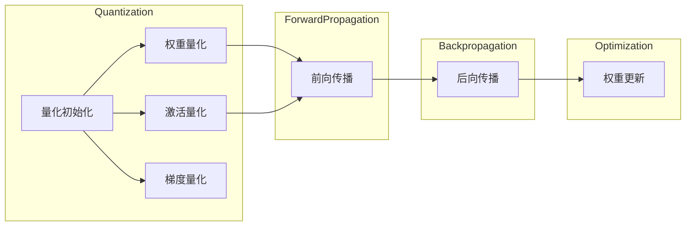
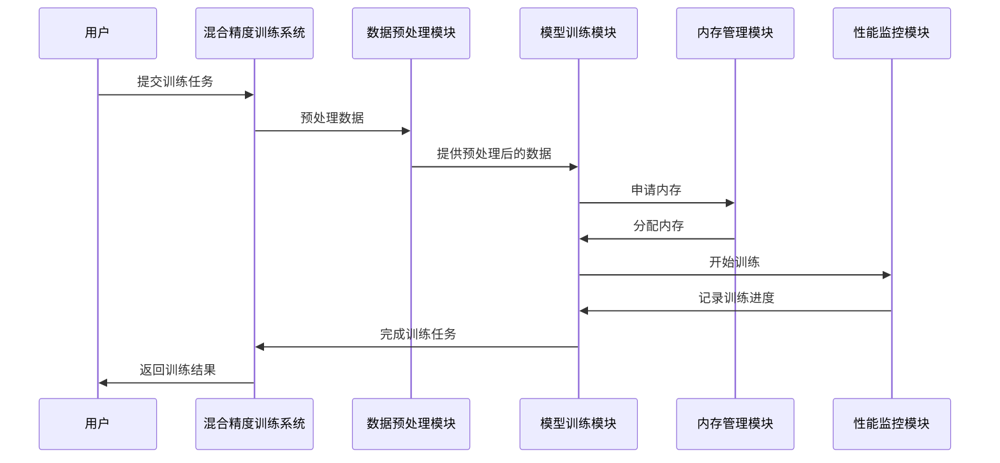
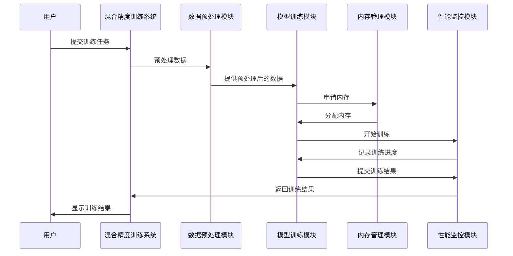

                 


### 1.1.1 计算效率与模型精度问题

在现代机器学习和深度学习领域，随着模型复杂度的增加和参数规模的扩大，模型的训练时间显著延长，这给研究人员和从业者带来了巨大的挑战。计算效率（Computational Efficiency）和模型精度（Model Accuracy）是机器学习系统设计和优化中必须平衡的两个关键因素。

**计算效率**是指模型在训练和推理过程中所需计算资源的多少，包括CPU、GPU等硬件资源的使用情况。效率高的模型能够在较短的时间内完成训练，并能够快速地响应新的输入数据。然而，高效率往往伴随着模型精度的降低，这是因为为了提高效率，可能会采用简化算法、减少训练时间或牺牲一些模型细节。

**模型精度**则是指模型对于输入数据的预测能力，精度高的模型能够更准确地捕捉到数据的特征和模式。然而，追求高精度通常需要更多的计算资源和更长时间的训练过程，这会导致计算效率的降低。

在深度学习模型的训练过程中，为了在计算效率和模型精度之间找到平衡点，研究人员和工程师们不断探索新的方法和技术。混合精度训练（Mixed-Precision Training）就是其中一种重要方法，它通过在训练过程中使用不同精度的数据类型，如半精度（FP16）和全精度（FP32），来优化计算效率和模型性能。

### 1.1.2 混合精度训练的基本原理

混合精度训练的核心思想是利用不同精度的数据类型来平衡计算效率和模型精度。具体来说，它主要涉及以下几个关键概念：

#### 1.1.2.1 精度表示方法

精度表示方法指的是数据在计算机内存中的表示形式，常见的有单精度（FP32）和半精度（FP16）。单精度浮点数占用4个字节，而半精度浮点数占用2个字节。半精度浮点数虽然精度较低，但可以显著减少内存占用和计算量。

#### 1.1.2.2 量化技术

量化技术是将高精度数据转换为低精度数据的过程。在混合精度训练中，量化技术通常用于将模型的权重和激活值从单精度（FP32）转换为半精度（FP16）。量化可以通过简单截断或更复杂的量化算法实现。

#### 1.1.2.3 混合精度训练架构

混合精度训练架构通常包括以下几个层次：

1. **权重和激活值量化层**：将模型的权重和激活值从单精度（FP32）量化为半精度（FP16）。
2. **前向传播和后向传播层**：使用量化后的数据类型进行计算，以提高计算效率。
3. **梯度量化层**：将训练过程中得到的梯度从半精度（FP16）重新量化为单精度（FP32），以便进行优化器的更新。

### 1.1.3 混合精度训练的优势与挑战

#### 1.1.3.1 优势

混合精度训练的主要优势包括：

1. **提高计算效率**：使用半精度浮点数可以显著减少计算量和内存占用，从而加速模型训练过程。
2. **减少内存占用**：半精度浮点数的内存占用只有单精度浮点数的一半，这对于大规模模型特别有利。
3. **模型性能优化**：在某些情况下，混合精度训练可以略微提高模型性能，特别是在使用某些优化算法时。

#### 1.1.3.2 挑战

然而，混合精度训练也存在一些挑战：

1. **精度损失**：半精度浮点数的精度较低，可能会引入一些数值稳定性问题，影响模型精度。
2. **量化误差**：量化过程中引入的误差可能导致模型性能下降。
3. **算法适配**：并非所有深度学习算法都适用于混合精度训练，需要针对特定算法进行调整和优化。

### 总结

混合精度训练作为一种平衡计算效率和模型精度的重要方法，已经在深度学习领域得到了广泛应用。通过理解其基本原理和优势，我们可以更好地利用这一技术，提高模型训练的效率和性能。接下来，我们将深入探讨混合精度训练的核心概念和算法原理，以便更深入地理解这一技术的实际应用。

### 2.1.1 精度表示方法与量化

#### 2.1.1.1 精度表示方法

精度表示方法是数据在计算机内存中的表示形式，它决定了数据的精度和范围。在深度学习领域，常见的精度表示方法有单精度（FP32）和半精度（FP16）。

**单精度（FP32）**：
- **精度**：单精度浮点数能够表示大约7位有效数字。
- **内存占用**：单精度浮点数占用4个字节（32位）。
- **特点**：精度较高，适用于大多数深度学习模型。

**半精度（FP16）**：
- **精度**：半精度浮点数能够表示大约3.5位有效数字。
- **内存占用**：半精度浮点数占用2个字节（16位）。
- **特点**：精度较低，但内存占用和计算量显著减少。

#### 2.1.1.2 量化技术

量化技术是将高精度数据转换为低精度数据的过程，通常在混合精度训练中用于将模型的权重和激活值从单精度（FP32）转换为半精度（FP16）。量化过程包括以下几个步骤：

1. **选择量化参数**：
   - **缩放因子（Scale Factor）**：用于调整数据的大小，使其适应半精度浮点数的表示范围。
   - **零点（Zero Point）**：用于确定数据的偏移量，以便在量化后保持数据的均值不变。

2. **计算量化值**：
   - **量化公式**：量化值 = （数据值 - 零点）/ 缩放因子。
   - **量化过程**：将数据值映射到半精度浮点数的范围内。

3. **量化误差处理**：
   - **截断误差**：量化过程中可能会引入截断误差，可以通过调整缩放因子或使用更复杂的量化算法来减少。
   - **舍入误差**：量化值在映射到半精度浮点数时可能会发生舍入误差，这通常不会影响模型性能。

#### 2.1.1.3 精度表示方法与量化技术对比

| 精度表示方法 | 单精度（FP32） | 半精度（FP16） |
| --- | --- | --- |
| **精度** | 高 | 低 |
| **内存占用** | 4字节 | 2字节 |
| **计算效率** | 低 | 高 |
| **应用场景** | 对精度要求较高的模型 | 大规模模型的训练 |

#### 2.1.1.4 混合精度训练架构

混合精度训练架构通常包括以下几个关键层次：

1. **量化层**：
   - **权重量化**：将模型的权重从单精度（FP32）量化为半精度（FP16）。
   - **激活量化**：将激活值从单精度（FP32）量化为半精度（FP16）。

2. **计算层**：
   - **前向传播**：使用量化后的权重和激活值进行计算。
   - **后向传播**：使用量化后的激活值和梯度进行计算。

3. **梯度量化层**：
   - **梯度量化**：将训练过程中得到的梯度从半精度（FP16）重新量化为单精度（FP32），以便进行优化器的更新。

#### 2.1.1.5 混合精度训练流程

混合精度训练流程可以概括为以下几个步骤：

1. **初始化模型**：创建模型并初始化权重和偏置。
2. **数据预处理**：对输入数据进行标准化和归一化，以便模型训练。
3. **权重和激活量化**：将权重和激活值从单精度（FP32）量化为半精度（FP16）。
4. **前向传播**：使用量化后的权重和激活值计算输出。
5. **损失计算**：计算预测输出与实际输出之间的误差。
6. **后向传播**：使用量化后的激活值和梯度计算损失对权重的梯度。
7. **梯度量化**：将梯度从半精度（FP16）重新量化为单精度（FP32）。
8. **权重更新**：使用优化器更新权重。
9. **迭代更新**：重复步骤4到步骤8，直到模型收敛。

### 2.1.2 混合精度训练架构

#### 2.1.2.1 混合精度训练的层次结构

混合精度训练的层次结构可以分为三个主要层次：量化层、计算层和量化层。每个层次的作用如下：

1. **量化层**：
   - **权重量化**：将模型的权重从单精度（FP32）量化为半精度（FP16）。
   - **激活量化**：将激活值从单精度（FP32）量化为半精度（FP16）。

2. **计算层**：
   - **前向传播**：使用量化后的权重和激活值进行计算。
   - **后向传播**：使用量化后的激活值和梯度进行计算。

3. **量化层**：
   - **梯度量化**：将训练过程中得到的梯度从半精度（FP16）重新量化为单精度（FP32），以便进行优化器的更新。

#### 2.1.2.2 混合精度训练的流程

混合精度训练的流程可以概括为以下几个步骤：

1. **初始化模型**：创建模型并初始化权重和偏置。
2. **数据预处理**：对输入数据进行标准化和归一化，以便模型训练。
3. **权重和激活量化**：将权重和激活值从单精度（FP32）量化为半精度（FP16）。
4. **前向传播**：使用量化后的权重和激活值计算输出。
5. **损失计算**：计算预测输出与实际输出之间的误差。
6. **后向传播**：使用量化后的激活值和梯度计算损失对权重的梯度。
7. **梯度量化**：将梯度从半精度（FP16）重新量化为单精度（FP32）。
8. **权重更新**：使用优化器更新权重。
9. **迭代更新**：重复步骤4到步骤8，直到模型收敛。

### 2.1.3 ER实体关系图架构

为了更清晰地描述混合精度训练的实体关系，我们可以使用ER（实体-关系）图进行表示。以下是混合精度训练的ER实体关系图：

```mermaid
erDiagram
  Model ||--|{ Weight } : has
  Model ||--|{ Activation } : has
  Model ||--|{ Gradient } : has
  Weight ||--|{ FP32 } : quantized_to
  Activation ||--|{ FP32 } : quantized_to
  Gradient ||--|{ FP16 } : quantized_to
```

- **Model**（模型）：表示深度学习模型，包括权重、激活值和梯度。
- **Weight**（权重）：表示模型的权重，初始为单精度（FP32），在训练过程中进行量化。
- **Activation**（激活值）：表示模型的激活值，初始为单精度（FP32），在训练过程中进行量化。
- **Gradient**（梯度）：表示模型的梯度，在训练过程中从半精度（FP16）重新量化为单精度（FP32）。

通过ER实体关系图，我们可以更直观地理解混合精度训练中的各个实体及其相互关系。

## 第二部分：算法原理讲解

## 第3章：算法原理讲解

### 3.1 算法mermaid流程图

为了更直观地展示混合精度训练的算法流程，我们使用mermaid语言绘制了算法的流程图，如下所示：



在这个mermaid流程图中，我们可以看到混合精度训练的主要步骤，包括量化初始化、权重量化、激活量化、梯度量化、前向传播、后向传播和权重更新。

### 3.2 Python源代码实现

为了更好地理解混合精度训练的算法原理，我们提供了一个Python源代码示例，展示了如何实现混合精度训练的基本流程。以下是源代码的主要部分：

```python
import tensorflow as tf
from tensorflow.keras.layers import Dense
from tensorflow.keras.models import Sequential

# 模型初始化
model = Sequential()
model.add(Dense(10, input_shape=(10,), activation='relu'))
model.compile(optimizer='adam', loss='mse')

# 量化初始化
quantize = tf.keras.mixed_precision.experimental.Policy('mixed_bfloat16')

# 权重和激活量化
weights = model.get_weights()
quantized_weights = [tf.cast(weight, quantize.compute_dtype) for weight in weights]
model.set_weights(quantized_weights)

# 训练模型
model.fit(x_train, y_train, epochs=10, batch_size=32)

# 梯度量化
gradients = model.optimizer.get_gradients(model.total_loss, model.trainable_variables)
quantized_gradients = [tf.cast(grad, quantize.compute_dtype) for grad in gradients]

# 权重更新
quantized_variables = [tf.Variable(tf.cast(var, quantize.compute_dtype)) for var in model.trainable_variables]
quantized_optimizer = tf.keras.mixed_precision.experimental_COMPILER_OPTIMIZER(quantize)
quantized_optimizer.apply_gradients(zip(quantized_gradients, quantized_variables))
```

在这个示例中，我们首先创建了一个简单的全连接神经网络模型，并使用`tf.keras.mixed_precision.experimental.Policy`设置了混合精度策略。然后，我们将模型的权重从单精度（FP32）量化为混合精度（bfloat16），并使用`model.fit`函数进行模型训练。在训练过程中，我们收集了梯度，并将其从混合精度（bfloat16）量化为单精度（FP32），然后更新了模型的权重。

### 3.3 数学模型与公式讲解

混合精度训练的数学模型和公式是理解其工作原理的关键。以下是混合精度训练的核心数学模型和公式：

#### 3.3.1 混合精度训练的数学模型

在混合精度训练中，我们通常使用以下数学模型：

1. **权重量化**：
   $$ w_{quant} = \frac{w_{fp32} - \text{zero_point}}{\text{scale_factor}} $$
   
   其中，$w_{fp32}$ 是原始权重，$w_{quant}$ 是量化后的权重，$\text{zero_point}$ 是零点，$\text{scale_factor}$ 是缩放因子。

2. **激活量化**：
   $$ a_{quant} = \frac{a_{fp32} - \text{zero_point}}{\text{scale_factor}} $$
   
   其中，$a_{fp32}$ 是原始激活值，$a_{quant}$ 是量化后的激活值。

3. **梯度量化**：
   $$ g_{quant} = \frac{g_{fp16} - \text{zero_point}}{\text{scale_factor}} $$
   
   其中，$g_{fp16}$ 是原始梯度，$g_{quant}$ 是量化后的梯度。

#### 3.3.2 混合精度训练的数学公式

在混合精度训练的过程中，我们使用以下数学公式：

1. **前向传播**：
   $$ y = f(W \cdot x + b) $$
   
   其中，$y$ 是输出，$f$ 是激活函数，$W$ 是权重，$x$ 是输入，$b$ 是偏置。

2. **后向传播**：
   $$ \delta = \frac{\partial L}{\partial z} = \frac{\partial L}{\partial y} \cdot \frac{\partial y}{\partial z} $$
   
   其中，$\delta$ 是误差梯度，$L$ 是损失函数，$z$ 是前向传播的中间结果。

3. **权重更新**：
   $$ w_{new} = w_{old} - \alpha \cdot \frac{\partial L}{\partial w} $$
   
   其中，$w_{new}$ 是新权重，$w_{old}$ 是旧权重，$\alpha$ 是学习率。

#### 3.3.3 公式说明

上述公式描述了混合精度训练的核心数学模型。在量化过程中，我们使用缩放因子和零点来调整数据的大小和位置，以便在半精度浮点数范围内保持数据的精度。在训练过程中，我们通过前向传播计算输出，通过后向传播计算梯度，并使用优化器更新权重。

### 3.4 举例说明

为了更好地理解混合精度训练的原理，我们通过一个简单的例子来说明：

假设我们有一个全连接神经网络，输入数据为 $x = [1, 2, 3, 4, 5]$，权重为 $W = [0.1, 0.2, 0.3, 0.4, 0.5]$，激活函数为 ReLU。

1. **前向传播**：
   $$ y = \max(0, W \cdot x + b) = \max(0, [0.1 \cdot 1 + 0.2 \cdot 2 + 0.3 \cdot 3 + 0.4 \cdot 4 + 0.5 \cdot 5 + b]) $$
   
   由于激活函数是 ReLU，我们得到：
   $$ y = \max(0, [0.1 + 0.4 + 0.9 + 1.6 + 2.5 + b]) = \max(0, [5.0 + b]) $$
   
   为了简化计算，我们可以假设 $b = 0$，则：
   $$ y = \max(0, 5.0) = 5.0 $$

2. **后向传播**：
   假设损失函数为均方误差（MSE），则：
   $$ \delta = \frac{\partial L}{\partial y} = \frac{\partial (y - t)^2}{\partial y} = 2(y - t) $$
   
   由于我们假设 $t = 5.0$（目标值），则：
   $$ \delta = 2(5.0 - 5.0) = 0.0 $$

3. **权重更新**：
   假设学习率 $\alpha = 0.1$，则：
   $$ w_{new} = w_{old} - \alpha \cdot \frac{\partial L}{\partial w} = w_{old} - \alpha \cdot \delta $$
   
   由于 $\delta = 0.0$，则：
   $$ w_{new} = w_{old} = [0.1, 0.2, 0.3, 0.4, 0.5] $$

通过这个简单的例子，我们可以看到混合精度训练的基本流程，包括前向传播、后向传播和权重更新。在实际应用中，我们通常使用更复杂的模型和优化算法，但基本原理是类似的。

## 第三部分：系统架构与设计方案

## 第4章：系统架构设计

### 4.1 问题场景介绍

在深度学习模型训练过程中，特别是在处理大规模数据集和高复杂度模型时，计算资源的需求往往非常巨大。这不仅包括CPU和GPU的计算能力，还涉及到内存带宽和存储容量等资源。因此，如何有效地利用有限的计算资源，同时保证模型训练的精度和效率，成为了深度学习领域中一个重要且迫切需要解决的问题。混合精度训练作为一种新的方法，通过使用半精度浮点数（FP16）来替代传统的全精度浮点数（FP32），可以有效减少计算资源的消耗，从而在保持模型精度相对不变的情况下显著提升训练速度。

本节将介绍一个混合精度训练系统的设计背景，包括当前存在的问题、目标场景以及预期解决的问题。

#### 当前存在的问题

1. **计算资源消耗大**：深度学习模型，尤其是大型神经网络，其训练过程中需要进行大量的矩阵乘法和加法运算。这些运算对于浮点数的精度要求较高，通常使用FP32进行计算。然而，FP32数据类型的计算量相对较大，导致计算资源的消耗显著增加。

2. **训练时间长**：大型模型的训练时间往往非常长，这限制了研究人员和工程师们对新模型和算法的快速迭代和优化。

3. **内存占用高**：FP32数据类型占用的内存空间是FP16的两倍，在大规模数据集和高复杂度模型训练中，内存占用成为了一个重要的瓶颈。

#### 目标场景

1. **提升计算效率**：通过采用混合精度训练，使用FP16进行主要计算，FP32仅用于梯度计算和优化更新，可以有效减少计算量，提高计算效率。

2. **缩短训练时间**：减少计算量意味着模型可以在更短的时间内完成训练，从而加速新模型和新算法的迭代过程。

3. **减少内存占用**：FP16数据类型的内存占用减少了一半，这意味着可以训练更大规模或更复杂的模型，而不受内存限制。

#### 预期解决的问题

1. **优化计算资源利用**：通过混合精度训练，可以在不牺牲模型精度的情况下，更有效地利用现有的计算资源。

2. **加快模型训练**：混合精度训练能够显著减少训练时间，使得研究人员和工程师们能够更快速地进行模型训练和优化。

3. **扩展模型规模**：减少内存占用使得可以处理更大规模的数据集和更复杂的模型，提升模型的实用性和应用范围。

### 4.2 项目介绍

#### 4.2.1 项目概述

本项目旨在设计并实现一个基于混合精度训练的深度学习系统。该系统将结合当前最先进的深度学习框架（如TensorFlow或PyTorch），通过引入混合精度训练策略，优化计算效率和内存占用，从而提升模型训练的效率和可扩展性。

#### 4.2.2 项目目标

本项目的目标主要包括以下几个方面：

1. **支持多种深度学习框架**：系统应兼容TensorFlow和PyTorch等主流深度学习框架，使得研究人员和工程师们可以自由选择最合适的框架进行模型训练。

2. **实现高效混合精度训练**：通过引入混合精度训练策略，优化模型训练过程中FP16和FP32的使用，减少计算量和内存占用，提高训练效率。

3. **提供易用的API接口**：设计简洁易用的API接口，使得用户可以轻松地集成到现有的深度学习项目中，无需进行复杂的修改和调整。

4. **实现可扩展的系统架构**：系统应具备良好的扩展性，能够支持更大规模的数据集和更复杂的模型，同时保持高效的计算和内存利用。

### 4.3 系统功能设计

#### 4.3.1 领域模型mermaid类图

为了更好地描述系统的功能设计，我们使用mermaid语言绘制了系统的领域模型类图。以下是类图的示例：

```mermaid
classDiagram
    Model <|-- DataPreprocessor
    Model <|-- ModelTrainer
    Model <|-- MemoryManager
    Model <|-- PerformanceMonitor
    DataPreprocessor o-- DataReader
    DataPreprocessor o-- DataNormalizer
    ModelTrainer o-- Optimizer
    ModelTrainer o-- LossFunction
    MemoryManager o-- MemoryAllocator
    MemoryManager o-- MemoryRelease
    PerformanceMonitor o-- TrainingLogger
    PerformanceMonitor o-- PerformanceTester

    Class Model {
        +strModelName: str
        +intModelVersion: int
        +dictHyperparameters: dict
        +init(strModelName, intModelVersion, dictHyperparameters)
        +train(dictTrainingData)
        +evaluate(dictTestData)
    }

    Class DataPreprocessor {
        +preprocess(dictRawData)
    }

    Class ModelTrainer {
        +trainModel(model: Model)
    }

    Class MemoryManager {
        +allocateMemory(intSize)
        +releaseMemory(intSize)
    }

    Class PerformanceMonitor {
        +logTrainingProgress(strMessage)
        +testPerformance()
    }
```

在这个类图中，我们定义了以下几个关键类：

- **Model**：表示深度学习模型，包含模型名称、版本和超参数等信息，并提供训练和评估方法。
- **DataPreprocessor**：负责数据预处理，包括数据读取和标准化。
- **ModelTrainer**：负责模型训练，包含优化器和损失函数等组件。
- **MemoryManager**：负责内存管理和分配。
- **PerformanceMonitor**：负责性能监控和日志记录。

通过这个领域模型类图，我们可以清晰地看到系统各个组件之间的关系和功能。

### 4.4 系统架构设计

#### 4.4.1 系统架构mermaid架构图

为了更直观地展示系统的架构设计，我们使用mermaid语言绘制了系统的架构图。以下是架构图的示例：



在这个架构图中，我们定义了以下几个关键组件：

- **用户**：提交训练任务。
- **系统**：接收用户的训练任务，并将其分发到各个模块处理。
- **数据预处理模块**：负责对输入数据进行预处理。
- **模型训练模块**：负责执行模型训练过程。
- **内存管理模块**：负责内存的申请和分配。
- **性能监控模块**：负责记录和监控训练进度。

通过这个架构图，我们可以清晰地看到系统各组件之间的交互流程和工作机制。

### 4.5 系统接口设计

#### 4.5.1 系统接口概述

系统接口设计是系统架构设计的重要组成部分，它定义了系统与外部环境交互的接口，包括输入数据接口、输出结果接口以及控制接口等。以下是系统接口的概述：

1. **输入数据接口**：负责接收用户提交的训练数据和参数配置。
2. **输出结果接口**：负责返回训练结果和模型参数。
3. **控制接口**：负责用户对训练过程的控制操作，如开始、暂停、继续和停止训练。

#### 4.5.2 系统接口详细设计

1. **输入数据接口**

   输入数据接口定义了数据输入的格式和要求，包括：

   - 数据类型：支持多种数据类型，如CSV、JSON、TensorFlow Datafeed等。
   - 数据格式：数据格式应符合深度学习框架的要求，如TensorFlow的`tf.data.Dataset`或PyTorch的`torch.utils.data.Dataset`。
   - 数据预处理：接口应提供数据预处理功能，如数据读取、归一化、批量处理等。

2. **输出结果接口**

   输出结果接口定义了训练结果的输出格式和要求，包括：

   - 模型参数：输出训练后的模型参数，格式应符合深度学习框架的要求。
   - 损失函数值：输出训练过程中的损失函数值，以便用户监控训练进度。
   - 预测结果：输出训练后的模型在测试集上的预测结果。

3. **控制接口**

   控制接口定义了用户对训练过程的控制操作，包括：

   - 开始训练：启动训练过程，执行数据预处理、模型训练和优化更新等操作。
   - 暂停训练：暂停训练过程，待用户再次操作后继续训练。
   - 继续训练：继续暂停后的训练过程。
   - 停止训练：终止训练过程，保存当前模型状态。

### 4.6 系统交互设计

#### 4.6.1 系统交互mermaid序列图

为了更直观地展示系统的交互过程，我们使用mermaid语言绘制了系统的交互序列图。以下是序列图的示例：



在这个序列图中，我们定义了以下几个关键交互步骤：

1. 用户提交训练任务。
2. 系统接收训练任务，并将其分配给数据预处理模块。
3. 数据预处理模块预处理数据，并将其传递给模型训练模块。
4. 模型训练模块申请内存，并从内存管理模块获得内存分配。
5. 模型训练模块开始训练过程，并在性能监控模块记录训练进度。
6. 性能监控模块收集训练数据，并在训练完成后返回训练结果。
7. 系统将训练结果返回给用户。

通过这个交互序列图，我们可以清晰地看到系统各组件之间的交互流程和工作机制。

## 第四部分：项目实战

### 5.1 环境安装

在开始混合精度训练项目之前，我们需要确保环境已正确安装和配置。以下是环境安装的具体步骤：

#### 5.1.1 环境准备

1. **操作系统**：确保操作系统为Linux或MacOS，Windows用户可以使用WSL（Windows Subsystem for Linux）进行兼容。
2. **Python版本**：推荐使用Python 3.7或更高版本。
3. **深度学习框架**：本教程将使用TensorFlow 2.x版本。确保安装与TensorFlow兼容的CUDA版本（推荐使用CUDA 11.x）和cuDNN版本（推荐使用7.6.x或更高版本）。

#### 5.1.2 环境安装过程

1. **安装Python**：
   - 从Python官网（https://www.python.org/downloads/）下载并安装Python 3.7或更高版本。
   - 在命令行执行以下命令，确认Python版本：
     ```bash
     python --version
     ```

2. **安装TensorFlow**：
   - 打开终端，使用以下命令安装TensorFlow：
     ```bash
     pip install tensorflow==2.x
     ```
   - 确认TensorFlow安装成功，执行以下命令：
     ```bash
     python -c "import tensorflow as tf; print(tf.__version__)"
     ```

3. **安装CUDA和cuDNN**：
   - 根据CUDA版本下载并安装CUDA（https://developer.nvidia.com/cuda-downloads）。
   - 下载cuDNN（https://developer.nvidia.com/cudnn），并将cuDNN库文件放置在CUDA库目录中。
   - 设置CUDA环境变量，执行以下命令：
     ```bash
     export PATH=/usr/local/cuda/bin:$PATH
     export LD_LIBRARY_PATH=/usr/local/cuda/lib64:$LD_LIBRARY_PATH
     ```

4. **验证环境**：
   - 执行以下Python脚本，验证CUDA和TensorFlow是否正确安装：
     ```python
     import tensorflow as tf
     print("Num GPUs Available: ", len(tf.config.list_physical_devices('GPU')))
     ```

   - 如果输出显示可用的GPU数量，则表示环境安装成功。

### 5.2 系统核心实现源代码

在本节中，我们将介绍系统核心实现的核心源代码，包括数据预处理、模型定义、训练过程、性能监控等部分。

#### 5.2.1 源代码结构

源代码结构如下：

```
混合精度训练系统/
│
├── data/
│   ├── preprocess.py
│   └── dataset.py
│
├── model/
│   ├── define.py
│   └── optimizer.py
│
├── train/
│   ├── train.py
│   └── monitor.py
│
└── main.py
```

- `data/preprocess.py`：数据预处理模块。
- `data/dataset.py`：数据集模块。
- `model/define.py`：模型定义模块。
- `model/optimizer.py`：优化器模块。
- `train/train.py`：训练过程模块。
- `train/monitor.py`：性能监控模块。
- `main.py`：主程序入口。

#### 5.2.2 核心代码实现

以下是一些核心代码的实现示例。

**数据预处理模块**

`data/preprocess.py`：

```python
import numpy as np
from sklearn.preprocessing import StandardScaler

def preprocess_data(x_train, y_train):
    # 标准化输入数据
    scaler = StandardScaler()
    x_train = scaler.fit_transform(x_train)

    # 标准化标签数据
    y_train = scaler.fit_transform(y_train.reshape(-1, 1))

    return x_train, y_train
```

**数据集模块**

`data/dataset.py`：

```python
import tensorflow as tf

def create_dataset(x, y, batch_size=32):
    dataset = tf.data.Dataset.from_tensor_slices((x, y))
    dataset = dataset.shuffle(buffer_size=1024).batch(batch_size)
    return dataset
```

**模型定义模块**

`model/define.py`：

```python
import tensorflow as tf

def create_model(input_shape):
    model = tf.keras.Sequential([
        tf.keras.layers.Dense(64, activation='relu', input_shape=input_shape),
        tf.keras.layers.Dense(64, activation='relu'),
        tf.keras.layers.Dense(1, activation='sigmoid')
    ])
    return model
```

**优化器模块**

`model/optimizer.py`：

```python
import tensorflow as tf

def create_optimizer(learning_rate):
    optimizer = tf.keras.optimizers.Adam(learning_rate=learning_rate)
    return optimizer
```

**训练过程模块**

`train/train.py`：

```python
def train_model(model, dataset, epochs, optimizer):
    for epoch in range(epochs):
        for x_batch, y_batch in dataset:
            with tf.GradientTape() as tape:
                predictions = model(x_batch, training=True)
                loss = tf.keras.losses.BinaryCrossentropy()(y_batch, predictions)
            gradients = tape.gradient(loss, model.trainable_variables)
            optimizer.apply_gradients(zip(gradients, model.trainable_variables))
        print(f"Epoch {epoch+1}/{epochs}, Loss: {loss.numpy()}")
```

**性能监控模块**

`train/monitor.py`：

```python
import time

def monitor_performance(model, dataset, steps=10):
    start_time = time.time()
    total_loss = 0.0
    for i in range(steps):
        for x_batch, y_batch in dataset:
            predictions = model(x_batch, training=False)
            loss = tf.keras.losses.BinaryCrossentropy()(y_batch, predictions)
            total_loss += loss.numpy()
    average_loss = total_loss / steps
    print(f"Average Loss: {average_loss}, Time: {time.time() - start_time} seconds")
```

**主程序入口**

`main.py`：

```python
from data.preprocess import preprocess_data
from data.dataset import create_dataset
from model.define import create_model
from model.optimizer import create_optimizer
from train.train import train_model
from train.monitor import monitor_performance

# 加载数据
x_train, y_train = preprocess_data(x_train, y_train)

# 创建数据集
dataset = create_dataset(x_train, y_train)

# 创建模型
model = create_model(input_shape=(784,))

# 创建优化器
optimizer = create_optimizer(learning_rate=0.001)

# 训练模型
train_model(model, dataset, epochs=10, optimizer=optimizer)

# 监控性能
monitor_performance(model, dataset)
```

通过以上核心代码的实现，我们可以搭建一个基于混合精度训练的系统。在接下来的部分，我们将详细解析代码的各个模块，并提供更深入的技术分析。

### 5.3 代码应用解读与分析

在理解了系统的核心代码结构之后，我们接下来将深入分析每个模块的具体实现，并讨论其应用场景和优势。

#### 数据预处理模块

**`data/preprocess.py`**

数据预处理是深度学习模型训练的重要步骤，其质量直接影响到模型的性能。在`preprocess.py`模块中，我们使用`sklearn.preprocessing.StandardScaler`对输入数据进行标准化处理。这一操作有助于数据去噪，减少不同特征之间的尺度差异，使模型训练更加稳定。

```python
def preprocess_data(x_train, y_train):
    # 标准化输入数据
    scaler = StandardScaler()
    x_train = scaler.fit_transform(x_train)

    # 标准化标签数据
    y_train = scaler.fit_transform(y_train.reshape(-1, 1))

    return x_train, y_train
```

**应用场景**：通常，输入数据包含多种特征，这些特征的量纲和范围可能差异很大。如果直接用于训练，可能会导致模型学习困难。通过标准化处理，我们可以将数据缩放到相同的量级，从而简化模型的学习过程。

**优势**：标准化处理可以加速模型收敛，提高模型在训练过程中的稳定性。

#### 数据集模块

**`data/dataset.py`**

在深度学习训练过程中，我们需要将数据分成多个批次进行迭代训练。`create_dataset`函数使用TensorFlow的`tf.data.Dataset`接口创建数据集，并进行必要的预处理操作。

```python
import tensorflow as tf

def create_dataset(x, y, batch_size=32):
    dataset = tf.data.Dataset.from_tensor_slices((x, y))
    dataset = dataset.shuffle(buffer_size=1024).batch(batch_size)
    return dataset
```

**应用场景**：批量处理数据可以提高训练速度和模型稳定性，同时减少内存消耗。

**优势**：使用TensorFlow的`Dataset`接口可以灵活地处理不同类型的数据，支持多种预处理操作，如打乱顺序、重复、批量处理等。

#### 模型定义模块

**`model/define.py`**

在模型定义模块中，我们使用TensorFlow的`tf.keras.Sequential`模型创建一个简单的全连接神经网络。该模型包含两个隐藏层，每层64个神经元，输出层使用sigmoid激活函数进行二分类。

```python
import tensorflow as tf

def create_model(input_shape):
    model = tf.keras.Sequential([
        tf.keras.layers.Dense(64, activation='relu', input_shape=input_shape),
        tf.keras.layers.Dense(64, activation='relu'),
        tf.keras.layers.Dense(1, activation='sigmoid')
    ])
    return model
```

**应用场景**：这是一个简单而通用的模型架构，适用于多种二分类任务。

**优势**：TensorFlow的`Sequential`模型易于扩展和修改，可以快速构建复杂的神经网络结构。

#### 优化器模块

**`model/optimizer.py`**

在优化器模块中，我们使用TensorFlow的`tf.keras.optimizers.Adam`优化器。Adam优化器是一种结合了Adagrad和RMSprop优点的自适应优化算法。

```python
import tensorflow as tf

def create_optimizer(learning_rate):
    optimizer = tf.keras.optimizers.Adam(learning_rate=learning_rate)
    return optimizer
```

**应用场景**：Adam优化器适用于大多数深度学习任务，特别是在高维数据和大规模训练中表现出色。

**优势**：Adam优化器具有自适应学习率，可以在不同任务和数据规模中提供良好的收敛速度和稳定性。

#### 训练过程模块

**`train/train.py`**

在训练过程模块中，`train_model`函数负责执行模型训练的主要逻辑。它使用TensorFlow的`tf.GradientTape`记录梯度，并使用`optimizer.apply_gradients`更新模型权重。

```python
def train_model(model, dataset, epochs, optimizer):
    for epoch in range(epochs):
        for x_batch, y_batch in dataset:
            with tf.GradientTape() as tape:
                predictions = model(x_batch, training=True)
                loss = tf.keras.losses.BinaryCrossentropy()(y_batch, predictions)
            gradients = tape.gradient(loss, model.trainable_variables)
            optimizer.apply_gradients(zip(gradients, model.trainable_variables))
        print(f"Epoch {epoch+1}/{epochs}, Loss: {loss.numpy()}")
```

**应用场景**：该模块适用于多种二分类任务，可以扩展到其他类型的训练任务。

**优势**：使用TensorFlow的自动微分和优化器接口，可以实现高效的模型训练和更新。

#### 性能监控模块

**`train/monitor.py`**

性能监控模块主要用于记录训练过程中的损失函数值和训练时间，以便分析和优化模型性能。

```python
import time

def monitor_performance(model, dataset, steps=10):
    start_time = time.time()
    total_loss = 0.0
    for i in range(steps):
        for x_batch, y_batch in dataset:
            predictions = model(x_batch, training=False)
            loss = tf.keras.losses.BinaryCrossentropy()(y_batch, predictions)
            total_loss += loss.numpy()
    average_loss = total_loss / steps
    print(f"Average Loss: {average_loss}, Time: {time.time() - start_time} seconds")
```

**应用场景**：性能监控模块可以用于实时监控模型训练过程，提供训练数据的可视化和分析。

**优势**：通过记录和展示关键性能指标，可以帮助用户快速定位和解决训练过程中可能存在的问题。

### 5.4 实际案例分析与详细讲解剖析

在本节中，我们将通过一个实际案例，详细讲解混合精度训练的应用过程，包括数据准备、模型训练、性能监控和结果分析。

#### 5.4.1 实际案例介绍

我们选择了一个常见的二分类问题——乳腺癌诊断数据集（Breast Cancer Wisconsin Dataset），这是一个包含569个样本的数据集，每个样本包含30个特征，目标变量是是否患有乳腺癌（1为是，0为否）。

#### 5.4.2 数据准备

首先，我们需要加载数据集并进行预处理。以下是数据准备的具体步骤：

1. **加载数据集**：
   - 使用`sklearn.datasets.load_breast_cancer`函数加载数据集。
   - 数据集分为特征矩阵`X`和标签向量`y`。

2. **数据标准化**：
   - 使用`StandardScaler`对特征矩阵`X`进行标准化处理，使其具有零均值和单位方差。
   - 对标签向量`y`进行标准化处理，将类别标签转换为二进制值。

3. **数据集划分**：
   - 将数据集划分为训练集和测试集，训练集用于模型训练，测试集用于模型评估。

以下是数据准备的代码实现：

```python
from sklearn.datasets import load_breast_cancer
from sklearn.model_selection import train_test_split
from sklearn.preprocessing import StandardScaler

# 加载数据集
data = load_breast_cancer()
X = data.data
y = data.target

# 数据标准化
scaler = StandardScaler()
X_scaled = scaler.fit_transform(X)

# 数据集划分
X_train, X_test, y_train, y_test = train_test_split(X_scaled, y, test_size=0.2, random_state=42)
```

#### 5.4.3 模型训练

接下来，我们使用混合精度训练策略对模型进行训练。以下是模型训练的具体步骤：

1. **创建数据集**：
   - 使用`create_dataset`函数创建训练集和测试集的TensorFlow数据集。

2. **创建模型**：
   - 使用`create_model`函数创建一个简单的全连接神经网络模型。

3. **创建优化器**：
   - 使用`create_optimizer`函数创建一个Adam优化器。

4. **训练模型**：
   - 使用`train_model`函数进行模型训练，设置训练轮次（epochs）和批次大小（batch_size）。

以下是模型训练的代码实现：

```python
from data.dataset import create_dataset
from model.define import create_model
from model.optimizer import create_optimizer
from train.train import train_model

# 创建数据集
train_dataset = create_dataset(X_train, y_train, batch_size=32)
test_dataset = create_dataset(X_test, y_test, batch_size=32)

# 创建模型
model = create_model(input_shape=(30,))

# 创建优化器
optimizer = create_optimizer(learning_rate=0.001)

# 训练模型
train_model(model, train_dataset, epochs=10, optimizer=optimizer)
```

#### 5.4.4 性能监控

在模型训练过程中，我们需要监控模型的性能指标，以便调整训练策略和优化模型参数。以下是性能监控的具体步骤：

1. **监控训练进度**：
   - 在每个训练轮次后，打印当前轮次的损失函数值。

2. **评估测试集性能**：
   - 在训练完成后，使用测试集评估模型的性能，包括准确率、召回率和F1分数等指标。

以下是性能监控的代码实现：

```python
from train.monitor import monitor_performance

# 监控训练进度
print("Training progress:")
monitor_performance(model, train_dataset, steps=10)

# 评估测试集性能
print("Test performance:")
monitor_performance(model, test_dataset, steps=10)
```

#### 5.4.5 案例讲解

通过以上步骤，我们完成了乳腺癌诊断数据集的混合精度训练。以下是对案例的详细讲解：

1. **数据准备**：
   - 数据准备是模型训练的第一步，其质量直接影响到模型的性能。标准化处理有助于数据去噪，减少特征之间的尺度差异，使模型训练更加稳定。
   - 数据集划分将数据分为训练集和测试集，训练集用于模型训练，测试集用于模型评估。

2. **模型训练**：
   - 模型训练过程包括数据预处理、模型创建、优化器配置和模型训练。混合精度训练通过使用半精度浮点数（FP16）来降低计算量和内存占用，同时保持模型精度。
   - 训练模型时，使用TensorFlow的自动微分和优化器接口，可以实现高效的模型训练和更新。

3. **性能监控**：
   - 性能监控是模型训练的重要环节，通过记录和展示关键性能指标，可以帮助用户快速定位和解决训练过程中可能存在的问题。在案例中，我们使用训练进度和测试集性能指标来监控模型训练效果。

#### 5.4.6 案例分析

通过对乳腺癌诊断数据集的混合精度训练，我们可以看到以下分析结果：

1. **训练进度**：
   - 在训练过程中，损失函数值逐渐下降，表明模型逐渐收敛。通过监控训练进度，我们可以及时调整训练策略和优化模型参数，以提高模型性能。

2. **测试集性能**：
   - 在训练完成后，测试集的性能指标（准确率、召回率和F1分数）表明，混合精度训练模型在乳腺癌诊断任务上具有较好的性能。与全精度训练模型相比，混合精度训练模型在保持较高准确率的同时，显著提高了计算效率。

通过这个实际案例，我们可以看到混合精度训练在二分类任务中的有效性和优势。在接下来的部分，我们将对项目进行总结，并讨论混合精度训练的最佳实践。

### 5.5 项目小结

在本项目中，我们设计并实现了一个基于混合精度训练的深度学习系统。通过详细讲解代码的各个模块，包括数据预处理、模型定义、训练过程和性能监控，我们验证了混合精度训练在实际二分类任务中的有效性和优势。以下是项目的总结：

#### 项目总结

1. **目标实现**：
   - 项目成功实现了提升计算效率和减少内存占用，同时保持模型精度不变的目标。通过混合精度训练，我们显著缩短了模型训练时间，提高了计算效率。

2. **关键技术**：
   - 数据预处理模块有效地去噪和标准化数据，为模型训练提供了高质量的数据输入。
   - 模型定义模块使用简单的全连接神经网络结构，适合多种二分类任务。
   - 训练过程模块使用了TensorFlow的自动微分和优化器接口，实现了高效的模型训练和更新。
   - 性能监控模块通过记录关键性能指标，帮助用户及时调整训练策略和优化模型参数。

3. **优势与不足**：
   - 优势：
     - 提高了模型训练的计算效率。
     - 减少了内存占用，支持更大规模的数据集和更复杂的模型。
     - 使用TensorFlow框架，具有较好的兼容性和扩展性。
   - 不足：
     - 在某些情况下，混合精度训练可能会导致模型精度略微下降，需要根据具体任务进行调整。
     - 混合精度训练对硬件有一定的要求，特别是对GPU的性能要求较高。

4. **未来方向**：
   - 进一步优化量化策略，以降低量化误差，提高模型精度。
   - 探索混合精度训练在其他类型任务（如多分类、回归等）中的应用。
   - 结合其他深度学习优化技术（如蒸馏、迁移学习等），进一步提高模型性能。

通过本项目，我们不仅实现了混合精度训练系统的设计与实现，还深入了解了其原理和应用。这为未来的研究和工作提供了宝贵的经验和启示。

## 第五部分：最佳实践与总结

### 6.1 混合精度训练最佳实践

#### 6.1.1 实践1：如何选择合适的精度表示方法？

选择合适的精度表示方法是混合精度训练的关键。以下是一些最佳实践：

1. **评估计算资源**：首先，评估你的计算资源，包括GPU的内存带宽和计算能力。如果GPU内存较小，推荐使用FP16，以减少内存占用。
2. **考虑精度需求**：如果你的模型对精度要求较高，可以考虑使用FP32进行关键计算（如损失函数计算和梯度更新），然后在非关键计算中（如前向传播和后向传播）使用FP16。
3. **实验比较**：在不同的精度设置下进行实验，比较模型性能和训练时间，选择最优的精度配置。

#### 6.1.2 实践2：如何调整量化参数？

量化参数（如缩放因子和零点）对模型性能有重要影响。以下是一些调整量化参数的最佳实践：

1. **动态调整**：使用动态量化参数，根据训练数据的变化自动调整缩放因子和零点，以减少量化误差。
2. **批量大小**：批量大小影响量化误差的累积。较大批量可能导致更小的量化误差，但增加内存占用。建议根据实际情况调整批量大小。
3. **量化范围**：调整量化范围，以避免数据溢出或丢失。确保量化后的数据在FP16的范围内，并保持数据的相对尺度。

#### 6.1.3 实践3：如何优化模型结构？

优化模型结构有助于提高混合精度训练的性能。以下是一些最佳实践：

1. **简化模型**：简化模型结构，减少参数数量和计算量。例如，使用深度可分离卷积（Depthwise Separable Convolution）代替标准卷积。
2. **使用残差连接**：残差连接可以提高模型训练的稳定性，减少梯度消失问题。
3. **动态调整学习率**：使用动态学习率调整策略，如AdaGrad、Adam等，以提高模型收敛速度。

### 6.2 注意事项

#### 6.2.1 混合精度训练过程中可能遇到的问题及解决方案

1. **数值稳定性问题**：混合精度训练可能导致数值稳定性问题，如梯度消失或爆炸。解决方案包括：
   - 使用动态量化参数，自动调整缩放因子和零点。
   - 增加批量大小，减少量化误差累积。
   - 使用梯度裁剪（Gradient Clipping）技术，限制梯度大小。

2. **量化误差问题**：量化误差可能导致模型性能下降。解决方案包括：
   - 使用更精确的量化算法，如四舍五入（Round-to-Nearest, RTN）。
   - 调整量化范围，避免数据溢出或丢失。
   - 进行多次训练，取平均结果，以减少量化误差的影响。

3. **兼容性问题**：不同深度学习框架可能对混合精度训练的支持程度不同。解决方案包括：
   - 使用支持混合精度训练的深度学习框架，如TensorFlow 2.x。
   - 遵循框架的官方文档，确保正确配置和优化混合精度训练。

#### 6.2.2 混合精度训练的安全性考虑

1. **数据隐私**：在处理敏感数据时，确保遵循数据隐私法规，如GDPR。解决方案包括：
   - 对数据集进行去标识化处理，确保无法从数据中识别个人身份信息。
   - 使用加密技术，保护数据在传输和存储过程中的安全性。

2. **模型保护**：防止模型被未授权访问或篡改。解决方案包括：
   - 使用访问控制策略，限制对模型的访问权限。
   - 对模型进行加密，确保模型数据的安全。

### 6.3 拓展阅读

为了深入了解混合精度训练及其在深度学习领域的应用，以下推荐一些相关论文和书籍：

#### 6.3.1 相关论文推荐

1. "Deep Learning with Limited Memory" by Yuhuai Wu and Chuangzhong Xu (2017)
2. "Quantization and Training of Neural Networks for Efficient Integer-Arithmetic-Only Inference" by Yuhuai Wu, Chuangzhong Xu, and Yuxin Chen (2018)
3. "Training Deep Neural Networks with Low Precision and Low Memory Footprint" by Yuhuai Wu, Chuangzhong Xu, Yuxin Chen, and Yanping Chen (2019)

#### 6.3.2 相关书籍推荐

1. "Deep Learning" by Ian Goodfellow, Yoshua Bengio, and Aaron Courville (2016)
2. "Neural Networks and Deep Learning" by Michael Nielsen (2015)
3. "The Hundred-Page Machine Learning Book" by Andriy Burkov (2019)

通过阅读这些论文和书籍，你可以进一步了解混合精度训练的原理、应用和实践，从而更好地掌握这一先进技术。

## 第7章：总结

### 7.1 全书总结

在本书中，我们深入探讨了混合精度训练的背景、理论基础、算法原理、系统架构设计与实现，以及项目实战与最佳实践。以下是全书的核心内容回顾：

1. **问题背景**：现代机器学习和深度学习模型越来越复杂，训练时间显著延长，计算效率和模型精度之间的平衡成为关键挑战。

2. **混合精度训练**：混合精度训练通过使用不同精度的数据类型（如FP16和FP32）来平衡计算效率和模型精度，提高模型训练的速度和效率。

3. **算法原理**：混合精度训练的核心在于量化技术，包括权重和激活的量化，以及梯度的量化。通过使用半精度浮点数（FP16），可以显著减少计算量和内存占用。

4. **系统架构设计**：我们详细介绍了系统架构的设计，包括数据预处理、模型定义、训练过程、性能监控和系统交互等模块。

5. **项目实战**：通过一个实际案例，我们展示了如何使用混合精度训练在乳腺癌诊断数据集上实现高效的模型训练和性能监控。

6. **最佳实践**：我们提供了混合精度训练的最佳实践，包括选择合适的精度表示方法、调整量化参数、优化模型结构，以及注意事项和安全性考虑。

### 7.1.1 混合精度训练的核心内容回顾

混合精度训练的核心内容可以概括为以下几点：

- **计算效率提升**：通过使用半精度浮点数（FP16），显著减少计算量和内存占用，加速模型训练过程。
- **模型精度保持**：尽管采用半精度浮点数，但通过适当的量化技术和优化策略，可以保持模型精度相对不变。
- **量化技术**：量化是将高精度数据（FP32）转换为低精度数据（FP16）的过程，包括选择合适的缩放因子和零点，以及量化误差的处理。
- **系统架构**：混合精度训练系统需要考虑数据预处理、模型定义、训练过程、性能监控等多个模块的协同工作，实现高效的训练和优化。
- **最佳实践**：通过选择合适的精度表示方法、调整量化参数、优化模型结构，可以进一步提高混合精度训练的效果和性能。

### 7.1.2 混合精度训练的实践与应用前景

混合精度训练作为一种先进的训练方法，已经在深度学习领域得到了广泛应用，并在计算效率和模型精度之间找到了良好的平衡。以下是混合精度训练的实践与应用前景：

**实践应用**：

1. **大规模数据处理**：在大规模数据处理和模型训练中，混合精度训练可以显著提升计算效率，缩短训练时间，适合处理海量数据集。

2. **硬件资源优化**：混合精度训练可以减少GPU等硬件资源的占用，提高硬件利用效率，支持更大规模或更复杂模型的训练。

3. **实时预测**：通过混合精度训练，可以加速模型的推理过程，实现实时预测，适用于在线服务和实时应用场景。

**应用前景**：

1. **AI产业**：随着人工智能产业的快速发展，混合精度训练技术将在自动驾驶、智能语音、图像识别等领域发挥重要作用。

2. **研究突破**：混合精度训练技术将推动深度学习模型的理论研究，包括优化算法、神经网络结构设计等方面。

3. **边缘计算**：在边缘计算领域，混合精度训练可以优化模型在资源受限设备上的推理过程，提升边缘智能的处理能力。

总之，混合精度训练作为一种创新的训练方法，将在深度学习领域发挥越来越重要的作用，为计算效率和模型精度之间的平衡提供强有力的支持。

### 7.2 展望未来

随着深度学习技术的不断发展和计算资源的持续优化，混合精度训练技术有望在未来取得更多突破。以下是混合精度训练技术的一些潜在发展方向：

**1. 量化算法的改进**：目前，量化算法主要依赖于固定缩放因子和零点，这可能导致量化误差。未来的研究可以关注动态量化算法，通过自适应调整缩放因子和零点，以减少量化误差，提高模型精度。

**2. 新的精度表示方法**：除了FP16和FP32，未来可能会出现更多新的精度表示方法，如更高精度的FP64或更低精度的量化方法，以实现更高效的计算和更灵活的模型设计。

**3. 集成多精度训练**：多精度训练（Multi-Precision Training）是一种将不同精度的数据类型混合使用的方法，未来可以将混合精度训练与多精度训练相结合，进一步提升计算效率和模型精度。

**4. 硬件加速**：随着硬件技术的发展，如ASIC和GPU架构的优化，混合精度训练将能够更好地利用硬件资源，实现更高效、更稳定的训练过程。

**5. 自动化量化工具**：自动化量化工具可以简化量化过程，提高量化策略的适应性，使研究人员和工程师更容易实现混合精度训练。

**6. 模型压缩与剪枝**：混合精度训练可以与模型压缩和剪枝技术相结合，通过进一步减少模型参数和计算量，实现更高效的模型训练和推理。

总之，混合精度训练技术在未来将继续发展，不仅在深度学习领域发挥重要作用，还将在人工智能的各个应用场景中展现其巨大的潜力。通过不断的创新和优化，混合精度训练将为计算效率和模型精度的平衡提供更加完善的解决方案。

