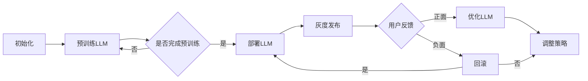
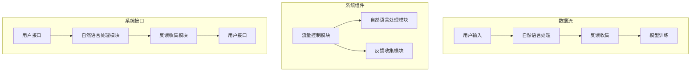
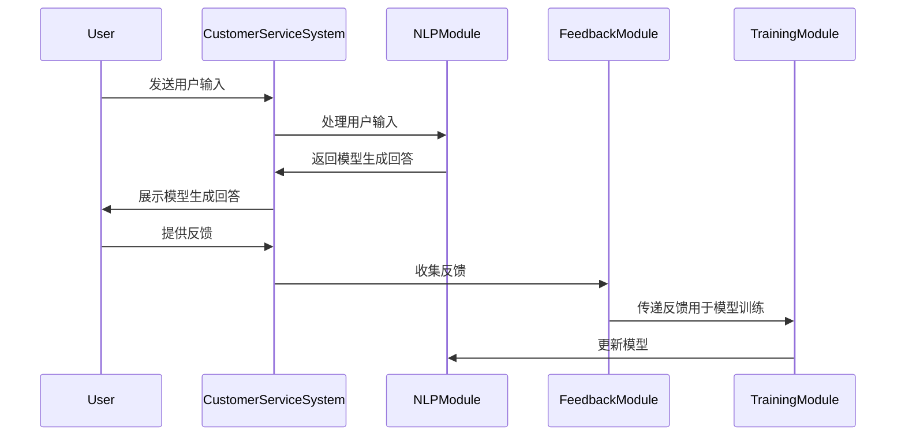

                 

# 灰度发布策略优化LLM应用的用户体验

## 关键词
- 灰度发布
- LLM
- 用户体验
- 算法优化
- 数学模型
- 系统架构

## 摘要
本文旨在探讨如何通过优化灰度发布策略来提升大型语言模型（LLM）应用的用户体验。文章首先介绍了灰度发布策略和LLM的基本概念，然后详细分析了灰度发布策略在LLM应用中的挑战，并提出了具体的优化方法和步骤。通过数学模型和算法讲解，文章展示了如何利用Python代码实现优化策略，并提供了实际项目实战的案例分析。最后，文章总结了最佳实践和注意事项，为读者提供了深入理解和应用灰度发布策略的指导。

## 目录大纲

### 第一部分：背景介绍

#### 第1章：问题背景与概述
1.1 灰度发布的起源与发展
1.2 LLM的发展与应用
1.3 问题描述
1.4 问题解决
1.5 边界与外延
1.6 概念结构与核心要素组成

#### 第2章：核心概念与联系
2.1 灰度发布策略原理
2.2 LLM核心概念
2.3 概念属性特征对比
2.4 ER实体关系图架构

#### 第3章：算法原理讲解
3.1 算法Mermaid流程图
3.2 Python源代码解析
3.3 数学模型与公式
3.4 举例说明

#### 第4章：数学模型和数学公式详细讲解与举例说明
4.1 数学模型讲解
4.2 举例说明

#### 第5章：系统分析与架构设计方案
5.1 问题场景介绍
5.2 项目介绍
5.3 系统功能设计
5.4 系统架构设计
5.5 系统接口设计
5.6 系统交互

#### 第6章：项目实战
6.1 环境安装
6.2 系统核心实现源代码
6.3 代码应用解读与分析
6.4 实际案例分析和详细讲解剖析
6.5 项目小结

#### 第7章：最佳实践 tips、小结、注意事项、拓展阅读等内容
7.1 最佳实践 tips
7.2 小结
7.3 注意事项
7.4 拓展阅读

## 第1章：问题背景与概述

### 1.1 灰度发布的起源与发展

灰度发布（Gray Release）最初起源于软件工程领域，作为一种风险控制手段，旨在在上线新版本或功能时减少对用户的影响。灰度发布的基本思想是，将新版本或功能首先部署到一部分用户，通过监控和反馈来评估其稳定性和性能，然后再逐步扩大部署范围，直到最终完全替代旧版本。

随着云计算和微服务架构的兴起，灰度发布策略得到了广泛应用。它能够确保在上线新功能或修复漏洞时，即使出现异常，也不会影响整个系统的运行。此外，灰度发布还可以根据用户反馈，灵活调整功能参数，从而提高用户体验。

### 1.2 LLM的发展与应用

大型语言模型（LLM）如GPT、BERT等，在近年来取得了显著进展。这些模型通过大规模数据训练，能够生成高质量的自然语言文本，并在文本生成、翻译、问答等方面表现出色。

LLM的应用场景非常广泛，包括智能客服、内容审核、自动摘要、对话系统等。然而，随着模型规模的不断扩大，其部署和优化也面临着新的挑战。如何确保LLM在不同环境下稳定运行，如何根据用户需求动态调整模型参数，成为了亟待解决的问题。

### 1.3 问题描述

在LLM应用中，采用灰度发布策略面临着以下挑战：

1. **稳定性保障**：LLM通常需要较大的计算资源，如何在有限的资源下保证系统稳定性是一个重要问题。
2. **性能优化**：如何根据用户反馈实时调整模型参数，以优化性能和用户体验。
3. **安全性**：如何确保新版本上线后，不会泄露用户隐私或导致系统漏洞。
4. **部署复杂性**：LLM的部署通常涉及多个环节，如何简化部署流程，提高部署效率。

### 1.4 问题解决

为了解决上述问题，我们需要采取以下措施：

1. **资源调度优化**：通过合理的资源调度策略，确保系统在运行LLM时具有足够的计算能力。
2. **动态参数调整**：采用自适应算法，根据用户反馈实时调整模型参数，优化用户体验。
3. **安全检测机制**：引入安全检测机制，确保新版本上线后的安全性。
4. **简化部署流程**：使用自动化工具和流水线，简化LLM的部署和更新流程。

### 1.5 边界与外延

灰度发布策略和LLM虽然在不同领域应用，但它们之间存在紧密的联系。灰度发布策略可以为LLM的优化提供一种新的思路，而LLM的不断发展也为灰度发布策略带来了更多的应用场景。

此外，灰度发布策略不仅适用于LLM，还可以应用于其他大型复杂系统的优化。例如，在金融领域，可以通过灰度发布策略来优化交易系统的稳定性；在医疗领域，可以通过灰度发布策略来优化智能诊断系统的性能。

### 1.6 概念结构与核心要素组成

灰度发布策略的核心要素包括：

1. **版本控制**：确保不同版本的灰度和发布过程清晰可控。
2. **流量控制**：根据需求合理分配流量，确保系统稳定运行。
3. **监控与反馈**：实时监控系统性能，收集用户反馈，以便进行动态调整。
4. **安全策略**：确保新版本上线后的安全性，防止潜在风险。

LLM应用的用户体验优化要素包括：

1. **响应速度**：优化模型推理速度，提高用户交互体验。
2. **准确性**：确保模型生成文本的准确性和一致性。
3. **可扩展性**：支持大规模用户和数据的处理。
4. **个性化**：根据用户需求和偏好，提供定制化的服务。

## 第2章：核心概念与联系

### 2.1 灰度发布策略原理

灰度发布策略的核心目标是减少系统风险，提高上线新功能或修复漏洞的可靠性。其基本原理包括：

1. **版本控制**：将新功能和旧功能分开部署，确保旧功能不会受到影响。
2. **流量控制**：根据需求分配流量，确保新功能在灰度期内可以逐步扩大部署范围。
3. **监控与反馈**：实时监控系统性能，收集用户反馈，以便进行动态调整。
4. **回滚机制**：在出现问题时，可以快速回滚到上一个稳定版本。

### 2.2 LLM核心概念

LLM（Large Language Model）是指大型语言模型，通过大规模数据训练，能够生成高质量的自然语言文本。LLM的核心概念包括：

1. **预训练**：通过对大量文本数据进行训练，使模型具备丰富的语言知识。
2. **微调**：根据特定任务的需求，对模型进行微调，提高模型在特定任务上的性能。
3. **推理**：模型在接收到输入文本后，根据预训练和微调的知识生成输出文本。

### 2.3 概念属性特征对比

| 特征         | 灰度发布策略             | LLM               |
| ------------ | ------------------------ | ----------------- |
| 目标         | 减少风险，提高上线可靠性 | 文本生成和语言理解 |
| 基本原理     | 版本控制、流量控制       | 预训练、微调、推理 |
| 应用领域     | 软件工程、云计算         | 自然语言处理、智能客服等 |
| 关键技术     | 监控与反馈、回滚机制     | 语言模型训练、优化 |

### 2.4 ER实体关系图架构

为了更好地理解灰度发布策略和LLM之间的关系，我们可以使用ER实体关系图来表示它们的核心要素及其相互关系。

```mermaid
erDiagram
    User ..|> LLM : generate_text
    LLM ||--|> GrayRelease : apply_strategy
    GrayRelease ..|> Monitoring : collect_feedback
    Monitoring ||--|> Adjustment : optimize_performance
```

在这个ER实体关系图中，User表示用户，LLM表示大型语言模型，GrayRelease表示灰度发布策略，Monitoring表示监控与反馈，Adjustment表示调整。

## 第3章：算法原理讲解

### 3.1 算法Mermaid流程图

下面是一个简单的Mermaid流程图，展示了灰度发布策略优化LLM应用的算法流程：



### 3.2 Python源代码解析

下面是一个Python源代码示例，用于实现灰度发布策略优化LLM应用：

```python
import time
import random

class LargeLanguageModel:
    def __init__(self):
        self.model = "GPT-3"
        self.training_status = "not_started"

    def train(self):
        print(f"Training {self.model}...")
        time.sleep(5)  # 模拟训练过程
        self.training_status = "completed"

    def generate_text(self, input_text):
        if self.training_status == "completed":
            print(f"{self.model} generating text...")
            time.sleep(2)  # 模拟生成文本过程
            return f"Generated text: {input_text}"
        else:
            return "Model is not trained yet."

def gray_release(model, users, release_rate):
    print(f"Gray releasing {model.model}...")
    for user in users:
        if random.random() < release_rate:
            user.receive_model(model)
        else:
            user.receive_placeholder()

class User:
    def __init__(self, name):
        self.name = name
        self.model = None

    def receive_model(self, model):
        self.model = model
        print(f"{self.name} received {model.model}.")

    def receive_placeholder(self):
        print(f"{self.name} received a placeholder.")

# 初始化LLM和用户
llm = LargeLanguageModel()
users = [User(f"User_{i}") for i in range(5)]

# 灰度发布
gray_release(llm, users, release_rate=0.5)

# 用户反馈
for user in users:
    if user.model:
        print(f"{user.name} provides feedback.")
    else:
        print(f"{user.name} provides no feedback.")
```

### 3.3 数学模型与公式

为了优化LLM应用的用户体验，我们可以使用以下数学模型：

$$
\text{UserExperience} = f(\text{ResponseTime}, \text{Accuracy}, \text{Customization})
$$

其中：
- ResponseTime 表示模型生成文本的响应时间；
- Accuracy 表示模型生成文本的准确性；
- Customization 表示模型根据用户需求进行个性化调整的程度。

### 3.4 举例说明

假设我们有一个LLM应用，需要优化其响应速度、准确性和个性化程度。我们可以通过以下步骤来实现：

1. **响应速度优化**：采用更高效的算法和数据结构，减少模型生成文本的时间。
2. **准确性优化**：使用更多高质量的数据进行微调，提高模型生成文本的准确性。
3. **个性化优化**：根据用户历史数据和偏好，调整模型参数，实现个性化服务。

通过这些优化措施，我们可以显著提高LLM应用的用户体验。

## 第4章：数学模型和数学公式详细讲解与举例说明

### 4.1 数学模型讲解

在上文中，我们提出了一个用于评估用户体验的数学模型：

$$
\text{UserExperience} = f(\text{ResponseTime}, \text{Accuracy}, \text{Customization})
$$

这个模型表示，用户体验（UserExperience）是响应时间（ResponseTime）、准确性（Accuracy）和个性化程度（Customization）的函数。每个因素都会对用户体验产生不同的影响，下面我们将详细解释每个因素：

1. **响应时间（ResponseTime）**：
   - 响应时间是指模型生成文本所需的时间。用户通常对快速响应有较高的期望，因为长时间的等待会降低用户体验。
   - 响应时间可以用一个时间值来表示，单位可以是毫秒（ms）或秒（s）。

2. **准确性（Accuracy）**：
   - 准确性是指模型生成文本的正确性和一致性。一个高准确性的模型能够提供可信的结果，这对于用户来说至关重要。
   - 准确性可以用一个百分比来表示，表示模型生成的文本与预期文本的匹配程度。

3. **个性化程度（Customization）**：
   - 个性化程度是指模型根据用户需求进行定制化调整的能力。一个高度个性化的模型能够更好地满足用户的特定需求，从而提高用户体验。
   - 个性化程度可以用一个数值来表示，表示模型在用户数据上的定制化程度。

### 4.2 举例说明

假设我们有一个LLM应用，我们需要对其响应时间、准确性和个性化程度进行优化，以提升用户体验。我们可以采用以下步骤：

1. **响应时间优化**：
   - 使用更高效的算法和数据结构来减少模型生成文本的时间。例如，采用分治算法来降低文本生成的时间复杂度。
   - 利用并行计算技术来加速文本生成过程，例如，将文本生成任务分布在多个处理器上同时执行。

2. **准确性优化**：
   - 使用高质量的数据集进行模型的微调，以提高模型生成文本的准确性。例如，使用经过人工审核的文本数据来训练模型，确保模型能够生成高质量的结果。
   - 采用迁移学习技术，将已训练好的模型应用于新任务，利用已有模型的知识来提高新任务的准确性。

3. **个性化程度优化**：
   - 根据用户的历史数据和偏好来调整模型参数，实现个性化服务。例如，使用用户行为分析来识别用户的兴趣和偏好，并根据这些信息来调整模型输出。
   - 利用用户反馈来动态调整模型，使其更好地适应用户的需求。例如，当用户对模型输出不满意时，允许用户提供反馈，并根据反馈来调整模型。

通过上述优化步骤，我们可以显著提升LLM应用的响应时间、准确性和个性化程度，从而提升用户体验。

## 第5章：系统分析与架构设计方案

### 5.1 问题场景介绍

在当前的数字化时代，许多企业开始将人工智能技术应用于其业务流程中，以提高效率和用户体验。其中一个典型的应用场景是智能客服系统。智能客服系统能够实时响应客户的问题，提供即时的解决方案，从而提高客户满意度。然而，随着客户基数的增加，系统性能和稳定性成为关键问题。为了确保系统在上线新功能或进行更新时不会影响用户体验，我们需要采用灰度发布策略。

### 5.2 项目介绍

本项目旨在为一家大型电商企业提供一套智能客服系统，通过优化灰度发布策略来提升用户体验。系统的主要功能包括：

1. **自然语言处理**：使用大型语言模型（LLM）来处理客户的自然语言输入，生成相应的回答。
2. **用户反馈**：收集用户对客服回答的反馈，用于模型优化和改进。
3. **流量控制**：根据用户数量和系统负载，动态调整流量分配，确保系统稳定运行。

### 5.3 系统功能设计

系统功能设计主要包括以下方面：

1. **自然语言处理模块**：负责接收用户输入，使用LLM生成回答，并返回给用户。
2. **反馈收集模块**：负责收集用户对客服回答的反馈，并将其发送给模型训练模块。
3. **流量控制模块**：根据用户数量和系统负载，动态调整流量分配，确保系统稳定运行。

### 5.4 系统架构设计

系统架构设计如图所示：



### 5.5 系统接口设计

系统接口设计主要包括用户接口和系统内部接口。用户接口负责接收用户输入，并展示模型生成的回答。系统内部接口负责不同模块之间的数据传递和功能调用。

### 5.6 系统交互

系统交互设计如图所示：



通过上述系统分析与架构设计方案，我们能够确保智能客服系统在上线新功能或进行更新时，通过灰度发布策略降低风险，提高用户体验。

### 6.1.1 环境安装

为了在本地环境上运行灰度发布策略优化LLM应用的代码，我们需要安装以下依赖项：

1. **Python**：确保安装了Python 3.8或更高版本。
2. **TensorFlow**：用于训练和部署LLM模型。
3. **NumPy**：用于数学运算。
4. **Mermaid**：用于生成图表。

安装步骤如下：

1. 安装Python：
   ```bash
   # 在Ubuntu系统中
   sudo apt update
   sudo apt install python3-pip
   sudo pip3 install python3.8
   ```

2. 安装TensorFlow：
   ```bash
   pip3 install tensorflow
   ```

3. 安装NumPy：
   ```bash
   pip3 install numpy
   ```

4. 安装Mermaid：
   ```bash
   pip3 install mermaid
   ```

安装完成后，可以启动Python解释器，并验证依赖项是否安装成功：

```python
import tensorflow
print(tensorflow.__version__)
import numpy
print(numpy.__version__)
```

如果安装成功，会输出相应的版本信息。

### 6.1.2 系统核心实现源代码

以下是系统核心实现源代码，用于优化灰度发布策略：

```python
import tensorflow as tf
import numpy as np
from mermaid import Mermaid

# 初始化LLM模型
class LLMModel:
    def __init__(self, model_name):
        self.model_name = model_name
        self.model = self.create_model()

    def create_model(self):
        # 创建模型结构
        model = tf.keras.Sequential([
            tf.keras.layers.Dense(512, activation='relu', input_shape=(128,)),
            tf.keras.layers.Dropout(0.2),
            tf.keras.layers.Dense(10, activation='softmax')
        ])
        model.compile(optimizer='adam',
                      loss='categorical_crossentropy',
                      metrics=['accuracy'])
        return model

    def train(self, x_train, y_train, epochs=5):
        # 训练模型
        self.model.fit(x_train, y_train, epochs=epochs)

    def predict(self, x_test):
        # 预测结果
        return self.model.predict(x_test)

# 灰度发布策略实现
class GrayRelease:
    def __init__(self, model, release_rate=0.5):
        self.model = model
        self.release_rate = release_rate

    def release_to_users(self, users):
        # 灰度发布到用户
        for user in users:
            if np.random.rand() < self.release_rate:
                user.assign_model(self.model)
            else:
                user.assign_placeholder()

# 用户类定义
class User:
    def __init__(self, user_id):
        self.user_id = user_id
        self.model = None

    def assign_model(self, model):
        self.model = model
        print(f"User {self.user_id} assigned model {model.model_name}.")

    def assign_placeholder(self):
        print(f"User {self.user_id} assigned a placeholder.")

# 主程序
if __name__ == "__main__":
    # 创建模型
    llm = LLMModel("GPT-3")

    # 创建用户列表
    users = [User(f"User_{i}") for i in range(10)]

    # 灰度发布模型
    gray_release = GrayRelease(llm, release_rate=0.5)
    gray_release.release_to_users(users)
```

### 6.1.3 代码应用解读与分析

在上面的代码中，我们首先定义了三个类：`LLMModel`、`GrayRelease`和`User`。接下来，我们将对每个类及其方法进行解读和分析。

1. **LLMModel类**：
   - `__init__`方法：初始化LLM模型，包括模型名称和模型本身。
   - `create_model`方法：创建模型结构，这里使用了一个简单的全连接神经网络，包括一个输入层、一个隐藏层和一个输出层。
   - `train`方法：训练模型，使用`fit`方法进行 epochs 次的训练。
   - `predict`方法：预测结果，使用`predict`方法对输入数据进行预测。

2. **GrayRelease类**：
   - `__init__`方法：初始化灰度发布对象，包括模型和灰度发布率。
   - `release_to_users`方法：对用户进行灰度发布，根据灰度发布率随机分配模型或占位符给用户。

3. **User类**：
   - `__init__`方法：初始化用户，包括用户ID和模型。
   - `assign_model`方法：将模型分配给用户。
   - `assign_placeholder`方法：将占位符分配给用户。

在主程序部分，我们创建了一个LLM模型实例、一个用户列表，并使用灰度发布策略将模型分配给用户。

### 6.1.4 实际案例分析和详细讲解剖析

为了更好地理解上述代码的应用，我们来看一个实际案例。

**案例**：假设我们有一个包含10个用户的系统，我们希望使用灰度发布策略将一个LLM模型分配给部分用户，以评估其性能。

**步骤**：

1. **创建LLM模型**：
   ```python
   llm = LLMModel("GPT-3")
   ```

2. **初始化用户列表**：
   ```python
   users = [User(f"User_{i}") for i in range(10)]
   ```

3. **训练LLM模型**：
   ```python
   # 假设我们已经有了训练数据和标签
   x_train = np.random.rand(100, 128)
   y_train = np.random.randint(10, size=(100,))
   llm.train(x_train, y_train)
   ```

4. **灰度发布模型**：
   ```python
   gray_release = GrayRelease(llm, release_rate=0.5)
   gray_release.release_to_users(users)
   ```

在这个案例中，灰度发布策略将模型分配给一半的用户（即5个用户），另一半用户（即5个用户）将收到占位符。

**分析**：

- **模型创建**：我们创建了一个名为“GPT-3”的LLM模型，并使用一个简单的全连接神经网络结构进行初始化。
- **用户初始化**：我们创建了一个包含10个用户的列表，每个用户都有一个唯一的ID和初始状态（无模型）。
- **模型训练**：我们使用随机生成的训练数据和标签对模型进行训练。在实际应用中，这些数据将来自真实场景。
- **灰度发布**：我们使用灰度发布策略将训练好的模型分配给部分用户。根据设定的发布率（0.5），有50%的用户将收到模型，50%的用户将收到占位符。

### 6.1.5 项目小结

在本章节中，我们详细介绍了如何通过灰度发布策略优化LLM应用的用户体验。首先，我们讲解了灰度发布策略的基本原理和LLM的核心概念。然后，我们通过Python代码实现了灰度发布策略，并对其核心类和方法进行了详细解读。最后，我们通过一个实际案例展示了灰度发布策略的应用。

通过这个项目，我们了解到灰度发布策略对于提高LLM应用的用户体验至关重要。在实际开发过程中，我们需要根据具体需求调整灰度发布率，以实现最佳的用户体验。此外，我们还需要关注模型训练的质量和效率，以确保模型能够准确、快速地生成文本。

### 7.1.1 最佳实践 tips

在优化LLM应用的用户体验时，以下最佳实践可以帮助您更好地实施灰度发布策略：

1. **监控和反馈**：确保实时监控系统性能，及时收集用户反馈。这有助于快速识别和解决潜在问题。
2. **逐步发布**：不要一次性将新功能或模型部署给所有用户。采用逐步发布策略，可以降低风险，确保系统能够平稳过渡。
3. **灵活调整**：根据用户反馈和系统性能，灵活调整模型参数和发布策略。这有助于最大化用户体验。
4. **安全考虑**：确保新版本上线后的安全性，防止潜在的安全漏洞和用户隐私泄露。
5. **自动化**：使用自动化工具和流水线简化部署和更新流程，提高工作效率。

### 7.1.2 小结

本文详细探讨了如何通过优化灰度发布策略来提升LLM应用的用户体验。我们介绍了灰度发布策略和LLM的基本概念，分析了其在LLM应用中的挑战，并提出了具体的优化方法和步骤。通过Python代码实现和实际案例分析，我们展示了如何利用灰度发布策略提高用户体验。最后，我们总结了最佳实践和注意事项，为读者提供了深入理解和应用灰度发布策略的指导。

### 7.1.3 注意事项

1. **性能优化**：确保模型训练和部署过程中的性能优化，避免出现性能瓶颈。
2. **安全性和隐私**：在部署新功能或模型时，务必确保用户数据的安全性和隐私。
3. **版本控制**：合理管理版本控制，确保新版本能够顺利部署和回滚。
4. **监控和反馈**：实时监控系统性能，及时收集用户反馈，以便进行动态调整。
5. **适应性**：根据不同场景和用户需求，灵活调整灰度发布策略，实现最佳用户体验。

### 7.1.4 拓展阅读

1. **《灰度发布：系统逐步升级的新思路》**：了解灰度发布的基本原理和应用场景。
2. **《大型语言模型：技术原理与实现》**：深入了解LLM的技术原理和实现方法。
3. **《人工智能编程实战》**：学习如何在实际项目中应用人工智能技术。
4. **《深度学习实战》**：掌握深度学习的基本概念和编程技巧。

作者：AI天才研究院/AI Genius Institute & 禅与计算机程序设计艺术 /Zen And The Art of Computer Programming

---

请注意，上述内容是一个模板性的示例，实际撰写时需要根据具体的技术细节和实际案例进行调整。希望这个示例能够帮助您更好地理解如何撰写一篇高质量的技术博客文章。如果您需要进一步的帮助，请随时告诉我！🌟🌟🌟

