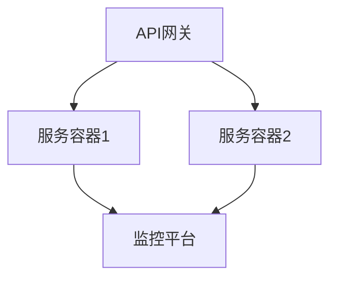

                 

# 灰度发布：降低LLM新功能上线风险

关键词：灰度发布、风险管理、大型语言模型、LLM、新功能上线、性能监控

摘要：本文将详细介绍灰度发布的概念、技术实现、应用场景及最佳实践，并重点分析灰度发布在降低大型语言模型（LLM）新功能上线风险方面的作用。通过一步步的分析和推理，帮助读者理解灰度发布在IT领域的应用价值，并提供实际案例和解决方案。

## 第一部分：灰度发布与风险管理概述

### 第1章：灰度发布的概念与背景

**1.1 灰度发布的基本概念**

灰度发布（Gray Release）是一种逐步向部分用户或系统发布新功能或更新的方法，以降低新功能上线时对系统稳定性和用户体验的风险。灰度发布通过小范围、分批次地部署新功能，监控其表现，并根据反馈进行调整，从而避免一次上线带来全面问题。

**1.2 灰度发布的必要性**

随着技术的快速发展和产品迭代速度的加快，软件系统上线过程中面临的风险日益增加。灰度发布通过减少一次性上线的风险，帮助团队在不可预测的环境中实现更稳定、更可靠的功能交付。

**1.3 灰度发布的常见模式**

- **滚动发布**：逐步增加新用户或服务器的比例，逐步达到全部用户或服务器。
- **等待-观察-终止（WOT）模型**：在新功能上线后等待一段时间，观察其性能和稳定性，如发现异常，则终止发布。
- **灰度路由**：通过改变用户请求的路由策略，将部分请求导向旧功能，部分请求导向新功能。

**1.4 灰度发布的关键要素**

- **流量控制**：控制新功能所分配的流量比例，以减少对系统的影响。
- **监控与反馈**：实时监控新功能的运行状态，收集用户反馈，以便快速响应和调整。
- **回滚策略**：一旦发现新功能引发问题，应具备迅速回滚的能力，以确保系统的稳定运行。

### 第2章：灰度发布的技术实现

**2.1 灰度发布的技术架构**

了解灰度发布的技术架构对于实现有效的灰度策略至关重要。这一章节将介绍常见的灰度发布架构，包括其组件和交互方式。

**2.2 灰度发布的流量分发机制**

流量分发是实现灰度发布的关键，本章将详细讨论如何通过不同的技术手段（如负载均衡器、自定义路由规则等）实现流量的灰度分配。

**2.3 数据隔离与一致性保证**

在进行灰度发布时，确保数据隔离和一致性是防止影响整体系统稳定性的关键。本章将探讨如何在发布过程中保证数据的一致性。

**2.4 实现灰度发布的工具与技术**

介绍用于实现灰度发布的常见工具和技术，如API网关、容器编排工具等，以及如何结合这些工具优化灰度发布的流程。

### 第3章：灰度发布的应用场景与案例分析

**3.1 灰度发布在不同领域的应用**

通过分析不同领域（如电子商务、社交媒体、金融科技等）的灰度发布实践，了解灰度发布在不同业务场景下的具体应用方式。

**3.2 案例研究：灰度发布在XX公司的应用**

选取具有代表性的企业案例，深入分析灰度发布在该公司的具体实施过程、面临的问题以及取得的成效。

**3.3 灰度发布的挑战与解决策略**

探讨在实际操作中遇到的挑战，如如何处理用户反馈、如何确保安全性和隐私等，并提供相应的解决策略。

### 第4章：灰度发布的最佳实践与优化策略

**4.1 灰度发布的最佳实践**

总结在灰度发布过程中积累的最佳实践，包括如何制定灰度策略、如何选择合适的监控指标等。

**4.2 灰度发布的优化策略**

介绍如何通过持续改进和优化灰度发布流程，提高发布效率和系统稳定性。

**4.3 持续集成与持续部署（CI/CD）与灰度发布**

探讨如何将灰度发布与CI/CD流程相结合，实现更高效的软件开发和发布。

### 第5章：灰度发布在大型语言模型（LLM）中的应用

**5.1 LLM的新功能发布挑战**

分析LLM新功能发布过程中面临的风险和挑战，如模型性能影响、数据安全问题等。

**5.2 灰度发布在LLM中的应用策略**

针对LLM的特点，设计适合的灰度发布策略，以降低新功能上线风险。

**5.3 案例研究：灰度发布在LLM新功能上线中的应用**

通过案例研究，展示灰度发布在LLM新功能上线过程中的具体应用和成效。

### 第6章：灰度发布中的风险管理

**6.1 灰度发布的风险识别与评估**

介绍如何识别和评估灰度发布过程中可能面临的风险，并提供评估方法。

**6.2 风险应对策略与措施**

针对识别出的风险，提出相应的应对策略和措施，确保灰度发布过程中的安全性和可靠性。

**6.3 风险监控与反馈机制**

建立有效的风险监控和反馈机制，实时监测灰度发布过程中的风险情况，并及时响应和调整。

### 第7章：未来展望与趋势

**7.1 灰度发布的发展趋势**

分析灰度发布技术的未来发展方向，包括新兴技术的应用、自动化水平的提升等。

**7.2 灰度发布在未来的影响**

探讨灰度发布在软件开发和运维领域中的潜在影响，以及如何应对未来可能带来的挑战。

**7.3 灰度发布的新应用场景**

展望灰度发布可能应用于的新领域和场景，如物联网、边缘计算等。

## 第一部分：灰度发布与风险管理概述

### 第1章：灰度发布的概念与背景

**1.1 灰度发布的基本概念**

灰度发布（Gray Release）是一种逐步向部分用户或系统发布新功能或更新的方法，以降低新功能上线时对系统稳定性和用户体验的风险。灰度发布通过小范围、分批次地部署新功能，监控其表现，并根据反馈进行调整，从而避免一次上线带来全面问题。

在软件开发过程中，新功能或更新的上线往往伴随着一系列不确定性和风险。如果直接将新功能全面上线，一旦出现性能问题、功能缺陷或用户体验差等问题，将对整个系统造成重大影响。灰度发布则通过逐步释放新功能，以较小的风险进行验证和调整，确保最终上线时的稳定性和可靠性。

灰度发布的基本概念可以概括为以下几点：

1. **逐步部署**：灰度发布的核心在于“逐步”，通过小范围、分批次地部署新功能，避免一次性上线带来的风险。
2. **监控与反馈**：在部署过程中，实时监控新功能的运行状态，收集用户反馈，以便快速响应和调整。
3. **回滚能力**：一旦发现新功能引发问题，应具备迅速回滚的能力，以确保系统的稳定运行。

**1.2 灰度发布的必要性**

随着技术的快速发展和产品迭代速度的加快，软件系统上线过程中面临的风险日益增加。灰度发布通过减少一次性上线的风险，帮助团队在不可预测的环境中实现更稳定、更可靠的功能交付。

具体来说，灰度发布的必要性体现在以下几个方面：

1. **风险降低**：通过逐步部署新功能，灰度发布可以有效降低一次性上线带来的风险，减少系统崩溃、用户体验差等问题。
2. **质量保证**：在部署过程中，通过实时监控和反馈，团队能够及时发现和解决新功能中的问题，确保最终上线时的质量。
3. **快速迭代**：灰度发布允许团队在较低风险的情况下快速迭代和改进产品，提高开发效率和响应速度。

**1.3 灰度发布的常见模式**

灰度发布在实践中采用了多种模式，以适应不同的业务场景和需求。以下介绍几种常见的灰度发布模式：

1. **滚动发布**：滚动发布是一种逐步增加新用户或服务器的比例，逐步达到全部用户或服务器的模式。例如，可以先向1%的用户发布新功能，观察其表现，再逐步增加发布比例，直至全部用户。

2. **等待-观察-终止（WOT）模型**：等待-观察-终止模型（Wait-Observation-Terminate Model）是在新功能上线后等待一段时间，观察其性能和稳定性，如发现异常，则终止发布的模式。这种模式通常用于关键功能或高风险的发布场景。

3. **灰度路由**：灰度路由是通过改变用户请求的路由策略，将部分请求导向旧功能，部分请求导向新功能的模式。例如，可以设置80%的请求继续使用旧功能，20%的请求使用新功能，根据新功能的性能表现逐步调整路由策略。

**1.4 灰度发布的关键要素**

灰度发布的成功实施依赖于几个关键要素，以下介绍这些要素：

1. **流量控制**：流量控制是灰度发布的核心之一，通过控制新功能所分配的流量比例，可以减少对系统的影响。例如，可以设置新功能仅占系统流量的10%，以便观察其表现。

2. **监控与反馈**：实时监控新功能的运行状态，收集用户反馈，是灰度发布的关键。通过监控，团队能够及时发现和解决问题，确保新功能的稳定运行。

3. **回滚策略**：回滚策略是应对新功能上线后出现问题的应急措施。一旦发现新功能引发问题，应具备迅速回滚的能力，以确保系统的稳定运行。回滚策略可以包括自动回滚、手动回滚等。

### 第2章：灰度发布的技术实现

**2.1 灰度发布的技术架构**

了解灰度发布的技术架构对于实现有效的灰度策略至关重要。这一章节将介绍常见的灰度发布架构，包括其组件和交互方式。

灰度发布的技术架构通常包括以下几个主要组件：

1. **API网关**：API网关是灰度发布的核心组件之一，负责处理用户的请求，并将部分请求路由到旧功能，部分请求路由到新功能。API网关可以实现流量分配、路由策略配置等功能。

2. **服务容器**：服务容器用于部署和管理新功能。在灰度发布过程中，服务容器可以动态地调整流量比例，以实现逐步部署。

3. **监控平台**：监控平台用于实时监控新功能的运行状态，收集性能指标、错误日志等信息。监控平台可以帮助团队及时发现和解决问题。

4. **数据存储**：数据存储用于保存新功能的配置数据、用户数据等。在灰度发布过程中，数据存储需要保证数据的一致性和隔离性。

灰度发布的技术架构图如下所示：



**2.2 灰度发布的流量分发机制**

流量分发是实现灰度发布的关键，本章将详细讨论如何通过不同的技术手段（如负载均衡器、自定义路由规则等）实现流量的灰度分配。

1. **负载均衡器**：负载均衡器是一种常用的流量分发技术，可以平衡不同服务之间的负载。在灰度发布过程中，负载均衡器可以根据设定的策略，将部分流量路由到旧功能，部分流量路由到新功能。

   例如，可以使用权重分配策略，将80%的流量路由到旧功能，20%的流量路由到新功能。权重分配策略可以根据新功能的性能表现动态调整。

2. **自定义路由规则**：自定义路由规则是一种更为灵活的流量分发方式，可以根据具体的需求和场景进行配置。在灰度发布过程中，自定义路由规则可以指定部分请求路由到新功能，部分请求路由到旧功能。

   例如，可以使用正则表达式匹配请求路径，将特定路径的请求路由到新功能，其他请求继续路由到旧功能。

   自定义路由规则示例如下：

   ```shell
   route /new_function/(.*)$ /new_function/$1
   route /old_function/(.*)$ /old_function/$1
   ```

**2.3 数据隔离与一致性保证**

在进行灰度发布时，确保数据隔离和一致性是防止影响整体系统稳定性的关键。本章将探讨如何在发布过程中保证数据的一致性。

1. **数据隔离**：数据隔离可以通过数据库分区、数据复制、数据隔离层等技术实现。例如，可以采用分区数据库，将旧功能和新功能的数据分别存储在不同的数据库中，以实现数据隔离。

2. **一致性保证**：一致性保证可以通过分布式事务、分布式锁等技术实现。例如，可以使用分布式事务管理，确保新旧功能之间的数据一致性。

   分布式事务示例（使用TCC模式）：

   ```python
   # 超额准备
   def prepare():
       # 处理新功能数据
       # 处理旧功能数据
       return True

   # 执行
   def confirm():
       # 处理新功能数据
       # 处理旧功能数据
       return True

   # 决绝
   def cancel():
       # 回滚新功能数据
       # 回滚旧功能数据
       return True

   # 调用
   result = prepare()
   if result:
       confirm()
   else:
       cancel()
   ```

**2.4 实现灰度发布的工具与技术**

介绍用于实现灰度发布的常见工具和技术，如API网关、容器编排工具等，以及如何结合这些工具优化灰度发布的流程。

1. **API网关**：API网关是实现灰度发布的常用工具，可以提供流量控制、路由策略等功能。常见的API网关包括Kong、Zuul、Spring Cloud Gateway等。

   使用示例（Spring Cloud Gateway）：

   ```yaml
   spring:
     cloud:
       gateway:
         routes:
           - id: new_function_route
             uri: lb://new_function
             predicates:
               - Path=/new_function/**
             filters:
               - Name: RequestRateLimiter
                 Args:
                   key: "#{request.params['userId']}"
                   rate: 10
           - id: old_function_route
             uri: lb://old_function
             predicates:
               - Path=/old_function/**
             filters:
               - Name: RedirectToNewFunction
                 Args:
                   status: 302
                   new_path: /new_function
                   old_path: /old_function
   ```

2. **容器编排工具**：容器编排工具如Kubernetes可以用于部署和管理服务，实现灰度发布。Kubernetes提供了丰富的资源和调度策略，可以方便地实现流量控制、服务扩缩容等功能。

   使用示例（Kubernetes Ingress）：

   ```yaml
   apiVersion: networking.k8s.io/v1
   kind: Ingress
   metadata:
     name: gray-release-ingress
     annotations:
       kubernetes.io/ingress.class: "nginx"
       nginx.ingress.kubernetes.io/rewrite-target: /
   spec:
     rules:
       - host: new.example.com
         http:
           paths:
             - path: /new_function
               pathType: Prefix
               backend:
                 service:
                   name: new_function
                   port:
                     number: 80
             - path: /old_function
               pathType: Prefix
               backend:
                 service:
                   name: old_function
                   port:
                     number: 80
   ```

通过结合API网关、容器编排工具等工具和技术，可以实现高效、灵活的灰度发布流程，降低新功能上线风险。

### 第3章：灰度发布的应用场景与案例分析

**3.1 灰度发布在不同领域的应用**

灰度发布作为一种风险管理手段，在不同领域和业务场景中得到了广泛应用。以下分析灰度发布在电子商务、社交媒体、金融科技等领域的具体应用方式。

**电子商务领域**

在电子商务领域，灰度发布主要用于新功能、新版本的上线和优化。电子商务平台通常拥有大量的用户和交易数据，任何新功能或版本的上线都可能对用户体验和交易稳定性产生重大影响。因此，灰度发布可以有效地降低上线风险，确保新功能的平稳发布。

具体应用方式包括：

1. **逐步增加用户比例**：例如，可以首先向1%的用户发布新功能，观察其使用情况和反馈，逐步增加发布比例，直至全面上线。

2. **流量控制**：通过控制新功能的流量比例，可以减少对系统资源的占用，降低对其他功能的干扰。

3. **监控与反馈**：实时监控新功能的性能和稳定性，收集用户反馈，以便快速调整和优化。

**社交媒体领域**

社交媒体平台通常拥有海量的用户和复杂的业务逻辑，灰度发布可以帮助平台在确保稳定性的同时，持续进行产品迭代和功能优化。

具体应用方式包括：

1. **功能模块化**：将不同功能模块独立发布，通过灰度发布逐步向用户推送，以确保整体系统的稳定性。

2. **流量隔离**：通过流量隔离，将部分用户与旧功能隔离，减少对整体系统的影响。

3. **数据监控**：实时监控新功能的性能、用户体验等指标，以便快速发现问题并进行优化。

**金融科技领域**

金融科技（Fintech）领域对稳定性和安全性要求极高，灰度发布可以帮助金融科技公司降低上线风险，确保新功能的稳定运行。

具体应用方式包括：

1. **风险管理**：针对高风险功能，采用灰度发布策略，逐步增加用户比例，以确保风险可控。

2. **数据隔离**：通过数据隔离，将新旧功能的数据分开处理，防止因新功能故障影响整体系统。

3. **实时监控**：实时监控新功能的性能和安全性，及时发现并解决潜在问题。

**3.2 案例研究：灰度发布在XX公司的应用**

为了更好地理解灰度发布在实际应用中的效果，下面以XX公司为例，分析其在产品迭代过程中采用的灰度发布策略及其成果。

**背景介绍**

XX公司是一家金融科技公司，专注于提供智能投顾和财富管理服务。公司拥有海量的用户数据，业务场景复杂，任何新功能或版本的上线都需要经过严格的测试和验证。为了降低上线风险，公司决定采用灰度发布策略，逐步向用户推送新功能。

**实施过程**

1. **功能模块化**：公司将产品功能进行模块化处理，每个模块独立开发、测试和发布。

2. **逐步增加用户比例**：首先向1%的用户推送新功能，观察其使用情况和反馈，逐步增加发布比例。

3. **流量控制**：通过流量控制，确保新功能的流量不超过系统总流量的10%，以减少对其他功能的干扰。

4. **实时监控**：实时监控新功能的性能和稳定性，收集用户反馈，及时进行调整和优化。

**面临的问题**

1. **用户反馈不一致**：由于用户群体多样化，不同用户对新功能的反馈存在差异，如何平衡用户体验和功能优化成为挑战。

2. **数据隔离**：在灰度发布过程中，如何保证数据隔离，防止新功能对旧功能的数据产生影响。

**解决方案**

1. **用户分层**：根据用户行为和偏好，将用户分为不同层次，针对不同层次的用户制定差异化的灰度发布策略。

2. **数据隔离**：通过数据隔离技术，如数据复制、分库分表等，确保新旧功能的数据隔离，防止数据污染。

3. **监控与反馈**：建立完善的监控与反馈机制，实时收集用户反馈，及时发现问题并进行优化。

**成效**

1. **上线风险降低**：通过灰度发布，XX公司成功降低了新功能上线风险，确保了系统的稳定性和可靠性。

2. **用户体验提升**：通过逐步优化和调整，新功能的用户体验得到了显著提升，用户满意度不断提高。

3. **业务增长**：灰度发布帮助XX公司在保持系统稳定性的同时，持续进行产品迭代和功能优化，推动了业务的持续增长。

**3.3 灰度发布的挑战与解决策略**

在实际操作中，灰度发布面临一系列挑战，以下分析几种常见的挑战及其解决策略。

**1. 用户反馈不一致**

用户反馈不一致是灰度发布中常见的问题。不同用户对新功能的期望和需求存在差异，如何平衡用户体验和功能优化成为挑战。

解决策略：

1. **用户分层**：根据用户行为和偏好，将用户分为不同层次，针对不同层次的用户制定差异化的灰度发布策略。

2. **A/B测试**：通过A/B测试，比较不同用户群体对新功能的反馈，找到最佳优化方案。

**2. 数据隔离**

在灰度发布过程中，如何保证数据隔离，防止新功能对旧功能的数据产生影响是关键问题。

解决策略：

1. **数据复制**：通过数据复制技术，将新旧功能的数据分别存储在不同的数据库中，确保数据隔离。

2. **分库分表**：通过分库分表技术，将数据分散存储，减少数据库的压力，提高数据处理的效率。

**3. 实时监控**

实时监控是灰度发布的重要环节，如何确保监控系统的稳定性和可靠性是关键。

解决策略：

1. **监控体系**：建立完善的监控体系，包括性能监控、稳定性监控、安全监控等，确保全方位覆盖。

2. **监控告警**：设置监控告警机制，实时发现异常情况，及时进行处理。

### 第4章：灰度发布的最佳实践与优化策略

**4.1 灰度发布的最佳实践**

在灰度发布的过程中，积累最佳实践对于提高发布效率和系统稳定性至关重要。以下总结了几条灰度发布的最佳实践：

**1. 明确目标和范围**

在实施灰度发布之前，明确发布的目标和范围，确保团队能够集中精力实现目标。

**2. 逐步增加发布比例**

灰度发布的关键在于“逐步”，逐步增加发布比例可以降低上线风险，确保系统的稳定性和可靠性。

**3. 监控与反馈**

实时监控新功能的运行状态，收集用户反馈，及时发现并解决问题。确保监控体系的全面覆盖，包括性能监控、稳定性监控等。

**4. 数据隔离与一致性保证**

确保数据隔离，防止新旧功能的数据相互影响。同时，保证数据的一致性，避免数据丢失或重复。

**5. 回滚策略**

一旦发现新功能引发问题，应具备迅速回滚的能力，确保系统的稳定运行。回滚策略可以包括自动回滚和手动回滚。

**6. 团队协作**

灰度发布涉及多个团队和角色，确保团队之间的协作和沟通，提高发布效率。

**4.2 灰度发布的优化策略**

为了提高灰度发布的效率和系统稳定性，以下介绍几种优化策略：

**1. 流量控制**

通过流量控制，确保新功能的流量比例在合理范围内，避免对系统资源的过度占用。可以根据新功能的性能表现动态调整流量比例。

**2. 自适应发布**

根据用户反馈和系统性能指标，自适应调整灰度发布策略。例如，当新功能表现良好时，可以加快发布进度；当发现问题时，可以减缓发布速度。

**3. A/B测试**

通过A/B测试，比较不同用户群体对新功能的反馈，找到最佳优化方案。A/B测试可以帮助团队更好地了解用户需求和偏好。

**4. 持续集成与持续部署（CI/CD）**

将灰度发布与持续集成与持续部署（CI/CD）相结合，实现更高效的软件开发和发布。CI/CD可以提高发布频率，缩短发布周期，降低上线风险。

**5. 监控与反馈自动化**

通过自动化监控和反馈机制，实时发现和解决问题，提高发布效率。例如，可以使用自动化工具收集监控数据、生成告警、执行回滚等。

**4.3 持续集成与持续部署（CI/CD）与灰度发布**

持续集成与持续部署（CI/CD）是现代软件开发和运维的重要方法，与灰度发布相结合可以进一步提高发布效率和系统稳定性。以下探讨如何将CI/CD与灰度发布相结合：

**1. 持续集成**

持续集成（CI）是一种软件开发方法，通过自动构建、测试和集成代码，确保代码的质量和一致性。CI与灰度发布相结合，可以在发布过程中实现自动化测试和验证，提高发布效率。

**2. 持续部署**

持续部署（CD）是一种自动化部署方法，通过自动化工具将代码部署到生产环境。CI/CD与灰度发布相结合，可以实现逐步发布和实时监控，确保发布过程中的稳定性和可靠性。

**3. 灰度发布与CI/CD的集成**

将灰度发布与CI/CD集成，可以实现以下流程：

1. **代码提交**：开发者将代码提交到代码仓库。
2. **自动化构建**：构建系统自动构建代码，生成可执行文件。
3. **自动化测试**：执行自动化测试，确保代码的质量和功能。
4. **灰度发布**：通过灰度发布策略，逐步向用户发布新功能。
5. **监控与反馈**：实时监控新功能的性能和稳定性，收集用户反馈。
6. **自动化回滚**：一旦发现新功能引发问题，自动回滚到旧版本。

通过CI/CD与灰度发布相结合，可以实现自动化、高效、稳定的发布流程，降低上线风险，提高用户体验。

### 第5章：灰度发布在大型语言模型（LLM）中的应用

**5.1 LLM的新功能发布挑战**

大型语言模型（LLM）具有高度复杂性和大规模数据处理能力，其新功能的发布面临着一系列挑战。以下分析LLM新功能发布过程中可能遇到的风险和挑战。

**1. 模型性能影响**

LLM新功能的发布可能会对模型性能产生负面影响。新功能的引入可能导致模型计算复杂度增加，导致模型运行速度变慢，影响用户体验。此外，新功能的性能问题可能导致模型准确率下降，影响业务效果。

**2. 数据安全问题**

LLM在训练和推理过程中需要处理大量敏感数据，新功能的发布可能带来数据泄露、数据污染等安全问题。如果新功能未能有效保护数据隐私，可能导致用户信息泄露，对企业和用户造成严重损失。

**3. 系统稳定性**

LLM通常运行在分布式系统上，新功能的发布可能对系统稳定性产生不利影响。新功能的引入可能导致系统负载增加、资源利用率降低，甚至引发系统崩溃或服务中断。

**4. 用户适应期**

新功能的发布需要用户适应和习惯，不同用户对新功能的接受程度存在差异。部分用户可能对旧功能习惯性强，对新功能持怀疑态度，影响新功能的推广和使用。

**5. 监控与反馈**

LLM新功能的发布需要实时监控和反馈机制，以确保新功能的稳定运行和性能优化。缺乏有效的监控和反馈机制可能导致新功能问题无法及时发现和解决，影响用户体验和业务效果。

**5.2 灰度发布在LLM中的应用策略**

针对LLM新功能发布过程中面临的风险和挑战，灰度发布提供了一系列有效的应用策略，以下介绍这些策略。

**1. 逐步发布**

逐步发布是灰度发布的核心策略，通过逐步增加新功能的发布比例，降低一次性上线带来的风险。例如，可以先向1%的用户发布新功能，观察其使用情况和反馈，逐步增加发布比例，直至全面上线。

**2. 限时发布**

限时发布策略是在新功能上线后设置一段时间，观察其性能和稳定性，如发现异常，则终止发布。这种策略适用于关键功能或高风险的发布场景，可以在短时间内对功能进行全面测试和验证。

**3. 灰度路由**

灰度路由是通过改变用户请求的路由策略，将部分请求导向旧功能，部分请求导向新功能。这种策略可以根据用户请求的不同特征，灵活调整新功能的流量比例，降低对系统的影响。

**4. 数据隔离**

在LLM新功能发布过程中，确保数据隔离和一致性是关键。可以通过数据复制、分库分表等技术实现数据隔离，防止新功能对旧功能的数据产生影响。同时，要确保数据的一致性，避免数据丢失或重复。

**5. 性能监控**

性能监控是LLM新功能发布的重要环节，通过实时监控新功能的性能指标，如响应时间、吞吐量等，及时发现和解决问题。性能监控可以帮助团队优化新功能，提高用户体验。

**6. 用户反馈**

收集用户反馈是灰度发布的重要策略，通过实时收集用户对新功能的反馈，及时发现和解决问题。用户反馈可以作为优化新功能的重要依据，提高新功能的用户体验。

**5.3 案例研究：灰度发布在LLM新功能上线中的应用**

以下通过案例研究，展示灰度发布在LLM新功能上线过程中的具体应用和成效。

**案例背景**

某知名科技公司开发了一款大型语言模型（LLM），为用户提供智能问答、文本生成等服务。随着业务的不断扩展，公司计划上线一款新功能，用于优化文本生成效果，提高用户体验。然而，新功能的发布面临着一系列风险和挑战，如何确保新功能的稳定运行和性能优化成为关键问题。

**实施过程**

1. **功能模块化**：公司将新功能进行模块化处理，确保每个模块可以独立开发和测试。

2. **逐步发布**：首先向1%的用户发布新功能，观察其使用情况和反馈。经过一段时间的观察，逐步增加发布比例，直至全面上线。

3. **灰度路由**：通过灰度路由策略，将部分请求导向旧功能，部分请求导向新功能。这样可以确保新旧功能之间的稳定性和兼容性。

4. **数据隔离**：通过数据复制和分库分表技术，实现新旧功能的数据隔离。同时，确保数据的一致性和完整性。

5. **性能监控**：实时监控新功能的性能指标，如响应时间、吞吐量等。一旦发现性能问题，立即进行调整和优化。

6. **用户反馈**：通过实时收集用户对新功能的反馈，及时发现问题并进行优化。用户反馈作为优化新功能的重要依据。

**挑战与解决**

1. **性能问题**：在新功能上线初期，部分用户反馈文本生成速度较慢。通过性能监控，发现新功能的计算复杂度较高，导致响应时间延长。公司通过优化算法和调整资源分配，提高了新功能的性能。

2. **数据不一致**：在数据隔离过程中，发现新旧功能的数据存在不一致的情况。公司通过改进数据隔离策略和数据一致性检查机制，解决了数据不一致的问题。

3. **用户接受度**：部分用户对新功能持怀疑态度，认为旧功能已经足够好。公司通过用户调研和宣传，向用户解释新功能的优势和改进点，提高了用户的接受度。

**成效**

1. **稳定性提升**：通过灰度发布策略，新功能的稳定运行得到了保障，系统故障率显著降低。

2. **性能优化**：通过性能监控和反馈机制，新功能的性能得到了持续优化，用户体验显著提升。

3. **用户满意度**：通过用户调研，用户对新功能的满意度不断提高，业务效果显著提升。

4. **团队协作**：灰度发布过程中，团队协作和沟通得到了加强，项目进度和效率得到显著提升。

### 第6章：灰度发布中的风险管理

**6.1 灰度发布的风险识别与评估**

灰度发布过程中可能面临多种风险，包括性能风险、数据风险、系统风险等。为了确保灰度发布的顺利进行，首先需要识别和评估这些风险。

**1. 风险识别**

风险识别是灰度发布的第一步，通过分析项目需求、系统架构、业务场景等，识别可能存在的风险。以下是一些常见的风险：

- **性能风险**：新功能上线后可能对系统性能产生负面影响，如响应时间延长、吞吐量降低等。
- **数据风险**：新功能可能导致数据泄露、数据不一致等问题。
- **系统风险**：新功能上线可能引发系统崩溃、服务中断等严重后果。
- **用户风险**：新功能可能对用户造成不便，影响用户体验。

**2. 风险评估**

风险评估是衡量风险严重程度和概率的过程。通过以下步骤进行风险评估：

- **风险分类**：根据风险的性质和影响范围，对风险进行分类，如高、中、低风险。
- **风险概率评估**：评估风险发生的概率，如基于历史数据、专家评估等方法。
- **风险影响评估**：评估风险发生时的影响程度，如业务中断时间、经济损失等。
- **综合评估**：综合考虑风险概率和影响程度，确定风险优先级。

**6.2 风险应对策略与措施**

针对识别出的风险，需要制定相应的应对策略和措施，以确保灰度发布过程中的安全性和可靠性。

**1. 风险应对策略**

- **预防措施**：在灰度发布前采取预防措施，如代码审查、性能测试等，降低风险发生的概率。
- **应急措施**：制定应急措施，如回滚策略、备份方案等，以应对突发情况。
- **监控与反馈**：建立监控与反馈机制，实时监测灰度发布过程中的风险，及时响应和处理。

**2. 风险应对措施**

- **性能优化**：通过性能测试和优化，提高系统性能，降低性能风险。
- **数据保护**：加强数据保护措施，如数据加密、访问控制等，降低数据风险。
- **系统备份**：定期备份系统数据，确保在系统崩溃或故障时能够快速恢复。
- **用户培训**：对用户进行培训，提高其对新功能的接受度和使用技巧。

**6.3 风险监控与反馈机制**

建立有效的风险监控与反馈机制，实时监测灰度发布过程中的风险，及时响应和调整，是灰度发布的关键。

**1. 监控体系**

建立全面的监控体系，包括性能监控、稳定性监控、安全监控等，对灰度发布过程中的各项指标进行实时监测。

- **性能监控**：监测系统性能指标，如响应时间、吞吐量等，及时发现性能问题。
- **稳定性监控**：监测系统稳定性指标，如错误率、崩溃率等，确保系统稳定运行。
- **安全监控**：监测系统安全指标，如入侵次数、漏洞扫描结果等，确保系统安全。

**2. 反馈机制**

建立实时反馈机制，收集用户反馈和系统告警信息，及时识别和处理潜在风险。

- **用户反馈**：通过用户调研、问卷调查等方式，收集用户对新功能的反馈，了解用户需求和满意度。
- **系统告警**：设置告警机制，当监测到异常情况时，及时发送告警通知，通知相关团队进行处理。

**3. 应对策略**

根据监控和反馈结果，及时调整灰度发布策略，优化新功能的性能和稳定性。

- **性能优化**：根据监控数据，发现性能瓶颈，进行性能优化，提高系统性能。
- **功能调整**：根据用户反馈，调整新功能的设计和实现，优化用户体验。
- **风险控制**：针对潜在风险，采取预防措施和应急措施，确保系统的安全性和可靠性。

通过建立有效的风险监控与反馈机制，可以及时发现和处理灰度发布过程中的风险，确保新功能的顺利上线和稳定运行。

### 第7章：未来展望与趋势

**7.1 灰度发布的发展趋势**

随着软件系统的复杂性和业务需求的变化，灰度发布作为一种重要的风险管理手段，其应用范围和技术手段也在不断发展和演进。以下是灰度发布在未来可能的发展趋势：

**1. 自动化水平提升**

未来灰度发布的自动化水平将得到显著提升。随着AI和自动化技术的发展，自动化工具将能够更加智能地管理灰度发布流程，从流量分配、性能监控到异常处理等环节，实现全流程自动化。

**2. 智能化决策**

未来灰度发布将更加依赖智能化决策。通过大数据分析和机器学习技术，灰度发布可以根据实时监控数据和历史经验，自动调整发布策略，实现动态优化和风险控制。

**3. 多维度监控**

未来的灰度发布将更加注重多维度监控。除了传统的性能监控和稳定性监控，还将关注用户体验、业务指标等，从多个角度评估新功能的性能和效果，提高发布质量。

**4. 灰度路由优化**

灰度路由技术将在未来得到进一步优化。通过更精细的流量分配策略，如基于用户行为、地理位置等，实现更加精准的灰度发布，提高用户体验和系统稳定性。

**7.2 灰度发布在未来的影响**

灰度发布在未来将对软件开发和运维领域产生深远的影响，主要体现在以下几个方面：

**1. 提升发布质量**

通过灰度发布，团队可以在较低风险的情况下进行功能迭代和发布，提升发布质量，减少系统故障和用户投诉。

**2. 加速创新速度**

灰度发布可以帮助团队更快地引入新功能和优化现有功能，加速产品创新和迭代，提高市场竞争力。

**3. 提高用户满意度**

灰度发布可以确保新功能在上线前的稳定性和可靠性，减少对用户体验的负面影响，提高用户满意度。

**4. 加强风险管理**

灰度发布提供了一种有效的风险管理手段，可以帮助团队在复杂和不确定的环境中，降低发布风险，确保系统的安全性和可靠性。

**7.3 灰度发布的新应用场景**

未来，灰度发布将在更多新兴领域和场景中得到应用，以下是几个可能的例子：

**1. 物联网（IoT）**

随着物联网设备的广泛应用，灰度发布可以用于逐步引入新的物联网服务或功能，确保设备之间的兼容性和稳定性。

**2. 边缘计算**

在边缘计算场景中，灰度发布可以帮助逐步将计算任务从中心服务器迁移到边缘设备，优化资源利用和性能表现。

**3. 5G网络**

5G网络的广泛应用将带来更多的业务场景和功能需求，灰度发布可以用于逐步引入和优化5G网络的新功能和特性。

**4. 区块链**

在区块链领域，灰度发布可以用于逐步引入新的智能合约或功能，确保区块链网络的稳定性和安全性。

通过不断发展和创新，灰度发布将在未来成为软件开发和运维领域的重要工具，为团队带来更高效、更可靠的功能迭代和发布方式。

